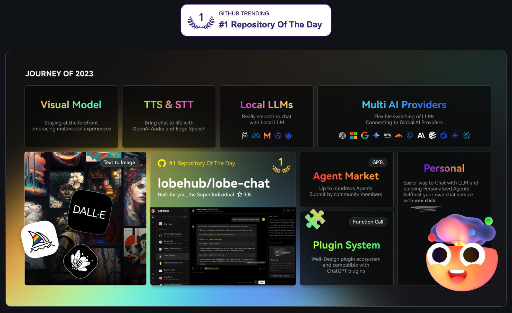
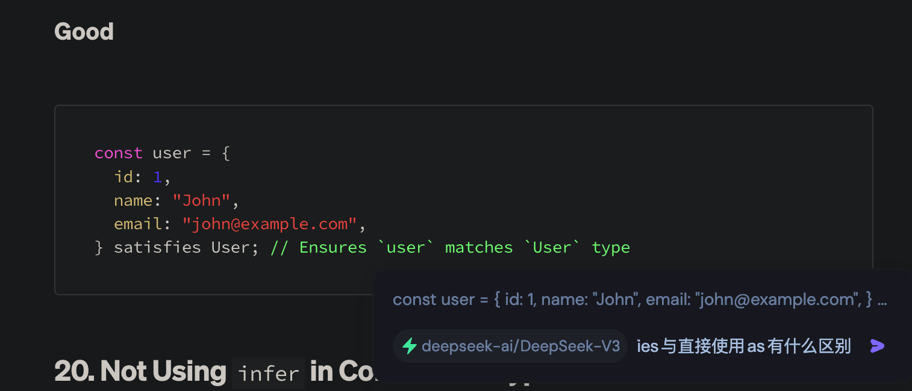
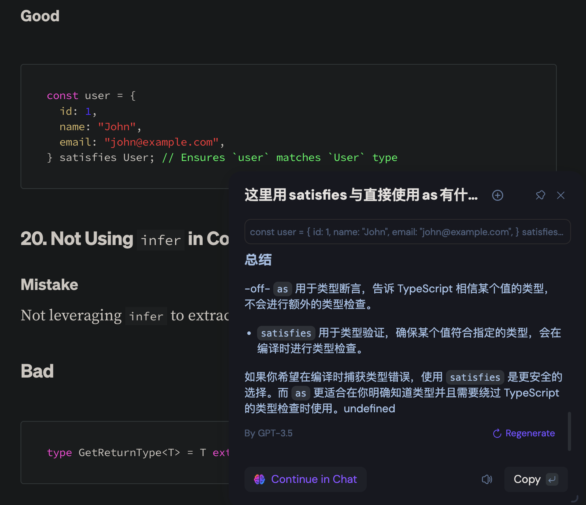
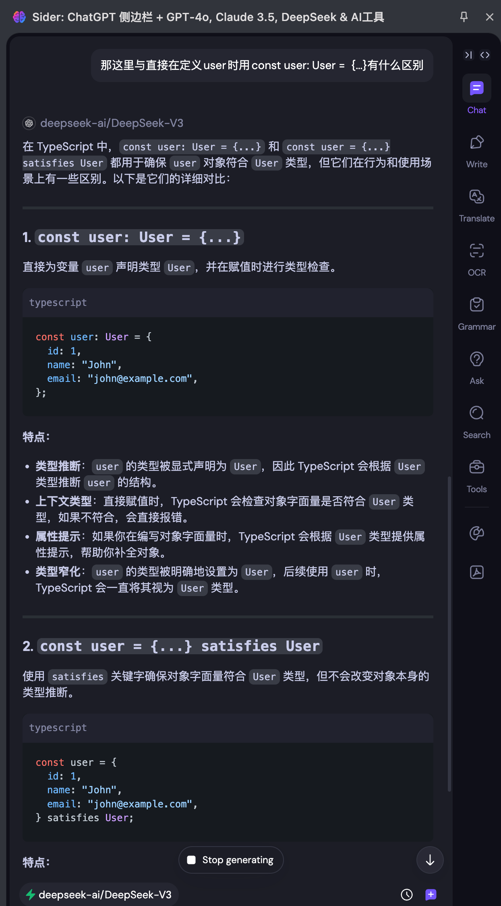
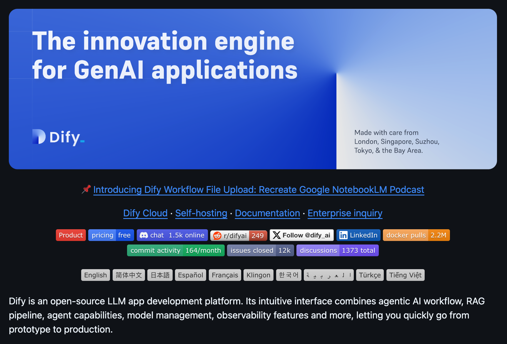

# AI工具应用

## 1. [ollama](https://ollama.com/)


注意事项：环境变量的设置

```bash
# 默认为127.0.0.1
export OLLAMA_HOST="0.0.0.0"
# 如果客户端为网页端，设置允许跨域请求
export OLLAMA_ORIGINS="*"
```

## 2. [Lobe Chat](https://github.com/lobehub/lobe-chat)



可视化界面方便使用各厂家的大模型

其它可选：Chatbox、Cherry Studio、AnythingLLM、Page Assist等

## 3. [SiliconFlow](https://cloud.siliconflow.cn/models)

提供多模型，支持API接入

## 4. [Qwen Chat](https://chat.qwenlm.ai/)

体验Qwen 2.5 MAX模型，据说评测超过DeepSeek

## 5. [Sider](https://sider.ai/)

作为chrome插件，效率神器







## 6. [Dify](https://github.com/langgenius/dify)

