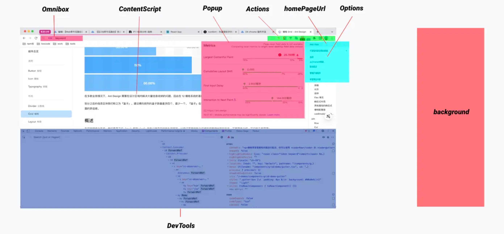

# Chrome Extension

## 一、工作机制

Chrome Extension涉及三个进程：

1. Browser Process

   与其它两个进程进行双向通信，更多是作为桥梁，实现Extension Process中各页面与Page Render Process中的`content_script.js`之间的消息通信

2. Extension Process

   - 通过`background.js`创建的`background.html`，当浏览器打开时，会自动加载插件的`background.js`文件，它独立于网页并且一直运行在后台，它主要通过调用浏览器提供的API和浏览器进行交互
   - `popup.html`是一个实实在在的页面，按需加载，当用户点击地址栏的按钮才会触发并弹出页面

3. Page Render Process

   当访问Web页面时，它会将`content_script.js`加载并注入到当前的网页环境中，它和网页中引入的javascript一样，可以操作当前页面的DOM Tree

## 二、可以做什么

插件能力概述：

|                          |                                                             | API                                                          | 备注 |
| ------------------------ | ----------------------------------------------------------- | ------------------------------------------------------------ | ---- |
| 自定义扩展用户界面       | 控制一个扩展的显示的图标                                    | [Action](https://link.juejin.cn?target=https%3A%2F%2Fdeveloper.chrome.com%2Fdocs%2Fextensions%2Freference%2Faction%2F) |      |
|                          | 添加触发操作的键盘快捷键                                    | [Commands](https://link.juejin.cn?target=https%3A%2F%2Fdeveloper.chrome.com%2Fdocs%2Fextensions%2Freference%2Fcommands%2F) |      |
|                          | 添加页面右键菜单                                            | [Context Menus](https://link.juejin.cn?target=https%3A%2F%2Fdeveloper.chrome.com%2Fdocs%2Fextensions%2Freference%2FcontextMenus%2F) |      |
|                          | 向地址栏添加关键字功能                                      | [Omnibox](https://link.juejin.cn?target=https%3A%2F%2Fdeveloper.chrome.com%2Fdocs%2Fextensions%2Freference%2Fomnibox%2F) |      |
|                          | 创建新标签卡、书签页或历史记录页                            | [Override Pages](https://link.juejin.cn?target=https%3A%2F%2Fdeveloper.chrome.com%2Fdocs%2Fextensions%2Fmv3%2Foverride%2F) |      |
|                          | 在工具栏中动态显示图标。                                    | [Page Actions](https://link.juejin.cn?target=https%3A%2F%2Fdeveloper.chrome.com%2Fdocs%2Fextensions%2Freference%2FpageAction%2F) |      |
| 构建扩展工具             | 无障碍扩展服务                                              | [Accessibility (a11y)](https://link.juejin.cn?target=https%3A%2F%2Fdeveloper.chrome.com%2Fdocs%2Fextensions%2Fmv3%2Fa11y%2F) |      |
|                          | 有趣的事情发生时，做出检测和反应                            | [Service Workers](https://link.juejin.cn?target=https%3A%2F%2Fdeveloper.chrome.com%2Fdocs%2Fextensions%2Fmv3%2Fmigrating_to_service_workers%2F) |      |
|                          | 使用语言和语言环境                                          | [Internationalization](https://link.juejin.cn?target=https%3A%2F%2Fdeveloper.chrome.com%2Fdocs%2Fextensions%2Freference%2Fi18n%2F) |      |
|                          | 获得OAuth2访问令牌                                          | [Identity](https://link.juejin.cn?target=https%3A%2F%2Fdeveloper.chrome.com%2Fdocs%2Fextensions%2Freference%2Fidentity%2F) |      |
|                          | 管理已安装和正在运行的扩展插件                              | [Management](https://link.juejin.cn?target=https%3A%2F%2Fdeveloper.chrome.com%2Fdocs%2Fextensions%2Freference%2Fmanagement%2F) |      |
|                          | 通过 Content Script 与其父扩展进行通信                      | [Message Passing](https://link.juejin.cn?target=https%3A%2F%2Fdeveloper.chrome.com%2Fdocs%2Fextensions%2Fmv3%2Fmessaging%2F) |      |
|                          | 让用户自定义扩展                                            | [Options Pages](https://link.juejin.cn?target=https%3A%2F%2Fdeveloper.chrome.com%2Fdocs%2Fextensions%2Fmv3%2Foptions%2F) |      |
|                          | 修改一个扩展的权限                                          | [Permissions](https://link.juejin.cn?target=https%3A%2F%2Fdeveloper.chrome.com%2Fdocs%2Fextensions%2Freference%2Fpermissions%2F) |      |
|                          | 存储和检索数据                                              | [Storage](https://link.juejin.cn?target=https%3A%2F%2Fdeveloper.chrome.com%2Fdocs%2Fextensions%2Freference%2Fstorage%2F) |      |
| 修改和监听 Chrome 浏览器 | 创建、组织和操作书签行为                                    | [Bookmarks](https://link.juejin.cn?target=https%3A%2F%2Fdeveloper.chrome.com%2Fdocs%2Fextensions%2Freference%2Fbookmarks%2F) |      |
|                          | 从用户的本地配置文件中删除浏览数据                          | [Browsing Data](https://link.juejin.cn?target=https%3A%2F%2Fdeveloper.chrome.com%2Fdocs%2Fextensions%2Freference%2FbrowsingData%2F) |      |
|                          | 以编程方式启动、监视、操作和搜索下载                        | [Downloads](https://link.juejin.cn?target=https%3A%2F%2Fdeveloper.chrome.com%2Fdocs%2Fextensions%2Freference%2Fdownloads%2F) |      |
|                          | 管理 Chrome 的字体设置                                      | [Font Settings](https://link.juejin.cn?target=https%3A%2F%2Fdeveloper.chrome.com%2Fdocs%2Fextensions%2Freference%2FfontSettings%2F) |      |
|                          | 与浏览器访问页面的记录交互                                  | [History](https://link.juejin.cn?target=https%3A%2F%2Fdeveloper.chrome.com%2Fdocs%2Fextensions%2Freference%2Fhistory%2F) |      |
|                          | 控制 Chrome 的隐私特性                                      | [Privacy](https://link.juejin.cn?target=https%3A%2F%2Fdeveloper.chrome.com%2Fdocs%2Fextensions%2Freference%2Fprivacy%2F) |      |
|                          | 管理 Chrome 的代理设置                                      | [Proxy](https://link.juejin.cn?target=https%3A%2F%2Fdeveloper.chrome.com%2Fdocs%2Fextensions%2Freference%2Fproxy%2F) |      |
|                          | 从浏览会话查询和还原选项卡和窗口                            | [Sessions](https://link.juejin.cn?target=https%3A%2F%2Fdeveloper.chrome.com%2Fdocs%2Fextensions%2Freference%2Fsessions%2F) |      |
|                          | 在浏览器中创建、修改和重新排列选项卡                        | [Tabs](https://link.juejin.cn?target=https%3A%2F%2Fdeveloper.chrome.com%2Fdocs%2Fextensions%2Freference%2Ftabs%2F) |      |
|                          | 访问用户访问次数最多的 URL                                  | [Top Sites](https://link.juejin.cn?target=https%3A%2F%2Fdeveloper.chrome.com%2Fdocs%2Fextensions%2Freference%2FtopSites%2F) |      |
|                          | 更改浏览器的整体外观                                        | [Themes](https://link.juejin.cn?target=https%3A%2F%2Fdeveloper.chrome.com%2Fdocs%2Fextensions%2Fmv3%2Fthemes%2F) |      |
|                          | 在浏览器中创建、修改和重新排列窗口                          | [Windows](https://link.juejin.cn?target=https%3A%2F%2Fdeveloper.chrome.com%2Fdocs%2Fextensions%2Freference%2Fwindows%2F) |      |
| 修改和监听网页           | 扩展临时访问当前活动选项卡的权限                            | [Active Tab](https://link.juejin.cn?target=https%3A%2F%2Fdeveloper.chrome.com%2Fdocs%2Fextensions%2Fmv3%2Fmanifest%2FactiveTab%2F) |      |
|                          | 自定义网站特性，如 cookies、 JavaScript 和插件              | [Content Settings](https://link.juejin.cn?target=https%3A%2F%2Fdeveloper.chrome.com%2Fdocs%2Fextensions%2Freference%2FcontentSettings%2F) |      |
|                          | 在网页上下文中运行 JavaScript 代码                          | [Content Scripts](https://link.juejin.cn?target=https%3A%2F%2Fdeveloper.chrome.com%2Fdocs%2Fextensions%2Fmv3%2Fcontent_scripts%2F) |      |
|                          | 浏览和修改浏览器的 Cookie 系统                              | [Cookies](https://link.juejin.cn?target=https%3A%2F%2Fdeveloper.chrome.com%2Fdocs%2Fextensions%2Freference%2Fcookies%2F) |      |
|                          | 使用 XMLHttpRequest 从远程服务器发送和接收数据              | [Cross-Origin XHR](https://link.juejin.cn?target=https%3A%2F%2Fdeveloper.chrome.com%2Fdocs%2Fextensions%2Fmv3%2Fxhr%2F) |      |
|                          | 在不需要许可的情况下对页面内容执行操作                      | [Declarative Content](https://link.juejin.cn?target=https%3A%2F%2Fdeveloper.chrome.com%2Fdocs%2Fextensions%2Freference%2FdeclarativeContent%2F) |      |
|                          | 捕获屏幕、单个窗口或选项卡的内容                            | [Desktop Capture](https://link.juejin.cn?target=https%3A%2F%2Fdeveloper.chrome.com%2Fdocs%2Fextensions%2Freference%2FdesktopCapture%2F) |      |
|                          | 将选项卡的源信息保存为 MHTML                                | [Page Capture](https://link.juejin.cn?target=https%3A%2F%2Fdeveloper.chrome.com%2Fdocs%2Fextensions%2Freference%2FpageCapture%2F) |      |
|                          | 与标签页互动媒体流交互                                      | [Tab Capture](https://link.juejin.cn?target=https%3A%2F%2Fdeveloper.chrome.com%2Fdocs%2Fextensions%2Freference%2FtabCapture%2F) |      |
|                          | 接收 in-flight 导航请求状态的通知                           | [Web Navigation](https://link.juejin.cn?target=https%3A%2F%2Fdeveloper.chrome.com%2Fdocs%2Fextensions%2Freference%2FwebNavigation%2F) |      |
|                          | 提供规则告诉 Chrome 如何拦截、阻止或修改 in-flight 的请求。 | [Declarative Net Request](https://link.juejin.cn?target=https%3A%2F%2Fdeveloper.chrome.com%2Fdocs%2Fextensions%2Freference%2FdeclarativeNetRequest%2F) |      |
| 打包、部署和更新         | 使用 Chrome Web Store 托管和更新扩展                        | [Chrome Web Store](https://link.juejin.cn?target=https%3A%2F%2Fdeveloper.chrome.com%2Fdocs%2Fextensions%2Fmv3%2Fhosting%2F) |      |
|                          | 在指定的网络或其他软件上分发扩展                            | [Other Deployment Options](https://link.juejin.cn?target=https%3A%2F%2Fdeveloper.chrome.com%2Fdocs%2Fextensions%2Fmv3%2Fexternal_extensions%2F) |      |
| 扩展 Chrome DevTools     | 测试网络交互，调试 JavaScript，修改 DOM 和 CSS              | [Debugger](https://link.juejin.cn?target=https%3A%2F%2Fdeveloper.chrome.com%2Fdocs%2Fextensions%2Freference%2Fdebugger%2F) |      |
|                          | 为 Chrome 开发工具添加功能                                  | [Devtools](https://link.juejin.cn?target=https%3A%2F%2Fdeveloper.chrome.com%2Fdocs%2Fextensions%2Fmv3%2Fdevtools%2F) |      |

## 三、主要构成



### 3.1 manifest v3

[官网](https://developer.chrome.com/docs/extensions/reference/manifest)

### 3.2 popup.html

### 3.3 content-scripts

`content-script`不能访问页面中的js，但可以操作DOM，但DOM不能调用它，所以通常的做法是通过操作DOM来往页面中动态注入js文件：

```js
function injectJs(jsPath) {
  jsPath = jsPath || 'injectScript.bundle.js';
  var temp = document.createElement('script');
  temp.setAttribute('type', 'text/javascript');
  // chrome-extension://mapfodeofmlldcgdgahpjiefememgeei/injectScript.bundle.js
  temp.src = chrome.runtime.getURL(jsPath);
  temp.onload = function () {
    // 放在页面不好看，执行完后移除掉
    this.parentNode?.removeChild(this);
  };
  document.head.appendChild(temp);
}
```

注入的这个js文件必须在`manifest.json`中声明

```json
"web_accessible_resources": [
  {
    "resources": [
      "injectScript.bundle.js",
    ],
    "matches": [
      "http://*/*",
      "https://*/*",
      "<all_urls>"
    ]
  }
]
```

### 3.4 background

插件是基于事件的用来修改或增强 Chrome 浏览体验的程序。事件是浏览器触发的，例如导航到新页、删除书签或关闭选项卡。插件在 background 中监视这些事件，然后根据指定的指令进行响应。
background 一旦加载完成，只要执行某个操作（比如发起网络请求或调用 Chrome API）就会一直运行，此外，在关闭所有可见视图和所有消息端口之前，不会被卸载


## 参考

- [chrome 插件开发指南（Manifest V3）](https://juejin.cn/post/7173567493871501325)
- 