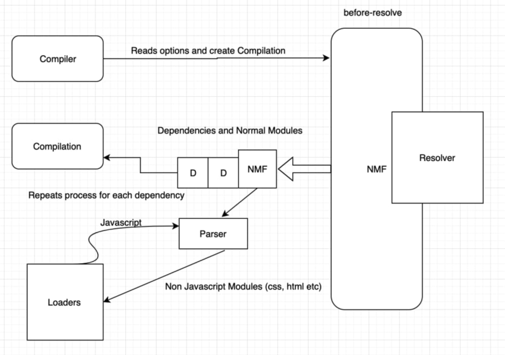

# Module Federation

Same idea as Apollo GraphQL federation

## Webpack Base

1. **Compiler** - It is the central dispatch, it's kind of start or stop which delegates the top level events that are happening when webpack runs or finishes and it gets exposed.
2. **Compilation** - It creates and runs the dependancy graph algorithm and works as the brain behind the webpack about what it does and what happens inside the compilation.
3. **Resolver** - It justifies the term with what work it does, it majorly helps in finding files and dependencies like for example your `index.js` has imports specified with partial path or any other dependencies, resolver helps in finding the file from the information of partial file path import and build dependency graph.
4. **Module Factory** - It takes the resolved request and collects source of that file and returns Module Object.
5. **Parser** - It converts the raw source code into an AST such that it can be easily traversed. It starts by finding all require, imports and creates dependency object out of it.
6. **Template** - It is responsible for binding data for your modules and creates code that we see in the bundle.



### Whole process

Webpack first reads the entry point and it go through resolver to verify that it exists or not. After that it goes through our normal module object that will pass through parser. Once the parser identifies the dependency type it passes it to loader if it is a non Javascript module whereas it simply collects dependencies and attach to the modules if it is a Javascript module. We have to then again check for dependencies that exists in the module and pass it through resolver, after this the entire cycle repeats until the complete dependency graph is build.

### Plugin System

#### class signature

```javascript
class xxxPlugin {
  constructor(options) {
    this.options = options;
  }
  apply(compiler) {
    // ...
    // tap hooks and process, for example
    compiler.hooks.done.tap("MyFirstWebpackPlugin", (stats) => {
      // here the stats will show a large object with every possible detail about the compilation and the file available for the hook
      console.log("stats", stats);
    });
  }
}

module.export = xxxPlugin;
```

#### Tapable Instance Hooks

##### Compiler Hooks

the compiler module is the main engine that creates compilation instance with all options passed to it, most of the user facing plugins are first registered on compiler.

- run
- emit
- beforeRun 
- [man other](https://webpack.js.org/api/compiler-hooks/)

##### Compilation Hooks

Compilation helps in **loading**, **sealing**, **optimising**, **chunking**, **hashing** and **restoring the modules**, it also extends Tapable and provieds lifecycle hooks. it can be used to change modules before the module is build, rebuild or after successful built of module [etc](https://webpack.js.org/api/compilation-hooks/)

##### JavaScript Parser Hooks

JavaScript Parser Hooks which is **used to parse each module processed by webpack**, you can use custom plugin to enhance the parsing process. You can find more about the Parser hooks [here](https://webpack.js.org/api/parser/)

#### Demo

https://github.com/Jasmin2895/extension-build-webpack-plugin

### Build modules with dependency graph

- directed acyclic graph

  dependency graph is a directed acyclic graph

- topological sorting

  [algorithem description](https://dev.to/jasmin/how-dependancy-graph-in-webpack-resolve-module-dependency-5ej4)


## Terminology

- **Host**: a Webpack build that is initialized first during a page load (when the onLoad event is triggered)
- **Remote**: another Webpack build, where part of it is being consumed by a "host"
- **Bidirectional-hosts**: when a bundle or Webpack build can work as a host or as a remote. Either consuming other applications or being consumed by others -- at runtime
- **Omnidirectional-hosts**: hosts themselves don't know if they are host or remote on startup. This enables webpack to change out the hosts own vendors with ones based on semver rules. Allowing multiple versions when needed.

**Through the `shared` option — remotes will depend on host dependencies, if the host does not have a dependency, the remote will download its own. No code duplication, but built-in redundancy**

