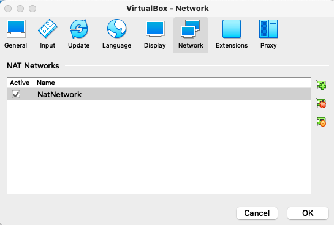
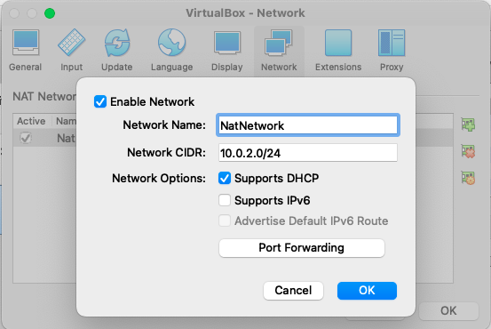
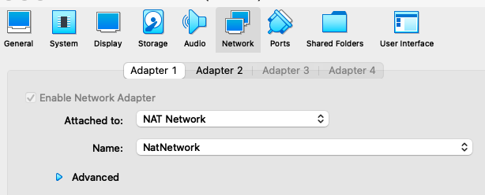
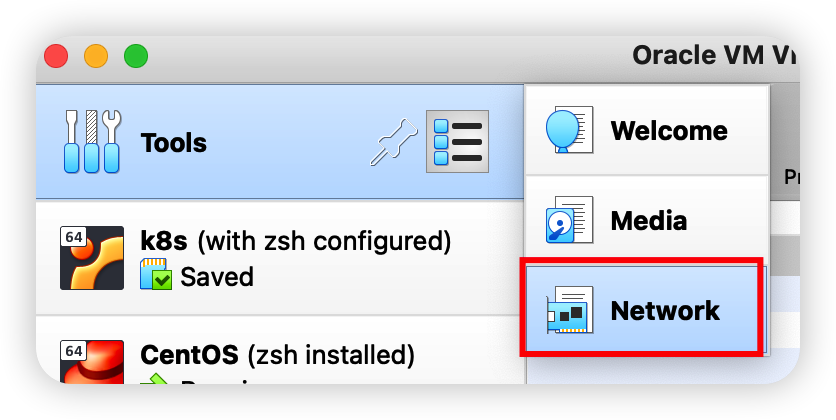
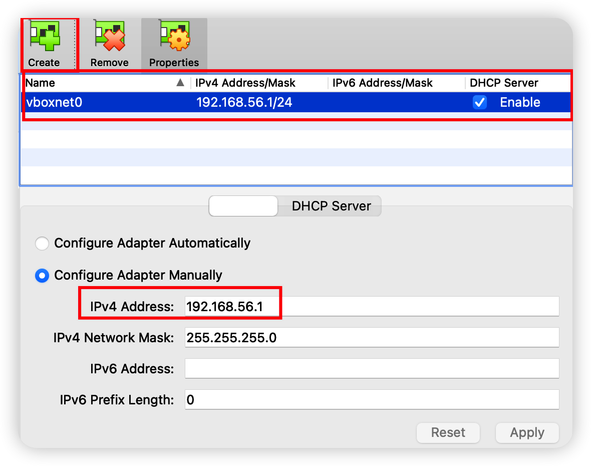
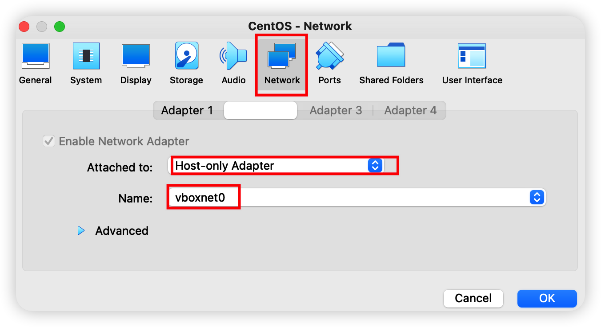
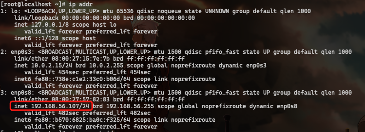

# CentOS 7虚拟机研发环境搭建

## 零、环境说明

- Host OS：MacOS 12
- VirtualBox Version：6.1

## 一、安装CentOS 7

这里唯一要注意的就是最好在安装过程中将网络功能打开，因为我安装的minimal版本，只有命令行界面，如果安装时没有打开网络功能，后面就需要通过命令行的方式来开启

## 二、虚拟机网络配置

### 1. NatNetwork配置

Guest OS安装完之后，默认网络配置是`NAT`，这种网络模式下Guest OS可以通过Host OS来访问公网，正常情况下满足需求，但我的场景是需要模拟多台Guest OS之间网络通信，所以后续会搭建其它的Guest OS，并且要求它们之间能通信，最适合的网络模式就是NatNetwork了，[这里](https://www.nakivo.com/blog/virtualbox-network-setting-guide/)有更多关于网络模式的介绍

`NatNetwork`的配置如下：

- 打开`Preferences`面板，找到`Network`Tab页，点击右侧的“添加”图标添加一个`NatNetwork`

  

- 点击“设置”图标开启DHCP

  

- 打开所安装虚拟机的设置面板，切换到`Network`Tab页，`Adapter 1`配置为如下即可

  

### 2. Host-only-Adapter配置

为了使Host OS能访问Guest OS，比如ssh的场景，需要添加一个Host-only-Adapter，方法如下：

- 点击`Tools`右侧的设置选项，打开`Network`Tab页

  

- 点击`create`添加一块网络，如下配置

  

- 修改虚拟机的网络配置，在`Adapter 2`中配置上刚才添加的网卡

  

- 启动虚拟机，就可以看到该网络，并可以通过此ip地址通过ssh访问Guest OS

  

### 3. 开启iptables

CentOS 7默认的防火墙不是`iptables`，而是`firewall`，目前我们还是学习`iptables`，所以这里要做些修改

```bash
# 停止firewall服务
systemctl stop firewalld.service
# 禁止开机启动
systemctl disable firewalld.service
# 安装iptables
yum install -y iptables
```

## ~~三、配置清华大学镜像源~~

具体可以参见[这里](https://mirrors.tuna.tsinghua.edu.cn/help/centos/)

```bash
# 备份
cp -r /etc/yum.repos.d /etc/yum.repos.d.bak
# 替换为镜像源
sed -e 's|^mirrorlist=|#mirrorlist=|g' \
         -e 's|^#baseurl=http://mirror.centos.org|baseurl=https://mirrors.tuna.tsinghua.edu.cn|g' \
         -i.bak \
         /etc/yum.repos.d/CentOS-*.repo
# 更新缓存
sudo yum makecache
```


## 四、zsh配置

为了方便后续的安装，先配置一下临时的网络代理来通过Host OS的代理来访问外网（注意Host OS的ip地址固定为：`10.0.2.2`），后续会将此功能配置到zsh中

```bash
export https_proxy=http://10.0.2.2:7890 http_proxy=http://10.0.2.2:7890 all_proxy=socks5://10.0.2.2:7890
```

### 0. 前置 依赖

```bash
yum -y install https://packages.endpointdev.com/rhel/7/os/x86_64/endpoint-repo.x86_64.rpm
yum -y install epel-release
yum groupinstall "Development Tools"
yum -y install wget git vim tcpdump mlocate
```

### 1. 安装zsh

```bash
# 安装
yum update && yum -y install zsh
# 修改默认shell
chsh -s $(which zsh)
# 登出后再登录，然后查看zsh是不是默认shell，如果输出为/usr/bin/zsh则表示成功
echo $SHELL
```

### 2. 安装oh-my-zsh

```bash
sh -c "$(wget -O- https://raw.githubusercontent.com/ohmyzsh/ohmyzsh/master/tools/install.sh)"
```

### 3. 安装zsh-powerline-theme

```bash
cd /home
git clone https://github.com/jeremyFreeAgent/oh-my-zsh-powerline-theme.git
cd oh-my-zsh-powerline-theme
./install_in_omz.sh
```

### 4. 安装zsh-syntax-highlighting

```bash
git clone https://github.com/zsh-users/zsh-syntax-highlighting.git ${ZSH_CUSTOM:-~/.oh-my-zsh/custom}/plugins/zsh-syntax-highlighting
```

### 5. 安装zsh-autosuggestions

```bash
git clone https://github.com/zsh-users/zsh-autosuggestions ${ZSH_CUSTOM:-~/.oh-my-zsh/custom}/plugins/zsh-autosuggestions
```

### 6. 安装auto-jump

```bash
yum install -y autojump-zsh
```

### 7. 激活插件

```bash
vim ~/.zshrc
```

添加如下内容：

```shell
ZSH_THEME="powerline"
POWERLINE_RIGHT_A="mixed"
POWERLINE_HIDE_USER_NAME="true"
POWERLINE_PATH="short"
POWERLINE_SHORT_HOST_NAME="true"
POWERLINE_RIGHT_A="exit-status"
HIST_STAMPS="yyyy-mm-dd"

plugins=(git zsh-syntax-highlighting zsh-autosuggestions colored-man-pages command-not-found autojump)

export HOST_IP="10.0.2.2"
alias setproxy="export https_proxy=http://$HOST_IP:7890 http_proxy=http://$HOST_IP:7890 all_proxy=socks5://$HOST_IP:7890"
alias unsetproxy="unset https_proxy http_proxy all_proxy"
```

```bash
source ~/.zshrc
```


 

