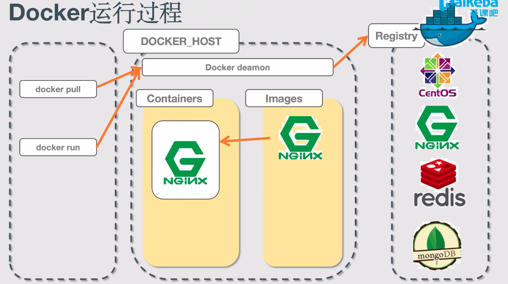

# Docker 学习

## 一、常用命令

```bash
# 拉取官方镜像 - 这里以nginx为例
docker pull nginx
# 查看
docker images nginx
# 启动镜像 -p代表端口映射-实体机端口:虚拟器目录 -v目录映射-实体机目录:虚拟机目录 -d表示后台启动
docker run -p 8000:80 -v $PWD/www:/usr/share/nginx/html -d nginx
# 查看进程
docker ps
# 查看所有进程，包括已停止的容器
docker ps -a
# 伪终端
docker exec -t 容器id /bin/bash
# 停止镜像，容器id可以通过ps命令查看
docker stop 容器id的前3位
# 删除镜像，容器必须先停止才能删除
docker rm nginx
```

## 二、Docker运行过程



## 三、docker File

```dockerfile
FROM node:10-alphine
ADD . /app/
WORKDIR /app
RUN npm install
EXPOSE 3000
CMD ["node", "app.js"]
```

```bash
docker build -t mynode .
```

```bash
docker run -p 3000:3000 mynode
```

## 四、docker-compose

以配置文件的方式实现多个docker容器的编排

```yml
# docer-compose.yml
versrion: '3.1'
services:
  mongo:
  	image: mongo
  	# 如果死机会不会自动重启
  	restart: always
  	ports:
  		- 27017:27017
  mongo-express:
  	image: mongo-express
  	restart: always
  	ports:
  		- 8000:8081

```

```bash
docker-compose up
```

