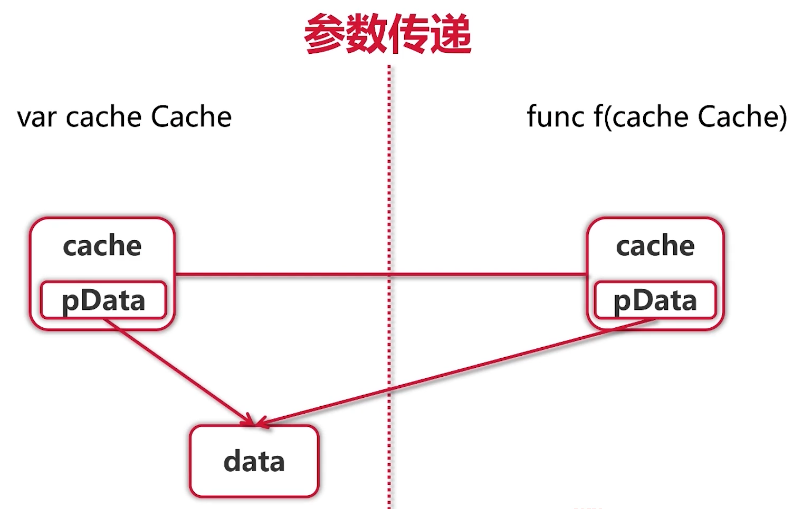
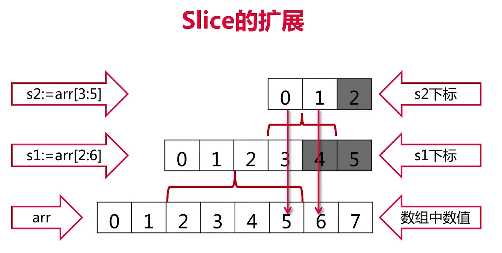
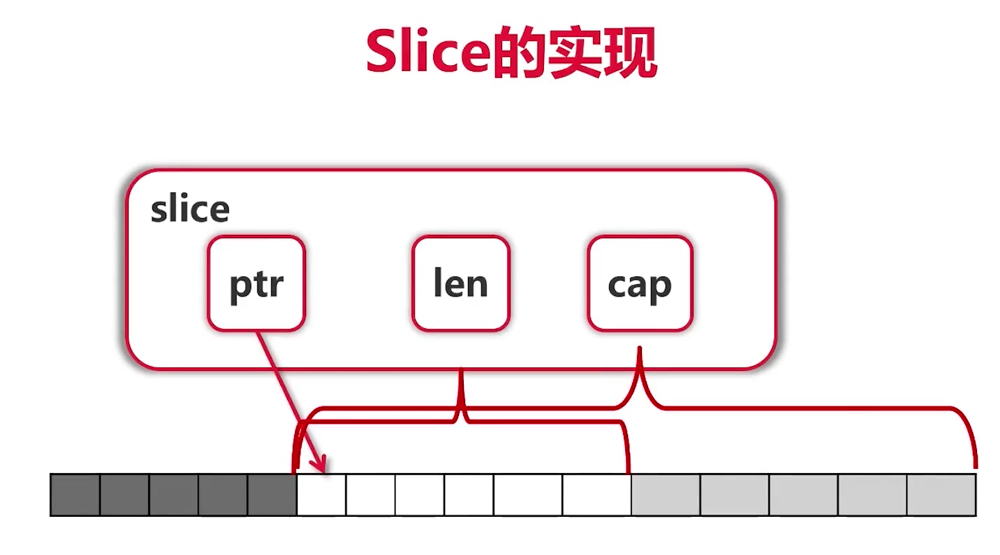

# go 学习

## 一、环境变量配置

### GOPATH

用于指定开发工作区，存放源代码、测试文件、库静态文件、可执行文件的目录，linux和macOS，默认为$home/go

在go 1.11版本之后，使用go mod来管理依赖包，不再强制必须把代码写在GOPATH/src目录下，所以默认即可，可不修改

### GOPROXY

默认的配置在国内访问不了，所以需要使用一个PROXY，推荐使用

1. https://goproxy.io
2. https://goproxy.cn

### GOROOT

Go语言的安装目录，当系统中存在多个Go SDK时，可以通过设置这个环境变量，在不同的Go SDK版本之间切换

### GOBIN

表示程序编译后二进制命令的安装目录，一般设置为GOPATH/bin

## 修改环境变量

 通过命令`go env -w $key=$val`的形式，比如：

```bash
go env -w GO111MODULE=on
go env -w GOPROXY=https://goproxy.io,direct
```

### 查看Go SDK环境变量状态

```bash
go env
```

## 二、常用命令

```go
// main.go
package main

import "fmt"

func main() {
  var msg string = "Hello World!!"
  fmt.Println(msg)
}
```

### 1. build

```bash
# 构建
go build main.go
# 运行
./main
```

### 2. run

```bash
# 直接运行
go run xxx.go
```

## 三、语法基础

### 3.1 变量声明

```go
// 格式：var关键字 变量名 变量类型 [= 初始值]
var a string
var b bool = true
var c int = 32

// 自动推断类型
var a = "hello"
var b = true
var c = 32

// 声明+初始化的省略写法，注意这种写法只能在函数中使用，不能写到最外层
a := "hello"
b := true
c := 32

// 单行声明变量
var a, b, c = "hello", true, 32
// 或
a, b, c := "hello", true, 32


// 函数外声明的变量并不是全局变量，而是作为包的变量，注意：此时不能使用:=的声明同时赋值的写法
var aa = 32
var bb = true
var cc string

func main() {
	cc = "hello"
	fmt.Println(aa, bb, cc)
}

//通过 var()语法申明多个变量
var (
	aa = 32
	bb = true
	cc string
)
```

### 3.2 变量类型

- bool, string

- (u)int, (u)int8, (u)int16, (u)int32, (u)int64, uintptr

  - (u)int表示不规定长度，由操作系统决定，在32位系统中就是32位，在64位系统中就是64位
  - uintptr是指针类型，长度也是由操作系统决定

- byte, rune

  - rune即为字符类型，4字节，与传统语言中的char不同，由于当今的多语言应用，一个字符不一定就是一个字节，会有双字节或三字节（比如utf8中就有三字节的字符）

- float32, float64, complex64, complex128

  - complex即为复数，复数为分实部与虚部，complex64的实部与虚部为float32，complex128的实部与虚部分别是float64
  - go语言中`4+3i`这样表示的就是一个复数，但当表示`4+i`时，go语言会认为`i`是一个变量，这个时候写成`4+1i`时，go就可以识别出来这是在表示一个复数

### 3.3 强制类型转换

go语言中只有强制类型转换，没有隐式类型转换，所以有如下代码：

```go
func trangle() {
  var a, b int = 3, 4
	var c int
  // 入参强制转换成float64，出参强制转换成int
	c = int(math.Sqrt(float64(a*a + b*b)))
	fmt.Println(c)
}
```

### 3.4 常量

常量在go语言中可以作为各种类型使用（当然指定类型也是可以的），就像是在编译的时候进行了替换，所以对于上面的代码，如果使用常量，对于入参就不用进行强制类型转换

```go
func trangle() {
  const a, b = 3, 4
	var c int
  // 这里如果不指定a,b的类型，则不用进行强制类型转换
	c = int(math.Sqrt(a*a + b*b))
	fmt.Println(c)
}
```

**注意，go语言中常量并没有大写，因为在go语言中首字母大写代表public，有特殊涵义，后续会讲解到**

### 3.5 枚举

go语言由的枚举也是通过const块来定义，比如：

```go
// 普通方式
const (
		cpp        = 1
		python     = 2
		java       = 3
		javascript = 4
)

// 步长方式，各枚举值依次为：0 1 2 3
const (
		cpp = iota
		python
		java
		javascript
)

// 步长+跳过某个值的方式，各枚举值依次为：0 2 3 4
const (
	cpp = iota
	_
	python
	java
	javascript
)

// 步长表达式的方式，各枚举值依次为：1 1024 1048576 1073741824 1099511627776
const (
	b = 1 << (10 * iota)
	kb
	mb
	gb
	tb
)
```

### 3.6 条件语句

go语言中，if的条件不需要使用括号

```go
const filename = "abc.txt"
// go语言中是可以返回多个值的
contents, err := ioutil.ReadFile(filename)
if err != nil {
	fmt.Println(err)
} else {
	fmt.Printf("%s\n", contents)
}

// 简写方式
const filename = "abc.txt"
// if的条件里可以有赋值语句，此时contents, err是在if中定义的，作用域仅在if语句中生效
if contents, err := ioutil.ReadFile(filename); err != nil {
	fmt.Println(err)
} else {
	fmt.Printf("%s\n", contents)
}
```

### 3.7 switch

go语言中，switch会自动break，除非使用fallthrough

```go
func grade(score int) string {
	g := ""
	switch {
	case score < 60:
		g = "E"
    // 比如score为59，没有fallthrough时，返回E，但显式使用了fallthrough后，会走到下一个case，返回D
    fallthrough
	case score < 70:
		g = "D"
	case score < 80:
		g = "C"
	case score < 90:
		g = "B"
	case score <= 100:
		g = "A"
	default:
		panic(fmt.Sprintf("Wrong score: %d", score))
	}
	return g
}
```

- switch之后可以没有表达式
- switch会自动break，除非显式使用`fallthrouth`

### 3.8 循环

go语言中，for的条件不需要括号，初始条件、递增表达式、结束条件都可以不写

go语言中没有`while`

```go
func convetToBin(n int) string {
	result := ""
  // 这里省略了初始条件
	for ; n > 0; n /= 2 {
		lsb := n % 2
		result = strconv.Itoa(lsb) + result
	}
	return result
}

// 只有结束条件时
func printFile(filename string) {
	file, err := os.Open(filename)
	if err != nil {
		panic(err)
	}
	scanner := bufio.NewScanner(file)
  // 这里没有初始条件，也没有递增条件
	for scanner.Scan() {
		fmt.Println(scanner.Text())
	}
}

// 无限循环
func forever() {
  for {
    fmt.Println("abc")
  }
}
```

### 3.9、函数

- func关键字定义函数

- 返回多个值

  - 函数定义时可以指定多个返回值的名称，此时return时可以省略返回时，比如：

    ```go
    func div(a, b int) (q, r int) {
    	q = a / b
    	r = a % b
    	// 注意这里，但这种方式不适合函数体内容比较长的场景
      return
    }

    func main() {
      // 这里在goland中，可以使用快捷键：`cmd+alt+v`自动补全添加变量q,r的声明及赋值
      q, r := div(13, 3)
    	fmt.Println(q, r)
    }
    ```

  - 对于返回的多个值时，某个值不想使用时，可使用"_"来占位

- go语言中，函数是一等公民（类似javascript），可以用函数式编辑的思想

  ```go
  func pow(a, b int) int {
  	return int(math.Pow(float64(a), float64(b)))
  }

  func apply(op func(int, int) int, a, b int) int {
  	p := reflect.ValueOf(op).Pointer()
  	opName := runtime.FuncForPC(p).Name()
  	fmt.Printf("Calling function %s with args (%d, %d)\n", opName, a, b)
  	return op(a, b)
  }

  func main() {
    fmt.Println(apply(pow, 3, 4))
  }

  // 或者直接使用内联的方式
  func main() {
    fmt.Println(apply(func(a, b int) int {
  		return a + b
  	}, 3, 4))
  }
  ```

- 可变参数列表

  ```go
  // 多个参数的求和
  func sum(numbers ...int) int {
  	s := 0
    // 关于range的使用后续会提及
  	for i := range numbers {
  		s += numbers[i]
  	}
  	return s
  }
  ```

### 3.10、指针

go语言中的指针不能运算，比如说不能对一个指针进行加1这样的操作（不能类型的指针，+1操作会涉及所指向类型的size，导致这种操作比较复杂）

**go语言只有值传递一种方式，性能会下降？解决方式就是传递指针**

- 值类型的指针传递

  ```go
  func swap(a, b *int) {
  	*b, *a = *a, *b
  }

  func main() {
    a, b := 3, 4
  	swap(&a, &b)
  	fmt.Println(a, b)
  }
  ```

- 对于对象的传递（对象后续会提及），需要在定义对象时就要考虑它的使用场景，因为对象也会使用值传递的方式进行拷贝，如果对象中有很多内容，那拷贝操作显然是会降低性能的，但如果对象中只包括一个指针，指针指向的才是正确的数据，那这个对象的拷贝，其实只是拷贝了一个指针，也就不会影响性能了

  

## 四、内建容器

### 4.1 数组

- 定义数组

  ```go
  // 定义有5个元素的数组，输出：[0 0 0 0 0]
  var arr1 [5]int
  // 定义有3个元素的数组，并设置初始值，输出：[1 3 5]
  arr2 := [3]int{1, 3, 5}
  // 不指定长度，根据初始值来自动获取长度，输出：[2 4 6 8]
  arr3 := [...]int{2, 4, 6, 8}
  // 定义二维数组，输出：[[0 0 0 0 0] [0 0 0 0 0] [0 0 0 0 0] [0 0 0 0 0]]
  var grid [4][5]int
  ```

- 遍历数组

  ```go
  // 通常的for循环数组长度来遍历
  for i := 0; i < len(arr3); i++ {
  	fmt.Println(arr3[i])
  }

  // 使用range关键字，可以获取数据的下标及对应位置的值
  for i, v := range arr3 {
  	fmt.Println(i, v)
  }
  ```

- **数组是值类型，也就是说作为参数时会拷贝数组，所以go语言中一般不直接使用数组**

### 4.2 Slice（切片）

```go
arr := [...]int{0, 1, 2, 3, 4, 5, 6, 7}
// 输出下标从2开始到6结束（不包括6）的元素，即：[2，3，4，5]
fmt.Println("arr[2:6] =", arr[2:6])
// 从开始到下标6（不包括6），即：[0 1 2 3 4 5]
fmt.Println("arr[:6] =", arr[:6])
// 从下标2开始到最后，即：[2 3 4 5 6 7]
fmt.Println("arr[2:] =", arr[2:])
// 从开始到结束，即： [0 1 2 3 4 5 6 7]
fmt.Println("arr[:] =", arr[:])
```

**slice是引用类型，它本身是没有数据的，它是数组的一个视图（view），所以如果需要修改数组中的元素，但不想直接拷贝数组时就可以使用slice**

```go
func modifyArr(arr []int) {
	for i := range arr {
		arr[i] = arr[i] + 2
	}
}

func main() {
  arr := [...]int{0, 1, 2, 3, 4, 5, 6, 7}
	// 打印原始数组
  fmt.Println(arr)
  // 传递数组的切片，并进行修改
	modifyArr(arr[:])
  // 打印修改后的数组
	fmt.Println(arr)
}

```

**slice之上还可以建立slice，称为reslice，但它们所指向的数据都是原数组中的数据，但这样要注意关于slice扩展**

```go

arr := [...]int{0, 1, 2, 3, 4, 5, 6, 7}
// reslice，对切片再做切片
s1 := arr[2:6]
s2 := s1[:2]
// [2 3 4 5]
fmt.Println(s1)
// [2 3]
fmt.Println(s2)

// 但如果是下面这种
arr := [...]int{0, 1, 2, 3, 4, 5, 6, 7}
s1 := arr[2:6]
s2 := s1[3:5]
// [2 3 4 5]
fmt.Println(s1)
// [5 6]，但6并不在s1中，直接访问s1[4]是会报错的
fmt.Println(s2)
```

 **这里就涉及到了slice的扩展，原理如下两张图**





- ptr指向slice开始的地方
- len告诉slice的长度时多少，用来限制方括号取值，只能取到len内的值，可以通过`len(s)`拿到该值
- cap，代表了从ptr开始到数组的整个长度，可以通过`cap(s)`拿到该值，**所以在slice扩展时，只要不超过cap，都是可以执行的**
- 因为这种设计，slice是可以向后扩展，但不可以向前扩展
- PS：当使用格式化输入切片时，可以使用`%v`占位符

**关于对slice的追加操作：`append方法`**：

- 添加元素时，如果超越cap，系统会重新分配更大的底层数组，并将原来的元素拷贝过去
- 由于值传递的关系，必须接收append的返回值，因为append会改变slice的len（可能也会改变cap），因此要接收这个新的slice，即`s = append(s, val)`

**创建slice，以及对slice进行操作后，slice的len与cap是如何变化的？**

```go
func main() {
  // 创建slice，go语言中存在称为zero value的东西，而slice的zero value就是nil
	var s []int

	for i := 0; i < 100; i++ {
		printSlice(s)
		s = append(s, 2*i+1)
	}
	fmt.Println(s)
}

func printSlice(s []int) {
  // 通过这里可以发现，当slice的cap满时，会自动增加至原来的2倍，这也反应了slice底层所对应的数组的变化
	fmt.Printf("%v, len=%d, cap=%d\n", s, len(s), cap(s))
}

// 其它创建slice的方法
// 1. 指定初始值
s1 := []int{2, 4, 6, 8}
// 2. 指定len
s2 := make([]int, 16)
// 3. 指定len和cap
s3 := make([]int, 16, 32)
```

**复制slice**

```go
s1 := []int{2, 4, 6, 8}
s2 := make([]int, 16)
copy(s2, s1)
// 输出：[2 4 6 8 0 0 0 0 0 0 0 0 0 0 0 0], len=16, cap=16
printSlice(s2)
```

**删除slice**

```go
// 基于上一步，将s2中下标为3的8给删掉
// 注意这里的`s2[4:]...`，append支持可变参数，`s2[4:]...`这里的`...`，就是将数组形式转换成逗号分隔形式，与javascript中的`...`操作符效果一样，只是位置不同
s2 = append(s2[:3], s2[4:]...)
// 输出：[2 4 6 0 0 0 0 0 0 0 0 0 0 0 0], len=15, cap=16
printSlice(s2)
```

### 4.3 Map

```go
// map的创建
// 1.指定key的类型与value的类型，并初始化
m1 := map[string]string{
	"name":   "ccmouse",
	"course": "golan",
}
// 2. 通过make
m2 := make(map[string]int)
// 3. 声明但不初始化
var m3 map[string]int

fmt.Println(m1, m2, m3)

// map的遍历，注意，**输出是无序的**
for k, v := range m1 {
	fmt.Println(k, v)
}

// 对于m1，key不存在时，获取的值是空串，准确说获取到的是类型的初始值，因为这里是字符串类型，所以初始值是空串
courseName := m1["caurse"]
// 这里输出的是空串，并不会报错
fmt.Println(courseName)

// 如果要判断key存不存在，可以用如下方法
if courseName, ok := m1["caurse"]; ok {
	fmt.Println(courseName)
} else {
	fmt.Println("key does not exist!")
}

// 删除map中的key
delete(m1, "name")
```

- map遍历时是无序的，如果需要保证顺序，则必须手动将key放到slice中进行排序，然后再遍历
- 通过len函数获取map中元素的个数
- map使用哈希表，必须可以比较相等
- 除了slice, map, function之外的内建类型都可以作为key
- Struct类型不包含上述字段（编译时检查），也可以作为key

### 4.4 rune

用于多语言场景下处理字符，下面的例子可以说明rune的使用场景

```go
s := "Yes我爱中国!"
fmt.Println(len(s))
```

这里输出的长度是17，为什么是17呢，我们换一种方式输出就能明白

```go
s := "Yes我爱中国!"
for _, b := range []byte(s) {
	fmt.Printf("%X ", b)
}
// 输出内容为：59 65 73 E6 88 91 E7 88 B1 E4 B8 AD E5 9B BD 21
// 刚好是18个，这是涉及到utf-8编码，其中的英文字母及最后的英文标识，占4个字节，中文每个占3字节，总共就是17字节
```

再看下面这一段代码

```go
s := "Yes我爱中国!"
for i, ch := range s {
	fmt.Printf("(%d, %X) ", i, ch)
}
// 输出内容：(0, 59) (1, 65) (2, 73) (3, 6211) (6, 7231) (9, 4E2D) (12, 56FD) (15, 21)
// 注意这里从第4个位置开始，索引号和输出的字符都不再是1字节，因为rune只是int32的别名，将原本的3字节表示的中文字符转成了unicode编码

// 关于utf8和rune的更多示例
// 1. 获取长度，输出：Rune count: 8
fmt.Println("Rune count:", utf8.RuneCountInString(s))
// 2. 打印具体的字符
bytes := []byte(s)
for len(bytes) > 0 {
	ch, size := utf8.DecodeRune(bytes)
	bytes = bytes[size:]
  // 输出：Y e s 我 爱 中 国 !
	fmt.Printf("%c ", ch)
}
// 3. 使用rune来遍历，不过这里每一个字符变成了rune类型，也就是说是int32，占4个字节
// 输出：(0, Y) (1, e) (2, s) (3, 我) (4, 爱) (5, 中) (6, 国) (7, !)
for i, ch := range []rune(s) {
	fmt.Printf("(%d, %c) ", i, ch)
}
```

- 其它字符串的操作都放在`Strings`的包里
  - Fields（可处理连续多个空格分隔）, Split, Join
  - Contains, Index
  - ToLower, ToUpper
  - Trim, TrimRight, TrimLeft

## 五、面向对象

- go语言仅支持封装，不支持继承和多态

- go语言没有class，只有struct

- go语言没有构造函数，可以使用工厂函数代替（就是一个普通的函数），工厂函数会返回局部变量的地址

  ```go
  type treeNode struct {
  	value       int
  	left, right *treeNode
  }

  func createTreeNode(value int) *treeNode {
    // 这里的treeNode是分配在栈上还是堆上由编译器决定，比如只是创建了，但不返回给外部使用，就在栈上分配，反之则在堆上分配
    return &treeNode{Value: value}
  }
  ```

  ### 5.1 方法的实现

  ```go
  type treeNode struct {
  	value       int
  	left, right *treeNode
  }

  // 这里的node称为接收者，主相当于其它语言中的this
  func (node treeNode) print() {
    fmt.Print(node.value)
  }

  func main() {
  	var root treeNode = treeNode{value: 3}
  	root.print()
  }
  ```

  **需求注意go语言中只有值传递，所以这里print方法体中的node是一个值传递**，也就是说下面这种修改是不生效的

  ```go
  func (node treeNode) setValue(value int) {
  	node.value = value
  }

  func main() {
  	var root treeNode = treeNode{value: 3}
  	root.setValue(5)
    // 这里打印出来的还是3
  	root.print()
  	fmt.Println()
  }
  ```

  如果需要修改生效，则需要传递指针

  ```go
  func (node *treeNode) setValue(value int) {
  	node.value = value
  }
  ```


- nil指针也可以调用方法

  ```go
  func (node *treeNode) setValue(value int) {
  	if node == nil {
  		fmt.Println("Setting value to nil node. Ignored.")
  		return
  	}
  	node.value = value
  }

  func main() {
  	var root *treeNode
    // 这里会打印：Setting value to nil node. Ignored.
  	root.setValue(200)
  	fmt.Println()
  }

  ```


- 值接收者 VS 指针接收者

  - 要改变内容必须使用指针接收者
  - 结构过大也考虑使用指针接收者
  - 一致性：如有指针接收者，最好都是指针接收者

- 值接收者是go语言特有

- 值/指针接收者均可接收值/指针

### 5.2 封装

- 名字一般使用CamelCase
- 首字母大写代表public，首字母小写代表private
- 每个目录一个包
- main包包含可执行入口
- 结构定义的方法必须放在同一个包内，但可以是不同的文件

### 5.3 扩展

如何扩充系统类型或别人写的类型

- 组合的方式

  ```go
  // 创建新的结构体和方法
  type myTreeNode struct {
  	node *tree.Node
  }

  func (myNode *myTreeNode) postOrder() {
  	if myNode == nil || myNode.node == nil {
  		return
  	}
  	left := myTreeNode{myNode.node.Left}
  	left.postOrder()
  	right := myTreeNode{myNode.node.Right}
  	right.postOrder()
  	myNode.node.Print()
  }
  ```


- 别名的方式

  ```go
  // 定义别名
  type Queue []int

  // 添加方法
  func (q *Queue) Push(v int) {
    *q = append(*q, v)
  }

  func (q *Queue) Pop() int {
    head := (*q)[0]
    *q = (*q)[1:]
    return head
  }

  func (q *Queue) IsEmpty() bool {
    return len(*q) == 0
  }
  ```

- 内嵌（Embedding）的方式

  ```go
  type myTreeNode struct {
    // 注意这里的改变，类似一种语法糖
  	*tree.Node
  }

  func (myNode *myTreeNode) postOrder() {
    // 注意这里的`Node`
  	if myNode == nil || myNode.Node == nil {
  		return
  	}
    // 可以直接在myNode上访问Left、Right、Value以及如postOrder这样的方法
  	left := myTreeNode{myNode.Left}
  	left.postOrder()
  	right := myTreeNode{myNode.Right}
  	right.postOrder()
  	myNode.Print()
  }

  func main() {
  	root := myTreeNode{&tree.Node{Value: 3}}
  	root.Left = &tree.Node{}
  	root.Right = &tree.Node{5, nil, nil}
  	root.Right.Left = new(tree.Node)
  	root.Left.Right = tree.CreateNode(2)
  	root.Right.Left.SetValue(4)
  	root.Traverse()
  	fmt.Println()

  	root.postOrder()
  	fmt.Println()
  }
  ```


## 六、依赖管理

三个阶段：GOPATH、GOVENDOR、GO MOD

- GOPATH：所有代码都放在GOPATH目录下
- GOVENDOR：为解决版本冲突，在项目目录下添加一个叫为vendor的目录，优先从这个目录找依赖
- GO MOD
  - go mod tidy-清理go.mod/go.sum中多余的信息
  - 添加依赖：`go get`命令或直接import，然后通过`go build ./...`或debug时会自动下载
  - `go mod init xxx`来创建go.mod

- [开始使用 Go Module](https://zhuanlan.zhihu.com/p/59687626)

