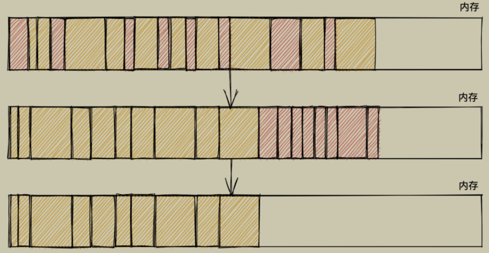
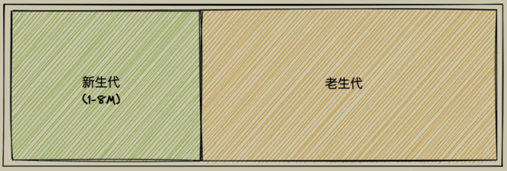
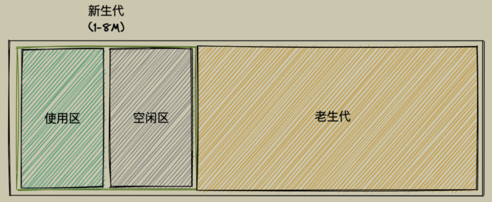
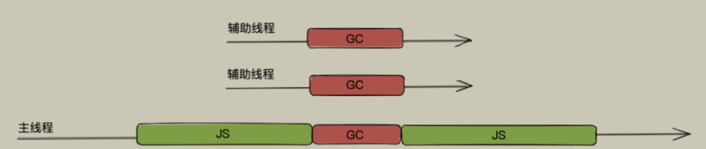
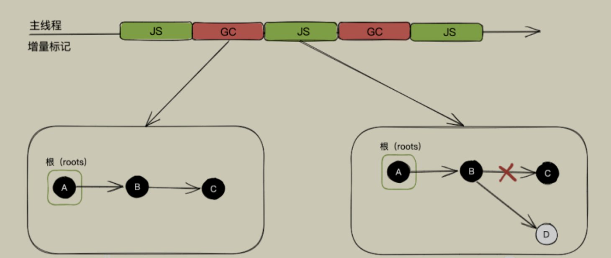
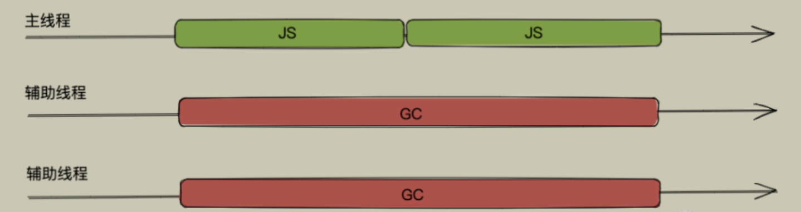

# JavaScript垃圾回收机制

## 一、垃圾回收策略

### 1. 标记清除法（Mark-Sweep）

最常用，分为两个阶段：

- 标记
  - 垃圾收集器在运行时会给内存中的所有变量都加一个标记，假设内存中所有对象都是垃圾，全标记为0
  - 从各个根对象开始遍历，把所以可以访问到的变量的标记改为1
- 清除
  - 清理所有标记为0的变量，销毁并回收它们所占用的内存空间
  - 最后把所有内存中的对象标记修改为0，等待下一轮垃圾回收

**优点：**实现比较简单

**缺点：**垃圾清除后，剩余的对象内存位置不变，出现**内存碎片，再次申请内存时需要进行遍历找到合适的碎片大小，分配速度慢**

补充：使用**标记整理（Mark-Compact）算法**，在标记结束后，将活着的对象向内存的一端移动，最后清理掉边界的内存

### 2. 引用计数法

早先的一种垃圾回收算法，它把*对象是否不再需要*简化定义为*对象有没有其他对象引用到它*，如果没有引用指向该对象（零引用），对象将被垃圾回收机制回收，**因为它的问题比较多（比如循环引用），已经很少使用**

**优点：**在引用计数归0的时候回收即可，不用像标记清除算法那样每隔一段时间进行一次清理，并且标记清除算法需要遍历堆里的活动以及非活动对象

**缺点：**无法解决循环引用，同时计数器可能需要占有很大的位置

### 3. V8对GC的优化

#### 3.1 分代式垃圾回收

- 新生代与老生代

  
- 新生代对象通过名为Scavenge的算法进行垃圾回收，在Scavenge算法的具体实现中，主要采用一种复制的方法即Cheney算法，它将堆内存一分为二，处于使用状态的空间称为**使用区**，处于闲置状态的空间称为**空闲区**

  
- 新加入的对象会存放到使用区，当使用区快被写满时，就会执行一次垃圾清理操作，新生代的垃圾回收器会对使用区中的活动对象进行标记，标记完后将其复制到空闲区并进行排序，随后将使用区进行清理，最后将使用区与空闲区的角色互换

  - 当一个对象经过多次复制后依然存活，就会被移动到老生代中
  - 如果复制一个对象到空闲区时，空闲区空间占用超过了25%，则这个对象会被直接晋升到老生代空间中（*设置为 25% 的比例的原因是，当完成 `Scavenge` 回收后，空闲区将翻转成使用区，继续进行对象内存的分配，若占比过大，将会影响后续内存分配*）
- 老生代直接采用了标记清除算法，并通过标记整理算法来解决内存碎片的问题

  - 因为老生代中的对象通常比较大，如果再如新生代一般分区然后复制来复制去就会非常耗时，从而导致回收执行效率不高

#### 3.2 并行回收

垃圾回收器在主线程上执行的过程中，开启多个辅助线程，同时执行同样的回收工作

#### 3.3 增量标记与懒性清理

所谓增量就是将一次GC标记的过程，分成多个小步，每执行一小步就让应用逻辑执行一会，从而降低全停顿（Stop-The-World）的影响，每一小次GC标记执行完之后，暂停下来去执行任务程序，而后又如何恢复，V8的解决方案就是**三色标记法与写屏障**

##### 三色标记法（暂停与恢复）

如果采用非黑即白的标记策略，那在垃圾回收器执行了一段增量回收后，暂停后启用主线程去执行了应用程序中的一段 `JavaScript` 代码，随后当垃圾回收器再次被启动，这时候内存中黑白色都有，**我们无法得知下一步走到哪里了**

三色标记法即使用每个对象的两个标记位和一个标记工作表来实现标记，两个标记位编码三种颜色：白、灰、黑

- 白色指的是未被标记的对象
- 灰色指自身被标记，成员变量（该对象的引用对象）未被标记
- 黑色指自身和成员变量皆被标记

标记处理过程：

最初所有的对象都是白色，意味着回收器没有标记它们，从一组根对象开始，先将这组根对象标记为灰色并推入到标记工作表中，当回收器从标记工作表中弹出对象并访问它的引用对象时，将其自身由灰色转变成黑色，并将自身的下一个引用对象转为灰色

就这样一直往下走，直到没有可标记灰色的对象时，也就是无可达（无引用到）的对象了，那么剩下的所有白色对象都是无法到达的，即等待回收

采用三色标记法后我们在恢复执行时就好办多了，可以直接通过当前内存中有没有灰色节点来判断整个标记是否完成，如没有灰色节点，直接进入清理阶段，如还有灰色标记，恢复时直接从灰色的节点开始继续执行就可以

##### 写屏障（增量中修改引用）

V8 增量回收使用**写屏障 (Write-barrier)**机制，即一旦有黑色对象引用白色对象，该机制会强制将引用的白色对象改为灰色，从而保证下一次增量GC标记阶段可以正确标记，这个机制也被称作**强三色不变性**

##### 懒性清理

增量标记其实只是对活动对象和非活动对象进行标记，对于真正的清理释放内存 V8 采用的是惰性清理(Lazy Sweeping)

增量标记完成后，惰性清理就开始了。当增量标记完成后，假如当前的可用内存足以让我们快速的执行代码，其实我们是没必要立即清理内存的，可以将清理过程稍微延迟一下，让JavaScript脚本代码先执行，也无需一次性清理完所有非活动对象内存，可以按需逐一进行清理直到所有的非活动对象内存都清理完毕，后面再接着执行增量标记

#### 3.4 并发回收

前面我们说并行回收依然会阻塞主线程，增量标记同样有增加了总暂停时间、降低应用程序吞吐量两个缺点

而并发回收，它指的是主线程在执行JavaScript的过程中，辅助线程能够在后台完成执行垃圾回收的操作，辅助线程在执行垃圾回收的时候，主线程也可以自由执行而不会被挂起

[原文](https://mp.weixin.qq.com/s/ISId8v-0NZIhfZsfy7cfww)

