# Javascript基础


## 一、this的使用场景

1. 对象的.操作符，此时this指向.操作符前
2. new 构造函数，此时this指向new操作符创建的新对象
3. 原型对象中的this，指向具体调用时的实例，即谁调用就指谁
4. 普通函数调用、匿名函数调用、回调函数中的this，指向window，但在严格模式下返回undefined
5. DOM事件处理函数里的this指向正在触发事件的.前DOM元素对象
6. vue中的this指向当前vue对象（Composition API和setup中已经没有this）
7. 箭头函数中的this指向当前函数之外最近的作用域中的this
8. 使用call\apply来替换this
   1. 临时替换：call、apply，后者的参数是以数组形式传递
   2. 创建副本，永久绑定this：bind，同时还可以绑定部分形参

## 二、创建对象的方式

1. 字面量

   ```javascript
   var obj = {...};
   ```
   
2. new Object表达式

   ```javascript
   // 第一步new操作符创建对象
   var obj = new Object();
   // 第二步添加属性或方法
   obj.xxx = ...
   ```

   揭示了javascript中所有对象底层都是**关联数组**，五大证据

   - 存储结构：都是名值对儿的组合
   - 访问成员时，既可以用["成员名"]，也可以用.成员名
   - 强行给不存在的位置赋值不会报错，而是会自动添加该属性
   - 强行访问不存在的位置的值不会报错
   - 都可以用for...in的方式遍历

3. 用构造函数

   前面的两种方式一次只能创建一个对象，使用构造函数可以创建相同结构内容不同的对象
   
   第一步：创建构造函数
   
   第二步：new 构造函数名()来创建对象实例
   
   构造函数的原理：
   
   - new做了4件事：
     - 创建新对象
     - 设置新对象的__proto__属性，指向构造函数的原型对象，即构造函数.prototype
     - 调用构造函数，将构造函数中的this指向刚才创建的对象
     - 返回新对象的地址，保存到变量中
   - 向原型对象中添加共有属性
     - 强行赋值：构造函数.prototype.xxx=xxx
   
4. 工厂函数方式——判断不了类型，都是object

5. 原型对象方式：先创建完全相同的对象，再给子对象添加个性化属性

6. 混合模式：先创建完全相同的对象，再给子对象添加个性化属性

7. 动态混合：在构造函数内部添加prototype上的方法或属性，因为只应添加一次，所以需要配置if

8. 寄生构造函数：构造函数里调用其他的构造函数

9. ES6 Class：新瓶装旧酒，换汤不换药

10. 稳妥构造函数：闭包，不用this，不用new

    ```javascript
    function Person(name, age) {
      var p = {};
      p.getName = function(){return name};
      p.setName = function(value){name = value};
      return p;
    }
    ```

## 三、 关于script标签的integrity属性

`integrity` 属性是HTML中`<script>`标签的一个属性，它用于提供脚本文件的完整性验证。该属性允许您指定一个用于验证脚本文件的哈希值，以确保文件在加载和执行时没有被篡改。

`integrity` 属性通常与 `crossorigin` 属性一起使用，以确保从不同源加载的脚本文件不受到恶意篡改的影响。这有助于提高网页的安全性。

关于生成该属性值可以通过以下脚本：

```bash
openssl dgst -sha256 -binary your_script.js | openssl base64 -A
```

使用方式：

```html
<script src="your_script.js" integrity="sha256-上面步骤生成的哈希值" crossorigin="anonymous"></script>
```

示例：

```bash
# 生成的值为：dqmIfxzjv4+IvqOzJ/HnS52bQuHdnLgjeoenQmHV0EI=
openssl dgst -sha256 -binary ./htmx.min.js | openssl base64 -A

```

```html
<script
  src="https://cdn.bootcdn.net/ajax/libs/htmx/1.9.5/htmx.min.js"
  integrity="sha256-dqmIfxzjv4+IvqOzJ/HnS52bQuHdnLgjeoenQmHV0EI="
  crossorigin="anonymous"
></script>
```

## 四、关于“==”

当使用`==`对两个数进行比较时，会现进行一步“转换”操作（即**隐式转换**），转换之后再进行比较


1. 如果是字符串，则转换成数字再进行比较，比如`'1' == 1`
2. 如果是布尔类型，也转换成数字再进行比较，比如`true == 1`
3. 如果是对象类型，则稍微复杂一些：
   1. 如果对象中有`Symbol.toPrimitive`方法，则调用它进行转换，否则转到`2`
   2. 调用`valueOf`方法，如果能转换成原始类型，则返回，否则转到`3`
   3. 调用`toString`方法，如果能转换成原始类型，则返回，否则转到`4`
   4. 抛出异常

### 应用举例：关于`[] == ![]`

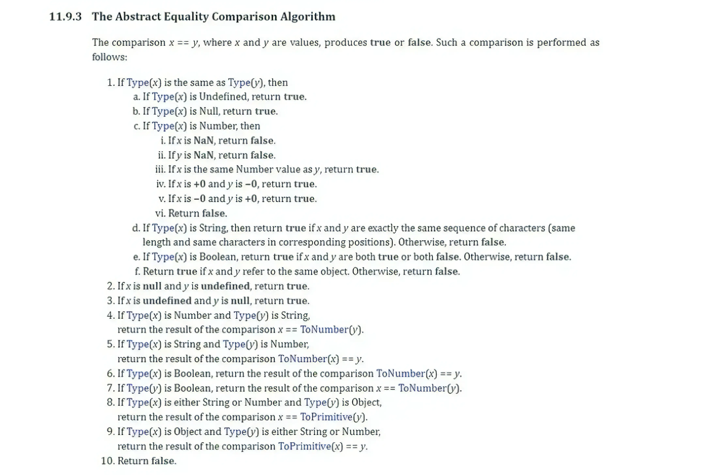

1. 命中算法步骤1：比较类型

   ```javascript
   typeof([]) // object
   typeof(![]) // boolean
   ```

2. 命中算法步骤7

   ```javascript
   ![] == false // []转成布尔型是true，所以![]即为false
   0 == Number(false) // false转成number类型即为0
   ```

3. 命中算法步骤9

   ```javascript
   // 比较ToPrimitive(x) == y，所以会调用x.valueOf()和x.toString()，因为valueOf返回了自己，并不是一个原始类型，所以会使用toString方法
   [].toString() // 返回空字符串，所以最终等式演化成：'' == 0
   ```

4. 命中算法步骤5

   ```javascript
   Number('') // 得到是数字0
   ```

5. 所以最终等式演化成：`0 == 0`，所以比较的结果是`true`


### PS：关于数组

数组在转换时会调用`toString`方法，方法内部会调用数组的`join`方法，所以会有如下奇妙的代码：

```javascript
// 引用自 https://javascript.plainenglish.io/interviewer-can-a-1-a-2-a-3-ever-evaluate-to-true-in-javascript-d2329e693cde
const a = [1, 2, 3];
a.join = a.shift;
if (a == 1 && a == 2 && a == 3) {
  console.log('hello medium');
}
```

## 五、关于javascript引擎

[javascript引擎列表](https://en.wikipedia.org/wiki/List_of_ECMAScript_engines)

Just-In-Time (JIT) compilation, which straddled the line between interpretation and full compilation, aiming to get the best of both worlds

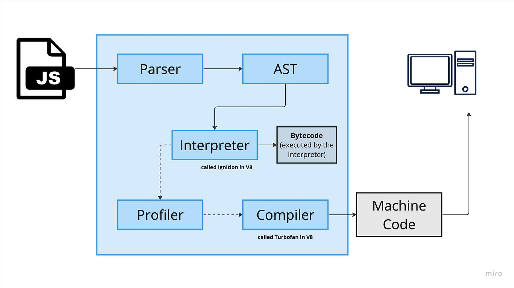

### 5.1 隐藏类

v8引擎中一个很少为人知晓但加速javasript执行效率效果显著的策略，它是一些javascript引擎（比如v8）的一个内部结构，用于加速和简化对象属性的访问

众所周知，javascript是一门动态语言，可以在代码运行过程中给对象增减属性，这个特性虽然强大，但却不利于引擎进行优化，试想，当一个对象的“形状”（比如有几个属性）不断变化时，引擎如何有效预测并处理其属性的访问？答案是引入隐藏类，它提供了一种机制来表示和跟踪一个对象当前的“形状”，并允许引擎对于属性的访问做出合理的猜测和优化

当实例化一个对象，并准备添加属性时，javascript引擎会给这个对象声明一个隐藏类，随着你添加或修改属性，引擎会将对象从一个隐藏类转换到另一个隐藏类，跟踪其演变，然后当访问对象属性时，引擎并不会在对象上查找属性，而是利用这个隐藏类作为索引来快速找到属性的位置

```javascript
let obj = {};
// Hidden Class A assigned.
obj.x = 10;
// Transition from Hidden Class A -> B
obj.y = 20;
// Transition from Hidden Class B -> C
```

如果引擎发现另一个对象也是按这种模式，它会智能的预测对象的“形状”并且使用其属性访问更快

### 5.2 内联缓存

内联缓存是一种将特定操作（比如属性访问）的结果直接缓存在字节码从而加速后续访问的优化技术

#### 内联缓存与隐藏类是相互协作的：

1. 预测对象的“形状”

   因为有隐藏类来跟踪对象的“形状”，引擎可以进行合理的预测，当一个属性被访问时，引擎通过隐藏类快速找到该属性的位置

2. 缓存结果

   一个找到被访问的属性的位置，该位置信息会被内联缓存直接缓存在字节码中，下次再访问该属性时，引擎会跳过上述的查找过程直接获取缓存的值

```javascript
function getColor(car) {
    return car.color;
}
const myCar = { color: 'red' };
getColor(myCar);  // First access: normal lookup
getColor(myCar);  // Subsequent access: rapid retrieval via IC
```

### 5.3 垃圾回收和内存管理

现代大多数javascript引擎（比如v8）对于垃圾回收都是使用了“标记-清除”的算法策略：

1. 从“roots”（全局变量、当前执行中的函数变量）开始扫描内存，并标记所有“可达”的对象为“在用”，所谓“可达”对象，就是那些从“roots”可以直接或间接访问的对象
2. 当所有的可达对象被标记后，垃圾回收器就开始清理内存，将没有标记为“在用”的对象所占用的内存进行释放

## 六、Javascript Runtime Environment

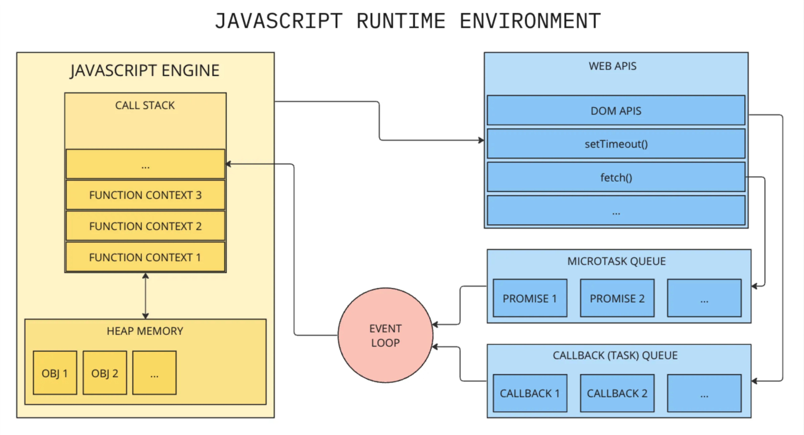

## 七、URL

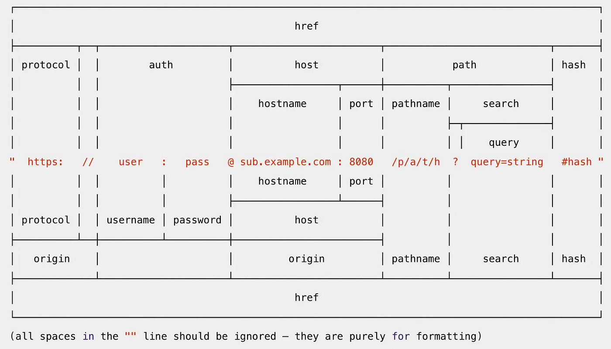

## 八、JSON.stringify转换规则

1. undefined、Function、Symbol不是有效的JSON值，在转换时，要么直接被省去（当出现在对象中）或被转换为null（当出现在数组中），如果传入的是“纯值”，则返回undefined，比如：

   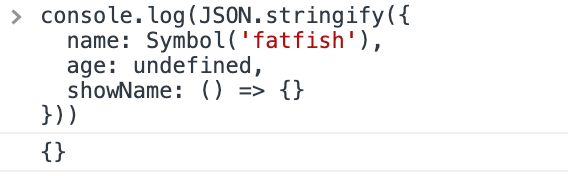

   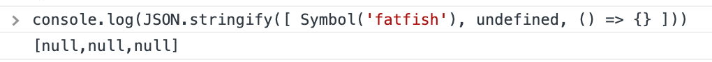

   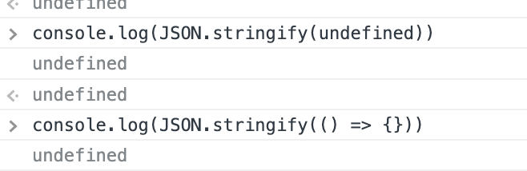

2. Boolean、Number、String对象会转换成其对应的原始值类型

   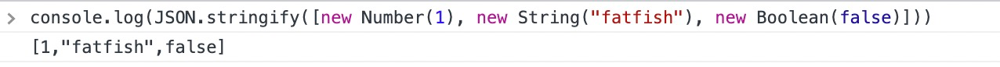

3. 所有键类型为Symbol的属性，在转换时都会直接被忽略

   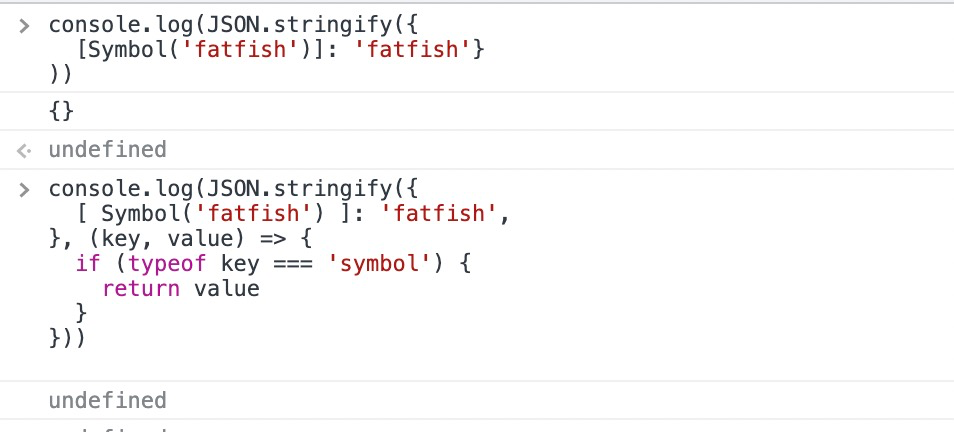

4. 对于Infinity、NaN和null，都会被转成null

   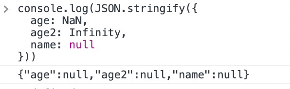

5. 如果被转换的值有`toJSON()`方法，则直接使用其返回的值

   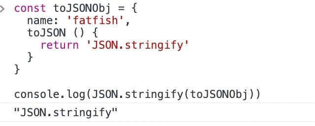

6. Date实例实现了`toJSON()`方法，并返回字符串形式（与`date.toISOString()`一致）

   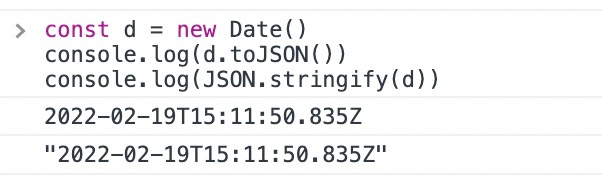

7. 如果对象包含了一个循环引用，在序列化时会抛出异常

   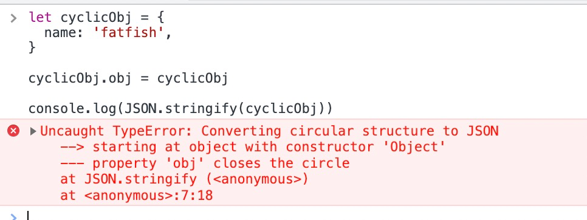

8. 其他所有`Object`的实例，只有当它的属性是可以枚举时才会被序列化

   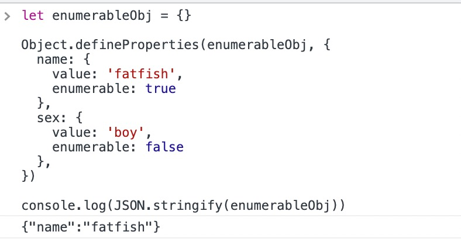

9. 对于类型为`BigInt`的值进行序列化时会报错

   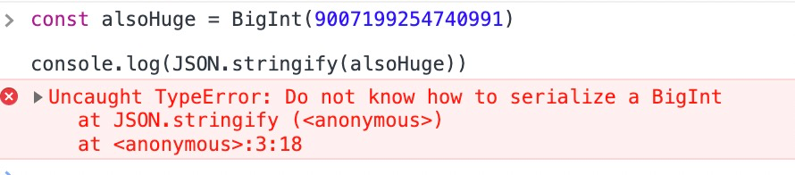

