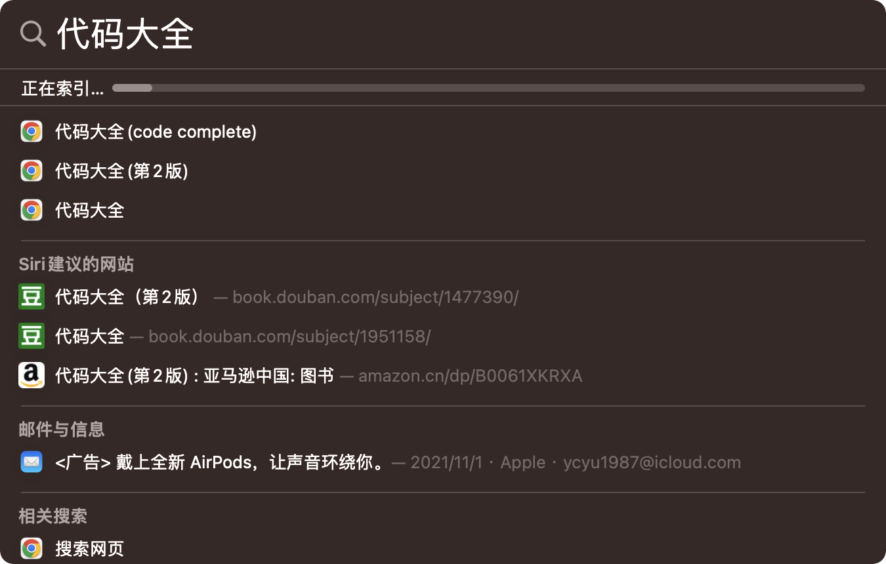

# Mac相关

## 安装软件提示已损坏

```bash
sudo spctl --master-disable
sudo xattr -d com.apple.quarantine /Applications/iTerm.app
```

## 安装命令行基础工具

node.js、python3等都依赖此

```shell
xcode-select --install
```

## 使用nginx

默认情况下80端口被unix自带的apache占用了，所以要先关闭apache服务

```shell
# 启动
sudo apachectl start
# 关闭
sudo apachectl restart
# 重启
sudo apachectl stop
```

关闭apache服务后，要设置开机启动项，避免下次80端口继续被apache占用

```shell
# 关闭开机启动
sudo launchctl unload -w /System/Library/LaunchDaemons/org.apache.httpd.plist
# 开启开机启动
sudo launchctl load -w /System/Library/LaunchDaemons/org.apache.httpd.plist
```

## 启动项

地址：/Users/ycyu/Library/LaunchAgents

通过brew安装的nginx，想在开机时自动启动，只需要将nginx安装位置下.plist文件的拷到上述目录

## 使用ssh后反复提示需要密码

```bash
ssh-add -K ~/.ssh/id_rsa
```

## 关于mac地址

1. networksetup -listallhardwareports 查看当前所有端口Mac地址
1. sudo ifconfig en0 ether e4:ce:8f:32:51:82 修改mac地址
1. ifconfig en1 | grep ether //查看是否修改成功,这里修改的是虚拟Mac,看硬件是看不出来的

**电脑重启mac地址复原**

## 开启Core Dump

```bash
# 确认/cores目录有写入权限
sudo chmod 1777 /cores
# 检查内核状态是否开启Core-Dump
# 查看
sudo sysctl kern.coredump
# 如果不是1则设置
sudo sysctl kern.coredump=1
# 在执行需要进行core dump的应用之前，设置如下，来设置当前shell为core-dump做好准备，切换shell后失效
ulimit -c unlimited

```

更多可以参考[这里](https://medium.com/sthima-insights/taming-the-dragon-using-llnode-to-debug-your-node-js-application-fc54c6efd0f1)

- 包括在在程序运行过程中保存并生成`core dump`的方法`lldb --attach-pid ${pid} -b -o 'process save-core "core.${pid}"'`
- 包括如何使用`llnode`来调试`core dump`

## Alfred

关于搜索不到文件时可以尝试重建索引：

```bash
/Applications/Alfred\ 5.app/Contents/Frameworks/Alfred\ Framework.framework/Versions/A/Resources/reindexdel.sh
```

通过`Spolight`可以看到索引重建的进度



索引重建这后可以在`alfred`中输入`reload`并找到`reload alfred cache`然后执行

