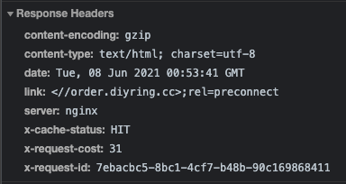

# Performance

## preconnect

- 首页响应头link字段中添加需要提前建立链接的域名，如下：

```http response headers
link: <//order.kuyin123.com>;rel=preconnect,<//oss.kuyinyun.com>;rel=preconnect
```



相当于提前告诉浏览器，接下来我将会请求order.diyring.cc这个域名上的资源，请提前建立链接，可以将对指定域名的dns解析以及tls的建立提前
