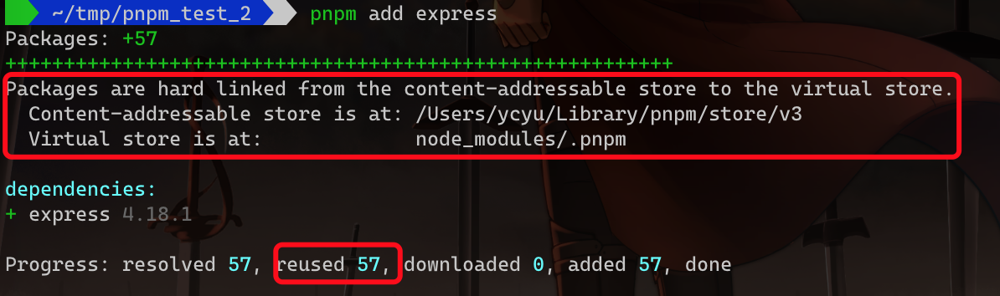
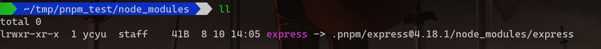
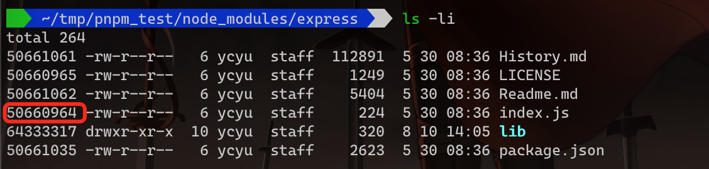
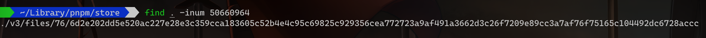

# pnpm学习笔记

## 一、解决的问题

### 节省磁盘空间 & 解决幽灵依赖

- 如何做到的？

  - 早期npm的依赖管理采用的是嵌套的方案，带来两个问题：

    1. 同一个依赖会存在多份，浪费磁盘空间
    2. 嵌套层级多了会导致超过操作系统（windows）最长路径限制的字符数

  - yarn采用的是依赖平铺的方式，将嵌套的依赖提到同一层（npm的后续版本也采用了这种方式，同时也学习yarn使用了lock文件），结果：

    1. 解决了因嵌套导致的路径过长的问题
    2. 但对于同一个包的多个版本，只会提升一个，其余版本保持嵌套的方式
    3. 导致了幽灵依赖，因为平铺了，导致间接依赖可以在代码中进行require，但如果某天该间接依赖被移除了，代码就无法正常运行了

  - pnpm的处理方式：

    1. 使用硬链接机制，将全局仓库里（**content-addressable**）的包链接到当前项目下的虚拟仓库（也就是`node_modules/.pnpm`）

       

       - [软链接与硬链接的区别](https://zhuanlan.zhihu.com/p/88891362)

       

       

       - 简单概括：硬链接可以实现多个文件名指向同一索引节点（inode），而软链接指向的是一个文件，该文件又指向了硬盘中文件的位置
       - **查看全局仓库的位置**：`node_modules/.modules.yaml`中的`store`字段，或者使用`pnpm store path`命令
       - 如何证明用的是硬链接？

         创建一个空的目录，通过`pnpm add express`来安装一个express的包，然后我们进入`node_modules`文件夹可以看到如下：

         

         express是一个软链接，指向`.pnpm`目录下的对应位置，我们访问该目录，为了证明是不是采用了硬链接，我们使用`ls -li`命令查看：

         

         通过`pnpm store path`可以查看pnpm仓库的位置，然后根据该inode编号去查找仓库下是否有该编号的文件：`find . -inum 50660964`

         

         查看该文件的内容并与之前的`index.js`文件的内容对比，发现是一致的，并且当我们修改仓库中的文件之后，再去查看`index.js`的内容，发现同步修改了


    2. 包和包之间的依赖关系是通过软链接组织的

    

    3. 当安装同一个包的不同版本时，仅会添加版本之间不同的文件到存储起中，而不会保存完整的包
    3. 默认情况下，pnpm只会将项目的直接依赖安装到根级的`node_modules`文件夹中，以此来解决“幽灵依赖”的问题

## 二、安装

这里可以完全参照[官网](https://pnpm.io/installation)

这里需要关注一下的是[通过Corepack的安装方式](https://pnpm.io/installation#using-corepack)

另外pnpm对node版本的要求如下：

| Node.js    | pnpm 4 | pnpm 5 | pnpm 6 | pnpm 7 |
| ---------- | ------ | ------ | ------ | ------ |
| Node.js 10 | ✔️      | ✔️      | ❌      | ❌      |
| Node.js 12 | ✔️      | ✔️      | ✔️      | ❌      |
| Node.js 14 | ✔️      | ✔️      | ✔️      | ✔️      |
| Node.js 16 | ?️      | ?️      | ✔️      | ✔️      |
| Node.js 18 | ?️      | ?️      | ✔️      | ✔️      |

**目前项目中使用的是pnpm 7.x，也就是说node版本最少需要14，且考虑使用corepack，所以建议使用16.14及以上**

## 三、使用

### 3.1 CLI

- -C \<path\>, --dir \<path\>

  指定pnpm的启动目录，默认使用当前目录

- -w, --workspace-root

  指定pnpm在workspace的根目录启动，而非当前工作目录

- pnpm \<cmd\>

  当pnpm识别不了当前命令时，它会使用cmd指定的名字来查找是否有可用的npm script，也就是说`pnpm run lint`与`pnpm lint`效果相同，如果对应名字的npm script不存在，则会以shell脚本的方式来执行当前命令，比如`pnpm eslint`

### 3.2 Filtering语法

允许指定范围（多用于workspace，比如workspace下的几个包）来执行相应的命令，与lerna的`--scope`类似

#### --filter <package_name>

精确选中一个包或通过模式匹配选中一系列包

```bash
pnpm --filter "@babel/core" test
pnpm --filter "@babel/*" test
pnpm --filter "*core" test
```

#### --filter <package_name>...

选中包以及它的依赖项（直接或间接依赖）

#### --filter <package_name>^...

**仅**选中包的依赖项（直接或间接依赖）

#### --filter ...<package_name>

选中包以及它依赖的包（同workspace下）

#### --filter "...^<package_name>"

**仅**选中指定包的依赖包

#### --filter ./\<glob\>, --filter {\<glob\>}

通过相对于当前工作目录的glob匹配规则


