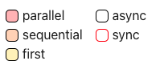
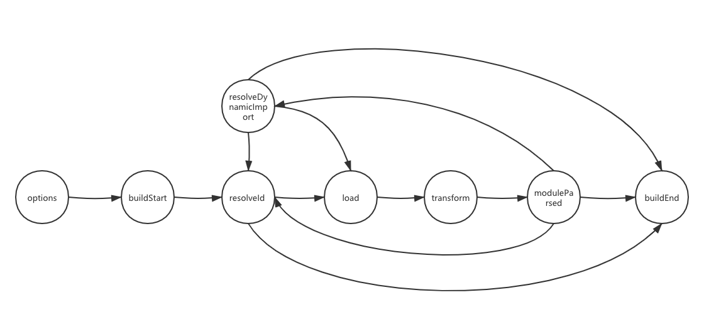

# Rollup.js

## Plugin Development

### Plugins Overview

rollup的插其实就是一个javascript对象，该对象由下面将要介绍的[properties](#properties)、[build hooks](#build-hooks)以及[output generation hooks](#output-generation-hooks)中一个或几个部分组成，并且遵循规范，通常rollup插件的分发形式为一个返回上述结构对象的函数，该函数可传入一个配置对象来定制逻辑

插件可以让我们自定义Rollup的一些行为，比如打包前对代码进行转译或在`node_modules`文件夹中查找第三方模块。可能通过[Using plugins](https://rollupjs.org/guide/en/#using-plugins)查看如何使用插件的例子

在[这里](https://github.com/rollup/awesome)可以查看Rollup插件列表

### A Simple Example

下面的插件将拦截任何对`virtual-module`模块的导入，来阻止它访问文件系统，比如，如果你在浏览器中使用Rollup，这是必要的操作，它甚至可以用来替换打包的入口，正如例子中所示

```javascript
// rollup-plugin-my-example.js
export default function myExample () {
  return {
    name: 'my-example', // this name will show up in warnings and errors
    resolveId ( source ) {
      if (source === 'virtual-module') {
        return source; // this signals that rollup should not ask other plugins or check the file system to find this id
      }
      return null; // other ids should be handled as usually
    },
    load ( id ) {
      if (id === 'virtual-module') {
        return 'export default "This is virtual!"'; // the source code for "virtual-module"
      }
      return null; // other ids should be handled as usually
    }
  };
}

// rollup.config.js
import myExample from './rollup-plugin-my-example.js';
export default ({
  input: 'virtual-module', // resolved by our plugin
  plugins: [myExample()],
  output: [{
    file: 'bundle.js',
    format: 'es'
  }]
});
```

### Conventions

* 插件应该有一个明确的命名并且以`rollup-plugin-`为前缀
* package.json的`keywords`字段中应包含`"rollup-plugin"`这样的关键字
* 插件应当是经过测试的，我们推荐使用[mocha](https://github.com/mochajs/mocha)或[ava](https://github.com/avajs/ava)，它们都提供了对promise的支持
* 尽可能使用异步方法
* 使用英文来编写插件文档
* 确保你的插件在需要时能输出正确的source map
* 如果你的插件使用`'virtual modules'`（比如helper functions），在模块ID前添加`\0`前缀，这样可以阻止其他插件来处理它

### Properties

#### name

* Type：string
* 用来定义插件的名称，一般用于在错误或警告信息中标识出插件

### Build Hooks

为了对构建过程进行干预，插件对象中可以包含一些称为“钩子”的函数，这些钩子函数会视其类型在构建的不同阶段被调用，钩子可以影响一次构建如何执行，提供构建过程相关的信息或在构建完成时对产物进行修改，具体可分为以下几种钩子类型（一个钩子可以具备多种类型）：

* `async`：与sync对应，返回一个Promise，可以通过将sync构子的结果包装在Promise.resolve中来实现一个对应的async钩子
* `first`：如果有多个插件都提供了这种钩子函数，则这些函数会顺序调用，直到一个函数的返回值不为null和undefined
* `sequential`：如果有多个插件都提供了这种钩子函数，则所有这些函数会按照**指定插件时的顺序**一个接一个的调用，如果某个钩子是async类型的，会等其返回的promise对象resolve后再继续执行后面的钩子
* `parallel`：执行顺序与sequential一样，只是当某个钩子是async类型时，后续钩子会并行的执行，而不是等待当前的钩子执行完毕。

`build hooks`是在**构建阶段**执行的，由rollup.rollup(inputOptions)触发，它们主要用途在于将输入文件交由Rollup处理之前对其进行文件定位、内容提供和代码转换，其中第一个被执行的钩子为[options](#options)，最后一个钩子则总为[buildEnd](#buildend)，如果构建过程出错，`closeBundle`则会随之被调用







此外，在watch模式下，[watchChange](#watchchange)钩子可能在任何时候被调用，用于通知当次执行已经完成构建产物的输出后将开始一次新的执行，当退出watch模式时，[closeWatcher](#closewatcher)钩子将会被触发。

阅读[Output Generation Hooks](#output-generation-hooks)来查看在生成阶段调用并修改构建产物的钩子。

#### options

- Type:

  ```typescript
  (options: InputOptions) => InputOptions | null
  ```

- Kind: async, sequential
- Previous Hook: 这是构建阶段的第一个钩子
- Next Hook: [buildStart](#buildstart)

用来对传递给`rollup.rollup`函数的配置项进行替换或修改，如果返回`null`则表示不做任何修改。如果你只是需要读取rollup的配置项，建议使用[buildStart](#buildstart)钩子，因为在此钩子中访问得到的配置项是在所有`options`钩子处理之后得到的，也就意味着是最完整的。

这也是唯一一个不能访问绝大多数[plugin context](#plugin-context)提供的工具函数的钩子，因为它是在rollup进行完整配置之前执行的

#### buildStart

- Type:

  ```typescript
  (options: InputOptions) => void
  ```

- Kind: async, parallel
- Previous Hook: [options](#options)
- Next Hook: [resolveId](#resolveid)（resolveId会针对每个entry point`entry point`进行并行的解析）

每次调用`rollup.rollup(inputOptions)`进行构建时都会调用此钩子，当你需要访问传递给`rollup.rollup()`的配置项时推荐在这个钩子中处理，因为它将所有[options](#options)钩子对配置项的转换已考虑在内，并且对于未指定的配置项也提供了正确的默认值

#### resolveId

- Type:

  ```typescript
  (
    source: string,
    importer: string | undefined,
    options: {
      isEntry: boolean,
      custom?: {
        [plugin: string]: any,
      },
    },
  ) =>
    | string
    | false
    | null
    | {
        id: string,
        external?: boolean | 'relative' | 'absolute',
        moduleSideEffects?: boolean | 'no-treeshake' | null,
        syntheticNamedExports?: boolean | string | null,
        meta?: {
          [plugin: string]: any,
        } | null,
      };
  ```

- Kind: async, first
- Previous Hook: 如果当前解析的是entry point，则前一个钩子是[buildStart](#buildstart)；如果是解析一个静态导入，则前一个钩子是[moduleParsed](#moduleparsed)，或者作为[resolveDynamicImport](#resolvedynamicimport)的处理失败时的回退操作。**此外，该钩子可以在构建阶段由其它插件的钩子通过调用[this.emitFile](#thisemitfile)来生成一个entry point来被触发，或者任何时候调用[this.resolve](#thisresolve)来手动解析一个`id`时触发**

- Next Hook: 如果解析得到的id对应的模块尚未加载则进入[load](#load)钩子，否则进入[buildEnd](#buildend)钩子

**该钩子的作用是用来自定义模块解析器，比如定义从哪加载第三方依赖（比如[@rollup/plugin-node-resolve](https://www.npmjs.com/package/@rollup/plugin-node-resolve)用来告诉rollup如何加载位于node_modules中的第三方依赖）**。入参的`source`就是`import`语句中被导入的值（写在`from`后面的内容），比如：

```javascript
import {foo} from '../bar.js';
```

其中，**`source`就是这里的'../bar.js'**

而`importer`则是当前正在进行模块导入方的完整解析的id，所以当解析`entry point`时，`importer`为undefined，不过，有一个例外的情景，那就是`entry point`是通过`this.emitFile`这个API生成的，此时你可以指定`importer`参数。

对于这些场景，**参数`options`中的`isEntry`**将会告诉你我们当前是在解析一个用户定义的`entry point`，还是一个通过`this.emitFile`API创建的chunk，还是说`isEntry`只是作为`this.resolve`这个上下文函数的参数

你可以利用它来为entry point自定义代理模块，比如下面的插件会对所有entry point注入一个polyfill的导入：

```javascript
// We prefix the polyfill id with \0 to tell other plugins not to try to load or
// transform it
const POLYFILL_ID = '\0polyfill';
const PROXY_SUFFIX = '?inject-polyfill-proxy';

function injectPolyfillPlugin() {
  return {
    name: 'inject-polyfill',
    async resolveId(source, importer, options) {
      if (source === POLYFILL_ID) {
        // It is important that side effects are always respected for polyfills,
        // otherwise using "treeshake.moduleSideEffects: false" may prevent the
        // polyfill from being included.
        return { id: POLYFILL_ID, moduleSideEffects: true };
      }
      if (options.isEntry) {
        // Determine what the actual entry would have been. We need "skipSelf"
        // to avoid an infinite loop.
        // 这里因为调用了resolve方法，会再次触发resolveId钩子，所以这里才会使用skipSelf跳过自身的检查，不然就会死循环
        const resolution = await this.resolve(source, importer, { skipSelf: true, ...options });
        // If it cannot be resolved or is external, just return it so that
        // Rollup can display an error
        if (!resolution || resolution.external) return resolution;
        // In the load hook of the proxy, we need to know if the entry has a
        // default export. There, however, we no longer have the full
        // "resolution" object that may contain meta-data from other plugins
        // that is only added on first load. Therefore we trigger loading here.
        // 这里调整load就去，会进入load钩子
        const moduleInfo = await this.load(resolution);
        // We need to make sure side effects in the original entry point
        // are respected even for treeshake.moduleSideEffects: false.
        // "moduleSideEffects" is a writable property on ModuleInfo.
        moduleInfo.moduleSideEffects = true;
        // It is important that the new entry does not start with \0 and
        // has the same directory as the original one to not mess up
        // relative external import generation. Also keeping the name and
        // just adding a "?query" to the end ensures that preserveModules
        // will generate the original entry name for this entry.
        return `${resolution.id}${PROXY_SUFFIX}`;
      }
      return null;
    },
    load(id) {
      if (id === POLYFILL_ID) {
        // Replace with actual polyfill
        return "console.log('polyfill');";
      }
      if (id.endsWith(PROXY_SUFFIX)) {
        const entryId = id.slice(0, -PROXY_SUFFIX.length);
        // We know ModuleInfo.hasDefaultExport is reliable because we awaited
        // this.load in resolveId
        const { hasDefaultExport } = this.getModuleInfo(entryId);
        let code =
          `import ${JSON.stringify(POLYFILL_ID)};` + `export * from ${JSON.stringify(entryId)};`;
        // Namespace reexports do not reexport default, so we need special
        // handling here
        if (hasDefaultExport) {
          code += `export { default } from ${JSON.stringify(entryId)};`;
        }
        return code;
      }
      return null;
    }
  };
}
```

**返回`null`则交由其它`resolveId`钩子函数处理，并最终会交由默认的解析行为来进行处理。返回`false`则表示这是一个外部模块，不需要进行打包，如果这种情况发生在相对路径导入中，则id将按照与使用`external`选项时相同的方式被重新规范化。**

如果返回的是一个对象，则可以将模块导入解析为一个不同的id，同时将其从打包中排除，这允许你将本地依赖替换为外部依赖，而不需要用户通过`external`配置项手动将这些依赖标记为外部依赖：

```javascript
function externalizeDependencyPlugin() {
  return {
    name: 'externalize-dependency',
    resolveId(source) {
      if (source === 'my-dependency') {
        return { id: 'my-dependency-develop', external: true };
      }
      return null;
    }
  };
}
```

如果`external`为`true`，则根据用户将`makeAbsoluteExternalsRelative`选项配置为`true`时，则绝对路径方式表示的id会转为相对路径方式，但这个选项可以通过设置`external`来被覆盖，`external: "relative"`则总会将绝对路径表示改为相对路径表示，而`external: "absolute"`则会保持绝对路径表示。

当返回一个对象时，以如`./`或`../`这样开头的相对路径表示的id，不会在内部使用时转换为绝对路径表示，并在输出时又转换回相对路径，而是**直接原封不动的输出**，如果你需要将一个相对路径表示的id进行规范化、去冗余化，你需要返回一个基于当前文件系统的绝对路径表示的id，并设置`external: "relative"`

如果第一个`resolveId`钩子返回`moduleSideEffects: false`，同时也没别的模块从这个模块中引入任何东西，那么即使这个模块有副作用，也不会被打包，如果返回`moduleSideEffects: true`，rollup会使用它的默认算法去将该模块中有副作用的语句（比如修改全局变量就属于有副作用的语句，而函数只声明了但未调用则属于没有副作用的语句）全部打包，如果返回`moduleSideEffects: "no-treeshake"`，则针对该模块，treeshaking的功能将被关闭，即使这是一个空的模块，也会被打包，如果`resolveId`钩子返回了`null`或`moduleSideEffects`标识位被省略了，则`moduleSideEffects`的最终由`treeshake.moduleSideEffects`配置项决定，或默认为`true`，在后续的`load`和`transform`钩子中可以覆盖这个配置项

关于[`syntheticNamedExports`](#Synthetic named exports)配置项，如果`resolveId`钩子返回了`null`或者该配置项被省略，则默认为`false`，在后续的`load`和`transform`钩子中可以覆盖这个配置项

关于[`meta`](#Custom module meta-data)配置项，如果resolveId返回了`null`或者该配置项被省略，则默认为空对象，在后续的`load`和`transform`钩子中可以覆盖这个配置项

这里需要注意，尽管`resolveId`钩子对于每个模块导入（import语句）都会被调用并且可以被多底价解释到同一个`id`，但`enternal`、`moduleSideEffects`、`syntheticNamedExports`、`meta`的值在模块被加载前只能被设置**一次**，其原因在于roll接下来会执行`load`和`transform`钩子，它们可以修改某个模块的这些值，并且如果它们确实进行了修改，就要以它们修改后的值为准

当一个插件通过`this.resolve`方法来触发`resolveId`钩子时，它可能会传递一个自定义的配置项对象，由于这个对象会直接透传，所以插件在添加`custom`配置对象应该遵循这样一个约定：配置项给哪个插件用，则key与该插件的名字对应，具体可以参见[custom-resolver-options](https://rollupjs.org/guide/en/#custom-resolver-options)

在watch模式下或显示使用缓存时，对于缓存模块的导入解析也是从缓存中获取的，而不再是由`resolveId`钩子来决定，如果不希望这样，则需要在`shouldTransformCahedModule`钩子中对于该模块返回`true`，这样就会从缓存中移除该模块以及它的导入解析，并再次调用`transform`和`resolveId`钩子

#### load

- Type：

  ```javascript
  (
    id: string
  ) =>
    | string
    | null
    | {
        code: string;
        map?: string | SourceMap;
        ast?: ESTree.Program;
        moduleSideEffects?: boolean | 'no-treeshake' | null;
        syntheticNamedExports?: boolean | string | null;
        meta?: { [plugin: string]: any } | null;
      };
  ```

- Kind: async, first

- Previous Hook: [resolveId](#resolvedid) or [resolveDynamicImport](resolvedynamicimport)（load钩子入参id就是由这两个钩子提供的）

- Next Hook: [transform](#transform)（对已加载的文件来进行转换操作）

可以通过这个钩子来实现一个自定义加载器，如果返回`null`则表示交由其它`load`钩子来处理（如果没有别的`load`钩子处理，**最终会走到默认的处理逻辑，通过文件系统来加载**），为了避免额外的解析开销，比如该钩子函数出于某种原因已经使用[this.parse](#thisparse)生成了AST，则可以选择性的返回一个`{ code, ast, map }`对象供后续的钩子（即[transform](#transform)）使用。这里的`ast`必须是一个标准的ESTree AST，对于每个节点都有`start`和`end`属性。（如果代码转换过程没有移动代码，可以通过设置该对象中的`map`为`null`来获得现有的sourcemap，否则就需要自己来生成sourcemap，具体可参考[source code transformations](#source-code-transformations)一节的内容）

如果`moduleSideEffects`字段被设置为`false`，并且其它模块也没有引入该模块的任何东西，那么即使该模块有副作用（比如修改全局变量），也不会被打包；如果设置为`true`，则Rollup会使用默认的算法来将该模块中的所有语句进行打包；如果设置为`no-treeshake`，则将不会对该模块进行`treeshaking`的操作，那么即使它的内容为空，最后也会生产一个chunk；如果设置为`null`或者省略对该字段的赋值，则它将先由第一个解析该模块的`resolveId`钩子函数决定，其次是`treeshake.moduleSideEffects`选项，最终则默认设置为`true`，该值可以在`transform`钩子中被修改

关于`syntheticNamedExports`配置项的作用可以参见[Synthetic named exports](#synthetic-named-exports)节，如果该配置项设置为`null`或省略，则它将由第一个解析该模块的`resolveId`钩子函数决定，否则默认置为`false`，该值可以在`transform`钩子中被修改

关于`meta`配置项的使用可以参见后面[Custom module meta-data](#custom-module-meta-data)节，如果这里设了`meta`（类型是object），它会被浅合并入`resolveId`钩子返回的`meta`对象中（即保留一级属性），如果所有钩子都没返回`meta`对象，则它默认为一个空对象，在`transform`钩子中可以对该对象新增或替换属性

你可以在钩子函数中使用[this.getModuleInfo](#thisgetmoduleinfo)来获取`moduleSideEffects`、`syntheticNamedExports`和`meta的值（来自之前的钩子）。

#### shouldTransformCacheModule

- Type:

  ```javascript
  (
    {
      id: string,
    	code: string,
    	ast: ESTree.Program,
    	resoledSources: {
      	[source: string]: ResolvedId
    	},
    	meta: {
      	[plugin: string]: any
    	},
    	moduleSideEffects: boolean | "no-treeshake",
    	syntheticNamedExports: string | boolean
  	}
  ) => boolean
  ```


- Kind: async, first

- Previous Hook: load（加载缓存过的文件来将其代码与缓存中的版本进行对比）

- Next Hook: 如果该钩子返回`true`则进入moduleParsed，否则进入`transform`

如果启用了Rollup的缓存（比如在watch模式下或通过js的API显式开启），在`load`钩子之后，Rollup将会跳过该模块的`transform`钩子，所加载的代码与缓存的副本完全相等，如果需要改变这种行为（让缓存失败并进入模块的`transform`钩子），通过在插件中实现`shouldTransformCacheModule`钩子并返回`true`即可

这个钩子也可被用于查找哪些模块被缓存了，并访问他们缓存的元信息

如果插件返回的不是`true`，Rollup会继续触发其它插件的该钩子，否则其余插件均会被跳过

#### transform

- Type:

  ```typescript
  (
    code: string,
    id: string
  ) =>
    | string
    | null
    | {
        code?: string;
        map?: string | SourceMap;
        ast?: ESTree.Program;
        moduleSideEffects?: boolean | 'no-treeshake' | null;
        syntheticNamedExports?: boolean | string | null;
        meta?: { [plugin: string]: any } | null;
      };
  ```


- Kind: async, sequential

- Previous Hook: [load](#load)（当前处理的文件就是通过这个钩子加载的）

- NextHook: [moduleParsed](#moduleparsed)（一旦当前文件已被处理并解析）

该钩子可用来转换单个模块，为了避免额外的解析开销，比如该钩子函数出于某种原因已经使用[this.parse](#thisparse)生成了AST，则可以选择性的返回一个`{ code, ast, map }`对象供后续的钩子（即[transform](#transform)）使用。这里的`ast`必须是一个标准的ESTree AST，对于每个节点都有`start`和`end`属性。（如果代码转换过程没有移动代码，可以通过设置该对象中的`map`为`null`来获得现有的sourcemap，否则就需要自己来生成sourcemap，具体可参考[source code transformations](#source-code-transformations)一节的内容）

需要注意一点，在`watch`模式或显式使用缓存的情况下，该钩子的结果在重新构建时会被缓存，只有模块`id`对应 的代码发生了变更或才上次该钩子被触发时通过`this.addWatchFile`添加的文件发生变化时，这个钩子才会再次被触发

在其它情形下，则是`shouldTransformCachedModule`钩子会被调用，在该钩子中可以访问被缓存的模块，如果返回`true`，则会从缓存中移除该模块，并再次调用`transform`钩子

你还可以使用对象形式的返回值来配置这个模块的其它属性，并且可以只返回属性而不返回转换后的代码：

关于返回对象中`moduleSideEffects`、`syntheticNamedExports`、`meta`的取值对模块打包的影响与[load](#load)钩子中的说明相同，这里省略

你可以在这个钩子函数中使用[this.getModuleInfo](#thisgetmoduleinfo)来获取`moduleSideEffects`、`syntheticNamedExports`和`meta`之前的值。

#### moduleParsed

- Type:

  ```typescript
  (moduleInfo: ModuleInfo) => void;
  ```

- Kind: async, parallel
- Previous Hook: [transform](#transform)（当前被处理的`moduleInfo`就是由`transform`钩子处理得到的）
- NextHook: [resolveId](#resolveid) and [resolveDynamicImport](#resolvedynamicimport)（如果存在静态导入或动态导入，则由这两个钩子并行处理，否则则进入[buildEnd](#buildend)钩子）

每当一个模块被Rollup完整解析后就会调用这个钩子，可以查阅[this.getModuleInfo](#thisgetmoduleinfo)节来查看传递给该钩子的参数`moduelInfo`的具体信息。该钩子与[transform](#transform)相反，它不进行缓存，并且可以被用于获取缓存的模块或其它模块的信息，包括最终的`meta`属性，`code`以及`ast`信息。

**该钩子会等到模块中的所有导入内容被解析之后才会触发**，此时拿到的关于moduleInfo.importedIds`、`moduleInfo.dynamicallyImportedIds`、`moduleInfo.importedIdResolutions`、`moduleInfo.dynamicallyImportedIdResolutions`才是完整和准确的，但需要注意一点，关于导入模块的信息可能是不完整的，因为后续可能会发现额外的模块导入，如果你需要这些信息，可以使用[buildEnd](#buildend)钩子

#### resolveDynamicImport

- Type:

  ```typescript
  (
    specifier: string | ESTree.Node,
    importer: string
  ) => string | false | null | { id: string; external?: boolean };
  ```

- Kind: async, first
- Previous Hook: [moduleParsed](#moduleparsed) for the importing file.
- Next Hook: 如果该钩子执行后得到了一个尚未被加载的`id`，则使用[load](#load)钩子来处理；如果动态导入（`import(...)`）包含一个没有被这个钩子解析的字符串，则会使用[resolveId](#resolvedid)钩子来处理；否则进入[buildEnd](#buildend)钩子

该钩子的作用是针对动态导入自定义一个解析器。如果返回`false`则表示不对当前导入进行任何处理，也不将其传递给其他解析器，从而将它标记为”额外的“（设置`external`字段），与[resolvedId](#resolvedid)钩子类似，你同样可以返回一个对象来将当前导入解析为不同的id并同时将其标记为额外的（返回的对象为`{ id, external }`）。

如果动态导入的入参是一个字符串，则该钩子返回的字符串为会视作是一个已存在的模块id，如果返回`null`则交给其他钩子处理，最终会走到`resolveId`钩子

如果动态导入的入参不是字符串，该钩子会访问原始AST节点来进行分析并根据返回进行不同的操作，如下：

* 如果所有注册了这个钩子的插件都返回`null`，则该导入会被认为是`external`，并且不会有警告
* 如果返回的是一个字符串，则该字符串不会作为模块的id使用，而是直接用来替换导入，插件需要保证生成的代码是有效的
* 可以通过返回`{ id, extrnal }`来将导入解析到一个现有的模块

需要注意一下，该钩子的返回值不会传递给后续的`resolveId`钩子，如果你需要访问静态解析算法，可以在插件上下文中使用[this.resolve(source, importer)](#thisresolve)

#### buildEnd

- Type:

  ```typescript
  (error?: Error) => void
  ```

- Kind: async, parallel
- Previous Hook: [moduleParsed](#moduleparsed), [resolveId](#resolveid) or [resolveDynamicImport](#resolvedynamicimport).
- Next Hook: [outputOptions](#ouputoptions)（outputOptions是output generation阶段的钩子了，所以buildEnd为构建阶段的最后一个钩子）

buildEnd在rollup完成打包但尚未调用`generate`或`write`时调用；你也可以返回一个Promise。如果构建报错，会将错误信息传入这个钩子

#### closeWatcher

- Type:

  ```typescript
  () => void;
  ```

- Kind: sync, sequential

- Previous/Next Hook: 该钩子会在构建阶段与输出阶段的任何时间触发，触发之后当前的构建会继续进行，只不过不会再触发新的[watchChange](#watchchange)事件了

此钩子用来通知插件watcher进程结束了，所以已分配的资源也可以被释放了。如果返回的是一个Promise，rollup会等该Promise resolve之后才关闭进程。此钩子不能在用于output阶段的插件使用。

#### watchChange

- Type:

  ```typescript
  (
    id: string,
    change: { event: 'create' | 'update' | 'delete' }
  ) => void;
  ```

- Kind: sync, sequential

- Previous/Next Hook: 这个钩子可以在构建阶段或输出阶段的任何时间被触发，此时，当前构建会继续进行，但在当前构建完成之后会又开始一次新的构建，并以[options](#options)钩子为起始点

只要rollup在`--watch`模式下检测到被监察文件的修改，就会通知实现该钩子的插件。如果返回的是一个Promise，rollup会等该Promise resolve之后再去调试下一轮构建，这个钩子不能在输出阶段使用的插件中使用。它的第二个参数包含了额外的事件信息。

#### 钩子的基本顺序



### Output Generation Hooks

Output generation hooks可以提供一次构建产物的相关信息，并在构建完成后进行修改。它们与[Build Hooks](#build-hooks)阶段的钩子有着相同的工作方式以及类型（async、first、sequential等），但调用jfsmi同：每当调用`bundle.generate(outputOptions)`或`bundle.write(outputOptions)`方法才会单独执行的。仅使用了生成阶段钩子的插件可以作为`output`配置项传入，因此可针对特定的输出来执行

生成阶段的第一个钩子是[outputOptions](#outputoptions)，最后一个阶段根据调用方法的不同区分，对于使用`bundle.generate(...)`成功输出生成时，最后一个阶段是[generateBundle](generatebundle)，而使用`bundle.write(...)`时则最后一个阶段为[writeBundle](#writebundle)，生成阶段发生什么错误都会触发[renderError](#rendererror)钩子




此外，`closeBundle`可以作为最后一个钩子调用，但需要用户来手动调用`bundle.close()`方法来触发，对于CLI工具，则是由CLI来保证调用该方法

#### outputOptions

- Type:

  ```typescript
  (outputOptions: OutputOptions) => OutputOptions | null;
  ```

- Kind: sync, sequential

- Previous Hook: 如果这是第一次构建生成产物，则前一个钩子为[buildEnd](#buildend)，否则根据前一次构建结果，前一个钩子可能是[generateBundle](#generatebunde)、[writeBundle](#writebundle)或[renderError](#rendererror), 这是输出生成阶段的第一个钩子
  Next Hook: [renderStart](#renderstart).

此钩子可以替换或操作传递给`bundle.create()`或`bundle.write()`方法的`outputOptions`。返回`null`表示不进行任何替换，如果你仅需读取输出配置项，建议在[renderStart](#renderstart)钩子中，因为在该钩子中拿到的输出配置项，是在所有`outputOptions`钩子对输出配置项进行转换修改之后的（这点与构建阶段的options与buildStart一致）

#### renderStart

- Type:

  ```typescript
  (outputOptions: OutputOptions, inputOptions: InputOptions) => void;
  ```

- Kind: async, parallel

- Previous Hook: [outputOptions](#outputoptions)

- Next Hook: [banner](#banner), [footer](#footer), [intro](#intro) and [outro](#outro) run in parallel.

此钩子与`build`阶段的`buildStart`作用一致，会在每次调用`bundle.generate()`或`bundle.write()`时调用，如果想知道何时生成操作完成，可以使用`generateBundle`和`renderError`钩子，推荐在该钩子中去访问传递给`bundle.generate()`或`bundle.write()`的输出配置项，因为此时访问到的输出配项是经过所有[outputOptions](#outputoptions)钩子处理过并正确设置过默认值的，它同样会传入输入配置项（调用`rollup.rollup()的参数`），以便那些作为输出插件（仅使用生成阶段的钩子）可以访问它

#### banner

- Type:

  ```typescript
  string | (() => string)
  ```

- Kind: async, parallel

- Previous Hook: [renderStart](#renderstart)

- Next Hook: [renderDynamicImport](#renderdynamicimport) for each dynamic import expression.

参考rollup配置项：[output.banner以及output.footer](https://rollupjs.org/guide/en/#outputbanneroutputfooter).

#### footer

- Type:

  ```type
  string | (() => string)

- Kind: async, parallel

- Previous Hook: [renderStart](#renderstart)

- Next Hook: [renderDynamicImport](#renderdynamicimport) for each dynamic import expression.

参考rollup配置项：[output.banner以及output.footer](https://rollupjs.org/guide/en/#outputbanneroutputfooter).

#### intro

- Type:

  ```typescript
  string | (() => string)
  ```

- Kind: async, parallel

- Previous Hook: [renderStart](#renderstart)

- Next Hook: [renderDynamicImport](#renderdynamicimport) for each dynamic import expression.

可参考配置项中[output.intro及output.outro](https://rollupjs.org/guide/en/#outputintrooutputoutro)

#### outro

- Type:

  ```typescript
  string | (() => string)
  ```

- Kind: async, parallel

- Previous Hook: [renderStart](#renderstart)

- Next Hook: [renderDynamicImport](#renderdynamicimport) for each dynamic import expression.

可参考配置项中[output.intro及output.outro](https://rollupjs.org/guide/en/#outputintrooutputoutro)

#### renderDynamicImport

- Type:

  ```typescript
  ({
    format: string;
    moduleId: string;
    targetModuleId: string | null;
    customResolution: string | null;
  }) => {
    left: string;
    right: string;
  } | null;
  ```

- Kind: sync, first

- Previous Hook: [banner](#banner), [footer](#footer), [intro](#intro), [outro](#outro).

- Next Hook: [augmentChunkHash](#augmentchunkhash) for each chunk that would contain a hash in the file name.

此插件通过提供对动态导入表达式左侧（即'import('）及右侧（即')'）的代码进行替换来实现细粒度的控制动态导入如何渲染。返回`null`表示交由同类型的其它钩子处理，直到最后使用特定的格式作为默认渲染方式

参数方面：`format`为渲染输出的格式（**渲染可以理解为将如AST这样的数据结构输出为代码的过程**），`moduleId`标识正在进行动态导入的模块（**具体可以参见下方的例子**），如果导入表达式的参数可以被为解析为一个内部或外部的id，则`targetModule`的值即为这个id，否则它的值为`null`，如果动态导入包含一个非字符串的表达式，该表达式能被[resolveDynamicImport](#resolvedynamicimport)钩子解析出来并替换为字符串，则`customResolution`将会包括这个字符串，可以通过如下代码查看：

```javascript
// 插件定义
{
  renderDynamicImport({
    format,
    moduleId,
    targetModuleId,
    customResolution,
  }) {
    console.log(
      `format:${format}, moduleId:${moduleId}, targetModuleId:${targetModuleId}, customResolution:${customResolution}`,
    );
  },
},

// 输出内容，format为当前打包的默认格式，受rollup.config.js中output.format值的影响，比如这里是配置为`es`，如果配置为`cjs`，则format的输出为`cjs`,moduleId为进行动态导入操作的模块标识，targetModuleId则为被导入的模块（能正常解析的话）这里源代码为main.js通过import('./utils.js')
format:es, moduleId:/Users/ycyu/Geass/node-project/src/rollup/src/main.js, targetModuleId:/Users/ycyu/Geass/node-project/src/rollup/src/utils.js, customResolution:null
```

如下代码会给动态导入添加一个自定义处理器，通过将`import.meta.url`作为第二个参数来将该处理器能正确的解析相关路径的导入：

```javascript
// plugin
function dynamicImportPolyfillPlugin() {
  return {
    name: 'dynamic-import-polyfill',
  	renderDynamicImport() {
    	return {
      	left: 'dynamicImportPolyfill(',
      	right: ', import.meta.url)'
    	}
  	}
  }
};

// input
import('./lib.js');

// output
dynamicImportPolyfill('./lib.js', import.meta.url);
```

下面的插件将确保所有对于`esm-lib`的动态导入被标记为外部依赖，同时保留导入表达式，比如以此来允许Node.js 13以上的版本中在commonjs的构建中（output.format为'cjs'）导入es module（即不会将import转换为require），可以参见[这里](https://nodejs.org/api/esm.html#esm_import_expressions)

```javascript
function retainImportExpressionPlugin() {
	return {
  	name: 'retain-import-expression',
    resolveDynamicImport(specifier) {
      // return fase表示该条动态导入保留不做任何处理，原文：Returning false signals that the import should be kept as it is and not be passed to other resolvers thus making it external.
      if (specifier === 'esm-lib') return false;
      return null;
    },
    renderDynamicImport({ targetModuleId }) {
      if (targetModuleId === 'esm-lib') {
        // 保留原来的表达式
        return {
          left: 'import(',
          right: ')'
        };
      }
    }
  }
}
```


需要注意一点的是，如果通过该钩子在非es格式中重写了动态导入，没有内部逻辑保证默认导出是否可用（比如生成的代码中包含了.default），插件需要确保重写的动态导入返回一个promise，该promise可以正确得到一个合适命名空间对象

#### augmentChunkHash

- Type:

  ```typescript
  (chunkInfo: ChunkInfo) => string
  ```

- Kind: sync, sequential

- Previous Hook: [renderDynamicImport](#renderdynamicimport)（用于处理每个动态导入表达式）

- Next Hook: [resolveFileUrl](#resolvefileurl)（用于每一处使用`import.meta.ROLLUP_FILE_URL_referencedId`） and [resolveImportMeta](#resolveimportmeta) （用于处理所有对`import.meta`的访问）

该钩子用于对单独的块填充hash值，对每一个Rolllup的输出块都会调用。返回假值表示不对hash进行修改，真值则会被传递给[hash.update](https://nodejs.org/dist/latest-v12.x/docs/api/crypto.html#crypto_hash_update_data_inputencoding)，入参的`chunkInfo`是[generateBundle](#generatebundle)中对应对象的缩减版本，它的属性不依赖于文件名。

下面的插件可以使用最后一次构建的时间戳来使名为`foo`的块的hash无效，最终的hash为时间戳传递给`hash.update`生成的值。

```javascript
augmentChunkHash(chunkInfo) {
  if(chunkInfo.name === 'foo') {
    return Date.now().toString();
  }
}
```


#### resolveFileUrl

- Type:

  ```typescript
  ({
    chunkId: string;
    fileName: string;
    format: string;
    moduleId: string;
    referenceId: string;
    relativePath: string;
  }) => string | null;
  ```

- Kind: sync, first

- Previous Hook: [augmentChunkHash](#augmentchunkhash) for each chunk that would contain a hash in the file name.

- Next Hook: [renderChunk](#renderchunk) for each chunk.

该钩子的作用是允许Rollup定制如何解析由插件通过`this.emitFile`方法生成文件的url。默认情况下Rollup会为`import.meta.ROLLUP_FILE_URL_referenceId`生成代码来正确生成输出文件的绝对url，而不依赖于输出格式以及代码所部署的主机系统。

为了这个目的，除了CommonJS和UMD之外的格式，我们都假设他们是运行浏览器端，`URL`与`document`都是可访问的。万一遇到了生成失败或希望生成更优化的代码，可以使用这个钩子去自定义这个行为，此钩子中可以拿到如下信息：

* chunkId：此文件所引用块的id
* fileName：生成的资源文件的路径和文件名，相对于配置项`output.dir`，但不以"./"开头
* format：输出的格式
* moduleId: 此文件引用的原始模块的id，用于作为条件来区分文件进行不同的解析
* referencedId：文件的引用id
* relativePath：所生成文件的路径及文件名，相对于此文件所引用的块，该路径不包含'./'但可能包含'../‘

注意，由于此钩子可以访问当前块的文件名，所以在生成该块的hash时不会考虑该钩子的返回值

下面的插件将始终基于当前document来解析所有文件的地址

```javascript
// rollup.config.js
resolveFileUrl({fileName}) {
  return `new URL('${fileName}', document.baseURI).href`;
}
```

#### generateBundle

Type: (options: OutputOptions, bundle: { [fileName: string]: AssetInfo | ChunkInfo }, isWrite: boolean) => void
Kind: async, sequential
Previous Hook: [renderChunk](#renderchunk) for each chunk.
Next Hook: 如果打包操作是通过调用`bundle.write`，则下一个钩子为[writeBundle](#writebundle)，否则这个是output generatioin阶段最后一个钩子， 如果有另一个输出需要生成，则会接着又从[outputOptions](#outputoptions)钩子开始

此钩子会在`bundle.generate()`的最后或者在`bundle.write()`开始写入文件之前调用。如果想要在文件写入之后进行修改，需要使用[writeBundle](#writebundle)钩子，参数`bundle`提供正在被写入或生成的文件列表和详细情况：

```javascript
// AssetInfo
{
  fileName: string,
  name?: string,
  source: string | Uint8Array,
  type: 'asset',
}

// ChunkInfo
{
  code: string,
  dynamicImports: string[],
  exports: string[],
  facadeModuleId: string | null,
  fileName: string,
  implicitlyLoadedBefore: string[],
  imports: string[],
  importedBindings: {[imported: string]: string[]},
  isDynamicEntry: boolean,
  isEntry: boolean,
  isImplicitEntry: boolean,
  map: SourceMap | null,
  modules: {
    [id: string]: {
      renderedExports: string[],
      removedExports: string[],
      renderedLength: number,
      originalLength: number
    },
  },
  name: string,
  referencedFiles: string[],
  type: 'chunk',
}
```

你可以想阻止文件的生成，则可以在此钩子中将它们从`bundle`对象上删除，如果要添加文件，可以在plugin context中调用[this.emitFile](#thisemitfile)


#### renderChunk

Type: (code: string, chunk: ChunkInfo, options: OutputOptions) => string | { code: string, map: SourceMap } | null
Kind: async, sequential
Previous Hook: [resolveFileUrl](#resolvefileurl) for each use of import.meta.ROLLUP_FILE_URL_referenceId and [resolveImportMeta](#resolveimportmeta) for all other accesses to import.meta.
Next Hook: [generateBundle](#generatebundle).

用于对每个独立的块进行转换，会针对每个输出的块进行调用，返回`null`表示不进行任何转换操作


#### renderError

Type: (error: Error) => void
Kind: async, parallel
Previous Hook: Any hook from [renderStart](#renderstart) to [renderChunk](#renderchunk).
Next Hook: 如果这个钩子被调用了，则为当前输出生成阶段的最后一个钩子，如果还有其它输出要生成，则下个钩子会从`outputOptions`重新开始

当rollup在执行`bundle.generate()`或`bundle.write()`过程中遇到错误则会触发此钩子，错误信息作为参数传递给此钩子。如果是希望在生成完全成功时得到通知，考虑使用`generateBundle`钩子


#### resolveImportMeta

Type: (property: string | null, {chunkId: string, moduleId: string, format: string}) => string | null
Kind: sync, first
Previous Hook: [augmentChunkHash](#augmentchunkhash) for each chunk that would contain a hash in the file name.
Next Hook: [renderChunk](#renderchunk) for each chunk.

该钩子允许自定义Rollup如何处理`import.meta`以及`import.meta`上的其它属性（someProperty），特别是`import.meta.url`。在ES Modules中，`import.meta`是一个对象，且`import.meta.url`包含了当前模块的url，比如，在浏览器中url可能形如`http://server.net/bundle.js`，而在node.js环境下可能形如`file://path/to/bundle.js`

默认情况下，除去ES Modules的模块形式，Rollup会将import.meta.url替换为一段代码，该代码会尝试通过返回当前块的动态url来匹配这种行为。注意除了CommonJS和UMD之外的格式，都假设他们是运行浏览器端，`URL`与`document`都是可访问的。而对于其它属性，则直接替换为`undefined`，并且`import.meta`被替换一个包含一个`url`属性的对象。

这种行为可以通过此钩子进行修改（包括ES Modules）。每次出现`import.meta<.someProperty>`时，这个钩子就会被调用，入参`property`为所访问的`import.meta`上属性的名字，如果是直接访问`import.meta`，则`property`为null。举个例子，如下代码，在解析`import.meta.url`时会先使用原模块相对于当前工作目录的相对路径，再相对于运行时当前文件的基址来解析上一步得到的路径：

```javascript
// rollup.config.js
resolveImportMeta(property, {moduleId}) {
  if (property === 'url') {
    return `new URL('${path.relative(process.cwd(), moduleId)}', document.baseURI).href`;
  }
  return null;
}
```

注意，此钩子可以访问当前块的文件名，所以生成该块的hash时不会考虑该钩子的返回值

#### writeBundle

Type: (options: OutputOptions, bundle: { [fileName: string]: AssetInfo | ChunkInfo }) => void
Kind: async, parallel
Previous Hook: [generateBundle](#generatebundle)
Next Hook: If it is called, this is the last hook of the output generation phase and may again be followed by [outputOptions](#outputoptions) if another output is generated.

一旦所有文件被写入，该钩子会在`bundl.write()`的结尾处调用，与[generateBundle](#generatebundle)钩子类型，参数`bundle`提供了所有被写入文件的列表以及具体信息

### 完整的钩子


### Plugin Context

在大多数钩子函数中可以通过`this`来访问如下些工具函数和信息位

#### this.addWatchFile

* (id: string) => void

在`watch`模式下添加额外的文件来被监听，以便在这些文件发生变更时触发重新构建。参数`id`可能是文件的绝对路径、文件夹或相对路径（相对于当前工作目录），此上下文关联函数只能在构建阶段的钩子函数中访问，比如：buildStart、load、resolveId以及transform.

要注意一点，通常情况在`watch`模式下，为了提升重新构建的速度，`transform`钩子仅会在所给定的模块的内容真实发生改变时才会被触发，但如果在`transform`钩子中调用此方法，则当被监听的文件发生变更时，`transform`也会重新被执行。

通常建议只在那些依赖被监听文件的钩子中使用此方法。

#### this.emitFile

* (emittedFile: EmittedChunk | EmittedAsset) => string

在构建输出中生成一个新文件并返回`referenceId`用于在不同的地方引用此文件，被生成的文件有以下两种形式：

```javascript
// EmittedChunk
{
  type: 'chunk',
  id: string,
  name?: string,
  fileName?: string,
  implicitlyLoadedAfterOneOf?: string[],
  importer?: string,
  preserveSignature?: 'strict' | 'allow-extension' | 'exports-only' | false,
}

// EmittedAsset
{
  type: 'asset',
  name?: string,
  fileName?: string,
  source?: string | Uint8Array
}
```

这两种形式中，都可以提供`name`和`fileName`，如果提供了`fileName`，则它会直接被用作所生成文件的名称，并且如果存在冲突（比如同名文件已存在）则会抛出异常。否则，如果提供了`name`，则它会用于替换在输出配置项[output.chunkFileNames](https://rollupjs.org/guide/en/#outputchunkfilenames)或[output.assetFileNames](https://rollupjs.org/guide/en/#outputassetfilenames)指定的匹配模式中的`[name]`字符串，同时可能会在文件名结尾处添加一个唯一的数字来规避冲突。如果两都都没提供，则使用默认的名称。

你可以在[load](#load)或[transform](#transform)的钩子函数中通过`import.meta.ROLLUP_FILE_URL_referenceId`（这里的referenceId在使用时替换为emitFile方法返回的referenceId）来引用所生成文件的URL，具体可以参数后续[File URLs](#file-urls)节的示例。

你也可以通过`resolveFileUrl`钩子来替换`import.meta.ROLLUP_FILE_URL_referenceId`从而自定义文件的URL。你也可以使用[this.getFileName(referenceId)](#thisgetfilename)来决定文件名。

如果`type`为`chunk`，则表示生成一个新的块，并使用模块`id`作为入口，要解析此块，则此`id`将会如一般入口一样被传入构建阶段的钩子中，并从`resolveId`钩子开始处理。如果提供了`importer`，它会作为[resolveId](#resolveid)的第二个参数，这对正确解析块的相对路径很重要。如果未提供`importer`，则会按当前工作目录来解析路径。如果提供了`perserveSignature`，则会针对此块覆盖[preserveEntrySignatures](https://rollupjs.org/guide/en/#preserveentrysignatures)。

此操作不会导致图中出现重复的块，相反，如有必要，现有的块将会被分割或创建带有重新导出的虚包块。指定了`fileName`的块将始终作为单独的块生成，而其它生成的块可能会与现有的块数据重复而被删除，即使它们的`name`不同。如果生成的块没有出现数据重复，而会使用[output.chunkFileNames](https://rollupjs.org/guide/en/#outputchunkfilenames)指定的命名模式。

默认情况下，Rollup会假设生成的块是独立于其它块执行的，甚至可能先于其它代码执行。这意味着，如果生成的块与一个已存在的块有一个共同的依赖，则Rollup会为依赖项创建一个额外的块来共这些块共同使用。通过给`implicitlyLoadedAfterOneOf`添加一个非空的由模块id组成的数组可以在某些情况下向Rollup提供额外的信息来改变这种行为。这些模块的id会与当前生成块的`id`属性以同样的方式进行解析，添加之后，Rollup会假设所生成的块仅在至少有一个引起`implicitlyLoadedAfterOneOf`所列的id之一对应模块被加载的块执行之后才执行，并创建同样的块，就好像这个新块仅能被`implicitlyLoadedAfterOneOf`所列模块通过动态引入才能被访问一样。下面是一个示例，通过这种方式来创建一个简单的html以及几个脚本，并创建优化块来遵循它们的执行的顺序：

```javascript
// rollup.config.js
function generateHtml() {
  let ref1, ref2, ref3;
  return {
    buildStart() {
      ref1 = this.emitFile({
        type: 'chunk',
        id: 'src/entry1'
      });
      ref2 = this.emitFile({
        type: 'chunk',
        id: 'src/entry2',
        implicitlyLoadedAfterOneOf: ['src/entry1']
      });
      ref3 = this.emitFile({
        type: 'chunk',
        id: 'src/entry3',
        implicitlyLoadedAfterOneOf: ['src/entry2']
      });
    },
    generateBundle() {
      this.emitFile({type: 'asset', fileName: 'index.html', source: `
      <!DOCTYPE html>
      <html>
      <head>
        <meta charset="UTF-8">
        <title>Title</title>
       </head>
      <body>
        <script src="${this.getFileName(ref1)}" type="module"></script>
        <script src="${this.getFileName(ref2)}" type="module"></script>
        <script src="${this.getFileName(ref3)}" type="module"></script>
      </body>
      </html>
      `})
    }
  };
}

export default {
  input: [],
  preserveEntrySignatures: false,
  plugins: [
    generateHtml(),
  ],
  output: {
    format: 'es',
    dir: 'dist'
  }
};
```

如果没有动态加载，这里会准确的创建三个块，其中第一个块会包含`src/entry1`的所有依赖项，而第二个块会仅包含`src/entry2`且不在第一个块中的依赖（从第一个块中加载这些依赖），第三个块也是同样处理

注意尽管任何模块id都可以被用于`implicitlyLoadedAfterOneOf`，但如果此id不能唯一关联到一个块，Rollup会报错，比如不能从当前的静态入口间接或直接的访问到此id，或因为这个文件被完全tree-shaken了。但仅使用用户定义的或之前生成的块是能始终正常工作的。

如果`type`是`asset`，那会以给定的`source`为内容生成一个任意的新文件，可以通过[this.setAssetSource(assetReferenceId,source)](thissetassetsource)来延迟设置`source`，以此来在构建阶段引用一个文件，然后在生成阶段为每一个输出独立的设置`source`，如果指定了`fileName`则一定会生成一个独立的文件，否则生成的资源文件可能会因为拥有相同的内容而被清理，即使它们的`name`并不匹配，如果这样的资源文件没被清理，则会按[output.assetFileNames](https://rollupjs.org/guide/en/#outputassetfilenames)的命名模式来

#### this.error

* (error: string | Error, position?: number | { column: number; line: number }) => never

结构上与`this.warn`一样，只不过它会终止打包过程

#### this.getCombinedSourcemap

* () => SourceMap

获取之前所有插件合并后的source maps，此函数只能在[transform](#transform)插件的上下文中使用

#### this.getFileName

* (referenceId: string) => string

获取已通过[this.emitFile](#thisemitfile)生成的块或资源的文件名，文件名相对于`outputOptions.dir`

#### this.getModuleIds

* () => IterableIterator\<string\>

返回一个迭代器，通过它可以迭代访问当前图中的所有模块id，可以通过如下代码迭代：

```javascript
for (const moduleId of this.getModuleIds()) { /* ... */ }
```

或者通过`Array.from(this.getModuleIds())`转换为一个数组

#### this.getModuleInfo

* (moduleId: string) => (ModuleInfo | null)

以如下的形式返回`moduleId`指定的模块的附加信息

```javascript
{
  id: string, // the id of the module, for convenience
  code: string | null, // the source code of the module, `null` if external or not yet available
  ast: ESTree.Program, // the parsed abstract syntax tree if available
  isEntry: boolean, // is this a user- or plugin-defined entry point
  isExternal: boolean, // for external modules that are referenced but not included in the graph
  importedIds: string[], // the module ids statically imported by this module
  importers: string[], // the ids of all modules that statically import this module
  dynamicallyImportedIds: string[], // the module ids imported by this module via dynamic import()
  dynamicImporters: string[], // the ids of all modules that import this module via dynamic import()
  implicitlyLoadedAfterOneOf: string[], // implicit relationships, declared via this.emitChunk
  implicitlyLoadedBefore: string[], // implicit relationships, declared via this.emitChunk
  hasModuleSideEffects: boolean | "no-treeshake" // are imports of this module included if nothing is imported from it
  meta: {[plugin: string]: any} // custom module meta-data
  syntheticNamedExports: boolean | string // final value of synthetic named exports
}
```

在构建阶段，这个对象表示模块当前可用的信息，在[buildEnd](#buildend)钩子之前，此信息可能不完整，比如`importedIds`尚未被解析或额外的`importer`未被发现。如果模块id未找到则返回`null`

#### this.getWatchFiles

* () => string[]

获取之前被监听的文件的id，包括插件中通过`this.addWatchFile`添加的文件以及在构建过程中由rollup间接添加的文件

#### this.meta

* {rollupVersion: string, watchMode: boolean}

返回一个包含可能用到的rollup的元数据的对象：

* rollupVersion：当前运行的Rollup的版本（package.json中定义）
* watchMode：如果Rollup是通过`rollup.watch`或通过命令行中使用`--watch`启动时返回`true`，否则返回`false`，`meta`是仅能在[options](#options)钩子中访问的上下文属性

#### this.parse

* (code: string, acornOptions?: AcornOptions) => ESTree.Program

使用Rollup内置的`acorn`实例来将代码转换为AST

#### this.resolve

(source: string, importer?: string, options?: {skipSelf?: boolean, custom?: {[plugin: string]: any}}) => Promise<{id: string, external: boolean, moduleSideEffects: boolean | 'no-treeshake', syntheticNamedExports: boolean | string, meta: {[plugin: string]: any}} | null>

使用与Rollup使用的相同的插件来解析导入到模块id（比如文件名），并决定该导入是否为外部引用，如果返回的是`null`，该导入不能被Rollup或任务插件解析，但又没被用户显式标识为外部引用。

如果传递的参数`skipSelf`为`true`，使用`this.resolve`的插件中，`resolvedId`的钩子在解析过程中会被跳过

你也可以通过`custom`参数来传递插件都有的配置项，具体参见[custom resolver options](#custom-resolver-options)节说明

#### this.setAssetSource

* (assetReferenceId: string, source: string | Uint8Array) => void

延迟设置资源文件的内容，注意这里也可以传递一个Node的Buffer作为`source`，因为它是`Unit8Array`的子类

#### this.warn

* (warning: string | RollupWarning, position?: number | { column: number; line: number }) => void

使用此方法会对一次构建中的警告信息入队，这些警告会通过CLI就像内部产生的警告一样打印出来（只是这些警告会包含插件的名字）或被自定义的`onwarn`处理器捕获

参数`warning`可以是一个字符串或一个有`message`属性的对象：

```javascript
this.warn( 'hmm...' );
// is equivalent to
this.warn({ message: 'hmm...' });
```

如果你针对警告对象需要添加额外的信息，可以使用第二种形式，Rollup会给告警对象添加包括插件名字的`plugin`属性、`code`（PLUGIN_WARING）和`id`（被转换的文件）

参数`position`是一个字符索引用来指出哪里引发的警告。如果提供了，Rollup会给告警对象添加`pos`和`loc`（标准的{ file, line, column }对象）和`frame`（展示错误的代码片段）

### File URLs

要在js代码中获取文件的URL引用，可以使用`import.meta.ROLLUP_FILE_URL_referenceId`（referenceId替换为真实值）。它会根据配置的输出的模块类型生成代码，并且生成一个指向目标环境的生成文件的URL，注意一点，除了CommonJS和UMD，其它类型都是假设代码是运行在浏览器中，并且`URL`与`document`对象都是可访问的。

下面的例子会检测`.svg`文件，将导入的文件作为资源文件生成，并返回对应的URLs，用于作为`img`标签的`src`属性：

```javascript
// plugin
export default function svgResolverPlugin () {
  return ({
    resolveId(source, importer) {
      if (source.endsWith('.svg')) {
        return path.resolve(path.dirname(importer), source);
      }
    },
    load(id) {
      if (id.endsWith('.svg')) {
      	const referenceId = this.emitFile({
          type: 'asset',
          name: path.basename(id),
          source: fs.readFileSync(id)
        });
        return `export default import.meta.ROLLUP_FILE_URL_${referenceId};`;
      }
    }
  });
}

// Usage:

import logo from '../images/logo.svg';
const image = document.createElement('img');
image.src = logo;
document.body.appendChild(image);
```

与资源文件相似，生成的块也可以使用这种方式来使用。下面的例子将检测以`register-paint-worklet:`开头的导入，生成必要的代码和独立的块来生成css的`paint worklet`。注意这只在现代码浏览器以及输出类型为`es`时才能正常工作：

```javascript
// plugin
const REGISTER_WORKLET = 'register-paint-worklet:';
export default function paintWorkletPlugin () {
  return ({
    load(id) {
      if (id.startsWith(REGISTER_WORKLET)) {
        return `CSS.paintWorklet.addModule(import.meta.ROLLUP_FILE_URL_${this.emitFile({
          type: 'chunk',
          id: id.slice(REGISTER_WORKLET.length)
        })});`;
      }
    },
    resolveId(source, importer) {
      // We remove the prefix, resolve everything to absolute ids and add the prefix again
      // This makes sure that you can use relative imports to define worklets
    if (source.startsWith(REGISTER_WORKLET)) {
      return this.resolve(source.slice(REGISTER_WORKLET.length), importer).then(
        resolvedId => REGISTER_WORKLET + resolvedId.id
      );
    }
    return null;
    }
  });
}

// Usage:

// main.js
import 'register-paint-worklet:./worklet.js';
import { color, size } from './config.js';
document.body.innerHTML += `<h1 style="background-image: paint(vertical-lines);">color: ${color}, size: ${size}</h1>`;

// worklet.js
import { color, size } from './config.js';
registerPaint(
  'vertical-lines',
  class {
    paint(ctx, geom) {
      for (let x = 0; x < geom.width / size; x++) {
        ctx.beginPath();
        ctx.fillStyle = color;
        ctx.rect(x * size, 0, 2, geom.height);
        ctx.fill();
      }
    }
  }
);

// config.js
export const color = 'greenyellow';
export const size = 6;
```

如果构建这段代码，`main`块和`worklet`块通过共享块的方式来获取`config.js`中的代码，这可以使我们能利用浏览器缓存来减少数据传输，加速worklet的加载，关于Css PaintWorklet可以阅读[这里](https://developer.mozilla.org/en-US/docs/Web/API/PaintWorklet)

### Transformers

Transformer插件（比如那些返回`transform`钩子用于转换非js的文件）应该支持`options.include`和`options.exclude`选项，这两个选项都可以为一个最小匹配模式或其对应的数组形式，如果`options.include`选项省略或长度为0，文件应当默认被包括进来，否则应该只在文件的id与模式匹配时才被包括进来。

`transform`钩子，如果返回的是一个对象，可以包括一个`ast`属性，建议在明确知道你在做什么时再去使用这个我。注意只有`transform`链上的最后一个AST会被使用（如果存在`transform`钩子，则任何由`load`钩子生成的AST都将被丢弃）

#### Example Transformer

（使用[@rollup/pluginutils](https://github.com/rollup/plugins/tree/master/packages/pluginutils)提供的通用函数，并且以推荐的方式实现一个transformer），比如下面使用`createFilter`来简化对`options.include`及`options.exclude`的处理。

```javascript
import { createFilter } from '@rollup/pluginutils';

export default function myPlugin ( options = {} ) {
  const filter = createFilter( options.include, options.exclude );

  return {
    transform ( code, id ) {
      if ( !filter( id ) ) return;

      // proceed with the transformation...
      return {
        code: generatedCode,
        map: generatedSourceMap
      };
    }
  };
}
```

#### Source Code Transformations

如果插件对源码进行了转换操作，那么它应该自动生成一个sourcemap，除非特别指定了`sourceMap`为`false`。Rollup只关注`mappings`属性（其它事都自动处理了）。如果没必要生成sourcemap（比如[rollup-plugin-string](https://github.com/TrySound/rollup-plugin-string)），直接像下面这样返回一个空的sourcemap：

```javascript
return {
  code: transformedCode,
  map: { mappings: '' }
};
```

如果代码转换操作没有移动代码，你可以通过返回`null`来保留现有的sourcemap：

```javascript
return {
  code: transformedCode,
  map: null
};
```

如果你想创建的插件可以被其他人使用，请将它发布到NPM上，并提交至[ https://github.com/rollup/awesome](https://github.com/rollup/awesome)

### Synthetic named exports

通过在[resolveId](#resolveid)、[load](#load)、[transform](#transform)钩子中为模块选项`syntheticNamedExports`可以指定一个"fallback"导出方案，如果指定的值是一个字符串，则对于此模块缺失的命名导出，会解析为该字符串指定的命名导出对象上的属性，如下例：

```javascript
// dep.js: ({syntheticNamedExports: '__synthetic'})
export const foo = 'explicit';
export const __synthetic = {
  foo: 'foo',
  bar: 'bar'
}
// main.js:
import { foo, bar, baz, __synthetic } from './dep.js'

// logs "explicit" as non-synthetic exports take precedence
console.log(foo);

// logs "bar", picking the property from __synthetic
console.log(bar);

// logs "undefined"
console.log(baz);

// logs "{foo:'foo',bar:'bar'}"
console.log(__synthetic);
```

上述代码需要构建成功，需要使用如下插件的配置，否则会报'[!] Error: 'bar' is not exported by src/dep.js, imported by src/main.js’：

```javascript
{
  async resolveId(source, importer) {
    if (source === './dep.js') {
      const resolution = await this.resolve(source, importer, { skipSelf: true });
      return {
        id: resolution.id,
        syntheticNamedExports: '__synthetic',
      };
    }
    return null;
  },
```

当作为entry point使用时，只有显式的exports会被导出，synthetic fallback exports（比如上面例子中的`__synthetic`）在`syntheticNamedExports`的值是字符串时是不会导出的。但是如果将其值设置为`true`，则`default export`会被导出，这是唯一一个关于`syntheticNamedExports:true`和`syntheticNamedExports:'default'需要注意的区别

### Inter-plugin communication

在某些情况下，当使用很多专用插件时，可能需要一些不相关的插件在构建过程中交互信息。Rollup通过有几种机制来实现引功能。

#### Custom resolver options

假设你有一个插件，它的作用是根据模块被导入的方式来将其解析到不同的id。一种实现方式是在导入模块时使用特殊的代理id，比如将通过`require('foo')`方式的导入将id以`foo?require=true`表示从而让用来解析的插件知道此信息。

但是这里存在一个问题，代理id的方式可能在传递给其他解析器时无意中产生副作用。更有甚，id是由插件A创建的，但解析的过程是由插件B完成的，则这两个插件就有依赖关系，插件A在不使用插件B时无法正常工作。

自定义解析配置项提供了一种方案，为插件如何解析模块提供了额外的配置项，这样就不需要修改id，因此即使目标插件不存在，也不会影响其它插件正确的解析模块

```javascript
function requestingPlugin() {
  return {
    name: 'requesting',
    async buildStart() {
      const resolution = await this.resolve('foo', undefined, {
        custom: {resolving: {specialResolution: true}}
      });
      console.log(resolution.id); // "special"
    }
  }
}

function resolvingPlugin() {
  return {
    name: 'resolving',
    resolveId(id, importer, { custom }) {
      if (custom.resolving?.specialResolution) {
        return 'special';
      }
      return null;
    }
  }
}
```

注意有这样一个约定，自定义选项应该使用与解析插件的名称相对应的属性名，解析插件负责指定它所遵循的选项

#### Custom module meta-data

插件可以给模块标记自定义的元数据，这些元数据可以通过它们自己或别的插件的[resolveId](#resolveid)、[load](#load)和[transform](#transform)钩子进行设置，并通过`this.getModuleInfo`、`this.load`以及`moduleParsed`钩子来进行访问。元数据必须是可以被`JSON.stringify`序列化并且可以被持久化到缓存中的（比如在`watch`模式下）

```javascript
function annotatingPlugin() {
  return {
    name: 'annotating',
    transform(code, id) {
      if (thisModuleIsSpecial(code, id)) {
        return {meta: {annotating: {special: true}}}
      }
    }
  }
}

function readingPlugin() {
  let parentApi;
  return {
    name: 'reading',
    buildEnd() {
      const specialModules = Array.from(this.getModuleIds())
        .filter(id => this.getModuleInfo(id).meta.annotating?.special);
      // do something with this list
    }
  }
}
```

需要注意一下，一般会约定添加或修改数据的插件应当使用与插件名作为`meta`对象的key，比如上面例子中的`annotating`，另一方面，任何插件可以使用`this.getModuleInfo`从其他插件中读取所有的元数据

如果多个插件添加了元数据或者元数据是通过不同的钩子函数添加的，则这些`meta`对象将被进行浅合并，这意味着如果插件`first`在`resolveId`钩子中添加了`{meta:{first:{resolved:"first"}}}`，然后在`load`钩子中添加了`{meta:{first:{loaded:'first'}}}`，同时插件`second`在`transform`钩子中添加了`{meta:{second:{transformed:"second"}}}`，则最终`meta`对象为`{first:{loaded:"first"},second:{transformed:"second"}}`，可以看出`resolveId`钩子的结果被`load`钩子覆盖了，因为插件将它们都存储至`first`这个最顶层的属性中，另一个插件的`transform`钩子添加的数据则放置在它旁边（与`first`同一级别）

模块的`meta`对象会在rollup开始加载时被创建，并且在该模块的每个生命周期的钩子中都可以被更新，如果你存储该对象的一个引用，你甚至可以手动去修改它。如果要访问一个尚未加载的模块的元数据，则可以通过`this.load`来触发它的创建以及加载对应的模块：

```javascript
function plugin() {
  return {
    name: 'test',
    buildStart() {
      // trigger loading a module. We could also pass an initial "meta" object
      // here, but it would be ignored if the module was already loaded via
      // other means
      this.load({ id: 'my-id' });
      // the module info is now available, we do not need to await this.load
      const meta = this.getModuleInfo('my-id').meta;
      // we can also modify meta manually now
      meta.test = { some: 'data' };
    }
  };
}
```


#### Direct plugin communication

对于任何其它类型的插件间通信，我们都推荐按如下的模式。注意`api`将永远不会与后面出现的插件钩子冲突

```javascript
function parentPlugin() {
  return {
    name: 'parent',
    api: {
      //...methods and properties exposed for other plugins
      doSomething(...args) {
        // do something interesting
      }
    }
    // ...plugin hooks
  }
}

function dependentPlugin() {
  let parentApi;
  return {
    name: 'dependent',
    buildStart({ plugins }) {
      const parentName = 'parent';
      const parentPlugin = options.plugins
        .find(plugin => plugin.name === parentName);
      if (!parentPlugin) {
        // or handle this silently if it is optional
        throw new Error(`This plugin depends on the "${parentName}" plugin.`);
      }
      // now you can access the API methods in subsequent hooks
      parentApi = parentPlugin.api;
    }
    transform(code, id) {
      if (thereIsAReasonToDoSomething(id)) {
        parentApi.doSomething(id);
      }
    }
  }
}
```

## Big list of options

### Core functionality

#### external

Type: (string | RegExp)[] | RegExp | string | (id: string, parentId: string, isResolved: boolean) => boolean
CLI: -e/--external \<external-id,another-external-id,...\>

可以是一个接收`id`并返回`true`或`false`的函数，或者一个由模块id或用来匹配模块id的正则表达式组成的数组，匹配上的模块id即表示排除在打包之外。也可以是单个的id或正则表达式，进行匹配的id必须满足如下之一：

* 一个外部依赖的名称，准确写在导入语句中的部分。比如要将`import "dependency.js"`标记为外部依赖，则id需要填写为"dependency.js"，而如果是将`import "denpendency"`标记为外部依赖，则id需要使用"dependency"
* 一个被解析后的id（比如文件的绝对路径）

```javascript
// rollup.config.js
import path from 'path';

export default {
  ...,
  external: [
    'some-externally-required-library',
    path.resolve( __dirname, 'src/some-local-file-that-should-not-be-bundled.js' ),
    /node_modules/
  ]
};
```

注意，如果你想通过一个`/node_modules/`正则表达式来过滤掉npm包的导入，比如`import { rollup } from 'rollup`，你需要先使用类似[@rollup/plugin-node-resolve](https://github.com/rollup/plugins/tree/master/packages/node-resolve)的插件来解析模块id

当使用命令行参数时，多个id之间用逗号分隔：

```bash
rollup -i src/main.js ... -e foo,bar,baz
```

当使用函数形式时，该函数调用时会传递三个参数`(id, parent, isResolved)`，它可以给你提供更细粒度的控制：

* `id`为被导入的模块的id
* `parent`为进行导入操作的模块的id
* `isResolved`标识`id`是否被解析过，比如通过插件

当创建`iife`或`umd`格式的打包时，需要通过`output.globals`配置项来为这些外部的依赖提供全局的变量名

如果是以`./`或`../`开头的相对路径的导入被标记为外部依赖，rollup内部会将id解析为基于文件系统的绝对路径，这样对于不同的外部依赖的导入如果路径相同就可以被合并。当构建包被写入时，导入表达式会再次转换回相对路径的导入，比如下面的例子：

```javascript
// input
// src/main.js (entry point)
import x from '../external.js';
import './nested/nested.js';
console.log(x);

// src/nested/nested.js
// the import would point to the same file if it existed
import x from '../../external.js';
console.log(x);

// output
// the different imports are merged
import x from '../external.js';

console.log(x);

console.log(x);
```

只要`output.file`或`output.dir`配置为与entry point为相同的位置，或与所有的entry points（比如不止一个entry point）有一个共用的基础文件夹，就会进行转换回相对路径的操作

#### input

Type: string | string [] | { [entryName: string]: string }
CLI: -i/--input \<filename\>

用来配置打包的entry point(s)，比如你的main.js或app.js或inde.js，如果有多个entry point，可以使用数组的形式或以对象的形式（key为输出打包的名称），这些entry point会被打成单独的包。除非使用了[output.file](#outputfile)配置项，不然生成的包会遵循[output.entryFileNames](outputentryfilenames)选项指定的命名方式。当使用对象形式时，文件名中的\[name\]将替换为对象key指定的值，而对于数组形式，则会是entry point的文件名

注意如果是使用对象形式，可以通过在名称中添加`/`来将entry points放入不同的子文件夹中，下面的例子将至少生成两个块，名称分别为`entry-a.js`和`entry-b/index.js`，其中`index.js`就被放入到`entry-b`文件夹中：

```javascript
// rollup.config.js
export default {
  ...,
  input: {
    a: 'src/main-a.js',
    'b/index': 'src/main-b.js'
  },
  output: {
    ...,
    entryFileNames: 'entry-[name].js'
  }
};
```

如果某些插件在[buildStart](#buildstart)钩子的结束处生成了至少一个块（通过[this.emitFile](#thisemitfile)），则这个配置项可以省略

当使用命令行时，可以通过多次指定`--input`来提供多个entry point。当它作为第一个选项时，可以不使用`--input`来指定：

```bash
rollup --format es --input src/entry1.js --input src/entry2.js
# is equivalent to
rollup src/entry1.js src/entry2.js --format es
```

块的名称可以通过`=`来指定，如果文件名中有空格，则需要使用双引号：

```bash
rollup main=src/entry1.js other=src/entry2.js --format es
rollup "main entry"="src/entry 1.js" "src/other entry.js" --format es
```

#### output.dir

Type: string
CLI: -d/--dir \<dirname\>

指定所有包生成的文件夹位置，如果生成包的数量不止一个，则此配置项必须指定，否则可以使用`file`选项来代替

#### output.file

Type: string
CLI: -o/--file \<filename\>

指定生成包要写入的文件，也被用于生成sourcemaps。只能用于生成包不超过一个的情况

#### output.format

Type: string
CLI: -f/--format \<formatspecifier\>
Default: "es"

用于指定生成包的格式，可以是以下之一：

* amd - Asynchronous Module Definition，可以用于像RequireJS这样的模块加载器
* cjs - CommonJS，适合用于Node或其它打包器（别名：commonjs）
* es - 使用ES Module格式，适合其它打包器以及在现代浏览器中通过`<script type=module>`标签来使用（别名：esm、module）
* iife - 自执行的函数，适合直接通过`<script>`标签使用（如果你想为了你的应用打包，你可能希望使用这种方式）
* umd - Universal Module Definition，同时支持amd、cjs以及iife
* system - SystemJS加载器使用的格式（别名：systemjs）

#### output.globals

Type: { [id: string]: string } | ((id: string) => string)
CLI: -g/--globals \<external-id:variableName,another-external-id:anotherVariableName,...\>

通过指定`id: variableName`（模块id与变量名）来为像umd/iife打包指定外部依赖，比如，像`import $ from 'jquery';`，我们想要告诉Rollup`jquery`是外部依赖，并且`jquery`这个模块id与全局变量`$`是等价的，则可这样配置：

```javascript
// rollup.config.js
export default {
  ...,
  external: ['jquery'],
  output: {
    format: 'iife',
    name: 'MyBundle',
    globals: {
      jquery: '$'
    }
  }
};

/*
var MyBundle = (function ($) {
  // code goes here
}($));
*/
```

或者提供一个可以将外部依赖的模块id转换为全局变量名称的函数

当在命令行使用该选项时，需要在多个`id:variableName`对之间使用逗号分割：

```bash
rollup -i src/main.js ... -g jquery:$,underscore:_
```

如果模块id是一个本地文件，则需要使用绝对路径的id来进行替换，如下：

```javascript
// rollup.config.js
import path from 'path';
const externalId = path.resolve( __dirname, 'src/some-local-file-that-should-not-be-bundled.js' );

export default {
  ...,
  external: [externalId],
  output: {
    format: 'iife',
    name: 'MyBundle',
    globals: {
      [externalId]: 'globalVariable'
    }
  }
};
```

#### output.name

Type: string
CLI: -n/--name \<variableName\>

当打包格式为iife或umd时，需要通过此配置项来生成一个全局变量，用于指代打包结果，同一个页面的其它脚本则可以通过这个全局变量来访问打包导出的内容

```javascript
// rollup.config.js
export default {
  ...,
  output: {
    file: 'bundle.js',
    format: 'iife',
    name: 'MyBundle'
  }
};

// var MyBundle = (function () {...
```

此配置的值可以包含“.“来支持命名空间的写法，打包后的脚本中会包含对命令空间必须的设置操作

```bash
rollup -n "a.b.c"

/* ->
this.a = this.a || {};
this.a.b = this.a.b || {};
this.a.b.c = ...
*/
```

#### output.plugins

Type: OutputPlugin | (OutputPlugin | void)[]

仅对当前的output添加插件。可以参考[Using output plugins](https://rollupjs.org/guide/en/#using-output-plugins)来查看如何特定于某个输出来使用插件以及阅读[Plugins](#plugin-development)来查看如何自己写一个插件。对于从npm包中导入的插件，记得在使用时以函数的方式进行调用（比如对于commonjs的插件，使用时应当是`commonjs()`，而不是直接`commonjs`）。假值的插件会被忽略，这个特性可能方便的激活插件或使用插件失效

不是所有的插件都可以在这里使用。`output.plugins`指定的插件必须为仅包含`bundle.generate()`与`bundle.write()`调用时用到的钩子。如果你是插件作者，可以参见[output generation hooks](#output-generations-hooks)来查看可以使用哪些钩子。下面这个例子会针对其中一个output进行代码压缩

```javascript
// rollup.config.js
import {terser} from 'rollup-plugin-terser';

export default {
  input: 'main.js',
  output: [
    {
      file: 'bundle.js',
      format: 'es'
    },
    {
      file: 'bundle.min.js',
      format: 'es',
      plugins: [terser()]
    }
  ]
};
```

#### plugins

Type: Plugin | (Plugin | void)[]

查看[Using plugins](https://rollupjs.org/guide/en/#using-plugins)获取更多关于如何使用插件的信息，并查阅[Plugins](#plugin-development)来了解如何自己写一个插件（试着去实现一个插件，它并没有听上去那么难，你会发现你可以通过插件来给Rollup扩展很多功能），对于从npm包中导入的插件，记得在使用时以函数的方式进行调用（比如对于commonjs的插件，使用时应当是`commonjs()`，而不是直接`commonjs`）。假值的插件会被忽略，这个特性可能方便的激活插件或使用插件失效

```javascript
// rollup.config.js
import resolve from '@rollup/plugin-node-resolve';
import commonjs from '@rollup/plugin-commonjs';

const isProduction = process.env.NODE_ENV === 'production';

export default (async () => ({
  input: 'main.js',
  plugins: [
    resolve(),
    commonjs(),
    isProduction && (await import('rollup-plugin-terser')).terser()
  ],
  output: {
    file: 'bundle.js',
    format: 'cjs'
  }
}))();
```

这个例子也说明了如何使用一个async的IIFE并进行动态导入来避免不必要的模块导入，有时这样的模块导入会出奇的慢

### Advanced functionality

#### cache

Type: RollupCache | false

前一次打包的`cache`属性，用来在watch模式下加速后续的打包操作——开启后，Rollup会只重新分析发现变动的模块。显示的将这个选项配置为`false`，将会阻止在打包上生成`cache`属性，同时也会使用插件的缓存失效

```javascript
const rollup = require('rollup');
let cache;

async function buildWithCache() {
  const bundle = await rollup.rollup({
    cache, // is ignored if falsy
    // ... other input options
  });
  cache = bundle.cache; // store the cache object of the previous build
  return bundle;
}

buildWithCache()
  .then(bundle => {
    // ... do something with the bundle
  })
  .then(() => buildWithCache()) // will use the cache of the previous build
  .then(bundle => {
    // ... do something with the bundle
  })

```

#### onwarn

Type: (warning: RollupWarning, defaultHandler: (warning: string | RollupWarning) => void) => void;

用来拦截警告信息的函数。如果未提供，警告信息将会进行重复数据删除并打印在控制后。当在命令行使用`--silent`时，只有通过这个函数才可以得到告警通知

这个函数接收两个参数：告警对象与默认的处理器。告警对象最少包括`code`和`message`属性，允许你根据不同类型的告警进行相应的处理。其它的属性根据具体的告警类型来进行相应的添加

```javascript
// rollup.config.js
export default {
  ...,
  onwarn (warning, warn) {
    // skip certain warnings
    if (warning.code === 'UNUSED_EXTERNAL_IMPORT') return;

    // throw on others
    if (warning.code === 'NON_EXISTENT_EXPORT') throw new Error(warning.message);

    // Use default for everything else
    warn(warning);
  }
};
```

很多告警对象还会有`loc`与`frame`属性，它们可以用于定位告警源的位置：

```javascript
// rollup.config.js
export default {
  ...,
  onwarn ({ loc, frame, message }) {
    if (loc) {
      console.warn(`${loc.file} (${loc.line}:${loc.column}) ${message}`);
      if (frame) console.warn(frame);
    } else {
      console.warn(message);
    }
  }
};
```

#### output.assetFileNames

Type: string | ((assetInfo: AssetInfo) => string)
CLI: --assetFileNames \<pattern\>
Default: "assets/\[name\]-\[hash\]\[extname\]"

用于指定被包含在构建输出中的自定义输出资源文件的命名模式，或者为一个函数，对于每个资源文件都会被调用来返回这样的命名模式，此模式支持以下占位符：

* [extname]：资源文件的扩展名，包括了”.“，比如`.css`
* [ext]：同样是资源文件的扩展名，区别是不包括"."，比如`css`
* [hash]：基于资源文件名称与内容的hash
* [name]：资源文件的文件名，不包括扩展名

正斜杠”/“可用于将文件放置到子目录中。当使用函数时，其参数`assetInfo`是[generateBundle](#generatebundle)提到的AssetInfo对象的缩减版，它没有`fileName`属性。也可以参见[output.chunkFileNames](#outputchunkfilenames)和[output.entryFileNames](#outputentryfilenames)

#### output.banner/output.footer

Type: string | (() => string | Promise\<string\>)
CLI: --banner/--footer \<text\>

指定一个在打包之前或之后添加的字符串。你也可以指定一个返回Promise（resolved后得到一个字符串）的函数来实现异步操作（`banner`和`footer`配置项不会影响sourcemaps）

```javascript
// rollup.config.js
export default {
  ...,
  output: {
    ...,
    banner: '/* my-library version ' + version + ' */',
    footer: '/* follow me on Twitter! @rich_harris */'
  }
};
```

也可参见[output.intro/output.outro](#outputintrooutputoutro)

#### output.chunkFileNames

Type: string | ((chunkInfo: ChunkInfo) => string)
CLI: --chunkFileNames \<pattern\>
Default: "[name]-[hash].js"

用于给code-splitting时生成的共用模块命名的模式，也可指定一个函数，该函数会针对每个块进行调用并返回这样的模式，模式支持以下占位符：

* [format]：output配置项中指定的输出格式，比如es或cjs
* [hash]：一个基于块本身的内容以及它所有依赖项内容的hash
* [name]：块的名称，它可以通过[output.manualChunks](#outputmanualchunks)配置项显示指定，也可以在插件中通过[this.emitFile](#thisemitfile)创建块时指定。否则它会根据块的内容进行推断

正斜杠”/“可用于将文件放置到子目录中。当使用函数时，其参数`chunkInfo`是[generateBundle](#generatebundle)提到的ChunkInfo对象的缩减版，它没有依赖文件名的那些属性。也可以参见[output.assetFileNames](#outputassetfilenames)和[output.entryFileNames](#outputentryfilenames)

#### output.compact

Type: boolean
CLI: --compact/--no-compact
Default: false

指定由rollup生成的包装代码是否进行压缩（比如当format为umd时）,它不会影响用户代码，此配置项在打包预先压缩的代码时很有用。

#### output.entryFileNames

Type: string | ((chunkInfo: ChunkInfo) => string)
CLI: --entryFileNames \<pattern\>
Default: "[name].js"

用于通过entry points创建的块的命名模式，如果指定一个函数，该函数会针对每个entry point构建的块进行调用并返回这样的一个模式，模式支持以下占有位符：

* [format]：output配置项中指定的输出格式，比如es或cjs
* [hash]：一个基于块本身的内容以及它所有依赖项内容的hash
* [name]：entry point的文件名（不包括扩展名），除非在`input`配置项中使用对象模式来为entry point指定了不同的名称

正斜杠”/“可用于将文件放置到子目录中。当使用函数时，其参数`chunkInfo`是[generateBundle](#generatebundle)提到的ChunkInfo对象的缩减版，它没有依赖文件名的那些属性。也可以参见[output.assetFileNames](#outputassetfilenames)和[output.chunkFileNames](#outputchunkfilenames)

此模式当设置[output.preserveModules](#outputpreservemodules)时也会用到，但这里有一组不同的占位符：

* [format]：output配置项中指定的输出格式
* [name]：文件的文件名（不包括扩展名）
* [ext]：文件的扩展名
* [extname]：文件的扩展名，不同的是，如果其非空要在值前添加"."

#### output.extend

Type: boolean
CLI: --extend/--no-extend
Default: false

是否扩展在umd及iife打包格式下配置项`name`指定的全局变量。当为`true`时，全局变量会以`(global.name = global.name || {})`的方式定义。为`false`时，`name`指定的全局变量将被覆盖：`(global.name = {})`

#### output.hoistTransitiveImports

Type: boolean
CLI: --hoistTransitiveImports/--no-hoistTransitiveImports
Default: true

默认情况下，当创建多个块时，对于入口块的传递导入将添加至入口块，具体可以参见[Why do additional imports turn up in my entry chunks when code-splitting?](https://rollupjs.org/guide/en/#why-do-additional-imports-turn-up-in-my-entry-chunks-when-code-splitting)了解详情及背景。设置此配置项为`false`将禁止此行为。如果此处使用了[output.perserveModules](#outputperservemodules)配置项，则此配置项将被忽略，导入也不会被提升

#### output.inlineDynamicImports

Type: boolean
CLI: --inlineDynamicImports/--no-inlineDynamicImports Default: false

此配置项用于内联动态导入，而不是将创建新的块来作为一个单独的打包。此时只能有一个input，否则报错，注意这将会改变执行顺序：如果动态导入是内联的，那么只有动态导入的模块会立刻执行。

#### output.interop

Type: "auto" | "esModule" | "default" | "defaultOnly" | boolean | ((id: string) => "auto" | "esModule" | "default" | "defaultOnly" | boolean)
CLI: --interop \<value\>
Default: true

控制Rollup如何处理从如CommonJS这种格式的外部依赖上导入default、命名空间以及动态导入，而这些格式本身是不支持这些概念的。注意当前的默认值是`true`，但在Rollup的下一个大版本中会被弃用并使用`auto`替代，在下面的例子中我们将使用CommonJS，但同样适用于AMD、IIFE以及UMD这些格式

为了理解这些值的，假设我们要将下面的代码进行打包，配置的format为cjs：

```javascript
import ext_default, * as external from 'external1';
console.log(ext_default, external.bar, external);
import('external2').then(console.log);
```

记住，对于Rollup而言，`import * as ext_namespace from 'external'; console.log(ext_namespace.bar);`完全等价于`import {bar} from 'external'; console.log(bar);`，并且也会生成同样的代码。但对于上面的例子，命名空间对象本身也会传递给一个全局函数，也就意味着我们将它转成一个适合格式的对象

* "esModule"会假设所请求的模块是一个转译的ES模块，在此模块中所请求的值就对应模块的命名空间，默认导出就是所导出对象的`.default`属性，所以生成的cjs格式的代码如下：

```javascript
  var external = require('external1');
  console.log(external['default'], external.bar, external);
  Promise.resolve().then(function () {
    return require('external2');
  }).then(console.log);
```

当使用`esModule`时，Rollup则不会添加额外涉及模块交互的帮助函数，同时支持默认导出的实时绑定

* "default"会假设所请求的值为所导入模块的默认导出，就像在Node中从一个ES模块的上下文中导入CommonJS的模块。但是，与Node相比，它还支持具名导入，这些具名导入被作为默认导入的属性。为了创建命名空间对象，Rollup注入了帮助函数：

```javascript
  var external = require('external1');

  function _interopNamespaceDefault(e) {
    var n = Object.create(null);
    if (e) {
      Object.keys(e).forEach(function (k) {
        if (k !== 'default') {
          var d = Object.getOwnPropertyDescriptor(e, k);
          Object.defineProperty(n, k, d.get ? d : {
            enumerable: true,
            get: function () {
              return e[k];
            }
          });
        }
      });
    }
    n['default'] = e;
    return Object.freeze(n);
  }

  var external__namespace = /*#__PURE__*/_interopNamespaceDefault(external);
  console.log(external, external.bar, external__namespace);
  Promise.resolve().then(function () {
    return /*#__PURE__*/_interopNamespaceDefault(require('external2'));
  }).then(console.log);
```

* "auto"则是通过注入帮助函数来结合了"esModule"和"default"的处理方式，这些帮助函数包含了在运行时检查所请求的值是否包含[\__esModule属性](https://rollupjs.org/guide/en/#outputesmodule)的代码，添加此属性是Rollup、Babel以及其它工具的一个标准实现，此属性用于标记所请求的值是一个转译的ES模块中的命名空间：

```javascript
var external = require('external1');

  function _interopNamespace(e) {
    if (e && e.__esModule) { return e; } else {
      var n = Object.create(null);
      if (e) {
        Object.keys(e).forEach(function (k) {
          if (k !== 'default') {
            var d = Object.getOwnPropertyDescriptor(e, k);
            Object.defineProperty(n, k, d.get ? d : {
              enumerable: true,
              get: function () {
                return e[k];
              }
            });
          }
        });
      }
      n['default'] = e;
      return Object.freeze(n);
    }
  }

  var external__namespace = /*#__PURE__*/_interopNamespace(external);
  console.log(external__namespace['default'], external.bar, external__namespace);
  Promise.resolve().then(function () {
    return /*#__PURE__*/_interopNamespace(require('external2'));
  }).then(console.log);
```

这里注意一下Rollup是如何复用创建的命名空间对象来获取默认导出的，如果这里不需要命名空间对象，Rollup会使用一个更简单的帮助函数

```javascript
// input
  import ext_default from 'external';
  console.log(ext_default);

  // output
  var ext_default = require('external');

  function _interopDefault (e) { return e && e.__esModule ? e : { 'default': e }; }

  var ext_default__default = /*#__PURE__*/_interopDefault(ext_default);
  console.log(ext_default__default['default']);
```

* "defaultOnly"与"default"类似，只是在下面这些方面不同：
	* 具名导入是禁止的。如果遇到这样的导入，即使是es或system的格式，Rollup也会抛出一个错误，这样可以确保es版本的代码能够在Node中正确的导入非内置的CommonJS模块
	* 尽管命名空间的重新导出`export * from 'external'`没被禁止，但它们会直接被忽略，并且会导出Rollup显示一条警告，因为没有具名导出的话他们也没有任何作用
	* 当生成一个命名空间对象时，Rollup会使用一个简单得多的帮助函数

下面则的示例代码通过Rollup生成的代码。注意到我们移除了`external.bar`，否则Rollup会抛出异常，因为就如前面提到的，这等介于具名导入：

```javascript
var ext_default = require('external1');

  function _interopNamespaceDefaultOnly(e) {
    return Object.freeze({__proto__: null, 'default': e});
  }

  var ext_default__namespace = /*#__PURE__*/_interopNamespaceDefaultOnly(ext_default);
  console.log(ext_default, ext_default__namespace);
  Promise.resolve().then(function () {
    return /*#__PURE__*/_interopNamespaceDefaultOnly(require('external2'));
  }).then(console.log);
```

* 如果值是一个函数，则Rollup会将每个外部依赖的id传入这个函数来针对每个依赖控制interop的类型

我们以所有的依赖均为CommonJS格式，则下面的配置将会确保具名导入仅在依赖为Node内置模块时使用

```javascript
// rollup.config.js
  import builtins from 'builtins';
  const nodeBuiltins = new Set(builtins());

  export default {
    // ...
    output: {
      // ...
      interop(id) {
        if (nodeBuiltins.has(id)) {
          return 'default';
        }
        return 'defaultOnly';
      }
    }
  };
```

* `true` 与"auto"基本相同，只不过它对默认导出使用一个轻量的帮助函数，通过检测`default`属性的存在，而不是`__esModule`属性

** 这个值已弃用并在将来的Rollup版本中移除

* `false` 在进行默认导出的导入时，与"default"等价，在进行命名空间的导入时又与"esModule"等价

** 这个值已弃用并在将来的Rollup版本中移除

还有一些额外的配置项会影响到interop代码的生成：

* 设置[output.externalLiveBindings](https://rollupjs.org/guide/en/#outputexternallivebindings)为`false`会为提取的默认导入生成简化的命名空间帮助函数以及简化的代码
* 设置[output.freeze](https://rollupjs.org/guide/en/#outputfreeze)为`false`会阻止生成的interop命名空间对象被冻结

#### output.intro/output.outro

Type: string | (() => string | Promise\<string\>)
CLI: --intro/--outro \<text\>

与[output.banner/output.footer](#outputbanneroutputfooter)类似，除了它是放在各种模块格式的包装代码之内的，比如下面的例子，会在原代码之前声明一个常量

```javascript
export default {
  ...,
  output: {
    ...,
    intro: 'const ENVIRONMENT = "production";'
  }
};
```

#### output.manualChunks

Type: { [chunkAlias: string]: string[] } | ((id: string, {getModuleInfo, getModuleIds}) => string | void)

用于创建自定义的公用块。当使用对象形式时，每个属性表示一个块，它包含列表里列出来的模块以及它们所有的依赖（只要它们是模块图的一部分），除非它们已经在另一个手动创建的块中。块的名字由对象的key决定

注意所列出的模块自身无须是模块图的一部分。这当你使用`@rollup/plugin-node-resolve`并从一个npm包进行深层导入时会很有用，比如：

```javascript
manualChunks: {
  lodash: ['lodash']
}
```

上面的配置会将所有lodash的模块打入一个手动的块即使你使用如`import get from 'lodash/get'`这种形式进行导入

如果使用的是函数形式， 每个已解析的模块id都会传入此函数，如果返回了一个字符串，则这个模块以及它的所有依赖都会被加入以这个字符串命名的手动创建的块中。比如下面的例子，将为所有在`node_modules`中的块创建一个名为"vendor"的块

```javascript
manualChunks(id) {
  if (id.includes('node_modules')) {
    return 'vendor';
  }
}
```

需要意识到手动创建的块可能会改变应用的行为，比如一个有副作用的块在真正用到前被触发了

当使用函数形式时，一个包括了函数`getModuleInfo`和函数`getModuleIds`的对象会作为第二个参数传入，它们的作用与插件上下文中提到的[this.getModuleInfo](#thisgetmoduleinfo)和[this.getModuleIds](#thisgetmoduleids)一致，这可以用于根据模块在模块图中的位置动态决定它应属于哪个手动创建的模块内，举个例子，考虑这样一个场景：你有一堆组件，每个组件都动态导入一组已经翻译过的字符串：

```javascript
// Inside the "foo" component

function getTranslatedStrings(currentLanguage) {
  switch (currentLanguage) {
    case 'en': return import('./foo.strings.en.js');
    case 'de': return import('./foo.strings.de.js');
    // ...
  }
}
```

如果有很多这样的组件被同时使用，这会导致很多对很小块的动态导入：尽管我们知道由同一个块导入的同一种语言的所有语言文件将总是一起使用，但Rollup并不知道这个信息。下面的代码将合并由单个entry point使用的同一种语言的所有文件

```javascript
manualChunks(id, { getModuleInfo }) {
  const match = /.*\.strings\.(\w+)\.js/.exec(id);
  if (match) {
    const language = match[1]; // e.g. "en"
    const dependentEntryPoints = [];

    // we use a Set here so we handle each module at most once. This
    // prevents infinite loops in case of circular dependencies
    const idsToHandle = new Set(getModuleInfo(id).dynamicImporters);

    for (const moduleId of idsToHandle) {
      const { isEntry, dynamicImporters, importers } = getModuleInfo(moduleId);
      if (isEntry || dynamicImporters.length > 0) dependentEntryPoints.push(moduleId);

      // The Set iterator is intelligent enough to iterate over elements that
      // are added during iteration
      for (const importerId of importers) idsToHandle.add(importerId);
    }

    // If there is a unique entry, we put it into into a chunk based on the entry name
    if (dependentEntryPoints.length === 1) {
      return `${dependentEntryPoints[0].split('/').slice(-1)[0].split('.')[0]}.strings.${language}`;
    }
    // For multiple entries, we put it into a "shared" chunk
    if (dependentEntryPoints.length > 1) {
      return `shared.strings.${language}`;
    }
  }
}
```

#### output.minifyInternalExports

Type: boolean
CLI: --minifyInternalExports/--no-minifyInternalExports
Default: true for formats es and system or if output.compact is true, false otherwise

默认情况下，如果生成的模块格式为es和system，又或者output.compact的值是`true`，Rollup将尝试将内部变量导出为单字母变量，以便更好的压缩代码，比如：

```javascript
// --------Input:--------
// main.js
import './lib.js';

// lib.js
import('./dynamic.js');
export const value = 42;

// dynamic.js
import {value} from './lib.js';
console.log(value);

// --------Output with output.minifyInternalExports: true:--------
// main.js
import './main-5532def0.js';

// main-5532def0.js
import('./dynamic-402de2f0.js');
const importantValue = 42;

export { importantValue as i };

// dynamic-402de2f0.js
import { i as importantValue } from './main-5532def0.js';

console.log(importantValue);

// --------Output with output.minifyInternalExports: false:--------
// main.js
import './main-5532def0.js';

// main-5532def0.js
import('./dynamic-402de2f0.js');
const importantValue = 42;

export { importantValue };

// dynamic-402de2f0.js
import { importantValue } from './main-5532def0.js';

console.log(importantValue);
```

尽管看上去当此配置项设置为`true`时使得输出内容更多了，但当使用代码压缩后就能看到效果，比如`export {importantValue as i}`会变成`export {a as i}`或甚至仅`export {i}`，否则会变成`export{ a as importantValue }`，因为代码压缩器通过不会改变导出的签名

#### output.paths

Type: { [id: string]: string } | ((id: string) => string)

定义外部依赖的模块id与路径的关系，外部依赖的id是指那些[无法被解析](https://rollupjs.org/guide/en/#warning-treating-module-as-external-dependency)的或通过[external](#external)显示指定的。通过`output.paths`指定的路径用来代替模块id来生成打包，这允许你通过CDN来加载一个依赖：

```javascript
// app.js
import { selectAll } from 'd3';
selectAll('p').style('color', 'purple');
// ...

// rollup.config.js
export default {
  input: 'app.js',
  external: ['d3'],
  output: {
    file: 'bundle.js',
    format: 'amd',
    paths: {
      d3: 'https://d3js.org/d3.v4.min'
    }
  }
};

// bundle.js
define(['https://d3js.org/d3.v4.min'], function (d3) {

  d3.selectAll('p').style('color', 'purple');
  // ...

});
```

#### output.perserveModules

Type: boolean
CLI: --preserveModules/--no-preserveModules
Default: false

相比尽量少的创建块，这种模式下会为所有的模块创建独立的块，以原模块的名字作为文件名，此时必须指定[output.dir](#outputdir)配置项，Tree-shaking依旧会使用，移除那些未被entry points使用以及执行时没有副作用的文件。这种模式可被用于将一种文件结构转换为另一个模块格式。

注意当转换为cjs或amd格式时，在[output.exports](https://rollupjs.org/guide/en/#outputexports)配置为`auto`时，每个文件默认会认作为entry point，这意味着，比如转换成cjs，只包含一个默认导出的文件会被进行如下转换：

```javascript
// input main.js
export default 42;

// output main.js
'use strict';

var main = 42;

module.exports = main;
```

将值直接赋给`module.exports`，如果别人导入这个文件，将通过以下方式访问默认导出

```javascript
const main = require('./main.js');
console.log(main); // 42
```

与常规entry points一样，文件混用了默认导出与具名导出会产生警告，你可以通过设置`output.exports:"named"`来强制使用具名导出从而避免这个警告，这样的话，默认导出需要通过导出值的`.default`属性来访问：

```javascript
// input main.js
export default 42;

// output main.js
'use strict';

Object.defineProperty(exports, '__esModule', { value: true });

var main = 42;

exports.default = main;

// consuming file
const main = require('./main.js');
console.log(main.default); // 42
```

#### output.perserveModulesRoot

Type: string
CLI: --preserveModulesRoot \<directory-name\>

为输入的模块指定一个文件夹路径，用于指定在[output.preserveModules](#outputpreservemodules)为`true`时从[output.dir](#outputdir)指定的路径中去除的部分，比如下面的配置：

```javascript
export default ({
  input: [ 'src/module.js', `src/another/module.js` ],
  output: [{
    format: 'es',
    dir: 'dist',
    preserveModules: true,
    preserveModulesRoot: 'src'
  }]
});
```

`perserveModulesRoot`的设置确保了输入模块的输出位置为`dist/module.js`和`dist/another/module.js`。当使用诸如`@rollup/plugin-node-resolve`这些可能导致输出目录结构变更的插件时，这个配置项就非常有用。这可能发生成第三方模块未标记为[external](#external)或是在一个有多个包的monorepo中开发，这些包相互依赖，并且未被标记为[external](#external)

#### output.sourcemap

Type: boolean | 'inline' | 'hidden'
CLI: -m/--sourcemap/--no-sourcemap
Default: false

如果指定为`true`，会生成一个独立的sourcemap文件。如果指定为`inline`，则sourcemap会以data URI的形式附加到打包输出的文件结尾，指定为`hidden`时与`true`类似，只不过对应的sourcemap中的注释会被去除

#### output.sourcemapExcludeSources

Type: boolean
CLI: --sourcemapExcludeSources/--no-sourcemapExcludeSources
Default: false

如果设置为`true`，源中的真实代码不会添加到sourcemaps中，这样可以显著减小sourcemap的大小

#### output.sourcemapFile

Type: string
CLI: --sourcemapFile \<file-name-with-path\>

指定生成的打包文件的位置，如果提供的是一个绝对路径，那sourcemap中的`sources`属性是相对于它的，其`file`属性是`sourcemapFile`的文件名，会假设sourcemap的位置与打包文件相邻

如果指定了`output`，则`sourcemapFile`不是必须的，此时sourcemap的文件名会跟输出的打包文件名其后添加".map"来进行推断

#### output.sourcemapPathTransform

Type: (relativeSourcePath: string, sourcemapPath: string) => string

对sourcemap中每个路径进行一个转换，参数`relativeSourcePath`是一个从生成的".map"文件到对应的源码文件的相对路径，参数`sourcemapPath`则是生成的souremap文件的完整解析的路径

```javascript
import path from 'path';
export default ({
  input: 'src/main',
  output: [{
    file: 'bundle.js',
    sourcemapPathTransform: (relativeSourcePath, sourcemapPath) => {
      // will replace relative paths with absolute paths
      return path.resolve(path.dirname(sourcemapPath), relativeSourcePath)
    },
    format: 'es',
    sourcemap: true
  }]
});
```

#### preserveEntrySignatures

Type: "strict" | "allow-extension" | "exports-only" | false
CLI: --preserveEntrySignatures <strict|allow-extension>/--no-preserveEntrySignatures
Default: "strict"

用于控制Rollup是否尝试确保入口块（chunks）与基本的入口模块（module）有相同的导出

* 如果设置为`strict`，Rollup会在入口块中创建和入口模块中相同的导出。如果因为需要添加额外的内部导出到入口块而无法做到，Rollup会创建一个封装的入口块，它只其他块中导出必要的绑定，而不包含其他代码。这个针对库推荐的配置
* `allow-extension`会在入口块中创建入口模块中的所有导出，但必要时也会添加额外的导出，避免像`strict`模式下创建一个封装的入口块，这个设置用于对签名没有严格要求的库
* `exports-only`，如果入口模块有导出，则此模式与`strict`表现一致，否则它与`allow-extension`一致
* `false`将不会将入口模块的导出添加到对应的块中，甚至不会包含对应的代码，除非这些导出被用于打包的其它地方，但内部导出会被添加到入口块中。这个配置适合于web app，因为它的入口块会被放入script标签中，所以需要减少块的数量以及打包文件的大小

```javascript
// -------- Input: --------
// main.js
import { shared } from './lib.js';
export const value = `value: ${shared}`;
import('./dynamic.js');

// lib.js
export const shared = 'shared';

// dynamic.js
import { shared } from './lib.js';
console.log(shared);

// -------- Output for preserveEntrySignatures: "strict": --------
// main.js
export { v as value } from './main-50a71bb6.js';

// main-50a71bb6.js
const shared = 'shared';

const value = `value: ${shared}`;
import('./dynamic-cd23645f.js');

export { shared as s, value as v };

// dynamic-cd23645f.js
import { s as shared } from './main-50a71bb6.js';

console.log(shared);

// -------- Output for preserveEntrySignatures: "allow-extension": --------
// main.js
const shared = 'shared';

const value = `value: ${shared}`;
import('./dynamic-298476ec.js');

export { shared as s, value };

// dynamic-298476ec.js
import { s as shared } from './main.js';

console.log(shared);

// -------- Output for preserveEntrySignatures: false: --------
// main.js
import('./dynamic-39821cef.js');

// dynamic-39821cef.js
const shared = 'shared';

console.log(shared);
```

此时，针对个别入口块覆盖此配置的唯一方式就是使用插件API，通过[this.emitFile](#thisemitfile)的方式来代替[input](#input)配置项来生成块

#### strictDeprecations

Type: boolean
CLI: --strictDeprecations/--no-strictDeprecations
Default: false

当开启时，在使用弃用的特性时，Rollup会直接报错，而不是显示警告，并且那些被标记在下一个大版本会提示弃用警告的特性，在使用时也会报错，这个标记位是用于，比如插件的作者能够尽早为即将到来的大版本调整自己的插件

### Danger zone

### Experimental options

### Watch options

Type: { buildDelay?: number, chokidar?: ChokidarOptions, clearScreen?: boolean, exclude?: string, include?: string, skipWrite?: boolean } | false
Default: {}

用于给watch模式指定配置项，或阻止当前配置文件被监听。当使用数组形式的配置时将`watch`指定为`false`才真正有用，这种情况下，这项配置不会在watch模式下因发生改变而进行构建或重新构建，但正常使用Rollup时，这项配置会进行构建

```javascript
// rollup.config.js
export default [
  {
    input: 'main.js',
    output: { file: 'bundle.cjs.js', format: 'cjs' }
  },
  {
    input: 'main.js',
    watch: false,
    output: { file: 'bundle.es.js', format: 'es' }
  }
]
```

这些配置仅在使用`--watch`来运行Rollup时或调用`rollup.watch`时才生效

#### watch.buildDelay

Type: number
CLI: --watch.buildDelay \<number\>
Default: 0

设置Rollup在触发重建之前等待进一步更改的时间（以毫秒为单位）。默认情况下，Rollup不会等待，但chokidar实例中会配置一个小的防抖的超时时间。当其设置为一个大于0的值时，Rollup只在配置的时间内没有任何修改时触发一次重新构建。如果同时监听多个配置，Rollup会使用其中最大的buildDelay值

#### watch.chokidar

Type: ChokidarOptions

可选的关于watch的配置项，传递给打包的[chokidar](https://github.com/paulmillr/chokidar)实例，查看[chokidar documentation](https://github.com/paulmillr/chokidar#api)获取可用的配置项

#### watch.clearScreen

Type: boolean
CLI: --watch.clearScreen/--no-watch.clearScreen
Default: true

当触发一个重新构建时是否清空打屏

#### watch.exclude

Type: string | RegExp | (string | RegExp)[]
CLI: --watch.exclude \<files\>

列举不需要被监听的文件

```javascript
// rollup.config.js
export default {
  ...,
  watch: {
    exclude: 'node_modules/**'
  }
};
```

#### watch.include

Type: string | RegExp | (string | RegExp)[]
CLI: --watch.include \<files\>

限制某些文件被监听，注意这仅是对模块图进行过滤，但不允许添加额外的文件来被监听：

```javascript
// rollup.config.js
export default {
  ...,
  watch: {
    include: 'src/**'
  }
};
```

#### watch.skipWrite

Type: boolean
CLI: --watch.skipWrite/--no-watch.skipWrite
Default: false

当触发重新构建时是否跳过`bundle.write()`步骤

### Deprecated options
