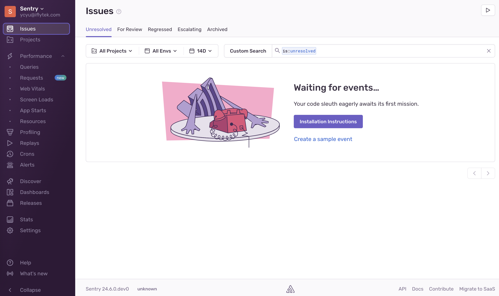
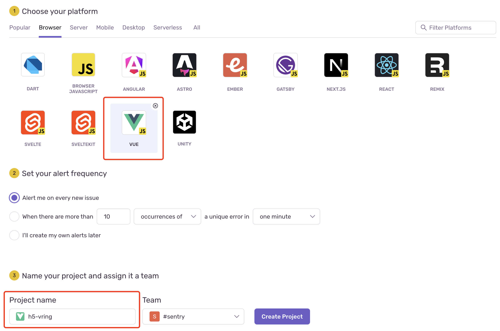
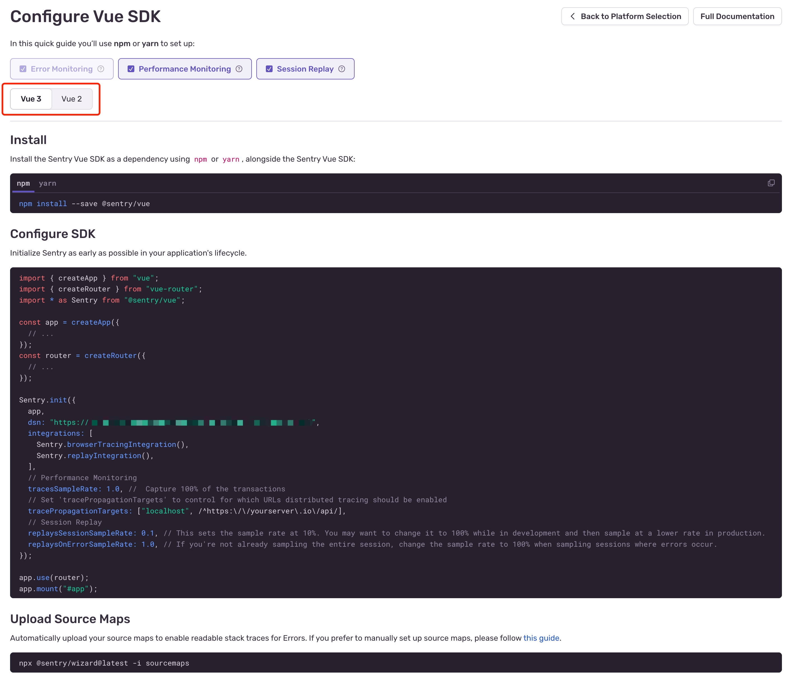

# Sentry使用记录

## 一、私有化部署

仓库地址：https://github.com/getsentry/self-hosted

文档：https://develop.sentry.dev/self-hosted/

按这里的说明部署即可，需要注意的是，它只支持linux平台（一开始我用自己的Mac M2始终安装不成功，可能是因为M2的架构是aarch64，而sentry只支持amd64），另一个需要注意的就是网络代理，因为是在开发环境的服务器上安装，克隆git仓库以及下载镜像等都需要通过我本机的网络代理，所以使用如下命令进行一个通道：

```bash
ssh -R 7890:localhost:7890 root@172.31.114.108
```

因为后续测试时页面端会通过公网来访问sentry的api，所以依赖安装完成之后，在运行`docker compose up -d`之前，还需要修改一下目录`sentry/config.yml`，找到如下配置项：

```yml
system.url-prefix: https://file.iflysec.com
```

以及修改`sentry/sentry.conf.py`:

```python
// 如果不添加https://*.iflysec.com，后面访问https://file.iflysec.com登录sentry时会提示CSRF校验失败
CSRF_TRUSTED_ORIGINS = ["https://*.iflysec.com", "http://128.0.0.1:9000"]
```

之后通过`docker compose up -d`则可以启动容器，接着是配置测试环境的nginx，来使之可以通过公网访问：

```nginx
server {
	listen 18000;
	server_name file.iflysec.com;

	location / {
		proxy_next_upstream error timeout invalid_header http_500 http_503 http_404;
		proxy_pass http://172.31.114.108:9000;
		client_max_body_size 512k;
		proxy_set_header Host $host;
		proxy_set_header X-Real-IP $remote_addr;
		proxy_set_header X-Forwarded-For $proxy_add_x_forwarded_for;
		access_log logs/sentry.access.log main;
		error_log logs/sentry.error.log error;
	}
}
```

```bash
# 检测配置是否有语法错误
nginx -t
# 检测通过后重启nginx使之生效
nginx -s reload
```

通过`https://file.iflysec.com`来访问即可打开Web页面：




## 二、系统使用

### 2.1 创建项目

通过Web端的“Project”进入项目管理页面，点击右上角的“Create Project”即可进入创建项目的页面，然后选择项目类型（比如这里我们选择`vue`）并填写项目名称就可创建



创建完项目后，系统会根据你选择的平台生成对应的SDK配置步骤，包括依赖包安装、SDK的配置（如果前面的配置是正确的，这里会自动生成DSN）以及SourceMap的功能如何设置等


