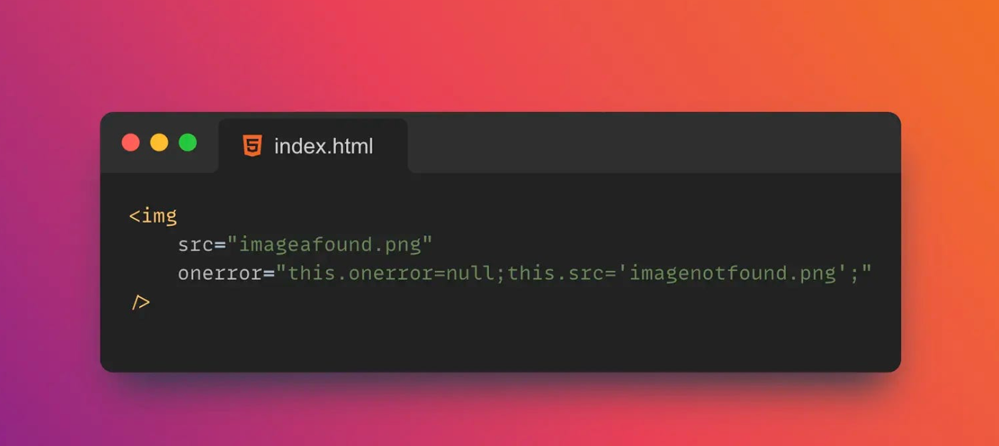
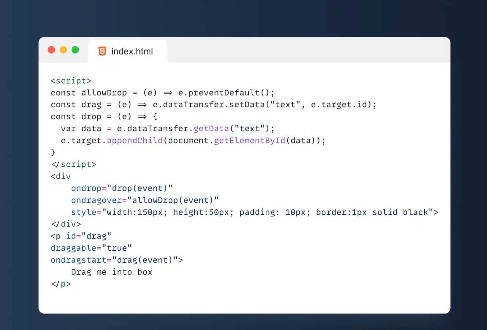
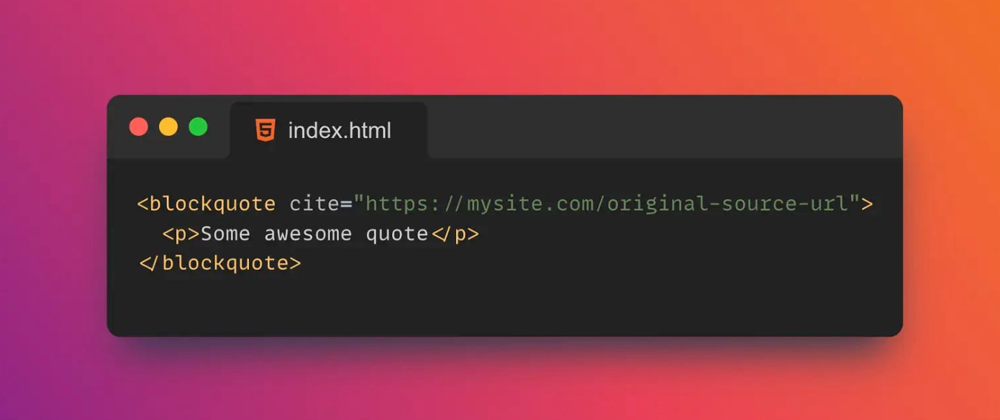

# Snippets

## bash

```bash
# 通过chrome的headless模式截屏或查看dom
./Google\ Chrome --headless --disable-gpu --screenshot https://v.douyin.com/dJ9DhCy/
./Google\ Chrome --headless --disable-gpu --dump-dom https://www.douyin.com/video/6992482384893496576\?previous_page\=app_code_link
```

```bash
# 当前文件夹下所有png图片转换成jpg格式
for image in *.png;
do
convert -quality 85 "$image" "${image%.*}.jpg";
done
```

```bash
©# ffmpeg获取音频时长
ffmpeg -i 曾经的你.mp3 2>&1 | grep -Eo 'Duration: [^\s,]+' | cut -d ' ' -f2
```

```bash
# 查询当前目录下的mp4文件，每行传入一个给mv命令，将其移动到指定目录下
# -n 指定每次输出条目数，这里传1，每次传入一个地址
# -I 用户指定一个占位符，在后续命令中可以使用这个占位符
find . -name "*.mp4" | xargs -n1 -I{} mv {} ~/Downloads/sketch教程
```

```bash
# grep -v 过滤指定的字符串
cat vring.kuyin123.com.access.log.bak20220816 | grep 'GET /friend/296cc1ba42e3fb42' | grep '16/Aug' | grep -v 'Apache-HttpClient/UNAVAILABLE' | wc -l

# awk 打印指定字段，然后排序去重统计行数
cat vring.kuyin123.com.access.log.bak20220816 | grep 'GET /friend/296cc1ba42e3fb42' | grep '16/Aug' | grep -v 'Apache-HttpClient/UNAVAILABLE' | awk '{print $6}' | sort | uniq | wc -l
```

```bash
# 当前文件下的png图片转webp
for file in $(ls ./*.png); do
cwebp $file -o $(echo $file | sed 's/.png/.webp/')
done
```

```bash
# 批量删除分支
git branch | grep feature_2021 | xargs -n1 -I{} git branch -d {}
```

```bash
# 根据用户ip查看用户所在地及运营商类型
for ip in $(cat ip.txt); do
  curl "http://whois.pconline.com.cn/ipJson.jsp?ip=$ip&json=true" >> r.txt
done;
```

```bash
# git clone时指定--single-branch表示仅下载单个分支，--depth=1表示仅下载单个commit，这样速度会快几十倍，算是一个加速小技巧
git clone --depth=1 --single-branch git@github.com:ant-design/ant-design.git
```

```bash
# 替换当前目录下每个子git项目的远程地址
for d in $(ls); do
cd $d;
# git remote set-url origin $(git remote -v | grep '(fetch)' | awk '{print $2}' | sed 's/git@git.iflytek.com:/ssh:\/\/git@code.iflytek.com:30004\//');
# git remote -v
git pull
cd ..;
done;
```

```bash
oldIFS=${IFS};
IFS=$'\n';

for f in $(ls *.mp4);
do
  ffmpeg -i "$f" -f srt -i "`echo $f | sed s/.mp4/.srt/`" -c:v copy -c:a copy -c:s mov_text "`echo $f | sed s/.mp4/_merged.mp4/`";
done;

IFS=${oldIFS}
```

```bash
# mov转mp4
ffmpeg -i example.mov -vcodec libx264 -acodec aac example.mp4
```

```bash
# 打印powerlevel10k的颜色
for i in {0..255}; do print -Pn "%K{$i}  %k%F{$i}${(l:3::0:)i}%f " ${${(M)$((i%6)):#3}:+$'\n'}; done
```

```bash
# 获取本机公网ip地址
curl 'https://open.kuyin123.com/q_ip'
```

```bash
# 统计接口请求耗时
grep q_mrc unionorder.log_20230103 | grep 'call service' | grep '"0000"' |  jq .service.res.cost | awk 'BEGIN {max=0;min=65536} {if ($1+0<min+0) min=$1 fi;if ($1+0>max+0) max=$1 fi;sum+=$1} END{print "max=",max,"min=",min,"times=",NR,"avg=",sum/NR}'
```

```bash
# 统计接口请求耗时在指定值范围的调用次数
grep '"http://172.22.145.102/h5/q_biz"' unionorder.log_20230103 | grep 'call service' | grep '"0000"' | jq -c '{"tc": .service.req.id, "phone":.service.req.params.phone,"cost":.service.res.cost} | select(.cost <= 3000)' | wc -l
```

```bash
# jq多条件搜索
cat result.log | jq '. | select((.phone=="13843140031") and .opdesc=="sendOrderResult")'
```

```bash
# 获取某个包
npm info --loglevel=silent @ring-order/sdk | grep -oP '(?<=latest: )((\d+\.){2}\d+)'
```

```bash
# 这里用到的jq在取字段时，如果字段有特殊字符在里面时的用法
grep x-requested-with unionorder.log_20230611 | jq '.req.headers."x-requested-with"' | sort | uniq -c | sort -nr | head -n 100
```

```bash
# curl请求的各阶段耗时统计
curl -o /dev/null -sS -w "DNS Lookup: %{time_namelookup}s\nConnect: %{time_connect}s\nApp Connect: %{time_appconnect}s\nPre-transfer: %{time_pretransfer}s\nRedirect: %{time_redirect}s\nStart Transfer: %{time_starttransfer}s\nTotal time: %{time_total}s\n" 'https://kuyin.iflysec.com/union-ycyu/api/v1/q_base?btp=1&cid=975d3f8c4f82012d&from=ycyu'
```

```bash
# 批量上传图片
ls | xargs -I {} node /Users/yudiechao/Documents/myproject/node-project/src/img-uploader/upload.js {}
```

```bash
# 当前目录中查找非路径中不包括node_modules的js或ts文件，并且其内容中包含了指定字符串的文件
find . -type f \( -name "*.js" -o -name "*.ts" \) -not -path "*/node_modules/*" -exec grep -q '/api/v1/q_a_url' {} \; -print

# 当前目录中查找指定文件类型，并排除指定文件夹以及指定名称的文件，并打印出完整的文件路径
find ./ -type f -name "*.md" -not -name "README.md" -not -name "weblink.md" -not -path "*/node_modules/*" -not -path "*/work/*" -not -path "*/design/*" -not -path "*/topic/*" -not -path "*/ycyu/*" -not -path "*/jbhan2/*" -exec echo "$(pwd)/{}" \;

# 在当前目录下查找rust的项目，并在其目录下执行cargo clean
find ./ -type f -name "Cargo.toml" -execdir cargo clean \;
```

```bash
# 将mp4转成webp动图
# 用的是libwebp_anim，压缩出来的图片更小，如果使用libwebp，如下参数压缩出来的图片文件要大一倍
ffmpeg -i 11.mp4 -vcodec libwebp_anim -filter:v fps=fps=10 -lossless 0 -loop 0 -compression_level 4 -q:v 70 -preset picture -an -vsync 0 -s 800:600 output.webp
```

```bash
# 从curl的结果中提取信息，注意，如果使用了-v参数，curl会将结果输出到错误流中
curl -v https://abring.diyring.cc/friend/e4cd1658adb7e42f7c0271126b11eeeb\?isImmersive\=true 2>&1 | tail -n5 | head -n1 | awk '{print $NF}' | grep 'exp_tag='

# 仅输出需要匹配的部分
curl -v https://abring.diyring.cc/friend/e4cd1658adb7e42f7c0271126b11eeeb\?isImmersive\=true 2>&1 | grep -o -E 'exp_tag=\d+%\d+'
```

```bash
# 查看level=50的日志，即错误日志
cat h5ring.log_20231220 | jq '. | select(.level==50)'
```

```bash
cat songs.json | fx '.[].musicInfoList' '.map(x=>{const {musicId,...rest} = x; return {...rest, id:musicId}})' > songs_m.json
```

```bash
cat data.json | fx '.assets' '.filter(x=>x.u)' '.map(x=>x.u+x.p)' | jq -r '.[]' | while read -r url; do
echo "processing $url"
curl -s "$url" | base64
done
```

```bash
# 过滤ip地址，然后查询ip归属地
node app.js | awk '{print $5}' | sort | uniq -c | sort -r | head -n20 | awk '{print $2}' | fx -r 'fetch(`http://ip-api.com/json/${x}`)' '.json()' '({query,country,city})=>({ip:query,country,city})'
```

```bash
# 白金会员 fx '({retcode,url})=>({retcode, url})'
cat songs_m.json | jq -r '.[].id' | fx -r 'fetch(`http://client.diyring.cc/h5res/q_ring_audition?pi=002&an=HGG001&v=1.0.00&cn=5223&btp=1&lcc=CN&lp=%E5%AE%89%E5%BE%BD&lc3%E6%96%AF%E5%8F%B0%E9%9F%B3%E5%B8%83%E6%8B%89%E6%A0%BC&contentid=${x}&type=2&phone=18256922923&chargeid=10150005&di=b40d531e3722421d842cd08115a1d376&tc=b40d531e3722421d842cd08115a1d376`)' '.json()' | fx '.retcode'

# 等价方式
cat songs_m.json | jq -r '.[].id' | while read -r id; do                                                                           
curl -s "http://client.diyring.cc/h5res/q_ring_audition?pi=002&an=HGG001&v=1.0.00&cn=5223&btp=1&lcc=CN&lp=%E5%AE%89%E5%BE%BD&lc3%E6%96%AF%E5%8F%B0%E9%9F%B3%E5%B8%83%E6%8B%89%E6%A0%BC&contentid=$id&type=2&phone=18256922923&chargeid=10150005&di=b40d531e3722421d842cd08115a1d376&tc=b40d531e3722421d842cd08115a1d376" | jq '.retcode'
done
```

```bash
# mp4转3gp
ffmpeg -i a.mp4 -vcodec libx264 -x264-params "nal-hrd=none" -refs 3 -vprofile baseline -level 30 -keyint_min 3 -r 30 -g 30 -b:v 600k -maxrate 900k -vf "scale=540:960:force_original_aspect_ratio=decrease,pad=540:960:(ow-iw)/2:(oh-ih)/2" -acodec libvo_amrwbenc -ar 16000 -ac 1 a.3gp
```

```bash
awk -F'[?&]' '{
    source="none"; # 默认假设没有source参数
    for(i=2; i<=NF; i++) { # 遍历URL的查询参数
        split($i, arr, "="); # 按等号分割参数
        if(arr[1] == "source") {
            source=arr[2]; # 如果找到source参数，更新source变量
            break; # 找到后就不再继续查找
        }
    }
    count[source]++; # 根据source的值增加计数
}
END {
    for(s in count) { # 最后，输出每个source及其计数
        print s ": " count[s];
    }
}' urls.txt
```

```bash
cat 12921_2024_03_27.csv | tail -n +2 | grep -oE 'phone=\d{11}' | awk -F= '{print $2}' | sort | uniq -c | sort -r | head -n100
```

```bash
# 等价于curl -v "https://vring.kuyin123.com"
openssl s_client -connect vring.kuyin123.com:443

# 再输入
GET / HTTP/1.1
Host: vring.kuyin123.com

# 敲两次回车
```

```bash
ssh -D 1090 -g root@172.31.114.120
```


## css

```css
/* 修改输入框光标颜色 */
.caret-color {
  caret-color: #ffd476;
}
```

```css
/* input为number时去除尾部小箭头 */
.no-arrow::-webkit-inner-spin-button {
  -webkit-appearance: none;
}
```

```css
/* 隐藏滚动条 */
.box-hide-scrollbar::-webkit-scrollbar {
  display: none; /* Chrome Safari */
}
```

```css
/*自定义scrollbar样式*/
html::-webkit-scrollbar {
  width: 10px;
}

html::-webkit-scrollbar-thumb {
  background: -webkit-gradient(linear, left top, left bottom, from(#ff8a00), to(#da1b60));
  background: linear-gradient(to bottom, #ff8a00, #da1b60);
  border-radius: 5px;
  height: 30px;
  -webkit-box-shadow: inset 2px 2px 2px rgba(255, 255, 255, .25), inset -2px -2px 2px rgba(0, 0, 0, .25);
  box-shadow: inset 2px 2px 2px rgba(255, 255, 255, .25), inset -2px -2px 2px rgba(0, 0, 0, .25)
}

html::-webkit-scrollbar-track {
  background: linear-gradient(to right, #201c29, #201c29 1px, #100e17 1px, #100e17)
}
```

```css
/* 控制滚动链 */
overscroll-behavior: contain;

```

[整屏滚动的css实现——scroll-snap-\*属性](https://css-tricks.com/practical-css-scroll-snapping/)


## node

```bash
# nvm安装node版本
nvm install v14.19.0 --reinstall-packages-from=v14.17.0
```


## javascript

```javascript
// 调起OPPO主题商店
function launchApp(e, i) {
    if (isInWX)
        return void $(".wx-tip").show();
    resourceType = resourceType ? resourceType : typeMap[utilTool.getUrlQuery("type")];
    var o = document.createElement("iframe");
    o.style.display = "none",
    "home" == e ? o.src = "oaps://theme/home?from=h5" : o.src = "oaps://theme/detail?from=h5&rtp=" + resourceType + "&id=" + e,
    i !== !1 && loadingMask.show(),
    document.body.appendChild(o);
    var a = Date.now();
    setTimeout(function() {
        Date.now() - a < 4010 && toastInfo.show(),
        loadingMask.hide(),
        setTimeout(function() {
            toastInfo.hide()
        }, 3e3)
    }, 4e3),
    setTimeout(function() {
        document.body.removeChild(o)
    }, 1e3)
}

```

```javascript
// fetch示例（获取讯飞统一技术门户上的文章）
fetch('http://tech.iflytek.com/utp/forum/post/detail/12087', {
  headers: {
    accept: 'application/json, text/plain, */*',
    'accept-language': 'zh-CN,zh;q=0.9,en;q=0.8',
    authorization: '0v_340aaJBIiTfCW7_S2ta2bKZ7dlOC3WU__',
    'cache-control': 'no-cache',
    pragma: 'no-cache',
  },
  referrer: 'http://tech.iflytek.com/app/forum/article/12087',
  referrerPolicy: 'strict-origin-when-cross-origin',
  body: null,
  method: 'GET',
  mode: 'cors',
  credentials: 'include',
})
  .then(resp => resp.json())
  .then(resp => console.log(resp.data.content));

```

```javascript
// canvas绘制文本自然换行
// 在canvas的原型上添加一个方法
CanvasRenderingContext2D.prototype.wrapText = function (
  canvas,
  text,
  x,
  y,
  maxWidth,
  lineHeight,
) {
  // 对入参的类型进行检测
  if (typeof text != 'string' || typeof x != 'number' || typeof y != 'number') {
    return;
  }
  //如果最大宽度未定义 默认为300px
  if (typeof maxWidth == 'undefined') {
    maxWidth = (canvas && canvas.width) || 300;
  }
  //如果行高未定义 则定义为检测画布文本的行高或html页面的默认行高
  //window.getComptedStyle(Eelement) 传入节点返回节点对象
  if (typeof lineHeight == 'undefined') {
    lineHeight =
      (canvas.canvas &&
        parseInt(window.getComputedStyle(canvas.canvas).lineHeight)) ||
      parseInt(window.getComputedStyle(document.body).lineHeight);
  }
  var arrText = text.split('');
  var line = '';
  for (var n = 0; n < arrText.length; n++) {
    //每个循环累加字符
    var testLine = line + arrText[n];
    //检测累加字符 获取累加字符的高度和宽度
    var metrics = canvas.measureText(testLine);
    var testWidth = metrics.width;
    //如果累加字符的宽度大于定义的绘制文本最大宽度 则绘制累加字符的文本 并且设置换行间距再次进行绘制
    if (testWidth > maxWidth && n > 0) {
      canvas.fillText(line, x, y);
      line = arrText[n];
      y += lineHeight;
    } else {
      line = testLine;
    }
  }
  canvas.fillText(line, x, y);
};
```

```javascript
// joi检验两个字段不能同时为0
Joi.object().keys({
  rtype: Joi.any().valid('0', '2'),
  btype: Joi.any().when('rtype', {
    is: '0',
    then: Joi.required().valid('1'),
    otherwise: Joi.required().valid('0', '1'),
  })
})
```

```javascript
// 数字格式化
"1234567890".replace(/\B(?=(?:\d{3})+(?!\d))/g,',')
```

```javascript
let offset = 12345;
// 将最后一位置为 0
offset &= ~1;
```

```javascript
const isSupportWebp = (nature = 'lossy') => {
  const strategies = Object.assign(Object.create(null), {
    'lossy': 'UklGRiIAAABXRUJQVlA4IBYAAAAwAQCdASoBAAEADsD+JaQAA3AAAAAA',  //有损
    'lossless': 'UklGRhoAAABXRUJQVlA4TA0AAAAvAAAAEAcQERGIiP4HAA==',  // 无损
    'alpha': 'UklGRkoAAABXRUJQVlA4WAoAAAAQAAAAAAAAAAAAQUxQSAwAAAARBxAR/Q9ERP8DAABWUDggGAAAABQBAJ0BKgEAAQAAAP4AAA3AAP7mtQAAAA==',  // 透明
    'animation': 'UklGRlIAAABXRUJQVlA4WAoAAAASAAAAAAAAAAAAQU5JTQYAAAD/////AABBTk1GJgAAAAAAAAAAAAAAAAAAAGQAAABWUDhMDQAAAC8AAAAQBxAREYiI/gcA',  // 动图
  })
  return new Promise((resolve, reject) => {
    const img = new Image()
    img.onload = () => (img.width > 0 && img.height > 0) && resolve(true)
    img.onerror = () => resolve(false)
    img.src = `data:image/webp;base64,${strategies[nature]}`
  })
}

isSupportWebp().then(bool => {
  // true 表示支持，false 表示不支持
})
```

```javascript
// 获取Canvas指纹
function getCanvasFp() {
  var result = [];
  var canvas = document.createElement('canvas');
  canvas.width = 50;
  canvas.height = 30;
  canvas.style.display = 'inline';
  var ctx = canvas.getContext('2d');
  ctx.rect(0, 0, 10, 10);
  ctx.rect(2, 2, 6, 6);
  result.push(
    'canvas winding:' +
      (ctx.isPointInPath(5, 5, 'evenodd') === false ? 'yes' : 'no')
  );
  ctx.textBaseline = 'alphabetic';
  ctx.fillStyle = '#f60';
  ctx.fillRect(1, 1, 10, 10);
  ctx.fillStyle = '#069';
  ctx.globalCompositeOperation = 'multiply';
  ctx.fillStyle = 'rgb(255,0,255)';
  ctx.beginPath();
  ctx.arc(0, 0, 10, 0, Math.PI * 2, true);
  ctx.closePath();
  ctx.fill();
  ctx.fillStyle = 'rgb(0,255,255)';
  ctx.beginPath();
  ctx.arc(10, 10, 10, 0, Math.PI * 2, true);
  ctx.closePath();
  ctx.fill();
  ctx.fillStyle = 'rgb(255,255,0)';
  ctx.beginPath();
  ctx.arc(20, 20, 20, 0, Math.PI * 2, true);
  ctx.closePath();
  ctx.fill();
  ctx.fillStyle = 'rgb(255,0,255)';
  if (canvas.toDataURL) {
    var e = canvas.toDataURL().replace('data:image/png;base64,', '');
    e = window.atob(e);
    result.push('canvas fp:' + e);
  }
  return result.join('~');
}

```

```javascript
// 数字转转成可用于作为变量名的字符串
const base54 = (function(){
    var DIGITS = "abcdefghijklmnopqrstuvwxyzABCDEFGHIJKLMNOPQRSTUVWXYZ$_";
    return function(num) {
            var ret = "";
            do {
                    ret = DIGITS.charAt(num % 54) + ret;
                    num = Math.floor(num / 54);
            } while (num > 0);
            return ret;
    };
})();
```

```javascript
  function urlencode(str) {
    str = (str + '').toString();
    return encodeURIComponent(str).replace(/!/g, "%21").replace(/'/g, "%27").replace(/\(/g, "%28").replace(/\)/g, "%29").replace(/\*/g, "%2A").replace(/%20/g, "+");
  }
```

```javascript
// 判断是否是html开始标签的正则匹配
const ncname = '[a-zA-Z_][\\w\\-\\.]*'
const qnameCapture = `((?:${ncname}\\:)?${ncname})`
const startTagOpen = new RegExp(`^<${qnameCapture}`)

// 以开始标签开始的模板
'<div></div>'.match(startTagOpen) // ["<div", "div", index: 0, input: "<div></div>"]

// 以结束标签开始的模板
'</div><div>我是Berwin</div>'.match(startTagOpen) // null

// 以文本开始的模板
'我是Berwin</p>'.match(startTagOpen) // null
```

```javascript
// 兼容OPPO R9s的vconsole版本
https://kuyin.iflysec.com/ycyu/debug/vconsole.min.js
```

```javascript
// 中文转unicode
function chineseToUnicode(str) {
  let unicodeStr = '';
  for (let i = 0; i < str.length; i++) {
    // 获取字符的Unicode码点
    const unicodeChar = str.charCodeAt(i).toString(16);
    // 添加'\u'前缀并拼接到结果字符串中
    unicodeStr += '\\u' + unicodeChar.padStart(4, '0');
  }
  return unicodeStr;
}

// 如果在chrome里执行，配合copy函数就可以实现复制
copy(chineseToUnicode('6、活动页面所有内容仅用于彩铃推广。'))
```

```javascript
// 将如“my-component”转成“MyComponent”
const classifyRE = /(?:^|[-_])(\w)/g
const classify = str => str
  .replace(classifyRE, c => c.toUpperCase())
  .replace(/[-_]/g, '')
```

```javascript
// 设置返回页面是否返回原滚动位置，默认是“auto”，可以设置为"manual"
history.scrollRestoration
```

```javascript
const x = document.all;
// 这里的if条件是成立的
if (typeof x === 'undefined' && x.length > 0) {
  console.log('hello fatfish');
}

console.log(x);
console.log(typeof x);
console.log(x === undefined);
```

```javascript
// 自己实现一个JSON.stringify方法
const jsonstringify = (data) => {
  // Check if an object has a circular reference
  const isCyclic = (obj) => {
  // Use the Set data type to store detected objects
  let stackSet = new Set()
  let detected = false

  const detect = (obj) => {
    // If it is not an object type, you can skip it directly
    if (obj && typeof obj != 'object') {
      return
    }
    // When the object to be checked already exists in the stackSet, it means that there is a circular reference
    if (stackSet.has(obj)) {
      return detected = true
    }
    // Save the current obj as a stackSet
    stackSet.add(obj)

    for (let key in obj) {
      if (obj.hasOwnProperty(key)) {
        detect(obj[key])
      }
    }
    // After the level detection is completed, delete the current object to prevent misjudgment
    /*
      For example:
      an object's attribute points to the same reference. 
      If it is not deleted, it will be regarded as a circular reference
      let tempObj = {
        name: 'fatfish'
      }
      let obj4 = {
        obj1: tempObj,
        obj2: tempObj
      }
    */
    stackSet.delete(obj)
  }

  detect(obj)

  return detected
}

  // 7#:
  // Executing this method on an object that contains a circular reference throws an error.

  if (isCyclic(data)) {
    throw new TypeError('Converting circular structure to JSON')
  }

  // 9#: An error is thrown when trying to convert a value of type BigInt
  // An error is thrown when trying to convert a value of type bigint
  if (typeof data === 'bigint') {
    throw new TypeError('Do not know how to serialize a BigInt')
  }

  const type = typeof data
  const commonKeys1 = ['undefined', 'function', 'symbol']
  const getType = (s) => {
    return Object.prototype.toString.call(s).replace(/\[object (.*?)\]/, '$1').toLowerCase()
  }

  // not an object
  if (type !== 'object' || data === null) {
    let result = data
    // 4#：The numbers Infinity and NaN, as well as the value null, are all considered null.
    if ([NaN, Infinity, null].includes(data)) {
      result = 'null'
      // 1#：undefined, Function, and Symbol are not valid JSON values. 
      // If any such values are encountered during conversion they are either omitted (when found in an object) or changed to null (when found in an array). 
      // JSON.stringify() can return undefined when passing in "pure" values like JSON.stringify(function() {}) or JSON.stringify(undefined).
    } else if (commonKeys1.includes(type)) {
      return undefined
    } else if (type === 'string') {
      result = '"' + data + '"'
    }

    return String(result)
  } else if (type === 'object') {
    // 5#: If the value has a toJSON() method, it's responsible to define what data will be serialized.
    // 6#: The instances of Date implement the toJSON() function by returning a string (the same as date.toISOString()). 
    // Thus, they are treated as strings.
    if (typeof data.toJSON === 'function') {
      return jsonstringify(data.toJSON())
    } else if (Array.isArray(data)) {
      let result = data.map((it) => {
        // 1#: If any such values are encountered during conversion they are either omitted (when found in an object) or changed to null (when found in an array). 
        return commonKeys1.includes(typeof it) ? 'null' : jsonstringify(it)
      })

      return `[${result}]`.replace(/'/g, '"')
    } else {
      // 2#：Boolean, Number, and String objects are converted to the corresponding primitive values during stringification, in accord with the traditional conversion semantics.
      if (['boolean', 'number'].includes(getType(data))) {
        return String(data)
      } else if (getType(data) === 'string') {
        return '"' + data + '"'
      } else {
        let result = []
        // 8#: All the other Object instances (including Map, Set, WeakMap, and WeakSet) will have only their enumerable properties serialized.
        Object.keys(data).forEach((key) => {
          // 3#: All Symbol-keyed properties will be completely ignored, even when using the replacer function.
          if (typeof key !== 'symbol') {
            const value = data[key]
            // 1#: undefined, Function, and Symbol are not valid JSON values.
            if (!commonKeys1.includes(typeof value)) {
              result.push(`"${key}":${jsonstringify(value)}`)
            }
          }
        })

        return `{${result}}`.replace(/'/, '"')
      }
    }
  }
}
```

```javascript
// 对html中的特殊字符进行转义
const escape = (str) => str.replace(/[&<>"']/g, (m) => ({ '&': '&amp;', '<': '&lt;', '>': '&gt;', '"': '&quot;', "'": '&#39;' }[m]))
```

```javascript
// 单词首字母大写处理
const uppercaseWords = (str) => str.replace(/^(.)|\s+(.)/g, (c) => c.toUpperCase())
// 横线分隔转驼峰
const toCamelCase = (str) => str.trim().replace(/[-_\s]+(.)?/g, (_, c) => (c ? c.toUpperCase() : ''));
```

```javascript
// 检测是否开启深色模式
const isDarkMode = window.matchMedia && window.matchMedia('(prefers-color-scheme: dark)').matches
```

```javascript
// 获取水滴唯一标识
fetch('https://d.xfinfr.com/anls/getUid',{credentials: 'include'}).then(resp=>resp.text()).then(resp=>console.log(resp.match(/WA_ID=(\d+)/)?.[1]))
```


## typescript

```typescript
type BuildArr<
  L extends number,
  Ele = unknown,
  Arr extends unknown[] = [],
  > = Arr['length'] extends L ? Arr : BuildArr<L, Ele, [...Arr, Ele]>

type BuildToMax<
  Max extends number,
  Ele = unknown,
  Arr extends unknown[] = [],
  > = Arr['length'] extends Max ? Arr : Arr | BuildToMax<Max, Ele, [...Arr, Ele]>

type ArrRange<Min extends number, Max extends number, Ele = unknown> = BuildToMax<
  Max,
  Ele,
  BuildArr<Min, Ele>
>

const test: ArrRange<3, 4, number> = [1, 2, 3]
// test
type cases = [
  Expect<Equal<ArrRange<0, 1>, [] | [unknown]>>,
  Expect<
    Equal<
      ArrRange<1, 3>,
      [unknown] | [unknown, unknown] | [unknown, unknown, unknown]
    >
  >,
]


type Expect<T extends true> = T
type Equal<X, Y> = (<T>() => T extends X ? 1 : 2) extends <T>() => T extends Y
  ? 1
  : 2
  ? true
  : false

```

```typescript
type Binary = '0' | '1' | '2'

type BuildArr<T, L extends number, Arr extends unknown[] = []> = Arr['length'] extends L ? Arr : BuildArr<T, L, [...Arr, T]>

// type T1 = Binary extends string ? true : false

// type T2 = `${Binary}${Binary}`

// type T3 = BuildArr<Binary, 2>

// type T4 = [Binary, Binary]['length']

// type T5 = `${Binary}${Binary}`['length']

// type T6 = [Binary, Binary, Binary]

// type T7 = T6 extends string[] ? true : false

type BitStr<T, R extends string = ''> = T extends [infer E extends string, ...infer Tail]
    ? BitStr<Tail, `${R}${E}`>
    : R

type T9 = BitStr<BuildArr<Binary, 2>>


type BitBuild<T extends string, L extends number, Arr extends unknown[] = [], Result extends string = ''> = Arr['length'] extends L
    ? Result
    : BitBuild<T, L, [...Arr, T], `${T}${Result}`>

type T10 = BitBuild<Binary,3>
```

```typescript
enum ShapeType {
  Circle = "circle",
  Rectangle = "rectangle",
}

type ShapeBase<T extends ShapeType> = { type: T };

type Circle = ShapeBase<ShapeType.Circle> & { radius: number };
type Rectangle = ShapeBase<ShapeType.Rectangle> & {
  width: number;
  height: number;
};

type Shape = Circle | Rectangle;

type GetShapeArea<T extends Shape> = (shape: T) => number;

const getCircleShapeArea: GetShapeArea<Circle> = (circle: Circle) =>
  Math.PI * circle.radius ** 2;

const getRectangleShapeArea: GetShapeArea<Rectangle> = (rectangle: Rectangle) =>
  rectangle.width * rectangle.height;

/**
 * 关于Extract的用户参见：https://www.typescriptlang.org/docs/handbook/utility-types.html#extracttype-union
 * Extract<Type, Union>表示从Type中提取可以被赋值给Union类型的类型
 * 比如下方，假设K为ShapeType.Circle时，则Shape中只有Circle是可以被赋值给{ type: ShapeType.Circle }的，因为Circle的类型为 { type: ShapeType.Circle, radius: number}
 */
const getShapeAreaByShapeType: {
  [K in ShapeType]: GetShapeArea<Extract<Shape, { type: K }>>;
} = {
  [ShapeType.Circle]: getCircleShapeArea,
  [ShapeType.Rectangle]: getRectangleShapeArea,
};

const getShapeArea: GetShapeArea<Shape> = (shape: Shape): number => {
  const _getShapeArea = getShapeAreaByShapeType[shape.type] as GetShapeArea<
    Shape
  >;
  return _getShapeArea(shape);
};

const circle: Circle = { type: ShapeType.Circle, radius: 10 };
const rectangle: Rectangle = {
  type: ShapeType.Rectangle,
  width: 10,
  height: 5
};

const shapes: Shape[] = [circle, rectangle];

console.log(shapes.map(getShapeArea)); // Output: [314.1592653589793, 50]
```

```typescript
type A = 1 | 2 | 3;
// means: Does every member of the union type A extend the numeric literal 1
// B = 1 | 2 | 3
type B = A extends 1 ? never : A

// Does the currently evaluated union member extend the numerical literal 1
type DelOne<T> = T extends 1 ? never: T
// C = 2 | 3
type C = DelOne<A>
```

### 关于TypeScript中的“branded type”或称为“nominal typing”

这种语法是 TypeScript 中的一个高级类型表示，它用于创建一个被称作 "nominal typing" 或 "branded type" 的效果。在 TypeScript 中，默认情况下是结构化的类型系统（structural typing），这意味着如果两个不同的类型结构相同，它们就被认为是兼容的。但在某些情况下，我们希望即使两个类型结构相同，也应该将它们视为不兼容的类型，这就是 "nominal typing" 或 "branding" 的用途。

下面的代码：

```typescript
type UserId = string & { readonly brand: unique symbol };
```

在这个类型中：

- `string & { readonly brand: unique symbol }` 表示 `UserId` 类型是一个 `string` 类型和一个含有唯一符号属性 `brand` 的交叉类型。
- `readonly brand: unique symbol` 为 `UserId` 类型添加了一个名为 `brand` 的只读属性，其类型为 `unique symbol`。`unique symbol` 是一个特殊的类型，表示一个独一无二的 symbol。
- 这个 `brand` 属性实际上并不会在运行时存在，它仅仅是在编译时用于类型检查的。这种方法可以让 TypeScript 编译器对待 `UserId` 类型和其他的 `string` 类型（例如 `OrderId` 类型）作为不兼容的类型，虽然它们在运行时都是字符串。

下面是如何使用这种类型的示例：

```typescript
type UserId = string & { readonly brand: unique symbol };
type OrderId = string & { readonly brand: unique symbol };

function createUserId(id: string): UserId {
  return id as UserId;
}

function createOrderId(id: string): OrderId {
  return id as OrderId;
}

let userId = createUserId("user-123");
let orderId = createOrderId("order-456");

// 下面的赋值会在编译时出错，因为虽然 UserId 和 OrderId 在运行时都是字符串，但它们被视为不同的类型。
userId = orderId; // Error: Type 'OrderId' is not assignable to type 'UserId'.
```

在这个示例中，即使 `UserId` 和 `OrderId` 都可以在运行时表示为字符串，TypeScript 编译器仍然认为它们是不同的类型，并且不允许它们相互赋值。这就达到了区分同质类型的目的，这在处理需要类型安全的场景（如处理 ID、密钥等）时特别有用。

下面是一种工具函数的实现：

```typescript
// BrandedTypeBuilder.ts
export class BrandedTypeBuilder<T> {
  private readonly _creator: (value: any) => T;

  constructor(creator: (value: any) => T) {
    this._creator = creator;
  }

  get(value: any): T {
    return this._creator(value);
  }
}

type UserId = string & { readonly brand: unique symbol };
type EmailAddress = string & { readonly brand: unique symbol };

const createUserId = (value: string): UserId => {
  // Validation here
  return value as UserId;
}

const createEmailAddress = (value: string): EmailAddress => {
  // Validation here, etc.
  return value as EmailAddress;
}

// BuilderInstances.ts
import { BrandedTypeBuilder } from './BrandedTypeBuilder';

export const userIdBuilder = new BrandedTypeBuilder<UserId>(createUserId);
export const emailAddressBuilder = new BrandedTypeBuilder<EmailAddress>(createEmailAddress);

// someComponent.tsx
import { userIdBuilder, emailAddressBuilder } from './builderInstances';

// Use the builders as needed
const userId = userIdBuilder.get('my-string');
const emailAddress = emailAddressBuilder.get('example@example.com');

// Your component code...
```


## linux

```bash
# 查看cpu数、内存情况， top命令后，再按数字1
top

# 查看硬盘大小
df -lh

# 查看可用内存, -m是以兆为单位，-g则是吉为单位
free -m
free -g

```

```bash
# 查看系统发行版本
cat /etc/redhat-release
```

## 微信相关

```javascript
// 关闭H5页面，退出到微信界面
function fnClose(){
  WeixinJSBridge.call('closeWindow');
}
```

## pinia

```typescript
// store/index.ts
import type { App } from 'vue';
import { createPinia } from 'pinia';

// 注意这里创新并导出了pinia的实例
export const store = createPinia();

export function setupStore(app: App) {
  app.use(store);
}

// store/modules/app/index.ts
import { defineStore } from 'pinia';
// 省略中间代码
// 导入上一个文件中导出的pinia实例
import { store } from '@/store';

export const useAppStore = defineStore('app-store', {
  // 省略中间代码
});

// 重点是这个，手动添加pinia实例
export function useAppStoreWithOut() {
	return useAppStore(store);
}
```

## webpack

```json
// babel-loader配置
{
  test: /\.js$/,
  exclude: /(node_modules|bower_components)/,
  use: {
    loader: 'babel-loader',
    options: {
      presets: [
        [
          'env',
          {
            modules: false, // 禁用babel-preset-env的模块化规范转化
          },
        ],
        'stage-2', //建议使用成熟度较高的试验性规范
      ],
      // 其他插件，根据项目具体需求自由搭配
      plugins: [require('babel-plugin-transform-object-rest-spread')],
    },
  },
};

```

## vue

```vue
import {
  h,
  defineAsyncComponent,
  defineComponent,
  ref,
  onMounted,
  AsyncComponentLoader,
  Component,
} from 'vue';

type ComponentResolver = (component: Component) => void

export const lazyLoadComponentIfVisible = ({
  componentLoader,
  loadingComponent,
  errorComponent,
  delay,
  timeout
}: {
  componentLoader: AsyncComponentLoader;
  loadingComponent: Component;
  errorComponent?: Component;
  delay?: number;
  timeout?: number;
}) => {
  let resolveComponent: ComponentResolver;

  return defineAsyncComponent({
    // the loader function
    loader: () => {
      return new Promise((resolve) => {
        // We assign the resolve function to a variable
        // that we can call later inside the loadingComponent 
        // when the component becomes visible
        resolveComponent = resolve as ComponentResolver;
      });
    },
    // A component to use while the async component is loading
    loadingComponent: defineComponent({
      setup() {
        // We create a ref to the root element of 
        // the loading component
        const elRef = ref();

        async function loadComponent() {
            // `resolveComponent()` receives the
            // the result of the dynamic `import()`
            // that is returned from `componentLoader()`
            const component = await componentLoader()
            resolveComponent(component)
        }

        onMounted(async() => {
          // We immediately load the component if
          // IntersectionObserver is not supported
          if (!('IntersectionObserver' in window)) {
            await loadComponent();
            return;
          }

          const observer = new IntersectionObserver((entries) => {
            if (!entries[0].isIntersecting) {
              return;
            }

            // We cleanup the observer when the 
            // component is not visible anymore
            observer.unobserve(elRef.value);
            await loadComponent();
          });

          // We observe the root of the
          // mounted loading component to detect
          // when it becomes visible
          observer.observe(elRef.value);
        });

        return () => {
          return h('div', { ref: elRef }, loadingComponent);
        };
      },
    }),
    // Delay before showing the loading component. Default: 200ms.
    delay,
    // A component to use if the load fails
    errorComponent,
    // The error component will be displayed if a timeout is
    // provided and exceeded. Default: Infinity.
    timeout,
  });
};
```

## git

```bash
git config --global core.editor "code --wait"
```

## cypress

```bash
# 使用淘宝镜像安装
CYPRESS_DOWNLOAD_PATH_TEMPLATE='https://registry.npmmirror.com/-/binary/cypress/${version}/${platform}-${arch}/cypress.zip' npm i -D cypress --audit=false
```

## html





用于SEO，表示一段引用 



```html
<!-- 声明当前页面支持浅色与深色模式，在部分安卓机器上，系统就不会由来干涉，做颜色上的调整了 -->
<meta name="color-scheme" content="light dark">
```


## svg

```svg
<svg xmlns="http://www.w3.org/2000/svg" width="10" height="12">
  <g fill-rule="evenodd">
    <rect width="2" height="12" x="8" rx="1">
      <animate attributeName="height" dur="1.2s" repeatCount="indefinite" values="12;3;12" />
      <animate attributeName="y" dur="1.2s" repeatCount="indefinite" values="0;9;0;" />
    </rect>
    <rect width="2" height="12" x="4" rx="1">
      <animate attributeName="height" begin="-.1" dur="1.2s" keyTimes="0;0.2;1" repeatCount="indefinite"
        values="12;3;12" />
      <animate attributeName="y" begin="-.1" dur="1.2s" keyTimes="0;0.2;1" repeatCount="indefinite" values="0;9;0;" />
    </rect>
    <rect width="2" height="12" y="9" rx="1">
      <animate attributeName="height" begin="-.6" dur="1.2s" repeatCount="indefinite" values="12;3;12" />
      <animate attributeName="y" begin="-.6" dur="1.2s" repeatCount="indefinite" values="0;9;0;" />
    </rect>
  </g>
</svg>
```

## git

```bash
# 以指定格式输出日志，这里分别为：提交历史 - 作者,时间 : 提交信息
git log --pretty=format:"%h - %an,%ar : %s" OPPO账号一键登录文档.md
# 基于此，我们就可以打印任何一个文件的历史作者，paste命令用于将多行合并成一行，-s表示合并所行，-d用于指定分隔符，-表示读取来自标准输入的数据
git log --pretty=format:"%an" 音频彩铃业务流程总览.md | sort | uniq | paste -sd ',' -
```

