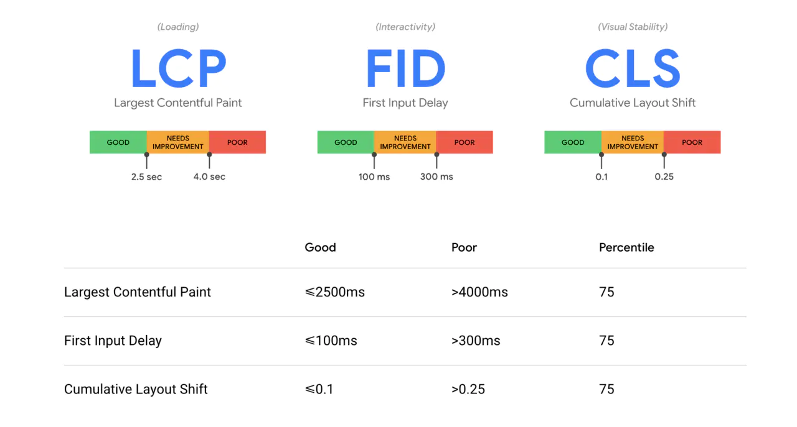

# Web Performance--Frontend Master

## Web Vitals

- FCP First Contentful Paint
- LCP Largest Contentful Paint
- CLS Cumulative Layout Shift
- FID First Input Delay

### FCP——Respond Quick

从用户首次点击链接或输入url开始计时直到第一个有意义的内容展现在页面之上，这表示页面不再是空白的div，而是有一些内容已被渲染

> The Time until the user sees an indication that the page is loading

### LCP——Get To The Point

页面渲染过程中，浏览器可以检测出已绘制内容的屏幕占比，当屏占比最大的内容完成渲染时，这一时刻就是LCP，这个过程就是一个像素检测的过程

> The time util the users sess most of the page and believes it is (almost) ready

### CLS——Don‘t Move Stuff

随着页面的加载，页面上的内部发生位移，比如页面顶部有一个banner，未加载前banner下方的内容是在页面顶部，但当banner加载时，这部分内容又会被banner挤到下方

> The movement distance and impact of page elements during the entire lifetime of the document the user sees

CLS 对客户端渲染的影响：导致reflow

### FID——Don‘t Load Too Much

此指标只在用户与页面发生交互时才会获得，因为它实际上不是用于标示用户可见的内容，而是用来衡量当用户交互时，浏览器多久可以进行响应，因为即使通过一些手段让内容先进行展示，但页面的交互还是需要javascript的解析与执行，也就是说，可能看上去内容已经完成渲染了，但当用户开始操作时，页面可能无法立刻响应，因为此时浏览器可能正在解释执行javascript

> The browser time delay between the user's first click and execution of application code.

### 各指标的一个衡量标准——By Google

## Measure Performance

- Lab Data 本地测试的实验室数据
- Synthetic Data 第三方性能测试服务
- Field Data 用户端侧数据

## Improveing Web Performance

