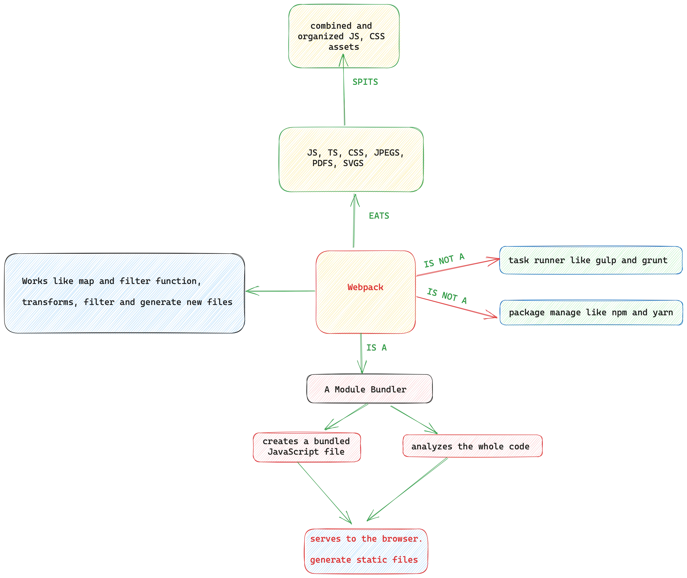

# Something About Webpack

## 1. What is webpack

## 2. Loaders

the execution of loader hapeens **right to left**

## 3. Plugins

Plugins are applied on each bundle file **at the end of the compilation process**. rather than on each file unlike loaders