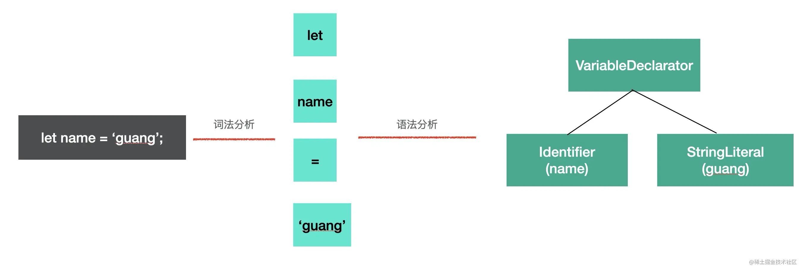
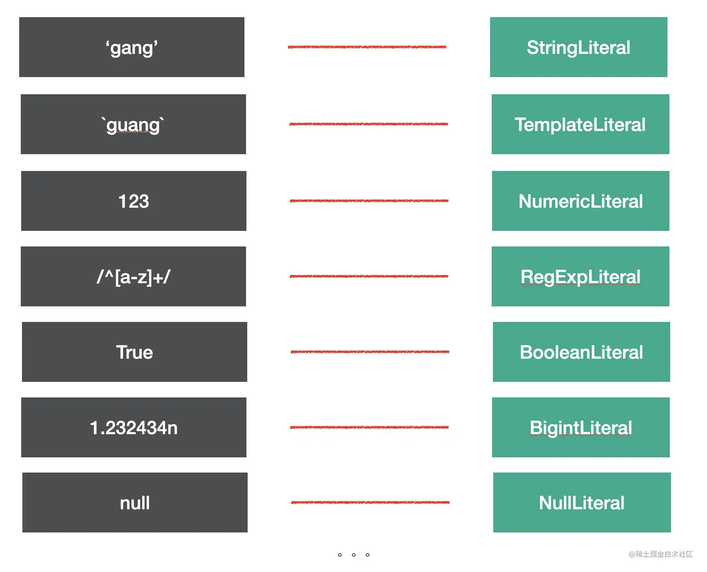
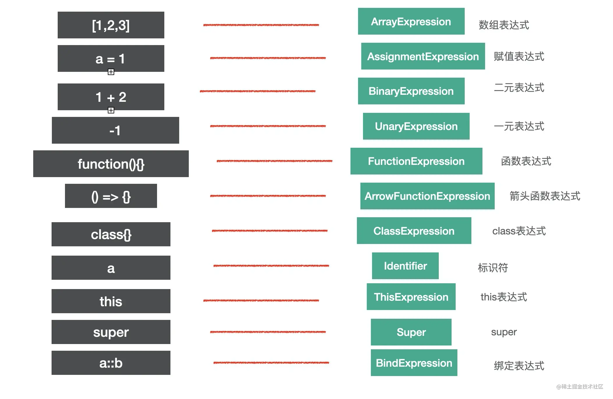
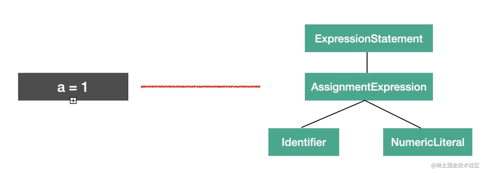
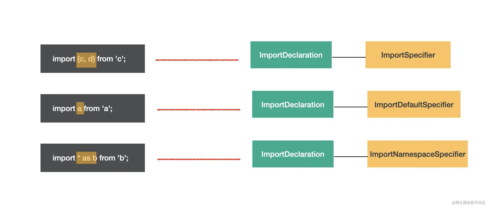
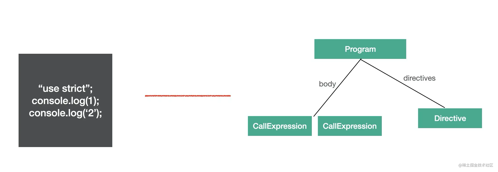
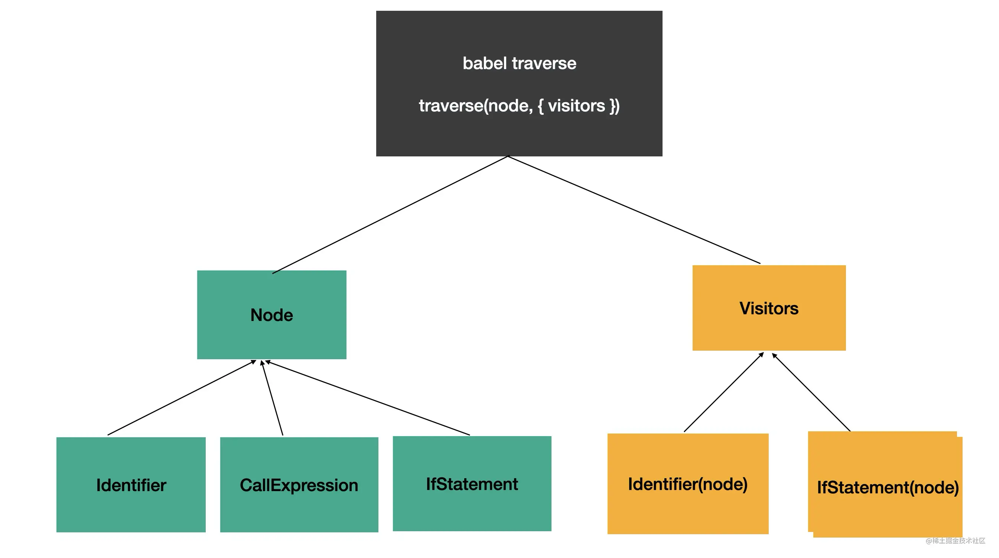
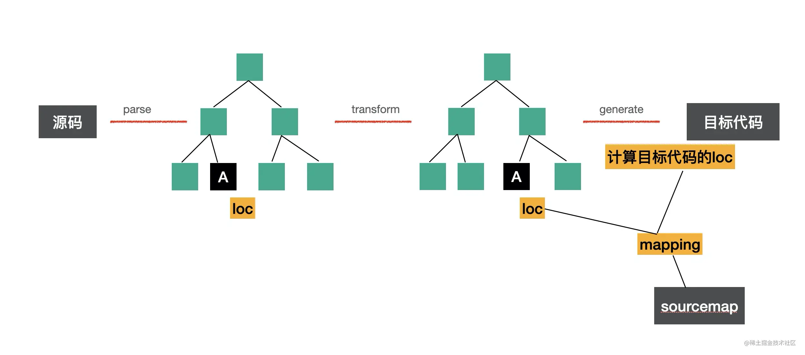
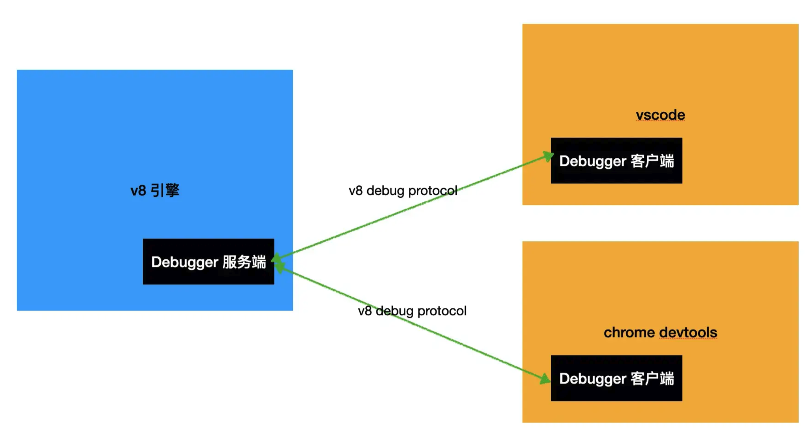

# Babel插件通关秘籍

## 第1章 Babel的介绍

## 第2章 Babel的编译流程


### 2.1 parse

parse阶段的目的是把源码字符串转换为机器能够理解的AST，这个过程分为词法分析、语法分析。词法分析即是将源码字符串拆分成一个个不能细分的单词（token），而语法分析则是将这些token进行递归组装，生成AST，如下：



### 2.2 transform

transform阶段则是对上一步生成的AST进行节点遍历，在遍历的过程中对于不同类型的节点会调用预先注册的visitor函数，该函数则可以对AST的节点进行修改并返回新的AST

### 2.3 generate

generate阶段会将AST打印成目标代码，并生成sourcemap


## 第3章 Babel的AST

### 常见AST节点

#### 1 Literal——字面量

这个没什么好解释的，代码中出现的数字、字符串等等



#### 2 Identifier

即代码中的标识符，比如变量名、属性名、参数名等各种声明和引用的名字

#### 3 Statement

即语句，是可以独立执行的单位


#### 4 Declaration

声明语句，它的执行逻辑是在作用域内声明一个变量、函数、class、import、export等


#### 5 Expression

表达式，与语句的区别就是执行完以后有返回值（即使返回值是undefined）



##### 5.1 表达式与语句

判断AST节点是不是某种类型要看它是不是符合该种类型的特点 ，比如语句的特点是能够单独执行，表达式的特点 是有返回值。

有的表达式可能单独执行，符合语句的特点，所以也是语句，比如赋值表达式、数组表达式，但有的表达式不能单独执行，比如匿名函数表达式和匿名class表达式（它们单独执行时会报错）

表达式作为语句执行时，查看AST会发现其上裹了一层`ExpressionStatement`节点，代表这个表达式是被当语句执行的



#### 6. Class

即类声明，基结构如下所示，整体内容被包裹在`ClassBody`中，属性和方法分别为`ClassProperty`与`ClassMethod`，其中构造函数与普通方法通过该节点的`kind`属性区分


#### 7 Module相关

##### 7.1 import

如下图，三种import语法都对应`ImportDeclaration`节点，通过`specifiers`属性来进行区分



##### 7.2 export

导出的三种语法对应三种类型的AST节点


#### 8 Program & Directive

program代表整个程序的节点，它的`body`属性代码程序体，存放`statement`数组，`directives`属性存储`Directive`节点，比如`use strict`



#### 9 File & Comment

babel的AST最外层节点就是`File`，它有`program`、`comments`、`tokens`等属性，分别存放Program程序体、注释、token等，注意块注释与行内注释的节点分别为`CommentBlock`与`CommentLine`

### AST 可视化查看工具

可以通过[astexplorer](https://astexplorer.net/)这个工具来查看AST

想查看全部的 AST 可以在[babel parser 仓库里的 AST 文档](https://link.juejin.cn/?target=https%3A%2F%2Fgithub.com%2Fbabel%2Fbabel%2Fblob%2Fmain%2Fpackages%2Fbabel-parser%2Fast%2Fspec.md)里查，或者直接去看 @babel/types 的[ typescript 类型定义](https://link.juejin.cn/?target=https%3A%2F%2Fgithub.com%2Fbabel%2Fbabel%2Fblob%2Fmain%2Fpackages%2Fbabel-types%2Fsrc%2Fast-types%2Fgenerated%2Findex.ts)

### AST 的公共属性

- `type`： AST 节点的类型
- `start、end、loc`：start 和 end 代表该节点在源码中的开始和结束下标。而 loc 属性是一个对象，有 line 和 column 属性分别记录开始和结束的行列号
- `leadingComments、innerComments、trailingComments`： 表示开始的注释、中间的注释、结尾的注释，每个 AST 节点中都可能存在注释，而且可能在开始、中间、结束这三种位置，想拿到某个 AST 的注释就通过这三个属性
- `extra`：记录一些额外的信息，用于处理一些特殊情况。比如 StringLiteral 的 value 只是值的修改，而修改 extra.raw 则可以连同单双引号一起修改

## 第4章 Babel的API

### babel的api有哪些

- parse 阶段有`@babel/parser`，功能是把源码转成 AST
- transform 阶段有 `@babel/traverse`，可以遍历 AST，并调用 visitor 函数修改 AST，修改 AST 自然涉及到 AST 的判断、创建、修改等，这时候就需要 `@babel/types` 了，当需要批量创建 AST 的时候可以使用 `@babel/template` 来简化 AST 创建逻辑。
- generate 阶段会把 AST 打印为目标代码字符串，同时生成 sourcemap，需要 `@babel/generator` 包
- 中途遇到错误想打印代码位置的时候，使用 `@babel/code-frame` 包
- babel 的整体功能通过 `@babel/core` 提供，基于上面的包完成 babel 整体的编译流程，并应用 plugin 和 preset

### @babel/parser

基于acorn实现，默认只支持处理js代码，可通过如jsx、typescript等语法插件来支持jsx、typescript的解析

常使用的API为：

```javascript
function parse(input: string, options?: ParserOptions): File
```

`ParserOptions`中可以指定语法解析的插件（plugins选项）、是否允许特定语法（allowXxx选项）以及是否支持解析模块语法（sourceType）等等，sourceType的可选值如下：

- module: 解析es modules语法
- script：不解析es modules语法
- unambiguous：根据内容是否有import和export来自动设置是module还是script

所以我们一般将`sourceType`指定为`unambiguous`

### @babel/traverse

用于遍历由`@babel/parser`转换得到的AST，API定义如下：

```javascript
function traverse(parent, opts)
```

parent指定需要遍历的AST，opts指定visitor对象，visitor对象中可以指定当遍历AST遇到指定类型的节点时需要进行什么处理，API形式如下：

```javascript
traverse(ast, {
  // 针对函数声明类型的节点
  FunctionDeclaration: {
    // 进入节点时调用
  	enter(path, state) {},
    // 离开节点时调用
    exit(path, state){}
  }
})
```

或：

```javascript
traverse(ast, {
  // 进入节点时调用
  FunctionDeclaration(path, state) {}
})
```

#### 遍历过程

**enter会在遍历节点的子节点前调用 ，exit会在遍历完当前节点的子节点后调用**，如下图：


可以一次指定多种类型节点的处理：

```javascript
traverse(ast, {
	'FunctionDeclaration|VariableDeclaration'(path, state) {}
})
```

也可以使用别名的方式来处理多个类型的节点，比如各种 XxxStatement 有个 Statement 的别名，各种 XxxDeclaration 有个 Declaration 的别名（具体的别名有哪些在[babel-types 的类型定义](https://link.juejin.cn/?target=https%3A%2F%2Fgithub.com%2Fbabel%2Fbabel%2Fblob%2Fmain%2Fpackages%2Fbabel-types%2Fsrc%2Fast-types%2Fgenerated%2Findex.ts%23L2059)可以查）：

```javascript
traverse(ast, {
  Declaration: {
    exit(path, state) {}
})
```

#### 关于vistor函数的参数path & state

**path**记录了AST遍历过程中的路径，通过它将节点关联起来，比如`path.node`指向当前的AST节点，`path.parent`指向父级AST节点，`path.find`从当前节点向上查找节点，`path.scope`获取当前节点的作用域信息，`path.isXxx`判断当前节点是不是xx类型等等

**state**则是遍历过程中在不同节点之间传递数据的机制，插件可以通过state传递options和file信息，也可以通过它存储一些遍历过程中的共享数据

### @babel/types

在遍历AST的过程中可能需要创建AST节点或判断AST节点的类型，该包就提供了相关的API，比如创建IfStatement可以用`t.ifStatement(test, consequent, alternate);`，判断是否是IfStatement可以调用`t.isIfStatement(node, opts)`，opts可以用于指定更多限制条件，比如：`t.isIdentifier(node, { name: 'paths' })`

### @babel/template

该提供了批量创建AST节点的功能，主要的API如下：

- template.ast(code, [opts])：返回整个AST
- template.program(code, [opts])：返回Program节点
- template.expression(code, [opts])：返回创建的expression的节点
- template.statements(code, [opts])：返回创建的statements的节点

template支持占位符，如下：

```javascript
const fn = template(`console.log(NAME)`);
// 或者用下面的方式
// const fn = template(`console.log(%%NAME%%)`);

const ast = fn({
  NAME: t.stringLiteral("guang"),
});
```

### @babel/generator

用于将AST打印成目标代码字符串，并生成sourcemap

```javascript
function (ast: Object, opts: Object, code: string): {code, map}
```

opts参数用来指定打印的一些细节，比如是否包含注释，是否去除空白字符串等

code是多个文件合并打印时才需要，一般用不到

通常是如下使用：

```javascript
import generate from "@babel/generator";
const { code, map } = generate(ast, { sourceMaps: true })
```

### @babel/code-frame

用于打印错误信息并控制台打印代码格式

```javascript
const { codeFrameColumns } = require("@babel/code-frame");

try {
 throw new Error("xxx 错误");
} catch (err) {
  console.error(codeFrameColumns(`const name = guang`, {
      start: { line: 1, column: 14 }
  }, {
    highlightCode: true,
    message: err.message
  }));
}
```

打印效果：


### @babel/core

babel的功能就是基于上述的包来实现的，而babel基于这些包来实现编译、插件、预设等功能的包就是@babel/core

## 第5章 实战案例：插入函数调用参数

babel 插件的形式就是函数返回一个对象，对象有 visitor 属性

```js
module.exports = function(api, options) {
  return {
    visitor: {
      Identifier(path, state) {},
    },
  };
}
```

函数的第一个参数可以拿到 types、template 等常用包的 api，这样我们就不需要单独引入这些包了。

而且作为插件用的时候，并不需要自己调用 parse、traverse、generate，这些都是通用流程，babel 会做，我们只需要提供一个 visitor 函数，在这个函数内完成转换功能就行了

## 第6章 JS Parser的历史

## 第7章 traverse的path、scope、visitor

babel会遍历AST，遍历过程中处理到不同的AST会调用不同的visitor函数来实现transform，这是一种称为访问者模式的设计模式

### visitor模式

> 访问者模式（visitor）的思想是：当被操作的对象结构比较稳定，而操作对象的逻辑经常变化的时候，通过分离逻辑和对象结构，使得他们能独立扩展。

对应到babel的实现，就是AST与visitor分享，在traverse（遍历）AST时，调用注册的visitor来对其进行处理



### path 和 scope

path 是记录遍历路径的 api，它记录了父子节点的引用，还有很多增删改查 AST 的 api


#### path

- path.node 当前 AST 节点
- path.parent 父 AST 节点
- path.parentPath 父 AST 节点的 path
- path.scope 作用域
- path.hub 可以通过 path.hub.file 拿到最外层 File 对象， path.hub.getScope 拿到最外层作用域，path.hub.getCode 拿到源码字符串
- path.container 当前 AST 节点所在的父节点属性的属性值
- path.key 当前 AST 节点所在父节点属性的属性名或所在数组的下标
- path.listkey 当前 AST 节点所在父节点属性的属性值为数组时 listkey 为该属性名，否则为 undefined

##### container、listkey、key

因为 AST 节点要挂在父 AST 节点的某个属性上，那个属性的属性值就是这个 AST 节点的 container。

比如 CallExpression 有 callee 和 arguments 属性，那么对于 callee 的 AST 节点来说，callee 的属性值就是它的 container，而 callee 就是它的 key

#### 作用域 path.scope

scope 是作用域信息，javascript 中能生成作用域的就是模块、函数、块等，而且作用域之间会形成嵌套关系，也就是作用域链。babel 在遍历的过程中会生成作用域链保存在 path.scope 中

- scope.bindings 当前作用域内声明的所有变量
- scope.block 生成作用域的 block，详见下文
- scope.path 生成作用域的节点对应的 path
- scope.references 所有 binding 的引用对应的 path，详见下文
- scope.dump() 打印作用域链的所有 binding 到控制台
- scope.parentBlock 父级作用域的 block
- getAllBindings() 从当前作用域到根作用域的所有 binding 的合并
- getBinding(name) 查找某个 binding，从当前作用域一直查找到根作用域
- getOwnBinding(name) 从当前作用域查找 binding
- parentHasBinding(name, noGlobals) 查找某个 binding，从父作用域查到根作用域，不包括当前作用域。可以通过 noGlobals 参数指定是否算上全局变量（比如console，不需要声明就可用），默认是 false
- removeBinding(name) 删除某个 binding
- hasBinding(name, noGlobals) 从当前作用域查找 binding，可以指定是否算上全局变量，默认是 false
- moveBindingTo(name, scope) 把当前作用域中的某个 binding 移动到其他作用域
- generateUid(name) 生成作用域内唯一的名字，根据 name 添加下划线，比如 name 为 a，会尝试生成 _a，如果被占用就会生成 __a，直到生成没有被使用的名字。

##### scope.bindings、scope.references

作用域中保存的是声明的变量和对应的值，**每一个声明叫做一个binding**。

`binding.identifier` 和 `binding.path`，分别代表标识符、整个声明语句。

声明之后的变量会被引用和修改，binding.referenced 代表声明的变量是否被引用，binding.constant 代表变量是否被修改过。

如果被引用了，就可以通过 binding.referencePaths 拿到所有引用的语句的 path。如果被修改了，可以通过 binding.constViolations 拿到所有修改的语句的 path。

### state

state 是遍历过程中 AST 节点之间传递数据的方式。插件的 visitor 中，第一个参数是 path，第二个参数就是 state。

插件可以从 state 中拿到 opts，也就是插件的配置项，也可以拿到 file 对象，file 中有一些文件级别的信息，这个也可以从 path.hub.file 中拿

**可以在遍历的过程中在 state 中存一些状态信息，用于后续的 AST 处理**

### AST的别名

前文提到过，在visitor中可以指定单个AST类型、多个AST类型（竖线分隔）或用AST类型别名，它代表一类节点类型，可以在[文档中](https://link.juejin.cn/?target=https%3A%2F%2Fbabeljs.io%2Fdocs%2Fen%2Fbabel-types)查到某个 AST 类型的别名是啥，某个别名都包含哪些 AST 类型可以在[babel-types的类型定义](https://link.juejin.cn/?target=https%3A%2F%2Fgithub.com%2Fbabel%2Fbabel%2Fblob%2Fmain%2Fpackages%2Fbabel-types%2Fsrc%2Fast-types%2Fgenerated%2Findex.ts%23L2489-L2535)处查

## 第8章 Generator 和 SourceMap 的奥秘

### generate

generate 是把 AST 打印成字符串，是一个从根节点递归打印的过程，对不同的 AST 节点做不同的处理，在这个过程中把抽象语法树中省略掉的一些分隔符重新加回来

### sourcemap




具体生成 sourcemap 的过程是用 mozilla 维护的 [source-map](https://link.juejin.cn/?target=https%3A%2F%2Fwww.npmjs.com%2Fpackage%2Fsource-map) 这个包，其他工具做 sourcemap 的解析和生成也是基于这个包。

[推荐阅读1](https://juejin.cn/post/6844903689610592269)[推荐阅读2](http://www.qiutianaimeili.com/html/page/2019/05/89jrubx1soc.html) 及[工具](https://www.murzwin.com/base64vlq.html)

## 第9章 Code-Frame和代码高亮原理

### 番外：如何在控制台打印颜色

可以通过打印 ESC 的 ASCII 码（27）来进入控制打印颜色的状态，格式如下：


打印一个 `ESC` 的 ASCII 码，之后是 `[` 代表开始，`m` 代表结束，中间是用 `;` 分隔的 n 个控制字符，可以控制很多样式，比如前景色、背景色、加粗、下划线等等。

ESC 的 ASCII 码是 27，有好几种写法：一种是字符表示的 `\e` ，一种是 16 进制的 `\0x1b`（27 对应的 16进制），一种是 8 进制的 `\033`，这三种都表示 ESC。

比如以下效果：

```bash
# 1 表示加粗、36 表示前景色为青色、4 表示下划线
# 加了样式还要去掉，可以加一个 `\e[0m` 就可以了（`\033[0m`,`\0x1b[0m` 等价）
echo -e "\e[36;1;4mhello world\e[0m ycyu"
```


当然，更多的时候我们是直接使用chalk这个库来实现控制台的色彩打印

## 第10章 Babel插件和preset

### plugin的使用

babel配置文件中plugins的配置格式如下：

```json
{
  plugins: ["pluginA", ["pluginB"], ["pluginC", {/* options */}]]
}
```

### plugin的格式

#### 返回对象的函数

第一种是一个函数返回一个对象的格式，对象里有 `visitor`、`pre`、`post`、`inherits`、`manipulateOptions` 等属性

```javascript
export default function(api, options, dirname) {
  return {
    inherits: parentPlugin,
    manipulateOptions(options, parserOptions) {
        options.xxx = '';
    },
    pre(file) {
      this.cache = new Map();
    },
    visitor: {
      StringLiteral(path, state) {
        this.cache.set(path.node.value, 1);
      }
    },
    post(file) {
      console.log(this.cache);
    }
  };
} 
```

首先，插件函数有 3 个参数，api、options、dirname。

- api 里包含了各种 babel 的 api，比如 types、template 等，这些包就不用在插件里单独单独引入了，直接取来用就行。
- options 就是外面传入的参数
- dirname 是目录名（不常用）

返回的对象有 inherits、manipulateOptions、pre、visitor、post 等属性。

- inherits 指定继承某个插件，和当前插件的 options 合并，通过 `Object.assign` 的方式。
- visitor 指定 traverse 时调用的函数。
- pre 和 post 分别在遍历前后调用，可以做一些插件调用前后的逻辑，比如可以往 file（表示文件的对象，在插件里面通过 state.file 拿到）中放一些东西，在遍历的过程中取出来。
- manipulateOptions 用于修改 options，是在插件里面修改配置的方式

**插件做的事情就是通过 api 拿到 types、template 等，通过 state.opts 拿到参数，然后通过 path 来修改 AST。可以通过 state 放一些遍历过程中共享的数据，通过 file 放一些整个插件都能访问到的一些数据，除了这两种之外，还可以通过 this 来传递本对象共享的数据。**

#### 对象

这种方式用于**不需要处理参数**的情况

```javascript
export default plugin =  {
    pre(state) {
      this.cache = new Map();
    },
    visitor: {
      StringLiteral(path, state) {
        this.cache.set(path.node.value, 1);
      }
    },
    post(state) {
      console.log(this.cache);
    }
};
```

### preset

将多个plugin封装成一个preset，降低使用成本，preset 格式和 plugin 一样，也是可以是一个对象，或者是一个函数，函数的参数也是一样的 api 和 options，区别只是 preset 返回的是配置对象，包含 plugins、presets 等配置。

```javascript
export default function(api, options) {
  return {
      plugins: ['pluginA'],
      presets: [['presetsB', { options: 'bbb'}]]
  }
}
// 或
export default obj = {
      plugins: ['pluginA'],
      presets: [['presetsB', { options: 'bbb'}]]
}
```

### ConfigItem

`@babel/core` 的包提供了 `createConfigItem` 的 api，用于创建配置项。我们之前都是字面量的方式创建的，当需要把配置抽离出去时，可以使用 `createConfigItem`

```js
const pluginA = createConfigItem('pluginA);
const presetB = createConfigItem('presetsB', { options: 'bbb'})

export default obj = {
      plugins: [ pluginA ],
      presets: [ presetB ]
  }
}
```

### 顺序

**babel 会按照如下顺序处理插件和 preset：**

1. **先应用 plugin，再应用 preset**
2. **plugin 从前到后，preset 从后到前**

## 第11章 Babel插件的单元测试

## 第12章 Babel的内置功能（上）

### 从插件到preset

babel 的内置的 plugin，就 `@babel/plugin-syntax-xxx`, `@babel/plugin-transform-xxx`、`@babel/plugin-proposal-xxx` 3种

- syntax plugin是让 parser 能够正确的解析对应的语法成 AST
- transform plugin 是对 AST 的转换，各种 es20xx 语言特性、typescript、jsx 等的转换都是在 transform plugin 里面实现的
- proposal plugin是用于处理未加入语言标准的特性的 AST 转换插件 ，其实他也是 transform plugin，但是为了和标准特性区分

### babel runtime

babel runtime 里面放运行时加载的模块，会被打包工具打包到产物中，下面放着各种需要在 runtime 使用的函数，包括三部分：regenerator、corejs、helper。

- corejs 这就是新的 api 的 polyfill，分为 2 和 3 两个版本，3 才实现了实例方法的polyfill
- regenerator 是 facebook 实现的 aync 的 runtime 库，babel 使用 [regenerator-runtime](https://link.juejin.cn/?target=https%3A%2F%2Fgithub.com%2Ffacebook%2Fregenerator%2Ftree%2Fmaster%2Fpackages%2Fruntime)来支持实现 async await 的支持。
- helper 是 babel 做语法转换时用到的函数，比如 _typeof、_extends 等

babel 做语法转换和 api 的 polyfill，需要自己实现一部分 runtime 的函数，就是 helper 部分。

有的也没有自己实现，用的第三方的，比如 regenerator 是用的 facebook 的。api 的 polyfill 也是用的 core-js 的，babel 对它们做了整合。

因为 async await 这种特性的实现还是比较复杂的，标准 api 的实现的跟进也需要花精力，所以 babel 直接用了社区的实现。

## 第13章 Babel的内置 功能（下）

### preset-es20xx到preset-env

babel 7 使用统一的preset-env代替babel 6中的preset-es2015、preset-es2016，去除了preset-stage-x，改为使用plugin-proposal-xx来显示引入对应的proposal plugin

#### compat-table

关于如何不做无用的转换，则通过指定目标环境来解决，但目标环境这么多，如果做到，答案是：**compat-table**

比如[函数默认参数这个特性](https://github.com/compat-table/compat-table/blob/gh-pages/data-es6.js#L1880-L1920)

babel7 在 @babel/compat-data 这个包里面维护了这种特性到环境支持版本的映射关系，包括 [plugin 实现的特性的版本支持情况](https://link.juejin.cn/?target=https%3A%2F%2Fgithub.com%2Fbabel%2Fbabel%2Fblob%2Fmain%2Fpackages%2Fbabel-compat-data%2Fdata%2Fplugins.json)（包括 transform 和 proposal ），也包括 [corejs 所 polyfill 的特性的版本支持情况](https://link.juejin.cn/?target=https%3A%2F%2Fgithub.com%2Fbabel%2Fbabel%2Fblob%2Fmain%2Fpackages%2Fbabel-compat-data%2Fdata%2Fcorejs2-built-ins.json)。

这样我们就知道每一个特性是在什么环境中支持的了，接下来只要用户指定一个环境，我们就能做到按需转换！

#### browserslist

让开发者写每个环境的版本是啥肯定不靠谱，这时候就要借助 browerslist 了，它提供了一个从 query （查询表达式） 到对应环境版本的转换。

比如可以通过如下命令查看最新的各环境的版本

```bash
npx browserslist "last 1 version"
```

以及查看支持es modules的环境版本

```bash
npx browserslist "supports es6-module"
```

具体查询的语法有很多，可以去 [browserslist 的 query 文档](https://link.juejin.cn/?target=https%3A%2F%2Fgithub.com%2Fbrowserslist%2Fbrowserslist%23queries)中学习

#### @babel/preset-env

有了 @babel/compat-data 的数据，再通过browserslist来指定目标环境，再过滤出目标环境不支持的特性，然后引入它们对应的插件即可。这就是 preset-env 做的事情(按照目标环境按需引入插件)，类似如下配置（targets可以在 .browserslistrc 的配置文件中指定）

```json
{
    "presets": [["@babel/preset-env", { "targets": "> 0.25%, not dead" }]]
}
```

关于polyfill也可以通过targets来过滤，类似如下配置

```json
{
    "presets": [["@babel/preset-env", { 
        "targets": "> 0.25%, not dead",
        "useBuiltIns": "usage",// or "entry" or "false"
        "corejs": 3,
      	// 开启debug时，会在控制台打印targets和根据targets过滤出的plugin和preset
        "debug": true,
    }]]
}
```

配置下 corejs 和 useBuiltIns。

- corejs 就是 babel 7 所用的 polyfill，需要指定下版本，corejs 3 才支持实例方法（比如 Array.prototype.fill ）的 polyfill。
- useBuiltIns 就是使用 polyfill （corejs）的方式，是在入口处全部引入（entry），还是每个文件引入用到的（usage），或者不引入（false）

#### @babel/preset-env的配置

##### debug

设置 debug 为 true，会打印 targets 和根据 tragets 过滤出的的 plugin 和 preset

### 从helper到runtime

在使用transform-runtime之前，helper会在每个模块重复注入helper导致冗余，polyfill也存在污染全局环境，而transform-runtime则将其抽离出来作为模块引入，既解决了冗余，也避免了全局环境的污染

这个逻辑是在 @babel/plugin-transform-runtime 包里实现的。它可以把直接注入全局的方式改成模块化引入。

```json
{
    presets: [
        ['@babel/preset-env', {
            targets: "> 0.25%, not dead",
            debug: true,
            useBuiltIns: 'usage',
            corejs: 3
        }]
    ],
    plugins: [
        ['@babel/plugin-transform-runtime', {
            corejs: 3
        }]
    ]
}
```

但仍有一些问题没有解决：

当使用了@babel/transform-runtime的plugin之后，对于一些环境支持的polyfill，还是引入了，因为 babel 中插件的应用顺序是：先 plugin 再 preset，plugin 从左到右，preset 从右到左，这样 plugin-transform-runtime 是在 preset-env 前面的。等 @babel/plugin-transform-runtime 转完了之后，再交给 preset-env 这时候已经做了无用的转换了。而 @babel/plugin-transform-runtime 并不支持 targets 的配置，就会做一些多余的转换和 polyfill。

**这个问题在babel8中得到了解决：** babel8 不再需要 transform-runtime 插件了

## 第14章 Babel配置的原理

### 功能测试

```json
{
    presets: [
        ['@babel/preset-env', {
            targets: 'chrome 30',
            debug: true,
            useBuiltIns: 'usage',
            corejs: 3
        }]
    ]
}
```

通过这种配置可以详细地看到`@babel/preset-env`做了哪些事，比如使用了哪些插件

**babel runtime 包含的代码就 core-js、helper、regenerator 这三种**

但目前的处理方式是`@babel/preset-env` 的处理方式是 **helper 代码直接注入、regenerator、core-js 代码全局引入**，这样就会导致多个模块重复注入同样的代码，会污染全局环境。**解决这个问题**就要使用`@babel/plugin-transform-runtime` 插件了

```json
{
    presets: [
        ['@babel/preset-env', {
            targets: 'chrome 30',
            debug: true,
            useBuiltIns: 'usage',
            corejs: 3
        }]
    ],
    plugins: [
        ['@babel/plugin-transform-runtime', {
            corejs: 3
        }]
    ]
}
```

 `@babel/plugin-transform-runtime` 的功能，把注入的代码和 core-js 全局引入的代码转换成从` @babel/runtime-corejs3` 中引入的形式，`@babel/runtime-corejs3` 就包含了 helpers、core-js、regenerator 这 3 部分

### 实现原理

`preset-env` 的原理就是根据` targets` 的配置查询内部的 `@babe/compat-data` 的数据库，过滤出目标环境不支持的语法和 api，引入对应的转换插件

`targets` 使用 `browserslist`来解析成具体的浏览器和版本，然后根据 `@babel/compact-data` 的数据来过滤出这些浏览器支持的语法和 `api`，然后去掉这些已经支持的语法和 `api` 对应的插件，**剩下的就是需要用的转换插件**

`@babel/plugin-transform-runtime`则是因为在babel中，插件先于preset执行，该插件提前做了api的转换，等到了`@babel/preset-env`执行时，发现已经没有什么可转了

### 现有方案的问题

`@babel/plugin-transform-runtime` 提前把 polyfill 转换了，但是这个插件里没有` targets` 的设置呀，不是按需转换的，那就会多做一些没必要的转换，这个是babel8中已得到解决

## 第15章 工具介绍：VSCode Debugger的使用

当启动node.js的调试模式时，需加上`--inspect`或`--inspect-brk`这样的参数， 之后会启动一个`websocket server`，等待客户端链接，调试分为客户端与服务端



在vscode中node.js的调度有两种模式：

- launch： 把 nodejs 代码跑起来，启动 debugger server，然后用 client 来连接
- attach：已经有了 debugger server，只需要启动一个 debugger client 连接上就行

## 第16章 实战案例：自动埋点

代码在[git仓库](https://github.com/QuarkGluonPlasma/babel-plugin-exercize)中的`exercize-auto-track`

## 第17章 实战案例：自动国际化

## 第18章 实战案例：自动生成 API 文档

## 第19章 实战案例：Linter

## 第20章 实战案例：类型检查

## 第21章 实战案例：压缩混淆

## 第22章 实战案例：JS解释器

## 第23章  实战案例：模块遍历

## 第24章 Babel Macros

## 第25章 如何调试Babel源码

## 第26章 手写Babel：思路篇

### 整体思路

#### babel的编译流程

- parse 是把源码转成 AST
- transform 是对 AST 做增删改
- generate 是打印 AST 成目标代码并生成 sourcemap

babel 7 把这些功能的实现放到了不同的包里面：

- `@babel/parser` 解析源码成 AST，对应 parse 阶段
- `@babel/traverse` 遍历 AST 并调用 visitor 函数，对应 transform 阶段
- `@babel/generate` 打印 AST，生成目标代码和 sorucemap，对应 generate 阶段

其中，遍历过程中需要创建 AST，会用到：

- `@babel/types` 创建、判断 AST
- `@babel/template` 根据模块批量创建 AST

上面是每一个阶段的功能， babel 整体功能的入口是在：

- `@babel/core` 解析配置、应用 plugin、preset，整体整体编译流程

插件和插件之间有一些公共函数，这些都是在：

- `@babel/helpers` 用于转换 es next 代码需要的通过模板创建的 AST，比如 _typeof、_defineProperties 等
- `@babel/helper-xxx` 其他的插件之间共享的用于操作 AST 的公共函数

当然，除了编译期转换的时候会有公共函数以外，运行时也有，这部分是放在：

- `@babel/runtime`主要是包含 corejs、helpers、regenerator 这 3 部分：
- helper： helper 函数的运行时版本（不是通过 AST 注入了，而是运行时引入代码）
  - corejs： es next 的 api 的实现，corejs 2 只支持静态方法，corejs 3 还支持实例方法
- regenerator：async await 的实现，由 facebook 维护

（babel 做语法转换是自己实现的 helper，但是做 polyfill 都不是自己实现的，而是借助了第三方的 [corejs](https://link.juejin.cn/?target=https%3A%2F%2Fgithub.com%2Fzloirock%2Fcore-js)、[regenerator](https://link.juejin.cn/?target=https%3A%2F%2Fgithub.com%2Ffacebook%2Fregenerator)）

- `@babel/cli` babel 的命令行工具，支持通过 glob 字符串来编译多个文件

## 第27章 手写Babel：parser篇

## 第28章 手写Babel：traverse篇

## 第29章 手写Babel：traverse -- path篇

## 第30章 手写Babel：traverse -- scope篇


