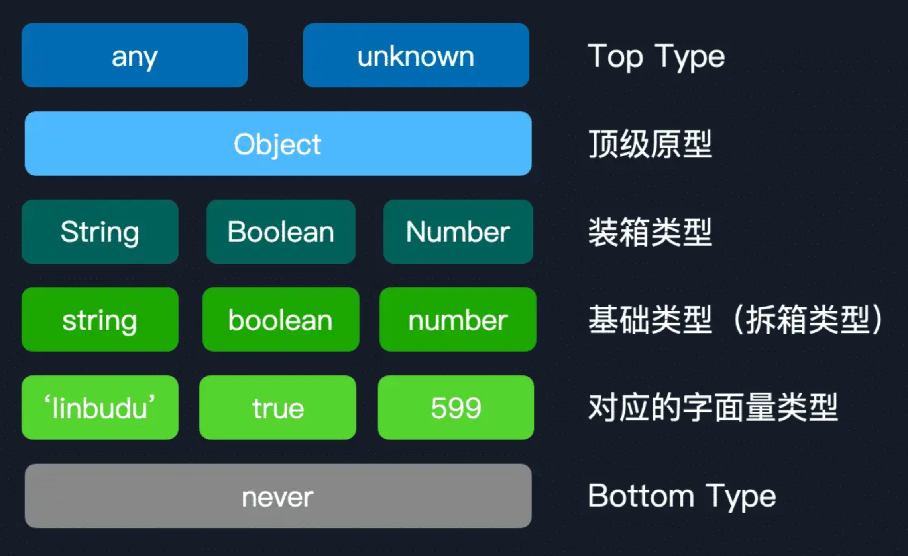

# TypeScript全面进阶指南

## 1. 开篇：用正确的方式学习

## 2. 工欲善其事：打造最舒适的TypeScript开发环境

### 2.1 VS Code配置与插件

#### 推荐插件

- TypeScript Importer
- Move TS
- ErrorLens

#### 配置

"typescript Inlay Hints"中配置

- Function Like Return Types，显示推导得到的函数返回值类型
- Parameter Names，显示函数入参的名称
- Parameter Types，显示函数入参的类型
- Variable Types，显示变量的类型

#### 创建TypeScript项目

```bash
npx --package typescript tsc --init
# 如果已全局安装了TypeScript或已作为项目依赖进行了安装
tsc --init
```

## 3. 进入类型的世界：理解原始类型与对象类型

### null 与 undefined

它们作为类型时，表示的是一个有意义的具体类型值。这两者在没有开启 `strictNullChecks` 检查的情况下，会**被视作其他类型的子类型**，比如 string 类型会被认为包含了 null 与 undefined 类型

### void

**void 操作符会执行后面跟着的表达式并返回一个 undefined**，如你可以使用它来执行一个立即执行函数（IIFE）

在TypeScript中表示一个内部没有`return`语句，或者没有显示`return`一个值的函数的返回值

### 数组与元组

当长度明确时，可以使用元组来代替数组，这样比如在进行`arr[index]`访问时，对于后者，在进行越界访问时会给出类型报错

对于标记为可选的成员，在 `--strictNullCheckes` 配置下会被视为一个 `string | undefined` 的类型。此时元组的长度属性也会发生变化，比如：

```ts
const arr6: [string, number?, boolean?] = ['linbudu'];
type TupleLength = typeof arr6.length; // 1 | 2 | 3
```

### type 与 interface

推荐的方式是，interface 用来描述**对象、类的结构**，而类型别名用来**将一个函数签名、一组联合类型、一个工具类型等等抽离成一个完整独立的类型**

### object、Object 以及 {}

在TypeScript中，Object包含了所有的类型

和 Object 类似的还有 Boolean、Number、String、Symbol，这几个**装箱类型（Boxed Types）** 同样包含了一些超出预期的类型。以 String 为例，它同样包括 undefined、null、void，以及代表的 **拆箱类型（Unboxed Types）** string，但并不包括其他装箱类型对应的拆箱类型，如 boolean 与 基本对象类型

**在任何情况下，都不应该使用这些装箱类型。**

object 的引入就是为了解决对 Object 类型的错误使用，它代表**所有非原始类型的类型，即数组、对象与函数类型这些**

可以认为使用`{}`作为类型签名就是一个合法的，但**内部无属性定义的空对象**，这类似于 Object（想想 `new Object()`），它意味着任何非 null / undefined 的值

为了更好地区分 `Object`、`object` 以及`{}`这三个具有迷惑性的类型，我们再做下总结：

- 在任何时候都**不要，不要，不要使用** Object 以及类似的装箱类型。
- 当你不确定某个变量的具体类型，但能确定它不是原始类型，可以使用 object。但我更推荐进一步区分，也就是使用 `Record<string, unknown>` 或 `Record<string, any>` 表示对象，`unknown[]` 或 `any[]` 表示数组，`(...args: any[]) => any`表示函数这样。
- 我们同样要避免使用`{}`。`{}`意味着任何非 `null / undefined` 的值，从这个层面上看，使用它和使用 `any` 一样恶劣。

## 4. 掌握字面量类型与枚举，让你的类型再精确一些

在 TypeScript 中要求赋值类型始终与原类型一致（如果声明了的话）。因此对于 let 声明，**只需要推导至这个值从属的类型即可**。而 const 声明的原始类型变量将不再可变，因此类型可以直接一步到位收窄到最精确的字面量类型，但对象类型变量仍可变（但同样会要求其属性值类型保持一致）。

这些现象的本质都是 TypeScript 的**类型控制流分析**

## 5. 函数与Class中的类型：详解函数重载与面向对象

### 函数

#### Callable Interface

```ts
interface FuncFooStruct {
  (name: string): number
}
```

#### void类型

**在 TypeScript 中，undefined 类型是一个实际的、有意义的类型值，而 void 才代表着空的、没有意义的类型值**

#### 重载

```ts
function func(foo: number, bar: true): string;
function func(foo: number, bar?: false): number;
function func(foo: number, bar?: boolean): string | number {
  if (bar) {
    return String(foo);
  } else {
    return foo * 599;
  }
}

const res1 = func(599); // number
const res2 = func(599, true); // string
const res3 = func(599, false); // number
```

拥有多个重载声明的函数在被调用时，**是按照重载的声明顺序往下查找的**。因此在第一个重载声明中，为了与逻辑中保持一致，即在 bar 为 true 时返回 string 类型，这里我们需要将第一个重载声明的 bar 声明为必选的字面量类型

### Class

TypeScript 4.3 新增了 `override` 关键字，来确保派生类尝试覆盖的方法一定在基类中存在定义：

```ts
class Base {
  printWithLove() { }
}

class Derived extends Base {
  override print() {
    // ...
  }
}
```

在这里 TS 将会给出错误，因为**尝试覆盖的方法并未在基类中声明**。通过这一关键字我们就能确保首先这个方法在基类中存在，同时标识这个方法在派生类中被覆盖了

 #### Newable Interface

```ts
class Foo { }

interface FooStruct {
  new(): Foo
}

declare const NewableFoo: FooStruct;

const foo = new NewableFoo();

```

## 6. 探秘内置类型：any、unknown、never与类型断言

### 内置类型：any、unknown 与 never

**any 的本质**是类型系统中的**顶级类型**，即 Top Type，这是许多类型语言中的重要概念

unknown 类型和 any 类型有些类似，一个 unknown 类型的变量可以再次**赋值为**任意其它类型，但**只能赋值给** any 与 unknown 类型的变量。**在类型未知的情况下，更推荐使用 unknown 标注**

**never 类型不携带任何的类型信息**，因此会在联合类型中被直接移除，它是整个类型系统层级中**最底层的类型**，即Bottom Type，它是所有类型的子类型，但**只有never类型的变量可以赋值给另一个never类型的变量**

### 类型层级初探

- 最顶级的类型，any 与 unknown
- 特殊的 Object ，它也包含了所有的类型，但和 Top Type 比还是差了一层
- String、Boolean、Number 这些装箱类型
- 原始类型与对象类型
- 字面量类型，即更精确的原始类型与对象类型嘛，需要注意的是 null 和 undefined 并不是字面量类型的子类型
- 最底层的 never

而实际上类型断言的工作原理也和类型层级有关，在判断断言是否成立，即差异是否能接受时，实际上判断的即是这两个类型是否能够找到一个公共的父类型。比如 `{ }` 和 `{ name: string }` 其实可以认为拥有公共的父类型 `{}`（一个新的 `{}`！你可以理解为这是一个基类，参与断言的 `{ }` 和 `{ name: string }` 其实是它的派生类）

如果找不到具有意义的公共父类型呢？这个时候就需要请出 **Top Type** 了，如果我们把它先断言到 **Top Type**，那么就拥有了公共父类型 **Top Type**，再断言到具体的类型也是同理。你可以理解为**先向上断言，再向下断言**

## 7. 类型编程好帮手：TypeScript类型工具（上）

### 类型别名

类型工具可以分为 **类型创建** 与 **类型安全保护** 两类

类型别名 + 泛型 = 工具类型

```ts
type Factory<T> = T | number | string;
```

**工具类型**就像一个函数一样，**泛型是入参**，内部逻辑基于入参进行某些操作，再返回一个新的类型

### 联合类型与交叉类型

联合类型的符号是`|`，它代表按位或，即只需要符合联合类型中的一个类型，既可以认为实现了这个联合类型，如`A | B`，**只需要实现 A 或 B 即可**

交叉类型的符号是`&`，代表着按位与，需要符合这里的所有类型，才可以说实现了这个交叉类型，即 `A & B`，**需要同时满足 A 与 B 两个类型**才行

### 索引类型

#### 1. 索引签名类型

```typescript
interface AllStringTypes {
	[key: string]: string;
}
```

#### 2. 索引类型查询

```ts
interface Foo {
  linbudu: 1,
  599: 2
}

type FooKeys = keyof Foo; // "linbudu" | 599
// 在 VS Code 中悬浮鼠标只能看到 'keyof Foo'
// 看不到其中的实际值，你可以这么做：
type FooKeys = keyof Foo & {}; // "linbudu" | 599
```

#### 3. 索引类型访问

```ts
interface NumberRecord {
  [key: string]: number;
}

type PropType = NumberRecord[string]; // number
```

```ts
interface Foo {
  propA: number;
  propB: boolean;
  propC: string;
}

type PropTypeUnion = Foo[keyof Foo]; // string | number | boolean
```

使用字面量联合类型进行索引类型访问时，其结果就是**将联合类型每个分支对应的类型进行访问后的结果，重新组装成联合类型**。**索引类型查询、索引类型访问通常会和映射类型一起搭配使用**

| 类型工具                             | 创建新类型的方式                                             | 常见搭配           |
| ------------------------------------ | ------------------------------------------------------------ | ------------------ |
| 类型别名（Type Alias）               | 将一组类型/类型结构封装，作为一个新的类型                    | 联合类型、映射类型 |
| 工具类型（Tool Type）                | 在类型别名的基础上，基于泛型去动态创建新类型                 | 基本所有类型工具   |
| 联合类型（Union Type）               | 创建一组类型集合，满足其中一个类型即满足这个联合类型（\|\|） | 类型别名、工具类型 |
| 交叉类型（Intersection Type）        | 创建一组类型集合，满足其中所有类型才满足映射联合类型（&&）   | 类型别名、工具类型 |
| 索引签名类型（Index Signature Type） | 声明一个拥有任意属性，键值类型一致的接口结构                 | 映射类型           |
| 索引类型查询（Indexed Type Query）   | 从一个接口结构，创建一个由其键名字符串字面量组成的联合类型   | 映射类型           |
| 索引类型访问（Indexed Access Type）  | 从一个接口结构，使用键名字符串字面量访问到对应的键值类型     | 类型别名、映射类型 |
| 映射类型 （Mapping Type）            | 从一个联合类型依次映射到其内部的每一个类型                   | 工具类型           |

## 8. 类型编程好帮手：TypeScript类型工具（下）

### 类型查询操作符：typeof

typeof 返回的类型就是当你把鼠标悬浮在变量名上时出现的推导后的类型，并且是**最窄的推导程度（即到字面量类型的级别）**

### 类型守卫

TypeScript 中提供了非常强大的类型推导能力，它会随着你的代码逻辑不断尝试收窄类型，这一能力称之为**类型的控制流分析**（也可以简单理解为类型推导）

```ts
function isString(input: unknown): input is string {
  return typeof input === "string";
}

function foo(input: string | number) {
  if (isString(input)) {
    // 正确了
    (input).replace("linbudu", "linbudu599")
  }
  if (typeof input === 'number') { }
  // ...
}
```

isString 函数称为**类型守卫**，在它的返回值中，我们不再使用 boolean 作为类型标注，而是使用 `input is string` 这么个奇怪的搭配，拆开来看它是这样的：

- input 函数的某个参数；
- `is string`，即 **is 关键字 + 预期类型**，即如果这个函数**成功返回为 true**，那么 is 关键字前这个入参的类型，就会**被这个类型守卫调用方后续的类型控制流分析收集到**。

## 9. 类型编程基石：TypeScript中无处不在的泛型

### 泛型约束与默认值 

在泛型中，我们可以使用 `extends` 关键字来**约束**传入的泛型参数必须符合要求。关于 extends，`A extends B` 意味着 **A 是 B 的子类型**，这里我们暂时只需要了解非常简单的判断逻辑，也就是说 A 比 B 的类型更精确，或者说更复杂。具体来说，可以分为以下几类。

- 更精确，如**字面量类型是对应原始类型的子类型**，即 `'linbudu' extends string`，`599 extends number` 成立。类似的，**联合类型子集均为联合类型的子类型**，即 `1`、 `1 | 2` 是 `1 | 2 | 3 | 4` 的子类型。
- 更复杂，如 `{ name: string }` 是 `{}` 的子类型，因为在 `{}` 的基础上增加了额外的类型，基类与派生类（父类与子类）同理。

箭头函数的泛型：

```ts
const handle = <T>(input: T): T => {}
```

## 10. 结构化类型系统：类型兼容性判断的幕后

### 结构化类型系统

TypeScript的类型系统特性：**结构化类型系统（也就是我们常说的“鸭式辨型”）**，与之对应的称为：**标称类型系统**

结构化类型系统的**核心理念：基于类型结构进行判断类型兼容性**

### 在TypeScript中模拟标称类型系统

**类型的重要意义之一是限制了数据的可用操作与实际意义**，这往往是通过类型附带的额外信息来实现的（类似于**元数据**），要在 TypeScript 中实现标称类型系统，其实我们也只需要为类型额外附加元数据即可

针对下面的代码，因为USD与CNY都只是number的类型别名，所以无法校验出错误

```ts
type USD = number;
type CNY = number;

const CNYCount: CNY = 200;
const USDCount: USD = 200;

function addCNY(source: CNY, input: CNY) {
  return source + input;
}

addCNY(CNYCount, USDCount)
```

但通过添加“元数据”的方式则可以实现类似标称类型系统的效果

```ts
export declare class TagProtector<T extends string> {
  protected __tag__: T;
}

export type Nominal<T, U extends string> = T & TagProtector<U>;

export type CNY = Nominal<number, 'CNY'>;
export type USD = Nominal<number, 'USD'>;

const CNYCount = 100 as CNY;
const USDCount = 100 as USD;

function addCNY(source: CNY, input: CNY) {
  return (source + input) as CNY;
}

addCNY(CNYCount, CNYCount);
// 报错了！
addCNY(CNYCount, USDCount);

```

[Opaque Type](https://codemix.com/opaque-types-in-javascript/)中也有提供了类似的实现

```ts
declare const tag: unique symbol;

declare type Tagged<Token> = {
    readonly [tag]: Token;
};

export type Opaque<Type, Token = unknown> = Type & Tagged<Token>;
```

- 类型：限制了数据的可用操作、意义、允许的值的集合，总的来说就是**访问限制**与**赋值限制**。在 TypeScript 中即是原始类型、对象类型、函数类型、字面量类型等基础类型，以及类型别名、联合类型等经过类型编程后得到的类型。
- 类型系统：一组为变量、函数等结构分配、实施类型的规则，通过显式地指定或类型推导来分配类型。同时类型系统也定义了如何判断类型之间的兼容性：在 TypeScript 中即是结构化类型系统。
- 类型检查：确保**类型遵循类型系统下的类型兼容性**，对于静态类型语言，在**编译时**进行，而对于动态语言，则在**运行时**进行。TypeScript 就是在编译时进行类型检查的。

## 11. 类型系统层级：从Top Type到Bottom Type

类型层级实际上指的是，**TypeScript 中所有类型的兼容关系，从最上面一层的 any 类型，到最底层的 never 类型**

### 判断类型兼容性的方式

`<变量 b 的类型> extends <变量 a 的类型>` 成立，即 **b 类型是 a 类型的子类型**

### 从原始类型开始

一个基础类型和它们对应的字面量类型**必定存在父子类型关系**

### 向上探索，直到穹顶之上

#### 联合类型

1. **字面量类型 < 包含此字面量类型的联合类型，原始类型 < 包含此原始类型的联合类型**

   ```ts
   type Result7 = 1 extends 1 | 2 | 3 ? 1 : 2; // 1
   type Result8 = 'lin' extends 'lin' | 'bu' | 'du' ? 1 : 2; // 1
   type Result9 = true extends true | false ? 1 : 2; // 1
   type Result10 = string extends string | false | number ? 1 : 2; // 1
   ```

2. **同一基础类型的字面量联合类型 < 此基础类型**

   ```ts
   type Result11 = 'lin' | 'bu' | 'budu' extends string ? 1 : 2; // 1
   type Result12 = {} | (() => void) | [] extends object ? 1 : 2; // 1
   ```

#### 装箱类型

**在结构化类型系统的比较下，String 会被认为是 `{}` 的子类型**，这有时会产生一些看似矛盾的现象

```ts
type Result16 = {} extends object ? 1 : 2; // 1
type Result18 = object extends {} ? 1 : 2; // 1

type Result17 = object extends Object ? 1 : 2; // 1
type Result20 = Object extends object ? 1 : 2; // 1

type Result19 = Object extends {} ? 1 : 2; // 1
type Result21 = {} extends Object ? 1 : 2; // 1
```

这里的 `{} extends `和 `extends {}` 实际上是两种完全不同的比较方式。`{} extends object` 和 `{} extends Object` 意味着， `{}` 是 object 和 Object 的字面量类型，是从**类型信息的层面**出发的，即**字面量类型在基础类型之上提供了更详细的类型信息**。`object extends {}` 和 `Object extends {}` 则是从**结构化类型系统的比较**出发的，即 `{}` 作为一个一无所有的空对象，几乎可以被视作是所有类型的基类，万物的起源

而 `object extends Object` 和 `Object extends object` 这两者的情况就要特殊一些，它们是因为“**系统设定**”的问题，Object 包含了所有除 Top Type 以外的类型（基础类型、函数类型等），object 包含了所有非原始类型的类型，即数组、对象与函数类型，这就导致了你中有我、我中有你的神奇现象

**原始类型 < 原始类型对应的装箱类型 < Object 类型**

#### Top Type

这里只有`any`与`unknown`，any 与 unknown 是系统中设定为 Top Type 的两个类型，它们无视一切因果律，是类型世界的规则产物

```ts
type Result22 = Object extends any ? 1 : 2; // 1
type Result23 = Object extends unknown ? 1 : 2; // 1
```

但any稍有一些特殊：

```ts
type Result26 = any extends 'linbudu' ? 1 : 2; // 1 | 2
type Result27 = any extends string ? 1 : 2; // 1 | 2
type Result28 = any extends {} ? 1 : 2; // 1 | 2
type Result29 = any extends never ? 1 : 2; // 1 | 2
```

any 代表了任何可能的类型，当我们使用 `any extends` 时，它包含了“**让条件成立的一部分**”，以及“**让条件不成立的一部分**”。而从实现上说，在 TypeScript 内部代码的条件类型处理中，如果接受判断的是 any，那么会直接**返回条件类型结果组成的联合类型**

**Object < any / unknown**

### 向下探索，直到万物虚无

**never < 字面量类型**

### 类型层级链

```ts
// 这里的输出是8
type VerboseTypeChain = never extends 'linbudu'
  ? 'linbudu' extends 'linbudu' | 'budulin'
    ? 'linbudu' | 'budulin' extends string
      ? string extends {}
        ? string extends String
          ? String extends {}
            ? {} extends object
              ? object extends {}
                ? {} extends Object
                  ? Object extends {}
                    ? object extends Object
                      ? Object extends object
                        ? Object extends any
                          ? Object extends unknown
                            ? any extends unknown
                              ? unknown extends any
                                ? 8
                                : 7
                              : 6
                            : 5
                          : 4
                        : 3
                      : 2
                    : 1
                  : 0
                : -1
              : -2
            : -3
          : -4
        : -5
      : -6
    : -7
  : -8;
```

### 其他比较场景

- 对于基类和派生类，通常情况下**派生类会完全保留基类的结构**，而只是自己新增新的属性与方法。在结构化类型的比较下，其类型自然会存在子类型关系

- 对于联合类型地类型层级比较，我们只需要比较**一个联合类型是否可被视为另一个联合类型的子集**，即**这个联合类型中所有成员在另一个联合类型中都能找到**

- 数组与元组是一个比较特殊的部分，直接看例子：

  ```ts
  type Result40 = [number, number] extends number[] ? 1 : 2; // 1
  type Result41 = [number, string] extends number[] ? 1 : 2; // 2
  type Result42 = [number, string] extends (number | string)[] ? 1 : 2; // 1
  type Result43 = [] extends number[] ? 1 : 2; // 1
  type Result44 = [] extends unknown[] ? 1 : 2; // 1
  type Result45 = number[] extends (number | string)[] ? 1 : 2; // 1
  type Result46 = any[] extends number[] ? 1 : 2; // 1
  type Result47 = unknown[] extends number[] ? 1 : 2; // 2
  type Result48 = never[] extends number[] ? 1 : 2; // 1
  ```

  - 40，这个元组类型实际上能确定其内部成员全部为 number 类型，因此是 `number[]` 的子类型。而 41 中混入了别的类型元素，因此认为不成立。
  - 42混入了别的类型，但其判断条件为 `(number | string)[]` ，即其成员需要为 number 或 string 类型。
  - 43的成员是未确定的，等价于 `never[] extends number[]`，44 同理。
  - 45类似于41，即可能存在的元素类型是符合要求的。
  - 46，这个我们下面再起一节单独介绍。
  - 47，还记得身化万千的 any 类型和小心谨慎的 unknown 类型嘛？
  - 48，类似于 43、44，由于 never 类型本就位于最下方，这里显然成立。只不过 `never[]` 类型的数组也就无法再填充值了。



## 12. 类型里的逻辑运算：条件类型与infer

### 条件类型基础

泛型约束和条件类型两个 extends 产生作用的时机完全不同，泛型约束要求你传入符合结构的类型参数，相当于**参数校验**。而条件类型使用类型参数进行条件判断（就像 if else），相当于**实际内部逻辑**

### infer 关键字

TypeScript 中支持通过 infer 关键字来**在条件类型中（也只能在条件类型中使用）提取类型的某一部分信息**，比如获取一个函数的返回类型：

```ts
type FunctionReturnType<T extends Func> = T extends (
  ...args: any[]
) => infer R
  ? R
  : never;
```

看一个例子

```ts
// 反转键名与键值
type ReverseKeyValue<T extends Record<string, unknown>> = T extends Record<infer K, infer V> ? Record<V & string, K> : never
```

这里之所以要使用`V & string`，是因为**泛型参数 V 的来源是从键值类型推导出来的，TypeScript 中这样对键值类型进行 infer 推导，将导致类型信息丢失，而不满足索引签名类型只允许 `string | number | symbol` 的要求**

### 分布式条件类型

**分布式条件类型（\*Distributive Conditional Type\*），也称条件类型的分布式特性**，只不过是条件类型在满足一定情况下会执行的逻辑而已

```ts
type Condition<T> = T extends 1 | 2 | 3 ? T : never;

// 1 | 2 | 3
type Res1 = Condition<1 | 2 | 3 | 4 | 5>;

// never
type Res2 = 1 | 2 | 3 | 4 | 5 extends 1 | 2 | 3 ? 1 | 2 | 3 | 4 | 5 : never;
```

Res1与Res2的区别在于Res1是**通过泛型参数传入**

**对于属于裸类型参数的检查类型，条件类型会在实例化时期自动分发到联合类型上**

```ts
type Naked<T> = T extends boolean ? "Y" : "N";

// (number extends boolean ? "Y" : "N") | (boolean extends boolean ? "Y" : "N")
// "N" | "Y"
type Res3 = Naked<number | boolean>;
```

而这里的裸类型参数，其实指的就是泛型参数是否完全裸露，我们上面使用数组包裹泛型参数只是其中一种方式，比如还可以这么做

```ts
export type NoDistribute<T> = T & {};

type Wrapped<T> = NoDistribute<T> extends boolean ? "Y" : "N";

type Res1 = Wrapped<number | boolean>; // "N"
type Res2 = Wrapped<true | false>; // "Y"
type Res3 = Wrapped<true | false | 599>; // "N"

```

在某些情况下，我们也会需要包裹泛型参数来禁用掉分布式特性。最常见的场景也许还是联合类型的判断，即我们不希望进行联合类型成员的分布判断，而是希望直接判断这两个联合类型的兼容性判断

```ts
type CompareUnion<T, U> = [T] extends [U] ? true : false;

type CompareRes1 = CompareUnion<1 | 2, 1 | 2 | 3>; // true
type CompareRes2 = CompareUnion<1 | 2, 1>; // false
```

另外一种情况则是，当我们想判断一个类型是否为 never 时，也可以通过类似的手段

```ts
type IsNever<T> = [T] extends [never] ? true : false;

type IsNeverRes1 = IsNever<never>; // true
type IsNeverRes2 = IsNever<"linbudu">; // false
```

这里的原因其实并不是因为分布式条件类型。我们此前在类型层级中了解过，**当条件类型的判断参数为 any，会直接返回条件类型两个结果的联合类型**。而在这里其实类似，**当通过泛型传入的参数为 never，则会直接返回 never**

### IsAny 与 IsUnknown

```ts
type IsNever<T> = [T] extends [never] ? true : false;

type Tmp4 = 1 & any; // any
type Tmp5 = 1 & unknown; // 1

type IsAny<T> = 0 extends 1 & T ? true : false;

// 首先过滤掉 never 类型，然后对于 T extends unknown 和 unknown extends T，只有 any 和 unknown 类型能够同时符合，如果再过滤掉 any，那肯定就只剩下 unknown 类型啦。
type IsUnknown<T> = IsNever<T> extends false
  ? T extends unknown
    ? unknown extends T
      ? IsAny<T> extends false
        ? true
        : false
      : false
    : false
  : false;

// 利用 unknown extends T 时仅有 T 为 any 或 unknown 时成立这一点，我们可以直接将类型收窄到 any 与 unknown，然后在去掉 any 类型时
type IsUnknown<T> = unknown extends T
  ? IsAny<T> extends true
    ? false
    : true
  : false;
```

## 13. 内置工具类型基础：别再妖魔化工具类型了

### 工具类型的分类

- 对属性的修饰，包括对象属性和数组元素的可选/必选、只读/可写。我们将这一类统称为**属性修饰工具类型**。
- 对既有类型的裁剪、拼接、转换等，比如使用对一个对象类型裁剪得到一个新的对象类型，将联合类型结构转换到交叉类型结构。我们将这一类统称为**结构工具类型**。
- 对集合（即联合类型）的处理，即交集、并集、差集、补集。我们将这一类统称为**集合工具类型**。
- 基于 infer 的模式匹配，即对一个既有类型特定位置类型的提取，比如提取函数类型签名中的返回值类型。我们将其统称为**模式匹配工具类型**。
- 模板字符串专属的工具类型，比如神奇地将一个对象类型中的所有属性名转换为大驼峰的形式。这一类当然就统称为**模板字符串工具类型**了。

### 属性修饰工具类型

可选标记不等于修改此属性类型为 `原类型 | undefined`，因为对于结构声明来说，一个属性是否必须提供仅取决于其是否携带可选标记。即使你使用 never 也无法标记这个属性为可选

### 结构工具类型

### 集合工具类型

### 模式匹配工具类型

```ts
type ClassType = abstract new (...args: any) => any;

type ConstructorParameters<T extends ClassType> = T extends abstract new (
  ...args: infer P
) => any
  ? P
  : never;

type InstanceType<T extends ClassType> = T extends abstract new (
  ...args: any
) => infer R
  ? R
  : any;

```

### infer 约束

```ts
type FirstArrayItemType<T extends any[]> = T extends [infer P extends string, ...any[]]
  ? P
  : never;
```

## 14. 反方向类型推导：用好上下文相关类型

### 无处不在的上下文类型

上下文类型的核心理念：**基于位置的类型推导**，上下文类型更像是**反方向的类型推导**，也就是**基于已定义的类型来规范开发者的使用**

### void返回值类型下的特殊情况

**上下文类型对于 void 返回值类型的函数，并不会真的要求它啥都不能返回**。然而，虽然这些函数实现可以返回任意类型的值，但**对于调用结果的类型，仍然是 void**

## 15. 协变与逆变的比较

这一节，我们就来对比函数类型的类型层级，以及隐藏在这一比较幕后的理论——**协变与逆变**

### 如何比较函数的签名类型

假设这样三个具有层级关系的类：

```ts
class Animal {
  asPet() {}
}

class Dog extends Animal {
  bark() {}
}

class Corgi extends Dog {
  cute() {}
}
```

对于函数类型比较，实际上我们要比较的即是**参数类型**与**返回值类型**

1. **对于函数参数**，实际上类似于我们在类型系统层级时讲到的，**如果一个值能够被赋值给某个类型的变量，那么可以认为这个值的类型为此变量类型的子类型**

   相对严谨地说，这是因为派生类（即子类）会保留基类的属性与方法，因此说其与基类兼容，但基类并不能未卜先知的拥有子类的方法，这也是**里氏替换原则：子类可以扩展父类的功能，但不能改变父类原有的功能，子类型（subtype）必须能够替换掉他们的基类型（base type）**

1. 基于上面三个类的关系，我们通过一个辅助函数来了解函数类型的层级关系

   ```ts
   function transformDogAndBark(dogFactory: DogFactory) {
     const dog = dogFactory(new Dog());
     dog.bark();
   }
   ```
   
   对transformDogAndBark，它接受一个函数，该函数接受一个Dog类型的参数，并返回一个Dog类型的参数，我们用Dog -> Dog来表示它的类型，**如果有另一个函数类型可以被作为transformDogAndBark参数的类型，并满足约束条件（传入一只正常的狗，但它不一定是什么品种；返回一只正常的狗，也不在意它的品种），即认为该函数类型是Dog -> Dog的子类型**
   
   对于上面三层关系的类型，枚举出所有可能的函数类型：
   
   - `Animal -> Animal`
   - `Animal -> Dog`
   - `Animal -> Corgi`
   - `Dog -> Dog`
   - `Dog -> Animal`
   - `Dog -> Corgi`
   - `Corgi -> Animal`
   - `Corgi -> Dog`
   - `Corgi -> Corgi`
   
   其中`Animal/Dog/Corgi -> Animal`不满足要求，因为返回类型是一个Animal，并不一定具备`bark`方法
   
   而`Corgi -> Corgi` 与 `Corgi -> Dog`也不满足要求，因为如果这样定义，就表示dogFactory可能会利用到类型`Corgi`某些特性，此我可能是`Dog`类型或`Animal`类型不具备的
   
   只有`Dog -> Corgi`、`Animal -> Corgi`、`Animal -> Dog`是满足条件的
   
   观察之后可以得出如下**结论：**
   
   - 参数类型**允许**为 Dog 的父类型，**不允许**为 Dog 的子类型。
   - 返回值类型**允许**为 Dog 的子类型，**不允许**为 Dog 的父类型。

### 协变与逆变

我们上一节得到的结论是，考虑 `Corgi ≼ Dog ≼ Animal`，当有函数类型 `Dog -> Dog`，仅有 `(Animal → Corgi) ≼ (Dog → Dog)` 成立（即能被视作此函数的子类型），我们将参数类型与返回值类型各自独立出来看：

考虑 `Corgi ≼ Dog`，假设我们对其进行**返回值类型**的**函数签名类型包装**，则有 `(T → Corgi) ≼ (T → Dog)`，也即是说，在我需要狗狗的地方，柯基都是可用的。**即不考虑参数类型的情况，在包装为函数签名的返回值类型后，其子类型层级关系保持一致**

考虑 `Dog ≼ Animal`，如果换成**参数类型**的**函数签名类型包装**，则有 `(Animal -> T) ≼ (Dog -> T)`，也即是说，在我需要条件满足是动物时，狗狗都是可用的。**即不考虑返回值类型的情况，在包装为函数签名的参数类型后，其子类型层级关系发生了逆转**

这就是 TypeScript 中的**协变（** ***covariance*** **）** 与**逆变（** ***contravariance*** **）** 在函数签名类型中的表现形式，**随着某一个量的变化，随之变化一致的即称为协变，而变化相反的即称为逆变。**这里的**变化（Wrapper）即指从单个类型到函数类型的包装过程**

如果通过类型工具来说明上面的例子，代码如下：

```ts
class Animal {
    asPet() { }
}

class Dog extends Animal {
    bark() { }
}

class Corgi extends Dog {
    cute() { }
}

type asFuncArgType<T> = (arg: T) => void;
type asFuncReturnType<T> = (arg: unknown) => T;

// checkReturnType为1
type checkReturnType = asFuncReturnType<Corgi> extends asFuncReturnType<Dog> ? 1 : 2;
// checkArgType为1
type checkArgType = asFuncArgType<Dog> extends asFuncArgType<Corgi> ? 1 : 2;
```

总结：**函数类型的参数类型使用子类型逆变的方式确定是否成立，而返回值类型使用子类型协变的方式确定**

### TSConfig 中的 StrictFunctionTypes

配置项[strictFunctionTypes](https://link.juejin.cn/?target=https%3A%2F%2Fwww.typescriptlang.org%2Ftsconfig%23strictFunctionTypes)的说明为：**在比较两个函数类型是否兼容时，将对函数参数进行更严格的检查**（*When enabled, this flag causes functions parameters to be checked more correctly*），而实际上，这里的更严格指的即是 **对函数参数类型启用逆变检查**

但这种检查只有在以属性方式声明函数时才生效

```ts
// method 声明
interface T1 {
  func(arg: string): number;
}

// property 声明
interface T2 {
  func: (arg: string) => number;
}
```

## 16. 了解类型编程与类型体操的意义，找到平衡点

**一门技术，要么应当能够在当下或者可预见的未来给予你帮助，要么能够扩宽你的技术视野和知识边界（类型体操并不完全算）**

## 17. 内置工具类型进阶：类型编程进阶

### 属性修饰进阶

1. 递归属性修饰

2. 基于已知属性进行部分修饰

   - 拆分
   - 使用属性修饰
   - 组合

   比如：

   ```ts 
   export type MarkPropsAsOptional<
     T extends object, 
     K extends keyof T = keyof T
   > = Partical<Pick<T, K> & Omit<T, K>
   ```

   **将复杂的工具类型，拆解为由基础工具类型、类型工具的组合**

   ```ts
   // 通过将结果扁平化好理能更方便的查看
   type Flatten<T> = {
     [KeyType in keyof T]: T[KeyType] extends object
       ? Flatten<T[KeyType]>
       : T[KeyType];
   } & {};
   
   export type MarkPropsAsOptional<
     T extends object,
     K extends keyof T = keyof T
   > = Flatten<Partial<Pick<T, K>> & Omit<T, K>>;
   
   type MarkPropsAsOptionalStruct = MarkPropsAsOptional<
     {
       foo: string;
       bar: number;
       baz: boolean;
     },
     'bar'
   >;
   ```

### 结构工具类型进阶

#### 基于键值类型的Pick与Omit

需要**基于期望的类型去拿到所有此类型的属性名**，这种的一般模式如下（以获取函数类型的属性名为例）

```ts
// 函数类型
type FuncStruct = (...arg: ang[]) => any;

// 获取T中属性类型为函数的属性名，最后得到的是一个联合类型
type FunctionKeys<T extends object> = {
  [K in keyof T]: K[T] extends FuncStruct ? K : never;
}[keyof T]
```

再配合Pick工具类型，就可以从一个对象中获取指定类型的属性名组成的对象

#### 基于结构的互斥工具类型

假设有这样的场景，需要定义一个接口，要么拥有vipExpires，要么拥有promotionUsed字段

```ts
interface VIP {
  vipExpires: number;
}

interface CommonUser {
  promotionUsed: boolean;
}
```

通过这样定义是无法实现的

```ts
type User = VIP | CommonUser;
```

要想表示不能同时拥有，需要使用never类型来标记

```ts
export type Without<T, U> = {
  [P in Exclude<keyof T, keyof U>]?: never
};

export type XOR<T, U> = (Without<T, U> & U) | (Without<U, T> & T);

type XORUser = Flatten<XOR<VIP, CommonUser>>
```

最终看到的类型定义：

```ts
type XORUser = {
    vipExpires?: undefined;
    promotionUsed: boolean;
} | {
    promotionUsed?: undefined;
    vipExpires: number;
}
```

### 集合工具类型进阶

**对象类型的交并补差集基本上可以降维到对象属性名集合的交并补差集问题**，比如交集就是两个对象属性名的交集，使用属性名的交集访问其中一个对象，就可以获得对象之间的交集结构（不考虑同名属性冲突下）

对于一维：

```ts
// 并
export type Concurrence<A, B> = A | B;

// 交
export type Intersection<A, B> = A extends B ? A : never;

// 差
export type Difference<A, B> = A extends B ? never : A;

// 补（是差集的特殊情况）
export type Complement<A, B extends A> = Difference<A, B>;
```

对应的对象属性名版本：

```ts
export type PlainObjectType = Record<string, any>;

// 并
export type ObjectKeysConcurrence<T extends PlainObjectType, U extends PlainObjectType> = keyof T | keyof U;

// 交
export type ObjectKeysIntersection<T extends PlainObjectType, U extends PlainObjectType> = 
  Intersection<keyof T, keyof U>;

// 差
export type ObjectKeysDifference<T extends PlainObjectType, U extends PlainObjectType> = Difference<keyof T, keyof U>;

// 补
export type ObjectKeysComplement<T extends U, U extends PlainObjectType> = Complement<keyof T, keyof U>;
```

基于对象属性名的版本，可以创建对象版本的交、差、补

```ts
// 交
export type ObjectInsersection<T extends PlainObjectType, U extends PlainObjectType> = 
  Pick<T, ObjectKeysIntersection<T, U>>;

// 差
export type ObjectDifference<T extends PlainObjectType, U extends PlainObjectType> = 
  Pick<T, ObjectKeysDifference<T, U>>;

// 补
export type ObjectComplement<T extends U, U extends PlainObjectType> = 
  Pick<T, ObjectKeysComplement<T, U>>;
```

对于类型，`T extends U` 意味着 T 是 U 的子类型，但在属性组成的集合类型中却相反，**U 的属性联合类型是 T 的属性联合类型的子类型**，因为既然 T 是 U 的子类型，那很显然 T 所拥有的的属性会更多

而对于并集，不能使用联合类型来实现，因为这样**控制不了同名属性的优先级**

```ts
type Merge<T extends PlainObjectType, U extends PlainObjectType> =
	// 取T中有而U中无的部分
	ObjectDifference<T, U> &
	// 取T和U同的部分，但以U的优先级高
	ObjectIntersection<U, T> & 
	// 取U中有而T中无的部分
	ObjectDifference<U, T>;
```

### 模式匹配工具类型进阶

这里主要是指通过infer来进行类型推导得到结果，比如提取函数的首个参数类型：

```ts
type FirstParameter<T extends FunctionType> = T extends (arg: infer P, ...args: any) => any ? P : never;
```

提取函数的最后一个参数类型

```ts
type LastParameter<T extends FunctionType> = T extends (arg: infer P) => any
	? P
	: T extends (...args: infer R) => any
	? R extends [...any, infer Q]
		? Q
		: never
	never;
```

TypeScript中提取Promise内部值类型的工具类型：

```ts
type Awaited<T> = T extends null | undefined
	? T
	: T extends object & { then(onfulfilled: infer F): any }
	? F extends (value: infer V, ...args: any) => any
		? Awaited<V>
		: never
	: T;
```

### 补充类型

#### 1. RequiredKeys 与 OptionalKeys

由于 `{ prop: number }` 可以视为继承自 `{}` ，`{} extends { prop: number }` 是不满足条件的。但是，如果这里的 prop 是可选的，那就不一样了！由于 `{ prop?: number }` 也可以是一个空的接口结构，那么 `{} extends { prop?: number }` 就可以认为是满足的

因为可以通过这种方式来判断某个Key是不是可选的：

```ts
export type RequiredKeys<T> = {
  [K in keyof T]-?: {} extends Pick<T, K> ? never : K;
}[keyof T];

export type OptionalKeys<T> = {
  [K in keyof T]-?: {} extends Pick<T, K> ? K : never;
}[keyof T];
```

#### 2. MutableKeys 与 ImmutableKeys

这里引入一个辅助工具：

```ts
type Equal<X, Y, A = X, B = never> = (<T>() => T extends X ? 1 : 2) extends 
  (<T>() => T extends Y ? 1 : 2)
  	? A 
		: B;
```

在这里，`<T>() => T extends X ? 1 : 2` 和 `<T>() => T extends Y ? 1 : 2` 这两个函数结构实际上起辅助作用，内部的条件类型并不会真的进行运算。我们实际上是借助这一辅助结构判断类型 X 与 Y 的全等性，这一全等性就包括了 readonly 修饰符与可选性等

基于此实现：

```ts
export type MutableKeys<T extends object> = {
  [P in keyof T]-?: Equal<
    { [Q in P]: T[P] },
    { -readonly [Q in P]: T[P] },
    P,
    never
  >;
}[keyof T];

expectType<MutableKeys<{ a: string; readonly b: string }>>('a');
expectNotType<MutableKeys<{ a: string; readonly b: string }>>('b');

export type ImmutableKeys<T extends object> = {
  [P in keyof T]-?: Equal<
    { [Q in P]: T[P] },
    { -readonly [Q in P]: T[P] },
    never,
    P
  >;
}[keyof T];

expectType<ImmutableKeys<{ a: string; readonly b: string }>>('b');
expectNotType<ImmutableKeys<{ a: string; readonly b: string }>>('a');
```

在 MutableKeys 中，我们传入本次映射的单个属性组成的接口结构，以及这一结构去除了 readonly 的版本，如果前后两个接口结构被判定为全等，那就说明这一次映射的属性不是只读的

## 18. 基础类型新成员：模板字符串类型入门

### 模板字符串类型的基础使用

```ts
type Greet<T extends string | number | boolean | null | undefined | bigint> = `Hello ${T}`;

type Greet1 = Greet<"linbudu">; // "Hello linbudu"
type Greet2 = Greet<599>; // "Hello 599"
type Greet3 = Greet<true>; // "Hello true"
type Greet4 = Greet<null>; // "Hello null"
type Greet5 = Greet<undefined>; // "Hello undefined"
type Greet6 = Greet<0x1fffffffffffff>; // "Hello 9007199254740991"

// 联合类型
type Brand = 'iphone' | 'xiaomi' | 'honor';
type Memory = '16G' | '64G';
type ItemType = 'official' | 'second-hand';

type SKU = `${Brand}-${Memory}-${ItemType}`;

```

### 模板字符串类型的类型表现

由于模板字符串类型最终的产物还是字符串字面量类型，因此只要插槽位置的类型匹配，字符串字面量类型就可以被认为是模板字符串类型的子类型

```ts
declare let v1: `${number}.${number}.${number}`;
declare let v2: '1.2.4';

v1 = v2;
```

但反之则不行，因为v1还包含了如`100.0.0`等情况

### 结合索引类型与映射类型

#### 索引类型查询操作符keyof的例子：

```ts
interface Foo {
  name: string;
  age: number;
  job: Job;
}

type ChangeListener = {
  on: (change: `${keyof Foo}Changed`) => void;
};

declare let listener: ChangeListener;

// 提示并约束为 "nameChanged" | "ageChanged" | "jobChanged"
listener.on('');
```

#### 重映射：在映射键名时基于原键名做修改

```ts
type CopyWithRename<T extends object> = {
  // 通过 as 语法，将映射的键名作为变量，映射到一个新的字符串类型
  // 由于对象的合法键名类型包括了 symbol，而模板字符串类型插槽中并不支持 symbol 类型。因此我们使用 string & K 来确保了最终交由模板插槽的值，一定会是合法的 string 类型
  [K in keyof T as `modified_${string & K}`]: T[K];
};

interface Foo {
  name: string;
  age: number;
}

// {
//   modified_name: string;
//   modified_age: number;
// }
type CopiedFoo = CopyWithRename<Foo>;
```

### 专用工具类型

即**Uppercase**、**Lowercase**、**Capitalize** 与 **Uncapitalize**

### 模板字符串类型与模式匹配

### 基于重映射的 PickByValueType

```ts
type PickByValueType<T extends object, Type> = {
  [K in keyof T as T[K] extends Type ? K : never]: T[K]
}
```

## 19. 类型编程新范式：模板字符串工具类型进阶

### 从最简单的模式匹配说起：Trim、Includes等等

```ts
type _Include<
  Str extends string,
  Search extends string
> = Str extends `${infer _R1}${Search}${infer _R2}` ? true : false;

type Include<Str extends string, Search extends string> = Str extends ''
  ? Search extends ''
    ? true
    : false
  : _Include<Str, Search>;
```

```ts
type TrimLeft<Str extends string> = Str extends ` ${infer R}` ? TrimLeft<R> : Str;

type TrimRight<Str extends string> = Str extends `${infer R} ` ? TrimRight<R> : Str;

type Trim<Str extends string> = TrimLeft<TrimRight<Str>>;
```

```ts
type _StartsWith<
  Str extends string,
  Search extends string
> = Str extends `${Search}${infer _R}` ? true : false;

type StartsWith<Str extends string, Search extends string> = Str extends ''
  ? Search extends ''
    ? true
    : _StartsWith<Str, Search>
  : _StartsWith<Str, Search>;
```

### 结构转换：Replace、Split与Join

#### Replace与ReplaceAll

```ts
export type Replace<
  Str extends string,
  Search extends string,
  Replacement extends string
> = Str extends `${infer Head}${Search}${infer Tail}`
  ? `${Head}${Replacement}${Tail}`
  : Str;
```

```ts
export type ReplaceAll<
  Str extends string,
  Search extends string,
  Replacement extends string
> = Str extends `${infer Head}${Search}${infer Tail}`
  ? ReplaceAll<`${Head}${Replacement}${Tail}`, Search, Replacement>
  : Str;
```

#### Split

```ts
export type Split<
  Str extends string,
  Delimiter extends string
> = Str extends `${infer Head}${Delimiter}${infer Tail}`
  ? [Head, ...Split<Tail, Delimiter>]
  : Str extends Delimiter
  ? []
  : [Str];
```

```ts
// 基于Split可以创建一个获取字符串长度的工具
export type StrLength<T extends string> = Split<Trim<T>, ''>['length'];
```

#### Join

```ts
export type Join<
  List extends Array<string | number>,
  Delimiter extends string
> = List extends []
  ? ''
  : List extends [string | number]
  ? `${List[0]}`
  : List extends [string | number, ...infer Rest]
  ? // @ts-expect-error
    `${List[0]}${Delimiter}${Join<Rest, Delimiter>}`
  : string;
```

### 最后一步：Case转换

```ts
export type PlainObjectType = Record<string, any>;

export type WordSeparators = '-' | '_' | ' ';

export type Split<
  S extends string,
  Delimiter extends string
> = S extends `${infer Head}${Delimiter}${infer Tail}`
  ? [Head, ...Split<Tail, Delimiter>]
  : S extends Delimiter
  ? []
  : [S];

type CapitalizeStringArray<Words extends readonly any[], Prev> = Words extends [
  `${infer First}`,
  ...infer Rest
]
  ? First extends undefined
    ? ''
    : First extends ''
    ? CapitalizeStringArray<Rest, Prev>
    : `${Prev extends '' ? First : Capitalize<First>}${CapitalizeStringArray<
        Rest,
        First
      >}`
  : '';

type CamelCaseStringArray<Words extends readonly string[]> = Words extends [
  `${infer First}`,
  ...infer Rest
]
  ? Uncapitalize<`${First}${CapitalizeStringArray<Rest, First>}`>
  : never;

export type CamelCase<K extends string> = CamelCaseStringArray<
  Split<K extends Uppercase<K> ? Lowercase<K> : K, WordSeparators>
>;

```

## 20. 工程层面的类型能力：类型声明、类型指令与命名空间

### 类型检查指令

#### `@ts-ignore`与`@ts-expect-error`

通常我们想忽略某个ts报错时，会使用`@ts-ignore`，但它本质上是一个ignore而不是disable，也就意味着如果下一行代码没有问题，就不应该合适`@ts-ignore`，于是引入了`@ts-expect-error`，它只在下一行代码**真的存在错误时才能被使用，否则它会抛出一个错误**

#### `@ts-check`与`@ts-nocheck`

前者用于在js文件中开启类型检查，后者用于禁用当前整个文件的类型检查

### 类型声明

即使用`declare`来声明你的类型，大多场景是使用构建生成的`.d.ts`文件

### 让类型定义全面覆盖你的项目

核心能力：**通过额外的类型声明文件，在核心代码文件以外去提供对类型的进一步补全**

通过`declare module <模块标识>`为npm包或非代码文件提供类型声明

```ts
declare module 'pkg' {
  const handler: () => boolean;
}

import foo from 'pkg';
// 此时res即为boolean类型
const res = foo.handler();
```

```ts
// index.ts
import raw from './note.md';

const content = raw.replace('NOTE', `NOTE${new Date().getDay()}`);

// declare.d.ts
declare module '*.md' {
  const raw: string;
  export default raw;
}

```

#### DefinitelyTyped

以`@types/`开头的一类npm包均属于[DefinitelyTyped](https://github.com/DefinitelyTyped/DefinitelyTyped) 

#### 扩展已有的类型定义

typescript中，`interface`与`declare module <模块标识>`的声明是可以合并的

### 三斜线指令

本质上就是一个自闭合的 XML 标签，语法：

```ts
/// <reference path="./other.d.ts" />
/// <reference types="node" />
/// <reference lib="dom" />
```

**三斜线指令必须被放置在文件的顶部才能生效**

1. 使用 path 的 reference 指令，其 path 属性的值为一个**相对路径**，指向你项目内的其他声明文件。而在编译时，TS 会沿着 path 指定的路径不断深入寻找，最深的那个没有其他依赖的声明文件会被最先加载
2. 使用 types 的 reference 指令，其 types 的值是一个包名，也就是你想引入的 `@types/` 声明，如果你的代码文件（`.ts`）中声明了对某一个包的类型导入，那么在编译产生的声明文件（`.d.ts`）中会自动包含引用它的指令
3. 使用 lib 的 reference 指令类似于 types，只不过这里 lib 导入的是 TypeScript 内置的类型声明，比如`/// <reference lib="dom" />`表示对`lib.dom.d.ts`的依赖，而`/// <reference lib="esnext.promise" />`则是对`lib.esnext.promise.d.ts`的依赖

### 命名空间

命名空间也可以进行合并，但需要通过三斜线指令来声明导入

```ts
// animal.ts
namespace Animal {
  export namespace ProtectedAnimals {}
}

// dog.ts
/// <reference path="animal.ts" />
namespace Animal {
  export namespace Dog {
    export function bark() {}
  }
}

// corgi.ts
/// <reference path="dog.ts" />
namespace Animal {
  export namespace Dog {
    export namespace Corgi {
      export function corgiBark() {}
    }
  }
}
```

然后在使用时需要导入全部的依赖文件：

```ts
/// <reference path="animal.ts" />
/// <reference path="dog.ts" />
/// <reference path="corgi.ts" />

Animal.Dog.Corgi.corgiBark();
```

如果你在 `@types/` 系列的包下，想要通过 namespace 进行模块的声明，还需要注意将其导出，然后才会加载到对应的模块下。以 `@types/react` 为例：

```ts
export = React;
export as namespace React;
declare namespace React {
  // 省略了不必要的类型标注
  function useState<S>(initialState): [];
}
```

首先我们声明了一个命名空间 React，然后使用 `export = React` 将它导出了，这样我们就能够在从 react 中导入方法时，获得命名空间内部的类型声明，如 useState。

从这一个角度来看，`declare namespace` 其实就类似于普通的 `declare` 语法，只是内部的类型我们不再需要使用 `declare` 关键字（比如我们直接在 namespace 内部 `function useState(): []` 即可）。

而还有一行 `export as namespace React` ，它的作用是在启用了 `--allowUmdGlobalAccess` 配置的情况下，允许将这个模块作为全局变量使用（也就是不导入直接使用），这一特性同样也适用于通过 CDN 资源导入模块时的变量类型声明。

除了这两处 namespace 使用，React 中还利用 namespace 合并的特性，在全局的命名空间中注入了一些类型：

```ts
declare global {
  namespace JSX {
    interface Element extends React.ReactElement<any, any> { }
  }
}
```

### 仅类型导入

```ts
import { Foo } from "./foo";
import type { FooType } from "./foo";

// 或下面这种，但需要typescript 4.6版本以后才支持

import { Foo, type FooType } from "./foo";
```

## 21. 在React中愉快地使用TypeScript：内置类型与泛型坑位

## 22. 让ESLint来约束你的TypeScript代码：配置与规则集介绍

### 基本的ESLint配置

大多直接通过`npx eslint --init`并根据回答来生成一个ESLint的配置项，同时配合使用`.eslintignore`来让ESLint忽略不需要处理的文件，在`package.json`中也可添加对应的npm script：

```json
{
  "scripts": {
    "eslint": "eslint src/** --ext .js, .jsx, .ts, .tsx --cache",
    "eslint:fix": "npm run eslint -- --fix"
  },
}
```

### 配置Prettier与Git Hooks

#### Prettier

1. 通过`pnpm add prettier eslint-config-prettier`安装对应的依赖包

2. 创建`.prettierrc.js`配置文件

3. 修改ESLint配置，添加`eslint-config-prettier`扩展

   ```js
   module.exports = {
     extends: [
       'plugin:react/recommended',
       'plugin:@typescript-eslint/recommended',
       'prettier', // 新增这一行
     ],
   };
   ```

4. 创建`.prettierignore`，将不需要prettier处理的文件添加其中

5. 添加对应的npm scripts

   ```js
   {
     "scripts": {
       "eslint": "eslint src/** --no-error-on-unmatched-pattern --ext .js, .jsx, .ts, .tsx --cache",
       "eslint:fix": "npm run eslint -- --fix",
       "prettier": "prettier --check .",
       "prettier:fix": "prettier --write .",
       "lint": "npm run eslint && npm run prettier",
       "lint:fix": "npm run eslint:fix && npm run prettier:fix"
     },
   }
   ```

#### Git Hooks

1. 通过`pnpm dlx husky-init & pnpm install`来安装Husky

2. 通过`pnpm add lint-staged`

3. 创建husky的钩子，将在pre-commit钩子中添加对lint-staged的调用，这里因为husky的版本，添加钩子的操作可能不一样，建议直接看官方文档

4. 添加npm scripts

   ```json
   {
     "lint-staged": {
       "*.{js,jsx,ts,tsx}": [
         "eslint --cache --fix",
         "prettier --write --list-different"
       ],
       "*.{json,md,html,css,scss,sass,less,styl}": [
         "prettier --write --list-different"
       ]
     },
   }
   ```

### TypeScript下的ESLint规则集推荐

#### type与interface的区别

> ### 相同点
>
> 1. **扩展性**：
>    - 无论是 `type` 还是 `interface`，都可以被扩展（通过继承其他类型或接口）以创建更复杂的类型。
> 2. **描述对象或函数类型**：
>    - 它们都可以用来描述一个对象或函数的形状。
> 3. **支持泛型**：
>    - `type` 和 `interface` 都支持泛型，允许你在定义类型时添加类型变量。
>
> ### 不同点
>
> 1. **扩展方式**：
>    - **`interface`**：可以通过声明相同名称的多个接口来自动合并它们（这被称为声明合并）。
>    - **`type`**：不支持声明合并，但可以通过交叉类型（使用 `&` 操作符）来实现类似的功能。
> 2. **使用情况和语义**：
>    - **`interface`**：更适合定义对象的形状，特别是当你需要一个 API 的类型定义或者是在定义类时。它们表现得像传统面向对象编程中的接口。
>    - **`type`**：可以用来定义类型别名，包括原始类型、联合类型、元组等，提供了更广泛的类型表示。这使得 `type` 在定义复杂的类型或类型转换时更为灵活。
> 3. **性能**：
>    - **`interface`**：在某些情况下，因为 TypeScript 的类型系统支持对接口的直接理解，使用接口可能在编译器处理上更快一些。
>    - **`type`**：复杂的类型操作（如交叉和联合类型）可能需要编译器做更多的工作，尤其是在涉及递归类型时。
> 4. **计算类型**：
>    - **`type`**：支持通过映射类型或其他操作计算新类型。
>    - **`interface`**：通常不用于计算新类型，更倾向于明确定义对象的结构。

#### `??`与`||`处理默认值

逻辑或 `||` 会将 0 与 `""` 视为 false 而导致错误地应用默认值，而 `??` 则只会在 null 和 undefined 时使用默认值

#### 关于类型导入`import type`

值导入与类型导入在 TypeScript 中使用**不同的空间来存放**，因此无须担心循环依赖，所以你可以**父组件导入子组件，子组件导入定义在父组件中的类型**

#### 使用Record代替object

`object` 的使用在大部分情况下都是错误的，别忘了它实际上表示所有非原始类型的类型。对于未知的对象类型，应使用 `Record<string, unknown>` 或者 `Record<string, any>

## 23. 全链路Typescript工具库，找到适合你的工具

- [esno](https://link.juejin.cn/?target=https%3A%2F%2Fgithub.com%2Fesbuild-kit%2Fesno)，antfu 的作品。核心能力同样是执行 .ts 文件，但底层是 ESBuild 而非 tsc，因此速度上会明显更快
- [type-fest](https://link.juejin.cn/?target=https%3A%2F%2Fgithub.com%2Fsindresorhus%2Ftype-fest)，不用多介绍了，目前 star 最多下载量最高的工具类型库，Sindre Sorhus 的作品，同时也是个人认为最接地气的一个工具类型库
- [rollup-plugin-dts](https://link.juejin.cn/?target=https%3A%2F%2Fwww.npmjs.com%2Fpackage%2Frollup-plugin-dts)，能够将你项目内定义与编译生成的类型声明文件重新进行打包

## 24. 说说TypeScript和ECMAScript之间那些事儿

## 25. 装饰器与反射元数据：了解装饰器基本原理与应用

⚠️**TypeScript 中的装饰器在 5.0 版本之前与之后是完全不同的两个概念**

### 装饰器大起底

TypeScript 中的装饰器可以分为**类装饰器**、**方法装饰器**、**访问符装饰器**、**属性装饰器**以及**参数装饰器**五种

#### 类装饰器

```ts
@AddProperty('linbudu')
@AddMethod()
class Foo {
  a = 1;
}

function AddMethod(): ClassDecorator {
  return (target: any) => {
    target.prototype.newInstanceMethod = () => {
      console.log("Let's add a new instance method!");
    };
    target.newStaticMethod = () => {
      console.log("Let's add a new static method!");
    };
  };
}

function AddProperty(value: string): ClassDecorator {
  return (target: any) => {
    target.prototype.newInstanceProperty = value;
    target.newStaticProperty = `static ${value}`;
  };
}
```

#### 方法装饰器

方法装饰器的入参包括**类的原型**、**方法名**以及**方法的属性描述符**（PropertyDescriptor），而通过属性描述符你可以控制这个方法的内部实现（即 value）、可变性（即 writable）等信息

```ts
class Foo {
  @ComputeProfiler()
  async fetch() {
    return new Promise((resolve, reject) => {
      setTimeout(() => {
        resolve('RES');
      }, 3000);
    });
  }
}

function ComputeProfiler(): MethodDecorator {
  return (
    // 注意这里的target是类的原型而非类本身
    _target,
    methodIdentifier,
    descriptor: TypedPropertyDescriptor<any>
  ) => {
    const originalMethodImpl = descriptor.value!;
    descriptor.value = async function (...args: unknown[]) {
      const start = new Date();
      const res = await originalMethodImpl.apply(this, args); // 执行原本的逻辑
      const end = new Date();
      console.log(
        `${String(methodIdentifier)} Time: `,
        end.getTime() - start.getTime()
      );
      return res;
    };
  };
}

(async () => {
  console.log(await new Foo().fetch());
})();
```

#### 访问符装饰器

访问符装饰器本质上仍然是方法装饰器，它们使用的类型定义也相同。需要注意的是，访问符装饰器只能同时应用在一对 `getter` / `setter` 的其中一个，即要么装饰 `getter` 要么装饰 `setter` 。这是因为，不论你是装饰哪一个，装饰器入参中的属性描述符都会包括 `getter` 与`setter` 方法

```ts
class Foo {
  _value!: string;

  get value() {
    return this._value;
  }

  @HijackSetter('LIN_BU_DU')
  set value(input: string) {
    this._value = input;
  }
}

function HijackSetter(val: string): MethodDecorator {
  return (target, methodIdentifier, descriptor: any) => {
    const originalSetter = descriptor.set;
    descriptor.set = function (newValue: string) {
      const composed = `Raw: ${newValue}, Actual: ${val}-${newValue}`
      originalSetter.call(this, composed);
      console.log(`HijackSetter: ${composed}`);
    };
    // 篡改 getter，使得这个值无视 setter 的更新，返回一个固定的值
    // descriptor.get = function () {
    //   return val;
    // };
  };
}

const foo = new Foo();
foo.value = 'LINBUDU'; // HijackSetter: Raw: LINBUDU, Actual: LIN_BU_DU-LINBUDU

```

#### 属性装饰器

属性装饰器在独立使用时能力非常有限，它的入参只有**类的原型**与**属性名称**，返回值会被忽略，但你仍然可以通过**直接在类的原型上赋值**来修改属性

```ts
class Foo {
  @ModifyNickName()
  nickName!: string;
  constructor() {}
}

function ModifyNickName(): PropertyDecorator {
  return (target: any, propertyIdentifier) => {
    target[propertyIdentifier] = '林不渡!';
    target['otherName'] = '别名林不渡!';
  };
}

console.log(new Foo().nickName);
// @ts-expect-error
console.log(new Foo().otherName);

```

#### 参数装饰器

参数装饰器包括了构造函数的参数装饰器与方法的参数装饰器，它的入参包括**类的原型**、**参数所在的方法名**与**参数在函数参数中的索引值（即第几个参数）**

```ts
class Foo {
  handler(@CheckParam() input: string) {
    console.log(input);
  }
}

function CheckParam(): ParameterDecorator {
  return (target, methodIdentifier, index) => {
    console.log(target, methodIdentifier, index);
  };
}

// {} handler 0
new Foo().handler('linbudu');

```

#### 装饰器的执行机制

**方法与属性装饰器是类的原型对象**，而**类装饰器才能获得这个类本身作为入参**

装饰器**执行顺序**依次是实例上的属性、方法、方法参数，然后是静态的属性、方法、方法参数，最后是类以及类构造函数参数。而装饰器的**应用顺序**则略有不同，**方法参数装饰器会先于方法装饰器应用**

> 关于执行顺序与应用顺序，执行是**装饰器求值得到最终装饰器表达式**的过程，而应用则是**最终装饰器逻辑代码执行**的过程

在 TypeScript 官方文档中对应用顺序给出了详细的定义：

1. *参数装饰器*，然后依次是*方法装饰器*，*访问符装饰器*，或*属性装饰器*应用到每个**实例**成员。
2. *参数装饰器*，然后依次是*方法装饰器*，*访问符装饰器*，或*属性装饰器*应用到每个**静态**成员。
3. *参数装饰器*应用到**构造函数**。
4. *类装饰器*应用到**类**。

```ts
function Deco(identifier: string): any {
  console.log(`${identifier} 执行`);
  return function () {
    console.log(`${identifier} 应用`);
  };
}

@Deco('类装饰器')
class Foo {
  constructor(@Deco('构造函数参数装饰器') name: string) {}

  @Deco('实例属性装饰器')
  prop?: number;

  @Deco('实例方法装饰器')
  handler(@Deco('实例方法参数装饰器') args: any) {}
}
```

输出结果：

```bash
实例属性装饰器 执行
实例属性装饰器 应用
实例方法装饰器 执行
实例方法参数装饰器 执行
实例方法参数装饰器 应用
实例方法装饰器 应用
类装饰器 执行
构造函数参数装饰器 执行
构造函数参数装饰器 应用
类装饰器 应用
```

##### 多个同类装饰器的执行顺序

从上往下求值，从下往上调用

### 反射Reflect

通过反射，在**运行时去修改了程序的行为**。这就是反射的核心要素：**在程序运行时去检查、修改程序行为**，比如除了赋值以外，我们还可以在运行时通过 `Reflect.construct` 实例化一个类，通过 `Reflect.setPrototypeOf` 修改对象原型指向等等

### 反射元数据 Reflect Metadata

因为装饰器的提案迟迟不能推进，目前，想要使用反射元数据，你还需要安装 [reflect-metadata](https://link.juejin.cn/?target=https%3A%2F%2Fgithub.com%2Frbuckton%2Freflect-metadata) ，并在入口文件中的顶部 `import "reflect-metadata"`

你可以将元数据理解为，**用于描述程序自身特性的数据**，比如，某个方法的参数信息、返回值信息可以称为该方法的元数据，某个类的实例化参数、内部的方法可以称之为这个类的元数据

反射元数据提案（即 `"reflect-metadata"` 包）为 Reflect 新增了一批专用于元数据读写的 API，如 `Reflect.defineMetadata`、`Reflect.getMetadata` 等

```ts
import 'reflect-metadata';

class Foo {
  @ModifyNickName()
  nickName: string = 'a';
  constructor() {}
}

function ModifyNickName(): PropertyDecorator {
  return (target: any, propertyIdentifier) => {
    Reflect.defineMetadata('prop', propertyIdentifier, target);
  };
}

const foo = new Foo();

const propToInject = Reflect.getMetadata('prop', foo);

const propProvider = {
  nickName: 'aaa',
  otherName: 'bbb'
}
// 这里的效果相当于：propProvider.nickName
console.log(propProvider[propToInject]);
```


而实际上，某些时候我们使用装饰器就仅仅只是为了注入元数据而已。考虑到这一点，反射元数据中直接就内置了基于装饰器的调用方式：`@Reflect.metadata` 装饰器

```ts
@Reflect.metadata('class:key', 'METADATA_IN_CLASS')
class Foo {
  @Reflect.metadata('prop:key', 'METADATA_IN_PROPERTY')
  public prop: string = 'linbudu';

  @Reflect.metadata('method:key', 'METADATA_IN_METHOD')
  public handler(): void {}
}

const foo = new Foo();

// METADATA_IN_CLASS
console.log(Reflect.getMetadata('class:key', Foo));
// undefined
console.log(Reflect.getMetadata('class:key', Foo.prototype));

// METADATA_IN_METHOD
console.log(Reflect.getMetadata('method:key', Foo.prototype, 'handler'));
// METADATA_IN_METHOD
console.log(Reflect.getMetadata('method:key', foo, 'handler'));

// METADATA_IN_PROPERTY
console.log(Reflect.getMetadata('prop:key', Foo.prototype, 'prop'));
// METADATA_IN_PROPERTY
console.log(Reflect.getMetadata('prop:key', foo, 'prop'));
```

TypeScript 内的反射元数据中还内置了基于类型的元数据信息，你可以通过 **`design:type`、`design:paramtypes`** 以及 **`design:returntype`** 这三个**内置的元数据 Key，获取到类与类成员的类型、参数类型、返回值类型**：

```ts
import 'reflect-metadata';

function Inject() {
  return () => { }
}

@Inject()
class Foo {

  @Inject()
  name: string;

  @Inject()
  add(source: number, input: number): number {
    return source + input;
  }
}

const foo = new Foo();

console.log(Reflect.getMetadata('design:type', foo, 'name')); // [Function String]
console.log(Reflect.getMetadata('design:type', foo, 'add')); // [Function Function]
console.log(Reflect.getMetadata('design:paramtypes', foo, 'add')); // [[Function Number], [Function Number]]
console.log(Reflect.getMetadata('design:returntype', foo, 'add')); // [Function Number]
```

## 26. 控制反转与依赖注入：基于装饰器的依赖注入实现

### 控制反转与依赖注入

控制反转模式引入了一个容器的概念，内部自动地维护了类之间的依赖关系，当我们需要一个类的时候，它会帮我们把这个类内部依赖的实例都填充好，我们直接用就行

控制反转的实现方式主要有两种，**依赖查找**与**依赖注入**。它们的本质其实均是**将依赖关系的维护与创建独立出来**

以依赖注入为例：

```ts
@provide()
class F {
  @Inject()
  d: D;
}
```

这里的 Provide 即标明这个类需要被注册到容器中，如果别的地方需要这个类 F 时，其内部的 d 属性需要被注入一个 D 的实例，而 D 的实例又需要 A、C 的实例等等。这一系列的过程是完全交给容器的，我们需要做的就只是用装饰器简单标明下依赖关系即可

### 基于依赖注入的路由实现

### 实现一个简易IoC容器

#### 基于内置元数据实现

```ts
// ioc.ts
type ClassStruct<T = any> = new (...args: any[]) => T;
type ServiceKey<T = any> = string | ClassStruct<T> | Function;

export class Container {
  private static services: Map<ServiceKey, ClassStruct> = new Map();

  public static propertyRegistry: Map<string, string> = new Map();

  public static set(key: ServiceKey, value: ClassStruct): void {
    Container.services.set(key, value);
  }

  public static get<T = any>(key: ServiceKey): T | undefined {
    const Cons = Container.services.get(key);

    if (!Cons) {
      return undefined;
    }

    const ins = new Cons();

    for (const info of Container.propertyRegistry) {
      const [injectKey, serviceKey] = info;
      const [classKey, propKey] = injectKey.split(':');

      if (classKey !== Cons.name) continue;

      const target = Container.get(serviceKey);

      if (target) {
        ins[propKey] = target;
      }
    }

    return ins;
  }

  private constructor() {}
}

export function Provide(key?: string): ClassDecorator {
  return target => {
    Container.set(key ?? target.name, target as unknown as ClassStruct);
    Container.set(target, target as unknown as ClassStruct);
  };
}

export function Inject(key?: string): PropertyDecorator {
  return (target, propertyKey) => {
    Container.propertyRegistry.set(
      `${target.constructor.name}:${String(propertyKey)}`,
      key ?? Reflect.getMetadata('design:type', target, propertyKey)
    );
  };
}
```

```ts
// ioc-example.ts
import 'reflect-metadata';
import { Provide, Inject, Container } from './ioc';

@Provide('DriverService')
class Driver {
  adapt(consumer: string) {
    console.log(`\n === 驱动已生效于 ${consumer}! === \n`);
  }
}

@Provide()
class Fuel {
  fill(consumer: string) {
    console.log(`\n === 燃料已填充于 ${consumer}! === `);
  }
}

@Provide()
class Car {
  @Inject()
  driver!: Driver;

  @Inject()
  fule!: Fuel;

  run() {
    this.fule.fill('Car');
    this.driver.adapt('Car');
  }
}

@Provide()
class Bus {
  @Inject('DriverService')
  driver!: Driver;

  @Inject('Fuel')
  fule!: Fuel;

  run() {
    this.fule.fill('Bus');
    this.driver.adapt('Bus');
  }
}

const car = Container.get(Car)!;
const bus = Container.get(Bus)!;

car.run();
bus.run();
```

## 27. TSConfig全解（上）：构建相关配置

### 构建相关

#### 构建源码相关

##### 特殊语法相关

###### experimentalDecorators 与 emitDecoratorMetadata

这两个选项都和装饰器有关，其中 `experimentalDecorators` 选项用于启用装饰器的 `@` 语法，而 `emitDecoratorMetadata` 配置则影响装饰器实际运行时的元数据相关逻辑

###### jsx、jsxFactory、jsxFragmentFactory与jsxImportSource

**jsx**的配置值直接影响JSX组件的构建表现：

- react：将JSX组件转换对`React.createElement`的调用，生成`.js`文件
- preserve：原样保留JSX组件，生成`.jsx`文件，可以接着用其他编译器进行处理
- react-native：类似于preserve，但生成的`.js`文件
- react-jsx/react-jsxdev：JSX组件会被转换为对`__jsx`方法的调用，并生成`.js`文件，此方法来自于`react/jsx-runtime`

示例代码如下：

```js
// react
import React from 'react';
export const helloWorld = () => React.createElement("h1", null, "Hello world");

// preserve / react-native
import React from 'react';
export const helloWorld = () => <h1>Hello world</h1>;

// react-jsx
import { jsx as _jsx } from "react/jsx-runtime";
import React from 'react';
export const helloWorld = () => _jsx("h1", { children: "Hello world" });
 
// react-jsxdev
import { jsxDEV as _jsxDEV } from "react/jsx-dev-runtime";
const _jsxFileName = "/home/runner/work/TypeScript-Website/TypeScript-Website/index.tsx";
import React from 'react';
export const helloWorld = () => _jsxDEV("h1", { children: "Hello world" }, void 0, false, { fileName: _jsxFileName, lineNumber: 9, columnNumber: 32 }, this);
```

**jsxFactory**用于配置最终处理转换完毕JSX组件的方法，默认为`React.createElement`

**jsxFragmentFactory**类似jsxFactory，只不过它影响的是`Fragment`组件

以上三个属性是TS4.1以前用于实现自定义JSX转换的配置，在4.1之后TS支持使用`jsxImportSource`来快速调整

**jsxImportSource**

- react-jsx/react-jsxdev：指定jsx-runtime/jsx-dev-runtime从何处导入
- preact：会从preact/jsx-runtime中导入__jsx函数
- solid-js：则使用Solid框架自己的实现

###### target与lib、noLib

target决定你的构建代码所使用的语法，推荐将其设置为`es2018`，是一个对常用语法支持较为全面的版本

target也会同时影响到你的lib配置的默认值

如果你希望使用自己提供的 lib 声明定义，**可以启用 noLib 配置**，这样 TypeScript 将不会去加载内置的类型定义，**但你需要为所有内置对象提供类型定义（String，Function，Object 等）才能进行编译**

#### 构建解析相关

##### files、include与exclude

- files：用于决定将被包括到本次编译的代码文件，需要完整的文件路径，所以当文件数较多时推荐使用include
- include：同上，支持通过glob来匹配多文件，同时也支持完整的文件路径
- exclude：同时，但作用相反，需要注意的是，**exclude只能用于剔除已经被include包含的文件**

##### baseUrl

定义文件进行解析的根目录，通常是一个相对路径，配合`tsconfig.json`所在的路径来确定根目录的位置

##### rootDir

rootDir 配置决定了项目文件的根目录，默认情况下它是项目内**包括**的所有 .ts 文件的最长公共路径

**构建产物的目录结构**会受到这一配置的影响，构建产物会按rootDir指定的位置并保持源代码的相对目录的情况下进行构建，比如源目录为：

```
PROJECT
├── src
│   ├── index.ts
│   ├── app.ts
│   ├── utils
│   │   ├── helpers.ts
├── declare.d.ts
├── tsconfig.json
```

此时默认推断的rootDir为src，假设配置项outDir指定为dist，则dist的目录结构为：

```
PROJECT
├── dist
│   ├── index.js
│   ├── index.d.ts
│   ├── app.js
│   ├── app.d.ts
│   ├── utils
│   │   ├── helpers.js
│   │   ├── helpers.d.ts

```

但如果人为指定rootDir为“.”，则src会被视为rootDir的一部分，此时的dist目录则为：

```
PROJECT
├── dist
├── ├──src
│      ├── index.js
│      ├── index.d.ts
│      ├── app.js
│      ├── app.d.ts
│      ├── utils
│      │   ├── helpers.js
│      │   ├── helpers.d.ts
```

##### rootDirs

rootDirs 就是复数版本的 rootDir，它接收一组值，并且会将这些值均视为平级的根目录，此时TypeScript 还是会隐式地推导 rootDir，此时它的值为 rootDirs 中所有文件夹最近的公共父文件夹，所以实际上它主要用于实现**多个虚拟目录的合并解析**

比如项目的代码目录结构：

```
PROJECT
├── src
│   ├── locales
│   │   ├── zh.locale.ts
│   │   ├── en.locale.ts
│   │   ├── jp.locale.ts
│   ├── index.ts
│── generated
│   ├── messages
│   │   ├── main.mapper.ts
│   │   ├── info.mapper.ts
├── tsconfig.json
```

虽然现在 locale 文件和 mapper 文件被定义在不同的目录下，但在构建产物中它们实际上是位于同一层级的

```
│── dist
│   ├── zh.locale.js
│   ├── en.locale.js
│   ├── jp.locale.js
│   ├── main.mapper.js
│   ├── info.mapper.js
```

也就是说，.locale文件中是直接通过`./main.mapper`来引用.mapper文件的，此时就可以利用rootDirs的配置来让这两个目录被视为处于同一目录下：

```json
{
  "compilerOptions": {
    "rootDirs": ["src/locales", "generated/messages"]
  }
}
```

##### types与typeRoots

默认情况下，TypeScript 会加载 `node_modules/@types/` 下的所有声明文件，包括嵌套的 `../../node_modules/@types` 路径，这么做可以让你更方便地使用第三方库的类型。但如果你希望只加载实际使用的类型定义包，就可以通过 types 配置：

```json
{
  "compilerOptions": {
    "types": ["node", "jest", "react"]
  }
}
```

在这种情况下，只有 `@types/node`、`@types/jest` 以及 `@types/react` 会被加载

如果你甚至希望改变加载 `@types/` 下文件的行为，可以使用 typeRoots 选项，其默认为 `@types`，即指定 `node_modules/@types` 下的所有文件（仍然包括嵌套的），如改成如下配置：

```json
{
  "compilerOptions": {
    "typeRoots": ["./node_modules/@types", "./node_modules/@team-types", "./typings"],
    "types": ["react"],
    "skipLibCheck": true
  }
}
```

以上配置会尝试加载 `node_modules/@types/react` 以及 `./node_modules/@team-types/react` 、`./typings/react` 中的声明文件，注意我们需要使用**相对于 baseUrl 的相对路径**

##### moduleResolution

一般使用配置值“node”即可，如字面意思，配置此值时，模块的路径解析方式和node一致

##### moduleSuffixes

```json
{
    "compilerOptions": {
        "moduleSuffixes": [".ios", ".native", ""]
    }
}
```

此配置在解析文件时，会首先尝试查找 `foo.ios.ts`，然后是 `foo.native.ts`，最后才是 `foo.ts`（注意，需要最后的空字符串`""`配置）

##### noResolve

默认情况下， TypeScript 会将你代码中导入的文件也解析为程序的一部分，包括 import 导入和三斜线指令的导入，你可以通过禁用这一配置来阻止这个解析过程

##### paths

paths 类似于 Webpack 中的 alias，需要注意的是，paths 的解析是**基于 baseUrl 作为相对路径的，因此需要确保指定了 baseUrl** 

##### resolveJsonModule

启用后可直接导入json文件，并获取完整的类型推导

#### 构建产物相关

##### 构建输出相关

###### outDir与outFile

前者指定构建产物的目录，后者类似于 Rollup 或 ESBuild 中的 bundle 选项，它会将所有的产物（其中非模块的文件）打包为单个文件，但仅能在 module 选项为 None / System / AMD 时使用

###### preserveConstEnums

常量枚举会在编译时被直接替换为字面量，此配置则可以改变这种行为

###### noEmit 与 noEmitOnError

这两个选项主要控制最终是否将构建产物实际写入文件系统中，其中 **noEmit** 开启时将不会写入，但仍然会执行构建过程，因此也就包括了**类型检查、语法检查与实际构建过程**。而 **noEmitOnError** 则仅会在构建过程中**有错误产生才会阻止写入**

###### module

控制最终 JavaScript 产物使用的模块标准

###### importHelpers 与 noEmitHelpers

typescript中为了基于target进行语法降级，会需要引入一些辅助函数，在babel中，这些辅助函数来自于core-js，而typescript中，这些辅助函数被统一封装在了tslib中，通过启用importHelpers配置，这些辅助函数从tslib中导入，而不是在源码中直接定义

###### downlevelIteration

默认情况下`for...of`在target为ES5或更低时会降级为for循环，但某些情况下，降级会带来错误，比如一个emoji字符，在`for...of`循环中只被遍历一次，但由于其实际长度为2，在for循环中会被拆开遍历2次

此时可以启用该配置，这样typescript的构建产物中会引入辅助函数，根据当前环境下是否存在`[Symbol.iterator]`接口来决定是否保留`for...of`，如不存在则降级为for循环，所以你需要自己引入polyfill来确保`[Symbol.iterator]`存在

###### importsNotUsedAsValues 与 preserveValueImports

默认情况下，typescript会在编译时抹除仅类型导入，如果想改变这种行为则可以修改`importsNotUsedAsValues`的值

而`preserveValueImports`则是针对值导入，这是因为某些时候我们的值导入可能是通过一些奇怪的方式使用的：

```js
import { Animal } from "./animal";

eval("console.log(new Animal().isDangerous())");
```

当你同时启用了 `isolatedModules` 与 `preserveValueImports` 配置时，编辑器会严格约束显式添加类型导入标记

##### 声明文件相关

###### declaration、declarationDir

前者表示是否生成声明文件，后者表示生成的位置，默认情况下声明文件会和构建代码在同一位置

###### declarationMap

declarationMap 选项会为声明文件也生成 source map，这样你就可以从 `.d.ts` 直接映射回原本的 `.ts` 文件了

> 在使用第三方库时，如果你点击一个来自第三方库的变量，会发现跳转的是其声明文件。如果这些库提供了 declarationMap 与原本的 .ts 文件，那就可以直接跳转到变量对应的原始 ts 文件。当然一般发布 npm 包时并不会携带这些文件，但在 Monorepo 等场景下却有着奇效

###### emitDeclarationOnly

仅生成声明文件

##### Source Map相关

###### sourceMap 与 inlineSourceMap

控制是生成 `.map.js` 这样独立的 source map 文件，还是直接将其附加在生成的 `.js` 文件中。这两个选项是**互斥的**

###### inlineSources

与source map类似，只不过它映射到的是原本的.ts文件

###### sourceRoot 与 mapRoot

这两个选项通常供 debugger 消费，分别用于定义我们的源文件与 source map 文件的根目录

#### 构建产物代码格式化配置

##### newLine

指定文件的结尾使用 CRLF 还是 LF 换行风格

##### removeComments

移除所有 TS 文件的注释，默认启用

##### stripInternal

这一选项会阻止为被标记为 internal 的代码语句生成对应的类型，即被 JSDoc 标记为 @internal。推荐的做法是为仅在内部使用而没有导出的变量或方法进行标记，来减少生成代码的体积

```ts
  /**
   * @internal
   */
  const SECRET_KEY = "LINBUDU";
```

## 28. TSConfig全解（下）：检查相关、工程相关配置

### 检查相关

#### 允许类

这部分的配置关注的语法通常是有害的，且默认情况下为禁用或输出警告

##### allowUmdGlobalAccess

允许直接使用 UMD 格式的模块而不需要先导入

##### allowUnreachableCode

Unreachable Code 通常指的是无法执行到的代码，也称 Dead Code，常见的 Unreachable Code 包括 return 语句、throw 语句以及 `process.exit` 后的代码

默认值为undefined，即编译过程中不抛出阻止过程的错误，如配置为true则表示完成允许，配置为false则表示抛出出错

##### allowUnusedLabels

这条规则禁止了声明但没有被实际使用的 label 标记，与allowUnreachableCode配置值一致，也可使用 undefined（默认）、true、false 三个值，且意义一致

#### 禁止类

##### noImplicitAny

禁止无类型标注导致的隐式any，此时如果需要使用any，则必须显式指定

##### useUnknownInCatchVariables

将try/catch语句中catch的参数error类型更改为unknown，从而确保它被妥当的处理，否则就会报错

#### 逻辑检查

##### noFallthroughCasesInSwitch

确保case语句中使用break、return，而不是执行完当前case的逻辑后直接进入下一个case

##### noImplicitOverride

要求当派生类覆盖基类的方法时，使用`override`关键字

##### noImplicitReturns

不允许隐式返回undefined，即要求函数内部所有的执行路径上都要有return语句

##### noImplicitThis

确保在使用this语法时一定能够确定this的具体类型

##### noPropertyAccessFromIndexSignature 与 noUncheckedIndexedAccess

这两个配置是针对索引签名类型的，比如：

```ts
interface AllStringTypes {
  name: string;
  [key: string]: string;
}
```

前者比较严格，它会直接禁止你对未知属性的访问，比如：`AllStringTypes['unknownProp']`，对于`AllStringTypes['name']`则不会报错

后者则宽松一些，对于未属性，它只是会将`undefined`附加到类型结果中，比如`AllStringTypes['unknownProp']`返回的类型为`string|undefined`从而要求你进行空检查

##### noUnusedLocals 与 noUnUsedParameters

是否允许存在**声明但未使用的变量和函数参数**，就像 ESLint 一样

#### 严格检查

##### exactOptionalPropertyTypes

针对可选属性，要求明确写出实际的类型，即必须附加上`undefined`，否则不可赋值为`undefined`

##### alwaysStrict

开启严格模式，在生成的js文件头部也会添加`use strict`标记

##### strict

strict 其实是一组规则的开关，开启 strict 会默认将这些规则全部启用，包括：

- `alwaysStrict`、`useUnknownInCatchVariables`
- `noFallthroughCasesInSwitch`、`noImplicitAny`、`noImplicitThis`
- `strictNullChecks`、`strictBindCallApply`、`strictFunctionTypes`、`strictPropertyInitialization`

##### strictBindCallApply

确保在使用 bind、call、apply 方法时，其第二个入参（即**将用于调用原函数的入参**）需要与原函数入参类型保持一致

##### strictFuntionTypes

对函数类型启用更严格的检查（对参数类型启用逆变检查），**对于接口中的函数类型，只有通过 property 形式声明才会接受严格检查**

##### strictNullChecks

**这是在任何规模项目内都应该开启的一条规则**。在这条规则关闭的情况下，null 和 undefined 会被隐式地视为任何类型的子类型

##### strictPropertyInitialization

这一配置要求 Class 中的所有属性都需要存在一个初始值，无论是在声明时就提供还是在构造函数中初始化

##### skipLibCheck 与 skipDefaultLibCheck

默认情况下，TypeScript 会对加载的类型声明文件也进行检查，包括内置的 `lib.d.ts` 系列与 `@types/` 下的声明文件，但某些时候它们可能会产生冲突，比如两个不同来源的声明文件使用不同的类型声明了一个全局变量，此时可以使用`skipLibCheck`来跳过对这此类型声明文件的检查

而`skipDefaultLibCheck`只会跳过那些使用了 `/// <reference no-default-lib="true"/>` 指令的声明文件（如内置的 `lib.d.ts`），这一三斜线指令的作用即是**将此文件标记为默认库声明**，因此开启这一配置后，编译器在处理其文件时不会再尝试引入默认库声明

### 工程相关

#### Project References

> Project References 这一配置使得你可以将整个工程拆分成多个部分，比如你的 UI 部分、Hooks 部分以及主应用等等。这一功能和 Monorepo 非常相似，但它并不需要各个子项目拥有自己独立的 package.json、独立安装依赖、独立构建等。通过 Project References ，我们可以定义这些部分的引用关系，为它们使用独立的 tsconfig 配置

```
PROJECT
├── app
│   ├── index.ts
│   ├── tsconfig.json
├── core
│   ├── index.ts
│   ├── tsconfig.json
├── ui
│   ├── index.ts
│   ├── tsconfig.json
├── utils
│   ├── index.ts
│   ├── tsconfig.json
├── tsconfig.base.json
```

> 这一特性实际上也让 tsc 不再只是一个编译器了，它现在还可以是一个类似于 lerna 那样的 Script Runner，即在多个子项目之间去确定一条顺序正确的构建链路。也因此，在使用 Project References 的项目中，需要使用 `tsc --build` 而非 `tsc` 来进行构建，此时 tsc 会首先确定整个引用关系图，然后检查上面作为子结点的项目是否是最新构建的，最后才基于引用顺序去构建这些非最新的项目

app、core、utils、ui分别的tsconfig.json如下：

```json
{
  "extends": "../tsconfig.base.json",
  "compilerOptions": {
    "target": "ESNext",
    "module": "ESNext",
    "baseUrl": ".",
    "outDir": "../dist/app"
  },
  "include": ["./**/*.ts"],
  "references": [
    {
      "path": "../utils"
    },
    {
      "path": "../core"
    },
    {
      "path": "../ui"
    }
  ]
}
```

```json
{
  "extends": "../tsconfig.base.json",
  "compilerOptions": {
    "composite": true,
    "baseUrl": ".",
    "outDir": "../dist/core"
  },
  "include": ["./**/*.ts"],
  "references": [
    {
      "path": "../utils"
    }
  ]
}
```

```json
{
  "extends": "../tsconfig.base.json",
  "compilerOptions": {
    "composite": true,
    "target": "ES5",
    "module": "commonjs",
    "baseUrl": ".",
    "outDir": "../dist/utils"
  },
  "include": ["./**/*.ts"]
}
```

```json
{
  "extends": "../tsconfig.base.json",
  "compilerOptions": {
    "composite": true,
    "baseUrl": ".",
    "outDir": "../dist/ui"
  },
  "include": ["./**/*.ts"]
}
```

通过构建命令`tsc --build app`，app 中声明的子项目引用也被一同构建，同时这些子项目的构建产物中会有 `tsconfig.tsbuildinfo` 文件来缓存本次的构建信息

##### composite

composite 属于 compilerOptions 内部的配置，在 Project References 的被引用子项目 `tsconfig.json` 中必须为启用状态，它通过一系列额外的配置项，确保你的子项目能被 Project References 引用，而在子项目中必须启用 declaration ，必须通过 files 或 includes 声明子项目内需要包含的文件等

#### 兼容性

##### isolatedModules

该选项为了让typescript配合其他构建器（如ESBuild、swc、Babel），这些构建器是独立地处理每个文件，所以必须确保每个文件都能视为一个独立的模块

启用该配置之后会有如下要求：

- 所有代码文件都必须至少有一个导入或导出语句
- 无法导出类型（ESBuild并不知道这个值是类型还是值）
- 无法使用namespace与常量枚举

##### JavaScript相关

###### allowJs与checkJs

前者允许你在ts文件中导入js/jsx，后者开启会对js文件提供尽可能全面的类型检查

##### 模块相关

###### esModuleInterop 与 allowSyntheticDefaultImports

这两个配置主要还是为了解决 ES Module 和 CommonJS 之间的兼容性问题。

通常情况下，ESM 调用 ESM，CJS 调用 CJS，都不会有问题。但如果是 ESM 调用 CJS ，就可能遇到奇怪的问题

默认情况下TypeScript将CommonJS也视为ES Module一样，对于具名导入，可以直接将`module.exports.useRef = useRef`与`export const useRef = useRef`等价，但由于CommonJS中没有“默认导出”这个概念，只能将ES Module中的默认导出`export defaut xxx`强行等价于`module.exports.defaut`

但CommonJS中存在着类似“命名空间导出”的概念，即`const React = require('react')`等价于`import * as React from 'react'`

对于默认导出的场景，一些库（比如react）并没有提供`module.exports.default`，因为当`import React from 'react'; console.log(React.useState)`转译成`const react = require('react'); console.log(react.default.useState)`时，`react.default`是undefined

而esModuleInterop配置项就是让TypeScript支持在ESM中导入CJS这种情况时引入额外的辅助函数来解决兼容性问题，上述代码会转译为`const react = __importDefault(require('react')); console.log(react.default.useState)`，其中`__importDefault`函数会检查目标模块的使用规范，对ESM模块直接返回，否则将其挂载在一个对象的`default`属性上

启用 `esModuleInterop` 配置的同时，也会启用 `allowSyntheticDefaultImports` 配置，这一配置会为没有默认导出的 CJS 模块“模拟”出默认的导出，以提供更好的类型提示， 会将这样的代码：

```js
module.exports = {
  errorHandler: () => {}
}
```

转成

```js
const allHandlers = {
  errorHandler: () => {}
}

module.exports = allHandlers;
module.exports.default = allHandlers;
```

#### 编译器相关

##### incremental

增量构建

##### watch

启动监听模式，当代码文件发生变化时重新进行编译

可以通过`compilerOptions`同级的`watchOptions`来配置它的具体行为

##### 编译器检查

这里的配置主要用于检查编译器的工作情况，或者在你需要进行编译器性能优化时使用，它们会生成编译器工作的分析报告，包括本次编译包含了哪些文件，以及各个编译阶段（I/O、Type Checking 等）的耗时

### 其它工程相关

#### extends

这一配置可以类比到 ESLint 配置中的 extends，作用就是复用已有的文件，在这里即是一个已存在的 TSConfig 配置文件

## 29. 基于 Prisma + NestJs 的 Node API：前置知识储备

## 30. 基于 Prisma + NestJs 的 Node API：项目开发与基于Heroku部署

## 31. 玩转TypeScript AST: AST Checker 与 CodeMod

### 前置知识：Babel的基本工作流程

从功能角度，Babel 的[源码](https://link.juejin.cn/?target=https%3A%2F%2Fgithub.com%2Fbabel%2Fbabel)大致可以分为这么几个部分:

- 核心部分，包括 [Parser](https://link.juejin.cn/?target=https%3A%2F%2Fgithub.com%2Fbabel%2Fbabel%2Fblob%2Fmain%2Fpackages%2Fbabel-parser%2FREADME.md)、[Transformer](https://link.juejin.cn/?target=https%3A%2F%2Fgithub.com%2Fbabel%2Fbabel%2Ftree%2Fmain%2Fpackages%2Fbabel-traverse) 以及 [Generator](https://link.juejin.cn/?target=https%3A%2F%2Fgithub.com%2Fbabel%2Fbabel%2Ftree%2Fmain%2Fpackages%2Fbabel-generator)，它们主要负责对源码的解析、转换以及生成等工作
- 插件相关，如 `babel-plugin-syntax-jsx` `babel-plugin-transform-for-of` 以及 `babel-plugin-proposal-decorators` 等，上面的核心部分只包括最简单的处理逻辑，如果你想转换 JSX 代码，想将 for...of 降级为 for 循环，想使用装饰器等语法，就需要这些插件来支持，这些插件其实就是遍历 AST 时，对目标的 AST 结点注册处理逻辑。一般来说一个插件只会关注一种特定的语法。当然，每个浏览器支持的语法版本都是差异巨大的，因此我们需要 `babel-preset-env`，自动地基于浏览器版本去确定需要使用的插件

### 使用TypeScript Compiler API

### 使用ts-morph

ts-morph 提供了一系列直观的封装方法（封装底层的Compiler API），只要调用这些方法就可以完成对 AST 的各种操作，包括新增、更新、删除、读取等等

为了分析整个AST的结构，可以使用 [TS-AST-Viewer](https://link.juejin.cn/?target=https%3A%2F%2Fts-ast-viewer.com%2F%23) 这个在线网页来直观地检查一段代码的 AST 结构

### AST Checker 与 CodeMod

AST Checker 指的是完全不进行新增/更新/删除操作，只是通过 AST + 预设的条件检查源码是否符合要求，比如不允许调用某个方法、不允许默认导出、要求某个导入必须存在，都属于 AST Checker 的范畴

而 CodeMod 你此前可能已经使用过，它通常会在基础框架发生大版本更新时出现，用来降低使用者的迁移成本，比如 Antd Design 的 [codemod](https://link.juejin.cn/?target=https%3A%2F%2Fwww.npmjs.com%2Fpackage%2F@ant-design%2Fcodemod-v4)，Material UI 的 [codemod](https://link.juejin.cn/?target=https%3A%2F%2Fwww.npmjs.com%2Fpackage%2F@mui%2Fcodemod) 等，这些 codemod 会进行依赖升级、配置文件更新以及源码更新等操作，这里我们指的 codemod，其实就只是源码更新这一部分。它需要对源码进行新增、更新以及删除等等操作。

## 32. 感谢相伴：是结束，也是开始

## 33. 漫谈篇：面试中的TypeScript

### interface 与 type 异同点

#### 及格线

- 在对象扩展情况下，interface 使用 extends 关键字，而 type 使用交叉类型（`&`）。
- 同名的 interface 会自动合并，并且在合并时会要求兼容原接口的结构。
- interface 与 type 都可以描述对象类型、函数类型、Class 类型，但 interface 无法像 type 那样表达元组、一组联合类型等等。
- interface 无法使用映射类型等类型工具，也就意味着在类型编程场景中我们还是应该使用 type 。

#### 优秀

可以穿插自己在工程中的实践，**interface 就是描述对象对外暴露的接口，其不应该具有过于复杂的类型逻辑，最多局限于泛型约束与索引类型这个层面。而 type alias 就是用于将一组类型的重命名，或是对类型进行复杂编程**

### 类型兼容性比较

#### 及格线

TypeScript 使用鸭子类型，也即结构化类型系统进行类型兼容性的比较，即对于两个属性完全一致的类型，就认为它们属于同一种类型

#### 优秀

- **结构化类型系统到标称类型系统**，你可以表达你不仅了解结构化类型系统，还了解与其可以作为对比的标称类型系统，包括存在意义与比较方式，以及如何在 TS 中实现标称类型系统。
- **类型层级**，类型兼容性的比较本质上其实也就是在类型层级中进行比较，一个类型能够兼容其子类型，就这么回事，因此，不妨扩展地讲一讲 TS 的类型层级是怎么样的。

### any、unknown 与 never

#### 及格线

any 与 unknown 在 TypeScript 类型层级中属于最顶层的 Top Type，也就意味所有类型都是它俩的子类型。而 never 则相反，作为 Bottom Type 的它是所有类型的子类型

#### 优秀

- **为什么需要 Top Type 与 Bottom Type ？** 在实际开发中，我们不可能确保对所有地方的类型都进行精确的描述，因此就需要 Top Type 来表示一个包含任意类型的类型。而在类型编程中，如果对两个不存在交集的类型强行进行交集运算，也需要一个类型表示这个不存在的类型。这就是 Top Type 与 Bottom Type 的存在意义。
- **类型层级**，Top 与 Bottom 本身就是在描述它们在类型层级中的位置，因此，如果你能给面试官讲一遍从 Bottom 向上到 Top 的类型链，我觉得起码在 TypeScript 这个技能点上你已经基本得到肯定了。
- **条件类型**，Top Type 与 Bottom Type 带来的底层规则还不止表现在类型兼容性方面，在条件类型中同样存在对它们的特殊逻辑，请回想 any 与 never 在条件类型中的表现。
