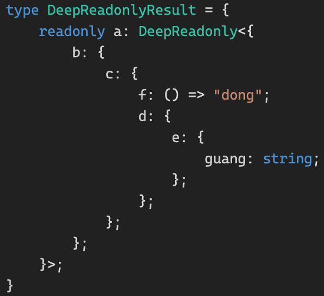
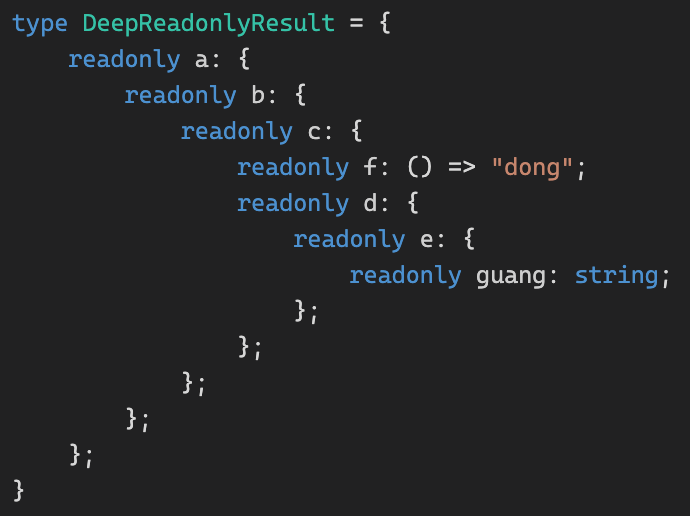
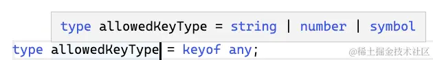
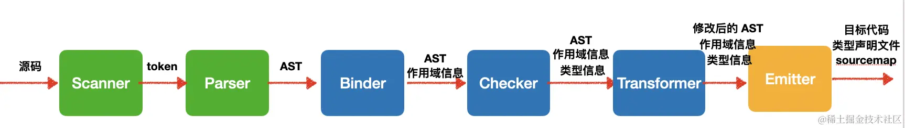
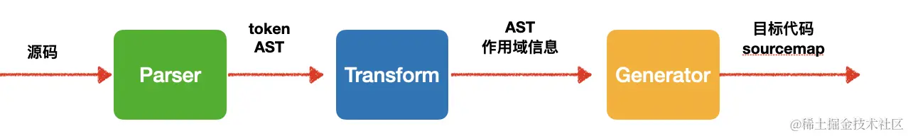
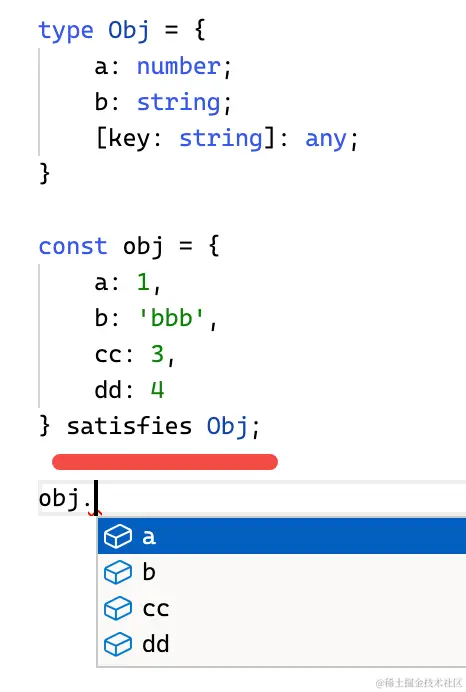
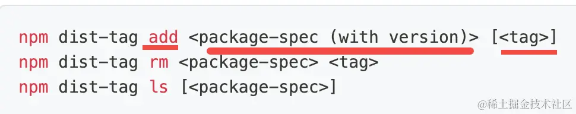

# TypeScript类型体操通关秘籍

## 第1章 如何阅读本小册

## 第2章 为什么说TypeScript的火爆是必然？

## 第3章 TypeScript类型编程为什么叫做类型体操？

### 简单类型系统

变量、函数、类等都可以声明类型，编译器会基于声明的类型做类型检查，类型不匹配时会报错

### 支持泛型的类型系统

**声明时把会变化的类型声明成泛型（也就是类型参数），在调用的时候再确定类型**

### 支持类型编程的类型系统

**对传入的类型参数（泛型）做各种逻辑运算，产生新的类型，这就是类型编程**

**TypeScript 的类型系统是`图灵完备`的，也就是能描述各种可计算逻辑。简单点来理解就是循环、条件等各种 JS 里面有的语法它都有，JS 能写的逻辑它都能写**

## 第4章 TypeScript类型系统支持哪些类型和类型运算？

### TypeScript类型系统中的类型

1. 基础类型（js原生）：（number、boolean、string、object、bigint、symbol、undefined、null）及其包装类型
2. 复合类型（js原生）：class、Array
3. 新增：**Tuple**、**Interface**、**Enum**、**字面量类型**、**never**（表示不可达，比如函数抛异常时返回值就是never）、**void**（表示空，可以是undefined或never）、**any**（任意类型，任何类型都可以赋值给它，它也可以赋值给除never以外的任何类型）、**unknown**（未知类型，任何类型都可以赋值给它，**但它不可以赋值给别的类型**）
4. 新增：类型装饰，比如是否可选、是否只读等等

### TypeScript类型系统中的类型运算

#### 条件：extends ? :

```ts
type isTwo<T> = T extends 2 ? true: false;

// res的类型为false
type res = isTwo<1>;
// res2的类型为true
type res2 = isTwo<2>;
```

#### 推导：infer

提取类型的一部分

```js
// 这里的第一个extends表示的是约束
type First<Tuple extends unknown[]> = Tuple extends [infer T, ...infer R] ? T : never;
// res的类型为1
type res = First<[1,2,3]>;
```

#### 联合：｜

```ts
// Union的类型为1、2、3当中的一个
type Union = 1 | 2 | 3;
```

#### 交叉：&

```ts
type ObjType = {a: number } & {c: boolean};
// res2的类型为true
type res2 = {a:number, c:boolean} extends ObjType ? true :  false;
```

作用于类型表示类型合并，但前提是同一类型，不同类型没法合并

```ts
// res的类型为never
type res = 'aaaa' & 'bbbb'
```

#### 映射类型

对象、class 在 TypeScript 对应的类型是索引类型（Index Type），那么如何对索引类型作修改呢？

答案是`映射类型`

```ts
type MapType<T> = {
  [Key in keyof T]?: T[Key]
}
```

keyof T 是查询索引类型中所有的索引，叫做`索引查询`

T[Key] 是取索引类型某个索引的值，叫做`索引访问`

in 是用于遍历联合类型的运算符

除了值可以变化，索引也可以做变化，用 as 运算符，叫做`重映射`

```ts
type MapType<T> = {
    [
        Key in keyof T 
            as `${Key & string}${Key & string}${Key & string}`
    ]: [T[Key], T[Key], T[Key]]
}
```

## 第5章 套路一：模式匹配做提取

### 模式匹配

提取Promise类型的返回值

```ts
type GetValueType<P> = P extends Promise<infer Value> ? Value : never;
```

**Typescript 类型的模式匹配是通过 extends 对类型参数做匹配，结果保存到通过 infer 声明的局部类型变量里，如果匹配就能从该局部变量里拿到提取出的类型**

### 数组类型

```ts
type GetFirst<Arr extends unknown[]> = 
    Arr extends [infer First, ...unknown[]] ? First : never;
```

> **any 和 unknown 的区别**： any 和 unknown 都代表任意类型，但是 unknown 只能接收任意类型的值，而 any 除了可以接收任意类型的值，也可以赋值给任意类型（除了 never）。类型体操中经常用 unknown 接受和匹配任何类型，而很少把任何类型赋值给某个类型变量。

### 字符串类型

字符串约束的示例

```ts
type StartsWith<Str extends string, Prefix extends string> = 
    Str extends `${Prefix}${string}` ? true : false;
```

### 函数

通过infer同样可以匹配到函数的参数及返回值

```ts
type GetParameters<Func extends Function> = 
    Func extends (...args: infer Args) => unknown ? Args : never;
```

稍不常见为this类型的提取

```ts
type GetThisParameterType<T> 
    = T extends (this: infer ThisType, ...args: any[]) => any 
        ? ThisType 
        : unknown;
```

### 构造器

```ts
interface Person {
    name: string;
}

interface PersonConstructor {
    new(name: string): Person;
}
```

获取构造函数返回实例的类型

```ts
type GetInstanceType<
    ConstructorType extends new (...args: any) => any
> = ConstructorType extends new (...args: any) => infer InstanceType 
        ? InstanceType 
        : any;
```

### 索引类型

```ts
type GetRefProps<Props> = 
    'ref' extends keyof Props
        ? Props extends { ref?: infer Value | undefined}
            ? Value
            : never
        : never;
```

## 第6章 套路二：重新构建做变换

### 重新构造

**TypeScript 的 type、infer、类型参数声明的变量都不能修改，想对类型做各种变换产生新的类型就需要重新构造**

### 数组类型的重新构造

#### Push

```ts
type Push<Arr extends unknown[], Ele> = [...Arr, Ele];
```

#### Unshit

```ts
type Unshit<Arr extends unknown[], Ele> = [Ele, ...Arr];
```

#### Zip

```ts
type Zip<One extends unknown[], Other extends unknown[]> = 
	One extends [infer OneFirst, ...infer OneRest]
		? Other extends [infer OtherFirst, ...infer OtherRest]
			? [[OneFirst, OtherFirst], ...Zip<OneRest, OtherRest>]
			: []
		: [];
```

### 字符串类型的重新构造

#### CapitalizeStr

```ts
type CapitalizeStr<Str extends string> = 
	Str extends `${infer First}${infer Rest}`
		? `${Uppercase<First>}${Rest}`
		: Str;
```

#### CamelCase

```ts
type CamelCase<Str extends string> = 
	Str extends `${infer Left}_${infer Right}${infer Rest}`
		? `${Left}${Uppercase<Right>}${CamelCase<Rest>}`
    : Str;
```

#### DropSubStr

```ts
type DropSubStr<Str extends string, SubStr extends string> = 
	Str extends `${infer Prefix}${SubStr}${infer Suffix}`
		? DropSubStr<`${Prefix}${Suffix}`, SubStr>
		: Str;
```

### 函数类型的重新构建

#### AppendArgument

```ts
type AppendArgument<Func extends Function, Arg> = 
  Func extends (...args: infer Args) => infer ReturnType 
    ? (...args: [...Args, Arg]) => ReturnType : never;
```

### 索引类型的重新构造

#### Mapping

对索引类型的Value进行修改

#### UppercaseKey

对索引类型的Key进行修改，这需要用到`as`关键字，称作**重映射**

```ts
type UppercaseKey<Obj extends object> = {
  [Key in keyof Obj as Uppercase<Key & string>]: Obj[Key]
}
```

#### FilterByValueType

```ts
type FilterByValueType<Obj extends Record<string, any>, ValueType> = {
	[Key in keyof Obj as Obj[Key] extends ValueType ? Key : never]: Obj[Key]
}
```

## 第7章 套路三：递归复用做循环

### 递归复用

**TypeScript 类型系统不支持循环，但支持递归。当处理数量（个数、长度、层数）不固定的类型的时候，可以只处理一个类型，然后递归的调用自身处理下一个类型，直到结束条件也就是所有的类型都处理完了，就完成了不确定数量的类型编程，达到循环的效果**

### Promise的递归复用

#### DeepPromiseValueType

```ts
type DeepPromiseValueType<T extends Promise<unknown>> = T extends Promise<infer ValueType>
	? ValueType extends Promise<unknown>
		? DeepPromiseValueType<ValueType>
		: ValueType
	: never;
```

### 数组类型的递归

#### ReverseArr

```ts
type ReverseArr<Arr extends unknown[]> = Arr extends [infer First, ...infer Rest] 
	? [...ReverseArr<Rest>, First]
	: Arr;
```

#### includes

```ts
type includes<Arr extends unknown[], FindItem> = Arr extends [infer First, ...infer Rest]
	? isEqual<First, FindItem> extends true
		? true
		: Includes<Rest, FindItem>
	: false;
type IsEqual<A, B> = (A extends B ? true : false) & (B extends A ? true : false);
```

#### RemoveItem

```ts
type RemoveItem<Arr extends unknown[], Item, Result extends unknown[] = []>
	= Arr extends [infer First, ...infer Rest]
		? IsEqual<First, Item> extends true
			? RemoveItem<Rest, Item, Rest>
			: RemoveItem<Rest, Item, [...Rest, First]>
		: Result;
type IsEqual<A, B> = (A extends B ? true : false) & (B extends A ? true : false);
```

*PS：之前做TypeScript Heros时，看到一个关于Equals的工具类型的实现：*

```ts
type Equals<X, Y> =
    (<T>() => T extends X ? 1 : 2) extends
    (<T>() => T extends Y ? 1 : 2) ? true : false;
```

#### BuildArray

```ts
type BuildArray<Length extends number, Ele = unknown, Arr extends unknown = []>
	= Arr['length'] extends Length
		? Arr
		: BuildArray<Length, Ele, [...Arr, Ele]>;
```

### 字符串类型的递归

#### ReplaceAll

```ts
type ReplaceAll<Str extends string, From extends string, To extends string>
	= Str extends `${infer Left}${From}${infer Right}`
  	? `${Left}${To}${ReplaceAll<Right, From, To>}`
    : Str;
```

#### StringToUnion

```ts
type StringToUnion<Str extends string> = Str extends `${infer First}${infer Rest}`
	? First | StringToUnion<Rest>
	: never
```

#### ReverseStr

```ts
type ReverseStr<Str extends string, Result extends string = ''>
	= Str extends `${infer Frist}${infer Rest}`
		? ReverseStr<Rest, `${First}${Result}`>
		: Result;
```

### 对象类型的递归

#### DeepReadonly

```ts
type DeepReadonly<Obj extends Record<string, any>> = {
  readonly [Key in keyof Obj]: Obj[Key] extends object
  	? Obj[Key] extends Function
  		? Obj[Key]
  		: DeepReadonly<Obj[Key]>
  	: Obj[Key]
}
```

**ts 的类型只有被用到的时候才会做计算**，所以如果这样使用：

```ts
type DeepReadonly<Obj extends Record<string, any>> = {
  readonly [Key in keyof Obj]: Obj[Key] extends object
  	? Obj[Key] extends Function
  		? Obj[Key]
  		: DeepReadonly<Obj[Key]>
  	: Obj[Key]
}

type obj = {
    a: {
        b: {
            c: {
                f: () => 'dong',
                d: {
                    e: {
                        guang: string
                    }
                }
            }
        }
    }
}

type DeepReadonlyResult = DeepReadonly<obj>
```



如果改成：

```ts
type DeepReadonly<Obj extends Record<string, any>> = Obj extends any ? ({
  readonly [Key in keyof Obj]: Obj[Key] extends object
  	? Obj[Key] extends Function
  		? Obj[Key]
  		: DeepReadonly<Obj[Key]>
  	: Obj[Key]
}) : never
```

则结果就是：



## 第8章 套路四：数组长度做计数

### 数组长度做计数

**TypeScript 类型系统中没有加减乘除运算符，但是可以通过构造不同的数组然后取 length 的方式来完成数值计算，把数值的加减乘除转化为对数组的提取和构造**

### 数组长度实现加减乘除

#### Add

```ts
type BuildArray<Length extends number, Ele = unknown, Arr extends unknown[] = []> = 
	Arr['length'] extends Length
		? Arr
		: BuildArray<Length, Ele, [...Arr, Ele]>;

type Add<Num1 extends number, Num2 extends number> = [...BuildArray<Num1>, ...BuildArray<Num2>]['length']
```

#### Subtract

```ts
type Subtract<Num1 extends number, Num2 extends number> = 
	BuildArray<Num1> extends [...BuildArray<Num2>, ...infer Rest]
		? Rest['length']
		: never;
```

#### Multiply

```ts
type Multiply<Num1 extends number, Num2 extends number, ResultArr extends unknown[] = []> =
	Num2 extends 0 ? ResultArr['length']
		: Multiply<Num1, Subtract<Num2, 1>, [...BuildArray<Num1>, ...ResultArr]>;
```

#### Divide

```ts
type Divide<Num1 extends number, Num2 extends number, CountArr extends unknown[] = []> = 
	Num1 extends 0 ? CountArr['length']
	: Divide<Subtract<Num1, Num2>, Num2, [unknown, ...CountArr]>;
```

### 数组长度实现计数

#### GreaterThan

往一个数组类型中不断放入元素取长度，如果先到了 A，那就是 B 大，否则是 A 大

```ts
type GreaterThan<Num1 extends number, Num2 extends number, CountArr extends unknown[] = []> = 
	Num1 extends Num2
		? false 
		: CountArr['length'] extends Num2 
			? true
			: CountArr['length'] extends Num1
				? false
				: GreaterThan<Num1, Num2, [...CountArr, unknown]>;
```

#### Fibonacci

```ts
type FibonacciLoop<
  PrevArr extends unknown[], 
  CurrentArr extends unknown[], 
  IndexArr extends unknown[], 
  Num extends number = 1> = IndexArr['length'] extends Num
		? CurrentArr['length']
		: FibonacciLoop<CurrentArr, [...PrevArr, ...CurrentArr], [...IndexArr, unknown], Num>

type Fibonacci<Num extends number> = FibonacciLoop<[1], [], [], Num>;
```

参数Num代表求数列中的第几个数

## 第9章 套路五：联合分散可简化

### 分布式条件类型

**当类型参数为联合类型，并且在条件类型左边直接引用该类型参数的时候，TypeScript 会把每一个元素单独传入来做类型运算，最后再合并成联合类型，这种语法叫做分布式条件类型**

### IsUnion

```ts
type isUnion<A, B = A> = 
	A extends A
		? [B] extends [A]
			? false
			: true
		: never
```

这里是利用了“条件类型中如果左边的类型是联合类型，会把每个元素单独传入做计算，而右边不会”

A extends A 这段看似没啥意义，**主要是为了触发分布式条件类型**，让 A 的每个类型单独传入。

[B] extends [A] 这样不直接写 B 就可以避免触发分布式条件类型，那么 B 就是整个联合类型。

B 是联合类型整体，而 A 是单个类型，自然不成立，而其它类型没有这种特殊处理，A 和 B 都是同一个，怎么判断都成立。

利用这个特点就可以判断出是否是联合类型。

### BEM

```ts
type BEM<
  Block extends string,
  Elements extends string[],
  Modifiers extends string[]
> = `${Block}__${Elements[number]}--${Modifiers[number]}`
```

### AllCombinations

```ts
type Combination<A extends string, B extends string = A> = 
	| A
	| B
	| `${A}${B}`
	| `${B}${A}`;

type AllCombination<<A extends string, B extends string = A> =
  A extends A
		? Combination<A, AllCombination<Exclude<B, A>>>
    : never;
```

## 第10章 套路六：特殊特性要记清

### 特殊类型的特性

**类型的判断要根据它的特性来，比如判断联合类型就要根据它的 distributive 的特性。**

### IsAny

**特性：any 类型与任何类型的交叉都是 any，也就是 1 & any 结果是 any**

```ts
type IsAny<T> = '1' extends T & '0' ? true : false;
```

### IsEqual

```ts
type IsEqual<A, B> = (<T>() => T extends A ? 1 : 2) extends (<T>() => T extends B ? 1 : 2) ? true : false;
```

这是因为 TS 对这种形式的类型做了特殊处理，**是一种 hack 的写法**，它的解释要从 TypeScript 源码找答案了，后续的原理篇中会解释

### IsUnion

**特性：联合类型作为类型参数出现在条件类型左侧时，会分散成单个类型传入，最后合并**

```ts
type IsUnion<A, B = A> = A extends A
	? [B] extends [A]
		? false
		: true
	: never
```

### IsNever

**特性：never 在条件类型中也比较特殊，如果条件类型左边是类型参数，并且传入的是 never，那么直接返回 never**

所以要判断never类型，不能直接`T extends never`，需要如下写法：

```ts
type IsNever<T> = [T] extends [never] ? true : false;
```

### IsTuple

**特性：元组类型的 length 是数字字面量，而数组的 length 是 number**

```ts
type IsTuple<T> = T extends [...params: infer Eles]
	? IsEqual<Eles['length'], number> extends true
		? false
		: true
	: false
```

### UnionToIntersection

类型之间是有父子关系的，更具体的那个是子类型，比如 **A 和 B 的交叉类型 A & B 就是联合类型 A | B 的子类型**，因为更具体

如果允许父类型赋值给子类型，就叫做**逆变**

如果允许子类型赋值给父类型，就叫做**协变**

**特性：在 TypeScript 中有函数参数是有逆变的性质的，也就是如果参数可能是多个类型，参数类型会变成它们的交叉类型**

```ts
type UnionToIntersection<U> = 
	(U extends U ? (x: U) => unknown : never) extends (x: infer R) => unknown
		? R
		: never
```

```ts
// T1是一个函数，其参数是联合类型
type T1 = (p: { x: string } | { y: number }) => unknown;
// T2是一个函数，其参数是交叉类型
type T2 = (p: { x: string } & { y: number }) => unknown;
// 交叉类型是联合类型的子类型
// 函数参数有逆变特性，允许父类型赋给子类型，所以这里T3是true
type T3 = T1 extends T2 ? true : false;
```

### GetOptional

**特性：可选索引的值为 `undefined` 和值类型的联合类型，那 `Pick` 出来的就可能是 `{}`，可以用来过滤可选索引，反过来也可以过滤非可选索引**

```ts
type GetOptional<Obj extends Record<string, any>> = {
  [
  	Key in keyof Obj
  		as {} extends Pick<Obj, Key> ? Key : never
  ]: Obj[Key];
}
```

这里需要注意的是可空类型与值可以为`undefined`的区别，可空类型指的是这个索引key可能不存在，当该索引key为空，则`{} extends Pick<Obj, Key>`成立

### GetRequired

```ts
type isRequired<Key extends keyof Obj, Obj> = {} extends Pick<Obj, Key> ? never : Key;
type GetRequired<Obj extends Record<string, any>> = {
  [Key in keyof Obj as isRequired<Key, Obj>] : Obj[Key]
}
```

### RemoveIndexSignature

**特性：索引签名不能构造成字符串字面量类型，因为它没有名字，而其他索引可以**

```ts
type RemoveIndexSignature<Obj extends Record<string, any>> = {
  [
  	Key in keyof Obj as Key extends `{infer Str}` ？ Str : never
  ]: Obj[Key]
}
```

### ClassPublicProps

**特性：keyof 只能拿到 class 的 public 索引，private 和 protected 的索引会被忽略**

```ts
type ClassPublicProps<Obj extends Record<string, any>> = {
  [Key in keyof Obj]: Obj[Key]
}
```

### as const

**特性：TypeScript 默认推导出来的类型并不是字面量类型，但是类型编程很多时候是需要推导出字面量类型的，这时候就需要用 `as const`，但是加上 `as const` 之后推导出来的类型是带有 `readonly` 修饰的，所以再通过模式匹配提取类型的时候也要加上`readonly` 的修饰才行**

```ts
const arr = [1, 2, 3] as const;
type arrType = typeof arr;

// 注意这里的readonly不能少，不然无法匹配
type ReverseArr<Arr> = Arr extends readonly [infer A, infer B, infer C] ? [C, B, A] : never;
type ReverseArrRes = ReverseArr<arrType>;
```

## 第11章 类型体操顺口溜

### 模式匹配做提取

### 重新构造做变换

### 递归复用做循环

### 数组长度做计数

### 联合分散可简化

### 特殊特性要记清

### ParseQueryString

```ts
type ParseQueryString<Str extends string> = Str extends `${infer Param}&${infer Rest}`
	? MergeParam<ParseParam<Param>, ParseQueryString<Rest>>
	: ParseParam<Str>;


type ParseParam<Str extends string> = Str extends `${infer Key}=${infer Value}` ? {
	[K in Key]: Value
} : {}

type MergeParam<OneParam extends Record<string, any>, OtherParam extends Record<string, any>> = {
	[Key in keyof OneParam | keyof OtherParam]:
	Key extends keyof OneParam
		? Key extends keyof OtherParam
			? MergeValue<OneParam[Key], OtherParam[Key]>
			: OneParam[Key]
		: Key extends keyof OtherParam
			? OtherParam[Key]
			: never
}

type MergeValue<One, Other> = One extends Other 
	? One 
	: Other extends unknown[] 
		? [One, ...Other] 
		: [One, Other];

type ParseQueryStringResult = ParseQueryString<'a=1&a=2&b=3&c=4'>
```

## 第12章 TypeScript内置 的高级类型有哪些？

### ConstructorParameters

```ts
type ConstructorParameters<T extends abstract new (...args: any) => any> = 
  T extends abstract new (...args: infer P) => any 
		? P
		: never;
```

类型参数 T 是待处理的类型，通过 extends 约束为构造器类型，加个 abstract 代表不能直接被实例化（其实不加也行）

### InstanceType

提取构造函数的返回值

```ts
type ConstructorParameters<T extends abstract new (...args: any) => any> = 
  T extends abstract new (...args: any) => infer R 
		? R
		: never;
```

### ThisParameterType

函数中的`this`也可以进行约束，如下

```ts
type Person = {
	name: string
}

function hello(this: Person) {
  console.log(this.name)
}
```

要提取出这个`this`的类型，就可以使用ThisParameterType

```ts
type ThisParameterType<T> = T extends (this: infer U, ...args: any[]) => any
	? U
	: unknown;
```

### OmitThisParameter

```ts
type OmitThisParameter<T> = unknown extends ThisParameterType<T> 
	? T
	: T extends (...args: infer A) => infer R
		? (...args: A) => R
		: T;
```

## 第13章 真实案例说明类型编程的意义

**需要动态生成类型的场景，必然要用类型编程做一些运算。有的场景下可以不用类型编程，但是用了能够有更精准的类型提示和检查**

### ParseQueryString

```ts
type ParseParam<Param extends string> = 
    Param extends `${infer Key}=${infer Value}`
        ? {
            [K in Key]: Value 
        } : Record<string, any>;

type MergeValues<One, Other> = 
    One extends Other 
        ? One
        : Other extends unknown[]
            ? [One, ...Other]
            : [One, Other];

type MergeParams<
    OneParam extends Record<string, any>,
    OtherParam extends Record<string, any>
> = {
  readonly [Key in keyof OneParam | keyof OtherParam]: 
    Key extends keyof OneParam
        ? Key extends keyof OtherParam
            ? MergeValues<OneParam[Key], OtherParam[Key]>
            : OneParam[Key]
        : Key extends keyof OtherParam 
            ? OtherParam[Key] 
            : never
}

type ParseQueryString<Str extends string> = 
    Str extends `${infer Param}&${infer Rest}`
        ? MergeParams<ParseParam<Param>, ParseQueryString<Rest>>
        : ParseParam<Str>;

function parseQueryString<Str extends string>(queryStr: Str): ParseQueryString<Str> ;
function parseQueryString(queryStr: string) {
    if (!queryStr || !queryStr.length) {
        return {};
    }
    const queryObj:Record<string, any> = {};
    const items = queryStr.split('&');
    items.forEach(item => {
        const [key, value] = item.split('=');
        if (queryObj[key]) {
            if(Array.isArray(queryObj[key])) {
                queryObj[key].push(value);
            } else {
                queryObj[key] = [queryObj[key], value]
            }
        } else {
            queryObj[key] = value;
        }
    });
    return queryObj;
}

const res = parseQueryString('a=1&b=2&c=3');
```

### Promise.all

```ts
interface PromiseConstructor {
    all<T extends readonly unknown[] | []>
        (values: T): Promise<{
            -readonly [P in keyof T]: Awaited<T[P]>
        }>;

    race<T extends readonly unknown[] | []>
        (values: T): Promise<Awaited<T[number]>>;
}
```

### Currying

```ts
type CurriedFunc<Params, Return> = 
    Params extends [infer Arg, ...infer Rest]
        ? (arg: Arg) => CurriedFunc<Rest, Return>
        : never;

declare function currying<Func>(fn: Func): 
    Func extends (...args: infer Params) => infer Result ? CurriedFunc<Params, Result> : never;
```

## 第14章 类型编程综合实战一

### KebabCaseToCamelCase

```ts
type KebabCaseToCamelCase<Str extends string> = Str extends `${infer Item}-${infer Rest}`
	? `${Item}${KebabCaseToCamelCase<Capitalize<Rest>>}`
	: Str;
```

### CamelCaseToKebabCase

```ts
type CamelCaseToKebabCase<Str extends string> = Str extends `${infer First}${infer Rest}`
	? First extends Lowercase<First>
		? `${First}${CamelCaseToKebabCase<Rest>}`
		: `-${Lowercase<First>}${CamelCaseToKebabCase<Rest>}`
	: Str;
```

### Chunk

```ts
type Chunk<
  Arr extends unknown[],
  ItemLen extends number,
  CurItem extends unknown[] = [],
  Res extends unknown[] = []
> = Arr extends [infer First, ...infer Rest]
	? CurItem['length'] extends ItemLen
		? Chunk<Rest, ItemLen, [First], [...Res, CurItem]>
		: Chunk<Rest, ItemLen, [...CurItem, First], Res>
	: [...Res, CurItem]
```

### TupleToNestedObject

```ts
type TupleToNestedObject<Tuple extends unknown[], Value> = Tuple extends [infer First, ...infer Rest]
	? {
    [Key in First as Key extends keyof any? Key : never]:
    	Rest extends unknown[]
    		? TupleToNestedObject<Rest, Value>
    		: Value
  }
	: Value;
```

为什么后面还有个 as Key extends keyof any ? Key : never 的重映射呢？

因为比如 null、undefined 等类型是不能作为索引类型的 key 的，就需要做下过滤，如果是这些类型，就返回 never，否则返回当前 Key。

这里的 keyof any 在内置的高级类型那节也有讲到，就是取当前支持索引支持哪些类型的：



如果提取不出元素，那就构造结束了，返回 Value

### PartialObjectPropByKeys

```ts
type PartialObjectPropByKeys<
  Obj extends Record<string, any>,
  Key extends keyof any = keyof Obj
> = Partial<Pick<Obj, Extract<keyof Obj, Key>>> & Omit<Obj, Key>
```

**ts 的类型只有在用到的的时候才会去计算**

```ts
type Copy<Obj extends Record<string, any> = {
  [Key in keyof Ojb]: Obj[Key]
}

type PartialObjectPropByKeys<
  Obj extends Record<string, any>,
  Key extends keyof any = keyof Obj
> = Copy<Partial<Pick<Obj, Extract<keyof Obj, Key>>> & Omit<Obj, Key>>
```

## 第15章 类型编程综合实践二

### 函数重载的三种写法

```ts
// 1. 同名函数
function add(a: number, b: number): number;
function add(a: string, b: string): string;
function add(a: any, b: any) {
  return a + b;
}

// 2. 通过interface
interface Func {
  (name: string): string;
  (name: number): number;
}

// 3. 交叉类型
type Func2 = ((name: string) => string) & ((name: number) => number);
```

### UnionToTuple

这里会用到几个性质：

1. **取重载函数的 ReturnType 返回的是最后一个重载的返回值类型**
2. 函数重载可以写成交叉类型的方式
3. 之前实现过的联合类型转交叉类型

```ts
type UnionToIntersection<U> = 
    (U extends U ? (x: U) => unknown : never) extends (x: infer R) => unknown
        ? R
        : never

type UnionToFuncIntersection<T> = UnionToIntersection<T extends any ? () => T : never>;

type UnionToTuple<T> = 
    UnionToIntersection<
        T extends any ? () => T : never
    > extends () => infer ReturnType
        ? [...UnionToTuple<Exclude<T, ReturnType>>, ReturnType]
        : [];
```

### join

### DeepCamelize

```ts
type DeepCamelize<Obj extends Record<string, any>> = 
    Obj extends unknown[]
        ? CamelizeArr<Obj>
        : { 
            [Key in keyof Obj 
                as Key extends `${infer First}_${infer Rest}`
                    ? `${First}${Capitalize<Rest>}`
                    : Key
            ] : DeepCamelize<Obj[Key]> 
        };

type CamelizeArr<Arr> = Arr extends [infer First, ...infer Rest]
    ? [DeepCamelize<First>, ...CamelizeArr<Rest>]
    : []
```

### AllKeyPath

```ts
type AllKeyPath<Obj extends Record<string, any>> = {
  [Key in keyof Obj]: 
    Key extends string
      ? Obj[Key] extends Record<string, any>
        ? Key | `${Key}.${AllKeyPath<Obj[Key]>}`
        : Key
      : never
}[keyof Obj];
```

### Defaultize

对 A、B 两个索引类型做合并，如果是只有 A 中有的不变，如果是 A、B 都有的就变为可选，只有 B 中有的也变为可选

**索引类型处理可以 Pick 出每一部分单独处理，最后取交叉类型来把处理后的索引类型合并到一起**

```ts
type Defaultize<A, B> = 
    & Pick<A, Exclude<keyof A, keyof B>>
    & Partial<Pick<A, Extract<keyof A, keyof B>>>
    & Partial<Pick<B, Exclude<keyof B, keyof A>>>
```

## 第16章 新语法`infer extends`是如何简化类型编程的

使用场景如下：

```ts
type Last<Arr extends string[]> = Arr extends [...infer Rest, infer Last]
	? `最后一个早：${Last}`
	: never;
```

此时`Last`会被推导为`unknown`类型，导致不能直接把它当`string`使用，虽然可以通过下面的方式来解决

```ts
type Last<Arr extends string[]> = Arr extends [...infer Rest, infer Last]
	? Last extends string
		?	`最后一个早：${Last}`
		: never;
	: never;

// 或者
type Last<Arr extends string[]> = Arr extends [...infer Rest, infer Last]
	? `最后一个早：${Last & string}`
	: never;
```

而有了`infer extends`就可以简化如下：

```ts
type Last<Arr extends string[]> = Arr extends [...infer Rest, infer Last extends string]
	? `最后一个早：${Last}`
	: never;
```

这个语法是 TS 4.7 引入的，在 4.8 又完善了一下， 4.7 的时候推导出的就是 extends 约束的类型，但是 4.8 的时候，如果是基础类型，会推导出字面量类型

另一个场景如下：

```ts
enum Code {
  a = 111,
  b = 222,
  c = "abc",
}

// 此时res的类型为："111" | "222" | "abc"
type res = `${Code}`;
```

可以用`infer extends`来将数字部分由字符串转回数字

```ts
type StrToNum<Str> = Str extends `${infer Num extends number}`
	?	Num
	:	Str

// 此时res的类型为：“abc” | 111 | 222
type res = StrToNum<`${Code}`>;
```

## 第17章 原理篇：逆变、协变、双向协变、不变

### 类型安全和型变

TypeScript提供类型检查的同时，考虑一些场景上变通（比如子类型可以赋值给父类型的变量），于是就有了“型变”

型变分为两种：一种是子类型可以赋值给父类型，叫作**协变**，另一种j父类型可以赋值给子类型，叫**逆变**

#### 协变

可以理解为，父类是子类的特例，父类有的，子类一定有，所以子类是可c赋值给父类的

#### 逆变

函数的**参数**有逆变的性质（而**返回值是协变的**，也就是子类型可以赋值给父类型）

```ts
interface Person {
	name: string;
}

interface Worker extends Person {
	hobby: string;
}

let printName: (person: Person) => void = (person) => {
	console.log(person.name)
}

let printHobby: (worker: Worker) => void = (worker) => {
	console.log(worker.hobby)
};

// 可以，因为printName的参数是父类，所访问的name是父类属性，子类定有name属性
printHobby = printName

// 反之则不可以，printHobby的参数是子类，当访问子类的hobby属性时，则非类型安全
printName = printHobby
```

#### 不变

非父子类型之间i会发生型变，只s类型不一样就会报错

### 类型父子关系的判断

与Java里的名义类型系统（显式的继承关系）不同，TypeScript使用的是**结构类型系统**，通过结构，**更具体**的那个是子类型

注意这里用的是“更具体”，而不是更多，比如`'a'|'b'`相对于`'a'|'b'|'c'`更具体，所以前者是后者的子类型

## 第18章 原理篇：编译ts代码是用tsc还是babel？

### tsc的编译流程



### babel的编译流程



### babel和tsc的区别

#### 语法支持

tsc默认支持最新的es规范和一些还在草案阶段的语法，想要支持新语法就要升级tsc的版本

babel则是通过`@babel/preset-env`来根据目标环境自动引入需要用到的插件来支持标准语法，对于草案阶段的语法要单独引入插件来支持

#### 代码生成

tsc生成的代码没有做polyfill处理，如果需要兼容处理就需要在入口处引入`core-js`

babel则使用`@babel/preset-env`来根据目标环境自动引入需要的插件及相关的`core-js`模块，引入方式通过`useBuildIns`来配置：

- entry：在入口引入根据目标环境过滤出的所有需要用的`core-js`
- usage：每个模块按照使用了哪些来按需引入

另外，babel会注入一些helper代码，可通过`@babel/plugin-transform-runtime`插件抽离出来，从`@babel/runtime`包引入

```js
// babel配置的示例
module.exports = {
    presets: [
        [
            '@babel/preset-typescript'
        ],
        [
            '@babel/preset-env',
            {
                targets: '目标环境',
                useBuiltIns: 'usage' // ‘entry’
            }
        ]
    ],
    plugins: [ '@babel/plugin-transform-runtime']
}
```

### babel不支持的ts语法

babel 是每个文件单独编译的，而 tsc 不是，tsc 是整个项目一起编译，会处理类型声明文件，会做跨文件的类型声明合并，比如 namespace 和 interface 就可以跨文件合并

#### `const enum`不支持

**babel 7.15 以后开始支持了**，在`@babel/preset-typescript` 里加了个 [optimizeCosntEnums 选项](https://link.juejin.cn/?target=https%3A%2F%2Fbabeljs.io%2Fdocs%2Fbabel-preset-typescript%23optimizeconstenums)，原理应该是通过 AST 做了 enum 引用的解析，然后编译时替换引用的值

#### namespace 部分支持：不支持 namespace 的合并，不支持导出非 const 的值

#### 部分语法不支持

## 第19章 原理篇：实现简易TypeScript类型检查 *

## 第20章 原理篇：如何阅读TypeScript源码 *

## 第21章 原理篇：一些特殊情况的说明

### isEqual为什么要这样写

```ts
type IsEqual<A, B> = (<T>() => T extends A ? 1 : 2) extends (<T>() => T extends B ? 1 : 2)
    ? true : false;

```

源码实现中：如果是两个条件类型 `T1 extends U1 ? X1 : Y1` 和 `T2 extends U2 ? X2 : Y2` 相关的话，那 T1 和 T2 相关、X1 和 X2 相关、Y1 和 Y2 相关，**而 U1 和 U2 相等**

### 为什么我调整了下extends左右类型的位置，就报错了

**类型编程中如果需要取类型参数做一些计算的时候，默认推导出的是约束的类型，如果没有类型约束，那就是 unknown**

number extends 某个具体的数字自然永远不成立

### 几个条件类型的特殊情况

1. boolean其实也是联合类型，作为extends左边类型时，也会触发分布式条件类型
2. 条件类型中如果左边是any，比如`any extends true`，则会返回trueType与falseType的联合类型
3. 当条件类型的左边是never，则直接返回never

## 第22章 小册总结

babel 不会做类型检查，但是在代码产物上更有优势，可以根据 targets 指定的环境来按需编译并且引入 polyfill。而 tsc 只能指定语言版本的 target，不会做 polyfill，代码产物会更大一些，但是类型检查必须依赖它

## 第23章 加餐：3种类型来源和3种模块语法

### TypeScript类型声明的三种来源

1. declare语法，对于内置的API，TypeScript提供了lib.xxx.d.ts，通过在`compilerOptions`下的`lib`配置项中配置即可使用
2. 通过安装@types/xxx包，可以指定加载@types目录下r哪些包（通过`types`配置项），也可以修改查找@types包的目录（通过`typeRoots`配置项，默认为`node_modules/@types`）
3. 自己写的ts代码，则通过配置编译的入口文件，通过 `includes` 指定一堆，然后通过 `excludes` 去掉一部分，还可以通过 `files` 再单独包含一些

### 全局类型声明 vs 模块类型声明

最早的namespace其实就是全局暴露的对象，然后在对象上挂载属性和方法，算是早期的模块实现

```ts
namespace Guang {
  export interface Person {
    name: string;
    age?: number;
  }
  
  const name = 'guang';
  const age = 20;
  
  export const guang: Person = {
    name,
    age,
  }
  
  export function add(a: number, b: number): number {
    return a + b;
  }
}
```

编译后的代码：

```js
"use strict"
var Guang;
(function (Guang) {
  const name = 'guang';
  const age = 20;
  Guang.guang = {
    name,
    age
  };
  function add(a, b) {
    return a + b;
  }
  Guang.add = add;
}
)(Guang || (Guang = {}))''
```

namespace 与 module 其实本质上是一样，通过AST Explorer可以看到下面二者的AST是一样的

```ts
module "fs/xxx" {}
namespace React {}
```

有了 es module 之后，TS 有了一个单独的设计：

**dts 中，如果没有 import、export 语法，那所有的类型声明都是全局的，否则是模块内的。**

而在有import、export语法的dts文件中，可以通过下面的语法来定义全局类型：

```ts
declare global {
  const func(a: number, b: number) => number;
}
```

不止是 es module 的模块里可以用 global 声明全局类型，module 的方式声明的 CommonJS 模块也是可以的

### 三斜线指令

本质上就是一个自闭合的 XML 标签，语法：

```ts
/// <reference path="./other.d.ts" />
/// <reference types="node" />
/// <reference lib="dom" />
```

**三斜线指令必须被放置在文件的顶部才能生效**

1. 使用 path 的 reference 指令，其 path 属性的值为一个**相对路径**，指向你项目内的其他声明文件。而在编译时，TS 会沿着 path 指定的路径不断深入寻找，最深的那个没有其他依赖的声明文件会被最先加载
2. 使用 types 的 reference 指令，其 types 的值是一个包名，也就是你想引入的 `@types/` 声明，如果你的代码文件（`.ts`）中声明了对某一个包的类型导入，那么在编译产生的声明文件（`.d.ts`）中会自动包含引用它的指令
3. 使用 lib 的 reference 指令类似于 types，只不过这里 lib 导入的是 TypeScript 内置的类型声明，比如`/// <reference lib="dom" />`表示对`lib.dom.d.ts`的依赖，而`/// <reference lib="esnext.promise" />`则是对`lib.esnext.promise.d.ts`的依赖

## 第24章 加餐：用Project Reference优化tsc编译性能

如果项目下有一些相对独立的模块，别的模块的变动不影响它，但是它却要跟着重新编译一次，这时就可以用 Project Reference 来优化了。

在独立的模块下添加 tsconfig.json，加上 composite 的编译选项，在入口的 tsconfig.json 里配置 references 引用这些独立的模块。然后执行 tsc --build 或者 tsc -b 来编译。

这时候就实现了编译和类型检查的性能优化。

原理是编译时会生成 tsconfig.tsbuildinfo 的文件，记录着编译的文件和它们的 hash，当再次编译的时候，如果文件 hash 没变，那就直接跳过，从而提升了编译速度。

## 第25章 加餐：一道3层的ts面试题

[playground](https://www.typescriptlang.org/play/#code/C4TwDgpgBAWglmAPAeQHbQgD2BVATAZygFdUBrVAewHdUBtAXQBoplgALCAJyix3yKkKNegwB8UALxQAUFFbpe2XISh04qAGbcFEAGJwuBYCwB05jdp4AlCMYCMDOfKgB+Vhx18VRdVp1snFwGRiZQ5qaWOrbGAExOLi7udHRo+obGLIHcIcbM4ebwSDHA9iwlsWIJiVAAXGrV8vWMANwyMqCQUACyxMAAhgBGADYQKIMAVhLSAN7OALRcEP14lKjDIGoA0hCbGlBku5SarJMM9ciTdDsgDG0Avm0ymqQAxsBwa1AAXggAFAMuABzCDAepCKi0RgsAiUYhcV4QcHkSGiACUyOEULu7ReqHen1QPwQiAAKv1gaClPxVEsVmsNiQUSJoVAAMpwhEYZQCKB01brTYQlniP7OQEgsFQcmUkzOWHwxH1DmKiAyDGwEm9AYjMYyyViFjaoajRAqrliMRPPEEr6-MAAimSzGo1kKrkukVoqBzeRwE5-ACEEtBplGqCBHCgAB9o1BA+7EWHcJH2N6lsB4UTWu15K81sY1GsIGZzEsHAwpFAQ8A2nmC8Ai54uKXTOXgPEq4mIE95Bms2o6MWWJRm-kIva-u2yny7B20Tj7u186hC+XiMNG9JJ3QZ7EWABmSv9IgrzJqAAsLAArCwAGzH08NtFPM+NilcexV3csfdQI9tG+UAfrE35XlAADk14QfeOIyEB66bqB27-B+M4gS+QA)

## 第26章 加餐：项目中2个真实的类型编程案例

## 第27章 加餐：TypeScript新语法satisfies：用声明or用推导？

TypeScript4.9添加的新语法，用于实现下面这种提示



它的作用就是**让你用自动推导出的类型，而不是声明的类型，增加灵活性，同时还可以对这个推导出的类型做类型检查，保证安全。**

可以通过 `npm dist-tag ls` 的方式看到 npm 包的所有 tag

说点题外话，这个 tag 是怎么打上的呢？

发包的时候会用 npm publish，这种会自动打上 latest 的 tag。

也可以手动 npm publish --tags beta，这样打的就是 beta 的 tag了。

除了发包的时候可以指定 tag，平时也可以通过 npm dist-tag 命令来给某个版本的包打上 tag：



## 第28章 加餐：JSDoc 真能取代TypeScript？

JSDoc 最大的好处：**无侵入的给 JS 加上类型，拥有和 ts 一样的类型检查、类型提示、生成 dts 等功能，但却不需要编译，因为 JS 代码可以直接跑。**

## 第29章 加餐：一道字节面试真题

```ts
134945 type Seperator = '-' | '.' | '/';

type Num = 1 | 2 | 3 | 4 | 5 | 6 | 7 | 8 | 9;

type Num2 = Num | 0

type YY = `19${Num2}${Num2}` | `20${Num2}${Num2}`;

type MM = `0${Num}` | `1${0 | 1 | 2}`;

type DD = `${0}${Num}` | `${1 | 2}${Num2}` | `3${0 | 1}`;

type GenStr<Type extends string> = 
  Type extends 'YY'
    ? YY
    : Type extends 'MM'
      ? MM
      : DD;

type FormatDate<Pattern extends string> = 
  Pattern extends `${infer Aaa}${Seperator}${infer Bbb}${Seperator}${infer Ccc}`
    ? Pattern extends `${Aaa}${infer Sep}${Bbb}${infer _}${Ccc}`
      ? `${GenStr<Aaa>}${Sep}${GenStr<Bbb>}${Sep}${GenStr<Ccc>}`
      : never
    : never;

const a: FormatDate<'YY-MM-DD'> = '2023-01-02';

const b: FormatDate<'DD/MM/YY'> = '01/02/2024';

const c: FormatDate<'DD/MM/YY'> = '2024-01-02';
```

