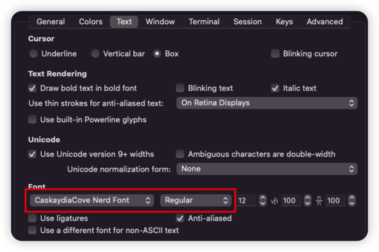

# Neovim使用

## 一、安装

### 1.1 安装Nerd fonts字体

- 用途：在命令行环境下展示各种icon

- [字体官网](https://www.nerdfonts.com/font-downloads)

- 安装方法：

  ```bash
  brew tap homebrew/cask-fonts
  brew install --cask font-caskaydia-cove-nerd-font
  ```

- 配置：

  - iterm2中设置字体如下：

    

  - vscode中可以将字体（包手命令行字体）为：`CaskaydiaCove Nerd Font`

### 1.2 安装Neovim

```bash
brew install neovim
```

## 二、配置

**配置文件保存位置：`~/.config/nvim/init.lua`**

配置项名称的分类：

- `vim.g.{name}`: 全局变量
- `vim.b.{name}`: 缓冲区变量
- `vim.w.{name}`: 窗口变量
- `vim.bo.{option}`: buffer-local 选项
- `vim.wo.{option}`: window-local 选项

### 2.1 快捷键

快捷键设置的API：`vim.api.nvim_set_keymap('模式', '按键', '映射为', 'options')`

这里的“模式”用一个字母表示：

- **n** Normal 模式
- **i** Insert 模式
- **v** Visual 模式
- **t** Terminal 模式
- **c** Command 模式

**常用快捷键**

1. 分屏 + 窗口移动
   - sv - 垂直分屏，即左右分屏
   - sh - 水平分屏，即上下分屏
   - sc -  关闭当前分屏
   - so - 保留当前分屏，关闭其它
   - alt+ h/j/k/l - 不同窗口之间切换，左下上右
   - **实用场景**：移到某个函数上，`sv`分屏，此时光标会停留在该函数上，然后`gd`则可查看该函数的定义，看完即可`sc`关闭当前窗口
2. 打开Terminal模式
   - 空格+t（上下拆分）或空格+vt（左右拆分），拆分出一个窗口作为展示终端
   - 按Esc回归Normal模式下，按两次q可关闭当前窗口
3. Visual模式下
   - `>`与`<`实现块区域的缩进控制
   - J和K可以实现块区域的上下移动
4. 内容浏览
   - j和k，移动1行
   - ctrl+j和ctrl+k，移动4行
   - ctrl+u和ctrl+d，移动9行
   - Insert模式下，ctrl+h和ctrl+l，移动到行首或行尾
5. 侧边栏
   - alt+m 打开侧边栏
   - o 打开文件或文件夹
   - i - 展示或隐藏配置文件中`filters.custom`指定的文件，比如`node_modules`
   - `.`展示或隐藏以`.`开头的隐藏文件
   - a - 创建文件
   - d - 删除文件
   - r - 重命名文件
   - x - 剪切
   - c - 复制
   - p - 粘贴
   - s - 使用当前操作系统的默认打开方式打开文件
   - F5 - 刷新列表
   - v/h - 以垂直分屏或水平分屏的方式打开文件
6. Tab栏
   - ctrl + h/l - 左右切换tab
   - ctrl + w - 关闭当前tab
   - 空格 + bl/bh/bc - 关闭左侧tab/右侧tab/选中的tab
7. 搜索+快速打开文件
   - ctrl + f - 全局搜索
   - alt + p - 快速打开文件
   - 在上述两个操作触发打开窗口时，可进行如下操作
     - ctrl + j/k - 上下切换菜单，也可用方向键上下来完成
     - ctrl + c - 关闭弹窗
     - ctrl + u/d - 上下滚动窗口
8. LSP相关
   - 空格+rn - 变量重命名
   - gh - 悬停在代码段之上，查看相关说明
   - gd - 查看定义
   - gr - 查看引用
   - gi - 查看实现
   - 空格+f - 格式化代码
   - gp - 以浮窗的形式查看错误提示
   - gk - 查看前一个错误提示
   - gj - 查看下一个错误提示

### 2.2 插件管理器

**安装插件管理器**

```bash
git clone --depth 1 https://github.com/wbthomason/packer.nvim\
~/.local/share/nvim/site/pack/packer/start/packer.nvim
```

标准数据目录默认为：`~/.local/share/nvim/`，可以通过调用`:echo stdpath("data")`来查看

Packer会将插件默认安装在`${标准数据目录}/site/pack/packer/start`中

**安装插件**

- 配置好插件后使用`:PackerSync`来安装插件

- 保存后自动安装的方式（参见小册第5节）

### 2.3 主题配色

[主题配色列表](https://github.com/topics/neovim-colorscheme)

### 2.4 侧边栏

- Alt+m - 打开和关闭侧边栏
- o - 打开和关闭文件夹
- a - 添加文件
- d - 删除文件

### 2.5 语法高亮

### 2.6 LSP

