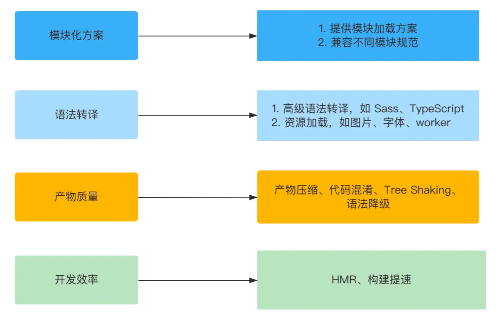
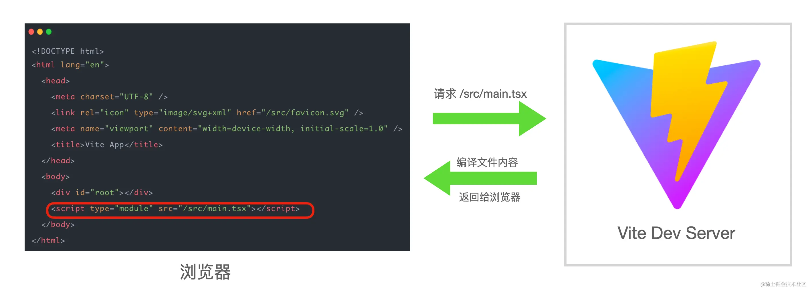
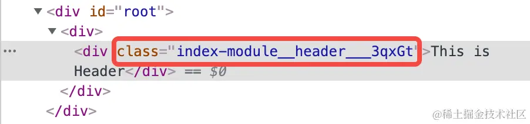

# 深入浅出Vite

## 1. 开篇：让Vite助力你的前端工程化之路

**无论工具层面如何更新，它们解决的核心问题，即前端工程的痛点是不变的**

- 模块化需求
  - 保证不同标准（ESM、CommonJS、AMD、CMD）的模块能正常加载
  - 兼容不同的模块规范，以适应不同的执行环境
- 兼容浏览器，编译高级语法
- 线上代码的质量问题
  - 安全性、兼容性、性能
  - 开发效率（冷/热启动耗时、热更新耗时）

**解决方案：**



- 模块化方面，提供模块加载方案，并兼容不同的模块规范。
- 语法转译方面，配合 `Sass`、`TSC`、`Babel` 等前端工具链，完成高级语法的转译功能，同时对于静态资源也能进行处理，使之能作为一个模块正常加载。
- 产物质量方面，在生产环境中，配合 `Terser`等压缩工具进行代码压缩和混淆，通过 `Tree Shaking` 删除未使用的代码，提供对于低版本浏览器的语法降级处理等等。
- 开发效率方面，构建工具本身通过各种方式来进行性能优化，包括`使用原生语言 Go/Rust`、`no-bundle`等等思路，提高项目的启动性能和热更新的速度

**Vite的核心源码**


## 2. 模块标准：为什么ESM是前端模块化的未来？

**前端模块化的发展：**


**CommonJS规范：**

Node.js 内部会有相应的 loader 转译模块代码，最后模块代码会被处理成下面这样：

```javascript
(function (exports, require, module, __filename, __dirname) {
  // 执行模块代码
  // 返回 exports 对象
});
```

存在的问题：

1. 依赖Node.js本身的功能实现，比如文件系统，无法直接在浏览器中执行
2. 以同步的方式进行模块加载，放在浏览器中会带来明显的性能问题

**AMD & CMD**

**ES6 Module**

在 Node.js 环境中，你可以在`package.json`中声明`type: "module"`属性，然后Node.js便会默认以ESM规范去解析模块

## 3. 快速上手：如何用Vite从零搭建前端项目？

推荐包管理工具：pnpm

```bash
pnpm create vite
```

vite默认会把项目根目录下的`index.html`作为入口文件



Vite 所倡导的`no-bundle`理念的真正含义: **利用浏览器原生 ES 模块的支持，实现开发阶段的 Dev Server，进行模块的按需加载**，而不是**先整体打包再进行加载**。相比 Webpack 这种必须打包再加载的传统构建模式，Vite 在开发阶段省略了繁琐且耗时的打包过程，这也是它为什么快的一个重要原因

虽然 Vite 提供了开箱即用的 TypeScript 以及 JSX 的编译能力，但实际上底层并没有实现 TypeScript 的类型校验系统，因此需要借助 `tsc` 来完成类型校验，所以在构建生产环境的包时，一般使用如下命令：

```json
"script": {
  // ...
  "build": "tsc && vite build",
  // ...
}
```

同时因为此处只是进行类型检查，所以在`tsconfig.json`中对应的配置如下：

```json
{
  "compilerOptions": {
    // 省略其他配置
    // 1. noEmit 表示只做类型检查，而不会输出产物文件
    // 2. 这行配置与 tsc --noEmit 命令等效
    "noEmit": true,
  },
}
```

## 4. 样式方案：在Vite中接入现代的CSS工程化方案

社区方案：

1. CSS 预处理器：Sass/Scss、Less、Stylus
2. CSS Modules
3. PostCSS
4. CSS in JS：主流包括emotion、styled-components等，这类方案可以实现直接在JS中写样式代码，基本包含CSS预处理器和CSS Modules的各项优点
5. CSS原子化框架，如Tailwind CSS、Windi CSS、UnoCSS

### CSS预处理器

以Sass/Scss为例，主要注意关于自动引入变量

```typescript
// vite.config.ts
import { normalizePath } from 'vite';
// 如果类型报错，需要安装 @types/node: pnpm i @types/node -D
import path from 'path';

// 全局 scss 文件的路径
// 用 normalizePath 解决 window 下的路径问题
const variablePath = normalizePath(path.resolve('./src/variable.scss'));


export default defineConfig({
  // css 相关的配置
  css: {
    preprocessorOptions: {
      scss: {
        // additionalData 的内容会在每个 scss 文件的开头自动注入
        additionalData: `@import "${variablePath}";`
      }
    }
  }
})
```

### CSS Modules

Vite 会对后缀带有`.module`的样式文件自动应用 CSS Modules

```typescript
// vite.config.ts
export default {
  css: {
    modules: {
      // 一般我们可以通过 generateScopedName 属性来对生成的类名进行自定义
      // 其中，name 表示当前文件名，local 表示类名
      generateScopedName: "[name]__[local]___[hash:base64:5]"
    },
    preprocessorOptions: {
      // 省略预处理器配置
    }
  }
}
```



### PostCSS

```typescript
// vite.config.ts 增加如下的配置
import autoprefixer from 'autoprefixer';

export default {
  css: {
    // 进行 PostCSS 配置
    postcss: {
      plugins: [
        autoprefixer({
          // 指定目标浏览器
          overrideBrowserslist: ['Chrome > 40', 'ff > 31', 'ie 11']
        })
      ]
    }
  }
}

```

### CSS in JS

### CSS 原子化框架

以Tailwind CSS为例

```typescript
// tailwind.config.js
module.exports = {
  content: [
    "./index.html",
    "./src/**/*.{vue,js,ts,jsx,tsx}",
  ],
  theme: {
    extend: {},
  },
  plugins: [],
}

// postcss.config.js
// 从中你可以看到，Tailwind CSS 的编译能力是通过 PostCSS 插件实现的
// 而 Vite 本身内置了 PostCSS，因此可以通过 PostCSS 配置接入 Tailwind CSS 
// 注意: Vite 配置文件中如果有 PostCSS 配置的情况下会覆盖掉 post.config.js 的内容!
module.exports = {
  plugins: {
    tailwindcss: {},
    autoprefixer: {},
  },
}

```

然后在项目入口CSS中引入必要的样板代码

```css
@tailwind base;
@tailwind components;
@tailwind utilities;
```

现在就可以在项目中使用Tailwind的样式了

## 5. 代码规范：如何利用Lint工具链来保证代码风格和质量？

