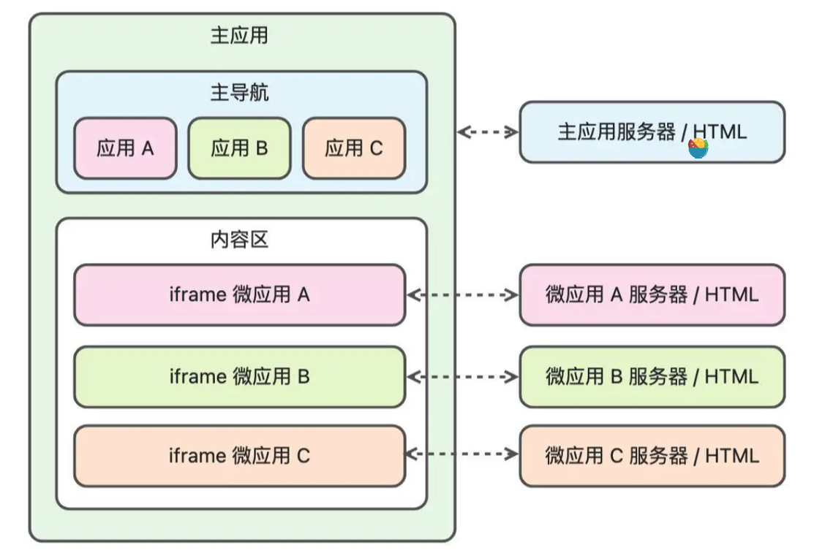

# 深入浅出微前端

## 1. 阅读指南

## 2. 感性了解：微前端到底解决了哪些业务问题？

**微前端可以降低大型复杂应用的开发、升级、维护以及团队协作的成本。当然，解决历史遗留的难以开发、升级和维护的大型应用，也是使用微前端的一个重要原因。**

以下场景可能并不需要微前端：

- 应用的业务单一，不存在多个团队并行开发的情况，不需要兼容不同的技术栈；
- 应用的功能已经非常完善，不存在大量新需求开发的可能性；
- 项目组不想花费大量的时间在应用的改造上，以现有应用的稳定性为主；
- 应用进行微前端改造的成本还不如直接改造当前存量应用带来的收益大；
- 团队内开发人员不熟悉微前端，无法应对微前端架构的复杂性。

## 3. 感性了解：实施微前端的方案有哪些？

- 基于 NPM 包的微前端：将微应用打包成独立的 NPM 包，然后在主应用中安装和使用；
- 基于代码分割的微前端：在主应用中使用懒加载技术，在运行时动态加载不同的微应用；
- 基于 Web Components 的微前端：将微应用封装成自定义组件，在主应用中注册使用；
- 基于 Module Federation 的微前端：借助 Webpack 5 的 Module Federation 实现微前端；
- 基于动态 Script 的微前端：在主应用中动态切换微应用的 Script 脚本来实现微前端；
- 基于 iframe 的微前端：在主应用中使用 iframe 标签来加载不同的微应用；
- 基于框架（JavaScript SDK）的微前端：使用 single-spa、qiankun、wujie 等通用框架；

## 4. 方案了解：iframe方案

### 浏览器多进程构架

- Browser进程：又被称为代理进程，会派生进程并监督它们的活动情况，并对它们进行沙箱隔离，具备沙箱策略引擎服务
  - 处理网络请求
  - 响应用户的输入输出UI事件
  - 地址栏URL管理
  - 书签管理
  - 浏览器的回退与前进按钮的功能
  - 文件访问
  - Cookie数据存储等
  - 通过内部的I/O线程与其他进程通信，通信方式为[IPC]([Inter-process Communication (IPC) (chromium.org)](https://www.chromium.org/developers/design-documents/inter-process-communication/)) & [Mojo]([Mojo docs (go/mojo-docs) - Mojo (googlesource.com)](https://chromium.googlesource.com/chromium/src/+/HEAD/mojo/README.md))
- Render进程：
  - 标签页和iframe所在Web应用的UI渲染和Javascript执行

*新开的标签页和 Renderer 进程并不一定是 1: 1 的关系，例如，多个新开的空白标签页为了节省资源，有可能被合并成一个 Renderer 进程*

> 事实上 Chrome 浏览器包括 Browser 进程、网络进程、数据存储进程、插件进程、Renderer 进程和 GPU 进程等。除此之外，Chrome 浏览器会根据当前设备的性能和存储空间来动态设置部分进程是否启用，例如低配 Andriod 手机的设备资源相对紧张时，部分进程（存储进程、网络进程、设备进程等）会被合并到 Browser 主进程，完整的多进程架构如下所示
>
> 

### 浏览器沙箱隔离

> 从 Chrome 浏览器开发商的角度出发，需要将非浏览器自身开发的 Web 应用设定为三方不可信应用，防止 Web 页面可以通过 Chrome 浏览器进入用户的操作系统执行危险操作

**Render进程中的一些系统操作需要通过IPC通知Browser进程进行代理操作，比如网络请求、文件访问等**

同时Chrome会尽可能复用操作系统的沙箱技术，比如在Windows中，存在一个Broker进程和多个Target进程，Broker进程主要用于派生Target进程、管理Target进程的沙箱策略、代理Target进程执行策略允许的操作，而所有的Target进程会在运行时受沙箱策略的控制：

### 浏览器站点隔离

在 Chrome 浏览器中沙箱隔离以 Renderer 进程为单位，而在旧版的浏览器中会存在多个 Web 应用共享同一个 Renderer 进程的情况，此时浏览器会依靠[同源策略](https://link.juejin.cn/?target=https%3A%2F%2Fdeveloper.mozilla.org%2Fzh-CN%2Fdocs%2FWeb%2FSecurity%2FSame-origin_policy)来限制两个不同源的文档进行交互，帮助隔离恶意文档来减少安全风险

Chrome 浏览器未启动站点隔离之前，标签页应用和内部的 iframe 应用会处于同一个 Renderer 进程，Web 应用有可能发现安全漏洞并绕过同源策略的限制，访问同一个进程中的其他 Web 应用，因此可能产生如下安全风险：

- 获取跨站点 Web 应用的 Cookie 和 HTML 5 存储数据；
- 获取跨站点 Web 应用的 HTML、XML 和 JSON 数据；
- 获取浏览器保存的密码数据；
- 共享跨站点 Web 应用的授权权限，例如地理位置；
- 绕过 [X-Frame-Options](https://link.juejin.cn/?target=https%3A%2F%2Fdeveloper.mozilla.org%2Fzh-CN%2Fdocs%2FWeb%2FHTTP%2FHeaders%2FX-Frame-Options) 加载 iframe 应用（例如百度的页面被 iframe 嵌套）；
- 获取跨站点 Web 应用的 DOM 元素。

在 Chrome 67 版本之后，为了防御多个**跨站的 Web 应用**处于同一个 Renderer 进程而可能产生的安全风险，浏览器会给来自不同站点的 Web 应用分配不同的 Renderer 进程

***Chrome 为标签页分配 Renderer 进程的策略和 iframe 中的站点隔离策略是有差异的**，例如用户自己新开标签页时，不管是否已经存在同站的应用都会创建新的 Renderer 进程。用户通过`window.open` 跳转新标签页时，浏览器会判断当前应用和跳转后的应用是否属于同一个站点，如果属于同一个站点则会复用当前应用所在的 Renderer 进程*

**跨站和跨域是有区别的**：

- 同源：协议（protocol）、主机名（host）和端口（port）相同，则为同源
- 同站：**有效顶级域名（Effective Top-Level-Domain，eTLD）和二级域名相同，则为同站**

**浏览器上下文**

每一个 iframe 都有自己的[浏览上下文](https://link.juejin.cn/?target=https%3A%2F%2Fwww.w3.org%2Fhtml%2Fwg%2Fspec%2Fbrowsers.html%23browsing-context)，不同的浏览上下文包含了各自的 Document 对象以及 History 对象，通常情况下 Document 对象和 Window 对象存在 1:1 的映射关系

### iframe 设计方案

在首次加载 iframe 应用时，都会因为服务端请求而导致内容区带来**短暂的白屏效果**

当然在使用 iframe 应用时，会产生如下一些问题：

- 主应用刷新时， iframe 无法保持 URL 状态（会重新加载 `src` 对应的初始 URL）；
- 主应用和 iframe 处于不同的浏览上下文，无法使 iframe 中的模态框相对于主应用居中；
- 主应用和 iframe 微应用的数据状态同步问题：持久化数据和通信。

## 5. 方案了解：NPM方案

将微应用打包成独立的NPM包，然后在主应用中引入和使用

### 模块化

关于ES Module和importmap

### 构建工具

为了使应用层面不用关心业务组件设计的开发态环境，建议将业务组件的源代码构建成 ES5 标准

### NPM 设计方案

