# 深入理解TCP协议

## 一、环境准备

### 安装CentOS 7

官网下载镜像，选择CentOS 7 Minimal版本，通过VirtualBox进行安装，安装时记得**开启网络**，安装之后可以在虚拟机中`ping www.baidu.com`，此时是通过NAT通过宿主机访问外网，可以通过命令`ip route`查看：

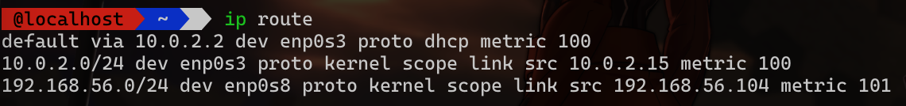

**配置在宿主机上通过ssh访问虚拟机**

默认情况下宿主机是无法访问虚拟机的，需要通过VirtualBox进行配置，先关闭当前虚拟机，打开控制面板：

1. 添加虚拟网卡，切换VirtualBox的Tools到Network面板，创建一个虚拟网卡，配置值可以使用默认提供的值，如图所示：

   

   


2. 配置虚拟机的网络设置，具体如下，给虚拟机添加一个网络适配器，如下图

   

3. 重启虚拟机，使用`ip addr`命令发现多一个ip地址，即上面添加的Host-only Adapter的ip，宿主机则可以使用该ip地址远程登录

   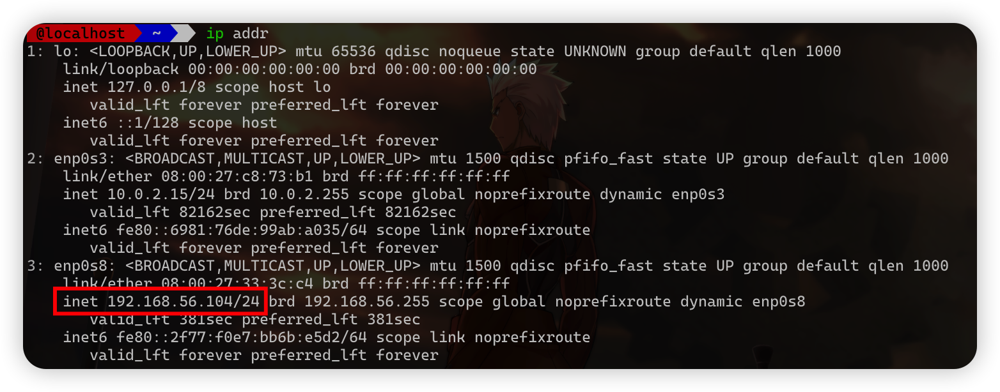

## 配置CentOS开发环境

**这里使用zsh作为默认shell**，安装zsh及相关的插件以前提及过，就不在这里介绍了，下面是配置开发环境

```bash
# 基础软件包配置
yum groupinstall "Development Tools" "Development Libraries"
# 安装devtool-8
sudo yum install centos-release-scl
sudo yum install devtoolset-8
scl enable devtoolset-8 zsh
# 安装python环境
yum install epel-release
yum install -y python3
# 安装后面用到的依赖工具
yum install -y tcpdump bison flex

# 停止 firewall服务
systemctl stop firewalld.service
# 禁止开机启动
systemctl disable firewalld.service
# 安装iptables
yum install -y iptables
```

## 二、相关系统调用及tcpdump简介

## 三、TCP首部字段

- **初始序列号（ISN）**是如何生成是通过**源地址、目标地址、源端口、目标端口、随机因子进行MD5计算，再加入时间因子进行处理**

- **序列号回绕**处理：

```c
static inline bool before(__u32 seq1, __u32 seq2)
{
  return (__s32)(seq1 - seq2) < 0;
}
```


- 确认号（ACK）有几个注意点：

  - 不是所有的包都需要确认的——ACK是告知对方下一个期望接收的序列号，小于此确认号的所有字节都已收到
  - 不是收到了数据包立马需要确认的，可以延迟一会再确认
  - ACK包本身不需要被确认，否则就会无穷无尽死循环了
  - 确认号永远是表示小于此确认号的字段都已经收到

- 常见TCP Flags（头部长度4bit，保留位3bit，标记位9bit，其中常用的5个标记位如下）：

  - SYN(Synchronize)：用于发起连接数据包同步双方的初始序列号
  - ACK(Acknowledge)：确认数据包
  - RST(Reset)：用来强制断开连接，通常是之前建立的连接已经不存在了、包不合法、或者实在无能为力处理
  - FIN(Finish)：通知对方我发完了所有数据，准备断开连接，后面我不会再发数据包给你了
  - PSH(Push)：告知对方这些数据包收到以后应该马上交给上层应用，不能缓存起来

- 窗口大小

  头部信息中的窗口大小，只有16bit，即65535字节（64KB），不够用，所以TCP协议引入了**TCP窗口缩放选项**，取值范围为0~14，该值可以将窗口扩大到原来的2的n次方（**通过左移的方式实现的**），窗口缩放值在三次握手的时候指定，如果抓包的时候没有抓到 三次握手阶段的包，wireshark 是不知道真正的窗口缩放值是多少的。

## 三、MTU与MSS

**数据链路层传输的帧大小**是有限制的，不能把一个太大的包直接塞给链路层，这个限制被称为**最大传输单元（Maximum Transmission Unit, MTU）**

下图是以太网的帧格式，以太网的帧最小的帧是 64 字节，除去 14 字节头部和 4 字节 CRC 字段，有效荷载最小为 46 字节。最大的帧是 1518 字节，除去 14 字节头部和 4 字节 CRC，有效荷载最大为 1500，这个值就是以太网的 MTU。

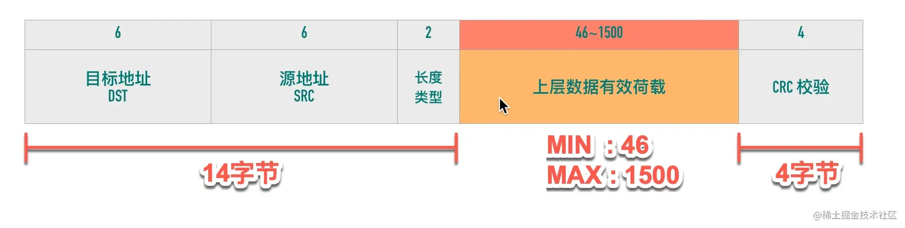

通过`netstat -i`可以查看MTU（CentOS7的minimal版本不包括，需要通过`yum install net-tools`来安装）

**TCP** 为了避免被发送方分片，会主动把数据分割成小段再交给网络层，**最大的分段大小称之为 MSS（Max Segment Size）**。

```ini
MSS = MTU - IP header头大小 - TCP 头大小
```

这样一个 MSS 的数据恰好能装进一个 MTU 而不用分片。

在以太网中 TCP 的 MSS = 1500（MTU） - 20（IP 头大小） - 20（TCP 头大小）= 1460


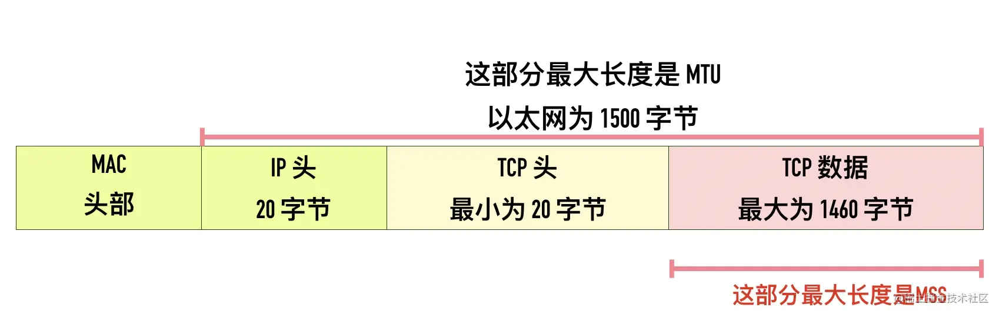


## 四、端口号

端口号被划分成以下 3 种类型：

- 熟知端口号（well-known port）：范围为 0~1023
- 已登记的端口（registered port）：范围为 1024～49151（为什么是 49151 这样一个魔数？ 其实是取的端口号最大值 65536 的 3/4 减 1，即49151 = 65536 * 0.75 - 1）
- 临时端口号（ephemeral port）：IANA 将 49152～65535 范围的端口称为临时端口（ephemeral port）或动态端口（dynamic port），也称为私有端口（private port），这些端口可供本地应用程序临时分配端口使用。

**熟知端口号和已登记的端口都可以在 [iana 的官网](https://link.juejin.cn/?target=https%3A%2F%2Fwww.iana.org%2Fassignments%2Fservice-names-port-numbers%2Fservice-names-port-numbers.xhtml) 查到**

不同的操作系统实现会选择不同的范围分配临时端口，在 Linux 上能分配的端口范围由 /proc/sys/net/ipv4/ip_local_port_range 变量决定，一般 Linux 内核端口范围为 32768~60999

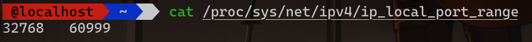

## 五、三次握手

SYN 报文不携带数据，但是它占用一个序号，下次发送数据序列号要加一。不占用序列号的段是不需要确认的（都没有内容确认个啥），比如 ACK 段。SYN 段需要对方的确认，需要占用一个序列号。

**凡是消耗序列号的 TCP 报文段，一定需要对端确认。如果这个段没有收到确认，会一直重传直到达到指定的次数为止。**

除了交换彼此的初始序列号，三次握手的另一个重要作用是交换一些辅助信息，比如最大段大小（MSS）、窗口大小（Win）、窗口缩放因子（WS)、是否支持选择确认（SACK_PERM）等

三次握手交换 ISN 的细节：

- SYN 段长度为 0 却需要消耗一个序列号，原因是 SYN 段需要对端确认
- ACK 段长度为 0，不消耗序列号，也不用对端确认
- ISN 不能从一个固定的值开始，原因是处于安全性和避免前后连接互相干扰

## 六、四次挥手

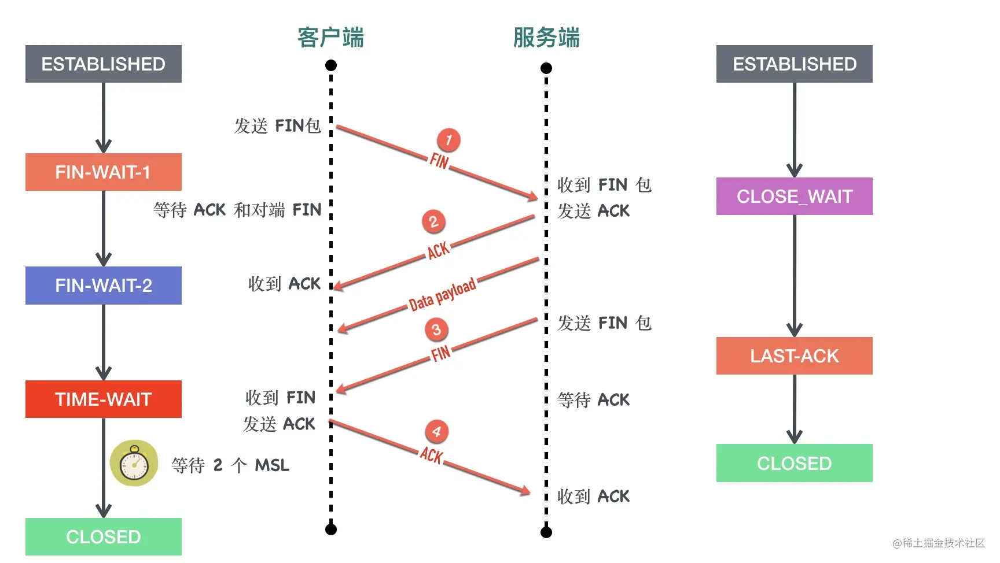


## 七、TCP 头部时间戳选项（TCP Timestamps Option，TSopt）

TCP Timestamps Option 由四部分构成：类别（kind）、长度（Length）、发送方时间戳（TS value）、回显时间戳（TS Echo Reply）。时间戳选项类别（kind）的值等于 8，用来与其它类型的选项区分。长度（length）等于 10。两个时间戳相关的选项都是 4 字节。


- 发送方发送数据时，将一个发送时间戳 1734581141 放在发送方时间戳`TSval`中
- 接收方收到数据包以后，将收到的时间戳 1734581141 原封不动的返回给发送方，放在`TSecr`字段中，同时把自己的时间戳 3303928779 放在`TSval`中
- 后面的包以此类推


**Timestamps 选项的提出初衷是为了解决两个问题：**

1、两端往返时延测量（RTTM）

2、序列号回绕（PAWS）

RTTM比较好理解，根据TSval与TSecr就可以精确计算得出，而对于PAWS的问题，可以见下图：

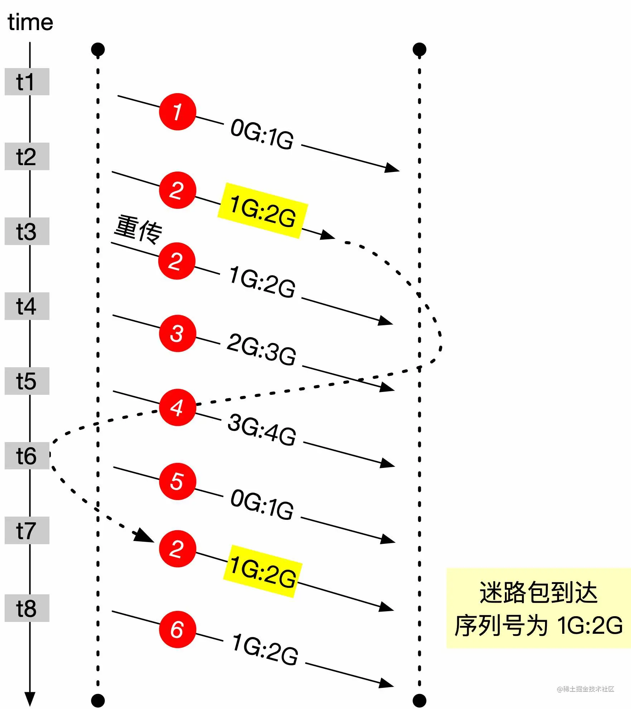


第 2 个包因为某些原因延迟导致重传，但没有丢失到时间 t7 才到达。这个迷途数据包与后面要发送的第 6 个包序列号完全相同，如果没有一些措施进行区分，将会造成数据的紊乱。

如果有 Timestamps 的存在，内核会维护一个为每个连接维护一个 ts_recent 值，记录最后一次通信的的 timestamps 值，在 t7 时间点收到迷途数据包 2 时，由于数据包 2 的 timestamps 值小于 ts_recent 值，就会丢弃掉这个数据包。等 t8 时间点真正的数据包 6 到达以后，由于数据包 6 的 timestamps 值大于 ts_recent，这个包可以被正常接收。

**三次握手中的第二步，如果服务端回复 SYN+ACK 包中的 TSecr 不等于握手第一步客户端发送 SYN 包中的 TSval，客户端在对 SYN+ACK 回复 RST。**

## 八、TCP的11种状态

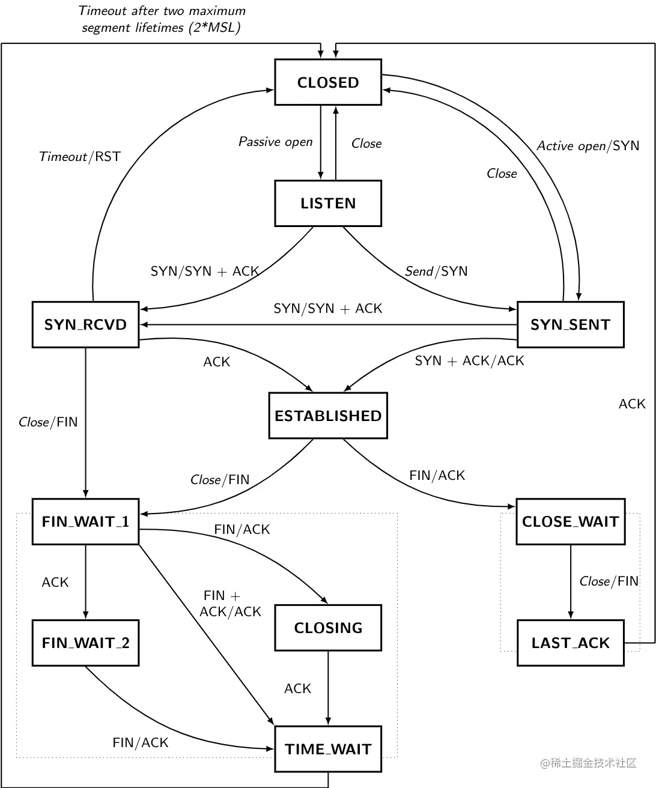


## 九、半连接与全连接

> 当客户端发起 SYN 到服务端，服务端收到以后会回 ACK 和自己的 SYN。这时服务端这边的 TCP 从 listen 状态变为 SYN_RCVD (SYN Received)，此时会将这个连接信息放入「半连接队列」，半连接队列也被称为 SYN Queue，存储的是 "inbound SYN packets"。

> 「全连接队列」包含了服务端所有完成了三次握手，但是还未被应用调用 accept 取走的连接队列。此时的 socket 处于 ESTABLISHED 状态。每次应用调用 accept() 函数会移除队列头的连接。如果队列为空，accept() 通常会阻塞。全连接队列也被称为 Accept 队列。

**接收端的全连接队列如果满了，在下次建立握手时，会丢弃最后一次握手的ACK包**

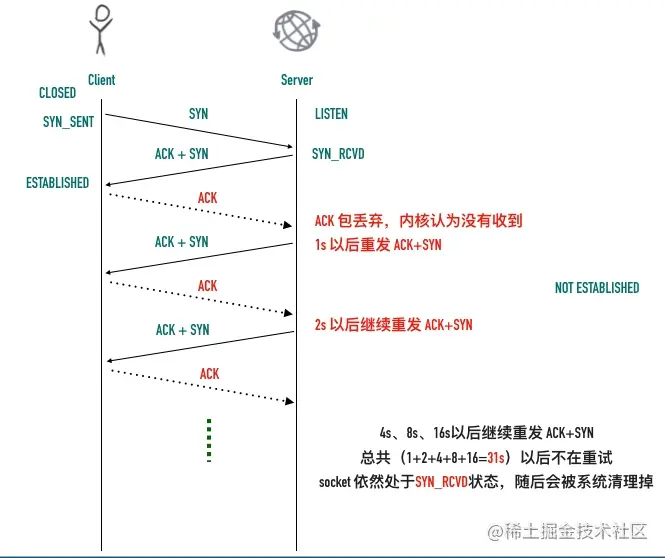


全连接队列满以后，服务端会忽略客户端的 ACK，随后会重传`SYN+ACK`，也可以修改这种行为，这个值由`/proc/sys/net/ipv4/tcp_abort_on_overflow`决定。

- tcp_abort_on_overflow 为 0 表示三次握手最后一步全连接队列满以后 server 会丢掉 client 发过来的 ACK，服务端随后会进行重传 SYN+ACK。
- tcp_abort_on_overflow 为 1 表示全连接队列满以后服务端直接发送 RST 给客户端。

但是回给客户端 RST 包会带来另外一个问题，客户端不知道服务端响应的 RST 包到底是因为「该端口没有进程监听」，还是「该端口有进程监听，只是它的队列满了」。

**ss命令的使用**

ss 是一个非常有用的命令，它的选项解释如下

```bash
# 显示 TCP 的 socket
-t, --tcp
# 只显示 listening 状态的 socket，默认情况下是不显示的。
-l, --listening
# 显示端口号而不是映射的服务名
-n, --numeric
# 显示进程名
-p, --processes
# 显示 socket 的详细信息
-e, --extended
```

**ss 命令可以查看全连接队列的大小和当前等待 accept 的连接个数**

- 处于 LISTEN 状态的 socket，Recv-Q 对应 sk_ack_backlog，表示当前 socket 的完成三次握手等待用户进程 accept 的连接个数，Send-Q 对应 sk_max_ack_backlog，表示当前 socket 全连接队列能最大容纳的连接数
- 对于非 LISTEN 状态的 socket，Recv-Q 表示 receive queue 的字节大小，Send-Q 表示 send queue 的字节大小


## 十、TCP Fast Open

TFO 是在原来 TCP 协议上的扩展协议，它的主要原理就在发送第一个 SYN 包的时候就开始传数据了，不过它要求当前客户端之前已经完成过「正常」的三次握手。

快速打开分两个阶段：**请求 Fast Open Cookie** 和 **真正开始 TCP Fast Open**

TFO的首次过程如下：

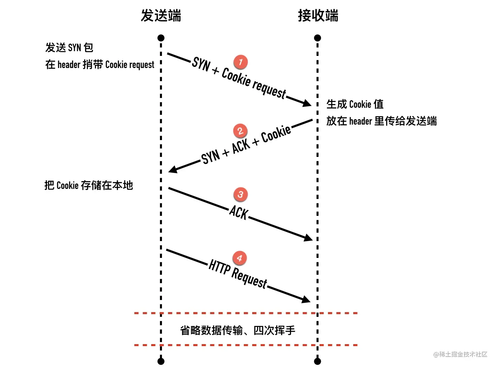

首次存储cookie之后，缓存在本地，下次握手时即可在第一个SYN包中携带数据

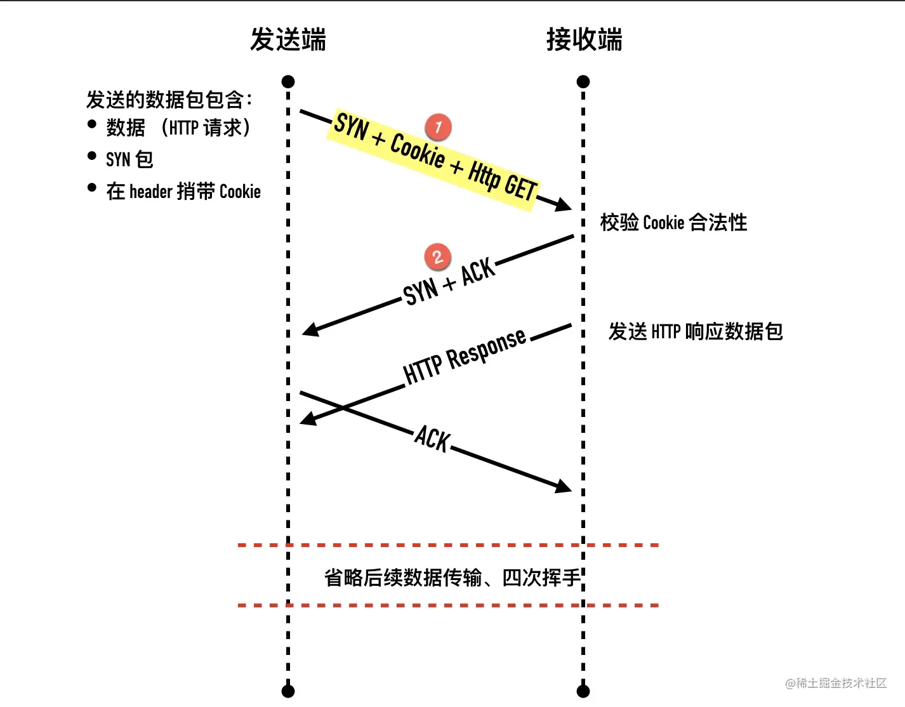


升级curl至最新：

- 增加city-fan源

  ```bash
  rpm -Uvh http://www.city-fan.org/ftp/contrib/yum-repo/rhel6/x86_64/city-fan.org-release-2-1.rhel6.noarch.rpm
  ```

- 修改city-fan.org.repo，把`enable=0`改为`enable=1`

  ```bash
  vim /etc/yum.repos.d/city-fan.org.repo
  ```

- 升级curl

  ```bash
  yum update curl
  ```

- 查看新版本

  ```bash
  curl -V
  ```

实验TFO:

```bash
# 两台机器以c1、c2来标注
# 1. c1\c2上均开启tfo
echo 3 > /proc/sys/net/ipv4/tcp_fastopen
# 2. c1上安装nginx，修改配置文件，开启对fastopen的支持：listen 80 fastopen=256;
# 3. 抓包
tcpdump -i any port 80 -nn -w capture.pkt
# 4. c2向c1发请求
curl --tcp-fastopen http://10.0.2.15
```

最后使用wireshark查看抓包结果

## 十一、Address already in use与SO_REUSEADDR

服务端主动断开连接以后，需要等 2 个 MSL 以后才最终释放这个连接，重启以后要绑定同一个端口，默认情况下，操作系统的实现都会阻止新的监听套接字绑定到这个端口上。

TCP 要求这样的四元组必须是唯一的，但大多数操作系统的实现要求更加严格，只要还有连接在使用这个本地端口，则本地端口不能被重用（bind 调用失败）

启用 SO_REUSEADDR 套接字选项可以解除这个限制，默认情况下这个值都为 0，表示关闭。

**不一定是要处于 TIME_WAIT 才允许端口复用的**，只是大都是情况下，主动关闭连接的服务端都会处于 TIME_WAIT。如果不把 SO_REUSEADDR 设置为 1，服务器将等待 2 个 MSL 才可以重新绑定原端口

## 十二、SO_REUSEPORT与惊群效应

默认情况下，一个 IP、端口组合只能被一个套接字绑定，Linux 内核从 3.9 版本开始引入一个新的 socket 选项 **SO_REUSEPORT**，又称为 port sharding，允许多个套接字监听同一个IP 和端口组合。

为了充分发挥多核 CPU 的性能，多进程的处理网络请求主要有下面两种方式

- 主进程 + 多个 worker 子进程监听相同的端口

  Nginx 默认就采用这种方式。主进程执行 bind()、listen() 初始化套接字，然后 fork 新的子进程。在这些子进程中，通过 accept/epoll_wait 同一个套接字来进行请求处理

- 多进程 + REUSEPORT

**惊群效应**指的是：多进程/多线程同时监听同一个套接字，当有网络事件发生时，所有等待的进程/线程同时被唤醒，但是只有其中一个进程/线程可以处理该网络事件，其它的进程/线程获取失败重新进入休眠。

惊群问题带来的是 CPU 资源的浪费和锁竞争的开销。根据使用方式的不同，Linux 上的网络惊群问题分为 **accept 惊群**和 **epoll 惊群**两种。

Linux 在 2.6 内核版本之前监听同一个 socket 的多个进程在事件发生时会唤醒所有等待的进程，在 2.6 版本中引入了 WQ_FLAG_EXCLUSIVE 选项**解决了 accept 调用的惊群问题**。

**为了表示打开文件，linux 内核维护了三种数据结构**，分别是：

- 内核为每个进程维护了一个其打开文件的「描述符表」（file descriptor table），我们熟知的 fd 为 0 的 stdin 就是属于文件描述符表。
- 内核为所有打开文件维护了一个系统级的「打开文件表」（open file table），这个打开文件表存储了当前文件的偏移量，状态信息和对 inode 的指针等信息，父子进程的 fd 可以指向同一个打开文件表项。
- 最后一个是文件系统的 inode 表（i-node table）

**epoll 的惊群还是存在**，有不少的措施可以解决 epoll 的惊群。Nginx 为了处理惊群问题，在应用层增加了 accept_mutex 锁

**SO_REUSEPORT 带来了两个明显的好处：**

- 实现了内核级的负载均衡
- 支持滚动升级（Rolling updates）

## 十三、优雅关闭连接 —— Socket 选项之 SO_LINGER

Linux 的套接字选项SO_LINGER 用来改变socket 执行 close() 函数时的默认行为。SO_LINGER 启用时，操作系统开启一个定时器，在定时器期间内发送数据，定时时间到直接 RST 连接。

SO_LINGER 参数是一个 linger 结构体：

```c
struct linger {
    int l_onoff;    /* linger active */
    int l_linger;   /* how many seconds to linger for */
};
```

l_onoff 用来表示是否启用 linger 特性，非 0 为启用，0 为禁用 ，Linux 内核默认为禁用。这种情况下 close 函数立即返回，操作系统负责把缓冲队列中的数据全部发送至对端

 l_linger 在 l_onoff 为非 0 （即启用特性）时才会生效。

- 如果 l_linger 的值为 0，那么调用 close，close 函数会立即返回，同时丢弃缓冲区内所有数据并立即发送 RST 包重置连接
- 如果 l_linger 的值为非 0，那么此时 close 函数在阻塞直到 l_linger 时间超时或者数据发送完毕，发送队列在超时时间段内继续尝试发送，如果发送完成则皆大欢喜，超时则直接丢弃缓冲区内容 并 RST 掉连接。

## 十四、关于TIME_WAIT

首先，我们需要明确，**只有主动断开的那一方才会进入 TIME_WAIT 状态**，且会在那个状态持续 2 个 MSL（Max Segment Lifetime）。

MSL（报文最大生存时间）是 TCP 报文在网络中的最大生存时间。这个值与 IP 报文头的 TTL 字段有密切的关系。

**TIME_WAIT 存在的原因是什么**

1. 数据报文可能在发送途中延迟但最终会到达，因此要等老的“迷路”的重复报文段在网络中过期失效，这样可以避免用**相同**源端口和目标端口创建新连接时收到旧连接姗姗来迟的数据包，造成数据错乱。

   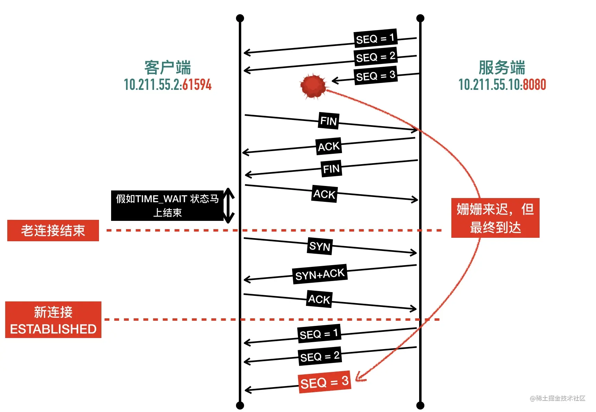

   TIME_WAIT 等待时间是 2 个 MSL，已经足够让一个方向上的包最多存活 MSL 秒就被丢弃，保证了在创建新的 TCP 连接以后，老连接姗姗来迟的包已经在网络中被丢弃消逝，不会干扰新的连接。

2. 确保可靠实现 TCP 全双工终止连接。关闭连接的四次挥手中，最终的 ACK 由主动关闭方发出，如果这个 ACK 丢失，对端（被动关闭方）将重发 FIN，如果主动关闭方不维持 TIME_WAIT 直接进入 CLOSED 状态，则无法重传 ACK，被动关闭方因此不能及时可靠释放。

   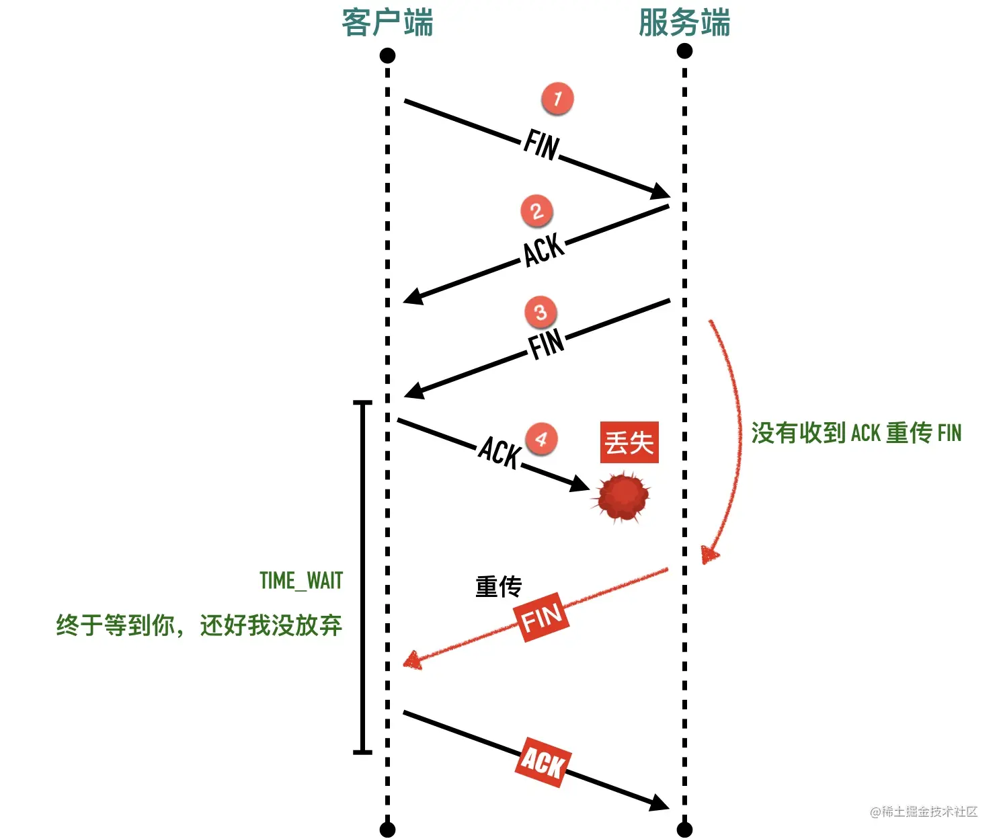

   如果四次挥手的第 4 步中客户端发送了给服务端的确认 ACK 报文以后不进入 TIME_WAIT 状态，直接进入 `CLOSED`状态，然后重用端口建立新连接会发生什么呢？如下图所示

   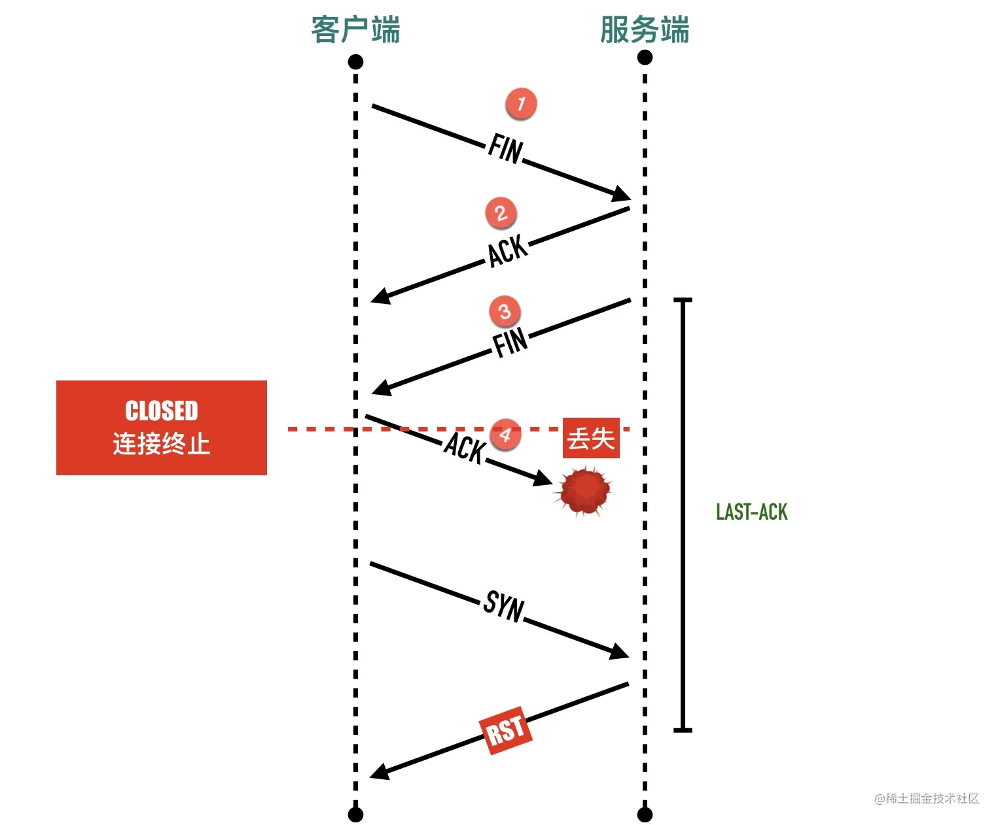
   主动关闭方如果马上进入 `CLOSED` 状态，被动关闭方这个时候还处于`LAST-ACK`状态，主动关闭方认为连接已经释放，端口可以重用了，如果使用相同的端口三次握手发送 SYN 包，会被处于 `LAST-ACK`状态状态的被动关闭方返回一个 `RST`，三次握手失败。

**综上，为什么时间是两个 MSL？**

- 1 个 MSL 确保四次挥手中主动关闭方最后的 ACK 报文最终能达到对端
- 1 个 MSL 确保对端没有收到 ACK 重传的 FIN 报文可以到达

2MSL = 去向 ACK 消息最大存活时间（MSL) + 来向 FIN 消息的最大存活时间（MSL）

**net.ipv4.tcp_tw_reuse**

缓解紧张的端口资源，一个可行的方法是重用“浪费”的处于 TIME_WAIT 状态的连接，当开启 net.ipv4.tcp_tw_reuse 选项时，处于 TIME_WAIT 状态的连接可以被重用。

**net.ipv4.tcp_tw_recyle**

tcp_tw_recyle 是一个比 tcp_tw_reuse 更激进的方案， 系统会缓存每台主机（即 IP）连接过来的最新的时间戳。对于新来的连接，如果发现 SYN 包中带的时间戳与之前记录的来自同一主机的同一连接的分组所携带的时间戳相比更旧，则直接丢弃。如果更新则接受复用 TIME-WAIT 连接。

这种机制在客户端与服务端一对一的情况下没有问题，如果经过了 NAT 或者负载均衡，问题就很严重了。

当 tcp_tw_recycle 遇上 NAT 时，因为客户端出口 IP 都一样，会导致服务端看起来都在跟同一个 host 打交道。不同客户端携带的 timestamp 只跟自己相关，如果一个时间戳较大的客户端 A 通过 NAT 与服务器建连，时间戳较小的客户端 B 通过 NAT 发送的包服务器认为是过期重复的数据，直接丢弃，导致 B 无法正常建连和发数据。

## 十五、RST

在 TCP 协议中 RST 表示复位，用来**异常的**关闭连接，发送 RST 关闭连接时，不必等缓冲区的数据都发送出去，直接丢弃缓冲区中的数据，连接释放进入`CLOSED`状态。而接收端收到 RST 段后，也不需要发送 ACK 确认。

**RST的几种情况**

1. 端口未监听
2. 一方突然断电重启，之前建立的连接信息丢失，另一方并不知道
3. 调用close函数，设置了SO_LINGER为true

**Broken pipe 与 Connection reset by peer**

Broken pipe 与 Connection reset by peer 错误在网络编程中非常常见，出现的前提都是连接已关闭。

Connection reset by peer 这个错误很好理解，前面介绍了很多 RST 出现的场景。

`Broken pipe`出现的时机是：在一个 RST 的套接字继续写数据，就会出现`Broken pipe`。

## 十六、包的重传

包的重传时间间隔是指数级退避，直到达到 120s 为止，总时间将近 15 分钟，重传次数是 15次 ，重传次数默认值由 `/proc/sys/net/ipv4/tcp_retries2` 决定（等于 15），会根据 **RTO（Retransmission TimeOut，RTO——超时重传的时间）** 的不同来动态变化，过程如下图：

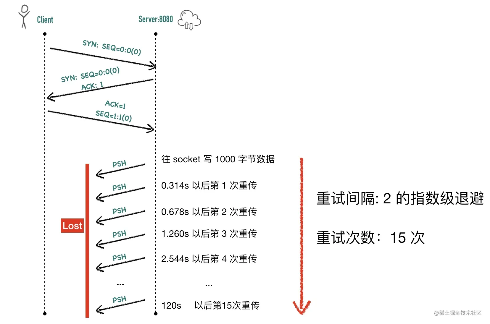

**快速重传** 快速重传的含义是：当发送端收到 3 个或以上重复 ACK，就意识到之前发的包可能丢了，于是马上进行重传，不用傻傻的等到超时再重传。

**SACK的作用**

假设发送5个包，每个包大小是1000字节，其中第2个包丢失了，在发送 3、4、5 包收到的全部是 ACK=1001，快速重传解决了一个问题：需要重传。因为除了 2 号包，3、4、5 包也有可能丢失，那到底是只重传数据包 2 还是重传 2、3、4、5 所有包呢？

聪明的网络协议设计者，想到了一个好办法

- 收到 3 号包的时候在 ACK 包中告诉发送端：喂，小老弟，我目前收到的最大连续的包序号是 **1000**（ACK=1001），[1:1001]、[2001:3001] 区间的包我也收到了
- 收到 4 号包的时候在 ACK 包中告诉发送端：喂，小老弟，我目前收到的最大连续的包序号是 **1000**（ACK=1001），[1:1001]、[2001:4001] 区间的包我也收到了
- 收到 5 号包的时候在 ACK 包中告诉发送端：喂，小老弟，我目前收到的最大连续的包序号是 **1000**（ACK=1001），[1:1001]、[2001:5001] 区间的包我也收到了

这样发送端就清楚知道只用重传 2 号数据包就可以了，数据包 3、4、5已经确认无误被对端收到。


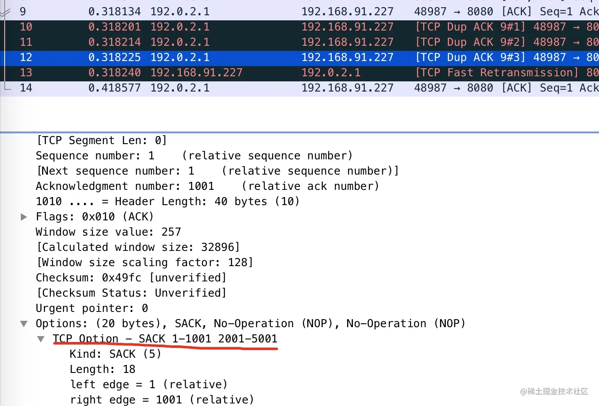


## 十七、滑动窗口

TCP会把要发送的数据写入发送缓冲区（Send Buffer），接收到的数据放入接收缓冲区（Receive Buffer），应用程序会不停的读取接收缓冲区的内容进行处理，而流量控制要做的事就是如果接收缓冲区已满，发送端应该停止发送数据，为了控制发送端的速率，接收端会在ACK包中带上自己接收窗口（rwnd）的大小，发送端据此调整自己的发送策略

发送窗口**不等于**接口窗口（wireshark抓包中显示的`win=29312`是用于声明自己接收窗口的大小）

**TCP包状态分类**

从TCP角度而言，数据包的状态分为以下四种

1. Bytes Send and Acknowledged：已发送且已收到ACK确认的数据包
2. Bytes Send but Not Yet Acknowledged：已发送但未收到ACK确认的数据包，这部分包在一段时间内没收到ACK则需要重新发送
3. Bytes Not Yet Send for Which Recipient Is Ready：未发送但接收端已经准备就绪可以接收的数据包（有空间可以接收）
4. Bytes Not Yet Send, Not Ready to Receive：未发送且接收端没有空间接收

**发送窗口与可用窗口**

发送窗口即上述分类中的2、3的总大小，可用窗口则是上述分类中的3的总大小，发送窗口的**左边界表示成功发送并已经被接收方确认的最大字节序号**，而右边界是**发送方当前可以发送的最大字节序号**

**零窗口探测包**

因接收端的处理能力慢，此时发送端的滑动窗口变为0了，过一段时间接收端从高负载中缓过来，可以处理数据包了，但如果发送端不知道这个情况，就会一直等待，于是就有了零窗口探测机制，用来向接收端探测是否可以发送数据，这个探测包是**一个长度为0的ACK包，Seq为当前连接Seq最大值减一**(这个特点正好与Keep-Alive包很像，所以被wireshark识别成Keep-Alive包了)

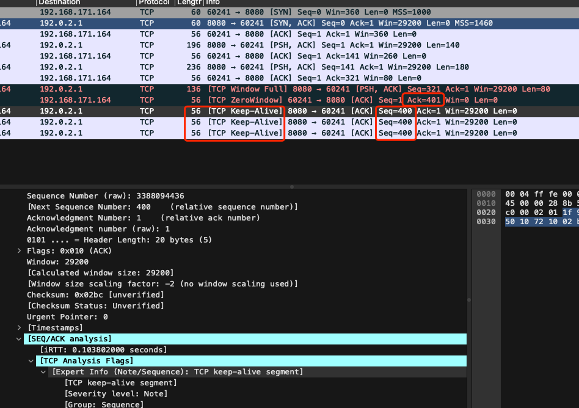

**总结**

- TCP Window Full是站在**发送端**的角度说的，表示在途字节数等于对方接收窗口的情况，此时发送端不能再发送数据给对方直至发送的数据包得到ACK
- TCP Zero Window是站在**接收端**的角度说的，是接收端接收窗口满了，告知对方不能再发送数据给自己

## 十八、拥塞控制

TCP利用滑动窗口来做流量控制，控制发送端向接收端过多的发送数据，而拥塞控制则是考虑了整个网络通信的状况，它主要涉及的算法有：

- 慢启动（Slow Start）
- 拥塞避免（Congestion Avoidance）
- 快速重传（Fast Retransmit）与快速恢复（Fast Recovery）

为了实现上面的算法，TCP的每条连接都有两个核心状态值：

- 拥塞窗口（Congestion Window，cwnd）
- 慢启动阈值（Slow Start Threshold, ssthresh）

**拥塞窗口**

拥塞窗口（cwnd）是**发送端**的限制，是指在未收到接收端ACK之前自己还能传输的数据量大小（多少个MSS），而接收窗口（rwnd）是**接收端**的限制，是指接收端还能接收的数据量大小

拥塞窗口的初始值等于系统的一个变量**initcwnd**，最新的linux系统initcwnd默认值等于**10**

真正的发送窗口大小 = **Min**(接收端接收窗口大小, 发送端自己拥塞窗口大小)

发送端与接收端不会交换cwnd这个值，该值是维护在发送端本地内存中的，发送端和接收端最大的在途字节数（未经确认的）数据包大小只能是rwnd和cwnd的最小值

**拥塞处理算法一：慢启动**

算法过程：

1. 三次握手之后，双方通过ACK告诉对方自己的rwnd大小，之后就可以相互发数据了
2. 通信双方各自初始化cwnd大小
3. cwnd初始值较小时，每收到一个ACK，cwnd+1，也就是每经过一个RTT，cwnd*2（比如初始cwnd为10，发送数据时，会发送10个MSS的数据量，每次1个MSS，总共会收到10个ACK，每收到一个cwnd+1，当收到10个后，cwnd即为原来的2倍）


**慢启动阈值**

慢启动cwnd不会无限增长下去，它的阈值就是**慢启动阈值（Slow Start Threshold）**

- 当cwnd<ssthresh时，拥塞窗口按指数级增长（慢启动阶段）
- 当cwnd>ssthresh时，拥塞窗口按线性增长（拥塞避免阶段）

**拥塞处理算法二：拥塞避免**

在这个阶段，每经过一个RTT，cwnd+1（即增加1个MSS大小），直到检测到拥塞为止

**拥塞处理算法三：快速重传**

当接收端收到一个不按序到达的数据时，TCP立刻发送1个重复ACK，当发送端收到3个或以上重复ACK，就知道之前的包可能丢了，马上进行重传，而不等到重传定时器超时，这里就涉及之前讲的SACK，

**拥塞处理算法四：快速恢复**

当收到三次重复ACK时，进入快速恢复阶段

- 拥塞阈值降低为cwnd的一半：ssthresh = cwnd / 2
- 拥塞窗口cwnd设置为ssthresh
- 拥塞窗口线性增加

## 十九、Nagle算法与延迟确认

**Nagle算法**：

当一个TCP连接中有在传的数据（已发出但还未确认的数据）时，小于MSS的报文段就不能被发送，直到所有在传数据都收到了ACK，同时，TCP还不会马上发送后续的数据，会收集小包合并一起发送，算法伪代码如下：

```vb
if there is new data to send
	if the window size >= MSS and available data is >= MSS
		send complete MSS segment now
	else
		if there is unconfirmed data still in the pipe
			enqueue data in the buffer until an acknowledge is received
		else
			send data immediately
		end if
	end if
end if
```

Nagle算法的作用是减少小包在客户端和服务端直接传输，一个包的TCP头和IP头加起来至少有40字节，如果携带的数据较小的话，就非常浪费了。

Nagle算法是时代的产物，可能会导致较多的性能问题，尤其是与延迟确认一起使用的时候，它在通信时延较低的场景下意义不大，很多组件为了高性能都默认禁用掉了这个我，比如现在的ssh客户端已经默认关闭了Nagle算法。

Nagle算法是应用在发送端，对发送端而言：

- 当第一次发送数据时不用等待，就算是1byte的小包也是立即发送的
- 后面发送数据时需要累积数据包直到满足下面条件之一才会继续发送：
  - 数据包达到最大段大小MSS
  - 接收端收到之前数据包的确认ACK

**延迟确认**

首先明确两个观点：

- 不是每个数据包都对应一个ACK包，因为可以合并确认
- 不是接收端收到数据以后必须立刻马上回复确认包，比如收到数据包以后暂时没有数据要发给对端，它可以等待一段时间（Linux上是40ms）再确认（如果这段时间刚好有数据要发给对端，则ACK可以随着数据一起发出，如果超时了还没有数据要送，也会发送ACK，以免对端以为丢包了）

上述方式就是**延迟确认**

延迟确认在很多Linux机器上是无法关闭的

**什么时候需要回复ACK**

- 如果接收到了大于一个frame的报文，且需要调整窗口大小
- 处于quickack模式（tcp_in_quickack_mode）
- 收到乱序包（we have out of order data）

## 二十、keep-alive

**TCP的half open**

在未告知另一端的情况下通信的一端关闭或终止连接，那么就认为该条TCP连接处于半打开状态。这种情况发生在通信一方的主机崩溃、电源断掉的情况下。只要不尝试通过半打开连接传输数据，正常工作的一端将不会检测出另外一端已崩溃

**TCP的keepalive**

考虑上述情况，TCP设计了keepalive机制，可以指定多长时间没有数据包交互则进行探测，探测多少次，每次探测间隔多少，如下配置：

```bash
# 30s没有数据包交互则发送keepalive探测包，CentOS 默认 7200s
echo 30 > /proc/system/net/ipv4/tcp_keepalive_time
# 每次探测TCP的包间隔, CentOS默认75s
echo 10 > /proc/system/net/ipv4/tcp_keepalive_intvl
# 探测多少次，CentOS默认9次
echo 5 > /proc/system/net/ipv4/tcp_keepalive_probes

```

## 廿一、ESTABLISHED状态的连接在收到SYN会回复什么

> Linux内核对于收到的乱序SYN报文，会回复一个携带了正确序列号和确认号的ACK报文

这个ACK被称之为Challenge ACK

出于CPU和带宽资源的节约，提出了ACK Throttling方案，限制了每秒钟发送Chanllenge ACK报文的数量，这个值由net.ipv4.tcp_challenge_ack_limit系统变量设置，默认值是1000，即1s内最多允许1000个Challenge ACK报文，可以通过如下方式修改：

```bash
sysctl -w net.ipv4.tcp_challenge_ack_limit="1"
```

## 廿二、定时器

1. 连接建立定时器（connection establishment）

   当发送端发送SYN报文想建立一条新连接时，会开启连接建立定时器，如果超时没有收到对端的ACK包将进行重传，重试次数由`/proc/sys/net/ipv4/tcp_syn_retries`决定，CentOS上默认是6

2. 重传定时器（retransimission）

   如果是在发送数包的时候没有收到ACK，超过重传定时器的值之后就会重传，它的值是动态计算的，取决于RTT和重传次数，重传时间间隔是指数级退避，直至120s，重传次数由`/proc/sys/net/ipv4/tcp_retries2`值决定，总时间将近15分钟

3. 延迟ACK定时器

   TCP收到数据包以后，不马上回复，而开启一个定时器，等待一段时间看是否有数据要回复，如果期间有数据回复，则捎带ACK包，如果时间到了也没有，则发送ACK

4. Persis Timer

   当接收端rwnd为0时，开启该定时器，超时后发送一个特殊的报文用于试探对方窗口是否已恢复，该报文只有一个字节

5. 保活定时器（keepalive timer）

   通信一段时间后没有传输过数据，为了确认对方是否还在，TCP会发送一个探测报文，如果对方有回复则表示连接还活着，对方还在

6. FIN_WAIT_2定时器

   四次挥手过程中，主动关闭的一方收到ACK后会从FIN_WAIT_1进入FIN_WAIT_2状态等待对端的FIN包，该定时器则用于防止对端一直不发送FIN包，该值由`/proc/sys/net/ipv4/tcp_fin_timeout`决定

7. TIME_WAIT定时器

   TIME_WAIT定时器也称为2MSL定时器，主动关闭连接的一方在TIME_WAIT持续2个MSL时间后，端口可被安全的重用，它存在的两个意义：

   - 可靠的实现TCP全双工的连接终止（处理最后ACK丢失的情况）
   - 避免当前关闭连接与后续连接混淆（让旧连接的包在网络中消逝）

## 廿三、网络工具

1. telnet

   ```bash
   # 检查网络连接是否可达：telnet [domain name or ip] [port]
   telnet www.baidu.com 80

   # 发送http请求，在上述命令输入之后，再输入下面的文字，再敲两下回车，可以看到返回了百度的首页
   GET / HTTP/1.1
   Host: www.baidu.com

   # 访问redis
   telnet 127.0.0.1 6379
   set hello world
   get hello
   ```

   退出telnet需要ctrl+]，再输入q即可

2. netcat即nc

   ```bash
   # 聊天
   # A服务器，假设ip为10.0.2.15：
   nc -l 9090
   # B服务器：
   nc 10.0.2.15 9090
   # 然后就可以相互发消息了
   ```

   ```bash
   # 发送http请求，与telnet类似
   ```

   ```bash
   # 查看远程端口是否打开
   nc -zv 112.80.248.75 80
   # -z表示不发送任何数据包，完成tcp三次握手后就退出，-v表示输出详细信息
   ```

   ```bash
   # 访问redis，与telnet类似
   ```

3. netstat

   ```bash
   # -a查看所有
   # -t查看tcp的套接字
   # -u查看udp的连接
   # -l列出处于监听状态的连接
   # -n禁用端口数字与名称的映射，比如8080端口会被映射成webcache
   # -p显示连接归属的进程信息
   # -i显示所有网卡信息

   # 显示8080端口所有于处ESTABLISHED状态的连接
   netstat -antp | grep ":8080" | grep ESTABLISHED

   # 统计处于各个状态的连接个数
   netstat -ant | awk '{print $6}' | sort | uniq -c | sort -n
   ```

4. tcpdump

   ```bash
   # -i用户指定网卡口，抓取任意网卡或指定网卡的数据
   tcpdump -i any
   tcpdump -i eth0

   # host选项，用于指定源地址或目标地址
   tcpdump -i any host 10.0.2.15

   # src和dst，用于指定源地址或目标地址
   tcpdump -i any src 10.0.2.15
   tcpdump -i any dst 10.0.2.15

   # port 选项，用于指定端口，可配合dst指定只取收到的包
   tcpdump -i any port 80
   tcpdump -i any dst port 80
   # 抓取21到23区间所有端口的流量
   tcpdump -i any portrange 21-23

   # -n 以ip的形式展示主机，否则会显示主机名，但此时端口还是会被转成协议名比如22转ssh，所以一般使用-nn，来将主机名和端口都使用数字形式
   tcpdump -i any port 80 -nn

   # 过滤协议，比如只取udp
   tcpdump -i any -nn udp

   # -A选项，用ASCII格式查看包体内容，比如常用的HTTP协议传输的json\html都可用这个选项，对应的还有一个-X选项，用来同时使用HEX和ASCII显示报文内容
   tcpdump -i any -nn port 80 -A
   tcpdump -i any -nn port 80 -X

   # -s 截取部分报文内容，比如下面查看每个包体前500字节的内容
   tcpdump -i any -nn port 80 -s 500

   # -c 只抓取指定个数的报文
   tcpdump -i any -nn port 80 -c 5

   # -w 抓包数据输出到文件
   tcpdump -i any port 80 -nn -w test.pcap

   # -S 输出绝对序号，默认是使用从0开始的相对序号
   tcpdump -i any port 80 -nn -S

   # 布尔运算符： and(或&&)、or(或||)、not(或!)
   # 抓取源ip为10.211.55.10，目标端口是3306的包
   tcpdump -i any src 10.211.55.10 and dst port 3306

   # 抓取源ip为10.211.55.10，目标端口为3306或6379，这里注意引号的使用
   tcpdump -i any 'src 10.211.55.10 and (dst port 3306 or 6379)'
   ```

   **tcpdump输出解读**

   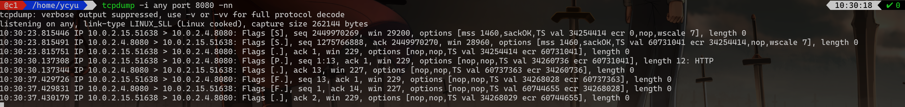

   1. 第1~3行是TCP握手的过程
   2. 第1列为时间，精确到微秒级
   3. 接下来是四元组：源地址、源端口、目的地址、目的端口，中间的">"表示流向
   4. Flags表示TCP首部的flags字段，常见标志如下：
      - F：Fin
      - R：RST
      - P：PSH
      - U：URG
      - .  ：没有标志，ACK情况使用
   5. 接下来的是SYN包的序号，此时是绝对序号，从第三行开始就是相对序号了
   6. 接下来的是rwnd的大小，这里要注意，从第三行的win=229并不是实际窗口大小，要乘以window scale的值：2^7，即229*2^7=229*128=29312
   7. options中对应TCP的选项值，包括MSS，window scale, SACK等等
   8. 最后的是包的长度

## 廿四、wireshark

**显示过滤**

过滤的方式常见的有以下几种：

- 协议、应用过滤器 (ip/tcp/udp/arp/icmp/ dns/ftp/nfs/http/mysql)
- 字段过滤器 (http.host/dns.qry.name)

常用的查询条件有：

- tcp 相关过滤器

  		- tcp.flags.syn==1：过滤 SYN包

  		- tcp.flags.reset==1: 过滤 RST包

  - tcp.analysis.retransmission： 过滤重传包

  - tcp.analysis.zero_window： 零窗口

- http 相关过滤器

  - http.host==t.tt：过滤指定域名的 http 包

  - http.response.code==302：过滤http响应状态码为302的数据包

  - http.request.method==POST：过滤所有请求方式为 POST 的 http 请求包 http.transfer_encoding == "chunked"根据transfer_encoding过滤

  - http.request.uri contains "/appstock/app/minute/query"：过滤 http 请求 url 中包含指定路径的请求

- 通信延迟常用的过滤器

  - http. time>o.5：请求发出到收到第一个响应包的时间间隔，可以用这个条件来过滤 http 的时延

  - tcp.time_delta>0.3：tcp 某连接中两次包的数据间隔，可以用这个来分析 TCP 的时延 dns.time>0.5: dns 的查询耗时

***wireshakr 所有的查询条件在这里可以查到：https://wwwwireshark.org/docs/afref/***

**比较运算符**

- 等于：==或者 eq 不等
- 于：！=或者 ne
- 大于：＞或者 gt

- 小于：＜或者北t

- 包含 contains

- 匹配 matches

- 与操作：AND 或者&&

- 或操作：OR 或者1
- 取反：NOT 或者！

**解密HTTPS包**

这里以MacOS为例，添加环境变量（貌似不走这一步也可）

```bash
export·SSLKEYLOGFILE="/Users/ycyu/tls/SSLKEYLOGFILE.log"
```

如果还有没退出的chrome实例，需要全部退出，不然下面的操作不生效，启动chrome，并指定参数：

```bash
/Applications/Google\ Chrome.app/Contents/MacOS/Google\ Chrome --ssl-key-log-file=/Users/ycyu/tls/SSLKEYLOGFILE.log
```

接着在wireshark中：Wireshark --> Preferences... --> Protocols --> SSL打开SSL配置面板，在(Pre)-Master-Secret log filename中输入刚才的路径，然后就可以在wireshark中抓到https的包了

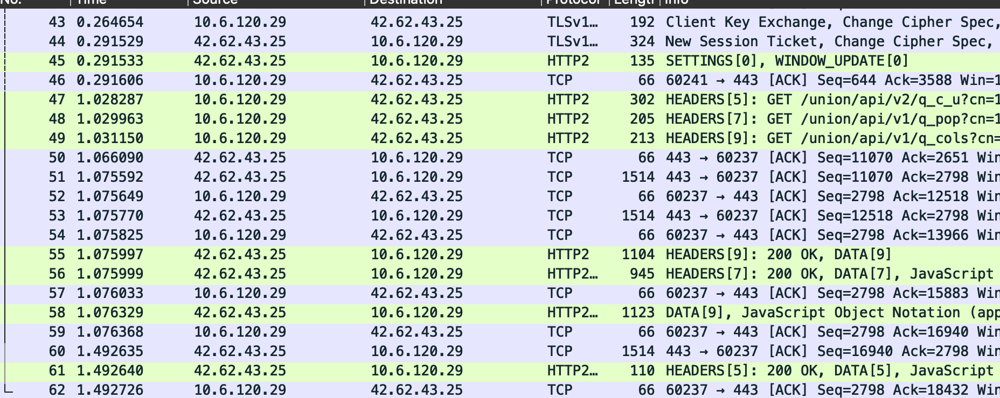


