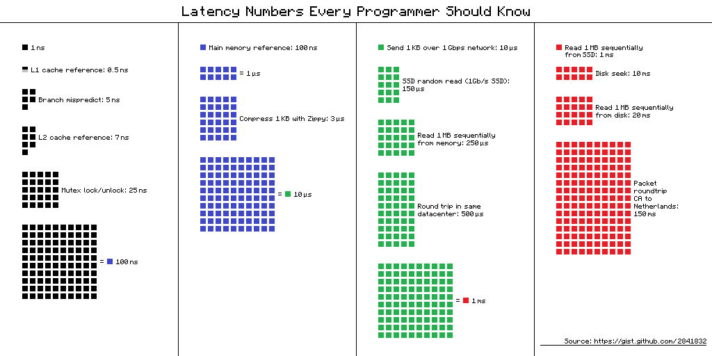

# Rust编程第一课

## 00. 开篇

**Rust 中最大的思维转换就是变量的所有权和生命周期，这是几乎所有编程语言都未曾涉及的领域**

在 Rust 里，你可以使用 Trait 做接口设计、使用泛型做编译期多态、使用 Trait Object 做运行时多态

## 01. 内存

字符串常量在编译时会被存入可执行文件的`.RODATA`段（GCC）或`.RDATA`段（VC++），在程序加载时，获得一个固定的内存地址

栈是程序运行的基础。每当一个函数被调用时，一块连续的内存就会在栈顶被分配出来，这块内存被称为**帧（frame）**

栈是自顶向下增长的，一个程序的调用栈最底部，除去入口帧（entry frame），就是 main() 函数对应的帧，而随着 main() 函数一层层调用，栈会一层层扩展；调用结束，栈又会一层层回溯，把内存释放回去

在调用过程中，**一个新的帧会分配足够的空间存储寄存器的上下文。在函数里使用到的通用寄存器会在栈保存一个副本，当这个函数调用结束，通过副本，可以恢复出原本的寄存器的上下文**，函数所需要使用到的局部变量，也都会在帧分配的时候被预留出来

> **通用存储寄存器(General Purpose Register,简称GPR)**是计算机处理器中用于存储数据和执行指令的临时存储器。在程序执行过程中，通用存储寄存器的作用非常重要，因为它们可以：
>
> 1. 存储中间结果：当一个指令需要处理大量数据时，通用存储寄存器可以暂时存储中间结果，以便后续指令能够访问和修改这些数据。
> 2. 保存寄存器状态：在执行某些指令时，处理器可能会改变寄存器的值。通用存储寄存器可以用来保存这些寄存器的状态，以便稍后恢复到原始值。
> 3. 执行跳转指令：当程序执行跳转指令时，通用存储寄存器中的地址会被加载到程序计数器(Program Counter,PC)中。这样，处理器就可以根据新的地址继续执行程序。
> 4. 存储函数参数和返回地址：在调用函数时，通用存储寄存器可以用于存储函数的参数值和函数的返回地址。当函数执行完毕后，这些值将被自动恢复到正确的位置。

那么一个函数运行时，怎么确定需要多大的帧呢，这就依赖于编译器，编译器得知道在函数中用到了哪些寄存器、栈上要放哪些局部变量，这些都是在编译时确定的，所以：

**在编译时，一切无法确定大小或大小可以改变的数据，都无法安全地放在栈上，最好放在堆上**

**一旦程序的调用栈超出了系统允许的最大栈空间，就无法创建新的帧，就会发生栈溢出，程序就会被系统终止**

**栈上存放的数据是静态的，固定大小，固定生命周期；堆上存放的数据是动态的，不固定大小，不固定生命周期**

## 02. 串讲

**引用的解引用访问是受限的**，它只能解引用到它引用数据的类型，不能用作它用，**指针和引用是原生类型，它们可以分配在栈上**

**胖指针：除了包含所指向的内存地址之外，还携带了更多的信息，比如内存地址的长度等信息**

**闭包**引用的上下文中的自由变量，会被捕获到闭包的结构中，成为闭包类型的一部分

**接口**将调用者和实现者隔离开，大大促进了代码的复用和扩展。面向接口编程可以让系统变得灵活，当使用接口去引用具体的类型时，我们就需要**虚表**来辅助运行时代码的执行。有了虚表，我们可以很方便地进行动态分派，它是运行时多态的基础

