# 趣谈网络协议

## 1. 为什么要学习网络协议

### 协议三要素：

- 语法
- 语义
- 顺序

### 网络分层

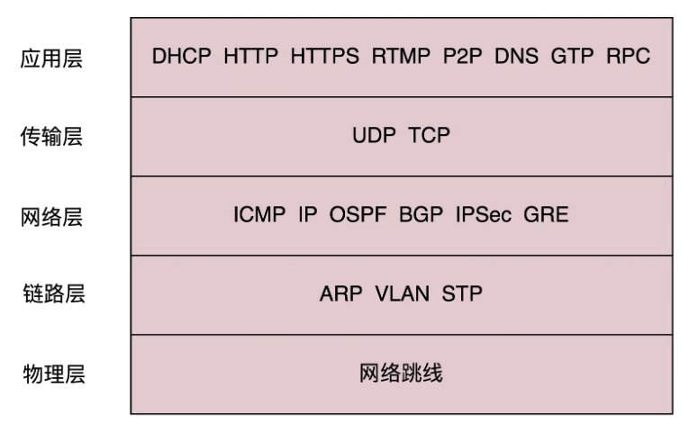

## 2. 网络分层的真实含义是什么

复杂的程序都要分层，这是程序设计的要求，每一层专注做本层的事情

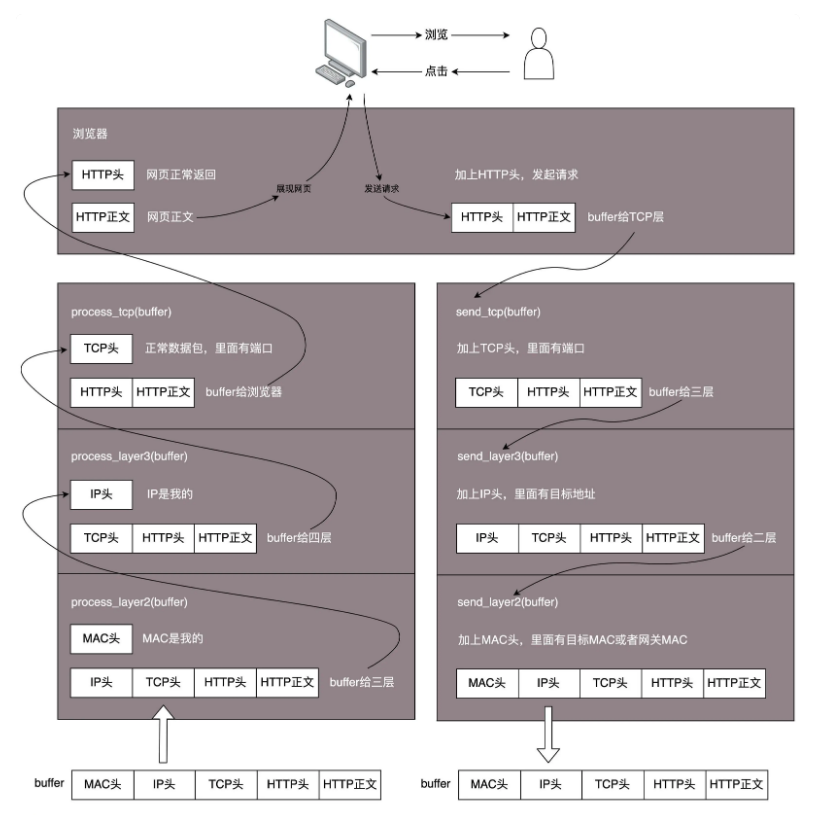

**只要是在网络上跑的包，都是完整的，可以有下层没上层，绝对不可能有上层没下层**

## 3. ifconfig：最熟悉又陌生的命令行

安装iproute2（对于mac要安装iproute2mac）后就可以使用`ip addr`命令

32位ipv4的地址被分成了5类

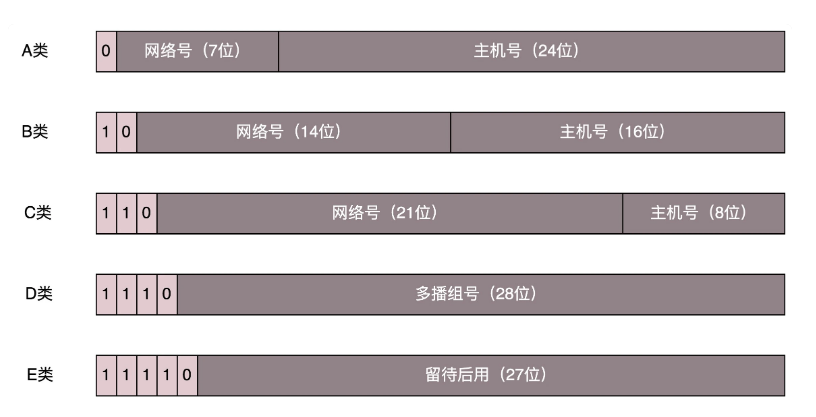

前一部分是网络号，后一部分是主机号，下面是A、B、C三类地址所能包含的主机的数量

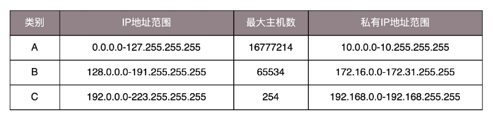

可以看到C类地址主机数太少，而B类地址主机数又太多了，于是就有了**无类型域间选路（CIDR）**

### 无类型域间选路（CIDR）

将32位IP地址一分为二，前面是网络号，后面是主机号，如`10.100.122.2/24`这种中间有一个斜杠的地址表示形式，就是CIDR，其中的`24`表示前24位是网络号，后8位是主机号，同时伴随CIDR存在的，一个是**广播地址**，如这里的`10.100.122.255`，向其发送消息，则`10.100.122`子网中的所有机器都可以收到，另一个是**子网掩码**，如这里的`255.255.255.0`，**将子网掩码和IP地址进行按拉与操作，就可得到网络号**

### 公有IP地址和私有IP地址

公有IP地址有个组织统一分配

### MAC地址

一个网络包要从一个地方传到另一个地方，除了要有确定的地址，还需要有定位的功能

MAC地址更像是身份证，是一个唯一的标识，MAC地址的通信范围比较小，局限在一个子网里面

### 网络设备的状态标识

我的Mac执行该命令后的效果

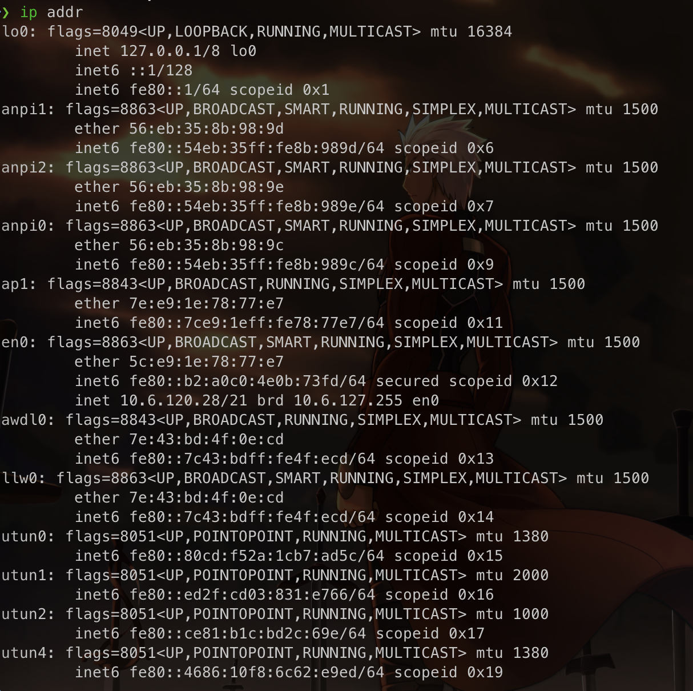

在CentOS 7下执行该命令后的效果

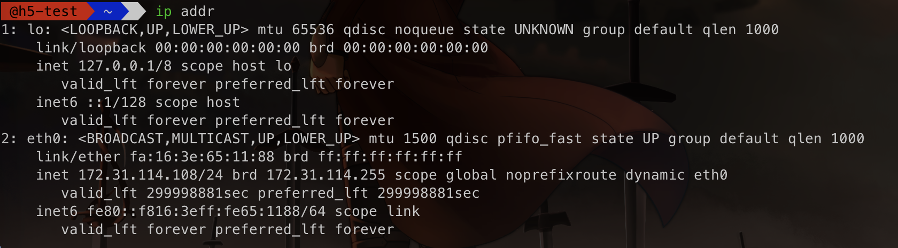

即`ip addr`命令看到类似`flags=8863<UP,BROADCAST,SMART,RUNNING,SIMPLEX,MULTICAST> mtu 1500`这样的标识

- UP：表示网卡处于启动状态
- BROADCAST：表示这个网卡有广播地址，可以发送广播包
- MULTICAST：表示网卡可以发送多播包
- LOWER_UP：表示L1是启动的，即网线是插着的
- MTU 1500：最大传输单元，是二层MAC层的概念，以太网规定正文部分不允许超过1500个字节，正文里有IP头、TCP头、HTTP头，如果放不下，就要分片传输
- qdisc：全称是`queueing discipline`，即排队规则，内核如果需要通过某个网络接口发送数据包，就需要按照这个接口配置的qdisc把数据包加入队列
  - pfifo：先入先出
  - pfifo_fast：队列包括三个波段（brand），brand0优先级最高，brand2优先级最低，数据包按服务类型（Type of Service, TOS）被分配到三个波段里，TOS是IP头里的一个字段，代表了当前包是高优先级还是低优先级

## 4. DHCP与PXE：IP是怎么来的，又是怎么没的

### 手动配置IP地址

- 使用net-tools

  ```bash
  sudo ifconfig eth1 10.0.0.1/24
  sudo ifconfig eth1 up
  ```

  

- 使用iproute2

  ```bash
  sudo ip addr add 10.0.0.1/24 dev eth1
  sudo ip link set up eth1
  ```


Linux的默认逻辑是，如果这是一个跨网段的调用，它便不会直接将包发送到网络上，而是企图将包发送到网关

### 动态主机配置协议（DHCP）

动态主机配置协议（Dynamic Host Configuration Protocol），简称DHCP

### 解析DHCP的工作方式

1. 新加入网络的机器，此时除了自己的MAC地址，其它什么都不知道，此时会进行**DHCP Discover**：使用IP地址`0.0.0.0`发送一个广播包，目的IP为`255.255.255.255`，广播包封装了UDP，UDP封装了BOOTP，DHCP其实是BOOTP的增强版，如果去抓包，可能看到的名称还是BOOTP协议

   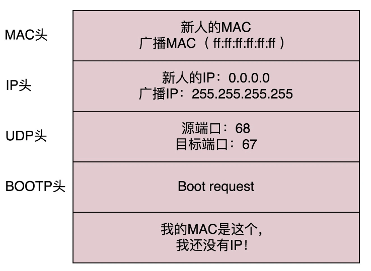

2. 如果配置了DHCP Server，根据MAC地址，知道这是一个新加入的机器，则会为其分配一个IP地址，这个过程称为**DHCP Offer**，此时依旧是一个广播包，因为尚未分配 IP地址，服务器同时**还发送了子网掩码、网关和IP地址租用期等信息**

   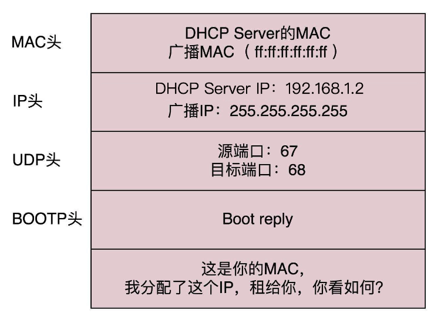

3. 新加入的机器得到了回应，如果有多个DHCP Server，则会收到多个IP地址，此时会选择一个DHCP Server（一般是最先到达的那个），并向其发送一个**DHCP Request**广播数据包，包中包含了**客户端的MAC地址、接受的租约中的IP地址、提供些租约的DHCP服务器地址等**，并告诉**所有**DHCP Server它将接受哪一台服务器提供的IP地址，从而让其它服务器撤回他们提供的IP地址，因为此时还没有得到DHCP Server的最后确认，所以客户端的IP地址仍为`0.0.0.0`

   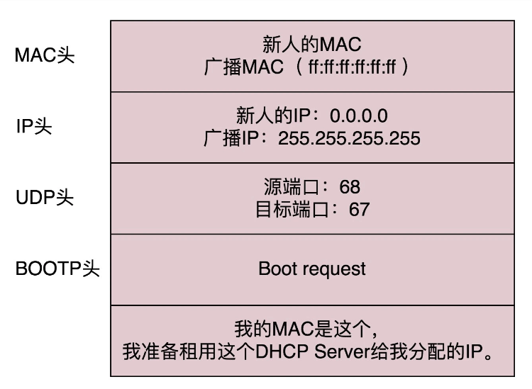

4. 当DHCP Server接受到客户端的DHCP Request后，会广播客户机一个**DHCP ACK**的包，表明已经接受客户端的选择，并将这一IP地址的合法稝信息和其他配置信息放入该广播包，发送给客户端

   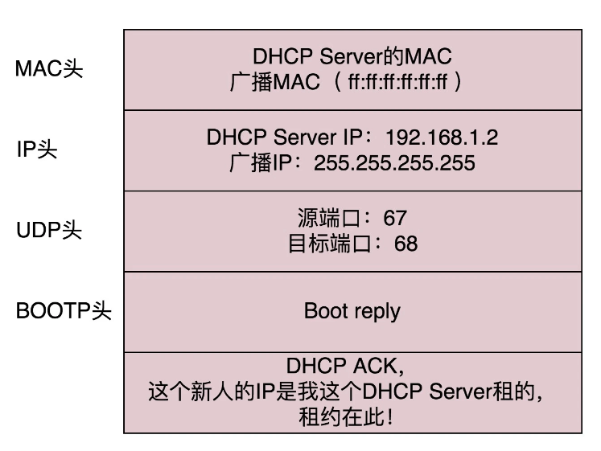

### IP地址的收回与续租

客户端会在租期过去50%的时候，直接向IP提供方的DHCP Server发送DHCP request包，客户端接收到该服务器的DHCP ACK包，会根据包中所提供的新的租期以及其他更新的TCP/IP参数，更新自己的配置，从而完成IP租用的更新

### 预启动执行环境（PXE）

不仅要自动分配IP地址，还能自动安装系统

操作系统的启动过程：

1. 启动BIOS，这是一个特别小的小系统
2. BIOS读取硬盘的MBR启动扇区，将GRUB启动起来并将权力交给它
3. GRUB加载内核、加载作为根文件系统的initramfs文件，然后将权力交给内核
4. 最后内核启动，初始化整个操作系统

通过网络安装系统，只能插在BIOS之后，因为没安装系统之前连启动扇区都没有，因此这个过程叫**预启动执行环境（Pre-boot Execution Envrionment），简称PXE**

计算机启动后，BIOS把PXE客户端调入内存，PXE通过DHCP协议拿到所分配的IP地址以及PXE服务器的IP地址（对应DHCP配置中的next-server）、初始启动文件（filename），然后客户端就可以去加载该文件并初始化操作系统了，具体过程如下：

### 解析PXE的工作过程

1. PXE客户端通过DHCP协议拿到分配给它的IP地址、PXE服务器的IP地址、启动文件pxelinux.0
2. PXE客户端去PXE服务器下载启动文件，下载使用的是TFTP协议（也就是说PXE服务器上还需要有一个TFTP服务器）
3. PXE客户端执行下载的这个文件，并按其指示向TFTP服务器请求计算机的配置信息pxelinux.cfg，配置信息中包括内核在哪里、initramfs在哪
4. 启动Linux内核

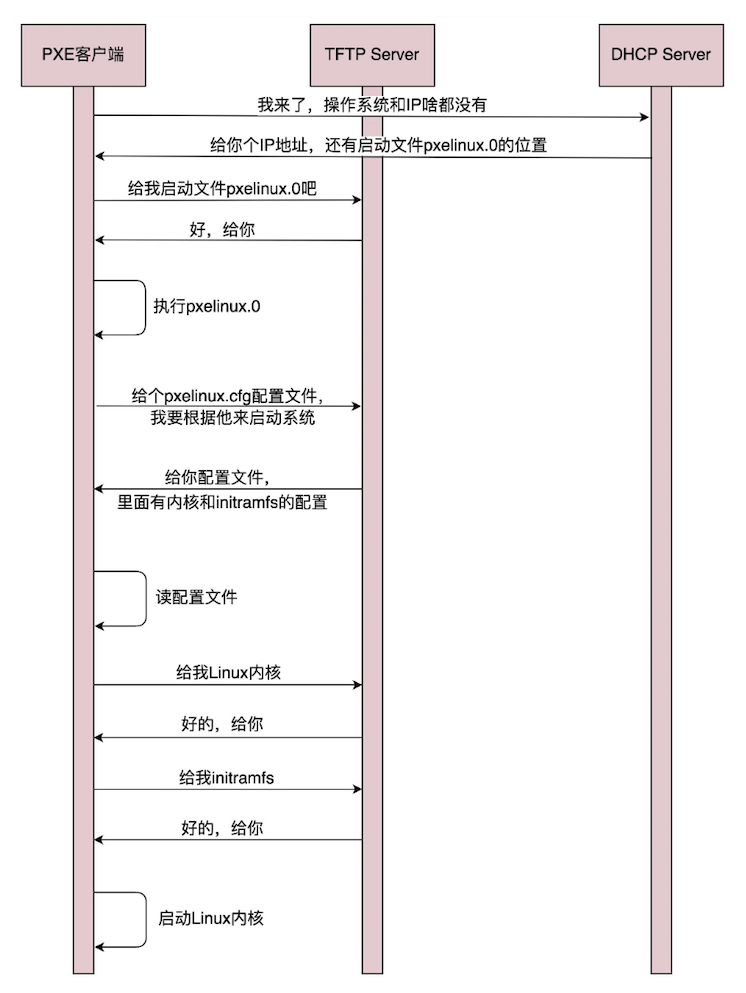

## 5. 从物理层到MAC层：如何在宿舍里自己组网玩联机游戏

### 第一层（物理层）

电脑连电脑：交叉线，普通的网线连通不了，但现在的网卡不需要这样处理了，能够自动识别

Hub，集线器，**它在物理层工作，将自己收到的每一个字节，都复制到其他端口上去**

### 第二层（数据链路层）

MAC（Medium Access Control——媒体访问控制）要解决以下几个问题

1. 这个包是发给谁的？谁应该接收
2. 大家都在发，会不会产生混乱？有没有谁先发、谁后发的规则？
3. 如果发送的时候出现了错误，怎么？

#### 多路访问

针对第2个问题，就涉及多路访问规则，MAC层使用的是叫作**随机接入协议**的方式

#### 链路层地址——MAC地址

解决第一个问题牵扯到第二层网络包格式：

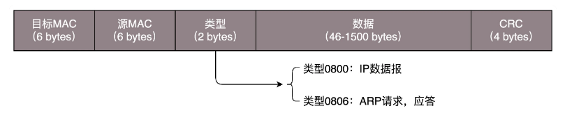

有了MAC地址，数据包在链接上广播，MAC的网络才能发现这个包是给它的

#### 循环冗余检测——CRC

通过XOR异或算法，来计算整个包是否在发送过程中出现了错误，从而解决第三个问题

#### ARP协议

当源机器不知道目标机器的MAC地址时，通过IP地址可以获取MAC地址的协议

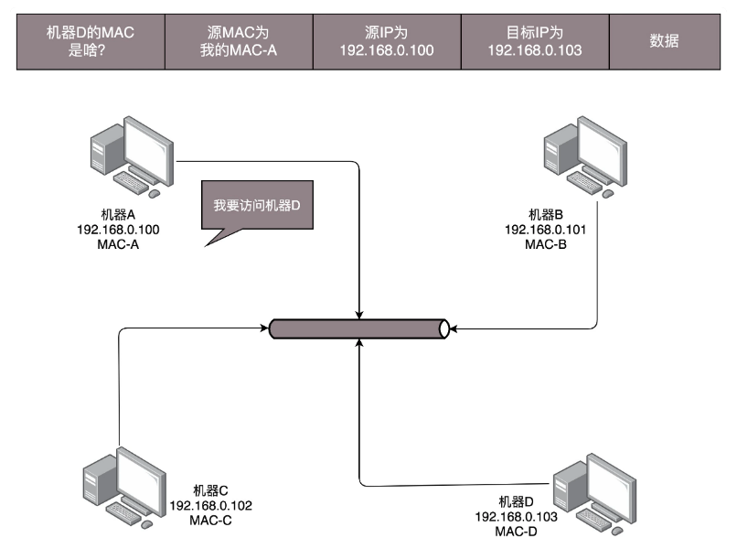

MAC地址的获取过程

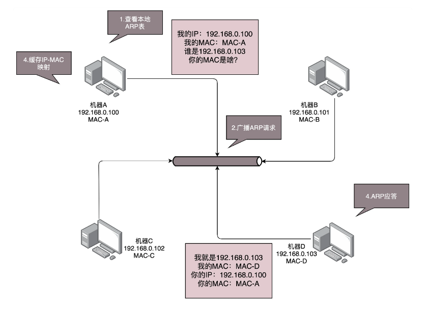

谁是这个IP谁来回答，具体询问和回答的报名如下所示：

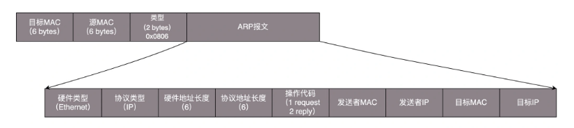

#### 二层交换机

交换机通过学习（当来自MAC1的包到达交换机时，交换机就会记住MAC1来自一个明确的端口，以后所有目的地址是MAC1的就直接发送到这个端口就可以了）在过了一段时间后就有了整个网络的一个拓扑结构，即**转发表**（因为每台机器的IP地址会变，所在的端口也会变，因为转发表也是有一个过期时间的）

## 交换机与VLAN：办公室太复杂，我要回学校

### 拓扑结构是怎样形成的

### 环路问题

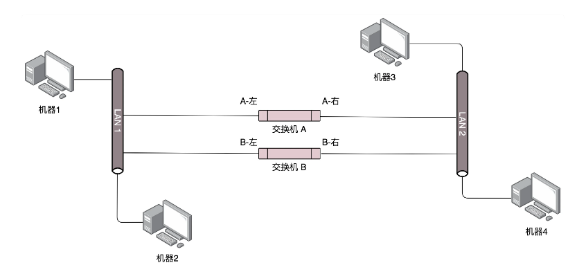

打破环路，转成树形结构

### 解决环境问题——STP协议

STP——Spanning Tree Protocol 生成树算法

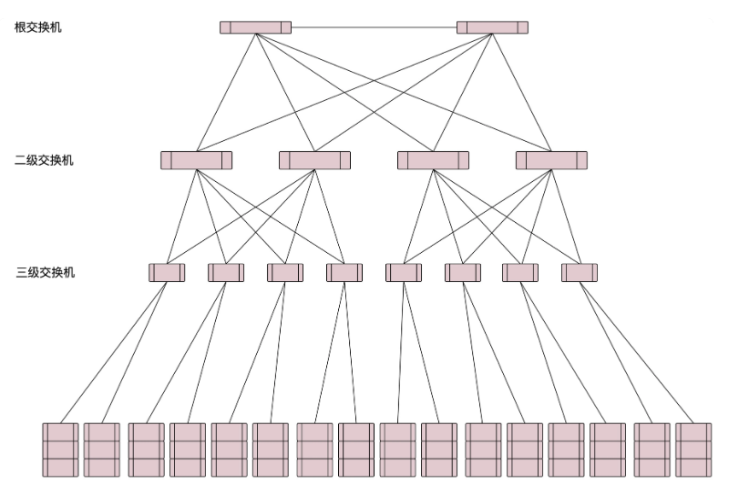

- Root Bridge：根交换机，整棵树的老大
- Designated Bridegs：指定交换机，”指定“的意思是：我拜谁做大哥，其他交换机通过这个交换机到达根交换机
- Bridge Protocol Data Units（BPDU）：网桥协议数据单元，也就是”相互比较实力“的协议，比如两个相连的交换机，就需要比较一下实力。BPDU只有掌门能发
- Priority Vector：优先级向量，越小越牛，为一组ID：[Root Bridge ID, Root Path Cost, Bridge ID, Port ID]，比较时，从Root Bridge ID开始比，如果Root Bridge ID相同，则对比Root Path Cost，即自己到Root Bridge的距离，最后再比较自己，即Bridge ID和Port ID

### STP的工作过程

### 如何解决广播问题和安全问题

1. 物理隔离：单独的交换器，形成单独的子网
2. 虚拟隔离：VLAN，即虚拟局域网，相同VLAN的包才能转发，不同VLAN的包，是看不到的

VLAN包的协议：

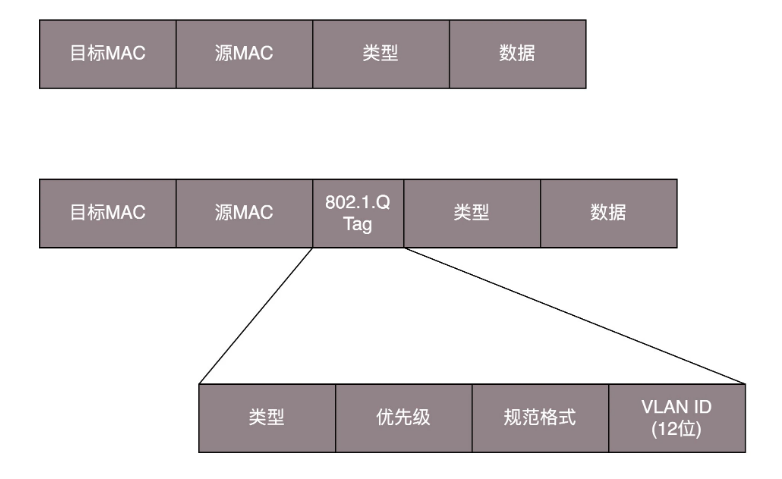

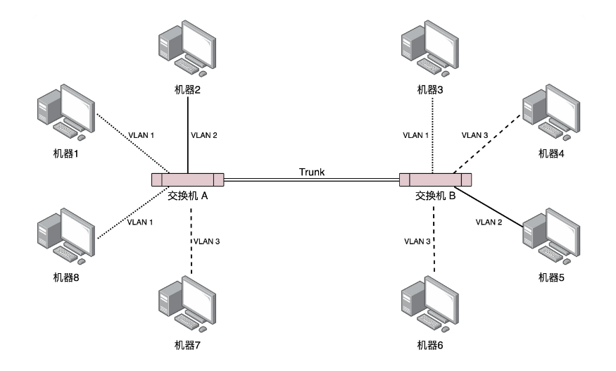

交换机之间通过Trunk口连接，它可以转发所有VLAN的包

## ICMP与ping：投石问路的侦察兵

### ICMP协议的格式

ICMP——Internet Control Message Protocol，互联网控制报文协议

ICMP报文是封装在IP包里面的

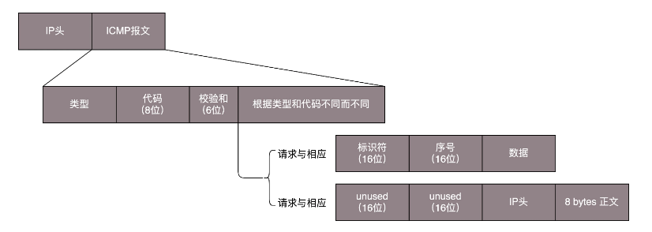

### ICMP报文类型

- 查询报文类型

  - 比如ping，只不过它在后面增加了自己的格式
  - 对ping的主动请求（8）：ICMP ECHO REQUEST，主动请求的回复：ICMP ECHO REPLY（0）
  - ping比原生的ICMP多了两个字段：
    - 标识符
    - 序号

- 差错报文类型

  - 3：终点不可达为
  - 4：源抑制为
  - 11：超时
  - 5：重定向

  差错报文除了前面还是IP，ICMP的前8字节不变，后面则跟上出错的那个IP包的IP头和IP正文的前8个字节

### ping：查询报文类型的使用

Ping的发送和接收过程

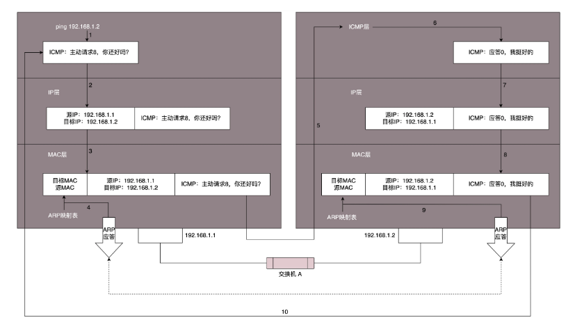

### traceroute：差错报文类型的使用

1. 故意设置特殊的TTL，来追踪去往目的地沿途经过的路由器
2. 故意设置不分片，从而确认路径的MTU

## 世界这么大，我想出网关：欧洲十国游与玄奘西行

### MAC头和IP头细节 

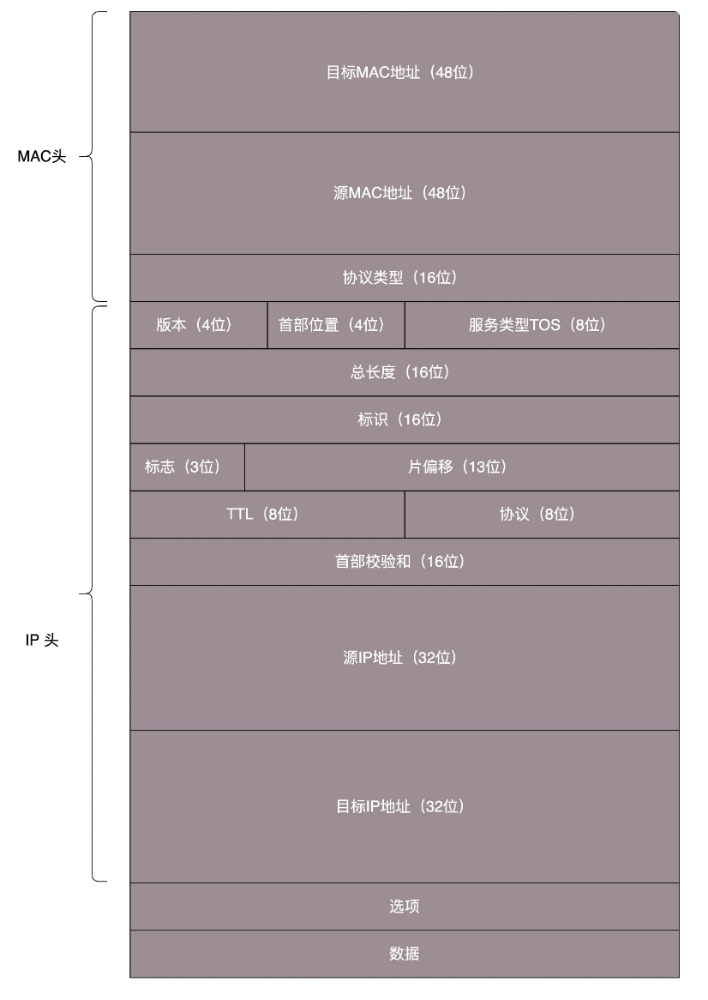

- **如果是同一个网段**，则没有网关什么事了，直接将源地址和目标地址放入IP头，然后通过ARP获取MAC地址，将源MAC和目的MAC放入MAC头中，发出去就可以了
- **如果不是同一个网段**，就需要发往默认网关（Gateway）,网关地址一定和源IP地址是同一个网段的，那么其发送发式和上面提到的同一网段的情况是相同的了

**网关往往是一个路由器，是一个三层转发的设备**，它连接着多个局域网，当收到其中一个局域网的包时，会拿下MAC头和IP头查看，并根据自己的**路由算法**，选择另一个局域网，加上IP头和MAC头后发出去

至于发往哪个局域网，以及加上的IP头与MAC头发生了哪些变化涉及下面的内容

### 静态路由与动态路由

选择发往哪个局域网时涉及这两个概念，这里我们先看静态路由，所谓静态路由，就是在路由器上配置一条一条规则，根据命中的规则决定将这个包发往哪个端口以及下一跳的IP是哪个

### IP头和MAC头哪些变、哪些不变？

**只要经过网关MAC地址一定会发生变化**，因为MAC地址只有在一个局域网里才有效，换了局域网后就一定会变化，而IP地址是否变更取决于网关类型：**不改变IP地址的网关，称为转发网关；改变IP地址的网关，称为NAT（Network Address Translation）网关**

## 路由协议：西出网关无故人，敢问路在何方

### 如何配置路由表？

一条路由规则至少包含三项信息：

- 目的网络：这个包想去哪儿？
- 出口设备：将包从哪个口扔出去？
- 下一跳网关：下一个路由器的地址

通过`route`命令和`ip route`命令都可以查询和配置路由规则：

```bash
# 要去10.176.48.0/20这个目标网络，就要从eth0这个端口出去，经过10.173.32.1
ip route add 10.176.48.0/20 via 10.173.32.1 dev eth0
```

这种配置方式称为：**根据目的IP地址来配置路由**

### 如何配置策略路由？

除了上面的根据目的IP来配置路由外，还有根据多个参数（如源IP地址、入口设备、TOS等）来配置路由的，称为**策略路由**

```bash
# 查询路由表main中配置的规则
ip route list table main
# 规定来自192.168.1.101的包使用路由表chao配置的规则进行路由
ip rule add from 192.168.1.101 table chao
# 查看所有规则
ip rule ls
# 所有包从eth3这个端口发出去，经过60.190.27.189
ip route add default via 60.190.27.189 dev eth3 table chao
```

### 动态路由算法

#### 1. 距离矢量路由算法

基本思想：每个路由器都保存一个路由表，包含多行，每行对应网络中的一个路由器，每一行包含两部分信息，一个是要到目标路由器从哪条线出去，另一个是到目标路由器的距离；每个路由器都知道全局信息

**关于信息的更新：**每个路由器都知道自己和邻居之间的距离，每过几秒，每个路由器都将自己所知的到达所有的路由器的距离告知邻居，每个路由器也能从邻居那得到相似的信息，每个路由器根据收集到的信息，计算和其他路由器的距离

**存在的问题：**

1. 好消息传得快，坏消息传得慢
2. 每次发送的时候，要发送整个全局路由表

#### 2. 链路状态路由算法

基本思想：当一个路由器启动的时候，首先是发现邻居，向邻居 say hello，邻居都回复。然后计算和邻居的距离，发送一个echo，要求马上返回，除以二就是距离。然后将自己和邻居之间的链路状态包广播出去，发送到整个网络的每个路由器。这样每个路由器都能够收到它和邻居之间的关系的信息。因而，每个路由器都能在自己本地构建一个完整的图，然后针对这个图使用 Diikstra 算法，找到两点之间的最短路径

### 动态路由协议

#### 1. 基于链路状态路由算法的OSPF

**OSPF(Open Shortest Path First，开放式最短路径优先)**，广泛应用在数据中心中的协议，由于主要用在数据中心内部，用于路由决策，因而称为**内部网关协议（Interior Gateway Protocol，简称IGP）**

IGP的重点就是找到最短路径，在一个组织内部，路径最短往往最优，有时候OSFP可以发现多条最短路径，称为**等价路由**，一般应用的接入层会有**负载均衡LVS**，可以和OSPF一起**实现高吞吐量的接入层设计**

#### 2. 基于距离矢量路由算法的BGP

对于外网的路由协议，即国家之间，我们称为**外网路由协议（Border Gateway Protocol，简称BGP）**

国家之间，因为涉及政策问题，就不能哪条路近就走哪条了

在网络世界，这一个个国家成为自治系统AS（Autonomous System）：

- Stub AS：对外只有一个连接。这类AS不会传输其他AS的包，比如个人或者小公司网络
- Multihomed AS：可能有多个连接连到其他的AS，但是大多拒绝帮其他的AS传输包，比如一些大公司的网络
- Transit AS：有多个连接连到其他的AS，并且可以帮助其他AS传输包，比如主干网

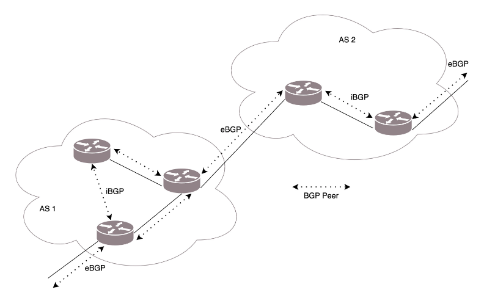

**BGP 又分为两类，eBGP和iBGP**。自治系统间，边界路由器之间使用 eBGP 广播路由。内部网络也需要访问其他的自治系统。边界路由器如何将 BGP 学习到的路由导入到内部网络呢？就是通过运行iBGP，使得内部的路由器能够找到到达外网目的地的最好的边界路由器

**BGP 协议使用的算法是路径矢量路由协议 (path-vector protocol)。它是距离矢量路由协议的升级版。**

## UDP协议：因性善而简单，难免碰到“城会玩”

### TCP与UDP有哪些区别

是否面向链接，所谓的建立连接，是为了在客户端与服务维护连接，而建立一定的数据结构来维护双方交互的状态，用这样的数据结构来保证所谓的面向连接的特性

- TCP提供可靠交付，无差错、不丢失、不重复、按序到达；而UDP则不保证不丢失，不保证按序到达
- TCP是面向字节流的，发的是一个流，没头没尾，UDP是基于数据报的，一个个地发，一个个地收
- TCP有拥塞控制，可以根据网络环境来调整自己的行为，比如包是不是发快了，要不要发慢点，UDP则不管这些
- TCP是有状态的，比如它会记录哪些包发送了，哪些包接收了，要不要重发，而UDP则是无状态的

**MAC层定义了本地局域网的传输行为，IP层定义整个网络端到端的传输行为**，这两层基本定义了这样的基因：**网络传输是以包为单位的，二层叫帧，网络层叫包，传输层叫段。我们笼统地称不为包。包单独传输，自行选路，在不同的设备封装解封装，不保证到达。基于这个基因，生下来的孩子UDP完成继承了这些特性，几乎没有自己的思想**

### UDP包头是什么样的

IP头里面有个8位协议，用来存放表示是TCP的包还是UDP的包

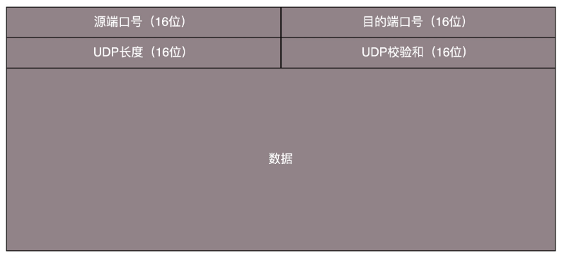

### UDP的三大使用场景

1. 需求资源少，在网络情况比较好的内网，或者对于丢包不敏感的应用
2. 不需要一对一沟通，建立连接，而是可以广播的应用
3. 需要处理速度快，时延低，可以容忍少数丢包，但是要求即使网络拥塞，也毫不退缩，一往无前的时候

### 基于UDP的“城会玩”的例子

1. QUIC（Quick UDP Internet Connections，快速UDP互联网连接），它在应用层上，会自己实现快速连接建立、减少重传时延，自适应拥塞控制
2. 基于UDP实现的流媒体的协议
3. 实时游戏
4. loT物联网
5. 移动通信领域

## TCP协议（上）：因性恶而复杂，先恶后善反轻松

### TCP包头格式

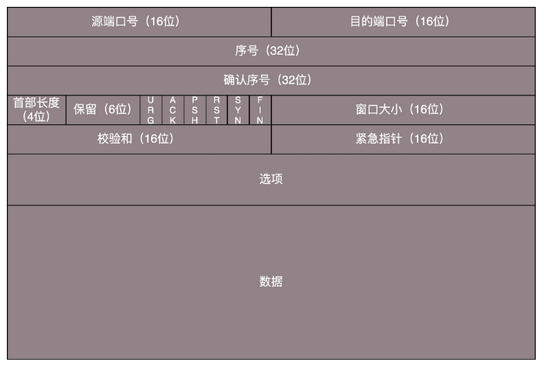

### TCP三次握手

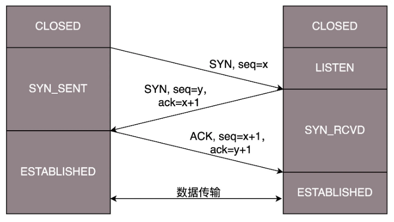

### TCP四次挥手

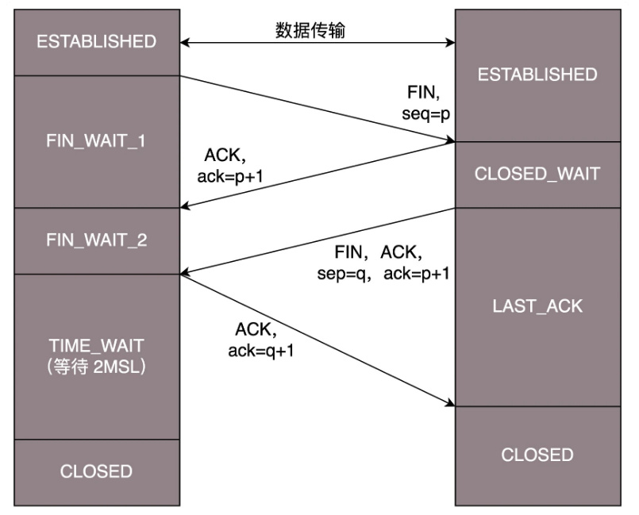

### TCP状态机

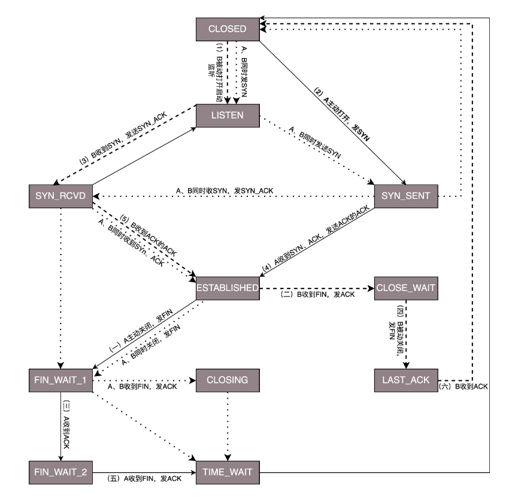


## TCP协议（下）：西行必定多妖孽，恒心智慧消磨难

### 如何实现一个靠谱的协议？

**累计确认（累计应答，cumulative acknowledgment）**：接收端会应答某个之前的ID，表示这个ID及之前的包都收到了

**Advertised Window**：**接收端**会给**发送端**报一个窗口的大小，其大小等于已发送但尚未确认的包大小+没有发送但已经等待发送的包大小

**对于发送端：**

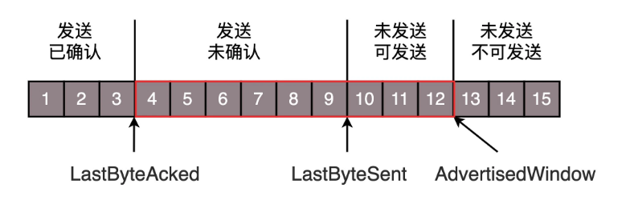

**对于接收端：**

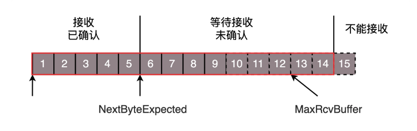

- MaxRcvBuffer：最大缓存的量
- LastByteRead（上图中第一个箭头的位置）：已经接收但还未被应用层读取的
- NextByteExpected：第一部分与第二部分的分割线

### 顺序问题与丢包问题

**确认与重发机制**

- **超时重试**：对每一个发送了，但没有ACK的包，都设一个定时器，超过一定的时间，就重新尝试，而这个时间必须大于往返时间RTT，否则会引起不必要的重传，但如果设置的太长会导致访问变慢，TCP的做法是采用了**自适应重传算法**

  自适应重传算法：TCP通过采样RTT的时间，然后进行加权平均，算出一个值，而且这个值还是要不断变化的，因为网络情况不断的变化，除了采样RTT，还要采样RTT的波动范围，计算出一个估计的超时时间

- 对于重传，TCP的策略是**超时间隔加倍，每当遇到一次超时重传的时候，都会将下一次超时时间间隔设为先前值的两倍，两次超时，说明网络环境差，不宜频繁反复发送**

- **快速重传机制：**，超时触发重传的问题在于周期可能比较长，所以增加了一个快速重传机制：**当接收方收到一个序号大于下一个所期望的报文段时，就会检测到数据流中的一个间隔，于是它就会发送冗余的ACK，仍然ACK的是期望接收的报文段，而当客户端收到三个冗余的ACK后，就会在定时器过期之前重传丢失的报文段**

- Selective Acknowledgment（SACK）：在TCP头里加一个SACK的东西，可以将缓存的地图发送给对方，比如发送了ACK6、SACK8、SACK9，有了地图，发送方一下子就能看出来是7丢了

### 流量控制问题

在对于包的确认中，会同时携带一个窗口的大小——**滑动窗口， rwnd**，用于控制发送方是否还可以发送数据包，如果滑动窗口大小为0时，发送方则停止发送，并且会定时发送**窗口探测数据包**，看是否有机会调整窗口的大小

同时，当接受方处理比较慢的时候，为了防止**低能窗口综合症**，不会在空出一个字节时就立马告诉发送方，不然马上就又填满了，导致波动，此时不会更新窗口，直到达到一定大小或者缓冲区一半为空时才更新窗口

### 拥塞控制问题

通过**滑动窗口**与**拥塞窗口，cwnd**来控制：
$$
LastByteSent - LastByteAcked <= min\{ cwnd, rwnd \}
$$
拥塞控制用来避免两种现象：**包丢失**和**超时重传**

- 慢启动
  - cwnd指数性增长，直到达到ssthresh阈值(65535个字节)，达到这个值之后，cwnd增加1/cwnd，这样当到达cwnd个包时，cwnd则加1 ，变成了线性增长
- 线性增长，直到出现的拥塞，其中一种表现形式就是丢包，需要超时重传，此时，会将ssthresh设为cwnd/2，将cwnd设为1，重新开始慢启动，但这种方式太激进，会造成网络卡顿
- 快速重传，当接收端发现丢了一个中间包时，会发送三次前一个包的ACK，于是发送端就会快速重传，此时TCP认为只是丢了一小部分包，只会将cwnd减半，ssthresh设置为cwnd，当三个包返回的时候，cwnd = ssthresh + 3，还在比较高的值，呈线性增长


### TCP拥塞控制的问题 & BBR拥塞算法

1. 丢包并不代表通道满了，此时如果认为出现了拥塞，退缩了就无法充分利用带宽
2. TCP的拥塞控制要等到将中间设备都填充满了才发生丢包，从而降低速度，此时就已经晚了
3. TCP BBR算法，它企图找到一个平衡点，通过不断地加快发送速度，将管道填满，但不填满中间设备的缓存，因为这样会增加延时，在这个平衡点可以很好的达到高带宽和低时延的平衡

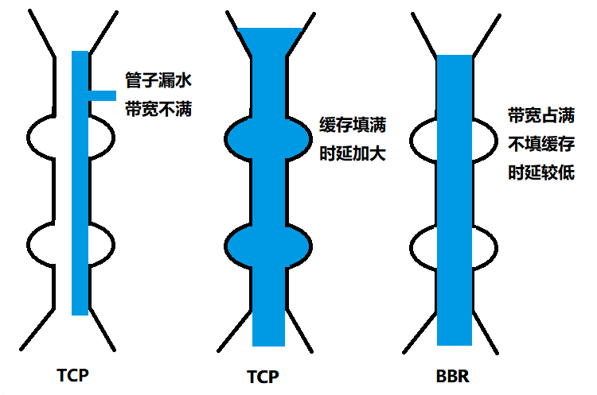

## 套接字Socket：Talk is cheap, show me the code

Socket函数需要指定的参数：

1. IPv4还是IPv6：AF_INET和AF_INET6
2. TCP还是UDP：SOCK_STREAM和SOCK_DGRAM

### 基于TCP协议的Socket程序函数调用过程

知识点：监听用的Socket和真正用来传数据的Socket是两个，前者叫**监听Socket**，后者叫**已连接Socket**

基于TCP的Socket程序函数调用过程：

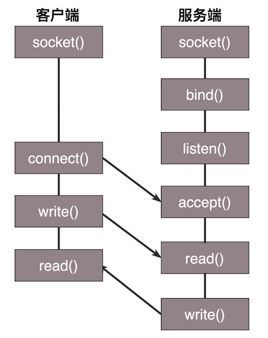

*在内核中，Socket是一个文件，有对应的**文件描述符**，每一个进程都有一个数据结构**task_struct**，里面指向一个文件描述符数组，来列出这个进程打开的所有文件的文件描述符。文件描述符是一个整数，是这个数组的下标，这个数组中的内容是一个指针，指向内核中所有打开的文件的列表，每个文件都会有一个inode，而Socket对应的inode不像真正的文件系统那样，它不是保存在硬盘上，而是在内存中，它指向了Socket在内核中的Socket结构，这个结构中，有两个队列，一个是**发送队列**，一个是**接收队列**，两个队列里保存的是一个缓存sk_buff，**这个缓存里就能够看到完整的包的结构***

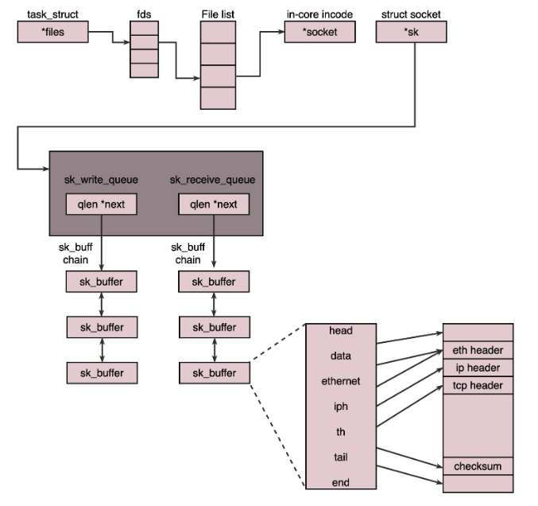

### 基于UDP协议的Socket程序函数调用过程

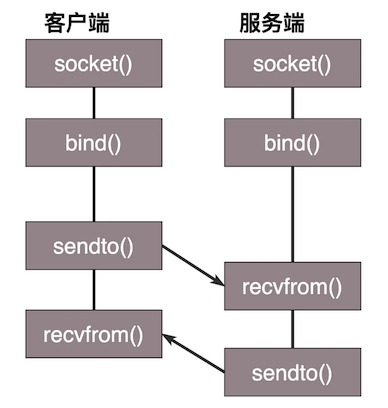

### 服务器如何接更多的项目

**最大连接数**

理论值：
$$
客户端IP数(2^{32}) \times 客户端端口数(2^{16}) = 2^{48}
$$
实际上的限制：

1. 文件描述符限制，需要通过`ulimit`配置文件描述符的数目
2. 内存限制，每个TCP连接都要占用一定内存（参见上面的数据结构）

#### 方式一：多进程方式

Linux下通过fork来创建子进程，fork会复制文件描述符列表、内存空间以及**一条记录用于表示当前执行到哪一行**，子进程与父进程完成一样，只是根据fork的返回值为区分，**子进程返回值为0，其它值则表示是父进程（返回值是子进程的pid）**

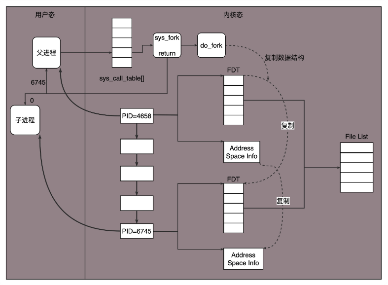

#### 方式二：多线程

Linux下通过pthread_create创建一个线程，内核中也是调用do_fork

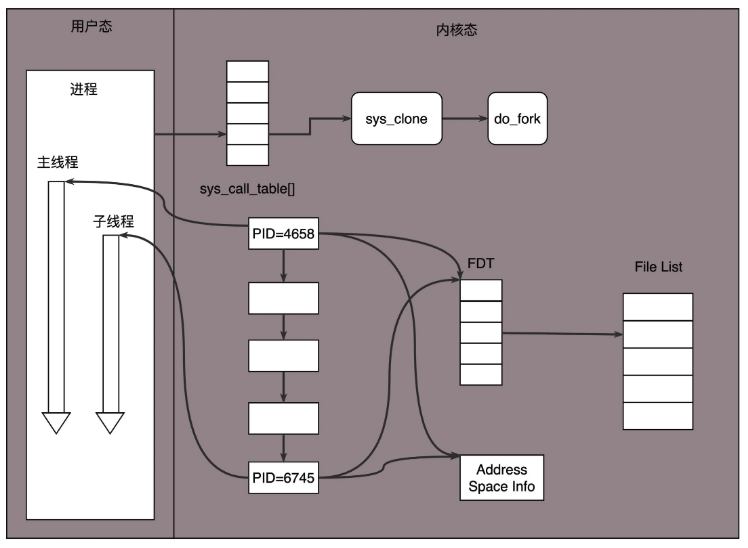

#### 方式三：IO多路复用，一个线程维护多个Socket

通过调用select函数来监听文件描述符集合（即Socket集合）是否有变化，如果有变化，就依次查看每个文件描述符，并进行读写操作

#### 方式四：IO多路复用，从“派人盯着”到“有事通知”

select的方式存在问题：主动轮询，而且对文件描述符的数量也有限制，由FD_SETSIZE限制

改为通过epoll实现的事件通知的方式，某个文件描述符变化时主动通知

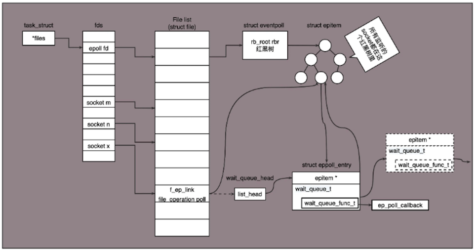

> 如图所示，假设进程打开了 Socket m,n,x等多个文件描达符，现在需要通过 epoll 来监听是否这些 Socket 都有事件发生。其中 epoll_create 创建一个epoll 对象，也是一个文件，也对应一个文件描述符，同样也对应着打开文件列表中的一项。在这项里面有一个红黑树，在红黑树里，要保存这个epoll 要监听的所有 Socket
> 当epoll_ctl 添加一个 Socket 的时候，其实是加入这个红黑树，同时红黑树里面的节点指向一个结构，将这个结构挂在被监听的 Socket 的事件列表中。当一个Socket 来了一个事件的时候，可以从这个列表中得到 epoll 对象，并调用callback 通知它
> 这种通知方式使得监听的 Socket 数据增加的时候，效率不会大幅度降低，能够同时监听的 Socket 的数目也非常的多了。上限就为系统定义的、进程打开的最大文件描述符个数。因而，**epoll 被称为解决 C10K 问题的利器**

## HTTP协议：看个新闻原来这么麻烦

### HTTP的请求与响应

HTTP-->TCP-->IP-->ARP-->MAC

### HTTP 2.0

1. 对HTTP的头进行一定的压缩，将原来每次都要携带的大量key-value在两端建立一个索引表，对相同的头只发送索引表中的索引
2. 将TCP连接切分成多个流，每个流有自己的ID，流是双向的。它其实只是一个虚拟的通道，流是有优先级的
3. 将传输的信息分割为更小的消息和帧，并使用二进制格式编码，常见的有Header帧，用于传输Header内容，并且会开启一个新的流。再就是Data帧，用来传输正文实体。多个Data帧属于同一个流

**HTTP2.0的客户端可以将多个请求分到不同的流中，然后将请求内容拆成帧，进行二进制传输，帧可以乱序发送，然后根据每个帧首部的流标识符重新组装，并且可以根据优先级，决定优先处理哪个流的数据**

### QUIC协议的“城会玩”

HTTP2.0还是基于TCP，而TCP在处理包时有严格的顺序，所以还是会受到阻塞，而QUIC协议就是会了解决这个问题

#### 机制一：自定义连接机制

当网络信号不稳定或网络切换时，导致重连，从而进行再次的三次握手，而基于UDP，在QUIC自己的逻辑里维护连接机制，**不再以四元组标识，而是以一个64位的随机数作为ID标识，只要ID不变，就不需要重新建立连接**

#### 机制二：自定义重传机制

TCP是通过**序号和应答机制**来解决顺序问题和丢包问题，关于超时，TCP是通过采样RTT的自适应重传算法，但这个采样存在不准确的问题。而QUIC也有个序号，并且是递增的，任何一个序号的包只发送一次，下次就加一，这样就能准确的计算RTT

PS：那如何知道两个包的内容是相同的呢，QUIC定义了一个offset的概念，发送的数据在这个数据流里有个偏移量offset，可以通过offset查看数据发送到了哪里，只要这个offset没有来，就要重发，如果来了，就按offset拼接，还是能够拼成一个流

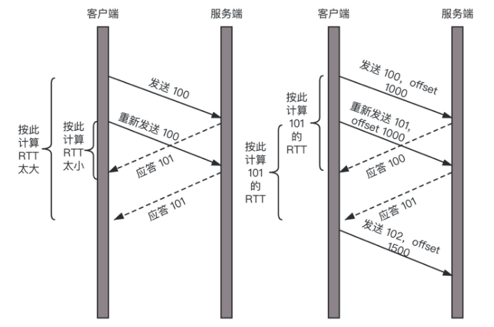

#### 机制三：无阻塞的多路复用

同一条QUIC连接上可以创建多个stream来发送多个HTTP请求，但由于QUIC是基于UDP的，多个stream之间没有依赖，所以不会阻塞

#### 机制四：自定义流量控制

TCP是通过滑动窗口来进行流量控制的，QUIC的流量控制也是通过window_update来告诉对端它可以接受的字节数，但QUIC的窗口是适应自己的多路复用机制的，不但在一个连接上控制窗口，在一个连接的每个stream上也控制窗口

QUIC的ACK是基于offset的，每个offset的包来了，进了缓存，就可以应答，应答后不会重发，窗口的起始位置为当前收到的最大offset，从这个offset到当前stream所能容纳的最大缓存，是真正的窗口大小，显然这样更准确

## HTTPS协议：点外卖的过程原来这么复杂

### 对称加密与非对称加密

### 数字证书

证书里包含公钥、证书的所有者、发布机构、有效期

证书由权威机构去颁发，即CA（Certificate Authority），CA会给证书生成一个签名，生成签名的算法过程：对证书相关信息进行Hash计算，得到一个Hash值，且该过程不可逆，在把信息发送出去时，**用CA的私钥对这个Hash值加密，生成签名，并与证书信息一起发送出去**

要判断一个网站的公钥是否有效，就需要拿到网站的证书，证书里有发布机构CA，拿这个CA的公钥去解密该网站的签名，然后用证书里说明所使用的Hash算法对证书的信息进行Hash处理，如果其结果与解密的签名一致，则说明该网站的公钥是有效的

那么上述环节中的CA的公钥是否有效？这又需要更上一级的CA以同样的方式来进行验证当前CA的公钥是否有效，这样层层上去，直到全球皆知的几个著名的大CA，即**root CA**，而rootCA的证书是提前预置在操作系统里的

### HTTPS的工作模式

通过非对称加密生成密钥，再通过密钥来加密传输的数据，这就是HTTPS的工作方式

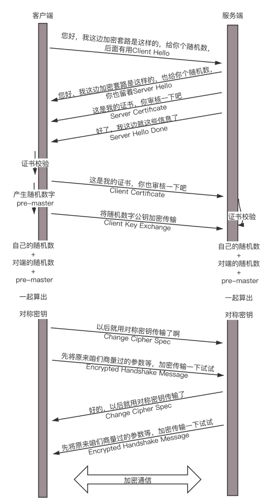

### 重放与篡改

黑客截获包之后，虽然打不开，但可以发送N次，这往往通过Timestamp与Nonce随机数联合做一个不可逆的签名，请求只被接受一次，多次收到相同的Timestamp和Nonce，则视为无效

## 流媒体协议：如何在直播里看到美女帅哥？

编码其实是一个压缩的过程，而视频与图片之所以支持压缩是因为以下几个特点：

1. 空间冗余

   图像的相邻像素之间有较强的相关性，往往渐变而不是突变，所以没必要完整地保存，可以间隔保存，中间的通过算法来计算生成

2. 时间冗余

   视频序列的相邻图像之间内容也相似，一个视频中连续出现的图片也不是突变的，可以根据已有的图片进行预测和推断

3. 视觉冗余

   人的视觉系统对某些细节不敏感，因此不会每一个细节都注意到，可以允许丢失一些数据

4. 编码冗余

   不同像素值出现的概率不同，概率高的用的字节少，概率低的用的字节多，类似霍夫曼编码的思路

而编码的过程大致如下：

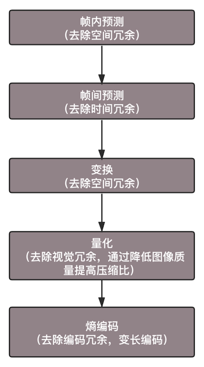

### 视频编码的两大流派

1. 国际电联下的VCEG
2. ISO旗下的MPEG

**后来两家联合制定了H.264/MPEG-4 AVC**

### 如何在直播里看到帅哥美女？

网络协议将**编码**好的视频流，从主播端推到服务器，服务器上有个运行了同样协议的服务端来接收这些网络包，从而得到里面的视频流，该过程称为**接流**，之后会对视频流进行一定的处理，例如**转码**，即从一个编码格式转成另一种编码格式，**流处理**完毕之后，就可以等待客户端来请求这些视频流，这个过程称为**拉流**

考虑到客户端的并发请求会导致服务器压力过大，需要一个视频的**分发网络**，将视频先加载到就近的边缘节点，这样客户端会接近从边缘节点上拉流

客户端将视频流拉下之后，需要进行**解码**，将二进制再转变成一帧帧生动的图片并**播放**出来

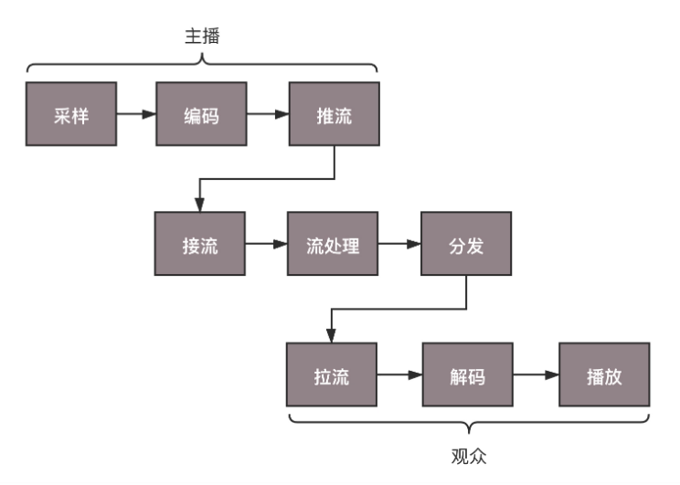

#### 编码：图片变成二进制流

视频序列分成三种帧

- I帧：即关键帧。里面是完整的图片，只需要本帧数据就可以完成解码
- P帧：前向预测编码帧，表示这一帧跟之前的一个关键帧或P帧的差别，解码时需要用之前缓存的画面，叠加上本帧定义的差别，生成最终画面
- B帧：双向预测内插编码帧，记录的是本帧与前后帧的差别，要解码B帧，不仅需要取得之前缓存的画面，还要解码之后的画面，通过前后画面的数据与本帧数据的叠加，取得最终的画面

压缩后帧的序列，应该上在IBBP的间隔出现的，这就是**通过时序进行编码**

在一帧上，有多个片，每个片中分成多个宏块，每个宏块又分成多个子块，这样将一张大图分解成一个个小块，可以方便进行**空间上的编码**

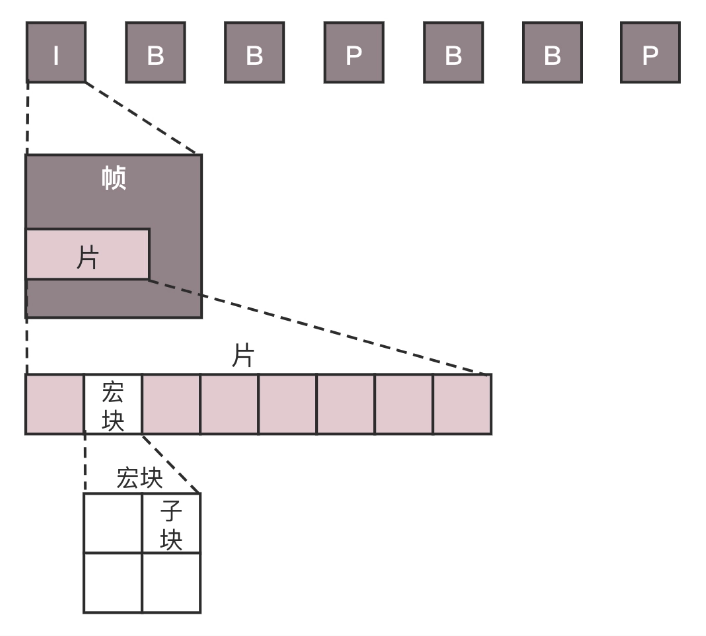

而最终压缩成的一个二进制流，其结构是由一个个的**网络提取层单元（NALU， Network Abstraction Layer Unit）**构成

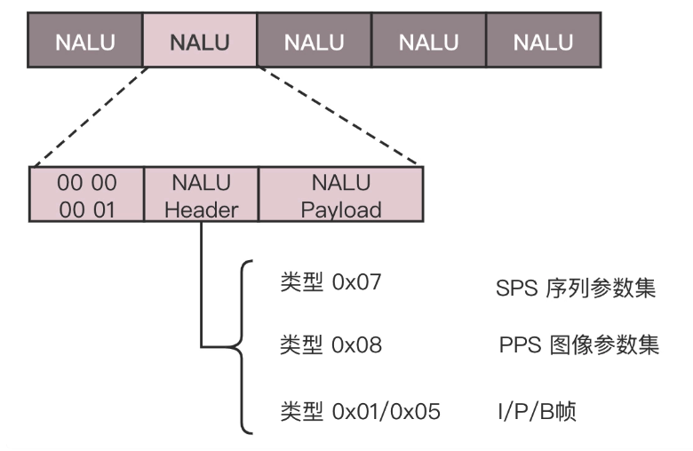

**一个视频，可以拆分成一系列的帧，每一帧拆分成一系列的片，每一片都放在一个 NALU 里面，NALU 之间都是通过特殊的起始标识符分隔，在每一个 I 帧的第一片前面，要插入单独保存 SPS 和 PPS 的 NALU，最终形成一个长长的 NALU序列。**

#### 推流：把数据流打包传输到对端

涉及RTMP协议，基于TCP，在TCP建立连接后，还需要建立RTMP连接，**用来协商版本号与时间戳**

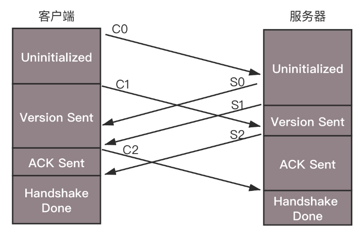

整个推流的过程

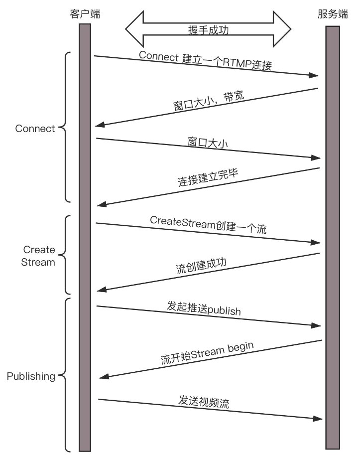

**分发网络**分为**中心**和**边缘**两层，边缘层服务器部署在全国各地及横跨各大运营商，和用户距离近。中心层是流媒体服务集群，负责内容的转发。智能负责均衡系统，根据用户的地于是位置信息，就近选择边缘服务器，为用户提供推/拉流服务。**中心层也负责转码服务**，比如将RTMP协议的码流转成HLS码流

#### 拉流：观察的客户端如何看到视频

RTMP拉流的过程如下：

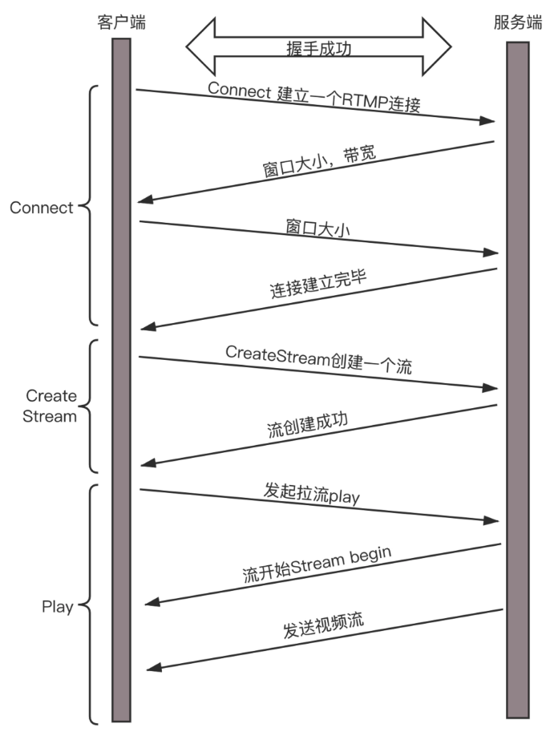

先读到的是 H.264 的解码参数，例如SPS 和PPS，然后对收到的 NALU 组成的一个个帧，进行解码，交给播发器播放，一个绚丽多彩的视频画面就出来了

## P2P协议：我下小电影，99%急死你

### FTP的两种工作模式

FTP采用**两个TCP连接**来传输一个文件“

1. 控制连接：服务器以被动的方式，打开用于FTP的端口21，客户端主动发起连接，该连接将命令从客户端传给服务器，并传回服务器的应答
2. 数据连接：每当一个文件在客户端与服务器之间传输时，就创建一个数据连接

FTP有两种工作模式：**主动模式（PORT）**和**被动模式（PASV）**

**主动模式下**，客户端随机打开一个大于1024的端口N，向服务器的命令端口21发起连接，同时开放N+1端口监听，并向服务器发送”port N+1“命令，由服务器从自己的数据端口20，主动连接到客户端指定的端口N+1

**被动模式下**，当开启一个FTP连接时，客户端打开两个任意的本地端口N（大于1024）和N+1。第一个端口连接服务器的21端口，提交PASV命令，然后服务器会开启一个任意的端口P（大于1024），返回”227 entering passive mode“消息，里面有FTP服务器开放的用来进行数据传输的端口，客户端收到消息并取得端口之后，就会通过N+1端口连接服务器的P端口，然后进行数据传输

### P2P是什么

解决单一服务器的带宽压力问题

### 种子（.torrent）文件

由两部分组成：

- announce（tracker URL）
- 文件信息
  - info区：有几个文件、文件有多长、目录结构以及目录和文件的名字
  - Name字段：顶层目录的名字
  - 每个段大小：BT协议把一个文件分成很多个小段，然后分段下载
  - 段哈希值：将整个种子中，每个段的SHA-1哈希值拼在一起

BT客户端解析.torrent文件，得到tracker地址，然后连接tracker服务器，tracker服务器会将其他下载者的IP提供给下载者，然后双方交换对方没有的数据

虽然下载的过程是去中心化的，但加入这个P2P网络，是需要借助tracker中心服务器，这个服务器是用来登记有哪些用户请求哪些资源，一但tracker服务器故障，BT工具就无法正常工作了

### 去中心化网络（DHT）

每个加入DHT网络的人，都要负责存储这个网络里的资源信息和其他成员的联系信息，相当于所有人一起构成了一个庞大的分布式存储数据库

**其中一种著名的DHT协议，叫Kademlia协议**

## DNS协议：网络世界的地址簿

### DNS服务器的树状态结果

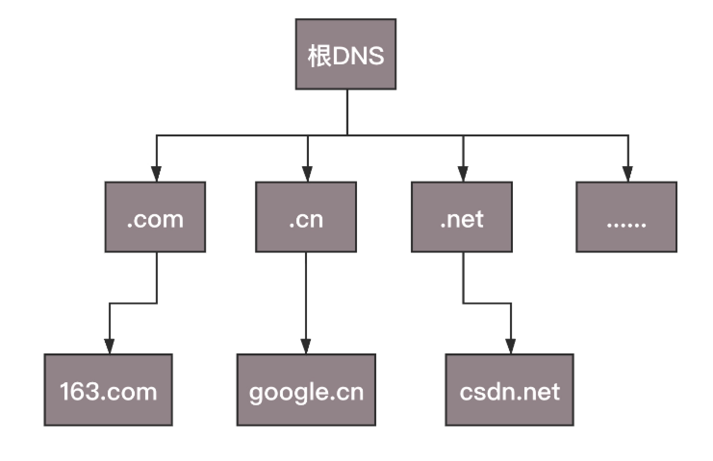

### DNS解析流程

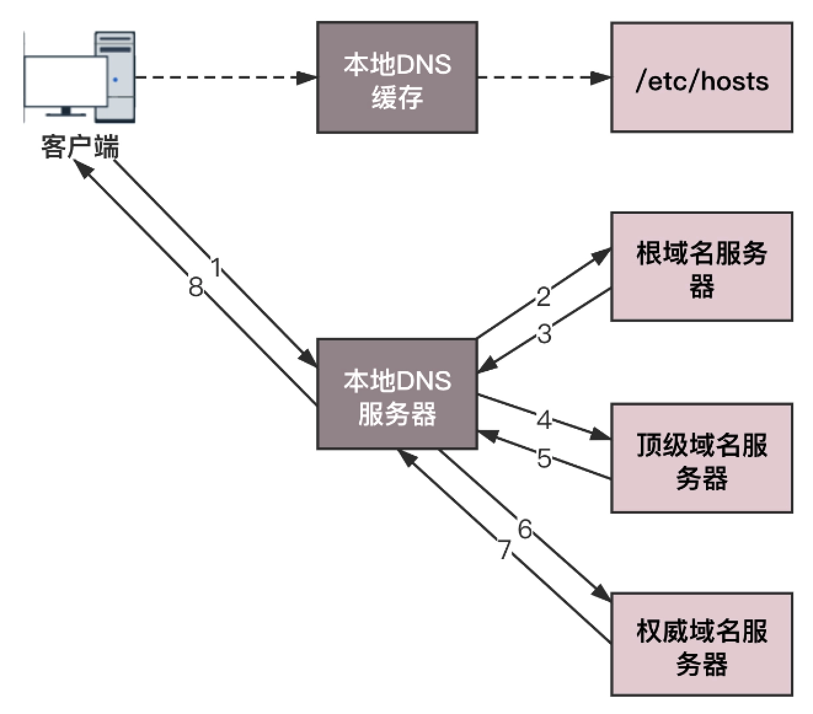

### DNS负载均衡

- 内部负载均衡（SLB, Server Load Balancer）
- 全局负戴均衡（GSLB, Global Server Load Balancer）

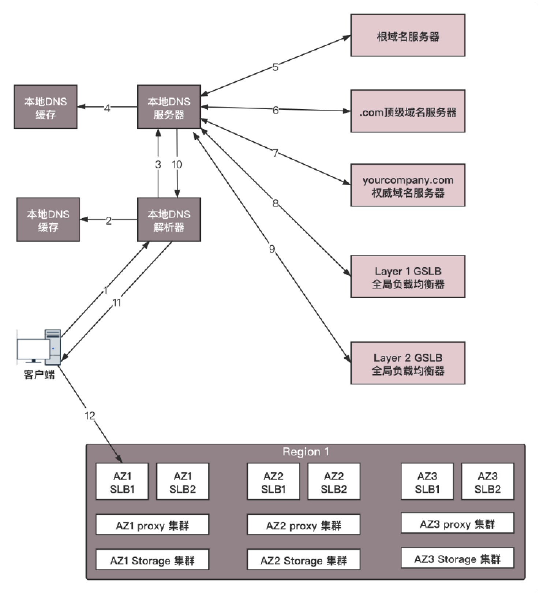

## HttpDNS：网络世界的地址簿也会指错路

### 传统DNS存在的问题

1. 域名缓存的问题
2. 域名转发问题
3. 出口NAT问题
4. 域名更新问题
5. 解析延迟问题

### HttpDNS

基于HTTP协议的DNS服务器集群，分布在多个地点和多个运营商，当客户端需要DNS解析的时候，直接通过HTTP协议进行请求这个服务器集群，得到就近的地址

#### 工作模式


#### 缓存设计——解决解析速度和更新速度的平衡问题

- 同步更新：Cache-Aside机制，先读缓存，不命中再读数据库，同时将结果写入缓存

  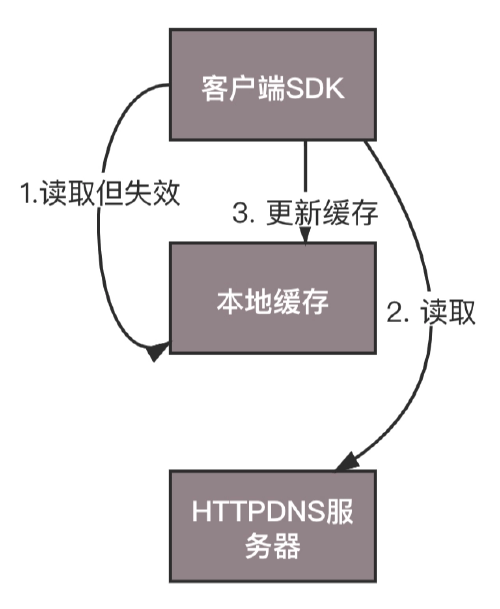

- 异步更新——Refresh-Ahead机制，即业务仅仅访问缓存，当过期的时候定期刷新，对于多个缓存访问不命中从而引发并发回源的情况，可以采取另一个请求回源的模式

  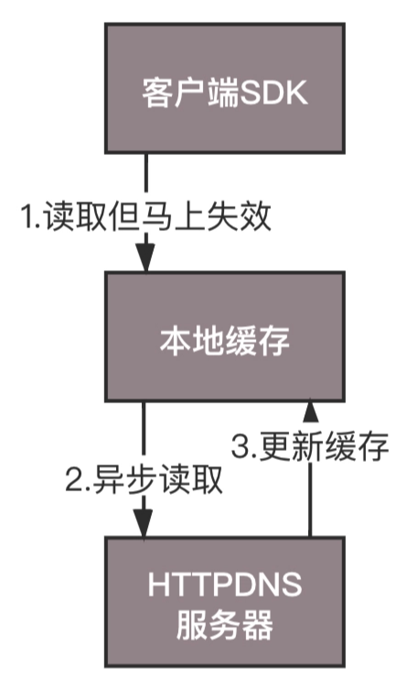

#### 调度设计——解决智能调度的问题

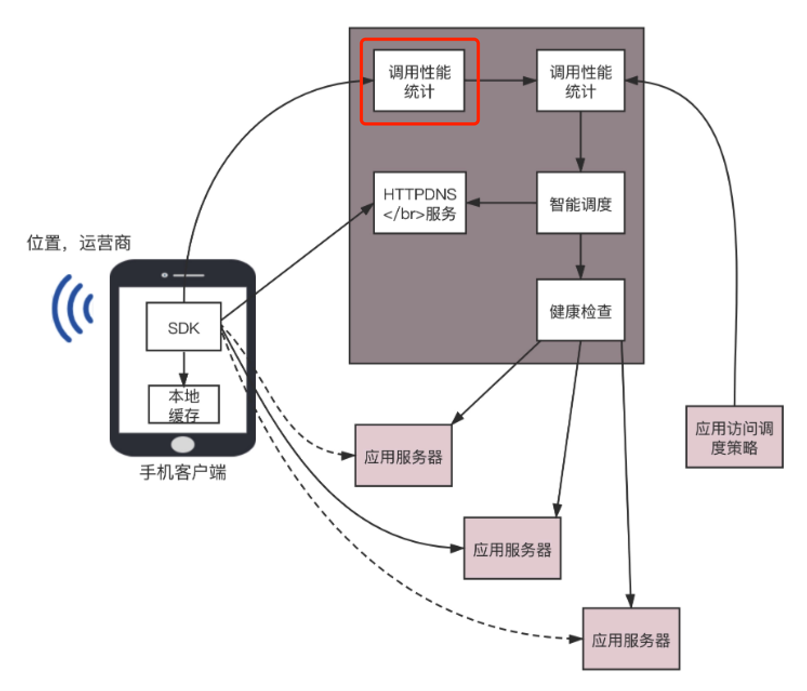

## CDN：你去小卖部取过快递么？

