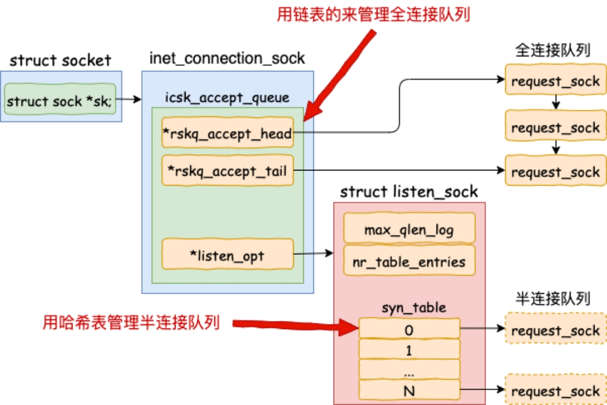
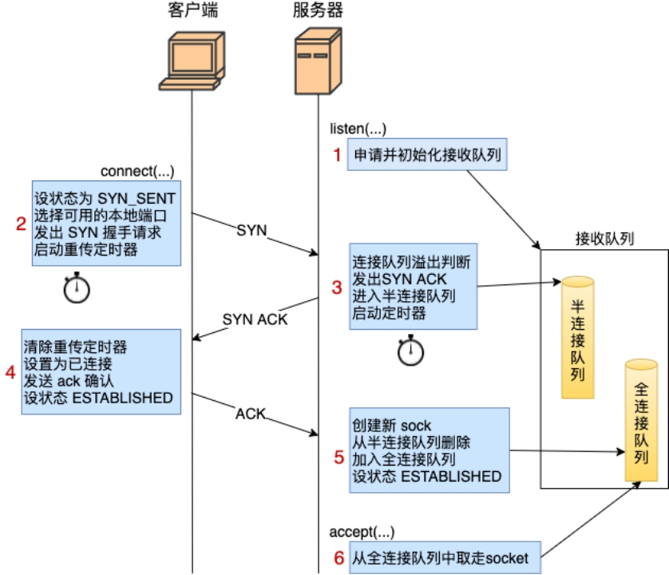

# 开发内功修炼营

## 01-三次握手内部实现原理

1. bind-将创建的socket与IP、端口进行关联

   

2. listen-准备半连接队列（完成第一次握手）与全连接队列（完成第三次握手）

3. connect-选择本地端口（即TCP包中的源端口）

   ```bash
   # 可以查看本地IP+端口与目的IP+端口列表
   ss -ant | grep <端口口>
   ```

4. accpet-完成三次握手后，系统内核会创建新的socket并从半连接队列删除，同时加入全连接队列，而accept则是从全连接队列中取走socket

   



## 02-常见三次握手网络异常

