# AST在解析咪咕js-sdk中的应用

## 1. 背景

针对特定的业务场景（短验B模式），为优化用户体验、提升业务订购转化率，需要了解咪咕的js-sdk中的具体业务逻辑，从而针对性的优化，但咪咕js-sdk所涉及的两个核心js文件进行了一些混淆处理，直接阅读源码比较困难，这里提供了其中一个js文件（代码量较少，方便分析）的[链接](https://m.12530.com/order/pub-ui/js/and/migus.js)

*如果访问不了，请使用手机网络代理，咪咕做了些处理，触发特定规则之后可能会封IP*

下载该js文件，通过vscode打开并格式化，大概浏览下（咪咕的js代码偶有调整，当前的版本格式化后为1700余行），整个代码的结构分为两部分：变量声明+IIFE，在IIFE中通过一个工厂函数来给暴露到全局的`migusdk`对象添加属性和方法：

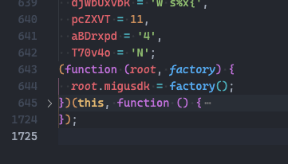

而这个工厂函数里，主要是结合for循环+switch...case语句的嵌套（这种混淆方式的特点）来声明私有函数及给migusdk添加属性和方法：

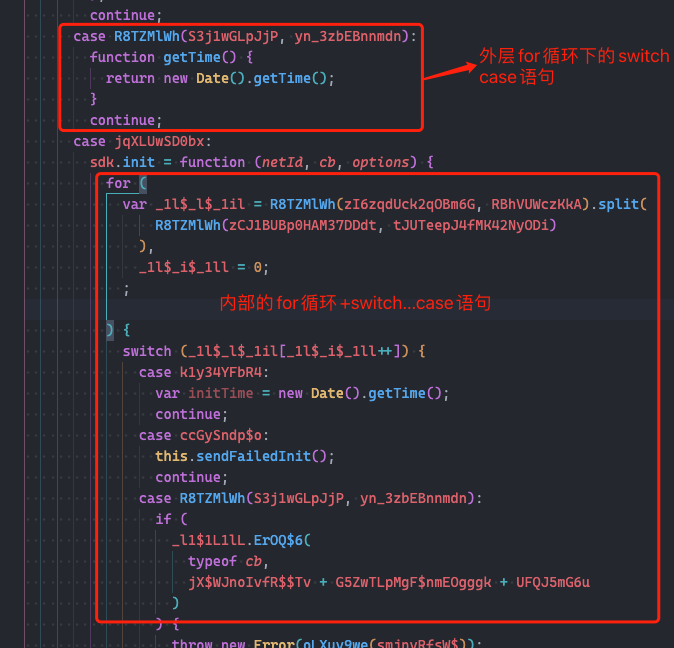

更多细节有兴趣的同学可以直接查看源码

## 2. 思路

首先，靠人工“翻译”的方式肯定不可行，费时费力，而且源码一旦调整就意味着要从头开始翻译……

转换一下思路，无论使用何种方式进行了混淆，它都是一段可以在浏览器正常执行的js代码，那是否可以模拟js执行过程来进行“还原”，举个简单的例子：

```javascript
// 这里只是举例
var dsbtviyOR4Dp136Xb = '_s',
  JHK8gqk0LxL1 = 'pyzy',
  UfLd4MMf0LHM3EQn = 'xywwyMGu|kw 0',
// ... 
sdk.log(dsbtviyOR4Dp136Xb + JHK8gqk0LxL1 + UfLd4MMf0LHM3EQn)
```

其执行结果与下面的代码是等价的

```javascript
// ... 
sdk.log('_spyzyxywwyMGu|kw 0')
```

并且源码中头部声明的这些变量，在使用上也是符合这种预期的（只读常量），那我们不妨先将头部这些变量声明替换掉，说不定会豁然开朗

说到这里，对于日常和“构建”这一过程打交道的前端同学一定能想到，这个模式不就是我们使用babel将ES6代码转译ES5代码的过程吗：输入一段代码，经过一系列处理，输出另一段代码

babel正是我们需要的工具，虽然大家日常工作中经常使用到babel，但有些同学可能对于它的原理不是那么了解，这里先简单介绍下

## 3. Babel与AST

babel转译代码的过程分为三步：parse、transform、generate

### 3.1 parse

parse用于将源码转换成一种方便程序理解和处理的数据结构，这种数据结构正是抽象语法树（Abstract Syntax Tree，AST），比如对于`const fruit = "apple";`对应的AST大致如：


图中省略了一些细节，比如这里使用了`const`来声明变量，那对于`VariableDeclaration`节点的`kind`属性，其值为`const`，即表示当前定义的是一个常量

完整的AST可以使用[astexplorer](https://astexplorer.net/)来查看，比如上面的例子

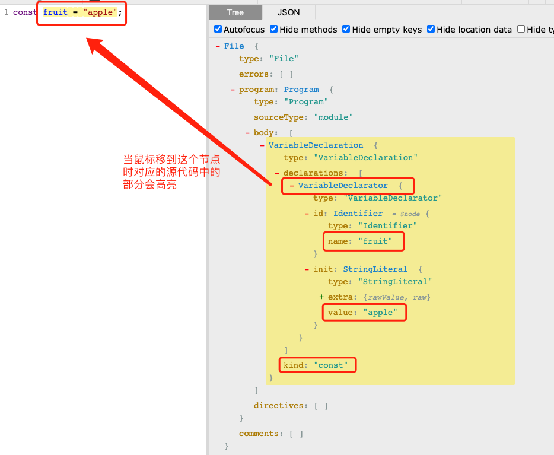

### 3.2. transform

在拿到parse阶段输出的AST后，就可以遍历AST，找到目标节点，然后修改它。如何遍历？babel使用了**访问者模式**，它的作用是将操作于特定类型数据结构的逻辑与数据结构本身解藕，babel提供的用于遍历AST的API如下：

```javascript
traverse(ast, visitor)
```

这里的visitor对象的key对应节点的类型名称，value就是操作该节点的函数（这其实是一种省略写法，如果需要更细粒度的控制，这里的value可以定义为以enter和exit为key的对象，它们对应的value是操作节点的函数，分别表示在遍历时进入节点和退出节点时的执行逻辑，当使用省略写法时，默认作为enter来使用了），比如：

```javascript
traverse(ast, {
  VariableDeclarator: {
    enter: path => {},
    exit: path => {},
  }
})
```

或

```javascript
traverse(ast, {
	VariableDeclarator: path => {},
})
```


这里的path表示遍历时的路径信息（它拥有非常多的属性和方法，功能很强大），通过它可以方便的访问当前节点信息、父路径、作用域以及修改节点信息等等，后面会结合实例说明

### 3.3 generate

在该阶段，我们将修改后的AST再次还原成目标代码（即字符串），同时会生成sourcemap（用于记录）

## 4. 实战

### 4.1 替换变量声明

按之前的描述，咪咕的js文件的第一部分均为变量声明（基本为常量），我们不妨先从这入手，将这些常量全部替换为对应的字面量，看看替换后的js在可读性上有没有什么变化

```javascript
const { parse } = require('@babel/parser');
const traverse = require('@babel/traverse').default;
const generator = require('@babel/generator').default;
// 提供了一些工具函数
const types = require('@babel/types');
```

分别从`@babel`下对应的包中导入我们需要的方法，示例代码中的`parse`、`traverse`、`generator`分别用于完成前文提到的代码处理的三个阶段

```javascript
const source = fs.readFileSync(path.resolve(__dirname, './migu.js'), {
  encoding: 'utf8',
});

const ast = parse(source);
```

这里我们以字符串的形式读入咪咕的js代码，并通过`parse`方法完成第一阶段的任务，拿到ast

接下来就是进行transform阶段，遍历ast，修改对应的节点，最后输出修改后的代码，我们先把代码框架搭好

```javascript
// 访问器
const visitor = {
  // 待补充
};
// 遍历并修改ast节点
traverse(ast, visitor);
// 生成代码，这里我们不需要sourcemap
const { code } = generator(ast);
// 将生成的代码写入文件
fs.writeFileSync(path.resolve(__dirname, './dist.js'), code, {
  encoding: 'utf8',
});
```

核心逻辑就是在visitor中，想要将常量替换成对应的字面量，就需要遍历所有变量声明的节点，如下：

```javascript
const VariableDeclarator = {
  // 在进入节点时进行处理
  enter: path => {
  	// 针对 VariableDeclarator 节点的具体处理逻辑
  }
}

const visitor = {
  // 变量声明的节点类型名称
  VariableDeclarator,
}
```

这里的`VariableDeclarator`是ast中预先定义好的类型名，可以通过查看babel官方的类型声明，也可以直接通过astexplorer来查看，比如

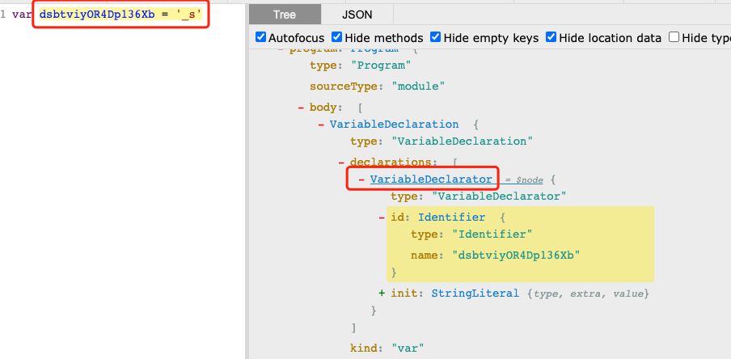

具体针对`VariableDeclarator`节点的处理逻辑（只保留了核心逻辑）：

```javascript
/**
 * @type {import("@babel/traverse").TraverseOptions['VariableDeclarator']}
 */
const VariableDeclarator = {
  enter: path => {
    // id对应上图中的`Identifier`节点，表示“变量标识符”
    const id = path.node.id;
    // init对应上图中的`StringLiteral`节点，表示“字符串字面量”
    const init = path.node.init;
		// 拿到标识符的名称，即"dsbtviyOR4Dp136Xb"
    const { name } = id;
    // 查看该变量被引用的地方
    const binding = path.scope.getBinding(name);
    
    // 判断变量的初始值类型是不是一个字面量，同时它是一个常量
    if (types.isLiteral(init) && binding.constant) {
      // 获取具体的值，即“_s”
      const { value } = init;
      // 查找该变量所有被引用的地方
      for (let referPath of binding.referencePaths) {
        // 将引用处的节点（类型为"Identifier"）替换为字面量类型的节点
        referPath.replaceWith(types.valueToNode(value));
      }
      // 遍历完之后删除该变量声明节点，非必须，删除后代码简洁一些
      path.remove();
    }

    // 全局函数声明的处理
    if (types.isFunctionExpression(init) && path.scope.uid === 0) {
      try {
        // 将函数添加到当前的上下文中，后面会使用到
        eval(path.toString());
        path.remove();
      } catch {}
    }
  },
};
```

结合注解，相信上面的代码都不难理解，上述代码29行处解释一下，咪咕的变量声明的地方，还有函数的声明，比如：

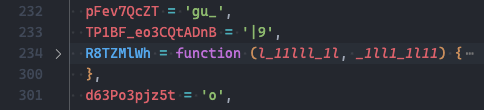

以及实际调用的地方：

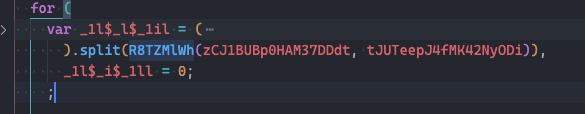

这里的思路是将其声明到全局上下文中，在后续处理函数调用节点（CallExpression）的l逻辑就可以直接使用eval函数来获取执行结果了

到此关于常量替换的逻辑就处理完了，执行代码后可以看到这一步处理生成的js代码，其中引用常均进行了替代：

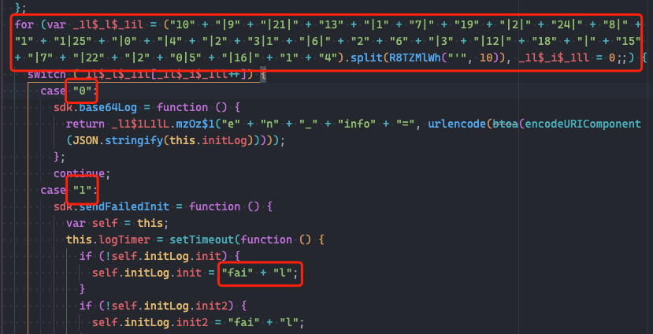


### 4.2 字符串字面量拼接

承接上一步，我们现在要完成字符串字面量的拼接，通过astexplorer可以看到，这里需要对BinaryExpression（二元表达式）类型节点进行处理，直观的看，逻辑很简单：如果表达的左值与右值都是字面量，则将整个表达式替换为运算结果，但实际上真的如此吗？

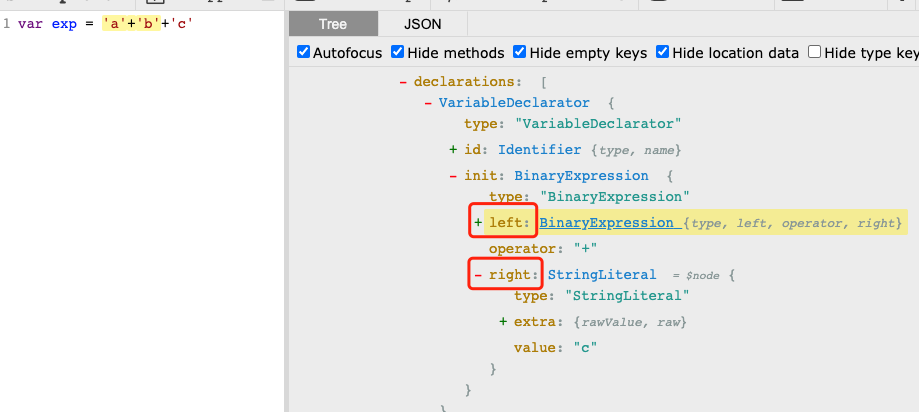

可以发现对于`'a'+'b'+'c'`这种，它的树结构其实是这样的：

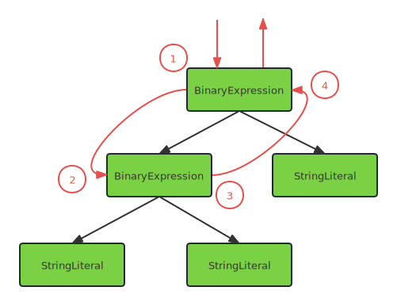

红色标记了节点的访问顺序，也就是说按常规的顺序访问时，先访问最上层的BinaryExpression节点，而它的左值是另一个BinaryExpression节点，无法直接进行字符串字面量的加法运算，理想的情况是先处理左下方BinaryExpression节点，替换为运算后的字符串字面量，再向上递归处理顶端的BinaryExpression节点，如何实现这样的遍历顺序？这要需要用到前文提到的遍历节点的时机，即`enter`与`exit`，具体代码如下：

```javascript
/**
 * @type {import("@babel/traverse").TraverseOptions['BinaryExpression']}
 */
const BinaryExpression = {
  // 在离开该节点时进行处理
  exit: path => {
    debug(`BinaryExpression path: ${path.toString()}`);
    // 左值、右值、运算符
    const { left, right, operator } = path.node;
    // 左值和右值均为字面量或是全局变量
    if (
      (types.isLiteral(left) ||
        (types.isIdentifier(left) && left.name in global)) &&
      (types.isLiteral(right) ||
        (types.isIdentifier(right) && right.name in global))
    ) {
      let result = null;
      const leftValue = types.isLiteral(left) ? left.value : left.name;
      const rightValue = types.isLiteral(right) ? right.value : right.name;
      // 直接按operator所表示的值进行运算
      switch (operator) {
        case '+':
          result = leftValue + rightValue;
          break;
        case '-':
          result = leftValue - rightValue;
          break;
        case '*':
          result = leftValue * rightValue;
          break;
        case '/':
          result = leftValue / rightValue;
          break;
        case '<<':
          result = leftValue << rightValue;
          break;
        case '==':
          result = leftValue == rightValue;
          break;
        case '===':
          result = leftValue === rightValue;
          break;
        case '!=':
          result = leftValue != rightValue;
          break;
        case '!==':
          result = leftValue !== rightValue;
          break;
        default:
          throw new Error(
            `unhandled operator(${operator}) in BinaryExpression(${path.toString()})!`
          );
      }
      if (result === null) {
        return;
      }
      
      // 将整个表达式替换为运算后的结果
      path.replaceWith(
        Number.isNaN(result)
          ? types.Identifier('NaN')
          : types.valueToNode(result)
      );
    }
  },
};
```

```javascript
const visitor = {
  VariableDeclarator,
  // 新增
  BinaryExpression,
}
```

再次执行转译可以查看本次的执行结果

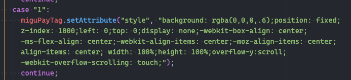

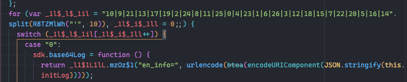

### 4.3 函数及方法调用的替换

使用astexplorer查看下面的语句：

```javascript
"10|9|21|14".split(R8TZMlWh("'", 10))
```

其AST如下图所示：

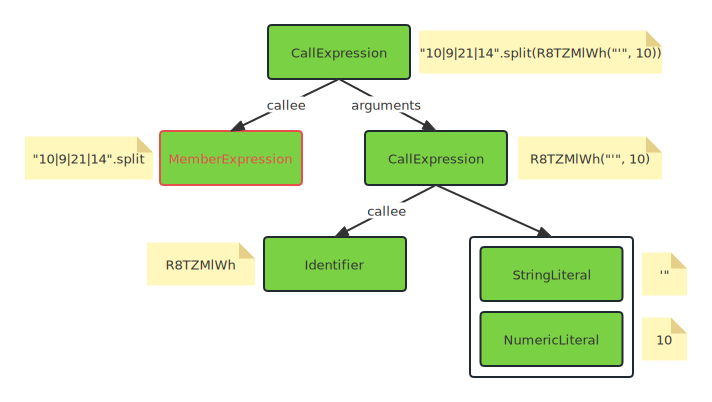

从图中可知，无论是方法调用（开如`a.b(c)`）还是函数调用（形如`a(b)`），其节点类型都是CallExpression，需要根据`callee`的节点类型来进行区分，即代码的结构应为：

```javascript
/**
 * @type {import("@babel/traverse").TraverseOptions['CallExpression']}
 */
const CallExpress = {
	// 考虑嵌套调用，这里也使用后序遍历的模式
  exit: path => {
    debug(`CallExpression path: ${path.toString()}`);
    const { callee, arguments: args } = path.node;
    let result = null;
    
    if (types.isIdentifier(callee)) {
    	// 函数调用的处理
    }
    
    if (types.isMemberExpression(callee)) {
    	// 方法调用的处理
    }
    
    if (result === null) {
      return;
    }
		
    // 路径替换为执行后的结果
    path.replaceWith(types.isNode(result) ? result : types.valueToNode(result));
  }
}
```

#### 4.3.1 处理函数调用

```javascript
if (types.isIdentifier(callee)) {
  // 获取函数名
  const { name } = callee;
  // 判断是否是全局函数，如果是则直接调用并拿到执行结果
  if (name in global) {
    result = evalExp(path.toString());
  } else {
    // 查找标识符，比如当前作用域中新定义的函数
    const binding = path.scope.getBinding(name);
    if (binding) {
      // 找到函数定义
      const func = binding.path.toString();
      // 声明函数
      evalExp(func);
      // 执行函数并拿到执行结果
      result = evalExp(path.toString());
    }
  }
}
```

代码比较简单，这里只提及两个点：

1. 关于全局函数，除了类似`parseInt`这种运行时提供的全局函数，在之前处理`VariableDeclarator`节时，我们也将全局声明的函数通过`eval`函数添加到当前运行时的全局环境中
1. evalExp的内容除了做了一层`try...catch...`外，还做了些特殊处理，比如表达式是否是幂等的（比如表达式中有类似时间戳、随机数等），是否跳过执行获取结果（比如setTimeout、Error等），因为这里我没有考虑的那么全面，只是根据执行的结果不断优化，所以就不贴出具体代码了，以免误导大家


