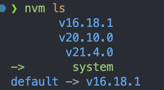

# VitePress官方文档

## 一、起步

### 1.1 Node.js版本要求

**Node.js版本要求18及以上**

如果是通过`nvm`安装了多个node.js版本，并且默认版本不是满足要求的node.js版本，可以在当前项目目录下添加`.nvmrc`配置，指定当前项目所使用的node.js版本



```bah
echo 'v21' > .nvmrc
```

**VitePress只支持ESM**

即不允许通过`require()`来引入，所以要么在`package.json`中设置`"types": "module"`，要么将文件名后缀修改为".mjs"或".mts"

### 1.2 使用方式

- 现有项目中集成：`pnpm add -D vitepress`
- 使用引导创建新的vitepress项目：`pnpm vitepress init`

### 1.3 目录结构

1. `.vitepress`目录作为vitepress的保留目录，里面保存了vitepress相关的**配置文件（`config.mts`）、开发服务器的缓存（cache目录）、构建产物（dist目录）以及主题自定义配置相关的逻辑**

2. **project root**：

3. `.vitepress`外层的`.md`文件都被认为是源文件，最终会编译成`.html`，其中`index.md`会编译成`index.html`并直接通过使用网站的根目录（"/"）来访问

   **PS：VitePress支持路径覆写、动态生产页面等能力**

## 二、路由处理

### 2.1 基于文件目录的路由机制

### 2.2 根目录及源文件目录

1. 根目录，即`project root`，vitepress据此来查找`.vitepress`目录（前文提到了它的作用）

2. 当通过命令行使用`vitepress dev`或`vitepress build`时，会以当前目录作为根目录，也可以通过如`vitepress dev docs`来指定以`docs`目录作为根目录来启动项目

3. 根目录会影响最终生成的页面的访问路径，因为vitpress使用的基于文件目录的路由机制，如下目录结构

   ```
   .
   ├─ docs                    # project root
   │  ├─ .vitepress           # config dir
   │  ├─ getting-started.md
   │  └─ index.md
   └─ ...
   ```

   `docs`是根目录 ，所以`docs/index.md`最终访问时的路径为`/index.html`

### 2.3 链接跳转

1. 可以使用相对路径与绝对路径
2. 建议省略`.md`和`.html`这样的后缀，尽管它们都可以正常工作，但省略后VitePress才能根据配置文件生成最终的URL

### 2.4 路由重写

```typescript
// .vitepress/config.js
export default {
  rewrites: {
    'packages/pkg-a/src/pkg-a-docs.md': 'pkg-a/index.md',
    'packages/pkg-b/src/pkg-b-docs.md': 'pkg-b/index.md'
  }
}

// 支持动态路由参数
export default {
  rewrites: {
    'packages/:pkg/src/(.*)': ':pkg/index.md'
  }
}
```

### 2.5 动态路由

```bash
.
└─ packages
   ├─ [pkg].md         # route template
   └─ [pkg].paths.js   # route paths loader
```

`[pkg]`为参数，最终构建出的页面取决于`[pkg].paths.js`中的内容：

```javascript
// packages/[pkg].paths.js
export default {
  paths() {
    return [
      { params: { pkg: 'foo' }},
      { params: { pkg: 'bar' }}
    ]
  }
}
```

更复杂的场景：

```bash
.
└─ packages
   ├─ [pkg]-[version].md
   └─ [pkg]-[version].paths.js
```

```javascript
export default {
  paths: () => [
    { params: { pkg: 'foo', version: '1.0.0' }},
    { params: { pkg: 'foo', version: '2.0.0' }},
    { params: { pkg: 'bar', version: '1.0.0' }},
    { params: { pkg: 'bar', version: '2.0.0' }}
  ]
}
```

生成：

```bash
.
└─ packages
   ├─ foo-1.0.0.html
   ├─ foo-2.0.0.html
   ├─ bar-1.0.0.html
   └─ bar-2.0.0.html
```

## 三、部署发布

### 1. 虚拟目录

默认是以域名下的根目录来访问的，可以通过配置项`base`来指定虚拟目录 

## 四、Markdown扩展

### 1. 前言（FrontMatter）

支持开箱即用的`YAML frontmatter`

### 2. 目录（Table of Contents）

```
[[toc]]
```

### 五、静态资源处理

1. 所有markdown文件都会被编译为vue组件，并且通过vite来处理，**所以可以（应当）通过相对路径来引用静态资源（或是基于project root的绝对路径）**

2. 所以被引用的资源都拷贝到输出目录，并对文件名添加hash，未引用的资源不会拷贝

3. 小于4kb的图片会进行base64内联处理——可以通过vite的配置来修改此行为

4. 位于`public`目录下的资源不会进行特殊处理，原封不动的拷贝至输出目录

5. 如果设置了`base`配置项，对于静态文件无需处理，但对于动态的部分，则需要使用`withBase`这个工具函数

   ```vue
   
   ```

   ```vue
   <script setup>
   import { withBase, useData } from 'vitepress'
   
   const { theme } = useData()
   </script>
   
   <template>
     
   </template>
   ```


## 六、基于YAML语法的文档前言

VitePress支持YAML语法的的前言（利益于gray-matter这个库），但它必须位于markdown文件内容的最前面，并且使用如下格式：

```yaml
---
title: Docs with VitePress
editLink: true
---
```

默认主题配置中也有关于前言部分的配置项，并且你可以自定义前言部分的结构，并通过`$frontmatter`这个全局变量在页面中动态获取对应的值

```markdown
---
title: Docs with VitePress
editLink: true
---

# {{ $frontmatter.title }}

Guide content
```

也可以在`<script setup>`中通过`useData()`这个API来获取相应的值

**VitePress同样支持json格式的前言声明**

```markdown
---
{
  "title": "Blogging Like a Hacker",
  "editLink": true
}
---
```

## 七、在markdown中使用Vue

每个markdown文件最终都会通过`Vue-Single-File Component`处理编译成HTML文件，所以可以使用Vue中的任何特性

- 推荐使用`<style module>`而不是`<style scoped>`

- 可以通过`useDate`这个API来访问页面的元数据，包括前面提到的”前言“中的数据

- 引入组件，如果一个组件只被个别页面使用，推荐通过`import`显式引入，这可以做到按需加载，如果一个组件被广泛使用，则可以进行全局注册

- 关于转义

  1. 通过`v-pre`指令

     ```
     This <span v-pre>{{ will be displayed as-is }}</span>
     ```

     输出

     ```
     {{ This will be displayed as-is }}
     ```

  2. 通过`js-vue`

     ````
     ```js-vue
     Hello {{ 1 + 1 }}
     ```
     ````

     输出

     ```
     Hello 2
     ```

- 内置支持CSS pre-processor，包括：.scss、.sass、.less、.styl、.stylus

- 使用VitePress的运行时API`useData`

  ```javascript
  <script setup>
  import { useData } from 'vitepress'
  
  const { page } = useData()
  </script>
  
  <pre>{{ page }}</pre>
  ```

  输出

  ```json
  {
    "path": "/using-vue.html",
    "title": "Using Vue in Markdown",
    "frontmatter": {},
    ...
  }
  ```

## 八、使用自定义主题

当`.vitepress`目录下存在`theme/index.ts`或`theme/index.js`，VitePress就会优先使用自定义主题，当然也可以选择**扩展默认主题**来进行自定义

自定义主题是通过如下的接口来定义的：

```typescript
interface Theme {
  /**
   * Root layout component for every page
   * @required
   */
  Layout: Component
  /**
   * Enhance Vue app instance
   * @optional
   */
  enhanceApp?: (ctx: EnhanceAppContext) => Awaitable<void>
  /**
   * Extend another theme, calling its `enhanceApp` before ours
   * @optional
   */
  extends?: Theme
}

interface EnhanceAppContext {
  app: App // Vue app instance
  router: Router // VitePress router instance
  siteData: Ref<SiteData> // Site-level metadata
}
```

在`theme/index.ts`中需要以默认导出的方式导出一个满足此接口定义的对象

### 创建一个Layout

最基本的布局组件中只需要包括一个`<Content />`组件，经常VitePress处理，它会被替换为markdown渲染后的内容

并且通过`useData()`可以获取一些运行时的数据，比如页面的元数据、前言上定义的字段，从而可以实现下面的效果：

```vue
<script setup>
import { useData } from 'vitepress'
import NotFound from './NotFound.vue'
import Home from './Home.vue'
import Page from './Page.vue'

const { page, frontmatter } = useData()
</script>

<template>
  <h1>Custom Layout!</h1>

  <NotFound v-if="page.isNotFound" />
  <Home v-if="frontmatter.layout === 'home'" />
  <Page v-else /> <!-- <Page /> renders <Content /> -->
</template>
```

可以利用`Runtime API`以及`Build-Time Data Loading`实现一些由数据驱动的布局

## 九、扩展默认主题

虽然默认主题针对文档类型的内容做了很多优化，但当有以下场景的需求时，就可以考虑扩展默认主题：

1. 调整CSS样式
2. 修改Vue实例，比如注册全局组件
3. 通过Layout提供的一些插槽来向主题注入自定义的内容‘

### 自定义CSS

通过向`theme/index.js`中import指定的CSS文件，并在CSS文件中覆盖默认主题提供的CSS变量来覆盖

### 注册全局组件

```typescript
// .vitepress/theme/index.ts
import type { Theme } from 'vitepress'
import DefaultTheme from 'vitepress/theme'

export default {
  extends: DefaultTheme,
  enhanceApp({ app }) {
    // register your custom global components
    app.component('MyGlobalComponent' /* ... */)
  }
} satisfies Theme
```

### 布局插槽

```javascript
// .vitepress/theme/index.js
import DefaultTheme from 'vitepress/theme'
import MyLayout from './MyLayout.vue'

export default {
  extends: DefaultTheme,
  // override the Layout with a wrapper component that
  // injects the slots
  Layout: MyLayout
}
```

```vue
<!--.vitepress/theme/MyLayout.vue-->
<script setup>
import DefaultTheme from 'vitepress/theme'

const { Layout } = DefaultTheme
</script>

<template>
  <Layout>
    <template #aside-outline-before>
      My custom sidebar top content
    </template>
  </Layout>
</template>
```

[这里](https://vitepress.dev/guide/extending-default-theme#layout-slots)可以查看所有插槽

## 十、Build-Time Data Loading

VitePress提供一个称作”data loaders“的特性，它允许你加载任意数据并导入到页面或组件中，**但数据加载这一操作是在构建时执行的**，其结果会被序列化为JSON并最终生成一个javascript bundle

data loader文件必须以`.data.js`或`.data.ts`作为扩展名，且必须提供一个拥有`load()`方法的对象作为默认导出

```javascript
// example.data.js
export default {
	load() {
    return {
      hello: 'world'
    }
  }
}
```

该模块只在node.js环境下执行，所以你**可以导入node.js原生或npm上的包**

在使用时，直接在`.md`文件或`.vue`组件中直接通过`data`具名导出来使用：

```vue
<script setup>
import { data } from './example.data.js'
</script>

<pre>{{ data }}</pre>
```

**data loader支持使用`async...await...`语法**

```javascript
export default {
  async load() {
    // fetch remote data
    return (await fetch('...')).json()
  }
}
```

### 数据来源为本地文件

当你的数据是基于本地文件时，可以使用这种方式，比如扫目录下的markdown文件，然后生成一个数据

```javascript
import fs from 'node:fs'
import { parse } from 'csv-parse/sync'

export default {
  watch: ['./data/*.csv'],
  load(watchedFiles) {
    // watchedFiles will be an array of absolute paths of the matched files.
    // generate an array of blog post metadata that can be used to render
    // a list in the theme layout
    return watchedFiles.map((file) => {
      return parse(fs.readFileSync(file, 'utf-8'), {
        columns: true,
        skip_empty_lines: true
      })
    })
  }
}
```

### `createContentLoader`

对内容向的页面，比如博客，虽然可以直接使用`data loader api`，但考虑到这个是一个比较通用的场景，VitePress也提供了一个工具`createContentLoader`来简化这个场景

```javascript
// posts.data.js
import { createContentLoader } from 'vitepress

export default createContentLoader('post/*.md', /* options */)
```

这个工具函数的第一个参数是一个`glob pattern`，从`source directory`指定的位置进行匹配，最终返回一个`{ watch, load }`这样的`data loader object`，**它会自动过滤非markdown文件**

加载的数据被组成成一个对象数组的，其类型为`ContentData[]`

```typescript
interface ContentData {
  // mapped URL for the page. e.g. /posts/hello.html (does not include base)
  // manually iterate or use custom `transform` to normalize the paths
  url: string
  // frontmatter data of the page
  frontmatter: Record<string, any>

  // the following are only present if relevant options are enabled
  // we will discuss them below
  src: string | undefined
  html: string | undefined
  excerpt: string | undefined
}
```

使用方式：

```vue
<script setup>
import { data as posts } from './posts.data.js'
</script>

<template>
  <h1>All Blog Posts</h1>
  <ul>
    <li v-for="post of posts">
      <a :href="post.url">{{ post.frontmatter.title }}</a>
      <span>by {{ post.frontmatter.author }}</span>
    </li>
  </ul>
</template>
```

关于`Options`可以参见[这里](https://vitepress.dev/guide/data-loading#options)

### `Configuration`

```typescript
import type { SiteConfig } from 'vitepress'

const config: SiteConfig = (globalThis as any).VITEPRESS_CONFIG
```

## 十一、配置

### 1. Site Config

位置：`<root>/.vitepress/config.[ext]`，`ext`可以是`.js`、`.ts`、`.mjs`、`.mts`

**推荐使用ESM语法**

#### 1.1 title

站点标题，同时也作为单独每个页面标题的默认后缀，单独页面的最终标题为其第一个`<h1>`标签的内容拼接上该配置项作为的后缀（这个是在不配置`titleTemplate`的前提下，如果配置了，则以`titleTemplate`为准 ）

#### 1.2 titleTemplate

可以用来定制每个单独页面的标题后缀或整个标题部分，在使用时可以用`:title`表示单独页面的标题内容占位

#### 1.3 description

站点描述信息

#### 1.4 head

用于自定义网站的`head`部分的内容，其类型为`HeadConfig[]`，默认值是`[]`

```typescript
type HeadConfig =
  | [string, Record<string, string>]
  | [string, Record<string, string>, string]
```
比如这里添加水滴埋点例：

```javascript
head: [
    [
      'script',
      {},
      `!function(e,n,t,a,s,u,c,m){e[a]?e[a].queueName=u:e[a]={queueName:u},e[u]=e[u]||function(){(e[u].q=e[u].q||[]).push(arguments)},e[a].l=1*new Date,c=n.createElement(t),m=n.getElementsByTagName(t)[0],c.async=1,c.src=s,m.parentNode.insertBefore(c,m)}(window,document,"script","_webAnalyst","//s1.voicecloud.cn/resources/anls/wa.js?ver=1.0.3","_wa");_wa('*','set','site','6709dcd729604bbda167d87e15a5276c');`,
    ],
  ],
```

#### 1.5 lang

配置网站语言属性(`<html lang="en-US">`)

#### 1.6 base

用于指定站点的部署的目录 ，默认为`/`，如果部署地址中涉及子目录 ，比如当前我们配置的是`base: '/h5blog/'`，则访问时的地址为`https://kuyin.iflysec.com/h5blog/index`

### 2. Routing

暂时用不上，后续用到了再补

### 3. Build

#### 3.1 srcDir

markdown文件存放的位置，使用相对于项目root的路径

#### 3.2 srcExclude

需要排除的markdown文件，比如

```javascript
export default {
  srcExclude: ['**/README.md', '**/TODO.md']
}
```

#### 3.3 outDir

构建产物输出的目录位置，也是相对于项目root的路径 

#### 3.4 assetsDir

用于指定资源文件输出的位置，它必须位于`outDir`指定的目录之下，并且是相对于它的路径

#### 3.5 cacheDir

缓存文件的位置，一般不用修改，是相对于项目root的路径，默认为`./.vitepress/cache`

#### 3.6 ignoreDeadLinks

暂时用不上，后续用到了再补

#### 3.7 mpa

暂时用不上，后续用到了再补

### 4. Theming

#### 4.1 apperance

是否开启深色模式

- true（默认值）：根据当前用户设置决定是否开启深色模式
- dark：默认使用深色模式，用户可以手动切换
- false：则用户无法切换主题色

至于`apperance.initialValue`只能是`dark`或`undefined`

注意，这里其实是使用了localstorage缓存了上次的配置项，这样在页面加载之前就知道是否要使用深色模式，避免了加载时的闪动，但也导致修改了配置项后，要手动把这个key清掉才会生效

#### 4.2 lastUpdated

暂时用不上，后续用到了再补

### 5. Customization

#### 5.1 markdown

markdown相关的配置，具体见官方文档中的类型声明

#### 5.2 vite

vite的配置项

#### 5.3 vue

@vitejs/plugin-vue的配置项

### 6. Build Hooks

暂时用不上，后续用到了再补

### 7. Default Theme Config

与Default Theme节内容很多相同，主要是用于定制单个文档，暂不考虑使用

### 8. Default Theme Config

挑几个用得到的说明一下

####


