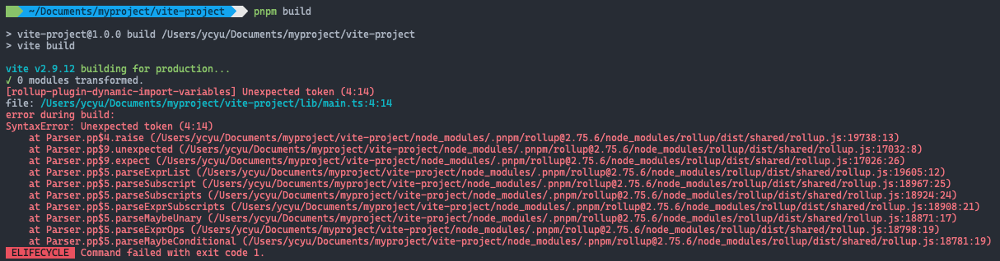

# Vite官方文档摘要

## Guide

### Why Vite

在浏览器支持ESM之前，开发者是没办法直接以模块的方式来组织javascript代码，于是似就出现了“构建”这一概念：通过工具来处理我们以模块方式编写的代码，分析依赖，拆分成一个个可以在浏览器中运行的.js文件，如webpack、rollup以及parcel，这此工具的出现极大的提升了开发体验，但随着应用规模的增加，需要处理的javascript代码量以及模块数量不断增大，这些基于javascript开发的工具很快出现了性能瓶颈，即便是HMR的出现，也解决不了修改一行代码就要等待很长时间的构建更新这一现状。

vite的目标是利用现代浏览器原生支持ESM的特性以及如esbuild这种基于编译成本地代码的可高效执行javascript构建的工具来解决上述问题

#### Slow Servert Start

对于冷启动的dev server，传统基于打包的构建工具会分析依赖并构建完整的应用，然后dev server才可用，而vite的做法是先将应用的所涉及的模块区分为两类：**第三方依赖（可能涉及多种模块规范，比如ESM或CommomJS）**及**应用源代码**

vite使用esbuild将第三方依赖进行预打包，基于Go语言编写的esbuild，按官方宣称其速度是一般基于javascript编写的打包工具的10~100倍

对于应用源代码，vite则直接利用现代浏览器对ESM支持，按需请求，而vite要做的就是根据请求来响应处理后的可在浏览器中直接运行的代码


#### Slow Updates

传统打包构建工具，对于代码的修改，都会去重新构建完成的包产重新加载页面，HMR的出现大大提供的开发体验，但经验实践，HMR的更新速度也会随着应用体积的增长而大大下降

而对于vite，因为它的HMR是基于ESM，当代码修改后，vite只需精准的将被编辑的模块与它最贴近的HMR边界（大多数时候只涉及这个模块自身）之间链条置为无效，这种方式可以保持HMR的更新一直高效，并且和应用的大小无关

vite还利用一些http的头来加速页面的reload，比如涉及强缓存相关的http header

#### Why Bundle for Production

即使是在支持ESM的现代浏览器，在生产环境下使用未打包的ESM仍是低效的（包括使用HTTP/2），因为对于嵌套的import，会有额外的网络请求，而且于生产环境下为了优化加载性能，最好通过tree-shaking、lazy-loading以及common chunk-splitting来进行代码打包

在dev server与生产环境构建下均保证最佳优化输出和行为一致性是不容易的，所以vite提供了预先配置好的构建命令，它们提供了开箱即用的性能优化

#### Why Not Bundle with esbuild？

虽然esbuild对于javascript库的打包非常快，但对于一些打包完整应用所需的重要特性仍在开发中，比如code-splitting以及css的处理，而就目前而言，rollup在这些方面更加成熟和灵活，所以将来等到esbuild的这些特性稳定可用时，不排除在生产环境的构建中使用esbuild

#### How is Vite Different from X?

[click here](https://vitejs.dev/guide/comparisons.html)

### Getting Started

#### Overview

vite旨在针对现代web项目提供一个更快、更精简的开发体验，主要由两部分组成：

- 一个基于ESM的多种增加特性（比如极速的HMR）的dev server
- 一个构建命令，使用rollup打包你的代码，针对生产环境提供一个预先配置好输出高度优化的静态资源

vite提供了开箱即用的合理的配置，但它也支持Plugin API来进行高度扩展，并且它的Javascript API都有很好的类型支持

#### Browser Support

vite默认的构建产物是支持通过script标签引入的ESM以及动态导入的ESM，如果需要支持旧的浏览器可以通过官方的@vitejs/plugin-legacy

#### Trying Vite Online

vite提供了一个在线试用的[功能](https://stackblitz.com/)，支持主流UI框架的模板，包括javascript与typescript

|JavaScript|TypeScript|
|:-:|:-:|
|[vanilla](https://vite.new/vanilla)|[vanilla-ts](https://vite.new/vanilla-ts)|
|[vue](https://vite.new/vue)|[vue-ts](https://vite.new/vue-ts)|
|[react](https://vite.new/react)|[react-ts](https://vite.new/react-ts)|
|[preact](https://vite.new/preact)|[preact-ts](https://vite.new/preact-ts)|
|[lit](https://vite.new/lit)|[lit-ts](https://vite.new/lit-ts)|
|[svelte](https://vite.new/svelte)|[svelte-ts](https://vite.new/svelte-ts)|

#### Scaffolding Your First Vite Project

> vite要求的Node.js版本>=12.2.0，但一些模板要求更高的Node.js版本才能工作

```bash
#通过问题引导安装
pnpm create vite

#指定模板
pnpm create vite my-vue-app --template vue-ts
```

#### Community Templates

除了使用create-vite，vite社区也维护着大量的templates，可以通过诸如[degit](https://github.com/Rich-Harris/degit)这样的工具来使用这些模板搭建项目

#### index.html and Project Root

vite项目中，index.html是作为应用的入口，vite是将index.html视作源码并作为module graph的一部分，index.html中引入的javascript和css都会被vite处理，并且index.html中所包含的URLs都会被重新设置基址，也就不用指定"%PUBLIS_URL%"这样的占位符了

vite与静态资源的http server类型，都一个称作"root"的概念，你所能请求到的资源都是来源此处，后续文档中提到的"root"就是此处的意思，工程源码中的绝对路径都会基于它进行解析，当然vite也支持处理超出这个root范围的依赖

vite现在也支持多页应用，使用多个.html文件作为入口

在直接使用`vite`命令时，是使用当前的工作目录作为root，当然你也可以通过`vite serve some/sub/dir`来直接指定root

#### Command Line Interface

```bash
# 同 vite dev 或 vite serve，启动开发服务
vite
# 构建生产环境产物
vite build
# 本地预览生产环境构建产物
vite preview
```

#### Using Unreleased Commits

如果等不及release版本发布就要体验新的特性，可以直接clone vite的仓库，本地构建并通过link来使用，如下：

```bash
git clone https://github.com/vitejs/vite.git
cd vite
pnpm install
cd packages/vite
pnpm run build
pnpm link --global
```

然后到你的基于vite的工程目录下，运行`pnpm link --global vite`

### Features

如果从最基础的使用上来说，使用vite与使用一个静态http server没什么区别，但vite在原生ES模块导入的基础上提供了很多能力增强，来支持在基于bundle的配置中众多典型的特性

#### NPM Dependency Resolving and Pre-Bundling

原生ES模块导入语法是不支持如下这种裸模块的导入：

```javascript
import { someMethod } from 'my-dep
```

而vite会检查这种导入，并做以下两件事：

- 预打包它们来提升页面的加载速度，同时将CommonJS/UMD规范的模块转成ESM，预打包是通过esbuild来完成的
- 重写import语句，转换成合法的url，比如`/node_modules/.vite/my-dep.js?v=f3sf2ebd`来使浏览器能正确处理它们

这些依赖请求会通过http响应头来进行强缓存

#### Hot Module Replacement

vite提供了一套基于ESM的HMR API，具备HMR能力的框架可以利用这些API来提供快速、精准的更新，并且页面无需重新加载，应用的状态也不会丢失

当你使用`create-vite`创建应用，所选择的模板都已经预先为你设置好了HMR，无需手动配置

#### TypeScript

vite开箱即支持导入`.ts`文件，不过vite只进行转译操作（基于esbuild），并不会进行类型检查，你需要在IDE或构建脚本中进行此步骤，比如使用`tsc --noEmit`或`vue-tsc --noEmit`

这里注意使用TS的[Type-Only Imports and Export](https://www.typescriptlang.org/docs/handbook/release-notes/typescript-3-8.html#type-only-imports-and-export)语法来避免诸如type-only imports被错误打包的问题

##### TypeScript Compiler Options

tsconfig.json中`compilerOptions`下一些配置需要特别注意一下

###### isolatedModules

此项需要设置为`true`，这是因为esbuild只进行代码的转译，并不会关联类型信息，所以它不支持如`const enum`以及隐式的`type only import`这样的特性，将此配置项设置为`true`之后，在使用这些特性时TS就会给出警告

关于isolated modules可以参见[官方文档](https://www.typescriptlang.org/tsconfig#isolatedModules)

但一些库如`vue`并不能很好的与`"isolatedModules": true`一起使用，此时可以使用`"skipLibCheck": true`来临时禁用这个错误

###### useDefineForClassFields

从vite 2.5版本开始，如果typescript编译的target为`ESNext`，则该配置项的值默认为`true`，这与[tsc 4.3.2](https://github.com/microsoft/TypeScript/pull/42663)及后续版本的行为是保持一致的，同时这也是ECMAScript运行时的行为标准，关于这个配置项的解读可以参考[这里](https://www.typescriptlang.org/docs/handbook/release-notes/typescript-3-7.html#the-usedefineforclassfields-flag-and-the-declare-property-modifier)主要涉及的是ES标准中关于`class field`实现的变更对typescript版本行为的影响，可以使用参考链接中的代码来进行实验，同时因为转译生成代码与旧版本的typescript不同，也有些许需要注意的地方，如果你所使用的包非常依赖`class field`这个特性，则你需要小心处理，比如将`useDefineForClassFields`设置为`false`

###### Other Compiler Options Affecting the Build Result

这里主要涉及了一些配合`"isolatedModules": true`以及与UI框架一起使用时的配置项注意事项，参见[这里](https://vitejs.dev/guide/features.html#other-compiler-options-affecting-the-build-result)

##### Client Types

vite的默认类型是针对Node.js的API，如果需要在vite项目的客户端环境中使用类型定义，则需要添加`d.ts`声名文件，并在其中添加：

```javascript
/// <reference types="vite/client" />
```

也可以在`tsconfig.json`中的`compilerOptions.types`节添加`vite/client`，如下：

```json
{
  "compilerOptions:{
		"types": ["vite/client"]
	}
}
```

上述操作会添加如下类型声明：

- 资源的导入，比如导入`.svg`文件
- 自定义环境变量的声明：`import.meta.env`
- HMR API：`import.meta.hot`

#### Vue

vite通过如下插件为Vue提供的最优先的支撑

- Vue 3 SFC：[@vitejs/plugin-vue](https://github.com/vitejs/vite/tree/main/packages/plugin-vue)
- Vue 3 JSX：[@vitejs/plugin-vue-jsx](https://github.com/vitejs/vite/tree/main/packages/plugin-vue-jsx)
- Vue 2：[underfin/vite-plugin-vue2](https://github.com/underfin/vite-plugin-vue2)

#### JSX

vite为`.jsx`及`.tsx`文件提供了开箱即用的支持，JSX的转译也是通过esbuild处理的，默认为React 16风格，对React 17风格的JSX支持参见[这里](https://github.com/evanw/esbuild/issues/334)

vue的用户可以使用官方的@vitejs/plugin-vue-jsx插件，它为Vue3提供包括HMR、全局组件、指令、插槽在内的众多特性

如果不是在React或Vue中使用JSX（比如使用Preact），可以使用esbuild配置项`jsxFactory`和`jsxFragment`定进行定义化，具体可参加esbuild的文档

```javascript
import { defineConfig } from 'vite'

export default defineConfig({
	esbuild: {
    jsxFactory: 'h',
    jsxFragment: 'Fragment'
  }
})
```


可以通过vite提供的配置项`jsxInect`来注入JSX helpers，来避免手动导入模块：

```javascript
import { defineConfig } from 'vite';

export default defineConfig({
  esbuild: {
    jsxInject: `import React from 'react'`
  }
})
```

#### CSS

导入`.css`文件会将其内容通过style标签注入到页面，并提供HMR支持

##### `@import` Inlining and Rebasing

vite已经预置了`postcss-import`来支持`@import` 内嵌，并且`@import`也是遵循vite的别名配置的，此外CSS中的`url()`会自动进行rebase，这些特性在sass和less中也支持

##### PostCSS

只要项目下有PostCSS配置文件（`postcss-load-config`支持的格式，比如`postcss.config.js`），则所有导入的css都会被处理

##### CSS Modules

只要是以`.module.css`结尾的文件都会按CSS Modules来引入，具体行为可以通过`css.modules`配置项进行设置，比如`css.modules.localConvention`设置为`camelCaseOnly`，则css中类名`.apply-color`，则导入后通过驼峰命名的方式进行使用：

```javascript
import { applyColor } from './example.modules.css'
document.getElementById('foo').className = applyColor
```

##### CSS Pre-processors

由于vite只面向现代浏览器，它推荐的是通过PostCSS插件来使用原生的css变量，编写遵循未来标准的css，也就是说vite内置支持如`.scss`、`.sass`、`.less`、`.stylus`，不需要安装专门的插件，**但对应的预处理器还是必须自行安装的**，css module也可与预处理器一并使用，只需要在文件扩展名中增加`.module`

**除了`.stylus`（由于其自身API的限制），`@import`增强和`url()`的rebase都是支持的**

#### Static Assets

默认导入静态资源时得到的是一个解析之后的`public url`，**通过指定查询字符串也可以定制如何解析静态资源**

```javascript
// 显示获取静态的public url
import assetAsURL from './asset.js?url'

// 获取资源的原始字符串
import assetAsString from './shader.glsl?raw'

// 加载web worker
import Worker from './worker.js?worker'

// web worker作为base64字符串在构建时内联进去
import InlineWorker from './worker.js?worker&inline'
```

#### JSON

json文件可直接导入（包括具名导入）

#### Glob Import

vite支持通过`import.meta.glob`函数来从文件系统中导入多个模块：

```javascript
const modules = import.meta.glob('./dir/*.js)
```

上述代码会转换成如下：

```javascript
const modules = {
  './dir/foo.js': () => import('./dir/foo.js'),
  './dir/bar.js': () => import('./dir/bar.js')
}
```

匹配上的文件，默认情况下是通过动态导入的方式进行懒加载的，在构建环节会被拆分成独立的chunk，如果需要直接导入这些模块，则可以使用`import.meta.globEager`函数：

```javascript
const modules = import.meta.globEager('./dir/*.js')
```

上述代码会转换为如下：

```javascript
import * as __glob__0_0 from './dir/foo.js'
import * as __glob__0_1 from './dir/bar.js'
const modules = {
  './dir/foo.js': __glob__0_0,
  './dir/bar.js': __glob__0_1,
```

**`import.meta.glob`与`import.meta.globEager`**同样支持将文件作为字符串导入：

```javascript
const modules = import.meta.glob('./dir/*.js', { as: 'raw' })
```


#### WebAssembly

#### Web Workers

##### Import with Constructors

##### Import with Query Suffixes

#### Build Optimizations

##### CSS Code Splitting

默认情况下，vite会自动将异步chunk中的模块所使用的css提取为一个单独的文件，并在相应的异步chunk加载之后通过`link`标签引入，并且异步chunk能做到在css加载之后才执行

如果期望将所有的css文件都提取到单个文件中，可以将`build.cssCodeSplit`配置项设置为`false`

##### Preload Directives Generation

在构建生成的html文件中，vite会自动为入口chunks以及它们的直接导入模块添加`<link rel="modulepreload">`指令

##### Async Chunk Loading Optimization

一般胜千言


在非优化场景下，请求过程是：Entry-->A-->C，而vite优化之后是Entry-->(A + C)，同时C也可能有更进一步的import，非优化场景下，这会导致更多的数据往返耗时，而vite的优化方式是遍历所有的直接导入，并打包至C中，完全消除数据往返耗时（无视import的深度）

### Using Plugins

vite的插件是基于Rollup的插件接口，同时添加了一些vite特有的配置项，也就是说，vite项目中可以直接使用rollup的插件

##### Adding a Plugin

```javascript
// vite.config.js
import legacy from '@vitejs/plugin-legacy'
import { defineConfig } from 'vite'

export default defineConfig({
  plugins: [
    legacy({
      targets: ['defaults', 'not IE 11']
    })
  ]
})
```

其中，`plugins`配置项，还接受由多个插件组成的一个预设，这对使用多个plugin实现一个复杂特性的场景很有用，而`plugins`这个数组会在内部被扁平化处理

为假值的插件会被自动过滤掉，这样即可方便的控制插件是否激活

##### Finding Plugins

官方文档的[Plugin](##plugin)节中会具体介绍，包括官方插件、社区插件、兼容的Rollup插件等等

##### Enforcing Plugin Ordering

为了兼容一些Rollup插件，可能需要强制插件的执行顺序或让插件只在构建时生效，可以通过vite插件API提供的`enforce`配置项来调整插件的顺序：

- `pre`标识的插件在vite核心插件之前执行
- `default`标识的插件在vite核心插件之后执行
- `post`标识的插件在vite构建相关的插件之后执行

##### Conditional Application

默认情况下，插件会在开发和构建时都被应用，但通过`apply`属性可以进行指定：

- `build`表示仅构建时启用该插件
- `serve`表示仅开发时启用该插件

##### Build Plugins

具体如何创建一个插件，参考[Plugin API](###Plugin API)

### Dependency Pre-Bundling

#### The Why

1. 开发场景下，vite会先将CommonJS和UMD规范的代码转换成能在浏览器里执行的ESM规范
2. 将ESM依赖打成一个包，从而提供加载性能（比如lodash-es，有超过600个内部模块，可能只导入一个内部模块就会触发非常多的HTTP请求，甚至一些大的请求会导致浏览器端阻塞以及页面加载速度的明显降低）

**依赖的预构建只会在开发环境下启用**

#### Automatic Dependency Discovery

当缓存不存在时，vite会抓取你的代码，并自动发现依赖导入，并用这些发现的导入作为入口点来进行预打包，预打包的操作是通过esbuild完成的，所以非常快

在开发服务启动之后，如果遇到一个新的尚未生成缓存的导入，vite会重新执行依赖构建的过程并重载页面

#### Monorepos and Linked Dependencies

对于monorepo，依赖可能是一个相同仓库下被链接的包，vite可以自动发现这些不从node_modules目录解析的依赖，并将它们视为源代码，但vite并不会去打包这样的包，而只是分析这些包的依赖列表

**但这要求链接的包是以ESM导出的，如果不是，你可以在vite的配置中将其添加到配置项`optimizeDeps.include`和`build.commonjsOptions.include`之中**

```javascript
export default defineConfig({
  optimizeDeps: {
    include: ['linked-dep']
  },
  build: {
    commonjsOptions :{
      include :[/linked-dep/, /node_modules/]
    }
  }
})
```

当对链接的包进行修改时，可以通过指定`--force`来重启dev server来使之生效

> 去冗余
>
> 由于对链接依赖包解析方式的不同，传递依赖（间接依赖）可能会被错误的去冗余（删除），从而导致运行时报错，如果你碰上这个问题，可以在链接依赖包下执行`npm pack`来修复这个问题

#### Customizing the Behavior

默认的依赖发现机制可能并不是总是符合预期，此时你可以使用`optimizeDeps`配置项来显式的`include/exclude`依赖项

一个典型的场景就是在你的代码中有一个不能被直观发现的导入操作，比如通过插件的转译操作后产生的一个导入，这种情况，vite是没办法在初始化扫描时发现这个导入的（它只能在一个文件被浏览器请求并进行转译操作时发现它之中的导入操作），而这种就会导致dev server立刻重新构建

如果一个依赖很大（有非常多的内部模块，如lodash-es）或者它是CommonJS规范的模块，就应当使用`include`，反之，如果依赖非常小并且已经是ESM规范的模块，就可以`exclude`掉它，来让浏览器直接加载它

#### Caching

##### File System Cache

vite会将预构建的依赖缓存在`node_modules/.vite`目录下，vite会根据以下源来决定是否需要重新执行预构建操作：

- `package.json`中的`dependencies`列表
- 包管理器的`lock`文件，比如`package-lock.json`、`yarn.lock`、`pnpm-lock.yaml`
- `vite.config.js`中的相关字段属性（如果配置了的话）

以上信息中的任意一个发生了变更，vite就会重新预构建的操作

如果出于某些原因，你需要vite重新构建依赖，你可以要么在启动`dev server`指定`--force`，或手动删除`node_modules/.vite`文件夹

###### Browser Cache

在开发阶段，被正常解析的请求依赖，会被设置`max-age=31536000,immutable`这的http头来进行强缓存，一旦被缓存，这些请求就不会再次访问到dev server，如果安装了依赖的不同版本，在请求这些依赖时会附上不同的版本号作为查询字符串，从而使旧的缓存失效，如果你期望本地修改依赖后进行调度，你可以用如下方式：

- 临时通过浏览器开发工具的`Network Tab`中的`disable cache`选项
- 使用`--force`重启dev server来重新 构建依赖
- Reload页面（**这里应该是指在浏览器端使用刷新选择：清空缓存并重启加载页面的操作**）

### Static Asset Handling

- 涉及：Public Base Path
- 涉及：`assetsInclude`配置项

#### Importing Asset as URL

导入一个静态资源最终得到的是一个经过解析的public URL，比如在开发环境下导入静态资源得到的是`/img.png`，但在生产环境得到的可能是`/assets/img.2d8efhg.png`这样的地址

处理方式与wepback中的`file-loader`类似，区别在于导入的可能是一个绝对的public路径（在开发阶段是基于项目的root配置值）或相对路径

- CSS中的`url()`会进行相同的处理
- 如果使用vue插件，则在Vue SFC的template中引入的资源也会自动转换
- 一般图片、媒体、字体文件会被自动检测作为资源处理，还可以通过`assetsInclude`配置项来扩展这个资源类型列表
- 被引用的资源会作为资源构建图的一部分，会得到一个hash后的文件名，并可以被插件进行处理来进行优化
- 如果资源小于`assetsInlineLimit`配置项设置的值，则会作为base64进行内联

##### Explicit URL Imports

不在内部资源类型列表或`assetsInclude`中指定资源，也可以通过`?url`后缀进行显式的资源导入

```javascript
import workletURL from 'extra-scalloped-border/worklet.js?url'
CSS.paintWorklet.addModule(workletURL)
```


##### Importing Asset as String

通过`?raw`后缀可以将资源以字符串的形式导入

```javascript
import shaderString from './shader.glsl?raw'
```


##### Importing Script as a Worker

脚本文件可以通过`?worker`或`?sharedWorker`后缀来作为web worker导入

```javascript
// Separate chunk in the production build
import Worker from './shader.js?worker'
const worker = new Worker()

// sharedworker
import SharedWorker from './shader.js?sharedworker'
const sharedWorker = new SharedWorker()

// Inlined as base64 strings
import InlineWorker from './shader.js?worker&inline'
```


#### The `public` Directory

如果你的资源需要满足以下要求：

- 不会在代码中使用（比如：`robots.txt`）
- 必须保留原文件名（不添加hash）
- 或者你只是需要获取它的url，而不是导入该资源

那么你可以将资源放到项目根目录下的`public`文件夹中，此文件夹中的资源在开发阶段可以直接以`/xxx`的形式访问，并会被原封不动的拷贝到dist目录

该文件夹默认位置是`<root>/public`，但可以通过`publicDir`配置项进行修改

需要注意：

- 引用`public`目录下的资源时必须使用基于root的绝对路径，比如对于`public/icon.png`，访问时在代码里写的地址应该是`/icon.png`
- `public`上不下的资源不能被javascript代码导入

#### new URL(url, import.meta.url)

`import.meta.url`是一个原生ESM的特性，用来暴露当前模块的URL，将它与原生的URL构造器一个使用，就可以在javascript模块里根据相对路径获取一个完整的、经过解析的静态资源的地址（支持使用模板字符串）：

```javascript
const imgUrl = new URL('./img.png', import.meta.url).href;
document.getElementById('hero-img').src = imgUrl;

function getImageUrl(name) {
  return new URL(`./dir/${name}.png`, import.meta.url).href;
}
```

现代浏览器原生支持这个特性，在开发阶段，vite也无需处理这样的代码，在生产阶段，vite会进行必要的转换来保证打包（资源名添加hash）之后生成的地址指向正确的位置，但这要求URL字符串必须是静态的，这样才可以进行解析处理，否则代码会保持原样，对于不支持`import.meta.url`的`build.target`就会导致运行时错误

> Does not work with SSR
>
> 这个模式并不适用于SSR的场景，因为`import.meta.url`在浏览器与node.js中有不同的语义，而且服务端构建也无法提前知道客户端主机URL

> Esbuild target config is necesary
>
> 这个模式需要将esbuild的target设置为`es2020`或更高，而`vite@2.x`默认使用`es2019`，所以如果需要使用这个特性，就需要将`build-target`及`optimizedeps.esbuildoptions.target设置为`es2020`或更高

### Building for Production

需要将你的应用发布至生产环境时，只需要运行`vite build`命令即可，默认情况下，vite会以`<root>/index.html`作为构建的入口，来打包一个可以托管在静态资源服务器上的产物

#### Browser Compatibility

默认情况下，vite的目标浏览器是支持原生ESM和原生的ESM动态导入的，所以生产环境的构建产物是面向现代javascript，可以参考vite所使用的`browserslist`配置：

```javascript
defaults and supports es6-module and supports es6-module-dynamic-import, not opera > 0, not samsung > 0, not and_qq > 0
```

你可以通过`build.target`配置选项来自定义构建目标，但最低也必须是`es2015`，还需要注意的是，默认情况下，vite只处理语法层面的转译，并不会做polyfills，如果需要你可以使用 [Polyfill.io](https://polyfill.io/v3/) ，它提供了基于用户浏览器的`UserAgent`自动生产polyfill打包的服务

如果需要支持传统浏览器，则可使用[@vitejs/plugin-legacy](https://github.com/vitejs/vite/tree/main/packages/plugin-legacy)，它会自动生成支持传统浏览器的构建产物，并添加相应的ES特性的polyfills，并且这些构建产物也只在那些不支持原生ESM时才会进行加载，也就是说如果使用的是现代浏览器，还是会优先加载支持ESM的构建产物

#### Public Base Path

- 相关阅读: [Asset Handing](#Static Asset Handling)

如果你的项目是发布到一个嵌套的公共路径下，则只需要简单的修改`base`配置项，所有的资源路径（包括js文件中导入的，css文件中的`url()`以及html文件中引入的资源）就会相应的修改了，如果是使用命令行，则可能通过`--base`来进行指定。

这里需要注意的，在运行时动态拼接生成的URL，不会被处理，需要使用全局注入的`import.meta.env.BASE_URL`变量（它的值就是public base path），另一个注意的点就是这个变量是在构建时被静态替换的，也就是说，如果你写成`import.meta.env['BASE_URL']`是不生效的

#### Customizing the Build

可以通过`build`配置项来自定义构建过程，特别是你可以在`build.rollupOptions`选项中直接使用Rollup的构建选项：

```javascript
// vite.config.js
module.exports = defineConfig({
  build: {
    rollupOptions: {
      // https://rollupjs.org/guide/en/#big-list-of-options
    }
  }
})
```

比如，你可以使用只在构建时应用的插件来指定多个Rollup outputs

#### Chunking Strategy

可以通过`build.rollupOptions.output.manualChunks`配置项（[Rollup docs](https://rollupjs.org/guide/en/#outputmanualchunks)）来指定如何拆包，直到vite 2.8，默认的拆包策略还是拆成`index`与`vendor`两个，对于SPA项目，这是一个好策略，但并不适合所有场景，所以，从vite 2.9版本开始，默认情况下`manualChunks`不支持修改（**这里翻译的不知道可正确**），但你可以使用`splitVendorChunkPlugin`插件来继续使用这种将vendor包拆分出来的策略

```javascript
// vite.config.js
import { splitVendorChunkPlugin } from 'vite'
module.exports = defineConfig({
  plugins: [splitVendorChunkPlugin()],
})
```

除了作为插件使用，还可以以`splitVendorChunk({ cache: SplitVendorChunkCache })`这种工厂函数的形式来使用，以便必要时与一些自定义的逻辑结合使用，此时如果是在watch模式下，需要在`buildStart`钩子中调用`cache.reset()`

#### Rebuild on files changes

可以通过`vite build --watch`来开启rollup的watcher，也可通过`build.watch`来指定`WatcherOptions`

```javascript
// vite.config.js
module.exports = defineConfig({
  build: {
    watch: {
      // https://rollupjs.org/guide/en/#watch-options
    }
  }
})
```

开启watch模式后，vite.config.js的修改以及其它会进行打包的文件的修改，都会触发rebuild

#### Multi-Page APP

假设你的源码结构如下：

```bash
├── package.json
├── vite.config.js
├── index.html
├── main.js
└── nested
    ├── index.html
    └── nested.js
```

在开发阶段，直接访问`/nested/`，它就会如期工作了，但在构建阶段，你需要指定多个`.html`文件作为入口：

```javascript
// vite.config.js
const { resolve } = require('path');
const { defineConfig } = require('vite);

module.exports = defineConfig({
	build: {
		rollupOptions: {
			input: {
				main: resolve(__dirname, 'index.html'),
				nested: resolve(__dirname, 'nested/index.html')
			}
		}
	}
})
```

#### Library Mode

当你在开发一个在浏览器中运行的库时，你的大多数可能可能都是花一个测试或demo页面上，这个页面会引入了你所开发的js库，当使用vite时，则可以使用项目下的index.html`页面来达到这个目的，并且拥有丝滑的开发体验

当需要打包库来进行发布时，需要使用`build.lib`这个配置项，这里需要注意将不想被打包的依赖通过配置来进行剔除，比如：vue或react

```javascript
const path = require('path');
const { defineConfig } = require('vite');

module.exports = defineConfig({
  build: {
    lib: {
      entry: path.resolve(__dirname, 'lib/main.js'),
      name: 'MyLib',
      fileName: (format) => `my-lib.${format}.js`,
    },
    rollupOptions: {
      // make sure to externalize deps that shouldn't be bundled into you library
      external: ['vue'],
      output: {
        // Provide global variables to use in the UMD build for externalized deps
        globals: {
          vue: 'Vue',
        }
      }
    }
  }
})
```

包的入口文件中可以包含一些导出，可以被包的使用者进行导入使用

```javascript
// lib/main.js
import Foo from './Foo.vue';
import Bar from './Bar.vue';

export { Foo, Bar };
```

使用这个当前这个配置运行`vite build`命令，会使用一个面向当前发布库的Rollup预设，并生成两种打包格式：`es`与`umd`，另外推荐你的库的package.json进行如下配置，以方便用户在不同环境下使用你的库：

```javascript
{
  "name": "my-lib",
  "files": ["dist"],
  "main": "./dist/my-lib.umd.js",
  "module": "./dist/my-lib.es.js",
  "exports": {
    ".": {
      "import": "./dist/my-lib.es.js",
      "require": "./dist/my-lib.umd.js"
    }
  }
}
```

### Deploying a Static Site

略，业务上暂时不涉及

### Env Variables and Modes

#### Env Variables

vite通过`import.meta.env`这个特殊的对象来暴露环境变量，包括一些内置的在所有场景下都可使用的变量：

- `import.meta.env.MODE`，当前应用所使用的`mode`，字符串类型
- `import.meta.env.BASE_URL`，同`base`配置项，字符串类型
- `import.meta.env.PROD`，当前应用是不是在生产模式下运行，布尔类型
- `import.meta.env.DEV`，当前应用是不是在开发模式下运行，它与`import.meta.env.PROD`正好相反，布尔类型

##### Production Replacement

在生产模式下，这些环境变量是进行**静态替换**的，因此在代码中必须将它们作为静态字符串来使用，比如，`import.meta.env[key]`这种动态访问的模式不会生效

这种静态替换也会发生在javascript字符串以及Vue的template中，虽然这种情况很少发生并且可能是无意的，比如在代码中期望输出`"process.env.NODE_ENV: "`这样的字符串，但实际执行时，你会遇到`Missing Semicolon`或`Unexpected token`这样的错误，因为它最终会被替换成`""development": "`

```javascript
console.log("import.meta.env.MODE: ");
```



可以通过以下方式来绕过这种静态替换：

- 对于javascript字符串的情况，可以使用零宽空格，比如`'import.meta\u200b.env.MODE'`
- 对于Vue中的template或其它被编译成javascript字符串的HTML标签，则可以使用`<wbr>`标签，比如`import.meta.<wbr>env.MODE`

#### `.env` Files

vite内部使用[dotenv](https://github.com/motdotla/dotenv)来加载自定义的环境变量，它会加载你环境变量目录下的如下文件：

```bash
.env                # loaded in all cases
.env.local          # loaded in all cases, ignored by git
.env.[mode]         # only loaded in specified mode
.env.[mode].local   # only loaded in specified mode, ignored by git
```

> Env Loading Priorities
>
> 指定模式的env文件会比通用的env文件优先级高，比如`.env.production`比`.env`具有更高的优先级，另外，在执行vite命令时指定的环境变量是不会被`.env`文件中的同名变量覆盖的
>
> `.env`文件在vite启动时就加载了，如果进行了变更，需要重启vite的server才会生效

这些加载的环境变量会通过`import.meta.env`对象提供给你在源码中**作为字符串**使用

vite考虑到使用者无意中将环境变量暴露至客户端代码中可能，做了些限制，只有以`VITE_`为前缀的变量才能在代码中使用，这个前缀可以通过`envPrefix`配置项进行修改

> 安全注意事项
>
> - `.env.*.local`文件只作本地使用，可以包含一些敏感信息，因此应该将`*.local`这个匹配串添加到`.gitignore`文件中来避免将`.env.*.local`文件上传到git
> - 由于这里暴露出来的环境变量最终会打包到客户端代码里，因此它们中不应当包含敏感信息

##### IntelliSense for TypeScript

默认情况下，vite通过`vite/client.d.ts`文件为`import.meta.env`提供了类型声明，但当你通过`.env`文件添加了环境变量，你也期望获得这些自定义的变量的代码提示能力，你可以通过在`src`目录下添加`env.d.ts`文件并添加如下代码如下方式来实现：

```typescript
/// <reference types="vite/client" />
interface ImportMetaEnv {
  readonly VITE_APP_TITLE: string
  // more env variables...
}

interface ImportMeta {
  readonly env: ImportMetaEnv
}
```

#### Modes

默认情况下，通过`dev`命令启动开发服务器时，是以`development`模式运行的，而使用`build`命令时，则是以`production`模式运行的，也就是说，当执行`vite build`时，会通过`.env.production`文件来加载自定义的环境变量

然而，有一点需要注意，`mode`并非只有`development`和`production`，一个典型的场景就是，我需要一个`staging`的模式，此模式下，应该具备和`production`类似的行为，但需要使用一套完全不同的环境变量，此时就可以通过`--mode`选项来指定，比如上面提到的场景就可以使用如下命令

```bash
vite build --mode staging
```

此时就会使用在`.env.staging`文件中定义的环境变量了

### Server-Side Rendering

目前vite对SSR的支持还处于实验阶段，可能会遇到bugs或不支持的场景，暂时略过

### Bachend Integration

> Note
>
> 当你想将HTML托管在传统的后端服务上（比如：Rails, Laravel）但同时又使用vite来提供静态资源的服务，建议在[Awesome Vite上查询现成的案例
>
> 如果你需要进行定制，则可按本章节中的步骤进行手动配置

1. 修改vite配置文件，设置构建入口并开启build manifest：

   ```javascript
   // vite.config.js
   export default defineConfig({
     build: {
       // generate manifest.json in outDir
       manifest: true,
       rollupOptions: {
         // overwrite default .html entry
         input: '/path/to/main.js'
       }
     }
   })
   ```

   如果你没有关闭`build.polyfillModulePreload`，你还需要在你的入口文件中添加如下代码：

   ```javascript
   // add the beginning of your app entry
   import 'vite/modulepreload-polyfill';
   ```

2. 对于开发环境，需要将下面这段代码添加到html模板中（其中的http://localhost:3000是当前vite的开始服务的地址）

   ```html
   <!-- if development -->
   <script type="module" src="http://localhost:3000/main.js"></script>
   ```

   同时还需要确定静态资源是从当前的vite工作目录获取，否则会加载失败

   另外，如果你是通过`@vitejs/plugin-react`来使用React，你还需要在上面这段代码之前添加额外的代码，因为此时html是由后服托管的了，插件没办法修改这个html文件了

   ```html
   <script type="module">
     import RefreshRuntime from 'https://localhost:3000/@react-refresh';
     RefreshRuntime.injectIntoGlobalHook(window);
     window.$RefreshReg$ = () => {};
     window.$RefreshSig$ = () => (type) => type;
     window.__vite_plugin_react_preamble_installed__ = true;
   </script>
   ```

3. 对于生产环境，在执行`vite build`之后，会生成一个`manifest.json`文件，这里有一个`manifest.json`文件的样例：

   ```json
   {
     "main.js": {
       "file": "assets/main.4889e940.js",
       "src": "main.js",
       "isEntry": true,
       "dynamicImports": ["views/foo.js"],
       "css": ["assets/main.b82dbe22.css"],
       "assets": ["assets/asset.0ab0f9cd.png"]
     },
     "views/foo.js": {
       "file": "assets/foo.869aea0d.js",
       "src": "views/foo.js",
       "isDynamicEntry": true,
       "imports": ["_shared.83069a53.js"]
     },
     "_shared.83069a53.js": {
       "file": "assets/shared.83069a53.js"
     }
   }
   ```

   - manifest文件是一个`Record<name, chunk>`的结构
   - 对于入口的chunk或会被动态引入的chunk，它的key就是相对项目根的一个相对路径
   - 对于非入口的chunk，它的key则是以"_"为前缀的构建生成后的文件名（包含hash）
   - 每个chunk都包含一些关于它静态或动态导入资源的信息（被导入的资源也是通过key来标识的）

   接下来你就可以使用manifest文件来进行页面渲染，至于语法就和后端所使用的模板引擎有关了，这里给一个示例：

   ```html
   <!-- if production -->
   <link rel="stylesheet" href="/assets/{{ manifest['main.js'].css }}" />
   <script type="module" src="/assets/{{ manifest['main.js'].file }}"></script>
   ```

### Comparisons

这里主要是将vite与其它构建工具进行一些对比

#### Snowpack

#### WMR

#### @web/dev-server

## APIs

### Plugin API

vite的插件继承了rollup的良好设计的插件接口，并添加了一些vite特有的选项，因此，你只需要写一次vite的插件，就可以同时在开发与生产环境中使用

**在阅读以下章节前，建议先通读[Rollup's plugin documentation](https://rollupjs.org/guide/en/#plugin-development)**

#### Authoring a Plugin


## Plugin
