# Android编程权威指南（第4版）

## 第1章 Android开发初体验

### 1.1 Android开发基础

- activity

  activity是Android SDK中Activity类的一个实例，负责管理用户与应用界面的交互。对于简单的应用来说，一个Activity子类可能就够了，而复杂的应用会有多个Activity子类

- layout

  layout定义了一系列UI对象以及它们显示在屏幕上的位置，组成布局的定义保存在XML文件中

### 1.2 创建Android项目

这里选择“Empty Views Activity”，才会有后续提到使用xml来实现layout，如果选择的是“Empty Activity”，生成的是无须使用xml作为layout，而是直接通过代码的方式实现布局

### 1.3 Android Studio使用导航

### 1.4 用户界面设计

默认布局文件位于`res/layout/active_main.xml`

> 应用activity的默认布局定义了两个视图（view）：**ConstraintLayout和TextView**
>
> 视图是用户界面的构造模块。显示在屏幕上的一切都是视图。用户能看到并与之交互的视图称为**部件（widget）**

当前Demo中MainActivity的用户界面需要以下五个部件：

1. 一个垂直LinearLayout部件
2. 一个TextView部件
3. 一个水平LinearLayout部件
4. 两个Button部件

#### 1.4.1 视图层级结构

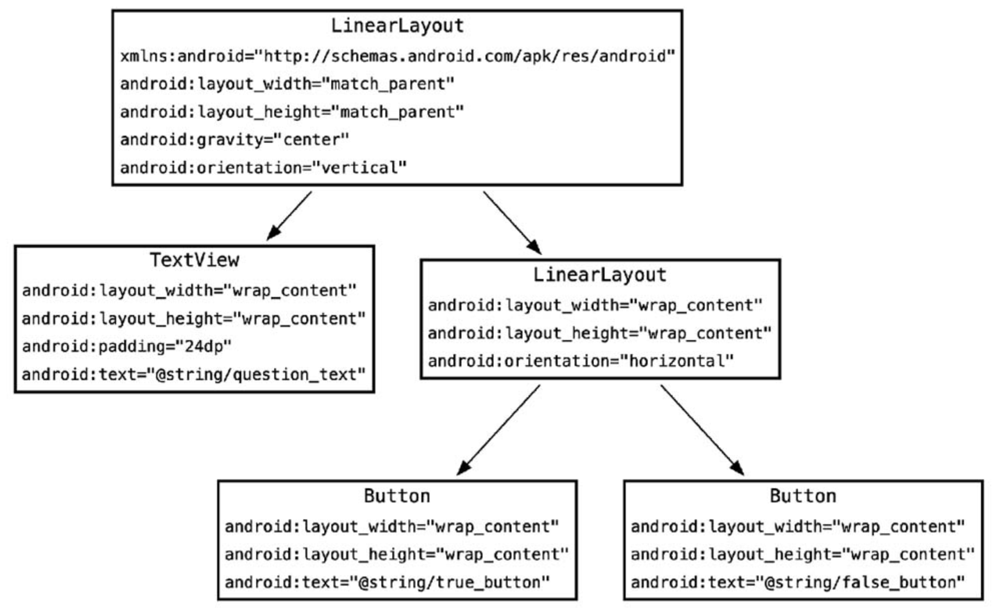


- 作为**根元素**，LinearLayout部件**必须指定Android XML资源文件的命名空间属性**
- LinearLayout部件继承自**ViewGroup部件**（也是一个View子类）。**ViewGroup部件是包含并布置其他视图的特殊视图**

#### 1.4.2 部件属性

- android:layout_width和android:layout_height属性值：

  1. match_parent：视图与父视图大小相同
  2. wrap_content：视图将根据其显示内容自动调整大小

- 子部件的**定义顺序决定**其在屏幕上**显示的顺序**

- `@string/`语法表示对**字符串资源的引用**

  > 字符串资源包含在一个独立的名叫strings的XML文件中（strings.xml），虽然可以硬编码设置部件的文本属性值，比如android:text="True"，但这通常不是个好办法。比较好的做法是将文字内容放置在独立的字符串资源XML文件中，然后引用它们

#### 1.4.3 创建字符串资源

位置：`res/values/strings.xml`

**一个项目也可以有多个字符串文件，只要这些文件都放在`res/values/`目录下，含有一个resources根元素，以及多个string子元素，应用就能找到并正确使用它们**

### 1.5 从布局XML到视图对象

activity子类的实例创建后，`onCreate(Bundle?)`函数会被调用，activity创建后，它需要获取并管理用户界面。要获取activity的用户界面，可以调用`setContentView`函数：

```kotlin
class MainActivity : AppCompatActivity() {
    override fun onCreate(savedInstanceState: Bundle?) {
        super.onCreate(savedInstanceState)
        setContentView(R.layout.activity_main)
    }
}
```

#### 资源与资源ID

- 所有资源文件都存放在目录app/res的子目录下

- 可以使用资源ID在代码中获取相应的资源：**activity_main.xml布局的资源ID为`R.layout.activity_main`**

- 关于R.java，新的项目里，执行`build`后已经找不到了，因为已经改为R.txt，具体可以参见[这里](https://developer.aliyun.com/article/1292341)，而R.txt的位置（Project模式）：`app/build/intermediates/runtime_symbol_list/debug/R.txt`

- Android为整个布局文件以及各个字符串生成资源ID，但activity_main.xml布局文件中的部件除外，因为不是所有部件都需要资源ID

- 要为部件生成资源ID，请**在定义部件时为其添加android:id属性**

- 因为接下来我们要与页面上的两个button进行交互，所以要给它们添加`android:id`属性

  ```xml
  <Button
  		android:id="@+id/true_button"
  		android:layout_width="wrap_content"
  		android:layout_height="wrap_content"
  		android:text="@string/true_button" />
  
  <Button
  		android:id="@+id/false_button"
  		android:layout_width="wrap_content"
  		android:layout_height="wrap_content"
  		android:text="@string/false_button" />
  ```

### 1.6 部件的实际应用

#### 1.6.1 引用部件

```kotlin
class MainActivity : AppCompatActivity() {
    private lateinit var trueButton: Button
    private lateinit var falseButton: Button

    override fun onCreate(savedInstanceState: Bundle?) {
        super.onCreate(savedInstanceState)
        setContentView(R.layout.activity_main)

      	// 通过findViewById，参数为xml中添加的资源ID
        trueButton = findViewById(R.id.true_button)
        falseButton = findViewById(R.id.false_button)
    }
}
```

#### 1.6.2 设置监听器

```kotlin
// 这里涉及Kotlin的SAM转换语法
trueButton.setOnClickListener { view: View -> }
falseButton.setOnClickListener { view: View -> }
```

### 1.7 创建提示消息

```kotlin
class MainActivity : AppCompatActivity() {
    private lateinit var trueButton: Button
    private lateinit var falseButton: Button

    override fun onCreate(savedInstanceState: Bundle?) {
        super.onCreate(savedInstanceState)
        setContentView(R.layout.activity_main)

        trueButton = findViewById(R.id.true_button)
        falseButton = findViewById(R.id.false_button)

        trueButton.setOnClickListener { view: View ->
            Toast.makeText(this, R.string.correct_toast, Toast.LENGTH_SHORT).show()
        }
        falseButton.setOnClickListener { view: View ->
            Toast.makeText(this, R.string.incorrect_toast, Toast.LENGTH_SHORT).show()
        }
    }
}
```

### 1.8 使用模拟器运行应用

### 1.9 深入学习：Android编译过程

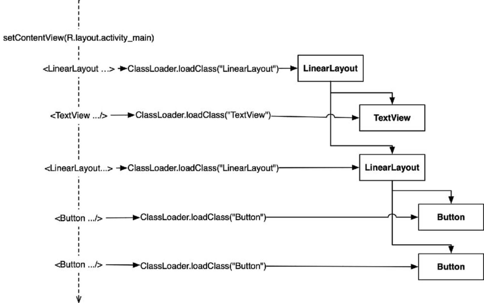

作为编译过程的一部分，**aapt2（Android Asset Packaging Tool）**将布局文件资源编译压缩紧凑后，打包到.apk文件中。然后，在MainActivity类的onCreate(Bundle?)函数调用setContentView(...)函数时，MainActivity使用LayoutInflater类实例化布局文件中定义的每一个View对象

#### Android编译工具

Android编译系统使用的编译工具叫Gradle

在当前项目目录下执行`./gradlew tasks`会显示一系列可用任务。你需要的任务是`installDebug`，因此，再执行以下命令`./gradlew installDebug`把应用安装到当前连接的设备上，但不会运行它。要运行应用，需要在设备上手动启动

### 1.10 关于挑战练习

### 1.11 挑战练习：定制toast消息

改在屏幕顶部而不是底部显示弹出消息

```kotlin
val toast = Toast.makeText(this, R.string.correct_toast, Toast.LENGTH_SHORT)

// 设置居顶且水平居中
toast.setGravity(Gravity.TOP or Gravity.CENTER_HORIZONTAL, 0, 0)
toast.show()
```


## 第2章 Android与MVC设计模式

### 2.1 创建新类

> 本书中对所有模型类都会使用data关键字。这么做你就会清楚地知道，模型类都是用来保存数据的。另外，针对数据类，编译器会自动定义像equals()、hashCode()、toString()这样的有用函数，不用做这些烦琐的事，开发自然更轻松了

### 2.2 Android与MVC设计模式

Android应用基于模型-视图-控制器（Model-View-Controller，MVC）的架构模式进行设计

**模型对象**存储着应用的数据和“业务逻辑”，模型对象不关心用户界面，它的作用是存储和管理应用数据，**比如**这里要用到的Question类

**视图对象**知道如何在屏幕上绘制自己，以及如何响应用户的输入，比如触摸动作等。一条简单的经验法则是，只要能够在屏幕上看见的对象，就是视图对象，**比如**`res/layout/activity_main.xml`

**控制器对象**含有应用的“逻辑单元”，是视图对象与模型对象的联系纽带。控制器对象响应视图对象触发的各类事件，此外还管理着模型对象与视图层间的数据流动，**比如**Activity或Fragment的子类

### 2.3 更新视图层

### 2.4 更新控制器层

### 2.5 添加图标资源

如果应用不包含设备对应的屏幕像素密度文件，则在运行时，Android系统会自动找到可用的图片资源，并针对该设备进行缩放适配。有了这种特性，就不一定要准备各种屏幕像素密度文件了

任何添加到res/drawable目录中，后缀名为.png、.jpg或者.gif的文件都会自动获得资源ID。（注意，**文件名必须是小写字母且不能有空格**）

#### 2.5.1 向项目中添加资源

#### 2.5.2 在XML文件中引用资源

```xml
<Button
		android:id="@+id/next_button"
		android:layout_width="wrap_content"
		android:layout_height="wrap_content"
		
    android:drawableEnd="@drawable/arrow_right"
		android:drawablePadding="4dp"
		
    android:text="@string/next_button" />
```

以@drawable/开头的定义是引用drawable资源

### 2.6 屏幕像素密度

Android提供了与密度无关的尺寸单位，应用运行时，Android会自动将这种单位转换成像素单位

- px：一个像素单位对应一个屏幕像素单位（物理像素单位）
- dp（或dip）：density-independent pixel的缩写，密度无关像素，1dp在设备屏幕上总是等于$\frac{1}{160}$英寸
- sp：scale-independent pixel的缩写，意为缩放无关像素，它是一种与密度无关的像素，这种像素会受用户字体偏好设置的影响，sp通常用来设置屏幕上的字体大小

### 2.7 在物理设备上运行应用

开启“开发者模式”，并允许“usb调试”

### 2.8 挑战练习：为TextView添加监听器

```kotlin
questionTextView.setOnClickListener {
    currentIndex = (currentIndex + 1) % questionBank.size
    updateQuestion()
}
```

### 2.9 挑战练习：添加后退按钮

```xml
<LinearLayout
    android:layout_width="wrap_content"
    android:layout_height="wrap_content"
    android:orientation="horizontal">
    <Button
        android:id="@+id/prev_button"
        android:layout_width="wrap_content"
        android:layout_height="wrap_content"
        android:drawableLeft="@drawable/arrow_left"
        android:text="@string/prev_button" />
    <Button
        android:id="@+id/next_button"
        android:layout_width="wrap_content"
        android:layout_height="wrap_content"
        android:drawableEnd="@drawable/arrow_right"
        android:drawablePadding="4dp"
        android:text="@string/next_button" />
</LinearLayout>
```

```kotlin
prevButton.setOnClickListener {
    if (currentIndex == 0) {
        currentIndex = questionBank.size - 1;
    } else {
        currentIndex -= 1
    }
    updateQuestion()
}
```

### 2.10 挑战练习：从按钮到图标按钮

```xml
<LinearLayout
    android:layout_width="wrap_content"
    android:layout_height="wrap_content"
    android:orientation="horizontal">
    <ImageButton
        android:id="@+id/prev_button"
        android:layout_width="wrap_content"
        android:layout_height="wrap_content"
        android:contentDescription="@string/prev_button_description"
        android:src="@drawable/arrow_left"
        android:text="@string/prev_button" />
    <ImageButton
        android:id="@+id/next_button"
        android:layout_width="wrap_content"
        android:layout_height="wrap_content"
        android:contentDescription="@string/next_button_description"
        android:src="@drawable/arrow_right"
        android:text="@string/next_button" />
</LinearLayout>
```

```kotlin
private lateinit var nextButton: ImageButton
private lateinit var prevButton: ImageButton
```


## 第3章 activity的生命周期

### 3.1 旋转GeoQuiz应用

设备旋转后，你会看到应用又显示了第一道题。为什么会这样？这个问题的答案和activity生命周期有关

### 3.2 activity状态与生命周期回调

activity的生命周期、状态以及状态切换时系统调用的函数：

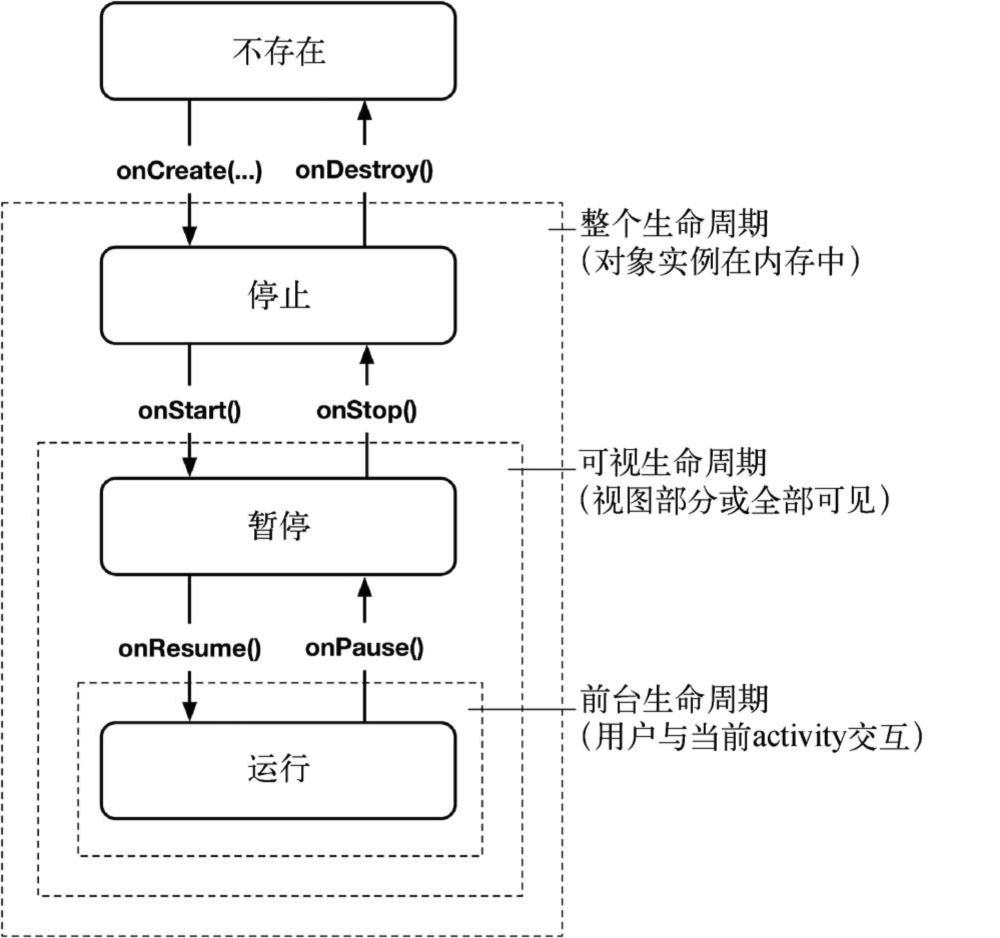

|  状态  | 是否有内存实例 | 用户是否可见 | 是否活跃在前台 |
| :----: | :------------: | :----------: | :------------: |
| 不存在 |       否       |      否      |       否       |
|  停止  |       是       |      否      |       否       |
|  暂停  |       是       |   是或部分   |       否       |
|  运行  |       是       |      是      |       是       |

- 不存在：表示某个activity**还没启动**或**已销毁**
- 停止：表示某个activity实例在内存里，但用户在屏幕上看不到关联视图
- 暂停：表示某个activity处于前台**非活动状态**，关联视频可见或部分可见
- 运行：表示某个activity实例在内存里，用户完全可见，且处于前台

Activity的子类可以在activity的生命周期状态发生关键性转换时完成某些工作，这些函数通常被称为**生命周期回调函数**，**千万不要自己去调用**`onCreate(Bundle?)`函数或任何其他activity生命周期函数

### 3.3 日志跟踪理解activity生命周期

#### 3.3.1 输出日志信息

#### 3.3.2 使用LogCat

关于更多LogCat的使用参见[官方文档](https://developer.android.com/studio/debug/logcat?hl=zh-cn&bookmark=true#ui-overview)

这里我们只使用tag来进行过滤，比如`tag:MainActivity`

### 3.4 activity生命周期如何响应用户操作

#### 3.4.1 暂时离开activity

#### 3.4.2 结束使用activity

`onPause()` --> `onStop()` --> `onDestroy()`

#### 3.4.3 旋转activty

在旋转时可以发现如下日志：

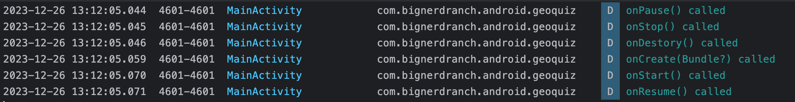

说明在设备旋转时，系统会销毁当前的MainActivity实例，然后再创建一个新的MainActivity实例，所以题目序号又会回到初始状态

### 3.5 设备配置改变与activity生命周期

> **旋转设备会改变设备配置（device configuration）**。设备配置实际是一系列特征组合，用来描述设备当前状态。这些特征包括：屏幕方向、屏幕像素密度、屏幕尺寸、键盘类型、底座模式以及语言等
>
> 在运行时配置变更（runtime configuration change）发生时，可能会有更合适的资源来匹配新的设备配置。**于是，Android销毁当前activity，为新配置寻找最佳资源，然后创建新实例使用这些资源**

PS：关于`android:gravity`与`android:layout_gravity`

- `android:gravity`
  - 用于定义一个`View`或`ViewGroup`内部内容的对齐方式。
  - 适用于`ViewGroup`和`View`。
  - 它决定了`View`或`ViewGroup`内部内容在其自身区域内的对齐方式，比如文字或子视图的对齐方式。例如，如果你有一个`TextView`，你可以使用`android:gravity`属性来定义文本在`TextView`中的对齐方式
- `android:layout_gravity`
  - 用于定义`View`在其父容器中的对齐方式。
  - 仅适用于`View`。
  - 它决定了`View`在其父容器中的位置，而不是影响内部内容的对齐方式。例如，如果你有一个`Button`，你可以使用`android:layout_gravity`属性来定义按钮在其父容器中的对齐方式

### 3.6 深入学习：UI刷新与多窗口模式

Android 7.0（Nougat）之后，从`onStart()`到`onStop()`，在activity可见的整个生命周期，你都应该刷新UI

> Android在2018年11月引入了**multi-resume**方案来支持多窗口模式。该方案规定，多窗口模式下，不管用户和哪一个窗口应用交互，所有完全可见的activity都将处于运行状态
>
> 在Android 9.0平台上，只要在Android manifest文件里添加**<meta-data android:name="android.allow_multiple_resumed_activities"android:value="true" />**，你就可以明确指定使用multi-resume模式

### 3.7 深入学习：日志记录的级别与函数

| 日志级别 |    函数    |    说明    |
| :------: | :--------: | :--------: |
|  ERROR   | Log.e(...) |    错误    |
| WARNING  | Log.w(...) |    警告    |
|   INFO   | Log.i(...) |    信息    |
|  DEBUG   | Log.d(...) |    调试    |
| VERBOSE  | Log.v(...) | 仅用于开发 |

### 3.8 挑战练习：禁止一题多答

```kotlin
// 禁用按钮
trueButton.isEnabled = enabled
```


### 3.9 挑战练习：答题评分

## 第4章 UI状态的保存与恢复

学习使用ViewModel保存UI数据，修复GeoQuiz应用的UI状态丢失缺陷

### 4.1 引入ViewModel依赖

在如下的文件中的`dependencies`中添加：`implementation("androidx.lifecycle:lifecycle-extensions:2.2.0")`

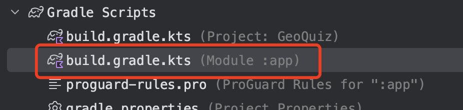


### 4.2 添加ViewModel

ViewModel与某种特殊用户屏相关联，非常适合存管那些处理屏显数据的逻辑

> ViewModel在androidx.lifecycle包里。从名字可以看出，这个包里是那些包括生命周期感知类部件在内的生命周期相关的API。生命周期感知类部件监视像activity这样的其他部件，掌握着它们的生命周期状态

```kotlin
package com.bignerdranch.android.geoquiz

import android.util.Log
import androidx.lifecycle.ViewModel

private const val TAG = "QuizViewModel"

class QuizViewModel : ViewModel() {
    init {
        Log.d(TAG, "ViewModel instance created")
    }

    // onCleared()函数的调用恰好在ViewModel被销毁之前
    override fun onCleared() {
        super.onCleared()
        Log.d(TAG, "ViewModel instance about to be destroyed")
    }
}
```

```kotlin
override fun onCreate(savedInstanceState: Bundle?) {
    super.onCreate(savedInstanceState)
    Log.d(TAG, "onCreate(Bundle?) called")
    setContentView(R.layout.activity_main)
    // 首次访问QuizViewModel时，ViewModelProvider会创建并返回一个QuizViewModel新实例
    // 在设备配置改变之后，MainActivity再次访问QuizViewModel对象时，会返回之前创建的QuizViewModel
    val provider: ViewModelProvider = ViewModelProviders.of(this)
    val quizViewModel = provider.get(QuizViewModel::class.java)
    Log.d(TAG, "Got a QuizViewModel: $quizViewModel")
  	// ...
}
```

#### 4.2.1 ViewModel生命周期与ViewModelProvider

activity销毁有两种情况：

1. 用户结束使用activity，此时希望重置UI状态
2. 设备配置变更，比如旋转，此时希望保持UI状态

通过**检查activtiy的`isFinishing`属性**可以确定是上述哪种场景，**前者为true，后者为false**

通过ViewModel，当`isFinishing`为false时，就不用手动保存UI状态了。用ViewModel把UI状态保存在内存里，以应对设备配置的改变，ViewModel的生命周期更符合用户的预期：**设备配置发生变化数据也不会丢失，只有在关联activity结束使命时才会与之一起销毁**

前面的例子中，通过将activity与ViewModel关联上，该ViewModel就与关联的activity的生命周期同步了

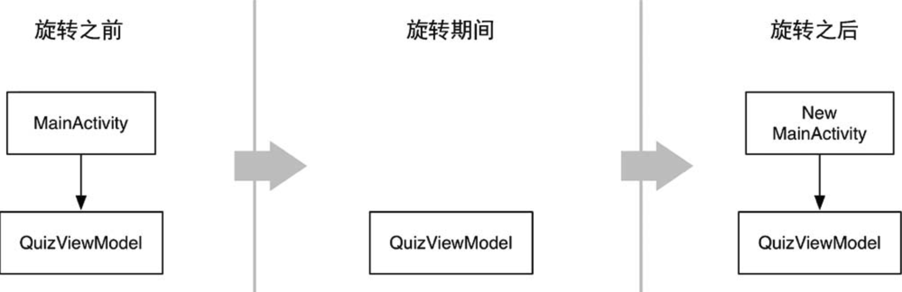

QuizViewModel和MainActivity的关系是**单向的**，某个activity会引用其关联ViewModel，**反过来则不行**，一个ViewModel绝不能引用activity或view，否则会引发**内存泄漏**

#### 4.2.2 向ViewModel添加数据

这里注意一下这里：

```kotlin
//    使用了by lazy关键字，quizViewModel的计算和赋值只在首次获取quizViewModel时才会发生
//    因为只有在Activity.onCreate(...)被调用后，才能安全地获取到一个ViewModel，否则会抛出IllegalStateException异常
val quizViewModel: QuizViewModel by lazy {
    ViewModelProviders.of(this).get(QuizViewModel::class.java)
}
```

### 4.3 进程销毁时保存数据

操作系统做起销毁的事毫不留情，不会去调用任何activity或ViewModel的生命周期回调函数

> 那么，该如何保存UI状态数据，并用它重建新的activity，让用户察觉不到activity经历过“生死”呢？一个办法是**将数据保存在保留实例状态（saved instance state）里**。保留实例状态是操作系统临时存放在activity之外某个地方的一段数据。通过覆盖**Activity.onSaveInstanceState(Bundle)**的方式，你可以把数据添加到保留实例状态里

只要在未结束使用的activity进入停止状态时（比如用户按了Home按钮，启动另一个应用时），操作系统都会调用Activity.onSaveInstanceState(Bundle)

#### 4.3.1 覆盖onSaveInstanceState(Bundle)函数 

```kotlin
private const val KEY_INDEX = "index"
class MainActivity : AppCompatActivity() {
  	// ...
    override fun onSaveInstanceState(savedInstanceState: Bundle) {
        super.onSaveInstanceState(savedInstanceState)
        Log.i(TAG, "onSaveInstanceState")
        savedInstanceState.putInt(KEY_INDEX, quizViewModel.currentIndex)
    }
  	// ...
}
```

#### 4.3.2 保留实例状态与activity记录

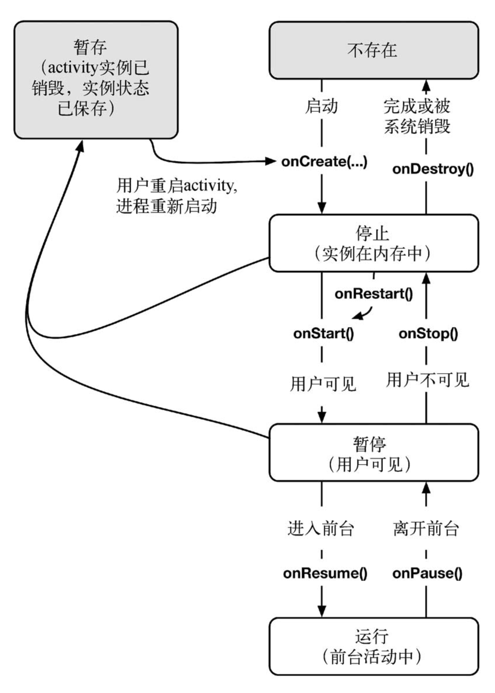

> Activity被暂存后，Activity对象将不再存在，但操作系统会将activity记录对象保存起来。这样，在需要恢复activity时，操作系统可以使用暂存的activity记录重新激活activity。
>
> 注意，activity进入暂存状态并不一定需要调用onDestroy()函数。不过，onStop()和onSaveInstanceState(Bundle)是两个可靠的函数（除非设备出现重大故障）。因而，**常见的做法**是，覆盖onSaveInstanceState(Bundle)函数，在Bundle对象中，保存当前activity小的或暂存状态的数据；覆盖onStop()函数，保存永久性数据，比如用户编辑的文字等。调用完onStop()函数后，activity随时会被系统销毁，所以用它保存永久性数据
>
> 那么暂存的activity记录到底可以保留多久呢？前面说过，用户按了回退键后，系统会彻底销毁当前的activity。此时，暂存的activity记录会同时被清除。此外，如果系统重启，那么暂存的activity记录也会被清除。

### 4.4 ViewModel与保存实例状态

1. ViewModel在activity终结时，也会被清除，而保留实例则可以实现数据的恢复
2. 保留实例状态数据是序列化到磁盘，所以应避免用它保存任何大而复杂的对象
3. 使用保留实例状态保存少量必要信息以重建UI状态，使用ViewModel保存的更丰富的数据，可以快速方便地取回来填充UI，以应对设备配置改变
4. 如果activity是在进程销毁后重建，那就借助保留实例状态先创建ViewModel，从而达到ViewModel和activity从未失效的效果
5. 后面会提供两种本地持久化存储方法：**数据库**（适合保存大量复杂数据）和**shared preference（适合保存轻量数据）**

### 4.5 深入学习：Jetpack、AndroidX与架构组件

- Jetpack库都位于androidx打头的包里，所以会听到Jetpack和AndroidX两种不同术语叫法
- Jetpack库分为四大类：foundation、architecture、behavior和UI
  - architecture：比如ViewModel、Room、Data Binding和WorkManager
  - foundation：比如AppCompat、Test、Android KTX
  - UI：比如Fragment、Layout

### 4.6 深入学习：解决问题要彻底

解决UI状态丢失问题不能简单粗暴地一禁了之，比如禁用屏旋转、夜间模式切换等

## 第5章 Android应用的调试

介绍如何使用LogCat、Android Lint以及Android Studio内置的代码调试器

### 5.1 异常与栈跟踪

通过LogCat查看异常信息，比如"FATAL EXCEPTION"表示应用崩溃的异常

#### 5.1.1 诊断应用异常

#### 5.1.2 记录栈跟踪日志

#### 5.1.3 设置断点

要修改代码，必须先停止调试应用。**注意，在调试时即使修正了代码，已加载调试器运行的代码还是旧代码，所以调试器给出的信息可能会误导你**

### 5.2 Android特有的调试工具

#### 5.2.1 使用Android Lint

Android Lint（或Lint）是Android应用代码的**静态分析器**

操作菜单：`Code --> Inspect Code...` 选择`Whole Project`后点击`Analyze`

#### 5.2.2 R类的问题

在添加资源或删除引用后重新保存文件，Android Studio会准确无误地重新编译项目，不过，资源编译错误有时会一直存在或莫名其妙地出现

- 重新检查资源文件中XML文件的有效性

  如果最近一次编译时未生成R.java文件，那么项目中资源引用的地方都会出错

- 清理项目

  `Build --> Clean Project`，Android Studio即会重新编译整个项目

- 使用Gradle同步项目

  如果修改了build.gradle配置文件，就需要同步更新项目的编译设置，`File --> Sync Project with Gradle Files`

- 运行Android Lint

  仔细查看Lint警告信息，没准儿就会有新发现

### 5.3 挑战练习：探索布局检查器

为了调试布局文件，可使用**布局检查器**以交互的方式检查布局文件，首先在模拟器上启动GeoQuiz应用，然后选择`Tools --> Layout Inspector`，布局检查器激活后，点击布局检查器视图里的元素，就可以查看布局属性了

或者直接点这里：

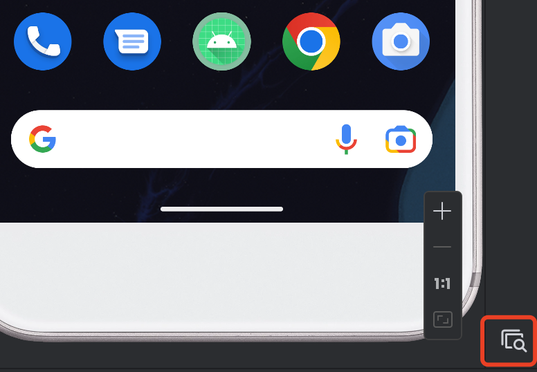

### 5.4 挑战练习：探索Android性能分析器

应用如何使用Android设备的CPU和内存资源，Android Studio的性能分析工具窗口能给出详细报告

要查看性能分析工具窗口，首先在Android设备或模拟器上运行应用，然后选择`View --> Tool Windows --> Profiler`菜单项

或者直接点这里：

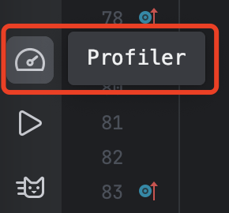

## 第6章 第二个activity

### 6.1 创建第二个activity

#### 6.1.1 创建新的activity

创建新的activity至少涉及三个文件：**Kotlin类文件、XML布局文件和应用的manifest文件**

#### 6.1.2 创建新的activity子类

#### 6.1.3 在manifest配置文件中声明activity

manifest配置文件是一个包含元数据的XML文件，**用来向Android操作系统描述应用**。该文件总是以AndroidManifest.xml命名，可在项目的app/manifests目录中找到它

应用的所有activity都必须在manifest配置文件中声明，这样操作系统才能够找到它们

#### 6.1.4 为MainActivity添加CHEAT按钮

### 6.2 启动activity

一个activity启动另一个activity最简单的方式是使用`startActivity(Intent)`函数，该调用请求会发给Android操作系统的ActivityManager，**它根据Intent中的参数来创建指定activity实例**并调用其`onCreate(Bundle?)`函数

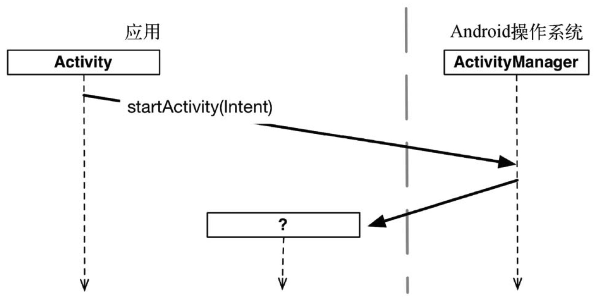

#### 基于intent的通信

intent对象是component用来与操作系统通信的一种媒介工具

intent是一种多用途通信工具。Intent类有多个构造函数，能满足不同的使用需求，此处是用于创建新的activity，则使用如下方法：

```kotlin
cheatButton.setOnClickListener {
    val intent = Intent(this, CheatActivity::class.java)
    startActivity(intent)
}
```

### 6.3 activity间的数据传递

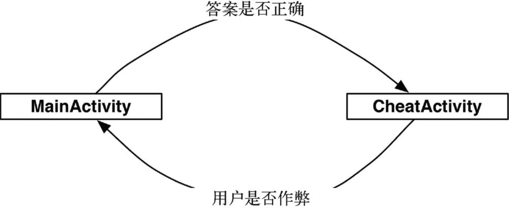

#### 6.3.1 使用intent extra

extra信息可以是任意数据，它包含在Intent中，由启动方activity发送出去

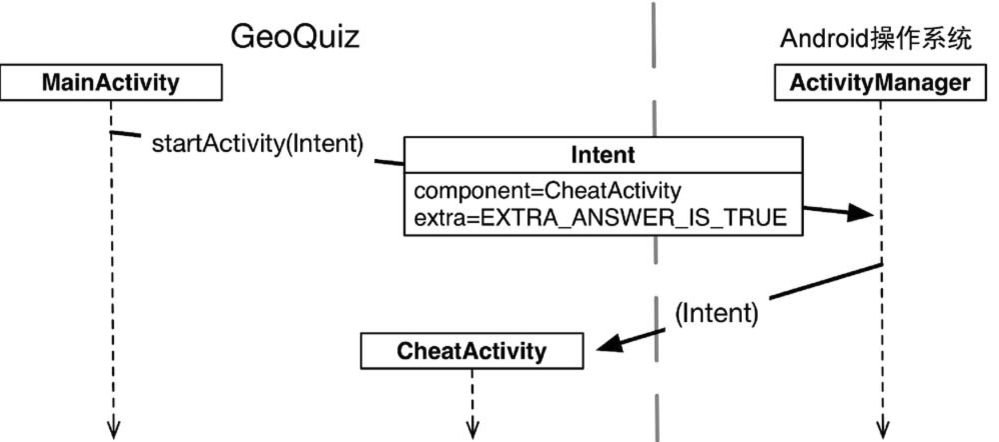

通过`Intent.putExtra(name: String, value: Boolean)`来设置intent的数据，该函数支持链式调用

```kotlin
// 使用包名修饰extra数据信息，这样，可避免来自不同应用的extra间发生命名冲突
private const val EXTRA_ANSWER_IS_TRUE = "com.bignerdranch.android.geoquic.answer_is_true"

class CheatActivity : AppCompatActivity() {
    private var answerIsTrue = false
    private lateinit var answerTextView: TextView
    private lateinit var showAnswerButton: Button

    override fun onCreate(savedInstanceState: Bundle?) {
        super.onCreate(savedInstanceState)
        setContentView(R.layout.activity_cheat)

        answerIsTrue = intent.getBooleanExtra(EXTRA_ANSWER_IS_TRUE, false)
        answerTextView = findViewById((R.id.answer_text_view))
        showAnswerButton = findViewById(R.id.show_answer_button)

        showAnswerButton.setOnClickListener {
            val answerText = when {
                answerIsTrue -> R.string.true_button
                else -> R.string.false_button
            }

            answerTextView.setText(answerText)
        }
    }

    companion object {
        fun newIntent(packageContext: Context, answerIsTrue: Boolean): Intent {
            return Intent(packageContext, CheatActivity::class.java).apply {
                putExtra(EXTRA_ANSWER_IS_TRUE, answerIsTrue)
            }
        }
    }
}
```

#### 6.3.2 从子activity获取返回结果

需要从子activity获取返回信息时，可调用如下函数：

```kotlin
Activity.startActivityForResult(Intent, Int)
```

该函数的第一个参数同前述的intent。第二个参数是请求代码。**请求代码是先发送给子activity，然后再返回给父activity的整数值**，由用户定义

如果子activity是以调用startActivityForResult(...)函数启动的，结果代码则总是会返回给父activity。在没有调用setResult(...)函数的情况下，如果用户按了后退按钮，父activity则会收到Activity.RESULT_CANCELED的结果代码

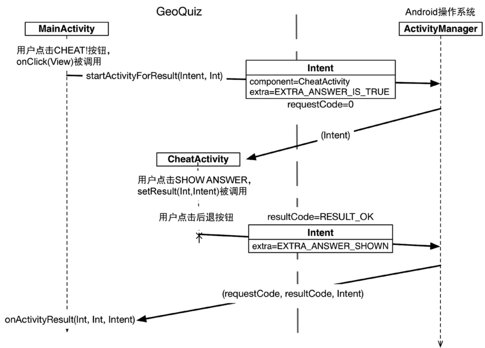

```kotlin
override fun onActivityResult(requestCode: Int, resultCode: Int, data: Intent?) {
    super.onActivityResult(requestCode, resultCode, data)
    if (resultCode != Activity.RESULT_OK) {
        return
    }
    if (requestCode == REQUEST_CODE_CHEAT) {
        quizViewModel.isCheater = data?.getBooleanExtra(EXTRA_ANSWER_SHOWN, false) ?: false
    }
}
```

### 6.4 activity的使用与管理

1. 在启动GeoQuiz应用时，操作系统并没有启动应用，而只是启动了应用中的一个activity，更确切的说，它启动了应用的`launcher activity`，而`MainActivity`就是`launcher activity`

   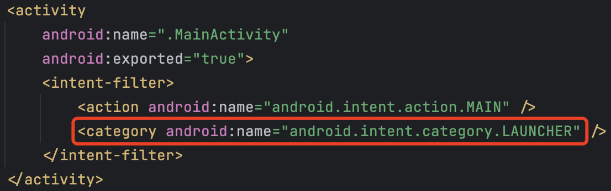

2. 当点击`CHEAT!`按钮时，`CheatActivity`实例随即在`MainActivity`实例之上被启动，此时它们都处于**activity栈**中

3. 按回退键，`CheatActivity`实例被弹出栈外，`MainActivity`重新回到栈顶

   PS：在`CheatActivity`中调用`Activity.finish()`也可以将`CheatActivity`从栈里弹出

`ActivityManager`维护着一个**非特定应用独享的后退栈，所有应用的activity都共享后退栈，这也是将ActivityManager设计成操作系统级的activity管理器来负责启动应用activity的原因之一**

### 6.5 挑战练习：堵住作弊漏洞

### 6.6 挑战练习：按题记录作弊状态

## 第7章 Android SDK版本与兼容

### 7.1 Android SDK版本

### 7.2 Android编程与兼容性问题

要基于屏幕尺寸提供定制资源和布局，可使用**配置修饰符**搞定（详见第17章）

#### 7.2.1 比较合理的版本

除了最低支持版本，还可以设置**目标版本**和**编译版本**

在工程的Android视图下`Gradle Scripts --> build.gradle.kts(Module :app)`中可以看到

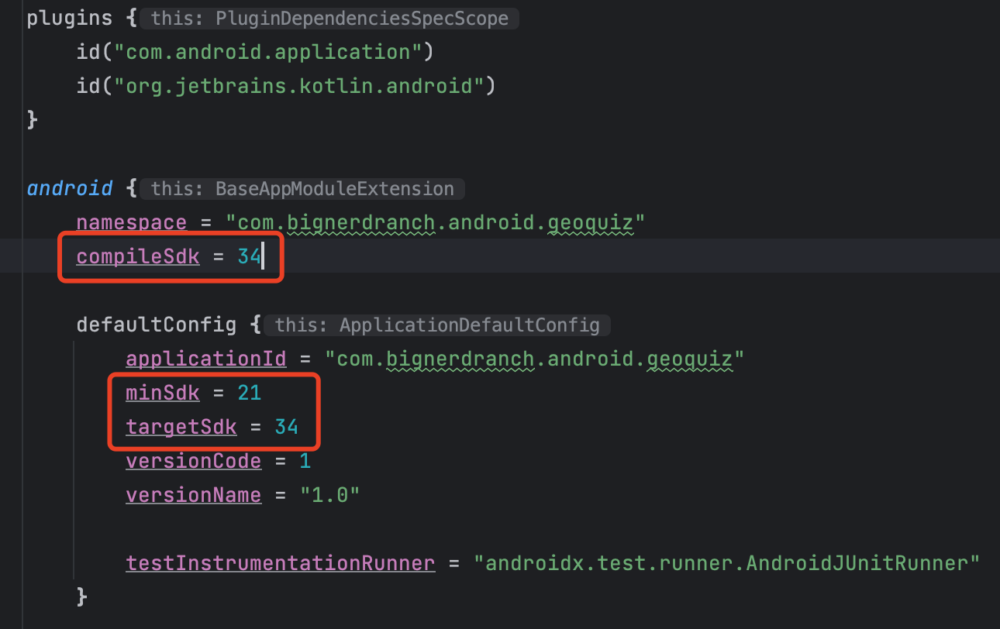

#### 7.2.2 SDK最低版本

以最低版本设置值为标准，操作系统会**拒绝**将应用安装在低于此标准的设备上

#### 7.2.3 SDK目标版本

目标版本的设定值会告诉Android应用是为哪个API级别设计的，大多数情况下，目标版本即最新发布的Android版本

> 如果应用已开发完成，应确认它在新版本上能否按预想正常运行。查看Android开发者Build.VERSION_CODES网站上的文档，检查可能出现问题的地方。根据分析结果，要么修改应用以适应新版本系统，要么降低SDK目标版本。

#### 7.2.4 SDK编译版本

SDK编译版本只是你和编译器之间的私有信息，它不会出现在manifest配置文件里

在编译代码时，SDK编译版本（编译目标）指定具体要使用的系统版本。Android Studio在寻找类包导入语句中的类和函数时，编译目标确定具体的基准系统版本

编译目标的最佳选择为最新的API级别

**修改build.gradle文件中的SDK最低版本、目标版本以及编译版本后要进行Gradle的同步操作后才能生效**

#### 7.2.5 安全添加新版本API中的代码

使用了高版本系统API中的代码，Android Lint会提示编译错误

**比较好的做法是将高API级别代码置于检查Android设备版本的条件语句中**

```kotlin
cheatButton.setOnClickListener { view ->
    val answerIsTrue = quizViewModel.currentQuestionAnswer
    val intent = CheatActivity.newIntent(this@MainActivity, answerIsTrue)
    // 这里检测Android设备的版本号
    if (Build.VERSION.SDK_INT >= Build.VERSION_CODES.M) {
        val options =
            ActivityOptions.makeClipRevealAnimation(view, 0, 0, view.width, view.height)
        startActivityForResult(intent, REQUEST_CODE_CHEAT, options.toBundle())
    } else {
        startActivityForResult(intent, REQUEST_CODE_CHEAT)
    }
}
updateQuestion()
```

#### 7.2.6 JetPack库

除了提供新功能（比如ViewModel），**Jetpack库还支持新功能向后兼容，尽量让新老设备保持一致的用户体验**。即使不能完全解决，至少能做到让开发者少写一些API级别的条件判断代码

### 7.3 使用Android开发者文档

### 7.4 挑战练习：报告编译版本

### 7.5 挑战练习：限制作弊次数

## 第8章 UI fragment与fragment管理器

开发一个新应用：CriminalIntent，功能比较复杂，需要11章的内容来完成

### 8.1 UI设计的灵活性需求

为了适应用户或设备的需求，activity界面可以在运行时组装，甚至重新组装，而activity自身并不具备这样的灵活性。activity视图可以在运行时切换，但控制视图的代码必须在activity中实现

### 8.2 引入fragment

采用fragment而不是activity来管理应用UI可让应用具有前述的灵活性。**fragment是一种控制器对象，activity可委派它执行任务。这些任务通常就是管理用户界面。受管的用户界面可以是一整屏或整屏的一部分**

### 8.3 着手开发CriminalIntent

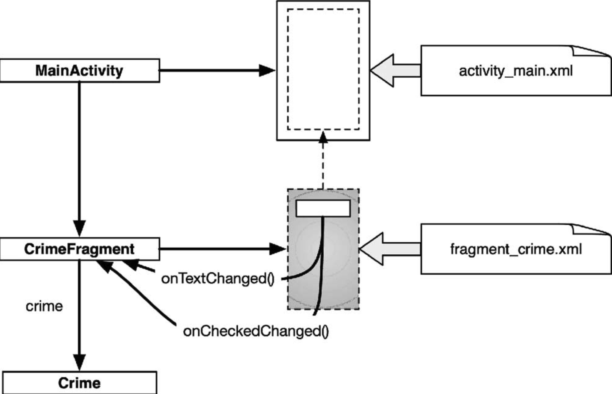

### 8.4 创建Crime数据类

### 8.5 创建UI fragment

#### 8.5.1 定义CrimeFragment的布局

#### 8.5.2 创建CrimeFragment类

##### 两类Fragment

随着Android 9.0（API 28）的发布，Google不再升级系统框架版的fragment了，它被废弃了。另外，早期支持库版本的fragment也全部被迁移到了Jetpack库中。未来的版本升级只针对Jetpack版本的fragment进行了

**新项目都应该只用Jetpack库版本的fragment**，现有的项目也应尽早迁移。这样，才能保证用上fragment的新特性，相关bug也能得到及时修复

##### 实现fragment生命周期函数

1. Fragment.onCreate(Bundle?)是公共函数，而Activity.onCreate(Bundle?)
2. fragment同样具有保存及获取状态的bundle
3. fragment的视图并没有在Fragment.onCreate(Bundle?)函数中生成。虽然我们在该函数中配置了fragment实例，但**创建和配置fragment视图是另一个Fragment生命周期函数完成的：onCreateView(LayoutInflater, ViewGroup?,Bundle?)**

```kotlin
class CrimeFragment : Fragment {
    private lateinit var crime: Crime
    private lateinit var titleField: EditText
    private lateinit var dateButton: Button
    private lateinit var solvedCheckBox: CheckBox

    // 如果没有可见性修饰符，那么Kotlin函数默认是公共的
    override fun onCreate(savedInstanceState: Bundle?) {
        super.onCreate(savedInstanceState)
        crime = Crime()
    }

    override fun onCreateView(
        inflater: LayoutInflater, container: ViewGroup?, savedInstanceState: Bundle?
    ): View? {
        // 第三个参数传递false，用于告诉布局生成器，不要立刻将生成的视图添加给父视图
        val view = inflater.inflate(R.layout.fragment_crime, container, false)

        titleField = view.findViewById(R.id.crime_title) as EditText
        dateButton = view.findViewById(R.id.crime_date) as Button
        solvedCheckBox = view.findViewById(R.id.crime_solved) as CheckBox

        dateButton.apply {
            // 禁用Button按钮，确保它不会响应用户点击
            text = crime.date.toString()
            isEnabled = false
        }

        return view
    }


    override fun onStart() {
        super.onStart()
        // 视图状态在onCreateView之后和onStart之前恢复，此时EditText的内容要用crime.title来重置，
        // 为了不让TextWatcher的beforeTextChanged、onTextChanged、afterTextChanged执行，所以将其放到onStart中
        val titleWatcher = object : TextWatcher {
            override fun beforeTextChanged(
                sequence: CharSequence?, start: Int, count: Int, after: Int
            ) {
                TODO("Not yet implemented")
            }

            override fun onTextChanged(
                sequence: CharSequence?, start: Int, count: Int, after: Int
            ) {
                crime.title = sequence.toString()
            }

            override fun afterTextChanged(sequence: Editable?) {
                TODO("Not yet implemented")
            }
        }
        titleField.addTextChangedListener(titleWatcher)

        solvedCheckBox.apply {
            setOnCheckedChangeListener { _, isChecked -> crime.isSolved = isChecked }
        }
    }
}
```

### 8.6 托管UI fragment

为托管UI fragment，activity必须：

1. 在其布局中为fragment的视图安排位置
2. 管理fragment实例的生命周期

#### 8.6.1 定义容器视图

#### 8.6.2 向FragmentManager中添加UI fragment

**FragmentManager类具体管理的对象有fragment队列和fragment事务回退栈**，它负责将fragment视图添加到activity的视图层级结构中

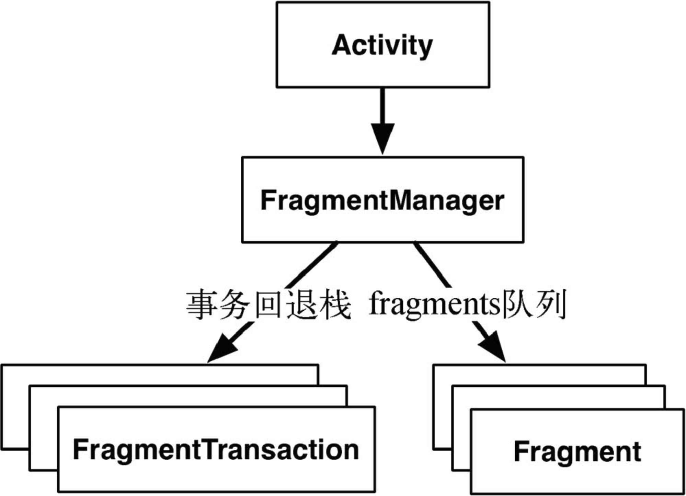

##### fragment事务

fragment事务被用来添加、移除、附加、分离或替换fragment队列中的fragment

FragmentManager维护着一个fragment事务回退栈，你可以查看、历数它们。如果fragment事务包含多个操作，那么在事务从回退栈里移除时，其批量操作也会回退。基于这个原因，UI状态更好控制了

##### FragmentManager与fragment生命周期

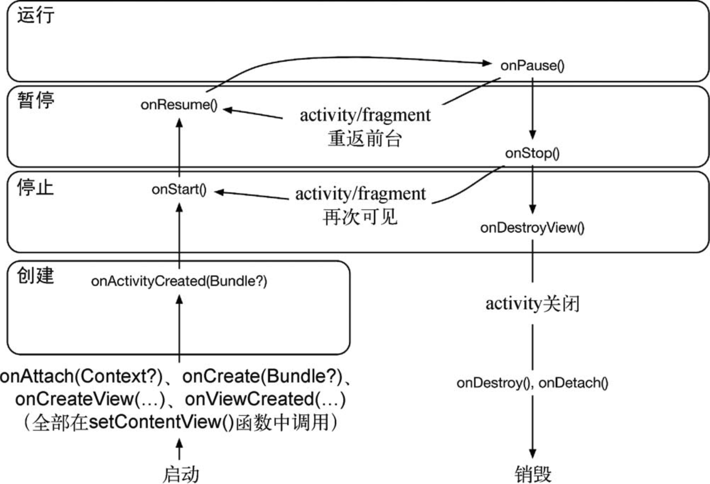

**activity的生命周期函数由操作系统负责调用，而fragment的生命周期函数由托管activity的FragmentManager负责调用**

对于activity用来管理事务的fragment，操作系统概不知情。添加fragment供FragmentManager管理时，onAttach(Context?)、onCreate(Bundle?)和onCreateView(...)函数会被调用

> 在activity处于运行状态时，添加fragment会发生什么呢？
>
> 这种情况下，FragmentManager会立即驱赶fragment，调用一系列必要的生命周期函数，快速跟上activity的步伐（与activity的最新状态保持同步）。例如，向处于运行状态的activity中添加fragment时，以下fragment生命周期函数会被依次调用：onAttach(Context?)、onCreate(Bundle?)、onCreateView(...)、onViewCreated(...)、onActivityCreated(Bundle?)、onStart()以及onResume()。
>
> 一旦追上，托管activity的FragmentManager就会边接收操作系统的调用指令，边调用其他生命周期函数，让 fragment与activity保持步调一致

### 8.7采用fragment的应用架构

应用单屏最多使用2～3个fragment

#### 使用fragment的理由 

## 第9章 使用RecyclerView显示列表

### 9.1 添加新Fragment和ViewModel

ViewModel类属于生命周期扩展库

#### ViewModel生命周期与fragment

1. 只要fragment视图还在屏幕上，ViewModel就会一直处于活动状态（即使因设备旋转导致当前的fragment实例不存在了）
2. 如果当前fragment被销毁，那么其关联ViewModel也随之销毁，在托管activity使用不同的fragment替换当前fragment时也是如此
3. 当把fragment事务添加到回退栈时，即便托管activity使用其他fragment替换了当前fragment，当前fragment实例和它的关联ViewModel也不会被销毁

### 9.2 添加RecyclerView

新创建的RecyclerView还需要一个名为LayoutManager的对象。没有它的支持，RecyclerView将无法工作，代码会崩溃

### 9.3 创建列表项视图布局

### 9.4 ViewHolder实现

RecyclerView的任务仅限于回收和摆放屏幕上的View。列表项View能够显示数据还离不开另外两个类的支持：ViewHolder子类和Adapter子类

### 9.5 使用Adapter填充RecyclerView

RecyclerView自己不创建ViewHolder，它请Adapter来帮忙。Adapter是一个控制器对象，其作为沟通的桥梁，从模型层获取数据，然后提供给RecyclerView显示

Adapter负责：

1. 创建必要的ViewHolder
2. 绑定ViewHolder至模型层数据

RecyclerView负责：

1. 请Adapter创建ViewHolder
2. 请Adapter绑定ViewHolder至具体的模型层数据

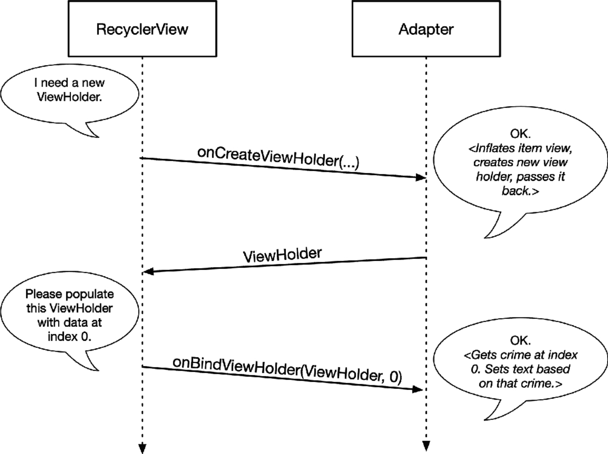

> 首先，RecyclerView会调用Adapter的onCreateViewHolder(ViewGroup, Int)函数创建ViewHolder及其要显示的视图。此时，Adapter创建并返给RecyclerView的ViewHolder（和它的itemView）还没有数据。
>
> 然后，RecyclerView会调用onBindViewHolder(ViewHolder, Int)函数，传入ViewHolder和Crime对象的位置。Adapter会找到目标位置的数据并将其绑定到ViewHolder的视图上。所谓绑定，就是使用模型对象数据填充视图。
>
> 整个过程执行完毕，RecyclerView就能在屏幕上显示crime列表项了

#### 为RecyclerView配置adapter

### 9.6 循环使用视图

RecyclerView只创建刚好充满屏幕的View对象，而不是100个。用户滑动屏幕时，滚出屏幕的视图会被回收利用。顾名思义，RecyclerView所做的就是回收再利用，循环往复

### 9.7 清理绑定

Adapter应尽量不插手ViewHolder的内部工作和细节，推荐把数据和视图的绑定工作都放在CrimeHolder里处理

### 9.8 响应点击

ViewHolder实现View.OnClickListener接口，并在`init`中绑定事件，从而监听用户触摸事件

### 9.9 深入学习：ListView与GridView

### 9.10 挑战练习：RecyclerView的ViewType

## 第10章 使用布局与部件创建用户界面

嵌套布局代码难以阅读和维护，还会影响应用的性能表现，因为Android操作系统要花更多的时间度量和布置视图

**ConstraintLayout**最适合用来设计扁平或是复杂又漂亮的非嵌套布局

### 10.1 初识ConstraintLayout布局

使用ConstraintLayout工具给布局添加一系列约束（constraint），把约束想象为橡皮筋，它会向中间拉拢分系两头的东西

### 10.2 图形布局编辑器

### 10.3 使用ConstraintLayout

#### 10.3.1 腾出空间

#### 10.3.2 添加部件

#### 10.3.3 约束的工作原理

凡是以layout_开头的属性都属于**布局参数（layout parameter）**。与其他属性不同的是，部件的布局参数是用来向其父部件做指示的，即**用于告诉父布局如何安排自己**

#### 10.3.4 编辑属性

在预览界面，拖到别处看上去是换了位置，但应用运行时，你依然看不到这种位置变化。应用运行时，只有约束起作用

#### 10.3.5 动态设置列表项

### 10.4 深入学习布局属性

#### 样式、主题及主题属性

使用主题属性引用，可将预定义的应用主题样式添加给指定部件。在`fragment_crime.xml`文件中，样式属性值`?android:listSeparatorTextViewStyle`的使用就是这样一个例子

### 10.5 深入学习：边距与内边距

### 10.6 深入学习：ConstraintLayout的发展动态

MotionLayout是ConstraintLayout的一个扩展，有了它，向视图添加动画就容易多了

### 10.7 挑战练习：日期格式化

```kotlin
dateTextView.text = DateFormat.format("EEE, MMM dd, yyyy", crime.date)
```


## 第11章 数据库与Room库

一般来讲，非UI相关数据要么保存在本地（本地文件系统，或者是稍后就要为CriminalIntent创建的数据库），要么保存在Web服务器上

### 11.1 Room架构组件库

Room是一个Jetpack架构组件库，它支持使用Kotlin注解类来定义你的数据库结构和查询，数据库的创建和访问工作也因此变得更简单一套API、一些注解类和一个编译器就组成了Room工具库

添加依赖（`app/build.gradle`文件中）

```
plugins {
    id("com.android.application")
    id("org.jetbrains.kotlin.android")
    // 这里是安装kapt插件
    id("kotlin-kapt")
}
dependencies {
		// ...
    // room-runtime依赖是Room API，其包含你定义数据库时需要使用的一些类和注解
    implementation("androidx.room:room-runtime:2.6.1")
    // room-compiler是Room编译器
    implementation("androidx.room:room-compiler:2.6.1")
    // ...
}
```

1. room-runtime依赖是Room API，其包含你定义数据库时需要使用的一些类和注解
2. room-compiler是Room编译器

### 11.2 创建数据库

使用Room工具库创建数据需要以下三个步骤：

1. 注解模型类，使之成为一个数据库实体
2. 创建数据库代表类
3. 创建类型转换器，让数据库能够处理模型数据

#### 11.2.1 定义实体

Room基于你定义的实体为应用构建数据库表。实体是你创建的模型类，使用`@Entity`注解

```kotlin
@Entity
data class Crime(
    @PrimaryKey val id: UUID = UUID.randomUUID(),
    var title: String = "",
    var date: Date = Date(),
    var isSolved: Boolean = false
)
```

#### 11.2.2 创建数据库类

```kotlin
package com.bignerdranch.android.criminalintent.database

import androidx.room.Database
import androidx.room.RoomDatabase
import androidx.room.TypeConverters
import com.bignerdranch.android.criminalintent.Crime

@Database(entities = [Crime::class], version = 1)
@TypeConverters(CrimeTypeConverters::class)
abstract class CrimeDatabase : RoomDatabase() {
}
```

##### 创建类型转换器

Room的后台数据库引擎是SQLite

*通过在Kotlin对象和SQLite数据库之间建立一个对象关系映射层，Room能让你轻松优雅地使用SQLite数据库。使用Room时，你不用了解或者关心如何使用SQLite*

> Room能直接在后台SQLite数据库表里存储**基本类型**数据，但遇到其他数据类型就会有问题。Crime类要靠Date和UUID对象支持。但Room默认不知道该如何存储这些数据类型。这就需要**采取一定措施来转换这些数据类型**，让Room能正确存储和读取它们

```kotlin
package com.bignerdranch.android.criminalintent.database

import androidx.room.TypeConverter
import java.util.Date
import java.util.UUID

class CrimeTypeConverters {
    @TypeConverter
    fun fromDate(date: Date?): Long? {
        return date?.time
    }

    @TypeConverter
    fun toDate(millisSinceEpoch: Long?): Date? {
        return millisSinceEpoch?.let {
            Date(it)
        }
    }

    @TypeConverter
    fun fromUUID(uuid: UUID?): String? {
        return uuid?.toString()
    }

    @TypeConverter
    fun toUUID(uuid: String?): UUID? {
        return UUID.fromString(uuid)
    }
}
```

### 11.3 定义数据库访问对象

和数据库表交互的第一步是创建一个数据库表访问对象（又叫DAO）。DAO对象实际就是定义了各种数据库操作函数的一个接口

```kotlin
package com.bignerdranch.android.criminalintent.database

import androidx.room.Dao
import androidx.room.Query
import com.bignerdranch.android.criminalintent.Crime
import java.util.UUID

@Dao
interface CrimeDao {
    @Query("SELECT * FROM crime")
    fun getCrimes():List<Crime>

    @Query("SELECT * FROM crime WHERE id=(:id)")
    fun getCrime(id: UUID): Crime?
}

```

```kotlin
package com.bignerdranch.android.criminalintent.database

import androidx.room.Database
import androidx.room.RoomDatabase
import androidx.room.TypeConverters
import com.bignerdranch.android.criminalintent.Crime

@Database(entities = [Crime::class], version = 1)
@TypeConverters(CrimeTypeConverters::class)
abstract class CrimeDatabase : RoomDatabase() {
    // 数据库创建后，Room会生成DAO的具体实现代码，然后，你可以引用到它，调用里面定义的各个函数与数据库交互
    abstract fun crimeDao(): CrimeDao
}
```

### 11.4 使用仓库模式访问数据库

要访问数据库，需要使用Google在应用架构指导里建议的**仓库模式（repository pattern）**

**仓库类**封装了从单个或多个数据源访问数据的一套逻辑。它决定如何读取和保存数据，无论是从本地数据库，还是远程服务器。UI代码直接从仓库获得要使用的数据，不关心如何与数据库打交道（这是仓库内部的事）

保存在单例里的属性不受activity和fragment生命周期变化的影响

### 11.5 测试数据库访问

使用Device File Explorer查看模拟器本地存储系统里的内容

#### 上传测试数据

**Android设备上的应用都有一个沙盒目录。将文件保存在沙盒中，可以阻止其他应用甚至是设备用户的访问和窥探。（当然，如果设备被root，那用户就可以为所欲为了）**

通过下图中的位置就可以打开`Device Explorer`来访问模拟器中的文件，并上传数据库文件（路径：`data/data/${包名}`）

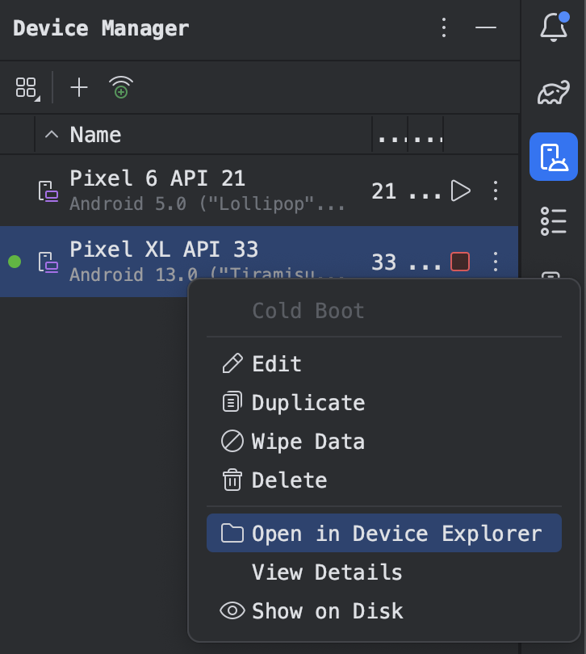

### 11.6 应用线程

读取数据库是个费时的事情，无法立即完成。因而，**Room不允许在主线程上执行任何数据库操作**。如强行为之，Room就会抛出你刚刚看到的IllegalStateException异常

**这里和浏览器中的事件循环一致**，主线程运行着所有更新UI的代码，因为它有时也叫UI线程

#### 后台线程

1. 所有耗时任务都应该在后台线程上完成——这能够保证主线程有空处理UI相关的任务，以使UI及时响应用户操作
2. UI只能在主线程上更新——试图从后台线程更新UI会让应用报错，因此，后台线程生成的UI更新数据都要确保发到主线程上执行

### 11.7 使用LiveData

> Google开发LiveData的目的是让应用不同模块之间的数据传递简单一些，比如从CrimeRepository到显示crime数据的CrimeListFragment。另外，LiveData也能在线程之间传递数据。显然，之前讨论的线程使用规则，它肯定会严格遵守

从DAO类返回LiveData实例，**就是告诉Room要在后台线程上执行数据库查询。查询到crime数据后，LiveData对象会把结果发到主线程并通知UI观察者**

#### 观察LiveData

当与Observer实现有着相同生命周期的关联对象不存在了，LiveData对象会自动和Observer实现解除订阅关系。因为LiveData能响应生命周期变化，所以它还有个名字叫生命周期感知组件（lifecycle-aware component

### 11.8 挑战练习：解决Schema警告

### 11.9 深入学习：单例

## 第12章 Fragment Navigation

1. 通过托管activity响应用户操作交换显示不同的fragment
2. 使用fragment argument把数据传递给fragment实例
3. 使用LiveData transformation响应UI状态变化加载不可变数据

### 12.1 单Activity多Fragment

#### 12.1.1 Fragment回调接口

为维护fragment的独立性，需要将不该fragment做的事交给它的托管activity来做，这需要被托管的fragment定义一个名为`Callbacks`的自定义回调接口，该接口里定义的就是被托管的fragment要求它的托管activity做的工作

#### 12.1.2 替换fragment

```kotlin
override fun onCrimeSelected(crimeId: UUID) {
    Log.d(TAG, "MainActivity.onCrimeSelected: $crimeId")
    val fragment = CrimeFragment()
    supportFragmentManager
        .beginTransaction()
        .replace(R.id.fragment_container, fragment)
  			// 这里处理的是回退栈，不然进行回退操作时，就直接退出应用了
        .addToBackStack(null)
        .commit()
}
```

### 12.2 Fragment argument

通过`Fragment argument`，你就可以把一段数据保存在属于fragment的“某个地方”。这个专属于fragment的地方实际指的是它的`argument bundle`

**封装良好的fragment就是一个可复用的构建单元**，可以交给任何activity托管

#### 12.2.1 将argument附加到fragment

```kotlin
override fun onCreate(savedInstanceState: Bundle?) {
    super.onCreate(savedInstanceState)
    crime = Crime()
    val crimeId: UUID = arguments?.getSerializable(ARG_CRIME_ID) as UUID
    Log.d(TAG, "args bundle crime ID: $crimeId")
}
```

### 12.3 使用LiveData数据转换

### 12. 4 更新数据库

Room不会自动在后台线程上执行数据库插入和更新操作，需要你手动在后台线程上执行这些DAO调用：使用executor

```kotlin
@Dao
interface CrimeDao {
    @Query("SELECT * FROM crime")
    fun getCrimes(): LiveData<List<Crime>>

    @Query("SELECT * FROM crime WHERE id=(:id)")
    fun getCrime(id: UUID): LiveData<Crime?>

    @Update
    fun updateCrime(crime: Crime)

    @Insert
    fun addCrime(crime: Crime)
}
```


#### 12.4.1 使用executor

Executor是一个需要引用线程的对象。executor实例有个函数叫execute，可以执行指定代码块。代码块中的代码会在executor实例引用的线程上执行

```kotlin
private val executor = Executors.newSingleThreadExecutor()

// ...

fun updateCrime(crime: Crime) {
    executor.execute {
        crimeDao.updateCrime(crime)
    }
}
fun addCrime(crime: Crime) {
    executor.execute {
        crimeDao.addCrime(crime)
    }
}
```

#### 12.4.2 数据库写入fragment生命周期

```kotlin
class CrimeDetailViewModel : ViewModel() {
    private val crimeRepository = CrimeRepository.get()
    private val crimeIdLiveData = MutableLiveData<UUID>()

    val crimeLiveData: LiveData<Crime?> =
        crimeIdLiveData.switchMap { crimeId -> crimeRepository.getCrime(crimeId) }

    fun loadCrime(crimeId: UUID) {
        crimeIdLiveData.value = crimeId
    }

    fun saveCrime(crime: Crime) {
        crimeRepository.updateCrime(crime)
    }
}
```

```kotlin
// 无论是用户离开，还是切换任务，甚至是因内存不够用进程被“杀”，在onStop()函数中保存数据都能保证用户编辑数据不会丢失
override fun onStop() {
    super.onStop()
    crimeDetailViewModel.saveCrime(crime)
}
```

### 12.5 深入学习：为何要用Fragment Argument

**即使fragment被销毁了，Fragment argument也可以保存下来**。然后，在fragment管理器因设备旋转重建fragment时，会把原来保存的argument重新附加给新建fragment。这样，新建fragment就能用它重建自己的状态了

### 12.6 深入学习：Navigation架构组件库

实现应用内页面导航的途径：

1. 多个activity，一个页面对应一个activity
2. 一个activity，多个fragment，然后用activity托管各个UI ragment

为简化应用内的导航，作为Jetpack库的一部分，Android团队引入了Navigation架构组件库，它**更倾向于使用单activity多fragment架构**

### 12.7 挑战练习：实现高效的RecyclerView刷新

更新CrimeListFragment的RecyclerView实现逻辑，只重绘有过修改的crime记录

## 第13章 对话框

使用DatePickerDialog实现日期选择

### 13.1 创建DialogFragment

要使用DatePickerDialog，最好是将它封装在DialogFragment（Fragment的子类）实例中，直接使用也可以，但不推荐，原因如下：

1. 使用FragmentManager管理DatePickerDialog，有更多的定制选项来显示对话框
2. 设备旋转后，单独使用DatePickerDialog会消息，封装在fragment中的DatePickerDialog则会被重建恢复

这里创建名为DatePickerFragment的DialogFragment子类，在DatePickerFragment创建并配置显示一个DatePickerDialog实例，DatePickerFragment由MainActivity托管

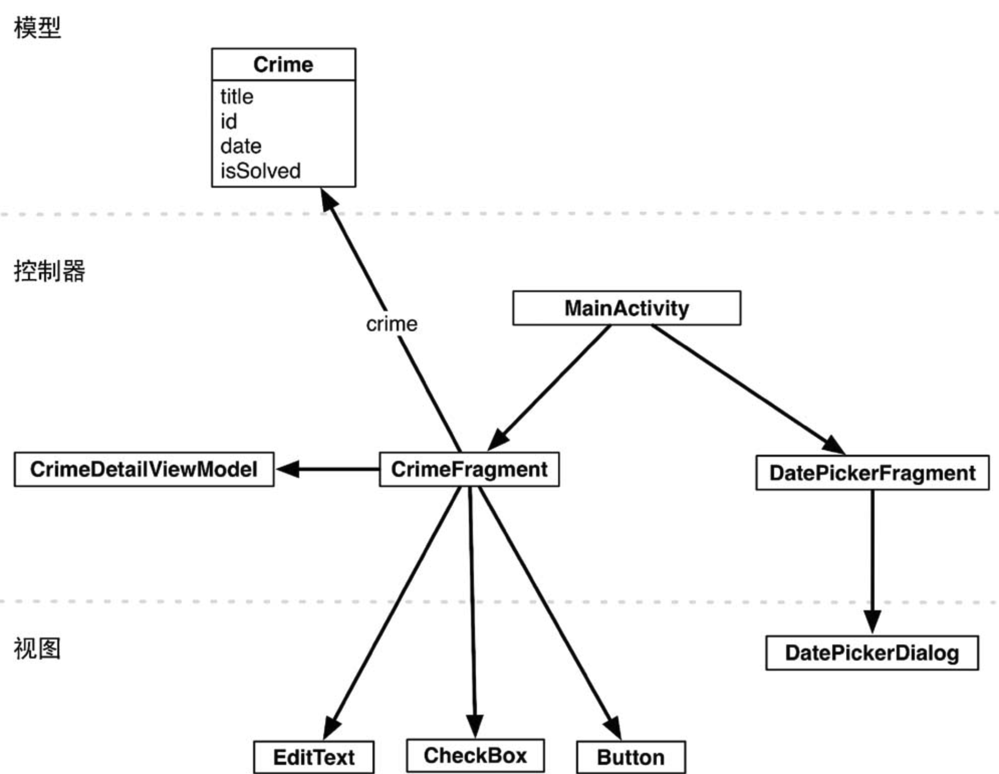

### 13.2 fragment间的数据传递

1. activity之间通过Intent附加信息传递数据
2. fragment和activity之间（使用回调接口）传递数据
3. **同一activity托管的两个fragment间传递数据**

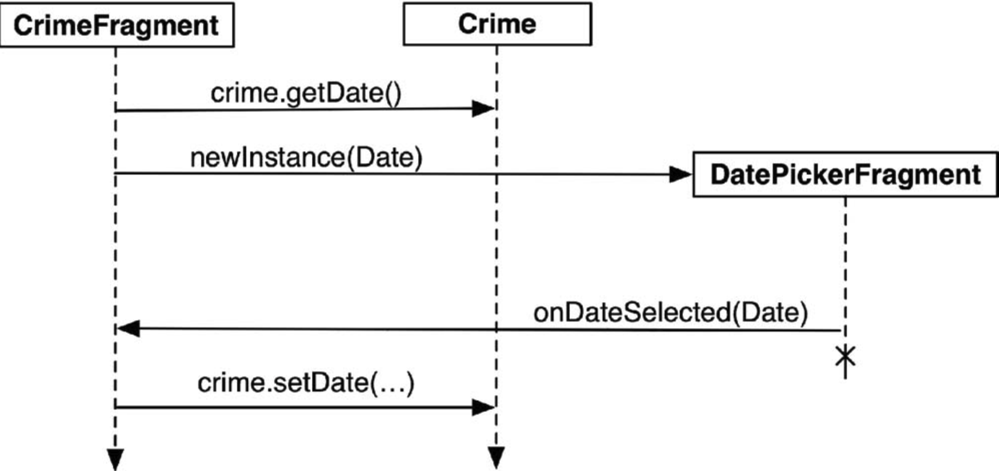

#### 13.2.1 传递数据给DatePickerFragment

```kotlin
// 创建带参数的实例
companion object {
    fun newInstance(date: Date): DatePickerFragment {
        val args = Bundle().apply {
            putLong(ARG_DATE, date.time)
        }
        return DatePickerFragment().apply {
            arguments = args
        }
    }
}

// 获取参数并初始化数据
override fun onCreateDialog(savedInstanceState: Bundle?): Dialog {
    val date: Date = arguments?.getLong(ARG_DATE)?.let {
        Date(it)
    } ?: throw IllegalArgumentException("no crime date found in arguments")
    val calendar = Calendar.getInstance()
    calendar.time = date
    val initialYear = calendar.get(Calendar.YEAR)
    val initialMonth = calendar.get(Calendar.MONTH)
    val initialDay = calendar.get(Calendar.DAY_OF_MONTH)
    return DatePickerDialog(
        // 获取视图相关必要资源的context对象
        requireContext(),
        null,
        initialYear,
        initialMonth,
        initialDay
    )
}
```

#### 13.2.2 返回数据给CrimeFragment

将CrimeFragment设置成DatePickerFragment的目标fragment

### 13.3 挑战练习：时间选择对话框

## 第14章 应用栏

### 14.1 AppCompat默认应用栏

默认主题来源：

1. `manifest/AndroidManifest.xml`中`application`节下的`android:theme`值指向`res/values/theme/theme.xml`中的对应配置项
2. 该配置项的值来源于AndroidStudio在创建项目时，为所有继承AppCompatActivity的activity添加了一个默认应用栏
3. 在`build.gradle`中可以看到该依赖项：`implementation 'androidx.appcompat:appcompat:1.6.1'`

### 14.2 应用栏菜单

**应用栏菜单由菜单项（又称操作项）组成**，它占据着应用栏的**右上方区域**。菜单项的操作应用于当前屏幕，甚至整个应用

#### 14.2.1 在XML文件中定义菜单

菜单是一种类似于布局的资源。创建菜单定义文件并将其放置在res/menu目录后，Android会自动生成相应的资源ID。随后，在代码中实例化菜单时，就可以直接使用

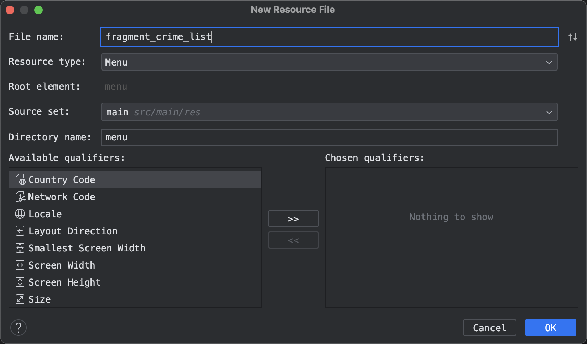

**菜单定义文件遵循了与布局文件一样的命名原则**，但分别位于不同的目录

```xml
<menu xmlns:android="http://schemas.android.com/apk/res/android"
    xmlns:app="http://schemas.android.com/apk/res-auto">
    <item
        android:id="@+id/new_crime"
        android:icon="@android:drawable/ic_menu_add"
        android:title="@string/new_crime"
        app:showAsAction="ifRoom|withText" />
</menu>
```

showAsAction属性用于指定菜单项是显示在应用栏上，还是隐藏于溢出菜单（overflow menu）中。该属性当前设置为ifRoom和withText的组合值。因此，只要空间足够，菜单项图标及其文字描述都会显示在应用栏上。如果空间仅够显示菜单项图标，文字描述就不会显示；如果空间大小不够显示任何项，菜单项就会隐藏到溢出菜单中

#### 14.2.2 创建菜单

```kotlin
override fun onCreate(savedInstanceState: Bundle?) {
    super.onCreate(savedInstanceState)
    // 告之FragmentManager，CrimeListFragment需要接收选项菜单函数回调
    // Fragment.onCreateOptionsMenu(Menu, MenuInflater)函数是由FragmentManager负责调用的。
    // 因此，当activity接收到操作系统的onCreateOptionsMenu(...)函数回调请求时，我们必须明确告诉FragmentManager，
    // 其管理的fragment应接收onCreateOptionsMenu(...)函数的调用指令
    setHasOptionsMenu(true)
}
```

#### 14.2.3 响应菜单项选择

```kotlin
override fun onOptionsItemSelected(item: MenuItem): Boolean {
    return when (item.itemId) {
        R.id.new_crime -> {
            val crime = Crime()
            crimeListViewModel.addCrime(crime)
            callbacks?.onCrimeSelected(crime.id)
            // 返回true值以表明任务已完成。如果返回false值，
            // 就调用托管activity的onOptionsItemSelected(MenuItem)函数继续
            true
        }
        else -> return super.onOptionsItemSelected(item)
    }
}
```

### 14.3 使用Android Asset Studio

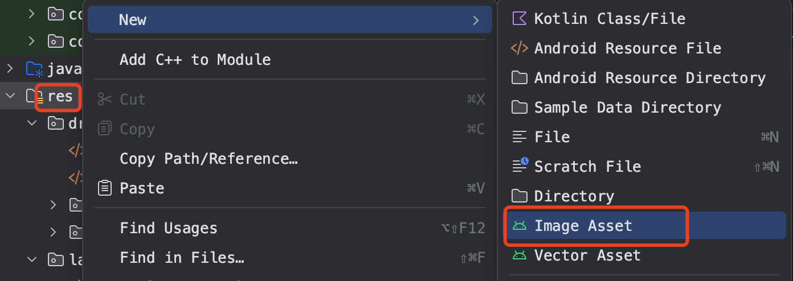

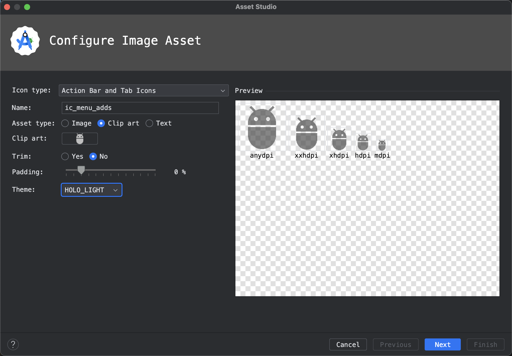

### 14.4 深入学习：应用栏、操作栏与工具栏

- 安卓5.0之前应用栏使用的是ActionBar类实现，从5.0开始，则是使用新的Toolbar类
- ActionBar和Toolbar是两个非常相似的组件。工具栏建立在操作栏基础之上。除了UI视觉上调整，在使用上，工具栏比操作栏更灵活
- 工具栏还能支持内嵌视图和调整高度，这极大地丰富了应用的交互模式

### 14.5 深入学习：AppCompat版应用栏

### 14.6 挑战练习：RecyclerView空视图


## 第15章 隐式intent

在Android系统中，可利用隐式intent启动其他应用的activity。在显式intent中，指定要启动的activity类，操作系统会负责启动它。在隐式intent中，只要描述要完成的任务，操作系统就会找到合适的应用，并在其中启动相应的activity

### 15.1 添加按钮部件

### 15.2 添加嫌疑人信息至模型层

```kotlin
@Database(entities = [Crime::class], version = 2)
@TypeConverters(CrimeTypeConverters::class)
abstract class CrimeDatabase : RoomDatabase() {
    abstract fun crimeDao(): CrimeDao
}

// 这里会根据数据库迁移的版本号来触发修改数据表
val migration_1_2 = object : Migration(1, 2) {
    override fun migrate(db: SupportSQLiteDatabase) {
        db.execSQL("ALTER TABLE Crime ADD COLUMN suspect TEXT NOT NULL DEFAULT ''")
    }
}
```

当应用启动，Room创建数据库时，它会检查设备上现有数据库的版本。如果检查到的版本和定义在@Database注解里的不一样，Room会找到合适的Migration以更新数据库到最新版本

为数据库转换提供迁移很重要。**如果不提供，Room则会先删除旧版本数据库，再创建新版本数据库**。这意味着数据会全部丢失，用户肯定会抱怨的

### 15.3 使用格式化字符串

```xml
<!--  单个参数  -->
<string name="crime_report_suspect">the suspect is %s.</string>
<!--  多个参数  -->
<string name="crime_report">%1$s! The crime was discovered on %2$s. %3$s, and %4$s</string>
```

```kotlin
private fun getCrimeReport(): String {
    val solvedString = if (crime.isSolved) {
        getString(R.string.crime_report_solved)
    } else {
        getString(R.string.crime_report_unsolved)
    }
    val dateString = DateFormat.format(DATE_FORMAT, crime.date).toString()
    var suspect = if (crime.suspect.isBlank()) {
        getString(R.string.crime_report_no_suspect)
    } else {
        // 单个参数时的填充
        getString(R.string.crime_report_suspect, crime.suspect)
    }
  
    // 多个参数时的填充
    return getString(R.string.crime_report, crime.title, dateString, solvedString, suspect)
}
```

### 15.4 使用隐匿intent

显式intent：

```kotlin
val intent = Intent(this, CheatActivity::class.java)
startActivity(intent)
```

使用隐式intent时，只需告诉操作系统你想要做什么，操作系统就会去启动能够胜任工作任务的activity

#### 15.4.1 隐式intent的组成

组成部分：

1. 要执行的操作

   通常以Intent类中的常量来表示

2. 待访问数据的位置

3. 操作涉及的数据类型

   MIME形式的数据类型

4. 可行类别

   描述你打算**何时**、**何地**或者**如何使用**某个activity

**基于以上信息，操作系统将启动适用的activity（如果有多个应用适用，则用户自己选择）**

为响应隐式intent，必须在intent过滤器中明确设置activity的DEFAULT类别。action元素告诉操作系统，activity能够胜任指定任务。DEFAULT类别告诉操作系统（问谁可以做时），activity愿意处理某项任务，如下面这段配置

```xml
<activity
    android:name=".BrowserActivity"
    android:label="@string/app_name" >
    <intent-filter>
        <action android:name="android.intent.action.VIEW" />
        <category android:name="android.intent.category.DEFAULT" />
        <data android:scheme="http" android:host="www.bignerdranch.com" />
    </intent-filter>
</activity>
```

#### 15.4.2 发送消息

#### 15.4.3 获取联系人信息

#### 15.4.4 检查可响应任务的activity

