# CPU眼里的C/C++

## 第1章 预备知识

### 1.1 工具介绍

[Compiler Explorer](https://godbolt.org/)

### 1.2 CPU眼里的程序运行

1. **源码**通过编码生成**可执行文件**
2. 程序被**加载**到虚拟内存中，内存地址由低到高存放着代码、数据，并分配“堆”和“堆栈”区域（内存结构如下图），“堆”和“堆栈”之间有着巨大的内存空白，这让“堆”和“堆栈”有了充分的生长空间，虽然看上去非常浪费，但那仅仅是虚拟内存视角上的空白，只有在真正读写这段内存时，操作系统才会为其映射真正的物理内存，而且是用多少，映射多少
3. 操作系统为程序建立一个叫作“进程”的数据结构，并存储在特定的内存区域里面，其中决定程序运行的信息就是：线程的“上下文”，即CPU的寄存器状态，比如rip寄存器值等于程序中main函数的首地址，一旦操作系统进行任务调试，开始执行我们的程序时，rip寄存器就会引导CPU去执行可执行文件中的main函数

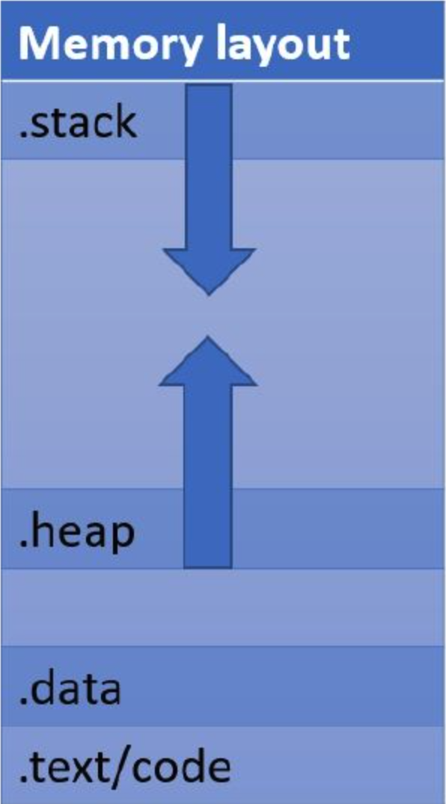

### 1.3 CPU眼里的汇编语言

## 第2章 基础语法

### 2.1 CPU眼里的main函数

从汇编的角度来说，`main`函数与普通函数其实没有区别，并且在编译过程中也可以通过编译选项来指定程序的入口（通常是`main`函数），如下程序：

```c
#include <stdio.h>
#include <stdlib.h>

void func() {
    printf("hello world\n");
    exit(0);
}
```

通过`gcc -nostartfiles -efunc test.c`也是可以编译通过并执行的

### 2.2 CPU眼里的变量

CPU眼里的变量就是内存地址

在代码编译并完成加载后，所有CPU指令的内存地址就是固定的，同时每条写指令中的偏移值也是固定的，所以，这里的全局变量和静态变量的内存地址，在程序的整个运行过程中都是不变的。而栈变量（就是临时变量）的内存地址，则会随着程序的运行而变化

每一个变量都对应了一个内存地址；变量的类型则决定了它占用内存空间的长度

### 2.3 CPU眼里的goto、if else

`goto`只是换了一种存在于代码中的形式：

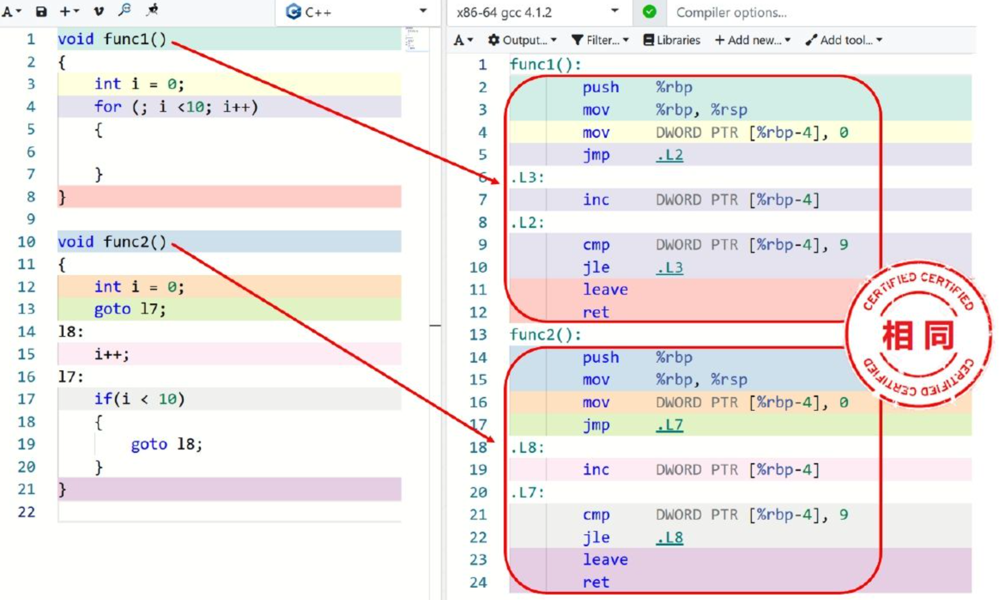

### 2.4 CPU眼里的指针变量

无论是什么类型的指针变量，对指针变量的读写操作，跟普通变量没有任何区别。所谓的“指向”，仍然是在描述指针变量的值是多少而已，这跟描述普通变量的值是多少，没有什么两样

### 2.5 CPU眼里的指针本质和风险

> `RIP` 是在 64 位 x86 架构中的一个寄存器，全称是 "指令指针寄存器"（Instruction Pointer Register）。在 64 位的 x86-64 架构中，它被称为 `RIP`，而在早期的 32 位 x86 架构中，这个寄存器被称为 `EIP`（扩展指令指针）。
>
> RIP 寄存器的主要作用是存储下一条要执行的指令的地址。在程序执行过程中，RIP 寄存器会自动更新，指向内存中的下一条指令。这使得处理器能够知道接下来需要执行哪些指令。简而言之，RIP 寄存器确保了程序能够按照预定的顺序逐步执行。
>
> 在程序的控制流中，比如执行一个跳转指令时，RIP 寄存器的值会被相应地更新，以指向新的指令地址。因此，RIP 是处理器正常运行的关键组成部分，确保了程序代码的顺序执行。

通过指针可以绕过可访问性的限制来直接操作数据，但MMU（内存管理单元）会处理

### 2.6 CPU眼里的数组

- 一维数组

  在传递数组参数的时候，无论你的数组有多大，编译器都不会像普通变量那样，为你在“堆栈”中构建一个相同大小的临时数组变量，而是，简简单单地传递一个数组的内存首地址，像传递指针变量一样，把数组的内存首地址传递给被调函数。而对数组的读、写操作，则等价于对指针的*操作

- 多维数组

  在CPU眼里，多维数组都是被当作一维数组来处理

### 2.7 CPU眼里的数组越界

如果说数组向低端地址的越界，是开疆拓土的话，那么，向高端地址越界，就是掉转枪头的内卷了

数组向高端地址越界（内卷），会修改堆栈中的关键数据，程序往往会立刻崩溃(segmentation fault)；同时，这也容易被黑客利用，用来执行事前准备好的恶意代码

### 2.8 CPU眼里的引用

在CPU眼里引用与指针除了以下几点外几乎没区别：

1. 引用显得更加简洁，特别是在读、写的时候，不需要像指针那样，加上\*操作
2. 指针可以被赋值成NULL：int*p = NULL，但引用不行：int &r = NULL是错误的
3. 指针可以随时改变它所指向的变量，而引用不能随意改变它所引用的变量，否则，会被视为重新定义了一个已经存在的引用变量
4. 指针存在“指针的指针”，而引用则不存在“引用的引用”

**引用的本质可以理解是“指针常量”，例如int* const p = &a**

### 2.9 CPU眼里的i++与++i

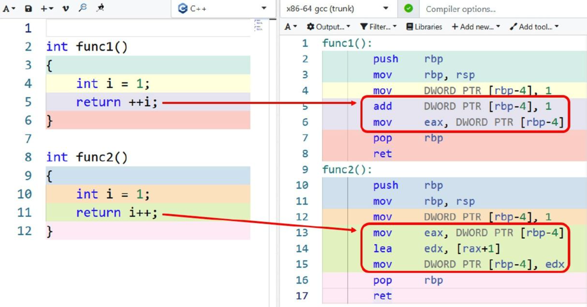

### 2.10 代码陷阱类型转换

```c
#include <stdio.h>

// 下面的代码输出为: different
int main()
{
    char a = 0xff;
    // 这里如果修改为 if (a == (char)0xff) 或 if ((unsigned char)a == 0xff) 则输出为: same
    if (a == 0xff)
    {
        printf("same");
    }
    else 
    {
        printf("different");
    }
}
```


1. 由于补码的原因，负数对应的二进制数，既可以被解释成一个正数，也可以被解释成一个负数
2. 由于负数的二义性，编译器在发现我们进行不同类型的比较时，往往会输出警告，但由于我们经常使用正数进行比较，可以有效规避二义性风险。所以，这也让编译器的警告看上去毫无意义。但对它可能造成的风险，我们必须心知肚明。解决这些警告，会让我们的代码更加可靠、强壮

## 第3章 函数原理

### 3.1 CPU眼里的参数传递

关于值传递与引用传递，没有比下面这张图更直白的了

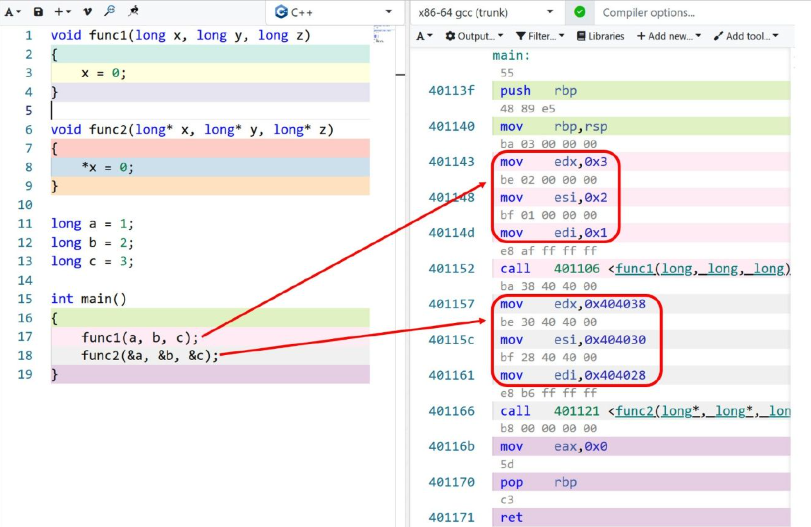

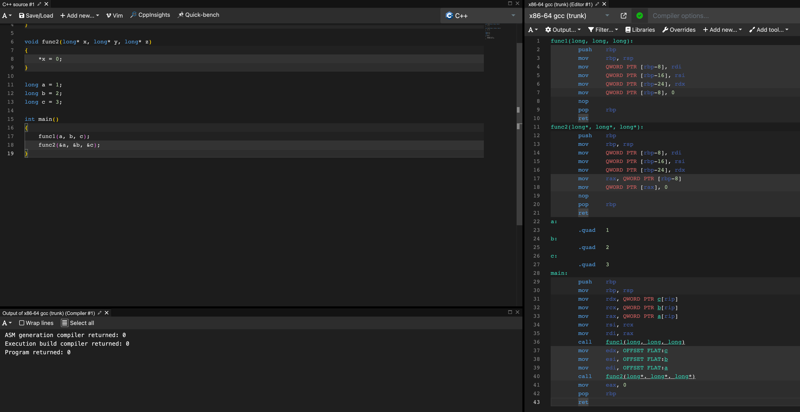

- 调用函数func1之前，将三个数值存入三个寄存器，然后调函数
- 调用函数func2之前，将三个内存地址存入三个寄存器，然后调用函数

#### 传值：变量值，不可改

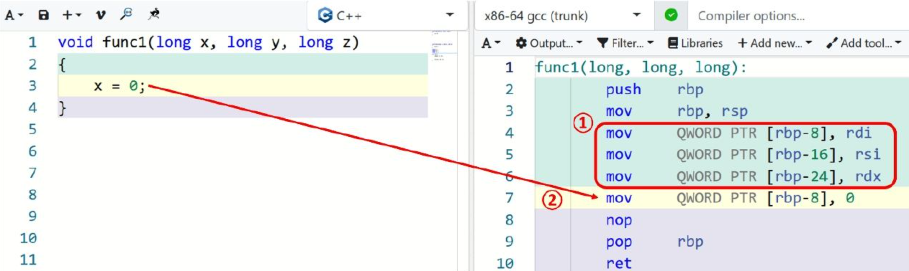

1. 寄存器完成了参数传递后，未来还会有其他用途，为了释放对寄存器的占用，寄存器rdi、rsi、rdx会把自己保存的参数值1、2、3存放在函数堆栈里面，它们对应的内存地址分别是[rbp - 8]、[rbp - 16]、[rbp - 24]，它们相当于外部变量a、b、c的等值克隆体（也称形式参数）
2. 把0写入函数堆栈里面，也就是内存地址[rbp - 8]里面

所以修改的是克隆体的值，对变量本体没有任何影响

#### 传指针：变量值，可改

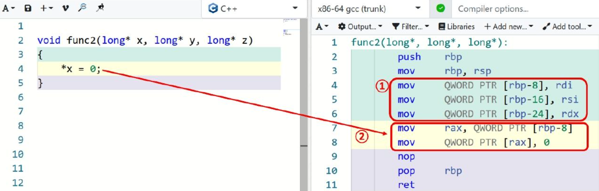

1. 跟传值的函数func1一样，寄存器完成了参数传递后，未来还会有其他用途，为了释放对寄存器的占用，寄存器rdi、rsi、rdx会把自己保存的参数值0x404028、0x404030、0x404038存放在函数堆栈里面，它们的内存地址分别是[rbp - 8]、[rbp - 16]、[rbp - 24]，它们相当于外部变量a、b、c地址的等值克隆体（也称形式参数）
2. 指针*操作，通过mov指令，把暂存在函数“堆栈”里面的内存地址0x404028，也就是外部变量a的内存地址，传递给寄存器rax，然后对这个内存地址(0x404028)，写入0。因为0x404028是本体变量a的内存地址，所以，此时外部变量a的值会由1变为0

#### 传引用 vs 传指针

传引用和传指针对应的CPU指令都是完全相同的

如果传递的参数比较复杂，例如传递对象，仅仅靠有限的CPU寄存器就不行了，而往往会使用堆栈，但无论使用哪种载体，其工作原理都是完全一致的，都是在“主调函数”与“被调函数”之间传递信息

### 3.2 CPU眼里的函数括号{}

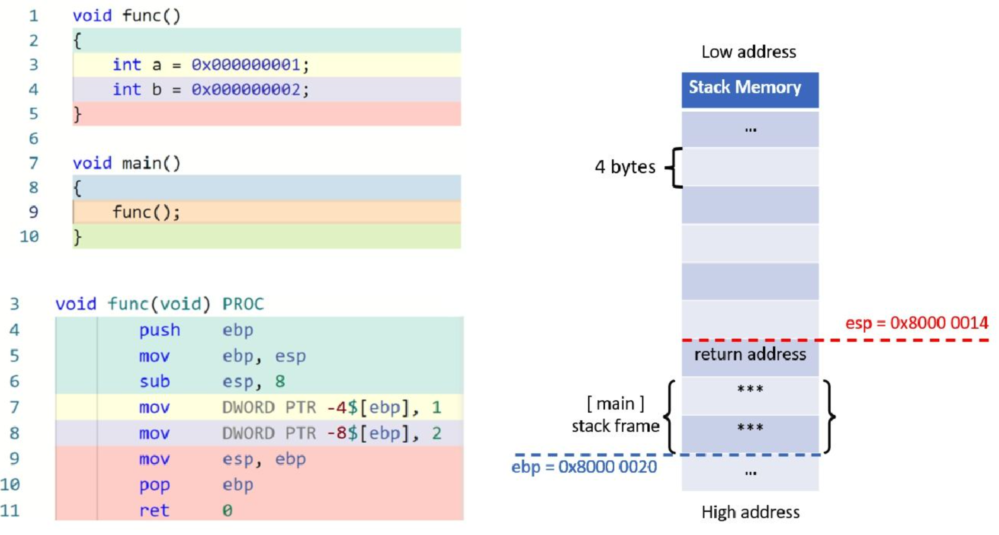

初始“栈帧”，是main函数的“栈帧”，在红、蓝两条线之间。红色水位线是CPU寄存器esp的值，用来标识“栈顶”的内存地址，有些类似C语言的指针变量；蓝色基准线，是CPU寄存器ebp的值，用来标识main函数的“栈帧”基地址，也类似C语言的指针变量

**func的执行过程：**

1. push指定把寄存器ebp的值压入“栈顶”，“栈顶”红色水位线随之升高，这样，main函数的“栈帧”保护工作完成

   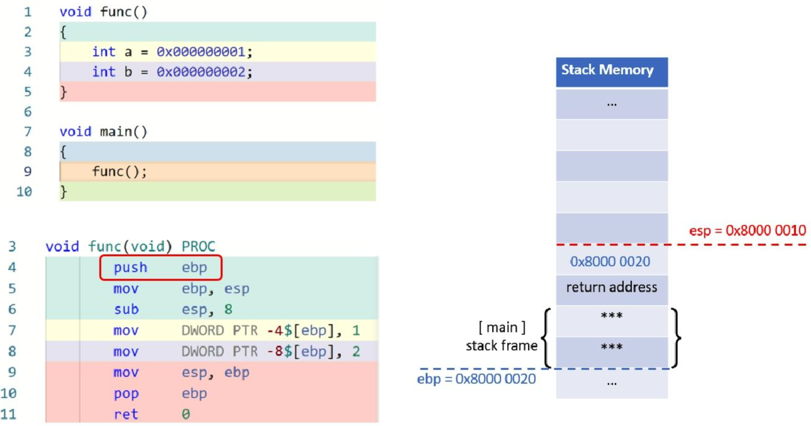

2. mov指令，更新一下“栈帧”基准线，让它与“栈顶”水位线齐平

   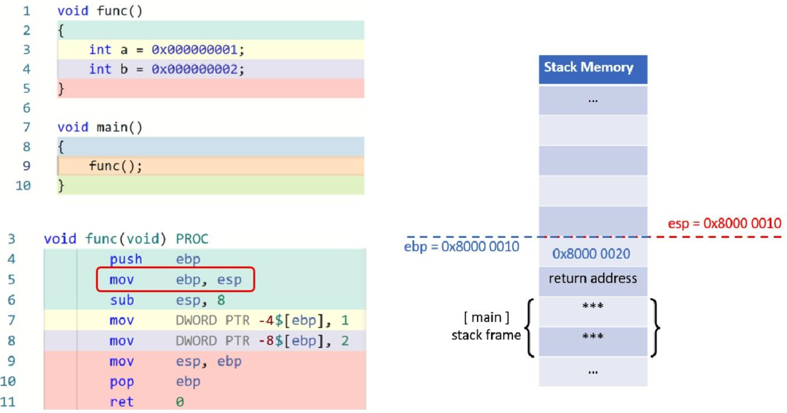

3. sub指令，把红色水位线提升8字节，用来给两个临时变量分配“堆栈”内存，至此，函数func的“栈帧”设置工作完成

   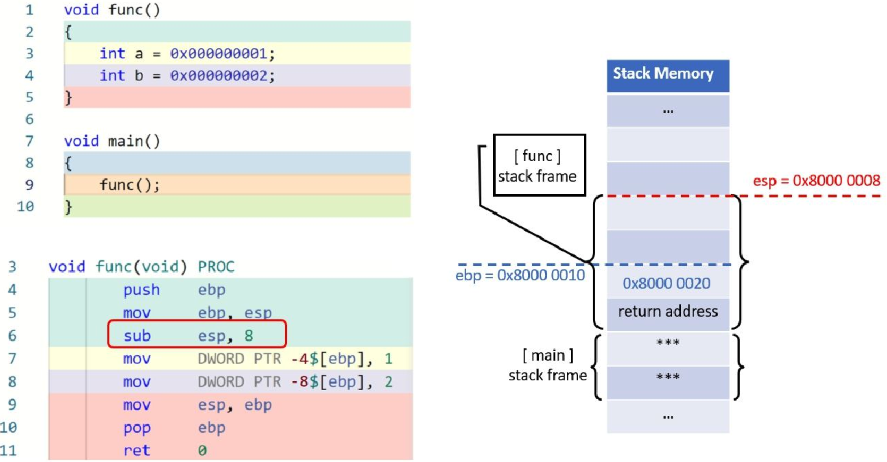

4. a，b两个变量相对于蓝色基准线的偏移，分别是4和8，正好用完函数的“栈帧”

   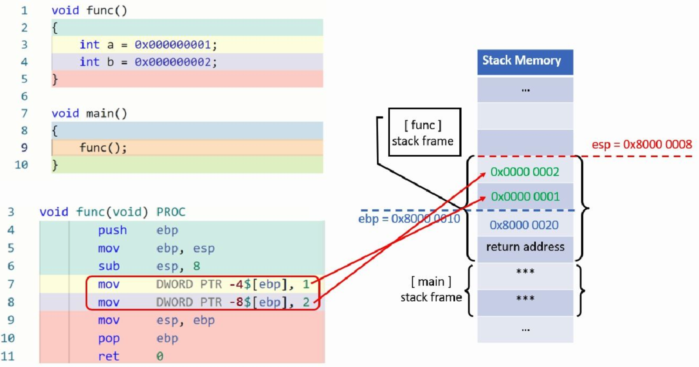

5. func执行完毕，要恢复main的“栈帧”，通过mov把红色水位线（寄存器esp）降至蓝色基准线（寄存器ebp）

   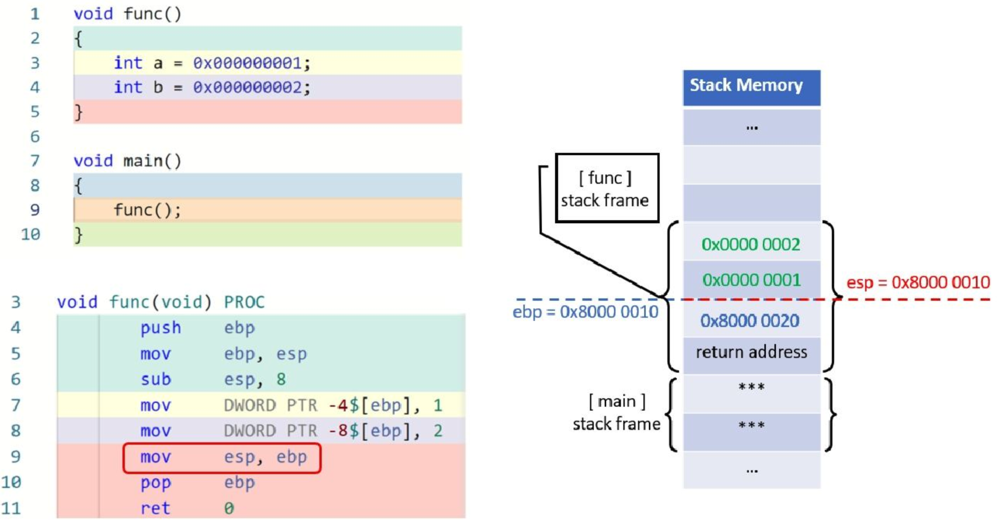

6. 最后执行pop指令，这样ebp就恢复到之前的位置，main函数的“栈帧”恢复工作

   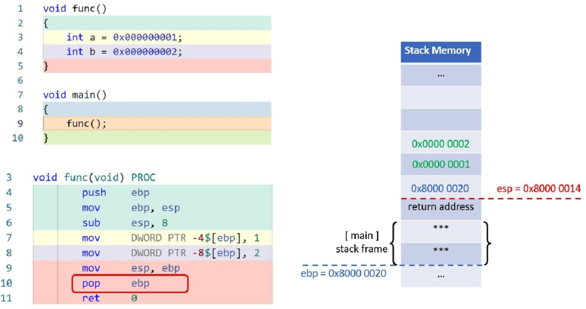

7. 操作系统会为每个任务（进程或线程）分配一段内存当作任务“堆栈”；CPU则提供两个寄存器esp、ebp，用来标识当前函数对“堆栈”的使用情况。随着函数的逐层调用，函数的“栈帧”会逐次堆叠，互不重合；随着函数的逐层返回，函数的“栈帧”会被就地放弃，但不会清理内存

   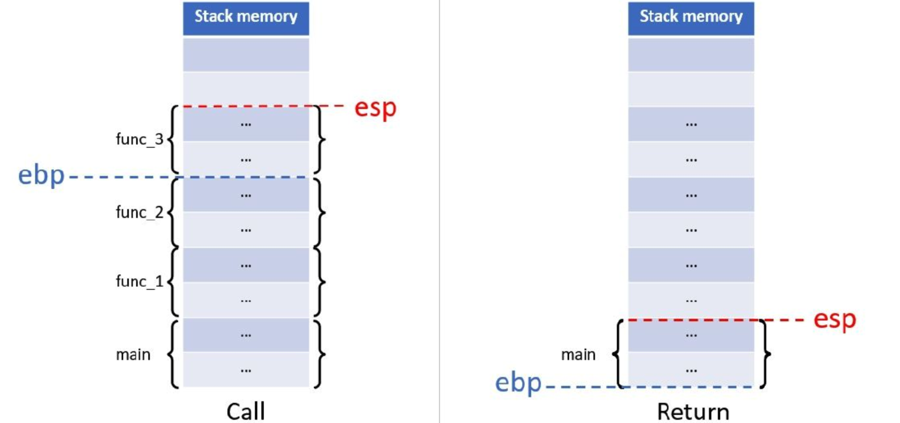

### 3.3 CPU眼里的调用和返回

1. call指令包括两个操作：

   - 把下一条指令的地址压入堆栈以便在调用结束时返回，同时红色”栈顶“水位线随之升高

     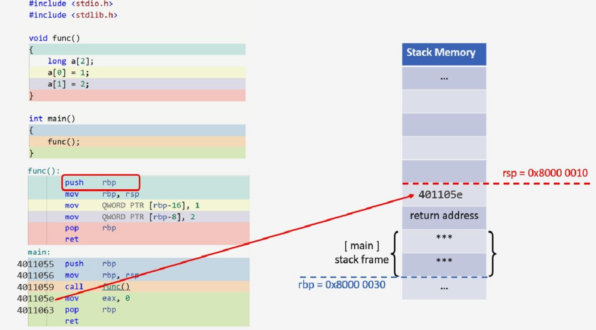

   - CPU跳转到函数func的首地址

     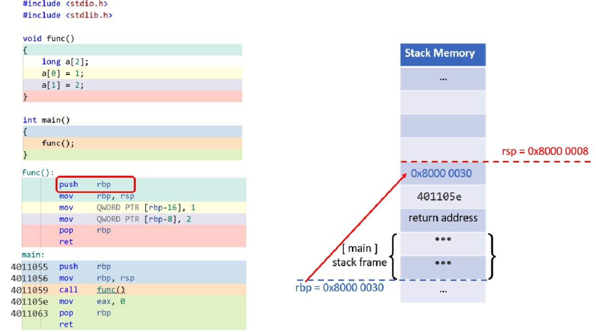

2. mov指令后，更新“栈帧”基准线，让它与“栈顶”齐平

   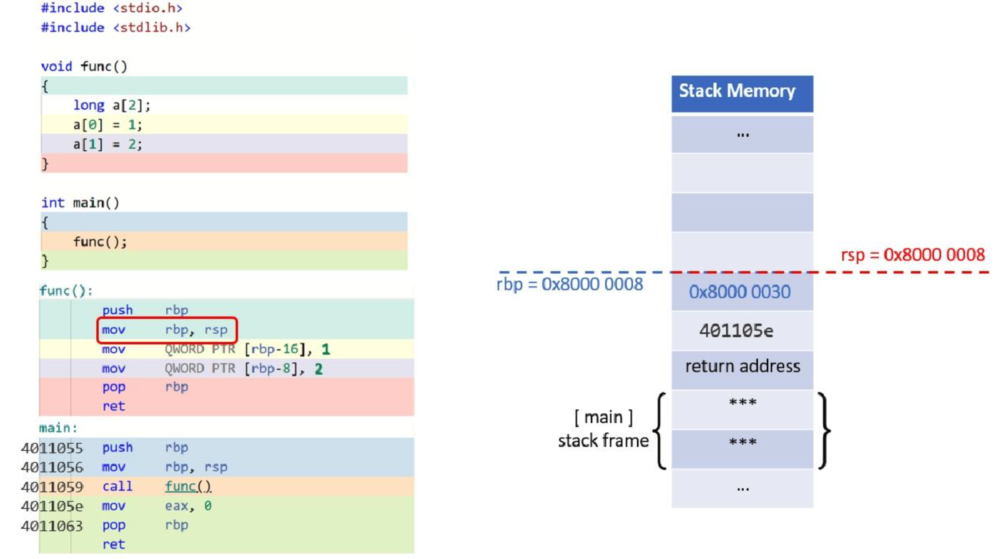

3. 两条mov指令，给数组赋值

   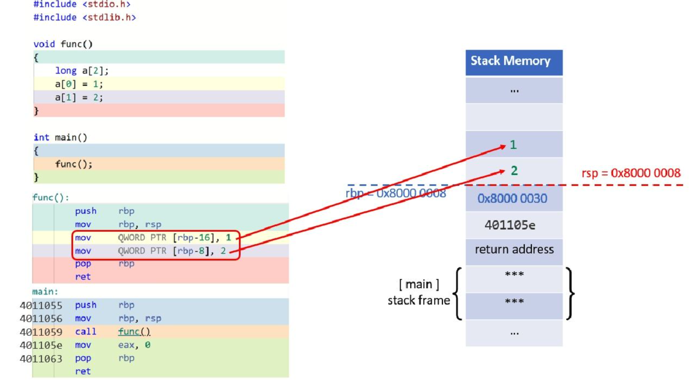

4. pop指令还原rbp，然后ret指令跟pop指令类似，它会把“栈顶”处的值传给寄存器rip，这样CPU就可以跳转到主调函数main被打断的地方继续执行了，同时”栈顶“下降

   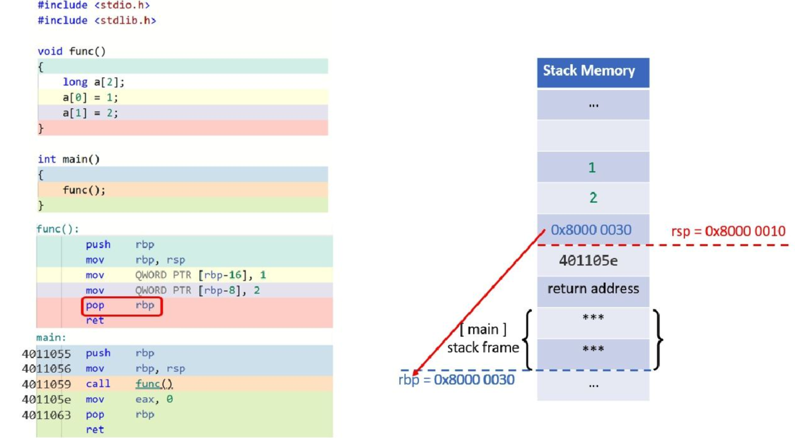

   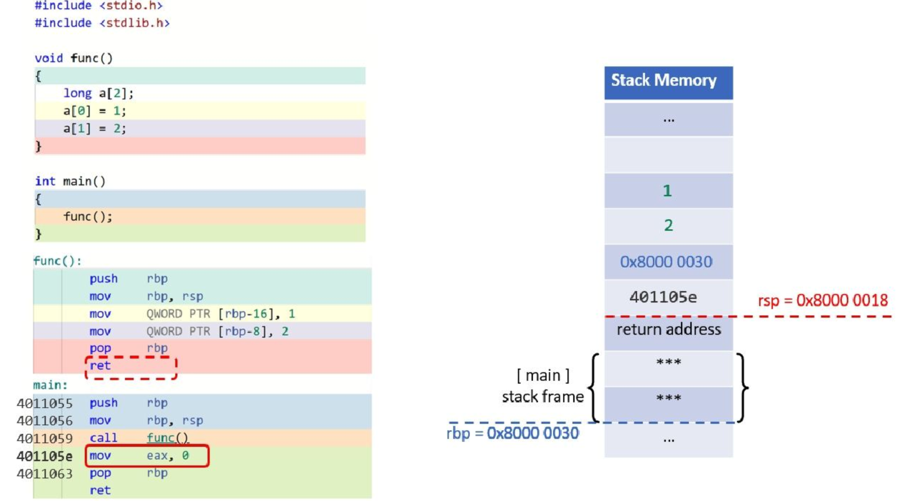

### 3.4 CPU眼里的函数指针

函数指针跟普通变量一样，它依然是变量。对函数指针的赋值和对普通变量的赋值，在CPU眼里它们之间没有任何区别

函数指针跟指针变量一样，不是用来作加减运算的，而是用来存放内存地址的。只不过，指针变量往往用来存放某个变量的地址；而函数指针往往用来存放某个函数的首地址

传递函数指针其实就是在传递某个函数的内存首地址

### 3.5 CPU眼里的函数返回值 

**CPU寄存器rax就是用来传递函数的返回值的**

### 3.6 CPU眼里的堆和栈

**“栈”的生长方向或者说消耗、申请方向，是由高端内存向低端内存“生长”的**

相比“栈”的高效操作，“堆”的申请、释放就显得比较慢

**“堆”的生长方向是由低端内存向高端内存生长的**

### 3.7 函数实验回溯函数调用关系

## 第4章 C++特性

### 4.1 CPU眼里的this

this指针是每一个成员函数必备的默认参数，只是C++语法规则将它隐藏起来了而已

当对象调用成员函数时，都会把自己的内存地址，也就是所谓的this指针，通过CPU寄存器rdi传递给成员函数。

> 在 x86-64 架构中，`RDI` 和 `RAX` 是两个重要的寄存器：
>
> 1. **RDI 寄存器**：RDI 是“目的索引”寄存器（Destination Index）的 64 位版本。在 32 位架构中，它被称为 `EDI`，而在 16 位架构中，它是 `DI`。RDI 寄存器通常用于存储字符串操作和数组处理函数的目的地址。它在一些系统调用和某些类型的汇编指令中用作参数传递或数据传输的目的地。
> 2. **RAX 寄存器**：RAX 是“累加器”寄存器（Accumulator）的 64 位版本。在 32 位架构中，这个寄存器被称为 `EAX`，而在 16 位架构中，它是 `AX`。RAX 寄存器主要用于算术运算、存储函数返回值以及在某些系统调用中作为主要的数据寄存器。由于其在运算和数据处理中的重要性，RAX 经常被用于存储中间结果和最终结果。
>
> 在 x86-64 架构的汇编语言编程中，这些寄存器具有特定的用途和约定，它们是实现低级编程和系统调用的基础组件。

### 4.2 CPU眼里的构造函数

1. 构造函数跟普通函数一样，都需要夹带一个隐形的参数：this指针
2. 派生类的构造函数，还会夹带调用基类的构造函数
3. 如果存在虚函数，构造函数会记录虚函数表的地址，并保存在一个隐藏的成员变量里面，随身携带，随用随取；这个隐藏的成员变量，往往位于对象的内存首地址

### 4.3 CPU眼里的虚函数

虚函数在实现方面，跟普通函数没有任何区别

当类A有虚函数的时候，类A就会偷偷生成一个隐藏的指针型的成员变量，方便起见，我们给这个隐藏变量起一个名字V，如图4-11所示。V存放着虚函数表的地址，根据偏移，就可以得到要执行的虚函数vfunc的内存地址，将其存在寄存器rdx里面，随后一条call rdx指令，**一个虚函数的调用就完成了**

### 4.4 CPU眼里的多态

**CPU对多态是无感的**

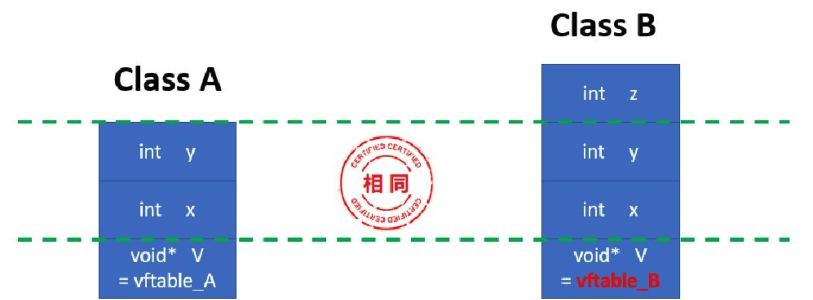

### 4.5 CPU眼里的模板

1. **CPU对模板是无感的，模板本质上是编译器根据我们提供的脚本自动补充代码**，涉及的数据类型越多，代码版本也就越多
2. 编译器自动补充的代码对程序员是不可见的。所以，在单步调试的时候，会出现源代码无法一一对应的问题，模板的相关代码，往往只能黑盒测试，很难找到有效的调试方法
3. 在对类进行模板化操作的时候，如果涉及数学、逻辑运算，由于编译器往往无法提供默认的运算符操作，就需要程序员手动为类重载这些运算符，避免可能的编译错误
4. 最后，很多情况下你是不需要亲手写模板的。相比从头写一个高风险的模板，直接使用STL （也就是标准模板库）显得更加高效、稳定、可靠

### 4.6 CPU眼里的malloc和new

### 4.7 面向对象实践依赖反转

## 第5章 高级编程

### 5.1 CPU眼里的虚拟内存

虚拟内存的空间大小由CPU的位数决定，也就是CPU能寻址多少位，虚拟内存就有多大，然后通过MMU和操作系统一起合作，实现虚拟内存到物理内存之间的映射

- 减少内存碎片

  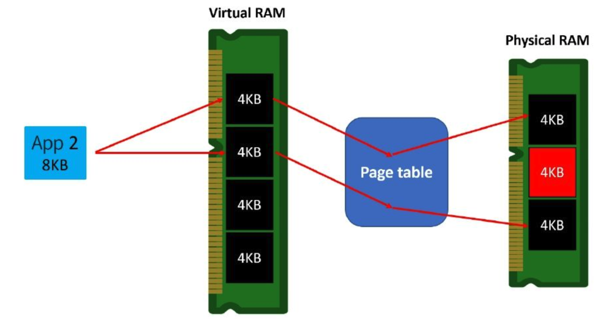

- 简化运行条件：程序员不必在编程的时候考虑如何让程序去适配计算机的内存环境

  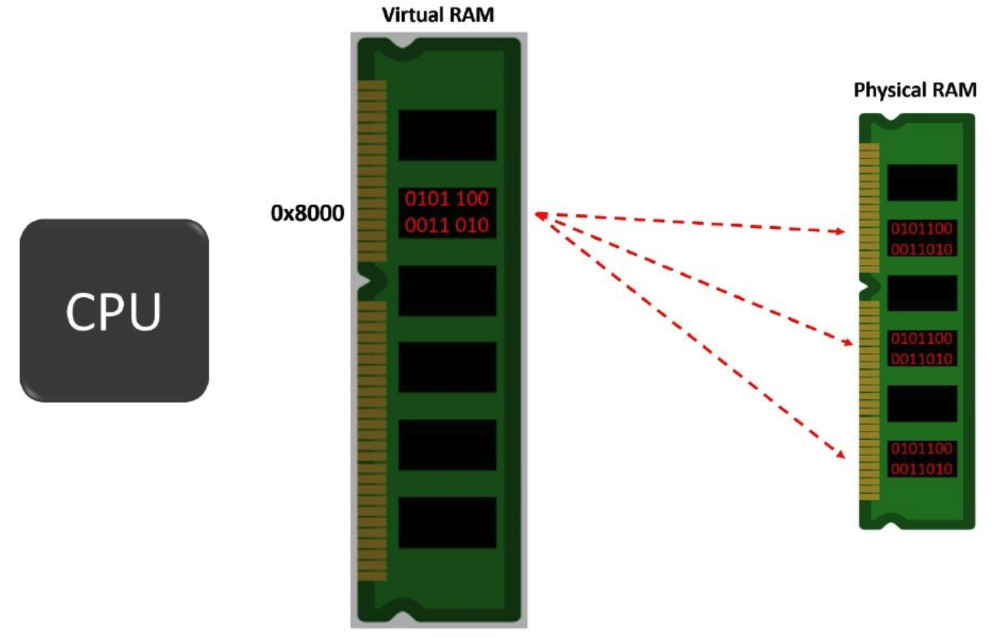

- 隔离进程

  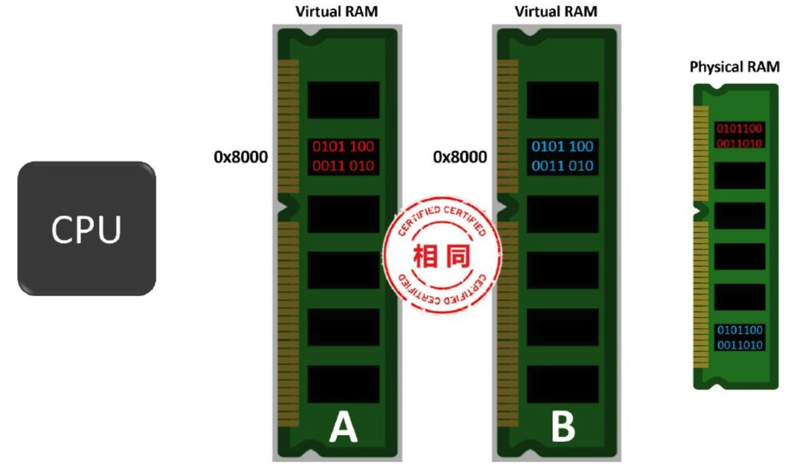

- 内存共享：只读部分共享 ，修改时通过：copy on write技术

  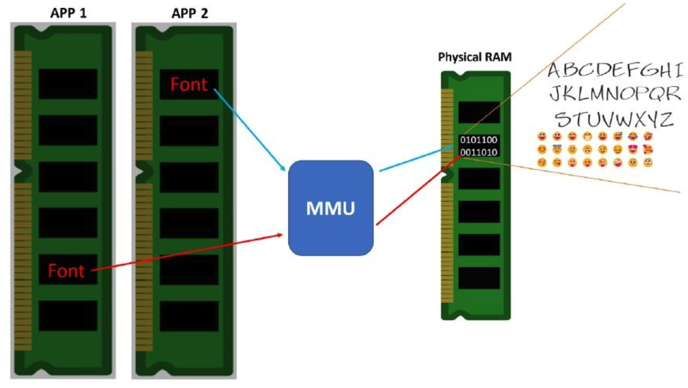

- SWAP

### 5.2 坐井观天的进程

虚拟地址只在进程内是有意义的：可以用来指示程序中的不同变量、所对应的不同的内存地址；一旦跳出这个进程，在进程之间比较虚拟地址就没有任何意义了

通过MMU实现了“进程”最显著的特点：空间独立性

### 5.3 CPU眼里的地址映射

分页的实现虚拟地址到物理地址转换，由MMU自动完成，CPU全程无感

每个进程都有一张自己的页表；若它们的页表不同，则进程空间是被隔离的；若页表相同或部分相同，则是在做进程间的内存共享

线程没有独立的页表，它们共享同一个进程的页表，所以，线程之间，天生就可以内存共享

**MMU是硬件**，程序员或操作系统需要把地址映射表的地址告诉MMU（设置相关的寄存器），剩下的地址转换工作就由MMU自动完成

### 5.4 CPU眼里的volatile

volatile的真正用意讲给编译器优化听的，原来，编译器会把它认为值不会改变的变量，当常量对待，以此缩减不必要的CPU指令，换取大幅度的效率优化。而volatile就是阻止这种优化，让CPU老老实实地从内存中读、写变量

### 5.5 CPU眼里的常量

程序运行前，**代码中的全局变量、常量会被拷贝到数据段**。只是这个数据段还会被细分成**只读数据段和可读、写数据段**，因此，它们所在的内存页的读、写属性可能是不同的

编译器可以通过对代码的解读，阻止明显的、针对常量的写操作。但由于常量跟变量一样，也只是内存地址的别名，所以程序员很容易通过指针或类型转换的方式，逃过编译器的检查

**真正保证常量不被写入的安全阀是MMU，它能从物理上阻止对特定内存的读写**。如果常量所在的内存页是不可读写的，例如read only数据段，那么写操作会被MMU阻止，并产生CPU异常

### 5.6 CPU眼里的系统调用

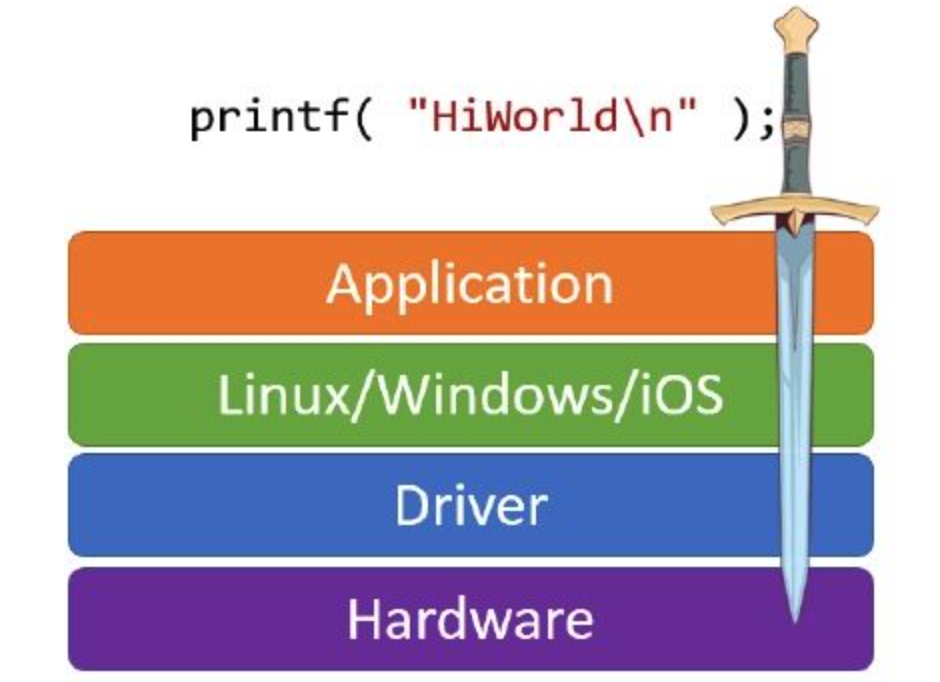

syscall指令触发CPU异常，从而让操作系统，接管后面的功能实现

### 5.7 CPU眼里的大端、小端

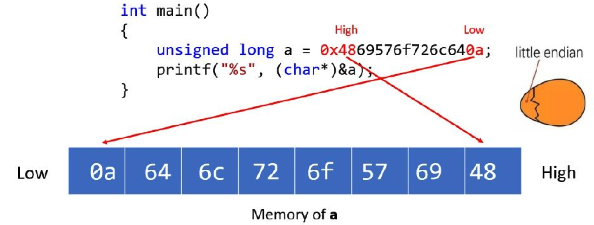

CPU把数值的低位字节写在内存的低地址；把数值的高位字节写在内存的高地址，也就是所谓的“小端”模式，反之，则为”大端“模式

**网络编程的时候，经过会用到htons、htonl、ntohs、ntohl这些函数接口，用来做字节序的转换**

### 5.8 CPU眼里的上下文

保存和恢复上下文，不过是在保存和恢复CPU的寄存器

除了中断、任务调度会强行保存、恢复上下文，程序也可以主动保存上下文。例如：通过调用sleep、mutex、semaphore主动放弃线程或进程的运行机会，迫使操作系统保存上下文

通常，操作系统会把上下文保存在每个线程、进程的**任务控制块TCB**中

### 5.9 CPU眼里的锁

Mutex的本质还是Semaphore，只是可用的共享资源上限是1而已，从而变相的实现了互斥

需要注意的是我们用“锁”保护的是资源、数据，而不是保护某个操作或者某个函数。所以，在进行“锁”操作的时候，我们要把影响范围尽量控制在一个小的范围，不要为了保护某一个变量，而锁住整个或者大片的函数

## 第6章 面试挑战

### 6.1 static、global及local

1. 全局变量和静态变量的内存地址是固定的，但临时变量的内存地址，往往不是固定的
2. 静态变量，除了作用域跟全局变量有所差异外，其存储原则、生命周期跟全局变量类似
3. 无论是全局变量还是静态变量，如果它们没有被初始化，或者被初始化为0。都会被安置在未初始化数据段，一定程度上可以节省二进制文件a.out的存储空间

### 6.2 数组和双重指针

### 6.3 指针为什么这么难

### 6.4 auto的工作原理

auto像是一个万能变量类型，任何被定义成auto的数据类型，编译器都可以通过其初始值来推导出它的真正类型

如果只是简单地用auto定义一个有初值的变量，请放心使用auto。但如果用auto替代指针和引用类型时，就可能产生一些非预期的错误，需要谨慎使用

### 6.5 thread_local的工作原理

寄存器fs就记录了该线程，所有thread_local变量所在的内存块的首地址

由于线程之间没有MMU的隔离，所以一个线程想访问其他线程的thread_local变量也并非不可能。在得到其他线程的thread_local变量地址后，就可以通过指针来“远程”读、写其他线程的thread_local变量。但这可不是设计的初衷考虑到代码的可读性，请不要这么作

### 6.6 面试的技巧

