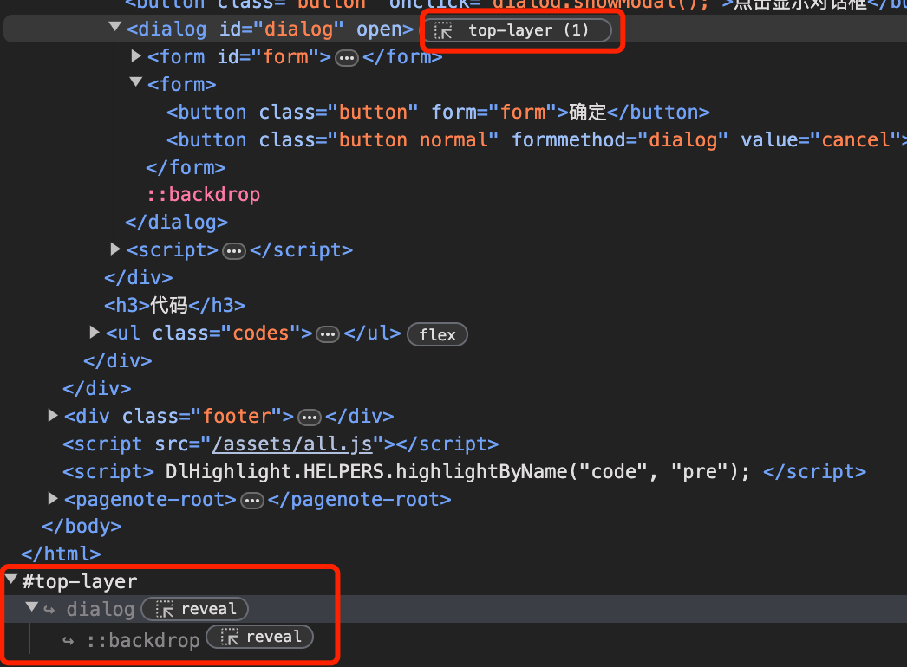
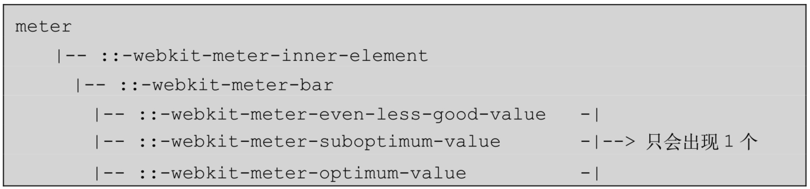
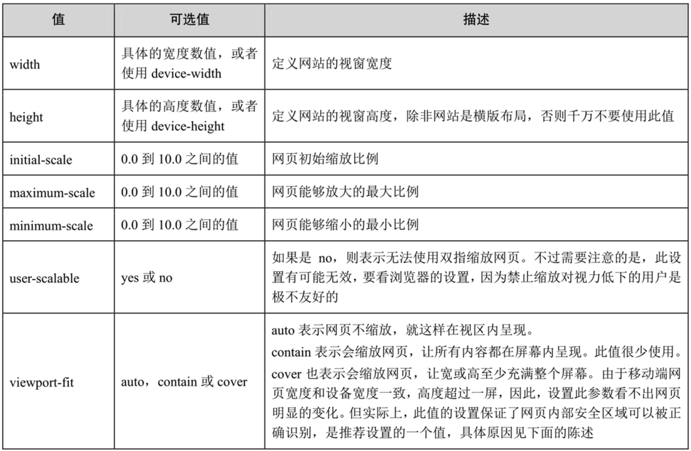
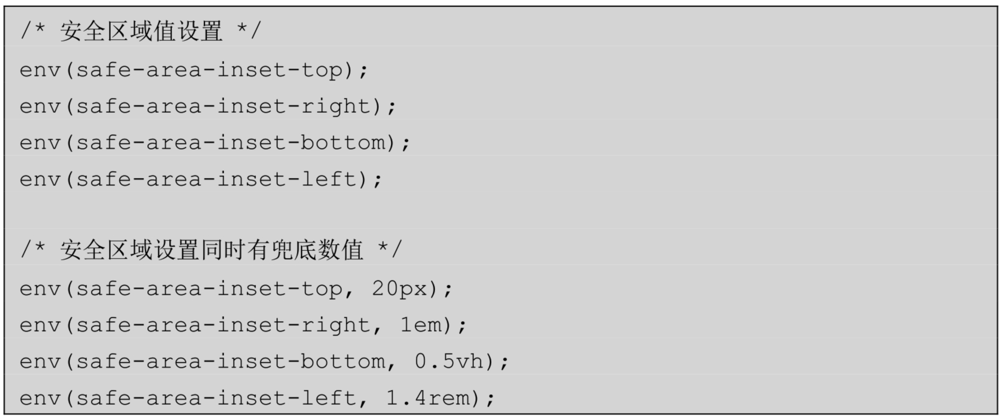
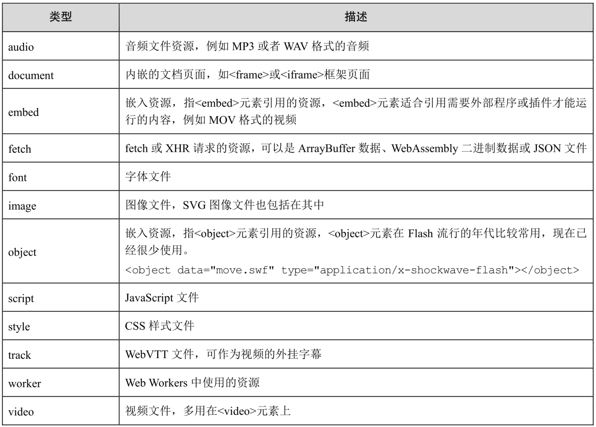
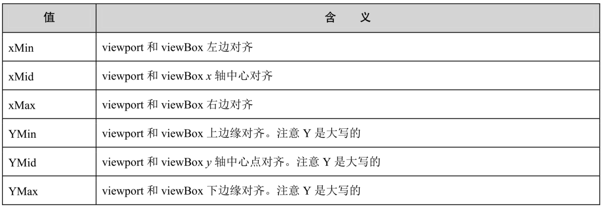
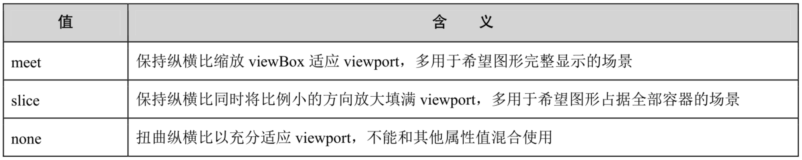
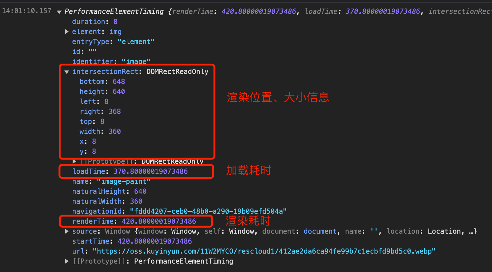
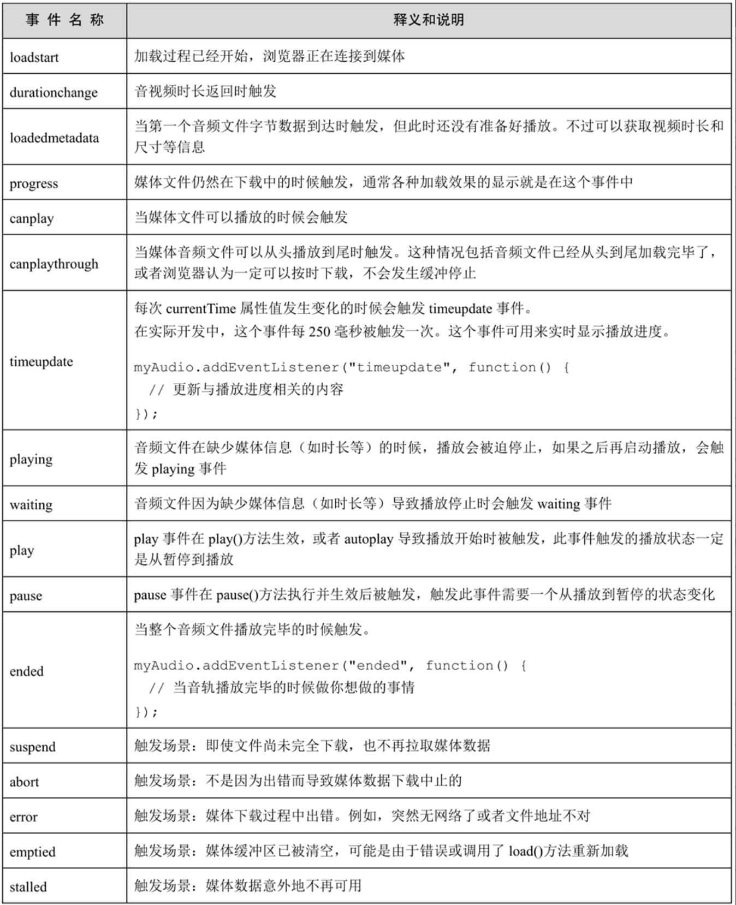
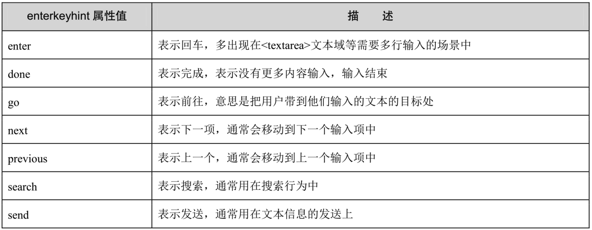

# HTML并不简单：Web前端开发精进秘籍

## 第1章 正确认识HTML

## 第2章 看似普通的元素的背后

### 2.1 你不知道的\<a\>元素

#### 2.1.1 rel属性知多少

##### 1. rel="nofollow"

给链接元素设置rel="nofollow"是SEO中的常用策略，用来告诉搜索引擎不要追踪这个链接。在以下两种情况下需要设置rel="nofollow"：

- 目标页面显示的均是无效信息，或者含有敏感信息
- 目标页面属于外站，不希望共享权重

##### 2. rel="noopener"与rel="opener"

设置`rel="opener"`允许在新打开的页面中通过window.opener访问原页面的全局window对象

2020年开始，safari、firefox以及chrome相继调整了opener策略，默认改为`noopener`，但考虑到一些老旧浏览器，最好同步设置`rel="noopener"`，如果链接地信得过，同时有跨窗体通信的需求，则可以设置`rel="opener"`

##### 3. rel="noreferrer"

`document.referrer`可以返回当前页面的来源地址。如果用户直接在浏览器的地址栏输入URL地址进行访问，或者通过设置了`rel="noreferrer"`的链接元素访问，那么`document.referrer`就会是**空字符串**

##### 4. relList对象

DOM元素的rel属性与class属性类似，支持空格分隔的多个值，同时支持通过`relList`对象来访问它，比如`link.relList.remove('noreferrer')`，与classList类似 ，它们都有一个专门的接口：DOMTokenList

#### 2.1.2 你知道target这个特性吗

除了`_blank`这个点击后每次都会开启一个新的窗口外，如果其值设置为任意固定的值，则每次打开新窗口的时候，都只会在这个窗口创建，而不会创建多个窗口：

```html
<a href="preview.html" target="_preview">预览</a>
```

#### 2.1.3 实用的download属性

用于触发下载操作，还可指定下载资源的名称，比如：

```html
<a href="./example.jpg" download>案例图片</a>
<a href="./example.jpg" download=“some-name.jpg”>案例图片</a>
```

如果链接的资源跨域了，则无法触发下载，除非浏览器无法打开这个链接资源（比如设置`Content-Type`值为浏览器不认识的MIME TYPE）

此时更好的做法是配置`Content-Disposition: attachment; filename ='download.jpg';`

#### 2.1.4 看看ping属性的妙用

##### 1.ping属性的优势

[Demo](https://www.htmlapi.cn/2/1-6.html)

- 无须JavaScript代码参与，网页功能异常也能上报
- 不受浏览器刷新、跳转或关闭的影响，也不会阻塞页面后续行为，这一点和`navigator.sendBeacon()`方法类似，可以保证数据上报的准确性
- 支持跨域
- 可上报大量数据，因为是POST请求
- 语义明确，使用方便，灵活自主

##### 2. ping属性的劣势

- 只能支持点击行为的上报，如果是（重要元素）进入视区或者类似弹框显示的上报，则需要额外触发元素的`click()`行为
- 只能支持`<a>`元素和`<area>`元素，在其他元素上设置ping属性没有作用，这就限制了其使用范围
- 只能是POST请求，目前主流的数据统计还是基于日志中的GET请求，不能复用现有的数据采集与统计基建
- “出身”不好，身为HTML属性，天然受某些开发者无视，难以得到有效传播
- 属于新特性，IE浏览器并不支持

##### 3. 适用的场景

可以用在需要精确知道数据但不需要交互反馈的场景中，比如“在读”

#### 2.1.5 好好讲一下referrerpolicy属性

referrerpolicy属性支持如下这些属性值：

- Referrer-Policy:no-referrer
- Referrer-Policy:no-referrer-when-downgrade
- Referrer-Policy:origin
- Referrer-Policy:origin-when-cross-origin
- Referrer-Policy:same-origin
- Referrer-Policy:strict-origin
- Referrer-Policy:strict-origin-when-cross-origin
- Referrer-Policy:unsafe-url

##### 1. no-referrer

`referrerpolicy="no-referrer"`与`rel="noreferrer"`等同

##### 2. no-referrer-when-downgrade

表示当协议安全级别保持不变或提高时(HTTP→HTTP, HTTP→HTTPS,HTTPS→HTTPS)，在Referer中发送源、路径和查询字符串，当协议的安全级别下降的时候(HTTPS→HTTP, HTTPS→file)不发送Referer信息

##### 3. origin

表示Referer信息是来源页面URL地址中的域信息（即`location.origin`的返回值）

##### 4. origin-when-cross-origin

表示如果跳转页面和来源页面是跨域的，则Referer只显示原始的域信息，否则显示完整的地址

##### 5. same-origin

表示域名必须相同，否则Referer信息为空

##### 6. strict-origin

仅当协议安全级别保持不变或升高(HTTPS→HTTPS, HTTP→HTTPS)时，发送仅包含域信息的Referer信息，如果协议的安全级别降低(HTTPS→HTTP)，则不发送Referer信息

##### 7. strict-origin-when-cross-origin（默认值）

表示当域名和安全协议相同或更高的时候，Referer信息是完整地址，如果跨域，则Referer信息是原始的域信息；如果安全协议降低，则Referer信息为空

##### 8. unsafe-url

表示就算URL地址不安全，也发送完整的Referer信息

#### 2.1.6 href属性的背后也有细节知识

##### 1. 自动绝对地址

-  使用`new Url()`，比如`const absUrl = new URL(url, [base]).href`，其中`base`为希望生成的域名
- 使用`a`标签的href属性，局限性在于它生成的域名只能是当前域名，如果希望调整，则需要考虑手动创建一个`<base>`标签，指定域名，再创建`a`标签，临时解决要生成的域名非当前域名的问题

##### 2. 锚点定位

`<a href="#example">查看案例</a>`点击后会自动查询页面中id属性为`example`的元素，如果有，则会通过改变滚动距离的方式让该元素定位到浏览器的上边缘

##### 3. 无障碍访问

一个链接元素，如果没有href属性，那么，这个元素是不能被键盘访问的，也不能匹配像：`any-link`这样的CSS选择器，此时，其行为表现本质上和`<span>`一样，就是个普通的内联元素

#### 2.1.7 为何`<base>`元素无人问津

`<base>`元素可以设置当前网页上下文的根地址，页面中所有设置的相对地址都会受此元素影响

`<base>`元素的影响太广泛了，除`<meta>`元素无法受到影响之外，**其余任何与链接地址相关的HTML属性都会受到影响，包括在JavaScript代码中运行的Ajax请求地址**

#### 2.1.8 如何实现链接元素的嵌套

通过`<area>`元素，不过`<area>`元素并非嵌套元素，无法包裹文字或其他标签，所以作为链接出现的时候，只能覆盖在其他的元素上

[Demo](https://www.htmlapi.cn/2/1-8.html)

关于`<area>`与`<map>`元素原本的作用是给图片元素上标记不规则的点击区域

[Demo](https://www.htmlapi.cn/2/1-9.html)

### 2.2 重新认识列表元素

#### 2.2.1 无序列表元素除`<ul>`外还有其他的

`<menu>`元素可以看成是`<ul>`元素的平行替代，两者的语法及默认样式都是一致的，区别在于语义上：前者用在可交互的列表上，后者用在称述性的列表上

#### 2.2.2 `<ol>`元素额外支持的那些属性

##### 1. type属性

可以用来定义有序列表的类型，跟CSS中的`list-style-type`属性值有一一对应的关系，但`list-style-type`的优先级更高

##### 2. start和value属性

start和value属性可以指定有序列表的起始序号，其中，start属性是用在`<ol>`元素上的，而value属性是用在`<li>`元素上的

##### 3. reversed降序

功能如字面意义：倒序

#### 2.2.3 定义列表的特点

定义列表，通常指的就是`<dl>`、`<dt>`和`<dd>`这三个元素。其中的首字母'd'是按照definition来理解的，表示定义；'l'是list的首字母，表示列表；'t'是term的首字母，表示术语；'d'是description的首字母，表示描述

### 2.3 正确认识`<body>`元素和`<html>`元素

#### 2.3.1 难以名状的关联性

##### 奇怪的背景色及渐变

1. 如果`<html>`元素未设置背景，则`<body>`元素的背景会自动按照`<html>`元素的背景规则渲染，否则按照类似`<div>`这样的普通元素的背景规则渲染
2. `<html>`元素的背景高度至少为一屏
3. `<body>`元素会有`margin: 8px;`的默认样式，因此，默认状态下，`<html>`元素的高度是8px，所以如果设置了渐变背景，其屏幕高度就是8px，而`<html>`元素的背景至少有一屏高度，因此，可以看到8px的水平条纹铺满整个屏幕

##### 失败的overflow: hidden

1. 如果`<html>`元素没有设置overflow属性，那么`<body>`元素设置的overflow属性值可以看成设置在`<html>`元素上
2. ` <html>`元素的overflow属性生效高度至少为一屏

#### 2.3.2 桌面端与移动端的差异

在桌面端，页面默认的滚动条是`<html>`元素产生的，而在移动端，该滚动条是`<body>`元素产生的，也就是说如果在桌面端我们希望页面不产生滚动是通过`html { overflow: hidden; }`，但在移动端则是要通过`body { overflow: hidden; }`来实现

`document.scrollingElement`，可以返回**当前页面的窗体滚动对象**，此API已经在2015年开始陆续被现代浏览器支持

## 第3章 那些自带交互特征的HTML元素

### 3.1 非常实用的`<details>`元素

#### 3.1.1 黄金搭档`<summary>`元素

[Demo](https://www.htmlapi.cn/3/1-1.html)

#### 3.1.2 样式的自定义

[Demo](https://www.htmlapi.cn/3/1-2.html)

#### 3.1.3 实际使用案例示意

[Demo](https://www.htmlapi.cn/3/1-3.html)

#### 3.1.4 全新的name属性与手风琴效果

多个`<details>`元素设置了相同的name属性值，则这些`<details>`元素之间会形成互斥关系，即同一时间只有一个`<details>`元素可以展开，其他的`<details>`元素会**自动收起**

**PS：尚未全面支持**

### 3.2 深入了解`<dialog>`元素和popover属性

#### 3.2.1 `<dialog>`元素的基本特性

> 在默认状态下，对话框元素会有黑色的边框、一定的padding内间距、绝对定位且左右居中，但是并没有垂直居中，这是个值得一提的细节知识，即如果我们使用open属性或者使用`dialog.open()`方法打开对话框，则对话框默认并不是在屏幕的垂直中心位置，而是在`<dialog>`元素所在的DOM树位置附近

#### 3.2.2 `<dialog>`元素的不可替代性

##### 1. `<form>`元素与对话框自动关闭

```html
<dialog>
    <p>除了在button元素上设置formmethod="dialog"，还可以在form元素上设置method="dialog"。</p>
    <form>
        <button class="button" formmethod="dialog">我知道了</button>
    </form>
</dialog>
```

[Demo](https://www.htmlapi.cn/3/2-1.html)

##### 2. 关闭来源的判断

```html
<button class="button" onclick="dialog.show();">点击显示弹框</button>
<p><output id="output">&nbsp;</output></p>
<dialog id="dialog">
    <form id="form">
        <p><input placeholder="请输入姓名" required /></p>
    </form>
    <form>
        <button class="button" form="form">确定</button>
      	<!--这里的value属性导致点击后returnValue为cancel-->
        <button class="button normal" formmethod="dialog" value="cancel">取消</button>
    </form>
</dialog>
<script>
form.addEventListener('submit', function (event) {
   event.preventDefault();
   // 这里导致拿到的returnValue为submit
   dialog.close('submit');
});
dialog.addEventListener('close', () => {
   output.textContent = 'returnValue: ' + dialog.returnValue;
});
</script>
```

[Demo](https://www.htmlapi.cn/3/2-2.html)

##### 3. 自动聚焦特性

需要注意的是：

1. 这种**自动聚焦特性会自动聚焦第一个能够聚焦的元素**，而不是智能识别是输入框还是按钮
2. `<dialog>`元素的焦点聚焦特性只有在执行`show()`或`showModal()`方法的时候才会触发
3. 如果对话框自动聚焦了，那么对话框关闭的时候，焦点会恢复到对话框显示之前的状态，不会影响正常的键盘访问

##### 4. `showModal()`方法与真正的对话框

通过`showModal()`方法可以让`<dialog>`成为一个真正的模态对话框，模态对话框的半透明背景是可以使用CSS伪元素`::backdrop`自定义，还可以使用`:modal`伪类区分是普通对话框还是模态对话框来定义样式

##### 5. 焦点隔离特性

即一旦模态对话框显示，则我们的Web页面的焦点只能出现在当前的对话框元素中，**对话框之外的元素是不可能获取焦点的**，哪怕使用JavaScript代码强制聚焦也不行

##### 6. 顶层特性

使用`showModal()`方法让对话框显示，对话框元素的层级自动**最高**，此时会使用`top-layer`特性，在html窗体之外创建一个绘制图层



##### 7. 自动层级特性

如果一个页面中有多个对话框通过`showModal()`方法显示，那么**后显示的对话框层级一定最高**

#### 3.2.3 原生弹层与popover属性

popover是一个全局属性

```html
<button popovertarget="imgPopover">
  点击我
</button>
<div popover id="imgPopover">
  
</div>
```


[Demo](https://www.htmlapi.cn/3/2-5.html)

##### 1. 基本使用

- popover弹层元素是顶层元素
- popover的模态背景默认是透明的（可以通过`::backdrop`伪元素自定义），且是可穿透的
- popover弹层内容之外的区域点击就会自动关闭当前弹层

##### 2. 原生弹层相关的属性和方法

- popover：值为'auto'或'manual'，后者表示弹层的隐藏需要手动执行，一般用在多个弹层同时出现的场景下
- popovertarget：指向目标弹层元素的id属性值，可通过当前元素的`popoverTargetElement`获取目标弹层元素的DOM对象
- popovertargetaction：值为'hide'、'show'、'toggle'，用于表示点击按钮后，弹层是展示还是隐藏
- 可以通过`:popover-open`伪类来匹配显示中的弹层（不包括强制设置`display: block`）
- 通过`beforetoggle`和`toggle`事件感知弹层显隐状态的变化

##### 3. popover属性模拟移动端下拉框

[Demo](https://www.htmlapi.cn/3/2-6.html)

### 3.3 控件伴侣`<label>`元素

虽然`<label>`元素的语义是“标签”，但是往往标签内容并没有使用`<label>`元素，而是使用`<a>`元素，然后使用rel="tag"来表达语义

#### 3.3.1 `<label>`元素的价值所在

1. 语义更精准，特别是对于屏幕阅读器这样的设备
2. 优雅地扩大了输入框的响应区域，点击`<label>`元素，关联的元素如输入框也会聚集

##### 1. 产生关联的方式

通过`label`的`for`属性，其值为需要关联的元素的`id`属性

##### 2. for属性的使用

因为`for`是关键字，所以在javascript中需要通过`document.querySelector('label').htmlFor`获取

`<output>`元素也支持`for`属性，但**其类型是一个DOMTokenList对象**

#### 3.3.2 必学的单选按钮、复选框技术

[Demo](https://www.htmlapi.cn/3/3-2.html)

### 3.4 什么时候使用`<fieldset>`元素和`<legend>`元素

#### 3.4.1 表单分组与`<fieldset>`元素的使用

核心要点就是表单中的内容中有没有“分组”的概念

#### 3.4.2 特殊且唯一的边框样式

```html
<fieldset>
  <legend>
    分隔线
  </legend>
</fieldset>
<style>
  fieldset {
    border: 0;
    border-top: 1px dashed #ccc;
  }
  legend {
    margin-inline: auto;
  }
</style>
```

#### 3.4.3 `<fieldset>`元素的独家功能

直接`<fieldset disabled>`可批量禁用表单元素

### 3.5 务必使用`<progress>`元素实现进度条

#### 3.5.1 `<progress>`元素的基本特性

当不设置`value`属性时，进度条会进入“不确定”状态，样式表现为循环等待状态，可以通过`:indeterminate`伪类来匹配样式

##### DOM对象属性

- max：最大值，缺省值为1.0，即范围为0.0～1.0
- value：当前进度值
- position：只读属性，进度百分比，如果为不确定状态，其值为-1
- labels：只读属性，得到的是指向该`<progress>`元素的`<label>`元素集合

#### 3.5.2 `<progress>`元素的样式自定义

[Demo](https://www.htmlapi.cn/3/5-1.html)

### 3.6 务必使用`<meter>`元素显示密码强度

#### 3.6.1 `<meter>`元素的基本特性

单词meter直译意思是“计量器”“计量表”，因此，在Web中，任何与丈量相关且需要分阶段提示的场景都非常适合使用`<meter>`元素

##### 属性简介

- min与max：分别表示最小最大值，默认为0和1
- value：当前值，默认为0
- low与high：分别表示过低警戒值与过高警戒值，但具体是过低还是过高、是否需要警戒值还依赖optimum属性
- optimum：
  - 位于low和high之间：说明low和high都是警戒值，只有在它们之间才是正常的，因此最终只有两个色值状态：橙色警戒和绿色正常
  - 比low下：说明low不是警戒值，而是推荐值，即值越小越安全，low与high之间的范围就属于警戒范围，超过high的值就是危险范围
  - 比high大：与上一种情况类似，则不过值越大越好

#### 3.6.2 `<meter>`元素的美化技巧

以Chrome浏览器为例，所有可以设置`<meter>`元素的选择器包括下面这些：

- meter元素自身的选择器
- `::-webkit-meter-inner-element`{}
- `::-webkit-meter-bar`{}灰色背景条
- `::-webkit-meter-even-less-good-value`{}红色
- `::-webkit-meter-optimum-value`{}橙色
- `::-webkit-meter-suboptimum-value`{}绿色

[Demo](https://www.htmlapi.cn/3/6-1.html)



## 第4章 经常出现在页面首尾的HTML元素

### 4.1 几万字都讲不完的`<meta>`元素

举个例子，下面meta标签的功能是2秒后自动跳转

```html
<meta http-equiv="refresh" conten="2; url='https://www.htmlapi.cn'">
```

甚至可以使用如下javascript来动态插入标签实现自动跳转

```javascript
const meta = document.createElement('meta');
meta.setAttribute('http-equiv','refresh');
meta.setAttribute('content','2; url="https://www.baidu.com"');

document.head.appendChild(meta)
```

#### 4.1.1 SEO最重要的元素之一

##### 1. 主要信息呈现

```html
<title>xxx</title>
<meta name="description" content="xxxx">
<meta name="keywords" content="html, htmlapi">
```

##### 2. robots策略定义

```html
<meta name="robots" content="noindex">
```

##### 3. 移动端权重平移

这是一个私有规则，由百度搜索引擎制定，可以平移桌面端网页的权重到移动端页面

```html
<meta http-equiv="mobile-agent" content="format=html5; url=https://mobile.htmlapi.cn"/>
```

##### 4. Open Graph协议

Open Graph协议直译为开放图谱协议，也被称为OG标签，是基于`<meta>`元素定义的一套信息规则，即任何页面只要遵守该协议，在被分享到社交媒体SNS网站上时，这些社交网站就会提取最有效的信息并呈现给用户，一般包括以下信息：

- og:title：分享的卡片的标题
- og:type：内容类型
- og:image：缩略图
- og:url：当前页面的URL地址
- 以及其它可选的，如`og:audio`、`og:video`、`og:description`等等

```html
<meta property="og:title" content="文章标题"/>
<meta property="og:type" content="article"/>
<meta property="og:url" content="https://www.htmlapi.cn/202310/some-url"/>
<meta property="og:image" content="https://image.htmlapi.cn/assets/images/example.jpg"/>
```

#### 4.1.2 网页尺寸设置

移动端开发必然会使用的`<meta name="viewport" content="...">`



这里推荐`viewport-fit=cover`因为只有设置了此值，类似下面的环境变量函数才能生效


#### 4.1.3 referrer设置与防盗图片显示

```html
<meta name="referrer" content="no-referrer">
```

#### 4.1.4 网站风格和主题色的设置

##### 1. theme-color

指定移动端浏览器顶部状态栏甚至标题栏的背景色（可以用移动端Chrome来验证）

```html
<meta name="theme-color" content="#0c58c0" />
<!--区分深色模式的版本-->
<meta name="theme-color" media=""(prefers-color-scheme: light) content="skyblue" />
<meta name="theme-color" media=""(prefers-color-scheme: dark) content="black" />
```

[Demo]()

##### 2. color-scheme

用来设置网站适配深色模式或浅色模式，比如如下设置会让网站强制使用深色模式进行渲染

```html
<meta name="color-scheme" content="dark">
```

其content还支持别的值：

- dark light：更倾向于深色主题，但如果用户选择了浅色主题，则按照浅色主题适配
- only light：只能使用浅色主题（注意，没有`only dark`）

### 4.2 知识同样非常密集的`<link>`元素

#### 4.2.1 favicon小图标的设置与显示

```html
<link rel="icon" href="/path/to/icons/favicon.ico" type="image/x-icon">
```

#### 4.2.2 网站换肤的最佳实现

```html
<link href="reset.css" rel="stylesheet" type="text/css">
<link href="default.css" rel="stylesheet" type="text/css" title="默认">
<link href="red.css" rel="alternate stylesheet" type="text/css" title="红色">
<link href="reset.css" rel="alternate stylesheet" type="text/css" title="绿色">
```

在上面4个`<link>`元素中，共出现了3种不同性质的CSS样式文件加载：

- 没有title属性，rel属性值仅仅是`stylesheet`的`<link>`无论如何都会加载并渲染的，如reset.css
- 有title属性，rel属性值仅仅是`stylesheet`的`<link>`作为默认样式CSS文件加载并渲染的，如default.css
- 有title属性，rel属性值同时包含`alternate stylesheet`的`<link>`作为备选样式CSS文件加载并默认不渲染的，如red.css和green.css

`rel="stylesheet"`的`<link>`如果有title属性并有值，性质上就变成一个**可以控制其渲染或者不渲染的特殊元素**了，可通过JavaScript代码修改`<link>`元素**DOM对象的disabled属性值为false**，可以让默认不渲染的CSS开始渲染

```js
document.querySelector('link[href="red.css"]').disabled = false;
```

通过此种方法实现（`rel="alternate"`）的换肤功能体验好，UI是瞬间切换，因为浏览器已经把换肤的CSS文件预加载好了

[Demo](https://www.htmlapi.cn/4/2-2.html)

#### 4.2.3 资源的预加载

##### 1. prefetch预获取

```html
<link rel="prefetch" href="/nextpage/main.js"/>
```

prefetch请求和正常请求在HTTP头上有一个区别，即prefetch请求会有特殊的`Sec-Purpose：prefetch`请求头

prefetch加载的**优先级非常低**，比preload（预加载）还要低，因为prefetch加载的是**下一个页面会用到的资源**，而preload加载的是本页面即将使用的资源

##### 2. preload

```html
<link rel="preload" href="/currentpage/main.js" as="script"/>
```

preload在使用的时候更推荐设置as属性，精准指定需要加载的元素类型，便于浏览器确定资源的优先级，并且设置正确的Accept请求头及内容安全策略，多于诸如图片和视频等有多种格式的资源，还可以设置type属性来指定MIME类型：

```html
<link rel="preload" href="example.mp4" as="video" type="video/mp4"/>
```

对于字体的预加载，要设置`crossorigin="anonymous"`，不然**会触发两次加载**

```html
<link rel="preload" href="https://otherwebsite.com/myfont.ttf" as="font" crossorigin="anonymous"/>
```

preload支持的as类型



##### 3. 网络请求优先级

在Chrome浏览器中，网络请求的优先级分成了如下5个等级

- Highest：最高，如页面HTML资源和CSS文件
- High：高，如正文图片请求资源
- Medium：中等，如页面的业务JavaScript文件请求
- Low：低，如内联的Base64资源、异步加载的JavaScript文件请求
- Lowest：最低，如发送的统计请求

> prefetch请求的优先级是Lowest，preload请求的优先级是Low或High，至于具体是Low还是High，是由as属性指定的类型决定的，例如script类型对应的是High，image类型对应的是Low

##### 4. media媒体查询

投入产出比不高

##### 5. fetchPriority与优先级的改变

如果想改变preload默认的优先级，则可以设置`fetchPriority`属性，比如

```html
<link rel="preload" href="./important-source.png" as="image" fetchPriority="high"/>
```

##### 6. modulepreload与模块预加载

> modulepreload是随着浏览器支持原生export和import语法后新增的特性，语法及作用和preload类似，区别就在于modulepreload预加载的都是JavaScript模块资源，也就是需要在`<script>`元素上设置`type="module"`，或者可以使用import语法导入的JavaScript文件资源

### 4.3 相对简单的`<style>`元素

#### 4.3.1 废弃的`type`属性

#### 4.3.2 局部样式特性

想要实现CSS局部渲染只有一个方法，就是在Shadow DOM中创建，用在Web Components组件开发中

最近浏览器支持了一个新的名为@scope的CSS规则，多少有点局部渲染的味道，不过这里的“布局渲染”更像一种语法糖，而非局部上下文特性，例如：

```css
@scope (header) {
  nav {}
  a {}
}
```

等同于：

```css
header nav {}
header a {}
```

### 4.4 `<script>`元素的水很深

#### 4.4.1 async属性与defer属性的区别

defer属性可以让JavaScript文件在异步加载的同时保证顺序

**defer属性会推迟对DOMContentLoaded事件的执行**，直到所有设置了defer属性的JavaScript文件都加载完毕

#### 4.4.2 不太一般的type属性

##### 1. 可缺省的type属性值

默认情况可省略，除非服务器返回的javascript文件的MIME Type不正确

##### 2. 自定义type与文本化

内联的`<script>`元素有一个特性，就是如果定义的type类型不标准，那么此时`<script>`元素里面的文本内容就会按照普通的文本字符串进行渲染，而不再是JavaScript代码

##### 3. 熟知type="module"

##### 4. 认识type="importmap"

#### 4.4.3 灵活运用Import Maps

直接看代码：

```html
<!DOCTYPE html>
<html lang="en">

<head>
    <meta charset="UTF-8">
    <meta name="viewport" content="width=device-width, initial-scale=1.0">
    <title>Import Maps Demo</title>
</head>

<body>
    <script type="importmap">
        {
            "imports": {
                "vue": "https://unpkg.com/vue@3/dist/vue.esm-browser.js"
            }
        }
    </script>
    <div id="app">{{message}}</div>
    <script type="module">
        import { createApp } from 'vue';

        createApp({
            data() {
                return {
                    message: 'Hello Vue'
                }
            }
        }).mount('#app');
    </script>
</body>

</html>
```

除了`imports`关键字，还有一个不常用到的`scopes`关键字，它常用于加载不同版本的js文件：

```html
<script type="importmap">
{
	"imports": {
		"vue": "https://cdn.bootcdn.net/ajax/libs/vue/3.3.4/vue.esm-browser.min.js"
	},
	"scopes": {
		"/assets/main-old.js": {
			"vue": "https://cdn.bootcdn.net/ajax/libs/vue/2.6.4/vue.esm-browser.min.js"
		}
	}
}
</script>
```

这样其它js文件（使用vue3.3.4）以及main-old.js（使用vue2.6.14）都可以直接使用`import { version } from 'vue';`这种方式来引用vue了

区分本地版本与线上版本：

```html
<script type="importmap">
{
	"imports": {
		"vue": "https://cdn.bootcdn.net/ajax/libs/vue/3.3.4/vue.esm-browser.min.js"
	},
	"scopes": {
		"/src/assets/": {
			"vue": "./vue.esm-browser.min.js"
		}
	}
}
</script>
```

**Import Maps并不支持外链语法**

#### 4.4.4 nonce、integrity属性与脚本安全

##### 1.nonce属性

诞生背景：通过`<meta>`设置CSP不允许执行内联代码，影响面太广，容易误伤，而nonce可以允许特定的内联的js代码的执行

步骤：

1. 生成一段随机的Base64字符串

2. 将此字符串作为script标签的nonce属性

   `<script nonce="xxxx"></script>`

3. 在CSP策略中指定此nonce值，以nonce-开头

   `<meta http-equiv="Content-Security-Policy" content="script-src 'nonce-xxxx'">`

##### 2. integrity属性

integrity的中文意思是“完整、健全”。该属性是与SRI（Subresource Integrity，子资源完整性）密切相关的一个HTML属性。通俗来讲，SRI要保证静态资源就是网站提供给用户的最原始的资源，说白了就是**防止被劫持**

以javascript为例，通过将其内容通过SHA-384加密哈希得到一个字符串，并作为integrity的值设置到script标签上（须添加sha384-作为前缀），如果该js被劫持，内容被篡改，浏览器拿到篡改后的内容，并按SHA-384加密哈希，发现与设置的值不符，则认为该javascript文件是不安全的，不会执行

**integrity属性支持的加密算法有sha256、sha384和sha512**

#### 4.4.5 有必要使用`<noscript>`元素吗

放心大胆地放弃使用`<noscript>`元素

## 第5章 语义化与使用场景

### 5.1 页面整体布局结构的塑造

#### 5.1.1 `<header>`元素和`<footer>`元素的使用变化

- 在文章中（`<article>`），用于表示文章的头部，通常包含文章的标题、作者、发布时间等内容
- 在组件中，用于表示组件的头部，通常包含组件的标题、操作按钮等内容

#### 5.1.2 `<aside>`元素与`<main>`元素的结构关系

#### 5.1.3 `<nav>`元素的使用场景

#### 5.1.4 万能的`<section>`元素

### 5.2 文档结构信息的标签使用

#### 5.2.1 比`<section>`元素更高一级的`<article>`元素

`<article>`元素的使用场景是“独立的、完整的、可以独立于上下文的内容”

一个页面只有一个`<main>`元素，一个`<main>`元素内部可能会有多个`<article>`元素，而每个`<article>`元素内部的独立内容则使用`<section>`元素

#### 5.2.2 `<h1>`~`<h6>`元素及`<hgroup>`元素的使用规则

- 一个页面一定只有一个一级标题，即`<h1>`元素最多只能出现一次，且必须最先出现
- `<hgroup>`元素是用来包裹标题和补充信息的，而补充信息往往是一个或多个`<p>`元素

#### 5.2.3 引用元素`<blockquote>`、`<q>`和`<cite>`的区别

- `<blockquote>`元素表示的是长篇引用，通常是一段话或某个章节，块级元素
- `<q>`元素表示的是短篇引用，通常是一句话，内联元素，基名为`cite`的HTML属性用于指定引用信息的源文档或消息，其值必须是一个URL
- `<cite>`引用通常用来表示特殊的名词名称，而不是言论引用，比如书籍、电影、歌曲等的名称，默认会让文字倾斜

#### 5.2.4 `<i>`元素和`<b>`元素为何起死回生？`<em>`元素和`<strong>`元素都表示强调吗

#### 5.2.5 为何`<small>`元素被保留但`<big>`元素被废弃了

后者没有找适合语义的场景

#### 5.2.6 `<del>`元素和`<s>`元素、`<ins>`元素的关系

#### 5.2.7 养成使用`<time>`元素表示日期的习惯

#### 5.2.8 搜索高亮必用元素`<mark>`

### 5.3 那些你不了解却有用的内联元素

#### 5.3.1 超过一半的`<span>`元素可以换成`<data>`元素

```html
<div>
  <data value="002358">张三</data>
</div>
```

在Chrome中先通过选择器选中该元素，然后直接通过`$0.value`就可以拿到元素的value值

#### 5.3.2 上标`<sup>`元素和下标`<sub>`元素与公式排版

#### 5.3.3 `<dfn>`元素和`<abbr>`元素的使用场景

`<dfn>`元素用来表示定义的术语，`<abbr>`元素则用来表示缩写或首字母缩写

#### 5.3.4 `<code>`元素、`<kbd>`元素、`<var>`元素和`<samp>`元素各自的语义

- kbd：键盘输入的文字内容
- samp：范例输出
- code：计算机代码输出
- var：变量与自变量实例

##### 1. `<kbd>`元素

浏览器默认会给`<kbd>`元素添加等宽字体

##### 2. `<samp>`元素

`<samp>`元素表示案例结果输出，不一定是代码运行结果的输出，其他运行输出也可以使用此元素表示

它同样也会应用monospace字体族

##### 3. `<code>`元素

`<code>`元素用来显示代码片段，整段的块状代码一般使用上面提到的`<pre>`元素

##### 4. `<var>`元素

`<var>`元素用来表示变量信息，默认应用斜体

### 5.4 与内容无关的语义化元素

#### 5.4.1 `<br>`元素和`<wbr>`元素的区别

一般为了让一段英文进行换行，会使用CSS中的`word-break：break-all`或者`word-wrap：break-word`

而`<wbr>`的作用就是写在单词连接处，当容器宽度不够时，在`<wbr>`处换行，够的时候则不换行展示

#### 5.4.2 可以玩出花的`<hr>`元素

虽然`<hr>`元素是一个非闭合标签，但是也支持`::before`和`::after`伪元素

[Demo](https://www.htmlapi.cn/5/4-1.html)

## 第6章 富媒体资源元素

### 6.1 深入图像元素

#### 6.1.1 了解`<svg>`元素

##### 1. 命名空间

会影响渲染规则，另外对于不同类型的XML文档，可以进行区分，比如CSS中的`@namespace`规则。对于`<svg>`标签，很多场合下，命名空间是**不可缺少的**（内联时可以省略，但其它场景下基本不可省略）

##### 2. viewBox视区盒子

viewBox可以指定哪部分区域的图形在当前尺寸渲染

##### 3. preserveAspectRatio属性与缩放规则

用于设置SVG图形的缩放与排版规，只有当CSS设置的SVG图形比例和原始SVG图形比例不一致，或者viewBox设置的视区和SVG尺寸不一致时才会用到它

其前半部分可用值：



其后半部分可用值：



##### 4. SVG文件的内联与外链显示

[Demo](https://www.htmlapi.cn/6/1-3.html)

#### 6.1.2 `<canvas>`元素的基本特性

##### 1. 尺寸

Canvas绘制尺寸与CSS显示尺寸无关，`<canvas>`是个位图元素，按比例放大后Canvas图形会变模糊，因此，为适配高倍屏幕密度显示器，往往会设置`<canvas>`元素的绘制尺寸是显示尺寸的2倍

> 需要注意的是，在Web网页中，`<canvas>`画布的尺寸是有限制的，并不是无穷大的，例如Chrome浏览器的最大Canvas尺寸是16384px×16384px，Safari浏览器在桌面端的最大Canvas尺寸也是16384px×16384px，但是在移动端最大Canvas尺寸是4096px×4096px

##### 2. 坐标系

Canvas的坐标原点是左上角，所以在处理如旋转操作时，就会比较麻烦，要先进行坐标位移，移动到中心点，再进行旋转，然后将坐标移回原位

##### 3. 图像转换

#### 6.1.3 专为图像显示设计的`<figure>`元素和`<figcaption>`元素

`<figcaption>`元素用来显示描述信息，而`<figure>`元素用来包裹图像和文字信息

#### 6.1.4 srcset、sizes等属性与响应式图片开发

##### 1. srcset

```html

```

srcset属性的用法不言而寓，可以通过CSS中的`image-set()`函数以及`@media`媒体查询来替代

##### 2. sizes

``元素的sizes属性可以设置**不同尺寸下图片应该渲染的宽度**，注意，是应该渲染的宽度，不是最终渲染的宽度，最终渲染的图片宽度与w描述符密切相关，尤其当w描述符设置的宽度和素材图的真实宽度不一致的时候

```html

```

图片展示的规则：**将sizes属性指定的尺寸和当前的设备像素比（屏幕密度）相乘，计算的结果如果不小于设置的w描述符，则加载该图片**

计算示例：

- 桌面浏览器，屏幕密度为1，此时匹配sizes属性中的600px宽度，实际占据像素宽度是600×1=600w，因此加载的是rect@1x.png
- 桌面浏览器，屏幕密度为2，此时匹配sizes属性中的600px宽度，实际占据像素宽度是600×2=1200w，因此加载的是rect@2x.png
- iPhone SE设备，屏幕密度为2，设备宽度是375px，此时匹配sizes属性中的calc(100vw-20px)宽度，其中100vw就是屏幕的宽度，因此图片应用的宽度计算值就是355px，实际占据像素宽度是355×2=710w，超过600w，小于900w，因此加载的是rect@1.5x.png
- iPhone 13 Pro Max设备，屏幕宽度是428px，小于480px，加上屏幕密度是3，根据计算可得(428-20)×3=1224w，显然加载的是rect@2x.png

[Demo](https://www.htmlapi.cn/6/1-7.html)

#### 6.1.5 实用却不常用的`<picture>`元素

##### 1. 不同尺寸显示不同图片

```html
<picture>
	<source srcset="rect.png" media="(min-width: 640px)">
  
</picture>
```

##### 2. 不同宽度、不同屏幕密度显示不同图片

```html
<picture>
	<source srcset="12px.jpg, 256px.jpg 2x, 512px.jpg 3x">
  
</picture>
```

##### 3. 不同浏览器显示不同后缀图片

```html
<picture>
	<source srcset="example.avif" type="image/avif">
  <source srcset="example.webp" type="image/webp">
  
</picture>
```

#### 6.1.6 聊聊`loading="lazy"`

##### 1. 懒加载的策略

不同浏览器的策略在细节上会有差异，甚至不同版本的浏览器在执行细节上也会有差异。但是，下面所说的这些大致策略都是一致的：

- 懒加载图片并不是在屏幕外就不会加载，通常要两屏或三屏开外的图片才会不加载，至于具体的缓冲高度是多少，是由屏幕尺寸、网速等众多条件共同决定的
- 图片懒加载的时机及数量与屏幕高度密切相关，屏幕高度越小则加载数量越少，同时，当浏览器窗口的尺寸发生变化的时候，尤其是从小窗口变成大窗口的时候，往往会触发更多的图片资源的加载
- 并非隐藏的懒加载图片都不会执行加载，例如，连续三个隐藏的`<div>`元素内都有懒加载图片，很有可能第一个<div>元素里面的图片依然会加载
- 页面中有20个懒加载图片，有可能率先加载的是后面10张图片。例如，非强制刷新的网页会自动记住上一次的滚动高度，此时，首先映入用户眼帘的是页面底部内容，势必优先加载这部分区域的图片
- 懒加载图片的加载优先级通常是Low，因此，那些重要的图片素材可以考虑不使用懒加载，或者设置`loading="eager"`
- 即使图片已经被缓存，懒加载也不会提前执行

##### 2. 语法

- lazy：图片或框架懒加载，也就是在元素资源快要被看到的时候加载
- eager：eager是急切的意思，即图片或框架资源正常加载

*此框架指的正是`<iframe>`元素，即懒加载不仅适用于``元素，也适用于`<iframe>`元素*

#### 6.1.7 crossOrigin与跨域处理

[Demo](https://www.htmlapi.cn/6/1-10.html)

##### 1. 语法

crossOrigin属性支持下面两个值：

- anonymous：元素的跨域资源请求不需要凭证标志设置
- use-credentials：元素的跨域资源请求需要凭证标志设置，意味着该请求需要提供凭证

只要crossOrigin的属性值不是`use-credentials`，则都会解析为`anonymous`，包括空字符串

##### 2. 其他跨域处理方法

如果设置`crossOrigin="anonymous"`仍无法运行，则可以尝试通过ajax请求，设置responseType为blob，配合`URL.createObjectURL`来创建一个本地的url给image标签加载（记得使用`URL.revokeObjectURL`释放内存）

#### 6.1.8 使用elementtiming属性知晓图片的加载时长

elementtiming属性可以设置在任何有图文内容的元素上，包括`background-image`（背景图），以及视频元素，然后配合`PerformanceObserver` API就可以获得这些信息了

```html
<!DOCTYPE html>
<html lang="en">
  <head>
    <meta charset="UTF-8" />
    <meta name="viewport" content="width=device-width, initial-scale=1.0" />
    <title>Element Timing</title>
  </head>
  <body>
    
    <script>
      const observer = new PerformanceObserver(list => {
        let entries = list.getEntries().forEach(entry => {
          console.log(entry);
        });
      });

      observer.observe({
        entryTypes: ['element'],
      });
    </script>
  </body>
</html>
```



### 6.2 快速上手音视频开发

#### 6.2.1 `<audio>`元素的常用应用指南

由于`<audio>`元素在移动端尤其iOS设备中有诸多问题，导致其根本无法应对复杂的音频交互，因此，在实际生产环境中，我们都是使用**Web Audio API**或基于Web Audio API开发的JavaScript组件去开发音频应用的

Chrome 50之后的版本中，`<video>`或者`<audio>`执行play()方法后返回的是一个**Promise**，也就意味着play()方法变成了一个异步过程。如果先执行play()方法，然后立即执行pause()方法，则会报错

#### 6.2.2 `<video>`元素的常用应用指南

##### 1. playsinline属性

如果不设置该属性，那么用户在触碰视频的时候会**调用系统内置的播放**进行交互，不过在实际使用的时候，考虑到各种内嵌的WebView类型，会有很多私有的设置

关于[Webcodecs API](https://www.htmlapi.cn/6/2-3.html)

##### 2. 视频格式

适合在Web中传播的视频格式只有两个，一个是WEBM，另外一个是MP4

前者最大的优点是开源的编码格式，在很早前就支持使用纯JavaScript代码生成了，但iOS Safari对此格式支持一直不好

因此，目前在Web中主流的视频格式就是MP4格式，并且是H.264编码的视频格式

*PS：Moov盒子的位置不同还会影响Web的性能，如果在生成MP4视频的时候，把Moov盒子放在了后面，就会出现三次请求的问题，可以使用ffmpeg来处理*

##### 3. 其他说明



如果你有播放视频的需求，同时对视觉表现有要求，那么不要犹豫，直接使用Video.js(https://github.com/videojs/video.js)这个项目

#### 6.2.3 聊聊音视频的自动播放

目前，对于Web网页，如果你希望媒体资源自动播放声音，必须要点击（如以下代码所示）或者触摸页面，或者以键盘访问页面，否则浏览器是不会自动播放的

浏览器提供了专门的API用来判断音视频元素是否支持自动播放，该API名为`navigator.getAutoplayPolicy()`，但目前只有firefox支持该API

#### 6.2.4 解密倍速播放的实现

使用playbackRate属性控制一下就好了，不同浏览器的取值范围不一样

#### 6.2.5 视频的画中画技术

涉及的API如下：

```js
// 进入画中画
video.requestPictureInPicture();
// 退出画中画
document.exitPictureInPicture();
// 进入画中画模式时执行
video.addEventListener('enterpictureinpicture', function(event){
  // 已进入画中画模式
  // 获取画中画窗口对象
  var pipWindow = event.pictureInPictureWindow;
})
// 退出画中画模式时执行
video.addEventListener('leavepictureinpicture', function(){
  // 已退出画中画模式
})
```

#### 6.2.6 `<track>`元素与WebVTT字幕的显示

HTML 5 Video视频支持外挂字幕，文件后缀名是`.vtt`，被称为WebVTT格式，是专门的Web字幕格式。其使用很简单，用一个`<track>`元素即可

[Demo](https://www.htmlapi.cn/6/2-4.html)

可以通过srt2ttf将常见的SRT格式的字幕文件转换成WebVTT格式

## 第7章 庞杂的表单控件元素

### 7.1 先从元素说起

#### 7.1.1 `<form>`元素的行为与特征

在现代浏览器下，未设置type属性的`<button>`元素会被认为是提交按钮

`<form>`元素在通过`target`属性进行跳转时，可以将表单控件元素的值一并带到目标页面，如果是GET请求，则以查询字符串的方式传递（POST请求已经不推荐使用了，一是因为刷新页面时的体验不好，另一个是因为传递值的获取方式不利于前后端分离）

##### 1. submit事件与submit()方法

通过`submit`事件可以阻止表单默认的POST提交请求，并模拟一个ajax请求

```js
form.addEventListener('submit', event=>{
  // 注意，并不能阻止submit()方法导致的表单刷新
  event.preventDefault()
  
  const formData = new FormData(this);
  fetch(this.action, {
    method: this.method,
    body: formData,
  }).then(resp => {
    return resp.json();
  }).then(resp => {
    console.log(resp);	
  });
});
```

##### 2. requestSubmit()方法

它的作用是触发表单提交事件的同时**不会引发页面跳转**

`<form>`元素的最后一个新属性——submitter，会记录最后一次触发submit事件的提交按钮元素，调用`requestSubmit()`方法时，可以通过参数来传递触发submit事件元素，来让submitter属性不为null

##### 3. submitter属性

基于上一小节中的描述，可能通过这个属性获取最后一次触发submit事件的元素，并进行操作，比如增加一个loading的效果

##### 4. formdata事件

想要对提交的数据进行提前处理，只要对event.formData的返回值进行增、删、改等处理就可以了

##### 5. reset方法和事件

此方法比遍历所有的表单控件并还原初始值简单得多

还有一个场景也推荐使用reset重置数据，那就是对file类型的文件选择框的重置，因为在非现代浏览器下，`input.value=''`语句是无法清空file输入框的值的，此时就轮到`form.reset()`出马了

reset重置虽然改变了输入框的值，但是并**不能触发输入框的change事件**，此时需要在reset事件中，dispatch个`change`事件

##### 6. method="dialog"

当`<form>`元素的method属性值设置为dialog的时候，不是提交表单，而是关闭所在的`<dialog>`对话框元素

##### 7. 表单元素的关联特性

这里的“关联性”指的是表单内所有控件元素的状态变化，`<form>`元素都是可感知的。`<form>`元素的某些属性和设置可以影响所有的表单控件元素。例如：

- 任意的表单控件元素发生了change事件，`<form>`元素也会触发change事件
- 任意的表单控件元素发生了input事件，`<form>`元素也会触发input事件
- 任意的表单控件元素值不合法，即匹配：invalid伪类，`<form>`元素也会匹配。我们利用此特性让表单控件元素的值在不合法的时候禁用提交按钮
- 表单元素设置`autocomplete="off"`，所有控件元素都会关闭自动完成特性，除非自己也设置了autocomplete属性进行重置
- 还有若干HTML属性和DOM属性让表单元素和控件元素产生关联，`form.elements`可以返回所有的控件元素，`input.form`可以返回控件元素所在的表单元素，以及`<form>`元素支持直接**通过id属性值获取对应的控件元素**

#### 7.1.2 并不简单的`<button>`按钮

对于页面上有点击行为的元素，建议使用`<button>`，因为它支持无障碍访问，同时行为与样式也都方便控制，比如：设置disabled属性即可禁用点击，样式也可以充分自定义，支持`::before`和`::after`伪元素、支持内嵌多种类型的子元素、支持使用`:enabled`/`:disabled`这些CSS伪类

##### 1. 原生弹层效果

`<button>`元素支持`popovertarget`和`popovertargetaction`，可以让设置了popover属性的任意元素以弹出层的形式显示或隐藏

##### 2. 表单外提交

```html
<form id="formId" action="xxx">
  <input type="search" name="q">
</form>

<button form="formId">
  搜索
</button>
```

此时点击按钮，就可以触发id属性值是`formId`的`<form>`元素的提交行为了

##### 3. form*类型的属性

除form属性外，`<button>`元素还支持`formaction`、`formenctype`、`formmethod`、`formnovalidate`、`formtarget`这些属性，这些属性的作用和`<form>`元素的同名属性作用一致，只不过是局部的

#### 7.1.3 好好了解一下`<select>`下拉框

`<select>`元素的type属性值比较特殊，不是很多人以为的select，而是select-one或select-multiple

使用select.value返回的是最后一个选中项的值，**而非所有选中项的值**

关于`showPicker()`

```html
<input type="color">
<button onclick="this.previousElementSibling.showPicker()">
  选择颜色
</button>
```

#### 7.1.4 `<textarea>`元素的精华与糟粕

`contenteditable`属性除支持`true`和`false`外，还支持`plain-text-only`，则内容只能是纯文本

对应的CSS实现是使用`user-modify: read-write-plaintext-only`

二者都有兼容性问题，但后者比前者稍好一些

#### 7.1.5 单选按钮、复选框行为与应用

[使用单选框模拟select下拉效果](https://www.htmlapi.cn/7/1-7.html)

#### 7.1.16 file类型输入框的隐藏知识

##### 1. accept、capture和directory属性

directory是用于上传整个文件夹，不过实际上使用的都是`webkitdirectory`这个私有名称

##### 2. 样式自定义

其一，通过`<label>`元素模拟按钮效果

其二，使用`::file-selector-button`伪元素

##### 3. 不使用file输入框也能上传

```js
button.addEventListener('click', () => {
  window.showOpenFilePicker();
  // 或
  window.showDirectoryPicker();
});
```

#### 7.1.7 时间日期选择框速览

#### 7.1.8 范围选择控件的高级应用

`<input type="range">`

[基于范围选择控件实现的评分组件](https://www.htmlapi.cn/7/1-10.html)

#### 7.1.9 `<datalist>`元素与列表内容的选择

用于给用户提供便捷输入的选项，使用方式如下

```html
<input list="data" placeholder="手机号、昵称或邮箱">
<datalist id="data">
	<option value="17755105631">
  <option ... >
</datalist>
```

使用场景：

1. 静态输入匹配

2. 动态输入匹配

   在输入框的input事件中，通过`this.list`获取对应的`<datalist>`元素，然后通过`innerHTML`来动态修改

3. 时间选择推荐

4. 推荐的范围选择值

   此时在推荐值的位置底部会出现刻度

5. 自定义颜色值

[Demo](https://www.htmlapi.cn/7/1-11.html)

### 7.2 表单体系中的HTML属性

#### 7.2.1 表单中的name属性与行为

name属性值就是作为表单提交时字段的名称

对于form表单中同组的checkbox元素，在提交时，要对值进行手动合并处理

#### 7.2.2 深入讲讲autocomplete属性

##### 1. 取消自动填充

一般使用`autocomplete="off"`或`autocomplete="new-password"`可以解决一部分问题，另一部分无解

##### 2. 新时代的autocomplete

可以设置的属性值多达几十个，但效果并不好

##### 3. 自动填充样式的重置

虽然有`:autofill`伪类，但基本不生效，业界常用的做法是使用巨大的`box-shadow`来覆盖

#### 7.2.3 表单验证属性及方法

## 第8章 深入表格

### 8.1 `<table>`元素的基本特性

#### 8.1.1 深入固定分配尺寸与弹性尺寸规则

#### 8.1.2 间隙的分离与合并规则

在Table布局中，间隙对应的HTML属性是`cellspacing`，对应的CSS属性是`border-spacing`，而在其他现代布局中（flex/grid），间隙统一使用`gap`/`column-gap`/`row-gap`属性

CSS属性`border-collapse`对于`<table>`元素而言是非常重要的，可以设置单元格的边框**是否合并**。它支持如下两个属性值：

- separate：默认值，单元格边框不合并，单元格间隙生效
- collapse：单元格边框合并，单元格间隙失效

### 8.2 专为表格而生的标题元素`<caption>`

#### 8.2.1 罕见的脱离渲染特性

`<caption>`虽然位于`<table>`元素内部，但渲染的效果却是在`<caption>`元素的外面

[应用的案例](https://www.htmlapi.cn/8/1-3.html)

#### 8.2.2 最早的渲染位置可定义元素

`<caption>`通过`caption-side`这样的CSS属性可以调整其渲染的位置

### 8.3 `<td>`元素和`<th>`元素的特性与应用

#### 8.3.1 匿名表格元素创建规则

所有表格元素将会自动在自身周围生成所需的匿名table对象，使用其符合`table/inline-table`、`table-row`、`table-cell`的三层嵌套关系

#### 8.3.2 单元格合并的实现

- colspan属性的使用范围是0～1000，默认是1。如果是0，则表示从当前单元格开始，一直到最后一列，全部合并；如果超过1000，则会按照1进行渲染
- rowspan属性的使用范围是0～65534，默认是1。如果是0，则表示从当前单元格开始，一直到最后一行，全部合并；如果超过65534，则会按照1进行渲染

### 8.4 了解`<col>`元素和`<colgroup>`元素的作用

## 第9章 无障碍访问

### 9.1 键盘的无障碍访问

所有具有点击行为的控件元素一定要使用`<a>`元素或`<button>`元素，如果万不得已使用了`<div>`或`<span>`这样的元素来模拟按钮，那么一定要设置`tabindex="0"`，值必须是0

#### 9.1.1 务必了解的tabindex属性

#### 9.1.2 深入了解快捷键设置属性accesskey

### 9.2 屏幕阅读无障碍访问

#### 9.2.1 尽可能使用原生元素和属性

#### 9.2.2 系统介绍ARIA规范属性

这些属性可以分为三类：**ARIA role属性**、**ARIA常规属性**和**ARIA状态属性**

##### 1. ARIA role属性

ARIA role属性可以让没有语义的HTML元素变成有语义的元素

##### 2. ARIA常规属性

##### 3. ARIA状态属性

### 9.3 iOS、Andriod虚拟键盘设置

#### 9.3.1 enterkeyhint属性与确认按钮文案的自定义设置

在移动设备上，虚拟键盘的确认按钮文案是可以自定义的，这个自定义的设置就是通过enterkeyhint属性实现的，其值有很多个



#### 9.3.2 使用inputmode属性设置虚拟键盘的输入模式

##### 1. 应用场景举例

比如`<input>`输入框指定`inputmode="decimal"`则唤起虚拟键盘时都是数字键盘

##### 2. 支持的属性值

除支持decimal外，inputmode属性还支持很多其他的属性值：

- none：不使用虚拟键盘，这个时候页面需要使用自定义的键盘代替
- text：默认值，会显示标准输入键盘
- decimal：小数表示键盘，除了数字之外可能会有小数点“.”或者千分符逗号
- numeric：显示0～9的数字键盘
- tel：手机数字键盘，会有星号“*”或者井号“＃”键
- search：提交按钮会显示“search”或者“搜索”
- email：键盘上会有“@”符号键
- url：键盘上会有斜杠“/”符号键

#### 9.3.3 virtualkeyboardpolicy属性的作用

virtualkeyboardpolicy属性可以决定什么时候显示虚拟键盘。它支持两个属性值，分别是auto（或空字符串）和manual

- auto：当元素被聚焦或轻触时，它会自动显示虚拟键盘
- manual：虚拟键盘的显示与元素的聚焦或轻触行为解耦

#### 9.3.4 autocapitalize全局属性与首字母大写的设置

## 第10章 Web Components开发

### 10.1 自定义元素和未知元素

### 10.2 详细了解`<template>`元素

只能使用`template.content.querySelector`去获取模板内的DOM节点，不能使用`template.querySelector`或者`template.childNodes`去获取，因为`<template>`元素不同于普通的标签元素，其拥有一个独立的document文档，这个特性多少有点类似于`<iframe>`元素

### 10.3 深入介绍`<slot>`元素

#### 10.3.1 了解Shadow DOM

#### 10.3.2 `<slot>`元素的匹配细节

插槽匹配规则很简单，即`<slot>`插槽元素的name属性值和任意HTML元素的slot属性值一致的时候会被匹配，不过其中有几个细节需要了解一下

##### 1. name属性值唯一

`<slot>`元素支持name属性，可以看成身份标识，需要是唯一的，因为多个相同的name属性最多只会匹配一个插槽元素

##### 2. slot属性值可以不唯一

##### 3. 同一个组件可以使用多个插槽

##### 4. 必须是组件的子元素

必须将用来匹配的元素写在自定义元素组件中，作为直接子元素存在

#### 10.3.3 `<slot>`元素中的事件

虽然视觉上匹配元素替换了插槽元素，但实际上两者的位置并未发生变化，**因此只需要在原始的`<slot>`元素或者匹配的`<button>`元素上写事件，DOM层级关系依然按照原始的DOM关系处理就可以了**

[Demo](https://www.htmlapi.cn/10/1-1.html)

#### 10.3.4 特殊的display计算值与样式设置

如果希望在Shadow DOM内部对元素进行样式设置，则可以使用`CSS::slotted()`函数，参数就是占位元素的选择器

### 10.4 了解part属性和exportparts属性

设计part属性和exportparts属性，专门将Shadow DOM树里面的元素暴露在外面，通过特殊的CSS选择器进行匹配，从而实现样式的自定义

#### 10.4.1 更常用的part属性

在自定义组件上添加`part="xxx"`属性后，就可以通过CSS中`::part(xxx)`来选择并定制UI样式

```html
<template id="alertTpl">
	<dialog part="dialog">
  	<slot name="alert">暂无提示信息</slot>
    <p>
      <button>
        确定
      </button>
      <slot name="button"></slot>
    </p>
  </dialog>
</template>
```

```css
::part(dialog) {
  border:none;
  ...
}
```

#### 10.4.2 嵌套组件解决方案exportparts属性

exportparts属性的作用也是对外暴露元素的匹配接口，区别在于**exportparts属性是设置在组件内的组件元素上的**，而part属性是设置在组件内的普通元素上的

[Demo](https://www.htmlapi.cn/10/1-3.html)

### 10.5 后起之秀is属性

is属性是一个HTML全局属性，配合JavaScript代码，**可以让任意内置的HTML元素变成内置的自定义组件**，可以让内置的HTML原生元素拥有自定义的属性和方法

[Demo](https://www.htmlapi.cn/10/1-4.html)

## 第11章 结构化微数据语言简介

对SEO的优化有重要的作用

### 11.1 词汇表

使用微数据，一定要提前打开schema.org网站，里面有各种场景下的描述对象的词汇表，用于定义微数据

### 11.2 itemid、itemscope、itemtype等属性简介

## 第12章 MathML简介

MathML是指“数学标记语言”，是XML的一个子集，用来在Web网页甚至部分软件中**显示数学公式**

## 第13章 SMIL简介

SMIL是Synchronized Multimedia Integration Language（同步多媒体集成语言）的首字母缩写

### 13.1 SVG语言简介

### 13.2 SVG SMIL动画详解

#### 13.2.1 SVG SMIL动画元素介绍

##### 1. `<set>`元素

没有连续的动画效果，但可以实现基本的延迟功能

##### 2. `<animate>`元素

它是基础动画元素，实现单属性的动画过渡效果

##### 3. `<animateColor>`元素

实现颜色动画 ，因为`<animate>`也可以实现此功能，所以该属性已经废弃

##### 4. `<animateTransform>`元素

用于实现tranform变换动画效果，原理与CSS中的transform相同 

##### 5. `<animateMotion>`元素

可以让SVG图形沿着任意路径运动

[Demo](https://www.htmlapi.cn/assets/horse-motion-rotate.svg)

##### 6. 自由组合

#### 13.2.2 SVG SMIL动画属性详解


