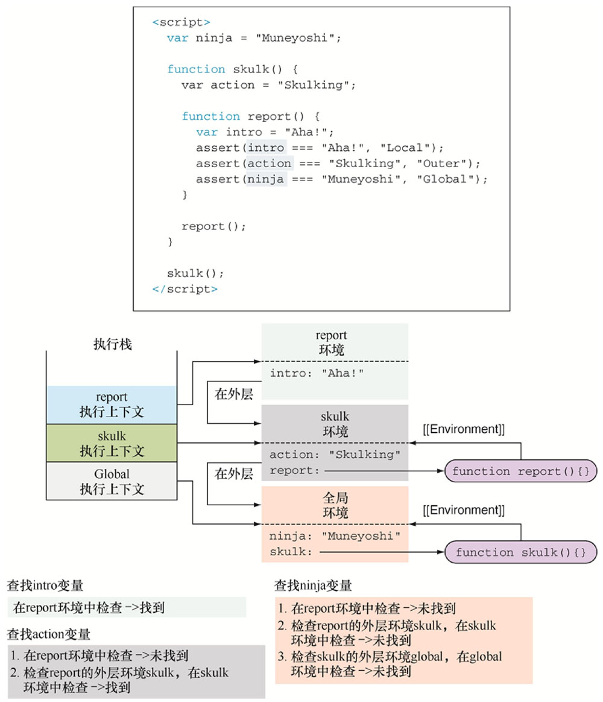
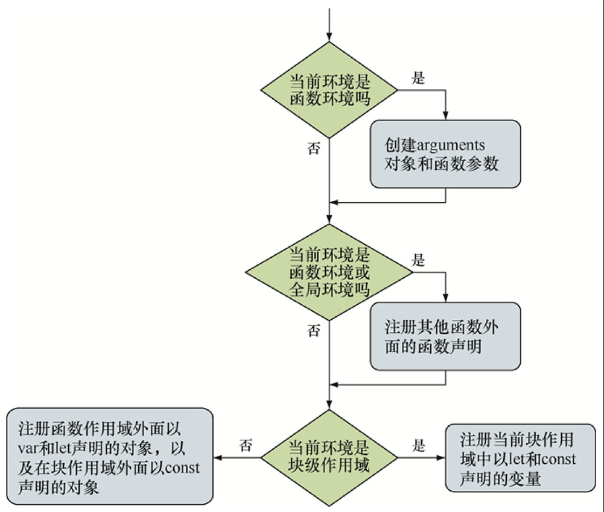
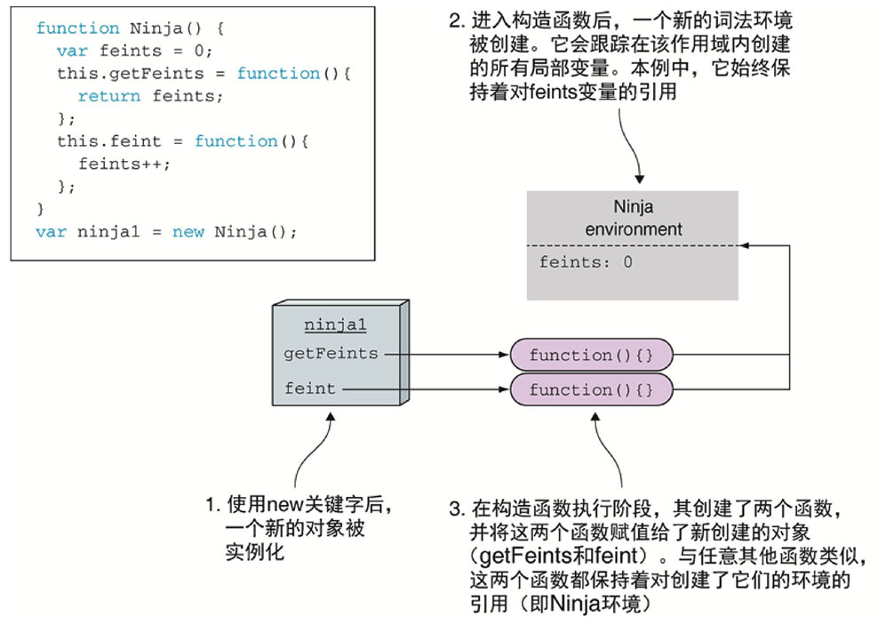
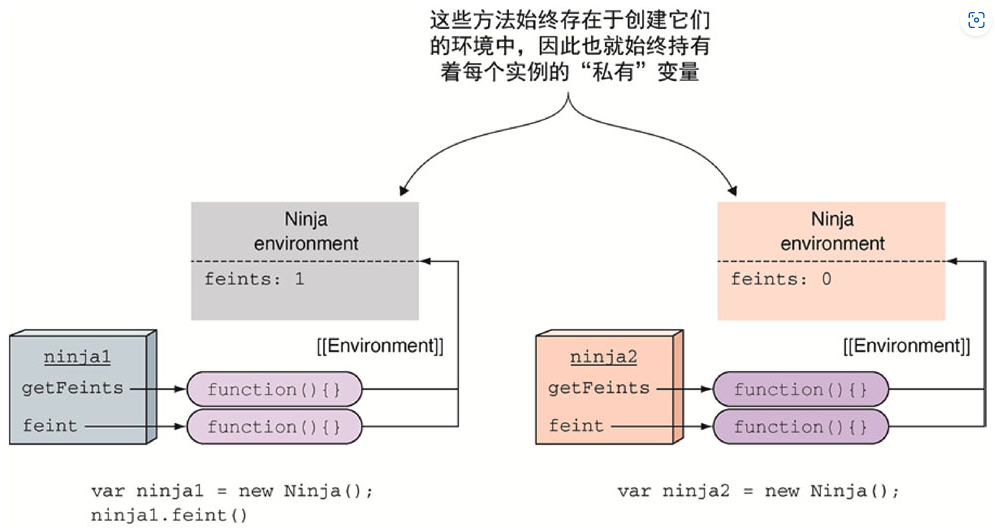

# Javascript忍者秘籍

## 第五章 精通函数：闭包和作用域

> 有时作用域指的是在程序的特定部分中标识符的可见性。

> 当在外部函数中声明内部函数时，不仅定义了函数的声明，而且还创建了一个闭包。该闭包不仅包含了函数的声明，还包含了在函数声明时该作用域中的所有变量。当最终执行内部函数时，尽管声明时的作用域已经消失了，但是通过闭包，仍然能够访问到原始作用域

> 谨记每一个通过闭包访问变量的函数都具有一个作用域链，作用域链包含闭包的全部信息，这一点非常重要。因此，虽然闭包是非常有用的，但不能过度使用。使用闭包时，所有的信息都会存储在内存中，直到JavaScript引擎确保这些信息不再使用（可以安全地进行垃圾回收）或页面卸载时，才会清理这些信息。

> 谨记每一个通过闭包访问变量的函数都具有一个作用域链，作用域链包含闭包的全部信息，这一点非常重要。因此，虽然闭包是非常有用的，但不能过度使用。使用闭包时，所有的信息都会存储在内存中，直到JavaScript引擎确保这些信息不再使用（可以安全地进行垃圾回收）或页面卸载时，才会清理这些信息。

> 有两种执行上下文：全局执行上下文和函数执行上下文。二者最重要的差别是：全局执行上下文只有一个，当JavaScript程序开始执行时就已经创建了全局上下文；而函数执行上下文是在每次调用函数时，就会创建一个新的。

> 词法环境（lexical environment）是JavaScript引擎内部用来跟踪标识符与特定变量之间的映射关系。 词
>
> 法环境是JavaScript作用域的内部实现机制，人们通常称为作用域(scopes)。

> 每个执行上下文都有一个与之关联的词法环境，词法环境中包含了在上下文中定义的标识符的映射表。在特定的执行上下文中，我们的程序不仅直接访问词法环境中定义的局部变量，而且还会访问外部环境中定义的变量。

> 无论何时创建函数，都会创建一个与之相关联的词法环境，并存储在名为[[Environment]]的内部属性上（也就是说无法直接访问或操作）。
>
> 

> 需要记住的是，JavaScript函数可以作为任意对象进行传递，定义函数时的环境与调用函数的环境往往是不同的（想一想闭包）。

> 无论何时调用函数，都会创建一个新的执行环境，被推入执行上下文栈。此外，还会创建一个与之相关联的词法环境。现在来看最重要的部分：外部环境与新建的词法环境，JavaScript引擎将调用函数的内置[[Environment]]属性与创建函数时的环境进行关联。

> 通过var声明的变量实际上总是在距离最近的函数内或全局词法环境中注册的，不关注块级作用域。

> 一旦创建了新的词法环境，就会执行第一阶段。在第一阶段，没有执行代码，但是JavaScript引擎会访问并注册在当前词法环境中所声明的变量和函数。JavaScript在第一阶段完成之后开始执行第二阶段，具体如何执行取决于变量的类型（let、var、const和函数声明）以及环境类型（全局环境、函数环境或块级作用域）。具体的处理过程如下：
>
> 1．如果是创建一个函数环境，那么创建形参及函数参数的默认值。如果是非函数环境，将跳过此步骤。
>
> 2．**如果是创建全局或函数环境，就扫描当前代码进行函数声明**（不会扫描其他函数的函数体），但是不会执行函数表达式或箭头函数。对于所找到的函数声明，将创建函数，并绑定到当前环境与函数名相同的标识符上。若该标识符已经存在，那么该标识符的值将被重写。如果是块级作用域，将跳过此步骤。3．扫描当前代码进行变量声明。在函数或全局环境中，查找所有当前函数以及其他函数之外通过var声明的变量，并查找所有通过let或const定义的变量。在块级环境中，仅查找当前块中通过let或const定义的变量。对于所查找到的变量，若该标识符不存在，进行注册并将其初始化为undefined。**若该标识符已经存在，将保留其值。**
>
> 3．**扫描当前代码进行变量声明**。在函数或全局环境中，查找所有当前函数以及其他函数之外通过var声明的变量，并查找所有通过let或const定义的变量。在块级环境中，仅查找当前块中通过let或const定义的变量。对于所查找到的变量，若该标识符不存在，进行注册并将其初始化为undefined。**若该标识符已经存在，将保留其值。**
>
> 

**这也就是变量提升的真实过程**

看一下闭包的创建过程：




> 无论何时创建函数，都会保持词法环境的引用（通过内置[[Environment]]属性）。在本例中，Ninja构造函数内部，我们创建了两个函数：getFeints与feint，均有Ninja环境的引用，因为Ninja环境是这两个函数创建时所处的环境。
>
> 每一个通过Ninja构造函数创建的对象实例均获得了各自的方法（ninja1.getFeints与ninja2.getFeints是不同的），当调用构造函数时，各自的实例方法包含各自的变量。这些“私有变量”只能通过构造函数内定义的对象方法进行访问，不允许直接访问。现在让我们看看当ninja2.getFeints方法调用时发生了什么。图5.17显示了细节。
>
> 
>
> 由于每次调用函数时均会创建新的执行上下文，因此创建了新的getFeints执行环境并推入执行栈。这同时引起创建新的词法环境，词法环境通常用于保持跟踪函数中定义的变量。另外，getFeints词法环境包含了getFeints函数被创建时所处的环境，当ninja2对象构建时，Ninja环境是活跃的。


## 第七章

```javascript
function Person() {}
function Ninja() {}
Ninja.prototype = new Person();
const ninja = new Ninja();
```

> construnctor是原型对象的属性，指向构造函数。在本例中，使用new Person()重写内置的Ninja方法的原型。因此，当使用Ninja构造函数创建ninja对象时，原型指向新的person对象。最后，当访问ninja对象的constructor属性时，由于ninja对象本身没有constructor属性，会查询原型即person对象。person对象本身也没有constructor属性，因此继续查找person对象的原型对象Person.prototype。Person.prototype具有constructor属性，指向Person函数。本例说明了使用constructor属性时需要担心的原因：尽管ninja对象使用Ninja函数创建，construnctor属性在重写Ninja.prototype时仍被指向Person函数。
