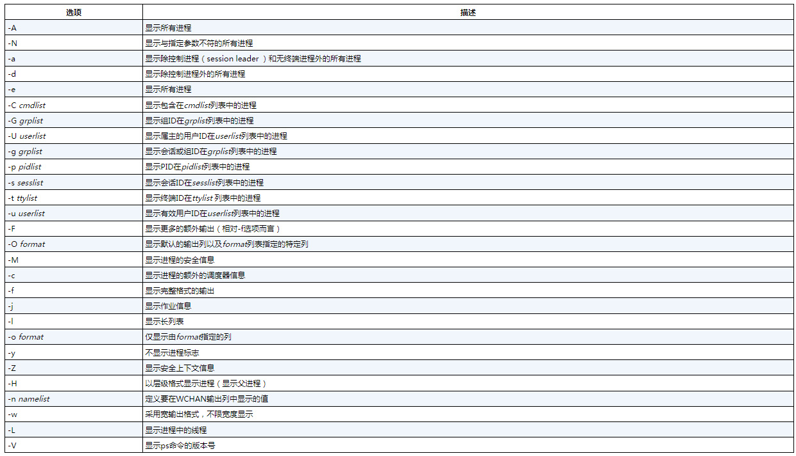
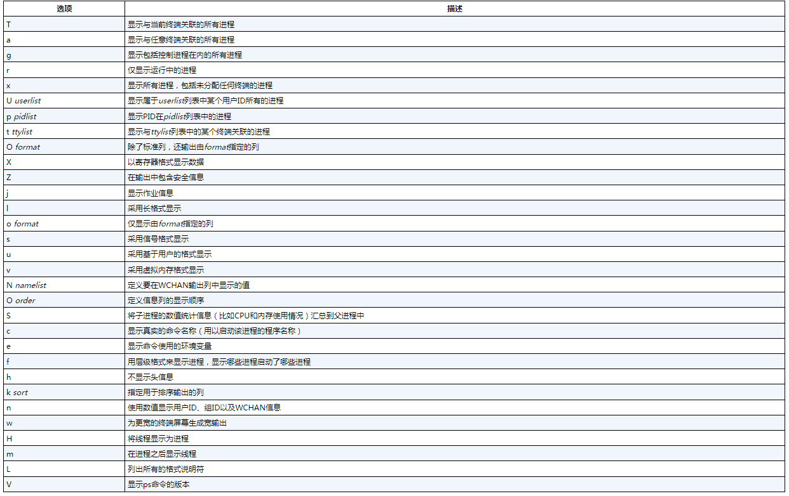
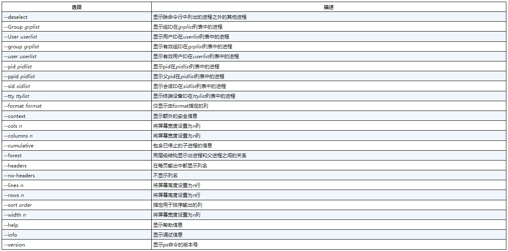
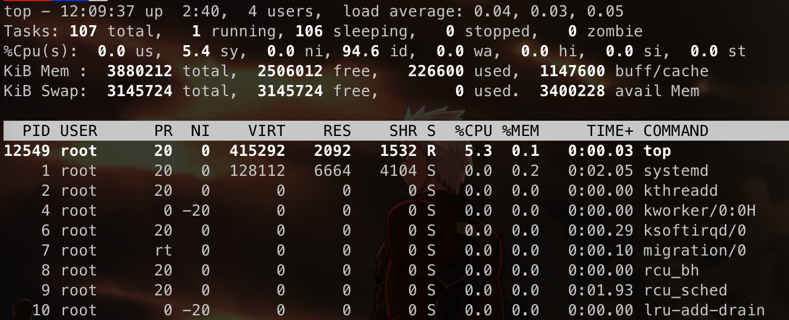
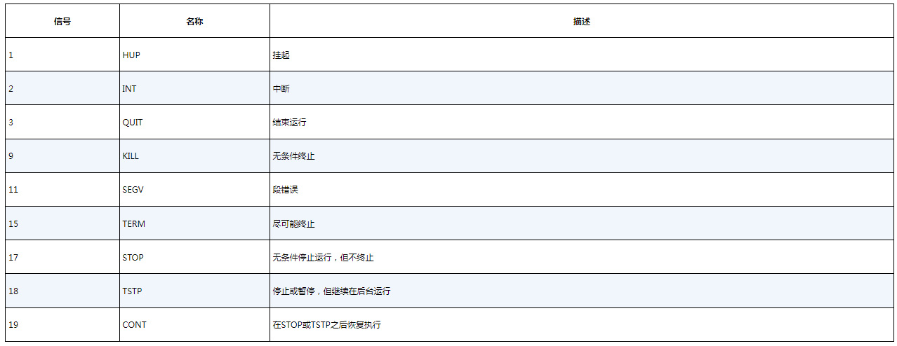
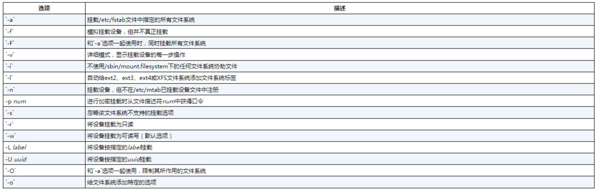
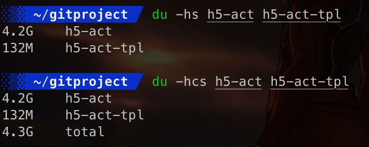

# Linux命令行与shell脚本编程大全

## 第一章 初始Linux shell

### 1.1 Linux初探

#### 1.1.1 深入探究Linux内核

##### 内核负责的功能

1. 系统内存管理
   - 管理可用物理内存
   - 创建并管理虚拟内存
     - 内核通过硬盘上称为**交换空间**（swap space）的存储区来实现虚拟内存
     - 内存被划分为若干块，这些块称作**页面**
     - 一段时间未被访问的页面会被复制到交换空间，即**换出**
     - 当程序要访问已被换出的页面时，又会从交换空间**换入**所请求的页面
2. 软件程序管理
   - Linux操作系统称运行中的程序为**进程**
   - 内核创建了第一个进程（**init进程**）来启动系统中所有其他进程
   - init进程的实现目前最流行的有两种：**SysVinit**与**systemd**
   - SysVinit根据**运行级（runlevel）**的来决定启动哪个进程，可以使用`runlevel`命令来查看当前运行级
   - systemd则是根据不同的事件来启动进程，比如系统启动时、服务启动时，systemd通过将事件与**单元文件（unit file）**链接来决定运行哪些进程，**systemctl**程序允许启动、停止和列出系统中当前运行的单元文件，systemd方法将单元文件划归为**目标（target）**，目标定义了Linux系统的特定运行状态，比如`default.target`单元定义了要启动的所有单元文件
3. 硬件设备管理
   - Linux系统将硬件设备视为一种特殊文件，称为**设备文件**，设备文件分为3种：
     - 字符设备文件：每次只处理一个字符，比如终端及大多数调制解调器
     - 块设备文件：以块形式处理数据，比如硬盘驱动器
     - 网络设备文件：对应于采用数据包发送和接收数据的设备，比如网卡
   - Linux会为系统的每个设备都创建一种称为“节点”的特殊文件。与设备的所有通信都是通过设备节点完成的
4. 文件系统管理
   - Linux内核支持通过不同类型的文件系统读写硬盘数据
   - Linux内核采用虚拟文件系统（virtual file system，VFS）作为和各种文件系统交互的接口

#### 1.1.2 GNU实用工具

##### GNU

GNU（GNU代表GNU's Not Unix）组织开发出了一套完整的Unix实用工具，但是缺少用于支撑其运行的内核系统，而Linus的Linux内核和GNU操作系统实用工具结合在一起，产生了一款完整且功能丰富的自由操作系统

##### shell

GNU/Linux shell是一种特殊的交互式工具，为用户提供了启动程序、管理文件系统中的文件以及运行在Linux系统中的进程的途径

#### 1.1.3 Linux桌面环境

- X Window软件
  - X.org：基于最初的Unix X Window System 11
  - Wayland
- KDE Plasma桌面：（K desktop environment，K桌面环境）1996年发布
- GNOME桌面： （ GNU network object model environment，GNU网络对象模型环境）1999年发布

### 1.2 Linux发行版

我们将完整的Linux系统包称为发行版。大量不同的Linux发行版可以满足你可能存在的各种计算需求

不同的Linux发行版通常分为两类：

- 完整的核心Linux发行版
- 特定用途的Linux发行版

## 第2章 走进shell

### 2.1 进入命令行

CLI（command line interface）命令行界面

#### 2.1.1 控制台终端

进入CLI的一种途径是访问Linux系统的文本模式，称作**Linux控制台**，Linux系统启动时，会自动创建多个**虚拟控制台，**虚拟控制台是运行在Linux系统内存中的终端会话

#### 2.1.2 图形化终端

虚拟控制台终端的另一种替代方案是使用Linux图形化桌面环境中的**终端仿真软件包**，要想在桌面中使用命令行，关键在于图形化终端仿真器

### 2.2 通过Linux控制台终端访问CLI

Linux发行版通常使用`ctrl+alt`再配合`f1`、`f7`或`f8`进入虚拟控制台，但因为不同发行版，最好还是动手测一下

进入虚拟控制台后，可以通过`tty`命令查看当前的虚拟控制台的tty编号

## 第3章 bash shell基础命令

> Linux虚拟目录中比较复杂的部分是它如何来协调管理各个存储设备。我们称在Linux系统中安装的第一块硬盘为**根驱动器**。根驱动器包含了虚拟目录的核心，其他目录都是从那里开始构建的
>
> Linux会使用根驱动器上一些特别的目录作为**挂载点（mount point）**。挂载点是虚拟目录中分配给额外存储设备的目录，Linux会让文件和目录出现在这些挂载点目录中，即便它们位于其他物理驱动器中

#### 3.6.4 链接文件

如果需要在系统中维护同一文件的两个或多个副本，可以使用单个物理副本加多个虚拟副本（链接）的方法代替创建多个物理副本。**链接**是目录中指向文件真实位置的占位符

**符号链接**（也称为**软链接**）是一个实实在在的文件，**该文件指向存放在虚拟目录结构中某个地方的另一个文件**。这两个以符号方式链接在一起的文件彼此的**内容并不相同**（inode编号不同，**文件或目录的inode编号是内核分配给文件系统中的每一个对象的唯一标识**，inode编号可以通过`ls -i xxx`来查看）

**硬链接**创建的是一个独立的虚拟文件，其中包含了原始文件的信息以及位置。但是两者**就根本而言是同一个文件**（**只能对处于同一存储设备的文件创建硬链接**）

#### 3.8.1 查看文件类型

- **file**：探测文件的内部并判断文件类型

#### 3.8.2 查看整个文件

- cat：查看文件内容，`-n`所有行添加行号，`-b`仅对有文本的行添加行号
- more：分页查看文件内容，**空格键**向前翻页，回车键逐行向前查看
- less：more的升级版，能够实现文本文件中前后翻动以及一些高级搜索功能，**less命令还可以在完成整个文件的读取之前显示文件的内容**

## 第4章 更多的bash shell命令

### 4.1 监测程序

#### 4.1.1 探查进程

Linux系统中使用的GNU ps命令支持以下**3种类型**的命令行选项：

- Unix风格选项，选项前加单连字符
- BSD 风格选项，选项前不加连字符
- GNU 长选项，选项前加双连字符。

**Unix风格选项**



经常使用的话，可以使用`ps -ef`组合

**BSD风格选项**



**GNU长选项**



新增了`--forest`选项，该选项能够使用ASCII字符来绘制可爱的图表以显示进程的层级信息

#### 4.1.2 实时监测进程

与`ps`只能显示某个特定时间点的信息不同，`top`则以实时的方式显示进程信息



第一行：系统概况，包括当前时间、系统运行时长、登录的用户数、平衡负载（最近1、5、15分钟）

第二行：进程统计，包括进程总数、运行中、休眠、停止以及僵尸化的进程数（进程已结束，但父进程没响应）

第三行：CPU概况，根据进程属主（用户或系统）和进程状态（运行、空闲或等待）

第四行：内存状态，包括总数、已使用、空闲等

第五行：系统交换空间状态

最后的列表部分：

- PID：进程的PID
- USER：进程属主的用户名
- PR：进程的优先级
- NI：进程的谦让度
- VIRT：进程占用的虚拟内存总量
- RES：进程占用的物理内存总量
- SHR：进程和其他进程共享的内存总量
- S：进程的状态（D代表可中断的休眠，R代表运行，S代表休眠，T代表被跟踪或停止，Z代表僵化）
- %CPU：进程使用的CPU时间比例
- %MEM：进程使用的可用物理内存比例
- TIME+：自进程启动到目前为止所占用的CPU时间总量
- COMMAND：进程所对应的命令行名称，也就是启动的程序名。

#### 4.1.3 结束进程

在Linux中，进程之间通过**信号**来通信



##### 1. kill命令

kill命令可以通过PID向进程发送信号。在默认情况下，kill命令会向命令行中列出的**所有PID发送TERM信号**，要发送进程信号，**必须是进程的属主或root用户**，如果要**强制终止**，**则-s选项支持指定其他信号**（用信号名或信号值）

##### 2. pkill命令

pkill命令可以**使用程序名代替PID来终止进程**，也允许使用通配符，但使用时也要格外小心，很容易意外地将系统的重要进程终止

### 4.2 监测磁盘空间

#### 4.2.1 挂载存储设备

##### 1.mount命令

在默认情况下，mount命令会输出当前系统已挂载的设备列表，如果知道设备分区使用的文件系统类型，可以像下面这样过滤输出

```bash
mount -t ext4
```

手动挂载设备的基本命令：

```bash
# type 磁盘格式化所使用的文件系统类型
# device 存储设备的设备文件位置
# directory 挂载点在虚拟目录中的位置
mount -t [type] [device] [directory]

# 下方是将U盘/dev/sdb1挂载到/media/disk的命令
mount -t vfat /dev/sdb1 /media/disk
```

常用选项



##### 2.umount命令

移除可移动设备时，要先**卸载**才能将其拨下

```bash
umount [directory | device]
umount /home/rich/mnt
```

#### 4.2.2 使用df命令

查看磁盘使用空间

```bash
# 指定文件系统类型来进行过滤
df -t ext4
# 以人类易读的形式显示磁盘空间
df -h
```

#### 4.2.3 使用du命令

可以显示某个特定目录的磁盘使用情况，du命令默认会显示当前目录下的所有文件、目录和子目录的磁盘使用情况，在输出列表中，每行最左侧的数字是每个文件或目录**所占用的磁盘块数**。注意，这个列表是**从目录层级的最底部开始**，然后沿着其中包含的文件和子目录逐级向上的

```bash
# 显示所有已列出文件的总大小
du -c
# 按人类易读格式输出大小
du -h
# 输出每个参数的汇总信息
du -s
```



### 4.3 处理数理文件

#### 4.3.1 数据排序

`sort`命令默认是按字符进行排序的，如果希望按数值来排序，需要使用`-n`选项，选项`-M`可以将数据按月排序，比如按`Jan`、`Feb`、`Mar`这样，而`-r`则表示逆序，`sort -u`则等价于`sort | uniq`

当按字段分隔的数据进行排序时，可以使用`-t`指定分隔符，然后通过`-k`指定排序字段，比如：

```bash
sort -t ':' -k 3 -n /etc/passwd
```

#### 4.3.2 数据搜索

grep命令会在输入或指定文件中逐行搜索匹配指定模式的文本

```bash
grep [options] pattern [file]
```

`-v`用来反向搜索

`-n`显示匹配指定模式的那些行的行号

`-c`用于统计有多少行含有匹配的模式

`-e`用于指定多个匹配模式，比如：`grep -e t -e f file1`，同时包括`t`和`f`的行

在默认情况下，**grep命令使用基本的Unix风格正则表达式来匹配模式**

#### 4.3.3 数据压缩

gzip软件包，包括：

- gzip：用于压缩文件
- gzcat：用于查看压缩过的文本文件的内容
- gunzip：用于解压文件

#### 4.3.4 数据归档

```bash
# 创建归档
tar -cvf test.tar test/ test2/
# 列出但不提取tar文件中的内容
tar -tf test.tar
# 提取tar文件的内容
tar -xvf test.tar
# 提取gzip压缩过后的tar文件
tar -zxvf test.tgz
```

## 第5章 理解shell


