# Linux是怎样工作的

## 前言

```bash
# 使用的操作系统是ubuntu 16.04, 安装如下必备依赖包
sudo apt install -y binutils build-essential sysstat
```

## 第四章

> 令实验程序只能运行在单个逻辑CPU上，这可以通过OS提供的taskset命令来实现。如下添加 -c选项，令参数中指定的程序仅运行在指定的逻辑CPU上。
>
> ```bash
> taskset -c 0 ./sched <n> <total> <resol>
> ```

**进程状态转换**

> 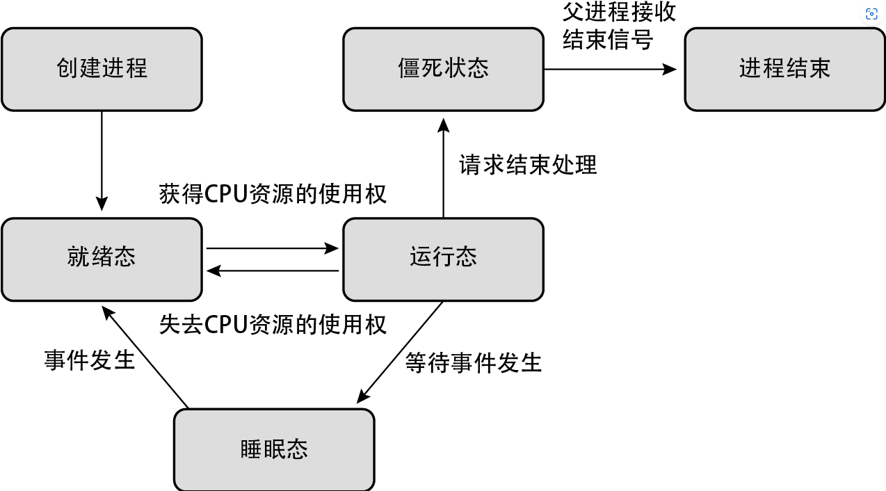

**空闲状态**

> 在此期间，逻辑CPU会运行一个被称为空闲进程的不执行任何处理的特殊进程。
>
> 使用特殊的CPU指令使逻辑CPU进入休眠状态，直到出现就绪态的进程。

**通过`sar`命令可以采集CPU的状态**

```bash
# 采集所有CPU的状态，每秒采集一次（倒数第二个参数），总共采集1次（最后一个参数）
# 可以通过%idle字段查看CPU的空闲时间占比
sar -P ALL 1 1

# 通过runq-sz字段可以查看处于运行态或就绪态的进程总数
sar -q 1 1
```

**多个逻辑CPU时的调度**

> 为了能够利用各个逻辑CPU，调度器会运行一个被称为负载均衡或全局调度的功能。简单来说，负载均衡负责公平地把进程分配给多个逻辑CPU。

> ps -eo命令的etime字段和time字段分别表示进程从开始到执行命令为止的运行时间和执行时间。

**变更优先级**

> nice() 能通过 -19和20之间的数来设定进程的运行优先级（默认值为0），其中，-19的优先级最高，20的优先级最低。优先级高的进程可以比普通进程获得更多的CPU时间。与此相反，优先级低的进程会获得更少的CPU时间。需要注意的是，虽然谁都可以降低进程优先级，但是只有拥有root权限的用户才能进行提高优先级的操作。

## 第五章

**虚拟内存**

> 虚拟内存使进程无法直接访问系统上搭载的内存，取而代之的是通过虚拟地址间接访问。进程可以看见的是虚拟地址，系统上搭载的内存的实际地址称为物理地址。此外，可以通过地址访问的范围称为地址空间

> 通过readelf命令或者cat /proc/${pid}/maps输出的地址也是虚拟地址。另外，进程无法直接访问真实的内存，也就是说不存在直接访问物理地址的方法。

> 通过保存在内核使用的内存中的页表，可以完成从虚拟地址到物理地址的转换。在虚拟内存中，所有内存以页为单位划分并进行管理，地址转换也以页为单位进行。在页表中，一个页面对应的数据条目称为页表项。页表项记录着虚拟地址与物理地址的对应关系。

> 如果访问的虚拟地址没有关联到物理地址，则在CPU上会发生缺页中断。缺页中断可以中止正在执行的命令，并启动内核中的缺页中断机构的处理
>
> 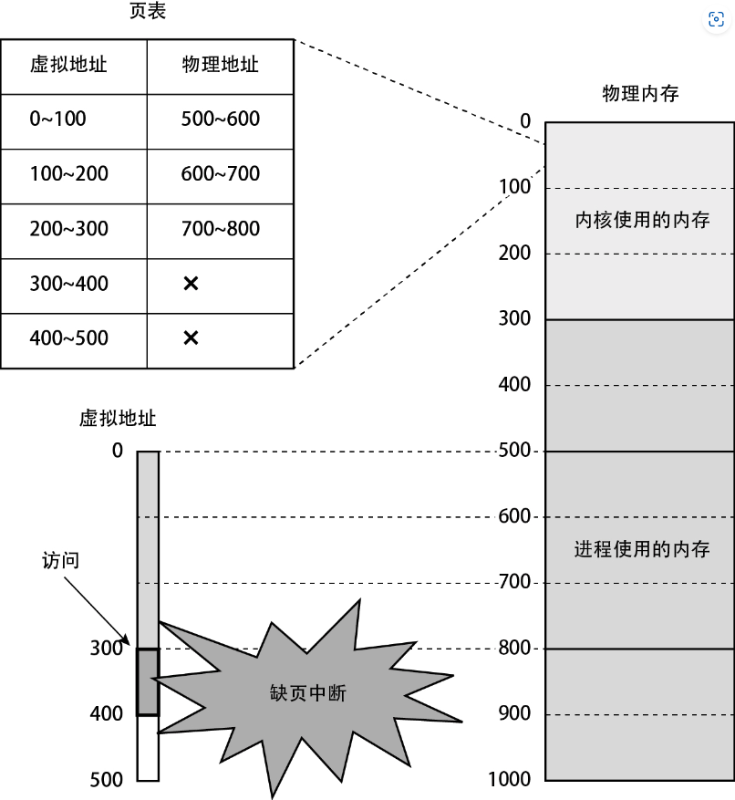
>
> 内核的缺页中断机构检测到非法访问，向进程发送SIGSEGV信号。接收到该信号的进程通常会被强制结束运行。

**为进程分配内存**

1. 创建进程

   创建进程时，根据可执行文件的辅助信息，假设如下：

   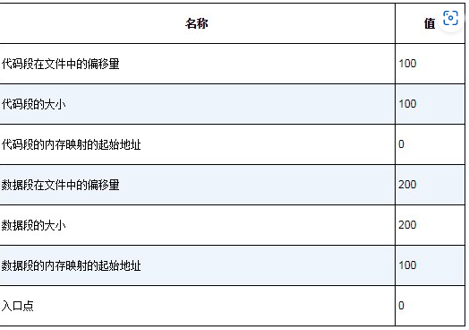

   计算所需要内存的大小，此处为：代码段大小+数据段大小 = 100 + 200 = 300

   在物理内存上划出大小为300的区域，将其分配给进程 ，并把代码和数据复制过去

   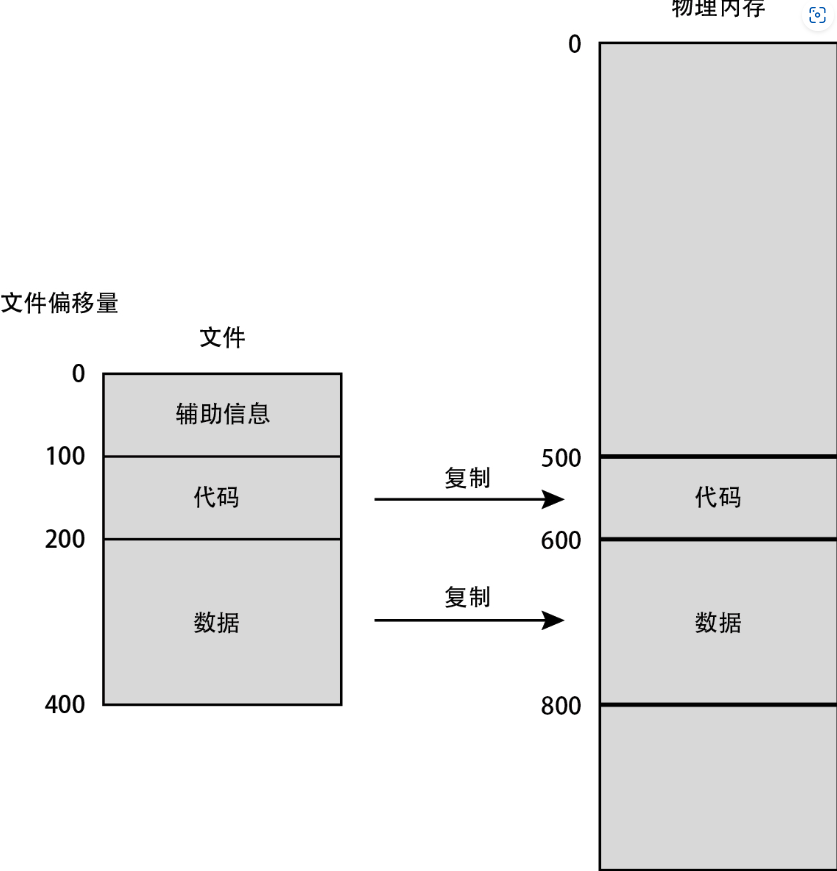

   **注意：现实中，Linux的物理内存分配使用的是更复杂的请求分页的方法**

   复制完成后，创建进程的页表，并把虚拟地址映射到物理地址

   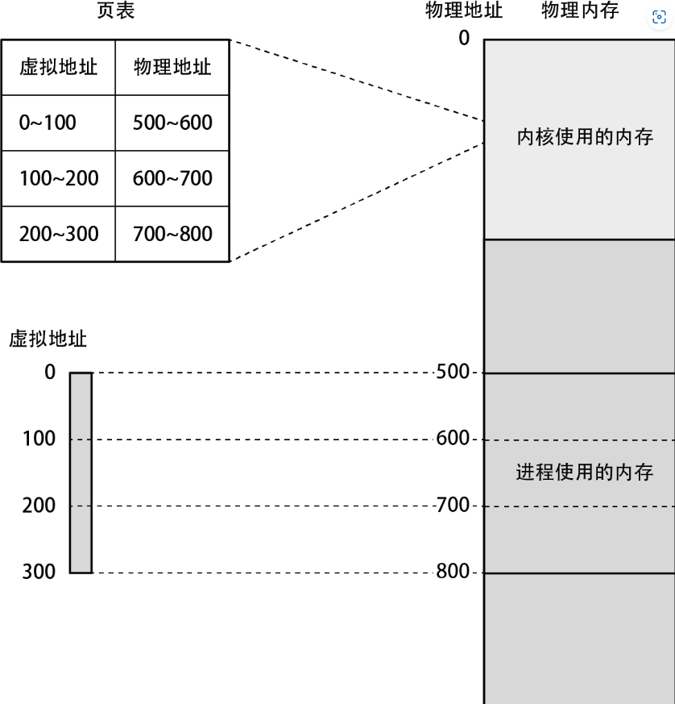

   最后从指定的地址开始运行即可

   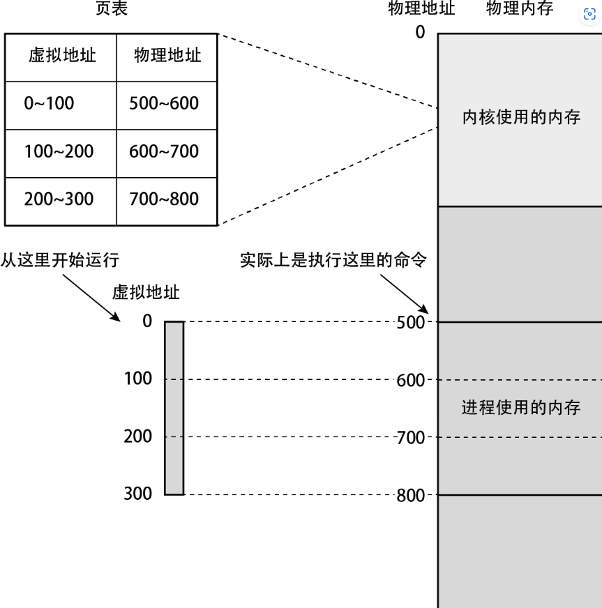

2. 在动态分配内存时

   当进程请求更多内存时，内核将为其分配新的内存，创建相应的页表，然后把与新分配的内存（的物理地址）对应的虚拟地址返回给进程

   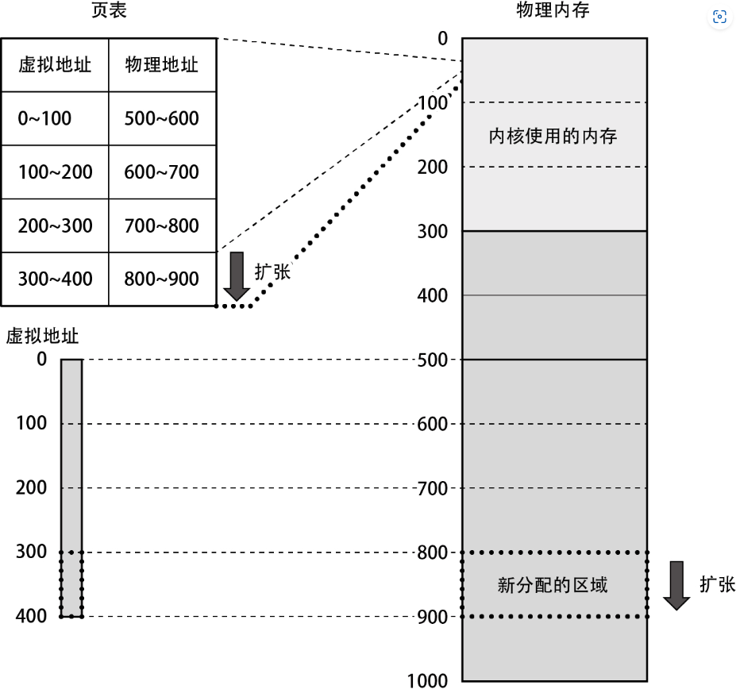

**利用上层进行内存分配**

> C语言标准库中存在一个名为malloc() 的函数，用于获取内存。在Linux中，这个函数的底层调用了mmap() 函数
>
> 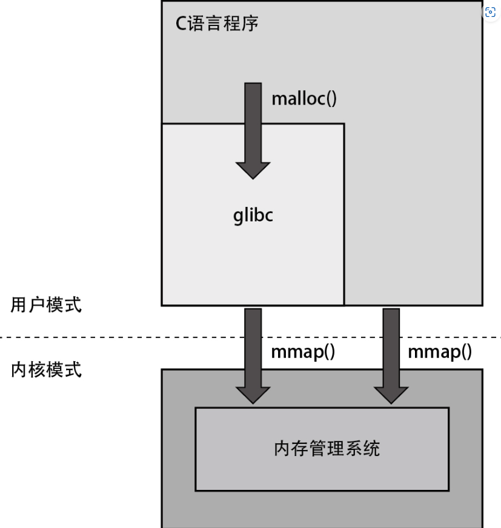
>
> mmap() 函数是以页为单位获取内存的，而malloc() 函数是以字节为单位获取内存的。为了以字节为单位获取内存，glibc事先通过系统调用mmap() 向内核请求一大块内存区域作为内存池，当程序调用malloc() 函数时，从内存池中根据申请的内存量划分出相应大小（以字节为单位）的内存并返回给程序。在内存池中的内存消耗完后，glibc会再次调用mmap() 以申请新的内存区域。
>
> 顺便一提，虽然部分程序拥有统计自身占用的内存量的功能，但往往程序汇报的值与Linux显示的进程的内存消耗量不同，而后者通常会更大。这是因为，Linux显示的值包括创建进程时以及调用mmap() 函数时分配的所有内存，而程序统计的值通常只有通过调用malloc() 等函数而申请的内存量。如果想知道程序显示的内存消耗量具体统计了哪些数值，可以查看各个程序的说明文档。

**请求分页**

> 在请求分页机制中，对于虚拟地址空间内的各个页面，只有在进程初次访问页面时，才会为这个页面分配物理内存。页面的状态除了前面提到过的“未分配给进程”与“已分配给进程且已分配物理内存”这两种以外，还存在“已分配给进程但尚未分配物理内存”这种状态。

请求过程：

> 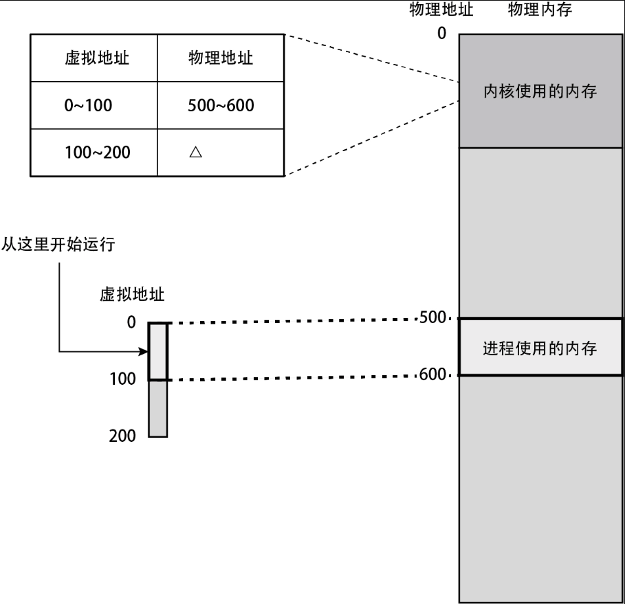
>
> ① 进程访问入口点。
>
> ② CPU参照页表，筛选出入口点所属的页面中哪些虚拟地址未关联物理地址。
>
> ③ 在CPU中引发缺页中断。
>
> ④ 内核中的缺页中断机构为步骤①中访问的页面分配物理内存，并更新其页表。
>
> ⑤ 回到用户模式，继续运行进程。

> 需要确认的信息为虚拟内存量、已分配的物理内存量，以及在创建进程后发生缺页中断的总次数。这些数值分别通过ps -eo命令中的vsz、rss、maj_flt以及min-flt获取。

**写时复制**

> 在发起fork() 系统调用时，并非把父进程的所有内存数据复制给子进程，而是仅复制父进程的页表。

如下图所示

> 在发起fork() 系统调用时，并非把父进程的所有内存数据复制给子进程，而是仅复制父进程的页表。
>
> 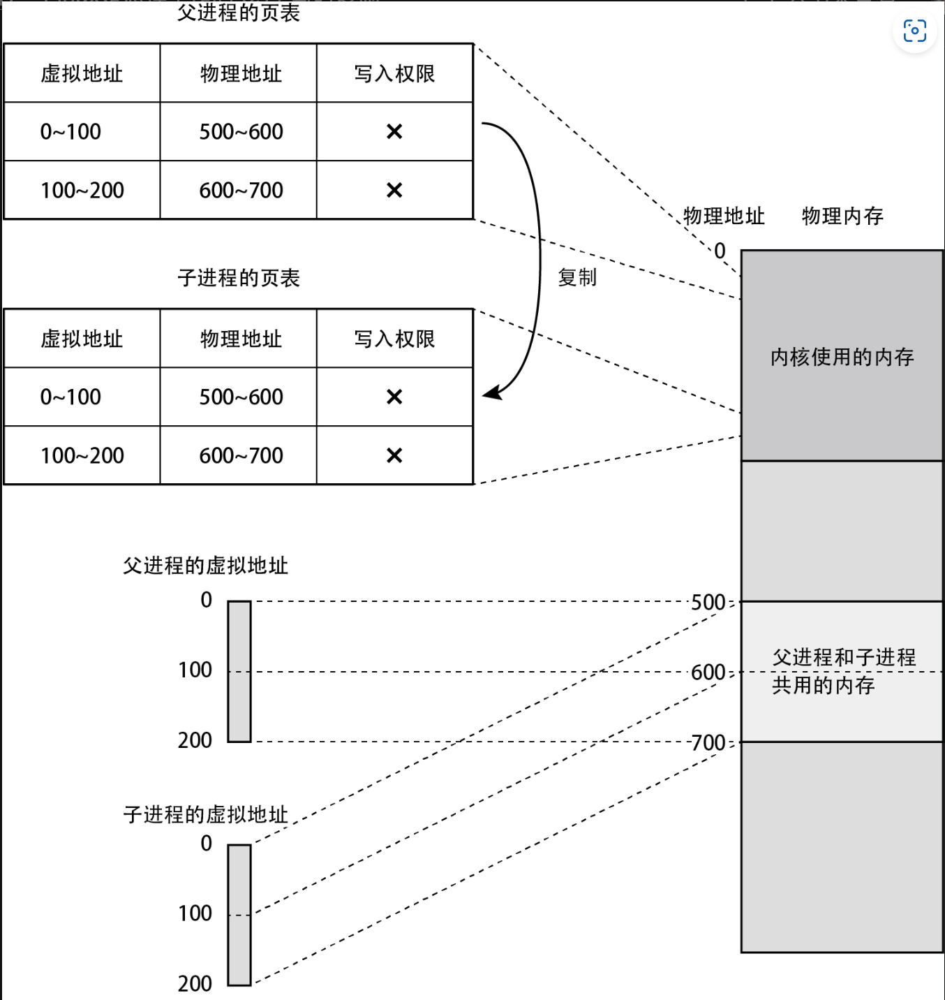
>
> 在这之后，假如只进行读取操作，那么父进程和子进程双方都能访问共享的物理页面。但是，当其中一方打算更改任意页面的数据时，则将按照下述流程解除共享。
>
> ① 由于没有写入权限，所以在尝试写入时，CPU将引发缺页中断。
>
> ② CPU转换到内核模式，缺页中断机构开始运行。
>
> ③对于被访问的页面，缺页中断机构将复制一份放到别的地方，然后将其分配给尝试写入的进程，并根据请求更新其中的内容。
>
> ④为父进程和子进程双方更新与已解除共享的页面对应的页表项。
>
> ●对于执行写入操作的一方，将其页表项重新连接到新分配的物理页面，并赋予写入权限
>
> ●对于另一方，也只需对其页表项重新赋予写入权限即可
>
> 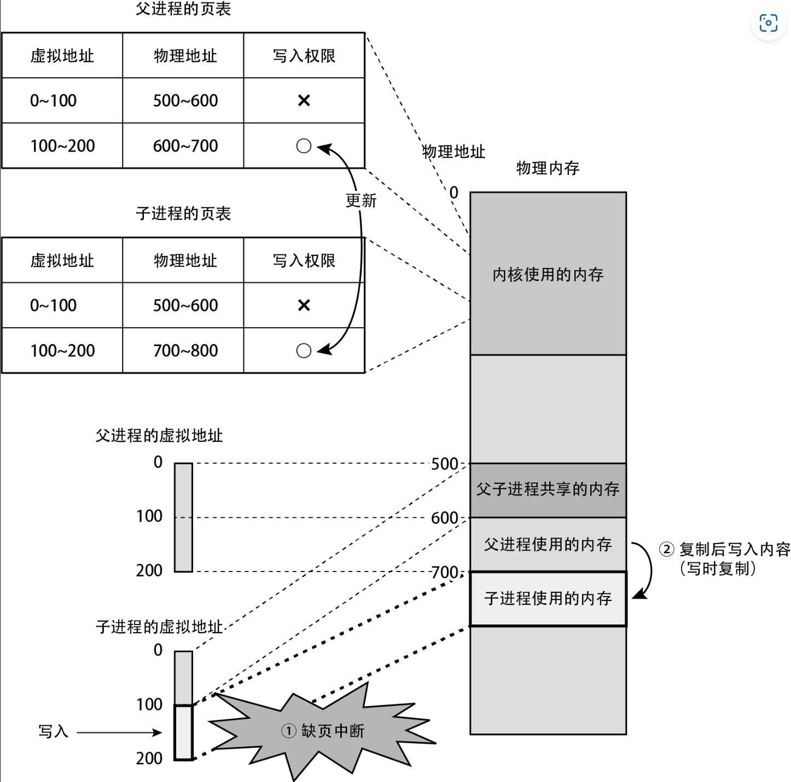
>
> 在这之后，对于已解除共享关系的页面，父进程和子进程双方都可以自由地进行读写操作。因为物理内存并非在发起fork() 系统调用时进行复制，而是在尝试写入时才进行复制，所以这个机制被称为**写时复制（Copy on Write，CoW）**。

**Swap**

> 在系统物理内存不足的情况下，当出现获取物理内存的申请时，物理内存中的一部分页面将被保存到外部存储器中，从而空出充足的可用内存。这里用于保存页面的区域称为**交换分区（Swap分区）**。交换分区由系统管理员在构建系统时进行设置。
>
> 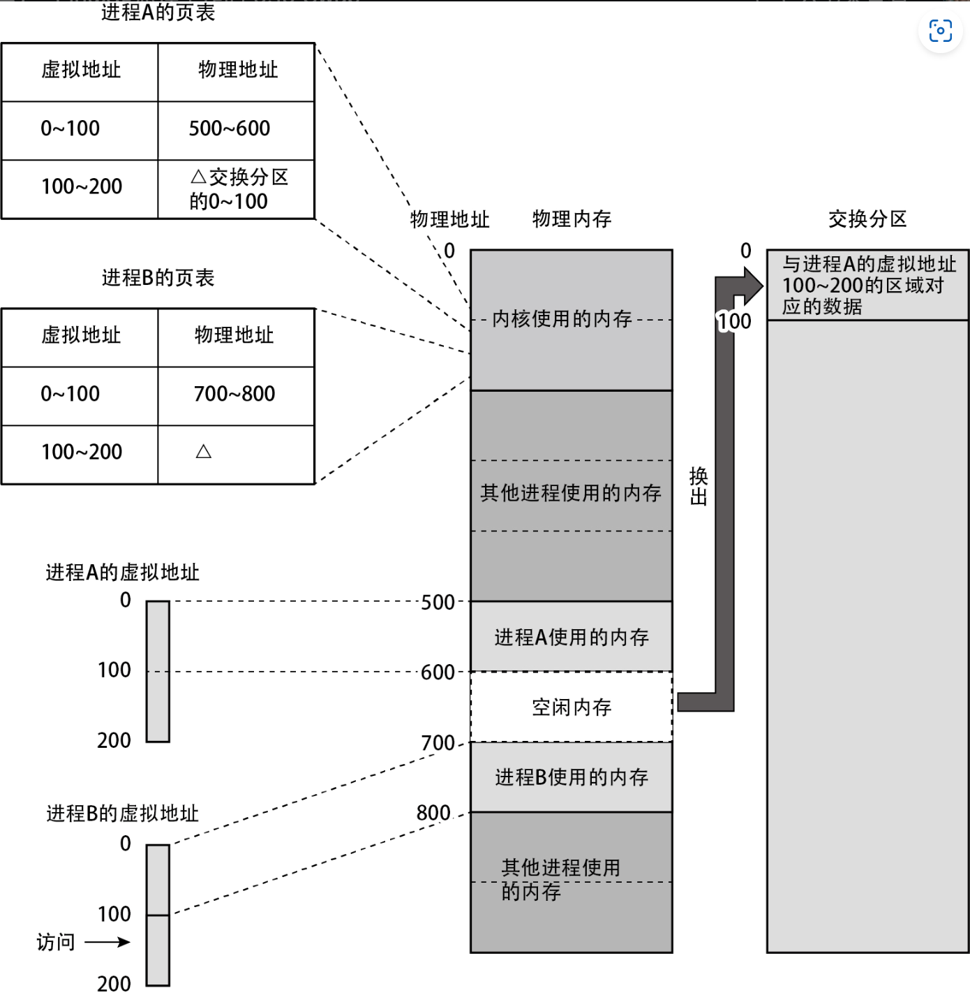
>
> 被换出的页面在交换分区上的地址信息记录在页表项中，但实际上是记录在内核中专门用于管理交换分区的区域上的。

> 类似于交换这类需要访问外部存储器的缺页中断称为硬性页缺失。与此相对，无须访问外部存储器的缺页中断称为软性页缺失。

> 可以通过sar -r ALL命令中的kbpgtbl字段查看页表所使用的物理内存量。

## 第六章

**高速缓存**

> 在从内存往寄存器读取数据时，数据先被送往高速缓存，再被送往寄存器。所读取的数据的大小取决于缓存块大小（cache line size）的值，该值由各个CPU规定。

> 在从内存往寄存器读取数据时，数据先被送往高速缓存，再被送往寄存器。所读取的数据的大小取决于缓存块大小（cache line size）的值，该值由各个CPU规定。

> 构成分层结构的各高速缓存分别名为L1、L2、L3（L为Level的首字母）。不同规格的CPU中的缓存层级数量也不同。在各高速缓存中，最靠近寄存器、容量最小且速度最快的是L1缓存。层级的数字越大，离寄存器越远，速度越慢，但容量越大。
>
> 高速缓存的信息可从 /sys/devices/system/cpu/cpu[插图]/cache/ index[插图]/[插图]这一目录下的文件中查看。
>
> ●type：高速缓存中缓存的数据类型。Data代表仅缓存数据，Code代表仅缓存指令，Unified代表两者都能缓存
>
> ●shared_cpu_list：共享该缓存的逻辑CPU列表
>
> ●size：容量大小
>
> ●coherency_line_size：缓存块大小

**页面缓存**

> 页面缓存和高速缓存非常相似。高速缓存是把内存上的数据缓存到高速缓存上，而页面缓存则是将外部存储器上的文件数据缓存到内存上。高速缓存以缓存块为单位处理数据，而页面缓存则以页为单位处理数据。

> 当进程读取文件的数据时，内核并不会直接把文件数据复制到进程的内存中，而是先把数据复制到位于内核的内存上的页面缓存区域，然后再把这些数据复制到进程的内存中

> 在内核自身的内存中有一个管理区域，该区域中保存着页面缓存所缓存的文件以及这些文件的范围信息等

> 由于页面缓存是由全部进程共享的资源，所以发起读取的进程也可以不是最初访问该文件数据的进程

> 在进程向文件写入数据后，内核会把数据写入页面缓存中，这时，管理区域中与这部分数据对应的条目会被添加一个标记，以表明“这些是脏数据，其内容比外部存储器中的数据新”。这些被标记的页面称为脏页，脏页中的数据将在指定时间通过内核的后台处理反映到外部存储器上。与此同时，脏标记也会被去除。当系统内存不足时，内核将释放页面缓存以空出可用内存。此时，首先丢弃脏页以外的页面。如果还是无法空出足够内存，就对脏页执行回写，然后继续释放页面。当需要释放脏页时，由于需要访问外部存储器，所以恐怕会导致系统性能下降。尤其是当系统上存在大量文件写入操作而导致出现大量脏页时，系统负载往往会变得非常大。

**超线程**

> 在使用超线程功能后，可以为CPU核心提供多份（一般为两份）硬件资源（其中包含一部分CPU核心使用的硬件资源，例如寄存器等），然后将其划分为多个会被系统识别为逻辑CPU的超线程。在符合这些特殊条件时，可以同时运行多个超线程。
>
> 但超线程带来的并非只有好处，它能产生多大效果很大程度上取决于运行在超线程上的进程的行为。即使在最理想的情况下，吞吐量也不能翻倍，实际上，能提高20% 到30% 已经是非常好的状态了。在某些情况下，吞吐量甚至会下降。
>
> 但超线程带来的并非只有好处，它能产生多大效果很大程度上取决于运行在超线程上的进程的行为。即使在最理想的情况下，吞吐量也不能翻倍，实际上，能提高20% 到30% 已经是非常好的状态了。在某些情况下，吞吐量甚至会下降。
>
> ```bash
> cat /sys/devices/system/cpu/cpu0/topology/thread_siblings_list
> # 假设输出为0-1，则表示逻辑CPU0与逻辑CPU1为同一个CPU核心中的一对超线程
> ```

## 第七章 文件系统

> 使用管理着数据保存信息和可用区域等的文件系统

> 文件系统以文件为单位管理所有对用户有实际意义的数据块，并为这些数据块添加上名称、位置和大小等辅助信息。它还规范了数据结构，以确定什么文件应该保存到什么位置，内核中的文件系统将依据该规范处理数据。

> 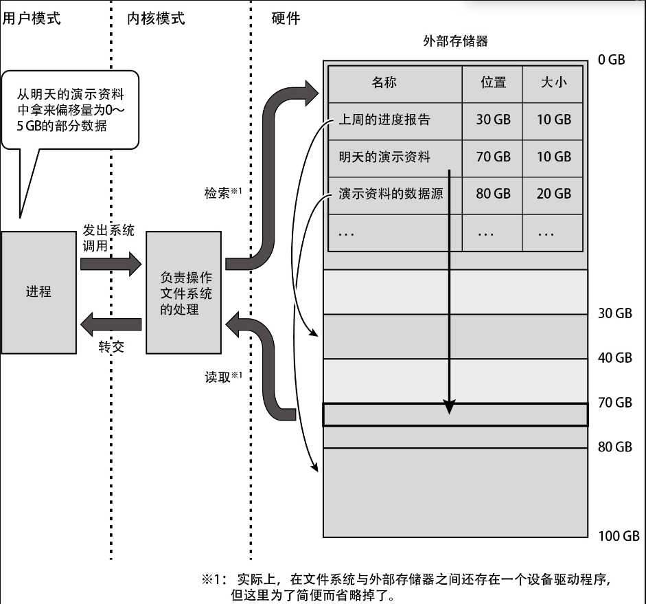

Linux虽然支持多种文件系统，但面向用户的访问接口都统一为以下这些：

> ●创建与删除文件：create()、unlink()
>
> ●打开与关闭文件：open()、close()
>
> ●从已打开的文件中读取数据：read()
>
> ●往已打开的文件中写入数据：write()
>
> ●将已打开的文件移动到指定位置：lseek()
>
> ●除了以上这些操作以外的依赖于文件系统的特殊处理：ioctl()
>
> 在请求这些系统调用时，将按照下列流程读取文件中的数据。
>
> ① 执行内核中的全部文件系统通用的处理，并判断作为操作对象的文件保存在哪个文件系统上。
>
> ② 调用文件系统专有的处理，并执行与请求的系统调用对应的处理。
>
> ③ 在读写数据时，调用设备驱动程序执行操作。
>
> ④ 由设备驱动程序执行数据的读写操作。
>
> 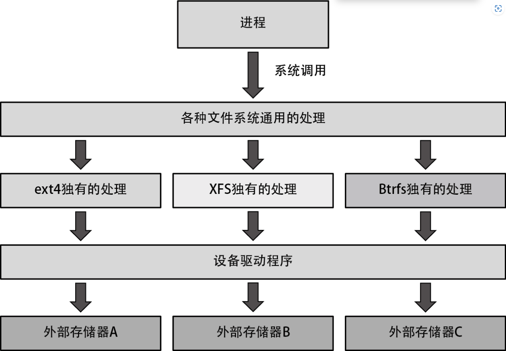

**虚拟文件系统**

- procfs

  通常被挂载在 /proc目录下。通过访问`/proc/pid/`目录下的文件，即可获取各个进程的信息

  ```bash
  # 查看proc下的目录
  ls /proc/$$
  ```

  - /proc/pid/maps：进程的内存映射
  - /proc/pid/cmdline：进程的命令行参数
  - /proc/pid/stat：进程的状态，比如CPU时间、优先级和内存使用量等信息
  - /proc/cpuinfo：搭载于系统上的CPU的相关信息
  - /proc/diskstat：搭载于系统上的外部存储器的相关信息
  - /proc/meminfo：搭载于系统上的内存的相关信息
  - /proc/sys目录下的文件：内核的各种调优参数，与sysctl命令和/etc/sysctl.conf中的调优参数一一对应

  到此为止使用过的ps、sar、top和free等用于显示OS提供的各种信息的命令，都是从procfs中采集信息的。如需了解各个文件的详细含义，请参考man proc的内容。

- sysfs

  sysfs通常被挂载在 /sys目录下。sysfs包括但不限于下列文件。

  - /sys/devices目录下的文件：搭载于系统上的设备的相关信息
  - /sys/fs目录下的文件：系统上的各种文件系统的相关信息
- cgroupfs

  cgroup用于限制单个进程或者由多个进程组成的群组的资源使用量，它需要通过文件系统cgroupfs来操作。另外，只有root用户可以操作cgroup。cgroupfs通常被挂载在 /sys/fs/cgroup目录下。

  - CPU：设置能够使用的比例，比如令某群组只能够使用CPU资源总量的50%等。通过读写 /sys/fs/cgroup/cpu目录下的文件进行控制
  - 内存：限制群组的物理内存使用量，比如令某群组最多只能够使用1GB内存等。通过读写 /sys/fs/cgroup/memory目录下的文件进行控制

  cgroup通常被用于通过Docker之类的容器管理软件，或者virt-manager等虚拟机管理软件来限制各个容器或虚拟机的资源使用量。

## 第八章

**I/O调度器**

> 通用块层中的 I/O调度器会将访问块设备的请求积攒一定时间，并在向设备驱动程序发出I/O请求前对这些请求进行如下加工，以提高I/O的性能。
>
> ●合并：将访问连续扇区的多个I/O请求合并为一个请求
>
> ●排序：按照扇区的序列号对访问不连续的扇区的多个I/O请求进行排序

> 实际上I/O调度器只有在多个进程并行读取时或者在异步I/O等无须等待读取完成的I/O上才能发挥作用。
