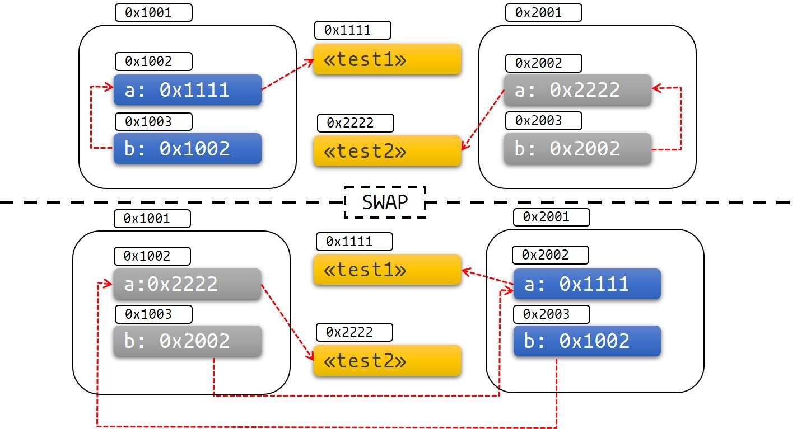

# Rust语言圣经（Rust Course）

## 1. 寻找牛刀，以便小试

### 安装rustup

```bash
$ curl --proto '=https' --tlsv1.2 https://sh.rustup.rs -sSf | sh
```

### 安装c语言编译器

rust会依赖`libc`和链接器`linker`

- macOS

  ```bash
  xcode-select --install
  ```

- linux

  一般按照对应发行版本的文档来安装gcc或clang，如果是ubuntu，则可安装build-essential
  
- window

  安装[Microsoft C++ Build Tool](https://visualstudio.microsoft.com/zh-hans/visual-cpp-build-tools/) ，勾选C++环境即可，安装之后将msvc添加到环境变量中

### 更新与卸载

更新：`rustup update`

卸载：`rustup self uninstall`

### 本地文档

安装Rust的同时会安装一个文档服务，通过`rustup doc`会在浏览器中打开本地文档，可以通过安查看相关的API

### 创建项目

```bash
# vcs=none表示不添加版本管理系统，否则会添加git版本控制
cargo new world_hello --vcs=none
```

```rust
// Rust 原生支持 UTF-8 编码的字符串
fn greet_world() {
    let southern_germany = "Grüß Gott!";
    let chinese = "世界，你好";
    let english = "World, Hello";
    let regions = [southern_germany, chinese, english];
    // Rust 的集合类型不能直接进行循环，需要变成迭代器，但2021 edition之后就可以直接写成 for region in regions，因为for隐式将regions转换成迭代器了
    for region in regions.iter() {
        println!("{}", &region);
    }
}
fn main() {
    greet_world();
}

```

### 执行

```bash
cd world_hello
cargo run
```

### cargo check

快速检查代码能否通过编译

## 2. Rust基本概念

### 变量可变性

> 选择可变还是不可变，更多的还是取决于你的使用场景，例如不可变可以带来安全性，但是丧失了灵活性和性能（如果你要改变，就要重新创建一个新的变量，这里涉及到内存对象的再分配）。而可变变量最大的好处就是使用上的灵活性和性能上的提升。
>
> 例如，在使用大型数据结构或者热点代码路径（被大量频繁调用）的情形下，在同一内存位置更新实例可能比复制并返回新分配的实例要更快。使用较小的数据结构时，通常创建新的实例并以更具函数式的风格来编写程序，可能会更容易理解，所以值得以较低的性能开销来确保代码清晰。

### 变量与常量之间的差异

- 常量不允许使用 `mut`。**常量不仅仅默认不可变，而且自始至终不可变**，因为常量在编译完成后，已经确定它的值。
- 常量使用 `const` 关键字而不是 `let` 关键字来声明，并且值的类型**必须**标注。

Rust 常量的命名约定是全部字母都使用大写，并使用下划线分隔单词，另外对数字字面量可插入下划线以提高可读性：

```rust
const MAX_POINTS: u32 = 100_000;
```

### 基本类型

- 数值类型：有符号整数 (`i8`, `i16`, `i32`, `i64`, `isize`)、 无符号整数 (`u8`, `u16`, `u32`, `u64`, `usize`) 、浮点数 (`f32`, `f64`)、以及有理数、复数
- 字符串：字符串字面量和字符串切片 `&str`
- 布尔类型：`true` 和 `false`
- 字符类型：表示单个 Unicode 字符，存储为 4 个字节
- 单元类型：即 `()` ，其唯一的值也是 `()`

### 整数类型

**有符号数字以[补码](https://en.wikipedia.org/wiki/Two's_complement)形式存储**

每个有符号类型规定的**数字范围**是：$-(2^{n-1})\sim2^{n-1}-1$

#### 整形溢出

在Rust中当值超过类型所能表示的最大值时，则会发生**整型溢出**，在debug模式下，直接触发panic，在release模式下，则会按照**补码循环溢出**的规则进行处理：*大于该类型最大值的数值会被补码转换成该类型能够支持的对应数字的最小值*，程序不会panic

要显式处理可能的溢出，可以使用标准库针对原始数字类型提供的这些方法：

- 使用 `wrapping_*` 方法在所有模式下都按照补码循环溢出规则处理，例如 `wrapping_add`
- 如果使用 `checked_*` 方法时发生溢出，则返回 `None` 值
- 使用 `overflowing_*` 方法返回该值和一个指示是否存在溢出的布尔值
- 使用 `saturating_*` 方法，可以限定计算后的结果不超过目标类型的最大值或低于最小值

### 字符类型

> 在 Rust 语言中这些都是字符，Rust 的字符不仅仅是 `ASCII`，所有的 `Unicode` 值都可以作为 Rust 字符，包括单个的中文、日文、韩文、emoji 表情符号等等，都是合法的字符类型。`Unicode` 值的范围从 `U+0000 ~ U+D7FF` 和 `U+E000 ~ U+10FFFF`

由于 `Unicode` 都是 **4 个字节**编码，因此**字符类型也是占用 4 个字节**

```rust
fn main() {
		let x = '中';
    // 这里会输出：字符'中'占用了4字节的内存大小
    println!("字符'中'占用了{}字节的内存大小",std::mem::size_of_val(&x));
}
```

### 布尔

Rust 中的布尔类型有两个可能的值：`true` 和 `false`，布尔值占用内存的大小为 `1` 个字节

### 函数

#### 要点

- 函数名和变量名使用[蛇形命名法(snake case)](https://course.rs/practice/naming.html)，例如 `fn add_two() -> {}`
- 函数的位置可以随便放，Rust 不关心我们在哪里定义了函数，只要有定义即可
- 每个函数参数都需要标注类型

#### 类型的返回类型

- 无返回值：`()`

- 永不返回的发散函数：`!`

  ```rust
  fn dead_end() -> ! {
    panic!("你已经到了穷途末路，崩溃吧！");
  }
  
  fn forever() -> ! {
    loop {
      //...
    };
  }
  ```

### 所有权

#### 栈（Stack）与堆（Heap）

##### 栈

栈按照顺序存储值并以相反顺序取出值，这也被称作**后进先出**，增加数据叫做**进栈**，移出数据则叫做**出栈**。

因为上述的实现方式，**栈中的所有数据都必须占用已知且固定大小的内存空间**，假设数据大小是未知的，那么在取出数据时，你将无法取到你想要的数据

##### 堆

与栈不同，对于**大小未知或者可能变化的数据**，我们需要将它存储在堆上。

当向堆上放入数据时，需要请求一定大小的内存空间。操作系统在堆的某处找到一块足够大的空位，把它标记为已使用，并返回一个表示该位置地址的**指针**，该过程被称为**在堆上分配内存**，有时简称为 “分配”(allocating)。

接着，该指针会被推入**栈**中，因为指针的大小是已知且固定的，在后续使用过程中，你将通过栈中的**指针**，来获取数据在堆上的实际内存位置，进而访问该数据

##### 性能区别

> 在栈上分配内存比在堆上分配内存要快，因为入栈时操作系统无需进行函数调用（或更慢的系统调用）来分配新的空间，只需要将新数据放入栈顶即可。相比之下，在堆上分配内存则需要更多的工作，这是因为操作系统必须首先找到一块足够存放数据的内存空间，接着做一些记录为下一次分配做准备，如果当前进程分配的内存页不足时，还需要进行系统调用来申请更多内存。 因此，处理器在栈上分配数据会比在堆上分配数据更加高效。

#### 所有权原则

1. Rust 中每一个值都被一个变量所拥有，该变量被称为值的**所有者**
2. 一个值**同时只能被一个变量所拥有**，或者说一个值只能拥有一个所有者
3. 当所有者（变量）离开作用域范围时，这个值**将被丢弃(drop)**

**Rust 永远也不会自动创建数据的 “深拷贝”**

**任何基本类型的组合可以 `Copy` ，不需要分配内存或某种形式资源的类型是可以 `Copy` 的**，如下是一些 `Copy` 的类型：

- 所有整数类型，比如 `u32`
- 布尔类型，`bool`，它的值是 `true` 和 `false`
- 所有浮点数类型，比如 `f64`
- 字符类型，`char`
- 元组，当且仅当其包含的类型也都是 `Copy` 的时候。比如，`(i32, i32)` 是 `Copy` 的，但 `(i32, String)` 就不是
- 不可变引用 `&T` ，例如[转移所有权](https://course.rs/basic/ownership/ownership.html#转移所有权)中的最后一个例子，**但是注意：可变引用 `&mut T` 是不可以 Copy的**

**将值传递给函数或者函数返回值给调用方，一样会发生 `移动` 或者 `复制`**

### 引用与借用

**获取变量的引用，称之为借用(borrowing)**

借用检查规则：

1. 同一作用域，只能拥有要么一个可变引用，要么任意个不可变引用
2. 引用必须总是有效的

**引用的作用域与变量的作用域不同**，变量的作用域从创建持续到某一个花括号的位置，而引用作用域的结束位置是到最后一次使用的位置，比如：

```rust
fn main() {
  let mut s = String::from("hello");
  
  let r1 = &s;
  let r2 = &s;
  println!("{} and {}", r1, r2); // r1与r2的作用域到这里就结束了
  
  let r3 = &mut s; // 所以这里的可变借用是不违返借用检查规则的
  println!("{}", r3);
}
```

### 复合类型

```rust
#![allow(unused_variables)]
type File = String;

fn open(f: &mut File) -> bool {
    true
}
fn close(f: &mut File) -> bool {
    true
}

#[allow(dead_code)]
fn read(f: &mut File, save_to: &mut Vec<u8>) -> ! {
    unimplemented!()
}

fn main() {
    let mut f1 = File::from("f1.txt");
    open(&mut f1);
    //read(&mut f1, &mut vec![]);
    close(&mut f1);
}
```

注意下这里的`#![allow(unused_variables)]`与`#[allow(dead_code)]`，其中：

- `#![allow(...)]` 用于整个 crate 或模块，通常放在文件开头。
- `#[allow(...)]` 用于局部范围，应用于函数、方法等具体代码块。

### 字符串

Rust中的字符是Unicode类型，因此每个字符占据4个字节内存空间，但在字符串中不一样，**字符串是UTF-8编码，也就是字符串中的字符所占的字节数是变化的（1-4）**

#### 切片

切片的索引必须落在字符之间的边界位置，也就是UTF-8字符的边界，比如中文在UTF-8中占用三个字节，则下面的代码就会**崩溃**：

```rust
let s = "中国人";
let a = &s[0..2];
println!("{}", a);
```

#### 深入字符串内部

在Rust中，字符串是不允许被索引的，字符串底层的数据存储格式实际上是`[u8]`，一个**字节数组**

#### 操作字符串

| 方法名                       | 适用类型                             | 参数                                                         | 返回值                                                       | 操作原字符串（必须使用mut） |
| ---------------------------- | ------------------------------------ | ------------------------------------------------------------ | ------------------------------------------------------------ | --------------------------- |
| push                         | String                               | 单个字符：char                                               | 无                                                           | 是                          |
| push_str                     | String                               | 字符串字面量                                                 | 无                                                           | 是                          |
| insert                       | String                               | 单个字符：char                                               | 无                                                           | 是                          |
| insert_str                   | String                               | 字符串字面量                                                 | 无                                                           | 是                          |
| replace                      | String、&str                         | 第一个是要被替换的字符串<br />第二个是新的字符串             | 新的字符串                                                   | 否                          |
| replacen                     | String、&str                         | 第一个是要被替换的字符串<br />第二个是新的字符串<br />第三个是要替换的个数 | 新的字符串                                                   | 否                          |
| replace_range                | String                               | 第一个参数是替换字符串的范围(Range)<br />第二个参数是新的字符串 | 无                                                           | 是                          |
| pop                          | String                               | 无                                                           | Option，如果字符串为空，则返回None，否则为Some(最后一个字符) | 是                          |
| remove                       | String                               | 索引值                                                       | 删除位置的字符                                               | 是                          |
| truncate                     | String                               | 索引值                                                       | 无                                                           | 是                          |
| clear                        | String                               | 无                                                           | 无                                                           | 是                          |
| 链接字符串：+、+=、format!宏 | +、+=右侧必须是&str，format!没有限制 | +、+=右侧必须是&str，format!没有限制                         | 返回新的String                                               | 否                          |

#### 字符串转义

- \\ + 字符串十六进制表示：`\x52`
- \\u 输出一个Unicode字符：`\u{211D}`
- 不进行转义，则使用`r"Escapes don't work here: \x3F \u{211D}"`，如果字符串包含双引号，则在开头的结尾加`#`，如：`r#"And then I said: "There is no escape!""#`，同时，如果字符串中包含`#`，则开头和结尾可以加多个`#`号

#### 操作UTF-8字符串

- 如果希望以Unicode字符的方式遍历字符串，最好的办法是使用`chars`方法，如果希望返回字符串底层字节数组的形式，则使用`bytes`方法

### 元组

### 结构体

必须将结构体实例声明为可变r，才能修改其中的字段，Rust不支持将某个结构体中的某个字段标记为可变

#### 元组结构体

结构体必须有名称，但结构体的字段可以没有名称

```rust
struct Color(u8, u8, u8);
```

#### 单元结构体

与单元类型类似，没有任何字段和属性，只关心它的行为，比如：

```rust
struct AlwaysEqual;
impl SomeTrait for AlwaysEqual {}
```

### 枚举

枚举类型是一个类型，它会包含所有可能的枚举成员，而**枚举值**是该类型中的具体某个成员的**实例**

#### 枚举值

Rust中的枚举类型非常强大，因为枚举成员可以关联任何数据，我们可以定义如下这样的枚举类型：

```rust
enum Message {
  Quit,
  Move {x: i32, y: i32},
  Write(String),
  ChangeColor(u8, u8, u8),
}

fn main() {
  let m1 = Message::Quit;
  let m2 = Message::Move{x: 1, y: 1};
  let m3 = Message::ChangeColor(255, 255, 0);
}
```

它比结构体强大的地方在于，上述的代码，如果我们用结构体来实现，则每个结构体的类型是不一样的，但用枚举来实现就可以只定义一种类型

### 数组

这里说的数组是Rust的基本类型，其长度是固定的，存储在栈上，所以性能非常优秀（相对的，动态数组Vector是存储在堆上的，因为它的长度是可以动态改变的）

### 流程控制

#### if语句

if语句块是表达，即它可以有返回值，且每个分支上返回的类型必须一样

#### for语句

for 元素 in 集合 { ... }，这里注意**如果不使用引用的话，所有权会被转移走**

#### break与continue

break可以单独使用，也可以带一个返回值，类似`return`

break与continue可以携带一个“标签”，表示跳出或继续哪个具体的循环：

```rust
fn main() {
    'outer: for i in 1..=3 {
        println!("Outer loop: {}", i);
        
        for j in 1..=3 {
            println!("  Inner loop: {}", j);
            
            // 假设我们在内层循环时遇到某个条件，直接结束外层循环
            if j == 2 {
                println!("  Condition met, break outer loop");
                break 'outer;  // 跳出外层循环
            }
        }
    }
    println!("Exited the outer loop");
}
```

上述代码的输出为：

```bash
Outer loop: 1
  Inner loop: 1
  Inner loop: 2
  Condition met, break outer loop
Exited the outer loop
```

如果将`break 'outer`改为`continue 'outer`，则输出为（这里同时将上一行的输出中的内容调整了下）：

```bash
Outer loop: 1
  Inner loop: 1
  Inner loop: 2
  Condition met, continue outer loop
Outer loop: 2
  Inner loop: 1
  Inner loop: 2
  Condition met, continue outer loop
Outer loop: 3
  Inner loop: 1
  Inner loop: 2
  Condition met, continue outer loop
Exited the outer loop
```

#### loop

loop就是单循环，所以使用时都会与`break`搭配，否则会死循环

loop是一个表达式，因此可以返回一个值

### 模式匹配

#### matches!宏

Rust 标准库中提供了一个非常实用的宏：`matches!`，它可以将一个表达式跟模式进行匹配，然后返回匹配的结果 `true` or `false`，比如有这样的场景：对一个动态数组进行过滤

```rust
enum MyEnum {
  Foo,
  Bar
}

fn main() {
  let v = vec![MyEnum::Foo, MyEnum::Bar, MyEnum::Foo];
  
  // 这样写会报错，无法将x与一个枚举成员进行比较，但使用match的话又太繁琐
  v.iter().filter(|x| x == MyEnum::Foo);
  
  // 使用matches!宏
  v.iter().filter(|x| matches!(x, MyEnum::Foo));
}
```

更多示例：

```rust
#![allow(unused)]
fn main() {
	let foo = 'f';
	assert!(matches!(foo, 'A'..='Z' | 'a'..='z'));

	let bar = Some(4);
	assert!(matches!(bar, Some(x) if x > 2));
}
```

### 模式适用场景

#### let-else（Rust 1.65 新增）

```rust
use std::str::FromStr;

fn get_count_item(s: &str) -> (u64, &str) {
    let mut it = s.split(' ');
    let (Some(count_str), Some(item)) = (it.next(), it.next()) else {
        panic!("Can't segment count item pair: '{s}'");
    };
    let Ok(count) = u64::from_str(count_str) else {
        panic!("Can't parse integer: '{count_str}'");
    };
    // error: `else` clause of `let...else` does not diverge
    // let Ok(count) = u64::from_str(count_str) else { 0 };
    (count, item)
}

fn main() {
    assert_eq!(get_count_item("3 chairs"), (3, "chairs"));
}
```

与 `match` 和 `if let` 相比，`let-else` 的一个**显著特点**在于其解包成功时所创建的变量具有更广的作用域。在 `let-else` 语句中，成功匹配后的变量不再仅限于特定分支内使用

```rust
// if let
if let Some(x) = some_option_value {
    println!("{}", x);
}

// let-else
let Some(x) = some_option_value else { return; }
println!("{}", x);
```

### 全模式列表

#### 单分支多模式

```rust
let x = 1;

match x {
    1 | 2 => println!("one or two"),
    3 => println!("three"),
    _ => println!("anything"),
}
```

#### 通过序列 ..= 匹配值的范围

```rust
let x = 5;

match x {
    1..=5 => println!("one through five"),
    _ => println!("something else"),
}
```

序列**只允许用于数字或字符类型**，原因是：它们可以连续，同时编译器在编译期可以检查该序列是否为空，字符和数字值是 Rust 中仅有的可以用于判断是否为空的类型

#### 匹配守卫

**匹配守卫**（*match guard*）是一个位于 `match` 分支模式之后的额外 `if` 条件，它能为分支模式提供更进一步的匹配条件。

```rust
let num = Some(4);

match num {
    Some(x) if x < 5 => println!("less than five: {}", x),
    Some(x) => println!("{}", x),
    None => (),
}
```

#### @绑定

`@`（读作 at）运算符允许为一个字段绑定另外一个变量

```rust
enum Message {
    Hello { id: i32 },
}

let msg = Message::Hello { id: 5 };

match msg {
  	// 通过在 3..=7 之前指定 id_variable @，我们捕获了任何匹配此范围的值并同时将该值绑定到变量 id_variable 上
    Message::Hello { id: id_variable @ 3..=7 } => {
        println!("Found an id in range: {}", id_variable)
    },
    Message::Hello { id: 10..=12 } => {
        println!("Found an id in another range")
    },
    Message::Hello { id } => {
        println!("Found some other id: {}", id)
    },
}
```

#### @前绑定后解构（Rust 1.56 新增）

使用 `@` 还可以在绑定新变量的同时，对目标进行解构：

```rust
#[derive(Debug)]
struct Point {
    x: i32,
    y: i32,
}

fn main() {
    // 绑定新变量 `p`，同时对 `Point` 进行解构
    let p @ Point {x: px, y: py } = Point {x: 10, y: 23};
    println!("x: {}, y: {}", px, py);
    println!("{:?}", p);


    let point = Point {x: 10, y: 5};
    if let p @ Point {x: 10, y} = point {
        println!("x is 10 and y is {} in {:?}", y, p);
    } else {
        println!("x was not 10 :(");
    }
}
```

### 方法 Method

在 Rust 中，允许方法名跟结构体的字段名相同

### 泛型 Generics

#### const泛型（Rust 1.51 版本引入的重要特性）

所谓const泛型是针对值的泛型，举个例子，下面的代码报错是因为`[i32; 2]`与`[i32; 3]`是不同的类型，所以编译不通过

```rust
fn display_arr(arr: [i32; 3]) {
  println!("{:?}", arr);
}
fn main() {
  let arr: [i32; 3] = [1, 2, 3];
  display_array(arr);
  
  let arr: [i32; 2] = [1, 2];
  display_array(arr);
}
```

虽然能通过传入切片的方式来解决这个问题，但如果在其它场景下呢，在1.51版本之后就有了新的解决方案：const泛型

```rust
fn display_array<T: std::fmt::Debug, const N: usize>(arr: [T; N]) {
  println!("{:?}", arr);
}
```

这里的`N`就是const泛型，定义的语法是`const N: usize`，表示const泛型N，它基于的值类型是usize

#### const泛型表达式

假设我们的代码需要在内存很小的平台上工作，因此需要限制函数参数占用的内存大小，此时可以使用const泛型表达式来实现：

```rust
// 目前只能在nightly版本下使用
#![allow(incomplete_features)]
#![feature(generic_const_exprs)]

fn something<T>(val: T)
where
    Assert<{ core::mem::size_of::<T>() < 768 }>: IsTrue,
    //       ^-----------------------------^ 这里是一个 const 表达式，换成其它的 const 表达式也可以
{
    //
}

fn main() {
    something([0u8; 0]); // ok
    something([0u8; 512]); // ok
    something([0u8; 1024]); // 编译错误，数组长度是1024字节，超过了768字节的参数长度限制
}

// ---

pub enum Assert<const CHECK: bool> {
    //
}

pub trait IsTrue {
    //
}

impl IsTrue for Assert<true> {
    //
}
```

#### const fn

`const fn`，即常量函数。`const fn` 允许我们在编译期对函数进行求值，从而实现更高效、更灵活的代码设计

这里有一个与const泛型结合使用的例子：

```rust
struct Buffer<const N: usize> {
    data: [u8; N],
}

const fn compute_buffer_size(factor: usize) -> usize {
    factor * 1024
}

fn main() {
  	// compute_buffer_size会在编译期求值
    const SIZE: usize = compute_buffer_size(4);
    let buffer = Buffer::<SIZE> {
        data: [0; SIZE],
    };
    println!("Buffer size: {} bytes", buffer.data.len());
}
```

#### 泛型的性能

> **在 Rust 中泛型是零成本的抽象**，意味着你在使用泛型时，完全不用担心性能上的问题。
>
> 但是任何选择都是权衡得失的，既然我们获得了性能上的巨大优势，那么又失去了什么呢？Rust 是在编译期为泛型对应的多个类型，生成各自的代码，因此损失了编译速度和增大了最终生成文件的大小。
>
> 具体来说：
>
> Rust 通过在编译时进行泛型代码的 **单态化**(*monomorphization*)来保证效率。单态化是一个通过填充编译时使用的具体类型，将通用代码转换为特定代码的过程。
>
> 编译器所做的工作正好与我们创建泛型函数的步骤相反，编译器寻找所有泛型代码被调用的位置并针对具体类型生成代码。

### 特征 Trait

#### 孤儿规则

**如果你想要为类型** `A` **实现特征** `T`**，那么** `A` **或者** `T` **至少有一个是在当前作用域中定义的！**

#### 默认实现

你可以在特征中定义具有**默认实现**的方法，这样其它类型无需再实现该方法，或者也可以选择重载该方法

#### 使用特征作为函数参数

```rust
pub fn notify(item: &impl Summary) {
  println!("Breaking news! {}", item.sumarize());
}
```

注意这里的`&impl Summary`，这是一个**引用**，意味着函数接受一个实现了 `Summary trait` 的对象的引用，而不会获得该对象的所有权。在函数内部，你只能借用对象，不能修改或拥有它

这种写法其实是特征约束的语法糖

#### 特征结束

```rust
pub fn nofity<T: Summary>(item: &T) {
  // ...
}
```

##### 多重约束

```rust
pub fn notify(item: &(impl Summary + Display)) {
  // ...
}
```

##### where 约束

```rust
fn some_function<T, U>(t: &T, u: &U) -> i32
	where T: Display + Clone,
				U: Clone + Debug
{
	// ...  
}
```

##### 使用特征约束有条件地实现方法或特征

```rust
use std::fmt::Display;

struct Pair<T> {
    x: T,
    y: T,
}

impl<T> Pair<T> {
    fn new(x: T, y: T) -> Self {
        Self {
            x,
            y,
        }
    }
}

impl<T: Display + PartialOrd> Pair<T> {
    fn cmp_display(&self) {
        if self.x >= self.y {
            println!("The largest member is x = {}", self.x);
        } else {
            println!("The largest member is y = {}", self.y);
        }
    }
}
```

这里，`cmp_display` 方法，并不是所有的 `Pair<T>` 结构体对象都可以拥有，只有 `T` 同时实现了 `Display + PartialOrd` 的 `Pair<T>` 才可以拥有此方法

也可以**有条件地实现特征**，比如下面这种为任何实现了Display特征的类型实现ToString特征：

```rust
imp<T: Display> ToString for T {
  // ...
}
```

这里表示为任何实现了Display的类型T实现ToString特征

### 函数返回中的impl Trait

```rust
fn returns_summariable() -> impl Summary {
  // ...
}
```

> 这种 `impl Trait` 形式的返回值，在一种场景下非常非常有用，那就是返回的真实类型非常复杂，你不知道该怎么声明时（毕竟 Rust 要求你必须标出所有的类型），此时就可以用 `impl Trait` 的方式简单返回。例如，闭包和迭代器就是很复杂，只有编译器才知道那玩意的真实类型，如果让你写出来它们的具体类型，估计内心有一万只草泥马奔腾，好在你可以用 `impl Iterator` 来告诉调用者，返回了一个迭代器，因为所有迭代器都会实现 `Iterator` 特征。

*但是这种返回值方式有一个很大的限制：只能有**一个具体的类型***

### 特征对象

解决的问题：

假设有这样的场景，我有一个列表，列表中的元素是实现了`trait Draw`的类型，每个类型代表一种UI组件，用户可以自定义类型，只要其实现`trait Draw`即可，现在要循环这个列表，将其中的元素绘制到屏幕上，这个列表的类型该怎么定义？（Rust中没有继承）

答案：特征对象

```rust
pub trait Draw {
  fn draw(&self) {};
}

pub struct Button {
  pub width: u32,
  pub height: u32,
  pub lable: String,
}

impl Draw for Button {
  fn draw(&self) {
    // 绘制按钮的代码
  }
}

struct SelectBox {
  width: u32,
  height: u32,
  options: Vec<String>,
}

impl Draw for SelectBox {
  fn draw(&self) {
    // 绘制选择框的代码
  }
}

pub struct Screen {
  pub components: Vec<Box<dyn Draw>>
  // 或者下面这种形式
  pub components: Vec<&dyn Draw>
}

impl Screen {
  pub fn run(&self) {
    for component in self.components.iter() {
      component.draw();
    }
  }
}
```

与泛型相比，特征对象更灵活，可以实现一个列表中包含类型不同但都实现了同一特征的元素

#### 特征对象的动态分发


结合上文的内容和这张图可以了解：

- **特征对象大小不固定**：这是因为，对于特征 `Draw`，类型 `Button` 可以实现特征 `Draw`，类型 `SelectBox` 也可以实现特征 `Draw`，因此特征没有固定大小

- **几乎总是使用特征对象的引用方式**，如`&dyn Draw`、`Box<dyn Draw>`
  - 虽然特征对象没有固定大小，但它的引用类型的大小是固定的，它**由两个指针组成**（`ptr` 和 `vptr`），因此**占用两个指针大小**
  - 一个指针 `ptr` 指向实现了特征 `Draw` 的具体类型的实例，也就是当作特征 `Draw` 来用的类型的实例，比如类型 `Button` 的实例、类型 `SelectBox` 的实例
  - 另一个指针 `vptr` 指向一个虚表 `vtable`，`vtable` 中保存了类型 `Button` 或类型 `SelectBox` 的实例对于可以调用的实现于特征 `Draw` 的方法。当调用方法时，直接从 `vtable` 中找到方法并调用。之所以要使用一个 `vtable` 来保存各实例的方法，是因为实现了特征 `Draw` 的类型有多种，这些类型拥有的方法各不相同，当将这些类型的实例都当作特征 `Draw` 来使用时(此时，它们全都看作是特征 `Draw` 类型的实例)，有必要区分这些实例各自有哪些方法可调用

> 简而言之，当类型 `Button` 实现了特征 `Draw` 时，类型 `Button` 的实例对象 `btn` 可以当作特征 `Draw` 的特征对象类型来使用，`btn` 中保存了作为特征对象的**数据指针**（指向类型 `Button` 的实例数据）和**行为指针**（指向 `vtable`）

#### 限制

不是所有特征都能拥有特征对象，**只有对象安全的特征**才行。当一个特征的所有方法都有如下属性时，它的对象才是安全的：

- 方法的返回类型不能是 `Self`
- 方法没有任何泛型参数

对象安全对于特征对象是必须的，因为一旦有了特征对象，就不再需要知道实现该特征的具体类型是什么了。如果特征方法返回了具体的 `Self` 类型，但是特征对象忘记了其真正的类型，那这个 `Self` 就非常尴尬，因为没人知道它是谁了。但是对于泛型类型参数来说，当使用特征时其会放入具体的类型参数：此具体类型变成了实现该特征的类型的一部分。而当使用特征对象时其具体类型被抹去了，故而无从得知放入泛型参数类型到底是什么。

### 深入了解特征

#### 关联类型

关联类型是在特征定义的语句块中，申明一个自定义类型，这样就可以在特征的方法签名中使用该类型：

```rust
pub trait Iterator {
    type Item;

    fn next(&mut self) -> Option<Self::Item>;
}
```

#### 默认类型参数

默认类型参数主要用于两个方面：

1. 减少实现的样板代码
2. 扩展类型但是无需大幅修改现有的代码

#### 调用同名的方法

##### 完全限定语法

### 集合类型

#### 动态数组Vector

#### KV存储HashMap

### 认识生命周期

生命周期，简而言之就是**引用的有效作用域**，它的主要作用是避免悬垂引用，导致程度引用了本不该引用的数据

在存在多个引用时，编译器有时会无法自动推导生命周期，此时就需要我们手动去标注，**通过为参数标注合适的生命周期**来帮助编译器进行借用检查的分析

#### 函数中的生命周期

```rust
fn longest<'a>(x: &'a str, y: &'a str) -> &'a str {
  if x.len() > y.len() {
    x
  } else {
    y
  }
}
```

**在通过函数签名指定生命周期参数时，我们并没有改变传入引用或者返回引用的真实生命周期，而是告诉编译器当不满足此约束条件时，就拒绝编译通过**。

生命周期语法用来将函数的多个引用参数和返回值的作用域关联到一起，一旦关联到一起后，Rust 就拥有充分的信息来确保我们的操作是内存安全的

#### 结构体中的生命周期

结构体所引用的引用的生命周期需要要大于等于该结构体的生命周期

#### 生命周期消除

**函数或者方法中，参数的生命周期被称为 `输入生命周期`，返回值的生命周期被称为 `输出生命周期`**

编译器使用三条消除规则来确定哪些场景不需要显式地去标注生命周期，其中第一条应用在输入生命周期上，第二、三条应用在输出生命周期上，如三条规则都不适用，编译器就会要求你手动标注生命周期

1. 每一个引用参数都会获得独自的生命周期
2. 若只有一个输入生命周期（函数参数中只有一个引用类型），那么该生命周期会被赋给所有的输出生命周期，也就是所有返回值的生命周期都等于该生命周期
3. 若存在多个输入生命周期，且其中一个是`&self`或`&mut self`（说明该函数是一个方法），则`&self`的生命周期被赋给所有的输出生命周期

#### 方法中的生命周期

```rust
struct ImportantExcerpt<'a> {
    part: &'a str,
}

impl<'a> ImportantExcerpt<'a> {
    fn level(&self) -> i32 {
        3
    }
}
```

其中有几点需要注意的：

- `impl` 中必须使用结构体的完整名称，包括 `<'a>`，因为*生命周期标注也是结构体类型的一部分*！
- 方法签名中，往往不需要标注生命周期，得益于生命周期消除的第一和第三规则

```rust
impl<'a: 'b, 'b> ImportantExcerpt<'a> {
    fn announce_and_return_part(&'a self, announcement: &'b str) -> &'b str {
        println!("Attention please: {}", announcement);
        self.part
    }
}
```

- `'a: 'b`，是生命周期约束语法，跟泛型约束非常相似，用于说明 `'a` 必须比 `'b` 活得久
- 可以把 `'a` 和 `'b` 都在同一个地方声明（如上），或者分开声明但通过 `where 'a: 'b` 约束生命周期关系，如下：

```rust
impl<'a> ImportantExcerpt<'a> {
    fn announce_and_return_part<'b>(&'a self, announcement: &'b str) -> &'b str
    where
        'a: 'b,
    {
        println!("Attention please: {}", announcement);
        self.part
    }
}
```

#### 静态生命周期

- 生命周期 `'static` 意味着能和程序活得一样久，例如字符串字面量和特征对象
- 实在遇到解决不了的生命周期标注问题，可以尝试 `T: 'static`，有时候它会给你奇迹

#### 一个复杂的例子：泛型、特征约束

```rust
use std::fmt::Display;

fn longest_with_an_announcement<'a, T>(
    x: &'a str,
    y: &'a str,
    ann: T,
) -> &'a str
where
    T: Display,
{
    println!("Announcement! {}", ann);
    if x.len() > y.len() {
        x
    } else {
        y
    }
}
```

### 返回值和错误处理

**Rust 没有异常**，但是 Rust 也有自己的卧龙凤雏：`Result<T, E>` 用于可恢复错误，`panic!` 用于不可恢复错误。

#### panic! 与不可恢复错误

获取更详细的栈展开信息：

- Linux/macOS 等 UNIX 系统： `RUST_BACKTRACE=1 cargo run`
- Windows 系统（PowerShell）： `$env:RUST_BACKTRACE=1 ; cargo run`

#### panic时的两种终止方式

默认方式是**栈展开**，会进行更多r善后工作，便于事后的问题复盘，而**直接终止**则是不清理数据直接退出程序，善后工作交给操作系统

有时为了让编译出的二进制可执行文件体积减小，会尝试使用直接终止的方式：

```toml
[profile.release]
panic = 'abort'
```

### 可恢复的错误Result

```rust
use std::fs::File;
use std::io::ErrorKind;

fn main() {
    let f = File::open("hello.txt");

    let f = match f {
        Ok(file) => file,
        Err(error) => match error.kind() {
            ErrorKind::NotFound => match File::create("hello.txt") {
                Ok(fc) => fc,
                Err(e) => panic!("Problem creating the file: {:?}", e),
            },
            other_error => panic!("Problem opening the file: {:?}", other_error),
        },
    };
}
```

#### 错误处理的传播："?"操作符

```rust
use std::fs::File;
use std::io;
use std::io::Read;

fn read_username_from_file() -> Result<String, io::Error> {
    let mut f = File::open("hello.txt")?;
    let mut s = String::new();
    f.read_to_string(&mut s)?;
    Ok(s)
}
```

"?"操作符还有g个作用，就是自动进行类型提升，比如：

```rust
fn open_file() -> Result<File, Box<dyn std::error::Error>> {
  let mut f = File::open("hello.txt")?;
  Ok(f)
}
```

这里`File::open`返回的错误类型应该是`std::io::Error`类型，但因为使用了"?"，同时因为`std::error::Error`实现了`From<std::io::Error>`，所以"?"自动进行了转换

#### "?"用于Option的返回

```rust
fn first(arr: &[i32]) -> Option<&i32> {
   let v = arr.get(0)?;
   Some(v)
}
```

上面的函数中，`arr.get` 返回一个 `Option<&i32>` 类型，因为 `?` 的使用，如果 `get` 的结果是 `None`，则直接返回 `None`，如果是 `Some(&i32)`，则把里面的值赋给 `v`。

### 包和模块

- **项目(Package)**：可以用来构建、测试和分享包
- **工作空间(WorkSpace)**：对于大型项目，可以进一步将多个包联合在一起，组织成工作空间
- **包(Crate)**：一个由多个模块组成的树形结构，可以作为三方库进行分发，也可以生成可执行文件进行运行
- **模块(Module)**：可以一个文件多个模块，也可以一个文件一个模块，模块可以被认为是真实项目中的代码组织单元

一个真实项目中典型的 `Package`，会包含**多个二进制包**，这些包文件被放在 `src/bin` 目录下，每一个文件都是独立的二进制包，同时也会包含一个库包，该包**只能存在一个** `src/lib.rs`

### 模块Module

#### 用路径引用模块

- **绝对路径**，从包根开始，路径名以包名或者 `crate` 作为开头
- **相对路径**，从当前模块开始，以 `self`，`super` 或当前模块的标识符作为开头

实际使用时，是使用绝对路径还是相对路径，需要遵循一个原则：**当代码被挪动位置时，尽量减少引用路径的修改**

#### 代码可见性

在 Rust 中，**父模块完全无法访问子模块中的私有项，但是子模块却可以访问父模块、父父..模块的私有项**。

#### 结构体和枚举的可见性

- 将结构体设置为 `pub`，但它的所有字段**依然**是私有的
- 将枚举设置为 `pub`，它的所有字段**也将**对外可见

### 使用use及受限可见性

- `pub` 意味着可见性无任何限制
- `pub(crate)` 表示在当前包可见
- `pub(self)` 在当前模块可见
- `pub(super)` 在父模块可见
- `pub(in <path>)` 表示在某个路径代表的模块中可见，其中 `path` 必须是父模块或者祖先模块

### 注释和文档

在 Rust 中，注释分为三类：

- 代码注释，用于说明某一块代码的功能，读者往往是同一个项目的协作开发者
- 文档注释，支持 `Markdown`，对项目描述、公共 API 等用户关心的功能进行介绍，同时还能提供示例代码，目标读者往往是想要了解你项目的人
- 包和模块注释，严格来说这也是文档注释中的一种，它主要用于说明当前包和模块的功能，方便用户迅速了解一个项目

### 格式化输出

#### 位置参数

```rust
fn main() {
    println!("{}{}", 1, 2); // =>"12"
    println!("{1}{0}", 1, 2); // =>"21"
    // => Alice, this is Bob. Bob, this is Alice
    println!("{0}, this is {1}. {1}, this is {0}", "Alice", "Bob");
    println!("{1}{}{0}{}", 1, 2); // => 2112
}
```

#### 具名参数

```rust
fn main() {
    println!("{argument}", argument = "test"); // => "test"
    println!("{name} {}", 1, name = 2); // => "2 1"
    println!("{a} {c} {b}", a = "a", b = 'b', c = 3); // => "a 3 b"
}
```

#### 格式化参数

##### 宽度和对齐

###### 字符串填充

默认使用空格填充，左对齐（"<"、">"、"^"分别表示左对齐、右对齐、居中对齐）

`{输出内容占位:[填充字符][对齐方式]宽度占位}`，对应位置的表现形式：`{[参数索引|参数名]:[数字|参数索引$|参数名$]}`

###### 数字填充

默认使用空格填充，右对齐，填充只能旨数字0或空格，“+”表示是否显式r输出正号，符号位会占用一位宽度

对应位置`{[参数索引|参数名]:[+][0][数字]}`

##### 精度

`{:.数字}`以及`{:.*}`，后者接收两个参数，第一个表示精度的数字，第二个表示被格式化的值，用于控制浮点数的精度或字符串的长度

##### 进制

- `#b`, 二进制
- `#o`, 八进制
- `#x`, 小写十六进制
- `#X`, 大写十六进制
- `x`, 不带前缀的小写十六进制

##### 指针地址

`{:p}`输出指针地址

## 3. 入门实战：文件搜索工具

## 4. Rust高级进阶

### 深入生命周期

#### 无界生命周期

#### 生命周期约束HRTB

#### 闭包函数的消除规则

先给出一个结论：**这个问题，可能很难被解决，建议大家遇到后，还是老老实实用正常的函数，不要秀闭包了**。

对于函数的生命周期而言，它的消除规则之所以能生效是因为它的生命周期完全体现在签名的引用类型上，在函数体中无需任何体现：

```rust
fn fn_elision(x: &i32) -> &i32 {..}
```

因此编译器可以做各种编译优化，也很容易根据参数和返回值进行生命周期的分析，最终得出消除规则。

可是闭包，并没有函数那么简单，它的生命周期分散在参数和闭包函数体中(主要是它没有确切的返回值签名)：

```rust
let closure_slision = |x: &i32| -> &i32 { x };
```

编译器就必须深入到闭包函数体中，去分析和推测生命周期，复杂度因此急剧提升：试想一下，编译器该如何从复杂的上下文中分析出参数引用的生命周期和闭包体中生命周期的关系？

由于上述原因(当然，实际情况复杂的多)，Rust 语言开发者目前其实是有意针对函数和闭包实现了两种不同的生命周期消除规则。

##### 用`Fn`特征解决闭包生命周期

```rust
fn main() {
   let closure_slision = fun(|x: &i32| -> &i32 { x });
   assert_eq!(*closure_slision(&45), 45);
   // Passed !
}

fn fun<T, F: Fn(&T) -> &T>(f: F) -> F {
   f
}
```

#### NLL（Non-Lexical Lifetime）

引用的生命周期从借用处开始，一直持续到最后一次使用的地方

#### Reborrow 再借用

```rust
#[derive(Debug)]
struct Point {
  x: i32,
  y: i32,
}

impl Point {
  fn move_to(&mut self, x: i32, y: i32) {
    self.x = x;
    self.y = y;
  }
}

fn main() {
  let mut p = Point { x: 0, y: 0 };
  let r = &mut p;
  // 这里触发reborrow
  let rr: &Point = &*r;
  
  // 只要在rr的生命周期里不使用r就认为存在问题
  // 这里是rr的最后一次使用
  println!("{:?}", rr);
  // rr的生命周期结束后就可以继续使用r
  r.move_to(10, 10);
  println!("{:?}", r);
}
```

#### 生命周期消除规则补充

##### impl块消除

当impl块中未实际使用到生命周期时，可以**匿名生命周期**

```rust
impl Reader for BufReader<'_> {
  // ...
}
```

### \&'static和T: 'static

**特征对象隐式的具有`'static`生命周期**

`&'static` 对于生命周期有着非常强的要求：**一个引用必须要活得跟剩下的程序一样久**，才能被标注为 `&'static`。但是，**`&'static` 生命周期针对的仅仅是引用，而不是持有该引用的变量，对于变量来说，还是要遵循相应的作用域规则** 

### 函数式编程

#### 闭包 Closure

闭包是**一种匿名函数，它可以赋值给变量也可以作为参数传递给其它函数，不同于函数的是，它允许捕获调用者作用域中的值**

> Rust 是静态语言，因此所有的变量都具有类型，但是得益于编译器的强大类型推导能力，在很多时候我们并不需要显式地去声明类型，但是显然函数并不在此列，必须手动为函数的所有参数和返回值指定类型，原因在于函数往往会作为 API 提供给你的用户，因此你的用户必须在使用时知道传入参数的类型和返回值类型。
>
> 与函数相反，闭包并不会作为 API 对外提供，因此它可以享受编译器的类型推导能力，无需标注参数和返回值的类型。

每一个闭包实例都有独属于自己的类型，即使于两个签名一模一样的闭包，它们的类型也是不同的，因此你无法用一个统一的类型来标注 `query` 闭包。而标准库提供的 `Fn` 系列特征，再结合特征约束，就能很好的解决了这个问题

#### 三种Fn特征

闭包捕获变量有三种途径，恰好对应函数参数的三种传入方式：转移所有权、可变借用、不可变借用，因此相应的 `Fn` 特征也有三种：

1. `FnOnce`，该类型的闭包会拿走被捕获变量的所有权，该闭包**只能运行一次**
2. `FnMut`，它以可变借用的方式捕获了环境中的值，因此可以修改该值
3. `Fn` 特征，它以不可变借用的方式捕获环境中的值

**一个闭包实现了哪种 Fn 特征取决于该闭包如何使用被捕获的变量，而不是取决于闭包如何捕获它们**

#### 三种Fn的关系

实际上，一个闭包并不仅仅实现某一种 `Fn` 特征，规则如下：

- 所有的闭包都自动实现了 `FnOnce` 特征，因此任何一个闭包都至少可以被调用一次
- 没有移出所捕获变量的所有权的闭包自动实现了 `FnMut` 特征
- 不需要对捕获变量进行改变的闭包自动实现了 `Fn` 特征

### 迭代器 Iterator

- `into_iter` 会夺走所有权
- `iter` 是借用
- `iter_mut` 是可变借用

#### 实现Iterator特征

```rust
// Input: 42145 Output: 54421
// Input: 145263 Output: 654321
// Input: 123456789 Output: 987654321

fn descending_order(x: u64) -> u64 {
    let mut list: Vec<u64> = DigitalIterator(x).collect();
    list.sort_by(|x, y| y.cmp(x));
    let mut result = 0u64;
    for &digit in list.iter() {
        result = result * 10 + digit
    }
    result
}

struct DigitalIterator<T>(T);

impl<T> Iterator for DigitalIterator<T>
where
    T: std::ops::Rem<Output = T> + std::ops::Div<Output = T> + Copy + PartialEq + From<u8>,
{
    type Item = T;

    fn next(&mut self) -> Option<Self::Item> {
        if self.0 == T::from(0) {
            return None;
        }

        let result = self.0 % T::from(10);
        self.0 = self.0 / T::from(10);
        Some(result)
    }
}

// 非自定义迭代器解法
use std::iter::FromIterator;
fn descending_order(x: u64) -> u64 {
    let mut result = x.to_string().chars().collect::<Vec<char>>();
    result.sort_by(|a, b| b.cmp(a));
    String::from_iter(result).parse::<u64>().unwrap()
}
```

### 深入类型

在匹配特征时，不会做任何强制转换(除了方法)。一个类型 `T` 可以强制转换为 `U`，不代表 `impl T` 可以强制转换为 `impl U`

#### 点操作符

这里可能会进行：自动引用、自动解引用，强制类型转换直到类型能匹配等，但执行如`value.foo()`这样的调用时，会按以下步骤来进行：

1. 首先，编译器检查它是否可以直接调用 `T::foo(value)`，称之为**值方法调用**
2. 如果上一步调用无法完成(例如方法类型错误或者特征没有针对 `Self` 进行实现，上文提到过特征不能进行强制转换)，那么编译器会尝试增加自动引用，例如会尝试以下调用： `<&T>::foo(value)` 和 `<&mut T>::foo(value)`，称之为**引用方法调用**
3. 若上面两个方法依然不工作，编译器会试着解引用 `T` ，然后再进行尝试。这里使用了 `Deref` 特征 —— 若 `T: Deref<Target = U>` (`T` 可以被解引用为 `U`)，那么编译器会使用 `U` 类型进行尝试，称之为**解引用方法调用**
4. 若 `T` 不能被解引用，且 `T` 是一个定长类型(在编译期类型长度是已知的)，那么编译器也会尝试将 `T` 从定长类型转为不定长类型，例如将 `[i32; 2]` 转为 `[i32]`
5. 若还是不行，那...没有那了，最后编译器大喊一声：汝欺我甚，不干了！

举个例子：

```rust
#![allow(unused)]
fn main() {
	let array: Rc<Box<[T; 3]>> = ...;
	let first_entry = array[0];
}
```

`array` 数组的底层数据隐藏在了重重封锁之后，那么编译器如何使用 `array[0]` 这种数组原生访问语法通过重重封锁，准确的访问到数组中的第一个元素？

1. 首先， `array[0]` 只是[`Index`](https://doc.rust-lang.org/std/ops/trait.Index.html)特征的语法糖：编译器会将 `array[0]` 转换为 `array.index(0)` 调用，当然在调用之前，编译器会先检查 `array` 是否实现了 `Index` 特征。
2. 接着，编译器检查 `Rc<Box<[T; 3]>>` 是否有实现 `Index` 特征，结果是否，不仅如此，`&Rc<Box<[T; 3]>>` 与 `&mut Rc<Box<[T; 3]>>` 也没有实现。
3. 上面的都不能工作，编译器开始对 `Rc<Box<[T; 3]>>` 进行解引用，把它转变成 `Box<[T; 3]>`
4. 此时继续对 `Box<[T; 3]>` 进行上面的操作 ：`Box<[T; 3]>`， `&Box<[T; 3]>`，和 `&mut Box<[T; 3]>` 都没有实现 `Index` 特征，所以编译器开始对 `Box<[T; 3]>` 进行解引用，然后我们得到了 `[T; 3]`
5. `[T; 3]` 以及它的各种引用都没有实现 `Index` 索引(是不是很反直觉:D，在直觉中，数组都可以通过索引访问，实际上只有数组切片才可以!)，它也不能再进行解引用，因此编译器只能祭出最后的大杀器：将定长转为不定长，因此 `[T; 3]` 被转换成 `[T]`，也就是数组切片，它实现了 `Index` 特征，因此最终我们可以通过 `index` 方法访问到对应的元素。

#### 变形记（Transmutes）

### 深入Rust类型

#### newtype

简单来说，就是使用[元组结构体](https://course.rs/basic/compound-type/struct.html#元组结构体tuple-struct)的方式将已有的类型包裹起来：`struct Meters(u32);`，那么此处 `Meters` 就是一个 `newtype`。

#### 类型别名

```rust
type Meters = u32
```

- 类型别名仅仅是别名，只是为了让可读性更好，并不是全新的类型，`newtype` 才是！
- 类型别名无法实现*为外部类型实现外部特征*等功能，而 `newtype` 可以

#### !永不返回类型

### Sized和不定长类型DST

切片是一个典型的 DST 类型，具体详情参见另一篇文章: [易混淆的切片和切片引用](https://course.rs/difficulties/slice.html)。

将动态数据固定化的秘诀就是**使用引用指向这些动态数据，然后在引用中存储相关的内存位置、长度等信息**

#### [总结：只能间接使用的 DST](https://course.rs/advance/into-types/sized.html#总结只能间接使用的-dst)

Rust 中常见的 `DST` 类型有: `str`、`[T]`、`dyn Trait`，**它们都无法单独被使用，必须要通过引用或者 `Box` 来间接使用** 。

**每一个特征都是一个可以通过名称来引用的动态大小类型**。因此如果想把特征作为具体的类型来传递给函数，你必须将其转换成一个特征对象：诸如 `&dyn Trait` 或者 `Box<dyn Trait>` (还有 `Rc<dyn Trait>`)这些引用类型。

现在还有一个问题：假如想在泛型函数中使用动态数据类型怎么办？可以使用 `?Sized` 特征(不得不说这个命名方式很 Rusty，竟然有点幽默)：

```rust
fn generic<T: ?Sized>(t: &T) {
    // --snip--
}
```

`?Sized` 特征用于表明类型 `T` 既有可能是固定大小的类型，也可能是动态大小的类型。还有一点要注意的是，函数参数类型从 `T` 变成了 `&T`，因为 `T` 可能是动态大小的，因此需要用一个固定大小的指针(引用)来包裹它。

### 整数转换为枚举

### 智能指针

#### Rust中的堆栈

> 栈内存从高位地址向下增长，且栈内存是连续分配的，一般来说**操作系统对栈内存的大小都有限制**，因此 C 语言中无法创建任意长度的数组。在 Rust 中，`main` 线程的[栈大小是 `8MB`](https://course.rs/compiler/pitfalls/stack-overflow.html)，普通线程是 `2MB`，在函数调用时会在其中创建一个临时栈空间，调用结束后 Rust 会让这个栈空间里的对象自动进入 `Drop` 流程，最后栈顶指针自动移动到上一个调用栈顶，无需程序员手动干预，因而栈内存申请和释放是非常高效的。
>
> 与栈相反，堆上内存则是从低位地址向上增长，**堆内存通常只受物理内存限制**，而且通常是不连续的，因此从性能的角度看，栈往往比堆更高。
>
> 相比其它语言，Rust 堆上对象还有一个特殊之处，它们都拥有一个所有者，因此受所有权规则的限制：当赋值时，发生的是所有权的转移（只需浅拷贝栈上的引用或智能指针即可

#### Box的使用场景

**智能指针往往都实现了Deref和Drop特征**

> 当栈上数据转移所有权时，实际上是把数据**拷贝**了一份，最终新旧变量各自拥有不同的数据，因此所有权并未转移。
>
> 而堆上则不然，底层数据并不会被拷贝，转移所有权仅仅是复制一份栈中的指针，再将新的指针赋予新的变量，然后让拥有旧指针的变量失效，最终完成了所有权的转移

##### 将动态大小类型变为Sized固定大小类型

##### 特征对象：实现不同类型组成的数组

##### 通过`Box::leak`将一个运行期初始化的值转为`'static`以全面有效

#### Deref解引用

背后的原理：

当我们对智能指针 `Box` 进行解引用时，实际上 Rust 为我们调用了以下方法：

```rust
*(y.deref())
```

首先调用 `deref` 方法返回值的常规引用，然后通过 `*` 对常规引用进行解引用，最终获取到目标值。

需要注意的是，`*` 不会无限递归替换，从 `*y` 到 `*(y.deref())` 只会发生一次，而不会继续进行替换然后产生形如 `*((y.deref()).deref())` 的怪物

##### 函数和方法中r隐匿Deref转换

对于函数和方法的传参，Rust 提供了一个极其有用的隐式转换：`Deref `转换。若一个类型实现了 `Deref` 特征，那它的引用在传给函数或方法时，会根据参数签名来决定是否进行隐式的 `Deref` 转换

`Deref` 可以支持连续的隐式转换，直到找到适合的形式为止，并且该过程是**在编译期完成的**，所以不会有任何性能损耗

##### Deref规则总结

##### 三种Deref转换

- 当 `T: Deref<Target=U>`，可以将 `&T` 转换成 `&U`，也就是我们之前看到的例子
- 当 `T: DerefMut<Target=U>`，可以将 `&mut T` 转换成 `&mut U`
- 当 `T: Deref<Target=U>`，可以将 `&mut T` 转换成 `&U`

#### Drop 释放资源

##### Drop的顺序

- 变量级别，按创建顺序逆序进行Drop
- 结构体内部，按定义的顺序依次Drop

Rust **自动**为几乎所有类型都实现了 `Drop` 特征，因此就算你不手动为结构体实现 `Drop`，它依然会调用**默认实现**的 `drop` 函数，同时再调用**每个字段的 `drop` 方法**

##### 手动回收

Rust不允许显式的调用析构函数（即`Drop::drop`方法），但可以使用`std::mem::drop`函数，该函数会拿走目标值的所有权

> 事实上，能被显式调用的drop(_x)函数只是个空函数，在拿走目标值的所有权后没有任何操作。而由于其持有目标值的所有权，在drop(_x)函数结束之际，编译器会执行_x真正的析构函数，从而完成释放资源的操作。换句话说，drop(_x)函数只是帮助目标值的所有者提前离开了作用域。https://doc.rust-lang.org/std/mem/fn.drop.html

无法为一个类型同时实现`Copy`和`Drop`特征，因为实现了 `Copy` 特征的类型会被编译器隐式的复制，因此非常难以预测析构函数执行的时间和频率

#### Rc与Arc

- `Rc/Arc` 是不可变引用，你无法修改它指向的值，只能进行读取，如果要修改，需要配合后面章节的内部可变性 `RefCell` 或互斥锁 `Mutex`
- 一旦最后一个拥有者消失，则资源会自动被回收，这个生命周期是在编译期就确定下来的
- `Rc` 只能用于同一线程内部，想要用于线程之间的对象共享，你需要使用 `Arc`
- `Rc<T>` 是一个智能指针，实现了 `Deref` 特征，因此你无需先解开 `Rc` 指针，再使用里面的 `T`，而是可以直接使用 `T`，例如上例中的 `gadget1.owner.name`
- `Arc`是`Rc`的多线程版本，但会有一定r性能损耗

#### Cell和RefCell

Rust 提供了 `Cell` 和 `RefCell` 用于内部可变性，简而言之，可以在拥有不可变引用的同时修改目标数据

`Cell` 和 `RefCell` 在功能上没有区别，区别在于 `Cell<T>` 适用于 `T` 实现 `Copy` 的情况，而`RefCell`用于引用

| Rust 规则                            | 智能指针带来的额外规则                  |
| :----------------------------------- | --------------------------------------- |
| 一个数据只有一个所有者               | `Rc/Arc`让一个数据可以拥有多个所有者    |
| 要么多个不可变借用，要么一个可变借用 | `RefCell`实现编译期可变、不可变引用共存 |
| 违背规则导致**编译错误**             | 违背规则导致**运行时`panic`**           |

##### RefCell简单总结

- 与 `Cell` 用于可 `Copy` 的值不同，`RefCell` 用于引用
- `RefCell` 只是将借用规则从编译期推迟到程序运行期，并不能帮你绕过这个规则
- `RefCell` 适用于编译期误报或者一个引用被在多处代码使用、修改以至于难于管理借用关系时
- 使用 `RefCell` 时，违背借用规则会导致运行期的 `panic`

##### 内部可变性

##### Rc + RefCell组合使用

##### 通过`Cell::from_mut`解决借用冲突

Rust 1.37版本中新增加了两个非常实用的方法：

- `Cell::from_mut`，可以将`&mut T`转为`&Cell<T>`
- `Cell::as_slice_of_cells`，可以将`&Cell<[T]>`转为`&[Cell<T>]`

```rust
fn is_even(i: i32) -> bool {
  i % 2 == 0
}

fn retain_even(nums: &mut Vec<i32>) {
  let slice: &[Cell<i32>] = Cell::from_mut(&mut nums[..]).as_slice_of_cells();
  
  let mut i = 0;
  for num in slice.iter().filter(|num| is_even(num.get())) {
    slice[i].set(num.get());
    i += 1;
  }
  nums.truncate(i);
}
```

### 循环引用与自引用

#### Weak与循环引用

```rust
// 循环链表
fn main() {
    let a = Rc::new(Cons(5, RefCell::new(Rc::new(Nil))));

    println!("a的初始化rc计数 = {}", Rc::strong_count(&a));
    println!("a指向的节点 = {:?}", a.tail());

    // 创建`b`到`a`的引用
    let b = Rc::new(Cons(10, RefCell::new(Rc::clone(&a))));

    println!("在b创建后，a的rc计数 = {}", Rc::strong_count(&a));
    println!("b的初始化rc计数 = {}", Rc::strong_count(&b));
    println!("b指向的节点 = {:?}", b.tail());

    // 利用RefCell的可变性，创建了`a`到`b`的引用
    if let Some(link) = a.tail() {
        *link.borrow_mut() = Rc::clone(&b);
    }

    println!("在更改a后，b的rc计数 = {}", Rc::strong_count(&b));
    println!("在更改a后，a的rc计数 = {}", Rc::strong_count(&a));

    // 下面一行println!将导致循环引用
    // 我们可怜的8MB大小的main线程栈空间将被它冲垮，最终造成栈溢出
    // println!("a next item = {:?}", a.tail());
}
```

`Weak` 非常类似于 `Rc`，但是与 `Rc` 持有所有权不同，`Weak` 不持有所有权，它仅仅保存一份指向数据的弱引用：如果你想要访问数据，需要通过 `Weak` 指针的 `upgrade` 方法实现，该方法返回一个类型为 `Option<Rc<T>>` 的值

#### 使用Weak解决循环引用

[关于unsafe方式解决循环引用](https://github.com/rustcn-org/rust-algos/blob/fbcdccf3e8178a9039329562c0de0fd01a3372fb/src/unsafe/self-ref.md)

#### 结构体中的自引用

#### 无法被移动的Pin

### 多线程并发编程

#### 并发和并行

**并发和并行都是对“多任务”处理的描述，其中并发是轮流处理，而并行是同时处理**。

**“并行”概念是“并发”概念的一个子集**。也就是说，你可以编写一个拥有多个线程或者进程的并发程序，但如果没有多核处理器来执行这个程序，那么就不能以并行方式来运行代码。因此，凡是在求解单个问题时涉及多个执行流程的编程模式或者执行行为，都属于并发编程的范畴

##### 编程语言的并发模型

> - 由于操作系统提供了创建线程的 API，因此部分语言会直接调用该 API 来创建线程，因此最终程序内的线程数和该程序占用的操作系统线程数相等，一般称之为**1:1 线程模型**，例如 **Rust**。
> - 还有些语言在内部实现了自己的线程模型（绿色线程、协程），程序内部的 M 个线程最后会以某种映射方式使用 N 个操作系统线程去运行，因此称之为**M:N 线程模型**，其中 M 和 N 并没有特定的彼此限制关系。一个典型的代表就是 Go 语言。
> - 还有些语言使用了 Actor 模型，基于消息传递进行并发，例如 Erlang 语言。

#### 使用多线程

**千万不要依赖线程的执行顺序**

##### 线程是如何结束的

在Rust中并没有提供直接杀死线程的接口，因为这样可能会导致资源没有释放、状态混乱等不可预期的结果，它会等线程的代码执行完，但如果线程的代码执行不完会怎样？

- 线程的任务是一个循环 IO 读取，任务流程类似：IO 阻塞，等待读取新的数据 -> 读到数据，处理完成 -> 继续阻塞等待 ··· -> 收到 socket 关闭的信号 -> 结束线程，在此过程中，绝大部分时间线程都处于阻塞的状态，因此虽然看上去是循环，CPU 占用其实很小，也是网络服务中最最常见的模型
- 线程的任务是一个循环，里面没有任何阻塞，包括休眠这种操作也没有，此时 CPU 很不幸的会被跑满，而且你如果没有设置终止条件，该线程将持续跑满一个 CPU 核心，并且不会被终止，直到 main 线程的结束

##### 多线程的性能

> 据不精确估算，创建一个线程大概需要 0.24 毫秒，随着线程的变多，这个值会变得更大，因此线程的创建耗时是不可忽略的，只有当真的需要处理一个值得用线程去处理的任务时，才使用线程

##### 线程屏障

使用 `Barrier` 可以让多个线程都执行到某个点后，才继续一起往后执行

```rust
use std::sync::{Arc, Barrier};
use std::thread;

fn main() {
    let mut handles = Vec::with_capacity(6);
    let barrier = Arc::new(Barrier::new(6));

    for _ in 0..6 {
        let b = barrier.clone();
        handles.push(thread::spawn(move|| {
            println!("before wait");
            b.wait();
            println!("after wait");
        }));
    }

    for handle in handles {
        handle.join().unwrap();
    }
}
```

##### 线程局部变量

```rust
use thread_local::ThreadLocal;
use std::sync::Arc;
use std::cell::Cell;
use std::thread;

let tls = Arc::new(ThreadLocal::new());
let mut v = vec![];
// 创建多个线程
for _ in 0..5 {
    let tls2 = tls.clone();
    let handle = thread::spawn(move || {
        // 将计数器加1
        // 请注意，由于线程 ID 在线程退出时会被回收，因此一个线程有可能回收另一个线程的对象
        // 这只能在线程退出后发生，因此不会导致任何竞争条件
        let cell = tls2.get_or(|| Cell::new(0));
        cell.set(cell.get() + 1);
    });
    v.push(handle);
}
for handle in v {
    handle.join().unwrap();
}
// 一旦所有子线程结束，收集它们的线程局部变量中的计数器值，然后进行求和
let tls = Arc::try_unwrap(tls).unwrap();
let total = tls.into_iter().fold(0, |x, y| {
    // 打印每个线程局部变量中的计数器值，发现不一定有5个线程，
    // 因为一些线程已退出，并且其他线程会回收退出线程的对象
    println!("x: {}, y: {}", x, y.get());
    x + y.get()
});

// 和为5
assert_eq!(total, 5);
```

关于“请注意，由于线程 ID 在线程退出时会被回收，因此一个线程有可能回收另一个线程的对象”的说明：

> **核心概念：**
>
> 1. **线程 ID (Thread ID):** 操作系统为每个正在运行的线程分配一个唯一的标识符，称为线程 ID。
> 2. **`ThreadLocal` 的工作方式:** `thread_local` 库（以及标准库中的 `std::thread::LocalKey`）通常使用线程 ID 作为内部哈希表或类似数据结构的键，来存储和检索与特定线程关联的数据。这意味着，数据本身并不真正“在”线程堆栈上，而是在一个全局的、线程安全的结构中，通过线程 ID 来区分哪个数据属于哪个线程。
> 3. **线程 ID 的回收和重用:** 当一个线程结束（退出）时，操作系统会回收其资源，包括它的线程 ID。这个被回收的线程 ID 随后可以被操作系统分配给一个**新创建的线程**。
>
> **“一个线程有可能回收另一个线程的对象” 的含义：**
>
> 结合上述概念，这句话的意思是：
>
> - 线程 A 运行，并使用 `ThreadLocal` 存储了一个对象（在你的例子中是 `Cell::new(0)`）。这个对象与线程 A 的 ID 关联起来。
> - 线程 A 退出。它的线程 ID 被操作系统回收。
> - 稍后，一个新的线程 B 被创建。
> - **关键点：** 操作系统**有可能**将之前线程 A 使用过的那个线程 ID 分配给新的线程 B。
> - 当线程 B 首次尝试通过 `tls2.get_or(|| Cell::new(0))` 访问 `ThreadLocal` 数据时，`ThreadLocal` 内部会使用线程 B 的当前 ID（也就是之前线程 A 的 ID）来查找数据。
> - 由于这个 ID 之前已经被线程 A 用来存储过一个 `Cell` 对象，`ThreadLocal` 会找到并返回那个**之前由线程 A 创建和使用过的 `Cell` 对象**，而不是像 `|| Cell::new(0)` 这个闭包所期望的那样创建一个新的 `Cell`。
>
> **因此，“回收另一个线程的对象” 指的是：新的线程 B 意外地获取并继续使用了旧的、已经退出的线程 A 所关联的那个 `ThreadLocal` 数据。**

##### 用条件控制线程的挂起和执行

```rust
fn main() {
    let pair = Arc::new((Mutex::new(false), Condvar::new()));
    let pair2 = pair.clone();

    thread::spawn(move || {
        let (lock, cvar) = &*pair2;
        let mut started = lock.lock().unwrap();
        println!("changing started");
        *started = true;
        cvar.notify_one();
    });

    let (lock, cvar) = &*pair;
    let mut started = lock.lock().unwrap();
    while !*started {
        started = cvar.wait(started).unwrap();
    }

    println!("started changed");
}
```

这里的执行顺序以及为什么不会死锁，原因如下：

> **执行过程分析:**
>
> 1. **初始化**:
>
>    - 一个 `Arc` 包裹的元组 `(Mutex<bool>, Condvar)` 被创建。`Mutex` 内部的 `bool` 值初始为 `false`。
>    - `pair` 是这个 `Arc` 的一个引用。
>    - `pair2` 是 `pair` 的一个克隆，这意味着它们都指向堆上相同的 `Mutex` 和 `Condvar`。引用计数变为 2。
>
> 2. **线程启动**:
>
>    - 主线程创建一个新的子线程。`pair2` 被 `move` 进子线程的闭包中。
>
> 3. **锁的竞争与执行顺序 (关键点)**:
>
>    - **几乎同时**: 主线程和新创建的子线程都会尝试执行各自的 `lock.lock().unwrap()`。
>
>    - 谁先获得锁?
>
>       这是不确定的，取决于操作系统的线程调度。
>
>      - **情况 A: 子线程先获得锁**
>
>        1. 子线程调用 `let mut started = lock.lock().unwrap();`，成功获取 `Mutex` 的锁。
>
>        2. 子线程打印 "changing started"。
>
>        3. 子线程将 `*started` (即 `Mutex` 内的 `bool` 值) 修改为 `true`。
>
>        4. 子线程调用 `cvar.notify_one()`。此时，如果主线程已经因为条件不满足而调用了 `cvar.wait()` 并正在等待，那么主线程会被唤醒。如果主线程还没有执行到 `cvar.wait()` (可能还在等待获取锁，或者还没执行到 `while` 循环)，这个 `notify_one()` 调用可能就“丢失”了 (对于这个特定的等待者来说，但 `Condvar` 的设计能处理这个问题)。
>
>        5. 子线程执行完毕，`started` (即 `MutexGuard`) 离开作用域，`Mutex` 的锁被自动释放。
>
>        6. 与此同时/稍后
>
>           : 主线程尝试 
>
>           ```
>           lock.lock().unwrap()
>           ```
>
>           。
>
>           - 如果子线程已经释放了锁，主线程会成功获取锁。
>           - 如果子线程还未释放锁（理论上子线程的操作很快，但存在这种可能），主线程会阻塞，直到子线程释放锁。
>
>        7. 主线程获取锁后，检查 `while !*started`。因为子线程已经将 `*started` 改为 `true`，所以 `!*started` 为 `false`。循环条件不满足，主线程不会进入 `while` 循环体（即不会调用 `cvar.wait()`）。
>
>        8. 主线程打印 "started changed"。
>
>        9. 主线程的 `started` 离开作用域，锁被释放。
>
>      - **情况 B: 主线程先获得锁**
>
>        1. 主线程调用 `let mut started = lock.lock().unwrap();`，成功获取 `Mutex` 的锁。
>
>        2. 主线程检查 `while !*started`。此时 `*started` 仍然是初始值 `false`，所以 `!*started` 为 `true`。循环条件满足。
>
>        3. 主线程进入 
>
>           ```
>           while
>           ```
>
>            循环体，调用 
>
>           ```
>           started = cvar.wait(started).unwrap();
>           ```
>
>           。
>
>           - 重要
>
>             : 
>
>             ```
>             cvar.wait()
>             ```
>
>              的行为是：
>
>             - **原子地释放 `Mutex` 锁** (它接收 `started` 这个 `MutexGuard` 并释放它)。
>             - **使当前线程（主线程）进入等待状态**，直到被其他线程通过同一个 `Condvar` 唤醒。
>
>        4. **与此同时/稍后**: 子线程尝试 `lock.lock().unwrap();`。因为主线程在调用 `cvar.wait()` 时已经释放了锁，所以子线程现在可以成功获取锁。
>
>        5. 子线程打印 "changing started"。
>
>        6. 子线程将 `*started` (即 `Mutex` 内的 `bool` 值) 修改为 `true`。
>
>        7. 子线程调用 `cvar.notify_one()`。这个调用会唤醒正在 `cvar.wait()` 上等待的主线程。
>
>        8. 子线程执行完毕，`started` 离开作用域，`Mutex` 的锁被自动释放。
>
>        9. 主线程被唤醒后，`cvar.wait()` 会**自动重新尝试获取之前释放的 `Mutex` 锁**。一旦成功获取锁，`wait()` 调用返回，并将新的 `MutexGuard` 赋值给 `started`。
>
>        10. 主线程回到 `while !*started` 的条件检查。现在 `*started` 是 `true`，所以 `!*started` 是 `false`。循环条件不满足，循环结束。
>
>        11. 主线程打印 "started changed"。
>
>        12. 主线程的 `started` 离开作用域，锁被释放。
>
> **为什么不会死锁 (Deadlock)?**
>
> 这段代码的设计巧妙地利用了 `Condvar` 来避免死锁：
>
> 1. **单个 `Mutex`**: 死锁通常发生在多个线程以不同顺序尝试获取多个锁的情况。这里只有一个 `Mutex`，简化了锁的获取逻辑。
> 2. **`Condvar::wait()` 的原子性**: 这是最关键的一点。当主线程发现条件 (`!*started`) 不满足时，它调用 `cvar.wait()`。这个方法会**原子地**做两件事：
>    - 释放它当前持有的 `Mutex` 锁。
>    - 将线程置于等待状态。 因为锁被释放了，所以子线程就能够获取这个锁，修改条件，并最终通知主线程。如果 `wait()` 不是原子地释放锁，而是先等待再释放，或者先释放再等待（但中间有空隙），那么就可能产生问题。
> 3. **明确的等待和通知机制**:
>    - 主线程在持有锁的情况下检查条件。
>    - 如果不满足，它释放锁并等待 (`cvar.wait()`)。
>    - 子线程在持有锁的情况下修改条件。
>    - 修改后，它通知 (`cvar.notify_one()`) 可能正在等待的线程。
> 4. **循环等待条件 (`while !\*started`)**: `Condvar` 的 `wait` 方法可能会发生“伪唤醒”（spurious wakeups），即线程被唤醒但条件实际上并未改变。使用 `while` 循环来重新检查条件，确保了只有当条件真正满足时，线程才会继续执行，这是使用条件变量的标准实践。
>
> **总结:**
>
> 这段代码通过 `Mutex` 保护共享数据 `started`，并通过 `Condvar` 在主线程和子线程之间进行协调。主线程在条件不满足时会释放锁并等待，允许子线程获取锁、修改条件并发出通知。这种模式是线程同步的经典方法，旨在避免了由于锁的竞争顺序不当而可能导致的死锁。子线程和主线程虽然都调用 `lock.lock()`，但由于 `Condvar` 的机制，它们不会在持有锁的同时互相等待对方释放自己需要的锁，从而避免了死锁的条件。

##### 只被调用一次的函数

```rust
use std::thread;
use std::sync::Once;

static mut VAL: usize = 0;
static INIT: Once = Once::new();

fn main() {
    let handle1 = thread::spawn(move || {
        INIT.call_once(|| {
            unsafe {
                VAL = 1;
            }
        });
    });

    let handle2 = thread::spawn(move || {
        INIT.call_once(|| {
            unsafe {
                VAL = 2;
            }
        });
    });

    handle1.join().unwrap();
    handle2.join().unwrap();

    println!("{}", unsafe { VAL });
}
```

#### 线程间的消息传递

##### 多发送者，单接收者

> 1. 接收消息的操作rx.recv()会阻塞当前线程，直到读取到值，或者通道被关闭
> 2. 需要使用move将tx的所有权转移到子线程的闭包中

##### 不阻塞的try_recv方法

当通道中没有消息时，它会立刻返回一个错误，类型是`Result<T, TryRecvError>`

##### 传输具有所有权的数据

- 若值的类型实现了`Copy`特征，则直接复制一份该值，然后传输过去，例如之前的`i32`类型
- 若值没有实现`Copy`，则它的所有权会被转移给接收端，在发送端继续使用该值将报错

##### 使用for进行循环接收

```rust
use std::sync::mpsc;
use std::thread;
use std::time::Duration;

fn main() {
    let (tx, rx) = mpsc::channel();

    thread::spawn(move || {
        let vals = vec![
            String::from("hi"),
            String::from("from"),
            String::from("the"),
            String::from("thread"),
        ];

        for val in vals {
            tx.send(val).unwrap();
            thread::sleep(Duration::from_secs(1));
        }
    });

    for received in rx {
        println!("Got: {}", received);
    }
}
```

这段代码执行过程中的所有权转移如下：

> **`vals` 的移动与消耗**:
>
> - 当 `for val in vals` 执行时，`vals` (这个 `Vec<String>` 集合) 的所有权被转移给了 `into_iter()` 方法，这个方法会创建一个迭代器来逐个交出 `Vec` 中的元素。
> - 此时，在 `thread::spawn` 闭包的这个作用域内，你不能再直接使用 `vals` 这个变量名了，因为它已经被 "消耗" 掉了。
>
> **`vals` 中元素的转移**:
>
> - 在 `for` 循环的每一次迭代中，迭代器会从 `Vec` 的内部缓冲区取出一个 `String` 元素，并将该元素的所有权赋给 `val`。
> - 然后，`tx.send(val).unwrap()` 会将 `val` (即那个 `String` 元素) 的所有权转移到通道的发送端，并最终转移到主线程的接收端 `rx`。
>
> **子线程 `for` 循环结束后的状态**:
>
> - 当子线程中的 `for` 循环结束时，`Vec` 本身（或者说它的迭代器）已经遍历完了所有元素。
>
> - 由于 
>
>   ```
>   Vec
>   ```
>
>    的所有权已经被 
>
>   ```
>   into_iter()
>   ```
>
>    取得，并且其内部的元素也已经全部被移走（所有权转移给了通道），所以此时：
>
>   - `vals` 这个变量已经不可用了。
>   - `Vec` 的元数据（比如指向堆上缓冲区的指针、容量、长度等）本身会被 `drop`（因为它在迭代器被消耗完后不再需要）。
>   - **但是，`Vec` 中原来的 `String` 元素不会被 `drop`**，因为它们的所有权已经被成功转移到了主线程。它们现在 "活" 在主线程的 `rx` 通道中，或者已经被 `rx` 接收。
>
> **主线程 `for` 循环与元素的 `drop`**:
>
> - 在主线程的 
>
>   ```
>   for received in rx
>   ```
>
>    循环中：
>
>   - 每一次迭代，`rx.recv()` (隐式调用) 会从通道中接收一个 `String`，并将所有权赋给 `received`。
>   - `println!("Got: {}", received);` 会使用这个 `received` 字符串。
>   - 当这一次迭代结束，`received` 变量会超出其作用域。
>   - **此时，这个 `String` 元素的所有权没有再被转移给其他地方，所以它会被 `drop`**，其占用的内存会被释放。
>
> - 这个过程会为每一个从通道接收到的字符串重复进行。

##### 使用多发送者

通过`tx.clone()`来对发送者进行克隆，需要注意的是：**所有的发送者都被`drop`掉后，接收者`rx`才会收到错误，进而跳出`for`循环，最终结束主线程**

##### 同步和异步通道

默认就是异步通道，而对于同步通道，发送消息是阻塞的，只有在消息被接收后才解除阻塞

```rust
use std::sync::mpsc;
use std::thread;
use std::time::Duration;
fn main() {
  	// 这里的参数用来指定同步通道的消息缓存条数，当指定为N时，发送者就可以无阻塞的往通道中发送N条消息，当消息队列满了后，新的消息就会被阻塞
  	// 对于异步通道，其缓冲上限取决于你的内存大小，所以说异步消息虽然非常高效且不会造成线程阻塞，但存在消息未及时消费，最终内存过大的问题
    let (tx, rx)= mpsc::sync_channel(0);

    let handle = thread::spawn(move || {
        println!("发送之前");
        tx.send(1).unwrap();
        println!("发送之后");
    });

    println!("睡眠之前");
    thread::sleep(Duration::from_secs(3));
    println!("睡眠之后");

    println!("receive {}", rx.recv().unwrap());
    handle.join().unwrap();
}
```

这时的输出会是如下：

```bash
睡眠之前
发送之前
// 睡眠3秒
睡眠之后
receive 1
发送之后
```

##### 关闭通道

所有发送者被drop或所有接收者被drop后，通道会自动关闭，并且这个事是在编译期实现的，完全没有运行期性能损耗！

##### 传输多种类型的数据

通过枚举类型来实现：

```rust
use std::sync::mpsc::{self, Receiver, Sender};

enum Fruit {
  Apple(u8),
  Orange(String)
}

fn main() {
  let (tx, rx): (Sender<Fruit>, Receiver<Fruit>) = mpsc::channel();
  tx.send(Fruit::Orange("sweet".to_string())).unwrap();
  tx.send(Fruit::Apple(2)).unwrap();
  
  for _ in 0..2 {
    match rx.recv().unwrap() {
    	Fruit::Apple(count) => println!("received: {} apples", count),
      Fruit::Orange(flavor) => println!("received: {} oranges", flavor),
    }
  }
}
```

但需要注意的是，**Rust会按枚举类型中占用内存最大的那个成员来进行内存对齐**，因为可能会造成内存上的浪费

##### 新手容易遇到的坑

##### mpmc更好的性能

如果需要 mpmc(多发送者，多接收者)或者需要更高的性能，可以考虑第三方库:

- crossbeam-channel, 老牌强库，功能较全，性能较强，之前是独立的库，但是后面合并到了crossbeam主仓库中
- flume, 官方给出的性能数据某些场景要比 crossbeam 更好些

#### 线程同步：锁、Condvar和信号量

共享内存可以说是同步的灵魂，消息传递的底层实际上也是通过共享内存来实现的

##### 互斥锁 Mutex

`Mutext<T>`是一个智能指针，它实现了`Deref` 与`Drop`trat

##### 死锁

```rust
use std::{sync::{Mutex, MutexGuard}, thread};
use std::thread::sleep;
use std::time::Duration;

use lazy_static::lazy_static;
lazy_static! {
    static ref MUTEX1: Mutex<i64> = Mutex::new(0);
    static ref MUTEX2: Mutex<i64> = Mutex::new(0);
}

fn main() {
    // 存放子线程的句柄
    let mut children = vec![];
    for i_thread in 0..2 {
        children.push(thread::spawn(move || {
            for _ in 0..1 {
                // 线程1
                if i_thread % 2 == 0 {
                    // 锁住MUTEX1
                    let guard: MutexGuard<i64> = MUTEX1.lock().unwrap();

                    println!("线程 {} 锁住了MUTEX1，接着准备去锁MUTEX2 !", i_thread);

                    // 当前线程睡眠一小会儿，等待线程2锁住MUTEX2
                    sleep(Duration::from_millis(10));

                    // 去锁MUTEX2
                    let guard = MUTEX2.lock().unwrap();
                // 线程2
                } else {
                    // 锁住MUTEX2
                    let _guard = MUTEX2.lock().unwrap();

                    println!("线程 {} 锁住了MUTEX2, 准备去锁MUTEX1", i_thread);

                    let _guard = MUTEX1.lock().unwrap();
                }
            }
        }));
    }

    // 等子线程完成
    for child in children {
        let _ = child.join();
    }

    println!("死锁没有发生");
}
```

> ### `lazy_static!` 的作用
>
> `lazy_static!` 是一个 Rust 宏 (macro)，它允许你**定义需要运行时初始化的静态变量**。
>
> 在 Rust 中，普通的 `static` 变量必须在编译时就知道其值。然而，有些类型，比如 `Mutex` 或其他需要分配内存或执行代码来初始化的类型，无法在编译时创建。
>
> `lazy_static!` 解决了这个问题。它能确保：
>
> 1. **延迟初始化 (Lazy Initialization)**：变量只在**第一次被访问**时才进行初始化。
> 2. **线程安全 (Thread Safety)**：初始化过程是线程安全的，即使多个线程同时尝试访问，也只会进行一次初始化。
> 3. **全局访问 (Global Access)**：一旦初始化，这个变量就可以像普通静态变量一样在程序的任何地方（包括多个线程中）被安全地访问。
>
> 上面的代码中，`MUTEX1` 和 `MUTEX2` 是 `Mutex<i64>` 类型的。`Mutex::new(0)` 是一个函数调用，需要在运行时执行。因此，你不能使用普通的 `static` 来定义它们。`lazy_static!` 提供了一种简洁、安全的方式来创建这两个全局的、可以在多个线程间共享的互斥锁。
>
> ### `for _ in 0..1` 的作用
>
> `for _ in 0..1` 是一个**只执行一次的循环**。
>
> 让我们分解一下：
>
> - `0..1`：这是一个范围 (range)，它表示从 0 开始，但不包含 1 的数字序列。实际上，这个序列里**只有一个数字：0**。
> - `for _ in ...`：这是一个 `for` 循环。下划线 `_` 表示我们**不关心**循环中的具体值（在这里就是 0），我们只是想执行循环体。
>
> 因此，`for _ in 0..1` 的效果就是**让循环体内的代码执行且仅执行一次**。
>
> **为什么在这里使用它？**
>
> 在这个特定的代码片段中，它的主要目的似乎是**为了代码结构或演示**。由于每个线程只需要尝试获取锁一次来演示死锁的可能性，所以用一个只执行一次的循环来包裹这个逻辑。
>
> 虽然可以直接将锁的代码放在 `thread::spawn` 的闭包里，而不需要这个循环，但使用 `for _ in 0..1` 有时可能是为了：
>
> - **占位符**：可能最初计划循环多次，后来改为只执行一次。
> - **代码块**：简单地创建一个代码块，尽管有其他方式可以做到。
> - **清晰度（有争议）**：某些开发者可能认为这比直接写代码更清晰地表达“执行一次这个单元”的意图（尽管这并不常见）。
>
> 在上述代码中，它确保了每个线程都只尝试进行一次“获取锁 A -> 获取锁 B”（或相反）的操作。

这里可以使用`try_lock`方法来避免死锁，它会**尝试**获取一次锁，如果无法获取则返回一个错误，因为**不会发生阻塞**

##### 读写锁RwLock

1. 同时允许多个读，但最多只能有一个写
2. 读和写不能同时存在
3. 读可以使用`read`、`try_read`，写`write`、`try_write`, 在实际项目中，`try_xxx`会安全的多

##### Mutex还是RwLock

- 追求高并发读取时，使用`RwLock`，因为`Mutex`一次只允许一个线程去读取
- 如果要保证写操作的成功性，使用`Mutex`
- 不知道哪个合适，统一使用`Mutex`

##### 三方库提供的锁实现

标准库在设计时总会存在取舍，因为往往性能并不是最好的，如果你追求性能，可以使用三方库提供的并发原语:

- [parking_lot](https://crates.io/crates/parking_lot), 功能更完善、稳定，社区较为活跃，star 较多，更新较为活跃
- [spin](https://crates.io/crates/spin), 在多数场景中性能比`parking_lot`高一点，最近没怎么更新

如果不是追求特别极致的性能，建议选择前者

##### 用条件变量（Condvar）控制线程的同步

`Mutex`用于解决资源安全访问的问题，但还需要一个手段来解决资源访问顺序的问题，条件变量正

```rust
use std::{
    sync::{Arc, Condvar, Mutex},
    thread::{sleep, spawn},
    time::Duration,
};

fn main() {
    let flag = Arc::new(Mutex::new(false));
    let cond = Arc::new(Condvar::new());
    let cflag = flag.clone();
    let ccond = cond.clone();

    let hdl = spawn(move || {
        let mut lock = cflag.lock().unwrap();
        let mut counter = 0;

        while counter < 3 {
            while !*lock {
                lock = ccond.wait(lock).unwrap();
            }

            *lock = false;
            counter += 1;
            println!("inner counter: {}", counter);
        }
    });

    let mut counter = 0;
    loop {
        sleep(Duration::from_millis(1000));
        *flag.lock().unwrap() = true;
        counter += 1;
        if counter > 3 {
            break;
        }
        println!("outside counter: {}", counter);
        cond.notify_one();
    }
    hdl.join().unwrap();
    println!("{:?}", flag);
}
```

> 执行顺序分析：
>
> **1. 初始化：**
>
> - `main` 线程启动。
> - 创建一个 `Mutex` 包裹的布尔值 `false`，并用 `Arc` (Atomic Reference Counting) 包裹，命名为 `flag`。`Arc` 允许多个线程安全地共享所有权。
> - 创建一个 `Condvar`（条件变量），也用 `Arc` 包裹，命名为 `cond`。条件变量用于线程间的等待和通知。
> - 克隆 `flag` 和 `cond` 的 `Arc` 引用（`cflag` 和 `ccond`），以便将它们移动到子线程中。
>
> **2. 启动子线程 (`hdl`)：**
>
> - `spawn` 函数启动一个新的线程。`main` 线程会**继续执行**，不会等待子线程。
>
> - 子线程 (`hdl`) 内部：
>
>   - 尝试获取 `cflag` 的锁。由于 `flag` 初始为 `false`，它能成功获取锁，`lock` 引用了 `MutexGuard`，其值为 `false`。
>
>   - 进入外层 `while counter < 3` 循环 (counter = 0)。
>
>   - 进入内层 `while !*lock` 循环。因为 `*lock` 是 `false`，所以 `!*lock` 是 `true`。
>
>   - 执行 
>
>     ```
>     lock = ccond.wait(lock).unwrap();
>     ```
>
>     ：
>
>     - 关键点：
>
>       ```
>       wait
>       ```
>
>        会
>
>       原子地
>
>       做两件事：
>
>       1. **释放** `lock` (即解锁 `cflag`)。
>       2. 将当前线程（子线程 `hdl`）**挂起**（阻塞），直到它被 `ccond` 通知。
>
>     - **现在，子线程 `hdl` 处于等待状态，并且 `cflag` 互斥锁已经被释放。**
>
> **3. `main` 线程执行循环：**
>
> - `main` 线程进入 `loop`。
>
> - `sleep(Duration::from_millis(1000));`：`main` 线程**暂停 1 秒**。
>
> - ```
>   *flag.lock().unwrap() = true;
>   ```
>
>   ：
>
>   - `main` 线程获取 `flag` 的锁（此时子线程已释放，所以可以获取）。
>   - 将 `flag` 的值设置为 `true`。
>   - 锁被**立即释放**（因为 `MutexGuard` 只在这个语句中存在）。
>
> - `counter` 增加到 1。
>
> - `counter > 3` 为 `false`。
>
> - `println!("outside counter: {}", counter);`：**打印 "outside counter: 1"**。
>
> - `cond.notify_one();`：`main` 线程向 `cond` 发送一个**通知**。
>
> **4. 子线程 (`hdl`) 被唤醒：**
>
> - `cond.notify_one()` 会唤醒**一个**正在 `ccond.wait()` 上等待的线程。在这里，就是子线程 `hdl`。
> - 子线程 (`hdl`) 内部：
>   - `wait` 函数从阻塞中返回。在返回之前，它会**重新尝试获取** `lock` (即 `cflag` 的锁)。
>   - 一旦成功获取锁，它会检查内层 `while !*lock` 的条件。
>   - 由于 `main` 线程已将 `*lock` 设置为 `true`，所以 `!*lock` 为 `false`。
>   - 内层循环**结束**。
>   - `*lock = false;`：子线程将 `flag` 的值**设置回 `false`**。
>   - `counter` 增加到 1。
>   - `println!("inner counter: {}", counter);`：**打印 "inner counter: 1"**。
>   - 回到外层 `while` 循环 (1 < 3)。
>   - 再次进入内层 `while !*lock`。因为 `*lock` 现在是 `false`，条件为 `true`。
>   - 再次执行 `ccond.wait(lock).unwrap();`：子线程**释放锁并再次等待**。
>
> **5. 循环往复：**
>
> 这个过程会重复进行：
>
> - **`main` 线程:** 睡 1 秒 -> 锁 -> `true` -> counter=2 -> 打印 "outside counter: 2" -> 通知。
> - **`hdl` 线程:** 醒来 -> 锁 -> 检查 (`true`, 通过) -> `false` -> counter=2 -> 打印 "inner counter: 2" -> 等待。
> - **`main` 线程:** 睡 1 秒 -> 锁 -> `true` -> counter=3 -> 打印 "outside counter: 3" -> 通知。
> - **`hdl` 线程:** 醒来 -> 锁 -> 检查 (`true`, 通过) -> `false` -> counter=3 -> 打印 "inner counter: 3" -> 等待。
>
> **6. `hdl` 线程结束：**
>
> - 当 `hdl` 的 `counter` 变成 3 时，它回到外层 `while counter < 3` 循环。
> - 这个条件现在是 `false`。
> - 外层循环结束，子线程 `hdl` **执行完毕**。
>
> **7. `main` 线程结束：**
>
> - `main` 线程继续它的循环。
> - **`main` 线程:** 睡 1 秒 -> 锁 -> `true` -> counter=4 -> **检查 `counter > 3` 为 `true`**。
> - `main` 线程**跳出 `loop`**。
> - `hdl.join().unwrap();`：`main` 线程等待子线程 `hdl` 结束。由于 `hdl` 很可能已经结束了，这个调用会立即返回。
> - `println!("{:?}", flag);`：打印 `flag` 的最终状态。因为 `main` 线程最后一次将它设置为 `true`，并且 `hdl` 线程已经结束，不会再修改它，所以会打印出包含 `true` 的 `Mutex` 状态。
>
> **总结执行顺序和输出：**
>
> 线程的调度不是百分百确定的，但由于 `sleep` 和 `wait/notify` 的存在，执行顺序会非常接近以下模式：
>
> 1. 子线程启动并立即等待。
> 2. 主线程睡 1 秒。
> 3. 主线程打印 "outside counter: 1"，并通知子线程。
> 4. 子线程打印 "inner counter: 1"，并再次等待。
> 5. 主线程睡 1 秒。
> 6. 主线程打印 "outside counter: 2"，并通知子线程。
> 7. 子线程打印 "inner counter: 2"，并再次等待。
> 8. 主线程睡 1 秒。
> 9. 主线程打印 "outside counter: 3"，并通知子线程。
> 10. 子线程打印 "inner counter: 3"，并结束。
> 11. 主线程睡 1 秒。
> 12. 主线程跳出循环。
> 13. 主线程打印 `Mutex { data: true, .. }`。
>
> **关键点：**
>
> - `Condvar::wait` 会释放锁并等待，被唤醒后会重新获取锁。
> - `while !*lock` 循环是必要的，因为 `Condvar` 可能会发生“虚假唤醒”（spurious wakeups），即在没有 `notify` 的情况下被唤醒。这个循环确保了只有在条件（`*lock` 为 `true`）真正满足时才继续执行。
> - `Arc` 使得 `Mutex` 和 `Condvar` 可以被多个线程共享。
> - `cond.notify_one()确实会从所有正在 `cond` 上等待的线程中，**唤醒（取消阻塞）至少一个**（通常正好是一个，但不能保证是哪一个）。

##### 信号量Semaphore

在多线程中，另一个重要的概念就是信号量，它用于精准的控制当前正在运行的任务数量，Rust标准库中关于信号量的实现已不推荐使用，推荐使用tokio中提供的Semaphore实现

```rust
use std::sync::Arc;
use tokio::sync::Semaphore;

#[tokio::main]
async fn main() {
    let semaphore = Arc::new(Semaphore::new(3));
    let mut join_handles = Vec::new();

    for _ in 0..5 {
        let permit = semaphore.clone().acquire_owned().await.unwrap();
        join_handles.push(tokio::spawn(async move {
            //
            // 在这里执行任务...
            //
            drop(permit);
        }));
    }

    for handle in join_handles {
        handle.await.unwrap();
    }
}
```

#### 线程同步：Atomic原子类型与内存顺序

> 原子指的是一系列不可被 CPU 上下文交换的机器指令，这些指令组合在一起就形成了原子操作。在多核 CPU 下，当某个 CPU 核心开始运行原子操作时，会先暂停其它 CPU 内核对内存的操作，以保证原子操作不会被其它 CPU 内核所干扰
>
> 由于原子操作是通过指令提供的支持，因此它的性能相比锁和消息传递会好很多。相比较于锁而言，**原子类型不需要开发者处理加锁和释放锁的问题**，同时支持修改，读取等操作，还具备较高的并发性能，几乎所有的语言都支持原子类型

##### 使用Atomic作为全局变量

Atomic版本：

```rust
use std::ops::Sub;
use std::sync::atomic::{AtomicU64, Ordering};
use std::thread::{self, JoinHandle};
use std::time::Instant;

const N_TIMES: u64 = 10000000;
const N_THREADS: usize = 10;

static R: AtomicU64 = AtomicU64::new(0);

fn add_n_times(n: u64) -> JoinHandle<()> {
    thread::spawn(move || {
        for _ in 0..n {
            R.fetch_add(1, Ordering::Relaxed);
        }
    })
}

fn main() {
    let s = Instant::now();
    let mut threads = Vec::with_capacity(N_THREADS);
  
    for _ in 0..N_THREADS {
        threads.push(add_n_times(N_TIMES));
    }
    for thread in threads {
        thread.join().unwrap();
    }
    assert_eq!(N_TIMES * N_THREADS as u64, R.load(Ordering::Relaxed));
    println!("{:?}",Instant::now().sub(s));
}
```

Mutex版本：

```rust
use std::{
    ops::Sub,
    sync::{Arc, Mutex},
    thread::{spawn, JoinHandle},
    time::Instant,
};

const N_TIMES: u64 = 10_000_000;
const N_THREADS: usize = 10;

fn add_n_times(n: u64, lock: Arc<Mutex<u64>>) -> JoinHandle<()> {
    spawn(move || {
        for _ in 0..n {
            let mut num = lock.lock().unwrap();
            *num += 1;
        }
    })
}

fn main() {
    let s = Instant::now();
    let lock = Arc::new(Mutex::new(0));

    let mut threads = Vec::with_capacity(N_THREADS);

    for _ in 0..N_THREADS {
        let lock = Arc::clone(&lock);
        threads.push(add_n_times(N_TIMES, lock));
    }

    for thread in threads {
        thread.join().unwrap();
    }

    let num = lock.lock().unwrap();

    assert_eq!(N_TIMES * N_THREADS as u64, *num);
    println!("{:?}", Instant::now().sub(s));
}
```

##### 内存顺序

上面的示例中使用到了一个枚举成员`Ordering::Relaxed`，它是用于控制原子操作使用的**内存顺序**（CPU在访问内存时的顺序），这个顺序会受到以下因素的影响：

- 代码中的先后顺序
- 编译器优化导致在编译阶段发生改变（内存重排reordering)
- 运行阶段因CPU的缓存机制导致顺序被打乱（比如变量读取后进行值的修改，但可能并未及时写入缓存，在这之前另一个线程又读取的该变量，那得到的值还是旧值；并且两个变量都已读并进行修改，它俩写入缓存的顺序也不一定）

###### 限定内存顺序的5个规则

Rust提供的`Odering`有5个枚举值

- Relaxed：最宽松的规则，它对编译器和CPU不做任何限制，可以乱序
- Release：设定内存屏障，保证它之前的操作永远在它之前，但它后面的操作可能被重排到它前面
- Acquire：设定内存屏障，保证它之后的访问永远在它之后，但它之前的操作可能被重排到它后面，往往和`Release`在不同线程中联合使用
- AcqRel：是`Acquire`和`Release`的结合，同时拥有它俩提供的保证
- SeqCst：`AcqRel`的加强版，**它不管原子操作是属于读取还是写入**，只要某个线程用到`SeqCst`的原子操作，线程中该`SeqCst`操作前的数据操作绝不会被重排在`SeqCst`操作之后，且该`SeqCst`操作后的数据操作也绝对不会被重新排到`SeqCst`操作前

> Rust 中 `AcqRel` 和 `SeqCst` 的区别在于它们提供的内存顺序保证的范围。尽管在描述上可能看起来相似，但 `SeqCst` 提供了更强的全局顺序保证。
>
> 让我们更详细地解释它们：
>
> - **`Ordering::AcqRel` (Acquire-Release)**:
>   - **Acquire** 语义：保证在该原子操作**之后**的内存访问不会被重排到该原子操作**之前**。这通常用于读取共享数据，确保你读取到的是该原子操作发生时或之前写入的最新值。
>   - **Release** 语义：保证在该原子操作**之前**的内存访问不会被重排到该原子操作**之后**。这通常用于写入共享数据，确保在写入该原子操作之前的所有修改都对其他线程可见。
>   - **结合使用**：当一个操作同时具有 `Acquire` 和 `Release` 语义时，它提供了“前序操作全部可见，后序操作全部不可见”的保证。例如，一个原子自增操作，使用 `AcqRel` 可以确保在该自增操作之前的内存写入对所有看到此增量结果的线程可见，并且在该自增操作之后的内存读取不会发生在自增操作之前。
>   - **局部性**：`AcqRel` 提供的内存顺序保证是**局部于当前原子操作和该操作所影响的内存区域**。它不保证与系统中其他不相关的原子操作的顺序。
> - **`Ordering::SeqCst` (Sequential Consistency)**:
>   - **全局顺序**：`SeqCst` 不仅仅提供 `Acquire` 和 `Release` 的局部保证，它还额外提供**所有使用 `SeqCst` 的原子操作在所有线程中都以相同的总顺序执行**的保证。
>   - **更强保证**：这意味着，如果线程 A 执行了一个 `SeqCst` 操作，然后线程 B 也执行了一个 `SeqCst` 操作，那么所有观察到这两个操作的线程都会以相同的顺序看到它们（要么先 A 后 B，要么先 B 后 A，但所有线程观察到的顺序是相同的）。
>   - **开销**：由于提供了更强的全局顺序保证，`SeqCst` 通常会引入更多的性能开销，因为它可能需要更多的 CPU 指令（如内存屏障）来实现这种全局同步。
>
> **核心区别总结：**
>
> 1. **范围：**
>    - `AcqRel` 的保证是**局部**的，仅针对该原子操作之前和之后的相关内存访问。
>    - `SeqCst` 的保证是**全局**的，它确保所有使用 `SeqCst` 的原子操作在所有线程中都以一个单一的、确定的总顺序执行。
> 2. **复杂性/开销：**
>    - `AcqRel` 通常效率更高，因为它只在必要时强制排序。
>    - `SeqCst` 通常开销更大，因为它需要在所有线程中协调所有 `SeqCst` 操作的顺序，这可能涉及更昂贵的同步原语。
>
> **举例说明：**
>
> 假设有两个原子变量 `X` 和 `Y`。
>
> - **使用 `AcqRel`：**
>   - 线程 1: `X.store(1, Ordering::Release);`
>   - 线程 2: `if Y.load(Ordering::Acquire) == 1 { /* do something */ }`
>   - 这里 `X` 和 `Y` 之间没有直接的顺序保证，除非它们之间通过其他机制（如消息传递）建立了因果关系。
> - **使用 `SeqCst`：**
>   - 线程 1: `X.store(1, Ordering::SeqCst);`
>   - 线程 2: `Y.store(2, Ordering::SeqCst);`
>   - 所有观察到这两个 `SeqCst` 操作的线程，都会以相同的顺序看到 `X` 被写入和 `Y` 被写入。例如，如果一个线程先看到了 `X` 被写入，后看到了 `Y` 被写入，那么所有其他线程也会观察到这个顺序。这对于构建复杂的无锁算法非常重要，因为它可以确保所有线程对共享状态的“视图”是一致的。
>
> **何时使用：**
>
> - **`AcqRel`**：当你需要确保某个原子操作之前或之后的内存访问顺序，但不需要对所有原子操作建立一个全局的总顺序时，可以使用 `AcqRel`。它通常用于实现锁、无锁队列等数据结构中的特定同步点。
> - **`SeqCst`**：当你需要一个非常强的全局顺序保证，确保所有线程对共享状态的视图是完全一致的，并且所有 `SeqCst` 操作的执行顺序在所有线程中都保持一致时，才考虑使用 `SeqCst`。它简化了推理，但也可能带来性能开销。
>
> 简单来说，如果你能用 `AcqRel` 解决问题，那么通常优先考虑它，因为它的性能通常更好。只有当你确实需要全局的顺序一致性时，才考虑使用 `SeqCst`。
>
> `Acquire` 语义确保的是：**当一个线程成功地执行一个 `Acquire` 读取操作时，它能够“看到”所有导致这个 `Acquire` 操作成功执行的 `Release` 操作（或者其他更强的排序操作）之前的所有内存写入。**

###### 内存屏障的例子

原则上，`Acquire`用于读取，而`Release`用于写入

```rust
use std::sync::atomic::{AtomicBool, Ordering};
use std::thread::{self, JoinHandle};

static mut DATA: u64 = 0;
static READY: AtomicBool = AtomicBool::new(false);

fn reset() {
    unsafe {
        DATA = 0;
    }
    READY.store(false, Ordering::Relaxed);
}

fn producer() -> JoinHandle<()> {
    thread::spawn(move || {
        unsafe {
            DATA = 100;
        }
        READY.store(true, Ordering::Release);
    })
}

fn consumer() -> JoinHandle<()> {
    thread::spawn(move || {
        while !READY.load(Ordering::Acquire) {}
        assert_eq!(100, unsafe { DATA });
    })
}

fn main() {
    loop {
        reset();

        let t_producer = producer();
        let t_consumer = consumer();

        t_producer.join().unwrap();
        t_consumer.join().unwrap();
    }
}

```

###### 内存顺序的选择

1. 不知道怎么选择时，优先使用`SeqCst`，虽然会稍微减慢速度，但是慢一点也比出现错误好
2. 多线程只计数`fetch_add`而不使用该值触发其他逻辑分支的简单使用场景，可以使用`Relaxed`
   参考 [Which std::sync::atomic::Ordering to use?](https://stackoverflow.com/questions/30407121/which-stdsyncatomicordering-to-use)

##### 多线程中使用Atomic

在多线程环境中要使用`Atomic`需要配合`Arc`

##### Atomic能替代锁吗

- 对于复杂的场景下，锁的使用简单粗暴，不容易有坑
- `std::sync::atomic`包中仅提供了数值类型的原子操作：`AtomicBool`, `AtomicIsize`, `AtomicUsize`, `AtomicI8`, `AtomicU16`等，而锁可以应用于各种类型
- 在有些情况下，必须使用锁来配合，例如上一章节中使用`Mutex`配合`Condvar`

##### Atomic的应用场景

主要被高性能库的开发者、标准库的开发者使用以及其它一些适用场景：

- 无锁数据结构
- 全局变量，如全局自增ID
- 跨线程计数器，如可以用于统计指标

#### 基于Send和Sync的线程安全

##### 无法用于多线程的Rc

##### Rc和Arc源码对比

Send和Sync是线程间安全使用一个值的关键

> `?Sized` 是一个类型约束，它的意思是 **类型 `T` 可能不是已知大小的**。
>
> 让我来详细解释一下：
>
> 1. **`Sized` Trait (隐式 Trait)**:
>    - 在 Rust 中，大多数类型默认都实现了 `Sized` 这个隐式（`auto trait`）的 trait。
>    - 一个类型如果实现了 `Sized`，就意味着它的所有实例在编译时都有一个固定且已知的大小。
>    - 这对于栈分配、按值传递和返回等操作至关重要，因为编译器需要知道分配多少内存。
>    - 例子：`i32`, `bool`, `&str` (严格来说是 `[u8]` 的切片，其大小在运行时确定，但通过引用来处理，所以 `&str` 本身是 `Sized` 的), `String` (虽然包含堆数据，但 `String` 本身（指针、长度、容量）的大小是固定的)。
> 2. **`?Sized` 约束**:
>    - 当你在一个泛型参数 `T` 上使用 `?Sized` 约束时，你是在告诉编译器：**“类型 `T` 可以是 `Sized` 的，也可以是 `Unsised`（即没有实现 `Sized`）的。”**
>    - `Unsised` 类型（或称为 `DST` - Dynamically Sized Types，动态大小类型）的实例在编译时没有固定的大小。它们的实际大小只在运行时确定。
>    - 常见的 `Unsised` 类型包括：
>      - **切片 (slices)**，如 `[T]` 和 `str`。
>      - **Trait 对象 (trait objects)**，如 `dyn Trait`。
> 3. **`impl<T: ?Sized> !marker::Send for Rc<T> {}` 的具体含义**:
>    - `impl<T: ?Sized>`: 这表示这个 `impl` 块适用于任何类型 `T`，无论 `T` 是 `Sized` 还是 `Unsised`。
>    - `!marker::Send for Rc<T>`: 这行代码意味着`Rc<T>`不实现`Send` 这个 marker trait。
>      - `Send` trait 表示类型可以在线程之间安全地传递所有权。
>      - `Rc<T>` 是引用计数类型，它允许一个数据有多个所有者，并且这些所有者可以在同一个线程中。但是，`Rc<T>` **不是线程安全的**，因为它的引用计数器没有原子操作来保护，如果在多线程间传递并尝试修改引用计数，会导致数据竞争和不确定行为。
>      - 因此，Rust 通过 `!marker::Send for Rc<T>` 明确指出 `Rc<T>` 不应该被跨线程发送，从而防止潜在的并发问题。

##### Send和Sync

实际上它们只是标记特征，该特征未定义任务行为，其作用：

- 实现`Send`的类型可以在线程间安全的传递其所有权
- 实现`Sync`的类型可以在线程间安全的共享（通过引用）

另外，**一个类型要在线程间安全的共享，那指向它的引用必须能在线程间传递**，即**若类型`T`的引用`&T`是`Send`，则`T`是`Sync`**

##### 实现Send和Sync的类型

只要复合类型中有一个成员不是`Send`或`Sync`，那该复合类型就不是`Send`或`Sync`

手动实现`Send`和`Sync`是不安全的

##### 为裸指针实现Send

##### 为裸指针实现Sync

### 全局变量

#### 编译期初始化

##### 静态常量

类似`const MAX_ID: usize =usize::MAX / 2;`，注意这里的**关键字`const`**，同时常量在定义时**必须明确类型**，变量名的规则一般是全部大写，且**不允许重复定义**

常量可以在任意作用域内定义，其生命周期贯穿整个程序的生命周期，编译时编译器会尽可能将其内联到代码中，所以不同地方对同一常量的引用并不保证引用到相同的内存地址，并且它的**赋值也只能是常量表达式或数学表达式**这些可能在编译期就能计算出的值

##### 静态变量

类似`static mut REQUEST_RECV: usize = 0;`，Rust要求必须通过`unsafe`语句块才能访问和修改`static`变量，只有在同一线程内或者不在乎数据的准确性时才应用使用全局静态变量

和常量相同，定义静态变量的时候必须赋值为编译期就可以计算出的值

##### 静态变量与常量的区别

1. 静态变量不会被内联，在整个程序中，静态变量只有一个实例，所有的引用都指向同一个地址
2. 存储在静态变量中的值必须要实现`Sync`trait

##### 原子类型

对于全局计数器、状态控制等功能，同时又要求线程安全的实现，原子类型是非常好的办法

#### 运行期初始化

静态初始化有一个致命的问题：无法用函数进行静态初始化，而`lazy_static`包就是用来解决这个问题的

##### lazy_static

其内部实现使用了一个底层的并发原语`std::sync::Once`，每次访问该变量时，程序都会执行一次原子指令用于确认静态变量的初始化是否完成，所以会有轻微的性能损失

```rust
use lazy_static::lazy_static;
use std::collections::HashMap;

lazy_static! {
  static ref HASHMAP: HashMap<u32, &'static str> = {
    let mut m = HashMap::new();
    m.insert(0, "foo");
    m.insert(1, "bar");
    m.insert(2, "baz");
    m
  }
}

fn main() {
  // 首次访问`HASHMAP`的同时对其进行初始化
  println!("The entry for `0` is \"{}\".", HASHMAP.get(&0).unwrap());
  // 后续的访问仅仅获取值，再不会进行任何初始化操作
  println!("The entry for `1` is \"{}\".", HASHMAP.get(&1).unwrap());
}
```

**`lazy_static`直到运行到`main`中的第一行代码时，才进行初始化**

##### `Box::leak`

Rust提供的`Box::leak`方法允许我们将一个变量从内存中泄漏出去，变为`static`生命周期，最终该变量将和程序活得一样久

```rust
#[derive(Debug)]
struct Config {
  a: String,
  b: String
}

static mut CONFIG: Option<&mut Config> = None;

fn main() {
  let c = Box::new(Config {
    a : "A".to_string(),
    b : "B".to_string(),
  });
  
  unsafe {
    CONFIG = Some(Box::leak(c));
    println("{:?}", CONFIG);
  }
}
```

##### 从函数中返回全局变量

依然使用`Box::leak`方法

```rust
fn init() -> Option<&'static mut Config> {
  let c = Box::new(Config {
    a : "A".to_string(),
    b : "B".to_string(),
  });
  
  Some(Box::leak(c))
}
```

##### 标准库中的OnceCell

Rust 1.70.0（使用`rustc -V`查看版本）及以上版本中，提供了`Cell::OnceCell`和`sync::OnceLock`两种Cell，**前者用于单线程，后者用于多线程**，它们用来存储堆上的线程，并且**有最多只能赋值一次的特性**

```rust
use std::{sync::OnceLock, thread};

#[derive(Debug)]
struct Logger;

static LOGGER: OnceLock<Logger> = OnceLock::new();

impl Logger {
    fn global() -> &'static Logger {
        LOGGER.get_or_init(|| {
            println!("Logger is being created...");
            Logger
        })
    }

    fn log(&self, message: String) {
        println!("{}", message)
    }
}

fn main() {
    let handle = thread::spawn(|| {
        let logger = Logger::global();
        logger.log("thread message".to_string());
    });

    let logger = Logger::global();
    logger.log("some message".to_string());

    let logger2 = Logger::global();
    logger2.log("other message".to_string());

    handle.join().unwrap();
}

```

### 错误处理

#### 组合器

在Rust中组合器更多的是用于对返回结果的类型进行变换：例如使用`ok_or`将一个`Option`类型转换成`Result`类型

##### `or()`和`and()`

只要将布尔表达式的`true`/`false`替换成`Some`/`None`或`Ok`/`Err`就很好理解了

还有`xor()`表示异或，但它只能用在`Option`上

##### `or_else()`和`and_then()`

与`or()`和`and()`类似，只不过**第二个表达式是一个闭包**

##### `filter`对`Option`进行过滤

```rust
let s1 = Some(6);
let n = None;

let fn_is_even = |x: &i8| x % 2 == 0;

assert_eq!(s1.filter(fn_is_even), n); // Some(6) -> 6 is even -> Some(6)
assert_eq!(n.filter(fn_is_even), n); // None -> no value -> None
```

##### `map()`和`map_err()`

`map`可以将`Some`或`Ok`中的值映射为另一个（通过闭包），但如果要对`Err`中的值进行改变，就需要使用`map_err`了

##### `map_or()`与`map_or_else()`

`map_or`在`map`基础上添加一个默认值作为第一个参数，而`map_or_else`与`map_or`类似，只不过第一个参数传递的是闭包

##### `ok_or()`与`ok_or_else()`

两者都可以将`Option`类型转成`Result`类型，前者第一个参数为默认的`Err`参数，后者第一个参数为闭包形式的`Err`参数

#### 自定义错误类型

自定义错误类型只需要实现`Debug`与`Display`特征即可，而且`Debug`特征也往往无需手动实现，可以直接`derive`来派生

##### 错误转换From特征

```rust
use std::fs::File;
use std::io::{self, Read};
use std::num;

#[derive(Debug)]
struct AppError {
    kind: String,
    message: String,
}

impl From<io::Error> for AppError {
    fn from(error: io::Error) -> Self {
        AppError {
            kind: String::from("io"),
            message: error.to_string(),
        }
    }
}

impl From<num::ParseIntError> for AppError {
    fn from(error: num::ParseIntError) -> Self {
        AppError {
            kind: String::from("parse"),
            message: error.to_string(),
        }
    }
}

fn main() -> Result<(), AppError> {
    let mut file = File::open("hello_world.txt")?;

    let mut content = String::new();
    file.read_to_string(&mut content)?;

    let _number: usize;
    _number = content.parse()?;

    Ok(())
}


// --------------- 上述代码运行后的可能输出 ---------------

// 01. 若 hello_world.txt 文件不存在
Error: AppError { kind: "io", message: "No such file or directory (os error 2)" }

// 02. 若用户没有相关的权限访问 hello_world.txt
Error: AppError { kind: "io", message: "Permission denied (os error 13)" }

// 03. 若 hello_world.txt 包含有非数字的内容，例如 Hello, world!
Error: AppError { kind: "parse", message: "invalid digit found in string" }
```

#### 归一化不同的错误类型

目的：为了解决一个函数返回不同的错误类型

##### Box\<dyn Error\>

实现简单，绝大多数场景下性能也够用，但有一个问题，`Result`实际上并不会限制错误的类型，也就是说一个类型就算不实现`Error`特征，它依然可以作为`Result<T, E>`中的`E`来使用，这种场景特征对象就无法满足了

##### 自定义错误类型

非常灵活，但需要不少额外的编码

#### 简化错误处理

##### thiserror

[thiserror](https://github.com/dtolnay/thiserror)

### Unsafe Rust

#### 五种兵器

##### 解引用裸指针

裸指针长这样：`*const T`和`*mut T`，这里的“`*`”只是类型名称的一部分，并没有解引用的含义

与引用与智能指针不同，裸指针：

- 可以绕过Rust的借用规则，要以同时拥有一个数据的可变、不可变指针，甚至还能拥有多个可变的指针
- 并不能保证指向合法的内存
- 可以是`null`
- 没有实现任何自动的回收(`Drop`)

###### 基于引用创建裸指针

```rust
let mut num = 5;
let r1 = &num as *const i32;
let r2 = &mut num as *mut i32;
```

*创建裸指针是安全的行为，而解引用裸指针才是不安全的行为，所以要在`unsafe`块中*

###### 基于内存地址创建裸指针

```rust
let address = 0x012345usize;
let r = address as *const i32;
```

*虽然可行，但相当危险，基本没有理由这样使用*，如果真的有这样的使用场景，也应该是先获取地址，再去使用，而不是凭空捏造一个地址

###### 使用\*解引用

可以使用`*`对裸指针解引用，但因为该指针的内存安全性并没有任何保证，所以必须使用`unsafe`来包裹解引用的逻辑

###### 基于智能指针创建裸指针

```rust
let a:Box<i32> = Box::new(10);
// 需要先解引用a
let b: *const i32 = &*a;
// 使用into_raw来创建
let c: *const i32 = Box::into_raw(a);

unsafe {
	println!("the address of b is: {:p}", b);
	println!("the address of c is: {:p}", c);
}
```

> 好的，这里为您对最初那段 Rust 代码提供一个完整的中文总结。
>
> ------
>
> ### **代码的最终解释总结**
>
> 您提供的这段代码：
>
> Rust
>
> ```
> let a: Box<i32> = Box::new(10);
> let b: *const i32 = &*a;
> let c: *const i32 = Box::into_raw(a);
> 
> unsafe {
>     println!("the address of b is: {:p}", b);
>     println!("the address of c is: {:p}", c);
> }
> ```
>
> **核心结论：** 这段代码可以成功编译并运行，并且变量 `b` 和 `c` **确实指向同一个内存地址**。这背后展示了 Rust 所有权系统中一个非常精确和强大的特性。
>
> ### **分步解析**
>
> 1. **`let a: Box<i32> = Box::new(10);`**
>
>    - **操作**：在**堆（Heap）**上分配了一块内存，用于存放整数 `10`，内存结构类似下面这种：
>
>      | **内存区域** | **变量名** | **地址**            | **值**              |
>      | ------------ | ---------- | ------------------- | ------------------- |
>      | **栈**       | `a`        | `0x7ff...` (栈地址) | `0x55f...` (堆地址) |
>      | **堆**       |            | `0x55f...` (堆地址) | `10` (i32 类型的值) |
>
>    - **结果**：变量 `a` 是一个 `Box<i32>` 类型的智能指针，它**拥有**这块堆内存。`a` 本身存储在栈上，其值为堆内存的地址。
>
>    - **补充**：a是一个智能指针（`Box<i32>`），`Box`类型实现了`Deref`特征，`*a`的意思是“访问`a`指向的堆上的数据”，所以得到的是堆上的那个值`10`
>
> 2. **`let b: *const i32 = &*a;`**
>
>    - **操作**：这一步是获取 `a` 所指向的堆内存地址，并存入裸指针 `b`。
>    - **关键机制**：这里发生了一个**生命周期极短的借用**。`&*a` 的过程是：先解引用 `a` 拿到堆上的数据，再对这个数据取引用（地址）。这个引用被立即转换成一个裸指针 `b`。
>    - **为什么代码有效**：得益于 Rust 的**非词法生命周期（NLL）**，编译器能精确地知道，对 `a` 的这次借用在 `b` 被赋值后就**立即结束了**。`b` 只是一个存有地址值的变量，它本身并不维持对 `a` 的借用状态。
>
> 3. **`let c: *const i32 = Box::into_raw(a);`**
>
>    - **操作**：这是将 `Box` 的所有权**转移**出去。
>    - **关键机制**：因为在执行这一行时，`a` 已不再被借用，所以可以安全地移交其所有权。`Box::into_raw` 会消耗掉 `a`，并把它管理的堆内存地址作为裸指针返回。
>    - **结果**：`c` 获得了和 `b` 相同的内存地址。但 `a` 变量从此失效，并且 Rust 的自动内存回收机制也**不再管理**那块堆内存。
>
> ### **核心区别与最终对比**
>
> 尽管 `b` 和 `c` 的地址值相同，但它们背后的**含义和责任**有着天壤之别：
>
> | **特性**       | **let b = &\*a; (创建 b 的方式)**                            | **let c = Box::into_raw(a); (创建 c 的方式)**                |
> | -------------- | ------------------------------------------------------------ | ------------------------------------------------------------ |
> | **操作性质**   | **借用 (Borrow)**                                            | **所有权转移 (Ownership Transfer)**                          |
> | **`a` 的状态** | **保持有效**，仍然是内存的所有者。                           | **被消耗，失效**，不能再使用。                               |
> | **内存管理**   | **由 `a` 自动管理**。当 `a` 离开作用域时，内存会被自动释放。 | **变为手动管理**。你（程序员）必须负责在未来释放 `c` 指向的内存。 |
> | **主要风险**   | **悬垂指针**（如果 `a` 在 `b` 之后的使用中被销毁，`b` 就会失效）。 | **内存泄漏**（如果忘记手动释放内存）。                       |
> | **地址值**     | 和 `c` 指向的地址**相同**。                                  | 和 `b` 指向的地址**相同**。                                  |
>
> **简单来说：**
>
> - `b` 是对 `a` 管理下资产的**一次“窥视”**。
> - `c` 是从 `a` 手中**完全“接管”**了这份资产，连同其管理责任也一并接了过来。

##### 调用unsafe函数或方法

牢记在心：**使用 unsafe 声明的函数时，一定要看看相关的文档，确定自己没有遗漏什么**

###### 使用安全抽象包裹unsafe代码

以将一个数组分成两个切片且每个切片都要求是可变的为例，代码实现

```rust
fn split_at_mut(slice: &mut [i32], mid: usize) -> (&mut [i32], &mut [i32]) {
  let len = slice.len();
  // 获取切片的首地址
  let ptr = slice.as_mut_ptr();
  // 这一句很关键，保证后面的裸指针一定指向的是slice切片中的某个元素，而不是一个莫名其妙的内存地址
  assert!(mid <= len);
  
  unsafe {
    (
      slice::from_raw_parts_mut(ptr, mid),
      slice::from_raw_parts_mut(ptr.add(mid), len - mid),
    )
  }
}
```

**虽然 split_at_mut 使用了 `unsafe`，但我们无需将其声明为 `unsafe fn`**，这种情况下就是使用安全的抽象包裹 `unsafe` 代码，这里的 `unsafe` 使用是非常安全的

###### FFI

`FFI`（Foreign Function Interface）可以用来与其它语言进行交互，但是并不是所有语言都这么称呼，例如 Java 称之为 `JNI（Java Native Interface）`

下面的代码演示了如何调用C标准库中的`abs`函数

```rust
fn main() {
    unsafe {
        println!("Absolute value of -3 according to C: {}", abs(-3));
    }
}

extern "C" {
    fn abs(input: i32) -> i32;
}
```

##### 访问或修改一个可变的静态变量

参考“全局变量章节”

##### 实现unsafe特征

之所以会有 `unsafe` 的特征，是因为该特征至少有一个方法包含有编译器无法验证的内容，使用如下语法：

```rust
unsafe trait Foo {
    // 方法列表
}

unsafe impl Foo for i32 {
    // 实现相应的方法
}

fn main() {}
```

##### 访问union中的字段

访问 `union` 的字段是不安全的，因为 Rust 无法保证当前存储在 `union` 实例中的数据类型

```rust
#[repr(C)]
union MyUnion {
    f1: u32,
    f2: f32,
}
```

关于union的更多内容可以参见[这里](https://doc.rust-lang.org/reference/items/unions.html)

##### 一些实用的工具（库）

- rust-bindgen：根据C代码生成调用其的Rust代码
- cxx：与C++代码双向调用

#### 内联汇编

### Macro宏编程

宏的参数可以使用 `()`、`[]` 以及 `{}`，也就是说下面的几种写法都是合法的：

```rust
fn main() {
  println!("aaaa");
  println!["aaaa"];
  println!{"aaaa"};
}
```

在 Rust 中宏分为两大类：**声明式宏( \*declarative macros\* )** `macro_rules!` 和三种**过程宏( \*procedural macros\* )**:

- `#[derive]`，在之前多次见到的派生宏，可以为目标结构体或枚举派生指定的代码，例如 `Debug` 特征
- 类属性宏(Attribute-like macro)，用于为目标添加自定义的属性
- 类函数宏(Function-like macro)，看上去就像是函数调用

#### 宏和函数的区别

##### 元编程

从根本上来说，宏是通过一种代码生成另一种代码，是元编程的思想，它可以减少代码的编写量及维护成本

##### 可变参数

这是宏相比于函数的优势，可以拥有可变数量的参数

##### 宏展开

宏会被展开成其它代码，这个过程发生在编译器对代码进行解释之前，因此它可以为指定的类型实现某个特征

##### 宏的缺点

相比函数更复杂，代码更难以阅读、理解和维护

#### 声明式宏macrio_rules!

也直接称呼为**宏**

**宏也是将一个值跟对应的模式进行匹配，且该模式会与特定的代码相关联**。但是与 `match` 不同的是，**宏里的值是一段 Rust 源代码**(字面量)，模式用于跟这段源代码的结构相比较，一旦匹配，传入宏的那段源代码将被模式关联的代码所替换，最终实现宏展开。值得注意的是，**所有的这些都是在编译期发生，并没有运行期的性能损耗**

我们通过`vec!`的简化实现来了解宏：

```rust
#[macro_export]
macro_rules! vec {
  ( $( $x:expr ), *) => {
    let mut temp_vec = Vec::new();
    $(
      temp_vec.push($x);
    )*
    temp_vec
  };
}
```

##### 模式解析

1. `$()` 中包含的是模式 `$x:expr`，该模式中的 `expr` 表示会匹配任何 Rust 表达式，并给予该模式一个名称 `$x`
2. 因此 `$x` 模式可以跟整数 `1` 进行匹配，也可以跟字符串 "hello" 进行匹配: `vec!["hello", "world"]`
3. `$()` 之后的逗号，意味着 `1` 、 `2` 和 `3` 之间使用逗号进行分割
4. `*` 说明之前的模式可以出现零次也可以任意次，这里出现了三次

#### 用过程宏为属性标记生成代码

从形式上看，过程宏和函数较为想象，但过程宏是使用源代码作为输入参数，基于代码进行一系列操作后，再输出一段全新的代码

**注意：过程宏中的derive宏输出的代码并不会替换之前的代码，这一点与声明宏有很大的不同！**

创建过程宏时，它的定义必须放入一个独立的包中，因为它必须先被编译才可以使用，而Rust的编译单元是包

#### 自定义derive过程宏

学习过程宏最好的办法就是通过展开宏来阅读和调试自己写的宏，可以通过如下工具查看展开的宏

```bash
# 安装
cargo install cargo-expand
```

具体的项目代码可以查看：/Users/yudiechao/Documents/myproject/rust-study/hello_macro

```bash
# 使用工具查看展开后的宏
cargo-expand --bin hello_macro
```

#### 类属性宏

#### 类函数宏

#### 补充学习资料

1. [dtolnay/proc-macro-workshop](https://github.com/dtolnay/proc-macro-workshop)，学习如何编写过程宏
2. [The Little Book of Rust Macros](https://veykril.github.io/tlborm/)，学习如何编写声明宏 `macro_rules!`
3. [syn](https://crates.io/crates/syn) 和 [quote](https://crates.io/crates/quote) ，用于编写过程宏的包，它们的文档有很多值得学习的东西
4. [Structuring, testing and debugging procedural macro crates](https://www.reddit.com/r/rust/comments/rjumsg/any_good_resources_for_learning_rust_macros/)，从测试、debug、结构化的角度来编写过程宏
5. [blog.turbo.fish](https://blog.turbo.fish/)，里面的过程宏系列文章值得一读
6. [Rust 宏小册中文版](https://zjp-cn.github.io/tlborm/)，非常详细的解释了宏各种知识

### 异步编程

#### async编程简介

##### async vs 其它并发模型

- OS线程，最简单，适合作为语言的原生并发模型，缺点是线程间的同步困难，上下文切换损耗较大，不适合IO密集的场景
- 事件驱动，性能好，但存在回调地狱的风险，非线性的控制流和结果处理导致数据流向和错误传播处理困难
- 协程，支持大量的任务并发运行，但抽象层次过高，导致用户无法接触底层细节，对于系统编程语言和自定义异步运行时是难以接受的
- actor模型，将所有并发计算分割成一个个单元，这些单元被称为actor，单元之间通过消息传递的方式进行通信和数据传递，类似分布式系统的设计理念，不适合处理流程控制、失败重试等场景
- async/await，性能高，支持底层编程，但内部实现机制过于复杂，理解和使用起来没有线程和协程简单，好在复杂性这块已经有现成的封装

##### async：Rust vs 其它语言

- Future在Rust中是**惰性**的：只有在被轮询时才会运行
- Async在Rust中**使用开销是零**：async的内部实现没有性能损耗
- Rust没有内置异步调用所必须的运行时：Rust社区生态中已提供了非常优异的运行时实现，比如tokio
- 运行时同时支持单线程和多线程

##### Rust：asnyc vs 多线程

- 有大量 `I/O` 任务需要并发运行时，选 `async` 模型
- 有部分 `I/O` 任务需要并发运行时，选多线程，如果想要降低线程创建和销毁的开销，可以使用线程池
- 有大量 `CPU` 密集任务需要并行运行时，例如并行计算，选多线程模型，且让线程数等于或者稍大于 `CPU` 核心数
- 无所谓时，统一选多线程

##### Async Rust当前的进展

###### 语言和库的支持

Rust仅提供必要的特性支持，由社区来提供async运行时的支持：

- 必须的特征（如Future）、类型和函数，由标准库提供实现
- 关键字async/await由Rust语言提供，并进行了编译器层面的支持
- 众多实用的类型、宏和函数由官方开发的futures包提供（非标准库）
- async代码的执行、I/O操作、任务创建和调度等复杂的功能由社区的async运行时提供，如tokio和async-std

*PS：注意，在同步代码中使用的一些语言特性在async中可能无法再使用*

##### async/.await简单入门

**通过async标记的语法块会被转换成实现了Future特征的状态机**

```rust
use futures::executor::block_on;

fn main() {
    let future = hello_world();
    // 会阻塞当前线程直到这个future完成
    block_on(future);
}

async fn hello_world() {
    // 不会阻塞当前的线程
    hello_cat().await;
    println!("hello, world!");
}

async fn hello_cat() {
    println!("hello, kitty!");
}
```

在`async fn`函数中使用`.await`可以等待另一个异步调用的完成。**但是与`block_on`不同，`.await`并不会阻塞当前的线程**，而是异步的等待`Future A`的完成，在等待的过程中，该线程还可以继续执行其它的`Future B`，最终实现了并发处理的效果

#### 底层探秘：Future执行器与任务调度

##### Future特征

定义：Future是一个能产出值的异步计算

Future需要被执行器poll（轮询）后才能执行，并且Future不保证一次poll就可以被执行完，Future特征如下所示：

```rust
trait Future {
  type Output;
  fn poll(self: Pin<&mut Self>, cx: &mut Context<'_>,) -> Poll<Self:Output>;
}

enum Poll<T> {
  Ready(T),
  Pending,
}
```

**这里的Pin用于创建一个无法被移动的Future，因为无法被移动，所以它具有固定的内存地址，我们就可以存储它的指针，也就可以实现一个自引用的数据结构，对于async/await，Pin是不可或缺的关键特性**

##### 使用Waker来唤醒任务 

```rust
// src/lib.rs
use std::{
    future::Future,
    pin::Pin,
    sync::{Arc, Mutex},
    task::{Context, Poll, Waker},
    thread,
    time::Duration,
};

struct SharedState {
    completed: bool,
    waker: Option<Waker>,
}

pub struct TimerFuture {
    shared_state: Arc<Mutex<SharedState>>,
}

impl Future for TimerFuture {
    type Output = ();

    fn poll(self: Pin<&mut Self>, cx: &mut Context<'_>) -> Poll<Self::Output> {
        let mut shared_state = self.shared_state.lock().unwrap();
        if shared_state.completed {
            Poll::Ready(())
        } else {
            shared_state.waker = Some(cx.waker().clone());
            Poll::Pending
        }
    }
}

impl TimerFuture {
    pub fn new(duration: Duration) -> Self {
        let shared_state = Arc::new(Mutex::new(SharedState {
            completed: false,
            waker: None,
        }));

        let thread_shared_state = shared_state.clone();
        thread::spawn(move || {
            thread::sleep(duration);
            let mut shared_state = thread_shared_state.lock().unwrap();
            shared_state.completed = true;
            if let Some(waker) = shared_state.waker.take() {
                waker.wake()
            }
        });

        TimerFuture { shared_state }
    }
}

```

##### 执行器Executor

执行器会poll一次Future，后面就不会主动去poll了，而是等待Future通过调用wake函数来通知它可以继续，它才会继续去poll，这种**wake通知然后poll**的方式会不断重复，直到Future完成

```rust
// src/main.rs
use {
    futures::{
        future::{BoxFuture, FutureExt},
        task::{ArcWake, waker_ref},
    },
    std::{
        future::Future,
        sync::mpsc::{Receiver, SyncSender, sync_channel},
        sync::{Arc, Mutex},
        task::{Context, Poll},
        time::Duration,
    },
    timer_future::TimerFuture,
};

/// 一个 Future，可以调度自己将自己放入任务通道中，然后等待执行器去 poll
struct Task {
    /// 正在执行的 Future
    future: Mutex<Option<BoxFuture<'static, ()>>>,
    /// 用于将任务发送回任务队列的发送者
    task_sender: SyncSender<Arc<Task>>,
}

/// 任务执行器，负责从通道中接收任务然后执行
struct Executor {
    /// 准备好被执行的任务队列
    ready_queue: Receiver<Arc<Task>>,
}

/// 负责创建新的 Future 然后将它发送到任务通道中
struct Spawner {
    /// 用于将新任务发送到任务队列的发送者
    task_sender: SyncSender<Arc<Task>>,
}

/// 创建一个新的执行器和派发器
fn new_executor_and_spawner() -> (Executor, Spawner) {
    // 任务队列的最大长度
    const MAX_QUEUED_TASKS: usize = 10_000;
    // 创建一个同步通道，用于在派发器和执行器之间传递任务
    let (task_sender, ready_queue) = sync_channel(MAX_QUEUED_TASKS);
    (Executor { ready_queue }, Spawner { task_sender })
}

impl Spawner {
    /// 派发一个新的 Future 到任务队列中
    fn spawn(&self, future: impl Future<Output = ()> + 'static + Send) {
        // 将 Future 包装在 Box 中
        let future = future.boxed();
        // 创建一个新的任务
        let task = Arc::new(Task {
            future: Mutex::new(Some(future)),
            task_sender: self.task_sender.clone(),
        });
        // 将任务发送到任务队列
        self.task_sender.send(task).expect("任务队列已满");
    }
}

impl ArcWake for Task {
    /// 当 Future 准备好被再次轮询时，此方法被调用
    fn wake_by_ref(arc_self: &Arc<Self>) {
        // 克隆任务的 Arc
        let cloned = arc_self.clone();
        // 将任务发送回任务队列，以便执行器可以再次轮询它
        arc_self.task_sender.send(cloned).expect("任务队列已满");
    }
}

impl Executor {
    /// 运行执行器，从任务队列中接收并执行任务
    fn run(&self) {
        // 循环直到任务队列关闭
        while let Ok(task) = self.ready_queue.recv() {
            // 获取 Future 的锁
            let mut future_slot = task.future.lock().unwrap();
            if let Some(mut future) = future_slot.take() {
                // 从任务创建一个 waker
                let waker = waker_ref(&task);
                // 从 waker 创建一个上下文
                let context = &mut Context::from_waker(&*waker);
                // 轮询 Future
                if future.as_mut().poll(context).is_pending() {
                    // 如果 Future 尚未完成，则将其放回任务中
                    *future_slot = Some(future);
                }
            }
        }
    }
}

fn main() {
    // 创建一个新的执行器和派发器
    let (executor, spawner) = new_executor_and_spawner();

    // 派发一个新的异步任务
    spawner.spawn(async {
        println!("howdy!");
        // 等待2秒钟
        TimerFuture::new(Duration::new(2, 0)).await;
        println!("done!");
    });

    // 派发器不再需要，可以丢弃
    drop(spawner);

    // 运行执行器，直到所有任务完成
    executor.run();
}

```

关于这里的执行顺序以及部分代码的解释可以参见[这里](https://gemini.google.com/app/b7d550a225e2a0dd)

##### 执行器和系统I/O

如何知道一个I/O操作完成并继续执行Future呢，这往往是通过操作系统提供的I/O多路复用机制来实现的，如linux中的epoll，FreeBSD和macOS中的kqueue，windows中的IOCP，Fuchisa中的ports，可以使用Rust的跨平台包mio来使用它们

#### 定海神针Pin和Unpin

Pin的作用是为了防止一个类型在内存中被移动，而UnPin则表示类型可以在内存中安全地移动

##### 为何需要Pin

1. 在底层，`async {...}`语句块会创建一个`Future`的匿名类型（结构体），并提供一个`poll`方法

   ```rust
   let fut_one = /* ... */ // Future 1
   let fut_two = /* ... */ // Future 2
   async move {
     fut_one.await;
     fut_two.await;
   }
   ```

   会创建一个实现了Future的匿名类型，并提供一个poll方法：

   ```rust
   struct AsyncFuture {
     fut_one: FutOne,
     fut_two: FutTwo,
     state: State,
   }
   
   enum State {
     AwaitingFutOne,
     AwaitingFutTwo,
     Done,
   }
   
   impl Future for AsyncFuture {
     type Output = ();
     
     fn poll(mut self: Pin<&mut Self>, ctx : &mut Context<'_>) -> Poll<()> {
       loop {
         match self.state {
           State::AwaitingFutOne => match self.fut_one.poll(..) {
             Poll::Ready(()) => self.state = State::AwaitingFutTwo,
             Poll::Pending => return Poll::Pending,
           }
           State::AwaitingFutTwo => match self.fut_two.poll(..) {
             Poll::Ready(()) => self.state = State::Done,
             Poll::Pending => return Poll::Pending,
           }
           State::Done => return Poll::Ready(()),
         }
       }
     }
   }

2.  如果`async {...}`语句块中包含一个引用类型，并且某个使用了`.await`Future会读取这个引用类型，那此时如果这个结构体的地址发生了变更，该引用类型的地址也必然会变化，那Future中对它的引用就不合法了

   ```rust
   async {
     let mut x = [0; 128];
     let read_into_buf_fut = read_into_buf(&mut x);
     read_into_buf_fut.await;
     println("{:?}", x);
   }
   
   struct ReadIntoBuf<'a> {
     buf: &'a mut [u8], // 指击下面的`x`字段
   }
   
   struct AsyncFuture {
     x: [u8; 128],
     read_into_buf_fut: ReadIntoBuf<'what_ilfetime?>,
   }
   ```

   `read_into_buf_fut`引用了`x`，一旦`AsyncFuture`被移动，`read_into_buf_fut.buf`就会变为不合法的

##### Unpin

**Pin其实是一个结构体**：

```rust
pub struct Pin<P> {
  pointer: P,
}
```

它包裹一个指针，并且能确保该指针指向的数据不会被移动


**而Unpin才是一个特征**，可以被Pin住的类型实现的特征是`!Unpin`，说明该类型没有实现Unpin特征，并且实现了Unpin特征的类型，即使被Pin了，也是不会有任何效果的

##### 深入理解Pin

Pin可以理解为告诉Rust如何处理自引用类型

```rust
#[derive(Debug)]
struct Test {
    a: String,
    b: *const String,
}

impl Test {
    fn new(txt: &str) -> Test {
        Test {
            a: String::from(txt),
            b: std::ptr::null(),
        }
    }

    fn init(&mut self) {
        let self_ref: *const String = &self.a;
        self.b = self_ref;
    }

    fn a(&self) -> &str {
        &self.a
    }

    fn b(&self) -> &String {
        assert!(
            !self.b.is_null(),
            "Test::b called without Test::init being called first"
        );
        unsafe { &*(self.b) }
    }
}

fn main() {
    let mut test1 = Test::new("test1");
    test1.init();

    let mut test2 = Test::new("test2");
    test2.init();

    println!("a: {}, b: {}", test1.a(), test1.b());
    println!("a: {}, b: {}", test2.a(), test2.b());

    println!("after swap:");

    std::mem::swap(&mut test1, &mut test2);
    println!("a: {}, b: {}", test1.a(), test1.b());
    println!("a: {}, b: {}", test2.a(), test2.b());
}
```



##### Pin在实践中的运用

###### 固定在栈上

```rust
use std::{marker::PhantomPinned, pin::Pin};

#[derive(Debug)]
struct Test {
    a: String,
    b: *const String,
    _marker: PhantomPinned,
}

impl Test {
    fn new(txt: &str) -> Test {
        Test {
            a: String::from(txt),
            b: std::ptr::null(),
            // 这个标记可以让我们的类型自动实现特征`!Unpin`
            _marker: PhantomPinned,
        }
    }

    fn init(self: Pin<&mut Self>) {
        let self_ptr: *const String = &self.a;
        let this = unsafe { self.get_unchecked_mut() };
        this.b = self_ptr;
    }

    fn a(self: Pin<&Self>) -> &str {
        &self.get_ref().a
    }

    fn b(self: Pin<&Self>) -> &String {
        assert!(
            !self.b.is_null(),
            "Test::b called without Test::init being called first"
        );
        unsafe { &*(self.b) }
    }
}

fn main() {
    let mut test1 = Test::new("test1");
    let mut test1 = unsafe { Pin::new_unchecked(&mut test1) };
    Test::init(test1.as_mut());

    let mut test2 = Test::new("test2");
    let mut test2 = unsafe { Pin::new_unchecked(&mut test2) };
    Test::init(test2.as_mut());

    println!(
        "a: {}, b: {}",
        Test::a(test1.as_ref()),
        Test::b(test1.as_ref())
    );
    println!(
        "a: {}, b: {}",
        Test::a(test2.as_ref()),
        Test::b(test2.as_ref())
    );

    // 这里会报错，不允许移动，rust会在编译阶段做检查，无法通过编译
    std::mem::swap(test1.get_mut(), test2.get_mut());
    println!("after swap:");

    println!(
        "a: {}, b: {}",
        Test::a(test1.as_ref()),
        Test::b(test1.as_ref())
    );
    println!(
        "a: {}, b: {}",
        Test::a(test2.as_ref()),
        Test::b(test2.as_ref())
    );
}

```

###### 固定在堆上

###### 将固定住的Future变为Unpin

#### async/await和Stream流处理

##### async的生命周期

如果拥有引用类型的参数，那它返回的Future的生命周期就会被这些参数的生命周期所限制：

```rust
async fn foo(x: &u8) -> u8 { *x }
```

等价于

```rust
fn foo_extended<'a>(x: &'a u8) -> impl Future<Output = u8> + 'a {
	async move { *x }
}
```

**当`x`依然有效时，该`Future`就必须继续等待（`.await`），也就是说`x`必须比`Future`活得更久**

常用的解决方法就是将具有引用参数的`async fn`函数转变成一个具有`'static`生命周期的`Future`：

```rust
use std::future::Future;
async fn borrow_x(x: &u8) -> u8 { *x }
fn good() -> impl Future<Output = u8> {
  async {
    let x = 5;
    borrow_x(&x).await
  }
}
```

##### async move

`async`允许我们使用`move`关键字来将环境中变量的所有权转移到语句内，就像闭包那样，**好处**是你不再发愁如何解决借用生命周期的问题，**坏处**就是无法跟其他代码实现对变量的共享

##### 当`.await`遇见多线程执行器

需要使用`futures`包下的锁`futures::lock`来替代`Mutex`完成任务

##### Stream流处理

`Stream`特征类似于`Future`特征，但前者在完成前可以生成多个值

#### 使用`join!`和`select!`同时运行多个Future

- `join!`：类似js中的`Promise.all`，支持传递多个Future，返回的结果是一个元组，分别对应每个Future的结果：

  ```rust
  use futures::{executor, join};
  
  async fn task1() -> i32 {
      1
  }
  
  async fn task2() -> i32 {
      2
  }
  
  async fn task3() -> i32 {
      3
  }
  
  async fn example() -> (i32, i32, i32) {
      let (result1, result2, result3) = join!(task1(), task2(), task3());
      (result1, result2, result3)
  }
  
  fn main() {
      let (r1, r2, r3) = executor::block_on(example());
      println!("result: {}, {}, {}", r1, r2, r3);
  }
  
  ```

  如果希望同时运行一个**数组**里的多个异步任务（即数量不限），则可以使用`futures::future::join_all`方法，它的返回值也是一个Vec，因此要求所有的Future必须返回相同的类型
- `try_join!`：`join!`是当所有Future都完成后才能完成，而`try_join!`是当某一个Future报错后就立即停止所有Future的执行，注意，**它要求所有Future都必须拥有相同的错误类型**，如果错误类型不同，可以考虑使用来自 `futures::future::TryFutureExt` 模块的 `map_err` 和 `err_info` 方法将错误进行转换
- `select!`：解决`join!`只有等到所有`Future`结束后才能集中处理结果的问题，`select!`可以同时等待多个`Future`并在任何一个`Future`结束后都可以被立即处理

  ```rust
  use futures::{
      future::FutureExt, // for `.fuse()`
      pin_mut,
      select,
  };
  
  async fn task_one() { /* ... */ }
  async fn task_two() { /* ... */ }
  
  async fn race_tasks() {
      // .fuse()：将Future转换为FusedFuture，防止在完成后被select轮询，只有实现了该特征，select才能配合loop一起使用，否则即使future完成了，依然会被select不停的轮询执行
      // Fuse意味着熔断，相当于Future一旦完成，再次调用poll会直接返回Poll::Pending
      let t1 = task_one().fuse();
      let t2 = task_two().fuse();
      
      // 下文有解释
      pin_mut!(t1, t2);
  
      // 哪个future先完成就执行对应的分支，另一个未完成的则被丢弃
      select! {
          () = t1 => println!("任务1率先完成"),
          () = t2 => println!("任务2率先完成"),
      }
  }
  ```

###### default 和 complete

除了上面的分支外，还会有一些特定的分支

- `complete` 分支当所有的 `Future` 和 `Stream` 完成后才会被执行，它往往配合 `loop` 使用，`loop` 用于循环完成所有的 `Future`

- `default` 分支，若没有任何 `Future` 或 `Stream` 处于 `Ready` 状态， 则该分支会被立即执行

  ```rust
  use futures::{future, select};
  
  fn main() {
      let mut a_fut = future::ready(4);
      let mut b_fut = future::ready(6);
      let mut total = 0;
  
      loop {
          select! {
              r = a_fut => total += r,
              r = b_fut => total +=r,
              complete => break,
              default => panic!(),
          };
      }
  
      assert_eq!(total, 10)
  }
  
  ```

  

###### 跟Unpin和FusedFuture进行交互

[Gemini的回答](https://g.co/gemini/share/e583f9b18a86)，**很重要**

首先，`.fuse()` 方法可以让 `Future` 实现 `FusedFuture` 特征， 而 `pin_mut!` 宏会为 `Future` 实现 `Unpin` 特征，这两个特征恰恰是使用 `select` 所必须的:

- `Unpin`，由于 `select` 不会通过拿走所有权的方式使用 `Future`，而是通过可变引用的方式去使用，这样当 `select` 结束后，该 `Future` 若没有被完成，它的所有权还可以继续被其它代码使用。
- `FusedFuture` 的原因跟上面类似，一个标准的 `Future` 在返回 `Ready`（即完成后）之后，再次轮询它可能会导致 panic 或未定义的行为，那 `select` 就不能再对其进行轮询使用。`Fuse` 意味着熔断，相当于 `Future` 一旦完成，再次调用 `poll` 会直接返回 `Poll::Pending`。

##### 在select循环中并发

```rust
use futures::{
    future::{Fuse, FusedFuture, FutureExt},
    pin_mut, select,
    stream::{FusedStream, Stream, StreamExt},
};

async fn get_new_num() -> u8 {
    5
}

async fn run_on_new_num(_: u8) {}

async fn run_loop(
    mut interval_timer: impl Stream<Item = ()> + FusedStream + Unpin,
    starting_num: u8,
) {
    let run_on_new_num_fut = run_on_new_num(starting_num).fuse();
    let get_new_num_fut = Fuse::terminated();

    pin_mut!(run_on_new_num_fut, get_new_num_fut);

    loop {
        select! {
            () = interval_timer.select_next_some() => {
                if  get_new_num_fut.is_terminated(){
                    get_new_num_fut.set(get_new_num().fuse());
                }
            },
            new_num = get_new_num_fut => {
                run_on_new_num_fut.set(run_on_new_num(new_num).fuse());
            },
            () = run_on_new_num_fut => {},
            complete => panic!("`interval_timer` completed unexpectedly"),
        }
    }
}

```

这段代码的解释参见[这里](https://g.co/gemini/share/e583f9b18a86)

#### 一些疑难问题的解决办法

##### 在async语句块中使用？

```rust
async fn foo() -> Result<u8, String> {
    Ok(1)
}
async fn bar() -> Result<u8, String> {
    Ok(1)
}
pub fn main() {
    let fut = async {
        foo().await?;
        bar().await?;
        Ok(())
    };
}
```

这段代码无法通过编译，会提示无法推断出`Result<T, E>`中`E`的类型，需显示指定类型，使用`::<...>`的方式

```rust
let fut = async {
  foo().await?;
  bar().await?;
  OK::<(), String>(())
}
```

##### async 函数和send 特征

对于`async fn`返回的Future是否能在线程间传递，关键在于`.await`运行过程中，作用域中的变量类型是否是`Send`

比如：

```rust
use std::rc::Rc;

#[derive(Default)]
struct NotSend(Rc<()>);

async fn bar() {}
async fn foo() {
    NotSend::default();
    bar().await;
}

fn require_send(_: impl Send) {}

fn main() {
    require_send(foo());
}
```

可以编译通过，但如果修改为：

```rust
async fn foo() {
    let x = NotSend::default();
    bar().await;
}
```

就会编译失败，因为`bar().await`在运行时处于`x`的作用域内，可以通过`std::mem::drop`提前释放掉`x`或则使用如下方式：

```rust
async fn foo() {
    {
        let x = NotSend::default();
    }
    bar().await;
}
```

##### 递归使用async fn

`async fn`最终被编译为一个状态机，这就导致递归使用`async fn`会变得较为复杂，因为编译后的状态机还需要包含自身

```rust
async fn recursive() {
  recursive().await;
  recursive().await;
}
```

须调整为

```rust
use futures::future::{BoxFuture, FutureExt};

fn recursive() -> BoxFuture<'static, ()> {
    async move {
        recursive().await;
        recursive().await;
    }.boxed()
}
```

**注意，这里只是演示，这段递归缺少终止的条件，会无限递归下去**

##### 在特征中使用async

目前没有原生提供支持，需要使用async-trait库解决这个问题

#### 实践：Web服务器

## 5. 进阶实战1：实现一个Web服务器

### 构建单线程的Web服务器

#### 监听TCP连接

```rust
use std::net::TcpListener;

fn main() {
  let listener = TcpListener::bind("127.0.0.1:7878").unwrap();
  for stream in listener.incoming() {
    // 这里进行unwrap是因为我们迭代的并不是一个一个连接，而是在迭代处理一个一个请求建立链接的尝试，尝试可能会失败！例如操作系统的最大连接数限制
    let stream = stream.unwrap();
    
    println!("Connection established!");
  }
}
```

#### 读取请求

```rust
use std::{
    io::{BufReader, prelude::*},
    net::{TcpListener, TcpStream},
};

fn main() {
    let listener = TcpListener::bind("127.0.0.1:7878").unwrap();

    for stream in listener.incoming() {
        let stream = stream.unwrap();

        handle_connection(stream);
    }
}

fn handle_connection(mut stream: TcpStream) {
    let buf_reader = BufReader::new(&mut stream);
    let http_request: Vec<_> = buf_reader
        .lines()
        .map(|result| result.unwrap())
        .take_while(|line| !line.is_empty())
        .collect();

    println!("Request: {:#?}", http_request);
}
```

#### HTTP请求长啥样

#### 请求应答

#### 返回HTML页面

#### 验证请求和选择性应答

### 构建多线程Web服务器

#### 模拟慢请求

#### 使用线程池改善吞吐

### 优雅关闭和资源清理

#### 为线程池实现Drop

完整代码：

```rust
// main.rs
use std::{
    fs,
    io::prelude::*,
    net::{TcpListener, TcpStream},
    thread,
    time::Duration,
};

use web_sync::ThreadPool;

fn main() {
    let listener = TcpListener::bind("127.0.0.1:7878").unwrap();
    let pool = ThreadPool::new(4);

    for stream in listener.incoming().take(2) {
        let stream = stream.unwrap();

        pool.execute(|| {
            handle_connection(stream);
        })
    }

    println!("Shutting down.");
}

fn handle_connection(mut stream: TcpStream) {
    let mut buffer = [0; 1024];
    stream.read(&mut buffer).unwrap();

    let get = b"GET / HTTP/1.1\r\n";
    let sleep = b"GET /sleep HTTP/1.1\r\n";

    // match不会自动做引用或者解引用，所以这里要显示转成&str类型
    let (status_line, filename) = if buffer.starts_with(get) {
        ("HTTP/1.1 200 OK", "hello.html")
    } else if buffer.starts_with(sleep) {
        thread::sleep(Duration::from_secs(5));
        ("HTTP/1.1 200 OK", "hello.html")
    } else {
        ("HTTP/1.1 404 NOT FOUND", "404.html")
    };

    let contents = fs::read_to_string(filename).unwrap();
    let length = contents.len();

    let response = format!("{status_line}\r\nContent-Length:{length}\r\n\r\n\n{contents}");

    stream.write_all(response.as_bytes()).unwrap();
    stream.flush().unwrap();
}
```

```rust
// lib.rs
use std::{
    sync::{Arc, Mutex, mpsc},
    thread,
};

struct Worker {
    id: usize,
    thread: Option<thread::JoinHandle<()>>,
}

impl Worker {
    fn new(id: usize, receiver: Arc<Mutex<mpsc::Receiver<Job>>>) -> Worker {
        let thread = thread::spawn(move || {
            loop {
                let message = receiver.lock().unwrap().recv();

                match message {
                    Ok(job) => {
                        println!("Worker {id} got a job; executing.");

                        job();
                    }
                    Err(_) => {
                        println!("Worker {id} disconnected; shutting down.");
                        break;
                    }
                }
            }
        });

        Worker {
            id,
            thread: Some(thread),
        }
    }
}

pub struct ThreadPool {
    workers: Vec<Worker>,
    sender: Option<mpsc::Sender<Job>>,
}

type Job = Box<dyn FnOnce() + Send + 'static>;

impl ThreadPool {
    /// Create a new ThreadPool.
    ///
    /// The size is the number of threads in the pool
    ///
    /// # Panics
    ///
    /// The `new` function will panic if the size is zero.
    pub fn new(size: usize) -> ThreadPool {
        assert!(size > 0);

        let (sender, receiver) = mpsc::channel();
        let receiver = Arc::new(Mutex::new(receiver));

        let mut workers = Vec::with_capacity(size);

        for id in 0..size {
            workers.push(Worker::new(id, Arc::clone(&receiver)));
        }

        ThreadPool {
            workers,
            sender: Some(sender),
        }
    }

    pub fn execute<F>(&self, f: F)
    where
        F: FnOnce() + Send + 'static,
    {
        let job = Box::new(f);

        self.sender.as_ref().unwrap().send(job).unwrap();
    }
}

impl Drop for ThreadPool {
    fn drop(&mut self) {
        drop(self.sender.take());

        for worker in &mut self.workers {
            println!("Shutting down worker {}", worker.id);

            if let Some(thread) = worker.thread.take() {
                thread.join().unwrap();
            }
        }
    }
}

```

## 6. 进阶实战2：实现一个简单的redis

### tokio概览

#### 异步运行时

异步运行时是由 Rust 社区提供的，它们的核心是一个 `reactor` 和一个或多个 `executor`(执行器):

- `reactor` 用于提供外部事件的订阅机制，例如 `I/O` 、进程间通信、定时器等
- `executor` 在上一章我们有过深入介绍，它用于调度和执行相应的任务( `Future` )

**运行时之间不兼容**

#### 简介

- 优势
  - 高性能
  - 高可靠
  - 简单易用
  - 使用灵活
- 劣势——不适用于以下场景
  - 并行运行CPU密集型任务 
  - 读取大量的文件
  - 发送少量的HTTP请求

### tokio初印象

#### Hello Tokio

```rust
use mini_redis::{Result, client};

#[tokio::main]
async fn main() -> Result<()> {
    let mut client = client::connect("127.0.0.1:6380").await?;

    client.set("hello", "world".into()).await?;

    let result = client.get("hello").await?;

    println!("get from server = {:?}", result);

    Ok(())
}
```

### 创建异步任务 

#### 接收sockets

#### 生成任务 

##### 任务 

一个 Tokio 任务是一个异步的绿色线程，它们通过 `tokio::spawn` 进行创建，该函数会返回一个 `JoinHandle` 类型的句柄，调用者可以使用该句柄跟创建的任务进行交互

任务在 Tokio 中远比看上去要更轻量，例如创建一个任务仅仅需要一次 **64 字节**大小的内存分配

##### 'static约束

当使用 Tokio 创建一个任务时，该任务类型的生命周期必须是 `'static`。意味着，在任务中不能使用外部数据的引用

默认情况下，变量并不是通过 `move` 的方式转移进 `async` 语句块的，需要为`async`语句块使用`move`关键字，要注意，使用`move`后一个数据只能被一个任务使用，要想多个任务使用一个数据，回忆下之前提到的`Arc`

`&'static'`与`'static'`的区别参见[该章节](https://course.rs/advance/lifetime/static.html)

##### Send约束

一个任务要实现`Send`特征，那它在`.await`调用的过程中所持有的全部数据都必须实现`Send`特征

#### 使用HashMap存储数据

### 共享状态

关于在异步代码中使用锁的注意事项：

- 锁如果在多个 `.await` 过程中持有，应该使用 Tokio 提供的锁，原因是 `.await`的过程中锁可能在线程间转移，若使用标准库的同步锁存在死锁的可能性，例如某个任务刚获取完锁，还没使用完就因为 `.await` 让出了当前线程的所有权，结果下个任务又去获取了锁，造成死锁
- 锁竞争不多的情况下，使用 `std::sync::Mutex`
- 锁竞争多，可以考虑使用三方库提供的性能更高的锁，例如 [`parking_lot::Mutex`](https://docs.rs/parking_lot/0.10.2/parking_lot/type.Mutex.html)

#### 任务、线程和锁竞争

锁竞争不仅仅会导致当前的任务被阻塞，还会导致执行任务的线程被阻塞，因此该线程准备执行的其它任务也会因此被阻塞！

PS：关于`Cargo.toml`中`[[example]]`节的作用：

```toml
[package]
name = "my-redis"
version = "0.1.0"
edition = "2024"

[dependencies]
tokio = { version = "1.47.1", features = ["full"] }
mini-redis = "0.4.1"
bytes = "1.10.1"


[[example]]
name = "hello-redis"
path = "examples/hello-redis.rs"
```

这里的`[[example]]`是为了告诉Cargo这是一个可执行的示例程序，通过name指定名称，path指定源代码位置，然后就可以通过下面的命令来执行：

```bash
cargo run --example hello-redis
```

注意这里必须使用Cargo的预定义配置节：

- `[[bin]]` - 二进制可执行文件

- `[[example]]` - 示例程序
- `[[test]]` - 集成测试
- `[[bench]]` - 基准测试

所以这里如果改成`[[bin]]`，然后执行`cargo run --bin hello-redis`也是可以的

### 消息传递


740
