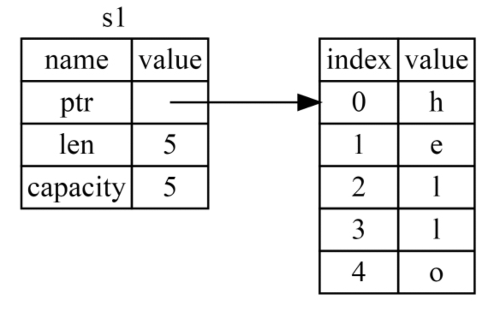
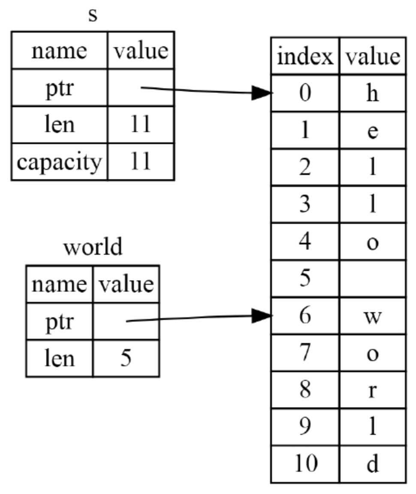

# Rust权威指南

## 第1章 入门指南

### 安装

```bash
curl --proto '=https' --tlsv1.2 -sSf https://sh.rustup.rs | sh
```

### 更新

```bash
rustup update
```

### 检查安装是否成功

```bash
rustc --version
```

### 查看本地文档

```bash
rustup doc
```

### Cargo

Cargo是Rust工具链中内置的构建系统及包管理器

```bash
# 查看版本
cargo --version
# 创建项目
cargo new xxx
# 编译
cargo build
# 运行，如果没有编译会先进行编译
cargo run
# 快速检查当前项目能否通过编译：由于cargo check跳过了生成可执行程序的步骤，所以它的运行速度要远远快于cargo build
cargo check
# 构建Release，它生成的可执行文件会被放置在target/release目录下，而不是之前的target/debug目录下。这种模式会以更长的编译时间为代价来优化代码，从而使代码拥有更好的运行时性能
cargo build --release
```

*crate是Rust中最小的编译单元，package是单个或多个crate的集合，crate和package都可以被叫作包，因为单个crate也是一个package，但package通常倾向于多个crate的组合，为了便于区分，后文将crate称为单元包，将package称为包*

## 第2章 编写一个猜数游戏

Rust会将预导入（prelude）模块内的条目自动引入每一段程序的作用域中，它包含了一小部分相当常用的类型。**但假如你需要的类型不在预导入模块内，那么我们就必须使用use语句来显式地进行导入声明**，比如下面这种

```rust
use std::io;
```

**在Rust中，变量都是默认不可变的，如果需要声明一个可变的变量，就需要使用关键字mut**

```rust
let foo = 5; // foo是不可变的
let mut bar = 5; // bar是可变的
```

`String::new`中的`::`语法 表明`new`是`String`的一个**关联函数**，关联函数在某些语言中又称为**静态方法**

引用与变量一样，**默认情况下也是不可变的**，因此，下面的代码中也需要使用&mut guess而不是&guess来声明一个可变引用

```rust
io::stdin().read_line(&mut guess)
```

**添加依赖的库单元包**

```bash
cargo add rand
```

**`Cargo.lock`文件的作用**

第一次使用`cargo build`构建项目时便在当前的项目目录下生成，**Cargo会依次遍历我们声明的依赖及其对应的语义化版本，找到符合要求的具体版本号，并将它们写入Cargo.lock文件中**。随后再次构建项目时，**Cargo就会优先检索Cargo.lock，假如文件中存在已经指明具体版本的依赖库，那么它就会跳过计算版本号的过程，并直接使用文件中指明的版本**。这使得我们拥有了一个自动化的、可重现的构建系统

*当需要升级某个依赖包时，可以使用**`Cargo update`**，它会忽略`Cargo.lock`文件，**基于语义化版本的规则**，重新计算出所有依赖包中符合`Cargo.toml`声明的最新版本，如果命令执行成功，Cargo会将更新后的版本号写入`Cargo.lock`文件，覆盖之前的内容*

**查看本地依赖包的文档**

```bash
cargo doc --open
```

**关于变量隐藏**

```rust
// 这里声明了guess变量
let mut guess = String::new();
io::stdin()
    .read_line(&mut guess)
    .expect("Failed to read line");
// Rust允许使用同名的新变量guess来隐藏（shadow）旧变量的值
// 注意这里的let关键字不能省略
let guess:u32 = guess.trim().parse().expect("Please type a number!");
```

**猜数字完整代码**

```rust
use rand::Rng;
use std::cmp::Ordering;
use std::io;

fn main() {
    println!("Guess the number!");

    let secret_number = rand::thread_rng().gen_range(0..=100);
    // println!("The secret number is: {}", secret_number);

    loop {
        println!("Please input your guess.");
        let mut guess = String::new();

        io::stdin()
            .read_line(&mut guess)
            .expect("Failed to read line");

        let guess: u32 = match guess.trim().parse() {
            Ok(num) => num,
            Err(_) => continue,
        };
        // println!("You guessed: {}", guess);

        match guess.cmp(&secret_number) {
            Ordering::Less => println!("Too Small"),
            Ordering::Equal => {
                println!("You win!");
                break;
            }
            Ordering::Greater => println!("Too Big!"),
        }
    }
}
```

## 第3章 通用编程概念

### 变量与可变性

Rust中的变量默认是不可变的，如果期望可变，需要使用`mut`关键字

### 变量与常量之间的不同

1. 不能用`mut`来修饰常量
2. 需要使用`const`来声明常量，且**必须显式**地标注值的类型
3. 常量可以被声明在任何作用域中，包括全局作用域
4. **只能将常量绑定到一个常量表达式上**，而无法将一个函数的返回值，或其他需要在运行时计算的值绑定到常量上

### 数据类型

1. 标量类型

   - 整数

     |  长度  | 有符号 | 无符号 |
     | :----: | :----: | :----: |
     | 8-bit  |   i8   |   u8   |
     | 16-bit |  i16   |  u16   |
     | 32-bit |  i32   |  u32   |
     | 64-bit |  i64   |  u64   |
     |  arch  | isize  | usize  |

     位数为`n`的有符号整数类型，具值范围：$-2^{n-1}$到$2^{n-1}-1$，对于无符号整数类型而言，则是：0到$2^n-1$

     **isize和usize两种特殊的整数类型，它们的长度取决于程序运行的目标平台**。在64位架构上，它们就是64位的，而在32位架构上，它们就是32位的

     默认会将整数类型字面量的类型推导为i32

   - 浮点数

     f32和f64，它们分别占用32位和64位空间，默认会将浮点数字面量的类型推导为f64

     Rust的浮点数使用了**IEEE-754标准**来进行表述，f32和f64类型分别对应着标准中的**单精度浮点数**和**双精度浮点数**

   - 布尔值

     true和false，占据单个字节的空间大小

   - 字符

     **Rust中的char类型占4字节，是一个Unicode标量值**，这也意味着它可以表示比ASCII多得多的字符内容

     Unicode标量可以描述从U+0000到U+D7FF以及从U+E000到U+10FFFF范围内的所有值

2. 复合类型

   - 元组类型

     可以将其他不同类型的多个值组合进一个复合类型中

     固定长度，声明结束后无法增加或减少其中的元素

     声明方式：`let tup: (i32, f64, u8) = (500, 6.4, 1);`

     访问方式：

     	1. 解构：`let (x, y, z) = tup;`
     	1. 索引：`let a = tup.0; let b = tup.1;`

   - 数组

     每一个元素都必须是相同的类型

     **固定长度，一旦声明就再也不能随意更改大小**（Rust中有单独的动态数组）

     声明方式：

     ```rust
     let a: [u32; 5] = [1, 2, 3, 4, 5];
     let b = [3; 5] // 等价于：let b = [3, 3, 3, 3, 3];
     ```

     访问方式：索引

### 函数及函数参数

Rust代码使用**蛇形命名法（snake case）**来作为规范函数和变量名称的风格。蛇形命名法只使用小写的字母进行命名，并以下画线分隔单词

在函数签名中，你**必须显式地声明每个参数的类型**

### 函数体中的语句和表达式

Rust是一门基于表达式的语言，所以它将语句（statement）与表达式（expression）区别为**两个不同的概念**

**语句不会返回值**，所以类似`let x = (let y = 6);`这样的赋值方式是错误的

**表达式会计算出某个值来作为结果**，比如下面这种是合法了

```rust
let y = {
  let x = 3;
  // 注意这里没有分号，是将表达式x+1的值返回，所以y的值为4
  x + 1
}
```

### 函数的返回值

```rust
fn five() -> i32 {
  // 注意这里也没有分号
  5
}

fn plus_one(x: i32) -> i32 {
  x + 1
}
```

### 注释

Rust中注意必须以双斜杠开始

### 控制流

- Rust不会自动尝试将非布尔类型的值转换为布尔类型，**必须显式**地在if表达式中提供一个布尔类型作为条件

- 由于if是一个表达式，所以我们可以在let语句的右侧使用它来生成一个值：

  ```rust
  fn main() { 
      let condition = true; 
      let number = if condition { 
          5 
      } else { 
          6 
      }; 
   
      println!("The value of number is: {}", number); 
  } 
  ```


- Rust提供了3种循环：loop、while、for

  - loop可以从循环中返回值

    ```rust
    fn main() { 
        let mut counter = 0; 
     
        let result = loop { 
            counter += 1; 
     
            if counter == 10 { 
                break counter * 2; 
            } 
        }; 
     
        println!("The result is {}", result); 
    } 
    ```

  - while条件循环

    ```rust
    fn main() { 
        let mut number = 3; 
     
        while number != 0 { 
            println!("{}!", number); 
     
            number = number - 1; 
        } 
     
        println!("LIFTOFF!!!"); 
    } 
    ```

  - for遍历循环

    ```rust
    fn main() { 
        let a = [10, 20, 30, 40, 50]; 
     
        for element in a.iter() { 
            println!("the value is: {}", element); 
        } 
    } 
    ```

## 第4章 认识所有权

与使用**垃圾回收机制**以及**手动分配和释放内存**的方式不同，Rust使用包含特定规则的**所有权系统**来管理内存，**允许编译器在编译过程中执行检查工作，而不会产生任何的运行时开销**

### 栈与堆 

- 栈后进先出
- 栈中的数据必须拥有一个已知固定的大小
- 对于编译期无法确定大小的数据，只能存储在堆中
- 堆分配的过程：操作系统根据你的请求在堆中的到一块足够大的可用空间，将其标记为已使用，并把指向这片空间地址的指针返回
- 指向堆空间的指针，其大小是固定的且可以在编译期确定，所以它存储在栈中

### 所有权规则

- 每一个值都有一个对应的变量作为它的**所有者**
- 同一时间，值的所有者有且仅有一个
- 当所有者离开自己的作用域时，它持有的值就会被释放掉

### String类型

```rust
// 硬编码进程序的字符串值，不可变，会写入二进制文件
let s = "hello";
// 存储在堆上
let s = String::from("hello");
// 声明成可变后，可以修改字符串
let mut s = String::from("hello");
s.push_str(", world!");
```

Rust在变量离开作用域时，会调用一个叫作**drop**的特殊函数，从而**实现自动释放内存**

*在C++中，这种在对象生命周期结束时释放资源的模式被称为资源获取即初始化（Resource Acquisition Is Initialization, RAII）*

#### String变量的内存布局



**capacity与len的区别：**前者记录String向操作系统总共获取到的内存字节数量，后者用来记录当前String中的文本使用了多少字节的内存

### 变量和数据交互的方式

#### 1. 移动

```rust
let s1 = String::from("hello");
// s2会通过浅拷贝的方式复制指定、长度、容易，但为了避免当s1、s2离开作用域时两次触发drop方法，此处会使用“移动“，让s1无效，即在这句之后无法再访问s1 
let s2 = s1;

// 这句在编译时会报错
println!("{}, world!", s1);
```

#### 2. 克隆

```rust
let s1 = String::from("hello");
// 这里使用了名为Copy的trait
let s2 = s1.clone();

println!("s1 = {}, s2 = {}", s1, s2);
```

#### 3. 关于函数

**将变量传递给函数将会触发移动或复制，就像是赋值语句一样：**

```rust
fn main() {
  let s = String::from("hello");
  // 此时发生变量的移动
  takes_ownership(s);
  
  // 之后再访问s就会编译报错
}

fn takes_ownership(some_string: String) {
  println!("{}", some_string);
}
```

**函数在返回值的过程中也会发生所有权的转移：**

```rust
fn main() {
  let s1 = gives_ownership();
}

fn gives_ownership() -> String {
  let some_string = String::from("hello");
  some_string
}
```

#### 4. 总结

将一个值赋值给另一个变量时就会转移所有权。当一个持有堆数据的变量离开作用域时，它的数据就会被drop清理回收，除非这些数据的所有权移动到了另一个变量上。假如你希望在调用函数时保留参数的所有权，那么就不得不将传入的值作为结果返回

### 引用与借用

使用`&`符号表示**引用**语义，它允许你在不获取所有权的前提下使用值，并且当它离开自己的作用域时不会销毁其指向的数据，因为它并不拥有该数据的所有权

*与`&`相反的操作被称为**解引用**，它使用`*`运算符，后面会提及*

这种通过引用传递参数给函数的方法称为**借用**，Rust**不允许**我们去修改引用指向的值

### 可变引用

当确实需要修改引用时，可以使用`&mut`来传递值及声明函数，如下：

```rust
fn main() { 
    let mut s = String::from("hello"); 
 
    change(&mut s); 
} 
 
fn change(some_string: &mut String) { 
    some_string.push_str(", world"); 
}
```

但可变引用在使用上有一个很大的**限制：**

1. 对于特定作用域中的特定数据来说，一次只能声明一个可变引用
2. 不能在拥有不可变引用的同时创建可变引用

### 悬垂引用

所谓“悬垂”与拥有指针概念语言中的悬垂指针类似，表示指针指向曾经存在的某处内存地址，但该内存已经被释放掉甚至被重新分配另作他用了

Rust编译器会确保引用永远不会进入这种悬垂状态

### 切片

切片允许我们引用集合中某一段连续的元素序列，而不是整个集合

#### 字符串切片

```rust
let s = String::from("hello world");
let hello = &s[0..5];
let world = &s[6..11];
```

**切片数据结构**在内部存储了指向起始位置的引用和一个描述切片长度的字段，这个描述切片长度的字段等价于ending_index减去starting_index



#### 关于切片的语法煻

1. 从第一个元素开始，省略起始值：`let slice = &s[..2];`
2. 包含最后一个元素，省略末尾值：`let slice = &s[3..];`
3. 同时包含首尾时，省略首尾值：`let slice = &s[..];`

## 第5章 使用结构体来组织相关联的数据

```rust
// 声明
struct User {
    username: String,
    email: String,
    sign_in_count: u64,
    active: bool,
}

// 创建实例
let user1 = User {
  email: String::from("someone@example.com"),
  username: String::from("someusername123"),
  active: true,
  sign_in_count: 1,
}

// 如果修改实例的值，则需要使用mut关键字，并且不支持声明某一部分字段的可变性
let mut user1 = User {
    email: String::from("someone@example.com"),
    username: String::from("someusername123"),
    active: true,
    sign_in_count: 1,
};

user1.email = String::from("anotheremail@example.com");
```

### 使用结构体更新语法根据其他实例创建新实例

```rust
// 表示除了email和username之外的属性都从user1实例中获取
let user2 = User {
    email: String::from("another@example.com"),
    username: String::from("anotherusername567"),
    ..user1
};
```

### 元素结构体

当无须声明字段名时使用，比如：

```rust
struct Color(i32, i32, i32);
struct Point(i32, i32, i32);

let black = Color(0, 0, 0);
let origin = Point(0, 0, 0);
```

### 没有任何字段的空结构体

使用场景：当你想要在某些类型上实现一个`trait`，却不需要在该类型中存储任何数据时（后面会介绍trait）

### 结构体使用示例

```rust
#[derive(Debug)]
struct Rectangle {
    width: u32,
    height: u32,
}

fn main() {
    let rect = Rectangle {
        width: 30,
        height: 50,
    };

    println!(
        "The area of the rectangle is {} square pixels.",
        area(&rect)
    );
  	// 格式化输出，依赖前面的#[derive(Debug)]
  	// println!("Rectangle is: {:?}", rect)
    println!("Rectangle is: {:#?}", rect)
}

fn area(rect: &Rectangle) -> u32 {
    rect.width * rect.height
}
```

### 方法

 与函数的区别：方法总是被定义在某个结构体的上下文中，**并且它的第一个参数永远都是`self`**

```rust
#[derive(Debug)]
struct Rectangle {
    width: u32,
    height: u32,
}

impl Rectangle {
    fn area(&self) -> u32 {
        self.width * self.height
    }
}

fn main() {
    let rect = Rectangle {
        width: 30,
        height: 50,
    };

    println!(
        "The area of the rectangle is {} square pixels.",
        rect.area()
    );
    println!("Rectangle is: {:#?}", rect)
}

```

**方法可以在声明时选择获取`self`的所有权，也可以像本例一样采用不可变的借用`&self`，或者采用可变的借用`&mut self`**

### 关联函数（静态方法）

除了方法，impl块还允许我们定义不用接收self作为参数的函数。由于这类函数与结构体相互关联，所以它们也被称为**关联函数（associated function）**

### 多个impl块

每个结构体可以拥有多个impl块，可以将方法放置到不同的`impl`块中

## 第6章 枚举与模式匹配

### 定义与使用

```rust
// 定义
enum IpAddrKing {
  V4,
  V6,
}

// 使用
let four = IpAddrKing::V4;
let six = IpAddrKing::V6;
```

### 枚举变体

可以将枚举直接关联的数据嵌入枚举变体内，从而不需要额外地使用结构体，**并且每个变体可以拥有不同类型和数量的关联数据**

```rust
enum IpAddr {
  V4(String),
  V6(String),
}

let home = IpAddr::V4(String::from("127.0.0.1"));

// 每个变体拥有不同类型和数量的关联数据
enum Message {
  Quit,
  Move { x: i32, y: i32},
  Write(String),
  ChangeColor(i32, i32, i32),
}
```

枚举也可以通过`impl`关键字来添加方法，方法中也可以通过`self`关键字来获取实例

### Option枚举及其在空值处理方面的优势

Option类型用于描述了一种值**可能不存在**的情形，Rust中没有空值，而是提供了一个拥有类似概念的枚举，用于标识一个值无效或缺失，这个枚举就是`Option<T>`

```rust
enum Option<T> {
  Some(T),
  None,
}
```

**为了使用一个`Option<T>`值，你必须要编写处理每个变体的代码**

### 控制流运算符match

```rust
enum Coin {
  Penny,
  Nickel,
  Dime,
  Quarter,
}

fn value_in_cents(coin: Coin) -> u32 {
    match coin {
        Coin::Penny => {
            println!("Lucky penny!");
            1
        },
        Coin::Nickel => 5,
        Coin::Dime => 10,
        Coin::Quarter => 25,
    }
}
```

### 绑定值的模式

匹配分支另外一个有趣的地方在于它们可以绑定被匹配对象的部分值，而这也正是我们用于从枚举变体中提取值的方法

```rust
#[derive(Debug)]
enum UsState {
  Alabama,
  Alaska,
}

enum Coin {
  Penny,
  Nickel,
  Dime,
  Quarter(UsState),
}

fn value_in_cents(coin: Coin) -> u32 {
    match coin {
        Coin::Penny => 1,
        Coin::Nickel => 5,
        Coin::Dime => 10,
        Coin::Quarter(state) => {
            println!("State quarter from {:?}!", state);
            25
        },
    }
}

value_in_cents(Coin::Quarter(UsState::Alaska));
```

### 匹配`Option<T>`

```rust
fn plus_one(x: Option<i32>) -> Option<i32> {
    match x {
    		None => None,
    		Some(i) => Some(i + 1),
    }
}

let five = Some(5);
let six = plus_one(five);
let none = plus_one(None);
```

### 匹配必须穷举所有的可能

如果没有覆盖所有可能的情形，在编译时Rust就会报错，但有时，并不想处理所有可能的值，此时可以使用`_通配符`

```rust
let some_u8_value = 0u8;
match some_u8_value {
    1 => println!("one"),
    3 => println!("three"),
    5 => println!("five"),
    7 => println!("seven"),
  	// 注意这里，这里对应一个空元组
    _ => (),
}
```

### 简单控制流if let

```rust
let some_u8_value = Some(0u8);
match some_u8_value {
  Some(3) => println!("three"),
  _ => (),
}

// 等价于
if let Some(3) = some_u8_value {
  println!("three");
}

// 另一个例子
let mut count = 0;
if let Coin::Quarter(state) = coin {
  println!("State quarter from {:?}!", state);
} else {
  count += 1;
}
```

## 第7章 使用包、单元包及模块来管理日渐复杂的项目

一个包（package）可以拥有**多个二进制单元包**及**一个可选的库单元包**，同时包内必须存在至少一个单元包

- 包（package）：一个用于构建、测试并分享单元包的Cargo功能
- 单元包（crate）：一个用于生成库或可执行文件的树形模块结构
- 模块（module）及use关键字：它们被用于控制文件结构、作用域及路径的私有性
- 路径（path）：一种用于命名条目的方法，这些条目包括结构体、函数和模块等

Cargo会默认将`src/main.rs`视作一个**二进制单元包的根节点**而无须指定，这个二进制单元包与包拥有相同的名称，同样，也会默认将`src/lib.rs`视作**与包同名的库单元包的根节点**

我们可以在路径`src/bin`下添加源文件来创建出更多的二进制单元包，**这个路径下的每个源文件都会被视作单独的二进制单元包**

### 通过定义模块来控制作用域及私有性

```bash
// 创建名为restaurant的库单元包
cargo new --lib restaurant
```

**通过`mod`关键字来创建模块**

### 用于在模块树中指明条目的路径 

路径有两种形式：

- 使用单元包名或字面量crate从根节点开始的绝对路径
- 使用self、super或内部标识符从当前模块开始的相对路径

比如下面的这个例子：

```rust
mod front_of_house {
    mod hosting {
        fn add_to_waitlist() {}
    }
}

pub fn eat_at_restaurant() {
    // 绝对路径
    crate::front_of_house::hosting::add_to_waitlist();

    // 相对路径
    front_of_house::hosting::add_to_waitlist();
}
```

Rust中的所有条目（函数、方法、结构体、枚举、模块及常量）**默认都是私有的**

### 使用pub关键字来暴露路径

模块添加`pub`后，还要将模块中的方法也添加`pub`关键字，不然还是不能访问，因为将模块变为公开状态并不会影响到它内部条目的状态

### 使用super关键字开始构造相对路径

它的作用类似于在文件系统中使用`..`语法开始一段路径

### 将结构体或枚举声明为公共的

1. 当我们在结构体定义前使用pub时，结构体本身就成为了公共结构体，但它的字段依旧保持了私有状态，可以逐一决定是否将某个字段公开
2. 当我们将一个枚举声明为公共的时，它所有的变体都自动变为了公共状态。我们仅需要在enum关键字前放置pub

### 用use关键字将路径导入作用域

可以借助use关键字来将路径引入作用域，并像使用本地条目一样来调用路径中的条目

```rust
mod front_of_house {
    pub mod hosting {
        pub fn add_to_waitlist() {}
    }
}

use crate::front_of_house::hosting;

pub fn eat_at_restaurant() {
    hosting::add_to_waitlist();
    hosting::add_to_waitlist();
    hosting::add_to_waitlist();
}
# fn main() {}
```

使用use来指定相对路径稍有一些不同。我们必须在传递给use的路径的开始处使用关键字self，而不是从当前作用域中可用的名称开始

```rust
mod front_of_house {
    pub mod hosting {
        pub fn add_to_waitlist() {}
    }
}

use self::front_of_house::hosting;

pub fn eat_at_restaurant() {
    hosting::add_to_waitlist();
    hosting::add_to_waitlist();
    hosting::add_to_waitlist();
}
```

### 使用as关键字来提供新的名称

作用很简单：别名

```rust
use std::fmt::Result;
use std::io::Result as IoResult;

fn function1() -> Result {
    // --略--
}

fn function2() -> IoResult<()> {
    // --略--
}
```

### 使用`pub use`重导出名称

当我们使用use关键字将名称引入作用域时，这个名称会以**私有**的方式在新的作用域中生效。为了让外部代码能够访问到这些名称，我们可以通过组合使用pub与use实现。这项技术也被称作**重导出（re-exporting）**

### 将模块拆分为不同的文件

基于命名约定的方式来查找模块，比如：

```rust
// 声明front_of_house模块，其代码位于src/front_of_house.rs文件中
mod front_of_house;

pub use crate::front_of_house::hosting;

pub fn eat_at_restaurant() {
    hosting::add_to_waitlist();
    hosting::add_to_waitlist();
    hosting::add_to_waitlist();
}
```

## 第8章 通用集合类型

接下来要介绍的集合都存储在堆上

### 使用动态数组存储多个值

动态数组`Vec<T>`，存储一系统相当类型的值

```rust
// 创建存储i32数据的空动态数组
let v:Vec<i32> = Vec::new();
// 创建一个包含了值的新动态数组
let v = vec![1, 2, 3];
```

### 读取动态数组中的元素

```rust
let v = vec![1, 2, 3, 4, 5];

let does_not_exist = &v[100];
let does_not_exist = v.get(100);
```

### 遍历动态数组中的元素

```rust
let v = vec![100, 32, 57];
for i in &v {
    println!("{}", i);
}

// 遍历的同时修改值
let mut v = vec![100, 32, 57];
for i in &mut v {
  	// 使用解引用运算符（*）来获得i绑定的值
    *i += 50;
}
```

### 使用字符串存储UTF-8编码的文本

字符串是**基于UTF-8编码**的，我们可以将任何合法的数据编码进字符串中

编译器可以自动将`&String`类型的参数强制转换为`&str`类型

对字符串中字节的索引并不总是能对应到一个有效的Unicode标量值

如果需要对一个字符串中的每个Unicode标量进行处理，最好的办法是使用`chars`方法：

```rust
for c in "".chars() {
    println!("{}", c);
}
```

### 在哈希映射中存储键值对

哈希映射：`HashMap<K,V>`，它存储了**从K类型键到V类型值之间的映射关系**

```rust
use std::collections::HashMap;

fn main() {
    let mut scores = HashMap::new();

    scores.insert(String::from("Blue"), 10);
    scores.insert(String::from("Yellow"), 50);

    let team_name = String::from("Blue");
  	// 通过get方法获取哈希映射中的值
    if let Some(score) = scores.get(&team_name) {
        println!("The score of Team Blue is: {}", score);
    }

  	// 获取哈希映射中所有值
    for (key, value) in &scores {
        println!("{}:{}", key, value);
    }

    let teams = vec![String::from("Blue"), String::from("Yellow")];
    let initial_scores = vec![10, 50];

    let scores: HashMap<_, _> = teams.iter().zip(initial_scores.iter()).collect();
    println!("{:?}", scores);
}

```

### 哈希映射与所有权

对于实现了`Copy trait`的类型，比如i32，它们的值会被简单地复制到哈希映射中，而对于String这种持有所有权的值，其值将会转移且所有权会转移给哈希映射中

如果只是将值的引用插入哈希映射，那么这些值是不会被移动到哈希映射中的，但必须保证在哈希映射有效时自己也是有效的

### 更新哈希映射

1. 覆盖旧值

2. 只在键没有对应值时插入数据

   ```rust
   let mut scores = HashMap::new();
   scores.insert(String::from("Blue"), 10);
   
   scores.entry(String::from("Yellow")).or_insert(50);
   scores.entry(String::from("Blue")).or_insert(50);
   // 输出：{"Yellow": 50, "Blue": 10}
   println!("{:?}", scores);
   ```

   Entry的or_insert方法被定义为返回一个Entry键所指向值的可变引用，假如这个值不存在，就将参数作为新值插入哈希映射中，并把这个新值的可变引用返回

3. 基于旧值来更新新值

   ```rust
   let text = "hello world wonderful world";
   let mut map = HashMap::new();
   for word in text.split_whitespace() {
     	// 方法or_insert实际上为我们传入的键返回了一个指向关联值的可变引用（&mut V）
       let count = map.entry(word).or_insert(0);
     	// 必须首先使用星号（*）来对count进行解引用
       *count += 1;
   }
   // 输出：{"world": 2, "wonderful": 1, "hello": 1}
   println!("{:?}", map);
   ```

## 第9章 错误处理

Rust中将错误分为两类：

1. 可恢复错误，通过`Result<T, E>`类型表示
2. 不可恢复错误，通过中止程序运行的`panic!`宏来表示

### 不可恢复错误与panic!

代码执行错误时，可以利用**回溯**来定位出问题的代码，使用方式：

```bash
# 这里注意在执行cargo子命令时，不要附带--release标志，因为工获取回溯，必须启用调试符号，当未指定--release时，调试符号默认是开启的
RUST_BACKTRACE=1 cargo run
```

### 可恢复错误与Result

```rust
enum Result<T, E> {
  Ok(T),
  Err(E),
}
```

```rust
use std::fs::File;

fn main() {
	let f = File::open("hello.txt");
  
  let f = match f {
    Ok(file) => file,
    Err(error) => {
      panic!("There was a problem opening the file: {:?}", error);
    },
  };
}
```

### 失败时触发panic的快捷方式：unwrap和expect

1. unwarp实现的效果与上面的代码类似：当Result返回的是Ok变体时，unwrap就会返回Ok内部的值，而当Result的返回值是Err变体时，unwrap则替我们调用panic!宏

   ```rust
   use std::fs::File;
   
   fn main() {
     let f = File::open("hello.txt").unwrap();
   }
   ```

   

2. expect允许我们在unwrap的基础上指定panic!所附带的错误提示信息

   ```rust
   use std::fs::File;
   
   fn main() {
   	let f = File::open("hello.txt").expect("Failed to open hello.txt");
   }
   ```

### 传播错误

> 当你编写的函数中包含了一些可能会执行失败的调用时，除了可以在函数中处理这个错误，还可以将这个错误返回给调用者，让他们决定应该如何做进一步处理。这个过程也被称作**传播错误**，在调用代码时它给了用户更多的控制能力

```rust
// 传播错误的示例
use std::fs::File;
use std::io::{self, Read};

fn main() {
    match read_username_from_file() {
        Ok(s) => println!("{}", s),
        Err(e) => panic!("{:?}", e),
    }
}

fn read_username_from_file() -> Result<String, io::Error> {
    let f = File::open("hello.txt");

    let mut f = match f {
        Ok(file) => file,
        Err(e) => return Err(e),
    };

    let mut s = String::new();

    match f.read_to_string(&mut s) {
        Ok(_) => Ok(s),
        Err(e) => Err(e),
    }
}
```

#### 传播错误的简化语法

通过在`Result`值之后放置`?`，可实现上述代码相同的功能：假如这个Result的值是Ok，那么包含在Ok中的值就会作为这个表达式的结果返回并继续执行程序。假如值是Err，那么这个值就会作为整个程序的结果返回，如同使用了return一样将错误传播给调用者

```rust
use std::fs::File;
use std::io::{self, Read};

fn main() {
    match read_username_from_file() {
        Ok(s) => println!("{}", s),
        Err(e) => panic!("{:?}", e),
    }
}

fn read_username_from_file() -> Result<String, io::Error> {
  	// 这里甚至可以使用链式方法调用
  	// File::open("hello.txt")?.read_to_string(&mut s)?;
    let mut f = File::open("hello.txt")?;
    let mut s = String::new();
    f.read_to_string(&mut s)?;
    Ok(s)
}
```

**`?`运算符只能被用于返回Result的函数**

### 要不要使用panic!

1. 示例、原型和测试——使用unwrap或expect
2. 当你比编译器拥有更多信息时——使用unwrap

## 第10章 泛型、trait与生命周期

### 通过将代码提取为函数来减少重复工作

```rust
fn main() {
    let number_list = vec![34, 50, 25, 100, 65];
    let result = largest(&number_list);
    println!("The largest number is {}", result);
}

fn largest(list: &[i32]) -> i32 {
    let mut largest = list[0];

    for &item in list.iter() {
        if item > largest {
            largest = item;
        }
    }

    largest
}

```

### 泛型数据类型

1. 函数定义中
2. 结构体定义中
3. 枚举定义 中
4. 方法定义中

### 泛型代码的性能问题

Rust会在编译时执行泛型代码的**单态化（monomorphization）**。单态化是一个在编译期将泛型代码转换为特定代码的过程，它会将所有使用过的具体类型填入泛型参数从而得到有具体类型的代码

### trait：定义共享行为

trait（特征）与其它语言中常被称为interface（接口）的功能类似，但也不尽相同

```rust
// lib.rs
pub trait Summary {
    fn summarize(&self) -> String;
}

pub struct NewsArticle {
    pub headline: String,
    pub location: String,
    pub author: String,
    pub content: String,
}

impl Summary for NewsArticle {
    fn summarize(&self) -> String {
        format!("{}, by {} ({})", self.headline, self.author, self.location)
    }
}

pub struct Tweet {
    pub username: String,
    pub content: String,
    pub reply: bool,
    pub retweet: bool,
}

impl Summary for Tweet {
    fn summarize(&self) -> String {
        format!("{}:{}", self.username, self.content)
    }
}

// main.rs
use trait_demo::{Summary, Tweet};

fn main() {
    let tweet = Tweet {
        username: String::from("horse_ebooks"),
        content: String::from("of course, as you probably already know, people"),
        reply: false,
        retweet: false,
    };

    println!("1 new tweet: {}", tweet.summarize());
}
```

 注意实现trait有一个限制：**只有当trait或类型定义于我们的库中时，我们才能为该类型实现对应的trait**，这么做是为了保持程序的一致性，确保其他人所编写的内容不会破坏到你的代码

### 默认实现

在为某个特定类型实现trait时可以选择保留或重载每个方法的默认行为

```rust
pub trait Summary {
	fn summarize(&self) -> String {
  	String::from("(Read more...)");
  }
}
```

然后在NewsArticle的实例中使用这种默认实现而不是自定义实现：

```rust
impl Summary for NewsArticle {}

let article = NewsArticle {
    headline: String::from("Penguins win the Stanley Cup Championship!"),
    location: String::from("Pittsburgh, PA, USA"),
    author: String::from("Iceburgh"),
    content: String::from("The Pittsburgh Penguins once again are the best
    hockey team in the NHL."),
};

// 输出 New article available! (Read more...)
println!("New article available! {}", article.summarize());
```

### 使用trait作为参数

使用trait来定义接收不同类型参数的函数，比如定义一个notify函数，它接收一个实现了Summary trait的参数item，即它具有summarize方法

```rust
pub fn notify(item: impl Summary) {
	println!("Breaking news! {}", item.summarize());
}
```

这里我们没有定义item的具体类型，而是使用了impl关键字及对应的trait名称，该参数可以接收任何实现了指定trait的类型

这里其实是使用了被称为`**trait约束（trait bound）**`的语法糖，它的完整形式如下：

```rust
pub fn notify<T: Summary>(item: T) {
  println!("Breaking news! {}", item.summarize());
}
```

#### 何时该使用完整形式

比如：

```rust
pub fn notify(item1: impl Summary, item2: impl Summary) {
	...
}
```

此时item1与item2只要实现了Summary trait即可，但如果想更严格的约束两个参数类型相同，则需要使用完整形式：

```rust
pub fn notify<T: Summary>(item1: T, item2: T) {
	...
}
```

#### 通过+语法来指定多个trait约束

```rust
pub fn notify(item: impl Summary + Display)
// 或
pub fn notify<T: Summary + Display>(item: T) {
  ...
}
```

#### 使用where从句来简化trait约束

当使用过多的trait约束时，由于每个泛型都有自己的trait约束，当定义有多个泛型参数的函数时，就会有大量的trait约束信息需要被填写在函数名与参数列表之间，会导致函数签名变得难以理解，而where从句正是为了解决这个问题

```rust
fn some_function<T: Display + Clone, U: Clone + Debug>()t: T, u: U) -> i32 {
  ...
}
// 通过where从句改造
fn some_function<T, U>(t: T, u: U) -> i32
	where T: Display + Clone,
			U: Clone + Debug
{
  ...
}
```

### 返回实现了trait的类型

```rust
fn returns_summarizable() -> impl Summary {
	Tweet {
    username: String::from("horse_ebooks"),
    content: String::from("of course, as you probably already know, people"),
    reply: false,
    retweet: false,
  }
}
```

**你只能在返回一个类型时使用impl Trait**

### 使用trait约束来有条件地实现方法

通过在带有泛型参数的impl代码块中使用trait约束，我们可以单独为实现了指定trait的类型编写方法

```rust
use std::fmt::Display;

struct Pair<T> {
    x: T,
    y: T,
}

impl<T> Pair<T> {
    fn new(x: T, y: T) -> Self {
        Self {
            x,
            y,
        }
    }
}

impl<T: Display + PartialOrd> Pair<T> {
    fn cmp_display(&self) {
        if self.x >= self.y {
            println!("The largest member is x = {}", self.x);
        } else {
            println!("The largest member is y = {}", self.y);
        }
    }
}
```

> 我们同样可以为实现了某个trait的类型有条件地实现另一个trait。对满足trait约束的所有类型实现trait也被称作**覆盖实现（blanket implementation）**，这一机制被广泛地应用于Rust标准库中

### 使用生命周期保证引用的有效性

Rust的每个引用都有自己的生命周期（lifetime），它对应着引用保持有效性的作用域。Rust需要我们注明泛型生命周期参数之间的关系，来确保运行时实际使用的引用一定是有效的

### 借用检查器

Rust编译器拥有一个**借用检查器（borrow checker）**，它被用于比较不同的作用域并确定所有借用的合法性

### 函数中的泛型生命周期

```rust
fn main() {
    let string1 = String::from("abcd");
    let string2 = "xyz";

    let result = longest(string1.as_str(), string2);
    println!("The longest string is {}", result);
}

fn longest(x: &str, y: &str) -> &str {
    if x.len() > y.len() {
        x
    } else {
        y
    }
}

```

上述代码编译无法通过，因为上述函数，我们并不知道被传入函数的具体值，也不能确定到底是if分支还是else分支得到执行，同样也无法知晓传入的引用的具体生命周期，而借用检查器也无法确定这一点

### 生命周期标注语法

生命周期的标注并不会改变任何引用的生命周期长度。在不影响生命周期的前提下，标注本身会被用于描述多个引用生命周期之间的关系

生命周期的标注使用了一种明显不同的**语法**：它们的参数名称必须以撇号（'）开头，且通常使用全小写字符

单个生命周期的标注本身并没有太多意义，标注之所以存在是为了向Rust描述**多个泛型生命周期参数之间的关系**

### 函数签名中的生命周期标注

```rust
fn main() {
    let string1 = String::from("abcd");
    let string2 = "xyz";

    let result = longest(string1.as_str(), string2);
    println!("The longest string is {}", result);
}

fn longest<'a>(x: &'a str, y: &'a str) -> &'a str {
    if x.len() > y.len() {
        x
    } else {
        y
    }
}
```

### 深入理解生命周期

当函数返回一个引用时，返回类型的生命周期参数必须要与其中一个参数的生命周期参数相匹配。当返回的引用没有指向任何参数时，那么它只可能是指向了一个创建于函数内部的值，由于这个值会因为函数的结束而离开作用域，所以返回的内容也就变成了悬垂引用

从根本上说，**生命周期语法就是用来关联一个函数中不同参数及返回值的生命周期的。一旦它们形成了某种联系，Rust就获得了足够的信息来支持保障内存安全的操作，并阻止那些可能会导致悬垂指针或其他违反内存安全的行为**

### 结构体定义中的生命周期标注

### 生命周期省略

函数参数或方法参数中的生命周期被称为**输入生命周期（input lifetime）**，而返回值的生命周期则被称为**输出生命周期（output lifetime）**

关于生命周期省略规则：

1. 每一个引用参数都会拥有自己的生命周期参数
2. 当只存在一个输入生命周期参数时，这个生命周期会被赋予给所有输出生命周期参数
3. 当拥有多个输入生命周期参数，而其中一个是&self或&mut self时，self的生命周期会被赋予给所有的输出生命周期参数

如果编译器而上述三条规则处理后仍不能明确计算出签名中所有引用的生命周期，则出现错误

### 方法定义中的生命周期标注

结构体字段中的生命周期名字总是需要被声明在impl关键字之后，并被用于结构体名称之后，因为这些生命周期是结构体类型的一部分

```rust
impl<'a> ImportantExcerpt<'a> {
    fn level(&self) -> i32 {
        3
    }
}
```

### 静态生命周期

Rust中还存在一种特殊的生命周期`'static`，它表示整个程序的执行期。所有的字符串字面量都拥有`'static`生命周期

### 同时使用泛型参数、trait约束与生命周期

```rust
use std::fmt::Display;

fn longest_with_an_announcement<'a, T>(x: &'a str, y: &'a str, ann: T) -> &'a str
    where T: Display
{
    println!("Announcement! {}", ann);
    if x.len() > y.len() {
        x
    } else {
        y
    }
}
```

## 第11章 编写自动化测试

### 测试函数的构成

在最简单的情形下，Rust中的测试就是一个**标注有test属性的函数**。属性（attribute）是一种用于修饰Rust代码的元数据

当测试编写完成后，我们可以使用**`cargo test`**命令来运行测试。这个命令会构建并执行一个用于测试的可执行文件，该文件在执行的过程中会逐一调用所有标注了test属性的函数，并生成统计测试运行成功或失败的相关报告

### 使用assert!宏检查结果

### 使用assert_eq!宏和assert_ne!宏判断相等性

### 添加自定义的错误提示信息

### 使用should_panic检查panic

### 使用`Result<T, E>`编写测试

### 控制测试的运行方式

cargo test生成的二进制文件默认会**并行执行**所有的测试，并截获测试运行过程中产生的输出来让与测试结果相关的内容更加易读 

```bash
# 串行执行测试用例
cargo test -- --test-threads=1
# 不捕获代码中的println!输出值
cargo test -- --nocapture
# 传递单个测试函数名称来单独运行该测试
# 注意：不能指定多个参数来运行多个测试
cargo test one_hundred
# 只运行名称中包含“add“的测试
cargo test add
```

### 通过显式指定来忽略某些测试

```rust
#[test]
fn it_works() {
    assert_eq!(2 + 2, 4);
}

#[test]
#[ignore]
fn expensive_test() {
    // 需要运行一个小时的代码
}
```

也可以通过`cargo test -- --ignored`来单独执行这些被标记为忽略的测试

### 测试的组织结构

### 单元测试

我们一般将单元测试与需要测试的代码存放在src目录下的同一文件中。同时也约定俗成地在每个源代码文件中都新建一个tests模块来存放测试函数，并使用cfg(test)对该模块进行标注

单元测试是可以直接测试私有函数的

### 集成测试

集成测试的代码在独立的tests目录下（与src文件夹并列），Cargo会自动在这个目录下寻找集成测试文件，每一个文件都作为一个独立的包处理

可以通过`cargo test --test integration_test`来指定单独运行某个特定集成测试文件下的所有测试函数，比如上面这条命令只运行了`tests/integration_test.rs`文件中的测试

只有代码包（library crate）才可以将函数暴露给其他包来调用，而二进制包只被用于独立执行

## 第12章 I/O项目：编写一个命令行程序

### 接收命令行参数

Rust标准库提供的`std::env::args`函数。这个函数会返回一个传递给minigrep的命令行参数迭代器（iterator），可以通过迭代器的`collect`方法生成一个包含所有产出值的集合

```rust
use std::env;

fn main() {
    let args: Vec<String> = env::args().collect();
  	// args的第一个元素是当前执行的二进制文件
    println!("{:?}", args);
}
```

### 将参数值存入变量

```rust
use std::env;

fn main() {
    let args: Vec<String> = env::args().collect();

  	// 这里使用借用
    let query = &args[1];
    let filename = &args[2];
}
```

### 读取文件

```rust
use std::env;
use std::fs;

fn main() {
    let args: Vec<String> = env::args().collect();

    let query = &args[1];
    let filename = &args[2];

    println!("Searching for \"{}\" in file {}", query, filename);

    let contents = fs::read_to_string(filename).expect("Something went wrong reading the file");

    println!("With text:\n{}", contents);
}
```

### 重构代码以增强模块化程度和错误处理能力

### 二进制项目的关注点分离

- 将程序拆分为main.rs和lib.rs，并将实际的业务逻辑放入lib.rs
- 当命令行解析逻辑相对简单时，将它留在main.rs中也无妨
- 当命令行解析逻辑开始变得复杂时，同样需要将它从main.rs提取至lib.rs中

```rust
use std::env;
use std::fs;

fn main() {
    let args: Vec<String> = env::args().collect();

    let config = Config::new(&args);
    println!(
        "Searching for \"{}\" in file {}",
        config.query, config.filename
    );

    let contents =
        fs::read_to_string(config.filename).expect("Something went wrong reading the file");

    println!("With text:\n{}", contents);
}

struct Config {
    query: String,
    filename: String,
}

impl Config {
    fn new(args: &[String]) -> Config {
        let query = args[1].clone();
        let filename = args[2].clone();

        Config { query, filename }
    }
}
```

### 修复错误处理逻辑

```rust
use std::env;
use std::fs;
use std::process;

fn main() {
    let args: Vec<String> = env::args().collect();

    let config = Config::new(&args).unwrap_or_else(|err| {
        println!("Problem parsing arguments: {}", err);
        process::exit(1);
    });
    println!(
        "Searching for \"{}\" in file {}",
        config.query, config.filename
    );

    let contents =
        fs::read_to_string(config.filename).expect("Something went wrong reading the file");

    println!("With text:\n{}", contents);
}

struct Config {
    query: String,
    filename: String,
}

impl Config {
    fn new(args: &[String]) -> Result<Config, &'static str> {
        if args.len() < 3 {
            return Err("not enough arguments");
        }
        let query = args[1].clone();
        let filename = args[2].clone();

        Ok(Config { query, filename })
    }
}

```

### 从main中分离逻辑

```rust
use std::env;
use std::error::Error;
use std::fs;
use std::process;

fn main() {
    let args: Vec<String> = env::args().collect();

    let config = Config::new(&args).unwrap_or_else(|err| {
        println!("Problem parsing arguments: {}", err);
        process::exit(1);
    });

    println!(
        "Searching for \"{}\" in file {}",
        config.query, config.filename
    );

    if let Err(e) = run(config) {
        println!("Application error: {}", e);
        process::exit(1);
    }
}

fn run(config: Config) -> Result<(), Box<dyn Error>> {
    let contents = fs::read_to_string(config.filename)?;

    println!("With text:\n{}", contents);

    Ok(())
}

struct Config {
    query: String,
    filename: String,
}

impl Config {
    fn new(args: &[String]) -> Result<Config, &'static str> {
        if args.len() < 3 {
            return Err("not enough arguments");
        }
        let query = args[1].clone();
        let filename = args[2].clone();

        Ok(Config { query, filename })
    }
}
```

### 将代码分离为独立的代码包

### 使用测试驱动开发来编写库功能

#### 关于TDD——test-driven development的步骤：

1. 编写一个会失败的测试，运行该测试，确保它会如期运行失败
2. 编写或修改刚好足够多的代码来让新测试通过
3. 在保证测试始终通过的前提下重构刚刚编写的代码
4. 返回步骤1，进行下一轮开发

```rust
// lib.rs
use std::error::Error;
use std::fs;

pub struct Config {
    pub query: String,
    pub filename: String,
}

impl Config {
    pub fn new(args: &[String]) -> Result<Config, &'static str> {
        if args.len() < 3 {
            return Err("not enough arguments");
        }
        let query = args[1].clone();
        let filename = args[2].clone();

        Ok(Config { query, filename })
    }
}

pub fn run(config: Config) -> Result<(), Box<dyn Error>> {
    let contents = fs::read_to_string(config.filename)?;

    for line in search(&config.query, &contents) {
        println!("{}", line);
    }

    Ok(())
}

pub fn search<'a>(query: &str, contents: &'a str) -> Vec<&'a str> {
    let mut results = Vec::new();

    for line in contents.lines() {
        if line.contains(query) {
            results.push(line);
        }
    }

    results
}

#[cfg(test)]
mod tests {
    use super::*;

    #[test]
    fn one_result() {
        let query = "duct";
        let contents = "\
Rust:
safe, fast, productive.
Pick three.";

        assert_eq!(vec!["safe, fast, productive."], search(query, contents))
    }
}

// main.rs
use std::env;
use std::process;

use minigrep::Config;

fn main() {
    let args: Vec<String> = env::args().collect();

    let config = Config::new(&args).unwrap_or_else(|err| {
        println!("Problem parsing arguments: {}", err);
        process::exit(1);
    });

    // println!(
    //     "Searching for \"{}\" in file {}",
    //     config.query, config.filename
    // );

    if let Err(e) = minigrep::run(config) {
        println!("Application error: {}", e);
        process::exit(1);
    }
}
```

### 处理环境变量

```rust
use std::env;
use std::error::Error;
use std::fs;

pub struct Config {
    pub query: String,
    pub filename: String,
    pub case_sensitive: bool,
}

impl Config {
    pub fn new(args: &[String]) -> Result<Config, &'static str> {
        if args.len() < 3 {
            return Err("not enough arguments");
        }
        let query = args[1].clone();
        let filename = args[2].clone();

        let case_sensitive = env::var("CASE_INSENSITIVE").is_err();

        Ok(Config {
            query,
            filename,
            case_sensitive,
        })
    }
}

pub fn run(config: Config) -> Result<(), Box<dyn Error>> {
    let contents = fs::read_to_string(config.filename)?;

    let results = if config.case_sensitive {
        search(&config.query, &contents)
    } else {
        search_case_insensitive(&config.query, &contents)
    };

    for line in results {
        println!("{}", line);
    }

    Ok(())
}

pub fn search<'a>(query: &str, contents: &'a str) -> Vec<&'a str> {
    let mut results = Vec::new();

    for line in contents.lines() {
        if line.contains(query) {
            results.push(line);
        }
    }

    results
}

pub fn search_case_insensitive<'a>(query: &str, contents: &'a str) -> Vec<&'a str> {
    let query = query.to_lowercase();
    let mut results = Vec::new();

    for line in contents.lines() {
        if line.to_lowercase().contains(&query) {
            results.push(line);
        }
    }

    results
}

#[cfg(test)]
mod tests {
    use super::*;

    #[test]
    fn case_sensitive() {
        let query = "duct";
        let contents = "\
Rust:
safe, fast, productive.
Pick three.
Duct tape.";
        assert_eq!(vec!["safe, fast, productive."], search(query, contents))
    }

    #[test]
    fn case_insensitive() {
        let query = "rUsT";
        let contents = "\
Rust:
safe, fast, productive.
Pick three.
Trust me.";

        assert_eq!(
            vec!["Rust:", "Trust me."],
            search_case_insensitive(query, contents)
        )
    }
}

```

### 将错误提示信息打印到标准错误流而不是标准输出流

使用`eprintln!`代替`println!`即可

## 第13章 函数式语言特性：迭代器与闭包

### 使用闭包来创建抽象化的程序行为

```rust
use std::{thread, time::Duration};

fn main() {
    let simulated_user_specified_value = 10;
    let simulated_random_number = 7;

    generate_workout(simulated_user_specified_value, simulated_random_number);
}

fn generate_workout(intensity: u32, random_number: u32) {
    let expensive_closure = |num: u32| {
        println!("calculating slowly...");
        thread::sleep(Duration::from_secs(2));
        num
    };

    if intensity < 25 {
        println!("Today, do {} pushups!", expensive_closure(intensity));
        println!("Next, do {} situps!", expensive_closure(intensity));
    } else {
        if random_number == 3 {
            println!("Take a break today! Remember to stay hydrated!");
        } else {
            println!("Today, run for {} minutes", expensive_closure(intensity))
        }
    }
}

```

### 使用泛型参数和Fn trait来存储闭包

**每一个闭包实例都有它自己的匿名类型**，换句话说，即便两个闭包拥有完全相同的签名，它们的类型也被认为是不一样的

```rust
use std::{thread, time::Duration};

struct Cacher<T>
where
    T: Fn(u32) -> u32,
{
    calculation: T,
    value: Option<u32>,
}

impl<T> Cacher<T>
where
    T: Fn(u32) -> u32,
{
    fn new(calculation: T) -> Cacher<T> {
        Cacher {
            calculation,
            value: None,
        }
    }

    fn value(&mut self, arg: u32) -> u32 {
        match self.value {
            Some(v) => v,
            None => {
                let v = (self.calculation)(arg);
                self.value = Some(v);
                v
            }
        }
    }
}

fn main() {
    let simulated_user_specified_value = 10;
    let simulated_random_number = 7;

    generate_workout(simulated_user_specified_value, simulated_random_number);
}

fn generate_workout(intensity: u32, random_number: u32) {
    let mut expensive_closure = Cacher::new(|num: u32| {
        println!("calculating slowly...");
        thread::sleep(Duration::from_secs(2));
        num
    });

    if intensity < 25 {
        println!("Today, do {} pushups!", expensive_closure.value(intensity));
        println!("Next, do {} situps!", expensive_closure.value(intensity));
    } else {
        if random_number == 3 {
            println!("Take a break today! Remember to stay hydrated!");
        } else {
            println!(
                "Today, run for {} minutes",
                expensive_closure.value(intensity)
            )
        }
    }
}
```

### 使用闭包捕获上下文环境

**可以捕获自己所在的环境并访问自己被定义时的作用域中的变量**，这是函数所不具备的能力

当闭包从环境中捕获值时，它会**使用额外的空间来存储这些值以便在闭包体内使用**

**闭包可以通过3种方式从它们的环境中捕获值**，这和函数接收参数的3种方式完成一致，这3种方式被分别编码在如下3种Fn系列的trait中：

- FnOnce：意味着闭包可以从它的作用域中，也就是闭包所处的环境中，消耗捕获的变量，为了实现这一功能，闭包必须在定义时取得这些变量的所有权并它们移至闭包中。这也是名称FnOnce中Once一词的含义：因为闭包不能多次获取并消耗掉同一变量的所有权，所以它只能被调用一次
- FnMut：可以从环境中可变地借用值并对它们进行修改
- Fn：可以从环境中不可变地借用值

假如你希望强制闭包获取环境中值的所有权，那么你可以在参数列表前**添加move关键字**。这个特性在把闭包传入新线程时相当有用，它可以将捕获的变量一并移动到新线程中去。

在大部分情形下，当你需要指定某一个Fn系列的 trait时，**可以先尝试使用Fn trait，编译器会根据闭包体中的具体情况来告诉你是否需要FnMut或FnOnce**

### 使用迭代器处理元素序列

在Rust中，迭代器是**惰性的（layzy）**。这也就意味着创建迭代器后，除非你主动调用方法来消耗并使用迭代器，否则它们不会产生任何的实际效果

### Iterator trait和next方法

Iterator trait只要求实现者手动定义一个方法：next方法，它会在每次被调用时返回一个包裹在Some中的迭代器元素，并在迭代结束时返回None

我们可以直接在迭代器上调用next方法

```rust
#[test]
fn iterator_demonstration() {
    let v1 = vec![1, 2, 3];

    let mut v1_iter = v1.iter();

    assert_eq!(v1_iter.next(), Some(&1));
    assert_eq!(v1_iter.next(), Some(&2));
    assert_eq!(v1_iter.next(), Some(&3));
    assert_eq!(v1_iter.next(), None);
}
```

> iter方法生成的是一个不可变引用的迭代器，我们通过next取得的值实际上是指向动态数组中各个元素的不可变引用。如果你需要创建一个取得v1所有权并返回元素本身的迭代器，那么你可以使用into_iter方法。类似地，如果你需要可变引用的迭代器，那么你可以使用iter_mut方法

### 消耗迭代器的方法

标准库为Iterator trait提供了多种包含默认实现的方法，这些方法中的一部分会在它们的定义中调用next方法，这也是我们需要在实现Iterator trait时手动定义next方法的原因

这些调用next的方法也被称为**消耗适配器（consuming adaptor）**，因为它们同样消耗了迭代器本身

### 生成其他迭代器的方法

Iterator trait还定义了另外一些被称为**迭代器适配器（iterator adaptor）**的方法，这些方法可以使你**将已有的迭代器转换成其他不同类型的迭代器**

### 使用闭包捕获环境

### 使用Iterator trait来创建自定义迭代器

```rust
struct Counter {
    count: u32,
}

impl Counter {
    fn new() -> Counter {
        Counter { count: 0 }
    }
}

impl Iterator for Counter {
    type Item = u32;

    fn next(&mut self) -> Option<Self::Item> {
        self.count += 1;
        if self.count < 6 {
            Some(self.count)
        } else {
            None
        }
    }
}

#[cfg(test)]
mod tests {
    use super::*;

    #[test]
    fn calling_next_directly() {
        let mut counter = Counter::new();

        assert_eq!(counter.next(), Some(1));
        assert_eq!(counter.next(), Some(2));
        assert_eq!(counter.next(), Some(3));
        assert_eq!(counter.next(), Some(4));
        assert_eq!(counter.next(), Some(5));
        assert_eq!(counter.next(), None);
    }

    #[test]
    fn using_other_iterator_trait_methods() {
        let sum: u32 = Counter::new()
            .zip(Counter::new().skip(1))
            .map(|(a, b)| a * b)
            .filter(|x| x % 3 == 0)
            .sum();

        assert_eq!(18, sum);
    }
}

```

### 改进I/O项目

```rust
// lib.rs
use std::env;
use std::error::Error;
use std::fs;

pub struct Config {
    pub query: String,
    pub filename: String,
    pub case_sensitive: bool,
}

impl Config {
    pub fn new(mut args: std::env::Args) -> Result<Config, &'static str> {
        args.next();

        let query = match args.next() {
            Some(arg) => arg,
            None => return Err("Didn't get a query string"),
        };

        let filename = match args.next() {
            Some(arg) => arg,
            None => return Err("Didn't get a file name"),
        };

        let case_sensitive = env::var("CASE_INSENSITIVE").is_err();

        Ok(Config {
            query,
            filename,
            case_sensitive,
        })
    }
}

pub fn run(config: Config) -> Result<(), Box<dyn Error>> {
    let contents = fs::read_to_string(config.filename)?;

    let results = if config.case_sensitive {
        search(&config.query, &contents)
    } else {
        search_case_insensitive(&config.query, &contents)
    };

    for line in results {
        println!("{}", line);
    }

    Ok(())
}

pub fn search<'a>(query: &str, contents: &'a str) -> Vec<&'a str> {
    contents
        .lines()
        .filter(|line| line.contains(query))
        .collect()
}

pub fn search_case_insensitive<'a>(query: &str, contents: &'a str) -> Vec<&'a str> {
    let query = query.to_lowercase();
    contents
        .lines()
        .filter(|line| line.to_lowercase().contains(&query))
        .collect()
}

#[cfg(test)]
mod tests {
    use super::*;

    #[test]
    fn case_sensitive() {
        let query = "duct";
        let contents = "\
Rust:
safe, fast, productive.
Pick three.
Duct tape.";
        assert_eq!(vec!["safe, fast, productive."], search(query, contents))
    }

    #[test]
    fn case_insensitive() {
        let query = "rUsT";
        let contents = "\
Rust:
safe, fast, productive.
Pick three.
Trust me.";

        assert_eq!(
            vec!["Rust:", "Trust me."],
            search_case_insensitive(query, contents)
        )
    }
}

// main.rs
use std::env;
use std::process;

use minigrep::Config;

fn main() {
    let config = Config::new(env::args()).unwrap_or_else(|err| {
        eprintln!("Problem parsing arguments: {}", err);
        process::exit(1);
    });

    if let Err(e) = minigrep::run(config) {
        eprintln!("Application error: {}", e);
        process::exit(1);
    }
}

```

### 比较循环和迭代器的性能

尽管迭代器是一种高层次的抽象，但它在编译后生成了与手写底层代码几乎一样的产物。迭代器是Rust语言中的一种**零开销抽象（zero-cost abstraction）**，这个词意味着我们在使用这些抽象时不会引入额外的运行时开销

### 第14章 进一步认识Cargo及crates.io

### 使用发布配置来定制构建

Rust中的**发布配置（release profile）**是一系列预定义好的配置方案，它们的配置选项各有不同，但都允许程序员对细节进行定制修改。这些配置方案使得程序员可以更好地来控制各种编译参数

Cargo最常用的配置有两种：

1. `cargo build`时使用的dev配置
2. `cargo build --release`时使用的release配置

当项目的Cargo.toml文件中没有任何`[profile.*]`区域时，Cargo针对每个配置都会有一套可以应用的**默认选项**，比如`opt-level`的默认配置如下：

```toml
[profile.dev]
opt-level = 0

[profile.release]
opt-level = 3
```

> 选项opt-level决定了Rust在编译时会对代码执行何种程度的优化，从0到3都是合法的配置值。越高级的优化需要消耗越多的编译时间，当你处于开发阶段并常常需要编译代码时，你也许宁可牺牲编译产出物的运行速度，也想要尽可能地缩短编译时间

### 将包发布到crates.io上

#### 编写有用的文档注释

我们可以使用三斜线（///）而不是双斜线来编写文档注释，并且可以在文档注释中使用Markdown语法来格式化内容，编写注释后，**可以通过`cargo doc`命令来基于这段文档注释生成HTML文档（它会调用Rust内置的rustdoc工具在target/doc路径下生成HTML文档）**

#### 常用的文档注释区域

- Examples：调用样例
- Panics：函数可能引发panic的场景
- Errors：当函数返回Result作为结果时，这个区域会指出可能出现的错误，以及造成这些错误的具体原因
- Safety：当函数使用了unsafe关键字时，这个区域会指出当前函数不安全的原因，以及调用者应当确保的使用前提

#### 将文档注释用作测试

`cargo test`会在执行时将文档注释中的代码示例作为测试去运行

#### 在条目内部编写注释

还有一种文档注释形式 ：`//!`，它可以为包裹当前注释的外层条目（而不是紧随注释之后的条目）添加文档。这种文档注释通常被用在包的根文件（也就是惯例上的src/libs.rs）或模块的根文件上，**分别为整个包或整个模块提供文档**

### 使用`pub use`来导出合适的公共API

通过代码示例来说明它的作用，假设有这样的代码：

```rust
//! # Art
//!
//! 一个用来建模艺术概念的代码库

pub mod kinds {
    /// RYB颜色模型的三原色
    pub enum PrimaryColor {
        Red,
        Yellow,
        Blue,
    }

    /// RYB模型的调和色
    pub enum SecondaryColor {
        Orange,
        Green,
        Purple,
    }
}

pub mod utils {
    use crate::kinds::*;

    /// 将两种等量的原色混合生成调和色
    pub fn mix(c1: PrimaryColor, c2: PrimaryColor) -> SecondaryColor {
        // --略--
    }
}
```

别人在使用时，必须明确知道`PrimaryColor`这个枚举在`art::kinds`下，而`mix`函数在`art::utils`下

```rust
use art::kinds::PrimaryColor;
use art::utils::mix;

fn main() {
    let red = PrimaryColor::Red;
    let yellow = PrimaryColor::Yellow;
    mix(red, yellow);
}
```

而如果通过`pub use`这个API，将代码改写成如下：

```rust
//! # Art
//!
//! A library for modeling artistic concepts.

pub use self::kinds::PrimaryColor;
pub use self::kinds::SecondaryColor;
pub use self::utils::mix;

pub mod kinds {
    // --略--
}

pub mod utils {
    // --略--
}
```

别人在使用时，只需要：

```rust
use art::PrimaryColor;
use art::mix;

fn main() {
    // --略--
}
```

从而降低了使用者的心智负担

### Cargo工作空间

Cargo提供了一个叫作**工作空间（workspace）**的功能，它可以帮助开发者管理多个相互关联且需要协同开发的包

**工作空间是由共用同一个Cargo.lock和输出目录的一系列包所组成的**

这里主要是代码实践相关的内容，需要参考原文或查看随书编写的代码

### 使用`cargo install`从crates.io上安装可执行程序

只能安装那些带有二进制目标（binary target）的包

所有通过cargo install命令安装的二进制文件都会被存储在Rust安装根目录下的bin文件夹中

## 第15章 智能指针

指针（pointer）是一个通用概念，它指代那些包含内存地址的变量。这个地址被用于索引，或者说用于“指向”内存中的其他数据

引用是用&符号表示的，会借用它所指向的值。引用除了指向数据外没有任何其他功能，也没有任何额外的开销，它是Rust中最为常见的一种指针

智能指针（smart pointer）则是一些数据结构，它们的行为类似于指针但拥有额外的元数据和附加功能。引用是只借用数据的指针；而与之相反地，大多数智能指针本身就拥有它们指向的数据

我们通常会使用结构体来实现智能指针，但**区别**于一般结构体的地方在于它们会实现Deref与Drop这两个trait。**Deref trait使得智能指针结构体的实例拥有与引用一致的行为，它使你可以编写出能够同时用于引用和智能指针的代码。Drop trait则使你可以自定义智能指针离开作用域时运行的代码**

### 使用`Box<T>`在堆上分配数据

**装箱（box）**是最为简单直接的一种智能指针，它的类型被写作`Box<T>`。装箱使我们可以将数据存储在堆上，并在栈中保留一个指向堆数据的指针

除了将它们的数据存储在堆上而不是栈上，装箱**没有其他任何的性能开销**

使用场景：

- 当你拥有一个无法在编译时确定大小的类型，但又想要在一个要求固定尺寸的上下文环境中使用这个类型的值时，后面的”使用装箱定义递归类型“一节会演示
- 当你需要传递大量数据的所有权，但又不希望产生大量数据的复制行为时，通过装箱可以在需要转移所有权时复制指针本身即可
- **当你希望拥有一个实现了指定trait的类型值，但又不关心具体的类型时**，第17章介绍trait对象时会讨论

### 使用`Box<T>在堆上存储数据`

装箱被释放的东西除了有**存储在栈上的指针**，还有它**指向的那些堆数据**

```rust
fn main() {
	let b = Box::new(5);
  println!("b = {}", b);
}
```

### 使用装箱定义递归类型

Rust必须在编译时知道每一种类型占据的空间大小，但有一种被称作递归（recursive）的类型却无法在编译时被确定具体大小，但是，装箱有一个固定的大小，我们只需要在递归类型的定义中使用装箱便可以创建递归类型了

```rust
enum List {
    Cons(i32, Box<List>),
    Nil,
}

use crate::List::{Cons, Nil};

fn main() {
    let list = Cons(1,
        Box::new(Cons(2,
            Box::new(Cons(3,
                Box::new(Nil))))));
}
```

`Box<T>`属于智能指针的一种，因为它实现了Deref trait，并允许我们将`Box<T>`的值当作引用来对待。当一个`Box<T>`值离开作用域时，因为它实现了Drop trait，所以`Box<T>`指向的堆数据会自动地被清理释放掉

### 通过Deref trait将智能指针视作常规引用

实现Deref trait使我们可以自定义解引用运算符（dereference operator）`*`的行为，通过实现Deref，我们可以**将智能指针视作常规引用来进行处理**

### 使用解引用运算符跳转到指针指向的值

```rust
fn main() {
		let x = 5;
		let y = &x;
		
  	assert_eq!(5, x);
		assert_eq!(5, *y);
}
```

常规引用就是一种类型的指针，这里`y`是一个引用，指向`x`，当使用解引用运算符`*`时，就可以得到`y`所指向值

### 把`Box<T>`当成引用来操作

```rust
fn main() {
    let x = 5;
		let y = Box::new(x);

    assert_eq!(5, x);
		assert_eq!(5, *y);
}
```

### 定义我们自己的智能指针

```rust
struct MyBox<T>(T);

impl<T> MyBox<T> {
    fn new(x: T) -> MyBox<T> {
        MyBox(x)
    }
}

fn main() {
    let x = 5;
    let y = MyBox::new(x);

    assert_eq!(5, x);
  	// 这里会报错，因为我们还没为MyBox实现Deref trait
    assert_eq!(5, *y);
}
```

### 通过实现Deref trait来将类型视作引用

标准库中的Deref trait则要求我们实现一个**deref方法**，该方法会**借用self并返回一个指向内部数据的引用**

所有权系统决定了deref方法需要返回一个引用

```rust
use std::ops::Deref;

struct MyBox<T>(T);

impl<T> MyBox<T> {
    fn new(x: T) -> MyBox<T> {
        MyBox(x)
    }
}

// 这里为MyBox实现Deref trait
impl<T> Deref for MyBox<T> {
    type Target = T;

    fn deref(&self) -> &Self::Target {
        &self.0
    }
}

fn main() {
    let x = 5;
    let y = MyBox::new(x);

    assert_eq!(5, x);
  	// *y为被Rust隐式地展开为*(y.deref())
    assert_eq!(5, *y);
}

```

### 函数和方法的隐式解引用转换

> **解引用转换（deref coercion）**是Rust为函数和方法的参数提供的一种便捷特性。当某个类型T实现了Deref trait时，它能够将T的引用转换为T经过Deref操作后生成的引用。**当我们将某个特定类型的值引用作为参数传递给函数或方法，但传入的类型与参数类型不一致时，解引用转换就会自动发生。**编译器会插入一系列的deref方法调用来将我们提供的类型转换为参数所需的类型。

```rust
fn hello(name: &str) {
    println!("Hello, {}!", name);
}

fn main() {
    let m = MyBox::new(String::from("Rust"));
    // 如果没有解引用转换，这里要改为hello(&(*m)[..]);
    hello(&m);
}
```

因为`MyBox<T>`实现了Deref trait，所以Rust可以通过调用deref来将`&MyBox<String>`转换为`&String`。因为标准库为String提供的Deref实现会返回字符串切片（你可以在Deref的API文档中看到这一信息），所以Rust可以继续调用deref来将`&String`转换为`&str`，并最终与hello函数的定义相匹配

### 解引用转换与可变性

使用Deref trait能够重载不可变引用的`*`运算符。与之类似，使用DerefMut trait能够重载可变引用的`*`运算符。

Rust会在类型与trait满足下面3种情形时执行解引用转换：

- 当T: Deref<Target=U>时，允许&T转换为&U
- 当T: DerefMut<Target=U>时，允许&mut T转换为&mut U
- 当T: Deref<Target=U>时，**允许&mut T转换为&U**

### 借助Drop trait在清理时运行代码

另一个对智能指针十分重要的trait就是Drop，**它允许我们在变量离开作用域时执行某些自定义操作**，比如用来释放文件、网络连接这样的资源

Drop trait要求实现一个接收self可变引用作为参数的drop函数，我们修改下之前的代码：

```rust
use std::{fmt::Display, ops::Deref};

struct MyBox<T: Display>(T);

impl<T: Display> MyBox<T> {
    fn new(x: T) -> MyBox<T> {
        MyBox(x)
    }
}

impl<T: Display> Deref for MyBox<T> {
    type Target = T;

    fn deref(&self) -> &Self::Target {
        &self.0
    }
}

// 这里实现Drop trait
impl<T: Display> Drop for MyBox<T> {
    fn drop(&mut self) {
        println!("Dropping MyBox with data `{}`!", &self.0);
    }
}

fn hello(name: &str) {
    println!("Hello, {}!", name);
}

fn main() {
    let m = MyBox::new(String::from("Rust"));
    hello(&m);
    let n = MyBox::new(String::from("World"));
    hello(&n);
}
```

执行cargo run，最终打印的内容是：

```bash
Hello, Rust!
Hello, World!
Dropping MyBox with data `World`!
Dropping MyBox with data `Rust`!
```

**因为变量的丢弃顺序与创建顺序相反**

### 使用`std::mem::drop`提前丢弃值

虽然无法直接禁用自动drop功能（通常也没有任何必要，因为Drop trait存在的意义就是为了完成自动释放的逻辑），但经常碰到需要提前清理一个值的情形：比如使用智能指针来管理锁时，希望通过强制运行drop方法来提前释放锁，**此时可以调用标准库中的`std::mem::drop`函数来提前清理某个值**

```rust
// 修改前一个示例
fn main() {
    let m = MyBox::new(String::from("Rust"));
    hello(&m);
  	// 显示调用std::mem::drop方法
    drop(m);
    let n = MyBox::new(String::from("World"));
    hello(&n);
}
```

最终打印则变更为：

```bash
Hello, Rust!
Dropping MyBox with data `Rust`!
Hello, World!
Dropping MyBox with data `World`!
```

### 基于引用计数的智能指针`Rc<T>`

某些场景下，单个值可能被多个所有者持有，比如在图这种数据结构中，一个节点可能被多个边持有，为此Rust提供了一个名为`Rc<T>`的类型来支持**多重所有权**，它名称中的Rc是Reference counting（引用计数）的缩写

`Rc<T>`只能被用于单线程场景中

### 使用`Rc<T>`共享数据

```rust
enum List {
    Cons(i32, Rc<List>),
    Nil,
}

use crate::List::{Cons, Nil};
use std::rc::Rc;

fn main() {
    let a = Rc::new(Cons(5, Rc::new(Cons(10, Rc::new(Nil)))));

    let b = Cons(3, Rc::clone(&a));
    let c = Cons(4, Rc::clone(&a));
}
```

> 我们只需要在创建b的过程中克隆a的`Rc<List>`智能指针即可，而不再需要获取a的所有权。这会使a和b可以共享`Rc<List>`数据的所有权，并使智能指针中的引用计数从1增加到2。随后，我们在创建c时也会同样克隆a并将引用计数从2增加到3。**每次调用`Rc::clone`都会使引用计数增加，而`Rc<List>`智能指针中的数据只有在引用计数器减少到0时才会被真正清理掉**

### 克隆`Rc<T>`会增加引用计数

```rust
fn main() {
    let a = Rc::new(Cons(5, Rc::new(Cons(10, Rc::new(Nil)))));
  	// 通过Rc::strong_count来获取强引用计数
    println!("count after creating a = {}", Rc::strong_count(&a));
    let b = Cons(3, Rc::clone(&a));
    println!("count after creating b = {}", Rc::strong_count(&a));
    {
        let c = Cons(4, Rc::clone(&a));
        println!("count after creating c = {}", Rc::strong_count(&a));
    }
    println!("count after c goes out of scope = {}", Rc::strong_count(&a));
}
```

打印结果如下：

```bash
count after creating a = 1
count after creating b = 2
count after creating c = 3
count after c goes out of scope = 2
```

`Rc<T>`通过不可变引用使你可以在程序的不同部分之间共享只读数据

### `RefCell<T>`和内部可变性模式

**内部可变性（interior mutability）是Rust的设计模式之一，它允许你在只持有不可变引用的前提下对数据进行修改**

### 使用`RefCell<T>`在运行时检查借用规则

对于使用一般引用和`Box<T>`的代码，Rust会在编译阶段强制代码遵守这些借用规则。而对于使用`RefCell<T>`的代码，Rust则只会在运行时检查这些规则，并在出现违反借用规则的情况下触发panic来提前中止程序

**`RefCell<T>`只能被用于单线程场景中**

下面是选择使用`Box<T>`、`Rc<T>`还是`RefCell<T>`的依据：

- `Rc<T>`允许一份数据有多个所有者，而`Box<T>`和`RefCell<T>`都只有一个所有者
- `Box<T>`允许在编译时检查的可变或不可变借用，`Rc<T>`仅允许编译时检查的不可变借用，`RefCell<T>`允许运行时检查的可变或不可变借用
- 由于`RefCell<T>`允许我们在运行时检查可变借用，所以即便`RefCell<T>`本身是不可变的，我们仍然能够更改其中存储的值

### 内部可变性：可变地借用一个不可变的值

我们虽然使用内部可变性通过了编译阶段的借用检查，但借用检查的工作**仅仅是被延后到了运行阶段**。如果你违反了借用规则，那么就会得到一个panic! 而不再只是编译时的错误

```rust
pub trait Messenger {
    fn send(&self, msg: &str);
}

pub struct LimitTracker<'a, T: 'a + Messenger> {
    messenger: &'a T,
    value: usize,
    max: usize,
}

impl<'a, T> LimitTracker<'a, T>
where
    T: Messenger,
{
    pub fn new(messenger: &T, max: usize) -> LimitTracker<T> {
        LimitTracker {
            messenger,
            value: 0,
            max,
        }
    }

    pub fn set_value(&mut self, value: usize) {
        self.value = value;

        let percentage_of_max = self.value as f64 / self.max as f64;

        if percentage_of_max >= 1.0 {
            self.messenger.send("Error: you are over you quota!");
        } else if percentage_of_max >= 0.9 {
            self.messenger
                .send("Urgent warning: You've used up over 90% of you quota!");
        } else if percentage_of_max >= 0.75 {
            self.messenger
                .send("Warning: You've used up over 75% of your quota!");
        }
    }
}

#[cfg(test)]
mod tests {
    use super::*;
    use std::cell::RefCell;

    struct MockMessenger {
        sent_messages: RefCell<Vec<String>>,
    }

    impl MockMessenger {
        fn new() -> MockMessenger {
            MockMessenger {
                sent_messages: RefCell::new(vec![]),
            }
        }
    }

    impl Messenger for MockMessenger {
        fn send(&self, msg: &str) {
          	//borrow_mut方法会分别返回RefMut<T>这种智能指针
            self.sent_messages.borrow_mut().push(String::from(msg))
        }
    }

    #[test]
    fn it_sends_an_over_75_percent_warning_message() {
        let mock_messenger = MockMessenger::new();
        let mut limit_tracker = LimitTracker::new(&mock_messenger, 100);

        limit_tracker.set_value(80);
				// borrow方法返回Ref<T>这种智能指针
        assert_eq!(mock_messenger.sent_messages.borrow().len(), 1);
    }
}
```

borrow方法和borrow_mut方法会分别返回`Ref<T>`与`RefMut<T>`这两种智能指针。由于这两种智能指针都实现了Deref，所以我们可以把它们当作一般的引用来对待

### `RefCell<T>`工作原理

`RefCell<T>`会记录当前存在多少个活跃的`Ref<T>`和`RefMut<T>`智能指针。每次调用borrow方法时，`RefCell<T>`会将活跃的不可变借用计数加1，并且在任何一个`Ref<T>`的值离开作用域被释放时，不可变借用计数将减1。**`RefCell<T>`会基于这一技术来维护和编译器同样的借用检查规则：在任何一个给定的时间里，它只允许你拥有多个不可变借用或一个可变借用**

### 将`Rc<T>`和`RefCell<T>`结合使用来实现一个拥有多重所有权的可变数据

> 将RefCell<T>和Rc<T>结合使用是一种很常见的用法。Rc<T>允许多个所有者持有同一数据，但只能提供针对数据的不可变访问。如果我们在Rc<T>内存储了RefCell<T>，那么就可以定义出拥有多个所有者且能够进行修改的值了

### 循环引用会造成内存泄漏

在编译期彻底防止内存泄漏**并不是**Rust作出的保证之一，这也意味着**内存泄漏**在Rust中是一种内存安全行为

### 创建循环引用

如果你的程序中存在`RefCell<T>`包含`Rc<T>`或其他联用了内部可变性与引用计数指针的情形，那么你就需要自行确保不会在代码中创建出循环引用

另外一种用于解决循环引用的方案需要重新组织数据结构，它会将引用**拆分为持有所有权和不持有所有权两种**情形

### 使用`Weak<T>`代替`Rc<T>`来避免循环引用

通过调用`Rc::downgrade`函数来创建出`Rc<T>`实例中值的**弱引用**，使用`Rc<T>`的引用来调用`Rc::downgrade`函数会返回一个类型为`Weak<T>`的智能指针，这一操作会让`Rc<T>`中**weak_count的计数增加1，而不会改变strong_count的状态**。而`Rc<T>`**并不会**在执行清理操作前要求`weak_count`必须减为0

### 总结

`Box<T>`类型拥有固定的大小并指向一段分配于堆上的数据

`Rc<T>`类型通过记录堆上数据的引用次数使该数据可以拥有多个所有者

`RefCell<T>`类型则通过其内部可变性模式使我们可以修改一个不可变类型的内部值；它会在**运行时**而不是编译时承担起维护借用规则的责任

## 第16章 无畏并发

> 并发编程（concurrent programming）与并行编程（parallel programming）这两种概念随着计算机设备的多核心化而变得越来越重要。前者允许程序中的不同部分相互独立地运行，而后者则允许程序中的不同部分同时执行

### 使用线程同时运行代码

Rust会尽可能地保持几乎没有运行时的状态，这使我们可以方便地与C语言进行交互并获得较高的性能

### 使用spawn创建新线程

调用`thread::spawn`函数来创建线程，它接收一个闭包作为参数，该闭包会包含我们想要在新线程（生成线程）中运行的代码

```rust
use std::{thread, time::Duration};

fn main() {
    thread::spawn(|| {
        for i in 1..10 {
            println!("hi number {} from spawned thread!", i);
            thread::sleep(Duration::from_millis(1));
        }
    });

    for i in 1..5 {
        println!("hi number {} from main thread!", i);
        thread::sleep(Duration::from_millis(1));
    }
}
```

调用`thread::sleep`会强制当前的线程停止执行一小段时间，并允许一个不同的线程继续运行。这些线程可能会交替执行，但我们无法对它们的执行顺序做出任何保证：执行顺序由操作系统的线程调度策略决定

### 使用join句柄等待所有线程结束

`thread::spawn`的返回值类型是一个自持有所有权的`JoinHandle`，调用**它的join方法可以阻塞当前线程直到对应的新线程运行结束**

```rust
use std::{thread, time::Duration};

fn main() {
    let handle = thread::spawn(|| {
        for i in 1..10 {
            println!("hi number {} from spawned thread!", i);
            thread::sleep(Duration::from_millis(1));
        }
    });

    for i in 1..5 {
        println!("hi number {} from main thread!", i);
        thread::sleep(Duration::from_millis(1));
    }

    handle.join().unwrap()
}

```

**在线程句柄上调用join函数会阻塞当前线程，直到句柄代表的线程结束**，阻塞线程意味着阻止一个线程**继续运行**或**使其退出**

### 在线程中使用move闭包

move闭包常常被用来与thread::spawn函数配合使用，**它允许你在某个线程中使用来自另一个线程的数据**

```rust
use std::thread;

fn main() {
    let v = vec![1, 2, 3];

    let handle = thread::spawn(move || {
        println!("Here's a vector: {:?}", v);
    });

    handle.join().unwrap();
}
```

### 使用消息传递在线程间转移数据

**不要通过共享内存来通信，而是通过通信来共享内存**

Rust在标准库中实现了一个名为**通道（channel）**的编程概念，它可以被用来实现基于消息传递的并发机制，通道由**发送者（transmitter）**和**接收者（receiver）**两个部分组成。某一处代码可以通过**调用发送者的方法来传送数据**，而另一处代码则可以**通过检查接收者来获取数据**。当你丢弃了发送者或接收者的**任何一端**时，我们就称相应的**通道被关闭（closed）了**

Rust标准库中特定的实现方式使得通道可以拥有**多个生产内容的发送端**，但**只能拥有一个消耗内容的接收端**

```rust
use std::{sync::mpsc, thread};

fn main() {
    let (tx, rx) = mpsc::channel();

    thread::spawn(move||{
        let val = String::from("hi");
        tx.send(val).unwrap()
    })

    let received = rx.recv().unwrap();
    println!("Got: {}", received);
}
```

### 通道和所有权转移

 send函数会获取参数的所有权，并在参数传递时将所有权转移给接收者

### 发送多个值并观察接收者的等待过程

### 通过克隆发送者创建多个生产者

`let tx1 = mpsc::Sender::clone(&tx);`通过这句克隆一个生产者tx1，然后就可以用tx和tx1发送消息了

### 共享状态的并发

### 互斥体一次只允许一个线程访问数据

```rust
use std::sync::Mutex;

fn main() {
		let m = Mutex::new(5);
    {
    		let mut num = m.lock().unwrap();
    		*num = 6;
 		}
		println!("m = {:?}", m);
}
```

1. 使用关联函数new来创建`Mutex<T>`实例。为了访问`Mutex<T>`实例中的数据，我们首先需要调用它的lock方法来获取锁，该调用会阻塞当前线程直到我们取得锁为止
2. 当前线程对于lock函数的调用会在其他某个持有锁的线程发生panic时失败
3. 一旦获取了锁，我们便可以将它的返回值num视作一个指向内部数据的**可变引用**
4. `Mutex<T>`是一种智能指针。更准确地说，对lock的调用会返回一个名为`MutexGuard`的智能指针。这个智能指针通过实现Deref来指向存储在内部的数据，它还会通过实现Drop来完成自己离开作用域时的自动解锁操作

#### 在多个线程间共享`Mutex<T>`

```rust
use std::{
    sync::{Arc, Mutex},
    thread,
};

fn main() {
    let counter = Arc::new(Mutex::new(0));
    let mut handles = vec![];

    for _ in 0..10 {
        let counter = Arc::clone(&counter);
        let handle = thread::spawn(move || {
            let mut num = counter.lock().unwrap();
            *num += 1;
        });
        handles.push(handle);
    }

    for handle in handles {
        handle.join().unwrap();
    }

    println!("Result: {}", *counter.lock().unwrap());
}
```

注意这里使用`Arc<T>`代替`Rc<T>`，因为后者在多线程间使用不安全

### 使用Sync trait和Send trait对并发进行扩展

#### 允许线程间转移所有权的Send trait

只有实现了Send trait的类型才可以安全地在线程间转移所有权。除了`Rc<T>`等极少数的类型，几乎所有的Rust类型都实现了Send trait

#### 允许多线程同时访问的Sync trait

只有实现了Sync trait的类型才可以安全地被多个线程引用。换句话说，对于任何类型T，如果&T（也就是T的引用）满足约束Send，那么T就是满足Sync的

#### 手动实现Send和Sync是不安全的

当某个类型完全由实现了Send与Sync的类型组成时，它就会自动实现Send与Sync。因此，我们并不需要手动地为此种类型实现相关trait。作为标签trait，Send与Sync甚至没有任何可供实现的方法

## 第17章 Rust的面向对象编程特性

### 面向对象语言的特性

我们认为面向对象的语言通常都包含以下这些特性：**命名对象**、**封装**及**继承**

### 对象包含数据和行为

Rust是面向对象的：结构体和枚举包含数据，而impl块则提供了可用于结构体和枚举的方法

### 封装实现细节 

结构体本身被标记为pub来使其他代码可以使用自己，但其内部字段则依然保持私有

### 作为类型系统和代码共享机制的继承

继承（inheritance）机制使得对象可以沿用另一个对象的数据与行为，而无须重复定义代码

如果一门语言必须拥有继承才能算作面向对象语言，那么Rust就不是

作为替代解决方案，你可以使用Rust中的默认trait方法来进行代码共享，Rust选择了trait对象来代替继承

### 使用trait对象来存储不同类型的值

### 为共有行为定义一个trait

我们可以通过选用一种指针，例如&引用或`Box<T>`智能指针等，并**添加dyn关键字**与指定相关trait来创建**trait对象**

```rust
// lib.rs
pub trait Draw {
    fn draw(&self);
}

pub struct Screen {
    pub components: Vec<Box<dyn Draw>>,
}

impl Screen {
    pub fn run(&self) {
        for component in self.components.iter() {
            component.draw();
        }
    }
}

pub struct Button {
    pub width: u32,
    pub height: u32,
    pub label: String,
}

impl Draw for Button {
    fn draw(&self) {
        println!("draw a button");
    }
}
```

```rust
// main.rs
use gui_demo::{Button, Draw, Screen};

struct SelectBox {
    width: u32,
    height: u32,
    options: Vec<String>,
}

impl Draw for SelectBox {
    fn draw(&self) {
        println!("draw a selectbox");
    }
}

fn main() {
    let screen = Screen {
        components: vec![
            Box::new(SelectBox {
                width: 75,
                height: 10,
                options: vec![
                    String::from("Yes"),
                    String::from("Maybe"),
                    String::from("No"),
                ],
            }),
            Box::new(Button {
                width: 50,
                height: 10,
                label: String::from("OK"),
            }),
        ],
    };
    screen.run();
}
```

### trait对象会执行动态派发

> Rust编译器会在泛型使用trait约束时执行单态化：**编译器会为每一个具体类型生成对应泛型函数和泛型方法的非泛型实现**，并使用这些具体的类型来替换泛型参数。通过单态化生成的代码会执行静态派发（static dispatch），这意味着编译器能够在编译过程中确定你调用的具体方法。**这个概念与动态派发（dynamic dispatch）相对应，动态派发下的编译器无法在编译过程中确定你调用的究竟是哪一个方法**。在进行动态派发的场景中，编译器会生成一些额外的代码以便在运行时找出我们希望调用的方法

Rust必然会在我们使用trait对象时执行动态派发，Rust会在运行时通过trait对象内部的指针去定位具体调用哪个方法

### trait对象必须保证对象安全

只能把满足对象安全（object-safe）的trait转换为trait对象，如果一个trait中定义的所有方法满足下面两条规则，那么这个trait就是对象安全的：

1. 方法的返回类型不是Self
2. 方法中不包含任何泛型参数

关键字Self是一个别名，它指向了**实现当前trait或方法的具体类型**

### 实现一种面向对象的设计模式

**状态模式（state pattern）**是一种面向对象的设计模式，它的关键特点是，一个值拥有的内部状态由数个**状态对象（state object）**表达而成，而值的行为则随着内部状态的改变而改变。每个状态对象都会**负责自己的行为**并掌控自己**转换为其他状态的时机**。而持有状态对象的值则对状态的不同行为和状态转换的时机**一无所知**

### 定义Post并新建一个处于草稿状态下的新实例

### 存储文章内容的文本

### 确保草稿的可读内容为空

### 请求审批文章并改变其状态

```rust
// lib.rs
pub struct Post {
    state: Option<Box<dyn State>>,
    content: String,
}

impl Post {
    pub fn new() -> Post {
        Post {
            state: Some(Box::new(Draft {})),
            content: String::new(),
        }
    }
    pub fn add_text(&mut self, text: &str) {
        self.content.push_str(text);
    }
    pub fn content(&self) -> &str {
        self.state.as_ref().unwrap().content(&self)
    }
    pub fn request_review(&mut self) {
        if let Some(s) = self.state.take() {
            self.state = Some(s.request_review());
        }
    }
    pub fn approve(&mut self) {
        if let Some(s) = self.state.take() {
            self.state = Some(s.approve())
        }
    }
}

trait State {
    fn request_review(self: Box<Self>) -> Box<dyn State>;
    fn approve(self: Box<Self>) -> Box<dyn State>;
    fn content<'a>(&self, _post: &'a Post) -> &'a str {
        ""
    }
}

struct Draft {}

impl State for Draft {
    fn request_review(self: Box<Self>) -> Box<dyn State> {
        Box::new(PendingReview {})
    }
    fn approve(self: Box<Self>) -> Box<dyn State> {
        self
    }
}

struct PendingReview {}

impl State for PendingReview {
    fn request_review(self: Box<Self>) -> Box<dyn State> {
        self
    }
    fn approve(self: Box<Self>) -> Box<dyn State> {
        Box::new(Published {})
    }
}

struct Published {}

impl State for Published {
    fn request_review(self: Box<Self>) -> Box<dyn State> {
        self
    }
    fn approve(self: Box<Self>) -> Box<dyn State> {
        self
    }
    fn content<'a>(&self, post: &'a Post) -> &'a str {
        &post.content()
    }
}

```

### 状态模式的权衡取舍

## 第18章 模式匹配

一个模式通常由以下组件组合而成：

- 字面量
- 解构的数组、枚举、结构体或元组
- 变量
- 通配符
- 占位符

### 所有可以使用模式的场合

#### match分支

match表达式**必须穷尽（exhaustive）**匹配值的所有可能性，**使用`_`来匹配“所有可能的值”**

#### if let条件表达式

```rust
fn main() {
    let favorite_color: Option<&str> = None;
    let is_tuesday = false;
    let age: Result<u8, _> = "34".parse();

 		if let Some(color) = favorite_color {
    		println!("Using your favorite color, {}, as the background", color);
 		} else if is_tuesday {
    		println!("Tuesday is green day!");
 		} else if let Ok(age) = age {
    		if age > 30 {
        		println!("Using purple as the background color");
        } else {
        		println!("Using orange as the background color");
        }
 		} else {
    		println!("Using blue as the background color");
    }
}
```

#### while let条件循环

```rust
let mut stack = Vec::new();

stack.push(1);
stack.push(2);
stack.push(3);

while let Some(top) = stack.pop() {
    println!("{}", top);
}
```

#### for循环

```rust
let v = vec!['a', 'b', 'c'];

for (index, value) in v.iter().enumerate() {
    println!("{} is at index {}", value, index);
}
```

#### 函数的参数

### 可失败性：模式是否会匹配失败

模式可以被分为**不可失败（irrefutable）**和**可失败（refutable）**两种类型

> 不可失败的模式能够匹配任何传入的值。例如，语句let x = 5;中的x便是不可失败模式，因为它能够匹配表达式右侧所有可能的返回值。可失败模式则可能因为某些特定的值而匹配失败。例如，表达式if let Some(x) = a_value中的Some(x)便是可失败模式。如果a_value变量的值是None而不是Some，那么表达式左侧的Some(x)模式就会发生不匹配的情况

### 模式语法

#### 匹配字面量

```rust
let x = 1;

match x {
    1 => println!("one"),
    2 => println!("two"),
    3 => println!("three"),
    _ => println!("anything"),
}
```

#### 匹配命名变量

```rust
fn main() {
		let x = Some(5);
 		let y = 10;

    match x {
     		Some(50) => println!("Got 50"),
     		Some(y) => println!("Matched, y = {:?}", y),
    		_ => println!("Default case, x = {:?}", x),
    }

 		println!("at the end: x = {:?}, y = {:?}", x, y);
}
```

#### 多重模式

```rust
let x = 1;

match x {
    1 | 2 => println!("one or two"),
    3 => println!("three"),
    _ => println!("anything"),
}
```

#### 使用...来匹配值区间

```rust
let x = 5;

match x {
    1 ... 5 => println!("one through five"),
    _ => println!("something else"),
}
```

#### 使用解构来分解值

```rust
struct Point {
    x: i32,
    y: i32,
}

fn main() {
    let p = Point { x: 0, y: 7 };

    let Point { x, y } = p;
    assert_eq!(0, x);
    assert_eq!(7, y);
}
```

还可以这样匹配

```rust
fn main() {
    let p = Point { x: 0, y: 7 };

    match p {
        Point { x, y: 0 } => println!("On the x axis at {}", x),
      	// 会匹配这里
        Point { x: 0, y } => println!("On the y axis at {}", y),
        Point { x, y } => println!("On neither axis: ({}, {})", x, y),
    }
}
```

##### 解析枚举

```rust
enum Message {
    Quit,
    Move { x: i32, y: i32 },
    Write(String),
    ChangeColor(i32, i32, i32),
}

fn main() {
 		let msg = Message::ChangeColor(0, 160, 255);

    match msg {
     		Message::Quit => {
            println!("The Quit variant has no data to destructure.")
        },
     		Message::Move { x, y } => {
            println!(
                "Move in the x direction {} and in the y direction {}",
                x,
                y
            );
        }
     		Message::Write(text) => println!("Text message: {}", text),
     		// 最终会匹配这里
      	Message::ChangeColor(r, g, b) => {
            println!(
                "Change the color to red {}, green {}, and blue {}",
                r,
                g,
                b
            )
        }
    }
}
```

### 忽略模式中的值

- 使用`_`忽略整个值

- 使用以下画线开头的变量名与仅仅使用_作为变量名存在一个细微的差别：_x语法仍然将值绑定到了变量上，而`_`则完全不会进行绑定

- 使用`..`忽略值的剩余部分（**前提是不能出现歧义**）

  ```rust
  fn main() {
      let numbers = (2, 4, 8, 16, 32);
  
      match numbers {
          (first, .., last) => {
              println!("Some numbers: {}, {}", first, last);
          },
      }
  }
  ```

### 使用匹配守卫添加额外条件

匹配守卫（match guard）是附加在match分支模式后的if条件语句，分支中的模式只有在该条件被同时满足时才能匹配成功

```rust
let num = Some(4);

match num {
    Some(x) if x < 5 => println!("less than five: {}", x),
    Some(x) => println!("{}", x),
    None => (),
}
```

### @绑定

@运算符允许我们在测试一个值是否匹配模式的同时创建存储该值的变量

```rust
enum Message {
    Hello { id: i32 },
}

let msg = Message::Hello { id: 5 };

match msg {
    Message::Hello { id: id_variable @ 3..=7 } => {
        println!("Found an id in range: {}", id_variable)
    },
    Message::Hello { id: 10..=12 } => {
        println!("Found an id in another range")
    },
    Message::Hello { id } => {
        println!("Found some other id: {}", id)
    },
}
```

## 第19章 高级特性

### 不安全Rust

使用场景：

1. 编译器的静态分析从本质上讲是保守的，本着宁可错杀不可放过的原则，尽管某些代码也许是安全的，但目前的Rust编译器可能会做出相反的结论
2. 基于底层计算机硬件固有的不安全性，如果Rust不允许进行不安全的操作，某些底层任务可能根本完成不了

### 不安全超能力

你可以在代码块前使用关键字**unsafe**来切换到**不安全模式**，并在被标记后的代码块中使用不安全代码，不安全模式下允许你执行以下四种所谓的“不安全超能力”：

1. 解引用裸指针
2. 调用不安全的函数或方法
3. 访问或修改可变的静态变量
4. 实现不安全trait

**为了尽可能地隔离不安全代码，你可以将不安全代码封装在一个安全的抽象中并提供一套安全的API**

### 解引用裸指针

不安全Rust的世界里拥有两种类似于引用的新指针类型，它们都被叫作**裸指针（raw pointer）**。与引用类似，裸指针要么是可变的，要么是不可变的，它们分别被写作`*const T`和`*mut T`（这里的星号是类型名的一部分而不是解引用操作）

裸指针与引用、智能指针的**区别**：

- 允许忽略借用规则，可以同时拥有指向同一个内存地址的可变和不可变指针，或者拥有指向同一个地址的多个可变指针
- 不能保证自己总是指向了有效的内存地址
- 允许为空
- 没有实现任何自动清理机制

```rust
let mut num = 5;

// 通过不可变引用创建不可变裸指针
let r1 = &num as *const i32;
// 通过可变引用创建裸指针
let r2 = &mut num as *mut i32;

// 必须在unsafe块中才能通过解引用裸指针来读取其指向的数据
unsafe {
    println!("r1 is: {}", *r1);
    println!("r2 is: {}", *r2);
}
```

### 调用不安全函数或方法

```rust
unsafe fn dangerous() {}

unsafe {
    dangerous();
}
```

因为不安全函数的函数体也是unsafe代码块，所以你**可以在一个不安全函数中执行其他不安全操作而无须添加额外的unsafe代码块**

#### 使用extern函数调用外部代码

```rust
// 调用C语言提供的函数
extern "C" {
    fn abs(input: i32) -> i32;
}

fn main() {
    unsafe {
        println!("Absolute value of -3 according to C: {}", abs(-3));
    }
}
```

```rust
// 提供给C语言调用
#[no_mangle]
pub extern "C" fn call_from_c() {
    println!("Just called a Rust function from C!");
}
```

### 访问或修改一个可变静态变量

```rust
static HELLO_WORLD: &str = "Hello, world!";

fn main() {
    println!("name is: {}", HELLO_WORLD);
}
```

静态变量只能存储拥有`'static`生命周期的引用

静态变量的值在内存中**拥有固定的地址，使用它的值总是会访问到同样的数据**。与之相反的是，常量则允许在任何被使用到的时候复制其数据

```rust
static mut COUNTER: u32 = 0;

fn add_to_count(inc: u32) {
    unsafe {
        COUNTER += inc;
    }
}

fn main() {
    add_to_count(3);

    unsafe {
        println!("COUNTER: {}", COUNTER);
    }
}
```

### 实现不安全trait

当某个trait中存在至少一个方法拥有编译器无法校验的不安全因素时，我们就称这个trait是不安全的

```rust
unsafe trait Foo {
    // 某些方法
}

unsafe impl Foo for i32 {
    // 对应的方法实现
}
```

### 高级trait

#### 在trait的定义中使用关联类型指定占位类型

关联类型（associated type）是trait中的**类型占位符**，它可以被用于trait的方法签名中。trait的实现者需要根据特定的场景来为关联类型指定具体的类型。通过这一技术，我们可以定义出包含某些类型的trait，而无须在实现前确定它们的具体类型是什么

```rust
pub trait Iterator {
    type Item;

    fn next(&mut self) -> Option<Self::Item>;
}
```

#### 默认泛型参数和运算符重载

我们可以在使用泛型参数时为泛型指定一个默认的具体类型。当使用默认类型就能工作时，该trait的实现者可以不用再指定另外的具体类型。你可以在定义泛型时通过语法`<PlaceholderType=ConcreteType>`来为泛型指定默认类型

```rust
trait Add<RHS=Self> {
    type Output;

    fn add(self, rhs: RHS) -> Self::Output;
}
```

同类型的实现

```rust
use std::ops::Add;

#[derive(Debug, PartialEq)]
struct Point {
    x: i32,
    y: i32,
}

// 注意这里没有指定类型，即默认为Self
impl Add for Point {
    type Output = Point;

    fn add(self, other: Point) -> Point {
        Point {
            x: self.x + other.x,
            y: self.y + other.y,
        }
    }
}

fn main() {
    assert_eq!(Point { x: 1, y: 0 } + Point { x: 2, y: 3 },
               Point { x: 3, y: 3 });
}
```

不同类型的实现

```rust
use std::ops::Add;

struct Millimeters(u32);
struct Meters(u32);

// 这里指定了类型
impl Add<Meters> for Millimeters {
    type Output = Millimeters;

    fn add(self, other: Meters) -> Millimeters {
        Millimeters(self.0 + (other.0 * 1000))
    }
}
```

#### 用于消除歧义的完全限定语法：调用相同名称的方法

Rust既不会阻止两个trait拥有相同名称的方法，也不会阻止你为同一个类型实现这样的两个trait。你甚至可以在这个类型上直接实现与trait方法同名的方法。当你调用这些同名方法时，**你需要明确地告诉Rust你期望调用的具体对象**

```rust
trait Pilot {
    fn fly(&self);
}

trait Wizard {
    fn fly(&self);
}

struct Human;

impl Pilot for Human {
    fn fly(&self) {
        println!("This is your captain speaking.");
    }
}

impl Wizard for Human {
    fn fly(&self) {
        println!("Up!");
    }
}

impl Human {
    fn fly(&self) {
        println!("*waving arms furiously*");
    }
}

fn main() {
    let person = Human;
  	// 调用Pilot trait上的fly方法
    Pilot::fly(&person);
  	// 调用Wizard trait上的fly方法
    Wizard::fly(&person);
  	// 调用Human上的fly方法
    person.fly();
}
```

但对于没有`&self`参数的关联函数，则需要使用**完全限定语法**

```rust
trait Animal {
    fn baby_name() -> String;
}

struct Dog;

impl Dog {
    fn baby_name() -> String {
        String::from("Spot")
    }
}

impl Animal for Dog {
    fn baby_name() -> String {
        String::from("puppy")
    }
}

fn main() {
    println!("A baby dog is called a {}", Dog::baby_name());
  	println!("A baby dog is called a {}", <Dog as Animal>::baby_name());
}
```

#### 用于在trait中附带另一个trait功能的超trait

有时，你会需要在一个trait中使用另外一个trait的功能。在这种情况下，我们需要使当前trait的功能依赖于另外一个同时被实现的trait。这个被依赖的trait也就是当前trait的**超trait（supertrait）**

#### 使用newtype模式在外部类型上实现外部trait

**孤儿规则**：只有当类型和对应trait中的任意一个定义在本地包内时，我们才能够为该类型实现这一trait，但实际上，你还可以使用newtype模式来巧妙地绕过这个限制，它会利用元组结构体创建出一个新的类型

比如，我们无法为`Vec<>T>`实现Display trait，但通过下面的方式就可以绕过

```rust
use std::fmt;

// 元组结构体，这样就可以打破孤儿规则的限制
struct Wrapper(Vec<String>);

impl fmt::Display for Wrapper {
    fn fmt(&self, f: &mut fmt::Formatter) -> fmt::Result {
        write!(f, "[{}]", self.0.join(", "))
    }
}

fn main() {
    let w = Wrapper(vec![String::from("hello"),
String::from("world")]);
    println!("w = {}", w);
}
```

### 高级类型

#### 使用newtype模式实现类型安全与抽象

- 用来静态地保证各种值之间不会被混淆及表明值使用的单位
- 为类型的某些细节提供抽象能力
- 通过轻量级的封装隐藏内部实现

#### 使用类型别名创建同义类型

比如创建i32的别名Kilometers：

```rust
type Kilometers = i32;
```

Kilometers被视作i32的同义词，而**并不是一个独立的新类型**

#### 永不返回的Never类型

Rust有一个名为**!**的特殊类型，它在类型系统中的术语为**空类型（empty type）**，因为它没有任何的值。我们倾向于叫它**never类型**，因为它**在从不返回的函数（也称为发散函数）中充当返回值的类型**

类型!的表达式**可以被强制转换为其他的任意类型**

#### 动态大小类型和Sized trait

**动态大小类型（Dynamically Sized Type，DST）**的概念，它有时也被称作不确定大小类型（unsized type），这些类型使我们可以在编写代码时使用只有在运行时才能确定大小的值

Rust需要在编译时确定某个特定类型的值究竟会占据多少内存

我们在使用动态大小类型时总是会把它的值放在某种指针的后面

为了处理动态大小类型，Rust还提供了一个特殊的**Sized trait**来确定一个类型的大小在编译时是否可知。编译时可计算出大小的类型会自动实现这一trait。另外，Rust还会为每一个泛型函数**隐式**地添加Sized约束

### 高级函数与闭包

#### 函数指针

可以将已经定义好的函数作为参数（无须重新定义新的闭包）作为参数传递给其他函数，函数会在传递的过程中被强制转换成`fn`类型（注意这里不是`Fn`闭包trait），`fn`类型就是所谓的**函数指针**

```rust
fn add_one(x: i32) -> i32 {
  x + 1
}

fn do_twice(f: fn(i32) -> i32, arg: i32) -> i32 {
  f(arg) + f(arg)
}

fn main() {
  let answer = do_twice(add_one, 5);
  println!("The answer is: {}", answer);
```

由于函数指针实现了全部3种闭包trait（Fn、FnMut以及FnOnce），所以我们**总是可以把函数指针用作参数传递给一个接收闭包的函数**

#### 返回闭包

下面的代码会报错，因为Rust无法在编译时确定其大小：

```rust
fn returns_closure() -> Fn(i32) -> i32 {
    |x| x + 1
}
```

因为闭包没有一个可供返回的具体类型，需要改成如下形式：

```rust
fn returns_closure() -> Box<dyn Fn(i32) -> i32> {
  Box::new(|x| x + 1)
}
```

### 宏

术语宏（macro）其实是Rust中的某一组相关功能的**集合称谓**，其中包括使用`macro_rules! `构造的**声明宏（declarative macro）**及另外**3种过程宏（procedural macro）**：

- 用于结构体或枚举的自定义`#[derive]`宏，它可以指定随derive属性自动添加的代码
- 用于为任意条目添加自定义属性的属性宏
- 看起来类似于函数的函数宏，它可以接收并处理一段标记（token）序列

#### 宏与函数之间的差别

从根本上来说，宏是一种用于编写其他代码的代码编写方式，也就是所谓的**元编程范式（metaprogramming）**

编译器会在解释代码前**展开宏**，所以宏可以被用来执行某些较为特殊的任务，比如为类型实现trait等。之所以函数无法做到这一点，是因为trait需要在编译时实现，而函数则是在运行时调用执行的

宏的定义要比函数定义复杂得多，因为你需要编写的是**用于生成Rust代码的Rust代码**

当你在某个文件中调用宏时，你必须**提前定义宏或将宏引入当前作用域中**，而函数则可以在任意位置定义并在任意位置使用

#### 用于

#### 通用元编程的macro_rules!声明宏

```rust
// vec!的简化版本
// 意味着这个宏会在它所处的包被引入作用域后可用。缺少了这个标注的宏则不能被引入作用域
#[macro_export]
macro_rules! vec {
	($($x:expr),*) => {
    let mut temp_vec = Vec::new();
    $(temp_vec.push($x))*;
    temp_vec
  }
}
```

#### 基于属性创建代码的过程宏

过程宏会接收并操作输入的Rust代码，并生成另外一些Rust代码作为结果

## 第20章 最后的项目：构建多线程Web服务器

### 构建单线程Web服务器

#### 监听TCP连接 & 读取请求

```rust
use std::{
    io::Read,
    net::{TcpListener, TcpStream},
};

fn main() {
    let listener = TcpListener::bind("127.0.0.1:7878").unwrap();

    for stream in listener.incoming() {
        let stream = stream.unwrap();

        handle_connection(stream);
    }
}

fn handle_connection(mut stream: TcpStream) {
    let mut buffer = [0; 512];

    stream.read(&mut buffer).unwrap();

    println!("Request: {}", String::from_utf8_lossy(&buffer[..]));
}
```

### 仔细观察HTTP请求

### 编写响应

```rust
fn handle_connection(mut stream: TcpStream) {
    let mut buffer = [0; 512];

    stream.read(&mut buffer).unwrap();
    let get = b"GET / HTTP/1.1\r\n";
    let (status_line, filename) = if buffer.starts_with(get) {
        ("HTTP/1.1 200 OK","hello.html")
    } else {
        ("HTTP/1.1 404 NOT FOUND","404.html")
    };

    let contents = fs::read_to_string(filename).unwrap();
    let response = format!(
        "{}\r\nContent-Type:text/html; charset=utf-8\r\nContent-Length: {}\r\n\r\n{}",
        status_line,
        contents.len(),
        contents
    );

    stream.write(response.as_bytes()).unwrap();
    stream.flush().unwrap();
}
```

### 把单线程服务器修改为多线程服务器

#### 在现有的服务器实现中模拟一个慢请求

#### 使用线程池改进吞吐量

> 线程池（thread pool）是一组预先分配出来的线程，它们被用于等待并随时处理可能的任务。当程序接到一个新任务时，它会将线程池中的一个线程分配给这个任务，并让该线程处理这个任务。线程池中其余可用的线程能够在第一个线程处理任务时接收其他到来的任务。当第一个线程处理完它的任务后，我们会将它放回线程池，并使其变为空闲状态以准备处理新的任务。一个线程池允许你并发地处理连接，从而增加服务器的吞吐量

```rust
// lib.rs
use std::{
    sync::{
        mpsc::{self},
        Arc, Mutex,
    },
    thread,
};

struct Worker {
    id: usize,
    thread: thread::JoinHandle<()>,
}

impl Worker {
    fn new(id: usize, receiver: Arc<Mutex<mpsc::Receiver<Job>>>) -> Worker {
        let thread = thread::spawn(move || loop {
            let job = receiver.lock().unwrap().recv().unwrap();
            println!("Worker {} got a job; executing.", id);
            job();
        });
        Worker { id, thread }
    }
}

type Job = Box<dyn FnOnce() + Send + 'static>;

pub struct ThreadPool {
    workers: Vec<Worker>,
    sender: mpsc::Sender<Job>,
}

impl ThreadPool {
    pub fn new(size: usize) -> ThreadPool {
        assert!(size > 0);

        let (sender, receiver) = mpsc::channel();

        let receiver = Arc::new(Mutex::new(receiver));

        let mut workers = Vec::with_capacity(size);

        for id in 0..size {
            workers.push(Worker::new(id, Arc::clone(&receiver)));
        }
        ThreadPool { workers, sender }
    }

    pub fn execute<F>(&self, f: F)
    where
        F: FnOnce() + Send + 'static,
    {
        let job = Box::new(f);
        self.sender.send(job).unwrap();
    }
}
```

### 优雅地停机与清理

为线程池实现`Drop trait`来调用池中每个线程的`join`方法，从而使它们能够在关闭前完成当前正在处理的工作

#### 为ThreadPool实现Drop trait

#### 通知线程停止监听任务

