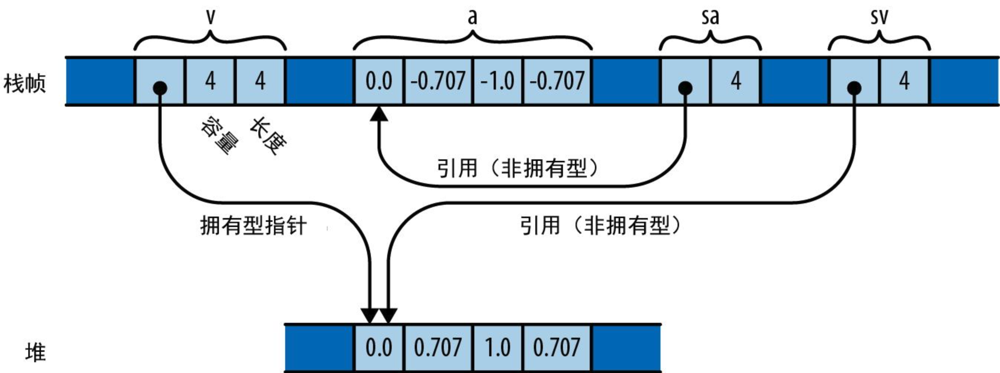
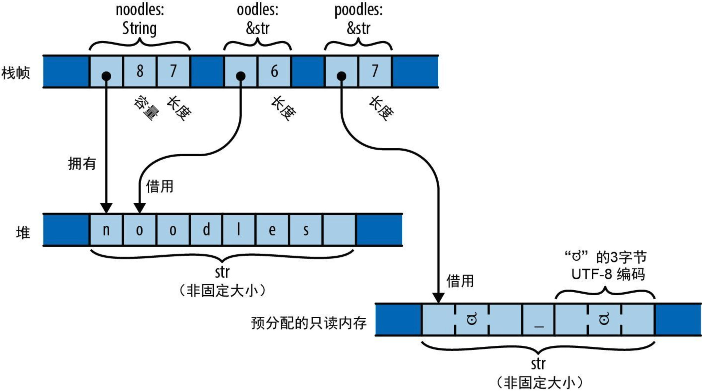
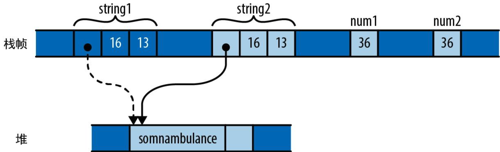
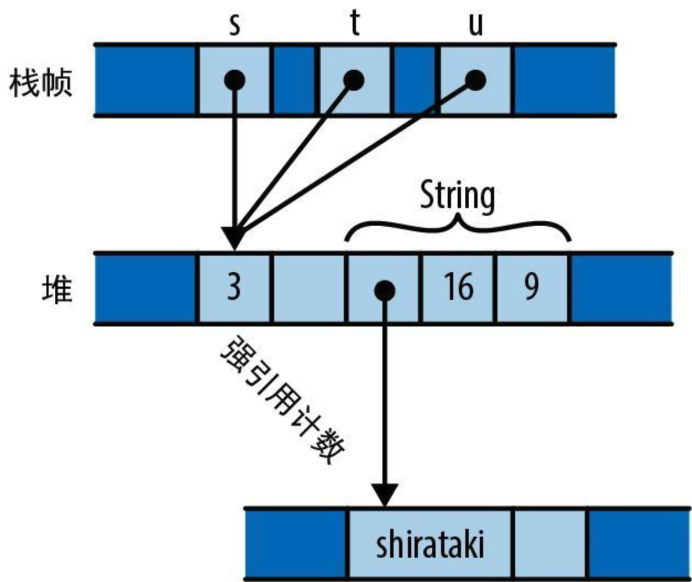
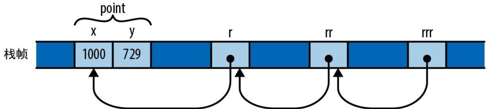
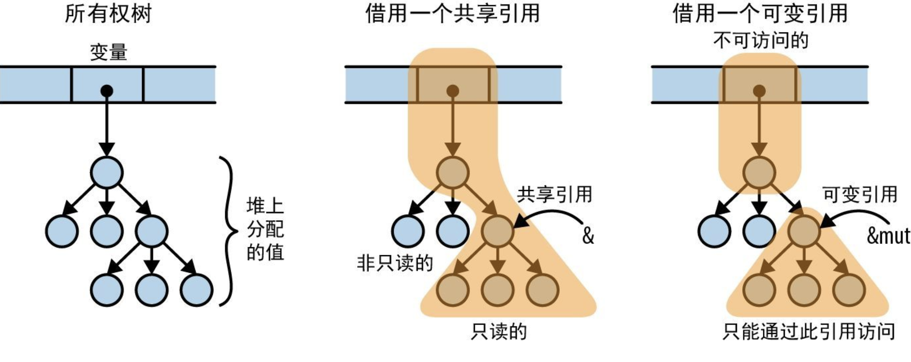

# ###Rust程序设计（第2版）

## 第1章 系统程序员也能享受美好

### 1.1 Rust为你负重前行

Rust 语言给了我们一个简单的承诺：只要程序通过了编译器的检查，就不会存在未定义行为

### 1.2 高效并行编程

Rust 的生态系统提供了一些超乎于常规并发原语的库，可帮助你在处理器池之间均匀分布复杂负载、使用无锁同步机制（如读取-复制-更新）等

### 1.3 性能毫不妥协

**零开销原则**：没用到的，就没有开销；要用到的，你也无法手写出更好的代码

### 1.4 协作无边无界

- 作为 Rust 的包管理器和构建工具，Cargo 能让你轻松使用别人在 Rust 的公共包存储库 crates.io 网站上发布的各种库
- Rust 这门语言本身也旨在支持协作：借助 Rust 的特型（trait）和泛型，我们可以创建具有灵活接口的库，将其用在许多不同的上下文中

## 第2章 Rust导览

### 2.1 rustup 与 Cargo

cargo 是 Rust 的编译管理器、包管理器和通用工具。可以用 Cargo 启动新项目、构建和运行程序，并管理代码所依赖的任何外部库

cargo默认创建项目时会一并初始化git版本管制系统，如果这不是希望的行为，可以通过`cargo new xxx --vsc none`指定不使用版本控制系统

`cargo clean`可以清理编译生成的文件

### 2.2 Rust函数

`isize`类型和`usize`类型保存着恰好等于“**指针大小**”的有符号整数和无符号整数，在 32 位平台上是 32 位长，在 64 位平台上则是 64 位长

一个函数体**以没有尾随着分号的表达式结尾**，那么这个表达式就是函数的**返回值**

### 2.3 编写与运行单元测试

通过`#[test]`标记单元测试的函数，再通过`cargo test`来执行单测，在正常编译时会跳过它

### 2.4 处理命令行参数

要想使用某个trait的方法，该trait就必须在作用域内，比如使用`u64::from_str`就必须通过`use std::str::FromStr;`来将`FromStr` trait引入

```rust
use std::env;
use std::str::FromStr;

fn main() {
    let mut numbers = Vec::new();

    for arg in env::args().skip(1) {
        numbers.push(u64::from_str(&arg).expect("error parsing argument"));
    }

    if numbers.len() == 0 {
        eprintln!("Usage: gcd NUMBER ...");
        std::process::exit(1);
    }

    let mut d = numbers[0];
    for m in &numbers[1..] {
        d = gcd(d, *m);
    }

    println!("The greatest common divisor of {:?} is {}", numbers, d);
}

fn gcd(mut m: u64, mut n: u64) -> u64 {
    assert!(m != 0 && n != 0);
    while m != 0 {
        if m < n {
            let t = m;
            m = n;
            n = t;
        }
        m = m % n;
    }
    n
}

#[test]
fn test_gcd() {
    assert_eq!(gcd(14, 15), 1);
}
```

### 2.5 搭建Web服务器

一个Rust 包，无论是库还是可执行文件，都叫作 crate（发音为/kreɪt/，意思是“板条箱”）

```rust
use actix_web::{get, post, web, App, HttpResponse, HttpServer, Responder};
use serde::Deserialize;

#[derive(Deserialize)]
struct GcdParameters {
    n: u64,
    m: u64,
}

#[actix_web::main]
async fn main() -> std::io::Result<()> {
    let server = HttpServer::new(|| App::new().service(get_index).service(post_gcd));
    println!("Serving on http://localhost:3000...");

    server.bind(("127.0.0.1", 3000))?.run().await
}

#[post("/gcd")]
async fn post_gcd(form: web::Form<GcdParameters>) -> impl Responder {
    println!("get");
    if form.n == 0 || form.m == 0 {
        return HttpResponse::BadRequest()
            .content_type("text/html")
            .body("Computing the GCD with zero is boring.");
    }

    let response = format!(
        "The greatest common divisor of the numbers {} and {} \
        is <b>{}</b>\n",
        form.n, form.m, 4
    );
    HttpResponse::Ok().content_type("text/html").body(response)
}

#[get("/")]
async fn get_index() -> impl Responder {
    HttpResponse::Ok().content_type("text/html").body(
        r#"
        <title>GCD Calculator</title>
        <form action="/gcd" method="post">
            <input type="text" name="n"/>
            <input type="text" name="m"/>
            <button type="submit">Computed GCD</button>
        </form>
        "#,
    )
}
```

### 2.6 并发

 Rust 函数都是线程安全的

#### 2.6.1 什么是曼德博集

```rust
use num::Complex;

fn complex_square_add_loop(c: Complex<f64>) {
    let mut z = Complex { re: 0.0, im: 0.0 };
    loop {
        z = z * z + c;
    }
}
```

曼德博集的**定义**是：令 z 不会“飞到”无穷远的复数 c 的集合，大于0.25 或小于 -2.0 的 c 值会导致 z“飞”出去

由于复数 c 具有实部 c.re 和虚部 c.im，因此可以把它们视为笛卡儿平面上某个点的 x 坐标和 y 坐标，如果 c 在曼德博集中，就在其中用黑色着色，否则就用浅色

使用有限循环代替无限循环获取一个近似值，迭代多少次取决于要绘制的边界的精度。并且已证明：**一旦z离开以原点为中心的半径为2的圆**，它最终就一定会“飞到”无穷远的地方

#### 2.6.2 解析并配对命令行参数

```rust
/// 尝试测试`c`是否位于曼德博集中，使用最多`limit`次迭代来判定
///
/// 如果`c`不是集合成员之一，则返回`Some(i)`，其中的`i`是`c`离开以原点为中心的半径为2的圆时所需要的迭代次数
/// 如果`c`似乎是集合成员之一（确切而言是达到了迭代次数限制但仍然无法证明`c`不是成员），则返回`None`
fn escape_time(c: Complex<f64>, limit: usize) -> Option<usize> {
    let mut z = Complex { re: 0.0, im: 0.0 };
    for i in 0..limit {
        if z.norm_sqr() > 4.0 {
            return Some(i);
        }
        z = z * z + c;
    }

    None
}

// 把字符串`s`（形如`"400x600`或`"1.0,0.5"`）解析成一个坐标对
//
// 具体来说，`s`应该具有<left><sep><right>的格式，其中<sep>是由`seprator`参数给出的字符
// 而<left>和<right>可以被`T::from_str`解析的字符串
// `separator`必须是ASCII字符
// 如果`s`具有正确的格式，就返回`Some<(x,y)>`；如果无法正确解析，就返回`None`
fn parse_pair<T: FromStr>(s: &str, sperator: char) -> Option<(T, T)> {
    match s.find(sperator) {
        None => None,
        Some(index) => match (T::from_str(&s[..index]), T::from_str(&s[index + 1..])) {
            (Ok(l), Ok(r)) => Some((l, r)),
            _ => None,
        },
    }
}

fn parse_complex(s: &str) -> Option<Complex<f64>> {
    match parse_pair(s, ',') {
        Some((re, im)) => Some(Complex { re, im }),
        None => None,
    }
}
```

#### 2.6.3 从像素到复数的映射

```rust
/// 给定输出图像中像素的行和列，返回复平面中对应的坐标
///
/// `bounds`是一个`pair`，给出了图像的像素宽度和像素高度。
/// `pixel`是表示该图像中特定像素的（column, row）二元组
/// `upper_left`参数和`lower_right`参数是在复平面中表示指定图像覆盖范围的点
fn pixel_to_point(
    bounds: (usize, usize),
    pixel: (usize, usize),
    upper_left: Complex<f64>,
    lower_right: Complex<f64>,
) -> Complex<f64> {
    let (width, height) = (
        lower_right.re - upper_left.re,
        upper_left.im - lower_right.im,
    );
    Complex {
        re: upper_left + pixel.0 as f64 * width / bounds.0 as f64,
        im: upper_left.im - pixel.1 as f64 * height / bounds.1 as f64,
    }
}
```


#### 2.6.4 绘制曼德博集

```rust
/// 将曼德博集对应的矩形渲染到像素缓冲区中
///
/// `bounds`参数会给出缓冲区`pixels`的宽度和高度，此缓冲区的每个字节都包含一个灰度像素
/// `upper_left`参数和`lower_right`参数分别指定了复平面中对应于像素缓冲区左上角和右下角的点
fn render(
    pixels: &mut [u8],
    bounds: (usize, usize),
    upper_left: Complex<f64>,
    lower_right: Complex<f64>,
) {
    assert!(pixels.len() == bounds.0 * bounds.1);
    for row in 0..bounds.1 {
        for column in 0..bounds.0 {
            let point = pixel_to_point(bounds, (column, row), upper_left, lower_right);
            pixels[row * bounds.0 + column] = match escape_time(point, 255) {
                None => 0,
                Some(count) => 255 - count as u8,
            };
        }
    }
}
```

#### 2.6.5 写入图像文件

对于下面这种代码：

```rust
let output = match File::create(filename) {
    Ok(f) => f,
    Err(e) => {
        return Err(e);
    }
};
```

成功时，就将 output 赋值为 Ok 值中携带的 File。失败时，就将错误透传给调用者。这种 match 语句在 Rust 中是一种非常常见的模式，**所以该语言提供了` ? `运算符作为它的简写形式**，简写成下面这种形式：

```rust
let output = File::create(filename)?;
```

```rust
/// 把`pixels`缓冲区（其尺寸由`bounds`给出）写入名为`filename`的文件中
fn write_image(
    filename: &str,
    pixels: &[u8],
    bounds: (usize, usize),
) -> Result<(), std::io::Error> {
    let output = File::create(filename)?;

    let encoder = PNGEncoder::new(output);
    encoder.encode(pixels, bounds.0 as u32, bounds.1 as u32, ColorType::Gray(8))?;
    Ok(())
}
```

#### 2.6.6 并发版曼德博程序

```rust
fn main() {
    let args: Vec<String> = env::args().collect();

    if args.len() != 5 {
        eprintln!("Usage: {} FILE PIXELS UPPERLEFT LOWERRIGHT", args[0]);
        eprintln!(
            "Example: {} mandel.png 1000x750 -1.20,0.35 -1,0.20",
            args[0]
        );
        std::process::exit(1);
    }

    let bounds = parse_pair(&args[2], 'x').expect("error parsing image dimensions");
    let upper_left = parse_complex(&args[3]).expect("error parsing upper left corner point");
    let lower_right = parse_complex(&args[4]).expect("error parsing lower right corner point");

    let mut pixels = vec![0; bounds.0 * bounds.1];
    render(&mut pixels, bounds, upper_left, lower_right);

    write_image(&args[1], &pixels, bounds).expect("error writing PNG file");
}
```

```bash
cargo build --release
time target/release/mandelbrot mandel.png 4000x3000 -1.20,0.35 -1,0.20
```

并发版本：

```rust
// 非并发版本
// render(&mut pixels, bounds, upper_left, lower_right);

// 并发版本
let threads = num_cpus::get();
let rows_per_band = bounds.1 / threads + 1;
{
    let bands: Vec<&mut [u8]> = pixels.chunks_mut(rows_per_band * bounds.0).collect();
    crossbeam::scope(|spawner| {
        for (i, band) in bands.into_iter().enumerate() {
            let top = rows_per_band * i;
            let height = band.len() / bounds.0;
            let band_bounds = (bounds.0, height);
            let band_upper_left = pixel_to_point(bounds, (0, top), upper_left, lower_right);
            let band_lower_right =
                pixel_to_point(bounds, (bounds.0, top + height), upper_left, lower_right);
            spawner.spawn(move |_| {
                render(band, band_bounds, band_upper_left, band_lower_right);
            });
        }
    })
    .unwrap();
}
```

#### 2.6.7 运行曼德博绘图器

```bash
cargo build --release
time target/release/mandelbrot mandel.png 4000x3000 -1.20,0.35 -1,0.20
```

注意这次time命令执行的结果

#### 2.6.8 大“安”无形

### 2.7 文件系统与命令行工具

```toml
[package]
name = "quickreplace"
version = "0.1.0"
edition = "2021"

# See more keys and their definitions at https://doc.rust-lang.org/cargo/reference/manifest.html

[dependencies]
text-colorizer = "1"
regex = "1"
```

如果在 Cargo.toml 文件中只是请求版本 "1"的 crate，那么 Cargo 就会使用 2.0 之前的 crate 里最新的可用版本

#### 2.7.1 命令行界面

```rust
use std::env;

use text_colorizer::Colorize;

#[derive(Debug)]
struct Arguments {
    target: String,
    replacement: String,
    filename: String,
    output: String,
}

fn print_usage() {
    eprintln!(
        "{} - change occurrences of one string into anthor",
        "quickreplace".green()
    );
    eprintln!("Usage: quickreplace <target> <replacement> <INPUT> <OUTPUT>");
}

fn parse_args() -> Arguments {
    let args: Vec<String> = env::args().skip(1).collect();

    if args.len() != 4 {
        print_usage();
        eprintln!(
            "{} wrong number of arguments: expected 4, got {}",
            "Error:".red().bold(),
            args.len()
        );
        std::process::exit(1);
    }

    Arguments {
        target: args[0].clone(),
        replacement: args[1].clone(),
        filename: args[2].clone(),
        output: args[3].clone(),
    }
}
```

#### 2.7.2 读写文件

```rust
fn main() {
    let args = parse_args();
    let data = match fs::read_to_string(&args.filename) {
        Ok(v) => v,
        Err(e) => {
            eprintln!(
                "{} failed to read from file '{}':{:?}",
                "Error:".red().bold(),
                args.filename,
                e
            );
            std::process::exit(1);
        }
    };

    match fs::write(&args.output, &data) {
        Ok(_) => {}
        Err(e) => {
            eprintln!(
                "{} failed to write to file '{}':{:?}",
                "Error:".red().bold(),
                args.output,
                e
            );
            std::process::exit(1);
        }
    }
}
```

#### 2.7.3 查找并替换

```rust
let replaced_data = match replace(&args.target, &args.replacement, &data) {
        Ok(v) => v,
        Err(e) => {
            eprintln!("{} failed to replace text: {:?}", "Error:".red().bold(), e);
            std::process::exit(1);
        }
    };
```

## 第3章 基本数据类型

1. 基于已明确写出的类型，Rust 的类型推断会帮你**推断出**剩下的大部分类型
2. 函数可以是**泛型**的：单个函数就可以处理许多不同类型的值

### 3.1 固定宽度的数值类型

#### 3.1.1 整型

- Rust 会使用 u8 类型作为**字节值**

- Rust 会把字符视为与数值截然不同的类型：char 既不是u8，也不是 u32（尽管它确实有 32 位长）
- usize 类型和 isize 类型类似于 C 和 C++ 中的 size_t 和 ptrdiff_t。它们的精度与目标机器上地址空间的大小保持一致，即在 32 位架构上是 32 位长，在 64 位架构上则是 64 位长
- 为了让长数值更易读，可以在数字之间任意插入下划线，**下划线的具体位置无关紧要**
- 尽管数值类型和 char 类型是不同的，但 Rust 确实为 u8 值提供了**字节字面量**。与字符字面量类似，b'X' 表示以字符 X 的 ASCII 码作为 u8 值。例如，由于 A 的 ASCII 码是 65，因此字面量 b'A' 和 65u8 完全等效。**只有 ASCII 字符才能出现在字节字面量中**
- 可以使用 as 运算符将一种整型转换为另一种整型
- Rust 在调用类型本身的方法之前**必须确切地知道**一个值属于哪种整型
- 方法调用的优先级高于一元前缀运算符

#### 3.1.2 检查算法、回绕算法、饱和算法和溢出算法

对于算术运算的溢出，在debug构建时会触发panic，但在release构建中，会进行**回绕**，如果不想要这种默认行为，则：

1. 可以使用`checked_`开头的方法来进行**检查**，其结果是一个`Option`值，如果数学意义上正确的结果则返回`Some(v)`，否则返回`None`
2. 可以使用`wrapping_`开头的方法来进行**回绕**，回绕运算会返回与“数学意义上正确的结果”对“值类型范围”取模的值相等的值
3. 可以使用`saturating_`开头的方法来进行**`饱和`**，饱和运算会返回最接近“数学意义上正确结果”的可表达值
4. 可以使用`overflowing_`开头的方法来进行**`溢出`**，溢出运算会返回一个元组` (result, overflowed)`，其中 result 是函数的**回绕**版本所返回的内容，而 overflowed 是一个布尔值，指示**是否发生过溢出**

#### 3.1.3 浮点类型

Rust 提供了 IEEE 单精度浮点类型（f32）和 IEEE 双精度浮点类型（f64）

f32 类型和 f64 类型具有 IEEE 要求的一些特殊值的**关联常量**，比如 INFINITY（无穷大）、NEG_INFINITY（负无穷大）、NAN（非数值）以及 MIN（最小有限值）和 MAX（最大有限值）

**Rust 几乎不会执行任何隐式的数值转换，不过，你随时可以用 as运算符写出显式转换**

### 3.2 布尔类型

Rust中的布尔类型只有两个值：`true`和`false`，且诸如条件判断和`while`循环控制的条件必须是`bool`表达式

Rust 的 as 运算符可以**将`bool`值转换为整型**，但反之不行

Rust 在内存中会使用**整字节**来表示 bool值，因此可以创建指向它的指针

### 3.3 字符

Rust 的字符类型 char 会以 **32 位**值表示单个 Unicode 字符

Rust 会对单独的字符使用`char`类型，但对字符串和文本流使用 UTF-8 编码。因此，**String 会将其文本表示为 UTF-8 字节序列**，而不是字符数组

char 总是**包含 0x0000 到 0xD7FF 或 0xE000 到 0x10FFFF 范围内的 Unicode 码点**。char 永远不会是“半代用区”中的码点（0xD800 到 0xDFFF 范围内的码点，它们不能单独使用）或 Unicode 码点空间之外的值（大于 0x10FFFF 的值）

Rust **不会**在 char 和任何其他类型之间**进行隐式转换**，而u8 是唯一能通过 as 运算符转换为 char 的类型

### 3.4 元组

单元组类型`()`

对于单个值的元组，值后面的逗号是一必需的，**用于区分单值元组和简单的括号表达式**

### 3.5 指针类型

当 Rust 程序需要让一些值指向其他值时，必须显式使用指针类型，当使用这些指针类型时，安全的 Rust 会对其进行约束，以消除未定义的行为

#### 3.5.1 引用

最简单的方式是将引用视为 Rust 中的**基本指针类型**

表达式 &x 会生成一个对 x 的引用，在 Rust 术语中，我们会说它**借用**了对 x 的引用

Rust 利用**共享引用**和**可变引用**之间的**“二选一”**机制来强制执行**“单个写入者或多个读取者”**规则

#### 3.5.2 Box

在堆中分配值的最简单的方式

#### 3.5.3 裸指针

Rust 也有裸指针类型 *mut T 和 *const T。裸指针实际上和 C++ 中的指针很像。使用裸指针是不安全的，因为 Rust 不会跟踪它指向的内容，你只能在`unsafe`块中对裸指针解引用（dereference）

### 3.6 数组、向量和切片

#### 3.6.1 数组

Rust 没有任何能定义未初始化数组的写法，所以在声明数组时，要么通过在方括号内写入一系列值，要么通过`[V; N]`的写法声明一个长度为`N`每个元素的值都是`V`的数组

数组的长度必须是在编译期就固定下来的

你在数组上看到的那些实用方法（遍历元素、搜索、排序、填充、过滤等）**都是作为切片而非数组的方法提供的**，但是 Rust 在搜索各种方法时**会隐式地将对数组的引用转换为切片**，因此可以直接在数组上调用任何切片方法

#### 3.6.2 向量

向量`Vec<T>`是一个可调整大小的`T`类型元素的数组，它是在堆上分配的

`Vec<T>`由 3 个值组成：

1. 指向元素在堆中分配的缓冲区（该缓冲区由`Vec<T>`创建并拥有）的指针
2. 缓冲区能够存储的元素数量（`capacity`方法获得）
3. 它现在实际包含的数量（也就是它的长度，通过`len`方法获得）

#### 3.6.3 切片

切片（写作不指定长度的`[T]`）是数组或向量中的一个区域。由于切片可以是任意长度，因此它不能直接存储在变量中或作为函数参数进行传递，**切片总是通过引用传递**

对切片的引用是一个**胖指针**：一个双字值，包括**指向切片第一个元素的指针**和**切片中元素的数量**

```rust
let v: Vec<f64> = vec![0.0,  0.707,  1.0,  0.707];
let a: [f64; 4] =     [0.0, -0.707, -1.0, -0.707];

let sv: &[f64] = &v;
let sa: &[f64] = &a;
```

对于上面的代码，内存布局如下：



### 3.7 字符串类型

#### 3.7.1 字符串字面量

字符串字面量要用**双引号括起来**，也就是说如果字符串字面量中包括双引号，则需要进行转义，除非使用**原始字符串**（用小写字母 r 进行标记），**原始字符串中的所有反斜杠和空白字符都会逐字包含在字符串中**，如：

```rust
let default_win_install_path = r"C:\Program Files\Gorillas";
```

但此时如果原始字符串包括双引号，则就**不能**简单的在其前面添加`\`，因为原始字符串不识别转义序列，此时可以**在原始字符串的开头和结尾添加相同数量的`#`标记**：

```rust
println!(
    r###"
    This raw string started with 'r###"'.
    Therefore it does not end until we reach a quote mark ('"')
    followed immediately by three pound signs ('###'):
"###
);
```

#### 3.7.2 字节串

**带有 b 前缀**的字符串字面量都是字节串。这样的字节串**是 u8 值（字节）的切片**而不是 Unicode 文本

字节串对应的**原始字节串要以 br" 开头**

#### 3.7.3 内存中的字符串

Rust 字符串是 Unicode 字符序列，使用了 UTF-8编码，字符串中的每个 ASCII 字符都会存储在单字节中，而其他字符会占用多字节

```rust
let noodles = "noodles".to_string();
let oodles = &noodles[1..];
let poodles = "ಠ_ಠ";
```

上面代码对应的内存布局如下：



字符串字面量是指预分配文本的 &str，它通常与程序的机器码一起**存储在只读内存区**

`String`或`&str`的`.len()`方法会返回其长度，**这个长度以字节**而不是字符**为单位**

```rust
assert_eq!("ಠ_ಠ".len(), 7);
assert_eq!("ಠ_ಠ".chars().count(), 3);
```

不能修改`&str`，切片不能重新分配其引用目标的缓冲区

#### 3.7.4 String

`&str`非常像`&[T]`，是一个指向某些数据的胖指针，而 String 则类似于`Vec<T>`

#### 3.7.5 使用字符串

如果两个字符串**以相同的顺序包含相同的字符**（无论是否指向内存中的相同位置），则认为它们**是相等的**

考虑到 Unicode 的性质，简单的**逐字符比较并不总能给出预期的答案**

#### 3.7.6 其他类似字符串的类型

- 对于 Unicode 文本，坚持使用`String`和`&str`
- 当使用文件名时，请改用`std::path::PathBuf`和`&Path`
- 当处理根本不是 UTF-8 编码的二进制数据时，请使用`Vec<u8>`和`&[u8]`
- 当使用操作系统提供的原生形式的环境变量名和命令行参数时，请使用`OsString`和`&OsStr`
- 当和使用 null 结尾字符串的 C 语言库进行互操作时，请使用 `std::ffi::CString 和 &CStr`

### 3.8 类型别名

```rust
type Bytes = Vec<u8>;
```

### 3.9 前路展望

## 第4章 所有权与移动 1

### 4.1 所有权

每个值都有决定其生命周期的**唯一**拥有者。当拥有者被释放时，它拥有的值也会同时被释放，在 Rust 术语中，释放的行为被称为**丢弃（drop）**

### 4.2 移动

在 Rust 中，对大多数类型来说，像为变量赋值、将其传给函数或从函数返回这样的操作都不会复制值，而是会**移动值**，**源会把值的所有权转移给目标并变回未初始化状态，改由目标变量来控制值的生命周期**

#### 4.2.1 更多移动类操作

- 将参数传给函数会将所有权转移给函数的参数
- 从函数返回一个值会将所有权转移给调用者
- 构建元组会将值转移给元组
- ……

#### 4.2.2 移动与控制流

禁止在循环中移动变量（因为在第一次迭代中已经进行了移动，**一旦移动，变量就会变成未初始化状态**），除非重新赋值

#### 4.2.3 移动与索引内容 

for 循环的内部机制会获取向量的所有权并将其分解为元素，在for循环之后就不能再访问该向量了

在循环的过程中，向量本身对代码不再可见，因此也就无法观察到它正处在某种部分清空的状态

### 4.3 Copy类型：关于移动的例外情况

对于如向量、字符串和其他可能占用大量内存且复制成本高昂的类型，移动能让其所有权清晰且赋值开销极低，而对于整数或字符这样的简单类型（**被Rust 指定成 Copy 类型的类型**），则大可不必使用这种方式

```rust
let string1 = "somnambulance".to_string();
let string2 = string1;

let num1: i32 = 36;
let num2 = num1;
```



**对 Copy 类型的值进行赋值会复制这个值，而不会移动它**，赋值的源仍会保持已初始化和可用状态，并且具有与之前相同的值。把 Copy 类型传给函数和构造器的行为也是如此

如果结构体的所有字段本身都是 Copy 类型，那么也可以通过将属性`#[derive(Copy,Clone)]`放置在此定义之上来创建 Copy 类型

```rust
#[derive(Copy, Clone)]
struct Label { number: u32 }
```

**在 Rust 中，每次移动都是字节级的一对一浅拷贝，并让源变成未初始化状态**

### 4.4 Rc与Arc：共享所有权

Rc 类型和 Arc 类型非常相似，它们之间唯一的区别是 **Arc 可以安全地在线程之间直接共享**，而普通 **Rc 会使用更快**的非线程安全代码来更新其引用计数

```rust
use std::rc::Rc;

// Rust能推断出所有这些类型，这里写出它们只是为了讲解时清晰
let s: Rc<String> = Rc::new("shirataki".to_string());
let t: Rc<String> = s.clone();
let u: Rc<String> = s.clone();
```



这 3 个`Rc<String>`指针指向了同一个内存块，其中包含引用计数和`String`本身的空间

**Rc 指针拥有的值是不可变的**

## 第5章 引用 

引用是一种**非拥有**型指针，**引用的生命周期绝不能超出其引用目标**，Rust 把创建对某个值的引用的操作称为**借用（borrow）**那个值：凡是借用，终须归还

### 5.1 对值的引用

引用能让你在**不影响**其所有权的情况下访问值，引用分为以下两种

1. **共享引用**允许你读取但不能修改其引用目标，共享引用是`Copy`类型，你可以根据需要**同时拥有任意数量**的对特定值的共享引用
2. **可变引用**允许你读取和修改值。但是，一旦一个值拥有了可变引用，就**无法再对该值创建其他任何种类的引用**了，可变引用不是`Copy`类型

只要存在对一个值的共享引用，即使是它的拥有者也不能修改它，该值会被锁定

当通过将值的所有权转移给函数的方式将这个值传给函数时，就可以说**按值传递**了它。如果改为将值的引用传给函数，就可以说**按引用传递**了它

### 5.2 使用引用

#### 5.2.1 Rust引用与C++引用

rust中创建引用和解引用都是**显式**的

```rust
let x = 10;
let r = &x;            // &x是对x的共享引用
assert!(*r == 10);     // 对r显式解引用

let mut y = 32;
let m = &mut y;        // &muty是对y的可变引用
*m += 32;              // 对m显式解引用，以设置y的值
assert!(*m == 64);     // 来看看y的新值
```

由于引用在 Rust 中随处可见，因此`.`运算符就会按需对其左操作数**隐式解引用**

```rust
struct Anime { name: &'static str, bechdel_pass: bool }
let aria = Anime { name: "Aria: The Animation", bechdel_pass: true };
let anime_ref = &aria;
assert_eq!(anime_ref.name, "Aria: The Animation");

// 与上一句等效，但把解引用过程显式地写了出来
assert_eq!((*anime_ref).name, "Aria: The Animation");
```

#### 5.2.2 对引用变量赋值

 C++ 中对引用赋值会将新值存储在其引用目标中而非指向新值，即引用一旦完成初始化，就无法再指向别处了，**rust则截然不同**

#### 5.2.3 对引用进行引用

```rust
struct Point { x: i32, y: i32 }
let point = Point { x: 1000, y: 729 };
let r: &Point = &point;
let rr: &&Point = &r;
let rrr: &&&Point = &rr;
```

`.`运算符会**追踪尽可能多层次**的引用来找到它的目标

```rust
// 成立
assert_eq!(rrr.y, 729);
```

#### 5.2.4 比较引用

Rust 的比较运算符也能“看穿”任意数量的引用

```rust
assert!(rx == ry);              // 它们引用的目标值相等
assert!(!std::ptr::eq(rx, ry)); // 但所占据的地址（自身的值）不同
```

#### 5.2.5 引用永不为空

Rust 的引用永远都不会为空

#### 5.2.6 借用任意表达式结果值的引用

在 let 语句中，如果立即将引用赋值给某个变量，那么 Rust 就会让匿名变量存在于 let 初始化此变量期间（如下代码中的`r`），否则，匿名变量会一直存续到所属封闭语句块的末尾（如下代码中的`&1009`）

```rust
fn factorial(n: usize) -> usize {
    (1..n+1).product()
}
let r = &factorial(6);
// 数学运算符可以“看穿”一层引用
assert_eq!(r + &1009, 1729);
```

#### 5.2.7 对切片和trait对象的引用

两种**胖指针**

1. 对切片的引用，携带此切片的**起始地址**及其**长度**
2. trait对象，携带一个值的地址和指向适用于该值的trait实现的指针，以便调用trait上的方法

### 5.3 引用安全

#### 5.3.1 借用局部变量

- 不能借用对局部变量的引用并将其移出变量的作用域

  Rust 会尝试为程序中的**每个引用类型**分配一个**生命周期**，以表达根据其使用方式应施加的约束

  生命周期完全是 Rust 在**编译期虚构的产物**。在运行期，引用只是一个地址，它的生命周期只是其类型的一部分，不存在运行期表示

- 如果将引用存储在变量 r 中，则引用类型必须在变量 r **从初始化到最后一次使用的整个生命周期内都可以访问**

#### 5.3.2 将引用作为函数参数

在 Rust 中，全局变量的等价物称为**静态变量（static）**：它是在程序启动时就会被创建并一直存续到程序终止时的值，并且只能在`unsafe`块中访问静态变量

#### 5.3.3 把引用传给函数

#### 5.3.4 返回引用

#### 5.3.5 包含引用的结构体

每当一个引用类型出现在另一个类型的定义中时，必须写出它的生命周期

**类型的生命周期参数总会揭示它是否包含某些值得关心其生命周期的引用（也就是非 'static 的）以及这些生命周期可以是什么**

#### 5.3.6 不同的生命周期参数

```rust
struct S<'a> {
    x: &'a i32,
    y: &'a i32
}

let x = 10;
let r;
{
    let y = 20;
    {
        let s = S { x: &x, y: &y };
        r = s.x;
    }
}
println!("{}", r);
```

上面的代码不会创建悬垂指针，但不符合rust对生命周期的推导过程，因此需要定义不同的生命周期

```rust
struct S<'a, 'b> {
    x: &'a i32,
    y: &'b i32
}
```

#### 5.3.7 省略生命周期参数

> 下面的内容引自《Rust权威指南》

函数参数或方法参数中的生命周期被称为**输入生命周期（input lifetime）**，而返回值的生命周期则被称为**输出生命周期（output lifetime）**

关于生命周期省略规则：

1. 每一个引用参数都会拥有自己的生命周期参数
2. 当只存在一个输入生命周期参数时，这个生命周期会被赋予给所有输出生命周期参数
3. 当拥有多个输入生命周期参数，而其中一个是&self或&mut self时，self的生命周期会被赋予给所有的输出生命周期参数

如果编译器而上述三条规则处理后仍不能明确计算出签名中所有引用的生命周期，则出现错误

### 5.4 共享与可变

在指向集合的同时修改集合要加倍小心

我们既可以借用向量的可变引用，也可以借用其元素的共享引用，但这两种引用的**生命周期不能重叠**

Rust的“可变与共享”规则：

- 共享访问是只读访问、

  在共享引用的整个生命周期中，无论是它的引用目标，还是可从该引用目标间接访问的任何值，都**不能被任何代码改变**。这种结构中不能存在对任何内容的有效可变引用，其拥有者应保持只读状态

- 可变访问是独占访问

  可变引用借用的值**只能通过该引用访问**。在可变引用的整个生命周期中，无论是它的引用目标，还是该引用目标间接访问的任何目标，都没有任何其他路径可访问。对可变引用来说，唯一能和自己的生命周期重叠的引用就是从可变引用本身借出的引用

每种引用都会影响到我们可以对**“到引用目标从属路径上的值”**以及**“从引用目标可间接访问的值”**所能执行的操作



### 5.5 应对复杂对象关系

Rust 更喜欢让指针、所有权和数据流单向通过系统。Rust 不仅会迫使你理解为什么自己的程序是线程安全的，甚至可能还需要你做一些高级架构设计

## 第6章 表达式

### 6.1 表达式语言

Rust是所谓的**表达式语言**，在Rust中，if和match都可以生成值，这也解释了为什么Rust没有C那样的三元运算符，因为在Rust中可以这样：

```rust
let status =
		if cpu.temperature <= MAX_TEMP {
      	HttpStatus::OK
		} else {
      	HttpStatus::ServerError
		};
```

### 6.2 优先级与结合性

|   表达式类型    | 示例                                                         |                           相关特型                           |
| :-------------: | :----------------------------------------------------------- | :----------------------------------------------------------: |
|   数组字面量    | `[1, 2, 3]`                                                  |                                                              |
| 数组重复表达式  | `[0; 50]`                                                    |                                                              |
|      元组       | `(6, "crullers")`                                            |                                                              |
|      分组       | `(2 + 2)`                                                    |                                                              |
|       块        | `{ f(); g() }`                                               |                                                              |
|  控制流表达式   | `if ok { f() }`<br>`if ok { 1 } else { 0 }`<br>`if let Some(x) = f() { x } else { 0 }` <br>`match x { None => 0, _ => 1 }`<br>`for v in e { f(v); }` <br>`while ok { ok = f(); }`<br>`while let Some(x) = it.next() { f(x); }`<br>`loop { next_event(); }` <br>`break` <br>`continue`<br>`return 0` |                  `std::iter::IntoIterator`                   |
|     宏调用      | `println!("ok")`                                             |                                                              |
|      路径       | `std::f64::consts::PI`                                       |                                                              |
|  结构体字面量   | `Point {x: 0, y: 0}`                                         |                                                              |
|  元组字段访问   | `pair.0`                                                     |                     `Deref`、`DerefMut`                      |
| 结构体字段访问  | `point.x`                                                    |                     `Deref`、`DerefMut`                      |
|    方法调用     | `point.translate(50, 50)`                                    |                     `Deref`、`DerefMut`                      |
|    函数调用     | `stdin()`                                                    | `Fn(Arg0, ...) -> T`、`FnMut(Arg0, ...) -> T`、`FnOnce(Arg0, ...) -> T` |
|      索引       | `arr[0]`                                                     |             `Index`、`IndexMutDeref`、`DerefMut`             |
|    错误检查     | `create_dir("tmp")?`                                         |                                                              |
| 逻辑非 / 按位非 | `!ok`                                                        |                            `Not`                             |
|      取负       | `-num`                                                       |                            `Neg`                             |
|     解引用      | `*ptr`                                                       |                     `Deref`、`DerefMut`                      |
|      借用       | `&val`                                                       |                                                              |
|    类型转换     | `x as u32`                                                   |                                                              |
|       乘        | `n * 2`                                                      |                            `Mul`                             |
|       除        | `n / 2`                                                      |                            `Div`                             |
|  取余（取模）   | `n % 2`                                                      |                            `Rem`                             |
|       加        | `n + 1`                                                      |                            `Add`                             |
|       减        | `n - 1`                                                      |                            `Sub`                             |
|      左移       | `n << 1`                                                     |                            `Shl`                             |
|      右移       | `n >> 1`                                                     |                            `Shr`                             |
|     按位与      | `n & 1`                                                      |                           `BitAnd`                           |
|    按位异或     | `n ^ 1`                                                      |                           `BitXor`                           |
|     按位或      | `n | 1`                                                      |                           `BitOr`                            |
|      小于       | `n < 1`                                                      |                    `std::cmp::PartialOrd`                    |
|    小于等于     | `n <= 1`                                                     |                    `std::cmp::PartialOrd`                    |
|      大于       | `n > 1`                                                      |                    `std::cmp::PartialOrd`                    |
|    大于等于     | `n >= 1`                                                     |                    `std::cmp::PartialOrd`                    |
|      等于       | `n == 1`                                                     |                    `std::cmp::PartialEq`                     |
|     不等于      | `n != 1`                                                     |                    `std::cmp::PartialEq`                     |
|     逻辑与      | `x.ok && y.ok`                                               |                                                              |
|     逻辑或      | `x.ok || backup.ok`                                          |                                                              |
|  右开区间范围   | `start .. stop`                                              |                                                              |
|  右闭区间范围   | `start ..= stop`                                             |                                                              |
|      赋值       | `x = val`                                                    |                                                              |
|    复合赋值     | `x *= 1` `x /= 1` `x %= 1` `x += 1` `x -= 1` `x <<= 1` `x >>= 1` `x &= 1` `x ^= 1` `x |= 1` | `DivAssign` `RemAssign` `AddAssign` `SubAssign` `ShlAssign` `ShrAssign` `BitAndAssign` `BitXorAssign` `BitOrAssign` `MulAssign` |
|      闭包       | `|x, y| x + y`                                               |                                                              |

### 6.3 块与分号

表达式（无分号结尾）的值即为块的值

### 6.4 声明

块可以包含**语法声明**，比如可以在块里声明`fn`，但嵌套的`fn`**无法访问**恰好在同一作用域内的局部变量或参数，这点与**闭包**不同，闭包是可以看到封闭块作用域内的变量的

### 6.5 if与match

- 每个条件必须是`bool`类型的表达式，**不支持隐式转换**
- `match`中的`_`作为通配符模式匹配所有内容，类型于`switch`中的`default:`分支，但必须排在最后
- `match`表达式命中模式时，会执行对应的表达式，并且不会再检查别的模式
- Rust禁止执行未覆盖所有可能值的`match`表达式
- `match`表达式的所有分支都必须**具有相同的类型**

#### 6.5.1 if let

```rust
if let pattern = expr {
    block1
} else {
    block2
}
```

给定的 expr 要么匹配 pattern，这时会运行 block1；要么无法匹配，这时会运行 block2

#### 6.5.2 循环

Rust支持以下4种循环表达式：

```rust
while condition {
    block
}

while let pattern = expr {
    block
}

loop {
    block
}

for pattern in iterable {
    block
}
```

### 6.6 循环中的控制流

在`loop`循环中，`break`后面可以跟一个表达式，该表达式的值会作为`loop`的值

循环可以带有**生命周期标签**，如下代码，`break 'search'`会退出这层循环而不是退出内部循环

```rust
'search:
for room in apartment {
    for spot in room.hiding_spots() {
        if spot.contains(keys) {
            println!("Your keys are {} in the {}.", spot, room);
            break 'search;
        }
    }
}
```

break 可以同时具有标签和值表达式：

```rust
// 找到此系列中第一个完全平方数的平方根
let sqrt = 'outer: loop {
    let n = next_number();
    for i in 1.. {
        let square = i * i;
        if square == n {
            // 找到了一个平方根
            break 'outer i;
        }
        if square > n {
            // `n`不是完全平方数，尝试下一个
            break;
        }
    }
};
```

标签也可以与 continue 一起使用

### 6.7 return表达式

不带值的`return`是`return ()`的简写

### 6.8 为什么Rust中会有loop

> Rust 编译器中有几个部分会分析程序中的控制流.
>
> Rust 会检查通过函数的每条路径是否返回了预期返回类型的值。为了正确地做到这一点，它需要知道是否有可能抵达函数的末尾。Rust 会检查局部变量有没有在未初始化的情况下使用过。这就要检查通过函数的每一条路径，以确保只要不经过初始化此变量的代码，就无法抵达使用它的地方。Rust 会对不可达代码发出警告。如果无法通过函数抵达某段代码，则这段代码不可达。
>
> 以上这些称为流敏感（flow-sensitive）分析
>
> 要执行这种规则，语言就必须在简单性和智能性之间取得平衡。Rust 更倾向于简单性，它的流敏感分析根本不会检查循环条件，而会简单地假设程序中的任何条件都可以为真或为假
>
> 这会导致 Rust 可能拒绝某些安全程序：
>
> ```rust
> fn wait_for_process(process: &mut Process) -> i32 {
>     while true {
>         if process.wait() {
>             return process.exit_code();
>         }
>     }
> }  // 错误：类型不匹配：期待i32，实际找到了()
> ```
>
> loop 表达式就是这个问题的“有话直说”式解决方案
>
> 在可能以 break 或 return 表达式、无限 loop，或者调用 panic!() 或 std::process::exit() 等多种方式结束的块上强制执行此规则是不现实的。这些表达式的共同点是它们永远都不会以通常的方式结束并生成一个值。
>
> 不能正常结束的表达式属于一个特殊类型 !，并且它们不受“类型必须匹配”这条规则的约束

### 6.9 函数与方法调用

Rust 的`.`运算符会根据需要自动对player **解引用**或**借入**一个对它的引用

在函数调用或方法调用中，泛型类型的常用语法`Vec<T>`是不起作用的：

```rust
return Vec<i32>::with_capacity(1000);  // 错误：是某种关于“链式比较”的错误消息

let ramp = (0 .. n).collect<Vec<i32>>();  // 同样的错误

// 替换为：

return Vec::<i32>::with_capacity(1000);  // 正确

let ramp = (0 .. n).collect::<Vec<i32>>();  // 正确
```

**这里的问题在于，在表达式中`<`是小于运算符**

### 6.10 字段与元素

方括号左侧的值也会**自动解引用**

### 6.11 引用运算符

一元`*`运算符用于访问引用所指向的值

### 6.12 算术运算符、按位运算符、比较运算符和逻辑运算符

Rust 中按位运算的优先级高于比较运算

移位总是对有符号整数类型进行符号扩展，对无符号整数类型进行零扩展

### 6.13 赋值

Rust 不支持链式赋值

Rust 没有 C 的自增运算符 ++ 和自减运算符 --

### 6.14 类型转换

在 Rust 中，将值从一种类型转换为另一种类型**通常需要进行显式转换**。这种转换要**使用`as`关键字**

1. 数值可以从任意内置数值类型转换为其他内置数值类型

   转换为更窄的类型会导致截断。转换为更宽类型的有符号整数会进行符号扩展，转换为无符号整数会进行零扩展，等等

2. bool 类型或 char 类型的值或者类似 C 的 enum 类型的值可以转换为任何整数类型，**反之则不行**（u8 可以转换为 char 类型，因为从 0 到 255 的所有整数都是 char能持有的有效 Unicode 码点）

3. 一些涉及不安全指针类型的转换也是允许的

4. 以下场景会**自动转换**（因为内部实际了内置的trait Deref）

   - &String 类型的值会自动转换为 &str 类型，无须强制转换
   - &Vec`<i32>` 类型的值会自动转换为 &[i32]
   - &String 类型的

### 6.15 闭包

后续章节详细介绍

### 6.16 前路展望

## 第7章 错误处理

Rust 中的两类错误：`panic`和`Result`。前者通常表示由程序外部的事物引发的错误，后者是那种**永远不应该发生**的错误

### 7.1 panic

Rust 既可以在发生 panic 时展开调用栈，也可以中止进程。展开调用栈是默认方案

#### 7.1.1 展开调用栈

panic 是基于线程的。一个线程 panic 时，其他线程可以继续做自己的事

#### 7.1.2 中止

在两种情况下 Rust 不会试图展开调用栈：

1. 如果 Rust 在试图清理第一个 panic 时，.drop() 方法触发了第二个 panic，那么这个 panic 就是致命的。Rust 会停止展开调用栈并中止整个进程
2. 使用`-C panic=abort`参数进行编译，那么程序中的第一个 panic 会立即中止进程（如果使用这个选项，那么 Rust 就不需要知道如何展开调用栈，故此**可以减小编译后的代码的大小**）

### 7.2 Result

Rust中没有异常，而是返回类似于下面这种

```rust
fn get_weather(location: LatLng) -> Result<WeatherReport, io::Error>
```

Result要么是一个成功的结果：`Ok(weather)`，要么是一个错误结果：`Err(error_value)`

#### 7.2.1 捕获错误

1. 通过`match`来匹配`Ok`与`Err`的场景，但match有些冗长
2. `result.is_ok()`、`result.is_err()`返回`bool`值
3. 通过`result.ok()`拿到`Option<T>`作为成功值，成功时`Some(success_value)`，错误时返回`None`，并丢弃错误值
4. 通过`result.err()`拿到`Option<E>`作为错误值
5. `result.unwrap_or(fallback)`，解包或回退值
6. `result.unwrap_or_else(fallback_fn)`，解包，否则调用
7. `result.unwrap()`解包，如果结果是错误的，会引发panic
8. `result.expect(message)`，同上，但允许在引发panic时打印指定的消息
9. `result.as_ref()`与`result.as_mut()`，分别表示转引用（`Result<T, E>`转为`Result<&T, &E>`）和转可变引用（`Result<T, E>`转为`Result<&mut T, &mut E>`），这两个方法用于在不消耗result的情况下访问result中的数据，比如`result.as_ref().ok()`得到的是`Option<&T>`

#### 7.2.2 Result类型别名

```rust
pub type Result<T> = result::Result<T, Error>;
```

等于将错误类型硬编码为`std::io::Error`

#### 7.2.3 打印错误

1. 通过`println!()`，使用格式说明符`{}`或`{:?}`
2. `err.to_string()`转字符串
3. `err.source()`获取错误来源

打印一个错误值并不会打印其来源，如果想打印所有可用信息，需要使用下面的函数

```rust
use std::error:Error;
use std::io::{Write, stderr};

fn print_error(mut err: &dyn Error) {
  let _ = writeln!(stderr(), "error: {}", err);
  while let Some(source) - err.source() {
    let _ = writeln!(stderr(), "caused by: {}", source);
    err = source;
  }
}
```

#### 7.2.4 传播错误

```rust
// 当结果是成功的，它会解包获得成功值
// 当结果是错误，则立即从所在函数返回，将错误结果沿着调用链向上传播
let weather = get_weather(hometown)?
```

#### 7.2.5 处理多种Error类型

所有标准库中的错误类型都可以转换为类型`Box<dyn std::error::Error + Send + Sync +'static>`。这虽然有点儿啰唆，不过也不算难：`dyn std::error::Error`表示“任何错误”，`Send + Sync + 'static` 表示可以安全地在线程之间传递，而这往往是我们的要求，再配合类型别名：

```rust
type GenericError = Box<dyn std::error::Error + Send + Sync + 'static>;
type GenericResult<T> = Result<T, GenericError>;
```

如果你正在调用一个返回 GenericResult 的函数，并且想要处理一种特定类型的错误，而让所有其他错误传播出去，那么可以使用泛型方法`error.downcast_ref::<ErrorType>()`。如果这个错误恰好是你要找的那种类型的错误，那么该方法就会借用对它的引用

#### 7.2.6 处理“不可能发生”的错误

使用`.unwrap()`或`.expect(message)`来处理，真当产生错误时，则引发panic

#### 7.2.7 忽略错误

当需要完全忽略一个错误时，使用如下方法来消耗掉返回值的`Result<T>`

```
let _ = writeln!(stderr(), "error: {}", err);
```

#### 7.2.8 处理main()中的错误

通常来说，main() 不能使用`?`，因为它的返回类型不是Result。处理 main() 中错误的最简单方式是使用`.expect()`

主线程中的 panic 会打印出一条错误消息，然后**以非零的退出码退出**，大体上，这就是我们**期望的行为**

或者自行打印错误消息：

```rust
fn main() {
    if let Err(err) = calculate_tides() {
        print_error(&err);
        std::process::exit(1);
    }
}
```

#### 7.2.9 声明自定义错误类型

```rust
// json/src/error.rs
use std::fmt;

#[derive(Debug, Clone)]
pub struct JsonError {
    pub message: String,
    pub line: usize,
    pub column: usize,
}

// 错误应该是可打印的
impl fmt::Display for JsonError {
    fn fmt(&self, f: &mut fmt::Formatter) -> Result<(), fmt::Error> {
        write!(f, "{} ({}:{})", self.message, self.line, self.column)
    }
}

// 错误应该实现std::error::Error特型，但使用Error各个方法的默认定义就够了
impl std::error::Error for JsonError { }

// 使用时
return Err(JsonError {
    message: "expected ']' at end of array".to_string(),
    line: current_line,
    column: current_column
});
```

当然在实际使用时，通过`thiserror::Error;`会帮你完成上面的代码，而你只需：

```rust
use thiserror::Error;

#[derive(Error, Debug)]
#[error("{message:} ({line:}, {column})")]
pub struct JsonError {
    message: String,
    line: usize,
    column: usize,
}
```

#### 7.2.10 为什么是Result

## 第8章 crate与模块

### 8.1 crate

弄清楚 crate 是什么以及它们如何协同工作的最简单途径是，使用带有`--verbose`标志的`cargo build`来构建具有某些依赖项的现有项目

编译库时，Cargo 会使用`--crate-type lib`选项。这会告诉`rustc`不要寻找`main()`函数，而是生成一个 .rlib 文件，其中包含一些已编译代码，可用于创建二进制文件和其他 .rlib 文件，.rlib 文件中还包含此 crate 的**公共内联函数、泛型和宏**这三者的副本

编译程序时，Cargo 会使用`--crate-type bin`，结果是目标平台的二进制可执行文件

#### 8.1.1 版本

每个 crate 都在其 Cargo.toml 文件顶部的 [package] 部分使用下面这样的行来表明自己是用哪个版本的 Rust 编写的：

```toml
edition = "2021"
```

**如果该关键字不存在，则假定为 2015 版**，因此旧 crate 根本不必更改

**crate 的版本只影响其源代码的解释方式，编译代码时，版本的差异已然消失**，所以2015版的crate也可以依赖2021版的crate

如果你有一个用旧版本的 Rust 编写的 crate，则`cargo fix`命令能帮助你自动将代码**升级**到新版本

#### 8.1.2 创建配置文件

通过在Cargo.toml文件中放置几个配置设定的区段，会影响cargo生成的rustc命令行

|  命令行  | 使用的Cargo.toml区段 |
| :--: | :--: |
| cargo build | [profile.dev] |
| cargo build --release | [profile.release] |
| cargo test | [profile.test] |

### 8.2 模块

crate 是关于项目间代码共享的，而**模块是关于项目内代码组织的**，它们扮演着Rust **命名空间**的角色

#### 8.2.1 嵌套模块

要公开模块中的方法，**需要将它和它所在的模块都标记为公开**

可以指定`pub(super)`，让语法项只对其父模块可见。还可以指定`pub(in <path>)`，让语法项在特定的父模块及其后代中可见

```rust
mod plant_structures {
    pub mod roots {
        pub mod products {
            pub(in crate::plant_structures::roots) struct Cytokinin {
                ...
            }
        }

        use products::Cytokinin; // 正确：在`roots`模块中可见
    }

    use roots::products::Cytokinin; // 错误：`Cytokinin`是私有的
}

// 错误：`Cytokinin`是私有的
use plant_structures::roots::products::Cytokinin;
```

#### 8.2.2 单独文件中的模块

可以根据文件路径来声明模块，比如直接写`mod spores;`，Rust会同时检查`spores.rs`以及`spores/mod.rs`，如果两个文件都不存在或都存在，则报错

#### 8.2.3 路径与导入

`::`运算符用于访问模块中的各项特性

关于模块导入的语法：

```rust
use std::collections::{HashMap, HashSet};  // 同时导入两个模块

use std::fs::{self, File}; // 同时导入`std::fs`和`std::fs::File`

use std::io::prelude::*;  // 导入所有语法项

use std::io::Result as IOResult; // 别名
```

模块**不会自动从其父模块继承名称**，需要使用`use super::xxx`的语法来从父模块**显示导入**，还可以使用`use self::xxx`来表示**从当前模块**进行导入

关键字`super`和`crate`在路径中有着特殊的含义：**super 指的是父模块，crate 指的是当前模块所在的 crate**

```rust
// proteins/synthesis.rs
use crate::proteins::AminoAcid;  // 显式导入相对于crate根路径的语法项
```

当有一个与你正使用的crate同名的模块，会导致歧义，可以通过绝对路径的方式表明使用外部模块，而通过self关键字使用自己的模块：

```rust
mod image {
    pub struct Sampler {
        ...
    }
}

use ::image::Pixels;        // `image crate`中的`Pixels`
use self::image::Sampler;   // `image`模块中的`Sampler`
```

#### 8.2.4 标准库预导入

诸如`Vec`和`Result`这样包含在标准库预导入中的模块会自动导入，其效果就好像每个模块都用以下导入语句开头一样：

```rust
use std::prelude::v1::*;
```

#### 8.2.5 公开use声明

```rust
// 在plant_structures/mod.rs中
...
pub use self::leaves::Leaf;
pub use self::roots::Root;
```

这意味着 `Leaf` 和 `Root` 是 `plant_structures` 模块的公共语法项。它们还是`plant_structures::leaves::Leaf `和`plant_structures::roots::Root` 的**简单别名**

#### 8.2.6 公开结构体字段

结构体的字段，甚至是私有字段，都可以在声明该结构体的整个模块及其子模块中访问。在模块之外，只能访问公共字段

#### 8.2.7 静态变量与常量 

常量有点儿像 C++ 的 `#define`：该值在每个使用了它的地方都会**编译到你的代码中**。静态变量是在程序开始运行之前设置并持续到程序退出的变量

### 8.3 将程序变成库

将公共代码迁移到`src/lib.rs`中，调整可见性，这里假设Cargo.toml内容如下：

```toml
[package]
name = "fern_sim"
version = "0.1.0"
authors = ["You <you@example.com>"]
edition = "2021"
```

### 8.4 src/bin目录

承接8.3，将`main`函数放入`src/bin/xxx.rs`文件中，这里假设文件名为`efern.rs`，并在文件的开头处引入8.3中的库

因为我们已将这个文件放入了 src/bin 中，所以 Cargo 将在我们下次运行`cargo build`时同时编译 fern_sim 库和这个程序。可以使用 `cargo run --bin efern`来运行 efern 程序，使用 --verbose 可以展示 Cargo 正在运行的命令

### 8.5 属性

Rust 程序中的任何语法项都可以用属性进行装饰。属性是 Rust 的通用语法，用于向编译器提供各种指令和建议

```rust
// 只有当我们为Android构建时才在项目中包含此模块
#[cfg(target_os = "android")]
mod mobile;
```

Rust 参考文档详细记录了它支持的全套属性

要将属性附着到整个 crate 上，请将其添加到 main.rs 文件或 lib.rs 文件的顶部，放在任何语法项之前，并写成`#!`，而不是`#`

```rust
// libgit2_sys/lib.rs
#![allow(non_camel_case_types)]

pub struct git_revspec {
    ...
}

pub struct git_error {
    ...
}
```

### 8.6 测试与文档

但请注意`assert!`和`assert_eq!`**会包含在发布构建中**。因此，可以改用`debug_assert!`和`debug_assert_eq!`来编写仅在调试构建中检查的断言

当你运行 cargo test 时，Cargo 会分**两次**来构建你的程序：一次以普通方式，一次带着你的测试和已启用的测试工具

当你的测试变得很庞大以至于需要支撑性代码时，应该按照惯例将它们放在 tests 模块中，并使用`#[cfg]`属性声明整个模块仅用于测试

Rust 的测试工具会使用**多个线程同时运行**好几个测试，这是 Rust 代码默认线程安全的附带好处之一。**要禁用此功能**，请运行单个测试 `cargo test testname` 或运行 `cargo test -- --test-threads 1`

测试工具**只会显示失败测试的输出**。如果也想展示成功测试的输出，请运行 `cargo test -- --nocapture`

#### 8.6.1 集成测试

#### 8.6.2 文档

```bash
# --no-deps表示生成的文档不包括依赖项，不会触发下载，生成的文档也不会太大
# --open表示自动在浏览器中打开生成的文档
cargo doc --no-deps --open
```

#### 8.6.3 文档测试

Rust 会获取**文档型注释中出现的每个代码块**，然后将其编译为单独的可执行包，再与你的库链接在一起，最后运行

### 8.7 指定依赖项

1. 指定git仓库的url与修订号：

   ```toml
   image = { git = "https://github.com/Piston/image.git", rev = "528f19c" }
   ```

2. 指定一个包含crate源代码的目录

   ```toml
   image = { path = "vendor/image" }
   ```

#### 8.7.1 版本

| Cargo.toml行           | 含义                           |
| ---------------------- | ------------------------------ |
| Image = "=0.10.0"      | 仅使用确切的版本0.10.0         |
| image = ">=1.0.5"      | 使用1.0.5或更高版本，比如2.9   |
| Image = ">1.0.5<1.1.9" | 使用高于1.0.5但低于1.1.9的版本 |
| image = "<=2.7.10"     | 使用2.7.10或更早的任何版本     |
| image="*"              | 可以使用任何版本               |

如果Cargo.toml文件中没有指定具体的约束，则使用最新的可用版本

#### 8.7.2 Cargo.lock

当第一次构建项目时，Cargo 会输出一个 Cargo.lock 文件，以记录它使用的每个 crate 的确切版本，以后的构建都将参考此文件并继续使用相同的版本

仅当你要求 Cargo 升级时它才会升级到更新版本，方法是手动增加 Cargo.toml 文件中的版本号或运行 `cargo update`

### 8.8 将crate发布到crates.io

1. `cargo package`生成一个文件，其中包含所有库的源文件，即要上传到crates.io上的文件（可以通过`cargo package --list`来查看包含哪些文件）
2. 登录crates.io（通过`cargo login`命令进行登录）
3. `cargo publish`发布

### 8.9 工作空间

### 8.10 更多好资源


