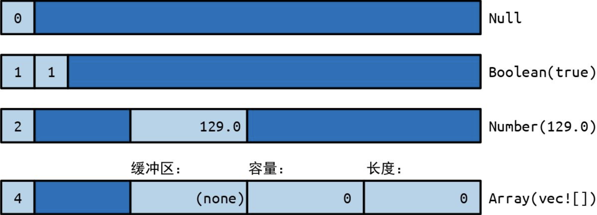
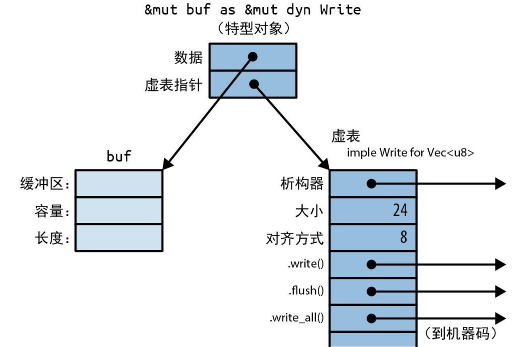
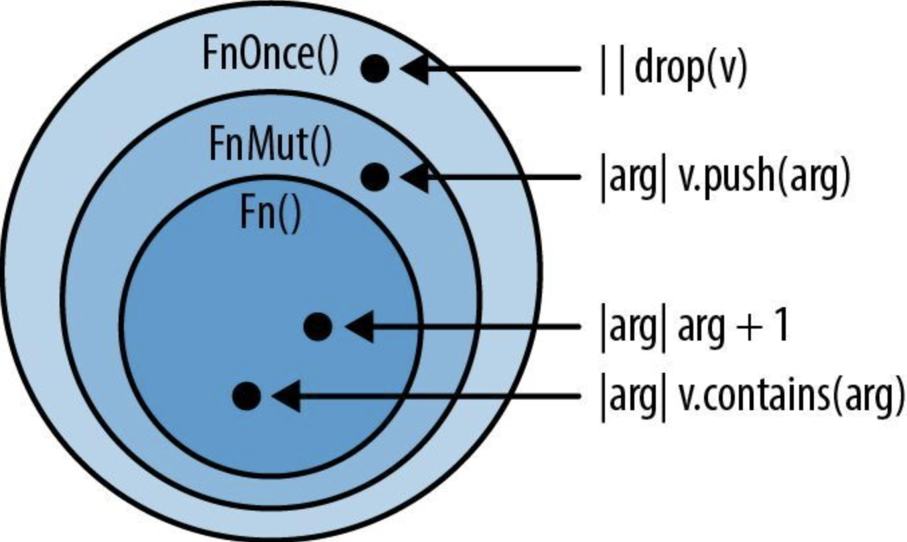
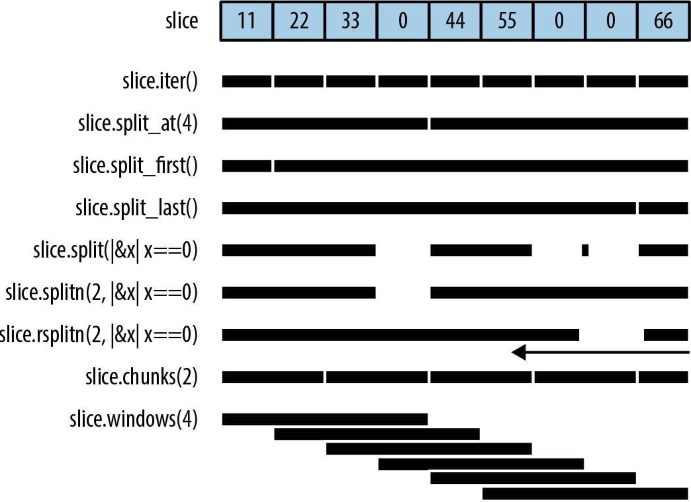
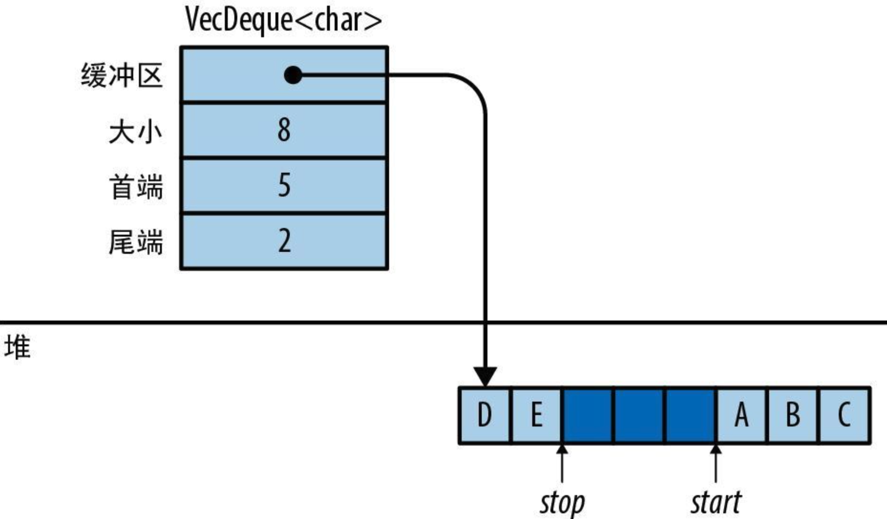
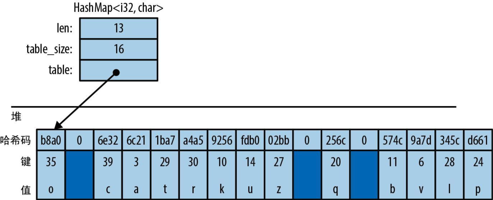
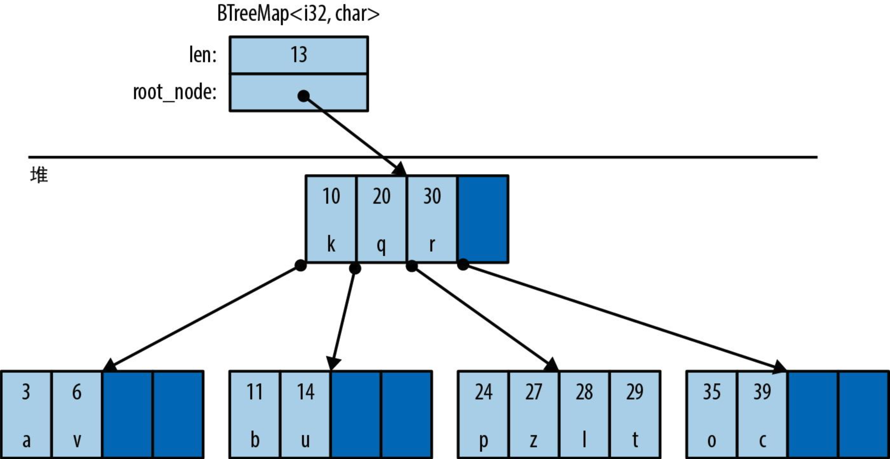
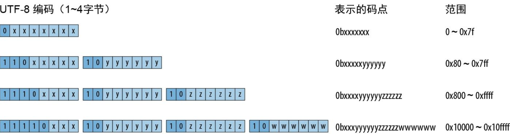
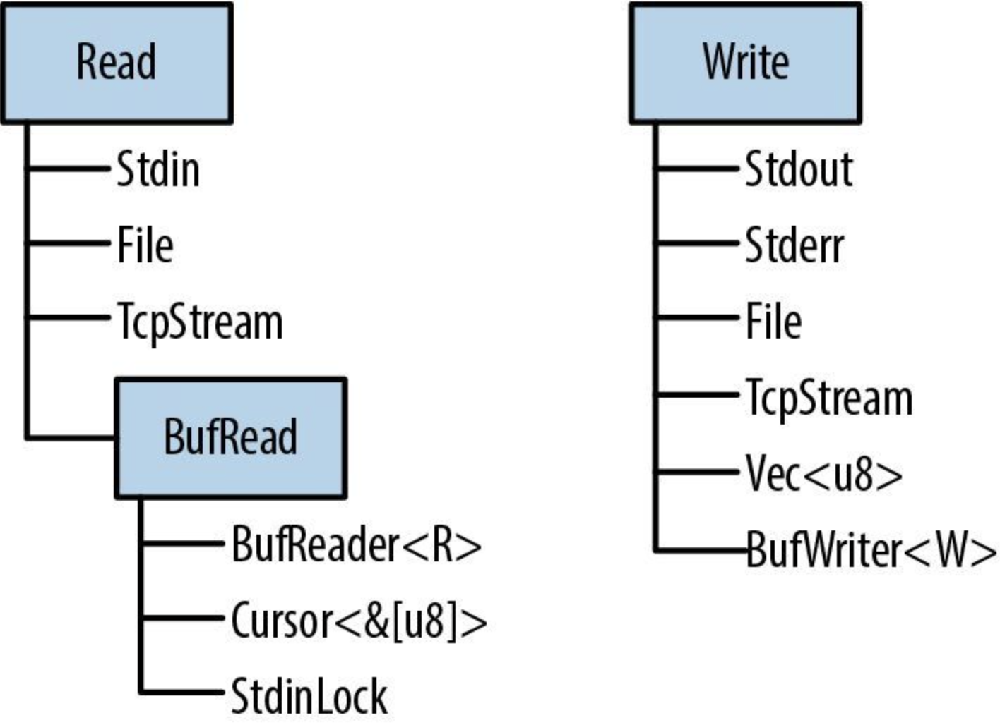

# Rust程序设计（第2版）

## 第1章 系统程序员也能享受美好

### 1.1 Rust为你负重前行

Rust 语言给了我们一个简单的承诺：只要程序通过了编译器的检查，就不会存在未定义行为

### 1.2 高效并行编程

Rust 的生态系统提供了一些超乎于常规并发原语的库，可帮助你在处理器池之间均匀分布复杂负载、使用无锁同步机制（如读取-复制-更新）等

### 1.3 性能毫不妥协

**零开销原则**：没用到的，就没有开销；要用到的，你也无法手写出更好的代码

### 1.4 协作无边无界

- 作为 Rust 的包管理器和构建工具，Cargo 能让你轻松使用别人在 Rust 的公共包存储库 crates.io 网站上发布的各种库
- Rust 这门语言本身也旨在支持协作：借助 Rust 的特型（trait）和泛型，我们可以创建具有灵活接口的库，将其用在许多不同的上下文中

## 第2章 Rust导览

### 2.1 rustup 与 Cargo

cargo 是 Rust 的编译管理器、包管理器和通用工具。可以用 Cargo 启动新项目、构建和运行程序，并管理代码所依赖的任何外部库

cargo默认创建项目时会一并初始化git版本管制系统，如果这不是希望的行为，可以通过`cargo new xxx --vsc none`指定不使用版本控制系统

`cargo clean`可以清理编译生成的文件

### 2.2 Rust函数

`isize`类型和`usize`类型保存着恰好等于“**指针大小**”的有符号整数和无符号整数，在 32 位平台上是 32 位长，在 64 位平台上则是 64 位长

一个函数体**以没有尾随着分号的表达式结尾**，那么这个表达式就是函数的**返回值**

### 2.3 编写与运行单元测试

通过`#[test]`标记单元测试的函数，再通过`cargo test`来执行单测，在正常编译时会跳过它

### 2.4 处理命令行参数

要想使用某个trait的方法，该trait就必须在作用域内，比如使用`u64::from_str`就必须通过`use std::str::FromStr;`来将`FromStr` trait引入

```rust
use std::env;
use std::str::FromStr;

fn main() {
    let mut numbers = Vec::new();

    for arg in env::args().skip(1) {
        numbers.push(u64::from_str(&arg).expect("error parsing argument"));
    }

    if numbers.len() == 0 {
        eprintln!("Usage: gcd NUMBER ...");
        std::process::exit(1);
    }

    let mut d = numbers[0];
    for m in &numbers[1..] {
        d = gcd(d, *m);
    }

    println!("The greatest common divisor of {:?} is {}", numbers, d);
}

fn gcd(mut m: u64, mut n: u64) -> u64 {
    assert!(m != 0 && n != 0);
    while m != 0 {
        if m < n {
            let t = m;
            m = n;
            n = t;
        }
        m = m % n;
    }
    n
}

#[test]
fn test_gcd() {
    assert_eq!(gcd(14, 15), 1);
}
```

### 2.5 搭建Web服务器

一个Rust 包，无论是库还是可执行文件，都叫作 crate（发音为/kreɪt/，意思是“板条箱”）

```rust
use actix_web::{get, post, web, App, HttpResponse, HttpServer, Responder};
use serde::Deserialize;

#[derive(Deserialize)]
struct GcdParameters {
    n: u64,
    m: u64,
}

#[actix_web::main]
async fn main() -> std::io::Result<()> {
    let server = HttpServer::new(|| App::new().service(get_index).service(post_gcd));
    println!("Serving on http://localhost:3000...");

    server.bind(("127.0.0.1", 3000))?.run().await
}

#[post("/gcd")]
async fn post_gcd(form: web::Form<GcdParameters>) -> impl Responder {
    println!("get");
    if form.n == 0 || form.m == 0 {
        return HttpResponse::BadRequest()
            .content_type("text/html")
            .body("Computing the GCD with zero is boring.");
    }

    let response = format!(
        "The greatest common divisor of the numbers {} and {} \
        is <b>{}</b>\n",
        form.n, form.m, 4
    );
    HttpResponse::Ok().content_type("text/html").body(response)
}

#[get("/")]
async fn get_index() -> impl Responder {
    HttpResponse::Ok().content_type("text/html").body(
        r#"
        <title>GCD Calculator</title>
        <form action="/gcd" method="post">
            <input type="text" name="n"/>
            <input type="text" name="m"/>
            <button type="submit">Computed GCD</button>
        </form>
        "#,
    )
}
```

### 2.6 并发

 Rust 函数都是线程安全的

#### 2.6.1 什么是曼德博集

```rust
use num::Complex;

fn complex_square_add_loop(c: Complex<f64>) {
    let mut z = Complex { re: 0.0, im: 0.0 };
    loop {
        z = z * z + c;
    }
}
```

曼德博集的**定义**是：令 z 不会“飞到”无穷远的复数 c 的集合，大于0.25 或小于 -2.0 的 c 值会导致 z“飞”出去

由于复数 c 具有实部 c.re 和虚部 c.im，因此可以把它们视为笛卡儿平面上某个点的 x 坐标和 y 坐标，如果 c 在曼德博集中，就在其中用黑色着色，否则就用浅色

使用有限循环代替无限循环获取一个近似值，迭代多少次取决于要绘制的边界的精度。并且已证明：**一旦z离开以原点为中心的半径为2的圆**，它最终就一定会“飞到”无穷远的地方

#### 2.6.2 解析并配对命令行参数

```rust
/// 尝试测试`c`是否位于曼德博集中，使用最多`limit`次迭代来判定
///
/// 如果`c`不是集合成员之一，则返回`Some(i)`，其中的`i`是`c`离开以原点为中心的半径为2的圆时所需要的迭代次数
/// 如果`c`似乎是集合成员之一（确切而言是达到了迭代次数限制但仍然无法证明`c`不是成员），则返回`None`
fn escape_time(c: Complex<f64>, limit: usize) -> Option<usize> {
    let mut z = Complex { re: 0.0, im: 0.0 };
    for i in 0..limit {
        if z.norm_sqr() > 4.0 {
            return Some(i);
        }
        z = z * z + c;
    }

    None
}

// 把字符串`s`（形如`"400x600`或`"1.0,0.5"`）解析成一个坐标对
//
// 具体来说，`s`应该具有<left><sep><right>的格式，其中<sep>是由`seprator`参数给出的字符
// 而<left>和<right>可以被`T::from_str`解析的字符串
// `separator`必须是ASCII字符
// 如果`s`具有正确的格式，就返回`Some<(x,y)>`；如果无法正确解析，就返回`None`
fn parse_pair<T: FromStr>(s: &str, sperator: char) -> Option<(T, T)> {
    match s.find(sperator) {
        None => None,
        Some(index) => match (T::from_str(&s[..index]), T::from_str(&s[index + 1..])) {
            (Ok(l), Ok(r)) => Some((l, r)),
            _ => None,
        },
    }
}

fn parse_complex(s: &str) -> Option<Complex<f64>> {
    match parse_pair(s, ',') {
        Some((re, im)) => Some(Complex { re, im }),
        None => None,
    }
}
```

#### 2.6.3 从像素到复数的映射

```rust
/// 给定输出图像中像素的行和列，返回复平面中对应的坐标
///
/// `bounds`是一个`pair`，给出了图像的像素宽度和像素高度。
/// `pixel`是表示该图像中特定像素的（column, row）二元组
/// `upper_left`参数和`lower_right`参数是在复平面中表示指定图像覆盖范围的点
fn pixel_to_point(
    bounds: (usize, usize),
    pixel: (usize, usize),
    upper_left: Complex<f64>,
    lower_right: Complex<f64>,
) -> Complex<f64> {
    let (width, height) = (
        lower_right.re - upper_left.re,
        upper_left.im - lower_right.im,
    );
    Complex {
        re: upper_left + pixel.0 as f64 * width / bounds.0 as f64,
        im: upper_left.im - pixel.1 as f64 * height / bounds.1 as f64,
    }
}
```


#### 2.6.4 绘制曼德博集

```rust
/// 将曼德博集对应的矩形渲染到像素缓冲区中
///
/// `bounds`参数会给出缓冲区`pixels`的宽度和高度，此缓冲区的每个字节都包含一个灰度像素
/// `upper_left`参数和`lower_right`参数分别指定了复平面中对应于像素缓冲区左上角和右下角的点
fn render(
    pixels: &mut [u8],
    bounds: (usize, usize),
    upper_left: Complex<f64>,
    lower_right: Complex<f64>,
) {
    assert!(pixels.len() == bounds.0 * bounds.1);
    for row in 0..bounds.1 {
        for column in 0..bounds.0 {
            let point = pixel_to_point(bounds, (column, row), upper_left, lower_right);
            pixels[row * bounds.0 + column] = match escape_time(point, 255) {
                None => 0,
                Some(count) => 255 - count as u8,
            };
        }
    }
}
```

#### 2.6.5 写入图像文件

对于下面这种代码：

```rust
let output = match File::create(filename) {
    Ok(f) => f,
    Err(e) => {
        return Err(e);
    }
};
```

成功时，就将 output 赋值为 Ok 值中携带的 File。失败时，就将错误透传给调用者。这种 match 语句在 Rust 中是一种非常常见的模式，**所以该语言提供了` ? `运算符作为它的简写形式**，简写成下面这种形式：

```rust
let output = File::create(filename)?;
```

```rust
/// 把`pixels`缓冲区（其尺寸由`bounds`给出）写入名为`filename`的文件中
fn write_image(
    filename: &str,
    pixels: &[u8],
    bounds: (usize, usize),
) -> Result<(), std::io::Error> {
    let output = File::create(filename)?;

    let encoder = PNGEncoder::new(output);
    encoder.encode(pixels, bounds.0 as u32, bounds.1 as u32, ColorType::Gray(8))?;
    Ok(())
}
```

#### 2.6.6 并发版曼德博程序

```rust
fn main() {
    let args: Vec<String> = env::args().collect();

    if args.len() != 5 {
        eprintln!("Usage: {} FILE PIXELS UPPERLEFT LOWERRIGHT", args[0]);
        eprintln!(
            "Example: {} mandel.png 1000x750 -1.20,0.35 -1,0.20",
            args[0]
        );
        std::process::exit(1);
    }

    let bounds = parse_pair(&args[2], 'x').expect("error parsing image dimensions");
    let upper_left = parse_complex(&args[3]).expect("error parsing upper left corner point");
    let lower_right = parse_complex(&args[4]).expect("error parsing lower right corner point");

    let mut pixels = vec![0; bounds.0 * bounds.1];
    render(&mut pixels, bounds, upper_left, lower_right);

    write_image(&args[1], &pixels, bounds).expect("error writing PNG file");
}
```

```bash
cargo build --release
time target/release/mandelbrot mandel.png 4000x3000 -1.20,0.35 -1,0.20
```

并发版本：

```rust
// 非并发版本
// render(&mut pixels, bounds, upper_left, lower_right);

// 并发版本
let threads = num_cpus::get();
let rows_per_band = bounds.1 / threads + 1;
{
    let bands: Vec<&mut [u8]> = pixels.chunks_mut(rows_per_band * bounds.0).collect();
    crossbeam::scope(|spawner| {
        for (i, band) in bands.into_iter().enumerate() {
            let top = rows_per_band * i;
            let height = band.len() / bounds.0;
            let band_bounds = (bounds.0, height);
            let band_upper_left = pixel_to_point(bounds, (0, top), upper_left, lower_right);
            let band_lower_right =
                pixel_to_point(bounds, (bounds.0, top + height), upper_left, lower_right);
            spawner.spawn(move |_| {
                render(band, band_bounds, band_upper_left, band_lower_right);
            });
        }
    })
    .unwrap();
}
```

#### 2.6.7 运行曼德博绘图器

```bash
cargo build --release
time target/release/mandelbrot mandel.png 4000x3000 -1.20,0.35 -1,0.20
```

注意这次time命令执行的结果

#### 2.6.8 大“安”无形

### 2.7 文件系统与命令行工具

```toml
[package]
name = "quickreplace"
version = "0.1.0"
edition = "2021"

# See more keys and their definitions at https://doc.rust-lang.org/cargo/reference/manifest.html

[dependencies]
text-colorizer = "1"
regex = "1"
```

如果在 Cargo.toml 文件中只是请求版本 "1"的 crate，那么 Cargo 就会使用 2.0 之前的 crate 里最新的可用版本

#### 2.7.1 命令行界面

```rust
use std::env;

use text_colorizer::Colorize;

#[derive(Debug)]
struct Arguments {
    target: String,
    replacement: String,
    filename: String,
    output: String,
}

fn print_usage() {
    eprintln!(
        "{} - change occurrences of one string into anthor",
        "quickreplace".green()
    );
    eprintln!("Usage: quickreplace <target> <replacement> <INPUT> <OUTPUT>");
}

fn parse_args() -> Arguments {
    let args: Vec<String> = env::args().skip(1).collect();

    if args.len() != 4 {
        print_usage();
        eprintln!(
            "{} wrong number of arguments: expected 4, got {}",
            "Error:".red().bold(),
            args.len()
        );
        std::process::exit(1);
    }

    Arguments {
        target: args[0].clone(),
        replacement: args[1].clone(),
        filename: args[2].clone(),
        output: args[3].clone(),
    }
}
```

#### 2.7.2 读写文件

```rust
fn main() {
    let args = parse_args();
    let data = match fs::read_to_string(&args.filename) {
        Ok(v) => v,
        Err(e) => {
            eprintln!(
                "{} failed to read from file '{}':{:?}",
                "Error:".red().bold(),
                args.filename,
                e
            );
            std::process::exit(1);
        }
    };

    match fs::write(&args.output, &data) {
        Ok(_) => {}
        Err(e) => {
            eprintln!(
                "{} failed to write to file '{}':{:?}",
                "Error:".red().bold(),
                args.output,
                e
            );
            std::process::exit(1);
        }
    }
}
```

#### 2.7.3 查找并替换

```rust
let replaced_data = match replace(&args.target, &args.replacement, &data) {
        Ok(v) => v,
        Err(e) => {
            eprintln!("{} failed to replace text: {:?}", "Error:".red().bold(), e);
            std::process::exit(1);
        }
    };
```

## 第3章 基本数据类型

1. 基于已明确写出的类型，Rust 的类型推断会帮你**推断出**剩下的大部分类型
2. 函数可以是**泛型**的：单个函数就可以处理许多不同类型的值

### 3.1 固定宽度的数值类型

#### 3.1.1 整型

- Rust 会使用 u8 类型作为**字节值**

- Rust 会把字符视为与数值截然不同的类型：char 既不是u8，也不是 u32（尽管它确实有 32 位长）
- usize 类型和 isize 类型类似于 C 和 C++ 中的 size_t 和 ptrdiff_t。它们的精度与目标机器上地址空间的大小保持一致，即在 32 位架构上是 32 位长，在 64 位架构上则是 64 位长
- 为了让长数值更易读，可以在数字之间任意插入下划线，**下划线的具体位置无关紧要**
- 尽管数值类型和 char 类型是不同的，但 Rust 确实为 u8 值提供了**字节字面量**。与字符字面量类似，b'X' 表示以字符 X 的 ASCII 码作为 u8 值。例如，由于 A 的 ASCII 码是 65，因此字面量 b'A' 和 65u8 完全等效。**只有 ASCII 字符才能出现在字节字面量中**
- 可以使用 as 运算符将一种整型转换为另一种整型
- Rust 在调用类型本身的方法之前**必须确切地知道**一个值属于哪种整型
- 方法调用的优先级高于一元前缀运算符

#### 3.1.2 检查算法、回绕算法、饱和算法和溢出算法

对于算术运算的溢出，在debug构建时会触发panic，但在release构建中，会进行**回绕**，如果不想要这种默认行为，则：

1. 可以使用`checked_`开头的方法来进行**检查**，其结果是一个`Option`值，如果数学意义上正确的结果则返回`Some(v)`，否则返回`None`
2. 可以使用`wrapping_`开头的方法来进行**回绕**，回绕运算会返回与“数学意义上正确的结果”对“值类型范围”取模的值相等的值
3. 可以使用`saturating_`开头的方法来进行**`饱和`**，饱和运算会返回最接近“数学意义上正确结果”的可表达值
4. 可以使用`overflowing_`开头的方法来进行**`溢出`**，溢出运算会返回一个元组` (result, overflowed)`，其中 result 是函数的**回绕**版本所返回的内容，而 overflowed 是一个布尔值，指示**是否发生过溢出**

#### 3.1.3 浮点类型

Rust 提供了 IEEE 单精度浮点类型（f32）和 IEEE 双精度浮点类型（f64）

f32 类型和 f64 类型具有 IEEE 要求的一些特殊值的**关联常量**，比如 INFINITY（无穷大）、NEG_INFINITY（负无穷大）、NAN（非数值）以及 MIN（最小有限值）和 MAX（最大有限值）

**Rust 几乎不会执行任何隐式的数值转换，不过，你随时可以用 as运算符写出显式转换**

### 3.2 布尔类型

Rust中的布尔类型只有两个值：`true`和`false`，且诸如条件判断和`while`循环控制的条件必须是`bool`表达式

Rust 的 as 运算符可以**将`bool`值转换为整型**，但反之不行

Rust 在内存中会使用**整字节**来表示 bool值，因此可以创建指向它的指针

### 3.3 字符

Rust 的字符类型 char 会以 **32 位**值表示单个 Unicode 字符

Rust 会对单独的字符使用`char`类型，但对字符串和文本流使用 UTF-8 编码。因此，**String 会将其文本表示为 UTF-8 字节序列**，而不是字符数组

char 总是**包含 0x0000 到 0xD7FF 或 0xE000 到 0x10FFFF 范围内的 Unicode 码点**。char 永远不会是“半代用区”中的码点（0xD800 到 0xDFFF 范围内的码点，它们不能单独使用）或 Unicode 码点空间之外的值（大于 0x10FFFF 的值）

Rust **不会**在 char 和任何其他类型之间**进行隐式转换**，而u8 是唯一能通过 as 运算符转换为 char 的类型

### 3.4 元组

单元组类型`()`

对于单个值的元组，值后面的逗号是一必需的，**用于区分单值元组和简单的括号表达式**

### 3.5 指针类型

当 Rust 程序需要让一些值指向其他值时，必须显式使用指针类型，当使用这些指针类型时，安全的 Rust 会对其进行约束，以消除未定义的行为

#### 3.5.1 引用

最简单的方式是将引用视为 Rust 中的**基本指针类型**

表达式 &x 会生成一个对 x 的引用，在 Rust 术语中，我们会说它**借用**了对 x 的引用

Rust 利用**共享引用**和**可变引用**之间的**“二选一”**机制来强制执行**“单个写入者或多个读取者”**规则

#### 3.5.2 Box

在堆中分配值的最简单的方式

#### 3.5.3 裸指针

Rust 也有裸指针类型 *mut T 和 *const T。裸指针实际上和 C++ 中的指针很像。使用裸指针是不安全的，因为 Rust 不会跟踪它指向的内容，你只能在`unsafe`块中对裸指针解引用（dereference）

### 3.6 数组、向量和切片

#### 3.6.1 数组

Rust 没有任何能定义未初始化数组的写法，所以在声明数组时，要么通过在方括号内写入一系列值，要么通过`[V; N]`的写法声明一个长度为`N`每个元素的值都是`V`的数组

数组的长度必须是在编译期就固定下来的

你在数组上看到的那些实用方法（遍历元素、搜索、排序、填充、过滤等）**都是作为切片而非数组的方法提供的**，但是 Rust 在搜索各种方法时**会隐式地将对数组的引用转换为切片**，因此可以直接在数组上调用任何切片方法

#### 3.6.2 向量

向量`Vec<T>`是一个可调整大小的`T`类型元素的数组，它是在堆上分配的

`Vec<T>`由 3 个值组成：

1. 指向元素在堆中分配的缓冲区（该缓冲区由`Vec<T>`创建并拥有）的指针
2. 缓冲区能够存储的元素数量（`capacity`方法获得）
3. 它现在实际包含的数量（也就是它的长度，通过`len`方法获得）

#### 3.6.3 切片

切片（写作不指定长度的`[T]`）是数组或向量中的一个区域。由于切片可以是任意长度，因此它不能直接存储在变量中或作为函数参数进行传递，**切片总是通过引用传递**

对切片的引用是一个**胖指针**：一个双字值，包括**指向切片第一个元素的指针**和**切片中元素的数量**

```rust
let v: Vec<f64> = vec![0.0,  0.707,  1.0,  0.707];
let a: [f64; 4] =     [0.0, -0.707, -1.0, -0.707];

let sv: &[f64] = &v;
let sa: &[f64] = &a;
```

对于上面的代码，内存布局如下：


### 3.7 字符串类型

#### 3.7.1 字符串字面量

字符串字面量要用**双引号括起来**，也就是说如果字符串字面量中包括双引号，则需要进行转义，除非使用**原始字符串**（用小写字母 r 进行标记），**原始字符串中的所有反斜杠和空白字符都会逐字包含在字符串中**，如：

```rust
let default_win_install_path = r"C:\Program Files\Gorillas";
```

但此时如果原始字符串包括双引号，则就**不能**简单的在其前面添加`\`，因为原始字符串不识别转义序列，此时可以**在原始字符串的开头和结尾添加相同数量的`#`标记**：

```rust
println!(
    r###"
    This raw string started with 'r###"'.
    Therefore it does not end until we reach a quote mark ('"')
    followed immediately by three pound signs ('###'):
"###
);
```

#### 3.7.2 字节串

**带有 b 前缀**的字符串字面量都是字节串。这样的字节串**是 u8 值（字节）的切片**而不是 Unicode 文本

字节串对应的**原始字节串要以 br" 开头**

#### 3.7.3 内存中的字符串

Rust 字符串是 Unicode 字符序列，使用了 UTF-8编码，字符串中的每个 ASCII 字符都会存储在单字节中，而其他字符会占用多字节

```rust
let noodles = "noodles".to_string();
let oodles = &noodles[1..];
let poodles = "ಠ_ಠ";
```

上面代码对应的内存布局如下：


字符串字面量是指预分配文本的 &str，它通常与程序的机器码一起**存储在只读内存区**

`String`或`&str`的`.len()`方法会返回其长度，**这个长度以字节**而不是字符**为单位**

```rust
assert_eq!("ಠ_ಠ".len(), 7);
assert_eq!("ಠ_ಠ".chars().count(), 3);
```

不能修改`&str`，切片不能重新分配其引用目标的缓冲区

#### 3.7.4 String

`&str`非常像`&[T]`，是一个指向某些数据的胖指针，而 String 则类似于`Vec<T>`

#### 3.7.5 使用字符串

如果两个字符串**以相同的顺序包含相同的字符**（无论是否指向内存中的相同位置），则认为它们**是相等的**

考虑到 Unicode 的性质，简单的**逐字符比较并不总能给出预期的答案**

#### 3.7.6 其他类似字符串的类型

- 对于 Unicode 文本，坚持使用`String`和`&str`
- 当使用文件名时，请改用`std::path::PathBuf`和`&Path`
- 当处理根本不是 UTF-8 编码的二进制数据时，请使用`Vec<u8>`和`&[u8]`
- 当使用操作系统提供的原生形式的环境变量名和命令行参数时，请使用`OsString`和`&OsStr`
- 当和使用 null 结尾字符串的 C 语言库进行互操作时，请使用 `std::ffi::CString 和 &CStr`

### 3.8 类型别名

```rust
type Bytes = Vec<u8>;
```

### 3.9 前路展望

## 第4章 所有权与移动 1

### 4.1 所有权

每个值都有决定其生命周期的**唯一**拥有者。当拥有者被释放时，它拥有的值也会同时被释放，在 Rust 术语中，释放的行为被称为**丢弃（drop）**

### 4.2 移动

在 Rust 中，对大多数类型来说，像为变量赋值、将其传给函数或从函数返回这样的操作都不会复制值，而是会**移动值**，**源会把值的所有权转移给目标并变回未初始化状态，改由目标变量来控制值的生命周期**

#### 4.2.1 更多移动类操作

- 将参数传给函数会将所有权转移给函数的参数
- 从函数返回一个值会将所有权转移给调用者
- 构建元组会将值转移给元组
- ……

#### 4.2.2 移动与控制流

禁止在循环中移动变量（因为在第一次迭代中已经进行了移动，**一旦移动，变量就会变成未初始化状态**），除非重新赋值

#### 4.2.3 移动与索引内容 

for 循环的内部机制会获取向量的所有权并将其分解为元素，在for循环之后就不能再访问该向量了

在循环的过程中，向量本身对代码不再可见，因此也就无法观察到它正处在某种部分清空的状态

### 4.3 Copy类型：关于移动的例外情况

对于如向量、字符串和其他可能占用大量内存且复制成本高昂的类型，移动能让其所有权清晰且赋值开销极低，而对于整数或字符这样的简单类型（**被Rust 指定成 Copy 类型的类型**），则大可不必使用这种方式

```rust
let string1 = "somnambulance".to_string();
let string2 = string1;

let num1: i32 = 36;
let num2 = num1;
```


**对 Copy 类型的值进行赋值会复制这个值，而不会移动它**，赋值的源仍会保持已初始化和可用状态，并且具有与之前相同的值。把 Copy 类型传给函数和构造器的行为也是如此

如果结构体的所有字段本身都是 Copy 类型，那么也可以通过将属性`#[derive(Copy,Clone)]`放置在此定义之上来创建 Copy 类型

```rust
#[derive(Copy, Clone)]
struct Label { number: u32 }
```

**在 Rust 中，每次移动都是字节级的一对一浅拷贝，并让源变成未初始化状态**

### 4.4 Rc与Arc：共享所有权

Rc 类型和 Arc 类型非常相似，它们之间唯一的区别是 **Arc 可以安全地在线程之间直接共享**，而普通 **Rc 会使用更快**的非线程安全代码来更新其引用计数

```rust
use std::rc::Rc;

// Rust能推断出所有这些类型，这里写出它们只是为了讲解时清晰
let s: Rc<String> = Rc::new("shirataki".to_string());
let t: Rc<String> = s.clone();
let u: Rc<String> = s.clone();
```


这 3 个`Rc<String>`指针指向了同一个内存块，其中包含引用计数和`String`本身的空间

**Rc 指针拥有的值是不可变的**

## 第5章 引用 

引用是一种**非拥有**型指针，**引用的生命周期绝不能超出其引用目标**，Rust 把创建对某个值的引用的操作称为**借用（borrow）**那个值：凡是借用，终须归还

### 5.1 对值的引用

引用能让你在**不影响**其所有权的情况下访问值，引用分为以下两种

1. **共享引用**允许你读取但不能修改其引用目标，共享引用是`Copy`类型，你可以根据需要**同时拥有任意数量**的对特定值的共享引用
2. **可变引用**允许你读取和修改值。但是，一旦一个值拥有了可变引用，就**无法再对该值创建其他任何种类的引用**了，可变引用不是`Copy`类型

只要存在对一个值的共享引用，即使是它的拥有者也不能修改它，该值会被锁定

当通过将值的所有权转移给函数的方式将这个值传给函数时，就可以说**按值传递**了它。如果改为将值的引用传给函数，就可以说**按引用传递**了它

### 5.2 使用引用

#### 5.2.1 Rust引用与C++引用

rust中创建引用和解引用都是**显式**的

```rust
let x = 10;
let r = &x;            // &x是对x的共享引用
assert!(*r == 10);     // 对r显式解引用

let mut y = 32;
let m = &mut y;        // &muty是对y的可变引用
*m += 32;              // 对m显式解引用，以设置y的值
assert!(*m == 64);     // 来看看y的新值
```

由于引用在 Rust 中随处可见，因此`.`运算符就会按需对其左操作数**隐式解引用**

```rust
struct Anime { name: &'static str, bechdel_pass: bool }
let aria = Anime { name: "Aria: The Animation", bechdel_pass: true };
let anime_ref = &aria;
assert_eq!(anime_ref.name, "Aria: The Animation");

// 与上一句等效，但把解引用过程显式地写了出来
assert_eq!((*anime_ref).name, "Aria: The Animation");
```

#### 5.2.2 对引用变量赋值

 C++ 中对引用赋值会将新值存储在其引用目标中而非指向新值，即引用一旦完成初始化，就无法再指向别处了，**rust则截然不同**

#### 5.2.3 对引用进行引用

```rust
struct Point { x: i32, y: i32 }
let point = Point { x: 1000, y: 729 };
let r: &Point = &point;
let rr: &&Point = &r;
let rrr: &&&Point = &rr;
```

`.`运算符会**追踪尽可能多层次**的引用来找到它的目标

```rust
// 成立
assert_eq!(rrr.y, 729);
```

#### 5.2.4 比较引用

Rust 的比较运算符也能“看穿”任意数量的引用

```rust
assert!(rx == ry);              // 它们引用的目标值相等
assert!(!std::ptr::eq(rx, ry)); // 但所占据的地址（自身的值）不同
```

#### 5.2.5 引用永不为空

Rust 的引用永远都不会为空

#### 5.2.6 借用任意表达式结果值的引用

在 let 语句中，如果立即将引用赋值给某个变量，那么 Rust 就会让匿名变量存在于 let 初始化此变量期间（如下代码中的`r`），否则，匿名变量会一直存续到所属封闭语句块的末尾（如下代码中的`&1009`）

```rust
fn factorial(n: usize) -> usize {
    (1..n+1).product()
}
let r = &factorial(6);
// 数学运算符可以“看穿”一层引用
assert_eq!(r + &1009, 1729);
```

#### 5.2.7 对切片和trait对象的引用

两种**胖指针**

1. 对切片的引用，携带此切片的**起始地址**及其**长度**
2. trait对象，携带一个值的地址和指向适用于该值的trait实现的指针，以便调用trait上的方法

### 5.3 引用安全

#### 5.3.1 借用局部变量

- 不能借用对局部变量的引用并将其移出变量的作用域

  Rust 会尝试为程序中的**每个引用类型**分配一个**生命周期**，以表达根据其使用方式应施加的约束

  生命周期完全是 Rust 在**编译期虚构的产物**。在运行期，引用只是一个地址，它的生命周期只是其类型的一部分，不存在运行期表示

- 如果将引用存储在变量 r 中，则引用类型必须在变量 r **从初始化到最后一次使用的整个生命周期内都可以访问**

#### 5.3.2 将引用作为函数参数

在 Rust 中，全局变量的等价物称为**静态变量（static）**：它是在程序启动时就会被创建并一直存续到程序终止时的值，并且只能在`unsafe`块中访问静态变量

#### 5.3.3 把引用传给函数

#### 5.3.4 返回引用

#### 5.3.5 包含引用的结构体

每当一个引用类型出现在另一个类型的定义中时，必须写出它的生命周期

**类型的生命周期参数总会揭示它是否包含某些值得关心其生命周期的引用（也就是非 'static 的）以及这些生命周期可以是什么**

#### 5.3.6 不同的生命周期参数

```rust
struct S<'a> {
    x: &'a i32,
    y: &'a i32
}

let x = 10;
let r;
{
    let y = 20;
    {
        let s = S { x: &x, y: &y };
        r = s.x;
    }
}
println!("{}", r);
```

上面的代码不会创建悬垂指针，但不符合rust对生命周期的推导过程，因此需要定义不同的生命周期

```rust
struct S<'a, 'b> {
    x: &'a i32,
    y: &'b i32
}
```

#### 5.3.7 省略生命周期参数

> 下面的内容引自《Rust权威指南》

函数参数或方法参数中的生命周期被称为**输入生命周期（input lifetime）**，而返回值的生命周期则被称为**输出生命周期（output lifetime）**

关于生命周期省略规则：

1. 每一个引用参数都会拥有自己的生命周期参数
2. 当只存在一个输入生命周期参数时，这个生命周期会被赋予给所有输出生命周期参数
3. 当拥有多个输入生命周期参数，而其中一个是&self或&mut self时，self的生命周期会被赋予给所有的输出生命周期参数

如果编译器而上述三条规则处理后仍不能明确计算出签名中所有引用的生命周期，则出现错误

### 5.4 共享与可变

在指向集合的同时修改集合要加倍小心

我们既可以借用向量的可变引用，也可以借用其元素的共享引用，但这两种引用的**生命周期不能重叠**

Rust的“可变与共享”规则：

- 共享访问是只读访问、

  在共享引用的整个生命周期中，无论是它的引用目标，还是可从该引用目标间接访问的任何值，都**不能被任何代码改变**。这种结构中不能存在对任何内容的有效可变引用，其拥有者应保持只读状态

- 可变访问是独占访问

  可变引用借用的值**只能通过该引用访问**。在可变引用的整个生命周期中，无论是它的引用目标，还是该引用目标间接访问的任何目标，都没有任何其他路径可访问。对可变引用来说，唯一能和自己的生命周期重叠的引用就是从可变引用本身借出的引用

每种引用都会影响到我们可以对**“到引用目标从属路径上的值”**以及**“从引用目标可间接访问的值”**所能执行的操作


### 5.5 应对复杂对象关系

Rust 更喜欢让指针、所有权和数据流单向通过系统。Rust 不仅会迫使你理解为什么自己的程序是线程安全的，甚至可能还需要你做一些高级架构设计

## 第6章 表达式

### 6.1 表达式语言

Rust是所谓的**表达式语言**，在Rust中，if和match都可以生成值，这也解释了为什么Rust没有C那样的三元运算符，因为在Rust中可以这样：

```rust
let status =
		if cpu.temperature <= MAX_TEMP {
      	HttpStatus::OK
		} else {
      	HttpStatus::ServerError
		};
```

### 6.2 优先级与结合性

|   表达式类型    | 示例                                                         |                           相关特型                           |
| :-------------: | :----------------------------------------------------------- | :----------------------------------------------------------: |
|   数组字面量    | `[1, 2, 3]`                                                  |                                                              |
| 数组重复表达式  | `[0; 50]`                                                    |                                                              |
|      元组       | `(6, "crullers")`                                            |                                                              |
|      分组       | `(2 + 2)`                                                    |                                                              |
|       块        | `{ f(); g() }`                                               |                                                              |
|  控制流表达式   | `if ok { f() }`<br>`if ok { 1 } else { 0 }`<br>`if let Some(x) = f() { x } else { 0 }` <br>`match x { None => 0, _ => 1 }`<br>`for v in e { f(v); }` <br>`while ok { ok = f(); }`<br>`while let Some(x) = it.next() { f(x); }`<br>`loop { next_event(); }` <br>`break` <br>`continue`<br>`return 0` |                  `std::iter::IntoIterator`                   |
|     宏调用      | `println!("ok")`                                             |                                                              |
|      路径       | `std::f64::consts::PI`                                       |                                                              |
|  结构体字面量   | `Point {x: 0, y: 0}`                                         |                                                              |
|  元组字段访问   | `pair.0`                                                     |                     `Deref`、`DerefMut`                      |
| 结构体字段访问  | `point.x`                                                    |                     `Deref`、`DerefMut`                      |
|    方法调用     | `point.translate(50, 50)`                                    |                     `Deref`、`DerefMut`                      |
|    函数调用     | `stdin()`                                                    | `Fn(Arg0, ...) -> T`、`FnMut(Arg0, ...) -> T`、`FnOnce(Arg0, ...) -> T` |
|      索引       | `arr[0]`                                                     |             `Index`、`IndexMutDeref`、`DerefMut`             |
|    错误检查     | `create_dir("tmp")?`                                         |                                                              |
| 逻辑非 / 按位非 | `!ok`                                                        |                            `Not`                             |
|      取负       | `-num`                                                       |                            `Neg`                             |
|     解引用      | `*ptr`                                                       |                     `Deref`、`DerefMut`                      |
|      借用       | `&val`                                                       |                                                              |
|    类型转换     | `x as u32`                                                   |                                                              |
|       乘        | `n * 2`                                                      |                            `Mul`                             |
|       除        | `n / 2`                                                      |                            `Div`                             |
|  取余（取模）   | `n % 2`                                                      |                            `Rem`                             |
|       加        | `n + 1`                                                      |                            `Add`                             |
|       减        | `n - 1`                                                      |                            `Sub`                             |
|      左移       | `n << 1`                                                     |                            `Shl`                             |
|      右移       | `n >> 1`                                                     |                            `Shr`                             |
|     按位与      | `n & 1`                                                      |                           `BitAnd`                           |
|    按位异或     | `n ^ 1`                                                      |                           `BitXor`                           |
|     按位或      | `n | 1`                                                      |                           `BitOr`                            |
|      小于       | `n < 1`                                                      |                    `std::cmp::PartialOrd`                    |
|    小于等于     | `n <= 1`                                                     |                    `std::cmp::PartialOrd`                    |
|      大于       | `n > 1`                                                      |                    `std::cmp::PartialOrd`                    |
|    大于等于     | `n >= 1`                                                     |                    `std::cmp::PartialOrd`                    |
|      等于       | `n == 1`                                                     |                    `std::cmp::PartialEq`                     |
|     不等于      | `n != 1`                                                     |                    `std::cmp::PartialEq`                     |
|     逻辑与      | `x.ok && y.ok`                                               |                                                              |
|     逻辑或      | `x.ok || backup.ok`                                          |                                                              |
|  右开区间范围   | `start .. stop`                                              |                                                              |
|  右闭区间范围   | `start ..= stop`                                             |                                                              |
|      赋值       | `x = val`                                                    |                                                              |
|    复合赋值     | `x *= 1` `x /= 1` `x %= 1` `x += 1` `x -= 1` `x <<= 1` `x >>= 1` `x &= 1` `x ^= 1` `x |= 1` | `DivAssign` `RemAssign` `AddAssign` `SubAssign` `ShlAssign` `ShrAssign` `BitAndAssign` `BitXorAssign` `BitOrAssign` `MulAssign` |
|      闭包       | `|x, y| x + y`                                               |                                                              |

### 6.3 块与分号

表达式（无分号结尾）的值即为块的值

### 6.4 声明

块可以包含**语法声明**，比如可以在块里声明`fn`，但嵌套的`fn`**无法访问**恰好在同一作用域内的局部变量或参数，这点与**闭包**不同，闭包是可以看到封闭块作用域内的变量的

### 6.5 if与match

- 每个条件必须是`bool`类型的表达式，**不支持隐式转换**
- `match`中的`_`作为通配符模式匹配所有内容，类型于`switch`中的`default:`分支，但必须排在最后
- `match`表达式命中模式时，会执行对应的表达式，并且不会再检查别的模式
- Rust禁止执行未覆盖所有可能值的`match`表达式
- `match`表达式的所有分支都必须**具有相同的类型**

#### 6.5.1 if let

```rust
if let pattern = expr {
    block1
} else {
    block2
}
```

给定的 expr 要么匹配 pattern，这时会运行 block1；要么无法匹配，这时会运行 block2

#### 6.5.2 循环

Rust支持以下4种循环表达式：

```rust
while condition {
    block
}

while let pattern = expr {
    block
}

loop {
    block
}

for pattern in iterable {
    block
}
```

### 6.6 循环中的控制流

在`loop`循环中，`break`后面可以跟一个表达式，该表达式的值会作为`loop`的值

循环可以带有**生命周期标签**，如下代码，`break 'search'`会退出这层循环而不是退出内部循环

```rust
'search:
for room in apartment {
    for spot in room.hiding_spots() {
        if spot.contains(keys) {
            println!("Your keys are {} in the {}.", spot, room);
            break 'search;
        }
    }
}
```

break 可以同时具有标签和值表达式：

```rust
// 找到此系列中第一个完全平方数的平方根
let sqrt = 'outer: loop {
    let n = next_number();
    for i in 1.. {
        let square = i * i;
        if square == n {
            // 找到了一个平方根
            break 'outer i;
        }
        if square > n {
            // `n`不是完全平方数，尝试下一个
            break;
        }
    }
};
```

标签也可以与 continue 一起使用

### 6.7 return表达式

不带值的`return`是`return ()`的简写

### 6.8 为什么Rust中会有loop

> Rust 编译器中有几个部分会分析程序中的控制流.
>
> Rust 会检查通过函数的每条路径是否返回了预期返回类型的值。为了正确地做到这一点，它需要知道是否有可能抵达函数的末尾。Rust 会检查局部变量有没有在未初始化的情况下使用过。这就要检查通过函数的每一条路径，以确保只要不经过初始化此变量的代码，就无法抵达使用它的地方。Rust 会对不可达代码发出警告。如果无法通过函数抵达某段代码，则这段代码不可达。
>
> 以上这些称为流敏感（flow-sensitive）分析
>
> 要执行这种规则，语言就必须在简单性和智能性之间取得平衡。Rust 更倾向于简单性，它的流敏感分析根本不会检查循环条件，而会简单地假设程序中的任何条件都可以为真或为假
>
> 这会导致 Rust 可能拒绝某些安全程序：
>
> ```rust
> fn wait_for_process(process: &mut Process) -> i32 {
>     while true {
>         if process.wait() {
>             return process.exit_code();
>         }
>     }
> }  // 错误：类型不匹配：期待i32，实际找到了()
> ```
>
> loop 表达式就是这个问题的“有话直说”式解决方案
>
> 在可能以 break 或 return 表达式、无限 loop，或者调用 panic!() 或 std::process::exit() 等多种方式结束的块上强制执行此规则是不现实的。这些表达式的共同点是它们永远都不会以通常的方式结束并生成一个值。
>
> 不能正常结束的表达式属于一个特殊类型 !，并且它们不受“类型必须匹配”这条规则的约束

### 6.9 函数与方法调用

Rust 的`.`运算符会根据需要自动对player **解引用**或**借入**一个对它的引用

在函数调用或方法调用中，泛型类型的常用语法`Vec<T>`是不起作用的：

```rust
return Vec<i32>::with_capacity(1000);  // 错误：是某种关于“链式比较”的错误消息

let ramp = (0 .. n).collect<Vec<i32>>();  // 同样的错误

// 替换为：

return Vec::<i32>::with_capacity(1000);  // 正确

let ramp = (0 .. n).collect::<Vec<i32>>();  // 正确
```

**这里的问题在于，在表达式中`<`是小于运算符**

### 6.10 字段与元素

方括号左侧的值也会**自动解引用**

### 6.11 引用运算符

一元`*`运算符用于访问引用所指向的值

### 6.12 算术运算符、按位运算符、比较运算符和逻辑运算符

Rust 中按位运算的优先级高于比较运算

移位总是对有符号整数类型进行符号扩展，对无符号整数类型进行零扩展

### 6.13 赋值

Rust 不支持链式赋值

Rust 没有 C 的自增运算符 ++ 和自减运算符 --

### 6.14 类型转换

在 Rust 中，将值从一种类型转换为另一种类型**通常需要进行显式转换**。这种转换要**使用`as`关键字**

1. 数值可以从任意内置数值类型转换为其他内置数值类型

   转换为更窄的类型会导致截断。转换为更宽类型的有符号整数会进行符号扩展，转换为无符号整数会进行零扩展，等等

2. bool 类型或 char 类型的值或者类似 C 的 enum 类型的值可以转换为任何整数类型，**反之则不行**（u8 可以转换为 char 类型，因为从 0 到 255 的所有整数都是 char能持有的有效 Unicode 码点）

3. 一些涉及不安全指针类型的转换也是允许的

4. 以下场景会**自动转换**（因为内部实际了内置的trait Deref）

   - &String 类型的值会自动转换为 &str 类型，无须强制转换
   - &Vec`<i32>` 类型的值会自动转换为 &[i32]
   - &String 类型的

### 6.15 闭包

后续章节详细介绍

### 6.16 前路展望

## 第7章 错误处理

Rust 中的两类错误：`panic`和`Result`。前者通常表示由程序外部的事物引发的错误，后者是那种**永远不应该发生**的错误

### 7.1 panic

Rust 既可以在发生 panic 时展开调用栈，也可以中止进程。展开调用栈是默认方案

#### 7.1.1 展开调用栈

panic 是基于线程的。一个线程 panic 时，其他线程可以继续做自己的事

#### 7.1.2 中止

在两种情况下 Rust 不会试图展开调用栈：

1. 如果 Rust 在试图清理第一个 panic 时，.drop() 方法触发了第二个 panic，那么这个 panic 就是致命的。Rust 会停止展开调用栈并中止整个进程
2. 使用`-C panic=abort`参数进行编译，那么程序中的第一个 panic 会立即中止进程（如果使用这个选项，那么 Rust 就不需要知道如何展开调用栈，故此**可以减小编译后的代码的大小**）

### 7.2 Result

Rust中没有异常，而是返回类似于下面这种

```rust
fn get_weather(location: LatLng) -> Result<WeatherReport, io::Error>
```

Result要么是一个成功的结果：`Ok(weather)`，要么是一个错误结果：`Err(error_value)`

#### 7.2.1 捕获错误

1. 通过`match`来匹配`Ok`与`Err`的场景，但match有些冗长
2. `result.is_ok()`、`result.is_err()`返回`bool`值
3. 通过`result.ok()`拿到`Option<T>`作为成功值，成功时`Some(success_value)`，错误时返回`None`，并丢弃错误值
4. 通过`result.err()`拿到`Option<E>`作为错误值
5. `result.unwrap_or(fallback)`，解包或回退值
6. `result.unwrap_or_else(fallback_fn)`，解包，否则调用
7. `result.unwrap()`解包，如果结果是错误的，会引发panic
8. `result.expect(message)`，同上，但允许在引发panic时打印指定的消息
9. `result.as_ref()`与`result.as_mut()`，分别表示转引用（`Result<T, E>`转为`Result<&T, &E>`）和转可变引用（`Result<T, E>`转为`Result<&mut T, &mut E>`），这两个方法用于在不消耗result的情况下访问result中的数据，比如`result.as_ref().ok()`得到的是`Option<&T>`

#### 7.2.2 Result类型别名

```rust
pub type Result<T> = result::Result<T, Error>;
```

等于将错误类型硬编码为`std::io::Error`

#### 7.2.3 打印错误

1. 通过`println!()`，使用格式说明符`{}`或`{:?}`
2. `err.to_string()`转字符串
3. `err.source()`获取错误来源

打印一个错误值并不会打印其来源，如果想打印所有可用信息，需要使用下面的函数

```rust
use std::error:Error;
use std::io::{Write, stderr};

fn print_error(mut err: &dyn Error) {
  let _ = writeln!(stderr(), "error: {}", err);
  while let Some(source) - err.source() {
    let _ = writeln!(stderr(), "caused by: {}", source);
    err = source;
  }
}
```

#### 7.2.4 传播错误

```rust
// 当结果是成功的，它会解包获得成功值
// 当结果是错误，则立即从所在函数返回，将错误结果沿着调用链向上传播
let weather = get_weather(hometown)?
```

#### 7.2.5 处理多种Error类型

所有标准库中的错误类型都可以转换为类型`Box<dyn std::error::Error + Send + Sync +'static>`。这虽然有点儿啰唆，不过也不算难：`dyn std::error::Error`表示“任何错误”，`Send + Sync + 'static` 表示可以安全地在线程之间传递，而这往往是我们的要求，再配合类型别名：

```rust
type GenericError = Box<dyn std::error::Error + Send + Sync + 'static>;
type GenericResult<T> = Result<T, GenericError>;
```

如果你正在调用一个返回 GenericResult 的函数，并且想要处理一种特定类型的错误，而让所有其他错误传播出去，那么可以使用泛型方法`error.downcast_ref::<ErrorType>()`。如果这个错误恰好是你要找的那种类型的错误，那么该方法就会借用对它的引用

#### 7.2.6 处理“不可能发生”的错误

使用`.unwrap()`或`.expect(message)`来处理，真当产生错误时，则引发panic

#### 7.2.7 忽略错误

当需要完全忽略一个错误时，使用如下方法来消耗掉返回值的`Result<T>`

```
let _ = writeln!(stderr(), "error: {}", err);
```

#### 7.2.8 处理main()中的错误

通常来说，main() 不能使用`?`，因为它的返回类型不是Result。处理 main() 中错误的最简单方式是使用`.expect()`

主线程中的 panic 会打印出一条错误消息，然后**以非零的退出码退出**，大体上，这就是我们**期望的行为**

或者自行打印错误消息：

```rust
fn main() {
    if let Err(err) = calculate_tides() {
        print_error(&err);
        std::process::exit(1);
    }
}
```

#### 7.2.9 声明自定义错误类型

```rust
// json/src/error.rs
use std::fmt;

#[derive(Debug, Clone)]
pub struct JsonError {
    pub message: String,
    pub line: usize,
    pub column: usize,
}

// 错误应该是可打印的
impl fmt::Display for JsonError {
    fn fmt(&self, f: &mut fmt::Formatter) -> Result<(), fmt::Error> {
        write!(f, "{} ({}:{})", self.message, self.line, self.column)
    }
}

// 错误应该实现std::error::Error特型，但使用Error各个方法的默认定义就够了
impl std::error::Error for JsonError { }

// 使用时
return Err(JsonError {
    message: "expected ']' at end of array".to_string(),
    line: current_line,
    column: current_column
});
```

当然在实际使用时，通过`thiserror::Error;`会帮你完成上面的代码，而你只需：

```rust
use thiserror::Error;

#[derive(Error, Debug)]
#[error("{message:} ({line:}, {column})")]
pub struct JsonError {
    message: String,
    line: usize,
    column: usize,
}
```

#### 7.2.10 为什么是Result

## 第8章 crate与模块

### 8.1 crate

弄清楚 crate 是什么以及它们如何协同工作的最简单途径是，使用带有`--verbose`标志的`cargo build`来构建具有某些依赖项的现有项目

编译库时，Cargo 会使用`--crate-type lib`选项。这会告诉`rustc`不要寻找`main()`函数，而是生成一个 .rlib 文件，其中包含一些已编译代码，可用于创建二进制文件和其他 .rlib 文件，.rlib 文件中还包含此 crate 的**公共内联函数、泛型和宏**这三者的副本

编译程序时，Cargo 会使用`--crate-type bin`，结果是目标平台的二进制可执行文件

#### 8.1.1 版本

每个 crate 都在其 Cargo.toml 文件顶部的 [package] 部分使用下面这样的行来表明自己是用哪个版本的 Rust 编写的：

```toml
edition = "2021"
```

**如果该关键字不存在，则假定为 2015 版**，因此旧 crate 根本不必更改

**crate 的版本只影响其源代码的解释方式，编译代码时，版本的差异已然消失**，所以2015版的crate也可以依赖2021版的crate

如果你有一个用旧版本的 Rust 编写的 crate，则`cargo fix`命令能帮助你自动将代码**升级**到新版本

#### 8.1.2 创建配置文件

通过在Cargo.toml文件中放置几个配置设定的区段，会影响cargo生成的rustc命令行

|  命令行  | 使用的Cargo.toml区段 |
| :--: | :--: |
| cargo build | [profile.dev] |
| cargo build --release | [profile.release] |
| cargo test | [profile.test] |

### 8.2 模块

crate 是关于项目间代码共享的，而**模块是关于项目内代码组织的**，它们扮演着Rust **命名空间**的角色

#### 8.2.1 嵌套模块

要公开模块中的方法，**需要将它和它所在的模块都标记为公开**

可以指定`pub(super)`，让语法项只对其父模块可见。还可以指定`pub(in <path>)`，让语法项在特定的父模块及其后代中可见

```rust
mod plant_structures {
    pub mod roots {
        pub mod products {
            pub(in crate::plant_structures::roots) struct Cytokinin {
                ...
            }
        }

        use products::Cytokinin; // 正确：在`roots`模块中可见
    }

    use roots::products::Cytokinin; // 错误：`Cytokinin`是私有的
}

// 错误：`Cytokinin`是私有的
use plant_structures::roots::products::Cytokinin;
```

#### 8.2.2 单独文件中的模块

可以根据文件路径来声明模块，比如直接写`mod spores;`，Rust会同时检查`spores.rs`以及`spores/mod.rs`，如果两个文件都不存在或都存在，则报错

#### 8.2.3 路径与导入

`::`运算符用于访问模块中的各项特性

关于模块导入的语法：

```rust
use std::collections::{HashMap, HashSet};  // 同时导入两个模块

use std::fs::{self, File}; // 同时导入`std::fs`和`std::fs::File`

use std::io::prelude::*;  // 导入所有语法项

use std::io::Result as IOResult; // 别名
```

模块**不会自动从其父模块继承名称**，需要使用`use super::xxx`的语法来从父模块**显示导入**，还可以使用`use self::xxx`来表示**从当前模块**进行导入

关键字`super`和`crate`在路径中有着特殊的含义：**super 指的是父模块，crate 指的是当前模块所在的 crate**

```rust
// proteins/synthesis.rs
use crate::proteins::AminoAcid;  // 显式导入相对于crate根路径的语法项
```

当有一个与你正使用的crate同名的模块，会导致歧义，可以通过绝对路径的方式表明使用外部模块，而通过self关键字使用自己的模块：

```rust
mod image {
    pub struct Sampler {
        ...
    }
}

use ::image::Pixels;        // `image crate`中的`Pixels`
use self::image::Sampler;   // `image`模块中的`Sampler`
```

#### 8.2.4 标准库预导入

诸如`Vec`和`Result`这样包含在标准库预导入中的模块会自动导入，其效果就好像每个模块都用以下导入语句开头一样：

```rust
use std::prelude::v1::*;
```

#### 8.2.5 公开use声明

```rust
// 在plant_structures/mod.rs中
...
pub use self::leaves::Leaf;
pub use self::roots::Root;
```

这意味着 `Leaf` 和 `Root` 是 `plant_structures` 模块的公共语法项。它们还是`plant_structures::leaves::Leaf `和`plant_structures::roots::Root` 的**简单别名**

#### 8.2.6 公开结构体字段

结构体的字段，甚至是私有字段，都可以在声明该结构体的整个模块及其子模块中访问。在模块之外，只能访问公共字段

#### 8.2.7 静态变量与常量 

常量有点儿像 C++ 的 `#define`：该值在每个使用了它的地方都会**编译到你的代码中**。静态变量是在程序开始运行之前设置并持续到程序退出的变量

### 8.3 将程序变成库

将公共代码迁移到`src/lib.rs`中，调整可见性，这里假设Cargo.toml内容如下：

```toml
[package]
name = "fern_sim"
version = "0.1.0"
authors = ["You <you@example.com>"]
edition = "2021"
```

### 8.4 src/bin目录

承接8.3，将`main`函数放入`src/bin/xxx.rs`文件中，这里假设文件名为`efern.rs`，并在文件的开头处引入8.3中的库

因为我们已将这个文件放入了 src/bin 中，所以 Cargo 将在我们下次运行`cargo build`时同时编译 fern_sim 库和这个程序。可以使用 `cargo run --bin efern`来运行 efern 程序，使用 --verbose 可以展示 Cargo 正在运行的命令

### 8.5 属性

Rust 程序中的任何语法项都可以用属性进行装饰。属性是 Rust 的通用语法，用于向编译器提供各种指令和建议

```rust
// 只有当我们为Android构建时才在项目中包含此模块
#[cfg(target_os = "android")]
mod mobile;
```

Rust 参考文档详细记录了它支持的全套属性

要将属性附着到整个 crate 上，请将其添加到 main.rs 文件或 lib.rs 文件的顶部，放在任何语法项之前，并写成`#!`，而不是`#`

```rust
// libgit2_sys/lib.rs
#![allow(non_camel_case_types)]

pub struct git_revspec {
    ...
}

pub struct git_error {
    ...
}
```

### 8.6 测试与文档

但请注意`assert!`和`assert_eq!`**会包含在发布构建中**。因此，可以改用`debug_assert!`和`debug_assert_eq!`来编写仅在调试构建中检查的断言

当你运行 cargo test 时，Cargo 会分**两次**来构建你的程序：一次以普通方式，一次带着你的测试和已启用的测试工具

当你的测试变得很庞大以至于需要支撑性代码时，应该按照惯例将它们放在 tests 模块中，并使用`#[cfg]`属性声明整个模块仅用于测试

Rust 的测试工具会使用**多个线程同时运行**好几个测试，这是 Rust 代码默认线程安全的附带好处之一。**要禁用此功能**，请运行单个测试 `cargo test testname` 或运行 `cargo test -- --test-threads 1`

测试工具**只会显示失败测试的输出**。如果也想展示成功测试的输出，请运行 `cargo test -- --nocapture`

#### 8.6.1 集成测试

#### 8.6.2 文档

```bash
# --no-deps表示生成的文档不包括依赖项，不会触发下载，生成的文档也不会太大
# --open表示自动在浏览器中打开生成的文档
cargo doc --no-deps --open
```

#### 8.6.3 文档测试

Rust 会获取**文档型注释中出现的每个代码块**，然后将其编译为单独的可执行包，再与你的库链接在一起，最后运行

### 8.7 指定依赖项

1. 指定git仓库的url与修订号：

   ```toml
   image = { git = "https://github.com/Piston/image.git", rev = "528f19c" }
   ```

2. 指定一个包含crate源代码的目录

   ```toml
   image = { path = "vendor/image" }
   ```

#### 8.7.1 版本

| Cargo.toml行           | 含义                           |
| ---------------------- | ------------------------------ |
| Image = "=0.10.0"      | 仅使用确切的版本0.10.0         |
| image = ">=1.0.5"      | 使用1.0.5或更高版本，比如2.9   |
| Image = ">1.0.5<1.1.9" | 使用高于1.0.5但低于1.1.9的版本 |
| image = "<=2.7.10"     | 使用2.7.10或更早的任何版本     |
| image="*"              | 可以使用任何版本               |

如果Cargo.toml文件中没有指定具体的约束，则使用最新的可用版本

#### 8.7.2 Cargo.lock

当第一次构建项目时，Cargo 会输出一个 Cargo.lock 文件，以记录它使用的每个 crate 的确切版本，以后的构建都将参考此文件并继续使用相同的版本

仅当你要求 Cargo 升级时它才会升级到更新版本，方法是手动增加 Cargo.toml 文件中的版本号或运行 `cargo update`

### 8.8 将crate发布到crates.io

1. `cargo package`生成一个文件，其中包含所有库的源文件，即要上传到crates.io上的文件（可以通过`cargo package --list`来查看包含哪些文件）
2. 登录crates.io（通过`cargo login`命令进行登录）
3. `cargo publish`发布

### 8.9 工作空间

### 8.10 更多好资源

## 第9章 结构体

Rust 有 3 种结构体类型：

1. 具名字段型结构体：具名字段型结构体会为每个组件命名；
2. 元组型结构体：元组型结构体会按组件出现的顺序标识它们
3. 单元型结构体：单元型结构体则根本没有组件，但却比你想像的更有用

### 9.1 具名字段型结构体

Rust中约定，所有类型（包括结构体）的名称都使用**大驼峰格式**，而字段和方法均小写，单词之间用下划线分隔，即**蛇形格式**

创建具名字段结构体的值时，可以使用另一个相同类型的结构体为省略的那些字段提供值。在结构体表达式中，如果具名字段后面跟着 `.. EXPR`，则任何未提及的字段都会从 EXPR（必须是相同结构体类型的另一个值）中获取它们的值

### 9.2 元组型结构体

类似如下形式

```rust
struct Bounds(usize, usize);
```

元组型结构体适用于创造新类型（newtype），即建立一个只包含单组件的结构体，以获得更严格的类型检查

```rust
struct Ascii(Vec<u8>);
```

### 9.3 单元型结构体

如下面这种没有元素的结构体

```rust
struct Onesuch;
```

这种类型的值不占用内存，很像单元类型 ()。Rust 既不会在内存中实际存储单元型结构体的值，也不会生成代码来对它们进行操作，因为仅通过值的类型它就能知道关于值的所有信息

### 9.4 结构体布局

Rust 承诺会将字段的值**直接存储在结构体本身的内存块中**，这与C/C++不同，它们会将字段的值分别存放在它们自己的分配在堆上的块中，并用指针指向它们

你可以使用`#[repr(C)]` 属性要求 Rust 以兼容 C 和 C++ 的方式对结构体进行布局

### 9.5 用impl定义方法

在 impl 块中定义的函数称为**关联函数**，Rust 会将调用关联函数的结构体值作为**第一个参数**传给方法，该参数必须具有特殊名称 `self`

#### 9.5.1 以Box、Rc或Arc形式传入self

对于方法调用和字段访问，Rust 会**自动**从 Box、Rc、Arc 等指针类型中**借入引用**，因此 `&self` 和 `&mut self` 几乎总是（偶尔也会用一下 `self`）方法签名里的正确选择

#### 9.5.2 类型关联函数

给定类型的 impl 块还可以定义根本不以 `self` 为参数的函数。这些函数仍然是关联函数，因为它们在 impl 块中，但它们不是方法，因为它们不接受 `self` 参数。为了将它们与方法区分开来，我们称其为**类型关联函数**

### 9.6 关联常量

该值是与类型而不是类型的特定实例关系起来的

```rust
pub struct Vector2 {
    x: f32,
    y: f32,
}

impl Vector2 {
    const ZERO: Vector2 = Vector2 { x: 0.0, y: 0.0 };
    const UNIT: Vector2 = Vector2 { x: 1.0, y: 0.0 };
}

let scaled = Vector2::UNIT.scaled_by(2.0);
```

关联常量的类型**不必是其所关联的类型**，我们可以使用此特性为类型添加 ID 或名称

### 9.7 泛型结构体

泛型结构体的`impl`块中，既可以如下面这种，声明任意类型参数

```rust
impl<T> Queue<T> {
  ...
}
```

也可以专为某种特定类型的Queue编写

```rust
impl Queue<f64> {
  ...
}
```

作为另一种简写形式，每个 impl 块，无论是不是泛型，都会将特殊类型的参数 `Self`（注意这里是**大驼峰 CamelCase**）定义为我们要为其添加方法的任意类型

```rust
pub fn new() -> Self {
  Queue { older: Vec::new(), younger: Vec::new() }
}
```

### 9.8 带有生命周期参数的泛型结构体

Rust 总会为各种调用推断其生命周期参数

### 9.9 带常量参数的泛型结构体

```rust
/// N - 1次多项式
struct Polynomial<const N: usize> {
    /// 多项式的系数
    ///
    /// 对于多项式a + bx + cx2 + ... + zxn-1，其第`i`个元素是xi的系数
    coefficients: [f64; N]
}

impl<const N: usize> Polynomial<N> {
    fn new(coefficients: [f64; N]) -> Polynomial<N> {
        Polynomial { coefficients }
    }

    /// 计算`x`处的多项式的值
    fn eval(&self, x: f64) -> f64 {
        // 秦九韶算法在数值计算上稳定、高效且简单：
        // c0 + x(c1 + x(c2 + x(c3 + ... x(c[n-1] + x c[n]))))
        let mut sum = 0.0;
        for i in (0..N).rev() {
            sum = self.coefficients[i] + x * sum;
        }

        sum
    }
}
```

上段代码中的`N`不是一个常量参数

Rust 通常也能为常量参数**推断**出正确的值

常量泛型参数**可以**是任意整数类型、char 或 bool。**不允许**使用浮点数、枚举和其他类型

如果结构体还接受其他种类的泛型参数，则**生命周期参数必须排在第一位，然后是类型，接下来是任何 const 值**：

```rust
struct LumpOfReferences<'a, T, const N: usize> {
    the_lump: [&'a T; N]
}
```

如果要为 const 泛型参数提供的值**不仅仅是字面量或单个标识符**，那么就**必须将其括在花括号中**，就像 Polynomial<{5 +1}> 这样。此规则能让 Rust 更准确地报告语法错误

### 9.10 让结构体类型派生自某些公共trait

```rust
#[derive(Copy, Clone, Debug, PartialEq)]
struct Point {
    x: f64,
    y: f64
}
```

### 9.11 内部可变性

所有用于写入的方法都需要一个**可变引用**

我们需要一个不可变值中的一丁点可变数据，这就是**内部可变性**，Rust提供了多种方案，这里只讨论两种最直观的类型：`Cell<T>`和`RefCell<T>`

#### `Cell<T>`

`Cell<T>` 是一个包含类型 T 的单个私有值的结构体。Cell 唯一的特殊之处在于，**即使你对 Cell 本身没有 mut 访问权限，也可以获取和设置这个私有值字段**

需要注意的是，Cell实例的`set`方法签名为`fn set(&self, value: T)`，注意这里不是`&mut self`

Cell**不允许**在共享值上调用 mut 方法。.get() 方法会返回 Cell 中值的副本，因此它仅在 T 实现了 Copy 特型时才有效

#### `RefCell<T>`

与Cell 不同，RefCell 支持**借用对其 T 值的引用**

- `ref_cell.borrow()` 借用，返回一个`Ref<T>`，它本质上只是对存储在ref_cell中值的共享引用
- `ref_cell.borrow_mut()` 可变借用，返回一个`RefMut<T>`，它本质上是对ref_cell中值的可变引用
- `ref_cell.try_borrow()`与`ref_cell.try_borrow_mut()`，与上述两个方法行为一致，只不过返回的是一个`Result`

通常情况下，当你借用一个变量的引用时，Rust 会在编译期进行检查，以确保你在安全地使用该引用。如果检查失败，则会出现编译错误。RefCell会使用**运行期检查强制执行相同的规则**。因此，如果你违反了规则，就会收到 panic（对于 try_borrow 和 try_borrow_mut则会显示 Err）

Cell以及包含它的任意类型都**不是线程安全的**，因此 Rust **不允许**多个线程同时访问它们

## 第10章 枚举与模式

Rust 枚举还可以包含数据，甚至是不同类型的数据，Rust 枚举更像是 C 的联合体，但不同之处在于它是类型安全的

### 10.1 枚举

##### C风格枚举

要导入当前模块中声明的枚举的构造器，需要使用`self`：

```rust
enum Pet {
    Orca,
    Giraffe,
    ...
}

use self::Pet::*;
```

C风格的枚举，可以将枚举转成整数，但反之则不行

#### 10.1.1 带数据的枚举

##### 元组型变体

```rust
/// 刻意四舍五入后的时间戳，所以程序会显示“6个月前”
/// 而非“2016年2月9日上午9点49分”
#[derive(Copy, Clone, Debug, PartialEq)]
enum RoughTime {
    InThePast(TimeUnit, u32),
    JustNow,
    InTheFuture(TimeUnit, u32),
}

let four_score_and_seven_years_ago =
    RoughTime::InThePast(TimeUnit::Years, 4 * 20 + 7);

let three_hours_from_now =
    RoughTime::InTheFuture(TimeUnit::Hours, 3);
```

##### 结构体型变体

```rust
enum Shape {
  Sphere { center: Point3d, radius: f32 },
  Cuboid { corner1: Point3d, corner2: Point3d },
}

let unit_sphere = Shape::Sphere {
  center: ORIGIN,
  radius: 1.0,
}
```

枚举的所有构造器和字段都与枚举本身具有相同的可见性

#### 10.1.2 内存中的枚举

在内存中，带有数据的枚举会以一个**小型整数标签**加上**足以容纳最大变体中所有字段的内存块的格式**进行存储

以前面提到的`RoughTime`为例，其内存中的结构如下：


不过，为了给将来的优化留下余地，**Rust 并没有对枚举的内存布局做出任何承诺**

#### 10.1.3 用枚举表示富数据结构

```rust
use std::collections::HashMap;

enum Json {
    Null,
    Boolean(bool),
    Number(f64),
    String(String),
    Array(Vec<Json>),
    Object(Box<HashMap<String, Json>>),
}
```

内存结构：



String 值和 Vec 值占用 3 个机器字，Rust 又添加了**一个标签字节**

Box`<HashMap>` 只有 1个机器字：**它只是指向堆中分配的数据的指针**

#### 10.1.4 泛型枚举

如标准库中的`Option`与`Result`

```rust
enum Option<T> {
    None,
    Some(T),
}

enum Result<T, E> {
    Ok(T),
    Err(E),
}
```

当类型 T 是引用、Box 或其他智能指针类型时，Rust 可以省掉 `Option<T>` 的**标签字段**。由于这些指针类型都不允许为 0，因此 Rust 可以将 `Option<Box<i32>>` 表示为单个机器字：0 表示 None，非零表示 Some 指针

### 10.2 模式

直观的示例：

```rust
enum RoughTime {
    InThePast(TimeUnit, u32),
    JustNow,
    InTheFuture(TimeUnit, u32),
}

fn rough_time_to_english(rt: RoughTime) -> String {
    match rt {
      	// 箭头前面的这部分就是模式
        RoughTime::InThePast(units, count) =>
            format!("{} {} ago", count, units.plural()),
        RoughTime::JustNow =>
            format!("just now"),
        RoughTime::InTheFuture(units, count) =>
            format!("{} {} from now", count, units.plural()),
    }
}
```

#### 10.2.1 模式中的字面量、变量和通配符

使用`_`表示通配符模式：

```rust
let caption = match photo.tagged_pet() {
    Pet::Tyrannosaur => "RRRAAAAAHHHHHH",
    Pet::Samoyed => "*dog thoughts*",
    _ => "I'm cute, love me", // 一般性捕获，对任意Pet都生效
};
```

由于 Rust 要求每个 match 表达式都**必须处理所有可能的值**，因此最后往往需要一个通配符模式

#### 10.2.2 元组型模式与结构体型模式

对于结构型模式，如果我们只关心几个字段时，可以使用`..`符来告诉Rust你不关心其他任何字段：

```rust
// 只关心Account中的name与language字段
Some(Account { name, language, .. }) =>
    language.show_custom_greeting(name),
```

#### 10.2.3 数组型模式与切片型模式

`..` 在切片型模式中能匹配任意数量的元素

#### 10.2.4 引用型模式

Rust 模式提供了两种特性来支持引用。`ref` 模式会**借用**已匹配值的一部分。`&` 模式会**匹配引用**

```rust
match account {
  	// 这里是借用
    Account { ref name, ref language, .. } => {
        ui.greet(name, language);
        ui.show_settings(&account);  // 正确，这里的account还存在
    }
}
```

匹配引用时会遵循我们所期望的一切规则。生命周期规则仍然有效。你不能通过共享引用获得可变访问权限，而且不能将值从引用中移动出去，即使对可变引用也是如此

```rust
// chars.peek()会返回一个Option<&ItemType>
match chars.peek() {
    Some(&c) => println!("coming up: {:?}", c),
    None => println!("end of chars"),
}
```

#### 10.2.5 匹配守卫

```rust
match point_to_hex(click) {
    None => Err("That's not a game space."),
    Some(hex) if hex == current_hex =>
        Err("You are already there! You must click somewhere else"),
    Some(hex) => Ok(hex)
}
```

#### 10.2.6 匹配多种可能性

```rust
match next_char {
    '0'..='9' => self.read_number(),
    'a'..='z' | 'A'..='Z' => self.read_word(),
    ' ' | '\t' | '\n' => self.skip_whitespace(),
    _ => self.handle_punctuation(),
}
```

Rust 中还允许使用像 x.. 这样的范围型模式，该模式会匹配从 x 到其类型最大值的任何值。但是，目前模式中还不允许使用其他的开区间范围（如 `0..100` 或`..100`）以及无限范围（如`..`）

#### 10.2.7 使用@模式绑定

最后，`x @ pattern` 会与给定的 pattern 精确匹配，但成功时，它不会为匹配到的值的各个部分创建变量，而是会创建单个变量 `x` 并将整个值移动或复制到其中

```rust
match self.get_selection() {
    Shape::Rect(top_left, bottom_right) => {
        optimized_paint(&Shape::Rect(top_left, bottom_right))
    }
    other_shape => {
        paint_outline(other_shape.get_outline())
    }
}
```

可以简化为：

```rust
rect @ Shape::Rect(..) => {
    optimized_paint(&rect)
}
```

#### 10.2.8 模式能用在哪里

```rust
// 把结构体解包成3个局部变量……
let Track { album, track_number, title, .. } = song;

// ……解包某个作为函数参数传入的元组
fn distance_to((x, y): (f64, f64)) -> f64 { ... }

// ……迭代某个HashMap上的键和值
for (id, document) in &cache_map {
    println!("Document #{}: {}", id, document.title);
}

// ……自动对闭包参数解引用（当其他代码给你传入引用，
// 而你更想要一个副本时会很有用）
let sum = numbers.fold(0, |a, &num| a + num);

// ……处理只有一个枚举值的特例
if let RoughTime::InTheFuture(_, _) = user.date_of_birth() {
    user.set_time_traveler(true);
}

// ……只有当查表成功时才运行某些代码
if let Some(document) = cache_map.get(&id) {
    return send_cached_response(document);
}

// ……重复尝试某些事，直到成功
while let Err(err) = present_cheesy_anti_robot_task() {
    log_robot_attempt(err);
    // 让用户再试一次（此用户仍然可能是人类）
}

// ……在某个迭代器上手动循环
while let Some(_) = lines.peek() {
    read_paragraph(&mut lines);
}
```

#### 10.2.9 填充二叉树

```rust
// `T`的有序集合
enum BinaryTree<T> {
    Empty,
    NonEmpty(Box<TreeNode<T>>),
}

// BinaryTree的部件
struct TreeNode<T> {
    element: T,
    left: BinaryTree<T>,
    right: BinaryTree<T>,
}

impl<T: Ord> BinaryTree<T> {
    fn add(&mut self, value: T) {
        match *self {
            BinaryTree::Empty => {
                *self = BinaryTree::NonEmpty(Box::new(TreeNode {
                    element: value,
                    left: BinaryTree::Empty,
                    right: BinaryTree::Empty,
                }))
            }
            BinaryTree::NonEmpty(ref mut node) => {
                if value <= node.element {
                    node.left.add(value);
                } else {
                    node.right.add(value);
                }
            }
        }
    }
}
```

### 10.3 大局观

## 第11章 特型（trait）与泛型

特型类似于Java或C#中的接口，而泛型则与C++中的模板类似

### 11.1 使用特型

特型本身**必须在作用域内**，否则它的所有方法都是不可见的，比如下面的代码，如果将模块引入的use语句去掉，则会编译错误

```rust
use std::io::Write;

let mut buf: Vec<u8> = vec![];
buf.write_all(b"hello")?;
```

而像Clone 和 Iterator 的各个方法在没有任何特殊导入的情况下就能工作，因为默认情况下它们始终在作用域中：它们是**标准库预导入**的一部分，Rust 会把这些名称自动导入每个模块中

#### 11.1.1 特型对象

对特型类型的引用叫作**特型对象**，也就是说它是一个引用，与其他任何引用一样，指向某个值，具有生命周期，可以是共享的或可变的

**Rust 通常无法在编译期间知道引用目标的类型**，因此特型对象要包含一些关于引用目标类型的**额外信息**（它是一个**胖指针**），因为每个特型对象会**占用两个机器字**

##### 特型对象的内存布局

由**指向值的指针**和**指向表示该值类型的虚表的指针**组成。虚表只会在编译期生成一次，并由同一类型的所有对象共享



#### 11.1.2 泛型函数与类型参数

```rust
fn say_hello(out: &mut dyn Write)     // 普通函数

fn say_hello<W: Write>(out: &mut W)   // 泛型函数
```

#### 11.1.3 使用哪一个

当你需要一些混合类型值的集合时，特型对象是正确的选择，第二个就是考虑资源占用，因为Rust中对于泛型函数，是针对用了它的每种类型都编译一次，所以可能会使二进制文件变大

而对于泛型，它有3个重要的优势：

1. 速度快，在编译期指定类型，生成对应的机器码
2. 并不是每个特型都能支持特型对象，特型支持的几个特性（如关联函数）只适用于泛型
3. 很容易同时指定具有多个特型的泛型参数限界（通过`+`号）

### 11.2 定义与实现特型

#### 11.2.1 默认方法

自定义特型中可以包括方法的默认实现

#### 11.2.2 特型与其他人的类型

Rust 允许在任意类型上实现任意特型，**但特型或类型二者必须至少有一个是在当前 crate 中新建的——孤儿规则**

也就是说可以通过特型来为任意类型添加方法，这称为**扩展特型**，甚至可以为整个类型家族添加扩展特型，如：

```rust
use std::io::{self, Write};

/// 能让你把HTML写入值里的特型
trait WriteHtml {
    fn write_html(&mut self, html: &HtmlDocument) -> io::Result<()>;
}

// 为整个Write类型添加扩展
impl<W: Write> WriteHtml for W {
  	fn write_html(&mut self, html: &HtmlDocument) -> io::Result<()> {
      	...
  	}
}
```

#### 11.2.3 特型中的Self

用于如下场景：

```rust
pub trait Spliceable {
    fn splice(&self, other: &Self) -> Self;
}

// 这里的Self为CherryTree
impl Spliceable for CherryTree {
    fn splice(&self, other: &Self) -> Self {
        ...
    }
}

// 这里的Self为Mammoth
impl Spliceable for Mammoth {
    fn splice(&self, other: &Self) -> Self {
        ...
    }
}
```

使用了 Self 类型的特型与特型对象**不兼容**，因为Rust无法进行类型检查，因为特型对象的类型只有到运行期才能知道

#### 11.2.4 子特型

类似于Java中的接口继承，但在Rust中，如果只实现**子特型**，而不实现**超特型**，则会报错。同时子特型**不会继承**其超特型的关联项，如果你想调用超特型的方法，那么仍然要保证每个特型都在作用域内

#### 11.2.5 类型关联函数

特型可以包含类型关联函数

```rust
trait StringSet {
    /// 返回一个新建的空集合
    fn new() -> Self;

    /// 返回一个包含`strings`中所有字符串的集合
    fn from_slice(strings: &[&str]) -> Self;

    /// 判断这个集合中是否包含特定的`string`
    fn contains(&self, string: &str) -> bool;

    /// 把一个字符串添加到此集合中
    fn add(&mut self, string: &str);
}
```

但特型对象不支持类型关联函数，如果需要支持特型对象，则必须修改特型，为每个未通过引用接受self参数的关联函数加上类型限界：`where Self: Sized`

```rust
trait StringSet {
    fn new() -> Self
        where Self: Sized;

    fn from_slice(strings: &[&str]) -> Self
        where Self: Sized;

    fn contains(&self, string: &str) -> bool;

    fn add(&mut self, string: &str);
}
```

**后文会介绍Sized特型**

### 11.3 完全限定的方法调用

```rust
// 限定的方法调用
"hello".to_string()
str::to_string("hello")
ToString::to_string("hello")

// 完全限定的方法调用
<str as ToString>::to_string("hello")
```

### 11.4 定义类型之间关系的特型

#### 11.4.1 关联类型（或迭代器的工作原理）

Rust中的一个标准`Iterator`特型：

```rust
pub trait Iterator {
  	// 这称为关联类型
    type Item;

  	// 返回关联类型，必须写成`Self::Item`
    fn next(&mut self) -> Option<Self::Item>;
    ...
}

// 一个类型实现Iterator的范例
//（来自标准库中std::env模块的代码）
impl Iterator for Args {
    type Item = String;

    fn next(&mut self) -> Option<String> {
        ...
    }
    ...
}
```

可以通过以下两种写法来限界特型

```rust
use std::fmt::Debug;

// 第一种，通过where子句
fn dump<I>(iter: I)
    where I: Iterator, I::Item: Debug
{
    ...
}

// 第二种
fn dump<I>(iter: I)
    where I: Iterator<Item=String>
{
    ...
}
```

#### 11.4.2 泛型特型（或运算符重载的工作原理）

```rust
/// std::ops::Mul，用于标记支持`*`（乘号）的类型的特型
pub trait Mul<RHS> {
    /// 在应用了`*`运算符后的结果类型
    type Output;

    /// 实现`*`运算符的方法
    fn mul(self, rhs: RHS) -> Self::Output;
}
```

上面就是Rust中用于乘法的泛型特型，类型参数RHS是右操作数的缩写

**泛型特型在涉及孤儿规则时会得到特殊豁免**：你可以为外部类型实现外部特型，只要特型的类型参数之一是当前 crate 中定义的类型即可

在 Rust 中，表达式 `lhs * rhs` 是 `Mul::mul(lhs, rhs)` 的简写形式。所以在 Rust 中重载 `*` 运算符就像实现 Mul 特型一样简单。第 12 章会展示相关示例

#### 11.4.3 impl Trait

Rust 有一个名为 impl Trait 的特性，impl Trait 允许我们“擦除”返回值的类型，仅指定它实现的一个或多个特型，而无须进行动态派发或堆分配

```rust
use std::iter;
use std::vec::IntoIter;
fn cyclical_zip(v: Vec<u8>, u: Vec<u8>) ->
    iter::Cycle<iter::Chain<IntoIter<u8>, IntoIter<u8>>> {
        v.into_iter().chain(u.into_iter()).cycle()
}
```

简写成如下形式，其返回类型表达了函数的意图，而非实现细节

```rust
fn cyclical_zip(v: Vec<u8>, u: Vec<u8>) -> impl Iterator<Item=u8> {
    v.into_iter().chain(u.into_iter()).cycle()
}
```

将来如果更改返回的实际类型，只要返回类型仍然会实现 `Iterator<Item=u8>`，调用该函数的任何代码就能继续编译而不会出现问题

impl Trait 是一种**静态派发形式**，因此**编译器必须在编译期就知道从函数返回的类型**，以便在栈上分配正确的空间数量并正确访问该类型的字段和方法

使用泛型时允许函数的调用者指定泛型参数的类型，比如`print::<i32>(42)`，**如果使用 impl Trait 则不能这样做**

#### 11.4.4 关联常量

关联常量不能与特型对象一起使用，因为为了在编译期选择正确的值，编译器会依赖相关实现的类型信息

```rust
// 定义关联常量
trait Float {
    const ZERO: Self;
    const ONE: Self;
}

// 具体实现
impl Float for f32 {
    const ZERO: f32 = 0.0;
    const ONE: f32 = 1.0;
}

impl Float for f64 {
    const ZERO: f64 = 0.0;
    const ONE: f64 = 1.0;
}

// 实现一个斐波那契数列函数
fn fib<T: Float + Add<Output=T>>(n: usize) -> T {
    match n {
        0 => T::ZERO,
        1 => T::ONE,
        n => fib::<T>(n - 1) + fib::<T>(n - 2)
    }
}
```

### 11.5 逆向工程求限界

指的是通过编译器的报错来逆向调整代码中关于类似限界的设定，最终通过编译

就像下面的函数中的众多限界条件

```rust
use std::ops::{Add, Mul};

fn dot<N>(v1: &[N], v2: &[N]) -> N
where
    N: Add<Output = N> + Mul<Output = N> + Default + Copy,
{
    let mut total = N::default();
    for i in 0..v1.len() {
        total = total + v1[i] * v2[i];
    }
    total
}

#[test]
fn test_dot() {
    assert_eq!(dot(&[1, 2, 3, 4], &[1, 1, 1, 1]), 10);
}
```

### 11.6 以特型为基础

## 第12章 运算符重载

### 12.1 算术运算符与按位运算符

在 Rust 中，表达式 `a + b` 实际上是` a.add(b)` 的简写形式，也就是对标准库中 `std::ops::Add` 特型的 add 方法的调用

#### 12.1.1 一元运算符

请注意，`!` 运算符**会对 bool 值进行取反，而对整数执行按位取反**，它同时扮演着 C 和 C++ 中的 ! 运算符和 ~ 运算符的角色

取负和取反的特型定义如下：

```rust
trait Neg {
    type Output;
    fn neg(self) -> Self::Output;
}

trait Not {
    type Output;
    fn not(self) -> Self::Output;
}
```

#### 12.1.2 二元运算符

```rust
trait BitXor<Rhs = Self> {
    type Output;
    fn bitxor(self, rhs: Rhs) -> Self::Output;
}
```

#### 12.1.3 复合赋值运算符

```rust
trait AddAssign<Rhs = Self> {
    fn add_assign(&mut self, rhs: Rhs);
}
```

### 12.2 相等性比较

```rust
trait PartialEq<Rhs = Self>
// 注意这里的类型，放宽了 Rust 对类型参数必须有固定大小的常规要求，能让我们写出像PartialEq<str> 或 PartialEq<[T]> 这样的特型
where
    Rhs: ?Sized,
{
    fn eq(&self, other: &Rhs) -> bool;
    fn ne(&self, other: &Rhs) -> bool {
        !self.eq(other)
    }
}
```

相等性是一个常见的支持性操作，所以只要提出要求，Rust 就会自动为你生成一个 PartialEq 的实现。只需把 PartialEq 添加到类型定义的 derive 属性中即可，只要该类型含有（对于 enum 则是所有可能含有）的每个值本身必须实现 PartialEq

PartialEq 会通过**引用**获取其操作数

之所以称为PartialEq（**部分相等**），是因为Rust 的 f32 和 f64 是 IEEE 标准浮点值。根据该标准，像 `0.0/0.0` 和其他没有适当值的表达式必须生成特殊的非数值，通常叫作 `NaN` 值。该标准进一步要求将 **`NaN` 值视为与包括其自身在内的所有其他值都不相等**

### 12.3 有序比较

根据单个特型`std::cmp::PartialOrd`来定义全部的比较运算符的行为

```rust
trait PartialOrd<Rhs = Self>: PartialEq<Rhs>
where
    Rhs: ?Sized,
{
    fn partial_cmp(&self, other: &Rhs) -> Option<Ordering>;
    fn lt(&self, other: &Rhs) -> bool { ... }
    fn le(&self, other: &Rhs) -> bool { ... }
    fn gt(&self, other: &Rhs) -> bool { ... }
    fn ge(&self, other: &Rhs) -> bool { ... }
}
```

PartialOrd 中必须自行实现的唯一方法是 `partial_cmp`。当 `partial_cmp`返回` Some(o)` 时，`o` 应该指出 `self` 与 `other` 之间的关系

```rust
enum Ordering {
    Less,       // self < other
    Equal,      // self == other
    Greater,    // self > other
}
```

### 12.4 Index 与 IndexMut

通过实现 `std::ops::Index` 特型和 `std::ops::IndexMut` 特型，你可以规定像 `a[i]` 这样的索引表达式该如何作用于你的类型

数组可以直接支持`[]` 运算符，但对其他类型来说，**表达式 `a[i]` 通常是`*a.index(i)` 的简写形式**，其中 `index` 是 `std::ops::Index` 特型的方法

### 12.5 其他运算符

解引用运算符 `*val` 和用于访问字段和调用方法的点运算符（如 `val.field` 和`val.method()`）可以用 Deref 特型和 DerefMut 特型进行重载

Rust 不支持重载函数调用运算符 `f(x)`

## 第13章 实用工具特型（重新阅读）

Rust实用工具特型分为三大类：

1. 语言扩展特型
2. 标记特型
3. 公共词汇特型

|          特型           |                             描述                             |
| :---------------------: | :----------------------------------------------------------: |
|         `Drop`          |    析构器。每当丢弃一个值时，Rust 都要自动运行的清理代码     |
|         `Sized`         | 具有在编译期已知的固定大小类型的标记特型，与之相对的是动态大小类型（如切片） |
|         `Clone`         |                     用来支持克隆值的类型                     |
|         `Copy`          | 可以简单地通过对包含值的内存进行逐字节复制以进行克隆的类型的标记特型 |
|  `Deref` 与 `DerefMut`  |                      智能指针类型的特型                      |
|        `Default`        |                    具有合理“默认值”的类型                    |
|   `AsRef` 与 `AsMut`    |         用于从另一种类型中借入一种引用类型的转换特型         |
| `Borrow` 与 `BorrowMut` | 转换特型，类似 `AsRef`/`AsMut`，但能额外保证一致的哈希、排序和相等性 |
|    `From` 与 `Into`     |         用于将一种类型的值转换为另一种类型的转换特型         |
| `TryFrom` 与 `TryInto`  | 用于将一种类型的值转换为另一种类型的转换特型，用于可能失败的转换 |
|        `ToOwned`        |              用于将引用转换为拥有型值的转换特型              |

### 13.1 Drop

Drop 的实现类似于 C++ 中的析构函数或其他语言中的终结器。当一个值被丢弃时，如果它实现了 `std::ops::Drop`，那么 Rust 就会调用它的 drop 方法，然后像往常一样继续丢弃它的字段或元素拥有的任何值

除非正在定义某个拥有 Rust 不了解的资源类型，通常我们不需要自己实现`std::ops::Drop`

**如果一个类型实现了 Drop，就不能再实现 Copy 特型了**

### 13.2 Sized

**固定大小类型**是指其每个值在内存中都有相同大小的类型。Rust 中的几乎所有类型都是固定大小的

所有固定大小类型都实现了 `std::marker::Sized` 特型，该特型没有方法或关联类型。Rust 自动为所有适用的类型实现了 `std::marker::Sized` 特型，**你不能自己实现它**

**`Sized` 的唯一用途是作为类型变量的限界**，像 `T: Sized`这样的限界要求 T 必须是在编译期已知的类型

Rust **不能将无固定大小的值存储在变量中或将它们作为参数传递**。你只能通过像`&str` 或 `Box<dyn Write>` 这样的本身是固定大小的指针来处理它们

结构体类型的**最后一个字段**（而且只能是最后一个）可以是**无固定大小的**，并且这样的结构体本身也是无固定大小的

### 13.3 Clone

`std::clone::Clone` 特型适用于**可复制自身的类型**

克隆一个值通常还需要为它拥有的任何值分配副本，因此 clone 无论在时间消耗还是内存占用方面都是**相当昂贵的**

### 13.4 Copy

不拥有任何资源的简单类型可以是 Copy 类型，对这些简单类型赋值会创建源的副本，而不会移动值并使源回到未初始化状态

 如果一个类型实现了 `std::marker::Copy` 标记特型，那么它就是 Copy 类型

只有当类型需要一个**浅层的逐字节复制时**，Rust 才允许它实现 Copy

**任何实现了 Drop 特型的类型都不能是 Copy 类型**

与 Clone 一样，可以使用 `#[derive(Copy)]` 让 Rust 为你派生出 Copy 实现

### 13.5 Deref 与 DerefMut

通过实现 `std::ops::Deref` 特型和 `std::ops::DerefMut` 特型，可以指定像 * 和 . 这样的解引用运算符在你的类型上的行为

隐式解引用就是利用这两个特型，比如：如果你有一个 `Rc<String>` 型的值 r，并想对其调用 `String::find`，就可以简单地写成 `r.find('?')`，而不用写成 `(*r).find('?')`

### 13.6 Default

如果类型 T 实现了 Default，那么标准库就会自动为 `Rc<T>、Arc<T>、Box<T>、Cell<T>、RefCell<T>、Cow<T>、Mutex<T> 和 RwLock<T>` 实现 Default

如果一个**元组类型**的所有元素类型都实现了 Default，那么该元组类型也同样会实现 Default，这个元组的默认值包含每个元素的默认值

Rust 不会为**结构体类型隐式实现 Default**，但是如果结构体的所有字段都实现了 Default，**则可以使用 `#[derive(Default)]`为此结构体自动实现 Default**

### 13.7 AsRef 与 AsMut

如果一个类型实现了 `AsRef<T>`，那么就意味着你可以高效地从中借入 `&T`。`AsMut` 是 AsRef 针对可变引用的对应类型

AsRef 通常用于让函数**更灵活地接受其参数类型**

### 13.8 Borrow 与 BorrowMut

`std::borrow::Borrow` 特型类似于 `AsRef`：如果一个类型实现了`Borrow<T>`，那么它的 borrow 方法就能高效地从自身借入一个 `&T`。但是Borrow 施加了更多限制：只有当 `&T` 能通过与它借来的值相同的方式进行哈希和比较时，此类型才应实现 `Borrow<T>`

### 13.9 From 与 Into

`std::convert::From` 特型和 `std::convert::Into` 特型表示类型转换，**这种转换会接受一种类型的值并返回另一种类型的值**。AsRef 特型和 AsMut 特型用于从一种类型借入另一种类型的引用，而 From 和 Into **会获取其参数的所有权**，对其进行转换，然后将转换结果的所有权返回给调用者

`from` 方法会充当泛型构造函数，用于从另一个值生成本类型的实例

**给定适当的 From 实现，标准库会自动实现相应的 Into 特型**

### 13.10 TryFrom 与 TyrInfo

TryFrom 和 TryInto 是 From 和 Into 的容错版“表亲”，这种转换同样是双向的，实现了 TryFrom 也就意味着实现了 TryInto

### 13.11 ToOwned

### 13.12 Borrow 与 ToOwned 的实际运用：谦卑的Cow

Cow——“写入时克隆”，clone on write

## 第14章 闭包

### 14.1 捕获变量

闭包可以使用属于其所在函数的数据

在大多数支持闭包的语言中，垃圾回收扮演着重要角色，比如JavaScript中，闭包所使用的数据在堆中分配并由垃圾回收器回收，但Rust中没有垃圾回发，是如何实现的？

#### 14.1.1 借用值的闭包

```rust
fn sort_by_statistic(cities: &mut Vec<City>, stat: Statistic) {
		cities.sort_by_key(|city| -city.get_statistic(stat));
}
```

当Rust创建闭包时，会自动**借入**对`stat`的引用，闭包同样遵循第5章中提到的关于借用和生命周期的规则，所以闭包只会在排序期间使用，Rust会使用生命周期而非垃圾回收来确保安全

#### 14.1.2 “窃取”值的闭包

```rust
use std::thread;

fn start_sorting_thread(mut cities: Vec<City>, stat: Statistic) 
	-> thread::JoinHandle<Vect<City>>
{
	let key_fn = |city: &City| -> i64 {
  	-city.get_statistic(stat)
  };
  
  thread::spawn(|| {
    cities.sort_by_key(key_fn);
    cities
  })
}
```

上面的代码Rust会编译失败，因为此时Rust无法保证引用的安全性，`thread::spawn`创建的新线程无法保证cities和stat被销毁之前在函数末尾完成其工作

解决这个问题，就要使用“移动”的方式，将cities和stat移动到使用它们的闭包中

```rust
fn start_sorting_thread(mut cities: Vec<City>, stat: Statistic) 
	-> thread::JoinHandle<Vect<City>>
{
  // 注意这里的关键字“move”，表示“移动”，取得stat的所有权
	let key_fn = move |city: &City| -> i64 {
  	-city.get_statistic(stat)
  };
  
  // 取得cities和key_fn的所有权
  thread::spawn(move || {
    cities.sort_by_key(key_fn);
    cities
  })
}
```

### 14.2 函数与闭包的类型

闭包与函数**不是**同一种类型，比如：

```rust
fn(&City) -> bool // fn类型，只接受函数
Fn(&City) -> bool // Fn特型，既接受函数也接受闭包
```

因为闭包可以包含数据：从封闭作用域中借用或“窃取”的值，这既可以是任意数量的变量，也可以是任意类型的组合，所以每个闭包都有一个由编译器创建的特殊类型，大到足以容纳这些数据

任何两个闭包的类型都不相同，但每个闭包都会实现Fn特型，也因此使用闭包的代码通常都应该是泛型的

### 14.3 闭包性能

Rust 中闭包的设计目标是要快：比函数指针还要快，快到甚至可以在对性能敏感的热点代码中使用它们

与 Rust 中的其他所有类型一样，除非你将闭包放在 Box、Vec 或其他容器中，否则它们**不会被分配到堆上**

由于每个闭包都有不同的类型，因此 Rust 编译器只要知道你正在调用的闭包的类型，就可以**内联该闭包的代码**

### 14.4 闭包与安全

#### 14.4.1 “杀死”闭包

Rust知道一个闭包不能被drop两次

#### 14.4.2 FnOnce

第一次调用 FnOnce 闭包时，闭包**本身**也会被消耗掉

#### 14.4.3 FnMut

Rust 还有另一类名为 FnMut 的闭包，也就是可写入的闭包。FnMut 闭包会通过可变引用来调用，任何需要对值进行可变访问但不会丢弃任何值的闭包都是 FnMut闭包



#### 14.4.4 对闭包的Copy 与 Clone

一个不修改变量的非 move 闭包只持有共享引用，这些引用既能Clone 也能 Copy，所以闭包也能 Clone 和 Copy

一个会修改值的非 move 闭包在其内部表示中也可以有可变引用。可变引用既不能 Clone，也不能 Copy

如果 move 闭包捕获的所有内容都能 Copy，那它就能 Copy。如果 move 闭包捕获的所有内容都能Clone，那它就能 Clone

### 14.5 回调

闭包具有独特的类型，因为每个闭包会捕获不同的变量，所以和别的语法元素一样，它们各自具有不同的大小。但是，如果闭包没有捕捉到任何东西，那就没有什么要存储的了。通过在接受回调的函数中使用 fn 指针，可以限制调用者仅使用这些非捕获型闭包，以牺牲调用者的灵活性为代价，在接受回调的代码中换取一定的性能和灵活性

### 14.6 高效地使用闭包

简而言之，如果你试图使用 Rust 闭包来应对复杂对象关系，就会遇到困难，但还有其他选择。在这种情况下，软件工程这门学科似乎更倾向于使用替代方案，因为它们更简单

## 第15章 迭代器

### 15.1 Iterator 特型与 IntoIterator 特型

迭代器是实现了 `std::iter::Iterator` 特型的任意值

```rust
trait Iterator {
  	// 迭代器所生成的值的类型
    type Item;
  	// 返回Some(v)或None
    fn next(&mut self) -> Option<Self::Item>;
    …… // 很多默认方法
}
```

**Item 是迭代器所生成的值的类型，`next` 方法要么返回 `Some(v)`（其中 v 是迭代器的下一个值），要么返回 `None`（作为序列结束的标志）**

只要可以用某种自然的方式来迭代某种类型，该类型就可以实现`std::iter::IntoIterator`，其 `into_iter` 方法会**接受一个值并返回一个迭代器**

```rust
trait IntoIterator where Self::IntoIter: Iterator<Item=Self::Item> {
    type Item;
    type IntoIter: Iterator;
    fn into_iter(self) -> Self::IntoIter;
}
```

**IntoIter 是迭代器本身的类型，而 Item 是它生成的值的类型**。任何实现了IntoIterator 的类型都称为**可迭代者**

举个例子，下面的for循环

```rust
let v = vec!["antimony", "arsenic", "aluminum", "selenium"];

for element in &v {
  println!("{}", element);
}
```

等价于下面的形式

```rust
// 通过into_iter方法拿到可迭代对象的迭代器
let mut iterator = (&v).into_iter();
// 不断调用迭代器的next方法获取迭代的值，直到为None
while let Some(element) = iterator.next() {
  println("{}", element);
}
```

**迭代器**是实现了 **Iterator** 的任意类型。**可迭代者**是任何实现了 **IntoIterator** 的类型

### 15.2 创建迭代器

#### 15.2.1 iter方法与iter_mut方法

```rust
let v = vec![4, 20, 12, 8, 6];
let mut iterator = v.iter();
assert_eq!(iterator.next(), Some(&4));
assert_eq!(iterator.next(), Some(&20));
assert_eq!(iterator.next(), Some(&12));
assert_eq!(iterator.next(), Some(&8));
assert_eq!(iterator.next(), Some(&6));
assert_eq!(iterator.next(), None);
```

#### 15.2.2 IntoIterator的实现

> 给定一个集合的共享引用，into_iter 会返回一个迭代器，该迭代器会生成对其条目的共享引用。例如，在前面的代码中，`(&favorites).into_iter()`会返回一个 Item 类型为 `&String` 的迭代器。
>
> 给定对集合的可变引用，into_iter 会返回一个迭代器，该迭代器会生成对其条目的可变引用。如果 vector 是某个 `Vec<String>`，则调用` (&mut vector).into_iter()` 会返回一个 Item 类型为 `&mut String` 的迭代器。
>
> 当按值传递集合时，into_iter 会返回一个迭代器，该迭代器会获取集合的所有权并按值返回这些条目，这些条目的所有权会从集合转移给消费者，原始集合在此过程中已被消耗掉了。例如，前面代码中的 `favorites.into_iter()` 调用返回了一个迭代器，该迭代器会按值生成每个字符串，消费者会获得每个字符串的所有权。当迭代器被丢弃时，集合中剩余的所有元素都将被丢弃，并且该集合的空壳也将被丢弃

并非每种类型都提供了这 3 种实现

#### 15.2.3 from_fn 与 successors

给定返回 `Option<T>` 的函数，`std::iter::from_fn`（来自 fn）就会返回一个迭代器，该迭代器会调用 fn 来生成条目：

```rust
use rand::random; // 在Cargo.toml中添加dependencies: rand = "0.7"
use std::iter::from_fn;

// 产生1000条端点均匀分布在区间[0, 1]上的随机线段的长度（这并不是
// `rand_distr` crate中能找到的分布类型，但你可以轻易实现一个）
let lengths: Vec<f64> =
    from_fn(|| Some((random::<f64>() - random::<f64>()).abs()))
        .take(1000)
        .collect();
```

> 它会调用 from_fn 来让迭代器产生随机数。由于迭代器总是返回 Some，因此序列永不结束，但我们调用 take(1000) 时会将其限制为前 1000 个元素。然后collect 会从这 1000 次迭代中构建出向量

如果每个条目都依赖于其前一个条目，那么 `std::iter::successors` 函数很实用。只需要提供一个初始条目和一个函数，且该函数能接受一个条目并返回下一个条目的 Option。如果返回 None，则迭代结束

```rust
use num::Complex;
use std::iter::successors;

fn escape_time(c: Complex<f64>, limit: usize) -> Option<usize> {
  let zero = Complex { re: 0.0, im: 0.0 };
  successors(Some(zero), |&z| { Some(z * z + c) })
  	.take(limit)
  	.enumerate()
  	.find(|(_i, z)| z.norm_sqr() > 4.0)
  	.map(|(i, _z)| i)
```

通过`from_fn`实现的斐波拉契数列

```rust
use std::io;

fn main() {
    println!("Input a number: ");
    let mut num = String::new();
    io::stdin().read_line(&mut num).expect("Read input failed");
    let num: usize = num.trim().parse().expect("Please input a number!");
    println!("Result: {:?}", fipolacci().take(num).collect::<Vec<_>>());
}

fn fipolacci() -> impl Iterator<Item = usize> {
    let mut state = (0, 1);
    std::iter::from_fn(move || {
        state = (state.1, state.0 + state.1);
        Some(state.0)
    })
}
```

#### 15.2.4 drain方法

```rust
let mut outer = "Earth".to_string();
let inner = String::from_iter(outer.drain(1..4));

assert_eq!(outer, "Eh");
assert_eq!(inner, "art");
```

drain 会接受一个对集合的可变引用，并返回一个迭代器，该迭代器会将每个元素的所有权传给消费者

#### 15.2.5 其他迭代器源

|                       类型或特型                        |                            表达式                            |                           注意事项                           |
| :-----------------------------------------------------: | :----------------------------------------------------------: | :----------------------------------------------------------: |
|                    `std::ops::Range`                    |                 `1..10` `(1..10).step_by(2)`                 | 两个端点必须是可迭代的整数类型。范围包括起始值，不包括结束值 生成 1、3、5、7、9 |
|                  `std::ops::RangeFrom`                  |                            `1..`                             | 无界迭代。起点必须是一个整数。如果值达到了该类型的上限，可能会发生 panic 或溢出 |
|               `std::ops::RangeInclusive`                |                           `1..=10`                           |                和 `Range` 类似，但包含结束值                 |
|                       `Option<T>`                       |                      `Some(10).iter()`                       |    表现得像一个长度为 0（`None`）或 1（`Some(v)`）的向量     |
|                     `Result<T, E>`                      |                     `Ok("blah").iter()`                      |               类似于 `Option`，但生成 `Ok` 值                |
|                      `Vec<T>,&[T]`                      | `v.windows(16)` `v.chunks(16)` `v.chunks_mut(1024)` `v.split(|byte|byte & 1 != 0)` `v.split_mut(...)` `v.rsplit(...)` `v.splitn(n, ...)` | 从左到右生成给定长度的所有连续切片。窗口之间会有重叠 从左到右生成给定长度的不重叠的连续切片 和 `chunks` 类似，但生成的切片是可变的 生成由匹配给定谓词的元素分隔的切片 同上，但生成可变切片 与 `split` 类似，但从右到左生成切片 与 `split` 类似，但最多生成 *n*个切片 |
|                      `String,&str`                      | `s.bytes()` `s.chars()` `s.split_whitespace()` `s.lines()` `s.split('/')` `s.matches(char::is_numeric)` | 生成一些 UTF-8 格式的字节 生成一些 UTF-8 表示的字符 按空白字符拆分字符串，并生成非空白字符的切片 生成字符串各行的切片 用给定模式拆分字符串，用匹配项之间的部分生成切片。模式可以有很多种：字符、`String` 和闭包 生成与给定模式匹配的切片 |
| `std::collections::HashMap, std::collections::BTreeMap` |        `map.keys(), map.values()` `map.values_mut()`         |   生成对该 `map` 的键或值的共享引用 生成对条目值的可变引用   |
| `std::collections::HashSet, std::collections::BTreeSet` |         `set1.union(set2)` `set1.intersection(set2)`         | 生成对 `set1` 和 `set2` 并集元素的共享引用 生成对 `set1` 和 `set2` 交集元素的共享引用 |
|               `std::sync::mpsc::Receiver`               |                        `recv.iter()`                         |           生成从位于另一个线程的对端发送者发来的值           |
|                     `std::io::Read`                     |              `stream.bytes()` `stream.chars()`               |   从 I/O 流中生成一些字节 将流解析为 UTF-8，并生成一些字符   |
|                   `std::io::BufRead`                    |           `bufstream.lines()` `bufstream.split(0)`           | 将流解析为 UTF-8，并按行生成一些 `String` 使用给定的字节拆分流，生成该字节间的 `Vec<u8>` 缓冲区 |
|                   `std::fs::ReadDir`                    |                  `std::fs::read_dir(path)`                   |                         生成目录条目                         |
|                 `std::net::TcpListener`                 |                    `listener.incoming()`                     |                      生成传入的网络连接                      |
|                        自由函数                         | `std::iter::empty()` `std::iter::once(5)` `std::iter::repeat("#9")` |    立即返回 `None` 生成给定的值然后结束 总是生成给定的值     |

### 15.3 迭代器适配器

一旦你手头有了迭代器，迭代器的 Iterator 特型就会提供大量**适配器方法**（也可以简称为适配器）。**适配器会消耗某个迭代器并构建一个实现了特定行为的新迭代器**

#### 15.3.1 map 与 filter

map 迭代器会按值将每个条目传给闭包，然后**将闭包结果的所有权转移给自己的消费者**。filter 迭代器会通过**共享引用**将每个条目传给闭包，并**保留所有权**以便再把选定的条目传给自己的消费者

```rust
let text = "  ponies  \n   giraffes\niguanas  \nsquid".to_string();
let v: Vec<&str> = text.lines()
    .map(str::trim)
		// 这里需要解引用就是因为filter迭代器的条目类型是&str，闭包参数s的类型是&&str
    .filter(|s| *s != "iguanas")
    .collect();
assert_eq!(v, ["ponies", "giraffes", "squid"]);
```

关于迭代器适配器的注意事项：

1. 单纯在迭代器上调用适配器并不会消耗任何条目，只会返回一个新的迭代器，新迭代器会根据需要从第一个迭代器中提取条目，以生成自己的条目，在适配器的适配链中，**实际完成任何工作（同时消耗条目）的唯一方法是在最终的迭代器上调用 next**
2. 迭代器的适配器是一种**零成本抽象**，由于 map、filter 和其他类似的适配器都是泛型的，因此将它们应用于迭代器就会专门针对所涉及的特定迭代器类型生成特化代码。这意味着 Rust 会有足够的信息**将每个迭代器的 next方法内联到它的消费者中，然后将这一组功能作为一个单元翻译成机器代码**

#### 15.3.2 filter_map 与 flat_map

filter_map 适配器与 map 类似，不同之处在于前者允许其闭包将条目转换为新条目（就像 map 那样）或从迭代中丢弃该条目。因此，它有点儿像 filter和 map 的组合

```rust
use std::str::FromStr;

let text = "1\nfrond .25  289\n3.1415 estuary\n";
for number in text
    .split_whitespace()
    .filter_map(|w| f64::from_str(w).ok())
{
    println!("{:4.2}", number.sqrt());
}
```

flat_map 迭代器会生成此闭包返回的**序列串联后的结果**，传给 flat_map 的闭包必须返回一个**可迭代者**，但可以返回任意种类的可迭代者

```rust
use std::collections::HashMap;

let mut major_cities = HashMap::new();
major_cities.insert("Japan", vec!["Tokyo", "Kyoto"]);
major_cities.insert("The United States", vec!["Portland", "Nashville"]);
major_cities.insert("Brazil", vec!["São Paulo", "Brasília"]);
major_cities.insert("Kenya", vec!["Nairobi", "Mombasa"]);
major_cities.insert("The Netherlands", vec!["Amsterdam", "Utrecht"]);

let countries = ["Japan", "Brazil", "Kenya"];

for &city in countries.iter().flat_map(|country| &major_cities[country]) {
    println!("{}", city);
}
```

#### 15.3.3 flatten

```rust
use std::collections::BTreeMap;

// 一个把城市映射为城市中停车场的表格：每个值都是一个向量
let mut parks = BTreeMap::new();
parks.insert("Portland",  vec!["Mt. Tabor Park", "Forest Park"]);
parks.insert("Kyoto",     vec!["Tadasu-no-Mori Forest", "Maruyama Koen"]);
parks.insert("Nashville", vec!["Percy Warner Park", "Dragon Park"]);

// 构建一个表示全部停车场的向量。`values`给出了一个能生成
// 向量的迭代器，然后`flatten`会依次生成每个向量的元素
let all_parks: Vec<_> = parks.values().flatten().cloned().collect();

assert_eq!(all_parks,
           vec!["Tadasu-no-Mori Forest", "Maruyama Koen", "Percy Warner Park",
                "Dragon Park", "Mt. Tabor Park", "Forest Park"]);
```

#### 15.3.4 take 与 take_while

```rust
fn take(self, n: usize) -> impl Iterator<Item=Self::Item>
    where Self: Sized;

fn take_while<P>(self, predicate: P) -> impl Iterator<Item=Self::Item>
    where Self: Sized, P: FnMut(&Self::Item) -> bool;
```

两者都会接手某个迭代器的所有权并返回一个新的迭代器，新的迭代器会从第一个迭代器中传递条目，并可能提早终止序列。take 迭代器会在**最多生成 n 个条目后返回 None**。take_while 迭代器会针对每个条目调用 predicate，并**对predicate 返回了 false 的首个条目以及其后的每个条目都返回 None**

#### 15.3.5 skip 与 skip_while

与 take和 take_while 互补的方法

#### 15.3.6 peekable

peekable（可窥视）迭代器的功能是允许我们窥视即将生成的下一个条目，而**无须实际消耗它**

peekable 迭代器有一个额外的方法 peek，该方法会返回一个`Option<&Item>`：如果底层迭代器**已耗尽**，那么返回值就为 `None`；否则为`Some(r)`，其中 r 是对**下一个条目的共享引用**

```rust
use std::iter::Peekable;

fn parse_number<I>(tokens: &mut Peekable<I>) -> u32
    where I: Iterator<Item=char>
{
    let mut n = 0;
    loop {
        match tokens.peek() {
            Some(r) if r.is_digit(10) => {
                n = n * 10 + r.to_digit(10).unwrap();
            }
            _ => return n
        }
        tokens.next();
    }
}

let mut chars = "226153980,1766319049".chars().peekable();
assert_eq!(parse_number(&mut chars), 226153980);
// 注意，`parse_number`并没有消耗这个逗号，所以我们能看到它
assert_eq!(chars.next(), Some(','));
assert_eq!(parse_number(&mut chars), 1766319049);
assert_eq!(chars.next(), None);
```

#### 15.3.7 fuse

fuse（保险丝）适配器能接受任何迭代器并生成一个确保在第一次返回 None 后继续返回 None 的迭代器

#### 15.3.8 可逆迭代器与 rev

对于双端迭代器，可以通过rev来对其进行反转，

```rust
fn rev(self) -> impl Iterator<Item=Self>
    where Self: Sized + DoubleEndedIterator;
```

```rust
let meals = ["breakfast", "lunch", "dinner"];

let mut iter = meals.iter().rev();
assert_eq!(iter.next(), Some(&"dinner"));
assert_eq!(iter.next(), Some(&"lunch"));
assert_eq!(iter.next(), Some(&"breakfast"));
assert_eq!(iter.next(), None);
```

#### 15.3.9 inspect

inspect（探查）适配器为**调试迭代器适配器的流水线**提供了便利，但在生产代码中用得不多

inspect 只是对每个条目的共享引用调用闭包，然后传递该条目。闭包不会影响条目，但可以做一些事情

```rust
let upper_case: String = "große".chars()
    .inspect(|c| println!("before: {:?}", c))
    .flat_map(|c| c.to_uppercase())
    .inspect(|c| println!(" after:     {:?}", c))
    .collect();
assert_eq!(upper_case, "GROSSE");
```

#### 15.3.10 chain

chain（链接）适配器会将一个迭代器追加到另一个迭代器之后。更准确地说，`i1.chain(i2)` 会返回一个迭代器，该迭代器从 i1 中提取条目，直到用尽，然后从 i2 中提取条目

```rust
let v: Vec<i32> = (1..4).chain([20, 30, 40]).collect();
assert_eq!(v, [1, 2, 3, 20, 30, 40]);

let v1: Vec<i32> = (1..4).chain([20, 30, 40]).rev().collect();
assert_eq!(v1, [40, 30, 20, 3, 2, 1]);
```

#### 15.3.11 enumerate

Iterator 特型的 enumerate（枚举）适配器会**将运行索引附加到序列中**，它接受某个迭代器生成的条目 `A, B, C, ...` 并返回生成的值对` (0, A), (1,B), (2, C), ...`

#### 15.3.12 zip

zip（拉合）适配器会将两个迭代器组合成一个迭代器，新的迭代器会生成值对，每个底层迭代器各提供一个值，就像把拉链的两侧拉合起来一样。当两个底层迭代器中的任何一个已结束时，拉合后的迭代器就结束了

```rust
let v: Vec<_> = (0..).zip("ABCD".chars()).collect();
assert_eq!(v, vec![(0, 'A'), (1, 'B'), (2, 'C'), (3, 'D')]);
```

#### 15.3.13 by_ref

迭代器的 by_ref（按引用）方法会借入迭代器的可变引用，便于将各种适配器应用于该引用。一旦消耗完适配器中的条目，就会丢弃这些适配器，借用也就结束了，然后你就能**重新获得对原始迭代器的访问权**

```rust
let message = "To: jimb\r\n\
               From: id\r\n\
               \r\n\
               Oooooh, donuts!!\r\n";

let mut lines = message.lines();

println!("Headers:");
for header in lines.by_ref().take_while(|l| !l.is_empty()) {
    println!("{}" , header);
}

println!("\nBody:");
for body in lines {
    println!("{}" , body);
}
```

#### 15.3.14 cloned 与 copied

cloned（克隆后）适配器会接受一个生成引用的迭代器，并返回一个会生成从这些引用克隆而来的值的迭代器，就像 `iter.map(|item| item.clone())`。当然，引用目标的类型也必须实现了 Clone

```rust
let a = ['1', '2', '3', '∞'];

assert_eq!(a.iter().next(),          Some(&'1'));
assert_eq!(a.iter().cloned().next(), Some('1'));
```

copied（复制后）适配器的设计思想同样如此，但限制更严格，它要求引用目标的类型必须实现了 Copy

#### 15.3.15 cycle

cycle（循环）适配器会返回一个迭代器，它会无限重复底层迭代器生成的序列。底层迭代器必须实现 std::clone::Clone，以便 cycle 保存其初始状态并且在每次循环重新开始时复用它

```rust
let dirs = ["North", "East", "South", "West"];
let mut spin = dirs.iter().cycle();
assert_eq!(spin.next(), Some(&"North"));
assert_eq!(spin.next(), Some(&"East"));
assert_eq!(spin.next(), Some(&"South"));
assert_eq!(spin.next(), Some(&"West"));
assert_eq!(spin.next(), Some(&"North"));
assert_eq!(spin.next(), Some(&"East"));
```

### 15.4 消耗迭代器

#### 15.4.1 简单累加：count、sum和product

count（计数）方法会从迭代器中提取条目，直到迭代器返回 None，并报告提取的条目数

#### 15.4.2 min 与 max

Iterator 上的 min（最小）方法和 max（最大）方法会分别返回迭代器生成的最小条目与最大条目。**迭代器的条目类型必须实现 `std::cmp::Ord`**，这样条目之间才能相互比较

#### 15.4.3 max_by 与 min_by

max_by（据……最大）方法和 min_by（据……最小）方法会分别返回迭代器生成的最大条目与最小条目，**由你提供的比较函数确定规则**

#### 15.4.4 max_by_key 与 min_by_key

使用 Iterator 上的 max_by_key（据键最大）方法和 min_by_key（据键最小）方法可以选择最大条目或最小条目，由针对每个条目调用的闭包确定

```rust
use std::collections::HashMap;

let mut populations = HashMap::new();
populations.insert("Portland",  583_776);
populations.insert("Fossil",        449);
populations.insert("Greenhorn",       2);
populations.insert("Boring",      7_762);
populations.insert("The Dalles", 15_340);

// _name为key, pop为value，这里返回pop，相当于查找最大的pop
assert_eq!(populations.iter().max_by_key(|&(_name, pop)| pop),
           Some((&"Portland", &583_776)));
assert_eq!(populations.iter().min_by_key(|&(_name, pop)| pop),
           Some((&"Greenhorn", &2)));
```

#### 15.4.5 对条目序列进行比较

比较运算符**不能**用来比较迭代器，这项工作是由像 eq 和 lt 这样的方法来完成的

```rust
let packed = "Helen of Troy";
let spaced = "Helen   of    Troy";
let obscure = "Helen of Sandusky"; // 好人，只是不出名

assert!(packed != spaced);
assert!(packed.split_whitespace().eq(spaced.split_whitespace()));

// 此断言为真，因为' ' < 'o'
assert!(spaced < obscure);

// 此断言为真，因为'Troy' > 'Sandusky'
assert!(spaced.split_whitespace().gt(obscure.split_whitespace()));
```

#### 15.4.6 any 与 all

any（任意）方法和 all（所有）方法会将闭包应用于迭代器生成的每个条目。如果闭包对**任意**条目返回了 true 或对**所有**条目都返回了 `true`，则相应的方法返回 `true`

#### 15.4.7 position、rposition 和 ExactSizeIterator

position（位置）方法会针对迭代器中的每个条目调用闭包，并返回调用结果为 true 的第一个条目的索引

```rust
let text = "Xerxes";
assert_eq!(text.chars().position(|c| c == 'e'), Some(1));
assert_eq!(text.chars().position(|c| c == 'z'), None);
```

rposition（右起位置）方法也是一样的，只是**从右侧开始搜索**，但要求使用可逆迭代器，并且要求是是确切大小的迭代器，以便能像position一样对索引进行赋值，而确切大小迭代器则是要求实现了`std::iter::ExactSizeIterator`

```rust
trait ExactSizeIterator: Iterator {
    fn len(&self) -> usize { ... }
    fn is_empty(&self) -> bool { ... }
}
```

len 方法会返回剩余的条目数，而 is_empty 方法会在迭代完成时返回 true

#### 15.4.8 fold 与 rfhold

fold（折叠）方法是一种非常通用的工具，用于在迭代器生成的整个条目序列上累积某种结果，给定一个**初始值**（我们称之为累加器）和一个**闭包**，fold 会**以当前累加器和迭代器中的下一个条目为参数反复调用这个闭包**

```rust
let a = [5, 6, 7, 8, 9, 10];

assert_eq!(a.iter().fold(0, |n, _| n+1), 6);        // 计数
assert_eq!(a.iter().fold(0, |n, i| n+i), 45);       // 求和
assert_eq!(a.iter().fold(1, |n, i| n*i), 151200);   // 乘积

// 最大值
assert_eq!(a.iter().cloned().fold(i32::min_value(), std::cmp::max), 10);
```

#### 15.4.9 try_fold 与 try_rfold

try_fold（尝试折叠）方法与 fold 方法基本相同，不过迭代可以提前退出，无须消耗迭代器中的所有值。传给 try_fold 的**闭包返回的值会指出它是应该立即返回，还是继续折叠迭代器的条目**

```rust
use std::error::Error;
use std::io::prelude::*;
use std::str::FromStr;

fn main() -> Result<(), Box<dyn Error>> {
    let stdin = std::io::stdin();
    let sum = stdin.lock()
        .lines()
        .try_fold(0, |sum, line| -> Result<u64, Box<dyn Error>> {
            Ok(sum + u64::from_str(&line?.trim())?)
        })?;
    println!("{}", sum);
    Ok(())
}
```

#### 15.4.10 nth 与 nth_back

nth（第 n 个）方法会接受索引参数 n，从迭代器中跳过 n 个条目，并返回下一个条目，如果序列提前结束了，则返回 `None`。调用 `.nth(0)` 等效于`.next()`

#### 15.4.11 last

last（最后一个）方法会返回迭代器生成的最后一个条目，如果为空则返回`None`，它会**从前面开始消耗所有迭代器的条目**，即便此迭代器是可逆的也会如此。如果你有一个可逆迭代器并且不想消耗它的所有条目，应该只写iter.next_back()

#### 15.4.12 find、rfind 和 find_map

find（查找）方法会从迭代器中提取条目，返回**第一个**由给定闭包回复 true 的条目，如果序列在找到合适的条目之前就结束了则返回 `None`

find_map 和 find 很像，但其闭包不会返回`bool`，而是返回某个值的`Option`。**find_map 会返回第一个类型为 `Some` 的 `Option`**

```rust
let big_city_with_volcano_park = populations.iter()
    .find_map(|(&city, _)| {
        if let Some(park) = find_volcano_park(city, &parks) {
            // find_map会返回下面的值，以便让调用者知道我们找到了哪个公园
            return Some((city, park.name));
        }

        // 拒绝此条目，并继续搜索
        None
    });

assert_eq!(big_city_with_volcano_park,
           Some(("Portland", "Mt. Tabor Park")));
```

#### 15.4.13 构建集合：collect 与 FromIterator

#### 15.4.14 Extend 特型

如果一个类型实现了 `std::iter::Extend`（扩展）特型，那么它的 extend方法就能将一些可迭代的条目添加到集合中

所有的标准集合都实现了 Extend，因此它们都有 extend 方法，String 也实现了，**但具有固定长度的数组和切片则未实现**

#### 15.4.15 partition

partition（分区）方法会将迭代器的条目划分到两个集合中，并使用闭包来决定每个条目归属的位置

```rust
let things = ["doorknob", "mushroom", "noodle", "giraffe", "grapefruit"];

// 惊人的事实：在这个列表里生物的名字都是以奇数序的字母开头的
let (living, nonliving): (Vec<&str>, Vec<&str>)
    = things.iter().partition(|name| name.as_bytes()[0] & 1 != 0);

assert_eq!(living,    vec!["mushroom", "giraffe", "grapefruit"]);
assert_eq!(nonliving, vec!["doorknob", "noodle"]);
```

#### 15.4.16 for_each 与 try_for_each

for_each（对每一个）方法会简单地对每个条目调用某个闭包

### 15.5 实现自己的迭代器

## 第16章 集合

Rust的集合与其他语言的集合之间存在一些**系统性差异**：

1. 移动与借用无处不在
2. Rust没有失效型错误，也就是当程序仍持有指向集合内部数据的指针时，集合被重新调整大小或发生其他变化而导致悬空指针错误
3. Rust没有null，因此在其他语言中使用null的地方Rust会使用Option

### 16.1 概述

### 16.2 `Vec<T>`

向量具有 3 个字段：**长度**、**容量**和指向用于存储元素的堆分配内存的**指针**

#### 16.2.1 访问元素

```rust
// 获取某个元素的引用
let first_line = &lines[0];

// 获取某个元素的副本
let fifth_number = numbers[4];       // 要求实现了Copy特型
let second_line = lines[1].clone();  // 要求实现了Clone特型

// 获取切片的引用
let my_ref = &buffer[4..12];

// 获取切片的副本
let my_copy = buffer[4..12].to_vec();  // 要求实现了Clone特型
```

向量的**长度和索引都是 usize 类型**。试图用 u32、u64 或 isize 作为向量索引**会导致出错**。可以根据需要使用`n as usize` 来**转换**

因为按值返回 T 就意味着移动它，所以一些需要就地访问元素的方法通常会**按引用返回这些元素**，但`.to_vec()`方法是一个**例外**，它会**复制这些元素（前提是元素可以克隆）**

#### 16.2.2 迭代

遍历` Vec<T>` 或数组 `[T; N]` 会生成 T 类型的条目，这些元素会逐个从向量或数组中移动出来并被消耗掉

遍历 `&[T; N]`、`&[T]` 或 `&Vec<T>` 类型的值（对数组、切片或向量的引用）会生成 `&T` 类型的条目，即对单个元素的引用，这些元素不会移动出来

遍历 `&mut [T; N]`、`&mut [T]` 或 `&mut Vec<T>` 类型的值会生成 `&mut T` 类型的条目

#### 16.2.3 扩大向量与收缩向量

**数组和切片一旦创建就无法调整大小**

#### 16.2.4 联结

```rust
// 串联
assert_eq!([[1, 2], [3, 4], [5, 6]].concat(), vec![1, 2, 3, 4, 5, 6]);
// 联结
assert_eq!([[1, 2], [3, 4], [5, 6]].join(&0), vec![1, 2, 0, 3, 4, 0, 5, 6]);
```

#### 16.2.5 拆分

这里的大部分方法在处理非 mut 切片时也很方便，因此**每个方法都有 mut 版本和非 mut 版本**



#### 16.2.6 交换

#### 16.2.7 填充

#### 16.2.8 排序与搜索

由于 f32 和 f64 具有 NaN 值，因此它们无法实现 Ord 并且不能直接用作排序和二分搜索方法的键。要获得适用于浮点数据的类似方法，请使用 ord_subsetcrate

#### 16.2.9 比较切片

如果类型 T 支持 `==` 运算符和` !=` 运算符（PartialEq 特型，参见 12.2 节），那么数组 `[T; N]`、切片 `[T]` 和向量 `Vec<T>` 也会支持这两个运算符

如果 T 支持运算符 `<`、`<=`、`>` 和 `>=`（PartialOrd 特型，参见 12.3 节），那么T 的数组、切片和向量也会支持这些运算符。切片之间是**按字典序比较**的（从左到右逐个比较）

#### 16.2.10 随机元素

随机数并未内置在 Rust 标准库中，但在 rand crate 中可以找到它们

#### 16.2.11 Rust中不存在失效型错误

### 16.3 `VecDeque<T>`

Deq = Double Ended Queue，即双端队列，用于解决Vec只支持在末端高效添加和移除元素的问题，它支持在首端和尾端进行高效的添加和移除操作

VecDeque的实现是一个环形缓冲区



**因为双端队列不会将自己的元素存储在连续的内存中，所以它们无法继承切片的所有方法**，如果真有这种诉求，可以通过`deque.make_contiquous()`方法来将VecDeque重新排列到连续的内存中，并返回`&mut [T]`，但需要注意，这会带来**移动内容的开销**

Vec与VecDeque可相互转换：`Vec::from(deque)`与`VecDeque::from(vec)`，前者的时间复杂度为`O(n)`后者的时间复杂度为`O(1)`

```rust
use std::collections::VecDeque;

let v = VecDeque::from(vec![1, 2, 3, 4]);
```

### 16.4 `BinaryHeap<T>`

BinaryHeap（二叉堆）是一种元素组织会保持松散的集合，这样**最大值便能总是冒泡到队列的首部**

你可以定义一个基于优先级实现 Ord 的任务结构体，以便高优先级任务比低优先级任务大一些。然后，创建一个BinaryHeap 来保存所有待处理的任务。它的 `.pop()` 方法将始终返回最重要的条目，也就是你的程序下一步就应该处理的任务

BinaryHeap虽然是可迭代的，**但会以任意顺序**而不是从大到小生成堆的元素，如果要实现从大到小，需要使用while循环

### 16.5 `HashMap<K, V> 与 BTreeMap<K, V>`

HashMap 会将键和值存储在哈希表中，因此它需要一个**实现了 Hash 和 Eq 的键类型 K**，即用来求哈希与判断相等性的标准库特型，**所有键、值和缓存的哈希码都存储在一个分配在堆上的表中**



BTreeMap 会在树结构中按键的顺序存储条目，因此它需要一个**实现了 Ord 的键类型 K**

**Rust 标准库采用了 B 树而不是平衡二叉树，因为 B 树在现代硬件上速度更快**（二叉树固然在每次搜索时比较的次数较少，但B树有更好的**局部性**，内存访问被分组在一起，而不是分散在整个堆中，使得CPU缓存未命中的情况更为罕见）



**Map 允许对其存储的值进行可变访问，但不允许对键进行可变访问**。你可以随意修改这些值，但键属于 Map 本身，需要确保它们不会改变，因为条目是根据对应的键来组织的

#### 16.5.1 条目

#### 16.5.2 对Map进行迭代

- 按值迭代（`for (k, v) in map`）以生成 `(K, V)` 对，这会消耗 Map
- 按共享引用迭代（`for (k, v) in &map`）以生成 `(&K, &V)` 对
- 按可变引用迭代（`for (k, v) in &mut map`）以生成 `(&K, &mut V)` 对（同样，无法对存储在 Map 中的键进行可变访问，因为这些条目是通过它们的键进行组织的）

所有 **HashMap 迭代器**都会以**任意顺序**访问 Map 的条目，而 **BTreeMap 迭代器会按 key 的顺序访问它们**

### 16.6 `HashSet<T>` 与 `BTreeSet<T>`

事实上，Rust 的两个 Set 类型 `HashSet<T>` 和 `BTreeSet<T>`都是通过对 `HashMap<T, ()>` 和 `BTreeMap<T, ()>` 的浅层包装实现的

#### 16.6.1 对Set进行迭代

- 按值迭代（`for v in set`）会生成 Set 的成员并消耗掉此 Set
- 按共享引用（`for v in &set`）迭代会生成对 Set 成员的共享引用

**不支持通过可变引用迭代 Set**

#### 16.6.2 当相等的值不完全相同时

#### 16.6.3 针对整个Set的运算

即集合类的操作

1. 交集：

   `set1.intersection(&set2)` 或 `&set1 & &set2` ，前者返回的是迭代器，后者会返回一个新 Set

2. 并集

   `set1.union(&set2)` 或 `&set1 | &set2`，同上

3. 差集

   `set1.difference(&set2)`或 `&set1 - &set2`，同上

4. 异或（对称差集）

   `set1.symmetric_difference(&set2)`或`&set1 ^ &set2`

### 16.7 哈希

`std::hash::Hash` 是可哈希类型的标准库特型。HashMap 的键和 HashSet 的元素都必须实现 Hash 和 Eq

**引用与其引用的值具有相同的哈希码，而 Box 与其封装的值也具有相同的哈希码，向量 vec 与包含其所有数据的切片 `&vec[..]` 具有相同的哈希码。String 与具有相同字符的 &str 具有相同的哈希码**

### 16.8 使用自定义哈希算法

### 16.9 在标准集合之外

## 第17章 字符串与文本

### 17.1 一些Unicode背景知识

#### 17.1.1 ASCII、Latin-1和Unicode

Unicode 和 ASCII 对于从 0 到 0x7f 的所有 ASCII 码点是一一对应的

#### 17.1.2 UTF-8编码

UTF-8会将字符编码为 **1~4 字节**的序列



格式良好的 UTF-8 序列有**两个限制**

1. 只有任何给定码点的最短编码才被认为是格式良好的，你不能花费 4 字节来编码原本只需要 3 字节的码点。此规则确保了每个码点只会有唯一一个 UTF-8 编码
2. 格式良好的 UTF-8 不得对**从 0xd800 到 0xdfff 或超过 0x10ffff 的数值进行编码**：这些数值要么保留用作非字符目的，要么完全超出了 Unicode 的范围\

通过查看任何字节的高位，就能立刻判断出它是某个字符的 UTF-8 编码的起始字节还是中间字节

#### 17.1.3 文本方向性

Unicode 以写入或读取字符的常规顺序存储字符

### 17.2 字符（char）

Rust 的 char 类型是一个包含 Unicode 码点的 32 位值。**char 保证会落在 0~0xd7ff 或 0xe000~ 0x10ffff 范围内**

字符串切片可以使用 `slice.chars()` 生成针对其字符的迭代器

#### 17.2.1 字符分类

#### 17.2.2 处理数字

#### 17.2.3 字符大小写转换

#### 17.2.4 与整数之间的转换

Rust 的 as 运算符会将 char 转换为任何整数类型，并抹掉高位

### 17.3 String 与 str

文本处理方法会按**字节**偏移量索引文本并以**字节**而不是字符**为单位测量其长度**

String 通过封装 `Vec<u8>` 实现，并可以**确保**向量中的内容永远是格式良好的UTF-8

#### 17.3.1 创建字符串值

#### 17.3.2 简单探查

不能**索引具有单个位置的字符串切片**，比如 `slice[i]`。要想在给定的字节偏移处获取单个字符有点儿笨拙：必须在切片上生成一个 chars 迭代器，并要求它解析成单个字符的 UTF-8：

```rust
let parenthesized = "Rust (饂)";
assert_eq!(parenthesized[6..].chars().next(), Some('饂'));
```

#### 17.3.3 追加文本与插入文本

#### 17.3.4 移除文本与替换文本

#### 17.3.5 搜索与迭代的约定

Rust 用于搜索文本和迭代文本的标准库函数遵循了一些命名约定

- r：大多数操作会从头到尾处理文本，但名称以 r 开头的操作会从尾到头处理。例如，rsplit 是 split 的从尾到头版本
- n：名称以 n 结尾的迭代器会将自己限定为只取给定数量的匹配项
- _indices：名称以 _indices 结尾的迭代器会生成通常的迭代值和在此 slice 中的字节偏移量组成的值对

#### 17.3.6 搜索文本的模式

搜索时使用模式来进行匹配，标准库支持以下4种模式：

1. 以`char`作为模式匹配该字符
2. 以`String`，`&str`或`&&str`作为模式匹配子串
3. 以`FnMut(char) -> bool`闭包作为模式匹配闭包返回`true`的单个字符
4. 以`&[char]`作为模式匹配该列表中任意单个字符

```rust
fn search_string() {
    let haystack = "One fine day, in the middle of the night";

    assert_eq!(haystack.find(','), Some(12));
    assert_eq!(haystack.find("night"), Some(35));
    assert_eq!(haystack.find(char::is_whitespace), Some(3));
    assert_eq!(haystack.find(&[' ', ',']), Some(3));
}
```

#### 17.3.7 搜索与替换

注意`slice.replace(pattern, replacement)`进行的是惰性替换

```rust
assert_eq!("cabababababbage"
           .replace("aba", "***"),
           "c***b***babbage")
```

#### 17.3.8 遍历文本

#### 17.3.9 修剪（`trim`/`trim_start`/`trim_end`等）

修剪字符串就是从字符串的开头或结尾移除文本（通常是空白字符）

#### 17.3.10 字符串的大小写转换

#### 17.3.11 从字符串中解析出其他类型

#### 17.3.12 将其他类型转换为字符串

#### 17.3.13 借用其他类似文本的类型

#### 17.3.14 以UTF-8格式访问文本

- `slice.as_bytes()`（用作字节切片）
- `string.into_bytes()`（转为字节切片）

#### 17.3.15 从UTF-8数据生成文本

#### 17.3.16 推迟分配

对于下面的代码：

```rust
fn get_name() -> String {
    std::env::var("USER").unwrap_or("whoever you are".to_string())
}

println!("Greetings, {}!", get_name());
```

因为`std::env::var("USER")`返回的是一个String，所以在`unwrap_or`时也要返回一个String类型，但此时其实我只需要一个str（静态字符串），没必要分配内存，此时可以考虑使用`std::borrow::Cow`：

```rust
use std::borrow::Cow;

fn get_name() -> Cow<'static, str> {
    std::env::var("USER")
        .map(|v| Cow::Owned(v))
        .unwrap_or(Cow::Borrowed("whoever you are"))
}
```

`Cow<'a, T>` 是一个具有 Owned 和 Borrowed 两个变体的枚举。Borrowed 持有一个引用 `&'a T`，而 Owned 持有 `&T` 的拥有型版本：对于 `&str` 是 `String`，对于 `&[i32]` 是 `Vec<i32>`，等等。无论是 Owned 还是Borrowed，`Cow<'a, T>` 总能生成一个 `&T` 供你使用。事实上，`Cow<'a, T>`可以解引用为 `&T`，其行为类似于一种智能指针

当你可能需要也可能不需要修改借用的某些文本时，Cow 也很有用。不需要修改时，可以继续借用。但是 Cow 名副其实的**写入时克隆**行为可以根据需要为你**提供一个拥有型的、可变的值副本**。Cow 的`to_mut` 方法会确保 Cow 是`Cow::Owned`，必要时会应用该值的 ToOwned 实现，然后返回对该值的可变引用

```rust
fn get_title() -> Option<&'static str> { ... }

let mut name = get_name();
if let Some(title) = get_title() {
    name.to_mut().push_str(", ");
    name.to_mut().push_str(title);
}

println!("Greetings, {}!", name);
```

#### 17.3.17 把字符串当作泛型集合

### 17.4 格式化各种值

Rust 格式化工具的设计是开放式的。你可以通过实现 `std::fmt` 模块的格式化特型来扩展这些宏以支持自己的类型。也可以使用 `format_args!` 宏和`std::fmt::Arguments` 类型来让自己的函数和宏支持格式化语言。

格式化宏**总会借入**对其参数的**共享引用**，但**永远不会拥有或修改它们**

格式化字符串示例：

|           模板字符串           |             参数列表              |               结果               |
| :----------------------------: | :-------------------------------: | :------------------------------: |
|      `"number of {}: {}"`      |         `"elephants", 19`         |   `"number of elephants: 19"`    |
|      `"from {1} to {0}"`       |    `"the grave", "the cradle"`    | `"from the cradle to the grave"` |
|          `"v = {:?}"`          |       `vec![0,1,2,5,12,29]`       |   `"v = [0, 1, 2, 5, 12, 29]"`   |
|        `"name = {:?}"`         |             `"Nemo"`              |       `"name = \"Nemo\""`        |
|        `"{:8.2} km/s"`         |             `11.186`              |         `"  11.19 km/s"`         |
|    `"{:20} {:02x} {:02x}"`     |       `"adc #42", 105, 42`        |     `"adc #42        69 2a"`     |
|    `"{1:02x} {2:02x} {0}"`     |       `"adc #42", 105, 42`        |        `"69 2a adc #42"`         |
| `"{lsb:02x} {msb:02x} {insn}"` | `insn="adc #42", lsb=105, msb=42` |        `"69 2a adc #42"`         |
|           `"{:02?}"`           |          `[110, 11, 9]`           |        `"[110, 11, 09]"`         |
|          `"{:02x?}"`           |          `[110, 11, 9]`           |        `"[6e, 0b, 09]"`##        |

#### 17.4.1 格式化文本值

|            使用的特性             |                   模板字符串                   |                       结果                       |
| :-------------------------------: | :--------------------------------------------: | :----------------------------------------------: |
|               默认                |                     `"{}"`                     |                   `"bookends"`                   |
|           最小字段宽度            |               `"{:4}"` `"{:12}"`               |           `"bookends"` `"bookends  "`            |
|           文本长度限制            |              `"{:.4}"` `"{:.12}"`              |              `"book"` `"bookends"`               |
|        字段宽度、长度限制         | `"{:12.20}"` `"{:4.20}"` `"{:4.6}"` `"{:6.4}"` | `"bookends  "` `"bookends"` `"booken"` `"book "` |
|           左对齐，宽度            |                   `"{:<12}"`                   |                  `"bookends  "`                  |
|            居中，宽度             |                   `"{:^12}"`                   |                  `" bookends "`                  |
|           右对齐，宽度            |                   `"{:>12}"`                   |                  `"  bookends"`                  |
|     用 `'='` 填补，居中，宽度     |                  `"{:=^12}"`                   |                 `"==bookends=="`                 |
| 用 `'*'` 填补，右对齐，宽度，限制 |                 `"{:*>12.4}"`                  |                 `"********book"`                 |

由于文件名路径不一定是格式良好的 UTF-8，因此 `std::path::Path` **不完全是文本类型**，不能将 `std::path::Path` 直接传给格式化宏。不过，Path 有个display 方法会返回一个供格式化的 UTF-8 值，以适合所在平台的方式解决问题

#### 17.4.2 格式数值

##### 格式化整数的字符串指令

|              使用的特性              |         模板字符串         |            结果             |
| :----------------------------------: | :------------------------: | :-------------------------: |
|                 默认                 |           `"{}"`           |          `"1234"`           |
|              强制正负号              |          `"{:+}"`          |          `"+1234"`          |
|             最小字段宽度             |     `"{:12}"` `"{:2}"`     |    `"    1234"` `"1234"`    |
|             正负号，宽度             |         `"{:+12}"`         |        `"    +1234"`        |
|             前导零，宽度             |         `"{:012}"`         |      `"000000001234"`       |
|         正负号，前导零，宽度         |        `"{:+012}"`         |      `"+00000001234"`       |
|             左对齐，宽度             |         `"{:<12}"`         |        `"1234    "`         |
|              居中，宽度              |         `"{:^12}"`         |        `"  1234  "`         |
|             右对齐，宽度             |         `"{:>12}"`         |        `"    1234"`         |
|         左对齐，正负号，宽度         |        `"{:<+12}"`         |        `"+1234    "`        |
|          居中，正负号，宽度          |        `"{:^+12}"`         |        `"  +1234  "`        |
|         右对齐，正负号，宽度         |        `"{:>+12}"`         |        `"    +1234"`        |
|      用 `'='` 填补，居中，宽度       |        `"{:=^12}"`         |      `"====1234===="`       |
|             二进制表示法             |          `"{:b}"`          |       `"10011010010"`       |
|          宽度，八进制表示法          |         `"{:12o}"`         |        `"    2322"`         |
|     正负号，宽度，十六进制表示法     |        `"{:+12x}"`         |        `"    +4d2"`         |
|  正负号，宽度，用大写数字的十六进制  |        `"{:+12X}"`         |        `"    +4D2"`         |
| 正负号，显式基数前缀，宽度，十六进制 |        `"{:+#12x}"`        |        `"   +0x4d2"`        |
| 正负号，基数，前导零，宽度，十六进制 | `"{:+#012x}"` `"{:+#06x}"` | `"+0x0000004d2"` `"+0x4d2"` |

##### 格式化浮点数的字符串指令

|         使用的特性         |        模板字符串         |              结果               |
| :------------------------: | :-----------------------: | :-----------------------------: |
|            默认            |          `"{}"`           |          `"1234.5678"`          |
|            精度            |    `"{:.2}"` `"{:.6}"`    |   `"1234.57"` `"1234.567800"`   |
|        最小字段宽度        |         `"{:12}"`         |         `"  1234.5678"`         |
|       最小宽度，精度       |  `"{:12.2}"` `"{:12.6}"`  | `"   1234.57"` `" 1234.567800"` |
|   前导零，最小宽度，精度   |       `"{:012.6}"`        |        `"01234.567800"`         |
|         科学记数法         |         `"{:e}"`          |         `"1.2345678e3"`         |
|      科学记数法，精度      |        `"{:.3e}"`         |           `"1.235e3"`           |
| 科学记数法，最小宽度，精度 | `"{:12.3e}"` `"{:12.3E}"` |  `"   1.235e3"` `"   1.235E3"`  |

#### 17.4.3 格式化其他类型

#### 17.4.4 格式化值以进行调试

`{:?}`与`{:#?}`，后者会格式化输出

#### 17.4.5 格式化指针以进行调试

- `{:p}` 表示法会将引用、Box 和其他类似指针的类型格式化为地址

#### 17.4.6 按索引或名称引用参数

```rust
assert_eq!(format!("{mode} {2} {} {}", "people", "eater", "purple", mode="flying"), "flying purple people eater");
```

#### 17.4.7 动态宽度与动态精度

如果想在运行期选择字段宽度，则可以这样写

```rust
format!("{:>1$}", content, get_width())

// 按名称索引
format!("{:>width$}", content, width=get_width())
```

下面的代码会把 content 裁剪成最多 get_limit() 个字符

```rust
format!("{:.*}", get_limit(), content)
```

#### 17.4.8 格式化自己的类型

格式化宏会使用 `std::fmt` 模块中定义的一组特型将值转换为文本。通过自行实现这些特型中的一个或多个，就可以让 Rust 的格式化宏来格式化你的类型

格式参数中的符号指示了其参数类型**必须实现的特型**

```rust
use std::fmt;

impl fmt::Display for Complex {
    fn fmt(&self, dest: &mut fmt::Formatter) -> fmt::Result {
        let im_sign = if self.im < 0.0 { '-' } else { '+' };
        write!(dest, "{} {} {}i", self.re, im_sign, f64::abs(self.im))
    }
}
```

#### 17.4.9 在自己的代码中使用格式化语言

使用 Rust 的 `format_args!` 宏和 `std::fmt::Arguments` 类型，你可以编写能接受格式模板和参数的自定义函数和宏

### 17.5 正则表达式

#### 17.5.1 Rege的基本用法

```rust
use regex::Regex;

fn main() {
    let semver = Regex::new(r"(\d+)\.(\d+)\.(\d+)(-[-.[:alnum:]]*)?").unwrap();

    let haystack = r#"regex = "0.2.5""#;
    assert!(semver.is_match(haystack));

    let captures = semver
        .captures(haystack)
        .ok_or("semver regex should have matched")
        .unwrap();

    assert_eq!(&captures[0], "0.2.5");
    assert_eq!(&captures[1], "0");

    let haystack_new = "In the beginning, there was 1.0.0. \
        For a while, we used 1.0.1-beta, \
        but in the end, we settled on 1.2.4";

    let matches: Vec<&str> = semver
        .find_iter(haystack_new)
        .map(|match_| match_.as_str())
        .collect();
    assert_eq!(matches, vec!["1.0.0", "1.0.1-beta", "1.2.4"]);

    println!("{}", haystack_new);
}
```

#### 17.5.2 惰性构建正则表达值

`Regex::new` 构造函数的**开销可能很高**，最好让 Regex 构造远离繁重的计算循环，这就意味着应该只构建一次 Regex，然后重复使用它

**lazy_static** crate 提供了一种**在首次使用时惰性构造静态值的好办法**

```toml
[dependencies]
lazy_static = "1"
```

```rust
use lazy_static::lazy_static;

lazy_static! {
    static ref SEMVER: Regex
        = Regex::new(r"(\d+)\.(\d+)\.(\d+)(-[-.[:alnum:]]*)?")
              .expect("error parsing regex");
}
```

该宏会扩展成名为 SEMVER 的静态变量的声明，但其类型不完全是Regex，而是一个实现了 `Deref<Target=Regex>` 的由宏生成的类型，**并公开了与 Regex 相同的全部方法**。**第一次解引用SEMVER 时，会执行初始化程序，并保存该值供以后使用**。由于SEMVER 是一个静态变量，而不仅仅是局部变量，因此每次执行程序时初始化器都**最多运行一次**

```rust
use std::io::BufRead;

let stdin = std::io::stdin();
for line_result in stdin.lock().lines() {
    let line = line_result?;
    if let Some(match_) = SEMVER.find(&line) {
        println!("{}", match_.as_str());
    }
}
```

### 17.6 规范化

Unicode 指定了字符串的规范化形式。每当根据Unicode 规则应将两个字符串视为等同时，它们的规范化形式是**逐字符全同**的。当使用 UTF-8 编码时，它们是**逐字节全同**的

#### 17.6.1 规范化形式

四种规范化形式：

NFC、NFD会使用每个字符的**最大组合形式**和**最大分解形式**，但不会试图统一**兼容性等价序列**

NFKC 规范化形式和 NFKD 规范化形式类似于 NFC 和NFD，但它们会将所有兼容性等效序列规范化为各自的一些简单表示法

#### 17.6.2 unicode-normalization crate

Rust 的 unicode-normalization crate 提供了一个特型，可以将方法添加到 &str 中，以便将文本转成四种规范化形式中的任何一种

## 第18章 输入与输出

实现了 Read 的值具有面向字节的输入方法。它们叫作**读取器**

实现了 BufRead 的值是**缓冲读取器**。它们支持 Read 的所有方法，外加读取文本行等方法

实现了 Write 的值能支持面向字节和 UTF-8 文本的输出。它们叫作**写入器**



### 18.1 读取器与写入器

Rust标准库中的`std::io::copy()`的实现

```rust
use std::io::{self, ErrorKind, Read, Write};

const DEFAULT_BUF_SIZE: usize = 8 * 1024;

fn main() {
    println!("Hello, world!");
}

// ?Sized就表示UnSized类型
fn copy<R: ?Sized, W: ?Sized>(reader: &mut R, writer: &mut W) -> io::Result<u64>
where
    R: Read,
    W: Write,
{
    let mut buf = [0; DEFAULT_BUF_SIZE];
    let mut written = 0;
    loop {
        let len = match reader.read(&mut buf) {
            Ok(0) => return Ok(written),
            Ok(len) => len,
            Err(ref e) if e.kind() == ErrorKind::Interrupted => continue,
            Err(e) => return Err(e),
        };
        writer.write_all(&buf[..len])?;
        written += len as u64;
    }
}
```

在Rust中，ref和&都是用于引用传递的关键字，但它们在模式匹配中有些微的区别

其中，**ref用于将一个变量绑定为其值的引用，而&则直接将变量绑定为引用**。这意味着，当使用ref时，需要在变量名前加上ref关键字，而使用&则直接在变量名前加上&符号

#### 18.1.1 读取器

