# Vue.js设计与实现

## 第1章 框架设计概览

- 性能 vs 可维护性
- 纯运行时 vs 运行时+编译时 vs 纯编译时

## 第2章 框架设计的核心要素

- 提升用户的开发体验
- 控制框架代码的体积
- 良好的Tree-Shaking
  - 模块必须是 ESM
  - 注释代码 /\*#\__PURE__\*/，其作用就是告诉 rollup.js，当前的调用不会产生副作用，你可以放心地对其进行 Tree-Shaking
- 框架应该输出怎样的构建产物
  - IIFE（Immediately Invoked Function Expression）
  - ESM
    - esm-browser.js中，\__DEV__常量会被替换为`true`或`false`
    - esm-bundler.js中，\__DEV__常量会被替换为`process.env.NODE_ENV!=='production'`
  - CommonJS（SSR场景）
- 特性开关
  - 比如源码中的`__FEATURE_OPTIONS_API__`常量（如果是供打包工具使用的版本，则是`__VUE_OPTIONS_API__`），webpack中可以通过`webpack.DefinePlugin`插件来修改该常量 ，从而实现关闭`Option API`来减小资源打包体积
- 错误处理
- 良好的TypeScript类型支持
  - 可以查看源码中`runtime-core/src/apiDefineComponent.ts`

## 第3章 Vue.js 3的设计思路

### 3.1 声明式地描述UI

### 3.2 初识渲染器

虚拟 DOM 其实就是用来描述真实 DOM 的普通 JavaScript 对象，渲染器会把这个对象渲染为真实 DOM 元素

### 3.3 组件的本质

组件就是一组 DOM 元素的封装，这组 DOM 元素就是组件要渲染的内容，因此我们可以定义一个**函数**，而函数的返回值就代表组件要渲染的内容，即**组件的返回值也是虚拟DOM**

为了描述组件，用虚拟DOM对象中的tag属性来存储组件函数，即：

```javascript
const vnode = {
  // MyComponent的本质是一个返回虚拟DOM的函数
  tag: MyComponent,
}
```

而渲染器在处理时也会针对tag进行区分：

```javascript
function renderer(vnode, container) {
  if (typeof vnode.tag === 'string') {
    // 标签元素处理
    mountElement(vnode, container);
  } else if (typeof vnode.tag === 'function') {
    // 组件处理
    mountComponent(vnode, container);
  }
}

function mountComponent(vnode, container) {
  // 获取组件要渲染的内容
  const subtree = vnode.tag();
  // 递归调用renderer，渲染subtree
  renderer(subtree, container);
}
```

**这里是一个示例，组件并不一定是函数，也可以是一个对象，该对象有一个方法叫render，其返回值正是用来表示组件渲染内容的虚拟DOM**

### 3.4 模板的工作原理

编译器的作用其实就是将模板编译为渲染函数，对于编译器来说，模板就是一个普通的字符串，它会分析该字符串并生成一个功能与之相同的渲染函数

### 3.5 Vue.js是各个模块组成的有机整体

编译器能识别出哪些是静态属性，哪些是动态属性

编译器和渲染器之间是存在信息交流的，它们互相配合使得性能进一步提升，而它们之间交流的媒介就是虚拟 DOM 对象：

```javascript
renderer() {
  return {
    tag: 'div',
    props: {
      id: 'foo',
      class: cls,
    },
    patchFlags: 1 // 先假设数字1代表了class是动态的，通过这个标志告诉渲染器只有class属性会发生改变
  }
}
```

## 第4章 响应系统的作用与实现

### 4.1 响应式数据与副作用函数

### 4.2 响应式数据的基本实现

### 4.3 设计一个完善的响应式系统

- effectFn：副作用函数
- WeakMap
- Proxy

```javascript
function effect(fn) {
  activeEffect = fn;
  fn();
}

const bucket = new WeakMap();

const obj = new Proxy(data, {
	get(target, key) {
    track(target, key);
    return target[key];
  },
  set(target, key, newVal) {
    target[key] = newVal;
    trigger(target, key);
  }
});

function track(target, key) {
  if (!activeEffect) return target[key];
  let depsMap = bucket.get(target);
  if (!depsMap) {
    bucket.set(target, (depsMap = new Map()));
  }
  let deps = depsMap.get(key);
  if (!deps) {
    depsMap.set(key, (deps = new Set()));
  }
  deps.add(activeEffect);
}

function trigger(target, key) {
  const depsMap = bucket.get(target);
  if (!depsMap) return;
  const effects = depsMap.get(key);
  effects && effects.forEach(fn => fn());
}
```

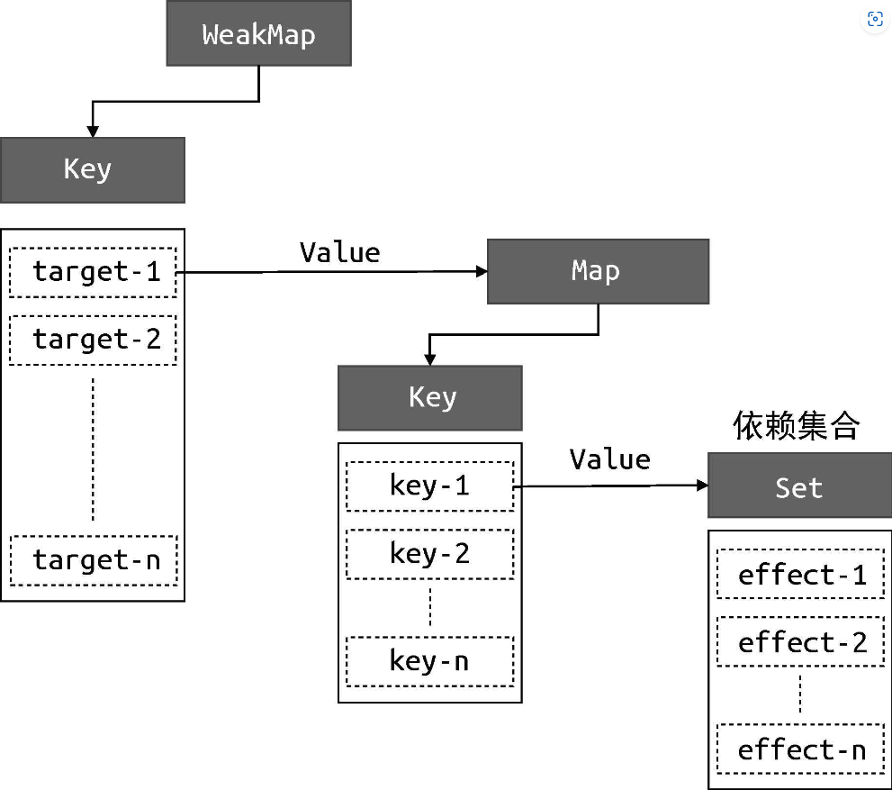

**这里使用WeakMap是因为WeakMap 对 key 是弱引用，不影响垃圾回收器的工作**

### 4.4 分支切换与cleanup

所谓分支切换是指如下场景：

```javascript
const data = {
  ok: true,
  text: 'hello world',
};
const obj = new Proxy(data, { /* ... */ });
effect(function effectFn() {
	document.body.innerText = obj.ok? obj.text : 'not';
});
```

*obj.ok的初始值为true，所以会读取obj.text，从而建立依赖集合，但当obj.ok变为false时，此时obj.text仍在依赖集合中，如果修改obj.text的值，尽管此时不依赖于它（obj.ok为false，document.body.innerText的值为'not'），仍会触发副作用函数的执行*

**要解决这个问题，每次副作用函数执行时，都要先把它从所有与之关联的依赖集合中删除，要将一个副作用函数从所有与之关联的依赖集合中移除，就需要明确知道哪些依赖集合中包含它**

```javascript
let activeEffect;
function effect(fn) {
	const effectFn = () => {
  	activeEffect = effectFn;
    fn();
  }

  effectFn.deps = [];
  effectFn();
}

function track(target, key) {
  if (!activeEffect) return target[key];
  let depsMap = bucket.get(target);
  if (!depsMap) {
    bucket.set(target, (depsMap = new Map()));
  }
  let deps = depsMap.get(key);
  if (!deps) {
    depsMap.set(key, (deps = new Set()));
  }
  deps.add(activeEffect);
  // 新增，建立了映射关系
  activeEffect.deps.push(deps)
}
```

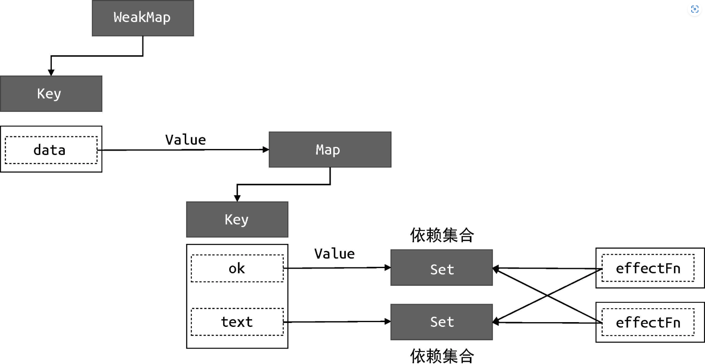

建立联系之后，后续在副作用函数执行时，先进行清除操作，再重新添加

```javascript
let activeEffect;
function effect(fn) {
	const effectFn = () => {
    cleanup(effectFn);
  	activeEffect = effectFn;
    fn();
  }

  effectFn.deps = [];
  effectFn();
}

function cleanup(effectFn) {
  for (let i = 0; i < effectFn.deps.length; i++) {
    // deps是个Set
    const deps = effectFn.deps[i];
    // 移除关联关系
    deps.delete(effectFn);
  }
  effectFn.deps.length = 0;
}

function trigger(target, key) {
  const depsMap = bucket.get(target);
  if (!depsMap) return;
  const effects = depsMap.get(key);
  // 新增这句
  const effectsToRun = new Set(effects)
  effectsToRun.forEach(effectFn => effectFn());
  // 注释这句，不会fn执行时，先是clean掉，然后又会被添加新到effects中，造成死循环
  // effects && effects.forEach(fn => fn());
}
```

### 4.5 嵌套的effect与effect栈

因为activeEffect作为一个全局变量，当effect进行嵌套调用时，activeEffect会被内层的effect执行时所覆盖，并且在内层effect执行完之后不会还原

```javascript
let activeEffect;
// 新增，effect栈
const effectStack = [];

function effect(fn) {
	const effectFn = () => {
    cleanup(effectFn);
  	activeEffect = effectFn;
    // 新增，在副作用函数执行前，将其入栈
    effectStack.push(effectFn);
    fn();
    // 新增，副作用函数执行完毕后，出栈，并还原activeEffect
    effectStack.pop();
    activeEffect = effectStack[effectStack.length - 1];
  }

  effectFn.deps = [];
  effectFn();
}
```

### 4.6 避免无限递归循环

为了解决在trigger时触发了读取操作即track操作，导致栈溢出

```javascript
function trigger(target, key) {
  const depsMap = bucket.get(target);
  if (!depsMap) return;
  const effects = depsMap.get(key);
  const effectsToRun = new Set(effects)
  // 新增判断
  effects && effects.forEach(effectFn => {
    if (effectFn !== activeEffect) {
      effectsToRun.add(effectFn);
    }
  })
  effectsToRun.forEach(effectFn => effectFn());
}
```

### 4.7 调试执行

> 所谓可调度，指的是当 trigger 动作触发副作用函数重新执行时，有能力决定副作用函数执行的时机、次数以及方式

```javascript
// 增加了第二个参数，options配置项，其中scheduler是一个函数，即调度器
function effect(fn, options = {}) {
	const effectFn = () => {
    cleanup(effectFn);
  	activeEffect = effectFn;
    effectStack.push(effectFn);
    fn();
    effectStack.pop();
    activeEffect = effectStack[effectStack.length - 1];
  }
  // 新增，先把options保存到函数本身
  effectFn.options = options;
  effectFn.deps = [];
  effectFn();
}

function trigger(target, key) {
  const depsMap = bucket.get(target);
  if (!depsMap) return;
  const effects = depsMap.get(key);
  const effectsToRun = new Set(effects)
  effects && effects.forEach(effectFn => {
    if (effectFn !== activeEffect) {
      effectsToRun.add(effectFn);
    }
  });
  // 修改，增加调试器的逻辑
  effectsToRun.forEach(effectFn => {
    if (effectFn.options.scheduler) {
      effectFn.options.scheduler(effectFn);
    } else {
      effectFn();
    }
  });
}
```

这样就可以实现一个异步任务的调度器：

```javascript
const jobQueue = new Set();
const p = Promise.resolve();

let isFlushing = false;
function flushJob() {
  if (isFlushing) return;
  isFlushing = true;
  p.then(() => {
    jobQueue.forEach(job => job());
  }).finally(() => {
    isFlushing = false;
  });
}

effect(() => {
  console.log(obj.foo);
}, {
	scheduler(fn) {
    jobQueue.add(fn);
    flushJob();
  }
});

// 执行两次，实际只打印一条
obj.foo++;
obj.foo++;
```

### 4.8 计算属性computed与lazy

#### 1. lazy

```javascript
function effect(fn, options = {}) {
	const effectFn = () => {
    cleanup(effectFn);
  	activeEffect = effectFn;
    effectStack.push(effectFn);
    // 新增，将fn的执行结果存到res中
    const res = fn();
    effectStack.pop();
    activeEffect = effectStack[effectStack.length - 1];
		// 新增，将res作为effectFn的返回值
    return res;
  }
  effectFn.options = options;
  effectFn.deps = [];
  // 新增，只有非lazy的时候才执行
  if (!options.lazy) {
    effectFn();
  }
  // 新增，将副作用函数作为返回值返回
  return effectFn;
}
```

*传递给 effect 函数的参数 fn 才是真正的副作用函数，而 effectFn 是我们包装后的副作用函数*

#### 2. computed

```javascript
function computed(getter) {
	// 用来缓存上一次计算的值
  let value;
  // 标识是否要重新计算值
  let dirty = true;

  const effectFn = effect(getter, {
    lazy: true,
    // 调度器，getter依赖的值发生变化时，调度器会被执行，从而重置dirty标记
    scheduler() {
      if (!dirty) {
	      dirty = true;
        // 当计算属性依赖的响应式数据变化时，手动trigger触发响应
        trigger(obj, 'value');
      }
    },
  });

  const obj = {
  	get value() {
      if (dirty) {
        value = effectFn();
        dirty = false;
      }
      // 读取value时，手动track来进行跟踪
      track(obj, 'value');
      return value;
    }
  }

  return obj;
}
```

### 4.9 watch的实现原理

> 所谓 watch，其本质就是观测一个响应式数据，当数据发生变化时通知并执行相应的回调函数
>
> 实际上，watch 的实现本质上就是**利用了 effect 以及 options.scheduler 选项**

```javascript
function watch(source, cb) {
  let getter;
  if (typeof source === 'function') {
    getter = source;
  } else {
    getter = () => traverse(source);
  }
  // 定义旧值与新值
  let oldValue, newValue;
  // 开启lazy，并把返回值存储到effectFn中
  const effectFn = effect(
    // 调用traverse递归地读取，建立依赖集合
  	() => getter(),
    {
      lazy: true,
      scheduler() {
        newValue = effectFn();
        // 当数据变化时，调用回调函数cb
        cb(newValue, oldValue);
        oldValue = newValue;
      }
    }
  );
  // 手动调用副作用函数，获取旧值
  oldValue = effectFn();
}

function traverse(value, seen = new Set()) {
  // 如果是原始值或已经被读取过，则直接返回
  if (typeof value !== 'object' || value === null || seen.has(value)) return;
  seen.add(value);
  for (const k in value) {
  	// 递归读取
    traverse(value[k], seen);
  }

  return value;
}
```

### 4.10 立即执行的watch与回调执行时机

watch 的两个特性：

1. 立即执行的回调函数
2. 回调函数的执行时机

#### 1. 立即执行：immediate

```javascript
function watch(source, cb) {
  let getter;
  if (typeof source === 'function') {
    getter = source;
  } else {
    getter = () => traverse(source);
  }

  let oldValue, newValue;
  // 将scheduler封装成独立的job函数
  const job = () => {
  	newValue = effectFn();
    cb(newValue, oldValue);
    oldValue = newValue;
  }

  const effectFn = effect(
  	() => getter(),
    {
      lazy: true,
      scheduler: job,
    }
  );

  if (options.immediate) {
  	// 如果immediate为true，则立即执行job
    job();
  } else {
    oldValue = effectFn();
  }
}
```

#### 2. 执行时机：flush

flush为`post`时代表调试函数需要将副作用函数放到一个微任务队列中并等待DOM更新结束后再执行：

```javascript
function watch(source, cb) {
  let getter;
  if (typeof source === 'function') {
    getter = source;
  } else {
    getter = () => traverse(source);
  }

  let oldValue, newValue;
  const job = () => {
  	newValue = effectFn();
    cb(newValue, oldValue);
    oldValue = newValue;
  }

  const effectFn = effect(
  	() => getter(),
    {
      lazy: true,
      scheduler: () => {
        if (options.flush === 'post') {
          // 如果flush这post，则通过Promise将job放到微任务队列中去执行
          const p = Promise.resolve();
          p.then(job);
        } else {
          // 这种同步执行，即'sync'
        	job();
        }
      }
    }
  );

  if (options.immediate) {
    job();
  } else {
    oldValue = effectFn();
  }
}
```

flush为`pre`的情况暂时还没办法模拟，这块涉及组件的更新时机，其中 'pre' 和 'post' 原本的语义指的就是组件更新前和更新后

### 4.11 过期的副作用

原理：watch 内部每次检测到变更后，在副作用函数重新执行之前，会先调用我们通过 onInvalidate 函数注册的过期回调

```javascript
function watch(source, cb) {
  let getter;
  if (typeof source === 'function') {
    getter = source;
  } else {
    getter = () => traverse(source);
  }

  let oldValue, newValue;
	// 用来存储用户注册的过期回调，以便在下次执行前进行调用
  let cleanup;
  function onInvalidate(fn) {
    cleanup = fn;
  }

  const job = () => {
  	newValue = effectFn();
    // 在调用cb之前，先调用过期回调
    if (cleanup) {
      cleanup();
    }
    // 将onInvalidate作为参数抛给用户
    cb(newValue, oldValue, onInvalidate);
    oldValue = newValue;
  }

  const effectFn = effect(
  	() => getter(),
    {
      lazy: true,
      scheduler: () => {
        if (options.flush === 'post') {
          // 如果flush这post，则通过Promise将job放到微任务队列中去执行
          const p = Promise.resolve();
          p.then(job);
        } else {
          // 这种同步执行，即'sync'
        	job();
        }
      }
    }
  );

  if (options.immediate) {
    job();
  } else {
    oldValue = effectFn();
  }
}
```

## 第5章 非原始值的响应式方案

### 5.1 理解Proxy和Reflect

> 使用 Proxy 可以创建一个代理对象。它能够实现对其他对象的代理，这里的关键词是其他对象，也就是说，Proxy 只能代理对象，无法代理非对象值，例如字符串、布尔值等
>
> 所谓代理，指的是对一个对象基本语义的代理。它允许我们拦截并重新定义对一个对象的基本操作
>
> 实际上Reflect.get 函数还能接收**第三个参数**，即指定接收者 receiver，你**可以把它理解为函数调用过程中的 this**
>
> ```javascript
> 01 const obj = { foo: 1 }
> 02
> 03 // 直接读取
> 04 console.log(obj.foo) // 1
> 05 // 使用 Reflect.get 读取
> 06 console.log(Reflect.get(obj, 'foo')) // 1
> ```

**下面的这段代码会有什么问题呢？**

```javascript
const obj = {
  foo: 1,
  get bar() {
    // 注意这里，这里的this指向谁
    return this.foo;
};

const p = new Proxy(obj, {
  get(target, key) {
    track(target, key);
    // 注意，这里我们没有使用 Reflect.get 完成读取
    return target[key];
  },
  set(target, key, newVal) {
    // 这里同样没有使用 Reflect.set 完成设置
    target[key] = newVal;
    trigger(target, key);
  },
});

effect(() => {
	console.log(p.bar);
})
```

当执行`p.foo++`时并不会触发副作用函数的执行，因为此时的执行过程如下：

1. effect注册的函数执行时，读取`p.bar`
2. Proxy的get方法，track时target为obj，key为'bar'，即建立了副作用与obj.bar的关联
3. 随后执行`target[key]`，即obj.bar，进入到obj的getter，此时访问`this.foo`，并且此时的this指向的是obj，所以**obj.foo的访问并不会触发track**

但如果此处进行修改：

```javascript
const p = new Proxy(obj, {
  get(target, key, receiver) {
    track(target, key);
    // 替换为Reflect.get，并使用第三个参数，receiver指向的是p
    return Reflect.get(target, key, receiver);
  },
	// ...
});
```

此时，在上面的步骤3中，this就指向了p，即访问的是`p.foo`，于是又会走到track，并建立依赖集合，后续执行`p.foo++`时才会触发副作用函数的执行

### 5.2 JavaScript对象及Proxy的工作原理

> 根据ECMAScript 规范，在 JavaScript 中有两种对象，其中一种叫作常规对象（ordinary object），另一种叫作异质对象（exotic object）
>
> 在 JavaScript 中，对象的实际语义是由对象的内部方法（internal method）指定的。所谓内部方法，指的是当我们对一个对象进行操作时在引擎内部调用的方法，这些方法对于 JavaScript 使用者来说是不可见的

对象必要的内部方法：

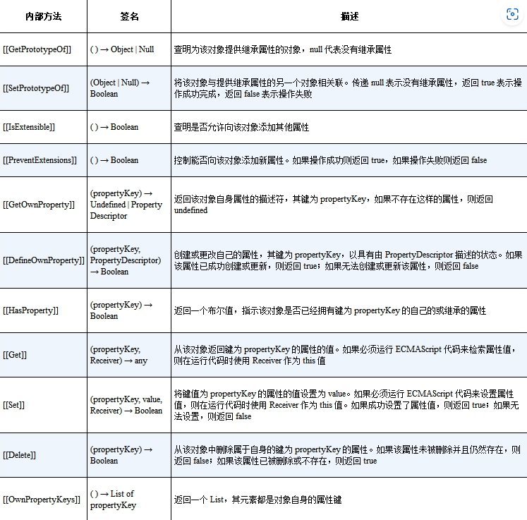

额外的必要内部方法：

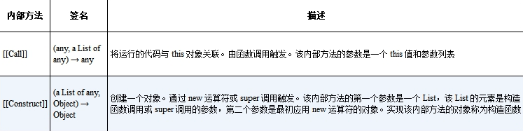

> 如果在创建代理对象时没有指定对应的拦截函数，例如没有指定 get() 拦截函数，那么当我们通过代理对象访问属性值时，代理对象的内部方法 [[Get]] 会调用原始对象的内部方法 [[Get]] 来获取属性值，这其实就是代理透明性质
>
> 创建代理对象时指定的拦截函数，实际上是用来自定义代理对象本身的内部方法和行为的，而不是用来指定被代理对象的内部方法和行为的

Proxy对象部署的所有内部方法

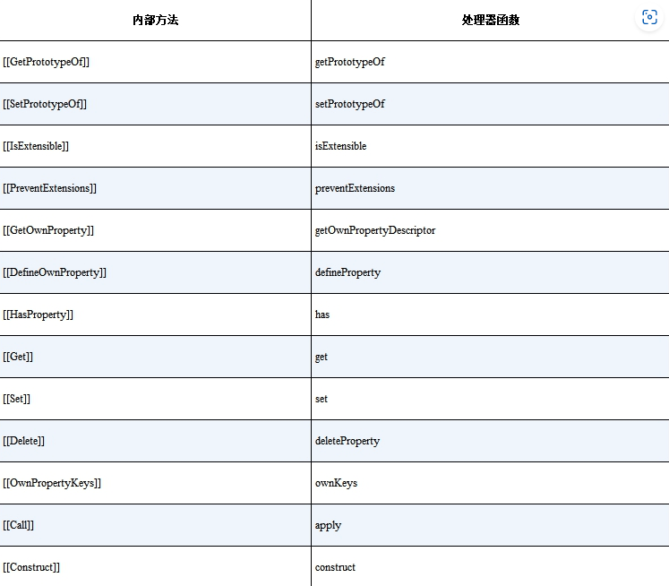

### 5.3 如何代理Object

一个普通对象的操作：

- 属性访问：obj.foo

  Proxy中的get方法即可拦截读取操作

- 判断对象或原型上是否存在给定的key：key in obj

  根据ECMA-262规范，通过对象的内部方法[[HasProperty]]可以拦截，对应Proxy中的has方法

- 使用for...in循环遍历对象：for (const key in obj) { ... }

  根据ECMA-262规范，通过Proxy中的ownKeys方法可以拦截，但此方法只传递了对象，并没有key，所以使用特定的key来代替，代码如下：

  ```javascript
  const obj = { foo: 1};
  const ITERATE_KEY = Symbol();

  const p = new Proxy(obj, {
    ownKeys(target) {
      track(target, ITERATE_KEY);
      return Reflect.ownKeys(target);
    },
    set(target, key, newVal, receiver) {
      // 如果属性不存在，则操作类型为新增属性，会影响for...in的执行，否则为修改属性，不影响for...in
      const type = Object.prototype.hasOwnProperty.call(target, key) ? 'SET' : 'ADD';
      const res = Reflect.set(target, key, newVal, receiver);
      // 传入type
      trigger(target, key, type);
      return res;
    }
  });

  function trigger(target, key, type) {
    const depsMap = bucket.get(target);
    if (!depsMap) return;
    // 取得与key关联的副作用函数
    const effects = depsMap.get(key);

    const effectsToRun = new Set();
    effects && effects.forEach(effectFn => {
      if (effectFn !== activeEffect) {
        effectsToRun.add(effectFn);
      }
    });
    // 只有操作类型为'ADD'时才触发ITERATE_KEY
    if (type === 'ADD') {
      // 取得与ITERATE_KEY相关联的副作用函数
    	const iterateEffects = depsMap.get(ITERATE_KEY);
      // 将与ITERATE_KEY关联的副作用函数也添加到effectsToRun
    	iterateEffects && iterateEffects.forEach(effectFn => {
      	if (effectFn !== activeEffect) {
        	effectsToRun.add(effectFn);
      	}
    	});
    }

    effectsToRun.forEach(effectFn => {
      if (effectFn.options.scheduler) {
        effectFn.options.scheduler(effectFn);
      } else {
        effectFn();
      }
    });
  }

  effect(() => {
    for (const key in p) {
      console.log(key);
    }
  })
  ```

- 删除属性

  根据ECMA-262规范，delete操作符触发对象内部的[[Delete]]方法，对应Proxy的deleteProperty方法

  ```javascript
  const p = new Proxy(obj, {
    deleteProperty(target, key) {
      // 检查被删除的属性是否是对象自己的属性
      const hadKey = Object.prototype.hasOwnProperty.call(target, key);
      // 使用Reflect.deleteProperty完成属性的删除
      const res = Reflect.deleteProperty(target, key);
      if (res && hadKey) {
      	// 只有当删除的属性是对象自己的属性并且成功删除时，才触发更新
        trigger(target, key, 'DELETE');
      }
      return res;
    }
  });
  
  function trigger(target, key, type) {
    const depsMap = bucket.get(target);
    if (!depsMap) return;
    // 取得与key关联的副作用函数
    const effects = depsMap.get(key);
  
    const effectsToRun = new Set();
    effects && effects.forEach(effectFn => {
      if (effectFn !== activeEffect) {
        effectsToRun.add(effectFn);
      }
    });
    // 只有操作类型为'ADD'或'DELETE'都会影响for...in操作，都需要触发ITERATE_KEY相关的副作用重新执行
    if (type === 'ADD' || type === 'DELETE') {
      // 取得与ITERATE_KEY相关联的副作用函数
    	const iterateEffects = depsMap.get(ITERATE_KEY);
      // 将与ITERATE_KEY关联的副作用函数也添加到effectsToRun
    	iterateEffects && iterateEffects.forEach(effectFn => {
      	if (effectFn !== activeEffect) {
        	effectsToRun.add(effectFn);
      	}
    	});
    }
  
    effectsToRun.forEach(effectFn => {
      if (effectFn.options.scheduler) {
        effectFn.options.scheduler(effectFn);
      } else {
        effectFn();
      }
    });
  }
  ```

### 5.4 合理地触发响应

1. 当值没有发生变化时，不需要触发响应

   ```javascript
   const obj = {foo: 1};
   const p = reactive(obj);

   function reactive(obj) {
     return new Proxy(obj, {
     	set(target, key, newVal, receiver) {
       	// 先取旧值
       	const oldVal = target[key];
       	const type =  Object.prototype.hasOwnProperty.call(target, key) ? 'SET' : 'ADD';
       	const res = Reflect.set(target, key, newVal, receiver);
       	// 比较新旧值，只要不全等，并且不都是NaN时才触发响应，NaN === NaN的值是false
       	if (oldVal !== newVal && (oldVal === oldVal || newVal === newVal)) {
         	trigger(target, key, type);
       	}
       	return res;
     	}
   	});
   }
   ```

2. 考虑从原型上继承属性的情况

   ```javascript
   const obj = {};
   const proto = { bar: 1 };
   const child = reactive(obj);
   const parent = reactive(proto);
   
   Object.setPrototypeOf(child, parent);
   
   effect(() => {
     // 1. 触发child代理对象的get拦截函数，child上不存在bar属性
     // 2. 在child的原型parent上找bar属性，而parent也是响应式数据
     // 所以child.bar与parent.bar都与副作用函数建立了响应联系
     console.log(child.bar); // 1
   })
   
   // 修改 child.bar的值，触发了set拦截函数，调用child的内部方法[[Set]]
   // child上没有bar属性，会取其原型，并调用原型的[[Set]]方法，而parent是响应式数据，所以又会触发它的set拦截函数
   child.bar = 2; // 会导致副作用函数重新执行两次
   ```

   对比两次代理对象的set方法，可以发现`receiver`始终指向的是`child`，而`target`则有所不同，据此可以判断`receiver`是不是`target`的代理对象来解决此问题

   ```javascript
   function reactive(obj) {
     return new Proxy(obj, {
       get(target, key, receiver) {
         // 代理对象可以通过raw属性访问原始数据
         if (key === 'raw') {
           return target;
         }
         tract(target, key);
         return Reflect.get(target, key, receiver);
       },
       set(target, key, newVal, receiver) {
         const oldVal = target[key];
         const type = Object.prototype.hasOwnProperty.call(target, key) ? 'SET' : 'ADD';
         const res = Reflect.set(target, key, newVal, receiver);
         // 判断target是否与receiver.raw相等，从而判断receiver是否是target的代理对象
         if (target === receiver.raw) {
           // oldVal === oldVal与newVal === newVal是为了判断新旧值不为NaN，见前文
           if (oldVal !== newVal && (oldVal === oldVal || newVal === newVal)) {
             trigger(target, key, type);
           }
         }
         return res;
       }
     });
   }
   ```

### 5.5 浅响应与深响应

即reactive与shallowReactive的区别，PS：目前的实现都为浅响应

```javascript
function reactive(obj) {
  return new Proxy(obj) {
    get(target, key, receiver) {
      if (key === 'raw') {
        return target;
      }
      track(target, key);
      const res = Reflect.get(target, key, receiver);
      // 对原始值结果进行判断并包装成响应式数据返回
      if (typeof res === 'object' && res !== null) {
        return reactive(res);
      }
      return res;
    },
    // 其它省略
  }
}
```

但又并不是所有场景下都需要深响应，所以催生了`shallowReactive`，只有对象的第一层属性是响应的

```javascript
function createReactive(obj, isShallow = false) {
  return new Proxy(obj, {
    get(target, key, receiver) {
      if (key === 'raw') {
        return target;
      }
      const res = Reflect.get(target, key, receiver);
      track(target, key);

      // 新增，判断是否是浅响应
      if (isShallow) {
        return res;
      }

      if (typeof res === 'object' && res !== null) {
        return reactive(res);
      }

      return res;
    }
  });
}

function reactive(obj) {
  return createReactive(obj);
}

function shallowReactive(obj) {
  return createReactive(obj, true);
}
```

### 5.6 只读和浅只读

```javascript
function createReactive(obj, isShallow = false, isReadonly = false) {
  return new Proxy(obj, {
    // 拦截读取操作，只读时不需要建立响应联系
    get(target, key, receiver) {
      if (key === 'raw') {
        return target;
      }
      // 非只读的时候才需要建立响应联系
      if (!isReadonly) {
        track(target, key);
      }
      const res = Reflect.get(target, key, receiver);

     	if (isShallow) {
      	return res;
      }

      if (typeof res === 'object' && res !== null) {
        return isReadonly? readonly(res) : reactive(res);
      }

      return res;
    },
    // 拦截设置属性值的操作
    set(target, key, newVal, receiver) {
      // 只读时打印告警消息
      if (isReadonly) {
        console.warn(`属性${key}是只读的`);
        return true;
      }
      const oldVal = target[key];
      const type = Object.prototype.hasOwnProperty.call(target, key) ? 'SET' : 'ADD';
      const res = Reflect.set(target, key, newVal, receiver);

      if (target === receiver.raw) {
        if (oldVal !== newVal) && (oldVal === oldVal || newVal === newVal) {
          trigger(target, key, type);
        }
      }
      return res;
    },
    // 拦截删除属性的操作
    deleteProperty(target, key) {
      if (isReadonly) {
        console.warn(`属性${key}是只读的`);
        return true;
      }
      const hadKey = Object.prototype.hasOwnProperty.call(target, key);
      const res = Reflect.deleteProperty(target, key);

      if (res && hadKey) {
        trigger(target, key, 'DELETE');
      }

      return res;
    }
  });
}

function readonly(obj) {
  return createReactive(obj, false, true);
}

function shallowReadonly(obj) {
  return createReactive(obj, true, true);
}
```

### 5.7 代理数组

数组是一个**异质对象**，数组对象除了 [[DefineOwnProperty]] 这个内部方法之外，其他内部方法的逻辑都与常规对象相同

#### 5.7.1 数组的索引与length

根据规范，当通过索引设置元素值时，如果索引值大于等于数组当前的长度，会更新数组的length属性，即隐式的修改length属性值

```javascript
function createReactive(obj, isShallow = false, isReadonly = false) {
  return new Proxy(obj, {
    set(target, key, newVal, receiver) {
      if (isReadonly) {
        console.warn(`属性${key}是只读的`);
        return true;
      }
      const oldVal = target[key];
      const type = Array.isArray(target)
      	// 如果代理目标是数组，则检测被设置的索引值是否小于数组的length，如果是则视作SET操作，否则视作ADD操作
      	? Number(key) < target.length ? 'SET' : 'ADD'
        : Object.prototype.hasOwnProperty.call(target, key) ? 'SET' : 'ADD';
      const res = Reflect.set(target, key, newVal, receiver);
      if (target === receiver.raw) {
        if (oldVal !== newVal && (newVal === newVal || oldVal === oldVal)) {
					// 增加第四个参数
          trigger(target, key, type， newVal);
        }
      }
      return res;
    }
  });
}

function trigger(target, key, type， newVal) {
  const depsMap = bucket.get(target);
  if (!depsMap) return;
  const effects = depsMap.get(key);

  const effectsToRun = new Set();
  effects && effects.forEach(effectFn => {
    if (effectFn !== activeEffect) {
      effectsToRun.add(effectFn);
    }
  });

  if (type === 'ADD' || type === 'DELETE') {
  	const iterateEffects = depsMap.get(ITERATE_KEY);
  	iterateEffects && iterateEffects.forEach(effectFn => {
    	if (effectFn !== activeEffect) {
      	effectsToRun.add(effectFn);
    	}
  	});
  }

  // 操作类型为ADD且目标对象是数组时，应取出并执行与length属性相关的副作用函数
  if (type === 'ADD' && Array.isArray(target)) {
    const lengthEffects = depsMap.get('length');
    lengthEffects && lengthEffects.forEach(effectFn => {
      if (effectFn !== activeEffect) {
        effectsToRun.add(effectFn);
      }
    });
  }

  if (Array.isArray(target) && key === 'length') {
    // 对于索引大于等于新的length值的元素，需要把所有相关的副作用函数取出
    depsMap.forEach((effects, key) => {
      if (key >= newVal) {
        effects.forEach(effectFn => {
          if (effectFn !== activeEffect) {
            effectsToRun.add(effectFn);
          }
        });
      }
    })
  }

  effectsToRun.forEach(effectFn => {
    if (effectFn.options.scheduler) {
      effectFn.options.scheduler(effectFn);
    } else {
      effectFn();
    }
  });
}
```

#### 5.7.2 遍历数组

无论是为数组添加新元素，还是直接修改数组的长度，本质上都是因为修改了数组的 length 属性。一旦数组的 length 属性被修改，那么 for...in 循环对数组的遍历结果就会改变

```javascript
function createReactive(obj, isShallow = false, isReadonly = false) {
  return new Proxy(obj, {
    ownKeys(target) {
      // 如果操作的目标是数组，则使用length属性作为key并建立响应联系
      track(target, Array.isArray(target) ? 'length' : ITERATE_KEY);
      return Reflect.ownKeys(target);
    }
  })
}
```

对于for...of，ES2015 为 JavaScript 定义了迭代协议（iteration protocol），它不是新的语法，而是一种协议

数组迭代器的执行会读取数组的 length 属性，如果迭代的是数组元素值，还会读取数组的索引

**数组的 values 方法的返回值实际上就是数组内建的迭代器**

```javascript
console.log(Array.prototype.values === Array.prototype[Symbol.iterator]) // true
```

为了避免发生意外的错误，以及性能上的考虑，我们**不应该在副作用函数与 Symbol.iterator 这类symbol 值之间建立响应联系**

```javascript
function createReactive(obj, isShallow = false, isReadonly = false) {
  return new Proxy(obj, {
    get(target, key, receiver) {
      console.log('get', key);
      if (key === 'raw') {
        return target;
      }

      // 新增判断，如果key的类型是symbol，则不进行追踪
      if (!isReadonly && typeof key !== 'symbol') {
        track(target, key);
      }

      const res = Reflect.get(target, key, receiver);
      if (isShallow) {
        return res;
      }

      if (typeof res === 'object' && res !== null) {
      	return isReadonly ? readonly(res) : reactive(res);
      }

      return res;
    }
  });
}
```

#### 5.7.3 数组的查找方法

下面这段代码的执行结果非预期

```javascript
const obj = {};
const arr = reactive([obj]);
console.log(arr.includes(arr[0])) // false
```

原因在于，arr是一个代理，而includes方法会通过索引来访问元素（通过this），此时的this是指向arr的，即代理，所以会被get拦截，并且get中存在如下逻辑：

```javascript
if (typeof res === 'object' && res !== null) {
  return isReadonly ? readonly(res) : reactive(res);
}
```

注意这里的`reactive(res)`会创建新的代理，导致得到的代理对象是不同的，于是得到的结果就是false，需要修改reactive函数：

```javascript
const reactiveMap = new Map();

function reactive(obj) {
  const existionProxy = reactiveMap.get(obj);
  if (existionProxy) return existionProxy;

  const proxy = createReactive(obj);
  reactiveMap.set(obj, proxy);
  return proxy;
}
```

但如下代码的结果还是非预期

```javascript
const obj = {};
const arr = reactive([obj]);
console.log(arr.includes(obj)) // false
```

因为 includes 内部的 this 指向的是代理对象 arr，并且在获取数组元素时得到的值也是代理对象，所以拿原始对象 obj 去查找肯定找不到，因此返回 false，需要重写includes方法

```javascript
const arrayInstrumentations = {};
['includes', 'indexOf', 'lastIndexOf'].forEach(method => {
  const originMethod = Array.prototype[method];
  arrayInstrumentations[method] = function(...args) {
    // this是代理对象，先在代理对象中查找，将结果存储到res中
    let res = originMethod.apply(this, args);

    // 没找到时，通过this.raw拿到原始数组，再去其中查找
    if (res === false || res === -1) {
      res = originMethod.apply(this.raw, args);
    }

    return res;
  }
}
});

function createReactive(obj, isShallow = false, isReadonly = false) {
  return new Proxy(obj, {
    get(target, key, receiver) {
      console.log('get: ', key);
      if (key === 'raw') {
        return target;
      }
      // 如果target是数组，且key存在于arrayInstrumentations上，则返回定义在arrayInstrumentations上的值
      if (Array.isArray(target) && arrayInstrumentations.hasOwnProperty(key)) {
        return Reflect.get(arrayInstrumentations, key, receiver);
      }

      if (!isReadonly && typeof key !== 'symbol') {
        track(target, key);
      }

      const res = Reflect.get(target, key, receiver);

      if (isShallow) {
        return res;
      }

      if (typeof res === 'object' && res !== null) {
        return isReadonly ? readonly(res) : reactive(res);
      }

      return res;
    }
  });
}
```

#### 5.7.4 隐式修改数组长度的原型方法

这里指的是如`push/pop/shift/unshif/splice`这种会修改数组长度的方法

```javascript
// 标记位，表示是否进行追踪，默认值为true
let shouldTrack = true;
['push', 'pop', 'shift', 'unshift', 'splice'].forEach(method => {
  const originMethod = Array.prototype[method];
  arrayInstrumentations[method] = function(...arg) {
		// 调用原始方法之前，禁止追踪
    shouldTrack = false;
    let res = originMethod.apply(this, args);
    shouldTrack = true;
    return res;
})

function track(target, key) {
  if (!activeEffect || !shouldTrack) return;
  // 省略其他代码
}
```

### 5.8 代理Set和Map

#### 5.8.1 如何代理Set和Map

对于Set，其size属性其实是一个访问器，并且它的执行过程会访问Set对象的内部方法[[SetData]]，所以当代理它并读取size属性时，需要对this的指向进行修正（因为代理对象是没有内部方法[[SetData]]的，会报错）：

```javascript
const s = new Set([1, 2, 3]);
const p = new Proxy(s, {
  get(target, key, receiver) {
    if (key === 'size') {
      return Reflect.get(target, key, target);
    }
    return Reflect.get(target, key, receiver);
  }
});

console.log(p.size) // 3
```

在调用delete方法时也存在类似的问题，只不过delete是作为方法调用的，要改变其this的指向就需要：

```javascript
const s = new Set([1, 2, 3]);
const p = new Proxy(s, {
  get(target, key, receiver) {
    if (key === 'size') {
      return Reflect.get(target, key, target);
    }
    return target[key].bind(target);
  }
});

p.delete(1);
```

#### 5.8.2 建立响应联系

响应联系需要建立在 ITERATE_KEY 与副作用函数之间，这是因为任何新增、删除操作都会影响 size 属性

```javascript
const mutableInstrumentations = {
  add(key) {
    // 此时的this仍是指向代理对象
    const target = this.raw;
    const hadKey = target.has(key);
    const res = target.add(key);
    if (!hadKey) {
      trigger(target, key, 'ADD');
    }
    return res;
  },
  delete(key) {
    const target = this.raw;
    const hadKey = target.has(key);
    const res = target.delete(key);
    if (hadKey) {
      trigger(target, key, 'DELETE');
    }
    return res;
  }
}

function createReactive(obj, isShallow = false, isReadonly = false) {
  return new Proxy(obj, {
    get(target, key, receiver) {
      if (key === 'raw') return target;
      if (key === 'size') {
        //这样当trigger的type参数为ADD的时候，就能将ITERATE_KEY相关联的副作用函数都执行一遍
        track(target, ITERATE_KEY);
        return Reflect.get(target, key, target);
      }
      
      return mutableInstrumentations[key];
    }
  })
}


```

#### 5.8.3 避免污染原始数据

对于 SET 类型和 ADD 类型的操作来说，它们最终触发的副作用函数是不同的。因为 ADD 类型的操作会对数据的 size 属性产生影响，所以任何依赖 size 属性的副作用函数都需要在 ADD 类型的操作发生时重新执行

我们把响应式数据设置到原始数据上的行为称为数据污染：首先创建了一个原始 Map 对象 m，p1 是对象 m 的代理对象，接着创建另外一个代理对象 p2，并将其作为值设置给 p1，即 `p1.set('p2', p2)`，引时如果`m.get(p2).set('foo', 1)`就会触发副作用的执行

```javascript
const mutableInstrumentations = {
  set(key, value) {
    const target = this.raw;
    const had = target.has(key);
    
    const oldValue = target.get(key);
    // 获取value的原始数据
    const rawValue = value.raw || value;
    target.set(key, rawValue);
    
    if (!had) {
      // 不存在时新增
    	trigger(target, key, 'ADD');
    } else if (oldValue !== value && (oldValue === oldValue || value === value)) {
      // 存在，并且新旧值中有一个不是NaN
      trigger(target, key, 'SET');
    }
  }
}
```

#### 5.8.4 处理forEach

遍历操作只与键值对的数量有关，因此任何会修改 Map 对象键值对数量的操作都应该触发副作用函数重新执行，例如 delete 和 add 方法，所以只需让副作用函数与ITERATE_KEY建立响应联系即可

```javascript
const mutableInstrumentations = {
  forEach(callback, thisArg) {
    // 将原始对象包装成响应式对象
    const wrap = val => typeof val === 'object' ? reactive(val) : val;
    const target = this.raw;
    track(target, ITERATE_KEY);
    target.forEach((v, k) => {
      // 将key和value包装一下，实现深响应
      callback.call(thisArg, wrap(v), wrap(k), this);
    });
  }
}

function trigger(target, key, type, newVal) {
  const depsMap = bucket.get(target);
  if (!depsMap) return;
  const effects = depsMap.get(key);
  
  const effectsToRun = new Set();
  effects && effects.forEach(effectFn => {
    if (effectFn !== activeEffect) {
      effectsToRun.add(effectFn);
    }
  });
  
  if (type === 'ADD' || type === 'DELETE' || 
      // 操作类型是SET，对象类型是Map，则SET类型也应该触发与ITERATE_KEY关联的副作用函数
      type === 'SET' && Object.prototype.toString.call(target) === '[object Map]') {
    const iterateEffects = depMaps.get(ITERATE_KEY);
    iterateEffects && iterateEffects.forEach(effectFn => {
      if (effectFn !== activeEffect) {
        effectsToRun.add(effectFn);
      }
    });
  }
  
  // 省略
  effectsToRun.forEach(effectFn => {
    if (effectFn.options.scheduler) {
      effectFn.options.scheduler(effectFn);
    } else {
      effectFn();
    }
  })
}
```

#### 5.8.5 迭代器方法

方法包括：

- entries
- keys
- values

参考forEach的实现：

```javascript
const mutableInstrumentations = {
  [Symbol.iterator]: iterationMethod,
  entries: iterationMethod,
}

function iterationMethod() {
  const target = this.raw;
  const itr = target[Symbol.iterator]();

  const wrap = val =>
    typeof val === 'object' && val !== null ? reactive(val) : val;
  track(target, ITERATE_KEY);

  return {
    // 迭代器协议
    next() {
      const { value, done } = itr.next();
      return {
        value: value ? [wrap(value[0]), wrap(value[1])] : value,
        done,
      };
    },
    // 可迭代协议
    [Symbol.iterator]() {
      return this;
    }
  };
}
```

#### 5.8.6 values 与 keys 方法

```javascript
const MAP_KEY_ITERATE_KEY = Symbol();

function keysIterationMethod() {
  // 获取原始数据对象 target
  const target = this.raw;
  // 获取原始迭代器方法
  const itr = target.keys();

  const wrap = val => (typeof val === 'object' ? reactive(val) : val);

  // 重点：调用 track 函数追踪依赖，在副作用函数与 MAP_KEY_ITERATE_KEY 之间建立响应联系
  track(target, MAP_KEY_ITERATE_KEY);

  // 将其返回
  return {
    next() {
      const { value, done } = itr.next();
      return {
        value: wrap(value),
        done,
      };
    },
    [Symbol.iterator]() {
      return this;
    },
  };
}

```

## 第6章 原始值的响应式方案

> 原始值指的是 Boolean、Number、BigInt、String、Symbol、undefined 和 null 等类型的值，在 JavaScript 中，原始值是按值传递的，而非按引用传递

## 6.1 引入ref的概念

 Proxy 的代理目标必须是非原始值，对于原始值，则要使用一个非原始值去“包裹”它，为了用户操作简便以及规范，可以封装一个函数，将包裹对象的创建工作封装在该函数中：

```javascript
function ref(val) {
  const wrapper = {
    value: val,
  }
  Object.defineProperty(wrapper, '__v_isRef', {
    value: true,
  })
  return reactive(wrapper);
}
```

### 6.2 响应丢失问题

下面就是一个响应丢失的示例：

```javascript
export default {
  setup() {
    // 响应式数据
    const obj = reactive({ foo: 1, bar: 2 });

    // 1s 后修改响应式数据的值，不会触发重新渲染
    setTimeout(() => {
      obj.foo = 0;
    });

    return {
      ...obj,
    };
  },
};

```

因为进行的了解构，所以`return { ...obj }`等价于`return { foo: 1, bar: 2}`，即返回了一个普通对象，不会在渲染函数与响应式数据之间建立响应联系的，如何解决？

```javascript
const obj = reactive({ foo: 1, bar: 2});
const newObj = {
  foo: {
    get value() {
      return obj.foo;
    }
  },
  bar: {
    get value() {
      return obj.bar;
    }
  }
}

effect(() => {
  console.log(newObj.foo.value);
})

obj.foo = 100;
```

简单的封装：

```javascript
function toRef(obj, key) {
  const wrapper = {
    get value() {
      return obj[key];
    },
    set value(val) {
      obj[key] = val;
    }
  }
  Object.defineProperty(wrapper, '__v_isRef', {
    value: true,
  })
  return wrapper;
}

const newObj = {
  foo: toRef(obj, 'foo'),
  bar: toRef(obj, 'bar')
}
```

进一步简化：

```javascript
function toRefs(obj) {
	const ret = {};
  for (const key in obj) {
    ret[key] = toRef(obj, key);
  }
  return ret;
}

const newObj = { ...toRefs(obj) }
```

### 6.3 自动脱ref

指的是对于模板中的数据访问，可以不用使用xxx.value的形式来访问

```javascript
function proxyRefs(target) {
  return new Proxy(target, {
    get(target, key, receiver) {
      const value = Reflect.get(target, key, receiver);
      return value.__v_isRef ? value.value : value;
    },
    set(target, key, newValue, receiver) {
      const value = target[key];
      if (value.__v_isRef) {
        value.value = newValue;
        return true;
      }
      return Reflect.set(target, key, newValue, receiver);
    }
  })
}

const newObj = proxyRefs({ ...toRefs(obj) });
```

> 我们在编写 Vue.js 组件时，组件中的 setup 函数所返回的数据会传递给proxyRefs 函数进行处理
>
> reactive 函数也有自动脱 ref 的能力

## 第7章 渲染器的设计

> 在 Vue.js 中，很多功能依赖渲染器来实现，例如 Transition 组件、Teleport 组件、Suspense 组件，以及template ref 和自定义指令等
>
> Vue.js 3的渲染器不仅仅包含传统的 Diff 算法，它还独创了快捷路径的更新方式，能够充分利用编译器提供的信息，大大提升了更新性能

### 7.1 渲染器与响应系统的结合

使用 @vue/reactivity 包提供的响应式 API：`<script src="https://unpkg.com/@vue/reactivity@3.0.5/dist/reactivity.global.js"></script>`

其暴露出来的全局API叫`VueReactivity`

```javascript
const { effect, ref } = VueReactivity;

function renderer(domString, container) {
  container.innerHtml = domString;
}

const count = ref(1);
effect(() => {
  renderer(`<h1>${count.value}</h1>`, document.getElementById('app'));
});

count.value++;
```


### 7.2 渲染器的基本概念

```javascript
function createRenderer() {
  function render(vnode, container) {
    if (vnode) {
      // 新节点存在，则与旧节点一起进行patch（打补丁）
      patch(container._vnode, vnode, container);
    } else {
      // 新节点不存在，旧节点存在，说明是卸载操作
      if (container._vnode) {
        container.innerHTML = '';
      }
    }
    // 保存旧节点，在下次渲染时使用
    container._vnode = vnode;
  }
  
  return {
    render
  }
}
```


### 7.3 自定义渲染器

```javascript
function createRenderer(options) {
  // 通过 options 得到操作 DOM 的 API
  const { createElement, insert, setElementText } = options;

  // 在这个作用域内定义的函数都可以访问那些 API
  function mountElement(vnode, container) {
    function mountElement(vnode, container) {
      // 调用 createElement 函数创建元素
      const el = createElement(vnode.type);
      if (typeof vnode.children === 'string') {
        // 调用 setElementText 设置元素的文本节点
        setElementText(el, vnode.children);
      }
      // 调用 insert 函数将元素插入到容器内
      insert(el, container);
    }
  }

  function patch(n1, n2, container) {
    // ...
  }

  function render(vnode, container) {
    // ...
  }

  return {
    render,
  };
}

```

## 第8章 挂载与更新

### 8.1 挂载子节点和元素的属性

```javascript
function mountElement(vnode, container) {
  const el = createElement(vnode.type);
  if (typeof vnode.children === 'string') {
    setElementText(el, vnode.children);
  } else if (Array.isArray(vnode.children)) {
    vnode.children.forEach(child => {
      patch(null, child, el);
    })
  }
  
  // 属性的处理
  if (vnode.props) {
    for (const key in vnode.props) {
      // 暂时，无论是使用setAttribute还是直接操作DOM都存在问题（el[key] = vnode.props[key]）
    	el.setAttribute(key, vnode.props[key]);
    }
  }
  
  insert(el, container);
}
```

### 8.2 HTML Attributes 与 DOM Properties

> HTML Attributes 指的就是定义在 HTML 标签上的属性，当浏览器解析这段 HTML 代码后，会创建一个与之相符的 DOM 元素对象，这个 DOM 对象会包含很多属性（properties），这些属性就是所谓的 DOM Properties
>
> 很多 HTML Attributes 在 DOM 对象上有与之同名的 DOM Properties，但 DOM Properties 与 HTML Attributes 的名字不总是一模一样的
>
> 并不是所有HTML Attributes 都有与之对应的 DOM Properties，也不是所有 DOM Properties 都有与之对应的 HTML Attributes
>
> HTML Attributes 与DOM Properties 具有相同名称（即 id）的属性看作直接映射。但并不是所有HTML Attributes 与 DOM Properties 之间都是直接映射的关系
>
> 如果你通过HTML Attributes 提供的默认值不合法，那么浏览器会使用内建的合法值作为对应DOM Properties 的默认值

**HTML Attributes 的作用是设置与之对应的DOM Properties 的初始值**

### 8.3 正确地设置元素属性

使用setAttribute 函数设置的值总是会被字符串化，所以下面两句是等价的，都会将元素的状态置为禁用

```javascript
el.setAttribute('disabled', false);
// 等价于
el.setAttribute('disabled', 'false'); // 不符合预期
```

而对于`<button disabled>Button</button>`，对应的vnode是：`const button = { type: 'button', props: { disabled: ''}}`，如果是通过直接设置DOM Properties来将vnode转换成DOM时，又会出现：

```javascript
el.disabled = '';
// 等价于
el.disabled = false; // 不符合预期
```

直接使用setAttribute或设置DOM Properties都存在问题，**只能做特殊处理，即优先设置元素的 DOM Properties，但当值为空字符串时，要手动将值矫正为 true**

```javascript
function shouldSetAsProps(el, key, value) {
  // 特殊处理
  if (key === 'form' && el.tagName === 'INPUT') return false;
  return key in el;
}
function mountElement(vnode, container) {
  // 在 vnode 与真实 DOM 元素之间就建立了联系
  const el = vnode.el = createElement(vnode.type);
  // 省略 children 的处理
  
  if (vnode.props) {
    for (const key in vnode.props) {
      const value = vnode.props[key];
      // 使用shouldSetAsProps函数来判断是否应该作为DOM Properties设置
      if (shouldSetAsProps(el, key, value)) {
        // 获取该 DOM Properties 的类型
        const type = typeof el[key];
        // 如果布尔类型，且value为空字符串，则将值矫正为true
        if (type === 'boolean' && value === '') {
          el[key] = true;
        } else {
          el[key] = value;
        }
      }
      // 如果要设置的属性没有对应的DOM Properties，则使用setAttribute方法设置属性
      else {
        el.setAttribute(key, vnode.props[key]);
      }
    }
  }
  
  insert(el, container);
}
```

再进行一些封装：

```javascript
const renderer = createRenderer({
  createElement(tag) {
    return document.createElement(tag);
  },
  setElementText(el, text) {
    el.textContent = text;
  },
  insert(el, parent, anchor = null) {
    parent.insertBefore(el, anchor);
  },
  patchProps(el, key, preValue, nextValue) {
    if (shouldSetAsProps(el, key, nextValue)) {
      const type = typeof el[key];
      if (type === 'boolean' && nextValue === '') {
        el[key] = true;
      } else {
        el[key] = nextValue;
      }
    } else {
      el.setAttribute(key, nextValue);
    }
  }
});

function mountElement(vnode, container) {
  const el = createElement(vnode.type);
  if (typeof vnode.children === 'string') {
    setElementText(el, vnode.children);
  } else if (Array.isArray(vnode.children)) {
    vnode.children.forEach(child => {
      patch(null, child, el);
    })
  }
  
  if (vnode.props) {
    for (const key in vnode.props) {
      patchProps(el, key, null, vnode.props[key]);
    }
  }
  
  insert(el, container);
}
```

### 8.4 class处理

vue对class做了增强处理，支持字符串、对象、数组（元素可以是字符串和对象的混合），所以需要进行归整处理

设置DOM元素的样式方法中（setAttribute\className\classList），className的性能最优

```javascript
const renderer = createRenderer({
  // 省略其它选项
  patchProps(el, key, preValue, nextValue) {
    if (key === 'class') {
      el.className = nextValue || '';
    } else if (shouldSetAsProps(el, key, nextValue)) {
      const type = typeof el[key];
      if (type === 'boolean' && nextValue === '') {
        el[key] = true;
      } else {
        el[key] = nextValue;
      }
    } else {
    	el.setAttribute(key, nextValue);
    }
  }
});
```

### 8.5 卸载操作

正确的卸载方式：根据 vnode 对象获取与其相关联的真实 DOM 元素，然后使用原生DOM 操作方法将该 DOM 元素移除

```javascript
function unmount(vnode) {
  const parent = vnode.el.parentNode;
  if (parent) {
    parent.removeChild(vnode.el);
  }
}

function render(vnode, container) {
  if (vnode) {
    patch(container._vnode, vnode, container);
  } else {
    if (container._vnode) {
      unmount(container._vnode);
    }
  }
  container._vnode = vnode;
}
```

### 8.6 区分vnode的类型

patch函数中的新旧vnode节点，在打补丁之前，需要保证新旧vnode所描述的内型相同，对于类型不同的vnode，应该先卸载旧的节点，再将新的节点挂载到容器

一个 vnode 可以用来描述普通标签，也可以用来描述组件，还可以用来描述 Fragment 等。对于不同类型的 vnode，我们需要提供不同的挂载或打补丁的处理方式——**vnode.type是字符串，表示普通标签，如果是对象，则表示组件**

### 8.7 事件的处理

vnode.props 对象中，凡是以字符串 on 开头的属性都视作事件，然后通过addEventListener来绑定事件

```javascript
function patchProps(el, key, prevValue, nextValue) {
  if (/^on/.test(key)) {
    const invokers = el._vei || (el._vei = {});
    let invoker = invokers[key];
    const name = key.slice(2).toLowerCase();
    if (nextValue) {
      if (!invoker) {
        // 事件占位在执行时实际上是执行invoker.value
        invoker = el._vei[k] = (e) => {
          if (Array.isArray(invoker.value)) {
            invoker.value.forEach(fn => fn(e));
          } else {
            invoker.value(e);
          }
        }
        invoker.value = nextValue;
        el.addEventListener(name, invoker);
      } else {
        // 通过这种方式避免每次都要先移除事件再添加事件
        invoker.value = nextValue;
      }
    } else if (invoker) {
      el.removeEventListener(name, invoker);
    }
  } else if (key === 'class') {
    // 省略
  } else if (shouldSetAsProps(el, key, nextValue)) {
    // 省略
  } else {
    // 省略
  }
}
```

### 8.8 事件冒泡与更新时机问题

```javascript
const { effect, ref } = VueReactivity;

const bol = ref(false);

effect(() => {
  // 创建 vnode
  const vnode = {
    type: 'div',
    props: bol.value
      ? {
          onClick: () => {
            alert('父元素 clicked');
          },
        }
      : {},
    children: [
      {
        type: 'p',
        props: {
          onClick: () => {
            bol.value = true;
          },
        },
        children: 'text',
      },
    ],
  };
  // 渲染 vnode
  renderer.render(vnode, document.querySelector('#app'));
});

```

它的执行流程是如下图所示（不符合预期）：

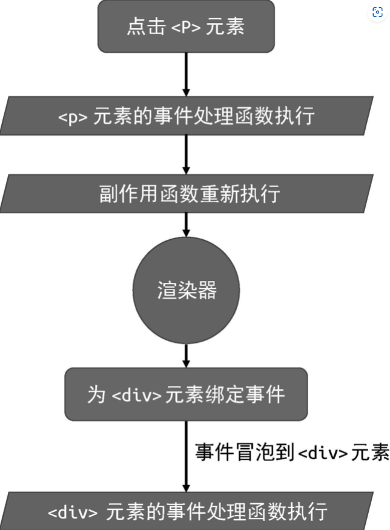


正确的顺序应该是事件先冒泡，但此次还没绑定事件，所以不执行，但**渲染的微任务会穿插在由事件冒泡触发的多个事件处理函数之间被执行**

解决方案：**屏蔽所有绑定时间晚于事件触发时间的事件处理函数的执行**

```javascript
patchProps(el, key, prevValue, nextValue) {
  if (/^on/.test(key)) {
    const invokers = el._vei || (el._vei = {});
    let const invoker = invokers[key];
    const name = key.slice(2).toLowerCase();
    if (nextValue) {
      if (!invoker) {
        invoker = el._vei[key] = e => {
          // 通过事件对象的 e.timeStamp 获取事件发生的时间，早于处理函数绑定的时间，则不执行
          if (e.timeStamp < invoker.attached) return;
          if (Array.isArray(invoker.value)) {
            invoker.value.forEach(fn => fn(e));
          } else {
            invoker.value(e);
          }
        }
        invoker.value = nextValue;
        // 设置绑定的时间
        invoker.attached = performance.now();
        el.addEventListener(name, invoker);
      } else {
        invoker.value = nextValue;
      }
    } else if (invoker) {
      el.removeEventListener(name, invoker);
    }
  } else if (key === 'class') {
    // 省略
  } else if (shouldSetAsProps(el, key, nextValue)) {
    // 省略
  } else {
    // 省略
  }
}
```

### 8.9 更新子节点

子节点的类型是规范化的，才有利于我们编写更新逻辑

```javascript
function patchElement(n1, n2) {
  // n2是新节点，n1是旧节点，DOM元素复用
  const el = n2.el = n1.el;
  const oldProps = n1.props;
  const newProps = n2.props;
  
  // 更新属性
  for (const key in newProps) {
    if (newProps[key] !== oldProps[key]) {
      patchProps(el, key, oldProps[key], newProps[key]);
    }
  }
  // 删除新属性没有的
  for (const key in oldProps) {
    if (!(key in newProps)) {
      patchProps(el, key, oldProps[key], null);
    }
  }
  
  // 更新children
  patchChildren(n1, n2, el);
}
```

```javascript
function patchChildren(n1, n2, container) {
  // 判断新子节点的类型是否是文本节点
  if (typeof n2.children === 'string') {
    // 旧子节点的类型有三种可能：没有子节点、文本子节点以及一组子节点
    // 只有当旧子节点为一组子节点时，才需要逐个卸载，其他情况下什么都不需要做
    if (Array.isArray(n1.children)) {
      n1.children.forEach(c => unmount(c));
    }
    // 最后将新的文本节点内容设置给容器元素
    setElementText(container, n2.children);
  }
  // 新子节点是一组节点
  else if (Array.isArray(n2.children)) {
    // 旧子节点也是一组节点
    if (Array.isArray(n1.children)) {
      // diff算法
    } else {
      setElementText(container, '');
      n2.children.forEach(c => patch(null, c, container));
    }
  }
  else {
    // 新子节点不存在
    if (Array.isArray(n1.children)) {
      n1.children.forEach(e => umount(c));
    } else if (typeof n1.children === 'string') {
      setElementText(container, '');
    }
  }
}
```

### 8.10 文本节点和注释节点

```javascript
// 文本节点
const Text = Symbol();
const newVNode = {
  type: Text,
  children: '我是文本内容'
}

// 注释节点
const Comment = Symbol();
const newVNode = {
  type: Comment,
  children: '我是注释内容'
}
```

```javascript
function patch(n1, n2, container) {
  if (n1 && n1.type != n2.type) {
    umount(n1);
    n1 = null;
  }
  const { type } = n2;
  if (typeof type === 'string') {
    if (!n1) {
      mountElement(n2, container);
    } else {
      patchElement(n1, n2);
    }
  } else if (type === Text) {
    if (!n1) {
      const el = n2.el = createText(n2.children);
      insert(el, container);
    } else {
      const el = n2.el = n1.el;
      if (n2.children !== n1.children) {
        el.nodeValue = n2.children;
      }
    }
  }
}
```

### 8.11 Fragment

Vue.js 3 通过Fragment来支持多根节点模板

```javascript
const Fragment = Symbol();
const vnode = {
  type: Fragment,
  children: [
    { type: 'li', children: 'text 1' },
    { type: 'li', children: 'text 2' },
  ]
}
```

Fragment元素在挂载与卸载时只需要遍历子节点进行相应的操作即可，因为其本身是不渲染任何内容的

## 第9章 简单Diff算法

### 9.1 减少DOM操作的性能开销

```javascript
function patchChildren(n1, n2, container) {
  if (typeof n2.children === 'string') {
    //省略
  } else if (Array.isArray(n2.children)) {
    const oldChildren = n1.children;
    const newChildren = n2.children;
    
    const oldLen = n1.children.length;
    const newLen = n2.children.length;
    
    const commonLength = Math.min(oldLen,newLen);
    for (let i = 0; i < commonLength; i++) {
      patch(oldChildren[i], newChildren[i], container);
    }
    
    // 有新元素要挂载
    if (newLen > oldLen) {
      for (let i = commonLength; i < newLen; i++) {
        patch(null, newChildren[i], container);
      }
    } else if (oldLen > newLen) {
      for (i = commonLength; i < oldLen; i++) {
        unmount(oldChildren[i]);
      }
    } else {
      // 省略
    }
  }
}
```

### 9.2 DOM复用与key的作用

新旧两组子节点中的确存在可复用的节点，可以通过移动节点来提升性能

如果判断是相同的节点：添加key

DOM复用不代表不需要更新

```javascript
function patchChildren(n1, n2, container) {
  if (typeof n2.children === 'string') {
    // 省略
  } else if (Array.isArray(n2.children)) {
    const oldChildren = n1.children;
    const newChildren = n2.children;
    
    for (let i = 0; i < newChildren.length; i++) {
      const newVNode = newChildren[i];
      for (let j = 0; j < oldChildren.length; j++) {
        const oldVNode = oldChildren[j];
        if (newVNode.key === oldVNode.key) {
          patch(oldVNode, newVNode, container);
          break;
        }
      }
    }
  } else {
    // 省略
  }
}
```

### 9.3 找到需要移动的元素

在旧 children 中寻找具有相同 key 值节点的过程中，遇到的最大索引值。如果在后续寻找的过程中，存在索引值比当前遇到的最大索引值还要小的节点，则意味着该节点**需要移动**

```javascript
function patchChildren(n1, n2, container) {
  if (typeof n2.children === 'string') {
    // 省略
  } else if (Array.isArray(n2.children)) {
    const oldChildren = n1.children;
    const newChildren = n2.children;
    
		// 用来存储寻找过程中遇到的最大索引值
    let lastIndex = 0;
    for (let i = 0; i < newChildren.length; i++) {
      const newVNode = newChildren[i];
      for (let j = 0; j < oldChildren.length; j++) {
        const oldVNode = oldChildren[j];
        if (newVNode.key === oldVNode.key) {
          patch(oldVNode, newVNode, container);
          if (j < lastIndex) {
            // 如果当前找到的节点在旧children中的索引小于最大索引值lastIndex则说明需要移动DOM
          } else {
            lastIndex = j;
          }
          break;
        }
      }
    }
  } else {
    // 省略
  }
}
```

### 9.4 如何移动元素

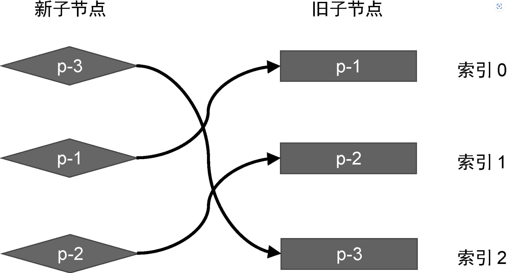

**新 children 的顺序其实就是更新后真实 DOM 节点应有的顺序**

节点 p-1 在新 children 中的位置就代表了真实 DOM 更新后的位置。由于节点 p-1 在新 children 中排在节点 p-3 后面，所以我们应该把节点 p-1 所对应的真实 DOM 移动到节点 p-3 所对应的真实 DOM 后面

```javascript
function patchChildren(n1, n2, container) {
  if (typeof n2.children === 'string') {
    // 省略
  } else if (Array.isArray(n2.children)) {
    const oldChildren = n1.children;
    const newChildren = n2.children;
    
		// 用来存储寻找过程中遇到的最大索引值
    let lastIndex = 0;
    for (let i = 0; i < newChildren.length; i++) {
      const newVNode = newChildren[i];
      for (let j = 0; j < oldChildren.length; j++) {
        const oldVNode = oldChildren[j];
        if (newVNode.key === oldVNode.key) {
          patch(oldVNode, newVNode, container);
          if (j < lastIndex) {
            // 如果当前找到的节点在旧children中的索引小于最大索引值lastIndex则说明需要移动DOM
            const prevVNode = newChildren[i - 1];
            if (prevVNode) {
              const anchor = prevVNode.el.nextSibling;
              insert(newVNode.el, container, anchor);
            }
          } else {
            lastIndex = j;
          }
          break;
        }
      }
    }
  } else {
    // 省略
  }
}

const renderer = createRenderer({
  // 省略
  Insert(el, parnet, anchor = null) {
    // anchor存在，则插入到该节点之前，如果不存在则插入到子节点的末尾
    parent.insertBefore(el, anchor);
  }
  // 省略
})
```

### 9.5 添加新元素

要解决两个问题：

1. 找到新增的节点
2. 将新增节点挂载到正确的位置

```javascript
function patchChildren(n1, n2, container) {
  if (typeof n2.children === 'string') {
    // 省略
  } else if (Array.isArray(n2.children)) {
    const oldChildren = n1.children;
    const newChildren = n2.children;
    
		// 用来存储寻找过程中遇到的最大索引值
    let lastIndex = 0;
    for (let i = 0; i < newChildren.length; i++) {
      const newVNode = newChildren[i];
      let j = 0;
      let find = false;
      for (j; j < oldChildren.length; j++) {
        const oldVNode = oldChildren[j];
        if (newVNode.key === oldVNode.key) {
          // 找到匹配的节点
          find = true;
          patch(oldVNode, newVNode, container);
          if (j < lastIndex) {
            // 如果当前找到的节点在旧children中的索引小于最大索引值lastIndex则说明需要移动DOM
            const prevVNode = newChildren[i - 1];
            if (prevVNode) {
              const anchor = prevVNode.el.nextSibling;
              insert(newVNode.el, container, anchor);
            }
          } else {
            lastIndex = j;
          }
          break;
        }
      }
      // 如果执行到这里时find仍为false，说明没有在旧的节点中找到可复用的节，即newVNode是一个新的节点，需要进行挂载
      if (!find) {
        const prevVNode = newChildren[i - 1];
        let anchor = null;
        if (prevVNode) {
          anchor = prevVNode.el.nextSibling;
        } else {
          // 当前挂载的节点是第一个子节点
          anchor = container.firstChild;
        }
        patch(null, newVNode, container, anchor);
      }
    }
  } else {
    // 省略
  }
}
```

### 9.6 移除不存在的元素

当基本的更新结束时，我们需要遍历旧的一组子节点，然后去新的一组子节点中寻找具有相同 key 值的节点。如果找不到，则说明应该删除该节点

```javascript
function patchChildren(n1, n2, container) {
  if (typeof n2.children === 'string') {
    // 省略
  } else if (Array.isArray(n2.children)) {
    const oldChildren = n1.children;
    const newChildren = n2.children;
    
		// 用来存储寻找过程中遇到的最大索引值
    let lastIndex = 0;
    for (let i = 0; i < newChildren.length; i++) {
      // 省略
    }
    for (let i = 0; i < oldChildren.length; i++) {
      const oldVNode = oldChildren[i];
      const has = newChildren.find(vnode => vnode.key === oldVNode.key);
      if (!has) {
        unmount(oldVNode);
      }
    }
  } else {
    // 省略
  }
}
```

## 第10章 双端Diff算法

### 10.1 双端比较的原理

解决简单diff算法对DOM的移动操作并不是最优的问题

```javascript
function patchChildren(n1, n2, container) {
  if (typeof n2.children === 'string') {
    // 省略
  } else if (Array.isArray(n2.children)) {
    patchKeyedChildren(n1, n2, container);
  } else {
    // 省略
  }
}

function patchKeyedChildren(n1, n2, container) {
  const oldChildren = n1.children;
  const newChildren = n2.children;

  // 四个索引
  let oldStartIdx = 0;
  let oldEndIdx = oldChildren.length - 1;
  let newStartIdx = 0;
  let newEndIdx = newChildren.length - 1;

  // 四个索引指向的vnode节点
  let oldStartVNode = oldChildren[oldStartIdx];
  let oldEndVNode = oldChildren[oldEndIdx];
  let newStartVNode = newChildren[newStartIdx];
  let newEndVNode = newChildren[newEndIdx];

  while (oldStartIdx <= oldEndIdx && newStartIdx <= newEndIdx) {
    // 比较的四个步骤
    // 第一步：oldStartVNode 和 newStartVNode 比较
    if (oldStartVNode.key === newStartVNode.key) {
      patch(oldEndVNode, newEndVNode, container);
      oldEndVNode = oldChildren[--oldEndIdx];
      newEndVNode = newChildren[--newEndIdx];
    }
    // 第二步：oldEndVNode 和 newEndVNode 比较
    else if (oldEndVNode.key === newEndVNode.key) {
			// 都处于尾部，无需移动
      patch(oldEndVNode, newEndVNode, container);
      // 更新索引
      oldEndVNode = oldChildren[--oldEndIdx];
      newEndVNode = newChildren[--newEndIdx];
    }
    // 第三步：oldStartVNode 和 newEndVNode 比较，说明原来的头部节点在新的顺序中变成了尾部分节点
    else if (oldStartVNode.key === newEndVNode.key) {
      patch(oldStartVNode, newEndVNode, container);
      // 将旧的一组子节点的头部节点对应的DOM移动到旧的一组子节点的尾部节点的后面
      insert(oldStartVNode.el, container, oldEndVNode.el.nextSibling);
      // 更新索引
      oldStartVNode = oldChildren[++oldStartIdx];
      newEndVNode = newChildren[--newEndIdx];
    }
    // 第四步：oldEndVNode 和 newStartVNode 比较，说明原来处于尾部的节点在新的顺序中应该处于头部
    else if (oldEndVNode.key === newStartVNode.key) {
      patch(oldEndVNode, newStartVNode, container);
      // oldEndVNode.el移动到oldStartVNode.el前面
      insert(oldEnvVNode.el, container, oldStartVNode.el);
      // 移动DOM完成后，更新索引值，并指向下一个位置
      oldEndVNode = oldChildren[--oldEndIdx];
      newStartVNode = newChildren[++newStartIdx];
    }
  }
}

```

双端比较示意图：

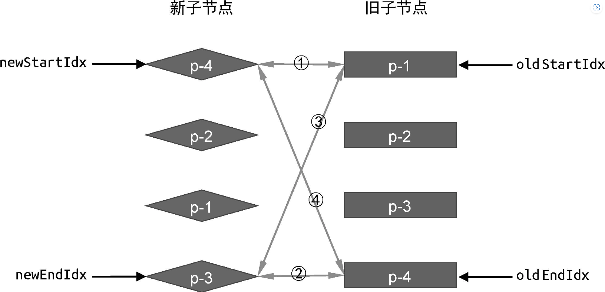

### 10.2 双端比较的优势

DOM移动次数的减少

### 10.3 非理想状况的处理方式

即：在一次循环中未命中四个步骤中任一步骤

```javascript
while (oldStartIdx <= oldEndIdx && newStartIdx <= newEndIdx) {
  if (!oldStartVNode) {
    oldStartVNode = oldChildren[++oldStartIdx];
  } else if (!oldEndVNode) {
    oldEndVNode = oldChildren[--oldEndIdx];
  }
  // 比较的四个步骤
  // 第一步：oldStartVNode 和 newStartVNode 比较
  else if (oldStartVNode.key === newStartVNode.key) {
    // 省略
  }
  // 第二步：oldEndVNode 和 newEndVNode 比较
  else if (oldEndVNode.key === newEndVNode.key) {
    // 省略
  }
  // 第三步：oldStartVNode 和 newEndVNode 比较
  else if (oldStartVNode.key === newEndVNode.key) {
    // 省略
  }
  // 第四步：oldEndVNode 和 newStartVNode 比较
  else if (oldEndVNode.key === newStartVNode.key) {
    // 省略
  } else {
    // 遍历旧children，寻找与newStartVNode拥有相同key的节点
    const idxInOld = oldChildren.findIndex(
      node => node.key === newStartVNode.key
    );
    // 如果找到，说明，以前的一个旧节点现在变成首结点了
    if (idxInOld > 0) {
      const vnodeToMove = oldChildren[idxInOld];
      patch(vnodeToMove, newStartVNode, container);
      insert(vnodeToMove, container, oldStartVNode.el);

      // 因为已经移动，原位置使用为undefined，所以循环比较时也要考虑该场景，表示节点被移动过了，可跳过处理
      oldChildren[idxInOld] = undefined;
      newStartVNode = newChildren[++newStartIdx];
    }
  }
}
```

### 10.4 添加新元素

续上一节的场景，当拿新的一组子节点的头部节点去旧的一组子节点中寻找可复用节点时，未找到的场景

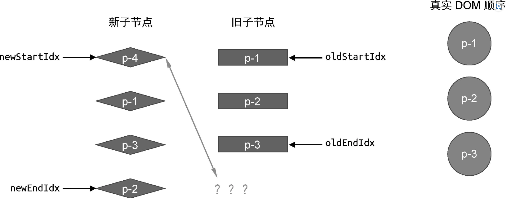

```javascript
while (oldStartIdx <= oldEndIdx && newStartIdx <= newEndIdx) {
  if (!oldStartVNode) {
    oldStartVNode = oldChildren[++oldStartIdx];
  } else if (!oldEndVNode) {
    oldEndVNode = oldChildren[--oldEndIdx];
  }
  // 比较的四个步骤
  // 第一步：oldStartVNode 和 newStartVNode 比较
  else if (oldStartVNode.key === newStartVNode.key) {
    // 省略
  }
  // 第二步：oldEndVNode 和 newEndVNode 比较
  else if (oldEndVNode.key === newEndVNode.key) {
    // 省略
  }
  // 第三步：oldStartVNode 和 newEndVNode 比较
  else if (oldStartVNode.key === newEndVNode.key) {
    // 省略
  }
  // 第四步：oldEndVNode 和 newStartVNode 比较
  else if (oldEndVNode.key === newStartVNode.key) {
    // 省略
  } else {
    // 遍历旧children，寻找与newStartVNode拥有相同key的节点
    const idxInOld = oldChildren.findIndex(
      node => node.key === newStartVNode.key
    );
    // 如果找到，说明，以前的一个旧节点现在变成首结点了
    if (idxInOld > 0) {
      const vnodeToMove = oldChildren[idxInOld];
      patch(vnodeToMove, newStartVNode, container);
      insert(vnodeToMove, container, oldStartVNode.el);

      oldChildren[idxInOld] = undefined;
    }
    // 新增节点，在旧节点中未找到
    else {
      patch(null, newStartVNode, container, oldStartVNode.el);
    }
    newStartVNode = newChildren[++newStartIdx];
  }
}

// 循环结束后的检查，因为新节点还存在未被遍历到的节点
if (oldEndIdx < oldStartIdx && newStartIdx <= newEndIdx) {
  for (let i = newStartIdx, i <= newEndIdx; i++) {
    patch(null, newChildren[i], container, oldStartVNode.el);
  }
}
```

### 10.5 移除不存在的元素

此场景与上一节刚好相反

```javascript
while (oldStartIdx <= oldEndIdx && newStartIdx <= newEndIdx) {
  if (!oldStartVNode) {
    oldStartVNode = oldChildren[++oldStartIdx];
  } else if (!oldEndVNode) {
    oldEndVNode = oldChildren[--oldEndIdx];
  }
  // 比较的四个步骤
  // 第一步：oldStartVNode 和 newStartVNode 比较
  else if (oldStartVNode.key === newStartVNode.key) {
    // 省略
  }
  // 第二步：oldEndVNode 和 newEndVNode 比较
  else if (oldEndVNode.key === newEndVNode.key) {
    // 省略
  }
  // 第三步：oldStartVNode 和 newEndVNode 比较
  else if (oldStartVNode.key === newEndVNode.key) {
    // 省略
  }
  // 第四步：oldEndVNode 和 newStartVNode 比较
  else if (oldEndVNode.key === newStartVNode.key) {
    // 省略
  } else {
    // 遍历旧children，寻找与newStartVNode拥有相同key的节点
    const idxInOld = oldChildren.findIndex(
      node => node.key === newStartVNode.key
    );
    // 如果找到，说明，以前的一个旧节点现在变成首结点了
    if (idxInOld > 0) {
      const vnodeToMove = oldChildren[idxInOld];
      patch(vnodeToMove, newStartVNode, container);
      insert(vnodeToMove, container, oldStartVNode.el);

      oldChildren[idxInOld] = undefined;
    }
    // 新增节点，在旧节点中未找到
    else {
      patch(null, newStartVNode, container, oldStartVNode.el);
    }
    newStartVNode = newChildren[++newStartIdx];
  }
}

// 循环结束后的检查，因为新节点还存在未被遍历到的节点
if (oldEndIdx < oldStartIdx && newStartIdx <= newEndIdx) {
  for (let i = newStartIdx, i <= newEndIdx; i++) {
    patch(null, newChildren[i], container, oldStartVNode.el);
  }
} else if (newEndIdx < newStartIdx && oldStartIdx <= oldEndIdx) {
  // 移除未遍历到的旧节点
  for (let i = oldStartIdx; i < oldEndIdx; i++) {
    unmount(oldChildren[i]);
  }
}
```

## 第11章 快速Diff算法

> 该算法最早应用于 ivi 和 inferno 这两个框架

### 11.1 相同的前置元素和后置元素

```javascript
function patchKeyedChildren(n1, n2, container) {
  const newChildren = n2.children;
  const oldChildren = n1.children;
  
  let j = 0;
  let oldVNode = oldChildren[j];
  let newVNode = newChildren[j];
  
  // 前置相同节点的处理
  while (oldVNode.key === newVNode.key) {
    patch(oldVNode, newVNode, container);
    j++;
    oldVNode = oldChildren[j];
    newVNode = newChildren[j];
  }
  
  let oldEnd = oldChildren.length - 1;
  let newEnd = newChildren.length - 1;
  oldVNode = oldChildren[oldEnd];
  newVNode = newChildren[newEnd];
  
  // 后置相同节点的处理
  while (oldVNode.key === newVNode.key) {
    patch(oldVNode, newVNode, container);
    oldEnd--;
    newEnd--;
    oldVNode = oldChildren[oldEnd];
    newVNode = newChildren[newEnd];
  }
  
  // 剩余节点处理
  // 旧节点遍历完，剩下的新节点就是要新增的节点
  if (j > oldEnd && j <= newEnd) {
    const anchorIndex = newEnd + 1;
    const anchor = anchorIndex < newChildren.length ? newChildren[anchorIndex].el : null;
    while (j <= newEnd) {
      patch(null, newChildren[j++], container, anchor);
    }
  }
  // 新节点遍历完，剩下的旧节点就是要删除的节点
  else if (j > newEnd && j <= oldEnd) {
    while (j <= oldEnd) {
      unmount(oldChildren[j++]);Ï
    }
  }
}
```

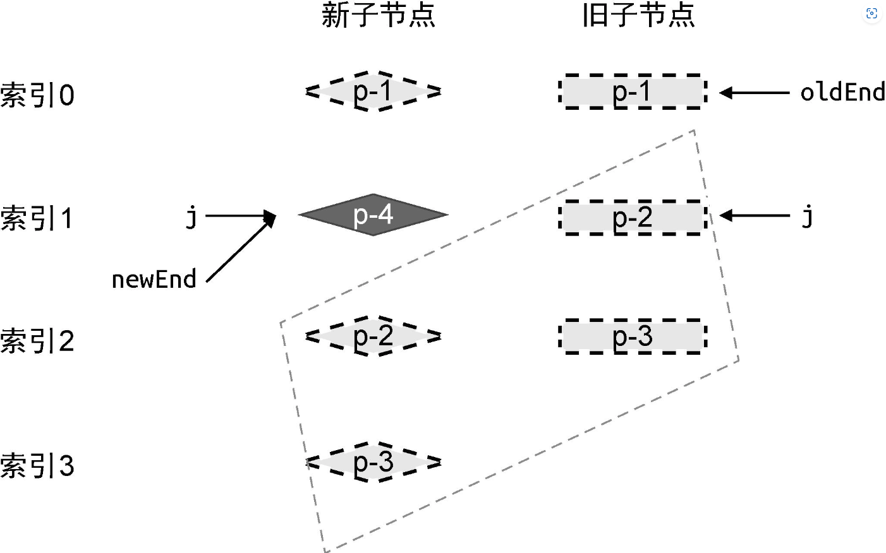

### 11.2 判断是否需要进行DOM移动操作

上述处理完成，但新旧节点均未处理完的场景

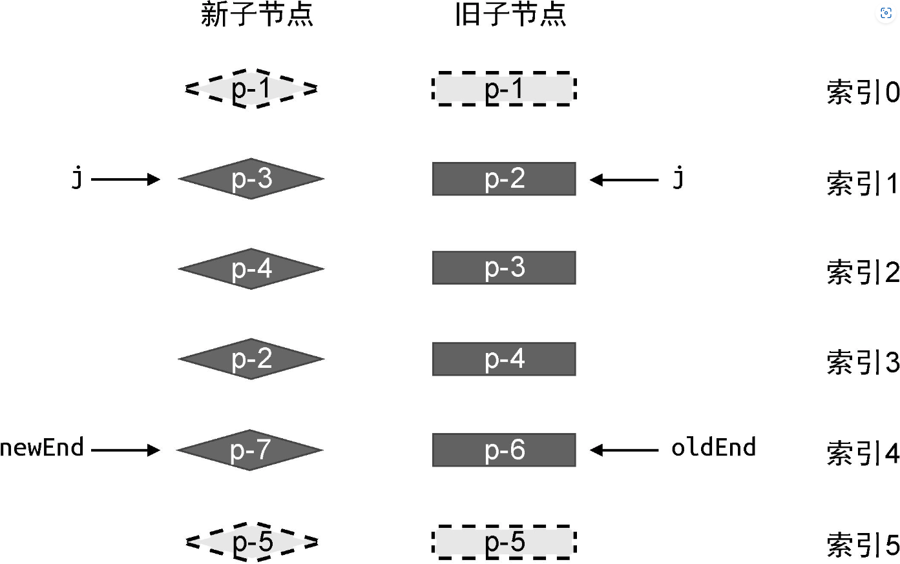

```javascript
function patchKeyedChildren(n1, n2, container) {
  const newChildren = n2.children;
  const oldChildren = n1.children;
  
  let j = 0;
  let oldVNode = oldChildren[j];
  let newVNode = newChildren[j];
  
  // 前置相同节点的处理
  while (oldVNode.key === newVNode.key) {
    patch(oldVNode, newVNode, container);
    j++;
    oldVNode = oldChildren[j];
    newVNode = newChildren[j];
  }
  
  let oldEnd = oldChildren.length - 1;
  let newEnd = newChildren.length - 1;
  oldVNode = oldChildren[oldEnd];
  newVNode = newChildren[newEnd];
  
  // 后置相同节点的处理
  while (oldVNode.key === newVNode.key) {
    patch(oldVNode, newVNode, container);
    oldEnd--;
    newEnd--;
    oldVNode = oldChildren[oldEnd];
    newVNode = newChildren[newEnd];
  }
  
  // 剩余节点处理
  // 旧节点遍历完，剩下的新节点就是要新增的节点
  if (j > oldEnd && j <= newEnd) {
    const anchorIndex = newEnd + 1;
    const anchor = anchorIndex < newChildren.length ? newChildren[anchorIndex].el : null;
    while (j <= newEnd) {
      patch(null, newChildren[j++], container, anchor);
    }
  }
  // 新节点遍历完，剩下的旧节点就是要删除的节点
  else if (j > newEnd && j <= oldEnd) {
    while (j <= oldEnd) {
      unmount(oldChildren[j++]);Ï
    }
  } else {
    // 构造source数组，长度等于新的一组节点中未处理节点的数量
    const count = newEnd - j + 1;
    const source = new Array(count);
    source.fill(-1);
    
    const oldStart = j;
    const newStart = j;
    let moved = false;
    let pos = 0;
    // 构建索引表
    const keyIndex = {};
    for (let i = newStart; i <= newEnd; i++) {
      keyIndex[newChildren[i].key] = i;
    }
    // 更新过的节点数量
    let patched = 0;
    // 遍历旧的一组子节点中剩余未处理的节点
    for (let i = oldStart; i <= oldEnd; i++) {
      const oldVNode = oldChildren[i];
      // 如果更新过的节点数量小于等于需要更新的节点数量，则执行更新
      if (patched <= count) {
        // 通过索引表快速找到新的一组子节点中具有相同key的节点的位置
      	const k = keyIndex[oldVNode.key];
      	// 如果找到则更新处理
      	if (typeof k !== 'undefined') {
        	newVNode = newChildren[k];
        	patch(oldVNode, newVNode, container);
          patched++;
        	// 记录新节点对应的旧节点在旧列表中的位置
        	source[k - newStart] = i;
        	// 判断节点是否需要移动，如遍历过程中遇到的索引值呈现递增趋势，说明不需要移动节点，反之则需要
        	if (k < pos) {
          	moved = true;
        	} else {
          	pos = k;
        	}
      	} else {
        	// 没有找到直接移除
        	unmount(oldVNode);
      	}
      } else {
        unmount(oldVNode);
      }
    }
  }
}
```

> **source 数组将用来存储新的一组子节点中的节点在旧的一组子节点中的位置索引**，后面将会使用它计算出一个最长递增子序列，并用于辅助完成 DOM 移动的操作
>
> 出于优化的目的，我们可以为新的一组子节点构建一张索引表，用来存储节点的 key 和节点位置索引之间的映射

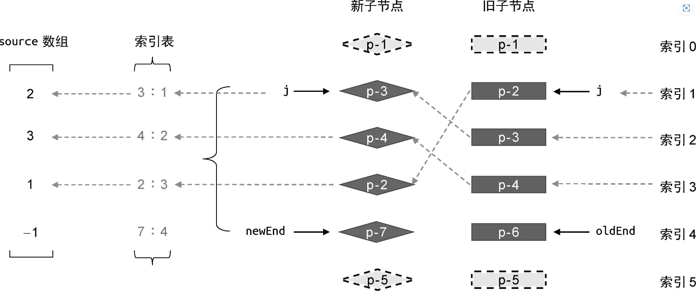

如图：source数组的索引号对应的是节点在未处理新的一组中的位置，source的值对应的是该节点在旧的一组中的索引，比如，source[0]的值为2，表示的是p-3节点，在旧的一组中其索引是2

### 11.3 如何移动元素

上一节中，创建了变量 moved 作为标识，**当它的值为 true 时，说明需要进行 DOM 移动操作**，并且，source 数组中存储着新的一组子节点中的节点在旧的一组子节点中的位置，后面我们会根据 source 数组计算出一个最长递增子序列，**用于 DOM 移动操作**

```javascript
function patchKeyedChildren(n1, n2, container) {
  // 省略
  if (j > oldEnd && j <= newEnd) {
    // 省略
  } else if (j > newEnd && j <= oldEnd) {
    // 省略
  } else {
    // 省略
    for (let i = oldStart; i <= oldEnd; i++) {
      // 省略
    }
    if (moved) {
      // moved为true，则需要进行DOM移动操作
      // 计算最长递增子序列
      const seq = lis(sources) // [0, 1]，这里返回的是最长递增子序列的索引号，它表示在新的一组子节点中，重新编号后索引值为 0 和 1 的这两个节点在更新前后顺序没有发生变化
      // s指向最长递增子序列的最后一个元素
      let s = seq.length - 1;
      // i指向新的一组子节点的最后一个元素
      let i = count - 1;
      for (i; i >= 0; i--) {
        // 新节点在旧节点中不存在，则新增
        if (source[i] === -1) {
          // 新节点的真实位置
          const pos = i + newStart;
          const newVNode = newChildren[pos];
          const nextPos = pos + 1;
          const anchor = newxtPos < newChildren.length ? newChildren[nextPos].el : null;
          patch(null, newVNode, container, anchor);
        } else if (i !== seq[s]){
          const pos = i + newStart;
          const newVNode = newChildren[pos];
          const nextPos = pos + 1;
          const anchor = nextPos < newChildren.length ? newChildren[nextPost].el : null;
          insert(newVNode.el, container, anchor);
        } else {
          // 节点不需要移动，只需要让s指向下一个位置
          s--;
        }
      }
    }
  }
}
```

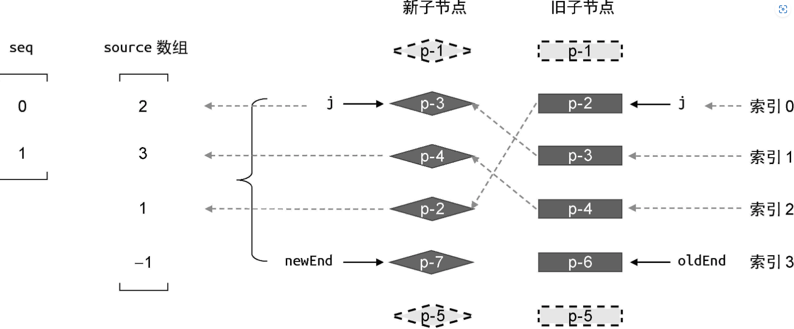

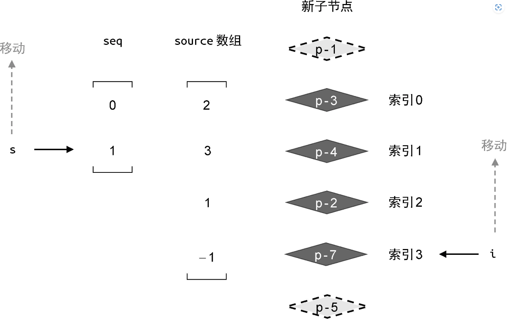

*关于最长递增子序列，vue3中的实现如下：*

```javascript
function getSequence(arr) {
  const p = arr.slice();
  const result = [0];
  let i, j, u, v, c;
  const len = arr.length;
  for (i = 0; i < len; i++) {
    const arrI = arr[i];
    if (arrI !== 0) {
      j = result[result.length - 1];
      if (arr[j] < arrI) {
        p[i] = j;
        result.push(i);
        continue;
      }
      u = 0;
      v = result.length - 1;
      while (u < v) {
        c = ((u + v) / 2) | 0;
        if (arr[result[c]] < arrI) {
          u = c + 1;
        } else {
          v = c;
        }
      }
      if (arrI < arr[result[u]]) {
        if (u > 0) {
          p[i] = result[u - 1];
        }
        result[u] = i;
      }
    }
  }
  u = result.length;
  v = result[u - 1];
  while (u-- > 0) {
    result[u] = v;
    v = p[v];
  }
  return result;
}
```

## 第12章 组件的实现原理

### 12.1 渲染组件

对于渲染器而言，组件就一种特殊类型的DOM节点，对应虚拟节点的type则是用来存储组件的选项对象

```javascript
function patch(n1, n2, container, anchor) {
  if (n1 && n1.type !== n2.type) {
    unmount(n1);
    n1 = null;
  }
  
  const { type } = n2;
  if (type of type === 'string') {
    // 普通元素处理
  } else if (type === Text) {
    // 文本节点处理
  } else if (tyep === Fragment) {
    // 作为片段处理
  } else if (typeof type === 'object') {
    // 作为组件处理
    if (!n1) {
      // 挂载组件
      mountComponent(n2, container, anchor);
    } else {
      // 更新组件
      patchComponent(n1, n2, anchor);
    }
  }
}
```

**一个组件必须包含一个渲染函数，即render函数，并且渲染函数的返回值应该是虚拟DOM**

```javascript
function mountComponent(vnode, container, anchor) {
  const componentOptions = vnode.type;
  const { render } = componentOptions;
  const subTree = render();
  patch(null, subTree, container, anchor);
}
```

### 12.2 组件状态与自更新

```javascript
function mountComponent(vnode, container, anchor) {
  const componentOptions = vnode.type;
  const { render, data } = componentOptions;
  
  const state = reactive(data());
  
  effect(() => {
    const subTree = render.call(state, state);
    patch(null, subTree, container, anchor);
  }, {
    scheduler: queueJob,
  })
}

const queue = new Set();
let isFlushing = false;
const p = Promise.resolve();

// 这段的实现是存在问题的，这里只是示例
function queueJob(job) {
  queue.add(job);
  if (!isFlushing) {
    isFlushing = true;
    p.then(() => {
      try {
        queue.forEach(job => job());
      } finally {
        isFlushing = false;
        queue.clear();
      }
    })
  }
}
```

### 12.3 组件实例与组件的生命周期

```javascript
function mountComponent(vnode, container, anchor) {
  const componentOptions = vnode.type;
  const { render, data, beforeCreate, created, beforeMount, mounted, beforeUpdate, updated } = componentOptions;
  
  beforeCreate && beforeCreate();
  
  const state = reactive(data());
  
  const instance = {
    // 组件自身的状态数据
    state,
    // 表示组件是否已挂载
    isMounted: false,
    // 组件所渲染的内容，即子树
    subTree: null,
  }
  
  // 将组件实例设置到vnode上，后续更新使用
  vnode.component = instance;
  
  created && created.call(state);
  
  effect(() => {
    const subTree = render.call(state, state);
    if (!instance.isMounted) {
      beforeMount && beforeMount.call(state);
      // 初始挂载
      patch(null, subTree, containe,r anchor)
      instance.isMoutned = true;
      
      mounted && mounted.call(state);
    } else {
      beforeUpdate && beforeUpdate.call(state);
      patch(instance.subTree, subTree, container, anchor);
      updated && updated.call(state);
    }
    instance.subTree = subTree;
  }, { scheduler: queueJob });
}
```

### 12.4 props与组件的被动更新

```javascript
function mountComponent(vnode, container, anchor) {
  const componentOptions = vnode.type;
  const { render, data, props: propsOption } = componentOptions;
  
  beforeCreate && beforeCreate();
  
  const state = reactive(data());
  // 使用resolveProps解析出最终的props数据与attrs数据
  const [props, attrs] = resolveProps(propsOptions, vnode.props);
  
  const instance = {
    state,
    // 解析出来的props包装为shallowReactive
    props: shallowReactive(props),
    isMounted: false,
    subTree: null,
  }
  
  vnode.component = instance;
  
  // 创建渲染上下文对象，本质上是组件实例的代理
  const renderContext = new Proxy(instance, {
    get(t, k, r) {
      const { state, props } = t;
      if (state && k in state) {
        return state[k];
      } else if (k in props) {
        return props[k];
      } else {
        console.error('不存在')；
      }
    },
    set (t, k, v, r) {
      const { state, props } = t;
      if (state && k in state) {
        state[k] = v;
      } else if (k in props) {
        console.warn(`Attempting to mutate prop "${k}". Props are readonly.`)
      } else {
        console.error('不存在')
      }
    }
  });
  
  created && created.call(renderContext);
  
  // 省略
}

// 用于解析组件的props与attrs数据
function resolveProps(options, propsData) {
  const props = {};
  const attrs = {};
  // 遍历为组件传递的props数据
  for (const key in propsData) {
    if (key in options) {
      // 如果为组件传递的props数据在组件自身的props选项中定义了，则视为合法的props
      props[key] = propsData[key]
    } else {
      // 否则作为attrs
      attrs[key] = propsData[key];
    }
  }
  
  return [props, attrs];
}
```

**我们把由父组件自更新所引起的子组件更新叫作子组件的被动更新**

```javascript
// 更新子组件
function patchComponent(n1, n2, anchor) {
  // 获取组件实例，即n1.component，同时让新组件的虚拟节点n2.component也指向组件实例
  const instance = (n2.component = n1.component);
  // 获取当前的props数据
  const { props } = instance;
  // 调用hasPropsChanged检测为子组件传递的props是否发生了变化，如果没有变化则无需更新
  if (hasPropsChanged(n1.props, n2.props)) {
    const [ nextProps ] = resolveProps(n2.type.props, n2.props);
		// 更新props
    for (const k in nextProps) {
      props[k] = nextProps[k];
    }
    // 删除不存在的props
    for (const k in props) {
      if (!(k in nextProps)) delete props[k];
    }
  }
}

function hasPropsChanged(prevProps, nextProps) {
  const nextKeys = Object.keys(nextProps);
	// 如果key的数量变了，一定是有变化了
  if (nextKeys.length !== Object.keys(prevProps).length) {
    return true;
  }
  for (let i = 0; i < nextKeys.length; i++) {
    const key = nextKeys[i];
    if (nextProps[key] !== prevProps[key]) return true;
  }
  return false;
}
```

### 12.5 setup函数的作用与实现

setup用于CompositionAPI，其返回值有两种：

1. 返回一个函数，则该函数作为渲染函数使用
2. 返回一个对象，该对象中包含的数据将暴露给模板使用

setup函数接受两个参数：props数据对象（外部组件传递）和setupContext，后者包含与组件接口相关的重要数据：`const { slots, emit, attrs, expose } = setupContext;`，其中`expose`为一个函数，用来显式地对外暴露组件数据

```javascript
function mountComponent(vnode, container, anchor) {
  const componentOptions = vnode.type;
  let { render, data, setup, props: propsOption, /* 省略其他 */} = componentOptions;
  
  beforeCreate && beforeCreate();
  const state = data ? reactive(data()) : null;
  const [props, attrs] = resolveProps(propsOption, vnode.props);
  
  const instance = {
    state,
    props: shallowReactive(props),
    isMounted: false,
    subTree: null,
  }
  
  // 先只关注attrs
  const setupContext = { attrs };
  // props作为只读版本传递给setup函数
  const setupResult = setup(shallowReadonly(instance.props), setupContext);
  // setupState 用来存储由setup返回的数据
  let setupState = null;
  // 如果setup的返回值是一个函数，则作为渲染函数
  if (typeof setupResult === 'function') {
    if (render) console.error('setup函数返回渲染函数，render选项将被忽略');
    render = setupResult;
  } else {
    setupState = setupResult;
  }
  
  vnode.component = instance;
  
  const renderContext = new Proxy(instance, {
    get(t, k, r) {
      const { state, props } = t;
      if (state && k in state) {
        return state[k];
      } else if (k in props) {
        return props[k];
      } else if (setupState && k in setupState) {
        // 渲染上下文增加对setupState的支持
        return setupState[k];
      } else {
        console.error('不存在');
      }
    },
    set (t, k, v, r) {
      const { state, props } = t;
      if (state && k in state) {
        state[k] = v;
      } else if (k in props) {
        console.warn(`Attempting to mutate prop "${k}". Props are readonly.`)
      } else if (setupState && k in setupState) {
        setupState[k] = v;
      } else {
        console.error('不存在')
      }
    }
  });
  
  // 省略
}
```

### 12.6 组件与emit的实现

发射自定义事件的本质就是根据事件名称去 props 数据对象中寻找对应的事件处理函数并执行

### 12.7 插槽的工作原理与实现

组件模板中的插槽内容会被编译为**插槽函数**，而插槽函数的**返回值**就是具体的插槽内容

组件模板：

```vue
<template>
  <header>
    <slot name="header" />
  </header>
  <div>
    <slot name="body" />
  </div>
  <footer>
    <slot name="footer" />
  </footer>
</template>
```

使用组件，传递插槽：

```vue
<MyComponent>
  <template #header>
    <h1>我是标题</h1>
  </template>
  <template #body>
    <section>我是内容</section>
  </template>
  <template #footer>
    <p>我是注脚</p>
  </template>
</MyComponent>
```

会被编译为

```javascript
// 父组件的渲染函数
function render() {
  return {
    type: MyComponent,
    // 组件的 children 会被编译成一个对象
    children: {
      header() {
        return { type: 'h1', children: '我是标题' };
      },
      body() {
        return { type: 'section', children: '我是内容' };
      },
      footer() {
        return { type: 'p', children: '我是注脚' };
      },
    },
  };
}
```

```javascript
// MyComponent的函数函数
function render() {
  return [
    {
      type: 'header',
      children: [this.$slots.header()],
    },
    {
      type: 'body',
      children: [this.$slots.body()],
    },
    {
      type: 'footer',
      children: [this.$slots.footer()],
    },
  ];
}

```

```javascript
function mountComponent(vnode, container, anchor) {
  // 省略
  
  const slots = vnode.children || {};
  const instance = {
    state,
    props: shallowReactive(props),
    isMounted: false,
    subTree: null,
    slots,
  }
  const setupConext = { attrs, emit, slots };
  
  // 省略
  
  const renderContext = new Proxy(instance, {
    get(t, k, r) {
      const { state, props, slots } = t;
      if (k === '$slots') return slots;
      //省略
    },
    // 省略
  })
}
```

### 12.8 注册生命周期

> 实际上，我们需要维护一个变量 **currentInstance**，用它来存储当前组件实例，每当初始化组件并执行组件的 setup 函数之前，先将 currentInstance 设置为当前组件实例，再执行组件的 setup 函数，这样我们就可以通过 currentInstance 来获取当前正在被初始化的组件实例，从而将那些通过 onMounted 函数注册的钩子函数与组件实例进行关联

## 第13章 异步组件与函数式组件

异步组件：以异步的方式加载并渲染一个组件。这在代码分割、服务端下发组件等场景中尤为重要

函数式组件：允许使用一个普通函数定义组件，并使用该函数的返回值作为组件要渲染的内容。其特点是：无状态、编写简单且直观（在vue3中，函数式组件与有状态组件的性能差距不大，主要是因为它简单）

### 13.1 异步组件要解决的问题

- 组件加载失败或超时，是否需要渲染Error组件
- 组件加载时，是否需要占位内容
- 是否需要延迟展示Loading
- 组件加载失败后，是否需要重试

### 13.2 异步组件的实现原理

#### 13.2.1 封装defineAsyncComponent函数

```vue
<template>
	<AsyncComp />
</template>
<script>
export default {
	components: {
    AsyncComp: defineAsyncComponent(() => import('CompA'));
  }
}
</script>
```

`defineAsyncComponent`是一个高阶组件

```javascript
function defineAsyncComponent(loader) {
  let InnerComp = null;
  return {
    name: 'AsyncComponentWrapper',
    setup() {
      const loaded = ref(false);
      loader().then(c => {
        InnerComp = c;
        loaded.value = true;
      });
      
      return () => {
        // 组件加载完成前的占位处理
        return loaded.value ? { type: InnerComp } : { type: Text, children: '' }
      }
    }
  }
}
```

#### 13.2.2 超时与Error组件

异步组件加载失败时，如果用户配置了Error组件，则渲染该组件

```javascript
const AsyncComp =  defineAsyncComponent({
  loader: () => import('CompA.vue'),
  timeout: 2000, // 超时时长
  errorComponent: MyErrorComp // 加载出错时要渲染的组件
})
```

```javascript
function defineAsyncComponent(options) {
	// 规格化处理，options有可能直接就是loader
  if (typeof options === 'function') {
    options = {
      loader: options,
    }
  }
  
  const { loader } = options;
  let InnerComp = null;
  
  return {
    name: 'AsyncComponentWrapper',
    setup() {
      const loaded = ref(false);
      // 定义error，当错误发生时，用来存储错误对象
      const error = shallowRef(null);
      
      loader().then(c => {
        InnerComp = c;
        loaded.value = true;
      }).catch(err => error.value = err);
      
      let timer = null;
      if (options.timeout) {
        timer = setTimeout(() => {
          const err = new Error(`Async component timed out after ${options.timeout}ms.`)
          error.value = err;
        }, options, timeout);
      }
      
      onUnMounted(() => clearTimeout(timer));
      
      const placeholder = { type: Text, children: '' };
      
      return () => {
        if (loaded.value) {
          return { type: InnerComp };
        } else if (error.value && options.errorComponent) {
          return { type: options.errorComponent, props: { error: error.value } };
        } else {
          return placeholder;
        }
      }
    }
  }
}
```

#### 13.2.3 延迟与Loading组件

```javascript
defineAsyncComponent({
  loader: () =>
    new Promise(r => {
      /* ... */
    }),
  // 延迟 0ms 展示 Loading 组件
  delay: 0,
  // Loading 组件
  loadingComponent: {
    setup() {
      return () => {
        return { type: 'h2', children: 'Loading...' };
      };
    },
  },
});
```

```javascript
function defineAsyncComponent(options) {
  if (typeof options === 'function') {
    options = {
      loader: options,
    }
  }
  
  const { loader } = options;
  let InnerComp = null;
  
  return {
    name: 'AsyncComponentWrapper',
    setup() {
      const loaded = ref(false);
      const error = shallowRef(null);
      
      const loading = rel(false);
      const loadingTimer = null;
      
      if (options.delay) {
        loadingTime = setTimeout(() => {
          loading.value = true;
        }, optinos.delay);
      } else {
        loading.value = true;
      }
      
      loader().then(c => {
        InnerComp = c;
        loaded.value = true;
      })
      .catch(err => error.value = err);
      .finally(() => {
        loading.value = false;
        clearTimeout(loadingTimer);
      });
      
      let timer = null;
      if (options.timeout) {
        timer = setTimeout(() => {
          const err = new Error(`Async component timed out after ${options.timeout}ms.`)
          error.value = err;
        }, options, timeout);
      }
      
      onUnMounted(() => clearTimeout(timer));
      
      const placeholder = { type: Text, children: '' };
      
      return () => {
        if (loaded.value) {
          return { type: InnerComp };
        } else if (error.value && options.errorComponent) {
          return { type: options.errorComponent, props: { error: error.value } };
        } else if (loading.value && options.loadingComponent) {
          return { type: optins.loadingCompoent }
        } else {
          return placeholder;
        }
      }
    }
  }
}
```

#### 13.2.4 重试机制

```javascript
function defineAsyncComponent(options) {
  if (typeof options === 'function') {
    options = {
      loader: options
    }
  }
  
  const { loader } = options;
  let InnerComp = null
  
  // 记录重试次数
  let retries = 0;
	// 封装load函数来加载异步组件
  function load() {
    return loader().catch(err => {
      // 指定onError回调，则将控制权交给用户
      if (options.onError) {
        return new Promise((resolve, reject) => {
          const retry = () => {
            resolve(load());
            retries++;
          }
          const fail = () => reject(err);
          options.onError(retry, fail, retries);
        });
      } else {
        throw err;
      }
    });
  }
  
  return {
    name: 'AsyncComponentWrapper',
    setup() {
      const loaded = ref(false);
      const error = shallowRef(null);
      const loading = ref(false);
      
      let loadingTimer = null;
      if (options.delay) {
        loadingTimer = setTimeout(() => {
          loading.value = true;
        }, options.delay);
      } else {
        loading.value = true;
      }
      load().then(c => {
        InnerComp = c;
        loaded.value = true;
      }).catch(err => {
        error.value = err;
      }).finally(() => {
        loading.value = false;
        clearTimeout(loadingTimer);
      })
      // 省略代码
    }
  }
}
```

### 13.3 函数式组件

一个函数式组件本质上就是一个普通函数，该函数的返回值是虚拟 DOM

函数式组件没有自身状态，但它仍然可以接收由外部传入的 props

函数式组件没有自身状态，也没有生命周期的概念

## 第14章 内建组件和模块

介绍如KeepAlive、Teleport、Transition等内建组件

### 14.1 KeepAlive组件的实现原理

#### 14.1.1 组件的激活与失活

**KeepAlive 的本质是缓存管理，再加上特殊的挂载/卸载逻辑**

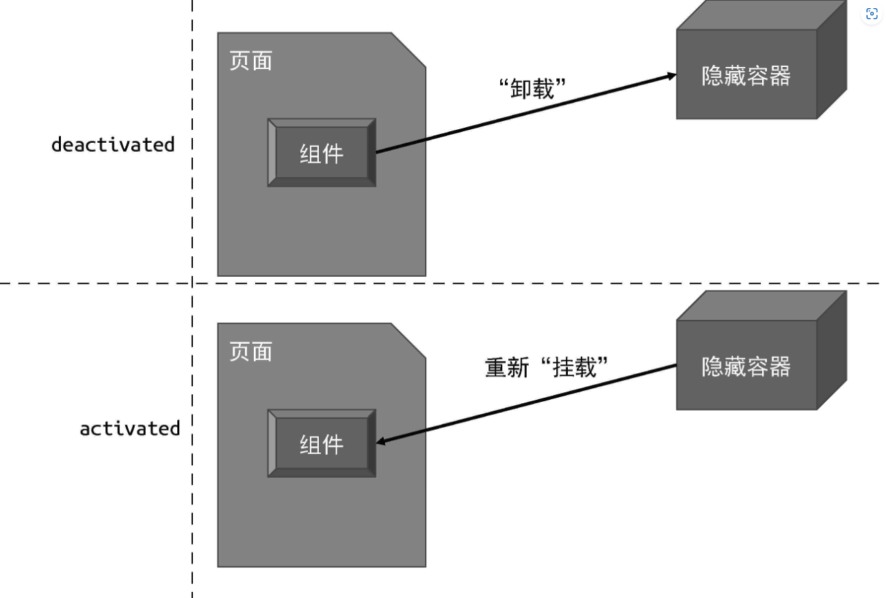

“卸载”一个被 KeepAlive 的组件时，它并不会真的被卸载，而会被移动到一个隐藏容器中。当重新“挂载”该组件时，它也不会被真的挂载，而会被从隐藏容器中取出，再“放回”原来的容器中

```javascript
const KeepAlive = {
	// 组件独有的属性，作为标识
  __isKeepAlive: true,
  setup(props, { slots }) {
    // 创建一个缓存对象，key为vnode.type, value为vnode
    const cache = new Map();
    // 当前KeepAlive组件的实例
    const instance = currentInstance;
    // 对于KeepAlive组件来说，它的实例上存在特殊的keepAliveCtx对象，由渲染器注入，它会暴露渲染器内部的一些方法，其中move函数用来将一段DOM移动到另一个容器中
    const { move, createElement } = instance.keepAliveCtx;
    
    // 创建隐藏容器
    const storageContainer = createElement('div')
    // KeepAlive组件的实例上会被添加两个内部函数，分别是_deActivate和_activate，这两个函数会在渲染器中被调用
    instance._deActivate = vnode => {
      move(vnode, storageContainer);
    }
    instance._activate = (vnode, container, anchor) => {
      move(vnode, container, anchor);
    }
    
    return () => {
      // KeepAlive的默认插槽就是要被KeepAlive的组件
      const rawVNode = slots.default();
      // 如果不是组件，直接渲染，非组件的虚拟节点无法被KeepAlive
      if (typeof rawVNode.type !== 'object') {
        return rawVNode;
      }
      
      // 挂载时先获取缓存的组件 vnode
      const cachedVNode = cache.get(rawVNode.type);
      if (cachedVNode) {
        // 如果缓存存在，则说明不应该执行挂载，而应执行激活
        rawVNode.component = cachedVNode.component;
        // 在vnode上添加keptAlive属性，标记为true，避免渲染器重新挂载它
        rawVNode.keptAlive = true;
      } else {
        // 如果没有缓存，则将其添加到缓存中，这样下次激活组件时就不会执行新的挂载动作了
        cache.set(rawVNode.type, rawVNode);
      }
      
      // 在组件vnode上添加shouldKeepAlive属性，并标记为true，避免渲染器将组件卸载
      rawVNode.shouldKeepAlive = true;
      // 将KeepAlive组件的实例也添加到vnode上，以便在渲染器中访问
      rawVNode.keepAliveInstance = instance;
      
      // 渲染组件 vnode
      return rawVNode;
    }
  }
}

// 卸载操作
function unmount(vnode) {
  if (vnode.type === Fragment) {
    vnode.children.forEach(c => unmount(c));
    return;
  } else if (typeof vnode.type === 'object') {
    // 对于需要被KeepAlive的组件，不真的卸载它，而是调用该组件的父组件
    if (vnode.shouldKeepAlive) {
      vnode.keepAliveInstance._deActivate(vnode);
    } else {
      unmount(vnode.component.subTree);
    }
    return;
  }
  const parent = vnode.el.parentNode;
  if (parent) {
    parent.removeChild(vnode.el);
  }
}

// 挂载操作
function patch(n1, n2, container, anchor) {
  if (n1 && n1.type !== n2.type) {
    unmount(n1);
    n1 = null;
  }
  
  const { type } = n2;
  if (typeof type === 'string') {
    // 省略
  } else if (type === Text) {
    // 省略
  } else if (type === Fragment) {
    // 省略
  } else if (typeof type === 'object' || typeof type === 'function') {
    if (!n1) {
      // 如果新组件是被keptAlive的，不进行挂载，而是进行激活
      if (n2.keptAlive) {
        n2.keepAliveInstace._activate(n2, containe, ranchor);
      } else {
        mountComponent(n2, container, anchor);
      }
    } else {
      patchComponent(n1, n2, anchor);
    }
  }
}

function mountComponent(vnode, container, anchor) {
  // 省略
  
  const instance = {
    state,
    props: shallowReactive(props),
    isMounted: false,
    subTree: null,
    slots,
    mounted: [],
    // 只有在KeepAlive组件的实例下会有该属性
    keepAliveCtx: null,
  }
  
  // 检查当前要挂载的组件是否是KeepAlive组件
  const isKeepAlive = vnode.type.__isKeepAlive
  if (isKeepAlive) {
    // 在KeepAlive组件实例上添加keepAliveCtx对象
    instance.keepAliveCtx = {
      // 添加move方法，本质是将组件渲染的内容移动到指定容器中
      move(vnode, container, anchor) {
        insert(vnode.component.subTree.el, container, anchor);
      },
      createElement,
    }
  }
  
  // 省略
}
```

#### 14.1.2 include 和 exclude

在默认情况下，KeepAlive 组件会对所有“内部组件”进行缓存。但有时候用户期望只缓存特定组件。include 用来显式地配置应该被缓存组件，而 exclude 用来显式地配置不应该被缓存组件

```javascript
const cache = new Map();
const KeepAlive = {
  __isKeepAlive: true,
  props: {
    include: RegExp,
    exclude: RegExp,
  },
  setup(props, { slots }) {
    // 省略
    
    return () => {
      let rawVNode = slots.default();
      if (typeof rawVNode.type !== 'object') {
        return rawVNode;
      }
      // 获取内部组件的name
      const name = rawVNode.type.name
      // 对name进行匹配
      if (name && (
        (props.include && !props.include.test(name)) ||
        (props.exclude && props.exclude.test(name))
      )) {
        return rawVNode;
      }
      
      // 省略
    }
  }
}
```

#### 14.1.3 缓存管理

为了解决缓存不断增加占用大量内存的问题，支持设置一个缓存阈值，当缓存数量超过指定阈值时对缓存进行修剪，该阈值通过max属性来设置

Vue.js 当前所采用的修剪策略叫作“最新一次访问”

用户还可以通过`cache`属性来自定义缓存策略

### 14.2 Teleport组件的实现原理

#### 14.2.1 Teleport组件要解决的问题

将指定内容渲染到特定容器中，而不受 DOM 层级的限制

#### 14.2.2 实现Teleport组件

```javascript
function patch(n1, n2, container, anchor) {
  if (n1 && n1.type !== n2.type) {
    unmount(n1);
    n1 = null;
  }
  
  const { type } = n2;
  if (typeof type === 'string') {
    // 省略
  } else if (type === Text) {
    // 省略
  } else if (type === Fragment) {
    // 省略
  } else if (typeof type === 'object' && type.__isTeleport) {
    // 将渲染器的一些内部方法传递给Teleport组件，这里将Teleport的渲染逻辑分离，访问做TreeShaking
    type.process(n1, n2, container, anchor, {
      patch,
      patchChildren,
      unmount,
      move(vnode, container, anchor) {
        insert(vnode.component 
               	// 组件
               	? vnode.component.subTree.el
               	// 普通元素
               	: vnode.el,
               container, anchor);
      }
    })
  } else if (typeof type === 'object' || typeof type === 'function') {
    // 省略
  }
}

const Teleport = {
  __isTeleport: true,
  process(n1, n2, container, anchor, internals) {
    const { patch, patchChildren, move } = internals;
    if (!n1) {
      // 挂载逻辑
      const target = typeof n2.props.to === 'string' 
      	? document.querySelector(n2.props.to)
      	: n2.props.to
      // 对于 Teleport 组件来说，其子节点为编译为一个数组
      n2.children.forEach(c => patch(null, c, target, anchor));
    } else {
      // 更新逻辑
      patchChildren(n1, n2, container);
      // 如果新旧to参数的值不同，说明内容发生了移动
      if (n2.props.to !== n1.props.to) {
        const newTarget = typeof n2.props.to === 'string'
        	? document.querySelector(n2.props.to)
        	: n2.props.to
       	n2.children.forEach(c => move(c, newTarget));
      }
    }
  }
}
```

一个组件的子节点会被编译为插槽内容，不过对于 Teleport 组件来说，直接将其子节点编译为一个**数组**即可

### 14.3 Transition组件的实现原理

核心原理：

- 当 DOM 元素被挂载时，将动效附加到该 DOM 元素上
- 当 DOM 元素被卸载时，不要立即卸载 DOM 元素，而是等到附加到该 DOM 元素上的动效执行完成后再卸载它

#### 14.3.1 原生DOM的过渡

如果使用原生js实现进场过渡与出场过渡的效果

```javascript
// 创建 class 为 box 的 DOM 元素
const el = document.createElement('div');
el.classList.add('box');

// 在 DOM 元素被添加到页面之前，将初始状态和运动过程定义到元素上
el.classList.add('enter-from'); // 初始状态
el.classList.add('enter-active'); // 运动过程

// 将元素添加到页面
document.body.appendChild(el);

// 嵌套调用 requestAnimationFrame，这里是因为chrome的bug，不嵌套调用没有动画效果
requestAnimationFrame(() => {
  requestAnimationFrame(() => {
    el.classList.remove('enter-from'); // 移除 enter-from
    el.classList.add('enter-to'); // 添加 enter-to

    // 监听 transitionend 事件完成收尾工作
    el.addEventListener('transitionend', () => {
      el.classList.remove('enter-to');
      el.classList.remove('enter-active');
    });
  });
});

```

```javascript
el.addEventListener('click', () => {
  // 将卸载动作封装到 performRemove 函数中
  const performRemove = () => el.parentNode.removeChild(el);

  // 设置初始状态：添加 leave-from 和 leave-active 类
  el.classList.add('leave-from');
  el.classList.add('leave-active');

  // 强制 reflow：使初始状态生效
  document.body.offsetHeight;

  // 在下一帧切换状态
  requestAnimationFrame(() => {
    requestAnimationFrame(() => {
      // 切换到结束状态
      el.classList.remove('leave-from');
      el.classList.add('leave-to');

      // 监听 transitionend 事件做收尾工作
      el.addEventListener('transitionend', () => {
        el.classList.remove('leave-to');
        el.classList.remove('leave-active');
        // 当过渡完成后，记得调用 performRemove 函数将 DOM 元素移除
        performRemove();
      });
    });
  });
});

```

#### 14.3.2 实现Transition组件

Transition 组件的子节点被编译为默认插槽，这与普通组件的行为一致

```javascript
const Transition = {
  name: 'Transition',
  setup(props, { slots }) {
    return () => {
      // 通过默认插槽读取过渡元素
      const innerVNode = slots.default();
      // 在过渡元素的VNode对象上添加transition相应的钩子函数
      innerVNode.transition = {
        beforeEnter(el) {
          // 省略
        },
        enter(el) {
          // 省略
        },
        leave(el, performRemove) {
          // 省略
        }
      }
      
      return innerVNode;
    }
  }
}
```

渲染器在渲染需要过渡的虚拟节点时，会在合适的时机调用附加到该虚拟节点上的过渡相关的生命周期钩子函数，具体体现在 mountElement 函数以及 unmount 函数中

```javascript
function mountElement(vnode, container, anchor) {
  const el = vnode.el = createElement(vnode.type);
  
  if (typeof vnode.children === 'string') {
    setElementText(el, vnode.children);
  } else if (Array.isArray(vnode.children)) {
    vnode.children.forEach(child => {
      patch(null, child, el);
    })
  }
  
  if (vnode.props) {
    for (const key  in vnode.props) {
      patchProps(el, key, null, vnode.props[key]);
    }
  }
  
  // 判断一个VNode是否需要过渡
  const needTransition = vnode.transition;
  if (needTransition) {
    vnode.transition.beforeEnter(el)
  }
  
  insert(el, container, anchor);
  
  if (needTransition) {
    vnode.transition.enter(el);
  }
}
```

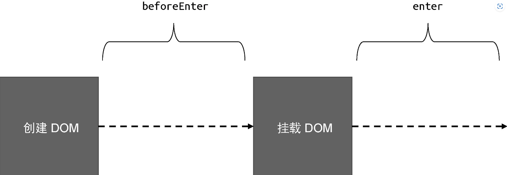

```javascript
function unmount(vnode) {
  const needTransition = vnode.transition;
  if (vnode.type === Fragment) {
    vnode.children.forEach(c => unmount(c));
    return;
  } else if (typeof vnode.type === 'object') {
    if (vnode.shouldKeepAlive) {
      vnode.keepAliveInstance._deActivate(vnode);
    } else {
      unmount(vnode.component.subTree);
    }
    return;
  }
  
  const parent = vnode.el.parentNode
  if (parent) {
    // 将卸载动作封装到 performRemove 函数中
    const performRemove = () => parent.removeChild(vnode.el);
    
    if (needTransition) {
      vnode.transition.leave(vnode.el, performRemove);
    } else {
      performRemove();
    }
  }
}
```

基于以上补充完整的Transition实现

```javascript
const Transition = {
  name: 'Transition',
  setup(props, { slots }) {
    return () => {
      // 通过默认插槽读取过渡元素
      const innerVNode = slots.default();
      // 在过渡元素的VNode对象上添加transition相应的钩子函数
      innerVNode.transition = {
        beforeEnter(el) {
          el.classList.add('enter-from');
          el.classList.add('enter-active');
        },
        enter(el) {
          nextFrame(() => {
            el.classList.remove('enter-from');
            el.classList.add('enter-to');
            el.addEventListener('transitionend', () => {
              el.classList.remove('enter-to');
              el.classList.remove('enter-active');
            });
          });
        },
        leave(el, performRemove) {
          el.classList.add('leave-from');
          el.classList.add('leave-active');
          // 强制reflow，使得初始状态生效
          document.body.offsetHeight;
          nextFrame(() => {
            el.classList.remove('leave-from');
            el.classList.add('leave-to');
            el.addEventListener('transitionend', () => {
              el.classList.remove('leave-to');
              el.classList.remove('leave-active');
              performRemove();
            });
          });
        }
      }
      
      return innerVNode;
    }
  }
}
```

## 第15章 编译器核心技术概览

### 15.1 模板DSL的编译器

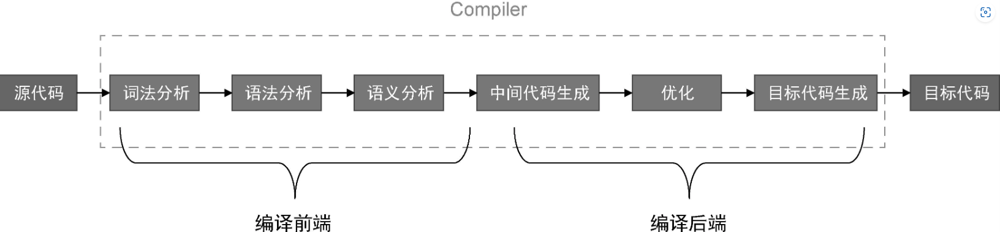

编译前端：与目标平台无关，仅负责分析源代码

编译后端：与目标平台有关，涉及中间代码生成和优化以及目标代码生成

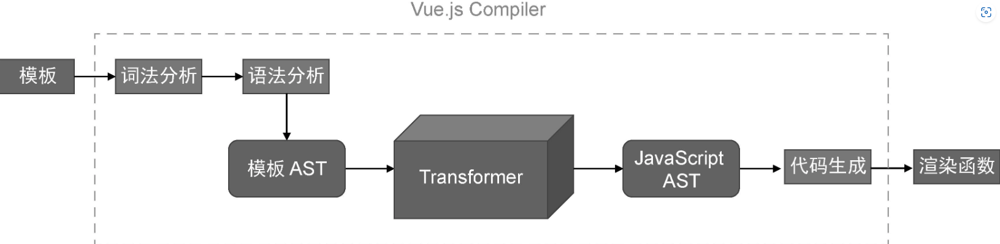

```javascript
// 语义分析得到模板AST
const templateAST = parse(template)
// 将将模板AST转换为Javascript AST
const jsAST = transform(templateAST)
// 生成渲染函数
const code = generate(jsAST)
```

Vue.js 模板编译器的基本结构和工作流程：

- 用来将模板字符串解析为模板 AST 的解析器（parser）
- 用来将模板 AST 转换为 JavaScript AST 的转换器（transformer）
- 用来根据 JavaScript AST 生成渲染函数代码的生成器（generator）

### 15.2 parser的实现原理与状态机

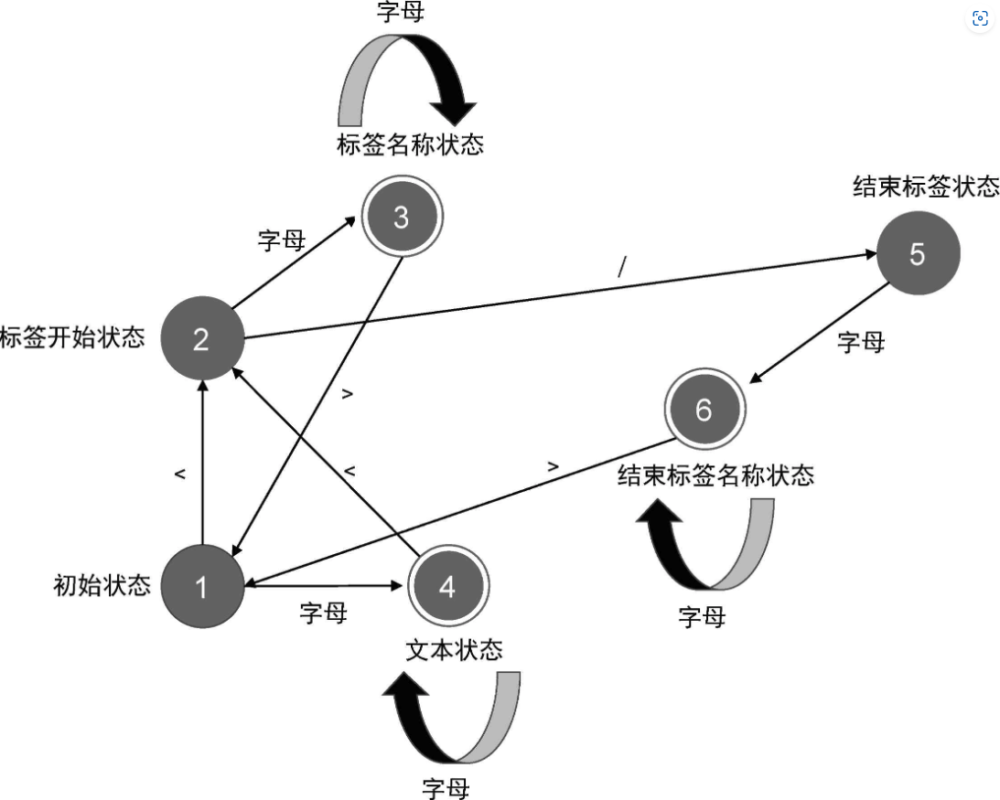

**正则表达式的本质就是有限自动机**

### 15.3 构造AST

### 15.4 AST的转换与插件化架构

#### 15.4.1 节点的访问

#### 15.4.2 转换上下文与节点操作

上下文对象中通常会维护程序的当前状态

#### 15.4.3 进入与退出

在转换 AST 节点的过程中，往往需要根据其子节点的情况来决定如何对当前节点进行转换。这就要求父节点的转换操作必须等待其所有子节点全部转换完毕后再执行

对节点的访问分为两个阶段，即进入阶段和退出阶段。当转换函数处于进入阶段时，它会先进入父节点，再进入子节点。而当转换函数处于退出阶段时，则会先退出子节点，再退出父节点

#### 15.4.4 将模板AST转为JavaScript AST

### 15.6 代码生成

## 第16章 解析器

利用正则表达式来实现 HTML 解析器

### 16.1 文本模式及其对解析器的影响

> 文本模式指的是解析器在工作时所进入的一些特殊状态，在不同的特殊状态下，解析器对文本的解析行为会有所不同。具体来说，当解析器遇到一些特殊标签时，会切换模式，从而影响其对文本的解析行为：
>
> - \<title> 标签、\<textarea> 标签，当解析器遇到这两个标签时，会切换到RCDATA 模式；
> - \<style>、\<xmp>、\<iframe>、\<noembed>、\<noframes>、\<noscript> 等标签，当解析器遇到这些标签时，会切换到 RAWTEXT 模式
> - 当解析器遇到 <![CDATA[ 字符串时，会进入 CDATA 模式。

**解析器的初始模式是DATA模式，解析器的行为会因工作模式的不同而不同**

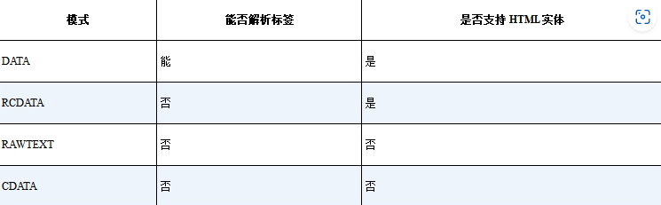

### 16.2 递归下降算法构造模式AST

```javascript
const TextModes = {
  DATA: 'DATA',
  RCDATA: 'RCDATA',
  RAWTEXT: 'RAWTEXT',
  CDATA: 'CDATA',
}

function parse(str) {
  // 上下文对象
  const context = {
    source: str,
    mode: TextModes.DATA,
  }
  
  // 第一个参数是上下文对象，第二个参数为由父代节点构成的栈
  // parseChildren本质上是一个状态机，其状态数由子节点的数量决定
  const nodes = parseChildren(conext, []);
  
  return {
    type: 'Root',
    children: nodes,
  }
}
```

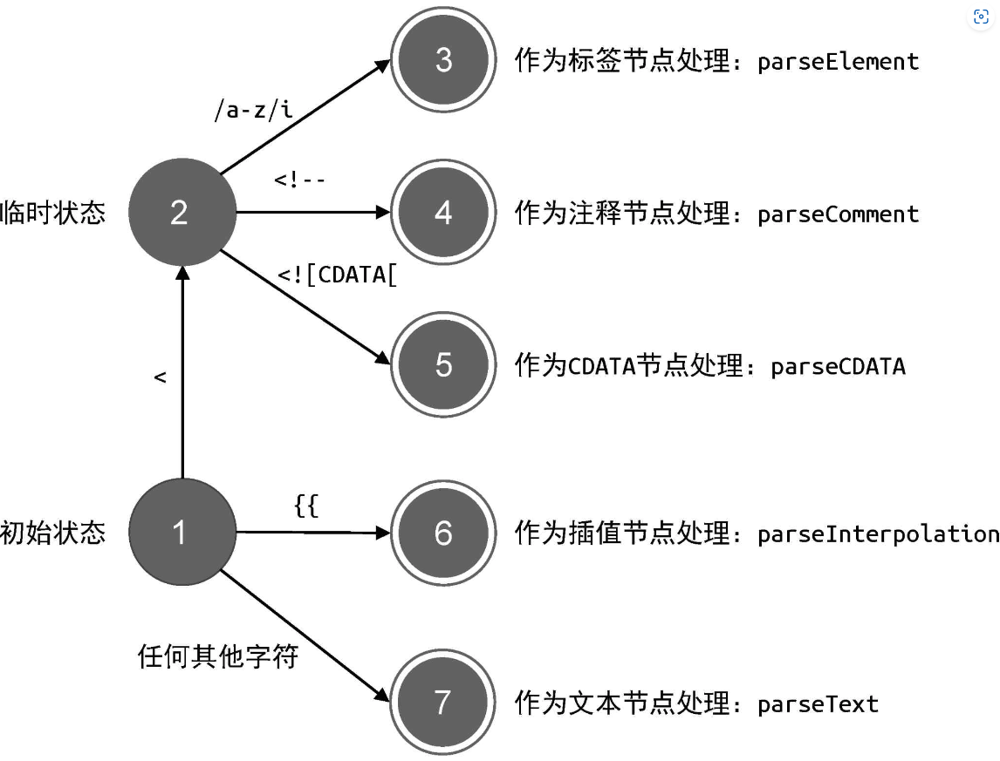

```javascript
function parseChildren(context, ancestors) {
  // 定义nodes数组存储子节点，它将作业最终的返回值
  let nodes = [];
  // 从上下文中获取当前状态，包括模式mode和模板内容source
  const { mode, source } = context;
 	// 开启while循环，只要满足条件就会一直对字符串进行解析
  while(!isEnd(context, ancestors)) {
    let node;
    // 只有DATA模式和RCDATA模式才支持插值节点的解析
    if (mode === TextNodes.DATA || mode === TextNodes.RCDATA) {
      // 只有DATA模式才支持标签节点的解析
      if (mode === TextNodes.DATA && source[0] === '<') {
        if (source[1] === '!') {
          if (source.startsWith('<!--')) {
            // 注释节点
            node = parseComment(context);
          } else if (source.startsWith('<![CDATA[')) {
            // CDATA
            node = parseCDATA(context, ancestors);
          }
        } else if (source[1] === '/') {
          // 结束标签，这里需要抛出错误，后文解释原因
        } else if (/[a-z]i/.test(source[1])) {
          // 标签
          node = parseElement(context, ancestors);
        }
      } else if (source.startsWith('{{')) {
        // 解析插件
        node = parseInterpolation(context);
      }
    }
    // node不存在，说明处于其他模式，即非DATA模式且非RCDATA模式
    // 这时一切内容都作为文本处理
    if (!node) {
      node = parseText(context);
    }
    // 将节点添加到nodes数组中
    nodes.push(node);
  }
  
  return nodes;
}
```

### 16.3 状态机的开启与停止

当解析器遇到开始标签时，会将该标签压入父级节点栈，同时开启新的状态机。当解析器遇到结束标签，并且父级节点栈中存在与该标签同名的开始标签节点时，会停止当前正在运行的状态机

```javascript
function isEnd(context, ancestors) {
  // 当模板内容解析完毕后，停止
  if (!context.source) return true;
  // 与低级节点栈内所有节点做比较
  for (let i = ancestors.length - 1; i >= 0; --i) {
    // 只要栈中存在与当前结束标签同名的节点，就停止状态机
    if (context.source.startsWith(`</${ancestors[i].tag}`)) {
      return true;
    }
  }
}
```

### 16.4 解析标签节点

```javascript
function parseElement(context, ancestors) {
  const element = parseTag(context);
  if (element.isSelfClosing) return element;
  
  if (element.tag === 'textarea' || element.tag === 'title') {
    context.mode = TextModes.RCDATA;
  } else if (/style|xmp|iframe|noembed|noframes|noscript/.test(element.tag)) {
    context.mode = TextNodes.RAWTEXT;
  } else {
    context.mode = TextNodes.DATA;
  }
  
  ancestors.push(element);
  element.children = parseChildren(context, ancestors);
  ancestors.pop();
  
  if (context.source.startsWith(`</${element.tag}`)) {
    parseTag(context, 'end');
  } else {
    console.error(`${element.tag} 标签缺少闭合标签`);
  }
}
```

### 16.5 解析属性

### 16.6 解析文本与解码HTML实体

#### 16.6.1 解析文本

#### 16.6.2 解码命名字符引用

> HTML 实体是一段以字符 & 开始的文本内容。实体用来描述 HTML 中的保留字符和一些难以通过普通键盘输入的字符，以及一些不可见的字符
>
> HTML 实体总是以字符 & 开头，以字符 ; 结尾

实体有两类：

- 命名字符引用，也叫命名实体
- 数字字符引用，这一类字符引用没有特定的名称，只能用数字表示，并**以字符串&#开头**
  - 可以用十进制表示，也可以用十六进制表示，比如&#60也可以表示为&#x3c，即**十六进制表示时以字符串&#x开头**

> 在Vue.js 模板中，文本节点所包含的 HTML 实体不会被浏览器解析。这是因为模板中的文本节点最终将通过如 el.textContent 等文本操作方法设置到页面，而通过el.textContent 设置的文本内容是不会经过 HTML 实体解码的

#### 16.6.3 解码数字字符引用

数字字符引用的格式是：前缀 + Unicode 码点

码点的提取：

```javascript
const hex = head[0] === '&#x';
const pattern = hex ? /^&#x([0-9a-f]+);?/i : /^&#([0-9]+);?/
// body[1]的值就是Unicode码点
const body = pattern.exec(rawText);
```

然后利用`String.fromCodePoint`解码：

```javascript
if (body) {
	const cp = parseInt(body[1], hex ? 16 : 10);
  const char = String.formCodePoint(cp);
}
```

### 16.7 解析插值与注释

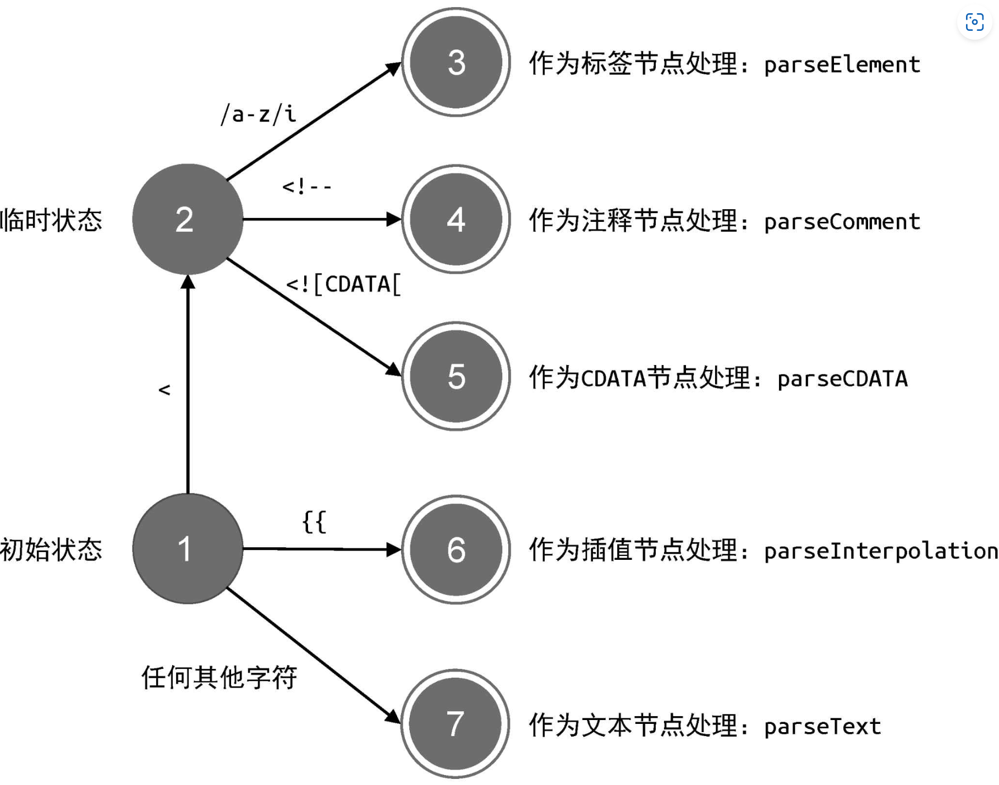

```javascript
function parseInterpolation(context) {
  // 消费开始定界符
  context.advanceBy('{{'.length);
  // 找到结束定界符的位置索引
  const loseIndex = context.source.indexOf('}}');
  if (closeIndex < 0) {
    console.error('插值缺少结束定界符');
  }
  // 截取开始定界符与结束定界符之间的内容作为插值表达式
  const content = context.source.slice(0, closeIndex);
  // 消费表达式的内容
  context.advanceBy(content.length);
  // 消费结束定界符
  context.advanceBy('}}'.length);

  // 返回类型为 Interpolation 的节点，代表插值节点
  return {
    type: 'Interpolation',
    // 插值节点的 content 是一个类型为 Expression 的表达式节点
    content: {
      type: 'Expression',
      // 表达式节点的内容则是经过 HTML 解码后的插值表达式
      content: decodeHtml(content),
    },
  };
}
```

## 第17章 编译优化

编译优化指的是编译器将模板编译为渲染函数的过程中，尽可能多地提取关键信息，并以此指导生成最优代码的过程

### 17.1 动态节点收集与补丁标志

#### 17.1.1 传统diff算法的问题

对于不包含响应式数据的DOM，依旧是使用diff算法对比新旧两棵树，而不是跳过静态的节点

编译器可以直接生成原生 DOM 操作的代码，这样甚至能够抛掉虚拟 DOM，从而避免虚拟 DOM 带来的性能开销（Svelte的思想是不是这个？），但考虑到兼容性（vue2），最后vue3还是保留了虚拟DOM

> 传统 Diff 算法无法利用编译时提取到的任何关键信息，这导致渲染器在运行时不可能去做相关的优化。而 Vue.js 3 的编译器会将编译时得到的关键信息“附着”在它生成的虚拟 DOM 上，这些信息会通过虚拟 DOM 传递给渲染器。最终，渲染器会根据这些关键信息执行“快捷路径”，从而提升运行时的性能

#### 17.1.2 Block与PatchFlags

传统的虚拟 DOM 中没有任何标志能够体现出节点的动态性。但经过编译优化之后，编译器会将它提取到的关键信息“附着”到虚拟 DOM 节点上，比如

```html
<div>
  <div>foot</div>
  <p>{{ bar }}</p>
</div>
```

传统的虚拟DOM如下：

```javascript
const vnode = {
  tag: 'div',
  children: [
    { tag: 'div', children: 'foo'},
    { tag: 'p', children: ctx.bar },
  ]
}
```

利用编译器提取到的关键信息“附着”到虚拟DOM节点上

```javascript
const vnode = {
  tag: 'div',
  children: [
    { tag: 'div', children: 'foo' },
    { tag: 'p', children: ctx.bar, patchFlag: PatchFlag.TEXT // 这是态节点，表示只是文本内容会变更，还有其它的标记位，比如表示只是class属性会发生变更
  ],
  // 将children中的动态节点提取到dynamicChildren数组中
  dynamicChildren: [
    { tag: 'p', children: ctx.bar, patchFlag: PatchFlag.TEXT
  ]
}
```

观察上面的 vnode 对象可以发现，与普通虚拟节点相比，它多出了一个额外的 **dynamicChildren 属性**。我们把带有该属性的虚拟节点称为“块”，即 Block。所以，**一个 Block 本质上也是一个虚拟DOM 节点**，只不过它比普通的虚拟节点多出来一个用来存储动态子节点的dynamicChildren 属性

**有了 Block 这个概念之后，渲染器的更新操作将会以 Block 为维度**，当渲染器在更新一个 Block 时，会**忽略**虚拟节点的 children 数组，而是**直接找到该虚拟节点的 dynamicChildren 数组**，并只更新该数组中的动态节点。这样，在更新时就实现了跳过静态内容，只更新动态内容

**当我们在编写模板代码的时候，所有模板的根节点都会是一个Block 节点**

```html
<template>
  <!-- 这个 div 标签是一个 Block -->
  <div>
    <!-- 这个 p 标签不是 Block，因为它不是根节点 -->
    <p>{{ bar }}</p>
  </div>
  <!-- 这个 h1 标签是一个 Block -->
  <h1>
    <!-- 这个 span 标签不是 Block，因为它不是根节点 -->
    <span :id="dynamicId"></span>
  </h1>
</template>
```

除此之外，**任何带有 v-for、v-if/v-else-if/v-else 等指令的节点都需要作为 Block 节点**

#### 17.1.3 收集动态节点

渲染函数并不会直接包含用来描述虚拟节点的数据结构，而是包含用来创建虚拟DOM的辅助函数createVNode，其基本实现如下：

```javascript
// 动态节点栈
const dynamicChildrenStack = [];
// 当前动态节点集合
let currentDynamicChildren = null;
// openBlock用来创建一个新的动态节点集合，并将该集合压入栈中
function openBlock() {
  dynamicChildrenStack.push((currentDynamicChildren = []));
}
// closeBlock用来将通过openBlock创建的动态节点集合从栈中弹出
function closeBlock() {
  currentDynamicChildren = dynamicChildrenStack.pop();
}

function createVNode(tag, props, children, flags) {
  const key = props && props.key;
  props && delete props.key;
  
  return {
    tag,
    props,
    children,
    key,
    patchFlags: flags
  }
  
  if (typeof flags !== 'undefined' && currentDynamicChildren) {
    currentDynamicChildren.push(vnode);
  }
  
  return vnode;
}

function render() {
  // 1. 使用createBlock代替createVNode来创建Block
  // 2. 每当调用createBlock之前，先调用openBlock
  return (openBlock(), createBlock('div', null, [
    createVNode('p', { class: 'foo' }, null, 1),
    createVNode('p', { class: 'bar' }, null),
  ]))
}

function createBlock(tag, props, children) {
  const block = createVNode(tag, props, children);
  block.dynamicChildren = currentDynamicChildren;
  
  closeBlock();
  return block;
}
```

编译器在优化阶段提取的关键信息会影响最终生成的代码

#### 17.1.4 渲染器的运行时支持

有了 dynamicChildren 之后，我们可以直接对比动态节点

```javascript
function patchElement(n1, n2) {
  const el = n2.el = n1.el;
  const oldProps = n1.props;
  const newProps = n2.props;
  
 	// 省略部分代码
  if (n2.dynamicChildren) {
  	patchBlockChildren(n1, n2);
  } else {
    patchChildren(n1, n2, el);
  }
}

function patchBlockChildren(n1, n2) {
  // 只更新动态节点即可
  for (let i = 0; i < n2.dynamicChildren.length; i++) {
    patchElement(n1.dynamicChildren[i], n2.dynamicChildren[i]);
  }
}
```

### 17.2 Block树

除了组件模板的根节点必须作为Block角色，带有结构化指令的节点，如带有 v-if 和 v-for 指令的节点，都应该作为 Block 角色

#### 17.2.1 带有v-if指令的节点

dynamicChildren 数组中收集的动态节点是忽略虚拟 DOM 树层级的

结构化指令会导致更新前后模板的结构发生变化，即模板结构不稳定，要想使其稳定，就需要让带有 v-if/v-else-if/v-else 等结构化指令的节点也作为 Block 角色

父级 Block 除了会收集动态子代节点之外，也会收集子 Block。因此，两个子Block(section) 将作为父级 Block(div) 的动态节点被收集到父级 Block(div) 的dynamicChildren 数组中（Block会有个key属性，据此区分不同的Block）

#### 17.2.2 带有v-for指令的节点

由于 v-for 指令渲染的是一个片段，所以我们需要使用类型为 Fragment 的节点来表达 v-for 指令的渲染结果，并作为 Block 角色

#### 17.2.3 Fragment的稳定性

v-for本身就会导致虚拟DOM树结构**不稳定**的问题（除非所遍历的对象是常量）

> Fragment 本身收集的动态节点仍然面临结构不稳定的情况。所谓结构不稳定，从结果上看，指的是更新前后一个 block 的 dynamicChildren 数组中收集的**动态节点的数量或顺序不一致**。这种不一致会导致我们无法直接进行靶向更新，怎么办呢？其实对于这种情况，没有更好的解决办法，我们只能放弃根据dynamicChildren 数组中的动态节点进行靶向更新的思路，并回退到传统虚拟DOM 的 Diff 手段，即直接使用 Fragment 的 children 而非 dynamicChildren 来进行 Diff 操作

### 17.3 静态提升

减少更新时创建虚拟 DOM 带来的性能开销和内存占用，把纯静态的节点的创建提升到渲染函数之外

静态提升是以树为单位的

动态节点上仍然可能存在纯静态的属性

### 17.4 预字符串化

- 大块的静态内容可以通过 innerHTML 进行设置，在性能上具有一定优势
- 减少创建虚拟节点产生的性能开销
- 减少内存占用

### 17.5 缓存内联事件处理函数

### 17.6 v-once

实现对虚拟 DOM 的缓存

使用 v-once 包裹的动态节点不会被父级 Block 收集，避免无用的diff开销

## 第18章 同构渲染

### 18.1 CSR\SSR以及同构渲染

- Vue.js 在当前页面已经渲染的 DOM 元素以及 Vue.js 组件所渲染的虚拟 DOM 之间建立联系
- Vue.js 从 HTML 页面中提取由服务端序列化后发送过来的数据，用以初始化整个 Vue.js 应用程序

**同构渲染仍然需要像 CSR 那样等待 JavaScript 资源加载完成，并且客户端激活完成后，才能响应用户操作，因此并不能提升可交互时间（TTI）**

### 18.2 将虚拟DOM渲染为HTML字符串

```javascript
// 自闭合标签
const VOID_TAGS = `area,base,br,col,embed,hr,img,input,link,meta,param,source,track,wbr`.split(',');

function renderElementVNode(vnode) {
  const { type: tag, props, children } = vnode;
  const isVoidElement = VOID_TAGS.includes(tag);
  
  let ret = `<${tag}`;
  
  if (props) {
    ret += renderAttrs(props);
  }
  
  ret += isVoidElement ? `/>` : `>`;
  if (isVoidElement) return ret;
  
  if (typeof children === 'string') {
    ret += children;
  } else if (Array.isArray(children)) {
    children.forEach(child => {
      ret += renderElementVNode(child);
    })
  }
  
  ret += `</${tag}>`;
  
  return ret;
}

// 渲染时需要忽略的属性
const shouldIgnoreProp = ['key', 'ref'];
function renderAttrs(props) {
  let ret = '';
  for (const key in props) {
    if (shouldIgnoreProp.includes(key) || /^on[^a-z]/.test(key)) {
      continue;
    }
    const value = props[key];
    ret += renderDynamicAttr(key, value);
  }
  return ret;
}

// 判断属性是否是boolean attribute
const isBooleanAttr = key => (`itemscope,allowfullscreen,formnovalidate,ismap,nomodule,novalidate,readonly,async,autofocus,autoplay,controls,default,defer,disabled,hidden,loop,open,required,reversed,scoped,seamless,checked,muted,multiple,selected`).split(',').includes(key);

// 用来判断属性名称是否合法且安全
const isSSRSafeAttrName = key => !/[>/="'\u0009\u000a\u000c\u0020]/.test(key);

function renderDynamicAttr(key, value) {
  if (isBooleanAttr(key)) {
    return value === false ? `` : ` ${key}`;
  } else if (isSSRSafeAttrName(key)) {
    return value === '' ? ` ${key}` : ` ${key}="${escapeHtml(value)}"`;
  } else {
    console.warn(
    `[@vue/server-renderer] Skipped rendering unsafe attribute name: ${key}`
    );
    return ``;
  }
}

const escapeRE = /["'&<>]/;
function escapeHtml(string) {
  const str = '' + string;
  const match = escapeRE.exec(str);
  
  if (!match) {
    return str;
  }
  
  let html = '';
  let escaped;
  let index;
  let lastIndex = 0;
  for (index = match.index; index < str.length; index++) {
    switch(str.charCodeAt(index)) {
      case 34: // "
        escaped = '&quot;';
        break;
      case 38: // &
        escaped = '&amp;';
        break;
      case 39: // '
        escaped = '$#39;';
        break;
      case 60: // <
        escaped = '&lt;';
        break;
      case 62: // >
        escaped = '&gt;';
        break;
      default:
        continue;
    }
    
    if (lastIndex !== index) {
      html += str.substring(lastIndex, index);
    }
    
    lastIndex = index + 1;
    html += escaped;
  }
  
  return lastIndex !== index ? html + str.substring(lastIndex, index) : html;
}
```

### 18.3 将组件渲染为HTML字符串

只需要执行组件的渲染函数取得对应的虚拟 DOM，再将该虚拟 DOM 渲染为 HTML 字符串，并作为 renderComponentVNode 函数的返回值即可

```javascript
function renderComponentVNode(vnode) {
  const isFunctional = typeof vnode.type === 'function';
  let componentOptions = vnode.type;
  if (isFunctional) {
    componentOptions = {
      render: vnode.type,
      props: vnode.type.props
    }
  }
  
  let { render, data, setup, beforeCreate, created, props: propsOption } = componentOptions;
  
  beforeCreate && beforeCreate();
  
  // 无须使用reactive()创建data的响应式版本
  const state = data ? data() : null
  const [props, attrs] = resolveProps(propsOtion, vnode.props)
  
  const slots = vnode.children || {};
  
  const instance = {
    state,
    props, // props无须shallowReactive
    isMounted: false,
    subTree: null,
    slots,
    mounted: [],
    keepAliveCtx: null,
  }
  
  function emit(event, ...payload) {
    const eventName = `on${event[0].toUpperCase() + event.slice(1)}`;
    const handler = instance.props[eventName];
    if (handler) {
      handler(...payload);
    } else {
      console.error('事件不存在');
    }
  }
  
  // setup
  let setupState = null
  if (setup) {
    const setupContext = { attrs, emit, slots };
    const prevInstace = setCurrentInstance(instance);
    const setupResult = setup(shallowReadonly(instance.props), setupContext);
    setCurrentInstance(prevInstance);
    if (typeof setupResult === 'function') {
      if (render) console.error('setup函数返回渲染函数，render选项将被忽略')；
      render = setupResult;
    } else {
      setupState = setupContext;
    }
  }
  
  vnode.component = instance;
  
  const renderContext = new Proxy(instance, {
    get(t, k, r) {
      const { state, props, slots } = t;
      if (k === '$slots') return slots;
      if (state && k in state) {
        return state[k];
      } else if (k in props) {
        return props[k];
      } else if (setupState && k in setupState) {
        return setupState[k];
      } else {
        console.error('不存在');
      }
    },
    set(t, k, v, r) {
      const { state, props} = t;
      if (state && k in state) {
        state[k] = v;
      } else if (k in props) {
        props[k] = v;
      } else if (setupState && k in setupState) {
        setupState[k] = v;
      } else {
        console.error('不存在')
      }
    }
  });
  created && created.call(renderContext);
  const subTree = render.call(renderContext, renderContext);
  
  return renderVNode(subTree);
}

function renderVNode(vnode) {
  const type = typeof vnode.type;
  if (type === 'string') {
    return renderElementVNode(vnode);
  } else if (type === 'object' || type === 'function') {
    return renderComponentVNode(vnode);
  } else if (vnode.type === Text) {
    // 处理文本
  } else if (vnode.type === Fragment) {
    // 处理片段
  } else {
    // 处理其它VNode类型
  }
} 
```

### 18.4 客户端激活的原理

组件代码在客户端运行时，仍然需要做两件重要的事：

- 在页面中的 DOM 元素与虚拟节点对象之间建立联系
- 为页面中的 DOM 元素添加事件绑定

**真实DOM元素与虚拟DOM对象一定要是“同构”的，才能进行激活**

```javascript
function hydrate(vnode, container) {
  // 从容器元素的第一个子节点开始
  hydrateNode(container.firstChild, vnode);
}

function hydrateNode(node, vnode) {
  const { type } = vnode;
  // 1. 让vnode.el引用真实DOM
  vnode.el = node;
  
  // 2. 检查虚拟DOM的类型，如果是组件，则调用mountComponent函数完成激活
  if (typeof type === 'object') {
    mountComponent(vnode, container, null);
  } else if (typeof type === 'string') {
    // 检查真实DOM的类型与虚拟DOM的类型是否匹配
    if (node.nodeType !== 1) {
      console.error('mismatch');
      console.error('服务端渲染的真实DOM节点是：', node);
      console.error('客户端渲染的虚拟DOM节点是：', vnode);
    } else {
      // 如果是普通元素，则调用hydrateElement完成激活
      hydrateElement(node, vnode);
    }
  }
  // 5. 重要：hydrateNode函数需要返回当前节点的下一个兄弟节点，以便继续进行后续的激活操作
  return node.nextSibling;
}

function hydrateElement(el, vnode) {
  // 1. 为DOM元素添加事件
  if (vnode.props) {
    for (const key in vnode.props) {
      if (/^on/.test(key)) {
        patchProps(el, key, null, vnode.props[key]);
      }
    }
  }
  
  // 递归激活子节点
  if (Array.isArray(vnode.children)) {
    // 从第一个子节点开始
    let nextNode = el.firstChild;
    const len = vnode.children.length;
    for (let i = 0; i < len; i++) {
      // 激活子节点，注意，每当激活一个子节点，hydrateNode函数都会返回当前子节点的下一个兄弟节点
      nextNode = hydrateNode(nextNode, vnode.children[i]);
    }
  }
}
```

### 18.5 编写同构的代码

#### 18.5.1 组件的生命周期

只有 beforeCreate 与 created 这两个钩子函数会在服务端执行

#### 18.5.2 使用跨平台的API

避免使用平台特有的 API

#### 18.5.3 只在某一端引入模块

通过环境变量+条件引入

#### 18.5.4 避免交叉请求引起的状态污染

在服务端渲染时，我们会为每一个请求创建一个全新的应用实例

#### 18.5.5 \<ClientOnly>组件

```javascript
import { ref, onMounted, defineComponent } from 'vue';

export const ClientOnly = defineComponent({
  setup(_, { slots }) {
    const show = ref(false);
    // onMounted钩子只在客户端执行
    onMounted(() => {
      show.value = true;
    })
    
    // 在服务端什么都不渲染，在客户端才会渲染<ClientOnly>组件的插槽内容
    return () => (show.value && slots.default ? slots.default() : null);
  }
})
```

