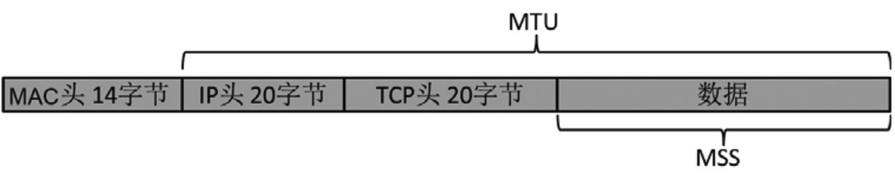

# Wireshark网络分析的艺术

## 答读者问

### Linux为什么卡住了？

ssh远程登录linux服务器时，卡顿的这个10秒（当然，现在基本不需要10秒），是因为linux服务器在做这件事：向DNS服务器查询访问者ip的PRT记录（反向解析），试图获取这个IP地址所对应的域名，假如经过5秒钟还没收到回复，就再发一次查询，如果第二次查询还是等了5秒钟没回复，就彻底放弃查询

也就是说，如果DNS中有这条PTR记录（比如手动添加），则可以实现立刻登录

而这种ssh登录时通过DNS查询PTR行为是定义在`/etc/ssh/sshd_config`文件中的配置项`UseDNS`，默认值是`yes`，改为`no`之后就可以关闭该行为了

### 像福尔摩斯一样思考

用Wireshark排查问题，和侦探破案的思路是一致的——溯因推理

> 一般发出Identification为0的机器永远都发0，不会一下子跳到49031

### 一篇关于VMware的文章

在VMware和存储阵列上关闭延迟确认（Delayed ACK），其好处是省去一个纯粹的确认包，如果有数据可以顺便捎带过去，而坏处也很明显，要凭空多出一段延迟

### 来点有深度的

基于上一篇中提到的问题，还可以通过启用了TCP SACK（Selective Acknowledgement）功能，因此在大量丢包的时候不需要每个重传包都确认一次，也就不怕延迟确认的影响了

启用SACK其实比关闭延迟确认更高效，因为它可以一次性重传多个丢包，而不用每重传一个就等待一次Ack，白费多个往返时间

当TCP窗口极小时，启用延迟确认简直就是雪上加霜

**在wireshark中如何发现延迟确认**：用“tcp.analysis.ack_rtt > 0.2 and tcp.len==0”过滤一下

### 三次握手的小知识

wireshark开启seq相对值：`Perference --> Protocols --> TCP --> Relative sequence numbers`

定位握手失败的过滤表达式：

1. `(tcp.flags.reset == 1)&&(tcp.seq==1)`，配合seq相对值，可过滤握手请求被对方拒绝的包，找到包，点击`Follow TCP Stream`
2. `(tcp.flags.syn == 1)&&(tcp.analysis.retransmission)`，可过滤重传的握手请求，往往是因为对方没收到包

DDoS、half-open状态的TCP连接，Wireshark可以轻易发现SYN flood，通过`Analyze --> Expert Information`

### 被误解的TCP

并不是每个包都有对应的Ack，Ack是有累积效应的，它隐含了“在此之前的其他包也已收到”的意思

### 最经典的网络问题

愚笨窗口综合症（Silly window syndrome， 也叫小包问题 small packet problem）和纳格（Nagle）算法

### 为什么丢了单子

### 受损的帧

**数据链路层的错误检测机制FCS（Frame Check Sequence）**：每个帧在发送前都会被发送方校验一次，然后生成4个字节的FCS存在帧尾。接收方拿到帧之后，又会用相同的算法再做一次校验并生成FCS。假如这次生成的FCS和帧尾携带的不一致，就说明该帧已被损坏，应该丢弃了

*IP头20个字节，MAC头14个字节，UDP头8个字节，TCP头20个字节*

### 虚惊一场

**四次挥手时用错Ack值会有什么后果呢？它可能导致TCP连接断开失败，留下一个本不应该存在的连接，久而久之就会导致新连接建立失败**

### NTML协议分析

已不推荐使用

### Wireshark的提示

- Packet size limited during capture

  包没抓全，一般由抓包方引起，有些操作系统中，tcpdump默认只抓每个帧的前96个字节，可以通过`-s`来指定想要抓到的字节数

  `tcpdump -ieth0 -s1000 -w/tmp/tcpdump.cap`

- TCP Previous segment not captured

  > 在TCP传输过程中，同一台主机发出的数据段应该是连续的，即后一个包的Seq号等于前一个包的Seq+Len（三次握手和四次挥手是例外）。如果Wireshark发现后一个包的Seq号大于前一个包的Seq+Len，就知道中间缺失了一段数据。假如缺失的那段数据在整个网络包中都找不到（即排除了乱序），就会提示[TCP Previous segment not captured]

  在Wireshark中查看对方回复的Ack包，如果包含了没抓到的那个包，那就是抓包工具漏掉，否则就是真的丢了

- TCP ACKed unseen segment

  当Wireshark发现被Ack的那个包没抓到，就会作此提示，**它几乎是永远可以忽略的**

- TCP Out-of-Order

  在TCP传输过程中（不包括三次握手和四次挥手），同一台主机发出的数据包应该是连续的，即后一个包的Seq号等于前一个包的Seq+Len。当Wireshark发现后一个包的Seq号小于前一个包的Seq+Len时，就会认为是乱序了，因此提示 [TCP Out-of-Order]

- TCP Dup ACK

  当乱序或者丢包发生时，接收方会收到一些Seq号比期望值大的包。它每收到一个这种包就会Ack一次期望的Seq值，以此方式来提醒发送方，于是就产生了一些重复的Ack。Wireshark会在这种重复的Ack上标记[TCP Dup ACK]

- TCP Fast Retransmission

  当发送方收到3个或以上[TCP Dup ACK]，就意识到之前发的包可能丢了，于是快速重传它（这是RFC的规定）

- TCP Retransmission

  如果一个包真的丢了，又没有后续包可以在接收方触发[Dup Ack]，就不会快速重传。这种情况下发送方只好等到超时了再重传，此类重传包就会被Wireshark标上[TCP Retransmission]

- TCP zero window

  当Wireshark在一个包中发现“win=0”时，就会给它打上“TCP zerowindow”的标志，表示缓存区已满，不能再接收数据了

- TCP window Full

  当Wireshark在一个包中打上[TCP window Full]标志时，就表示这个包的发送方已经把对方所声明的接收窗口耗尽了

  **[TCP window Full]很容易跟[TCP zerowindow]混淆，实际上它们也有相似之处。前者表示这个包的发送方暂时没办法再发送数据了，后者表示这个包的发送方暂时没办法再接收数据了，也就是说两者都意味着传输暂停，都必须引起重视**

## 工作中的Wireshark

### 书上错了吗

### 计算”在途字节“

已经发送出去，但尚未被确认的字节数

在数据接收方抓的包里是看不到在途字节数的，没有分析意义

在途字节数 = Seq + Len - Ack

### 估算网络拥塞点

当发送方一口气向网络中注入大量数据时，就可能超过该网络的承受能力而导致拥塞，这个足以触发拥塞的数据量就称为**拥塞点**，**发生拥塞时的在途字节数即是该时刻的网络拥塞点**

先从Wireshark中找到一连串重传包中的第一个，再根据该重传包的Seq值找到其原始包，最后计算该原始包发送时刻的在途字节数。由于网络拥塞就是在该原始包发出去的时刻发生的，所以这个在途字节数就大致代表了拥塞点的大小

### 顺便说说LSO（Large Segment Offload）

传统的网络工作方式是这样的：应用层把产生的数据交给TCP层，TCP层再根据MSS大小进行分段（由CPU负责），然后再交给网卡。**而启用LSO之后，TCP层就可以把大于MSS的数据块直接传给网卡，让网卡来负责分段工作了**。比如本例子中的“Seq=348586, Len=2776”，最后会被网卡分成“Seq=348586，Len=1388”和“Seq=349974, Len=1388”两个包。由于在发送方抓包时相当于站在CPU的视角，所以看到的是一个分段前的大包

### 熟读RFC

### 一个你本该能解决的问题

### 几个关于分片的问题

- TCP是如何避免被发送方分片的

  TCP可以避免被发送方分片，是因为它主动把数据分成小段再交给网络层。最大的分段大小称为**MSS（Maximum Segment Size），它相当于把MTU刨去IP头和TCP头之后的大小，所以一个MSS恰好能装进一个MTU中**

  

  **UDP则没有MSS的概念，一股脑交给网络层，所以可能被分片**

- TCP又是怎样适配接收方的MTU的

  TCP建立连接时必须先进行三次握手（如图6所示），在前两个握手包中双方互相声明了自己的MSS

### MTU导致的悲剧

当客户端发给服务器的巨帧经过路由器时，或者**被丢包**，或者被分片。这取决于该巨帧是否在网络层携带了DF（Don't fragment）标志。如果带了就被丢弃，如果没带就被分片

```bash
# -l用于指定包大字节数，-f用于标记不允许分片
ping xxx -l 1472 -f -n 1
```


### 迎刃而解

TLB的特点就是收包工作只由一个网卡负责，发包工作则分摊给所有网卡

### 昙花一现的协议

### 另一种流控

只要很少的丢包重传就足以对性能造成巨大影响。当局域网中的重传率超过0.1%就值得采取措施了，快速重传和超时重传的影响很不一样，所以这个经验值仅供参考

IEEE 802.3x所定义的**“暂停帧”（Pause Frame）**就实现了这个功能：

- 当交换机的缓冲区即将被填满时，它可以给服务器发一个暂停帧，让它等待一会再发。这样就避免了溢出丢包，从而避免了重传。交换机在等待时间里会继续把缓冲区的数据传给客户端，使负担得以释放
- 服务器需要等待的时间长度是由暂停帧指定的pause_time指定的。过了等待时间之后，服务器才可以发数据
- 假如交换机缓冲区里的数据提前消化了，它还可以给服务器发一个pause_time为0的暂停帧，告诉服务器无需等待了

暂停帧的Destination MAC地址**固定是01-80-C2-00-00-01**，所以在不同的环境中看到相同的地址也不要觉得奇怪

暂停帧可以**是双向的**，即服务器在必要的时候也可以向交换机请求暂停

### 过犹不及

连接数并非越多越好

### 治疗强迫症

### 技术与工龄

在三次握手时双方都把一个叫“Window Scale”的值告知对方。对方收到后会把这个值当作2的指数，算出来的值再作为接收窗口的系数。有了这个系数就可以把接收窗口扩展好多倍了

如果在三次握手之后才开始抓包会怎么样？不难想象，因为Wireshark无从知晓Window Scale的值，所以就无法计算出系数，只好显示出没有系数时的大小

### 如何科学地推卸责任

由于TTL的初始值一般为64

### 一个面试建议

## 生活中的Wireshark

### 假宽带真相

### 手机抓包

### 微博为什么会卡

DNS解析与缓存

### 寻找HttpDNS

### 谁动了我的网络

### 一个协议的进化

Http1.1 --> Http2.0 --> QUIC

### 假装产品经理

### 自学的窍门

1. 第一步，从浏览权威的百科网站开始
2. 第二步，善用搜索引擎
   1. 善用google
   2. 使用英文搜索
   3. 关注图片搜索结果
3. 第三步，啃一本大部头
4. 第四步，动手操作

## 两个项目

### 打造自己的分析工具

