# CSS新世界

## 第2章 需要提前了解的知识

[CSS值类型文档大全](https://www.zhangxinxu.com/wordpress/2019/11/css-value-type/)

[CSS届的绘图板CSS Paint API简介](https://www.zhangxinxu.com/wordpress/2018/11/css-paint-api-canvas/)

[CSS Painting API](https://developer.mozilla.org/en-US/docs/Web/API/CSS_Painting_API)

### 2.2 CSS属性值定义语法

语法包含**3种**基本组成元素：

- 关键字
- 数据类型
- 符号

#### 1. 关键字

关键字分为**通用关键字**（auto、none、ease等）和**全局关键字**（inherit、initial、unset、revert等）

#### 2. 数据类型

数据类型外面有一对尖括号，分为**基本类型**（CSS规范中专门定义的）与**其他类型**

#### 3. 符号

分为**字面符号、组合符号、数量符号**

- **字面符号**：CSS属性值中原本就支持的合法符号，这些符号在CSS语法中会**按其原本的字面意义呈现**，目前只有**2**个，一个是**逗号**（并列分隔符，用来分隔数个并列值，或分隔函数的参数值），另一个是**斜杠**（缩写分隔符，用来分隔一个值的多个部分，在CSS缩写中用于分离**类型相同但属于不同CSS属性的值**）
- **组合符号**：表示数个基本元素之羊的组合关系。目前共有**5**个：
  - 空格：表示并列，各部分必须出现，且需要**按顺序**出现
  - &&：“与”组合符，各部分必须出现，但**可以不按顺序**出现
  - ||：“或”组合符，各部分**至少出现一个**，**可以不按顺序**出现
  - |：“互斥”组合符，各部分**恰好出现其中一个**
  - []：方括号，将各部分分组以绕过上面几个符号的优先规则，即方括号的优先级最高
- **数量符号**：描述一个元素可以出现多少次，不能叠加出现，并且**优先级高于组合符号**，目前共**6**个，且大多数与正则表达式中的含义一样
  - 空格：无数量符号，表示**恰好出现一次**
  - *：出现任意次数
  - +：出现一次或多次
  - ？：出现零次或一次，即可有可无
  - {A, B}：出现最少A次，最多B次
  - #：可以出现一次或多次，但多次出现时**必须以逗号分隔**
  - !：表示**当前分组必须产生一个值**，该符号**多出现在组合符号方括号的后面**

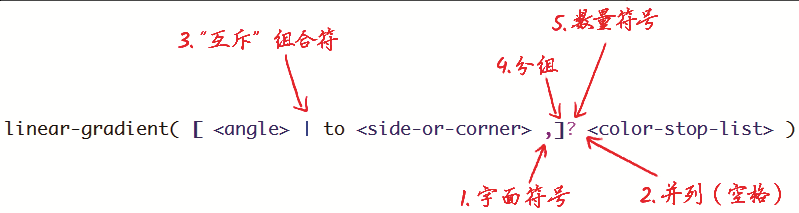

#### 4. 字面符号斜杠（/）的详细介绍

在CSS这门语言中，凡是出现斜杠（/）的地方，斜杠前后的数据类型一定是**相同或者部分相同的**，否则整个语句就是非法的。

斜杠这个符号除了出现在部分CSS的缩写语法中，还会出现在一些CSS函数中用来表示分隔，例如rgba()函数的语法：

```css
<rgba()> = rgba(<percentage{3}[/<alpha-value]?) | 
           rgba(<number>{3}[/<alpha-value>]?) | 
           rgba(<percentage>#{3},<alpha-value>?)
           rgba(<number>#{3},<alpha-value>?)
```

### 2.3 全局关键字属性

- inherit：继承，IE浏览器从IE8就开始支持

- initial：initial关键字适合用在需要重置某些CSS样式，但又不记得初始值的场景，**常见误区：把initial关键字理解为浏览器设置的元素的初始值**（这个时候其实是使用**revert**）

- unset：unset是不固定值关键字，其特性如下：如果当前使用的CSS属性是具有继承特性的，如color属性，则等同于使用inherit关键字；如果当前使用的CSS属性是没有继承特性的，如background-color，则等同于使用initial关键字。所以**unset这个关键字只有配合all属性使用才有意义，即批量重置**，如：

  ```css
  dialog {
    all: unset;
  }
  ```

  

- revert：让当前元素的样式还原成浏览器内置的样式

#### 2.4 `@supports`

**语法**：

```css
@supports <supports-condition> {
	/* css规则集 */
}

<supports-condition> = (<var>)|not (<var>)|(<var>) [and <var>]+|(<var>)[or <var>]+
/* 注意这里出现的递归 */
<var> = <declaration> | <supports-condition>
```

注意上面的递归表示，所以当“判断当前浏览器支持弹性布局，但不支持网格布局”时，**并不是**如下写法：

```css
@supports (display: flex) and not (display: grid) {}
@supports not (display: grid) and (display: flex) {}
```

**正确**的写法是：

```css
@supports (display: flex) and (not (display: grid)){}
```

**@supports规则支持CSS自定义属性的检测和CSS选择器语法的检测**

```css
@supports (--var: blue) {}
@supports selector(:default) {}
```

**浏览器还提供了CSS.supports()接口**

```javascript
CSS.supports(propertyName, value);
CSS.supports(supportCondition);

CSS.supports('position','sticky')
```

## 第3章 从增强已有的CSS属性开始

### 3.1 尺寸体系

CSS的width属性新增了4个与尺寸概念相匹配的关键字，包括**fit-content**、**fill-available**、**min-content**和**max-content**

#### 3.1.1 fit-content

##### 1. width:fit-content

设置元素的尺寸为内容的尺寸，优点如下：

- 不修改元素的display值
- 让元素的尺寸有了确定的值，比如可以使用margin: auto这样来进行居中尺寸不确定的元素

> CSS动画关键帧中的CSS语句的优先级最高

##### 2. fit-content关键字的兼容性

- 样例：

	```css
	.example {
		width: -webkit-fit-content;
  	width: -moz-fit-content;
  	width: fit-content;
	}
	```

- **firefox暂不支持`height: fit-content`，即可添加了`-moz-`前缀（部分场合下有效，比如当`writing-mode: vertical-rl`时）**

	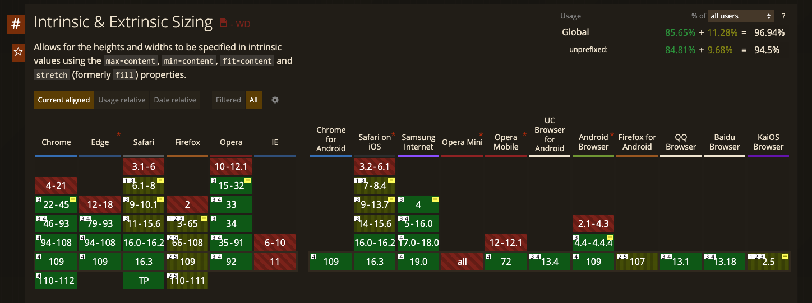

- min-width属性和max-width属性可以正确渲染fit-content关键字，而max-height和min-height属性设置fit-content关键字虽然语法正确，但**没有任何具体的样式表现**

#### 3.1.2 stretch、available、fill-available

##### 1. 区别

- stretch指“弹性拉伸”，是最新的规范中定义的关键字，替换之前的fill-available和available。

- available指“可用空间”，是Firefox浏览器使用的关键字，需要配合-moz-私有前缀使用。

- fill-available指“填充可用空间”，是webkit浏览器使用的关键字，需要配合-webkit-私有前缀使用。

```css
/* 面向未来的写法 */
.example {
	width: -webkit-fill-available;
  width: -moz-available;
  width: stretch;
}
```

##### 2. 兼容性

Firefox浏览器在其他所有场景下都运行完美，唯独对table和inline-table水平的元素的渲染有问题，这些元素设置width:-moz-available的效果和设置width:100%是一样的

#### 3.1.3 深入理解min-content关键字

min-content关键字实际上就是CSS2.1规范中提到的“preferred minimum width”或者“minimum content width”，即“首选最小宽度”或者“最小内容宽度”。

- 对于像图片、视频、按钮等替换元素，其首选最小宽度为当前元素内容自身的宽度

- 对于CJK（中文、日文、韩文）文字，以中文为例，如果是一段没有标点的文字，则首选最小宽度为**单个汉字的宽度**，**如果文字包含避头标点（不能出现在文字头部）或避尾标点（不能出现在文字尾部）【在不同浏览器中，避头与避尾标点的定义不同】，同时`line-break`的属性不是`anywhere`，则最终首选最小宽度需要包含标点字符的宽度**

- 非CJK文字的首选最小宽度是由**字符单元的宽度**决定的，所有连续的英文字母、数字和标点都被认为是一个字符单元，直到遇到中断字符（比如空格符）

  > 我们可以使用word-break:break-all或者word-wrap:break-word改变字符单元的中断规则，从而改变容器元素的首选最小宽度。

- 一个元素最终的首选最小宽度是所有内部子元素中最大的那个首选最小宽度值

#### 3.1.4 快速了解max-content关键字

> max-content关键字的作用是让元素尽可能大，保证图文内容在一行显示，哪怕最终的宽度溢出外部容器元素。

> 所有需要使用max-content关键字的场景，都能使用white-space:nowrap声明实现一模一样的效果，并且white-space:nowrap的兼容性更好

### 3.2 深入理解CSS逻辑属性

> CSS逻辑属性需要配合writing-mode属性、direction属性或者text-orientation属性使用才有意义。

#### 3.2.1 margin-inline-endn属性

> 当文档流的方向是从左往右的时候，margin-inline- end属性的渲染表现就等同于margin-right属性；当文档流的方向是从右往左的时候，margin-inline-end属性的渲染表现就等同于margin-left属性。

**border-inline-start**类似效果

#### 3.2.2 inline/block与start/end元素

以margin为例，margin方位属性和margin逻辑属性相互的映射关系，其中inline/block表示方向，start/end表示起止方位

```
margin-left    ↔  margin-inline-start
margin-top     ↔  margin-block-start
margin-right   ↔  margin-inline-end
margin-bottom  ↔  margin-block-end
```

#### 3.2.3 width/height属性与inline-size/block-size逻辑属性

默认情况下，width属性对应的CSS逻辑属性是inline-size，height属性对应的CSS逻辑属性是block-size

#### 3.2.4 由margin/padding/border演变而来的逻辑属性

新的CSS逻辑属性如下：

- margin-inline-start、margin-inline-end、margin-block-start、margin- block-end
- padding-inline-start、padding-inline-end、padding-block-start、padding-block-end
- border-inline-start、border-inline-end、border-block-start、border- block-end
- border-inline-start-color、border-inline-end-color、border-block- start-color、border-block-end-color
- border-inline-start-style、border-inline-end-style、border-block- start-style、border-block-end-style
- border-inline-start-width、border-inline-end-width、border-block- start-width、border-block-end-width

#### 3.2.5 text-align属性支持的逻辑属性值

即`text-align: start`与`text-align: end`

#### 3.2.6 最有用的CSS逻辑属性inset

即：`inset-inline-start` 、`inset-inline-end`、 `inset-block-start`、 `inset-block-end`

及对应的缩写`inset-inline`、`inset-block`

及全缩写`inset`，作用如下：

```css
.overlay {
    position: absolute;
    left: 0; top: 0; right: 0; bottom: 0;
}
```

与下面的效果一致

```css
.overlay {
    position: absolute;
    inset: 0;
}
```

**safari**对其缩写形式兼容性不是很好

### 3.3 在CSS边框上做文章

#### 3.3.1 border-image

示意图：

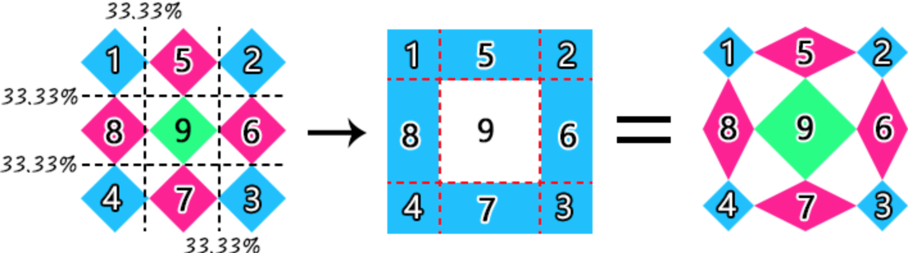

对应的代码：

```css
.example {
    border-image-source: url('./grid-nine.svg');
  	/* fill的作用是进行中间部分的填充 */
    border-image-slice: 33.33% fill;
}
```

##### border-image-width属性

对九宫格的控制依赖于`border-image-width`属性，示意如下：

1. 为数值时

   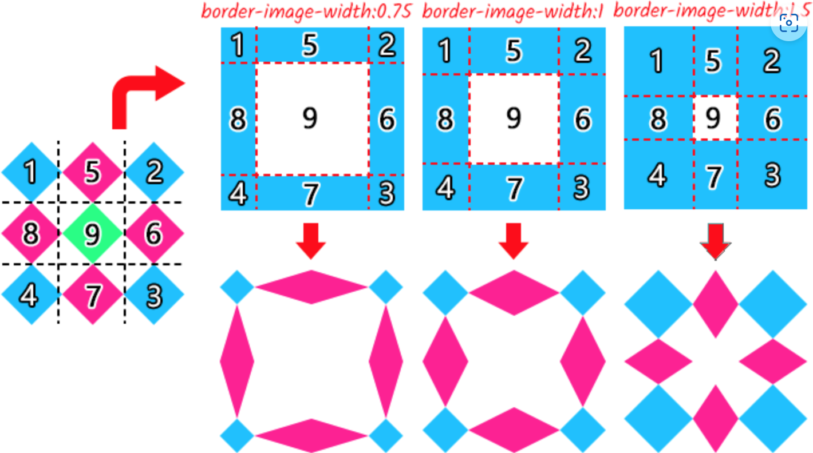

2. 为具体的长度值

3. 为百分比

   相对于元素自身的尺寸计算的，水平方位相对于宽度计算，垂直方位相对于高度计算，例如这段代码：

   ```css
   .example {
       border-image: url(./grid-nine.svg) 54;
       /* 上下各占50%，左右占25% */
       border-image-width: 50% 25%;
   }
   ```

   对应的效果：

   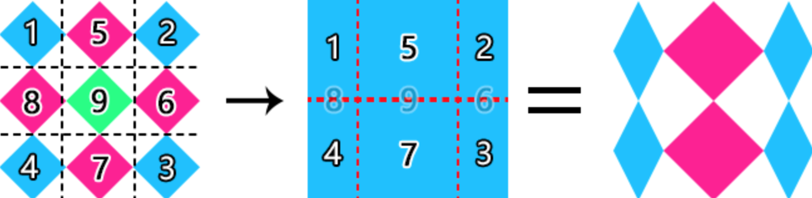

   

4. 为`auto`时

   使用border-image-slice属性划分的尺寸作为九宫格宽度值

##### border-image-outset属性

该属性支付数值或具体的长度，如果是数值，则是相对`border-image-width`的值计算的

##### border-image-repeat属性

直接上图：

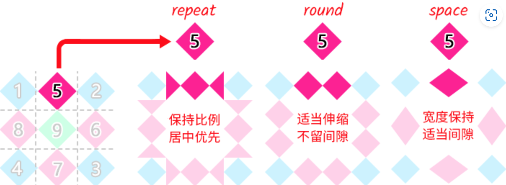

##### border-image缩写语法

语法：

```
border-image: <'border-image-source'> || <'border-image-slice'> [ / <'border-image- width'> | / <'border-image-width'>? / <'border-image-outset'> ]? || <'border-image-repeat'>
```

### 3.4 position属性的增强

**流盒**：黏性定位元素最近的可滚动元素的尺寸盒子，如果没有可滚动元素，则表示浏览器视窗盒子

**黏性约束矩形**：黏性定位元素的包含块（通常是父元素）在文档流中呈现的矩形区域和流盒的4个边缘在应用黏性定位元素的left、top、right和bottom属性的偏移计算值后的新矩形的交集。由于滚动时流盒不变，而黏性定位元素的包含块跟着滚动，因此黏性约束矩形随着滚动的进行是实时变化的

示例：

```html
<div>
  <nav>导航</nav>
</div>
```

```css
div {
    height: 100px;    
    margin-top: 50px;
    border: solid deepskyblue;
}
nav {
    position: sticky;
    top: 20px;
    background: lightskyblue;
}
```

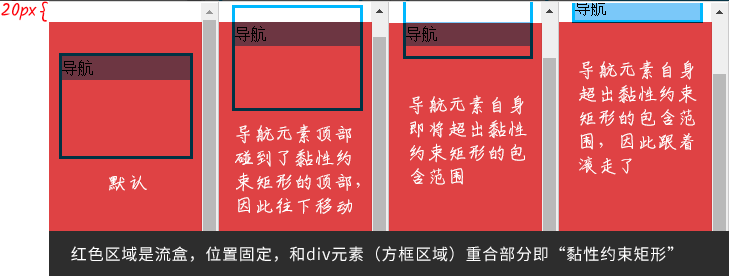

计算规则如下：

> 由于<nav>这个黏性定位元素的top偏移是20px，因此，流盒矩形就是滚动窗口矩形再往下偏移20px，也就是图3-41所示的红色区域。而<nav>这个黏性定位元素的包含块就是其父元素<div>（设置了边框）。黏性约束矩形指的是流盒矩形和包含块的重叠区域，因此，图3-41所示的黏性约束矩形就是红色区域和方框区域重叠的矩形区域。
>
> 在默认状态下（图3-41左一），由于<div>元素设置了margin-top:50px，因此，<nav>这个黏性定位元素的顶部距离黏性约束矩形的顶部还有33px（即30px的距离加上3px的边框高度），此时不会有黏性效果。随着浏览器页面滚动，<nav>元素的顶部和黏性约束矩形的顶部距离越来越小，直到距离为0。此时<nav>元素开始下移，将自己约束在黏性约束矩形范围内，如图3-41左二所示。浏览器页面继续滚动，<nav>元素的底部也快要超出黏性约束矩形范围的限制了，如图3-41右二所示。最终，<nav>元素的底部和黏性约束矩形范围的底部重合。由于黏性定位元素不能超出黏性约束矩形范围的限制，因此此时黏性效果失效，<nav>元素跟着一起滚走了，如图3-41所示右一。

[Demo](https://demo.cssworld.cn/new/3/4-2.php)

个人在这里的理解，流盒的规范应该补充上：其定位是在应用了黏性定位元素的top、left、right、bottom之后，然后黏性约束矩形就可以定义为黏性定位元素的父元素与流盒的交集了

**黏性定位的堆叠规则**

> 黏性定位元素的偏移由容器决定，如果多个黏性定位元素在同一容器中，则这几个黏性定位元素会产生元素重叠的情况；如果黏性定位元素分布在不同的容器中，同时这些容器在布局上是上下紧密相连的，则视觉上会表现为新的黏性定位元素挤开原来的黏性定位元素，形成依次占位的效果。

[Demo](https://demo.cssworld.cn/new/3/4-3.php)

[层次滚动Demo](https://demo.cssworld.cn/new/3/4-4.php)

### 3.5 font-family属性和@font-face规则新特性

#### 3.5.1 全新通用字体族

- system-ui：系统UI字体
- emoji：适用于emoji字符的字体家族
- math：适用于数学表达式的字体家族
- fangsong：中文字体中的仿宋字体家族。

##### system-ui

表示使用系统字体，但考虑兼容性，会使用其它字体进行兜底

```css
body {
    font-family: system-ui, -apple-system, Segoe UI, Roboto, Helvetica, Arial, sans-serif;
}
```

##### emoji

虽然主流的操作系统内置了emoji字体，但是有些emoji字符并不会显示为彩色的图形，需要专门指定emoji字体

```css
/* 无衬线字体CSS最佳实践 */
@font-face {
    font-family: Emoji;
    src: local("Apple Color Emoji"),
       local("Segoe UI Emoji"), 
       local("Segoe UI Symbol"),
       local("Noto Color Emoji");
    /* 通过unicode-range属性调整emoji字体生效的Unicode范围 */
    unicode-range: U+1F000-1F644, U+203C-3299;
}
.emoji {
    font-family: system-ui, -apple-system, Segoe UI, Roboto, Emoji, Helvetica, Arial, sans-serif;
}
```

**math**

有一种名为MathML的XML语言专门用来呈现富有层级关系的数学公式（对MathML的详细介绍见https://www.zhangxinxu.com/wordpress/?p=8108）

Chrome浏览器并不支持MathML，为了兼容Chrome浏览器，我们需要对数学标签进行CSS重定义，此时就需要用到math通用字体族：

```css
math {
  	/* Cambria Math是Windows操作系统中的数学字体，Latin Modern Math是macOS中的数学字体 */
    font-family: Cambria Math, Latin Modern Math;
}
```

**fangsong**

这个字体族来自中文字体“仿宋”，仿宋是介于宋体（衬线字体）和楷体（手写字体）之间的一种字体

```css
article {
    font-family: fangsong;
}
```

**其它**

- font-family:ui-serif表示使用和系统一样的衬线字体
- font-family:ui-sans-serif表示使用和系统一样的无衬线字体
- font-family:ui-monospace表示使用和系统一样的等宽字体
- font-family:ui-rounded表示使用和系统一样的圆形字体（边和角都很圆润的字体），如果系统中没有这样的字体，则不指向任何系统字体

目前ui-开头的这些系统字体只有Safari浏览器支持，不过在实际项目中也是可以用的，可以添加在传统的字体族关键字serif、sans-serif或monospace之前

#### 3.5.2 local()函数与系统字体的调用

@font-face规则中支持使用`local()`函数调用系统安装的字体，主要好处如下：

- 简化字体调用（参照前面emoji的例子）

- 在自定义字体场景下提高性能，比如下面例子，为了让各平台都能使用`Roboto`字体，使用`local()`函数可以让已经安装了`Roboto`字体的用户不发起额外的字体请求，优化体验

  ```css
  @font-face {
      font-family: Roboto;
      font-style: normal;
      font-weight: 400;
      src: local("Roboto"), local("Roboto-Regular"), url(./Roboto.woff2) format("woff2");
  }
  ```

#### 3.5.3 unicode-range属性介绍

在@font-face规则中，通过`unicode-rang`属性来决定自定义字体作用在哪些字符上（参见前面emoji的例子），其语法如下：

```css
/* 支持的值 */
unicode-range: U+26;               /* 单个字符编码 */
unicode-range: U+0-7F;
unicode-range: U+0025-00FF;            /* 字符编码区间 */
unicode-range: U+4??;                /* 通配符区间，'?'表示0-F的值，所以U+4??等价于U+400到U+4FF */
unicode-range: U+0025-00FF, U+4??; /* 多个值 */
```

**1. Unicode编码显示字符在各种语言中的使用前缀不同**：

1. 在HTML中，字符输出可以使用&#x加上Unicode编码
2. 在JavaScript文件中，为了避免中文乱码需要转义，应使用\u加上Unicode编码
3. 在CSS文件中，如CSS伪元素的content属性，就直接使用\加上对应字符的Unicode编码值
4. unicode-range属性则是使用U+加上Unicode编码

**2. 常用Unicode编码**

- 基本二次汉字：[0x4e00,0x9fa5]（或十进制[19968,40869]）
-  数字：[0x30,0x39]（或十进制[48, 57]）
- 小写字母：[0x61,0x7a]（或十进制[97, 122]）
- 大写字母：[0x41,0x5a]（或十进制[65, 90]）。

**js中可通过如下方法获取一个字符的Unicode编码值（ES6新增）**

```javascript
U = '☺'.codePointAt().toString(16);
// U的值是'263a'
```

#### 3.5.4 woff/woff2字体

> woff字体在2012年12月被World Wide Web Consortium（W3C）推荐使用，IE9+浏览器支持该字体。woff2字体最早在2013年7月的Chrome Canary版本上就可以使用了，发展到现在，几乎已经成为自定义图标字体使用的标准配置，目前浏览器对它的兼容性已经相当不错了
>
> ```css
> @font-face {
>     font-family: MyFont;
>     src: url(myfont.woff2) format("woff2"),
>         url(myfont.woff) format("woff");
> }
> ```
>
> 
>
> 如果你的字体文件不是很大，也可以直接以Base64的形式将woff或woff2字体内嵌在CSS中，加载体验比外链字体时的加载体验要好一些
>
> ```css
> @font-face {
>     font-family: MyFont;
>     src: url("data:font/woff2;base64,...") format("woff2"),
>         url("data:font/woff;base64,...") format("woff");
> }
> ```
>
> 
>
> woff2字体没有必要再开启GZIP，因为这个字体文本本身就是压缩过的。
>
> 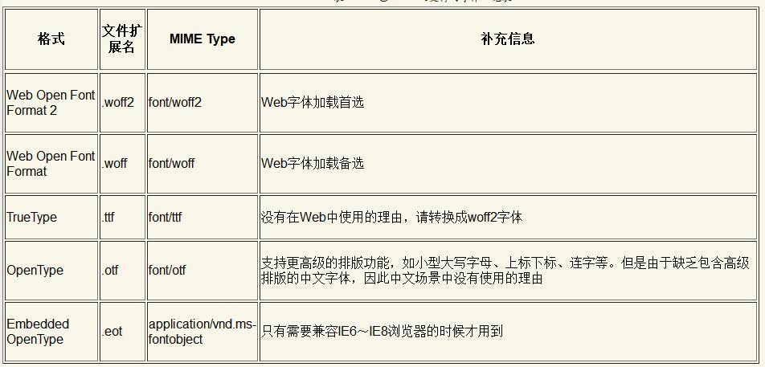

#### 3.5.5 font-display属性与自定义字体的加载渲染

这时浏览器的字体加载行为表现为，应用MyFont字体的文本**会先被隐藏**，直到字体加载结束才会显示，**但是这个隐藏最多持续3s，3s后字体仍未加载结束则会使用其他字体代替**

> 如果我们使用自定义字体的目的是实现图标字体功能，则这种加载行为就比较合适。因为渲染出来的小图标和小图标使用的真正字符往往外形差异巨大，那些用户看不懂的字符需要被隐藏起来，以此提升视觉体验。但是，如果我们使用自定义字体来呈现普通文本内容，则这种加载行为就不太合适。因为文字内容应该第一时间呈现给用户，而不应该出现长时间的空白，内容绝对比样式更重要。

而font-display属性可以控制字体加载和文本渲染之间的时间线关系

**字体显示时间线**

控制字体加载和文本渲染之间的时间线关系

字体显示时间线开始于浏览器尝试下载字体的那一刻，整个时间线分为3个时段，浏览器会在这3个时段让元素表现出不同的字体渲染行为。

1. **字体阻塞时段**：如果未加载字体，任何试图使用它的元素都必须以不可见的方式渲染后备字体；如果在此期间字体成功加载，则正常使用它。
2. **字体交换时段**：如果未加载字体，任何试图使用它的元素都必须以可见的方式渲染后备字体；如果在此期间字体成功加载，则正常使用它
3. **字体失败时段**：如果未加载字体，则浏览器将其视为加载失败，并使用正常字体进行回退渲染。

**font-display语法**

```css
font-display: [ auto | block | swap | fallback | optional ]
```

- auto：字体显示策略由浏览器决定，大多数浏览器的字体显示策略类似block
- block：字体阻塞时段较短（推荐3s），字体交换时段无限。此值适合图标字体场景
- swap：字体阻塞时段极短（不超过100ms），字体交换时段无限。此值适合用在小段文本，同时文本内容对页面非常重要的场景
- fallback：字体阻塞时段极短（不超过100ms），字体交换时段较短（推荐3s）。此值适合用于大段文本，例如文章正文，同时对字体效果比较看重的场景，例如广告页面、个人网站等
- optional：字体阻塞时段极短（不超过100ms），没有字体交换时段。此值的作用可以描述为，如果字体可以瞬间被加载（例如已经被缓存了），则浏览器使用该字体，否则使用回退字体。optional是日常Web产品开发更推荐的属性值，因为无论任何时候，网页内容在用户第一次访问时快速呈现是最重要的，不能让用户等待很长时间后再看到你认为的完美效果。

**建议**

如果自定义字体的大小在30 KB以内，建议直接用Base64将其内联在页面中。不过只有woff2字体采取内联处理，woff字体依旧采用url()函数外链体验最佳，因为此时现代浏览器中的字体都是瞬间渲染，根本无须使用font-display属性进行字体加载优化。

**@font-face定义的字体只有在被使用的时候才会加载**

这会导致使用canvas进行文字绘制时自定义字体不生效的问题，一般的解决方法是创建一个应用了自定义字体的隐藏元素，或者使用`FontFaceSet.load()`方法加载字体：

```javascript
document.fonts.load("12px MyFont").then(…);
```

### 3.6 字符单元的中断与换行

**默认换行规则**

- 空格、换行符、制表符，会合并为单个空格
- 文字可以在CJK文本、空格和短横线连字符处换行，连续英文单词和数字不换行

#### 3.6.1 使用keep-all属性值优化中文排版

```css
word-break: normal | break-all | keep-all | break-word
```

keep-all这个属性值可以让CJK文本不换行排版，同时又不影响非CJK文本的排版行为，比如下面的场景：

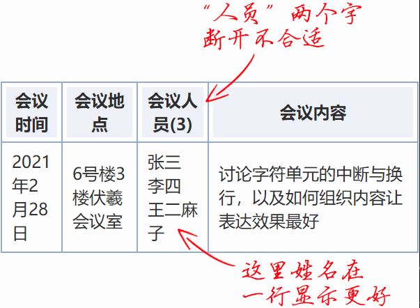

#### 3.6.2 break-all属性值的问题和line-break属性

这个属性比较常用，这里只提一个意外情况：连续的破折号、连续的点字符，以及避首标点在设置word-break:break-all声明后无法换行，**这时候就需要使用`break-word`属性值**

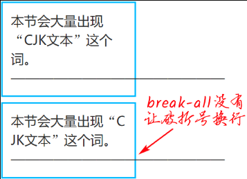


```css
p {
    /* 字符换行主力 */
    word-break: break-all;
    /* 兼容IE浏览器和Edge浏览器的破折号换行 */
    word-wrap: break-word;
}
```

虽然上面的代码可以让连续英文和连续破折号换行，但是依然会在中文标点的前后留下空白

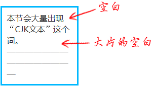

如果希望中文标点也能成为换行点，彻底告别空白，则可以**使用`line-break`属性**

```css
p {
    /* 中文标点也能换行 */
    line-break: anywhere;
}
```


#### 3.6.3 hyphens属性与连字符

> hyphens是专为英文场景设计的一个属性，这个属性可以让英文单词断开换行的时候带上连字符（也就是短横线），这样可以让读者知道上一行的尾部和下一行的头部连起来是一个完整的单词

```css
hyphens: none | manual | auto
```

> 其中，属性值auto可以让英文单词在行尾自动换行，同时带上短横线。需要注意的是，英文单词换行不需要设置word-break或者word-wrap属性，**hyphens属性自带换行能力**。如果你设置了word-break:break-all声明，**反而不会有短横线效果**

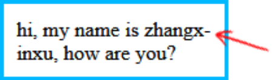

但现实中该属性**毫无用处**，原因如下：

1. 需要在英语环境中，也就是需要祖先元素设置lang="en"属性
2. 由于中文语句中随时可以换行，因此在中文场景下，轮不到hyphens属性起作用。就算真的遇到长串的连续字母和数字，也不一定是英文单词，多半是URL网址或者特殊字符串，而在网址换行位置添加短横线是不可以的，因为增加一个短横线会导致原本正确的网址变成错误的网址
3. 只有在Android操作系统下和macOS下的Chrome浏览器中才有效果，在用户量较大的Windows操作系统中无效

**软换行符**

> 我们可以使用hyphens属性的默认特性来设置类似auto属性值的排版体验。hyphens属性的默认值是manual，表示单词在有换行机会的时候才换行，其中一个常见的换行机会就是连字符。
>
> 连字符总共分两种。一种是“硬连字符”（U+2010），称为可见的换行机会。这个字符就是我们键盘上的短横线“-”，是可见的。另一种是“软连字符”（U+00AD），称为不可见的换行机会。这个字符很有意思，通常情况是隐藏的，但是，如果浏览器觉得有必要在软连字符所在位置打断单词，则连字符又会变为可见
>
> ```html
> <p>大家好，我叫zhang&shy;xin&shy;xu，感谢大家购买我的书。</p>
> ```
>
> ```css
> p {
>     padding: 10px;
>     border: solid deepskyblue;
>     text-align: justify;
>     text-justify: inter-ideograph;
> }
> ```
>
> 效果：
>
> 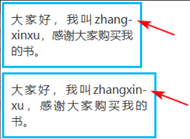

[Demo](https://demo.cssworld.cn/new/3/6-3.php)

#### 3.6.4 `<wbr>`与精确换行的控制

> HTML中有一个`<wbr>`元素标签，可以实现连续英文和数字的精准换行，具体效果如下：如果宽度足够，不换行；如果宽度不足，则在`<wbr>`元素所在的位置进行换行。也就是说，`<wbr>`元素提供了一个换行机会。

`<wbr>`之所以能够创造新的换行机会，是因为其创建了一个带有换行特性的宽度为0px的空格。该空格的Unicode编码是U+200B，因此`<wbr>`标签也可以替换为`&#x200b;`

IE不支持`<wbr>`标签，但可以用如下css实现同样效果：

```css
wbr:after { content: '\00200B'; }
```

**`<wbr>`不能与word-break:break-all同时使用**，因为这会使`<wbr>`变得没有意义

#### 3.6.5 overflow-wrap: anywhere声明有什么用

```css
overflow-wrap: normal | break-word | anywhere
```

属性值anywhere正常状态下的效果和属性值break-word类似，具体描述为：如果行中没有其他可接受的断点，则可以在任何点断开原本不可断开的字符串（如长单词或URL），并且在断点处不插入连字符。

属性值anywhere和属性值break-word的不同之处在于，overflow-wrap:anywhere在计算最小内容尺寸的时候会考虑软换行，而overflow-wrap:break-word则不会考虑软换行

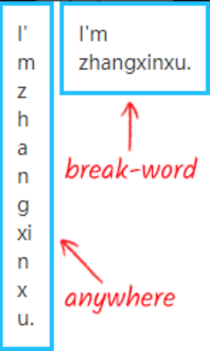

overflow-wrap:anywhere的行为表现和line- break:anywhere是有明显区别的，line-break:anywhere不管元素尺寸是否足够，都是能断则断。

### 3.7 text-align属性相关的新特性

```css
text-align: match-parent;
text-align: justify-all;
text-align: <string>;
```

**但这几个属性兼容性不好，所以了解即可，不要在生产环境使用**

> 在现代浏览器中，两端对齐的算法是：CJK文本使用letter-spacing间隔算法，非CJK文本使用word-spacing间隔算法。如果我们希望非CJK文本也使用letter-spacing间隔算法，也就是每个字母彼此都可以拉开间隙，则可以使用：
>
> ```css
> text-justify: inter-character;
> ```

### 3.8 text-decoration属性全新升级

现在，text-decoration属性则是一个CSS**缩写属性**，完整的CSS属性包括text-decoration-line、text-decoration- style、text-decoration-color和text-decoration-thickness

```css
text-decoration: <'text-decoration-line'> || <'text-decoration-style'> || <'text-decoration-color'> || <'text-decoration-thickness'>
```

当父元素和子元素同时设置text- decoration效果的时候，文字的装饰线效果是**累加**的，而不是覆盖的

text-decoration属性有一个特性要比border属性强，那就是可以实现波浪线装饰线效果，这个是border属性实现不了的，下面的样式实现一个**宽度为100%自适应的波浪线效果**

```css
wavy {
    display: block;
    height: .5em;
    white-space: nowrap;
    letter-spacing: 100vw;
    padding-top: .5em;
    overflow: hidden;
}
wavy::before {
    content: "\2000\2000";
    /* IE浏览器用实线代替*/
    text-decoration: overline;
    /* 现代浏览器，Safari浏览器不支持text-decoration：overline wavy缩写*/
    text-decoration-style： wavy;
}
```

**text-underline-position:under**

直接使用`text-decoration: underline`添加下划线，在展示汉字时有时候效果很不好：

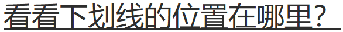

这时就需要`text-underline-position: under`了，添加后的效果如下：

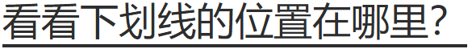

**text-underline-offset**

它与`text-underline-position`的区别在于，前者调整下划线的位置是固定的，而`text-underline-offset`支持数值和百分比值（相对于`1em`）来设置下划线的位置

`text-underline-offset`只对**设置了下划线**的**当前元素**才有效

**text-decoration-skip**

text-decoration-skip属性可以用来控制装饰线和文字之间的重叠关系，这里的装饰线专指下划线

### 3.9 color属性与颜色设置

#### 3.9.1 一些不为人知的知识点

- HTML中color属性算法和CSS中的color属性算法是不一样的。同样是一个无法识别的颜色关键字，在HTML中这个无法识别的颜色关键字会渲染成另外一个颜色，而在CSS中会直接忽略这个颜色关键字
- 颜色关键字不区分大小写，且颜色关键字设置的颜色都是实色，不带透明度
- 暗灰色darkgray的颜色要比灰色gray更浅，因此，并不是有“dark”前缀的颜色关键字控制的颜色就更深

#### 3.9.2 transparent关键字

> transparent关键字其实是rgba(0,0,0,0)的另外一种**快捷书写方式**，这是CSS规范文档中明确定义的，并且所有浏览器也遵循这个规范

css中的透明渐变色的过渡使用了特别的算法，而svg或canvas中，在生成渐变效果时，会出现过渡过程中夹着灰红色，如下：

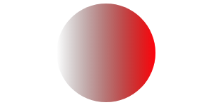

#### 3.9.3 currentColor关键字

它表示当前元素（或伪元素）所使用的color属性的计算值，currentColor关键字从IE9浏览器开始被支持

CSS中很多属性的默认颜色就是color属性值，没有必要专门指定currentColor关键字，包括border-color、outline-color、caret-color、text-shadow、box-shadow等CSS属性

#### 3.9.4 RGB颜色和HSL颜色的新语法

**HSL颜色**

HSL颜色是由色调（Hue）、饱和度（Saturation）和亮度（Lightness）这3个元素组成的，色调值的大小是任意的，因为CSS世界中与色调相关的数值都是角度值，其单位是deg

> **色值**hsl(0,100%,50%)到hsl(360,100%,50%)的色值带，可以看出来HSL颜色色调从0～360deg大致按照红、橙、黄、绿、青、蓝、紫、红的颜色顺序分布。其中，**红色、绿色和蓝色**这3个颜色的色调值有时候会用到，大家可以专门记一下，**分别是red=0deg、green=120deg、blue=240deg**

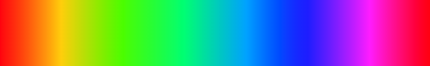

> **饱和度**和**亮度**的值是任意的，最终解析的数值范围均在0%～100%，数值后面的百分号一定不能少，否则整个语句无效，所有浏览器中均是如此。

**RGBA颜色与HSLA颜色**

> RGBA和HSLA中的字母A指的就是Alpha透明通道，透明度取值范围任意，但是渲染范围是0～1，也就是小于0的透明度会当作0渲染，大于1的透明度会当作1渲染

**#RRGGBBAA颜色**

A依旧表示透明度，但因为透明度的范围由原来的0%~100%转成用00~FF来表示，所以需要进行转换

```javascript
AA = (Alpha * 255).toString(16);
```

**极致自由的新语法**

1. rgb()和rgba()函数语法互通，hsl()和hsla()函数语法互通
2. hsl()和hsla()函数语法互通
3. 透明度可以使用百分比表示
4. hsl()函数中的色调可以使用任意角度单位（deg\rad\turn）
5. rgb()和hsl()函数语法中的逗号可以忽略（用空格代替）

**RGB颜色和HSL颜色新语法**

```css
/* RGB色值或者HSL色值之间使用空格分隔，透明度使用斜杠分隔 */
rgb(255 0 153 / 1)
rgb(255 0 153 / 100%)
rgba(51 170 51 / 0.4)
rgba(51 170 51 / 40%)
hsl(270 60% 50% / .15)
hsl(270 60% 50% / 15%)
```

### 3.10 必学必会的background属性新特性

#### 3.10.1 最实用的当属background-size属性

**cover和contain**

**理解auto关键字下的尺寸渲染规则**

这里涉及图片内在尺寸、内在比例的概念：

- 位图，总是有自己的内存尺寸和内在比例
- 矢量图，比如svg，不一定具有内在尺寸，如果设置了水平尺寸与垂直尺寸，那它就具有内在比例，如果没有设置尺寸或只设置了一个方向的尺寸，则它可能有比例，也可能没比例，要视svg内部代码而定，比如svg内部只有`<defs>`元素，则它就是没有比例的
- 渐变图像，即使用css渐变语法绘制的图像，没有内在尺寸与内在比例
- 元素图像：使用`element()`函数把DOM元素作为背景图，此时的内在尺寸就是这个DOM元素的尺寸

`background-size: auto`或不设置（默认为`auto`）时的渲染规则：

1. 如果图像水平和垂直方向同时具有内在尺寸，则按照图像原始大小进行渲染。例如一个PNG图片尺寸是800px×600px，那么背景图的尺寸就是800px×600px，这就是多倍图一定要设置background-size属性的原因，否则只能显示部分图像内容。
2. 如果图像没有内在尺寸，也没有内在比例，则按照背景定位区域的大小进行渲染，等同于设置属性值为100%。所以，CSS渐变图像默认都是覆盖整个背景定位区域的
3. 如果图像没有内在尺寸，但具有内在比例，则渲染效果等同于设置属性值为contain，比如`<svg>`元素没有设置width属性和height属性，也就是没有设置内在尺寸，此时这个SVG文件作为背景图，我们无须指定background-size属性值，SVG图像就能自动被包含在背景定位区域内
4. 如果图像只有一个方向有内在尺寸，但又具有内在比例，则图像会拉伸到该内在尺寸的大小，同时宽高比符合内在比例。例如，某个SVG图像的内在比例是1:1，但是SVG图像源码中的`<svg>`元素只设置了width属性，没有设置height属性，则最终的SVG图像会按照width属性设置的宽度渲染，高度和宽度保持1:1的比例进行渲染
5. 如果图像只有一个方向有内在尺寸而没有内在比例，则图像有内在尺寸的一侧会拉伸到该内在尺寸大小，没有设置内在尺寸的一侧会拉伸到背景定位区域大小

如果`background-size`的属性值一个是auto，另外一个值不是auto，有如下两种情况

1. 如果图像有内在比例，则图像会拉伸到指定的尺寸，高宽依然保持原始的比例
2. 如果图像没有内在比例，则图像会拉伸到指定的尺寸。

**数值或百分比**

1. 不能为负值
2. 分比值是相对于元素的背景定位区域计算的。背景定位区域是由background-origin属性决定的，默认值是padding box

**其它**

**`background-size`属性在作为`background`的缩写时，必须写在`background-position`之后，用斜杠分隔**

#### 3.10.2 `background`属性最成功的设计——多背景

[Demo](https://demo.cssworld.cn/new/3/10-5.php)

[Css3 Patterns Gallery网站](https://projects.verou.me/css3patterns/)

如果想要同时使用CSS渐变和CSS背景色，需要使用CSS多背景语法，并且颜色值**必须放在最后**

#### 3.10.3 background-clip属性与背景显示区域限制

> background-clip属性的特点是剪裁。在background-clip属性值发生变化的时候，背景图像显示的尺寸是不会变的，变的是图像显示的范围

```css
background-clip: border-box;
background-clip: padding-box;
background-clip: content-box;
background-clip: text;
```

#### 3.10.4 background-clip:text声明与渐变文字效果

> background-clip:text可以让背景图像按照字符形状进行剪裁，此时我们只要隐藏文字，就可以看到字符形状的背景效果了

#### 3.10.5 background-origin属性与背景定位原点控制

默认值是`padding-box`

#### 3.10.6 space和round平铺模式（都存在兼容性问题）

**space**

> 让背景图像尽可能地重复，而不进行剪裁，每个重复单元的尺寸不会变化。其中第一张和最后一张图像固定在元素的两边，然后通过拉伸空白区域让剩余的图像均匀分布

**round**

> 背景图像会被拉伸，并保证不留间隙。随着定位区域空间的增加，如果（假设图像都是原始尺寸下的）剩余空间大于图像宽度的一半，则添加另外一张图像。在添加下一张图像时，当前的所有图像都会压缩以留出空间放下这个新添加的图像

**可以分别指定水平和垂直方向上的图像平铺方式**

```css
background-repeat: round space;
```

#### 3.10.7 可以指定background-position的起始方位了

比如让背景图像在距离右下方20px的位置：

```css
.example {
    width: 300px; height: 200px;
    border: solid deepskyblue;
    background: url(1.jpg) no-repeat right 20px bottom 20px;
}
```

[Demo](https://demo.cssworld.cn/new/3/10-9.php)

**1个值语法**

就是我们常见的使用方式，用来表示x轴上的定位，而y轴上的定位都是`center`

**2个值语法**

分三种情况：

1. 2个值都是关键字属性值。left关键字和right关键字表示水平方向，top关键字和bottom关键字表示垂直方向，因此top right和right top的效果是一样的。而left right和top bottom则认为是无效的语法
2. 1个值是关键字属性值，另外一个值是数值或百分比值。如果数值或百分比值是第一个值，则表示水平方向，另外一个关键字属性值就表示垂直方向。如果数值或百分比值是第二个值，则表示垂直方向，另外一个关键字属性值就表示水平方向
3. 2个值都是数值或百分比值。第一个值表示水平方向，第二个值表示垂直方向

**3个值或4个值语法**

数值和百分比值表示偏移量，第一个值一定要是关键字属性值，这个关键字属性值用来表示偏移是从哪个方向开始的。如果是3个值，则认为缺少的偏移量是0。因此，20px left top一定是不合法的，其第一个值不是关键字属性值。left 20px right也是不合法的，因为left和right方位对立。left 20px top就是合法的，其等同于left 20px top 0px，表示距离左侧20px，距离顶部0。由于background-position默认的定位就是left top，因此left 20px top 0也等同于20px 0px。

```css
background-position: left 10px top 15px;   /* 10px, 15px */
background-position: left      top     ;   /*  0px,  0px */
background-position:      10px     15px;   /* 10px, 15px */
background-position: left          15px;   /*  0px, 15px */
background-position:      10px top     ;   /* 10px,  0px */
background-position: left      top 15px;   /*  0px, 15px */
background-position: left 10px top     ;   /* 10px,  0px */
```

### 3.11 outline相关新属性outline-offset

> outline-offset属性用于改变outline属性设置的轮廓的偏移位置
>
> outline-offset属性使用负值来缩小轮廓的频率要比使用正值来扩大轮廓的频率高很多

[Demo](https://demo.cssworld.cn/new/3/11-1.php)

### 3.12 cursor属性新增手形效果

**放大手形zoom-in和缩小手形zoom-out**

```css
.zoom-in {
    /* 放大 */
    cursor: zoom-in; 
}
.zoom-out {
    /* 缩小 */
   cursor: zoom-out; 
}
```

**抓取手形grab和放手手形grabbing**

```css
.element {
    /* 准备抓取 */
    cursor: -webkit-grab;
    cursor: -moz-grab;
    cursor: grab; 
}
.element:active {
    /* 已经抓住 */
    cursor: -webkit-grabbing;
    cursor: -moz-grabbing;
    cursor: grabbing;
}
```

## 第4章 更细致的样式表现

### 4.1 透明度控制属性opacity

> **opacity属性值不为1的元素会创建一个层叠上下文**，层叠顺序会变高。因此，如果你希望某个DOM顺序在前的元素覆盖后面的元素，可以试试设置opacity:0.99。

#### 4.1.1 opacity属性的叠加计算规则

父、子元素同时设置半透明时，半透明效果是叠加的（即相乘）

半透明颜色与非透明颜色的叠加算法如下：

```javascript
r = (foreground.r * alpha) + (background.r * (1.0 - alpha));
g = (foreground.g * alpha) + (background.g * (1.0 - alpha));
b = (foreground.b * alpha) + (background.b * (1.0 - alpha));
```

#### 4.1.2 opacity属性的边界特性与应用

opacity属性设置的数值大小如果超出0～1的范围限制，最终的计算值是边界值。**这种边界特性配合CSS变量可以在CSS中实现类似于if...else的逻辑判断**，可以用在元素显隐或者色值变化的场景

```css
:root {
  /* 定义RGB变量 */
  --red: 44;
  --green: 135;
  --blue: 255;
  /**
   * 亮度算法：
   * lightness = (red * 0.2126 + green * 0.7152 + blue * 0.0722) / 255
  */
  --lightness: calc((var(--red) * 0.2126 + var(--green) * 0.7152 + var(--blue) * 0.0722) 
}
.button {
  /* 文字颜色，只可能是黑色或白色 */
  color: hsl(0, 0%, calc((var(--lightness) - 0.5) * -999999%));
  /* 文字阴影，黑色文字才会出现 */
}
```

`.button`元素使用HSL表示文字颜色，如果亮度超过0.5，则color元素的亮度计算结果是一个负数，根据边界值我，结果为0，反之是一个超大的正数，结果为100%，从而实现文字的黑白色值变化

[Demo1](https://demo.cssworld.cn/new/4/1-1.php)

[Demo2](https://demo.cssworld.cn/new/4/1-2.php)

### 4.2 深入了解圆角属性border-radius

#### 4.2.1 了解border-radius属性的语法

**CSS圆角属性却是先上下再左右**

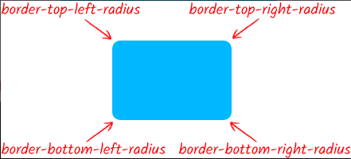

**水平半径和垂直半径**

```css
border-top-left-radius: 10px;
```

等同于

```css
border-top-left-radius: 10px 10px;
```

如果是border-radius属性，则水平半径和垂直半径不是通过空格进行区分，而是通过斜杠区分

```css
border-radius: 30px / 60px;
```

#### 4.2.2 弄懂圆角效果是如何产生的

实际上border-radius属性的字面意思不是“圆角”，而是“边界半径”，也就是圆角效果来自以这个半径值绘制的圆或以半轴值绘制的椭圆，比如：

```css
border-top-left-radius: 30px 60px;
```

原理图为：

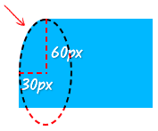

**重叠曲线的渲染机制**

该机制主要是解决如下这种css样式的渲染效果（元素高度为100px，宽度为150px）

```css
border-top-left-radius: 30px 100%;
border-bottom-left-radius: 30px 100%;
```

按前文描述，这种情况曲线一定会发生重叠，而且其交叉点一定不是平滑的，所以css规范对这种场景做了额外的渲染设定，会先计算出一个因子：
$$
f = min(L_h/S_h, L_v/S_v)
$$
其中`S`表示半径之和，`L`表示元素的宽高，下标`h`和`v`表示是水平还是垂直（水平即为宽，垂直即为高）

当`f`计算的结果小`1`时，所有圆角半径都乘以它，以上面的元素及样式为例
$$
f = min(L_h/S_h, L_v/S_v) = min(150/60, 100/200) = 0.5
$$
所以实际上生效的样式为：

```css
border-top-left-radius: 15px 50%;
border-bottom-left-radius: 15px 50%;
```

#### 4.2.3 border-radius属性渲染border边框的细节

如果元素设置了border边框，则圆角半径会被分成内半径和外半径

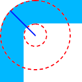

其中直线为外半径，圆心到内部虚线圆的距离为内半径

1. padding边缘的圆角大小为设置的border-radius大小减去边框的厚度（border），如果结果为负，则内半径为0

   ```css
   .radius {
       width: 100px; height: 100px;
       border-top: 40px solid deepskyblue;
       border-left: 40px solid deepskyblue;
       border-radius: 40px 0 0;
   }
   ```

   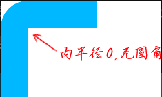

2. 如果相邻两侧边框的厚度不同，则圆角大小将在较厚和较薄边界之间显示平滑过渡

   ```css
   .radius {
       width: 100px; height: 100px;
       border-top: 40px solid deepskyblue;
       border-left: 20px solid deepskyblue;
       border-radius: 40px 0 0 / 60px 0 0;
   }
   ```

   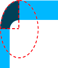

3. 圆角边框的连接线和直角边框连接线位置一致，但是角度会有所不同

   ```css
   width: 100px; height: 100px;
       border-top: 40px solid deepskyblue;
       border-left: 20px solid deeppink;
       border-right: 20px solid deeppink;
       border-radius: 40px 0 0 / 60px 0 0;
   ```

   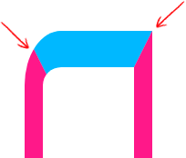

4. 其它细节

   - border-radius不支持负值
   - 圆角以外的区域不可点击，无法响应click事件
   - border-radius没有继承性，因此父元素设置了border-radius，子元素依然是直角效果。我们可以通过给父元素设置overflow:hidden让子元素视觉上表现为圆角
   - border-radius属性支持transition过渡效果，也支持animation动画效果，因此在图形表现领域，border-radius属性会非常给力
   - border-radius属性也是可以应用于display的计算值为table、inline-table或者table-cell的元素上的，但是有一个前提，那就是表格元素的border-collapse属性值需要是separate（separate是border-collapse属性的默认值），如果border-collapse属性值是collapse，那么是没有圆角效果的。

#### 4.2.4 border-radius属性的高级应用技巧

[Demo1](https://demo.cssworld.cn/new/4/2-1.php)

[Demo2](https://demo.cssworld.cn/new/4/2-2.php)

### 4.3 box-shadow盒阴影

#### 4.3.1 inset关键字与内阴影

**模拟边框**

border边框被占用或不方便使用border属性的情况（border属性会影响元素尺寸），此时可以考虑使用box-shadow内阴影模拟边框

```css

.normal {
    /* 模拟边框 */
    box-shadow: inset 1px 0 #a2a9b6, inset -1px 0 #a2a9b6, inset 0 1px #a2a9b6, inset 0 -1px #a2a9b6;
}
```


**颜色覆盖**

box-shadow内阴影有一个实用特性，那就是生成的阴影会位于文字内容的下面，背景颜色的上面。于是我们可以使用box-shadow属性在元素上面再覆盖一层颜色（**覆盖浏览器输入框自动填充时的颜色**）

但对于像img这样的可替换元素，**其内容是在阴影之上的**，此时可以使用outline属性进行模拟

#### 4.3.2 不要忽略第四个长度值

第四个长度值，表示扩展半径

**轮廓模拟**

使用扩展半径模拟轮廓的代码量要比实现4个方向分别投影的代码量小很多（IE中渲染有问题），**扩展半径多用来模拟大范围的色块效果**

**单侧阴影**

```css
header {
    box-shadow: 0 7px 5px -5px rgba(0, 0, 0, .5);
}
```

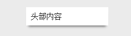

#### 4.3.3 多阴影特性与图形绘制

首先，这个特性不要滥用，因为它的**性能真的很糟糕**

可用来实现多边框、渐变边框、加载效果（绘制loading：按圆形轨迹分布的几个不同明暗程度的点）、3d投影

#### 4.3.4 box-shadow动画与性能优化

例如盒阴影过渡效果，可以使用伪元素创建盒阴影，然后在鼠标经过盒的时候改变盒阴影的透明度，以此进行优化

### 4.4 CSS 2D变换

#### 4.4.1 从基本的变换方法说起

**translate()位移**

位移的方向和文档流的顺序没有任何关系，也就是即使祖先元素设置direction:rtl，translateX(10px)依然表示往右偏移

**rotate()旋转**

正值是顺时针旋转

单位：

- deg：角度，范围0~360，负值表示逆时针
- grad：百分度（梯度），一个grad相当到1/400个整圆，即，100grad相当于90deg
- rad：弧度，1rad表示180/$$\pi$$
- turn：圈数，1turn表示360deg

**scale()缩放**

缩放变换不支持百分比值，仅支持数值

缩放变换支持负值。如果我们想要实现元素的**水平翻转**效果，可以设置transform:scaleX(-1)；想要实现元素的**垂直翻转**效果，可以设置transform:scaleY(-1)

**skew()斜切**

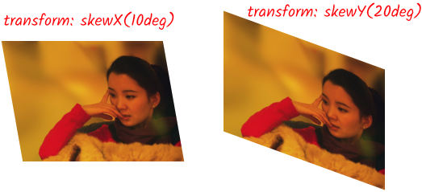

#### 4.4.2 transform属性的若干细节特性

**盒模型尺寸不会变化**

比如通过`transform: scale(2);`将元素放大2倍，并不会推开旁边的元素，只会在视觉上重叠与覆盖

**内联元素无效**

内联元素（不包括替换元素）是无法应用transform变换的，且不支持所有变换特性。

但有两种方法可以实现位移效果，一种是给元素增加块状特性，例如设置display属性值为inline-block，还有一种方法是改用相对定位

**锯齿或虚化的问题**

在应用旋转或者斜切变换的时候，元素边缘会表现出明显的锯齿，文字会明显虚化。这个现象主要出现在桌面端浏览器上，而且这个问题是没有办法避免的，因为显示器的密度跟不上。

**不同顺序不同效果**

[Demo](https://demo.cssworld.cn/new/4/4-1.php)

**clip/clip-path前置剪裁**

一个元素应用transform变换之后，同时再应用clip或者clip-path等属性，此时很多人会误认为剪裁的是应用变换之后的图形，实际上不是的，剪裁的还是变换之前的图形，也就是**先剪裁再变换**

**动画性能优秀**

#### 4.4.3 元素应用transform属性后的变化

**创建层叠上下文**

和opacity属性值不是1的元素类似，如果元素的transform属性值不是none，则会创建一个新的层叠上下文。

[Demo](https://demo.cssworld.cn/new/4/4-4.php)

**固定定位失效**

如果父元素设置了transform变换，则固定定位效果就会失效，样式表现就会类似于绝对定位（filter滤镜也会让子元素的固定定位效果失效），如果需要固定定位与动画并存，解决方法就是使用嵌套，外层元素负责固定定位，内层元素负责实现动画

**改变overflow对绝对定位元素的限制**

> 如果绝对定位元素含有overflow属性值不为visible的祖先元素，同时，该祖先元素以及到该绝对定位元素之间的任何嵌套元素都没有position:static的声明，则overflow对该absolute元素不起作用。

transform属性值不为none的元素也可以影响绝对定位在overflow元素中的表现

[Demo](https://demo.cssworld.cn/new/4/4-6.php)

**改变绝对定位元素的包含块**

#### 4.4.4 深入了解矩阵函数matrix()

> transform变换还支持矩阵函数matrix()。无论是位移、旋转、缩放还是斜切，其变换的本质都是应用矩阵函数matrix()进行矩阵变换。所谓矩阵变换，就是套用矩阵公式，把原先的坐标点转换成另外一个坐标点的过程。
>
> ```css
> /* 这里只介绍2d变换 */
> transform: matrix(a, b, c, d, e, f);
> ```
>
> 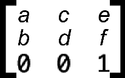
>
> 示意
>
> 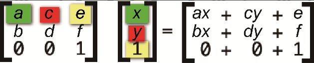

通过取任意点与矩阵函数处理后的点坐标进行对比，可以得出如下结论：

1. translate()函数可以用以下矩阵转换后得到

   ```css
   transform: matrix(a, b, c, d, 水平偏移乱离, 垂直偏移距离)
   ```

2. scale()函数

   ```css
   transform: matrix(水平缩放大小, b, c, 垂直缩放大小, e, f)
   ```

3. rotate()函数

   旋转需要用到三角函数，假设旋转角度为$$\theta$$，矩阵的计算方法和参数如下：
   $$
   matrix(\cos\theta, \sin\theta, -\sin\theta, \cos\theta, 0, 0)
   $$
   新的坐标：
   $$
   x' = x\cos\theta - y\sin\theta + 0\\
   y' = x\sin\theta + y\cos\theta + 0
   $$

4. skew()函数

   斜切需要用到三角函数$$\tan$$，对应的是b和c两个参数，b表示y轴的斜切，c表示是x轴的斜切，公式如下：
   $$
   matrix(1, \tan(\theta y), \tan(\theta x), 1, 0, 0)
   $$
   新的坐标：
   $$
   x' = x + y\tan(\theta x) + 0\\
   y' = x\tan(\theta y) + y + 0
   $$

5. 汇总

   - 位移变换使用的是矩阵参数e和f
   - 缩放变换使用的是矩阵参数a和d
   - 旋转变换使用的是矩阵参数a、b、c和d
   - 斜切变换使用的是矩阵参数b和c

#### 4.4.5 常常被遗忘的transform-origin属性

transform-origin属性可以用来改变元素变换的中心坐标点（**变换默认是相对于元素的中心点进行的**）

#### 4.4.6 scale()函数缩放与zoom属性缩放的区别

1. zoom属性是一个**非标准属性**
2. zoom属性缩放的中心坐标是相对于元素的**左上角**，且**不能修改**。transform变换中的scale()函数缩放**默认**的中心坐标是元素的**中心点**
3. zoom属性缩放会实时**改变**元素占据的尺寸空间（也就意味着会触发**重排**）
4. 元素应用zoom属性**不会创建层叠上下文**，不会影响fixed元素的定位和overflow属性对绝对定位的溢出隐藏，也不会改变绝对定位元素的包含块

#### 4.4.7 了解全新的translate、scale、rotate属性

1. translate：支持1~3个值，分别表示沿x、y、z轴的位移

   ```css
   translate: 50%;
   translate: 10px 20px;
   translate: 50% 105px 5rem;
   ```

2. scale同translate

   ```css
   scale: 1;
   scale: 1 .5;
   scale: 1 2 3;
   ```

3. rotate语法稍复杂一些

   ```css
   /* 等同于transform: rotate(deg) */
   rotate: 45deg;
   /* 指定旋转轴 */
   /* 分别等同于transform: rotateX(deg), rotateY(.25trun), rotateZ(1.57rad)*/
   rotate: x 90deg;
   rotate: y .25turn;
   rotate: z 1.57rad;
   /* 矢量角度值 */
   /* 等同于transform: rotate3D(1, 1, 1, 90deg) */
   rotate: 1 1 1 90deg;
   ```

### 4.5 简单实用的calc()函数

#### 4.5.1 关于calc()函数 

> calc()函数支持加减乘除4种运算，任何可以使用<length>、<frequency>、<angle>、<time>、<percentage>、<number>或者<integer>数据类型的地方都可以使用calc()函数，但这并不表示上述数据类型都可以出现在calc()函数中，该函数是有很多约束的

1. 但这并不表示上述数据类型都可以出现在calc()函数中，该函数是有很多约束的
2. 运算符前后带单位或者带百分号的值只能进行加减运算，不能进行乘除运算
3. 除法运算斜杠右侧必须是不为0的数值类型
4. 加号和减号左右两边一定要有空格（因为浏览器无法区别是表示正负还是表示计算）

[Demo](https://demo.cssworld.cn/new/4/5-1.php)

```html
<label>图片1：</label>
<div class="bar" style="--percent: 60;"></div>
<label>图片2：</label>
<div class="bar" style="--percent: 40;"></div>
<label>图片3：</label>
<div class="bar" style="--percent: 20;"></div>
```

```css
.bar {
    line-height: 20px;
    background-color: #eee;
}
.bar::before {
    counter-reset: progress var(--percent);
    content: counter(progress) "%\2002";
    display: block;
    width: calc(1% * var(--percent));
    color: #fff;
    background-color: deepskyblue;
    text-align: right;
}
```

**关于`counter-reset`**

这个属性涉及[CSS计数器](https://developer.mozilla.org/en-US/docs/Web/CSS/CSS_Counter_Styles/Using_CSS_counters)，用于重置计数器到指定值，它会用一个指定的名字在指定元素上创建一个递增或递减的计数器，这里设置了一个名为`progress`的计数器，默认值通过css变量`--percent`指定，同时这里的`counter(progress)`则是用于显示这个计数器

#### 4.5.2 了解min()、max()和clamp()函数

min()函数支持一个或多个表达式，每个表达式之间使用逗号分隔，然后将最小的表达式的值作为返回值

min()函数的表达式可以是数学表达式（使用算术运算符）、具体的值或其他表达式（如attr()新语法）

max()函数用法同min()

clamp()函数的作用是返回一个区间范围的值，语法：

```css
clamp(MIN, VAL, MAX)
```

MIN表示最小值，VAL表示首选值，MAX表示最大值。这段语句的意思是：如果VAL在MIN～MAX范围内，则使用VAL作为函数返回值；如果VAL大于MAX，则使用MAX作为返回值；如果VAL小于MIN，则使用MIN作为返回值。clamp(MIN,VAL, MAX)实际上**等同于max(MIN, min(VAL, MAX))**

[Demo](https://demo.cssworld.cn/new/4/5-2.php)

## 第5章 更强的视觉表现

### 5.1 CSS渐变

#### 5.1.1 深入了解linear-gradient()线性渐变

默认的渐变方向是`to bottom`，也就是`180deg`，前者是**关键字**表达方式，后者是**数值**的表达方式

```css
img:not([src]) {
    background-color: #eee;
    background-image: 
      linear-gradient(to right bottom, transparent calc(50% - 1px), #ccc
calc(50% - 1px), #ccc, transparent calc(50% + 1px)),
      linear-gradient(to top right, transparent calc(50% - 1px), #ccc calc(50% - 1px), 
#ccc, transparent calc(50% + 1px));
}
```

可以实现这样的“占位”效果：

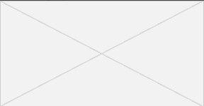


**数值表达方式**与一般软件（比如photoshop）中的定义不同，CSS中的定义如下：

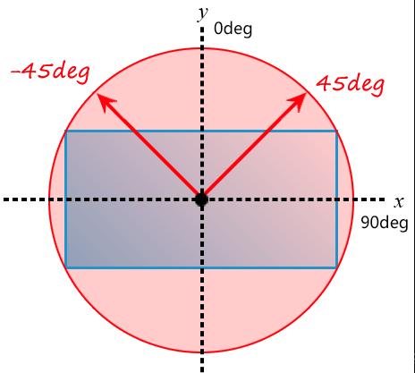


**同时，如果渐变角度是0deg，不建议简写成0**，因为IE及Edge浏览器中认为是不合法的

##### 1. 渐变的起点和终点

一般我们在设置渐变点时，都是使用的百分比，但当按如下用数字进行表示时，可能和我们预想的有些许区别：

```css
.example {
    width: 300px; height: 150px;
    border: solid deepskyblue;
    background-image: linear-gradient(45deg, white 100px, skyblue 100px 200px, white 200px);
}
```

这个100px的起点位置不是从端点开始的，也不是从元素的某一条边开始的，而是**沿着渐变角度所在直线的垂直线**开始的

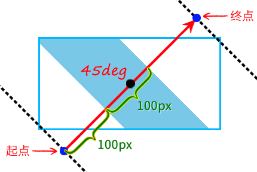

##### 2. 关于渐变断点的细节

1. 渐变断点至少有**2个**颜色值

2. 断点语法中的颜色值和位置值的前后顺序是有要求的，**位置值必须在颜色值的后面**

3. 没有指定具体断点位置的时候，各个渐变颜色所形成的色块大小是**自动等分**的

4. 如果起点和终点的颜色与相邻断点的颜色值一样，则起点色值和终点色值是可以省略的

   ```css
   linear-gradient(white, white 25%, skyblue 75%, skyblue);
   /* 等价于 */
   linear-gradient(white 25%, skyblue 75%);
   ```

5. 渐变的断点位置可以是负数，也可以大于100%

6. 在同一个渐变中，不同类型的断点位置值是可以同时使用的（比如`100px`与`50%`）

7. 当存在多个渐变断点的时候，**前面**的渐变断点设置的位置值有时候**比后面**的渐变断点设置的位置值要**大**，这时**后面的渐变断点位置值会按照前面的断点位置值计算**

   ```css
   linear-gradient(skyblue 20px, white 0px, skyblue 40px);
   /* 这里skyblue的位置比white大，所以实际渲染的结果是下面这种 */
   linear-gradient(skyblue 20px, white 20px, skyblue 40px);
   ```

8. 渐变断点还支持一次性设置两个位置值（**新语法，兼容性存在问题，不建议在生产环境使用**）

9. 除渐变断点之外，我们还可以设置颜色的转换点位置（**同上**）

   ```css
   /* 表示白色和天蓝色渐变的中心转换点位置在70%这里 */
   linear-gradient(white, 70%, skyblue);
   ```

10. 如果不是高清显示器，则在Chrome浏览器中，不同颜色位于同一断点位置的时候，两个颜色连接处可能会有明显的锯齿，此时，**可以在颜色连接处留1px的过渡区间**，优化视觉表现

    ```css
    linear-gradient(30deg, red 50%, skyblue calc(50% + 1px));
    ```

##### 3. 渐变与动画

CSS渐变本质上是一个\<image>图像，因此无法使用transition属性实现过渡效果，也无法使用animation属性实现动画效果，**但是有间接的方法可以实现CSS渐变的动画效果**

#### 5.1.2 深入了解radial-gradient()径向渐变

##### 1. 最简单的径向渐变语法

```css
.example {
    width: 300px; height: 150px;
    background-image: radial-gradient(white, deepskyblue);
}
```

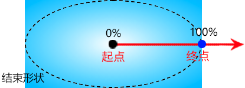

改变径向渐变的**半径值**、**中心点坐标**，以及**渐变颜色的起点和终点位置**从而实现不同的渐变效果

##### 2. 设置渐变半径的大小

```css
/* 水平半径为50px，垂直半径为50% */
radial-gradient(50px 50%, white, deepskyblue);
/* 水平半径与垂直半径相同时，可以合并，但这种只支持数值，如果用百分比，还是要分开写的 */
radial-gradient(50px, white, deepskyblue);
```

##### 3. 设置渐变中心点位置

这里符合`at <position>`语法

```css
radial-gradient(100px at 0 0, white, deepskyblue);
radial-gradient(100px at left top, white, deepskyblue);
/* 中心点距离右边缘100px，距离下边缘100px */
radial-gradient(100px at right 100px bottom 100px, white, deepskyblue);
```

##### 4. 设置渐变终止点的位置

CSS径向渐变语法中提供了专门的数据类型\<extent-keyword>，该数据类型包含4个关键字，可以指定渐变终止点的位置，对应的位置示意：

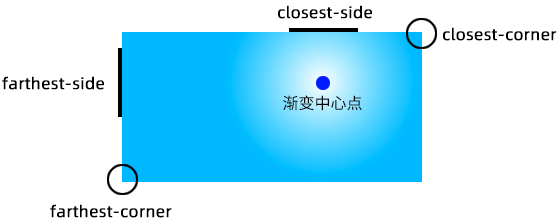

```css
/* 这里的circle是表示使用一个圆形的渐变（默认是椭圆，即ellipse） */
radial-gradient(farthest-corner circle at right 100px bottom 100px, white, 99%, deepskyblue);
```

##### 5. 径向渐变中的语法细节

```
radial-gradient(
  [ [ circle || <length> ] [ at <position> ]? , |
    [ ellipse || [ <length> | <percentage> ]{2} ] [ at <position> ]? , |
    [ [ circle | ellipse ] || <extent-keyword> ] [at <position> ]? , |
    at <position> ,
  ]?
  <color-stop-list> [ , <color-stop-list> ]+
)
```

参考之前的[符号说明](# 3. 符号)

- [circle||\<length>]：表示该位置`circle`与`<length>`至少出现一个，可以不按顺序出现，并且如果只有1个值，或是出现了`circle`关键字，后面的值只能是长度值，不能是百分比
- `circle`与`ellipse`在与半径值或者\<extent-keyword>一起使用的时候，前后顺序是没有要求的，但`at <position>`的位置是固定的，其一定是在半径值的后面、渐变断点的前面

##### 6. 径向渐变在实际开发中的应用举例

[Demo1](https://demo.cssworld.cn/new/5/1-2.php)

[Demo2](https://demo.cssworld.cn/new/5/1-3.php)

#### 5.1.3 了解conic-gradient()锥形渐变

锥形渐变是CSS Images Module Level 4规范中新定义的一种渐变，也很实用，但其兼容性不太好，只适合在移动端项目和中后台项目中使用

```
conic-gradient( [ from <angle> ]? [ at <position> ]?, <angular-color-stop-list> )
```

参数分别为：起始角度、中心位置、角渐变断点

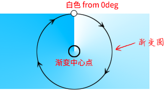

需要注意的是，角渐变断点中设置的角度值是一个相对角度值，最终渲染的角度值是设置的角度值和起始角度**累加的值**

```css
/* 这里deepskyblue的渲染坐标角度是90deg */
conic-gradient(from 45deg, white, deepskyblue 45deg, white);
```

[Demo1](https://demo.cssworld.cn/new/5/1-5.php)

[Demo2](https://demo.cssworld.cn/new/5/1-6.php)

#### 5.1.4 重复渐变

无论是重复线性渐变、重复径向渐变还是重复锥形渐变，其语法和对应的非重复渐变语法是一模一样的，区别在渲染表现上，非重复渐变的起止颜色位置如果是0%和100%，则可以省略，但是对于重复渐变，起止颜色位置需要明确定义

[Demo](https://demo.cssworld.cn/new/5/1-8.php)

### 5.2 CSS 3D变换

#### 5.2.1 从常用的3D变换函数说起

css中的3d坐标

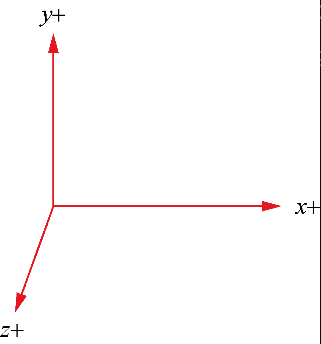

**rotate3d**

```css
/* 表示元素绕着坐标(0,0,0,)和坐标(x,y,z)连成的向量旋转angle角度，angle为正表示顺时针旋转，为负则是逆时针旋转 */
rotate3d(x, y, z, angle)
```

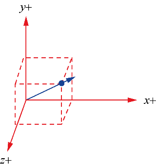

#### 5.2.2 必不可少的perspective属性

perspective属性即透视点，CSS 3D变换的透视点在显示器的前方，一般是与Z坐标配合使用来产生3D效果（下节会提到）

#### 5.2.3 用translateZ()函数寻找透视位置 

设置perspective属性后，就可以通过translateZ来实现元素“**近大远小**”的效果，比如当translateZ设置的值接近perspective值但不超过时，就可以形成“一叶障目，不见泰山”的效果

[Demo](https://demo.cssworld.cn/new/5/2-1.php)

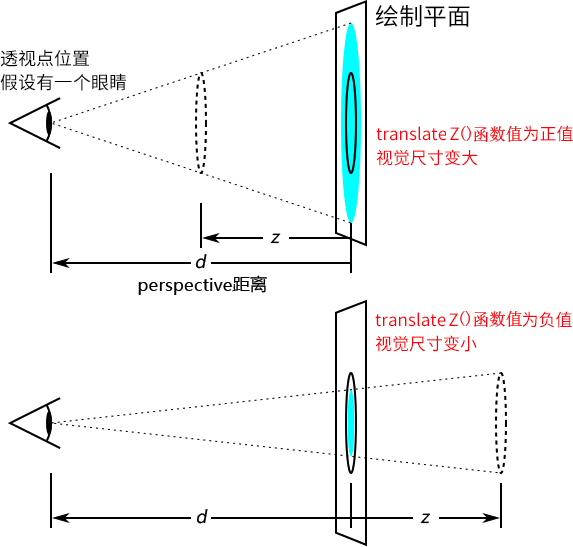

#### 5.2.4 指定perspective透视点的两种写法

1. 设置在舞台元素上

   ```css
   .stage {
       perspective: 600px;
   }
   .box {
       transform: rotateY(45deg);
   }
   ```

   

2. 设置在当前3D渲染的元素上

   ```css
   .stage .box {
       transform: perspective(600px) rotateY(45deg);
   }
   ```

   

#### 5.2.5 理解perspective-origin属性

> perspective-origin属性很好理解，表示我们的眼睛相对3D变换元素的位置，你可以通过改变眼睛的位置来改变元素的3D渲染效果
>
> 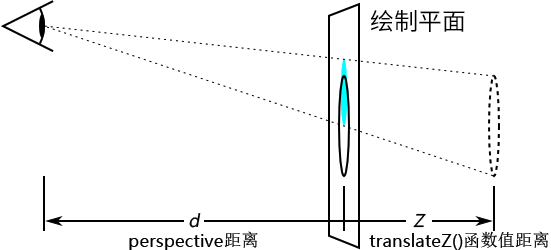
>
> 语法：
>
> ```css
> perspective-origin: <position>;
> ```

#### 5.2.6 transform-style: preserve-3d声明的含义

语法：

```css
transform-style: preserve-3d;
transform-style: flat;
```

- preserve-3d表示应用3D变换的元素位于三维空间中，preserve-3d属性值的渲染表现更符合真实世界的3D表现
- flat是默认值，表示应用3D变换的元素位于舞台或元素的平面中，其渲染表现类似“二向箔”，把三维空间压缩在舞台元素的二维空间中

区别可以参见这个[Demo](https://demo.cssworld.cn/new/5/2-4.php)

#### 5.2.7 backface-visibility属性的作用

在CSS世界中，一个元素的背面表现为其正面图像的镜像，因此，当我们使用翻转效果使其背面展示在用户面前的时候，显示的是该元素正面图像的镜像

这显然是不符合现实中的3D效果的，所以通过该属性能隐藏元素背面(`backface-visibility: visible`)来模拟现实中的3D效果

```css
backface-visibility: hidden;
backface-visibility: visible;
```

[Demo](https://demo.cssworld.cn/new/5/2-5.php)

#### 5.2.8 值得学习的旋转木马案例

[Demo](https://demo.cssworld.cn/new/5/2-6.php)

#### 5.2.9 3D变换与GPU加速

3D变换除了用来实现3D效果，还经常被用来开启GPU加速，比如使用`transform: translate3d(-100px, 0, 0)`与`transform: translate(-100px,0)`效果是一样的，但前者会**开启GPU加速**，所以性能更好

### 5.3 CSS过渡

#### 5.3.1 你可能不知道的transition属性知识

##### 1. transition-duration属性

`transition-duration`不能为负值，而`transition-delay`可以，结合这个特性，对于`transition`这个缩写属性，下面两种写法效果是一致的

```css
/* 效果一样 */
transition: 2s -1s;
transition: -1s 2s;
```

##### 2. transition-delay属性

当transition-delay属性值为负值的时候**可以省略部分动画进程**

[Demo](https://demo.cssworld.cn/new/5/3-1.php)

##### 3. transition-property属性

其实它的初始值就是`all`，所以

```css
transition: all .2s;
```

等价于：

```css
transition: .2s;
```

支持多个值，用“逗号”分隔，但当`transition-proprety`属性列表过长或过短时，按照“有缺则补，多之则除”的原则：

```css
div {
    transition-property: opacity, left, top;
    transition-duration: 3s, 5s;
}
div {
    transition-property: opacity, left, top, height;
    transition-duration: 3s, 5s;
}
div {
    transition-property: opacity, left;
    transition-duration: 3s, 5s, 2s, 1s;
}
```

等价于：

```css
div {
    transition-property: opacity, left, top;
    /* 注意这里 */
    transition-duration: 3s, 5s, 3s;
}
div {
    transition-property: opacity, left, top, height;
    /* 注意这里 */
    transition-duration: 3s, 5s, 3s, 5s;
}
div {
    transition-property: opacity, left;
    /* 注意这里 */
    transition-duration: 3s, 5s;
}
```

##### 4. transition-timing-function属性

通过设置时间函数来影响过渡速率，分为三类

- 线性运动：linear
- 三次贝塞尔：ease、ease-in、ease-out、ease-in-out、cubic-bezier()
- 步进时间函数：step-start、step-end和steps()函数

#### 5.3.2 了解三次贝塞尔时间函数类型

附上其他一些非CSS标准，但也属于常用缓动类型的贝塞尔曲线值

```css
:root {
    --ease-in-quad: cubic-bezier(.55, .085, .68, .53);
    --ease-in-cubic: cubic-bezier(.55, .055, .675, .19);
    --ease-in-quart: cubic-bezier(.895, .03, .685, .22);
    --ease-in-quint: cubic-bezier(.755, .05, .855, .06);
    --ease-in-expo: cubic-bezier( .95, .05, .795, .035);
    --ease-in-circ: cubic-bezier( .6, .04, .98, .335);
    --ease-out-quad: cubic-bezier( .25, .46, .45, .94);
    --ease-out-cubic: cubic-bezier( .215, .61, .355, 1);
    --ease-out-quart: cubic-bezier( .165, .84, .44, 1);
    --ease-out-quint: cubic-bezier( .23, 1, .32, 1);
    --ease-out-expo: cubic-bezier(.19, 1, .22, 1); 
    --ease-out-circ: cubic-bezier(.075, .82, .165, 1); 
    --ease-in-out-quad: cubic-bezier(.455, .03, .515, .955);
    --ease-in-out-cubic: cubic-bezier(.645, .045, .355, 1);  
    --ease-in-out-quart: cubic-bezier(.77, 0, .175, 1); 
    --ease-in-out-quint: cubic-bezier(.86, 0, .07, 1);
    --ease-in-out-expo: cubic-bezier(l, 0, 0, 1); 
    --ease-in-out-circ: cubic-bezier(.785, .135, .15, .86);
}
```

#### 5.3.3 transition与visibility属性的应用指南

visibility属性是支持CSS过渡效果和CSS动画效果，而display不行，所以如果需要在出现和隐藏时添加过渡效果，请使用visibility

当过渡时间函数的值在0～1的时候，visibility的计算值是visible，也就是显示；如果时间函数大于1或者小于0，则visibility属性的计算值**由设置的起止点值决定**

> 通过类名增减触发transition过渡效果的时候，元素是在transition-duration设置的时间结束的时候才突然显示，而通过:hover伪类触发的过渡行为则没有此问题
>
> 因此，在实际开发的时候，为了安全考虑，需要在触发结束状态的CSS代码那里重置下transition-property值

[Demo](https://demo.cssworld.cn/new/5/3-2.php)

### 5.4 CSS动画

#### 5.4.1 初识animation属性

animation支持多个独立动画，也推荐这种方式，方便其他场景下的动画复用

```css
/* 推荐写法 */
.element {
    animation: fadeIn .2s, slideInRight .2s;
}
@keyframes fadeIn {
       from {opacity: 0;}
      to {opacity: 1;}
}
@keyframes slideInRight {
    from {
        transform: translateX(100%);
    }
    to {
        transform: translateX(0%);
    }
}
```

#### 5.4.2 @keyframes规则的语法和特性

##### 1. 重复定义的关键帧不是完全被覆盖的

比如：

```css
@keyframes identifier  {
    50% { top: 30px; left: 20px; }
    50% { top: 10px; }
}
```

等价于：

```css
@keyframes identifier  {
    50% { top: 10px; left: 20px; }
}
```

##### 2. 关键帧中的样式可以不连续

```css
@keyframes identifier {
    0% { top: 0; left: 0; }
    30% { top: 50px; }
    60%, 90% { left: 50px; }
    100% { top: 100px; left: 100%; }
}
```

top属性应用动画的帧是0%、30%和100%，left属性应用动画的帧是0%、60%、90%和100%

##### 3. `!important`无效

css动画执行时，其关键帧中定义的css**优先级就是最高的**

> Firefox浏览器中，@keyframes规则中的CSS优先级大于style设置的CSS属性，小于!important语法中的CSS属性，而**其他所有浏览器@keyframes规则中的CSS优先级最高**

*但不排除随着浏览器的升级，firefox也会把@keyframes规则中的css优先级调到最高*

#### 5.4.3 动画命名与\<custom-ident>数据类型

动画名称支持`<custom-ident>|<string>`两种数据类型，\<custom-ident>数据类型的语法和CSS的标识符（例如，CSS属性就属于CSS标识符）很相似，区别就在于\<custom-ident>数据类型是**区分大小写**的，但它不能是以下类型：

1. 不能是css属性本身支持的关键字
2. 不能以十进制数字开头
3. 可以使用短横线作为开头，但是短横线后面不能是十进制数字
4. 除短横线和下划线之外的英文标点字符（包括空格）都需要转义
5. 连续短横线开头的名称在MDN文档中被认为是不合法的，但是根据我的测试，除了IE浏览器不支持，其他浏览器都认为连续短横线的动画名称是合法的
6. 如果是Unicode编码转义字符，记得在后面添加一个空格

#### 5.4.4 负延时与即时播放效果

利用`animation-delay`来实现类似音浪那种每个动画元素错时开始的效果

[Demo](https://demo.cssworld.cn/new/5/4-3.php)

#### 5.4.5 reverse和alternate关键字的区别和应用

reverse关键字是让每一轮动画执行的方向相反，而alternate关键字是让下一轮动画的执行方向和上一轮动画的执行方向相反

#### 5.4.6 动画播放次数可以是小数

```css
.element {
    animation: fadeIn 1s linear both;
    /* 表示第二轮动画只执行50%就结束 */
    animation-iteration-count: 1.5;
}
@keyframes fadeIn {
    0%   { opacity: 0; }
    100% { opacity: 1; }
}
```

### 5.4.7 forwards和backwards属性究竟是什么意思

animation-fill-mode属性的字面意思是“动画填充模式”，主要用来定义动画在执行时间之外应用的值

**forwards**表示动画结束后（什么时候结束由animation-iteration- count属性决定），元素将应用当前动画结束时的属性值

**backwards**表示在动画开始之前，元素将应用当前动画第一轮播放的第一帧的属性值

#### 5.4.8 如何暂停和重启CSS动画

```css
/* 播放 */
animation-play-state: running;
/* 暂停 */
animation-play-state: paused;
```

#### 5.4.9 深入理解steps()函数

```
steps(number, position)
```

- number表示把动画分成多少段

- position指关键字属性值，是可选参数，表示动画跳跃执行是在时间段的开始还是结束

  - start表示在时间段的开头处跳跃，直接开始，也就是时间段才开始，就已经执行了一个距离段。动画执行的5个分段点是下面这5个，起始点被忽略，因为时间一开始直接就到了第二个点

    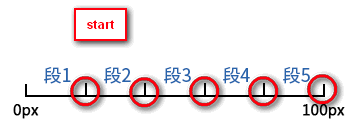

  - end表示在时间段的结束处跳跃，是默认值，表示戛然而止，也就是时间段一结束，当前动画执行就停止。于是，动画执行的5个分段点是下面这5个，结束点被忽略，因为在要执行结束点的时候已经没时间了

    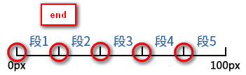

    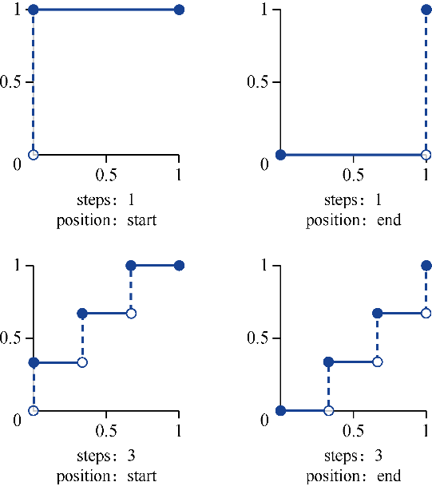

[Demo](https://demo.cssworld.cn/new/5/4-8.php)

#### 5.4.10 标签嵌套与动画实现的小技巧

x轴的平移动画+y的垂直动画（通过时间函数让其先漫后快）就可以实现一个抛物线的效果

[Demo](https://demo.cssworld.cn/new/5/4-9.php)

## 第6章 全新的布局方式

### 6.1 分栏布局

#### 6.1.1 重点关注columns属性

columns属性是column-width和column-count属性的缩写，举几个使用columns属性的例子

```css
/* 栏目宽度 */
columns: 18em;

/* 栏目数目 */
columns: auto;
columns: 2;

/* 同时定义宽度和数目，顺序任意 */
columns: 2 auto;
columns: auto 2;
columns: auto 12em;
columns: auto auto;
```

##### 1. 关于column-width

column-width表示每一栏/列的**最佳宽度**，而实际渲染宽度多半和指定的宽度是**有出入**的。**几乎不存在**分栏布局的栏目宽度就是column-width设置的宽度这样的场景。

column-width更像是一个**期望尺寸**，浏览器会根据这个期望尺寸确定分栏数目，一旦分栏数目确定了，column-width属性的使命也就完成了，接下来根据分栏数目对容器进行的分栏布局就和column-width属性**没有任何关系了**

**column-width不支持百分比值**

##### 2. 关于column-count

column-count表示**理想的分栏数目**，也就是意味着最终的分栏数目**可能不受**column-count属性值的控制

在分栏布局中，最终分栏的数量**要么由column-count属性决定，要么由column-width属性决定**，这两个CSS属性都可能有更高的决定权，至于哪个CSS属性的决定权更高，是要看具体场景的：**统一转换column-count值，哪个值小就使用哪一个**

#### 6.1.2 column-gap和gap属性的关系

```css
/* 关键字属性值 */
column-gap: normal; 

/* 长度值 */
column-gap: 3px;
column-gap: 3em;

/* 百分比值 */
column-gap: 3%;
```

**column-gap是gap属性的子属性**，gap属性实际上是column-gap属性和row-gap属性的**缩写**

#### 6.1.3 了解column-rule、column-span和column-fill属性

##### 1. 了解column-rule属性

column-rule属性是column-rule-width、column-rule-style和column-rule-color这3个CSS属性的缩写

##### 2. 了解column-span属性

column-span属性有点类似表格布局中的HTML属性colspan，表示某一个内容是否跨多栏显示

```css
/* 不横跨多栏，默认值 */
column-span: none;
/* 横跨所有垂直列 */
column-span: all;
```

##### 3. 了解column-fill属性

```css
/* 按顺序填充每一列，内容只占用它需要的空间（需要容器有固定的高度才能准确渲染） */
column-fill: auto;
/* 默认值，尽可能在列之间平衡内容，在分隔断开的上下文中，只有最后一个片段是平衡的 */
column-fill: balance;
/* 尽可能在列之间平衡内容，在分隔断开的上下文中，所有片段都是平衡的（当前浏览器不兼容） */
column-fill: balance-all;
```

[Demo](https://demo.cssworld.cn/new/6/1-5.php)

#### 6.1.4 分栏布局实现两端对齐布局

[Demo](https://demo.cssworld.cn/new/6/1-6.php)

分栏布局一个经典应用是实现电子书的水平翻页阅读效果，并且这种效果只能使用分栏布局实现，参见[这里](https://www.zhangxinxu.com/wordpress/2017/02/css3-multiple-column-layout-read- horizontal/)

#### 6.1.5 break-inside属性与元素断点位置的控制

```css
break-inside: auto;
/* 元素不能中断 */
break-inside: avoid;
```

[Demo](https://demo.cssworld.cn/new/6/1-7.php)

#### 6.1.6 box-decoration-break属性与元素断点装饰的控制

在默认情况下，元素片段在跨行、跨列或跨页（如打印）时候的样式是分割渲染的，**例如边框或者圆角都是分割开的**，如果希望因为分栏断开的文字在每一栏中都拥有独立完整的边框，则可以使用box-decoration-break属性实现

```css
box-decoration-break: slice;  /* 默认值 */
/* 断开的各个元素的样式独自渲染 */
box-decoration-break: clone;
```

**box-decoration-break属性只能影响部分CSS属性的渲染**

[Demo](https://demo.cssworld.cn/new/6/1-8.php)，Chrome下有兼容性问题，在分栏时不生效

### 6.2 弹性布局

弹性布局相关属性分为4个大的类目，分别是**流向控制**、**对齐设置**、**顺序控制**和**弹性设置**

#### 6.2.1 设置display:flex声明发生了什么

1. flex子项块状化
   - 在flex子项元素中使用vertial-align属性一定是没有任何效果的
   - flex子项的块状化特性对匿名内联元素同样适用
2. flex子项浮动失效
3. flex子项支持z-index属性
4. **flex子项的margin值不会合并**
5. flex子项是格式化的尺寸
   - 可以使用margin:auto进行剩余空间的智能分配


