# CSS新世界

## 第2章 需要提前了解的知识

[CSS值类型文档大全](https://www.zhangxinxu.com/wordpress/2019/11/css-value-type/)

[CSS届的绘图板CSS Paint API简介](https://www.zhangxinxu.com/wordpress/2018/11/css-paint-api-canvas/)

[CSS Painting API](https://developer.mozilla.org/en-US/docs/Web/API/CSS_Painting_API)

### 2.2 CSS属性值定义语法

语法包含**3种**基本组成元素：

- 关键字
- 数据类型
- 符号

#### 1. 关键字

关键字分为**通用关键字**（auto、none、ease等）和**全局关键字**（inherit、initial、unset、revert等）

#### 2. 数据类型

数据类型外面有一对尖括号，分为**基本类型**（CSS规范中专门定义的）与**其他类型**

#### 3. 符号

分为**字面符号、组合符号、数量符号**

- **字面符号**：CSS属性值中原本就支持的合法符号，这些符号在CSS语法中会**按其原本的字面意义呈现**，目前只有**2**个，一个是**逗号**（并列分隔符，用来分隔数个并列值，或分隔函数的参数值），另一个是**斜杠**（缩写分隔符，用来分隔一个值的多个部分，在CSS缩写中用于分离**类型相同但属于不同CSS属性的值**）
- **组合符号**：表示数个基本元素之羊的组合关系。目前共有**5**个：
  - 空格：表示并列，各部分必须出现，且需要**按顺序**出现
  - &&：“与”组合符，各部分必须出现，但**可以不按顺序**出现
  - ||：“或”组合符，各部分**至少出现一个**，**可以不按顺序**出现
  - |：“互斥”组合符，各部分**恰好出现其中一个**
  - []：方括号，将各部分分组以绕过上面几个符号的优先规则，即方括号的优先级最高
- **数量符号**：描述一个元素可以出现多少次，不能叠加出现，并且**优先级高于组合符号**，目前共**6**个，且大多数与正则表达式中的含义一样
  - 空格：无数量符号，表示**恰好出现一次**
  - *：出现任意次数
  - +：出现一次或多次
  - ？：出现零次或一次，即可有可无
  - {A, B}：出现最少A次，最多B次
  - #：可以出现一次或多次，但多次出现时**必须以逗号分隔**
  - !：表示**当前分组必须产生一个值**，该符号**多出现在组合符号方括号的后面**


#### 4. 字面符号斜杠（/）的详细介绍

在CSS这门语言中，凡是出现斜杠（/）的地方，斜杠前后的数据类型一定是**相同或者部分相同的**，否则整个语句就是非法的。

斜杠这个符号除了出现在部分CSS的缩写语法中，还会出现在一些CSS函数中用来表示分隔，例如rgba()函数的语法：

```css
<rgba()> = rgba(<percentage{3}[/<alpha-value]?) | 
           rgba(<number>{3}[/<alpha-value>]?) | 
           rgba(<percentage>#{3},<alpha-value>?)
           rgba(<number>#{3},<alpha-value>?)
```

### 2.3 全局关键字属性

- inherit：继承，IE浏览器从IE8就开始支持

- initial：initial关键字适合用在需要重置某些CSS样式，但又不记得初始值的场景，**常见误区：把initial关键字理解为浏览器设置的元素的初始值**（这个时候其实是使用**revert**）

- unset：unset是不固定值关键字，其特性如下：如果当前使用的CSS属性是具有继承特性的，如color属性，则等同于使用inherit关键字；如果当前使用的CSS属性是没有继承特性的，如background-color，则等同于使用initial关键字。所以**unset这个关键字只有配合all属性使用才有意义，即批量重置**，如：

  ```css
  dialog {
    all: unset;
  }
  ```

  

- revert：让当前元素的样式还原成浏览器内置的样式

#### 2.4 `@supports`

**语法**：

```css
@supports <supports-condition> {
	/* css规则集 */
}

<supports-condition> = (<var>)|not (<var>)|(<var>) [and <var>]+|(<var>)[or <var>]+
/* 注意这里出现的递归 */
<var> = <declaration> | <supports-condition>
```

注意上面的递归表示，所以当“判断当前浏览器支持弹性布局，但不支持网格布局”时，**并不是**如下写法：

```css
@supports (display: flex) and not (display: grid) {}
@supports not (display: grid) and (display: flex) {}
```

**正确**的写法是：

```css
@supports (display: flex) and (not (display: grid)){}
```

**@supports规则支持CSS自定义属性的检测和CSS选择器语法的检测**

```css
@supports (--var: blue) {}
@supports selector(:default) {}
```

**浏览器还提供了CSS.supports()接口**

```javascript
CSS.supports(propertyName, value);
CSS.supports(supportCondition);

CSS.supports('position','sticky')
```

## 第3章 从增强已有的CSS属性开始

### 3.1 尺寸体系

CSS的width属性新增了4个与尺寸概念相匹配的关键字，包括**fit-content**、**fill-available**、**min-content**和**max-content**

#### 3.1.1 fit-content

##### 1. width:fit-content

设置元素的尺寸为内容的尺寸，优点如下：

- 不修改元素的display值
- 让元素的尺寸有了确定的值，比如可以使用margin: auto这样来进行居中尺寸不确定的元素

> CSS动画关键帧中的CSS语句的优先级最高

##### 2. fit-content关键字的兼容性

- 样例：

	```css
	.example {
		width: -webkit-fit-content;
  	width: -moz-fit-content;
  	width: fit-content;
	}
	```

- **firefox暂不支持`height: fit-content`，即可添加了`-moz-`前缀（部分场合下有效，比如当`writing-mode: vertical-rl`时）**

	

- min-width属性和max-width属性可以正确渲染fit-content关键字，而max-height和min-height属性设置fit-content关键字虽然语法正确，但**没有任何具体的样式表现**

#### 3.1.2 stretch、available、fill-available

##### 1. 区别

- stretch指“弹性拉伸”，是最新的规范中定义的关键字，替换之前的fill-available和available。

- available指“可用空间”，是Firefox浏览器使用的关键字，需要配合-moz-私有前缀使用。

- fill-available指“填充可用空间”，是webkit浏览器使用的关键字，需要配合-webkit-私有前缀使用。

```css
/* 面向未来的写法 */
.example {
	width: -webkit-fill-available;
  width: -moz-available;
  width: stretch;
}
```

##### 2. 兼容性

Firefox浏览器在其他所有场景下都运行完美，唯独对table和inline-table水平的元素的渲染有问题，这些元素设置width:-moz-available的效果和设置width:100%是一样的

#### 3.1.3 深入理解min-content关键字

min-content关键字实际上就是CSS2.1规范中提到的“preferred minimum width”或者“minimum content width”，即“首选最小宽度”或者“最小内容宽度”。

- 对于像图片、视频、按钮等替换元素，其首选最小宽度为当前元素内容自身的宽度

- 对于CJK（中文、日文、韩文）文字，以中文为例，如果是一段没有标点的文字，则首选最小宽度为**单个汉字的宽度**，**如果文字包含避头标点（不能出现在文字头部）或避尾标点（不能出现在文字尾部）【在不同浏览器中，避头与避尾标点的定义不同】，同时`line-break`的属性不是`anywhere`，则最终首选最小宽度需要包含标点字符的宽度**

- 非CJK文字的首选最小宽度是由**字符单元的宽度**决定的，所有连续的英文字母、数字和标点都被认为是一个字符单元，直到遇到中断字符（比如空格符）

  > 我们可以使用word-break:break-all或者word-wrap:break-word改变字符单元的中断规则，从而改变容器元素的首选最小宽度。

- 一个元素最终的首选最小宽度是所有内部子元素中最大的那个首选最小宽度值

#### 3.1.4 快速了解max-content关键字

> max-content关键字的作用是让元素尽可能大，保证图文内容在一行显示，哪怕最终的宽度溢出外部容器元素。

> 所有需要使用max-content关键字的场景，都能使用white-space:nowrap声明实现一模一样的效果，并且white-space:nowrap的兼容性更好

### 3.2 深入理解CSS逻辑属性

> CSS逻辑属性需要配合writing-mode属性、direction属性或者text-orientation属性使用才有意义。

#### 3.2.1 margin-inline-endn属性

> 当文档流的方向是从左往右的时候，margin-inline- end属性的渲染表现就等同于margin-right属性；当文档流的方向是从右往左的时候，margin-inline-end属性的渲染表现就等同于margin-left属性。

**border-inline-start**类似效果

#### 3.2.2 inline/block与start/end元素

以margin为例，margin方位属性和margin逻辑属性相互的映射关系，其中inline/block表示方向，start/end表示起止方位

```
margin-left    ↔  margin-inline-start
margin-top     ↔  margin-block-start
margin-right   ↔  margin-inline-end
margin-bottom  ↔  margin-block-end
```

#### 3.2.3 width/height属性与inline-size/block-size逻辑属性

默认情况下，width属性对应的CSS逻辑属性是inline-size，height属性对应的CSS逻辑属性是block-size

#### 3.2.4 由margin/padding/border演变而来的逻辑属性

新的CSS逻辑属性如下：

- margin-inline-start、margin-inline-end、margin-block-start、margin- block-end
- padding-inline-start、padding-inline-end、padding-block-start、padding-block-end
- border-inline-start、border-inline-end、border-block-start、border- block-end
- border-inline-start-color、border-inline-end-color、border-block- start-color、border-block-end-color
- border-inline-start-style、border-inline-end-style、border-block- start-style、border-block-end-style
- border-inline-start-width、border-inline-end-width、border-block- start-width、border-block-end-width

#### 3.2.5 text-align属性支持的逻辑属性值

即`text-align: start`与`text-align: end`

#### 3.2.6 最有用的CSS逻辑属性inset

即：`inset-inline-start` 、`inset-inline-end`、 `inset-block-start`、 `inset-block-end`

及对应的缩写`inset-inline`、`inset-block`

及全缩写`inset`，作用如下：

```css
.overlay {
    position: absolute;
    left: 0; top: 0; right: 0; bottom: 0;
}
```

与下面的效果一致

```css
.overlay {
    position: absolute;
    inset: 0;
}
```

**safari**对其缩写形式兼容性不是很好

### 3.3 在CSS边框上做文章

#### 3.3.1 border-image

示意图：


对应的代码：

```css
.example {
    border-image-source: url('./grid-nine.svg');
  	/* fill的作用是进行中间部分的填充 */
    border-image-slice: 33.33% fill;
}
```

##### border-image-width属性

对九宫格的控制依赖于`border-image-width`属性，示意如下：

1. 为数值时

   

2. 为具体的长度值

3. 为百分比

   相对于元素自身的尺寸计算的，水平方位相对于宽度计算，垂直方位相对于高度计算，例如这段代码：

   ```css
   .example {
       border-image: url(./grid-nine.svg) 54;
       /* 上下各占50%，左右占25% */
       border-image-width: 50% 25%;
   }
   ```

   对应的效果：

   

   

4. 为`auto`时

   使用border-image-slice属性划分的尺寸作为九宫格宽度值

##### border-image-outset属性

该属性支付数值或具体的长度，如果是数值，则是相对`border-image-width`的值计算的

##### border-image-repeat属性

直接上图：


##### border-image缩写语法

语法：

```
border-image: <'border-image-source'> || <'border-image-slice'> [ / <'border-image- width'> | / <'border-image-width'>? / <'border-image-outset'> ]? || <'border-image-repeat'>
```

### 3.4 position属性的增强

**流盒**：黏性定位元素最近的可滚动元素的尺寸盒子，如果没有可滚动元素，则表示浏览器视窗盒子

**黏性约束矩形**：黏性定位元素的包含块（通常是父元素）在文档流中呈现的矩形区域和流盒的4个边缘在应用黏性定位元素的left、top、right和bottom属性的偏移计算值后的新矩形的交集。由于滚动时流盒不变，而黏性定位元素的包含块跟着滚动，因此黏性约束矩形随着滚动的进行是实时变化的

示例：

```html
<div>
  <nav>导航</nav>
</div>
```

```css
div {
    height: 100px;    
    margin-top: 50px;
    border: solid deepskyblue;
}
nav {
    position: sticky;
    top: 20px;
    background: lightskyblue;
}
```


计算规则如下：

> 由于<nav>这个黏性定位元素的top偏移是20px，因此，流盒矩形就是滚动窗口矩形再往下偏移20px，也就是图3-41所示的红色区域。而<nav>这个黏性定位元素的包含块就是其父元素<div>（设置了边框）。黏性约束矩形指的是流盒矩形和包含块的重叠区域，因此，图3-41所示的黏性约束矩形就是红色区域和方框区域重叠的矩形区域。
>
> 在默认状态下（图3-41左一），由于<div>元素设置了margin-top:50px，因此，<nav>这个黏性定位元素的顶部距离黏性约束矩形的顶部还有33px（即30px的距离加上3px的边框高度），此时不会有黏性效果。随着浏览器页面滚动，<nav>元素的顶部和黏性约束矩形的顶部距离越来越小，直到距离为0。此时<nav>元素开始下移，将自己约束在黏性约束矩形范围内，如图3-41左二所示。浏览器页面继续滚动，<nav>元素的底部也快要超出黏性约束矩形范围的限制了，如图3-41右二所示。最终，<nav>元素的底部和黏性约束矩形范围的底部重合。由于黏性定位元素不能超出黏性约束矩形范围的限制，因此此时黏性效果失效，<nav>元素跟着一起滚走了，如图3-41所示右一。

[Demo](https://demo.cssworld.cn/new/3/4-2.php)

个人在这里的理解，流盒的规范应该补充上：其定位是在应用了黏性定位元素的top、left、right、bottom之后，然后黏性约束矩形就可以定义为黏性定位元素的父元素与流盒的交集了

**黏性定位的堆叠规则**

> 黏性定位元素的偏移由容器决定，如果多个黏性定位元素在同一容器中，则这几个黏性定位元素会产生元素重叠的情况；如果黏性定位元素分布在不同的容器中，同时这些容器在布局上是上下紧密相连的，则视觉上会表现为新的黏性定位元素挤开原来的黏性定位元素，形成依次占位的效果。

[Demo](https://demo.cssworld.cn/new/3/4-3.php)

[层次滚动Demo](https://demo.cssworld.cn/new/3/4-4.php)

### 3.5 font-family属性和@font-face规则新特性

#### 3.5.1 全新通用字体族

- system-ui：系统UI字体
- emoji：适用于emoji字符的字体家族
- math：适用于数学表达式的字体家族
- fangsong：中文字体中的仿宋字体家族。

##### system-ui

表示使用系统字体，但考虑兼容性，会使用其它字体进行兜底

```css
body {
    font-family: system-ui, -apple-system, Segoe UI, Roboto, Helvetica, Arial, sans-serif;
}
```

##### emoji

虽然主流的操作系统内置了emoji字体，但是有些emoji字符并不会显示为彩色的图形，需要专门指定emoji字体

```css
/* 无衬线字体CSS最佳实践 */
@font-face {
    font-family: Emoji;
    src: local("Apple Color Emoji"),
       local("Segoe UI Emoji"), 
       local("Segoe UI Symbol"),
       local("Noto Color Emoji");
    /* 通过unicode-range属性调整emoji字体生效的Unicode范围 */
    unicode-range: U+1F000-1F644, U+203C-3299;
}
.emoji {
    font-family: system-ui, -apple-system, Segoe UI, Roboto, Emoji, Helvetica, Arial, sans-serif;
}
```

**math**

有一种名为MathML的XML语言专门用来呈现富有层级关系的数学公式（对MathML的详细介绍见https://www.zhangxinxu.com/wordpress/?p=8108）

Chrome浏览器并不支持MathML，为了兼容Chrome浏览器，我们需要对数学标签进行CSS重定义，此时就需要用到math通用字体族：

```css
math {
  	/* Cambria Math是Windows操作系统中的数学字体，Latin Modern Math是macOS中的数学字体 */
    font-family: Cambria Math, Latin Modern Math;
}
```

**fangsong**

这个字体族来自中文字体“仿宋”，仿宋是介于宋体（衬线字体）和楷体（手写字体）之间的一种字体

```css
article {
    font-family: fangsong;
}
```

**其它**

- font-family:ui-serif表示使用和系统一样的衬线字体
- font-family:ui-sans-serif表示使用和系统一样的无衬线字体
- font-family:ui-monospace表示使用和系统一样的等宽字体
- font-family:ui-rounded表示使用和系统一样的圆形字体（边和角都很圆润的字体），如果系统中没有这样的字体，则不指向任何系统字体

目前ui-开头的这些系统字体只有Safari浏览器支持，不过在实际项目中也是可以用的，可以添加在传统的字体族关键字serif、sans-serif或monospace之前

#### 3.5.2 local()函数与系统字体的调用

@font-face规则中支持使用`local()`函数调用系统安装的字体，主要好处如下：

- 简化字体调用（参照前面emoji的例子）

- 在自定义字体场景下提高性能，比如下面例子，为了让各平台都能使用`Roboto`字体，使用`local()`函数可以让已经安装了`Roboto`字体的用户不发起额外的字体请求，优化体验

  ```css
  @font-face {
      font-family: Roboto;
      font-style: normal;
      font-weight: 400;
      src: local("Roboto"), local("Roboto-Regular"), url(./Roboto.woff2) format("woff2");
  }
  ```

#### 3.5.3 unicode-range属性介绍

在@font-face规则中，通过`unicode-rang`属性来决定自定义字体作用在哪些字符上（参见前面emoji的例子），其语法如下：

```css
/* 支持的值 */
unicode-range: U+26;               /* 单个字符编码 */
unicode-range: U+0-7F;
unicode-range: U+0025-00FF;            /* 字符编码区间 */
unicode-range: U+4??;                /* 通配符区间，'?'表示0-F的值，所以U+4??等价于U+400到U+4FF */
unicode-range: U+0025-00FF, U+4??; /* 多个值 */
```

**1. Unicode编码显示字符在各种语言中的使用前缀不同**：

1. 在HTML中，字符输出可以使用&#x加上Unicode编码
2. 在JavaScript文件中，为了避免中文乱码需要转义，应使用\u加上Unicode编码
3. 在CSS文件中，如CSS伪元素的content属性，就直接使用\加上对应字符的Unicode编码值
4. unicode-range属性则是使用U+加上Unicode编码

**2. 常用Unicode编码**

- 基本二次汉字：[0x4e00,0x9fa5]（或十进制[19968,40869]）
-  数字：[0x30,0x39]（或十进制[48, 57]）
- 小写字母：[0x61,0x7a]（或十进制[97, 122]）
- 大写字母：[0x41,0x5a]（或十进制[65, 90]）。

**js中可通过如下方法获取一个字符的Unicode编码值（ES6新增）**

```javascript
U = '☺'.codePointAt().toString(16);
// U的值是'263a'
```

#### 3.5.4 woff/woff2字体

> woff字体在2012年12月被World Wide Web Consortium（W3C）推荐使用，IE9+浏览器支持该字体。woff2字体最早在2013年7月的Chrome Canary版本上就可以使用了，发展到现在，几乎已经成为自定义图标字体使用的标准配置，目前浏览器对它的兼容性已经相当不错了
>
> ```css
> @font-face {
>     font-family: MyFont;
>     src: url(myfont.woff2) format("woff2"),
>         url(myfont.woff) format("woff");
> }
> ```
>
> 
>
> 如果你的字体文件不是很大，也可以直接以Base64的形式将woff或woff2字体内嵌在CSS中，加载体验比外链字体时的加载体验要好一些
>
> ```css
> @font-face {
>     font-family: MyFont;
>     src: url("data:font/woff2;base64,...") format("woff2"),
>         url("data:font/woff;base64,...") format("woff");
> }
> ```
>
> 
>
> woff2字体没有必要再开启GZIP，因为这个字体文本本身就是压缩过的。
>
> 

#### 3.5.5 font-display属性与自定义字体的加载渲染

这时浏览器的字体加载行为表现为，应用MyFont字体的文本**会先被隐藏**，直到字体加载结束才会显示，**但是这个隐藏最多持续3s，3s后字体仍未加载结束则会使用其他字体代替**

> 如果我们使用自定义字体的目的是实现图标字体功能，则这种加载行为就比较合适。因为渲染出来的小图标和小图标使用的真正字符往往外形差异巨大，那些用户看不懂的字符需要被隐藏起来，以此提升视觉体验。但是，如果我们使用自定义字体来呈现普通文本内容，则这种加载行为就不太合适。因为文字内容应该第一时间呈现给用户，而不应该出现长时间的空白，内容绝对比样式更重要。

而font-display属性可以控制字体加载和文本渲染之间的时间线关系

**字体显示时间线**

控制字体加载和文本渲染之间的时间线关系

字体显示时间线开始于浏览器尝试下载字体的那一刻，整个时间线分为3个时段，浏览器会在这3个时段让元素表现出不同的字体渲染行为。

1. **字体阻塞时段**：如果未加载字体，任何试图使用它的元素都必须以不可见的方式渲染后备字体；如果在此期间字体成功加载，则正常使用它。
2. **字体交换时段**：如果未加载字体，任何试图使用它的元素都必须以可见的方式渲染后备字体；如果在此期间字体成功加载，则正常使用它
3. **字体失败时段**：如果未加载字体，则浏览器将其视为加载失败，并使用正常字体进行回退渲染。

**font-display语法**

```css
font-display: [ auto | block | swap | fallback | optional ]
```

- auto：字体显示策略由浏览器决定，大多数浏览器的字体显示策略类似block
- block：字体阻塞时段较短（推荐3s），字体交换时段无限。此值适合图标字体场景
- swap：字体阻塞时段极短（不超过100ms），字体交换时段无限。此值适合用在小段文本，同时文本内容对页面非常重要的场景
- fallback：字体阻塞时段极短（不超过100ms），字体交换时段较短（推荐3s）。此值适合用于大段文本，例如文章正文，同时对字体效果比较看重的场景，例如广告页面、个人网站等
- optional：字体阻塞时段极短（不超过100ms），没有字体交换时段。此值的作用可以描述为，如果字体可以瞬间被加载（例如已经被缓存了），则浏览器使用该字体，否则使用回退字体。optional是日常Web产品开发更推荐的属性值，因为无论任何时候，网页内容在用户第一次访问时快速呈现是最重要的，不能让用户等待很长时间后再看到你认为的完美效果。

**建议**

如果自定义字体的大小在30 KB以内，建议直接用Base64将其内联在页面中。不过只有woff2字体采取内联处理，woff字体依旧采用url()函数外链体验最佳，因为此时现代浏览器中的字体都是瞬间渲染，根本无须使用font-display属性进行字体加载优化。

**@font-face定义的字体只有在被使用的时候才会加载**

这会导致使用canvas进行文字绘制时自定义字体不生效的问题，一般的解决方法是创建一个应用了自定义字体的隐藏元素，或者使用`FontFaceSet.load()`方法加载字体：

```javascript
document.fonts.load("12px MyFont").then(…);
```

### 3.6 字符单元的中断与换行

**默认换行规则**

- 空格、换行符、制表符，会合并为单个空格
- 文字可以在CJK文本、空格和短横线连字符处换行，连续英文单词和数字不换行

#### 3.6.1 使用keep-all属性值优化中文排版

```css
word-break: normal | break-all | keep-all | break-word
```

keep-all这个属性值可以让CJK文本不换行排版，同时又不影响非CJK文本的排版行为，比如下面的场景：


#### 3.6.2 break-all属性值的问题和line-break属性

这个属性比较常用，这里只提一个意外情况：连续的破折号、连续的点字符，以及避首标点在设置word-break:break-all声明后无法换行，**这时候就需要使用`break-word`属性值**


```css
p {
    /* 字符换行主力 */
    word-break: break-all;
    /* 兼容IE浏览器和Edge浏览器的破折号换行 */
    word-wrap: break-word;
}
```

虽然上面的代码可以让连续英文和连续破折号换行，但是依然会在中文标点的前后留下空白


如果希望中文标点也能成为换行点，彻底告别空白，则可以**使用`line-break`属性**

```css
p {
    /* 中文标点也能换行 */
    line-break: anywhere;
}
```


#### 3.6.3 hyphens属性与连字符

> hyphens是专为英文场景设计的一个属性，这个属性可以让英文单词断开换行的时候带上连字符（也就是短横线），这样可以让读者知道上一行的尾部和下一行的头部连起来是一个完整的单词

```css
hyphens: none | manual | auto
```

> 其中，属性值auto可以让英文单词在行尾自动换行，同时带上短横线。需要注意的是，英文单词换行不需要设置word-break或者word-wrap属性，**hyphens属性自带换行能力**。如果你设置了word-break:break-all声明，**反而不会有短横线效果**


但现实中该属性**毫无用处**，原因如下：

1. 需要在英语环境中，也就是需要祖先元素设置lang="en"属性
2. 由于中文语句中随时可以换行，因此在中文场景下，轮不到hyphens属性起作用。就算真的遇到长串的连续字母和数字，也不一定是英文单词，多半是URL网址或者特殊字符串，而在网址换行位置添加短横线是不可以的，因为增加一个短横线会导致原本正确的网址变成错误的网址
3. 只有在Android操作系统下和macOS下的Chrome浏览器中才有效果，在用户量较大的Windows操作系统中无效

**软换行符**

> 我们可以使用hyphens属性的默认特性来设置类似auto属性值的排版体验。hyphens属性的默认值是manual，表示单词在有换行机会的时候才换行，其中一个常见的换行机会就是连字符。
>
> 连字符总共分两种。一种是“硬连字符”（U+2010），称为可见的换行机会。这个字符就是我们键盘上的短横线“-”，是可见的。另一种是“软连字符”（U+00AD），称为不可见的换行机会。这个字符很有意思，通常情况是隐藏的，但是，如果浏览器觉得有必要在软连字符所在位置打断单词，则连字符又会变为可见
>
> ```html
> <p>大家好，我叫zhang&shy;xin&shy;xu，感谢大家购买我的书。</p>
> ```
>
> ```css
> p {
>     padding: 10px;
>     border: solid deepskyblue;
>     text-align: justify;
>     text-justify: inter-ideograph;
> }
> ```
>
> 效果：
>
> 

[Demo](https://demo.cssworld.cn/new/3/6-3.php)

#### 3.6.4 `<wbr>`与精确换行的控制

> HTML中有一个`<wbr>`元素标签，可以实现连续英文和数字的精准换行，具体效果如下：如果宽度足够，不换行；如果宽度不足，则在`<wbr>`元素所在的位置进行换行。也就是说，`<wbr>`元素提供了一个换行机会。

`<wbr>`之所以能够创造新的换行机会，是因为其创建了一个带有换行特性的宽度为0px的空格。该空格的Unicode编码是U+200B，因此`<wbr>`标签也可以替换为`&#x200b;`

IE不支持`<wbr>`标签，但可以用如下css实现同样效果：

```css
wbr:after { content: '\00200B'; }
```

**`<wbr>`不能与word-break:break-all同时使用**，因为这会使`<wbr>`变得没有意义

#### 3.6.5 overflow-wrap: anywhere声明有什么用

```css
overflow-wrap: normal | break-word | anywhere
```

属性值anywhere正常状态下的效果和属性值break-word类似，具体描述为：如果行中没有其他可接受的断点，则可以在任何点断开原本不可断开的字符串（如长单词或URL），并且在断点处不插入连字符。

属性值anywhere和属性值break-word的不同之处在于，overflow-wrap:anywhere在计算最小内容尺寸的时候会考虑软换行，而overflow-wrap:break-word则不会考虑软换行


overflow-wrap:anywhere的行为表现和line- break:anywhere是有明显区别的，line-break:anywhere不管元素尺寸是否足够，都是能断则断。

### 3.7 text-align属性相关的新特性

```css
text-align: match-parent;
text-align: justify-all;
text-align: <string>;
```

**但这几个属性兼容性不好，所以了解即可，不要在生产环境使用**

> 在现代浏览器中，两端对齐的算法是：CJK文本使用letter-spacing间隔算法，非CJK文本使用word-spacing间隔算法。如果我们希望非CJK文本也使用letter-spacing间隔算法，也就是每个字母彼此都可以拉开间隙，则可以使用：
>
> ```css
> text-justify: inter-character;
> ```

### 3.8 text-decoration属性全新升级

现在，text-decoration属性则是一个CSS**缩写属性**，完整的CSS属性包括text-decoration-line、text-decoration- style、text-decoration-color和text-decoration-thickness

```css
text-decoration: <'text-decoration-line'> || <'text-decoration-style'> || <'text-decoration-color'> || <'text-decoration-thickness'>
```

当父元素和子元素同时设置text- decoration效果的时候，文字的装饰线效果是**累加**的，而不是覆盖的

text-decoration属性有一个特性要比border属性强，那就是可以实现波浪线装饰线效果，这个是border属性实现不了的，下面的样式实现一个**宽度为100%自适应的波浪线效果**

```css
wavy {
    display: block;
    height: .5em;
    white-space: nowrap;
    letter-spacing: 100vw;
    padding-top: .5em;
    overflow: hidden;
}
wavy::before {
    content: "\2000\2000";
    /* IE浏览器用实线代替*/
    text-decoration: overline;
    /* 现代浏览器，Safari浏览器不支持text-decoration：overline wavy缩写*/
    text-decoration-style： wavy;
}
```

**text-underline-position:under**

直接使用`text-decoration: underline`添加下划线，在展示汉字时有时候效果很不好：


这时就需要`text-underline-position: under`了，添加后的效果如下：


**text-underline-offset**

它与`text-underline-position`的区别在于，前者调整下划线的位置是固定的，而`text-underline-offset`支持数值和百分比值（相对于`1em`）来设置下划线的位置

`text-underline-offset`只对**设置了下划线**的**当前元素**才有效

**text-decoration-skip**

text-decoration-skip属性可以用来控制装饰线和文字之间的重叠关系，这里的装饰线专指下划线

### 3.9 color属性与颜色设置

#### 3.9.1 一些不为人知的知识点

- HTML中color属性算法和CSS中的color属性算法是不一样的。同样是一个无法识别的颜色关键字，在HTML中这个无法识别的颜色关键字会渲染成另外一个颜色，而在CSS中会直接忽略这个颜色关键字
- 颜色关键字不区分大小写，且颜色关键字设置的颜色都是实色，不带透明度
- 暗灰色darkgray的颜色要比灰色gray更浅，因此，并不是有“dark”前缀的颜色关键字控制的颜色就更深

#### 3.9.2 transparent关键字

> transparent关键字其实是rgba(0,0,0,0)的另外一种**快捷书写方式**，这是CSS规范文档中明确定义的，并且所有浏览器也遵循这个规范

css中的透明渐变色的过渡使用了特别的算法，而svg或canvas中，在生成渐变效果时，会出现过渡过程中夹着灰红色，如下：


#### 3.9.3 currentColor关键字

它表示当前元素（或伪元素）所使用的color属性的计算值，currentColor关键字从IE9浏览器开始被支持

CSS中很多属性的默认颜色就是color属性值，没有必要专门指定currentColor关键字，包括border-color、outline-color、caret-color、text-shadow、box-shadow等CSS属性

#### 3.9.4 RGB颜色和HSL颜色的新语法

**HSL颜色**

HSL颜色是由色调（Hue）、饱和度（Saturation）和亮度（Lightness）这3个元素组成的，色调值的大小是任意的，因为CSS世界中与色调相关的数值都是角度值，其单位是deg

> **色值**hsl(0,100%,50%)到hsl(360,100%,50%)的色值带，可以看出来HSL颜色色调从0～360deg大致按照红、橙、黄、绿、青、蓝、紫、红的颜色顺序分布。其中，**红色、绿色和蓝色**这3个颜色的色调值有时候会用到，大家可以专门记一下，**分别是red=0deg、green=120deg、blue=240deg**


> **饱和度**和**亮度**的值是任意的，最终解析的数值范围均在0%～100%，数值后面的百分号一定不能少，否则整个语句无效，所有浏览器中均是如此。

**RGBA颜色与HSLA颜色**

> RGBA和HSLA中的字母A指的就是Alpha透明通道，透明度取值范围任意，但是渲染范围是0～1，也就是小于0的透明度会当作0渲染，大于1的透明度会当作1渲染

**#RRGGBBAA颜色**

A依旧表示透明度，但因为透明度的范围由原来的0%~100%转成用00~FF来表示，所以需要进行转换

```javascript
AA = (Alpha * 255).toString(16);
```

**极致自由的新语法**

1. rgb()和rgba()函数语法互通，hsl()和hsla()函数语法互通
2. hsl()和hsla()函数语法互通
3. 透明度可以使用百分比表示
4. hsl()函数中的色调可以使用任意角度单位（deg\rad\turn）
5. rgb()和hsl()函数语法中的逗号可以忽略（用空格代替）

**RGB颜色和HSL颜色新语法**

```css
/* RGB色值或者HSL色值之间使用空格分隔，透明度使用斜杠分隔 */
rgb(255 0 153 / 1)
rgb(255 0 153 / 100%)
rgba(51 170 51 / 0.4)
rgba(51 170 51 / 40%)
hsl(270 60% 50% / .15)
hsl(270 60% 50% / 15%)
```

### 3.10 必学必会的background属性新特性

#### 3.10.1 最实用的当属background-size属性

**cover和contain**

**理解auto关键字下的尺寸渲染规则**

这里涉及图片内在尺寸、内在比例的概念：

- 位图，总是有自己的内存尺寸和内在比例
- 矢量图，比如svg，不一定具有内在尺寸，如果设置了水平尺寸与垂直尺寸，那它就具有内在比例，如果没有设置尺寸或只设置了一个方向的尺寸，则它可能有比例，也可能没比例，要视svg内部代码而定，比如svg内部只有`<defs>`元素，则它就是没有比例的
- 渐变图像，即使用css渐变语法绘制的图像，没有内在尺寸与内在比例
- 元素图像：使用`element()`函数把DOM元素作为背景图，此时的内在尺寸就是这个DOM元素的尺寸

`background-size: auto`或不设置（默认为`auto`）时的渲染规则：

1. 如果图像水平和垂直方向同时具有内在尺寸，则按照图像原始大小进行渲染。例如一个PNG图片尺寸是800px×600px，那么背景图的尺寸就是800px×600px，这就是多倍图一定要设置background-size属性的原因，否则只能显示部分图像内容。
2. 如果图像没有内在尺寸，也没有内在比例，则按照背景定位区域的大小进行渲染，等同于设置属性值为100%。所以，CSS渐变图像默认都是覆盖整个背景定位区域的
3. 如果图像没有内在尺寸，但具有内在比例，则渲染效果等同于设置属性值为contain，比如`<svg>`元素没有设置width属性和height属性，也就是没有设置内在尺寸，此时这个SVG文件作为背景图，我们无须指定background-size属性值，SVG图像就能自动被包含在背景定位区域内
4. 如果图像只有一个方向有内在尺寸，但又具有内在比例，则图像会拉伸到该内在尺寸的大小，同时宽高比符合内在比例。例如，某个SVG图像的内在比例是1:1，但是SVG图像源码中的`<svg>`元素只设置了width属性，没有设置height属性，则最终的SVG图像会按照width属性设置的宽度渲染，高度和宽度保持1:1的比例进行渲染
5. 如果图像只有一个方向有内在尺寸而没有内在比例，则图像有内在尺寸的一侧会拉伸到该内在尺寸大小，没有设置内在尺寸的一侧会拉伸到背景定位区域大小

如果`background-size`的属性值一个是auto，另外一个值不是auto，有如下两种情况

1. 如果图像有内在比例，则图像会拉伸到指定的尺寸，高宽依然保持原始的比例
2. 如果图像没有内在比例，则图像会拉伸到指定的尺寸。

**数值或百分比**

1. 不能为负值
2. 分比值是相对于元素的背景定位区域计算的。背景定位区域是由background-origin属性决定的，默认值是padding box

**其它**

**`background-size`属性在作为`background`的缩写时，必须写在`background-position`之后，用斜杠分隔**

#### 3.10.2 `background`属性最成功的设计——多背景

[Demo](https://demo.cssworld.cn/new/3/10-5.php)

[Css3 Patterns Gallery网站](https://projects.verou.me/css3patterns/)

如果想要同时使用CSS渐变和CSS背景色，需要使用CSS多背景语法，并且颜色值**必须放在最后**

#### 3.10.3 background-clip属性与背景显示区域限制

> background-clip属性的特点是剪裁。在background-clip属性值发生变化的时候，背景图像显示的尺寸是不会变的，变的是图像显示的范围

```css
background-clip: border-box;
background-clip: padding-box;
background-clip: content-box;
background-clip: text;
```

#### 3.10.4 background-clip:text声明与渐变文字效果

> background-clip:text可以让背景图像按照字符形状进行剪裁，此时我们只要隐藏文字，就可以看到字符形状的背景效果了

#### 3.10.5 background-origin属性与背景定位原点控制

默认值是`padding-box`

#### 3.10.6 space和round平铺模式（都存在兼容性问题）

**space**

> 让背景图像尽可能地重复，而不进行剪裁，每个重复单元的尺寸不会变化。其中第一张和最后一张图像固定在元素的两边，然后通过拉伸空白区域让剩余的图像均匀分布

**round**

> 背景图像会被拉伸，并保证不留间隙。随着定位区域空间的增加，如果（假设图像都是原始尺寸下的）剩余空间大于图像宽度的一半，则添加另外一张图像。在添加下一张图像时，当前的所有图像都会压缩以留出空间放下这个新添加的图像

**可以分别指定水平和垂直方向上的图像平铺方式**

```css
background-repeat: round space;
```

#### 3.10.7 可以指定background-position的起始方位了

比如让背景图像在距离右下方20px的位置：

```css
.example {
    width: 300px; height: 200px;
    border: solid deepskyblue;
    background: url(1.jpg) no-repeat right 20px bottom 20px;
}
```

[Demo](https://demo.cssworld.cn/new/3/10-9.php)

**1个值语法**

就是我们常见的使用方式，用来表示x轴上的定位，而y轴上的定位都是`center`

**2个值语法**

分三种情况：

1. 2个值都是关键字属性值。left关键字和right关键字表示水平方向，top关键字和bottom关键字表示垂直方向，因此top right和right top的效果是一样的。而left right和top bottom则认为是无效的语法
2. 1个值是关键字属性值，另外一个值是数值或百分比值。如果数值或百分比值是第一个值，则表示水平方向，另外一个关键字属性值就表示垂直方向。如果数值或百分比值是第二个值，则表示垂直方向，另外一个关键字属性值就表示水平方向
3. 2个值都是数值或百分比值。第一个值表示水平方向，第二个值表示垂直方向

**3个值或4个值语法**

数值和百分比值表示偏移量，第一个值一定要是关键字属性值，这个关键字属性值用来表示偏移是从哪个方向开始的。如果是3个值，则认为缺少的偏移量是0。因此，20px left top一定是不合法的，其第一个值不是关键字属性值。left 20px right也是不合法的，因为left和right方位对立。left 20px top就是合法的，其等同于left 20px top 0px，表示距离左侧20px，距离顶部0。由于background-position默认的定位就是left top，因此left 20px top 0也等同于20px 0px。

```css
background-position: left 10px top 15px;   /* 10px, 15px */
background-position: left      top     ;   /*  0px,  0px */
background-position:      10px     15px;   /* 10px, 15px */
background-position: left          15px;   /*  0px, 15px */
background-position:      10px top     ;   /* 10px,  0px */
background-position: left      top 15px;   /*  0px, 15px */
background-position: left 10px top     ;   /* 10px,  0px */
```

### 3.11 outline相关新属性outline-offset

> outline-offset属性用于改变outline属性设置的轮廓的偏移位置
>
> outline-offset属性使用负值来缩小轮廓的频率要比使用正值来扩大轮廓的频率高很多

[Demo](https://demo.cssworld.cn/new/3/11-1.php)

### 3.12 cursor属性新增手形效果

**放大手形zoom-in和缩小手形zoom-out**

```css
.zoom-in {
    /* 放大 */
    cursor: zoom-in; 
}
.zoom-out {
    /* 缩小 */
   cursor: zoom-out; 
}
```

**抓取手形grab和放手手形grabbing**

```css
.element {
    /* 准备抓取 */
    cursor: -webkit-grab;
    cursor: -moz-grab;
    cursor: grab; 
}
.element:active {
    /* 已经抓住 */
    cursor: -webkit-grabbing;
    cursor: -moz-grabbing;
    cursor: grabbing;
}
```

## 第4章 更细致的样式表现

### 4.1 透明度控制属性opacity

> **opacity属性值不为1的元素会创建一个层叠上下文**，层叠顺序会变高。因此，如果你希望某个DOM顺序在前的元素覆盖后面的元素，可以试试设置opacity:0.99。

#### 4.1.1 opacity属性的叠加计算规则

父、子元素同时设置半透明时，半透明效果是叠加的（即相乘）

半透明颜色与非透明颜色的叠加算法如下：

```javascript
r = (foreground.r * alpha) + (background.r * (1.0 - alpha));
g = (foreground.g * alpha) + (background.g * (1.0 - alpha));
b = (foreground.b * alpha) + (background.b * (1.0 - alpha));
```

#### 4.1.2 opacity属性的边界特性与应用

opacity属性设置的数值大小如果超出0～1的范围限制，最终的计算值是边界值。**这种边界特性配合CSS变量可以在CSS中实现类似于if...else的逻辑判断**，可以用在元素显隐或者色值变化的场景

```css
:root {
  /* 定义RGB变量 */
  --red: 44;
  --green: 135;
  --blue: 255;
  /**
   * 亮度算法：
   * lightness = (red * 0.2126 + green * 0.7152 + blue * 0.0722) / 255
  */
  --lightness: calc((var(--red) * 0.2126 + var(--green) * 0.7152 + var(--blue) * 0.0722) 
}
.button {
  /* 文字颜色，只可能是黑色或白色 */
  color: hsl(0, 0%, calc((var(--lightness) - 0.5) * -999999%));
  /* 文字阴影，黑色文字才会出现 */
}
```

`.button`元素使用HSL表示文字颜色，如果亮度超过0.5，则color元素的亮度计算结果是一个负数，根据边界值我，结果为0，反之是一个超大的正数，结果为100%，从而实现文字的黑白色值变化

[Demo1](https://demo.cssworld.cn/new/4/1-1.php)

[Demo2](https://demo.cssworld.cn/new/4/1-2.php)

### 4.2 深入了解圆角属性border-radius

#### 4.2.1 了解border-radius属性的语法

**CSS圆角属性却是先上下再左右**


**水平半径和垂直半径**

```css
border-top-left-radius: 10px;
```

等同于

```css
border-top-left-radius: 10px 10px;
```

如果是border-radius属性，则**水平半径和垂直半径**不是通过空格进行区分，而是通过斜杠区分

```css
border-radius: 30px / 60px;
```

#### 4.2.2 弄懂圆角效果是如何产生的

实际上border-radius属性的字面意思不是“圆角”，而是“边界半径”，也就是圆角效果来自以这个半径值绘制的圆或以半轴值绘制的椭圆，比如：

```css
border-top-left-radius: 30px 60px;
```

原理图为：


**重叠曲线的渲染机制**

该机制主要是解决如下这种css样式的渲染效果（元素高度为100px，宽度为150px）

```css
border-top-left-radius: 30px 100%;
border-bottom-left-radius: 30px 100%;
```

按前文描述，这种情况曲线一定会发生重叠，而且其交叉点一定不是平滑的，所以css规范对这种场景做了额外的渲染设定，会先计算出一个因子：
$$
f = min(L_h/S_h, L_v/S_v)
$$
其中`S`表示半径之和，`L`表示元素的宽高，下标`h`和`v`表示是水平还是垂直（水平即为宽，垂直即为高）

当`f`计算的结果小`1`时，所有圆角半径都乘以它，以上面的元素及样式为例
$$
f = min(L_h/S_h, L_v/S_v) = min(150/60, 100/200) = 0.5
$$
所以实际上生效的样式为：

```css
border-top-left-radius: 15px 50%;
border-bottom-left-radius: 15px 50%;
```

#### 4.2.3 border-radius属性渲染border边框的细节

如果元素设置了border边框，则圆角半径会被分成内半径和外半径


其中直线为外半径，圆心到内部虚线圆的距离为内半径

1. padding边缘的圆角大小为设置的border-radius大小减去边框的厚度（border），如果结果为负，则内半径为0

   ```css
   .radius {
       width: 100px; height: 100px;
       border-top: 40px solid deepskyblue;
       border-left: 40px solid deepskyblue;
       border-radius: 40px 0 0;
   }
   ```

   

2. 如果相邻两侧边框的厚度不同，则圆角大小将在较厚和较薄边界之间显示平滑过渡

   ```css
   .radius {
       width: 100px; height: 100px;
       border-top: 40px solid deepskyblue;
       border-left: 20px solid deepskyblue;
       border-radius: 40px 0 0 / 60px 0 0;
   }
   ```

   

3. 圆角边框的连接线和直角边框连接线位置一致，但是角度会有所不同

   ```css
   width: 100px; height: 100px;
       border-top: 40px solid deepskyblue;
       border-left: 20px solid deeppink;
       border-right: 20px solid deeppink;
       border-radius: 40px 0 0 / 60px 0 0;
   ```

   

4. 其它细节

   - border-radius不支持负值
   - 圆角以外的区域不可点击，无法响应click事件
   - border-radius没有继承性，因此父元素设置了border-radius，子元素依然是直角效果。我们可以通过给父元素设置overflow:hidden让子元素视觉上表现为圆角
   - border-radius属性支持transition过渡效果，也支持animation动画效果，因此在图形表现领域，border-radius属性会非常给力
   - border-radius属性也是可以应用于display的计算值为table、inline-table或者table-cell的元素上的，但是有一个前提，那就是表格元素的border-collapse属性值需要是separate（separate是border-collapse属性的默认值），如果border-collapse属性值是collapse，那么是没有圆角效果的。

#### 4.2.4 border-radius属性的高级应用技巧

[Demo1](https://demo.cssworld.cn/new/4/2-1.php)

[Demo2](https://demo.cssworld.cn/new/4/2-2.php)

### 4.3 box-shadow盒阴影

#### 4.3.1 inset关键字与内阴影

**模拟边框**

border边框被占用或不方便使用border属性的情况（border属性会影响元素尺寸），此时可以考虑使用box-shadow内阴影模拟边框

```css

.normal {
    /* 模拟边框 */
    box-shadow: inset 1px 0 #a2a9b6, inset -1px 0 #a2a9b6, inset 0 1px #a2a9b6, inset 0 -1px #a2a9b6;
}
```


**颜色覆盖**

box-shadow内阴影有一个实用特性，那就是生成的阴影会位于文字内容的下面，背景颜色的上面。于是我们可以使用box-shadow属性在元素上面再覆盖一层颜色（**覆盖浏览器输入框自动填充时的颜色**）

但对于像img这样的可替换元素，**其内容是在阴影之上的**，此时可以使用outline属性进行模拟

#### 4.3.2 不要忽略第四个长度值

第四个长度值，表示扩展半径

**轮廓模拟**

使用扩展半径模拟轮廓的代码量要比实现4个方向分别投影的代码量小很多（IE中渲染有问题），**扩展半径多用来模拟大范围的色块效果**

**单侧阴影**

```css
header {
    box-shadow: 0 7px 5px -5px rgba(0, 0, 0, .5);
}
```


#### 4.3.3 多阴影特性与图形绘制

首先，这个特性不要滥用，因为它的**性能真的很糟糕**

可用来实现多边框、渐变边框、加载效果（绘制loading：按圆形轨迹分布的几个不同明暗程度的点）、3d投影

#### 4.3.4 box-shadow动画与性能优化

例如盒阴影过渡效果，可以使用伪元素创建盒阴影，然后在鼠标经过盒的时候改变盒阴影的透明度，以此进行优化

### 4.4 CSS 2D变换

#### 4.4.1 从基本的变换方法说起

**translate()位移**

位移的方向和文档流的顺序没有任何关系，也就是即使祖先元素设置direction:rtl，translateX(10px)依然表示往右偏移

**rotate()旋转**

正值是顺时针旋转

单位：

- deg：角度，范围0~360，负值表示逆时针
- grad：百分度（梯度），一个grad相当到1/400个整圆，即，100grad相当于90deg
- rad：弧度，1rad表示180/$$\pi$$
- turn：圈数，1turn表示360deg

**scale()缩放**

缩放变换不支持百分比值，仅支持数值

缩放变换支持负值。如果我们想要实现元素的**水平翻转**效果，可以设置transform:scaleX(-1)；想要实现元素的**垂直翻转**效果，可以设置transform:scaleY(-1)

**skew()斜切**


#### 4.4.2 transform属性的若干细节特性

**盒模型尺寸不会变化**

比如通过`transform: scale(2);`将元素放大2倍，并不会推开旁边的元素，只会在视觉上重叠与覆盖

**内联元素无效**

内联元素（不包括替换元素）是无法应用transform变换的，且不支持所有变换特性。

但有两种方法可以实现位移效果，一种是给元素增加块状特性，例如设置display属性值为inline-block，还有一种方法是改用相对定位

**锯齿或虚化的问题**

在应用旋转或者斜切变换的时候，元素边缘会表现出明显的锯齿，文字会明显虚化。这个现象主要出现在桌面端浏览器上，而且这个问题是没有办法避免的，因为显示器的密度跟不上。

**不同顺序不同效果**

[Demo](https://demo.cssworld.cn/new/4/4-1.php)

**clip/clip-path前置剪裁**

一个元素应用transform变换之后，同时再应用clip或者clip-path等属性，此时很多人会误认为剪裁的是应用变换之后的图形，实际上不是的，剪裁的还是变换之前的图形，也就是**先剪裁再变换**

**动画性能优秀**

#### 4.4.3 元素应用transform属性后的变化

**创建层叠上下文**

和opacity属性值不是1的元素类似，如果元素的transform属性值不是none，则会创建一个新的层叠上下文。

[Demo](https://demo.cssworld.cn/new/4/4-4.php)

**固定定位失效**

如果父元素设置了transform变换，则固定定位效果就会失效，样式表现就会类似于绝对定位（filter滤镜也会让子元素的固定定位效果失效），如果需要固定定位与动画并存，解决方法就是使用嵌套，外层元素负责固定定位，内层元素负责实现动画

**改变overflow对绝对定位元素的限制**

> 如果绝对定位元素含有overflow属性值不为visible的祖先元素，同时，该祖先元素以及到该绝对定位元素之间的任何嵌套元素都没有position:static的声明，则overflow对该absolute元素不起作用。

transform属性值不为none的元素也可以影响绝对定位在overflow元素中的表现

[Demo](https://demo.cssworld.cn/new/4/4-6.php)

**改变绝对定位元素的包含块**

#### 4.4.4 深入了解矩阵函数matrix()

> transform变换还支持矩阵函数matrix()。无论是位移、旋转、缩放还是斜切，其变换的本质都是应用矩阵函数matrix()进行矩阵变换。所谓矩阵变换，就是套用矩阵公式，把原先的坐标点转换成另外一个坐标点的过程。
>
> ```css
> /* 这里只介绍2d变换 */
> transform: matrix(a, b, c, d, e, f);
> ```
>
> 
>
> 示意
>
> 

通过取任意点与矩阵函数处理后的点坐标进行对比，可以得出如下结论：

1. translate()函数可以用以下矩阵转换后得到

   ```css
   transform: matrix(a, b, c, d, 水平偏移乱离, 垂直偏移距离)
   ```

2. scale()函数

   ```css
   transform: matrix(水平缩放大小, b, c, 垂直缩放大小, e, f)
   ```

3. rotate()函数

   旋转需要用到三角函数，假设旋转角度为$$\theta$$，矩阵的计算方法和参数如下：
   $$
   matrix(\cos\theta, \sin\theta, -\sin\theta, \cos\theta, 0, 0)
   $$
   新的坐标：
   $$
   x' = x\cos\theta - y\sin\theta + 0\\
   y' = x\sin\theta + y\cos\theta + 0
   $$

4. skew()函数

   斜切需要用到三角函数$$\tan$$，对应的是b和c两个参数，b表示y轴的斜切，c表示是x轴的斜切，公式如下：
   $$
   matrix(1, \tan(\theta y), \tan(\theta x), 1, 0, 0)
   $$
   新的坐标：
   $$
   x' = x + y\tan(\theta x) + 0\\
   y' = x\tan(\theta y) + y + 0
   $$

5. 汇总

   - 位移变换使用的是矩阵参数e和f
   - 缩放变换使用的是矩阵参数a和d
   - 旋转变换使用的是矩阵参数a、b、c和d
   - 斜切变换使用的是矩阵参数b和c

#### 4.4.5 常常被遗忘的transform-origin属性

transform-origin属性可以用来改变元素变换的中心坐标点（**变换默认是相对于元素的中心点进行的**）

#### 4.4.6 scale()函数缩放与zoom属性缩放的区别

1. zoom属性是一个**非标准属性**
2. zoom属性缩放的中心坐标是相对于元素的**左上角**，且**不能修改**。transform变换中的scale()函数缩放**默认**的中心坐标是元素的**中心点**
3. zoom属性缩放会实时**改变**元素占据的尺寸空间（也就意味着会触发**重排**）
4. 元素应用zoom属性**不会创建层叠上下文**，不会影响fixed元素的定位和overflow属性对绝对定位的溢出隐藏，也不会改变绝对定位元素的包含块

#### 4.4.7 了解全新的translate、scale、rotate属性

1. translate：支持1~3个值，分别表示沿x、y、z轴的位移

   ```css
   translate: 50%;
   translate: 10px 20px;
   translate: 50% 105px 5rem;
   ```

2. scale同translate

   ```css
   scale: 1;
   scale: 1 .5;
   scale: 1 2 3;
   ```

3. rotate语法稍复杂一些

   ```css
   /* 等同于transform: rotate(deg) */
   rotate: 45deg;
   /* 指定旋转轴 */
   /* 分别等同于transform: rotateX(deg), rotateY(.25trun), rotateZ(1.57rad)*/
   rotate: x 90deg;
   rotate: y .25turn;
   rotate: z 1.57rad;
   /* 矢量角度值 */
   /* 等同于transform: rotate3D(1, 1, 1, 90deg) */
   rotate: 1 1 1 90deg;
   ```

### 4.5 简单实用的calc()函数

#### 4.5.1 关于calc()函数 

> calc()函数支持加减乘除4种运算，任何可以使用<length>、<frequency>、<angle>、<time>、<percentage>、<number>或者<integer>数据类型的地方都可以使用calc()函数，但这并不表示上述数据类型都可以出现在calc()函数中，该函数是有很多约束的

1. 但这并不表示上述数据类型都可以出现在calc()函数中，该函数是有很多约束的
2. 运算符前后带单位或者带百分号的值只能进行加减运算，不能进行乘除运算
3. 除法运算斜杠右侧必须是不为0的数值类型
4. 加号和减号左右两边一定要有空格（因为浏览器无法区别是表示正负还是表示计算）

[Demo](https://demo.cssworld.cn/new/4/5-1.php)

```html
<label>图片1：</label>
<div class="bar" style="--percent: 60;"></div>
<label>图片2：</label>
<div class="bar" style="--percent: 40;"></div>
<label>图片3：</label>
<div class="bar" style="--percent: 20;"></div>
```

```css
.bar {
    line-height: 20px;
    background-color: #eee;
}
.bar::before {
    counter-reset: progress var(--percent);
    content: counter(progress) "%\2002";
    display: block;
    width: calc(1% * var(--percent));
    color: #fff;
    background-color: deepskyblue;
    text-align: right;
}
```

**关于`counter-reset`**

这个属性涉及[CSS计数器](https://developer.mozilla.org/en-US/docs/Web/CSS/CSS_Counter_Styles/Using_CSS_counters)，用于重置计数器到指定值，它会用一个指定的名字在指定元素上创建一个递增或递减的计数器，这里设置了一个名为`progress`的计数器，默认值通过css变量`--percent`指定，同时这里的`counter(progress)`则是用于显示这个计数器

#### 4.5.2 了解min()、max()和clamp()函数

min()函数支持一个或多个表达式，每个表达式之间使用逗号分隔，然后将最小的表达式的值作为返回值

min()函数的表达式可以是数学表达式（使用算术运算符）、具体的值或其他表达式（如attr()新语法）

max()函数用法同min()

clamp()函数的作用是返回一个区间范围的值，语法：

```css
clamp(MIN, VAL, MAX)
```

MIN表示最小值，VAL表示首选值，MAX表示最大值。这段语句的意思是：如果VAL在MIN～MAX范围内，则使用VAL作为函数返回值；如果VAL大于MAX，则使用MAX作为返回值；如果VAL小于MIN，则使用MIN作为返回值。clamp(MIN,VAL, MAX)实际上**等同于max(MIN, min(VAL, MAX))**

[Demo](https://demo.cssworld.cn/new/4/5-2.php)

## 第5章 更强的视觉表现

### 5.1 CSS渐变

#### 5.1.1 深入了解linear-gradient()线性渐变

默认的渐变方向是`to bottom`，也就是`180deg`，前者是**关键字**表达方式，后者是**数值**的表达方式

```css
img:not([src]) {
    background-color: #eee;
    background-image: 
      linear-gradient(to right bottom, transparent calc(50% - 1px), #ccc
calc(50% - 1px), #ccc, transparent calc(50% + 1px)),
      linear-gradient(to top right, transparent calc(50% - 1px), #ccc calc(50% - 1px), 
#ccc, transparent calc(50% + 1px));
}
```

可以实现这样的“占位”效果：


**数值表达方式**与一般软件（比如photoshop）中的定义不同，CSS中的定义如下：


**同时，如果渐变角度是0deg，不建议简写成0**，因为IE及Edge浏览器中认为是不合法的

##### 1. 渐变的起点和终点

一般我们在设置渐变点时，都是使用的百分比，但当按如下用数字进行表示时，可能和我们预想的有些许区别：

```css
.example {
    width: 300px; height: 150px;
    border: solid deepskyblue;
    background-image: linear-gradient(45deg, white 100px, skyblue 100px 200px, white 200px);
}
```

这个100px的起点位置不是从端点开始的，也不是从元素的某一条边开始的，而是**沿着渐变角度所在直线的垂直线**开始的


##### 2. 关于渐变断点的细节

1. 渐变断点至少有**2个**颜色值

2. 断点语法中的颜色值和位置值的前后顺序是有要求的，**位置值必须在颜色值的后面**

3. 没有指定具体断点位置的时候，各个渐变颜色所形成的色块大小是**自动等分**的

4. 如果起点和终点的颜色与相邻断点的颜色值一样，则起点色值和终点色值是可以省略的

   ```css
   linear-gradient(white, white 25%, skyblue 75%, skyblue);
   /* 等价于 */
   linear-gradient(white 25%, skyblue 75%);
   ```

5. 渐变的断点位置可以是负数，也可以大于100%

6. 在同一个渐变中，不同类型的断点位置值是可以同时使用的（比如`100px`与`50%`）

7. 当存在多个渐变断点的时候，**前面**的渐变断点设置的位置值有时候**比后面**的渐变断点设置的位置值要**大**，这时**后面的渐变断点位置值会按照前面的断点位置值计算**

   ```css
   linear-gradient(skyblue 20px, white 0px, skyblue 40px);
   /* 这里skyblue的位置比white大，所以实际渲染的结果是下面这种 */
   linear-gradient(skyblue 20px, white 20px, skyblue 40px);
   ```

8. 渐变断点还支持一次性设置两个位置值（**新语法，兼容性存在问题，不建议在生产环境使用**）

9. 除渐变断点之外，我们还可以设置颜色的转换点位置（**同上**）

   ```css
   /* 表示白色和天蓝色渐变的中心转换点位置在70%这里 */
   linear-gradient(white, 70%, skyblue);
   ```

10. 如果不是高清显示器，则在Chrome浏览器中，不同颜色位于同一断点位置的时候，两个颜色连接处可能会有明显的锯齿，此时，**可以在颜色连接处留1px的过渡区间**，优化视觉表现

    ```css
    linear-gradient(30deg, red 50%, skyblue calc(50% + 1px));
    ```

##### 3. 渐变与动画

CSS渐变本质上是一个\<image>图像，因此无法使用transition属性实现过渡效果，也无法使用animation属性实现动画效果，**但是有间接的方法可以实现CSS渐变的动画效果**

#### 5.1.2 深入了解radial-gradient()径向渐变

##### 1. 最简单的径向渐变语法

```css
.example {
    width: 300px; height: 150px;
    background-image: radial-gradient(white, deepskyblue);
}
```


改变径向渐变的**半径值**、**中心点坐标**，以及**渐变颜色的起点和终点位置**从而实现不同的渐变效果

##### 2. 设置渐变半径的大小

```css
/* 水平半径为50px，垂直半径为50% */
radial-gradient(50px 50%, white, deepskyblue);
/* 水平半径与垂直半径相同时，可以合并，但这种只支持数值，如果用百分比，还是要分开写的 */
radial-gradient(50px, white, deepskyblue);
```

##### 3. 设置渐变中心点位置

这里符合`at <position>`语法

```css
radial-gradient(100px at 0 0, white, deepskyblue);
radial-gradient(100px at left top, white, deepskyblue);
/* 中心点距离右边缘100px，距离下边缘100px */
radial-gradient(100px at right 100px bottom 100px, white, deepskyblue);
```

##### 4. 设置渐变终止点的位置

CSS径向渐变语法中提供了专门的数据类型\<extent-keyword>，该数据类型包含4个关键字，可以指定渐变终止点的位置，对应的位置示意：


```css
/* 这里的circle是表示使用一个圆形的渐变（默认是椭圆，即ellipse） */
radial-gradient(farthest-corner circle at right 100px bottom 100px, white, 99%, deepskyblue);
```

##### 5. 径向渐变中的语法细节

```
radial-gradient(
  [ [ circle || <length> ] [ at <position> ]? , |
    [ ellipse || [ <length> | <percentage> ]{2} ] [ at <position> ]? , |
    [ [ circle | ellipse ] || <extent-keyword> ] [at <position> ]? , |
    at <position> ,
  ]?
  <color-stop-list> [ , <color-stop-list> ]+
)
```

参考之前的[符号说明](# 3. 符号)

- [circle||\<length>]：表示该位置`circle`与`<length>`至少出现一个，可以不按顺序出现，并且如果只有1个值，或是出现了`circle`关键字，后面的值只能是长度值，不能是百分比
- `circle`与`ellipse`在与半径值或者\<extent-keyword>一起使用的时候，前后顺序是没有要求的，但`at <position>`的位置是固定的，其一定是在半径值的后面、渐变断点的前面

##### 6. 径向渐变在实际开发中的应用举例

[Demo1](https://demo.cssworld.cn/new/5/1-2.php)

[Demo2](https://demo.cssworld.cn/new/5/1-3.php)

#### 5.1.3 了解conic-gradient()锥形渐变

锥形渐变是CSS Images Module Level 4规范中新定义的一种渐变，也很实用，但其兼容性不太好，只适合在移动端项目和中后台项目中使用

```
conic-gradient( [ from <angle> ]? [ at <position> ]?, <angular-color-stop-list> )
```

参数分别为：起始角度、中心位置、角渐变断点


需要注意的是，角渐变断点中设置的角度值是一个相对角度值，最终渲染的角度值是设置的角度值和起始角度**累加的值**

```css
/* 这里deepskyblue的渲染坐标角度是90deg */
conic-gradient(from 45deg, white, deepskyblue 45deg, white);
```

[Demo1](https://demo.cssworld.cn/new/5/1-5.php)

[Demo2](https://demo.cssworld.cn/new/5/1-6.php)

#### 5.1.4 重复渐变

无论是重复线性渐变、重复径向渐变还是重复锥形渐变，其语法和对应的非重复渐变语法是一模一样的，区别在渲染表现上，非重复渐变的起止颜色位置如果是0%和100%，则可以省略，但是对于重复渐变，起止颜色位置需要明确定义

[Demo](https://demo.cssworld.cn/new/5/1-8.php)

### 5.2 CSS 3D变换

#### 5.2.1 从常用的3D变换函数说起

css中的3d坐标


**rotate3d**

```css
/* 表示元素绕着坐标(0,0,0,)和坐标(x,y,z)连成的向量旋转angle角度，angle为正表示顺时针旋转，为负则是逆时针旋转 */
rotate3d(x, y, z, angle)
```


#### 5.2.2 必不可少的perspective属性

perspective属性即透视点，CSS 3D变换的透视点在显示器的前方，一般是与Z坐标配合使用来产生3D效果（下节会提到）

#### 5.2.3 用translateZ()函数寻找透视位置 

设置perspective属性后，就可以通过translateZ来实现元素“**近大远小**”的效果，比如当translateZ设置的值接近perspective值但不超过时，就可以形成“一叶障目，不见泰山”的效果

[Demo](https://demo.cssworld.cn/new/5/2-1.php)


#### 5.2.4 指定perspective透视点的两种写法

1. 设置在舞台元素上

   ```css
   .stage {
       perspective: 600px;
   }
   .box {
       transform: rotateY(45deg);
   }
   ```

   

2. 设置在当前3D渲染的元素上

   ```css
   .stage .box {
       transform: perspective(600px) rotateY(45deg);
   }
   ```

   

#### 5.2.5 理解perspective-origin属性

> perspective-origin属性很好理解，表示我们的眼睛相对3D变换元素的位置，你可以通过改变眼睛的位置来改变元素的3D渲染效果
>
> 
>
> 语法：
>
> ```css
> perspective-origin: <position>;
> ```

#### 5.2.6 transform-style: preserve-3d声明的含义

语法：

```css
transform-style: preserve-3d;
transform-style: flat;
```

- preserve-3d表示应用3D变换的元素位于三维空间中，preserve-3d属性值的渲染表现更符合真实世界的3D表现
- flat是默认值，表示应用3D变换的元素位于舞台或元素的平面中，其渲染表现类似“二向箔”，把三维空间压缩在舞台元素的二维空间中

区别可以参见这个[Demo](https://demo.cssworld.cn/new/5/2-4.php)

#### 5.2.7 backface-visibility属性的作用

在CSS世界中，一个元素的背面表现为其正面图像的镜像，因此，当我们使用翻转效果使其背面展示在用户面前的时候，显示的是该元素正面图像的镜像

这显然是不符合现实中的3D效果的，所以通过该属性能隐藏元素背面(`backface-visibility: visible`)来模拟现实中的3D效果

```css
backface-visibility: hidden;
backface-visibility: visible;
```

[Demo](https://demo.cssworld.cn/new/5/2-5.php)

#### 5.2.8 值得学习的旋转木马案例

[Demo](https://demo.cssworld.cn/new/5/2-6.php)

#### 5.2.9 3D变换与GPU加速

3D变换除了用来实现3D效果，还经常被用来开启GPU加速，比如使用`transform: translate3d(-100px, 0, 0)`与`transform: translate(-100px,0)`效果是一样的，但前者会**开启GPU加速**，所以性能更好

### 5.3 CSS过渡

#### 5.3.1 你可能不知道的transition属性知识

##### 1. transition-duration属性

`transition-duration`不能为负值，而`transition-delay`可以，结合这个特性，对于`transition`这个缩写属性，下面两种写法效果是一致的

```css
/* 效果一样 */
transition: 2s -1s;
transition: -1s 2s;
```

##### 2. transition-delay属性

当transition-delay属性值为负值的时候**可以省略部分动画进程**

[Demo](https://demo.cssworld.cn/new/5/3-1.php)

##### 3. transition-property属性

其实它的初始值就是`all`，所以

```css
transition: all .2s;
```

等价于：

```css
transition: .2s;
```

支持多个值，用“逗号”分隔，但当`transition-proprety`属性列表过长或过短时，按照“有缺则补，多之则除”的原则：

```css
div {
    transition-property: opacity, left, top;
    transition-duration: 3s, 5s;
}
div {
    transition-property: opacity, left, top, height;
    transition-duration: 3s, 5s;
}
div {
    transition-property: opacity, left;
    transition-duration: 3s, 5s, 2s, 1s;
}
```

等价于：

```css
div {
    transition-property: opacity, left, top;
    /* 注意这里 */
    transition-duration: 3s, 5s, 3s;
}
div {
    transition-property: opacity, left, top, height;
    /* 注意这里 */
    transition-duration: 3s, 5s, 3s, 5s;
}
div {
    transition-property: opacity, left;
    /* 注意这里 */
    transition-duration: 3s, 5s;
}
```

##### 4. transition-timing-function属性

通过设置时间函数来影响过渡速率，分为三类

- 线性运动：linear
- 三次贝塞尔：ease、ease-in、ease-out、ease-in-out、cubic-bezier()
- 步进时间函数：step-start、step-end和steps()函数

#### 5.3.2 了解三次贝塞尔时间函数类型

附上其他一些非CSS标准，但也属于常用缓动类型的贝塞尔曲线值

```css
:root {
    --ease-in-quad: cubic-bezier(.55, .085, .68, .53);
    --ease-in-cubic: cubic-bezier(.55, .055, .675, .19);
    --ease-in-quart: cubic-bezier(.895, .03, .685, .22);
    --ease-in-quint: cubic-bezier(.755, .05, .855, .06);
    --ease-in-expo: cubic-bezier( .95, .05, .795, .035);
    --ease-in-circ: cubic-bezier( .6, .04, .98, .335);
    --ease-out-quad: cubic-bezier( .25, .46, .45, .94);
    --ease-out-cubic: cubic-bezier( .215, .61, .355, 1);
    --ease-out-quart: cubic-bezier( .165, .84, .44, 1);
    --ease-out-quint: cubic-bezier( .23, 1, .32, 1);
    --ease-out-expo: cubic-bezier(.19, 1, .22, 1); 
    --ease-out-circ: cubic-bezier(.075, .82, .165, 1); 
    --ease-in-out-quad: cubic-bezier(.455, .03, .515, .955);
    --ease-in-out-cubic: cubic-bezier(.645, .045, .355, 1);  
    --ease-in-out-quart: cubic-bezier(.77, 0, .175, 1); 
    --ease-in-out-quint: cubic-bezier(.86, 0, .07, 1);
    --ease-in-out-expo: cubic-bezier(l, 0, 0, 1); 
    --ease-in-out-circ: cubic-bezier(.785, .135, .15, .86);
}
```

#### 5.3.3 transition与visibility属性的应用指南

visibility属性是支持CSS过渡效果和CSS动画效果，而display不行，所以如果需要在出现和隐藏时添加过渡效果，请使用visibility

当过渡时间函数的值在0～1的时候，visibility的计算值是visible，也就是显示；如果时间函数大于1或者小于0，则visibility属性的计算值**由设置的起止点值决定**

> 通过类名增减触发transition过渡效果的时候，元素是在transition-duration设置的时间结束的时候才突然显示，而通过:hover伪类触发的过渡行为则没有此问题
>
> 因此，在实际开发的时候，为了安全考虑，需要在触发结束状态的CSS代码那里重置下transition-property值

[Demo](https://demo.cssworld.cn/new/5/3-2.php)

### 5.4 CSS动画

#### 5.4.1 初识animation属性

animation支持多个独立动画，也推荐这种方式，方便其他场景下的动画复用

```css
/* 推荐写法 */
.element {
    animation: fadeIn .2s, slideInRight .2s;
}
@keyframes fadeIn {
       from {opacity: 0;}
      to {opacity: 1;}
}
@keyframes slideInRight {
    from {
        transform: translateX(100%);
    }
    to {
        transform: translateX(0%);
    }
}
```

#### 5.4.2 @keyframes规则的语法和特性

##### 1. 重复定义的关键帧不是完全被覆盖的

比如：

```css
@keyframes identifier  {
    50% { top: 30px; left: 20px; }
    50% { top: 10px; }
}
```

等价于：

```css
@keyframes identifier  {
    50% { top: 10px; left: 20px; }
}
```

##### 2. 关键帧中的样式可以不连续

```css
@keyframes identifier {
    0% { top: 0; left: 0; }
    30% { top: 50px; }
    60%, 90% { left: 50px; }
    100% { top: 100px; left: 100%; }
}
```

top属性应用动画的帧是0%、30%和100%，left属性应用动画的帧是0%、60%、90%和100%

##### 3. `!important`无效

css动画执行时，其关键帧中定义的css**优先级就是最高的**

> Firefox浏览器中，@keyframes规则中的CSS优先级大于style设置的CSS属性，小于!important语法中的CSS属性，而**其他所有浏览器@keyframes规则中的CSS优先级最高**

*但不排除随着浏览器的升级，firefox也会把@keyframes规则中的css优先级调到最高*

#### 5.4.3 动画命名与\<custom-ident>数据类型

动画名称支持`<custom-ident>|<string>`两种数据类型，\<custom-ident>数据类型的语法和CSS的标识符（例如，CSS属性就属于CSS标识符）很相似，区别就在于\<custom-ident>数据类型是**区分大小写**的，但它不能是以下类型：

1. 不能是css属性本身支持的关键字
2. 不能以十进制数字开头
3. 可以使用短横线作为开头，但是短横线后面不能是十进制数字
4. 除短横线和下划线之外的英文标点字符（包括空格）都需要转义
5. 连续短横线开头的名称在MDN文档中被认为是不合法的，但是根据我的测试，除了IE浏览器不支持，其他浏览器都认为连续短横线的动画名称是合法的
6. 如果是Unicode编码转义字符，记得在后面添加一个空格

#### 5.4.4 负延时与即时播放效果

利用`animation-delay`来实现类似音浪那种每个动画元素错时开始的效果

[Demo](https://demo.cssworld.cn/new/5/4-3.php)

#### 5.4.5 reverse和alternate关键字的区别和应用

reverse关键字是让每一轮动画执行的方向相反，而alternate关键字是让下一轮动画的执行方向和上一轮动画的执行方向相反

#### 5.4.6 动画播放次数可以是小数

```css
.element {
    animation: fadeIn 1s linear both;
    /* 表示第二轮动画只执行50%就结束 */
    animation-iteration-count: 1.5;
}
@keyframes fadeIn {
    0%   { opacity: 0; }
    100% { opacity: 1; }
}
```

### 5.4.7 forwards和backwards属性究竟是什么意思

animation-fill-mode属性的字面意思是“动画填充模式”，主要用来定义动画在执行时间之外应用的值

**forwards**表示动画结束后（什么时候结束由animation-iteration- count属性决定），元素将应用当前动画结束时的属性值

**backwards**表示在动画开始之前，元素将应用当前动画第一轮播放的第一帧的属性值

#### 5.4.8 如何暂停和重启CSS动画

```css
/* 播放 */
animation-play-state: running;
/* 暂停 */
animation-play-state: paused;
```

#### 5.4.9 深入理解steps()函数

```
steps(number, position)
```

- number表示把动画分成多少段

- position指关键字属性值，是可选参数，表示动画跳跃执行是在时间段的开始还是结束

  - start表示在时间段的开头处跳跃，直接开始，也就是时间段才开始，就已经执行了一个距离段。动画执行的5个分段点是下面这5个，起始点被忽略，因为时间一开始直接就到了第二个点

    

  - end表示在时间段的结束处跳跃，是默认值，表示戛然而止，也就是时间段一结束，当前动画执行就停止。于是，动画执行的5个分段点是下面这5个，结束点被忽略，因为在要执行结束点的时候已经没时间了

    

    

[Demo](https://demo.cssworld.cn/new/5/4-8.php)

#### 5.4.10 标签嵌套与动画实现的小技巧

x轴的平移动画+y的垂直动画（通过时间函数让其先漫后快）就可以实现一个抛物线的效果

[Demo](https://demo.cssworld.cn/new/5/4-9.php)

## 第6章 全新的布局方式

### 6.1 分栏布局

#### 6.1.1 重点关注columns属性

columns属性是column-width和column-count属性的缩写，举几个使用columns属性的例子

```css
/* 栏目宽度 */
columns: 18em;

/* 栏目数目 */
columns: auto;
columns: 2;

/* 同时定义宽度和数目，顺序任意 */
columns: 2 auto;
columns: auto 2;
columns: auto 12em;
columns: auto auto;
```

##### 1. 关于column-width

column-width表示每一栏/列的**最佳宽度**，而实际渲染宽度多半和指定的宽度是**有出入**的。**几乎不存在**分栏布局的栏目宽度就是column-width设置的宽度这样的场景。

column-width更像是一个**期望尺寸**，浏览器会根据这个期望尺寸确定分栏数目，一旦分栏数目确定了，column-width属性的使命也就完成了，接下来根据分栏数目对容器进行的分栏布局就和column-width属性**没有任何关系了**

**column-width不支持百分比值**

##### 2. 关于column-count

column-count表示**理想的分栏数目**，也就是意味着最终的分栏数目**可能不受**column-count属性值的控制

在分栏布局中，最终分栏的数量**要么由column-count属性决定，要么由column-width属性决定**，这两个CSS属性都可能有更高的决定权，至于哪个CSS属性的决定权更高，是要看具体场景的：**统一转换column-count值，哪个值小就使用哪一个**

#### 6.1.2 column-gap和gap属性的关系

```css
/* 关键字属性值 */
column-gap: normal; 

/* 长度值 */
column-gap: 3px;
column-gap: 3em;

/* 百分比值 */
column-gap: 3%;
```

**column-gap是gap属性的子属性**，gap属性实际上是column-gap属性和row-gap属性的**缩写**

#### 6.1.3 了解column-rule、column-span和column-fill属性

##### 1. 了解column-rule属性

column-rule属性是column-rule-width、column-rule-style和column-rule-color这3个CSS属性的缩写

##### 2. 了解column-span属性

column-span属性有点类似表格布局中的HTML属性colspan，表示某一个内容是否跨多栏显示

```css
/* 不横跨多栏，默认值 */
column-span: none;
/* 横跨所有垂直列 */
column-span: all;
```

##### 3. 了解column-fill属性

```css
/* 按顺序填充每一列，内容只占用它需要的空间（需要容器有固定的高度才能准确渲染） */
column-fill: auto;
/* 默认值，尽可能在列之间平衡内容，在分隔断开的上下文中，只有最后一个片段是平衡的 */
column-fill: balance;
/* 尽可能在列之间平衡内容，在分隔断开的上下文中，所有片段都是平衡的（当前浏览器不兼容） */
column-fill: balance-all;
```

[Demo](https://demo.cssworld.cn/new/6/1-5.php)

#### 6.1.4 分栏布局实现两端对齐布局

[Demo](https://demo.cssworld.cn/new/6/1-6.php)

分栏布局一个经典应用是实现电子书的水平翻页阅读效果，并且这种效果只能使用分栏布局实现，参见[这里](https://www.zhangxinxu.com/wordpress/2017/02/css3-multiple-column-layout-read- horizontal/)

#### 6.1.5 break-inside属性与元素断点位置的控制

```css
break-inside: auto;
/* 元素不能中断 */
break-inside: avoid;
```

[Demo](https://demo.cssworld.cn/new/6/1-7.php)

#### 6.1.6 box-decoration-break属性与元素断点装饰的控制

在默认情况下，元素片段在跨行、跨列或跨页（如打印）时候的样式是分割渲染的，**例如边框或者圆角都是分割开的**，如果希望因为分栏断开的文字在每一栏中都拥有独立完整的边框，则可以使用box-decoration-break属性实现

```css
box-decoration-break: slice;  /* 默认值 */
/* 断开的各个元素的样式独自渲染 */
box-decoration-break: clone;
```

**box-decoration-break属性只能影响部分CSS属性的渲染**

[Demo](https://demo.cssworld.cn/new/6/1-8.php)，Chrome下有兼容性问题，在分栏时不生效

### 6.2 弹性布局

弹性布局相关属性分为4个大的类目，分别是**流向控制**、**对齐设置**、**顺序控制**和**弹性设置**

#### 6.2.1 设置display:flex声明发生了什么

1. flex子项块状化
   - 在flex子项元素中使用vertial-align属性一定是没有任何效果的
   - flex子项的块状化特性对匿名内联元素同样适用
2. flex子项浮动失效
3. flex子项支持z-index属性
4. **flex子项的margin值不会合并**
5. flex子项是格式化的尺寸
   - **可以使用margin:auto进行剩余空间的智能分配**
6. flex子项如果被设置为绝对定位，则会**脱离**弹性布局

#### 6.2.2 flex-direction属性与整体布局方向

默认值是row，表示水平排列，但这里的row**并不表示**“从左往右水平排列”，它是**按默认文档流方向**，也就是说，如果设置`direction: rtl`，则表示从右往左水平排列了

同样，`column`表示垂直排列，默认是从上往下排列，但使用`writing-mode`属性可以**改变这个排列顺序**

#### 6.2.3 flex-wrap属性与整体布局的换行表现

[Demo](https://demo.cssworld.cn/new/6/2-2.php)

#### 6.2.4 熟练使用flex-flow属性

```css
/* 当多属性值同时使用的时候，使用空格分隔，且不区分前后顺序 */
flex-flow: <'flex-direction'> || <'flex-wrap'>
```

#### 6.2.5 CSS全新的对齐特性综述

在弹性布局中，normal的对齐表现是flex-start，在网格布局中，normal的对齐表现是stretch

#### 6.2.6 justify-content属性与整体布局的水平对齐

```css
justify-content: normal | flex-start | flex-end | center | space-between | space-around | space-evenly;
```

如果flex容器设置了overflow滚动，同时应用justify-content:flex-end，**滚动效果会失效**

#### 6.2.7 垂直对齐属性align-items与align-self

```css
align-items: stretch | flex-start | flex-end | center | baseline;
align-self: auto | stretch | flex-start | flex-end | center | baseline;
```

align-self属性是设置在具体的某一个flex子项上的，而align-items属性是设置在flex容器元素上的，控制所有flex子项的垂直对齐方式，align-self属性的初始值是auto，表示flex子项的垂直对齐方式是由flex容器的align-items属性值决定的

这里重点说一下baseline，baseline表示flex子项参与基线对齐，让所有flex子项的内外基线都在一条水平线上，换句话说，就是给每个flex子项里里外外写上多个字母“x”，这些字母“x”的下边缘保持对齐

#### 6.2.8 align-content属性与整体布局的垂直对齐

align-content属性和align-items属性的区别在于align-items属性设置的是每一个flex子项的垂直对齐方式，而align-content属性将所有flex子项**作为一个整体进行垂直对齐设置**


#### 6.2.9 order属性与单个子项的顺序控制

值类型为整数数字，默认值是0，数字越小，越靠前

#### 6.2.10 必读：深入理解flex属性

```css
flex: <'flex-grow'> <'flex-shrink'>? || <'flex-basis'>
```


flex属性是flex-grow、flex-shrink和flex-basis这3个CSS属性的缩写，flex-basis默认值是auto，flex-grow默认值是0，flex-shrink默认值是1，但当直接使用flex这个缩写属性时，对于省略的值，表现却**有些特别**：

- flex:1等同于flex:1 1 0%，flex:1 2等同于flex:1 2 0%，即flex-basis使用的不是默认值auto，而是使用的0%
- flex:100px等同于flex:1 1 100px，即flex-grow使用的不是默认值0，而是使用的1
- flex:auto等同于设置flex: 1 1 auto
- flex:none等同于设置flex: 0 0 auto

> 按照CSS规范的说法，这样设计的目的是让flex属性的表现**更符合我们日常开发需要的效果**。意思就是，当我们使用flex:1的时候，正常情况下就是要flex-basis为0%，即基础尺寸为0；当我们使用flex:100px的时候，正常情况下就是需要flex-grow为1，也就是尺寸保持向外的弹性。

#### 6.2.11 应该在什么时候使用flex:0/1/none/auto

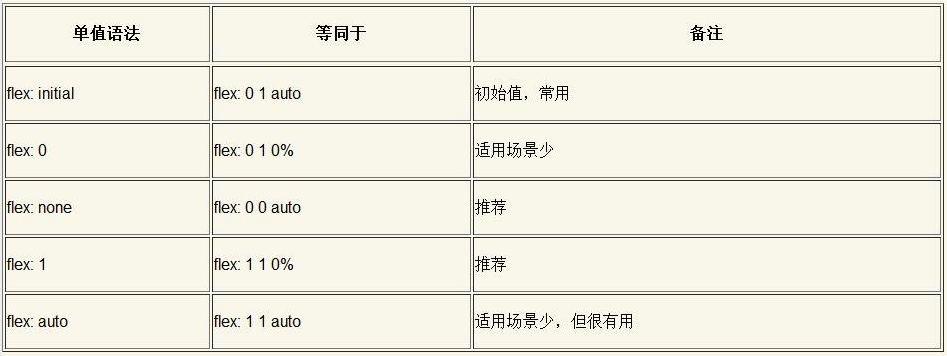

- flex:initial表示默认的弹性布局状态，无须专门设置，适合小控件元素的分布布局（其中某一个flex子项的内容动态变化也没有关系）
- flex:0适用场景较少，适合设置在替换元素的父元素上
- flex:none适合设置在内容不能换行显示的小控件元素上，如按钮
- flex:1适合等分布局
- flex:auto适合基于内容动态适配的布局。

#### 6.2.12 详细了解flex-basis属性与尺寸计算规则

在弹性布局中，一个flex子项的最终尺寸是基础尺寸（或内容尺寸）、弹性增长或收缩、最大最小尺寸共同作用的结果。

最终尺寸计算的优先级是：**最大最小尺寸限制 > 弹性增长或收缩 > 基础尺寸**

- 基础尺寸由flex-basis属性或width属性，以及box-sizing盒模型共同决定
- 内容尺寸指最大内容宽度，当没有设置基础尺寸时会顶替基础尺寸的角色
- 弹性增长指的是flex-grow属性，弹性收缩指的是flex-shrink属性
- 最大尺寸主要受max-width属性限制；最小尺寸则比较复杂，受最小内容宽度、width属性和min-width属性共同影响。

##### 理解flex-basis属性、width属性和基础尺寸之间的关系

1. 如果flex-basis属性和width属性同时设置了具体的数值，width属性值会被忽略，优先使用flex-basis的属性值作为基础尺寸
2. 如果flex-basis的属性值是初始值auto，则会使用width属性设置的长度值作为基础尺寸
3. 如果flex-basis和width的属性值都是auto，则会使用flex子项的最大内容宽度作为基础尺寸，此时称为“内容尺寸”

##### 深入理解最小尺寸

**flex-basis属性下的最小尺寸是由内容决定的，而width属性下的最小尺寸是由width属性的计算值决定的，这个“最小尺寸”是最小内容宽度、width属性和min-width属性共同作用的结果**

具体规则如下，如果flex-shrink属性不为0，则：

- 如果min-width属性值不是auto，则元素的最小尺寸就是min-width的属性值，此时width属性无法影响最小尺寸，哪怕width的属性值大于min-width的属性值
- 比较width属性的计算值和最小内容宽度的大小，较小的值就是元素的最小尺寸
- 如果width的属性值和min-width的属性值均为auto，则元素的最小尺寸就是最小内容宽度
- 如果flex子项设置了overflow:hidden，且最小尺寸是由最小内容宽度决定的，则最小尺寸无效

[Demo](https://demo.cssworld.cn/new/6/2-13.php)

#### 6.2.13 弹性布局最后一行不对齐的处理

##### 如果每一行列数固定

第一种方法是模拟space-between属性值和间隙大小，也就是说，我们不使用justify- content:space-between声明模拟两端对齐效果，而使用margin对最后一行内容中出现的间隙进行控制

第二种方法是根据元素的个数给最后一个元素设置动态margin值

```css
.container {
    display: flex;
    /* 两端对齐 */
    justify-content: space-between;
    flex-wrap: wrap;
}
.list {
    width: 24%; height: 100px;
    background-color: skyblue;
    margin-top: 15px;
}
/* 如果最后一行是3个元素 */
.list:last-child:nth-child(4n - 1) {
    margin-right: calc(24% + 4% / 3);
}
/* 如果最后一行是2个元素 */
.list:last-child:nth-child(4n - 2) {
    margin-right: calc(48% + 8% / 3);
}
```

##### 如果flex子项宽度不固定

第一种方法是给最后一项设置margin-right:auto

第二种方法是使用伪元素在列表的末尾创建一个flex子项，并设置flex:auto或设置flex:1

##### 如果每一行列数不固定

使用足够的空白标签进行填充占位，具体的占位数量是由最多列数的个数决定的，关键是要将占位的<i>元素宽度和margin值设置得与.list列表元素一样，其他样式都不需要设置

[《让CSS flex布局最后一行列表左对齐的N种方法》](https://www.zhangxinxu.com/wordpress/2019/08/css-flex-last-align/)

### 6.3 网格布局

在网格布局中，所有相关CSS属性可以分为两组，一组作用在grid容器上，还有一组作用在grid子项上

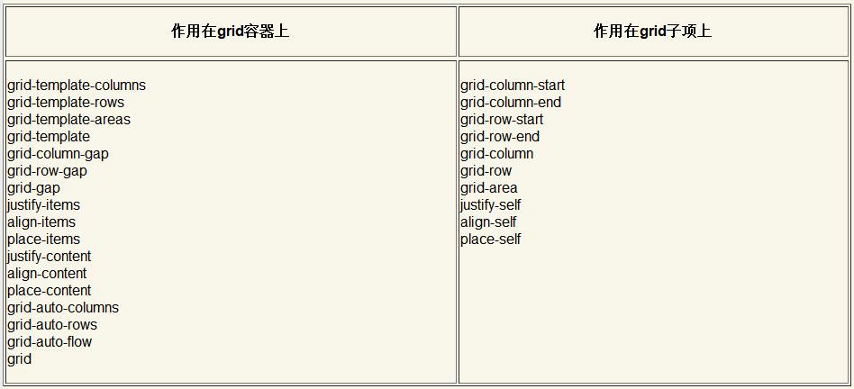

#### 6.3.1 grid-template-columns和grid-template-rows属性简介

```css
.container {
    grid-template-columns: 80px auto 100px;
    grid-template-rows: 25% 100px auto 60px;
}
```

```css
/* 简略写法 */
.container {
    grid-template: 25% 100px auto 60px / 80px auto 100px;
}
```


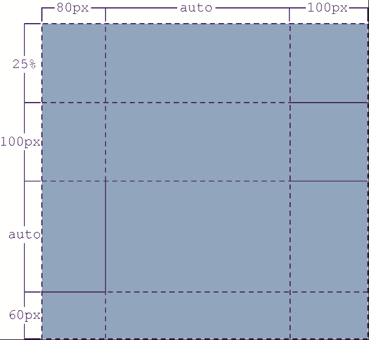

##### 1. 网格线的命名

```css
grid-template-columns: <line-name> <track-size> ...;
```

- \<track-size>表示划分出来的小区的尺寸，可以是长度值、百分比值、fr单位（网格剩余空间比例单位）和尺寸关键字等多种类型的属性值
- \<line-name>表示划分的街道的名称，命名规则和CSS动画的命名规则一样

```css
grid-template-columns: [道路名称-起始] 80px [道路名称2] auto [道路名称3] 100px [道路名称-结束];
```

由于网格的中间区域的网格线是由两边格子公用的，因此，我们给网格线起名字的时候可以起两个名称（使用空格分隔），分别表示网格线的两侧

```css
.container {
    grid-template-columns: [广告区-左] 120px [广告区-右 内容区-左] 600px [内容区-右];
}
```

##### 2. 聊聊\<track-size>

支持9种数据结构

- 长度值和百分比值
- 关键字属性值，包括min-content、max-content和auto
- \<flex>数据类型，也就是以fr为单位的值
- 函数值，包括repeat()、minmax()和fit-content()

###### 2.1 min-content

指的是一排或者一列格子中所有**最小内容尺寸**中**最大**的那个最小内容尺寸值（**注意这里的“最大”**）

###### 2.2 max-content

max-content关键字和min-content关键字类似，只是最终的尺寸是**最大内容宽度**中**最大**的那一个值

###### 2.2 auto

**尺寸的上限是最大内容尺寸的最大值**，但是不同于max-content关键字，max-content关键字的尺寸是固定的，这里的尺寸是会受到justify-content属性和align-content属性影响的，**注意这里当应用`justify-content: stretch`时，列的宽度并不是等分的，而是在max-content尺寸的基础上增加同样大小的尺寸**

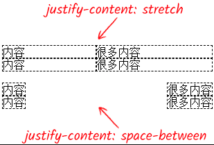

**尺寸下限是最小尺寸的最大值（注意，这里指的不是最小内容尺寸，因为当min-width、min-height的属性值比最小内容尺寸大的时候，最小尺寸就是min-width、min-height的属性值）**

除非使用了minmax()函数指定了新的尺寸上下限，否则auto关键字的尺寸表现都在上面说的上限尺寸和下限尺寸之间，等同于minmax(auto, auto)函数值，且在大多数场景下行为类似minmax(min-content, max-content)函数

#### 6.3.2 了解风格布局专用单位fr

*fr是单词fraction的缩写，表示分数*

fr单位值的计算规则如下:

- 如果所有fr值之和大于1，则按fr值的比例划分可自动分配尺寸
- 如果所有fr值之和小于1，最终的尺寸是可自动分配尺寸和fr值的乘法计算值

#### 6.3.3 详细介绍minmax()和fit-content()函数

##### 1. minmax函数

`minmax(min, max)`表示尺寸范围限制在min～max范围内

语法：

```
minmax( [ <length> | <percentage> | min-content | max-content | auto ] , [ <length> | <percentage> | <flex> | min-content | max-content | auto ] )
```

**\<flex>数据类型（如以fr为单位的值）只能作为第二个参数出现**

##### 2. fit-content函数

让尺寸适应于内容，但不超过设定的尺寸，底层计算公式如下：

```
fit-content(limit) = max(minimum, min(limit, max-content))
```

minimum是尺寸下限，如果不考虑min-width/min-height属性，这个尺寸就是最小内容尺寸，即：

```
fit-content(limit) = max(min-content, min(limit, max-content))
```

表示最终的尺寸大于min-content，小于设定尺寸（即limit）和max-content的较小值，即：**尺寸由内容决定，内容越多尺寸越大，但不超过限定的尺寸**

语法：

```
fit-content( [ <length> | <percentage> ] )
```

#### 6.3.4 repeat()函数的详细介绍

```
repeat( [ <positive-integer> | auto-fill | auto-fit ] , <track-list> )
```

##### auto-fill与auto-fit关键字

[auto-fill demo](https://demo.cssworld.cn/new/6/3-1.php)

[auto-fit demo](https://demo.cssworld.cn/new/6/3-2.php)

#### 6.3.5 了解grid-template-areas属性

以图片来说明最直观

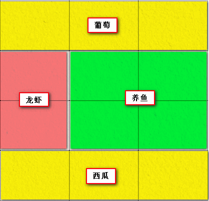

```html
<div class="container">
    <item class="putao"></item>
    <item class="longxia"></item>
    <item class="yangyu"></item>
    <item class="xigua"></item>
</div>
```

```css
.container {
    grid-template-columns: 1fr 1fr 1fr;
    grid-template-rows: 1fr 1fr 1fr 1fr;
    grid-template-areas: 
        "葡萄 葡萄 葡萄"
        "龙虾 养鱼 养鱼"
        "龙虾 养鱼 养鱼"
        "西瓜 西瓜 西瓜";
}

.putao { grid-area: 葡萄; }
.longxia { grid-area: 龙虾; }
.yangyu { grid-area: 养鱼; }
.xigua { grid-area: 西瓜; }
```

- 如果我们给网格区域命名了，但是没有给网格线命名，则系统会自动根据网格区域名称生成网格线名称，规则是在区域名称后面加-start和-end
- 网格区域一定要形成规整的矩形区域，无论是L形，还是凹的或凸的形状都会认为是无效的属性值

##### 6.3.6 缩写属性grid-template

grid-template属性是grid-template-rows、grid-template-columns和grid-template-areas属性的缩写

语法：

```
.container {
    grid-template: none;
}
.container {
    grid-template: <grid-template-rows> / <grid-template-columns>;
}
.container {
    grid-template: [ <line-names>? <string> <track-size>? <line-names>? ]+ [ / <explicit-track-list> ]?;
}
```

- 属性值none表示将3个CSS属性都设置为初始值none
- \<grid-template-rows> / \<grid-template-columns>表示行尺寸或列尺寸的设置
- 第三种缩写是包含grid-template-areas属性的语法，**其中\<string>指的就是grid-template-areas属性值**，更准确地说是每一行网格的区域名称

**\<line-name>（网格线名称）数据类型总是出现在\<track-size>（网格尺寸）和\<string>（区域名称）数据类型的两侧**

**包含\<string>（区域名称）的grid-template缩写属性是不支持repeat()函数**

#### 6.3.7 了解grid-auto-columns和grid-auto-rows属性

grid-auto-columns和grid-auto-rows属性的作用是指定任何自动生成的网格（也称为隐式网格）的尺寸大小

这里涉及**“隐式网格”**与**“显示网格”**这两个概念，“隐式网格”是非正常网格，其在grid子项多于设置的单元格数量，或grid子项的位置出现在设定的网格范围之外时出现，而在规定容器内显示的网格称为“显式网格”

语法

```
.container {
    grid-auto-columns: <track-size> ...;
    grid-auto-rows: <track-size> ...;
}
```

**这里同样不支持repeat()函数**

#### 6.3.8 深入了解grid-auto-flow属性

grid-auto-flow属性用来**定义子项目元素的自动流动状态**，grid-auto-flow属性在网格布局中的地位非常类似于弹性布局中的**flex-direction**属性

```
grid-auto-flow: [ row | column ] || dense
```

**dense**表示网格的自然排列启用**“密集”**打包算法，也就是说，如果稍后出现的网格比较小，则尝试看看其前面有没有合适的地方放置该网格，使网格**尽可能排列紧凑**

[Demo](https://demo.cssworld.cn/new/6/3-4.php )

#### 6.3.9 缩写属性grid

grid是这些CSS属性的缩写集合：**grid-template-rows、grid-template-columns、grid-template-areas、grid-auto-rows、grid- auto-columns和grid-auto-flow**

根据语法可分为四类：

##### 1. grid: none

表示设置所有子属性为初始值

##### 2. grid: \<grid-template>

grid-template的缩写语法一模一样

##### 3. auto-flow在后面

```
grid: <grid-template-rows> / [ auto-flow && dense? ] <grid-auto-columns>?
```

第三种和第四种缩写语法**需要用到auto-flow关键字**，auto-flow关键字是一个只在grid缩写属性中出现的关键字，本质上是一个变量关键字

关键字auto-flow**既可以表示关键字row，又可以表示关键字column**，就像是row和column这两个关键字的变量关键字，auto-flow关键字究竟是解析成row关键字还是解析成column关键字，是**根据auto-flow关键字是在斜杠的左侧还是右侧决定的。如果auto-flow关键字在斜杠左侧，则解析为row关键字；如果在斜杠右侧，则解析为column关键字**

##### 4. auto-flow在前面

语法：

```
grid: [ auto-flow && dense? ] <grid-auto-rows>? / <grid-template-columns>
```

此语法和auto-flow关键字在后面的语法类似，只是这里的语法表示**斜杠前面是隐式网格，后面是显式网格**

#### 6.3.10 间隙设置属性column-gap和row-gap（grid-column-gap和grid- row-gap）

> 以前是使用grid-column-gap属性和grid-row-gap属性来对网格布局中各个网格之间的间隙进行设置的，后来，随着CSS Box Alignment Module Level 3的制定，无论是分栏布局、弹性布局还是网格布局，全部统一使用column-gap属性和row-gap属性来设置

以column-gap属性举例，各大布局**兼容性排序**如下：

**分栏布局 > 网格布局 > 弹性布局**

#### 6.3.11 缩写属性gap（grid-gap）

语法：

```
.container {
    gap: <row-gap> <column-gap>;
}
```

#### 6.3.12 元素对齐属性justify-items和align-items

> 在网格布局中，以-items结尾的对齐属性表示控制每一个元素在自己所在的网格中的对齐表现。justify-items属性用来定义元素在网格中的水平对齐表现，align-items属性则是用来定义元素在网格中的垂直对齐表现

##### 1. justify-items

```css
.container {
    justify-items: stretch | start | end | center;
}
```

##### 2. align-items

```css
.container {
    align-items: normal | stretch | start | end | center | baseline;
}
```

[Demo](https://demo.cssworld.cn/new/6/3-5.php)

在网格布局中，在绝大多数场景下normal的表现和stretch的表现是一模一样的，但是**如果grid子项是具有内在尺寸或具有内在比例的元素，则此时normal的表现类似于start属性值的表现**

#### 6.3.13 缩写属性place-items

语法：

```
place-items: <align-items> <justify-items>?
```

**垂直对齐写在前面，水平对齐写在后面**，不过这种缩写顺序**只适合CSS对齐属性**，网格布局相关属性还是行在前、列在后

#### 6.3.14 整体对齐属性justify-content和align-content

justify-content属性和align-content属性分别指定了网格元素整体水平方向和垂直方向上的分布对齐方式，要想justify-content属性和align-content属性起作用，就需要**让grid子项的总尺寸小于grid容器的尺寸**

[Demo](https://demo.cssworld.cn/new/6/3-7.php)

#### 6.3.15 缩写属性place-content

```
place-content: <align-content> <justify-content>?
```

#### 6.1.16 区间范围设置属性grid-column-start/grid-column-end和grid-row-start/ grid-row-end

这两个属性值类型为：`<integer> | <name> | <integer> <name> | span <number> | span <name> | auto`

- integer：指起止于第几条网格线，可以是负整数，但是不能是0，负整数表示从右侧开始计数网格线
- name：是自定义的网格线的名称。需要注意的是，这里的名称有一个**自动补全-start后缀和-end后缀的特性**
- integer name：表示名称为name的第integer个网络线，如果没有这条线则会创建隐式网格
- span number：表示当前网格会自动跨越指定的网格数量
- span name：表示当前网格会自动扩展，直到选中指定的网格线名称
- auto：默认值，默认跨度是1个格子

#### 6.3.17 缩写属性grid-column和grid-row

前者是grid-column-start/grid-column-end属性的缩写，后者是grid-row-start/grid-row-end属性的缩写

#### 6.3.18 前者是grid-column-start/grid-column-end属性的缩写，后者是grid-row-start/grid-row-end属性的缩写

grid-area是一个缩写属性，它是grid-row-start、grid-column-start、grid-row-end和grid-column-end这4个CSS属性的缩写

所以对于下面的代码：

```css
.container {
    grid: 1fr 1fr 1fr / 1fr 1fr 1fr 1fr;
}
.item {
    grid-area: 1 / 2 / 3 / 4;
}
```

`.item`表示从第1条行线、第2条列线开始，到第3条行线、第4条列线截止

#### 6.3.19 grid子项对齐属性justify-self和align-self

justify-self属性用来设置单个网格元素的水平对齐方式，align-self属性则用来设置单个网格元素的垂直对齐方式

#### 6.3.20 缩写属性place-self

语法：

```
place-self: <align-self> <justify-self>?
```

### 6.4 CSS Shapes布局

> 使用CSS Shapes布局可以实现不规则的图文环绕效果，它需要和float属性配合使用

[Demo1](https://demo.cssworld.cn/new/6/4-1.php)

[Demo2](https://demo.cssworld.cn/new/6/4-2.php)

[Demo3](https://demo.cssworld.cn/new/6/4-3.php)

[Demo4](https://demo.cssworld.cn/new/6/4-4.php)

[Demo5](https://demo.cssworld.cn/new/6/4-7.php )

## 第7章 不同设备的适配与响应

### 7.1 @media规则

#### 7.1.2 对深色模式和动画关闭的支持检测

##### prefers-color-scheme

prefers-color-scheme媒体特性可以用来检测当前网页是否处于深色模式（或称黑暗模式）中，其支持的参数值如下：

- no-preference表示系统没有告知用户使用的颜色方案
- light表示系统倾向于使用浅色模式
- dark表示系统倾向于使用深色模式

```css
/* 深色模式 */
@media (prefers-color-scheme: dark) {
    body { background: #333; color: white; }
}
/* 浅色模式 */
@media (prefers-color-scheme: light) {
    body { background: white; color: #333; }
}
```

如果需要在JavaScript代码中对系统的深浅主题进行判断，可以使用原生的window. matchMedia()方法

```javascript
// 是否支持深色模式
// 返回true或false
window.matchMedia("(prefers-color-scheme: dark)").matches;
```

##### prefers-reduced-motion

prefers-reduced-motion用来检测操作系统是否设置了关闭不必要动画的操作，其支持的参数值如下

- no-preference表示用户没有通知系统任何首选项
- reduced表示用户已通知系统，他们更喜欢删除或者替换基于运动的动画，因为该类型动画会引发前庭功能紊乱患者的不适（类似晕车），或者一部分人就是单纯动画疲劳，也可能想要更省电

#### 7.1.3 对鼠标行为和触摸行为的支持检测

移动端的`:hover`伪类存在问题，那如果想通过媒体查询，对于移动端设备就不使用`:hover`伪类，而改为直接展示，此时就需要检测鼠标行为和触摸行为的媒体特性了（通过屏幕宽度不可行，比如ipad或手机横屏）

##### 1. any-hover

用于测试是否有任意可用的输入装置可以悬停（就是hover行为）在元素上

- none表示没有输入装置可以实现悬停效果，或者没有可以实现指向的输入装置
- hover表示一个或多个输入装置可以触发元素的悬停交互效果

对于前文提到的案例，就可以这样处理：

```css
figcaption {
    display: none;
}
figure:hover figcaption {
    display: block;
}
/* 重点是这里 */
@media (any-hover: none) {
    figcaption {
        display: block;
    }
}
```

##### 2. hover

与`any-hover`的主要区别在于，any-hover检测任意输入装置，而hover只检测主要的输入装置，并且hover的兼容性更好，如果是针对传统桌面端网页的体验优化，推荐优先使用hover

##### 3. pointer和any-pointer

pointer和any-pointer媒体特性主要用于识别当前环境，判断是否可以非常方便地进行点击操作

### 7.2 环境变量函数env()

该规范的制定和兴起是由于iPhone X这类带有“流海屏”和底部触摸条的移动设备的出现，如果按钮和底部触摸条在一起显示，就会出现交互冲突的问题，而env()函数可以让网页内容显示在设备的安全区域范围

```
/* 直接使用4个安全内边距值 */
env(safe-area-inset-top);
env(safe-area-inset-right);
env(safe-area-inset-bottom);
env(safe-area-inset-left);

/* 使用4个安全内边距值，同时设置兜底尺寸值 */
env(safe-area-inset-top, 20px);
env(safe-area-inset-right, 1em);
env(safe-area-inset-bottom, 0.5vh);
env(safe-area-inset-left, 1.4rem);
```

这里需要注意一些细节：

- env函数中的属性是**区分大小写**的

- 要想使safe-area-inset-*属性表现出准确的间距，一定要确保viewport相关的\<meta>信息如下:

  ```html
  <meta name="viewport" content="viewport-fit=cover">
  ```

### 7.3 rem和vw单位与移动端适配最佳实践

#### 7.3.1 了解视区相对单位

视区相对单位指的是相对于浏览器视区尺寸（viewport）的单位，具体包括下面4个

- vw——视区宽度百分值
- vh——视区高度百分值
- vmin——vw或vh，取小的那个值
- vmax——vw或vh，取大的那个值

#### 7.3.2 calc()函数下的最佳实践

```css
html {
    font-size: 16px;
}
@media screen and (min-width: 375px) {
    html {
        /* 375px作为16px基准，414px宽度时正好对应18px的根字号大小 */
        font-size: calc(16px + 2 * (100vw - 375px) / 39);
    }
}
@media screen and (min-width: 414px) {
    html {
        /* 屏幕宽度从414px到1000px，根字号大小累积增加4px（18px-22px） */
        font-size: calc(18px + 4 * (100vw - 414px) / 586);
    }
}
@media screen and (min-width: 1000px) {
    html {
        /* 屏幕宽度从1000px往后每增加100px，根字号大小就增加0.5px */
        font-size: calc(22px + 5 * (100vw - 1000px) / 1000);
    }
}
```

**非整数尺寸偶尔会带来一些渲染的问题**

#### 7.3.3 适合新手的纯vw单位的布局

### 7.4 使用touch-action属性控制设备的触摸行为

> touch-action属性是移动端中与手势触摸密切相关的CSS属性，它源自Windows Phone手机，属于微软系，后来被Chrome浏览器吸收借鉴，Firefox浏览器跟着支持，现在Safari浏览器也已经完全支持（iOS 13之前是部分支持），是一个在移动端可以畅行的CSS属性。

#### 7.4.1 touch-action属性的常见应用

##### 1. touch-action:manipulation取消300 ms的点击延时

touch-action:manipulation表示浏览器只允许进行滚动和持续缩放操作，所以类似双击缩放这种非标准操作就不被允许，300 ms延时也就不复存在了

##### 2. touch-action:none解决treated as passive错误

实现效果与下面这段js代码一致

```javascript
document.addEventListener('touchmove', function (event) {
    event.preventDefault();
}, {
    passive: false
});
```

#### 7.4.2 了解touch-action属性各个属性值的含义

### 7.5 image-set()函数与多倍图设置

image-set()函数可以根据不同设备的屏幕密度或者分辨率来显示不同的背景图（background- image）或者遮罩图片（mask-image）等

```css
.example {
    background-image: image-set(url(1.jpg) 1x, url(1-2x.jpg) 2x, url(1-print.jpg) 600dpi);
}
```

dpi表示每英寸点数。通常屏幕每英寸包含72点或96点，打印文档的dpi要大得多，**一般dpi值在600以上，我们就可以认为是打印设备了**

1x、2x中的x其实是dppx的别称，表示每像素单位的点数，也可以理解为**屏幕密度**

关于img标签的srcset属性，可以参见[响应式图片srcset全新释义sizes属性w描述符](https://www.zhangxinxu.com/wordpress/2014/10/responsive-images-srcset-size-w-descriptor/)

## 第8章 CSS的变量函数var()与自定义属性

### 8.1 CSS变量的语法、特性和细节

> CSS变量的语法由两部分组成，一部分是CSS变量的声明，另一部分是CSS变量的使用。其中，CSS变量的声明由CSS自定义属性及其对应的值组成，而CSS变量的使用则通过变量函数var()调用CSS自定义属性实现

```css
:root {
    --primary-color: deepskyblue;
}
button {
    background-color: var(--primary-color);
}
```

#### 8.1.1 CSS自定义属性的命名

- CSS自定义属性值是支持以数字、短横线、空格、中文（CJK）来命名
- 不支持包含$、[、]、^、(、)、%、"等特殊字符的命名，要使用这些特殊字符，需要使用反斜杠转义

#### 8.1.2 var()函数的语法和特性

语法：

```
var( <custom-property-name> [, <declaration-value> ]? )
```

其中，\<custom-property-name>指的就是自定义属性名，\<declaration-value>指的是声明值，可以理解为备选值或缺省值

##### 1. var()函数参数非法的有趣现象

只要第一个参数值可能有效，哪怕这个参数值是一个乱七八糟的东西，这个var()函数依然会正常解析，**如果第一个参数值是不合法的，则var()函数解析为当前CSS属性的初始值或继承值（如果有继承性），也就是按照unset全局关键字的规则渲染**

所以下面的代码：

```css
body {
    --color: 20px;
    background-color: deeppink;
    background-color: var(--color, deepskyblue);
}
```

会解析为：

```css
body {
    --color: 20px;
    background-color: #369;
  	/* 因为background-color属性值不能是20px，不合法，所以会使用background-color的初始值transparent代替 */
    background-color: transparent;
}
```

##### 2. var()函数的空格尾随特性

如下代码

```css
html {
    font-size: 14px;
}
body {
    --size: 20;
    font-size: 16px;
    font-size: var(--size)px;
}
```

`font-size: var(--size)px;`会解析为`font-size: 20 px`（注意`px`前的空格，这就是var()函数的空格尾随特性），会导致不合法，但语法上`var(--size)px`又是合法的，因此会重置`font-size:16px`，最终使用父元素设置的字号大小14px，如果非要使用数字作为自定义变量的值，可以参考下面这种：

```css
body {
    --size: 20;   
    font-size: calc(var(--size) * 1px);
}
```

#### 8.1.3 CSS自定义属性的作用域

CSS自定义属性这种只能由元素自身或者后代元素使用的特性，本质上就是继承特性

CSS自定义属性可以穿透Shadow DOM中的CSS作用域限制

#### 8.1.4 CSS自定义属性值的细节

CSS自定义属性值可以是任意值或表达式

CSS自定义属性值可以相互传递（B自定义变量的值表达式中使用A自定义变量），还可以用在calc()函数中

CSS自定义属性**不能**自身赋值

CSS自定义属性**不支持**用在媒体查询中（env()函数是可以用在媒体查询中的）

### 8.2 CSS自定义属性的设置与获取

#### 8.2.1 CSS自定义属性的设置与获取

```html
<div style="--color: deepskyblue;">
    
</div>
```

#### 8.2.2 在JavaScript中设置和获取CSS自定义属性

```html
<div id="box">
    
</div>
```

需要使用下面的语法来设置自定义属性

```javascript
// 设置CSS变量
box.style.setProperty('--color', 'deepskyblue');
// 获取 --color CSS变量值
var cssVarColor = getComputedStyle(box).getPropertyValue('--color'); 
// 输出cssVarColor值，结果是deepskyblue 
console.log(cssVarColor);
```

### 8.3 使用content属性显示CSS自定义属性值的技巧

content属性本身不支持CSS自定义属性值，但是counter-reset属性后面的计数器初始值是支持的，所以就可以通过如下方式来使用

```css
/* 有效 */
.bar::before {
    counter-reset: progress var(--percent);
    content: counter(progress);
}
```

案例：进度条

```html
<label>图片1：</label>
<div class="bar" style="--percent: 60;"></div>
<label>图片2：</label>
<div class="bar" style="--percent: 40;"></div>
<label>图片3：</label>
<div class="bar" style="--percent: 20;"></div>
```

```css
.bar {
    height: 20px; width: 300px;
    background-color: #f2f2f2;
}
.bar::before {
    display: block;
    /* 进度值信息显示 */
    counter-reset: progress var(--percent);
    content: counter(progress) '%\2002';
    /* 宽度的设置 */
    width: calc(1% * var(--percent));
    color: #fff;
    background-color: deepskyblue;
    text-align: right;
    white-space: nowrap;
    overflow: hidden;
}
```

counter(progress) '%\2002'这里的\2002表示空格

[Demo](https://demo.cssworld.cn/new/8/3-1.php)

如果希望兼容陈旧的设备，可以试试GitHub站点上一个名为css-vars-ponyfill的项目，其可以让CSS变量兼容到IE9+

### 8.4 CSS变量的自定义语法技术简介

CSS自定义属性支持任意类型的属性值，我们可以借助这一特性**自定义CSS语法，或者模拟全新的CSS语法**

#### 8.4.1 使用CSS变量自定义全新的CSS语法

通过下面这种写法，让浏览器认为keyword函数是合法的

```css
body {
    --keyword: keyword(red, 50%); 合法
    color: var(--keyword);
}
```

接着就是用前文提到的javascript方法获取keyword函数的元素，然后转换成浏览器可识别的颜色函数

[Demo](https://demo.cssworld.cn/new/8/4-1.php)

#### 8.4.2 CSS变量模拟CSS新特性

原理同上

[Demo](https://demo.cssworld. cn/new/8/4-2.php)

## 第9章 文本字符处理能力的升级

### 9.1 文字的美化与装饰

#### 9.1.1 文字阴影属性text-shadow

1. text-shadow不支持inset关键字，也就是text-shadow只有外阴影，没有内阴影
2. text-shadow不支持阴影扩展，也就是text-shadow最多支持3个数值，分别表示水平偏移、垂直偏移和模糊大小

#### 9.1.2 文字描边属性text-stroke

text-stroke和text-fill-color分别用来实现**文字描边**效果和**文字颜色填充**效果

##### 1. text-stroke属性的语法

text-stroke属性是text-stroke-width和text-stroke-color这两个CSS属性的缩写，分别表示文字描边的宽度和文字描边的颜色，**只支持实线描边，也无法指定描边是外描边还是内描边或居中描边（*SVG描边中的stroke属性支持虚线描边和外描边*）**

text-stroke-width属性的宽度**默认值是0**

##### 2. text-stroke是居中描边

##### 3. text-stroke实现低字重字体效果

[如何实现外描边](https://demo.cssworld.cn/new/9/1-3.php)

#### 9.1.3 文字颜色填充属性text-fill-color

使用text-fill-color属性可以对文字进行颜色填充，还可以覆盖color属性设置的颜色，注意，**只是覆盖color的渲染表现，实际上元素的颜色计算值还是由color属性决定的**

text-fill-color属性还有另外一个作用，那就是在改变文字颜色的同时**保护color属性**

#### 9.1.4 学会使用text-emphasis属性进行强调装饰

### 9.2 文字的旋转与阅读方向

#### 9.2.1 文字方向控制属性text-orientation

语法：

```
text-orientation: mixed | upright | sideways
```

- mixed：中文字符是正立的，英文字符则顺时针旋90度
- upright：中文和英文均正立显示
- sideways：中文和英文均顺时针旋转90度

[Demo](https://demo.cssworld.cn/new/9/2-1.php)

#### 9.2.2 文字横向合并属性text-combine-upright

[Demo](https://demo.cssworld.cn/new/9/2-2.php)

text-combine-upright属性实现的水平排版，会让2~4个字符（包括中文）全部在一个字符宽度中

#### 9.2.3 了解unicode-bidi属性的新属性值

使用plaintext属性值可以在不改变当前文档的水平流向的前提下，让所有字符按照默认的从左往右的流向排列。

### 9.3 文本字符的尺寸控制

#### 9.3.1 text-size-adjust属性到底有没有用

最早是为了解决chrome中font-size无法小于12px的问题（通过设置`text-size-adjust: none`），后来chrome取消了这个特性，所以目前**对于桌面端浏览器，该属性一无是处，但在移动端特别是iOS中，还是有一些应用场景的**，比如iOS下横屏时字体会被放大，iPhone下的该行为正是由`text-size-adjust`属性决定的，因此，通过如下代码就可以禁止这种行为：

```css
body {
  -webkit-text-size-adjust: none;
}
```

#### 9.3.2 使用ch新单位换个心情

ch是CSS中为数不多**和字符相关的相对单位，**与单位em和rem相关的字符是“m”，与ex相关的字符是“x”，和ch相关的字符则是“0”，**1ch表示1个“0”字符的宽度**

ch的尺寸不是固定的（受字体、加粗和倾斜效果影响等），因此**ch单位并不适用于需要精确尺寸的场景**

#### 9.3.3 使用tab-size属性控制代码缩进的大小

语法：

```
tab-size: <integer> | <length>
```

- integer为整数，表示等于几个空格（U+0020）的宽度
- length为长度值，表示一个Tab的宽度值

[Demo](https://demo.cssworld.cn/new/9/3-2.php)

### 9.4 文字渲染与字体呈现

#### 9.4.1 了解text-rendering属性

text-rendering属性的实用性较弱，但并不是说这个属性没有用，而是浏览器默认已经选择了最佳的text-rendering属性值

#### 9.4.2 了解文字平滑属性font-smooth

目前没有任何浏览器支持font-smooth属性，而都是采用font-smoothing属性

Chrome等webkit内核浏览器使用的是**-webkit-font-smoothing**属性，Firefox浏览器中使用的是**-moz-osx-font-smoothing**属性

#### 9.4.3 font-stretch属性与字符胖瘦控制

font-stretch属性同样需要字体中有对应的或窄或宽的字体面，否则是没有效果的

#### 9.4.4 font-synthesis属性与中文体验增强

可以让英文依然保持倾斜，而中文永远是最佳的非倾斜状态

### 9.5 字体特征和变体

字体特征和变体指OpenType字体中包含的不同字形或字符样式，而“不同字形或字符样式”指的是连字（将fi或ffl等字符组合在一起的特殊字形）、字距（调整特定字母形式对之间的间距）、分数、数字样式和其他一些字符

并不是所有字体都包含字体特征，也不存在某个字体包含所有字体特征，**字体特征最终的表现效果取决于字体设计师而不是程序算法**

#### 9.5.1 升级后的font-variant属性

#### 9.5.2 了解字距调整属性font-kerning

#### 9.5.3 font-feature-settings属性的定位

[《CSS font-feature-settings 50+关键字属性值完整介绍》](https://www.zhangxinxu.com/wordpress/2018/12/css-font-feature-settings-keyword-value/)

### 9.6 可变字体

运用该技术可以使用更小的字体文件在Web上实现更丰富的排版效果，甚至可以实现字形的动画效果

#### 9.6.1 什么是可变字体

传统的字体中不同的字重往往都是不同的字体文件，例如思源黑体的7个字重就是7个独立的文件，总的字体文件大，而且只能支持最多7种字重效果，而可变字体将原本不同的字体文件合并在一个字体文件中，这种合并并不是单纯地把静态文件一个接一个地合在一起，而是基于某种规则将它们进行整合

#### 9.6.2 可变字体与font-variation-settings属性

#### 9.6.3 了解font-optical-sizing属性

## 第10 章 图片等多媒体的处理

### 10.1 图片和视频元素的内在尺寸控制

#### 10.1.1 超级好用的object-fit属性

#### 10.1.2 理解object-position属性的作用规则

[Demo](https://demo.cssworld.cn/new/10/1-3.php)

### 10.2 使用image-orientation属性纠正图片的方向

> 手机拍摄的照片的可交换图像文件格式（exchangeable image file format，Exif）信息中都会包含旋转信息，常见的图像查看软件、手机App或者Chrome浏览器新标签窗口打开图片时，可以根据图形中的旋转信息自动对图像的方向进行纠正。但IE/Edge浏览器和旧版Chrome浏览器访问的网页中的图像不能自动旋转。因此，为了让网页中的图片也能根据Exif信息中的Orientation值进行旋转，开发者就设计了image-orientation属性

语法：

```
image-orientation: from-image | none;
```

- from-image为初始值，表示如果图片包含旋转信息，则自动旋转图片
- 如果照片没有Exif信息，则表现为none关键字属性值。none表示无论照片是否包含Exif信息，都不进行旋转

要么设置image-orientation:none让所有浏览器中的图片都不自动旋转，**要么使用JavaScript程序（例如使用exif.js）获取照片Exif信息中的Orientation值，然后使用Canvas技术重新绘制图片，让Edge等浏览器下的图片也能自动旋转**

### 10.3 image-rendering属性与图像的渲染

image-rendering属性用来设置图像的缩放算法，主要针对PNG和JPG这类位图，image-rendering属性只有在图像发生缩放的时候才会有效果

### 10.4 image-rendering属性只有在图像发生缩放的时候才会有效果

#### 10.4.1 实现图像半透明叠加的cross-fade()函数

语法：

```
<image-combination> = cross-fade( <image>, <image>, <percentage> )
```

**其中\<percentage>指的是透明度值，它只会改变第二张图像的透明度，最终的效果是第一张图像完全不透明和第二张图像半透明叠加的效果**

##### 1. cross-fade()函数的新语法

可以指定任意数量的透明叠加图像，同时可以分别指定每张图像的透明度

```css
cross-fade(url(green.png) 75%, url(red.png) 75%);
cross-fade(url(red.png) 20%, url(yellow.png) 30%, url(blue.png) 50%);
```

也可以不指定透明度值，则未指定透明度值的图像的透明度值是用100%减去已经指定的透明度百分比值，然后除以未指定透明度值图像的数量得来的

**目前没有任何现代浏览器支持这一新语法**

##### 2. cross-fade()函数的实际应用

[Demo](https://demo.cssworld.cn/new/10/4-2.php)

#### 10.4.2 神奇的element()函数

可以让页面中任意DOM元素的渲染效果变成图像

语法：

```
element(#id)
```

**只有firefox提供了支持**

## 第11章 更绚丽的视觉表现

### 11.1 深入了解CSS滤镜属性filter

#### 11.1.1 filter属性支持的滤镜函数详解

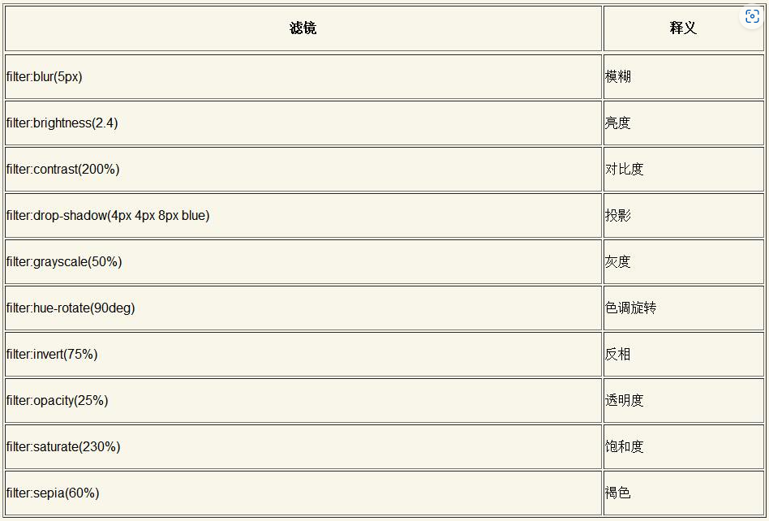

##### 1. blur

[Demo](https://demo.cssworld.cn/new/11/1-1.php)

##### 6. 色调旋转滤镜函数hue-rotate()

由于所有filter属性支持的滤镜函数都支持animation动画效果，因此使用hue-rota te()函数可以轻松实现元素的色彩无限变化效果，例如下面的CSS代码实现了一个360度色调无缝旋转动画

[Demo](https://demo.cssworld.cn/new/11/1-4.php)

#### 11.1.2 更进一步的滤镜技术

##### 1. 元素融合效果

filter属性支持的10个滤镜函数是可以任意累加的，因此可以产生很多其他效果

```css
.container {
    filter: blur(10px) contrast(5);
}
```

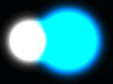

[Demo](https://demo.cssworld.cn/new/11/1-5.php)

#### 11.1.3 引用SVG滤镜技术

filter还支持直接引用SVG滤镜，语法

```css
/* 外链 */
.filter {
    filter: url("filter.svg#filter-id");
}
/* 内联 */
.filter {
    filter: url("#filter-id");
}
```

##### 1. 融合粘滞效果

使用SVG滤镜实现的效果要比使用CSS滤镜实现的**效果好很多**

```html
<svg width="0" height="0" style="position:absolute;">
  <defs>
    <filter id="goo">
      <feGaussianBlur in="SourceGraphic" stdDeviation="10" result="blur" />
      <feColorMatrix in="blur" mode="matrix" values="1 0 0 0 0  0 1 0 0 0  0 0 1 0 0  0 
0 0 19 -9" result="goo" />
      <feComposite in="SourceGraphic" in2="goo" operator="atop"/>
    </filter>
  </defs>
</svg>
```

```css
filter: url("#goo");
```

[Demo](https://demo.cssworld.cn/new/11/1-6.php)

##### 2. 水波荡漾效果

[Demo](https://demo.cssworld.cn/new/11/1-7.php)

### 11.2 姐妹花滤镜属性backdrop-filter

#### 11.2.1 backdrop-filter属性与filter属性的异同

backdrop-filter属性和filter属性的区别在于**backdrop-filter属性是让当前元素所在区域后面的内容应用滤镜效果，要想看到滤镜效果，需要当前元素本身是半透明或者完全透明的**；而filter属性是让当前元素自身应用滤镜效果

#### 11.2.2 backdrop-filter属性与毛玻璃效果

需要注意一下浏览器的兼容性：

```css
.droplist {
    background-color: #fff;  
}
@supports (-webkit-backdrop-filter:none) or (backdrop-filter:none) {
    .droplist {
        background: hsla(0, 0%, 100%, .75);
        -webkit-backdrop-filter: blur(5px);    
        backdrop-filter: blur(5px);   
    }
}
```

另外就是关于性能，如果你的页面非常复杂，有很多的动画和频繁的交互行为，则backdrop-filter属性可能会造成卡顿

### 11.3 深入了解CSS混合模式

CSS有下面**3个混合模式相关属性**：

- background-blend-mode属性用于混合元素背景图案、渐变和颜色
- mix-blend-mode属性用于元素与元素之间的混合
- isolation属性用在祖先元素上，限制mix-blend-mode属性设置的混合模式的应用范围

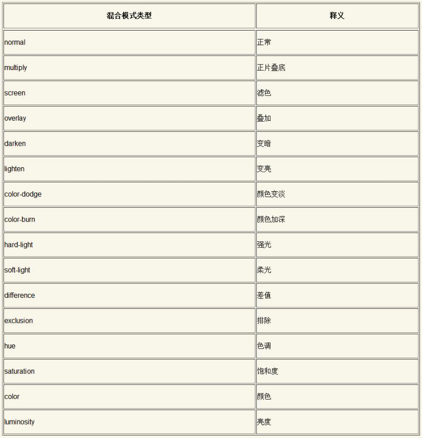

#### 11.3.1 详细了解各种混合模式效果

##### 1. mix-blend-mode:multiply——正片叠底

最终表现的色值计算公式是：

$$
C = \frac{AB}{255}
$$
举个粟子：

颜色deepskyblue的色值为rgb(0, 192, 255)，颜色deeppink的色值为rgb(255, 20, 147)，这两种色值正片叠底后的效果：
$$
R = 0 \times 255 \div 255 = 0 \\
G = 192 \times 20 \div 255 \approx 15 \\
B = 255 \times 147 \div 255 = 147
$$
所以混合后的效果是rgb(0, 15, 147)，同时通过上面的公式可以得知

- 任意颜色和黑色正片叠底后一定是黑色
- 任意颜色和白色正版叠底后一定是当前颜色
- 除黑、白两色外，和其他颜色混合的正片叠底效果一定会**变暗**，也就是说，正片叠底可以增强两张图像中暗的部分，其表现就像两张半透明的相片叠在一起放在发光的桌子上——“正片叠底”的由来

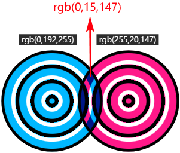

**正片叠底主要用来将浅色的素材进行背景合成**

[Demo](https://demo.cssworld.cn/new/11/3-2.php)

##### 2. mix-blend-mode:screen——滤色

计算公式：
$$
C = 255 - \frac{(255 - A)(255 - B)}{255}
$$
与正片叠底相反，滤色的效果是将两个混合颜色的补色相乘，然后除以255，其特点：

- 任意颜色和黑色进行滤色后还是原来的颜色
- 任意颜色和白色进行滤色后还是白色
- 除黑、白两色外，和其他颜色滤色后颜色会**更浅**，有点类似漂白的效果——“滤色”的由来

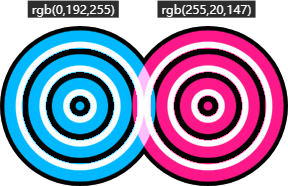

**滤色模式非常适合用于在图像中创建霓虹辉光效果**

[Demo](https://demo.cssworld.cn/new/11/3-3.php)

##### 3. mix-blend-mode:overlay——叠加

计算公式（A表示底图的色值）：

- 当$A\leq128时$
  $$
  C = \frac{AB}{128}
  $$
  
- 当$A>128$时
  $$
  C = 255 - \frac{(255 - A)(255 - B)}{128}
  $$

也就是说当底图色值小于等于128时，使用正片叠底的混合模式，反之使用滤色的混合模式，**叠加这种混合模式的底图的高光（白色）和阴影（黑色）的颜色会被保留，其他颜色的饱和度和对比度有一定的提高，混合后的图像看起来更鲜亮**

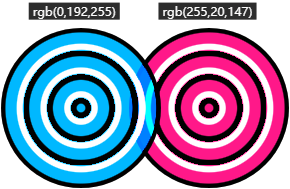

叠加效果在Web中主要有两个应用场景，一个是在图像上**显示文字水印**，另一个是**着色叠加**

[Demo](https://demo.cssworld.cn/new/11/3-4.php)

##### 4. mix-blend-mode:darken——变暗

计算公式：
$$
C = min(A, B)
$$
将两种颜色的RGB通道依次比较，哪个色值小就用哪个

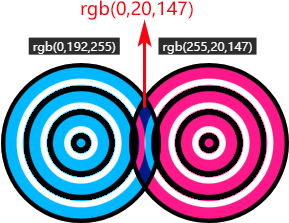

##### 5. mix-blend-mode:lighten——变亮

与“变暗”处理类似，只不过是取色值大的那个
$$
C = max(A, B)
$$
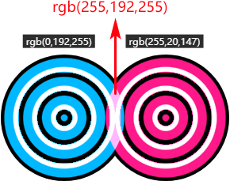

变暗与变亮的应用场景很类似，比如：

- 实现任意PNG图标的变色（比mask遮罩属性的变色效果更自由）
- 实现任意文的填充效果（比backround-clip: text实现的效果更丰富）
- 实现任意不规则形状的剪裁（比clip-path更灵活）

**所有这些效果的实现，只需要图标、文字或者形状是纯黑色即可**

[Demo](https://demo.cssworld.cn/new/11/3-5.php)

##### 6. mix-blend-mode:color-dodge——颜色变淡

计算公式：
$$
C = A + \frac{AB}{(255 - B)}
$$
在保留底部图层的颜色的基础上，颜色变得更淡了，整体效果就好似混合区域的对比度降低了

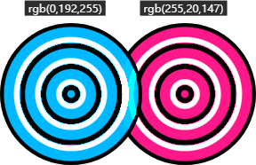

应用场景：可以用来保护底图的高光，适合处理高光下的人物照片，通过将照片和特定颜色混合，可以改变整个照片的色调（暖色调或是冷色调），而不会影响人物高光区域的细节

##### 7. mix-blend-mode:color-burn——颜色加深

计算公式：
$$
C = A - \frac{(255 - A)(255 - B)}{B}
$$
混合后在保留底部图层颜色的基础上，颜色变得更深了，好似混合区域的对比度增强了

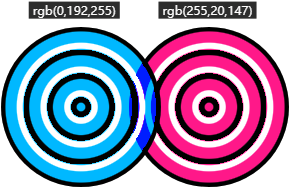

应用场景：可以用来保护底图的阴影，适合处理“幽深秘境”一类的照片，通过将照片和特定颜色混合，可以营造更加幽深的氛围

##### 8. mix-blend-mode:hard-light——强光

计算公式（B表示顶图的色值）：

当$B\leq128$时：
$$
C = \frac{AB}{128}
$$


当$B>128$时：
$$
C = 255 - \frac{(255 - A)(155 - B)}{128}
$$

效果就像聚光灯照射过来，图像亮的地方更高，暗的地方更暗

与overlay的区别在于，**hard-light根据上层元素的色值判断是使用正片叠底还是滤色模式**

##### 9. mix-blend-mode:soft-light——柔光

表现效果和hard-light有类似之处，只是表现没有hard-light那么强烈。例如纯黑或纯白的上层元素与底层元素混合后的效果仅仅是**元素轻微变暗或变亮**，而不是变成纯黑或纯白

计算公式（B表示顶图的色值）：

当$B\leq128$时
$$
C = \frac{AB}{128} + (\frac{A}{255})^2(255 - 2B)
$$
当$B>128$时
$$
C = 255 - \frac{(255 - A)(255 - B)}{128}
$$
[强光与柔光的效果对比](https://demo.cssworld.cn/new/11/3-6.php)

##### 10. mix-blend-mode:difference——差值

最终颜色的色值是用较浅颜色的色值减去较深颜色的色值的结果

计算公式：
$$
C = |A - B|
$$
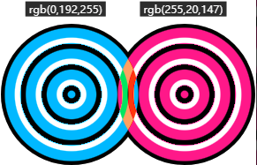

如果上层元素的颜色是白色，则最终混合的颜色是底层元素颜色的反色

应用场景：比如图像所在区域的文字是白色，其余区域的文字颜色则是黑色


[Demo](https://demo.cssworld.cn/new/11/3-7.php)

##### 11. mix-blend-mode:exclusion——排除

最终的混合效果和difference模式是类似的，区别在于exclusion的对比度要更低一些

计算公式：
$$
C = A + B - \frac{AB}{128}
$$
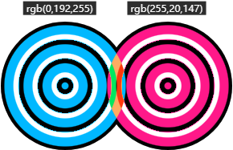

[差值模式与排除模式的效果对比](https://demo.cssworld.cn/new/11/3-8.php)

##### 12. mix-blend-mode:hue——混合

作用是将颜色混合，**使用底层元素的亮度和饱和度，以及上层元素的色调**

需要注意的是，所有颜色系混合模式（色调、饱和度、颜色和亮度）**都不要使用黑色进行混合**，因为这样会挖掉底层元素的颜色信息，导致**最终混合后的颜色是灰色**


##### 13. mix-blend-mode:saturation——饱和度混合

混合后的颜色**保留底图的亮度和色调，并使用顶图的饱和度**

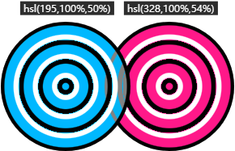

##### 14. mix-blend-mode:color——颜色混合

混合后的颜色**保留底图的亮度，并使用顶图的色调和饱和度**

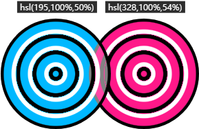

##### 15. mix-blend-mode:luminosity——亮度混合

混合后的颜色**保留底图的色调和饱和度，并使用顶图的亮度**，效果和color模式正好是相反的

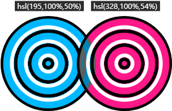

##### 16. 小结

上面提到的混合模式的两个圆环[混合效果示意图](https://demo.cssworld.cn/new/11/3-1.php)

#### 11.3.2 滤镜和混合模式的化合反应

### 11.4 混合模式属性background-blend-mode

background-blend-mode属性可以在各个背景图像之间应用混合模式

#### 11.4.1 background-blend-mode属性的常见应用

[多背景纹理+正片叠底效果](https://demo.cssworld.cn/new/11/4-1.php)

#### 11.4.2 深入了解background-blend-mode属性的作用细节

- background-blend-mode属性本身就带有隔离特性，也就是一个元素应用background- blend-mode背景混合模式，最终的效果**只会受当前元素的背景图像和背景颜色影响**，不会受视觉上处于当前区域的其他任意元素影响
- 应用background-blend-mode属性后，**不仅各张图像之间要进行混合，各张图像还要和背景色进行混合**

##### 1. 背景顺序影响混合效果

混合效果和background属性中背景图像的**顺序**密切相关。在CSS多背景中，**语法越靠后的背景图像的层级越低，这也是background-color要写在最后语法才合法的原因**，即背景色的层级永远是最低的

##### 2. 混合效果是多个混合属性同时作用的结果

background-blend-mode属性其实可以**设置多个混合模式值，分别对应不同的背景图像**（`mix-blend-mode`只支持一个混合模式）

##### 3. background-blend-mode属性与渐变图标的实现

[Demo](https://demo.cssworld.cn/new/11/4-2.php)

##### 4. background-blend-mode属性的补全规则

- 如果background-blend-mode的属性值的数量大于background-image的属性值的数量，则多出来的混合模式会被忽略
- 如果background-blend-mode的属性值的数量少于background-image属性值的数量，则会重复完整的background-blend-mode属性值进行补全

### 11.5 使用isolation: isolate声明隔离混合模式

用来隔离混合模式，限制混合模式的作用范围

#### 11.5.1 isolation属性

```css
/* 默认值，表示混合模式隔离与否根据具体情况而定 */
isolation: auto;
/* 表示对混合模式进行隔离 */
isolation: isolate;
```

当元素应用了混合模式的时候，在默认情况下，**该元素会混合z轴上所有层叠顺序比其低的层叠元素**，而`isolation: isolate`就是为了解决这个问题，**它可以将混合模式效果只应用到某一个元素或某一组元素上**

[Demo](https://demo.cssworld.cn/new/11/5-1.php)

#### 11.5.2 isolation:isolate声明的作用原理

isolation:isolate声明之所以可以隔离混合模式，本质上是**因为isolation: isolate创建了一个新的层叠上下文（stacking context）**

**只要元素可以创建层叠上下文，就可以隔离mix- blend-mode属性**，因此下面这些方式也可以隔离混合模式

- position:relative或position:absolute定位元素的z-index值不为auto
- position:fixed固定定位元素
- flex子项的z-index值不为auto
- 元素的opacity属性值不是1
- 元素的clip-path属性值不是none
- 元素的transform属性值不是none
- 元素的mix-blend-mode属性值不是normal
- 元素的filter属性值不是none
- 元素的contain属性值不是none
- will-change指定的属性值为opacity、clip-path、transform、mix-blend-mode、filter和contain中的任意一个
- 元素的-webkit-overflow-scrolling设为touch

## 第12章 更丰富的图形处理

### 12.1 超级实用的CSS遮罩

#### 12.1.1 mask-image属性的详细介绍

```
mask-image: none | <image> | <mask-source>
```

- none为默认值，表示无遮罩图片
- `<image>`表示图像数据类型，包括CSS渐变图像、url()函数、image-set()函数、cross-fade()函数和element()函数
- `<mask-source>`表示遮罩元素类型，主要指SVG遮罩元素

##### 1. 带有半透明的PNG图像的遮罩效果

这种最简单，直接看[Demo](https://demo.cssworld.cn/new/12/1-1.php)

##### 2. SVG图形遮罩效果展示

和第一种方式类似，只是换成了svg，[Demo](https://demo.cssworld.cn/new/12/1-2.php)

##### 3. 用渐变图像实现遮罩效果

[Demo](https://demo.cssworld.cn/new/12/1-3.php)

##### 4. SVG图形中\<mask>元素作为遮罩图像 

这里需要注意尺寸识别上的问题，通过做法是将\<mastk>元素的`maskContentUnits`属性值设置为`objectBoundingBox`，然后将\<mask>元素内的图形尺寸全部限定在`1px * 1px`的范围内

另外需要注意的是，对于svg的\<mask>元素，它的遮罩模式是luminance（亮度），与普通图片的默认遮罩类型alpha（透明度）不同，所以svg的\<mask>元素要设置`fill="white"`来使之亮度最高

当然也可以通过修改mask-type或mask-mode来设置svg的\<mask>元素也使用alpha，比如`mask-type: alpha`，但其兼容性并不好

##### 5. 外链SVG文件的\<mask>元素作为遮罩元素

方式如下：

```css
.mask-image {
    -webkit-mask-image: url(ellipse-rect.svg#mask);
    mask: url(ellipse-rect.svg#mask);
    mask-image: url(ellipse-rect.svg#mask);
}
```

##### 6. image-set()、cross-fade()或element()作为遮罩图像

[Demo](https://demo.cssworld.cn/new/12/1-7.php)

#### 12.1.2 mask-mode属性的简单介绍

目前，仅Firefox浏览器支持mask-mode属性，Chrome浏览器并不提供支持，但是可以使用非标准的mask-source-type属性代替（没有私有前缀）

#### 12.1.3 mask-repeat属性的简单介绍

作用类似于background-repeat属性

#### 12.1.4 mask-position属性的简单介绍

mask-position和background-position支持的属性值和属性值的表现基本上都是一样的

#### 12.1.5 mask-clip属性的详细介绍

mask-clip属性用来设置遮罩效果显示的盒子区域，与background-clip类似，区别在于前者属性值多一点，主要是用于svg元素，实用性不高

#### 12.1.6 mask-origin属性的简单介绍

#### 12.1.7 mask-size属性的简单介绍

mask-size属性的性质和background-size属性类似，支持的关键字属性值也类似，作用是控制遮罩图片尺寸

#### 12.1.8 了解mask-type属性

功能与mask-mode属性类似，区别在于，它只能作用于svg元素上，本质上是由svg属性演变过来的，chrome等浏览器都支持该属性，而mask-mode是一个针对所有元素的css属性，目前仅firefox支持

#### 12.1.9 mask-composite属性的详细介绍

mask-composite属性表示同时使用多张图片进行遮罩时的合成方式

```css
/* 遮罩累加，默认值 */
mask-composite: add;
/* 遮罩相减，即重合的区域不显示 */
mask-composite: subtract;
/* 遮罩重合区域才显示 */
mask-composite: intersect;
/* 遮罩重合区域被当作透明处理 */
mask-composite: exclude;
```

```css
/*  */
mask-image: circle.svg, rect.svg;
```

**顺序越往后的图像层级越低**，rect.svg的位置在circle.svg的下方。在W3C的合成和**混合规范**中，**处在上方的元素称为“source”，表示资源元素；处在下方的元素称为“destination”，表示目标元素**。这里，circle.svg就是“source”，rect.svg则是“destination”。

针对mask-composite合成效果

- add：表现为“source over”，即source在上，destination在下，累加在一起
- subtract：表现为“source out”，即source上去除与destination重叠的部分
- intersect：表现为“source in”，即source上只保留与destination重叠的部分
- exclude：表示为“xor”，即异或，在add的基础去除intersect的部分

[Demo](https://demo.cssworld.cn/new/12/1-9.php)

##### Chrome浏览器的属性值

chrome里的mask-composite属性值与CSS Masks规范中不同

```css
/* 同add */
-webkit-mask-composite: source-over;
/* 同intersect */
-webkit-mask-composite: source-in;
/* 同subtract */
-webkit-mask-composite: source-out;
/* 保留底层图像，并在上方累加上层和下层图像重叠的区域 */
-webkit-mask-composite: source-atop;
/* 下层遮罩图像叠加在上层遮罩图像上 */
-webkit-mask-composite: destination-over;
-webkit-mask-composite: destination-in;
-webkit-mask-composite: destination-out;
-webkit-mask-composite: destination-atop;
/* 同exclude */
-webkit-mask-composite: xor;
-webkit-mask-composite: copy;
-webkit-mask-composite: plus-lighter;
-webkit-mask-composite: clear;
```

#### 12.1.10 CSS遮罩的一些经典应用示例

[PNG/SVG背景图标变色最佳实践](https://demo.cssworld.cn/new/12/1-10.php)

[大尺寸PNG图片的尺寸优化](https://demo.cssworld.cn/new/12/1-11.php)

#### 12.1.11 了解-webkit-mask-box-image和mask-border属性

前者是非标准的css属性，但它在webkit内核浏览器中的兼容性非常好，而后者暂无浏览器支持，所以目前只需要关注 前者

语法：

```css
-webkit-mask-box-image: none;
-webkit-mask-box-image: <mask-box-image> [<top> <right> <bottom> <left> <x-repeat> 
<y-repeat>]
```

- \<mask-box-image>表示用来实现边框遮罩效果的图像，可以是url()图像，也可以是渐变图像
- \<top> \<right> \<bottom> \<left>表示遮罩图像4个方向上各自的剪裁划分的偏移大小，可以是数值或百分比值，无论是语法还是含义都和border-image- slice属性很类似，可以把遮罩图像划分成9份，像九宫格那样，依次填入元素的边框区域中
- \<x-repeat> \<y-repeat>表示各个方向边框遮罩图像的平铺方式，支持repeat、stretch、round、space等关键字属性值

[Demo](https://demo.cssworld.cn/new/12/1-12.php)

### 12.2 同样实用的CSS剪裁属性clip-path

**clip-path属性可以用来对任意元素的可视区域进行剪裁**，并且兼容性极好，iOS7及Android 4.4都支持，可谓“宝藏CSS属性”

#### 12.2.1 快速了解clip-path属性的各个属性值

```css
/* 关键字属性值 */
clip-path: none;

/* <clip-source> 值类型 */ 
clip-path: url(resources.svg#someId);

/* <geometry-box> 值类型 */
clip-path: margin-box;
clip-path: border-box;
clip-path: padding-box;
clip-path: content-box;
clip-path: fill-box;
clip-path: stroke-box;
clip-path: view-box;

/* <basic-shape> 值类型 */
clip-path: inset(100px 50px);
clip-path: circle(50px at 0 100px);
clip-path: polygon(50% 0%, 100% 50%, 50% 100%, 0% 50%);
clip-path: path('M0.5,1 C0.5,1,0,0.7,0,0.3 A0.25,0.25,1,1,1,0.5,0.3 
A0.25,0.25,1,1,1,1,0.3 C1,0.7,0.5,1,0.5,1 Z');
```

##### 1. 资源剪裁

这里的“资源剪裁”中的“资源”指的就是SVG中的\<clipPath>元素，因此，“资源剪裁”**本质上是SVG剪裁**，所有需要注意svg的尺寸，有两种方式：

一、使用transform属性缩放svg

二、设置clipPathUnits="objectBoundingBox"，然事把所有坐标值以数值1为基准进行重计算

[Demo](https://demo.cssworld. cn/new/12/2-1.php)

##### ClipPath Sprites

在实际开发中，为了方便图标管理，往往会把众多小图标合在一个SVG元素中，我把这种处理技术称为“ClipPath Sprites技术”，这一般是通过工具完成的，这里有一个[在线工具](https://www.zhangxinxu.com/sp/svgo/)

[Demo](https://demo.cssworld.cn/new/12/2-2.php)

需要注意的是：**内联的SVG元素不能使用display:none或者visibility:hidden进行隐藏，否则剪裁元素会被隐藏，并且此技术只适合填充模式的小图标，不适合描边小图标**

##### 2. 盒子剪裁

盒子剪裁只需要关心**margin-box、border-box、padding-box和content-box**这几个盒子类型即可。fill-box、stroke-box和view-box这3个盒子类型需要和SVG元素配合使用，在实际开发中用到的概率较小

[Demo](https://demo.cssworld.cn/new/12/2-3.php)

##### 3. 基本图形剪裁

基本图形剪裁是clip-path属性高频使用的一种剪裁方式，其可以实现剪裁效果的基本形状函数包括inset()、circle()、ellipse()、polygon()和path()

###### inset()可以剪裁出矩形和圆角矩形形状

**需要注意：**

inset()与clip属性中的react()语法很接近，都是4个值来表示最终剪裁效果的上、右、下、左边缘，但这4个值对于剪裁元素的计算边缘方位是不同的

- react()函数的4个值只对应2个方位，为上、左、上、左
- inset()函数的4个值对应4个方位，为上、右、下、左

示意图：

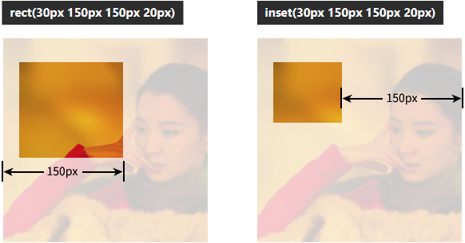

inset支持百分比值与圆角

```css
inset(<length-percentage>{1,4} round <'border-radius'>);
```

###### circle()可用来剪裁圆形形状

```css
circle( [ <shape-radius> ]? [ at <position> ]? )
```

当shape-radius与position信息都不传递时，默认选取最短边作为剪裁半径，居中剪裁

###### ellipse()函数可用来剪裁椭圆

```css
ellipse( [ <shape-radius>{2} ]? [ at <position> ]? )
```

与circle的区别就是多了长半轴与短半轴的概念

###### polygon()剪裁多边形

```css
polygon( <fill-rule>? , [ x, y ]# )
```

\<fill-rule>数据类型表示填充规则，值可以是nonzero或evenodd，具体含义会在12.2.2节深入介绍，平常开发中使用默认的填充类型即可

剩下的就是点坐标，最后1个点和第1个点会自动连在一起

**重复的连线的剪裁效果是透明的**

可以通过[工具CSS clip-path maker](https://bennettfeely.com/clippy/)来生成坐标路径

###### path()剪裁任意图形

```css
path( [ <fill-rule>, ]? <string> )
```

[Demo](https://demo.cssworld.cn/new/12/2-5.php)

###### 关于clip-path的几个细节

- 剪裁效果发生时，元素原始的位置保留，所以不会发生布局上的变化
- 被剪裁的区域不能响应点击行为，也不能响应:hover伪类和:active伪类
- 支持动画效果，但需要关键坐标点的数量在动画前后保持一致，对于path函数，还需要路径的指令保持一致才有动画效果

#### 12.2.2 深入了解nonzero和evenodd填充规则

**svg\canvas\css中都有路径填充规则，且值均为nonzero和evenodd**

##### 填充规则的关键，就是确定复杂路径构成的图形的内部和外部，内部则填充，外部则透明

- nonzero：非零规则，计算顺时针和逆时针的数量，否0则表示内部，进行填充，反之则表示外部，不填充
- evenodd：奇偶规则，计算交叉路径数量，奇数则表示内部，进行填充，反之则表示外部，不填充


然后要判断一个区域是在路径内部还是外部，只需要在这个区域内任意找一个点，向外发射一条射线，然后：

- 对于nonzero，起始值为0，射线会和路径相交，沿路径方向和射线方向成顺序时针方向加1，反之减1，最后的数是0，则为路径外部，非0则为路径内部
- 对于evenodd，起始值为0，射线会和路径相交，每交叉一条路径则加1，最后看总计数，奇数则是路径内部，反之则认为是路径部外

#### 12.2.3 clip-path属性的精彩应用示例

[剪裁动画](https://demo.cssworld.cn/new/12/2-6.php)

[对话框](https://demo.cssworld.cn/new/12/2-7.php)

### 12.3 -webkit-box-reflect属性与倒影效果的实现

#### 12.3.1 -webkit-box-reflect属性的简单介绍

```css
-webkit-box-reflect: [ above | below | right | left ]? 
<length>? <image>?
```

 [Demo](https://demo.cssworld.cn/new/12/3-1.php)

#### 12.3.2 Firefox浏览器实现投影效果的解决方案

使用element()图像函数实现近似的投影效果

[Demo](https://demo.cssworld.cn/new/12/3-2.php)

### 12.4 使用offset属性实现元素的不规则运动

以前是使用svg来实现的，参考[这里](https://www.zhangxinxu.com/wordpress/2014/08/so-powerful-svg-smil-animation/)

通过css则可以像这面这个例子一样

```html


<!-- 与马儿运动本身无关，为了方便大家看清运动轨迹 -->
<svg width="280" height="150" viewBox="0 0 280 150">
    <path d="M10,80 q100,120 120,20 q140,-50 160,0" stroke="#cd0000" stroke-width="2" 
fill="none" />
</svg>
```

```css
.horse-run {
    offset-path: path("M10,80 q100,120 120,20 q140,-50 160,0");
    animation: motion 3s linear infinite;
}
@keyframes motion {
    100% { offset-distance: 100%;}
}
```

[Demo](https://demo.cssworld.cn/new/12/4-1.php)

#### 12.4.1 了解offset属性演变的历史

#### 12.4.2 offset-anchor属性的简单介绍

offset-anchor属性用来确定偏移运动的锚点，也就是**确定元素中沿着轨迹运动的点**

[offset-anchor不同值的表现](https://demo.cssworld.cn/new/12/4-2.php)

```css
offset-anchor: auto | <position>
```

当值为auto时，通常情况是表示与transform-origin属性一样的值，除非offset-path为none

#### 12.4.3 offset-distance属性的简单介绍

offset-distance属性表示偏移的距离大小，也就是**元素沿着路径移动的距离**，支持百分比值和长度值

[Demo](https://demo.cssworld.cn/new/12/4-3.php)

如果路径是封闭的，则无论offset-distance有多大的值，都可以看到位置的变化

如果路径是开放的，则负值的位置和0%的位置是一样的，大于100%的值的位置和100%的位置是一样的

#### 12.4.4 offset-path属性的详细介绍

```css
offset-path: none;
offset-path: ray( [ <angle> && <size> && contain? ] );
offset-path: <path()>;
offset-path: <url>;
offset-path: [ <basic-shape> || <geometry-box> ];
```

其中\<url>数据类型可以直接使用页面内联SVG元素中任意图形元素的路径，\<basic-shape>则包括inset、circle、ellipse、polygon等基本图形函数，**除了path()，其它属性要么兼容性存在问题，要么就是没有浏览器支持**

##### 1. 关于ray()函数

##### 2. 关于url()函数（chrome和firefox尚未支持url()语法）

url()函数的参数指向SVG图形元素的ID，**即可以使用SVG图形元素对应的路径作为偏移路径**，这些SVG图形元素包括\<circle>、\<ellipse>、\<line>、\<path>、\<polygon>和\<rect>等

##### 3. offset-path属性中的基本图形函数

offset-path属性支持的基本图形函数和clip-path属性支持的基本图形函数一模一样，语法也是一模一样的

##### 4. url()函数和其他基本函数的模拟支持处理

由于所有url()函数和其他基本函数都可以转变成path()函数，而Chrome和Firefox浏览器都对path()函数提供支持，所以可以想办法把url()函数和其他函数转换成path()函数来解决浏览器不支持的问题

[Demo](https://demo.cssworld.cn/new/12/4-4.php)

#### 12.4.5 快速了解offset-position属性

offset-position属性的作用是定义路径的起始点

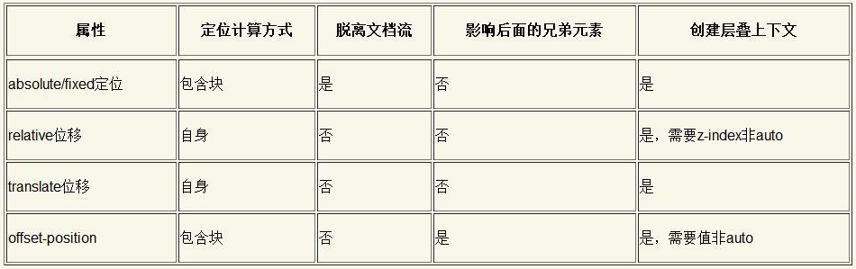

#### 12.4.6 理解offset-rotate属性

用来定义元素沿着offset-path路径运动时的方向和角度

```css
offset-rotate: [ auto | reverse ] || <angle>
```

- auto：初始值，表示元素沿着垂直于路径切线的方向运动
- reverse：与auto类似，区别在于反向的
- angle：则是基于上面两种前提下添加一个固定的角度

## 第13章 用户行为与体验增强

### 13.1 滚动行为相关

可以重点关注一下CSS Scroll Snap，这是CSS世界中一个独立且完整的CSS模块，包含大量的CSS属性和特性

#### 13.1.1 scroll-behavior属性与页面平滑滚动

一般都是在滚动容器元素上使用`scroll-behavior:smooth`这句CSS声明，让容器的滚动变得平滑

[Demo](https://demo.cssworld.cn/new/13/1-1.php)

最佳实践：

```css
html, body { scroll-behavior:smooth; }
```

#### 13.1.2 使用overscroll-behavior属性实现当滚动嵌套时终止滚动

在默认情况下，局部滚动的滚动条滚动到底部边缘再继续滚动的时候，**外部容器滚动条会继续跟着滚动**，如果不希望外部容器继续滚动，就可以使用`overscroll-behavior`属性

```css
overscroll-behavior: [ contain | none | auto ]{1,2}
```

- auto：默认行为，即前文所述
- contain：默认的滚动溢出行为只会表现在当前元素的内部（例如“反弹”效果或刷新），不会对相邻的滚动区域进行滚动
- none：相邻的滚动区域不会发生滚动，并且会阻止默认的滚动溢出行为

contain与none的区别主要在移动端

[Demo](https://demo.cssworld.cn/new/13/1-2.php)

#### 13.1.3 了解overflow-anchor属性诞生的背景

用于解决一种场景下的体验问题：页面上有很多图片，上方的图片加载慢，会导致下方已经加载出来的图片被推下去，需要自己去重新滚动定位

为了优化这个体验问题，就增加一种“滚动锚定”的行为：当前视口上面的内容突然出现的时候，浏览器自动改变滚动高度，让视口区域固定，就像滚动效果被锚定一样

```css
overflow-anchor: auto | none
```

- auto：表示交由浏览器决定滚动锚定的行为
- none：表示禁用滚动锚定的行为

[Demo](https://demo.cssworld.cn/new/13/1-3.php)

#### 13.1.4 CSS Scroll Snap简介

CSS Scroll Snap是CSS中一个独立的模块，可以让网页容器滚动停止的时候，自动平滑定位到指定元素的指定位置，包含以scroll-和scroll-snap-开头的诸多CSS属性

基本效果体验：[Demo](https://demo.cssworld.cn/new/13/1-4.php )

例子中的代码如下：

```html
<div class="scroll-x">
    
    
    
    
</div>
```

```css
.scroll-x {
    max-width: 414px; height: 420px;
    scroll-snap-type: x mandatory;
    white-space: nowrap;
    overflow: auto;
}
.scroll-x img {
    scroll-snap-align: center;
}
```

容器使用scroll-snap-type属性，子元素使用scroll-snap-align属性，**但在iOS中，Safari浏览器中需要同时设置滚动容器-webkit-overflow-scrolling:touch才有效果**

CSS Scroll Snap模块相关的CSS属性可以分为两类，**一类作用在滚动容器上，另一类作用在滚动定位子元素上**

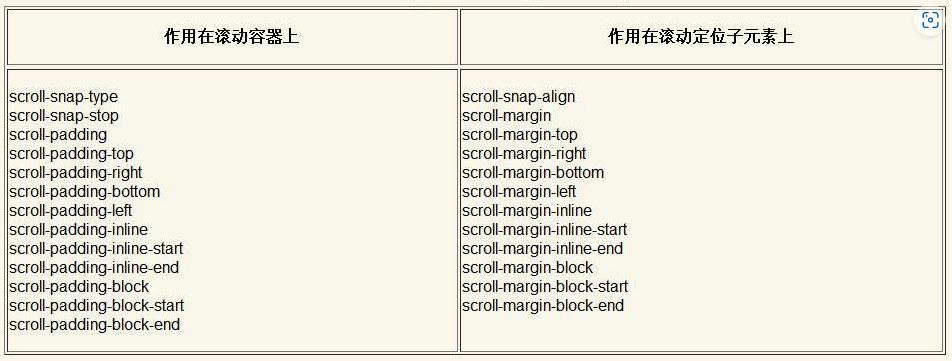

这里我们只关注scroll-snap-type、scroll-snap-stop和scroll-snap-align这3个CSS属性

##### 1. scroll-snap-type属性

scroll-snap-type属性的作用是确定定位方式是水平滚动定位，还是垂直滚动定位：

- none：默认值，表示滚动时忽略捕捉点，也就是我们平时使用的滚动
- x：捕捉水平定位点
- y：捕捉垂直平定位点
- block：捕捉和块状元素排列一个滚动方向的定位点，默认文档流下指的就是垂直轴
- inline：捕捉和内联元素排列一个滚动方向的定位点，默认文档流下指的就是水平轴
- both：横轴、纵轴都捕捉
- mandatory：表示“强制”，为可选参数。强制定位，也就是如果存在有效的定位点位置，则滚动容器必须在滚动结束时进行定位
- proximity：表示“大约”，为可选参数。可能会定位，类似这种表意模糊的词是最难理解的，这个值的作用表现为让浏览器自己判断要不要定位。

mandatory与proximity大多数情况下是一致的，只有在滚动容器的容器尺寸比子元素的尺寸还要小的时候，它俩才有区别，具体参见[Demo](https://demo.cssworld.cn/new/13/1-5.php)

##### 2. scroll-snap-stop属性

scroll-snap-stop属性表示**是否允许滚动容器忽略捕获位置**，它支持的属性值有两个：

- normal：默认值，可以忽略捕获位置
- always：不能忽略捕获位置，且必须定位到第一个捕获元素的位置

用于保证我们每次只滚动一屏或一个指定元素，而不会一下子滚动多屏或多个子元素

##### 3. scroll-snap-align属性

scroll-snap-align属性是作用在滚动容器子元素上的，表示捕获点是上边缘、下边缘或中间位置：

- none：默认值，不定义位置
- start：起始位置对齐，如垂直滚动、子元素和容器同上边缘对齐
- end：结束位置对齐，如垂直滚动、子元素和容器同下边缘对齐
- center：居中对齐，子元素中心和滚动容器中心一致

**scroll-snap-align还支持同时使用两个属性值**

##### 4. 总结

虽然css scroll snap包括的css属性很多，但实际中一般只需要编写下面两行css代码：

```css
scroll-snap-type: x/y
scroll-snap-align: start/end/center
```

#### 13.1.5 CSS Scrollbars与滚动条样式的自定义

[Demo](https://demo.cssworld.cn/new/13/1-6.php)

### 13.2 点击行为相关

#### 13.2.1 你不知道的pointer-events:none声明

##### 1. 不要用来禁用按钮

- pointer-events:none并不能阻止键盘行为
- pointer-events:none影响无障碍访问

##### 2. 具有继承性

父子元素，爷元素上的`pointer-events: none;`能被子元素上的`pointer-events: auto;`覆盖掉

##### 3. 还支持很多其他属性值

[Demo](https://demo.cssworld.cn/new/13/2-1.php)

#### 13.2.2 触摸行为设置属性touch-action

touch-action属性是用来设置触摸行为的，主要用在移动端开发中，详见7.4节

### 13.3 拉伸行为相关

#### resize属性

##### 1. 生效条件

- 不支持内联元素
- 如果是块级元素，需要overflow属性的计算值不是visible

resize属性拖拽条的样式可以使用::-webkit-resizer伪元素进行自定义

```css
::-webkit-scrollbar {
    background-image: url(resize.png);
}
```

### 13.4 输入行为相关

#### 使用cater-color属性改变插入光标的颜色

```css
input {
    color: #333;
    caret-color: red;
}
```

### 13.5 选择行为相关

#### 13.5.1 聊聊user-select属性

```css
user-select: auto | text | none | contain | all
```

all的含义并不是所有类型的内容都可以被选中，而是**元素的内容需要整体选择**，[Demo](https://demo.cssworld.cn/new/13/5-1.php)

- 无论将user-select属性值设为什么，::before和::after伪元素生成的内容都表现为none，也就是生成的内容永远无法被选中
- user-select的初始值是auto，**user-select属性没有继承性**，只是初始值auto的渲染表现而已

关于私有前缀：

```css
body {
    -webkit-user-select: none;
    -moz-user-select: none;
    -ms-user-select: none;
    user-select: none;
}
```

#### 13.5.2 使用::selection改变文字被选中后的颜色

### 13.6 打印行为相关

页面打印时，需要隐藏头部和底部，只保留主体信息，可以通过媒体查询来实现

```css
@media print {
    header, footer {
        display: none;
    }
}
```

但还有一些细节就需要通过css来控制了

#### 13.6.1 快速了解color-adjust属性

color-adjust属性可以用来设置打印页面的时候是否打印背景色，用更严谨的话表述就是：**是否允许浏览器自己调节颜色以便有更好的阅读体验【也就是该CSS属性不仅仅针对打印】**

```css
/* 默认值，允许浏览器自行调整元素样式，以达到更好的输出效果 */
color-adjust: economy;
/* 禁用浏览器的样式调整功能 */
color-adjust: exact;
```

#### 13.6.2 page-break系列属性与分页的控制

这里的page-break指的是page-break-before、page-break-after和page-break-inside这几个CSS属性，page-break系列属性在新的CSS规范中变成了break系列属性，也就是把属性前面的page-全部去掉

[Demo](https://demo.cssworld.cn/new/13/6-2.php)

#### 13.6.3 orphans/widows属性与内容行数的限制

orphans和widows属性用来限制在分栏、分页和分区中内容的最小行数，其中orphans属性用来限制底部行数，widows属性用来限制顶部行数

[Demo](https://demo.cssworld.cn/new/13/6-3.php)

#### 13.6.4 了解@page规则

使用@page规则调整打印页面的边距

```css
@page {
    margin: 2in 3in;
}
```

### 13.7 性能增强

#### 13.7.1 慎用will-change属性提高动画性能

will-change属性会在真正的行为触发之前告诉浏览器：“我待会儿就要变化了，你要做好准备。”于是，浏览器准备好GPU，从容应对即将到来的内容或形状的变化

```css
will-change: auto;
will-change: scroll-position | contents | <custom-ident>
```

- 发现滚动动画卡顿，则可以试试scroll-position
- 内容变化，则可以试试contents
- 其他CSS属性动画性能不佳，掉帧明显，则可以试试\<custom-ident>类型的属性值

> 使用will-change属性提高动画性能的需求并非普遍需求，而will-change: transform或will-change:opacity属性并不是用来提高动画性能的，而是为了创建新的层叠上下文，或者是为了解决iOS的Safari浏览器中的一些奇怪的渲染问题。
>
> will-change属性有一个隐藏的特性，那就是使用某个CSS属性作为属性值之后，元素会有与当前CSS属性类似的行为。

#### 13.7.2 深入了解contain属性

contain属性是CSS Containment模块规范中定义的CSS属性，作用是提高Web页面的渲染性能

> contain属性可以让局部的DOM树结构成为一个独立的部分，和页面其他的DOM树结构完全隔离，这样在这部分内容发生变化的时候，重绘与重计算只会在这个局部DOM树结构内部发生。于是，性能就会有非常显著的提升。
>

##### 1. CSS Containment中的一些概念

CSS Containment中的限制类型有4种，不同的限制类型对应不同的渲染限制，有助于精准地进行性能提升控制

###### 1) Size Containment

Size Containment可以被近似地理解为“**尺寸限制**”，与日常所说的如`max-width/min-width`这种最大/最小尺寸限制不同，这里的“尺寸限制”指的是**内部元素的变化不会影响当前元素尺寸的变化**

浏览器通过直接无视元素里的内容或替换内容（对于替换元素）不存在，所以**在Size Containment状态下的元素的content-box尺寸为0$\times$0**，如果没有设置边框等样式，**该元素不可见**

**不是所有元素都支持Size Containment的**，不支持Size Containment的元素包括设置了display:contents和display:none的元素，内部display类型是table的元素，\<td>、\<th>和\<tr>这些内部表格元素，常规的内联元素等

**适合的使用场景：**使用JavaScript根据包含块元素的尺寸设置内部元素尺寸，这样可以有效避免某种“无限循环”

###### 2) Layout Containment

Layout Containment指的是“**布局限制**”，可以想象成对元素的骨架、框架或者渲染盒子进行了封闭，形成了一个真正意义上的“结界”

- 会形成一个全新的包含块，无论是绝对定位元素还是固定定位元素的left和top偏移都会相对于这个包含块元素计算

  > transform属性也有这个特性，在transform属性值不是none的元素中的固定定位元素的样式表现如同绝对定位。contain:layout也可以让设置了position:fixed的固定定位元素像绝对定位元素那样表现，即left和top值是相对于设置了contain:layout的元素偏移的，而不是相对于浏览器窗体的，并且元素可以滚动，而不是位置固定

  这就是为什么position: fixed的元素在transform不是none的元素中定位失效的原因

- 会创建一个全新的层叠上下文，除了可以改变元素重叠时的层级表现，还可以限制混合模式等CSS特性的渲染范围

- 会创建一个新的BFC

**Layout Containment同样对隐藏元素、表格元素（不包括table-cell元素）和纯内联元素无效**

###### 3) Style Containment

Style Containment并不是指常规的样式限制，而是指CSS计数器和其他相关内容生成的限制，可以将计数范围进行限定，而不是整棵DOM数

Style Containment对其他content内容生成特性同样适用，包括open-quote、close-quote、no-open-quote和no- close-quote

###### 4) Paint Containment

Paint Containment不会渲染任何包含框以外的内容，哪怕overflow属性值是visible；并且Paint Containment依然会保留溢出内容对布局的影响（例如会改变元素的基线位置）

##### 2. contain属性的语法

```css
contain: none;
contain: strict;
contain: content;
contain: [ size || layout || style || paint ]
```

- Size Containment限制类型对应属性值size，不妨就称为size类型
- Layout Containment限制类型对应属性值layout，不妨就称为layout类型
- Style Containment限制类型对应属性值style，不妨就称为style类型
- Paint Containment限制类型对应属性值paint，不妨就称为paint类型
- strict表示对除style类型以外的类型都进行限制，此属性值等同于contain: size layout paint的设置
- content表示对除size和style类型以外的类型都进行限制，此属性值等同于contain: layout paint，表现为元素内内容渲染，元素外内容不渲染。

#### 13.7.3 content-visibility属性

content-visibility属性可以让浏览器决定是否渲染视区以外的元素的内容，借此提高页面的渲染性能

> 当浏览器决定不渲染某个元素里面的内容的时候，元素会开启Layout Containment、Style Containment和Paint Containment，如果元素没有设置具体的高、宽值，则尺寸可能是0

```css
article {
    content-visibility: auto;
    /* 其中contain-intrinsic-size属性可以理解为内容的占位尺寸 */
    contain-intrinsic-size: 1000px;
}
```

## 第14章 SVG元素的CSS控制

### 14.1 使用CSS属性直接绘制SVG图形

[Demo](https://demo.cssworld.cn/new/14/1-1.php)

### 14.2 CSS属性下的填充设置

#### 14.2.1 fill属性在Web开发中的应用

[Demo](https://demo.cssworld.cn/new/14/2-1.php)

#### 14.2.2 快速了解fill-opacity和fill-rule属性

### 14.3 CSS属性下的描边设置

#### 14.3.1 使用stroke属性实现全兼容的文字描边效果

[Demo](https://demo.cssworld.cn/new/14/3-1.php)

#### 14.3.2 使用stroke-dasharray属性实现伸缩自如的虚线效果

[Demo](https://demo.cssworld.cn/new/14/3-2.php)

#### 14.3.3 stroke-dashoffset属性的经典Web应用举例

stroke-dashoffset属性可以设置描边的起始偏移，如果偏移距离足够大，描边就会看不见；如果偏移为0，描边就会完整显示

##### 1. 任意SVG路径的描边动画效果

[Demo](https://demo.cssworld.cn/new/14/3-3.php)

##### 2. 圆环进度条效果

[Demo](https://demo.cssworld.cn/new/14/3-4.php)

PS：不规则路径的长度获取方法

```javascript
var path = document.querySelector('path');
var length = path.getTotalLength();
```

### 14.4 CSS属性下的标记设置

#### 14.4.1 了解marker-start/marker-end属性与起止点的标记

[Demo](https://demo.cssworld.cn/new/14/4-1.php)

#### 14.4.2 了解marker-mid属性与转折点的标记

[Demo](https://demo.cssworld.cn/new/14/4-2.php)

### 14.5 其他常见的SVG CSS属性

#### 14.5.1 使用paint-order属性实现外描边效果

paint-order属性应用在SVG图形元素上，可以用来设置是先绘制描边还是先绘制填充

svg的描边默认是与css中一样，居中描边，所以存在的问题也一样，但通过该属性，控制先填充还是先描边就可以解决这个问题

[Demo](https://demo.cssworld.cn/new/14/5-1.php)

```css
paint-order: normal;
paint-order: fill || stroke || markers;
```

- normal是默认值，表示绘制顺序是fill、stroke、markers，即先执行填充，再执行描边，最后执行标记
- fill表示先执行填充
- stroke表示先执行描边，再执行填充或者标记**（之所以paint-order:stroke可以实现外描边效果，实际上是因为内侧的描边被填充覆盖了）**
- markers表示先执行标记

#### 14.5.2 使用vector-effect属性让描边不会缩放

SVG的stroke描边的默认特性，会跟随SVG尺寸的变化而变化。但有些时候，我们希望图标无论尺寸多大，描边的大小都是设定的宽度值，就可以使用vector-effect属性，使用的方法很简单，就是给对应的SVG设置`vector-effect:non-scaling-stroke`

#### 14.5.3 使用text-anchor属性让文字块水平居中显示

```css
text-anchor: start | middle | end
```

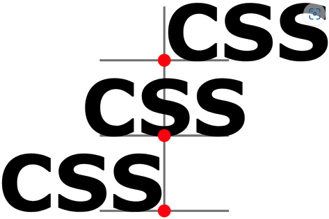

[Demo](https://demo.cssworld.cn/new/14/5-3.php)

#### 14.5.4 使用dominant-baseline属性让文字块垂直居中显示

```css
dominant-baseline: auto | baseline | text-bottom | alphabetic | ideographic | middle | 
central | mathematical | hanging | text-top
```

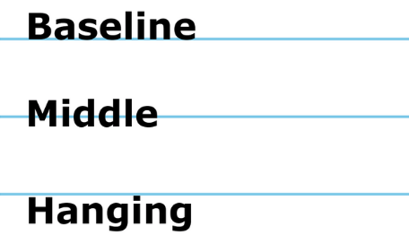

[Demo](https://demo.cssworld.cn/new/14/5-4.php)

#### 14.5.5 alignment-baseline和dominant-baseline属性的区别

dominant-baseline表示绝对主基线，会对文本整体进行垂直对齐设置；alignment-baseline是针对局部的文本进行垂直对齐设置

[Demo](https://demo.cssworld.cn/new/14/5-5.php)

## 第15章 Houdini是CSS新的未来

> CSS Houdini并不是某个具体的CSS特性，而是一系列底层API的通道。这些API公开了浏览器中CSS渲染引擎的部分内容，使开发者可以通过这些API借助浏览器渲染引擎重新定义CSS的样式和布局效果
>
> 过去要想使用某个CSS新特性，必须要等到浏览器支持才行，但是，有了CSS Houdini之后，开发者就可以根据实际开发需求自己定义CSS新特性，创造全新的布局方式

### 15.1 了解CSS Paint API

示例：

```css
.example {
    background-image: paint(custom-paint-name);
}
```

**paint()函数可以简单理解为（注意不能等同）Canvas画布元素，本质上就是把`<canvas>`画布元素的特性集成到了CSS中**

完整的示例：

```css
.box {
    width: 180px; height: 180px;
    /* transparent-grid自己命名 */
    background-image: paint(transparent-grid);
}
```

```javascript
if (window.CSS) {
    CSS.paintWorklet.addModule('paint-grid.js');
}
```

```javascript
// transparent-grid命名和CSS中的对应
registerPaint('transparent-grid', class {
    paint(context, size, properties) {
        // 两个格子颜色
        var color1 = '#fff', color2 = '#eee';
        // 格子尺寸
        var units = 8;
        // 横轴、竖轴循环遍历
        for (var x = 0; x < size.width; x += units) {
            for (var y = 0; y < size.height; y += units) {
                context.fillStyle = (x + y) % (units * 2) === 0 ? color1 : color2;
                context.fillRect(x, y, units, units);
            }
        }
    }
});
```

[Demo](https://demo.cssworld.cn/new/15/1-1.php)

[Canvas API中文网](https://www.canvasapi.cn/)

关于registerPaint的参数说明

- context

  绘制上下文，PaintRenderingContext2D，算是CanvasRenderingContext2D的阉割版

- size

  绘制尺寸的对象，结构如`{ width: 180, height: 180}`，其大小受background-size属性大小影响

- properties

  用来获取拿到的css属性及其值，包括css变量值和其他一些参数

#### 15.1.1 CSS变量让CSS Paint API如虎添翼

CSS Paint API的优势在于：它作为一个CSS属性值，**渲染是实时的**，它会自动跟随浏览器的重绘机制进行渲染

```css
.box {
    width: 180px; height: 180px;
    --color1: #fff;
    --color2: #eee;
    --units: 8;
    background: paint(custom-grid);
}
```

```javascript
registerPaint('custom-grid', class {
    // 获取3个变量，注意这里不能缺少
    static get inputProperties() {
        return [
            '--color1',
            '--color2',
            '--units'
        ]
    }
    paint(context, size, properties) {
        // 两个格子颜色
        var color1 = properties.get('--color1').toString();
        var color2 = properties.get('--color2').toString();
        // 格子尺寸
        var units = Number(properties.get('--units'));
        // 绘制代码，和之前一样……
    }
});
```

[Demo](https://demo.cssworld.cn/new/15/1-2.php)

#### 15.1.2 简单的总结

### 15.2 了解CSS Properties & Values API

CSS Properties & Values API可以用来**精确定义自定义属性的类型、默认值和是否具有继承性等** 

在JavaScript中通过CSS.registerProperty()方法进行定义，在CSS中则使用@property规则进行定义

[经典案例](https://demo.cssworld.cn/new/15/2-1.php)

### 15.3 了解CSS Parser API

CSS Parser API是一个公开的、可以直接解析CSS或类似CSS语言的API，开发者能够自己创造CSS语法，通过CSS Parser API进行解析和应用，从而满足各类需求

##### 1. css规则集的解析

```javascript
var background = window.cssParse.rule("background: green");
console.log(background.styleMap.get("background").value); // "green"

var styles = window.cssParse.ruleSet(".foo { background: green; margin: 5px; }");
console.log(styles.length) // 5
console.log(styles[0].styleMap.get("margin-top").value) // 5
console.log(styles[0].styleMap.get("margin-top").type) // "px"
```

##### 2. 样式文件的解析

```javascript
const style = fetch("style.css").then(response => CSS.parseStylesheet(response.body));
style.then(console.log);
```

### 15.4 详细了解CSS Layout API

CSS Layout API可以让开发者自定义布局方式，例如实现瀑布流布局效果、全新的表格布局效果等

CSS Layout API的使用分为两部分:

1. 在CSS中设置自定义的布局名称，和弹性布局、网格布局一样，其也是使用display属性，区别在于CSS Layout API自定义的布局使用layout()函数表示
2. 使用JavaScript书写关于如何布局的功能模块，CSS Layout API已经约定好了布局模块书写的语法，大体的JavaScript代码框架都是固定的，只需要在指定的函数位置书写对容器元素与容器子元素的位置和尺寸进行设置的代码就可以实现想要的效果了

#### 15.4.1 layout()函数的参数之间的逻辑关系

#### 15.4.2 文本居中同时一侧对齐的布局案例

[Demo](https://demo.cssworld.cn/new/15/4-1.php)

### 15.5 快速了解CSS Typed OM

CSS Typed OM的全称是CSS Typed Object Model，它是一种全新的对CSS样式进行处理的多个API接口的合集

```javascript
// styleMap就是一个包含所有计算样式的StylePropertyMapReadOnly对象，StylePropertyMapReadOnly对象是一个包含只读方法的Map对象
const styleMap = document.body.computedStyleMap();
// cssValue可能是CSSKeywordValue对象（关键字属性值），也可能是CSSUnitValue对象（长度值）
const cssValue = styleMap.get('line-height');
```

### 15.6 简单了解Animation Worklet

Animation Worklet也属于Houdini的一部分，Chrome 71就开始对其部分支持，它可以让动画的帧率按照设备本身的刷新率运行

[Demo](https://demo.cssworld.cn/new/15/6-1.php)

### 15.7 了解Font Metrics API

Font Metrics API可以用来获得文本字符的尺寸和位置，对于文字尺寸的获取非常有用。Font Metrics API提供了名为document.measureText(text, styleMap)的方法，可以返回FontMetrics对象，FontMetrics对象包含大量只读属性

**目前Font Metrics API的规范文档仅处于建议阶段，短时间内看不到任何浏览器有支持的迹象**
