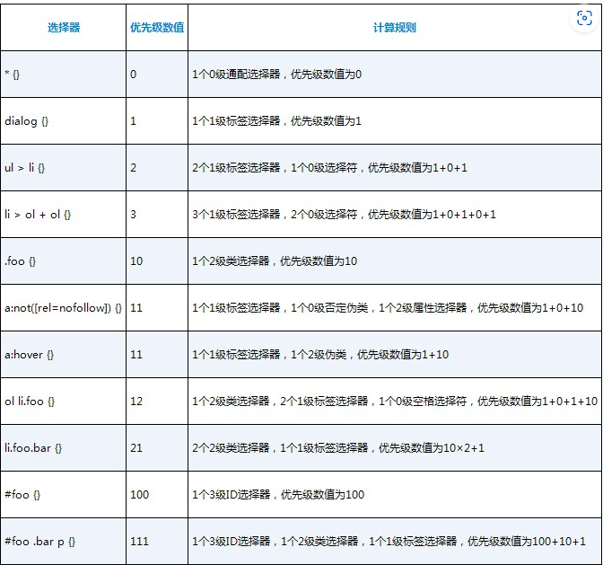
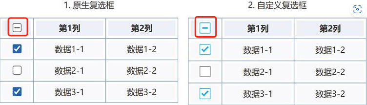
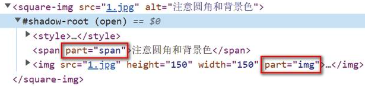

# CSS选择器世界（第2版）

## 第1章 概述

### 1.2 CSS选择器世界的一些基本概念

#### 1.2.1 选择器、选择符、伪类和伪元素

CSS选择器可以分为4种，即**选择器、选择符、伪类和伪元素**

##### 1. 选择器

标签选择器、类选择器

##### 2. 选择符

- 表示后代关系的空格
- 表示父子关系的箭头：>
- 表示相邻兄弟关系的加号：+
- 表示兄弟关系的波浪线：~
- 表示列关系的双管道：||

##### 3. 伪类

伪类的特征是其**前面有一个冒号(:)**，通常**与浏览器行为和用户行为相关联**，可以看作CSS世界的JavaScript

##### 4. 伪元素

伪元素的特征是其**前面有两个冒号(::)**，常见的有::before、::after、::first- letter和::first-line等

#### 1.2.2 CSS选择器的作用域

已经被舍弃

#### 1.2.3 CSS选择器的命名空间

```css
/* 通过@namespace来声明命名空间 */
@namespace url(http://www.w3.org/1999/xhtml);
@namespace svg url(http://www.w3.org/2000/svg);
/* XHTML中的<a>元素 */
a {}
/* SVG中<a>元素，注意这里的svg并不是代表svg标签，只是在第3行声明的命名空间的名字，也可换成其它字符串 */
svg|a {}
/* 同时匹配XHTML和SVG的<a>元素 */
*|a {}
```

[Demo](https://demo.CSSworld.cn/selector2/1/2-2.php)

*了解即可，实际开发时几乎找不到需要使用命名空间的场景*

### 1.3 无效CSS选择器的特性与实际应用

当无效的CSS选择器和浏览器支持的CSS选择器在代码中一起出现的时候，**会导致整个选择器无效**，因此，在使用一些新的CSS选择器时，出于渐进增强的目的，需要**将它们分开书写**

但有一个**例外**，那就是浏览器可以识别以-webkit-私有前缀开头的伪元素（**除了IE浏览器**）

## 第2章 CSS声明的优先级

### 2.1 继承与级联

CSS中的优先级规则分为两大类，一类称为继承，另一类称为级联

#### 2.1.1 优先级的底层——继承

**被继承的CSS声明的优先级一定位于整个CSS世界的底层**

如果一个CSS属性同时继承自多个元素，则DOM层级越深的元素所继承的CSS优先级越高

#### 2.1.2 优先级的中枢——级联

级联既是概念也是模块，**其优先级高于继承**，包含了几乎所有CSS优先级的知识

**CSS的优先级是分层的**

具体某个CSS声明归属于其中某一层的某一个房间，**这种分层加嵌套的关系就称为级联**

开发者设置的级联层优先级最高，浏览器内置的级联层的优先级最低。每个层级中的任何CSS的优先级都不可能比它上面的层级高

在CSS的继承与级联规则中，**级联层的优先级定义**为以下10项：

1. transition过渡声明
2. 设置了`!important`的浏览器内置样式
3. 设置了`!important`的用户设置的样式
4. `@layer`规则中设置的包含`!important`的样式
5. 开发者设置的包含`!important`的样式
6. animation动画声明
7. 开发者设置的CSS样式
8. `@layer`规则中的CSS样式
9. 用户设置的CSS样式
10. 浏览器内置的CSS样式

### 2.2 详解@layer规则

#### 2.2.1 @layer规则解决的问题

初衷：当需要重置一些样式时，又不想因为样式的优先级过高，导致使用方想定制样式时需要编写复杂的选择器来提升优先级，**我们只要将希望获得低优先级的CSS代码放在@layer规则中，就无须再担心选择器优先级过高的问题，因为@layer规则的级联层级比常规的CSS代码的级联层级低**

[Demo](https://demo.CSSworld.cn/selector2/2/2-1.php)

#### 2.2.2 掌握@layer规则的语法

```css
/* 匿名级联层 */
@layer {rules}
/* 命名级联层 */
@layer layer-name {rules};
@layer layer-name;
@layer layer-name, layer-name, layer-name;
```

`@layer layer-name`主要用于灵活设置@layer规则之间的**优先级顺序**

```css
@layer peacock;

/* ……大量的CSS代码…… */
/* ……大量的CSS代码…… */
/* ……大量的CSS代码…… */

/* 虽然我位置靠后，但我优先级最低 */
@layer peacock {
  .bottom-layer {
      content: 'hello world'
  }
}
```

多命名语法的作用也是用于调整优先级，比如：

```css
@layer b2, b1;
@layer b1 {
  button { padding: 10px; }
}
@layer b2 {
  button { padding: 20px; }
}
```

虽然`b2`声明在后，但`@layer b2, b1`用于说明`b1`的优先级高于`b2`

#### 2.2.3 使整个CSS变成@layer

如果希望对于第三方的CSS文件，将其变成低优先级的级联层，可以使用如下的语法：

```css
@import './example.CSS' layer(example);
/* 或匿名方式 */
@import './example.CSS' layer;
```

#### 2.2.4 @layer规则的嵌套

```css
@layer outer {
    button {
        width: 100px;
        height: 30px;
    }
    @layer inner {
        button {
            height: 40px;
            width: 160px;
        }
    }
}
```

**每多一层@layer，样式的优先级就降低一层**

[Demo](https://demo.CSSworld.cn/selector2/2/2-3.php)

### 2.3 叛逆的`!important`

#### 2.3.1 `!important`与层级跨越

只要被设置了`!important`，就会拥有一个只属于其自身的级联层级

#### 2.3.2 `!important`的逆向越级

所谓“逆向越级”指的是原本级联层级高的CSS使用了`!important`之后，优先级反而低；而原本名不见经传、在底层苦苦挣扎的低级联层级CSS声明在应用了`!important`之后，直接“乌鸦变凤凰，鸟枪换大炮”，CSS的优先级反而最高

### 2.4 CSS选择器的优先级

#### 2.4.1 同等级CSS优先级规则概览

每一个级联层中的CSS优先级也有明显的不可跨越的等级，我们将其划分为0～4**共5个等级，其中前4个等级由CSS选择器决定，最后一个等级由书写形式决定**

- 0级：**通配选择器、选择符和逻辑组合伪类**。其中，**通配选择器**写作星号(*)，**选择符**指空格、>、+、~和||，**逻辑组合伪类**有:not()、:is()和:where()等，这些伪类本身并不影响CSS优先级，影响优先级的是括号内的选择器（**:where()比较特殊，括号内参数的优先级永远是0**）
- 1级：**标签选择器**
- 2级：类选择器、属性选择器和伪类
- 3级：ID选择器
- 4级：style属性内联

#### 2.4.2 CSS选择器优先级的计算规则



1.  **当CSS选择器的优先级数值相等的时候，后渲染的选择器的优先级更高**
1.  **CSS选择器的优先级与DOM元素的层级位置没有任何关系**
3.  提升CSS选择器优先级的小技巧
    - 重复选择器自身：`.foo.foo {}`
    - 借助必然会存在的属性选择器：`.foo[class] {}`
    - 巧用`:not()`伪类，随便设置一个标签：`.foo:not(abc) {}`
4.  **不同选择器优先级等级的差距是无法跨越的**

#### 2.4.3 256个选择器的越级现象

早些年查看Firefox浏览器的源代码，发现所有的类名都是以8字节字符串存储的，8字节所能容纳的最大值就是255，因此，同时出现256个类名的时候势必会越过其最大值，溢出到ID区域

#### 2.4.4 为什么按钮`:hover`变色了

## 第3章 CSS选择器的命名

### 3.1 CSS选择器是否区分大小写

先说结论：**CSS选择器有些区分大小写，有些不区分大小写，还有些可以设置为不区分大小写**

*PS：在HTML中，标签和属性都是不区分大小写的，而属性值是区分大小写的*

如果希望HTML中的类名对大小写不敏感，可以这样：

```css
[class~="val" i] {}
```

### 3.2 CSS选择器命名的合法性

类选择器和ID选择器并非不能以数字开头，而是需要进行转义

```css
.1-foo { border: 10px dashed; padding: 10px; }   /* 无效 */

.\31 -foo { border: 10px dashed; padding: 10px; } /* 有效 *
```

转义可以通过如下方法：

```javascript
console.log('1'.charCodeAt().toString(16));    // 结果是31
```

建议使用这种补全的写法，这样`\31`之后也不用添加空格，也避免了CSS压缩工具乱压空格的问题

```css
.\000031-foo { border: 10px dashed; padding: 10px; }
```

### 3.3 CSS选择器的命名是一个哲学问题

#### 3.3.1 长命名还是短命名

使用短命名足矣

#### 3.3.2 单命名还是组合命名

1. 对于多人合作、长期维护的项目，千万不要出现下面常见单词命名的单命名选择器（比如title、text、box），因为后期非常容易出现命名冲突的问题

2. 如果你的项目会使用第三方的UI组件，就算是全站公用的CSS代码，也不要出现一些常见单命名（header、main、aside、success等），因为下面的命名很可能会与第三方CSS代码发生冲突

3. 如果你的项目完全是自主开发的，以后维护此项目的人也不会利用别人的CSS代码，则与网站公用结构、颜色相关的CSS代码可以使用单命名，比如：

   ```css
   .dark { color: #4c5161; }
   .red { color: #f4615c; }
   .gray { color: #a2a9b6; }
   ```

4. 如果你做的项目并不需要长期维护，也不需要多人合作，例如只是一些运营活动，请务必添加统一的项目前缀，前缀最好不要超过4个字母

#### 3.3.3 面向属性的命名和面向语义的命名

|                |          优点          |        缺点        |
| -------------- | :--------------------: | :----------------: |
| 面向属性的命名 |   复用率高、方便快捷   |    适用场景有限    |
| 面向语义的命名 | 灵活丰富、应用场景广泛 | 代码繁重、效率一般 |

#### 3.3.4 我是如何命名的

1. 不要使用拼音
2. 从HTML标签中寻找灵感
3. 从HTML特定属性值中寻找灵感
4. 从CSS伪类和HTML布尔属性中寻找灵感

### 3.4 CSS选择器设计的最佳实践

#### 3.4.1 不要使用ID选择器

#### 3.4.2 不要使用嵌套选择器

1. 沉浸性能不佳

   CSS选择器是**从右往左**进行匹配渲染的

   CSS选择器的性能**从高到低**排序如下：

   - ID选择器
   - 类选择器
   - 标签选择器
   - 通配选择器
   - 属性选择器
   - 部分伪类，比如`:checked`

2. 优先级混乱

   放置选择器优先级有一个原则，那就是**尽可能保持较低的优先级**，这样便于以较低的成本重置一些样式，放置选择器优先级有一个原则，那就是尽可能保持较低的优先级，这样便于以较低的成本重置一些样式

3. 样式布局脆弱

   过深的选择器会限定HTML的结构，因为一旦变动就会发现样式失效了

4. 正确的选择器用法

   正确的选择器用法是**全部使用无嵌套的纯类选择器**

#### 3.4.3 不要歧视面向属性的命名

#### 3.4.4 正确使用类名

#### 3.4.5 工具带来的变化

#### 3.4.6 最佳实践汇总

## 第4章 入门必学的选择器

### 4.1 标签选择器

#### 4.1.1 标签选择器二三事

##### 1. 不区分大小写

##### 2. 任意元素匹配

#### 4.1.2 特殊的标签选择器：通配选择器

```css
*, ::before, ::after { box-sizing: border-box; }
```

当通配选择器和其他选择器级联使用的时候，**星号是可以省略的**

### 4.2 类选择器

类选择器本质上匹配的是属性值，而属性值是区分大小写的，所以**类选择器也区分大小写**

如果遇到需要**忽略类名大小写**的场景，则可以使用属性选择器进行处理

```css
[class~="myname" i] { display: block; }
```

### 4.3 ID选择器

## 第5章 精通CSS选择符

### 5.1 后代选择符——空格（ ）

不建议后代选择符的最后一个选择器使用标签选择器，尤其是比较常用的标签，因为后期维护的时候，DOM内容添加和层级变动很常见，极有可能出现不希望出现的HTML元素匹配

#### 5.1.1 对CSS后代选择符可能的错误认识

**选择器优先级数值一样时，要看它们在CSS文件中的位置，遵循“后来居上”的规则**

#### 5.1.2 对JavaScript中后代选择符可能的错误认识

可以使用:scope伪类，其作用就是让CSS选择器的作用域限定在某一范围内

#### 5.1.3 `:scope`伪类

如今的网页只有一个CSS作用域，所以:scope伪类等同于:root伪类

```css
:scope {
   background-color: skyblue;
}
```

和

```css
:root {
   background-color: skyblue;
}
```

最终效果是一样的

**但是它在一些DOM API中表现出了真正的语义**，这些API包括querySelector()、querySelectorAll()、matches()和Element.closest()。此时:scope伪类匹配的是正在调用这些API的DOM元素

以这段HTML为例：

```html
<div id="myId">
   <div class="lonely">单身如我</div>
   <div class="outer">
      <div class="inner">内外开花</div>
   </div>
</div>
```

运行`document.querySelector('#myId').querySelectorAll('div div');`得到的是3个div元素，因为选择器div div是相对整个文档而言的，语义就是返回页面中既匹配div div选择器又是#myId子元素的元素

而如果使用`document.querySelector('#myId').querySelectorAll(':scope div div');`此时只得到1个div元素，因为此时的语义是：返回页面中既匹配#myId div div选择器又是#myId子元素的元素

### 5.2 子选择符——箭头（>）

**子选择符只匹配第一代子元素**，而后代选择符会匹配所有子元素

**能不用子选择符就尽量不用**，虽然它的性能优于后代选择符，但与其日后带来的维护成本相比，这实在是不值一提，但**一旦使用了子选择符，元素的层级关系就被强制绑定了**

### 5.3 相邻兄弟选择符——加号（+）

#### 5.3.1 相邻兄弟选择符的相关细节

用于选择相邻的兄弟元素，但**只能选择后面一个兄弟元素**

相邻兄弟选择符**忽略了文本节点**

相邻兄弟选择符**忽略了注释节点**

#### 5.3.2 实现类似\:first-child伪类的效果

由于相邻兄弟选择符只能匹配后一个元素，因此第一个元素不会被匹配，于是自然而然实现了非首列表元素的匹配

#### 5.3.3 众多高级选择器技术的核心

如下实现输入框聚焦时展示输入框后面的提示文案

```html
用户名：<input><span class="cs-tips">不超过10个字符</span>

.cs-tips {
   color: gray;
   margin-left: 15px;
   position: absolute;
   visibility: hidden;
}
:focus + .cs-tips {
   visibility: visible;
}
```

### 5.4 随后兄弟选择符——波浪线（~）

#### 5.4.1 随后兄弟选择符和相邻兄弟选择符的区别

相邻兄弟选择符只会匹配它后面的第一个兄弟元素，而随后兄弟选择符会匹配它后面的**所有兄弟元素**

#### 5.4.2 如何实现前面兄弟选择符的效果

1. 兼容性要求不高，可以使用`:has()`伪类（2022年才开始支持），如下：

   ```html
   <h4 class="cs-h">标题</h4>
   <p class="cs-li">列表内容</p>
   .cs-h:has( + .cs-li) {
      color: deepskyblue;
   }
   ```

2. “只能选择后面”仅是指代码层面，而不是视觉层面，所以可以通过以下方式来实现：

   1. Flex布局，通过flex-direction属性
   2. float浮动
   3. absolute绝对定位
   4. direction属性改变文档流的顺序

### 5.5 快速了解列选择符——双管道（||）

列选择符是规范中刚出现不久的新选择符，目前浏览器的兼容性还不足以让它在实际项目中得到应用

## 第6章 被低估的属性选择器

### 6.1 属性值匹配选择器逐渐兴起

### 6.2 属性值直接匹配选择器

包括以下4种：

- [attr]
- [attr="val"]
- [attr~="val"]
- [attr|="val"]

#### 6.2.1 详细了解4种选择器

##### 1. [attr]

[attr]表示只要包含指定的属性就匹配，尤其适用于一些HTML布尔属性，这些布尔属性只要有属性值，无论值的内容是什么，就认为这些属性值为true

*这里有个要注意的地方，不建议在实际项目中使用[checked]选择器，因为在浏览器下有一个很奇特的行为表现，那就是表单控件元素在checked状态变化的时候并不会同步修改checked属性的值，而对于disabled状态就不会这样，也正是这个原因，才有了`:checked`这些伪类*

##### 2. [attr="val"]

[attr="val"]是**属性值**完全匹配选择器

```html
<button class="cs-button cs-button-primary">主按钮</button>
[class="cs-button cs-button-primary"] {}
```

##### 3. [attr~="val"]

[attr~="val"]是属性值单词完全匹配选择器，专门用来匹配属性中的单词，针对的是有此属性值包含多个空格分隔的关键词

```html
<a href rel="nofollow noopener">链接</a>
[rel~="noopener"] {}
[rel~="nofollow"] {}
```

##### 4. [attr|="val"]

[attr|="val"]是属性值起始片段完全匹配选择器，表示对于具有attr属性的元素，其值要么正好是val，要么以val加短横线-(U+002D)开头，|=用于连接需要匹配的属性和属性内容，即

```html
<!-- 匹配 -->
<div attr="val"></div>
<!-- 匹配 -->
<div attr="val-ue"></div>
<!-- 匹配 -->
<div attr="val-ue bar"></div>
<!-- 不匹配 -->
<div attr="value"></div>
<!-- 不匹配 -->
<div attr="val bar"></div>
<!-- 不匹配 -->
<div attr="bar val-ue"></div>
```

#### 6.2.2 AMCSS开发模式简介

AMCSS是Attribute Modules for CSS的缩写，表示借助HTML属性来进行CSS相关开发

### 6.3 属性值正则匹配选择器

包括以下3种 ：

- [attr^="val"]
- [attr$="val"]
- [attr*="val"]

这3种属性选择器就完全是字符匹配了，而非单词匹配。其中，尖角符号^、美元符号$以及星号*都是正则表达式中的特殊标识符，分别表示**前匹配、后匹配和任意匹配**

#### 6.3.1 详细了解3种选择器

##### 1. [attr^="val"]

```html
<!-- 匹配 -->
<div attr="val"></div>
<!-- 不匹配 -->
<div attr="text val"></div>
<!-- 匹配 -->
<div attr="value"></div>
<!-- 匹配 -->
<div attr="val-ue"></div>
```

##### 2. [attr$="val"]

```html
<!-- 匹配 -->
<div attr="val"></div>
<!-- 匹配 -->
<div attr="text val"></div>
<!-- 不匹配 -->
<div attr="value"></div>
<!-- 不匹配 -->
<div attr="val-ue"></div>
```

##### 3. [attr*="val"]

```html
<!-- 匹配 -->
<div attr="val"></div>
<!-- 匹配 -->
<div attr="text val"></div>
<!-- 匹配 -->
<div attr="value"></div>
<!-- 匹配 -->
<div attr="val-ue"></div>
```

#### 6.3.2 CSS属性选择器搜索过滤技术

[Demo](https://demo.cssworld.cn/selector2/6/3-1.php)

### 6.4 忽略属性值大小写的正则匹配运算符

正则匹配运算符是属性选择器中新增的运算符，它可以忽略属性值的大小写，使用字符i或者I作为运算符值，但约定俗成都以小写字母i作为运算符

```css
[attr~="val" i] {}
[attr*="val" i] {}
```

```html
<!-- 不匹配 -->
<div attr="VAL"></div>
<!-- 匹配 -->
<div attr="Text val"></div>
<!-- 不匹配 -->
<div attr="Value"></div>
<!-- 不匹配 -->
<div attr="Val-ue"></div>
```

## 第7章 常见交互行为的实现

### 7.1 `:hover`伪类与悬停交互开发

如果是移动端开发，强烈建议不要使用:hover伪类实现交互效果，虽然也能触发，但消失并不敏捷，体验反而不佳

在支持hover交互的场景下使用：

```css
@media (hover: hover) {
  .list { display: none; }
  .box:hover .list { display: block; }
}
```

#### 7.1.1 体验优化与`:hover`延时

通过增加延时来优化这种体验，方法是使用visibility属性实现元素的显隐，然后借助CSS transition设置延时显示

[Demo](https://demo.cssworld.cn/selector2/7/1-1.php)

#### 7.1.2 非子元素的`:hover`显示

[Demo](https://demo.cssworld.cn/ selector/7/1-3.php)

#### 7.1.3 纯`:hover`显示浮层的体验问题

[Demo](https://demo.cssworld.cn/selector2/7/1-4.php)

### 7.2 使用`:active`伪类实现点击反馈

#### 7.2.1 `:active`伪类概述

移动端Safari浏览器下，:active伪类默认是无效的，需要设置任意的touch事件才能支持

#### 7.2.2 按钮的通用:active样式技巧

```css
body {
   -webkit-tap-highlight-color: rgba(0,0,0,0);
}
[href]:active,
button:active {
   background-image: linear-gradient(rgba(0,0,0,.05), rgba(0,0,0,.05));
}
[href] img:active {
   outline: 999px solid rgba(0,0,0,.05);
   outline-offset: -999px;
   clip-path: polygon(0 0, 100% 0, 100% 100%, 0 100%);
}
```


#### 7.2.3 `:active`伪类与CSS数据上报

```css
.button-1:active::after {
   content: url(./pixel.gif?action=click&id=button1);
   display: none;
}
.button-2:active::after {
   content: url(./pixel.gif?action=click&id=button2);
   display: none;
}
```

### 7.3 聚焦行为伪类`:focus`与用户体验

#### 7.3.1 `:focus`伪类匹配机制

与:active伪类不同，:focus伪类默认只能匹配特定的元素，包括：

- 非disabled状态的表单元素，如\<input\>输入框、\<select\>下拉框、\<button\>按钮等
- 包含href属性的\<a\>元素
- \<area\>元素，不过可以生效的CSS属性有限
- HTML5中的\<summary\>元素

除上述特定元素之外，其他HTML元素应用`:focus`伪类是无效的，另外：

- **设置了HTML contenteditable属性的普通元素可以应用:focus伪类**
- **设置了HTML tabindex属性的普通元素也可以应用:focus伪类**

使用:focus控制元素的显隐并不完美，在iOS Safari浏览器下，元素一旦处于focus状态，除非点击其他可聚焦元素来转移focus焦点，否则这个**元素会一直保持focus状态**，不过这个问题也好解决，只需要对祖先容器元素设置tabindex="-1"，同时取消该元素的outline样式，代码示意如下

```html
<body>
   <div class="container" tabindex="-1"></div>
</body>
.container {
   outline: 0 none;
}
```

这样，点击二维码图标以外的元素时就会把焦点转移到.container元素上，iOS Safari浏览器的交互就表现正常了

#### 7.3.2 `:focus`伪类与outline轮廓

一旦设置了outline:none，这些控件元素**再也无法使用键盘进行无障碍访问**

#### 7.3.3 CSS:focus伪类与键盘无障碍访问

### 7.4 非常实用的整体焦点伪类:focus-within

#### 7.4.1 `:focus-within`伪类和`:focus`伪类的区别

- 相似之处：伪类样式的匹配离不开元素聚焦行为的触发
- 区别在于：`:focus`伪类样式**只有在当前元素处于聚焦状态的时候才匹配**，而**`:focus-within`伪类样式在当前元素或者当前元素的任意子元素处于聚焦状态的时候均匹配**——**子元素聚焦可以使父元素的样式发生变化**

#### 7.4.2 `:focus-within`伪类实现无障碍访问的下拉列表

前面提到随后兄弟选择器时，对于输入框聚焦时，输入框前方的文字高度，之前提到的是DOM结构上让文字处于输入框的后方来实现，现在通过`:focus-within`就不用这么麻烦了

```html
<div class="cs-normal">
   <label class="cs-label">用户名：</label><input class="cs-input">
</div>
.cs-normal:focus-within .cs-label {
   color: darkblue;
   text-shadow: 0 0 1px;
}
```

[Demo1](https://demo.cssworld.cn/selector2/7/4-1.php)

[Demo2](https://demo.cssworld.cn/selector2/7/4-2.php)

### 7.5 键盘焦点伪类`:focus-visible`

2022年3月才被所有现代浏览器支持

`:focus-visible`伪类的作用：在所有现代浏览器下，鼠标点击链接元素\<a\>的时候是不会出现焦点轮廓的，但是使用键盘访问的时候会出现。点击链接元素时只会触发`:focus`伪类，而键盘访问此链接元素时不仅会触发`:focus`伪类，还会触发`:focus-visible`伪类

[Demo](https://demo.cssworld.cn/selector2/7/5-1.php)

## 第8章 通过树结构伪类匹配元素

从本章开始介绍的所有伪类，都不是必须存在的CSS伪类，其作用是简化我们的开发，或者针对特殊场景的开发，让开发人员可以用更少的代码实现更佳的效果

### 8.1 `:root`伪类

`:root`伪类用来匹配文档的**根元素**

#### 8.1.1 `:root`伪类匹配的究竟是什么

在HTML页面，即使不写html标签，浏览器也会自动补上html标签，所以`:root`伪类都会匹配到\<html\>根元素，但在浏览器打开XML或SVG文件时就不是这样了，比如后者，匹配到的是\<svg\>标签

在Shadow DOM中虽然也有根的概念（称为shadowRoot），**但并不能匹配`:root`伪类**，也就是在Shadow DOM中，**`:root`伪类是无效的，应该使用专门为此场景设计的`:host`伪类**

#### 8.1.2 `:root`伪类的应用场景

##### 1. 利用`:root`伪类的高优先级重置一个样式

比如引入的第三方UI组件库中如下代码：

```css
html {
   overflow-y: scroll;
}
```

我们则可以利用`:root`的高优先级来重置

```css
:root {
   overflow-y: auto;
    scrollbar-gutter: stable;
}
```


##### 2. 全局CSS变量

```css
:root {
   /* 颜色变量 */
   --blue: #2486ff;
   --red: #f4615c;
   /* 尺寸变量 */
   --layerWidth: 1190px;
}
html {
   overflow: auto;
}
```


### 8.2 要多使用`:empty`伪类

基本匹配特性：

1. **用来匹配空标签元素**
2. **匹配前后闭合的替换元素**，如\<button\>元素和\<textarea\>元素
3. **匹配非闭合元素**

#### 8.2.1 对`:empty`伪类可能存在的误解

##### 1. `:empty`伪类与空格

元素中有空格或换行符时均不能匹配，包括因浏览器自动补全产生的换行，比如：

```html
<p class="cs-empty">
<p class="cs-other">
```

浏览器会补全成

```html
<p class="cs-empty">
</p><p class="cs-other">
```

这就导致中间多了一个换行符

##### 2. `:empty`伪类与`::before/::after`伪元素

**此时不影响`:empty`伪类的匹配**

#### 8.2.2 超实用超高频使用的`:empty`伪类

##### 1. 隐藏空元素

元素添加了诸如margin之类的样式，但又希望无内容时自动隐藏

##### 2. 字段缺失智能提示

比如对于这样的内容

```html
<dl>
   <dt>姓名：</dt>
   <dd>张三</dd>
   <dt>性别：</dt>
   <dd></dd>
   <dt>手机：</dt>
   <dd></dd>
   <dt>邮箱：</dt>
   <dd></dd>
</dl>
```

可以通过如下样式来标注出空元素

```css
dd:empty::before {
   content: '暂无';
   color: gray;
}
```

### 8.3 比较实用的子索引伪类

#### 8.3.1 `:first-child`伪类和`:last-child`伪类

`:first-child`伪类可以匹配第一个子元素，`:last-child`伪类可以匹配最后一个子元素

#### 8.3.2 给力的`:only-child`伪类

匹配没有任何兄弟元素的元素

[Demo](https://demo.cssworld.cn/selector2/8/3-1.php)

#### 8.3.3 `:nth-child()`伪类和`:nth-last-child()`伪类

`:nth-last-child()`伪类是从后面开始按指定序号匹配，而`:nth-child()`伪类是从前面开始匹配

##### 1. 从`:nth-child()`开始说起

其参数可以是**关键字**或**函数符号**两种类型

- 关键字：**odd(奇数)**和**even（偶数）**
- 函数符号：
  - An+B：其中A和B都是固定的数值，且必须是整数；n可以理解为从0开始的自然数序列(0, 1, 2, 3, …)，n前面可以有负号。第一个子元素的匹配序号是1，小于1的计算序号会被忽略
  - 高级用法：`li:nth-child(n+4):nth-child(-n+10)`——匹配第4～10个\<li\>元素

##### 2. 动态列表项数量匹配技术

`:first-child:nth-last-child(2)`表示当前\<li\>元素既匹配第一个子元素，又匹配从后往前的第二个子元素，因此，我们就能判断当前总共有两个\<li\>子元素，从而精准实现我们想要的布局

##### 3. `nth-child()`的参数索引特性

对于这种html：

```html
<dl>
  <dt>标题</dt>
  <dd>列表1</dd>
  <dd>列表2</dd>
  <dd>列表3</dd>
  <dt>标题</dt>
  <dd>列表1</dd>
  <dd>列表2</dd>
  <dd>列表3</dd>
  <dt>标题</dt>
  <dd>列表1</dd>
  <dd>列表2</dd>
  <dd>列表3</dd>
</dl>
dl > :nth-child(even of dd) {
  color: red;
	font-weight: bold;
}
```

匹配dl元素下偶数项同时标签是dd的子元素，但此特性目前仅被Safari支持

### 8.4 匹配类型的子索引伪类

匹配类型的子索引伪类类似于子索引伪类，区别在于，**匹配类型的子索引伪类是在同级列表中相同标签元素之间进行索引与解析的**

#### 8.4.1 `:first-of-type`伪类和`:last-of-type`伪类

`:first-of-type`表示当前第一个标签类型的元素

`:last-of-type`伪类匹配最后一个同类型的标签元素

#### 8.4.2 `only-of-type`伪类

`:only-of-type`表示匹配唯一的标签类型的元素

#### 8.4.3 `:nth-of-type()`伪类和`:nth-last-of-type()`伪类

**`.cs-li:nth-of-type(5n)`**的含义是所有类名是.cs-li的元素按照标签类型进行分组，然后匹配各个分组中索引值是5的倍数的元素

## 第9章 不容小觑的逻辑组合伪类

### 9.1 务必掌握的否定伪类`:not()`

- `:not()`伪类的优先级是0，最终选择器的优先级由括号里的表达式决定
- `:not()`伪类可以**不断级联**
- 从2021年开始，所有现代浏览器均已支持该伪类中使用多个表达式：`.cs-li:not(li, dd) {}`
- `not()伪类的参数值不仅可以是选择器，还支持选择符`：`input:not(.a > .b) { border: red solid; }`

大家一定要培养这样的意识：一旦遇到需要重置CSS样式的场景，**第一反应就是使用`:not()`伪类**

### 9.2 不要小看任意匹配伪类`:is()`

#### 9.2.1 `:is()`伪类与`:matches()`伪类及`:any()`伪类之间的关系

2018年10月，`:matches()`伪类改名为`:is()`伪类，而`:any()`伪类是`:matches()`伪类的前身

`:is()`伪类本身的优先级为0，整个选择器的优先级是由`:is()`伪类里参数优先级最高的那个选择器决定的，比如：`:is(.article, section) p {}`的优先级等同于`.article p`

#### 9.2.2 `:is()`伪类的语法和两大作用

##### 1. 语法

```css
/* 简单选择器 */
:is(article) p {}
/* 简单选择器列表 */
:is(article, section) p {}
/* 复杂选择器 */
:is(.article[class], section) p {}
/* 带逻辑伪类的复杂选择器 */
.some-class:is(article:not([id]), section) p {}
```

##### 2. 作用

```css
.cs-avatar-a > img,
.cs-avatar-b > img,
.cs-avatar-c > img,
.cs-avatar-d > img {
    display: block;
   width: 100%; height: 100%;
   border-radius: 50%;
}
```

可以简化为：

```css
:is(.cs-avatar-a, .cs-avatar-b, .cs-avatar-c, .cs-avatar-d) > img {
   display: block;
   width: 100%; height: 100%;
   border-radius: 50%;
}
```

甚至是交叉组合的场景：

```css
ol ol li,
ol ul li,
ul ul li,
ul ol li {
   margin-left: 2em;
}
```

简化为：

```css
:is(ol, ul) :is(ol, ul) li {
   margin-left: 2em;
}
```

`:is()`的另一个作用是：`:is()`伪类中的参数就算有无法解析的CSS选择器，也不影响其他可解析的CSS选择器的渲染（前面提到过如果CSS选择器列表中出现了无效选择器且不是以`-webkit-`开头，则整个选择器会被认为是无效的）

#### 9.2.3 `:is()`伪类在Vue等框架中的妙用

所有`:is()`伪类中的选择器在Vue框架中都是不会添加随机属性选择器的（`:where()`伪类也有此特性），因此，我们可以利用这个特性，让设置了`scoped`属性的\<style\>元素中的CSS无属性匹配

### 9.3 实用的优先级调整伪类`:where()`

`:where()`伪类是和`:is()`伪类一同出现的，它们的含义、语法、作用一样，唯一的区别是优先级不一样：**`:where()`伪类的优先级永远是0，完全忽略其中参数选择器的优先级**

**可以巧妙地借助这一特性来降低某些全局CSS的优先级**

*相比使用@layer规则降低CSS的优先级，使用`:where()`伪类的方法更敏捷且兼容性更好，因为所有现代浏览器支持`:where()`伪类的时间是2021年1月，而支持@layer规则是在2022年3月*

### 9.4 姗姗来迟的关联伪类`:has()`

`:has()`伪类是一个功能非常强大的伪类，因为它可以实现类似父选择器和前面兄弟选择器的功能，对CSS的开发会有颠覆性的影响

- 支持所有CSS选择符
- 支持复杂选择器和选择器列表
- 可以和其他伪类混用

## 第10章 链接与锚点开发相关的伪类

### 10.1 链接历史伪类`:link`和`:visited`

### 10.2 值得关注的超链接伪类`:any-link`

### 10.3 实用却很少使用的目标伪类`:target`

它是一个与URL地址中的锚点定位强关联的伪类，其设计的初衷非常好，**就是通过锚点标记一些重要的布局元素，当用户访问此链接的时候，可以通过CSS代码让这些布局元素主动呈现在用户面前**

- URL锚点可以和页面中id匹配的元素进行锚定，**浏览器的默认行为**是触发滚动定位，同时进行`:target`伪类匹配
- 当我们使用JavaScript改变URL锚点值的时候，也会触发`:target`伪类对元素的匹配
- 如果匹配锚点的元素是`display:none`，则所有浏览器不会触发任何滚动，但是`:target`伪类依然匹配`display:none`元素

### 10.4 了解目标容器伪类`:target-within`

`:target-within`伪类可以匹配`:target`伪类匹配的元素，或者匹配存在`:target`伪类匹配后代元素（包括文本节点）的元素

### 10.5 了解链接匹配伪类`:local-link`

这个伪类很有意思，可以匹配href属性值是当前URL地址的链接元素

```html
<a href="#target">当前页</a><br>
<a href="https://example.com">外部页</a>

a:local-link {
  color: red;
}
```

如果浏览器支持，则第一个元素的颜色是红色，可惜的是，**目测以还有浏览器支持此选择器**

## 第11章 表单开发相关的伪类

### 11.1 输入控件状态

#### 11.1.1 可用状态伪类`:enabled`与禁用状态伪类`:disabled`

```html
<input disabled>
<style>
:disabled {
   border: 1px solid lightgray;
   background: #f0f0f3;
}
</style>
```

*也可以使用属性选择器：`[disabled]`*

设置`contenteditable="true"`的元素虽然也有输入特性，但是`:enabled`伪类不能匹配，所有浏览器都不支持

`:enabled`伪类也不能匹配设置`tabindex`属性的元素

设置`visibility:hidden`或者`display:none`的元素依然能够被`:enabled`伪类和`:disabled`伪类匹配

#### 11.1.2 读写特性伪类`:read-only`和`:read-write`

它们用于匹配输入框元素只读或者可读可写，这两个伪类只作用于`<input>`和`<textarea>`这两个元素

#### 11.1.3 占位符显示伪类`:placeholder-shown`

当输入框的placeholder内容显示的时候，匹配该输入框

```html
<input placeholder="输入任意内容">
input {
   border: 2px solid gray;
}
input:placeholder-shown {
   border: 2px solid black;
}
```

默认状态下，输入框的值为空，placeholder属性对应的占位符内容显示，此时:placeholder-shown伪类匹配，边框颜色表现为黑色；当我们输入任意文字，如“CSS世界”时，由于占位符内容不显示，因此:placeholder-shown伪类无法匹配，边框颜色表现为灰色

[利用该属性实现的Material Design风格的交互](https://demo.cssworld.cn/selector2/11/1-1.php)

由于placeholder内容只在空值状态的时候才显示，**因此我们可以借助`:placeholder-shown`伪类来判断一个输入框中是否有值**

#### 11.1.4 使用`:autofill`伪类自定义自动填充样式

专门匹配使用自动填充效果的输入框

#### 11.1.5 默认选项`:default`伪类

CSS :default伪类选择器只能作用在表单元素上，表示处于默认状态的表单元素，比如某个`<option>`处于`selected`状态

### 11.2 输入值状态

#### 11.2.1 实用的选中选项伪类`:checked`

```html
input:checked {
   box-shadow: 0 0 0 2px red;
}
<input type="checkbox">
<input type="checkbox" checked>
```

1. `:checked`只能匹配标准表单控件元素，而不能匹配其他普通元素，即使普通元素设置了checked属性
2. 使用`[checked]`属性选择器控制单复选框的样式时会出现匹配不正确的情况，而`:checked`伪类匹配就不存在这个问题
3. 伪类可以正确匹配从祖先元素继承的状态，但是属性选择器不可以

> 展开和收起效果（树形结构的本质也是展开和收起）的最佳实现方式是使用\<details\>元素和\<summary\>元素技术，其次是JavaScript，最后才是单复选框显隐技术

[自定义单选框与复选框](https://demo.cssworld.cn/selector2/11/2-3.php)

[开关效果](https://demo.cssworld.cn/selector2/11/2-4.php)

[标签选择+计数效果](https://demo.cssworld.cn/selector2/11/2-5.php)

[图片选择](https://demo.cssworld.cn/selector2/11/2-5.php)

#### 11.2.2 有用的不确定值伪类`:indeterminate`

> `:indeterminate`伪类顾名思义就是“不确定伪类”，由于平常只在复选框中应用，因此很多人会误认为`:indeterminate`伪类只可以匹配复选框，但实际上它还可以匹配单选框和进度条元素`<progress>`

##### 1. 在复选框中使用

[Demo](https://demo.cssworld.cn/selector2/11/2-6.php)



##### 2. 在单选框中使用

[Demo](https://demo.cssworld.cn/selector2/11/2-7.php)

##### 3. 与\<progress\>元素一起使用

对于\<progress\>元素，当没有设置值的时候，`:indeterminate`伪类会匹配

### 11.3 输入值验证

#### 11.3.1 掌握有效性验证伪类`:valid`和`:invalid`

#### 11.3.2 熟悉范围验证伪类`:in-range`和`:out-of-range`

#### 11.3.3 熟悉可选性伪类`:required`和`:optional`

[Demo](https://demo.cssworld.cn/selector2/11/3-2.php)

#### 11.3.4 了解用户交互伪类`:user-valid`和`:user-invalid`

这两个伪类需要在用户与它们进行显著交互之后才进行匹配，但目前仅firefox浏览器支持

#### 11.3.5 简单了解空值伪类`:blank`

目前还没有被任何浏览器支持

### 11.4 表单元素专用伪元素

#### 11.4.1 使用`::placeholder`伪元素改变占位符的样式

[Demo](https://demo.cssworld.cn/selector2/11/4-1.php)

#### 11.4.2 使用`::file-selector-button`伪元素匹配文件选择输入框的按钮

[Demo](https://demo.cssworld.cn/selector2/11/4-2.php)

## 第12章 Web Components开发中的选择器

### 12.1 使用:defined伪类判断组件是否初始化

### 12.2 使用:host伪类匹配Shadow树根元素

### 12.3 使用伪类:host()匹配Shadow树根元素

和`:host`伪类的区别在于，`:host()`伪类可以**根据根元素的ID、类名或者属性进行差异性的匹配**

### 12.4 Shadow树根元素上下文匹配伪类:host-context()

`:host-context()`伪类可以借助Shadow DOM根元素的**上下文元素（也就是父元素）**来匹配

### 12.5 使用::part伪元素穿透Shadow DOM元

通过暴露某些私有属性或者私有伪元素的方法，让开发人员有机会在外部重置Shadow DOM元素的样式，而`::part`就是这个用途



在自定义组件上添加`part`属性，在外面通过css修改它的样式：

```css
square-img::part(img) {
    border-radius: 40% 40% 0 0;
}
square-img::part(span) {
    background-color: #cd0000;
}
```

[Demo](https://demo.cssworld.cn/selector2/12/5-2.php)

## 第13章 音视频开发中的选择器

### 13.1 音视频元素各种状态的匹配

#### 13.1.1 使用:playing伪类、:paused伪类和:seeking伪类匹配播放状态

#### 13.1.2 加载状态伪类:buffering和:stalled

#### 13.1.3 声音控制伪类:muted和:volume-locked

### 13.2 视频字幕样式的控制

#### 13.2.1 使用::cue伪元素控制字幕的样式

`::cue`伪元素只能支持部分CSS属性生效

#### 13.2.2 了解:current、:past和:future这些时间维度的伪类

## 第14章 语言和文字相关的选择器

### 14.1 了解语言相关的伪类

#### 14.1.1 方向伪类:dir()

```css
.cs-content:dir(rtl) {
   /* 处于从右往左的文档流中，内容背景色高亮显示为深天蓝色 */
   background-color: deepskyblue;
}
```

#### 14.1.2 语言伪类:lang()

通过HTML lang属性标记语言类型，对于简体中文站点，**建议使用zh-cmn-Hans**

### 14.2 全新的文字相关的伪元素

#### 14.2.1 ::mark伪元素简介

> ::marker是CSS中新出现的一种伪元素，用来匹配列表项中的“标记盒子”（盒模型中的一种，《CSS世界》中有介绍），并可以设置标记盒子里的内容以及与字符显示相关的UI。可以匹配任意设置了display:list-item的元素或伪元素，例如对于大家比较熟悉的<li>元素就可以直接使用::marker伪元素改变项目符号颜色、字号字体、甚至内容

[Demo](https://demo.cssworld.cn/ selector2/14/2-1.php)

#### 14.2.2 使用::target-text伪元素高亮锚定的文字

[Demo](https://demo.cssworld.cn/selector2/14/2-2.php)

#### 14.2.3 使用::spelling-error伪元素和::grammar-error伪元素高亮拼写和语法错误

## 第15章 元素特殊显示状态匹配伪类

### 15.1 了解模态层匹配伪类:modal

[Demo](https://demo.cssworld.cn/selector2/15/1-1.php)

### 15.2 了解全屏相关的伪类:fullscreen

[Demo](https://demo.cssworld.cn/selector2/15/2-1.php)

### 15.3 了解画中画伪类:picture-in-picture

[Demo](https://demo.cssworld.cn/selector2/15/3-1.php)

### 15.4 使用::backdrop伪元素改变底部蒙层

[Demo](https://demo.cssworld.cn/selector2/15/4-1.php)

