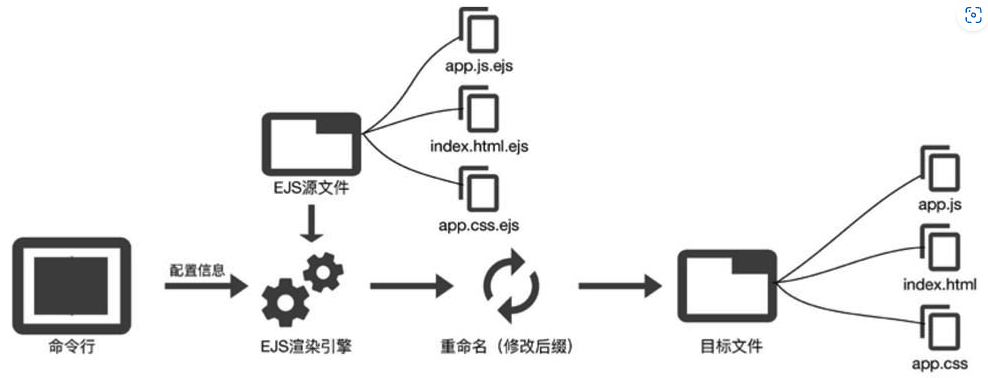
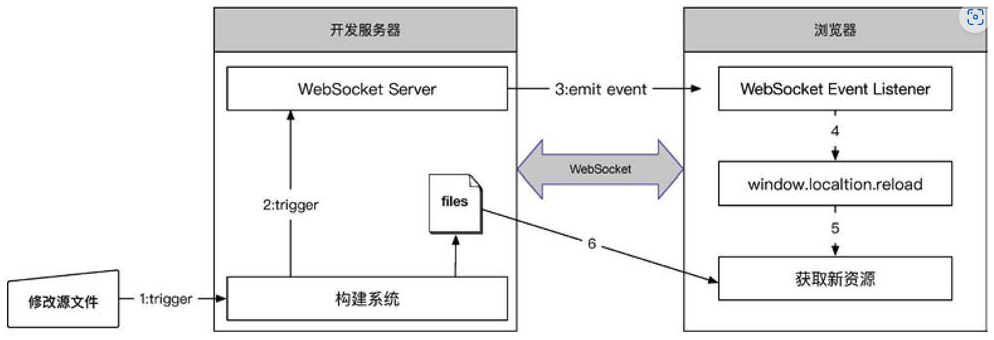
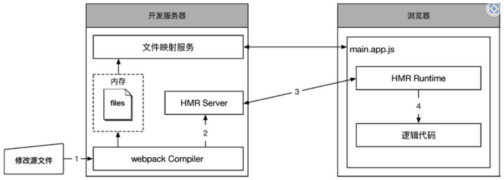

# 前端工程化：体系设计与实践

前端工程化可以简单地理解为前端架构与工程体系的综合体，两者相辅相成

## 第1章 前端工程简史

## 第2章 脚手架

- Yeoman——严格来说它是一个脚手架框架

### 2.4 集成Yeoman封装脚手架方案

整体流程：



#### 2.4.1 封装脚手架方案

1. 收集用户配置
2. 转化动态内容：本质上是由EJS模板渲染引擎执行的
3. 自动安装依赖模块

#### 2.4.2集成到工程化体系中

Yeoman提供了功能强大的CLI工具yo，使用yo完全可以满足对于脚手架的功能需求

**规范是一切工程化流程的根本**

1. Yeoman Node.js API
2. 实现集成 

## 第3章 构建

### 3.1 构建功能解决的问题

构建，或者叫作编译[插图]，在前端工程体系中的角色是将源代码转化为宿主浏览器可执行的代码，其核心是资源的管理

构建需要解决的问题：

- 面向语言
  - ECMAScript规范的转译
  - CSS预编译语法的转译
  - HTML模板渲染
- 面向优化
  - 依赖打包，减少HTTP请求数量
  - 资源嵌入，减少HTTP请求数量
  - 文件压缩，减少请求体积
  - hash指纹，应对浏览器缓存
  - 各种浏览器的Hint，优化性能
- 面向部署
  - 域名/路径改变，区分开发环境和生产环境，比如使用CDN
  - 文件名改变，添加hash

### 3.2 配置API设计原则和编程范式约束

### 3.3 ECMAScript与Babel

### 3.4 CSS预编译与PostCSS

### 3.5 模块化开发

模块是一个白盒，侧重的是对属性的封装，重心在设计和开发阶段，不关注运行时逻辑；组件是一个可以独立部署的软件单元，面向的是运行时，侧重于产品的功能性

### 3.6 增量更新与缓存

#### 3.6.1 HTTP缓存策略

##### 1. Cache-control

- no-cache和no-store

  “no-cache”并非禁止缓存，而是需要先与服务器确认返回的响应是否发生了变化，如果资源未发生变化，则可使用缓存副本从而避免下载。“no-store”是真正意义上的禁止缓存，禁止浏览器以及所有中间缓存存储任何版本的返回响应。每次用户都会向服务器发送请求，并下载完整的响应

- public和private

  “public”表示此响应可以被浏览器以及中间缓存器无限期缓存，此信息并不常用，常规方案是使用max-age指定精确的缓存时间。“private”表示此响应可以被用户浏览器缓存，但是不允许任何中间缓存器对其进行缓存。例如，用户的浏览器可以缓存包含用户私人信息的HTML网页，但CDN却不能缓存

- max-age

  指定从请求的时刻开始计算，此响应的缓存副本有效的最长时间（单位：秒）。例如，“max-age=3600”表示浏览器在接下来的1小时内使用此响应的本地缓存，不会发送实体请求到服务器

##### 2. etag和if-none-match

#### 3.6.2 覆盖更新与增量更新

#### 3.6.3 按需加载与多模块架构场景下的增量更新

#### 3.6.4 webpack实现增量更新构建方案

## 第4章 本地开发服务器

### 4.1 本地开发服务器解决的问题

动态构建和Mock服务是本地开发服务器的主要功能

### 4.2 动态构建

#### 4.2.2 LiveReload 与 HMR (Hot Module Replacement)

##### 1. LiveReload

**Livereload的原理**是在浏览器和服务器之间**创建WebSocket连接**，服务器端在执行完动态编译之后**发送reload事件**至浏览器，浏览器接收到此事件之后刷新整个页面



**缺陷：无法保存页面状态**

##### 2. HMR



工作流程：

1. 修改源文件并保存后，webpack监听到Filesystem Event事件并触发了重新构建行
2. 建完成之后，webpack将模块变动信息传递给HMR Server
3. HMR Server通过WebSocket发送Push信息告知HMR Runtime需要更新客户端模块，HMR Runtime随后通过HTTP获取待更新模块的内容详情
4. 最终，HMR Runtime将更新的模块进行替换，在此过程中浏览器不会进行刷新

实现HMR不仅仅需要服务器端支持，**还需要在构建产出的客户端文件中注入HMR Runtime**。配置webpack的entry加入HMR所需的模块，同时引入HotModuleReplacementPlugin：

```javascript
        entry: {
          'main.app': process.env.NODE_ENV === 'dev' ? [
            'webpack-hot-middleware/client',
            './js/main.app.js'
          ]: './js/main.app.js'
        },
        plugins: [
          new webpack.HotModuleReplacementPlugin()
        ]
```

### 4.3 Mock服务

## 第5章 部署

