# 前端性能揭秘

## 前言

我们要做的是理解复杂系统并从中找到性能问题的关键所在
$$
性能优化=分析方法+技术原理
$$
如果说分析方法是解决性能问题的指南针，那么对技术原理和系统的理解就是照明灯，只有方向但看不到脚下的路是无法前行的

## 第1章 从实践开始

### 1.1 Hello World

通过`<link rel="preload" as="image" href="xxx">`来提前加载图片

### 1.2 现实开发的例子

Tree-shaking、资源合并压缩、按需求加载

## 第2章 度量

很多为性能考虑的前期设计在性能上的优势远超在错误的设计上修修补补

### 2.1 科学的方法

在进行性能优化之前，需要先确定要优化的目标，并为这个目标定义指标

为了评估用户真实感受到的性能，还需要采集和统计用户端的性能数据

### 2.2 初识Performance API

- 使用高精度的performance.now()方法代替Date.now()

  - 精度精确到微秒（μs）
  - 获取的是把页面打开时间点作为基点的相对时间，不依赖操作系统的时间

- 代码示例

  ```html
  <!DOCTYPE html>
  <html lang="en">
    <head>
      <script>
        console.log('header:', performance.now());
        window.addEventListener('DOMContentLoaded', () =>
          console.log('DOMContentLoaded:', performance.now())
        );
        window.addEventListener('load', () =>
          console.log('load:', performance.now())
        );
      </script>
      <meta charset="UTF-8" />
      <meta name="viewport" content="width=device-width, initial-scale=1.0" />
      <title>Performance API</title>
    </head>
    <body>
      
      <script>
        console.log('body:', performance.now());
      </script>
    </body>
  </html>
  ```

### 2.3 均值、分位数和秒开率

最常见的3个集中统计指标：

- 均值

  多次统计取平均值，但**难以排除极值的影响**，会导致均值被极值拉到一个远远偏离大部分值的水平，需要考虑在统计时抛弃一些明显不正常的数据；同时均值**也不能代表某种性能体验的用户占比**

- 分位数

  通常将这些值称为Top Percent（TP），如TP 90代表90分位数

  **Core Web Vitals**推荐使用75分位数来确保大多数用户的体验，对性能有高追求的场景也可以采用90分位数等，如对后端接口API耗时的性能统计等往往使用95分位数这样比较高要求的统计指标

- 秒开率

  分位数更侧重于性能差的用户端的性能状况，**秒开率则反过来关注有多少用户端可以到达非常高的性能水平**。秒开只是一个惯用的说法，实际上有时候我们关注的可能不一定是1s内打开的用户的占比，也可能是n秒内打开的用户的占比

**推荐使用分位数来衡量性能**

### 2.4 度量首屏

指标：FP、FCP、LCP、TTI

关于Hero Element：

```html
<body>
    
    <p elementtiming="text">this is text</p>
    <script>
      const observer = new PerformanceObserver(list => {
        list.getEntries().forEach(entry => {
          console.log(entry);
        });
      });
      // 这样就可以拿到类型为element的PerformanceElementTiming的统计信息
      observer.observe({ entryTypes: ['element'], buffered: true });
    </script>
  </body>
```

- 对于大部分页面，**推荐直接使用LCP来度量首屏**，这是一种基本不需要开发人员操心的度量方式，对于大部分页面都足够有效
- **对于偏展示且有重点元素的页面，推荐使用Hero Element来度量首屏**
- 对于有关键业务逻辑的场景，**推荐使用关键逻辑计时来获取核心逻辑的执行时间点**

### 2.5 度量流畅度

一般来说，使用FPS来度量流畅度。所谓的FPS（Frames Per Second，每秒传输帧数）又叫帧率，也就是每秒渲染的帧数。**对于一个网页来说，达到60fps就会让用户感到非常流畅**，如果显著低于这个值，那么用户可能就会感到卡顿

1. 通过RAF（requestAnimationFrame），持续在每帧前都执行一次RAF，从理论上来说，在60fps的情况下每次执行的间隔大概为16.7ms

   ```javascript
   (function () {
     let lastTime = 0;
     const measure = () => {
       console.log(Date.now() - lastTime);
       lastTime = Date.now();
       requestAnimationFrame(measure);
     };
     measure();
   })();
   ```

   缺点：为了节约设备能源，现在的浏览器可能会**主动降低帧率以适应屏幕的刷新率**，这会导致requestAnimationFrame的执行间隔变长，同时在iframe或后台标签页中运行的requestAnimationFrame也可能会暂停
2. Long Tasks API

   ```javascript
   // 前面省略
   observer.observe({ entryTypes: ['longtask'], buffered: true });
   ```

### 2.6 Core Web Vitals

即核心Web指标：LCP（Largest Contentful Paint）、FID（First Input Delay）和CLS（Cumulative Layout Shift）

#### LCP

LCP度量的是首屏视图中**最大**的元素的渲染时间

哪些部分会被判定为元素：

- 图片
- 内嵌在svg中的image元素
- 视频的封面
- 通过url()加载的background image
- 包含文字的行内元素（inline element）或块元素（block element）

如何确定面积：

- 显示到屏幕以外，或者被容器的overflow裁剪、遮挡的面积不计算在内
- 文字元素的面积为包含文字的最小矩形的面积
- 图片以实际``组件的大小计算，而非原始图片的大小
- CSS设置的border padding等都不计算在内

如何度量：

浏览器采取的方案是在渲染第一帧时就先选定一个占用面积最大的元素，报告一个largest-contentful-paint的PerformanceEntry，在后续过程中持续追踪占用面积最大的元素是否发生变化，如果有新的占用面积最大的元素渲染完成，则继续用新的元素报告新的largest-contentful-paint，并且持续这个过程

当用户在页面上进行交互后（包括点击、滚动等），浏览器就会**停止报告**largest-contentful-paint

```javascript
// 前面省略
observer.observe({ entryTypes: ['largest-contentful-paint'], buffered: true });
// 对LCP的度量不是获取最新一条largest-contentful-paint这么简单，还需要考虑前进/后退缓存、iframe等。在实际生产环境中推荐使用web-vitals这个JavaScript工具库来度量LCP
```

#### FID

FID度量的交互行为需要满足以下两个条件：

- 点击、触摸、按键等不包含滚动和缩放
- 有绑定事件的行为，因为度量的是从用户交互到事件响应的耗时

**满足以上条件的交互行为会被浏览器识别为首次交互**

```javascript
// 前面省略
observer.observe({ entryTypes: ['first-input'], buffered: true });
// 在实际生产环境中推荐使用web-vitals这个JavaScript工具库来度量FID
```

#### CLS

CLS度量的是页面产生的**连续累计布局偏移**分数

具体的偏移值算法由以下两点决定：

- 不稳定元素影响的可视区面积占比
- 不稳定元素移动的最大距离/可视区维度（宽度或高度）

## 第3章 分析

这种通过种种现象和数据表现找出出现性能问题的根本原因的方法，就是性能分析

- 实验室分析：在用户机器或测试机器上，通过性能分析工具来单点测试分析页面的性能状况
- 数据分析：主要是指通过Performance API在用户端采集与上报的性能信息来分析和推测问题

### 3.1 分析方法

1. **确定目标**：需要确定一个最终目标，目标要尽可能明确和清晰，才能避免在分析过程中迷失方向
2. **收集数据**：通过Performance API来度量一些关键指标并且上报
3. **清洗数据**：收集的数据往往不能直接使用，由于用户运行的环境不受控制，因此数据中往往包含大量的无效值、空值、零值等，要对这些异常值做特殊处理，上报成明显易于处理的值
4. **统计值分析**：统计值分析也叫描述性统计，简单来说，就是先把各种能够得到的数据指标的统计值（如均值、中位数等）一一列举出来，然后观察其特征
5. **时序分析**：由于性能数据是随着时间变化的，在统计值分析的基础上，可以观察随着时间的变化统计指标发生了哪些变化
6. **维度分析**：**地域**（如由多地部署带来的跨机房调用的耗时）、**优化手段**（如预加载往往只能让部分用户体验到明显的性能提升，而来不及预加载的用户则无法享受这种优化带来的性能改进）、**浏览器**、**操作系统**等
7. **相关性分析**：相关性并不代表因果

### 3.2 常用的过程指标

#### TTFB（Time To First Byte）

指客户端从发起请求到接收到服务器响应的第一个字节的时间，是反映网站性能的重要指标。更加准确地说，**TTFB是在完成DNS查询、TCP握手、SSL握手后发起HTTP请求报文到接收到服务器端响应报文的第一个字节的时间差**

TTFB 不受传输容量、网络带宽的影响，一般来说**能够更好地反映服务器端的性能**

#### DOMReady和Load

DOMContentLoaded指的是页面解析及阻塞资源加载完毕的时间点，阻塞资源包括页面中没有async/defer的JavaScript脚本和CSS样式。**在这个时间点后就是defer的JavaScript开始执行的时机**

Load的时机要晚很多，是页面资源完全加载好的时间点

### 3.3 Performance API详解

#### Navigation Timing API

Navigation Timing API指的其实就是performance.timing

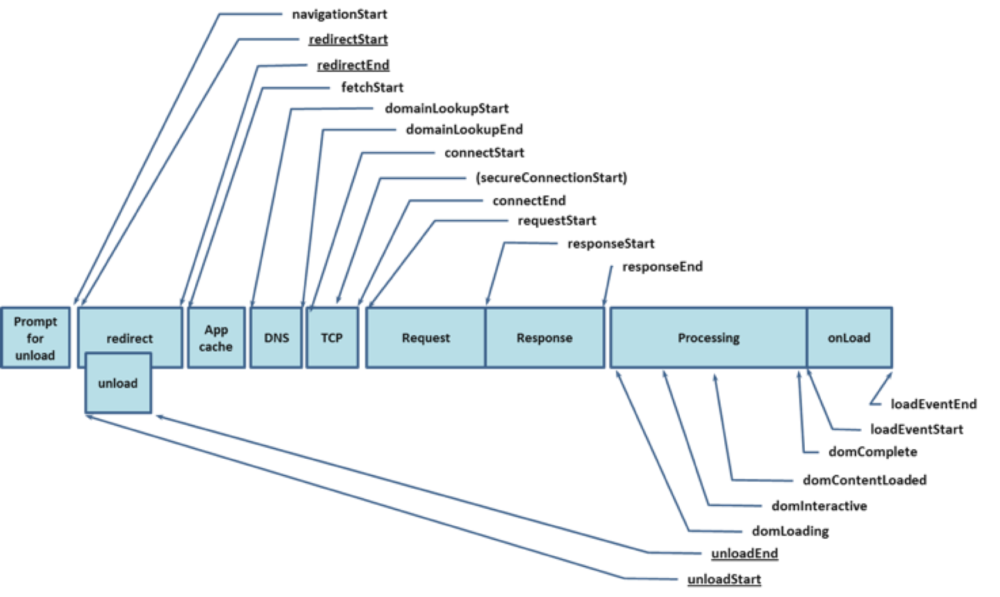

Navigation Timing API存在时间精度差、可拓展性差等问题，所以在Performance Entry API出现后，其就升级为Navigation Timing API Level 2，并作为Performance Entry API的一部分，原Navigation Timing API作为Navigation Timing API Level 1已经被废弃

#### Performance Entry API

Peformance Entry API的主要API是performance.getEntries()，可以获取页面中所有与资源加载相关的性能信息，包括针对这个资源具体的加载时间线、实际解码后的体积和传输容量等（比如还包含Element Timing、First Paint、First Contentful Paint等）

##### performance.getEntriesByType()

其类型包括：

- navigation
- resource
- mark
- measure
- paint
- frame

##### performance.getEntriesByName()

获取指定name的场景下的指标

```javascript
performance.getEntriesByName('first-paint')[0];
```

##### PerformanceObserver

```javascript
const observer = new PerformanceObserver((list, observer) => {
  const entries = list.getEntries();
  entries.forEach(entry => {
    // 处理Performance Entry
  });
});

// 这里以监听resource类型为例
observer.observe({ entryTypes: ['resource']});
```

#### Resource Timing

- 加载时间：

  - Redirect、DNS、TCP等

    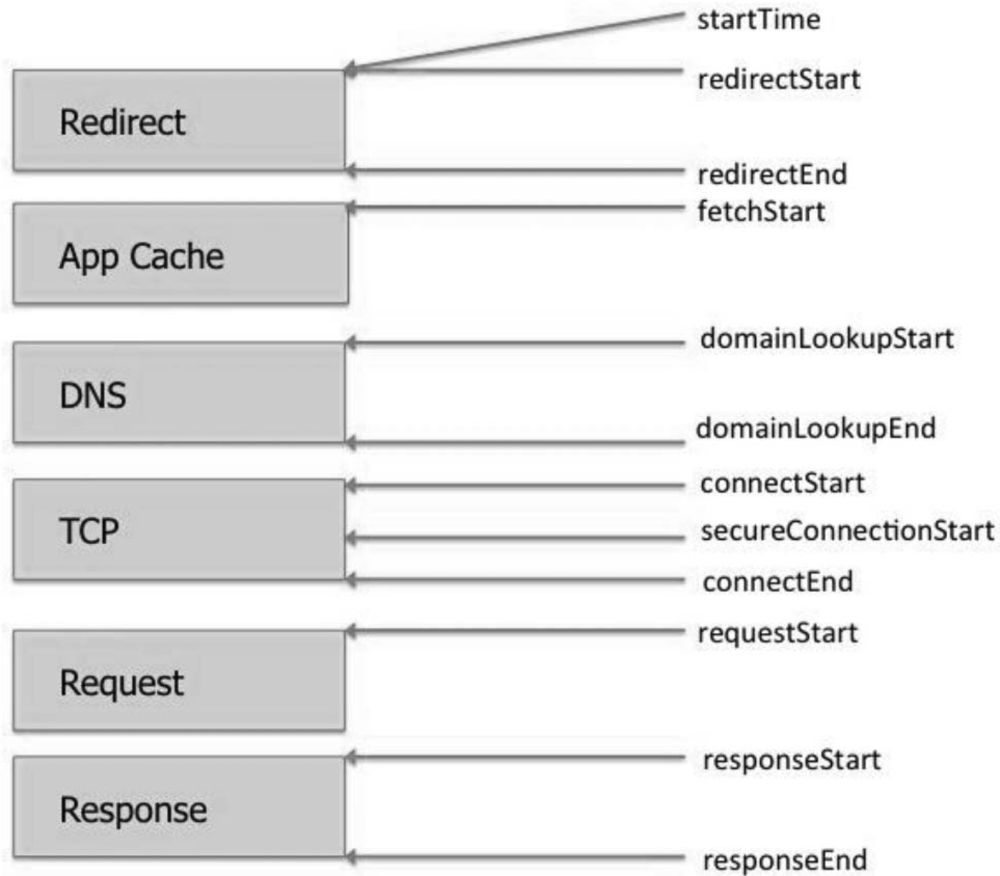

- 容量信息

  - decodedBodySize：解压后的体积
  - encodedBodySize：压缩后的体积
  - transferSize：传输的容量（比如从缓存加载，此项的值即为0）

#### Navigation Timing Level 2

构建在Resource Timing基础之上

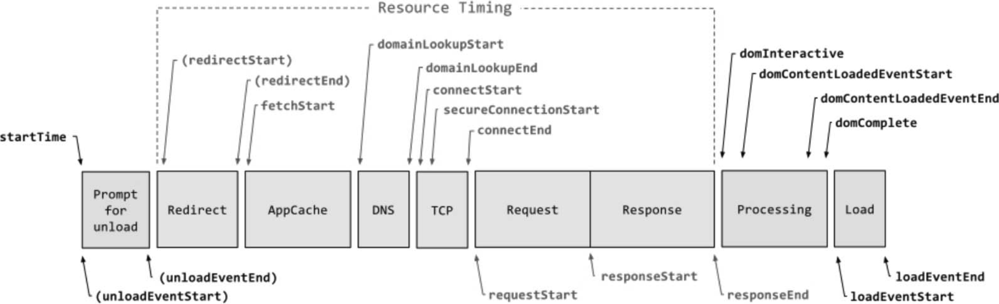

**Navigation Timing Level 2的兼容性可能还存在问题**，建议在前端使用此API采集性能数据时做好兼容性处理，在不支持的情况下降级到Navigation Timing Level 1

#### Paint Timing

Paint Timing提供和页面绘制相关的性能信息

#### User Timing

在实际开发中，对于很多时间点或时间段，浏览器并不理解，就需要使用一种方法告知浏览器这段耗时的实际意义

##### 时间点

performance.mark()是用于标记某个时间点的方法，如标记开始加载和加载完成的时间点

```javascript
performance.mark('load-component-start');
import('component').then(comp => {
  // 加载完成后进行标记
  performance.mark('load-component-end');
});

// 获取时
performance.getEntriesByType('mark');
```


##### 时间段

在更多的情况下，需要度量的是一段时间的时长，使用performance.mark()标记了若干时间点后，就可以使用performance.measure()度量两个时间点之间的差值

```javascript
performance.mark('load-component-start');
import('component').then(comp => {
  // 加载完成后进行标记
  performance.mark('load-component-end');
  // 度量加载耗时
  performance.measure('customTiming', 'load-component-start', 'load-component-end');
});
```

### 3.4 分阶段性能分析

```javascript
const FP = performance.getEntriesByName('firt-paint')[0].startTime;
const FCP = performance.getEntriesByName('first-contentful-paint')[0].startTime;

const DOMContentLoaded = performance.getEntriesByName('navigation')[0].domContentLoadedEventStart;
const onload = performance.getEntriesByName('navigation')[0].loadEventStart;

const navigationTiming = performance.getEntriesByType('navigation')[0];
const TTFB = navigationTiming.responseStart - navigationTiming.fetchStart;

const dnsTime = navigationTiming.domainLookupEnd - navigationTiming.domainLookupStart;
const connectTime = navigationTiming.connectEnd - navigationTiming.connectStart;
```

## 第4章 实验

### 4.1 优化不是照搬军规

性能优化作为一个复杂的系统工程不能简单地照搬军规，而是需要“通过观察和手册中所提供的结构，不断交替运用归纳法和演绎法，如此才能找到解决之道”

木桶效应：性能优化是对整个系统和访问链路的全链路优化，木桶效应非常明显，当存在更明显的影响性能的短板时，改善和优化其他长板是没有什么效果的

### 4.2 用实验验证优化

图片是否采用base64处理的实验：把不进行base64编码的版本作为对照版本，把进行base64编码的版本作为实验版本

实验分桶：

- 以用户为维度的分桶：比如先根据用户的id进行哈希计算，并对100取模
- 以URL为维度的分桶：不常见，一般用在面向摸索引擎的SEO实验中，**需要注意的是**，一个URL和另一个URL的流量本身就是不对等的，当URL量和流量足够大时，这种分桶方式才能得到相对均衡的结果
- 以访问为维度的分桶：以单次访问为维度进行分桶，性能实验中最常见
- 多实验并行
- 哈希算法的选择：即使输入的key本身具备很强的规律性，输出结果也是均匀分布的
- 上报和分析数据：带上用户当前所在的分桶信息
- A/B Test背后的数学
- 结论不重要，重要的是方法

### 4.3 用实验改进优化

- 建立模型
- 实验修正

性能优化中最重要的最小闭环，即度量、分析、实验，这些方法虽然并不能用于页面的性能改造，但是可以为优化提供方向指引

基础理论（网络协议、浏览器工作机制等）同样是性能优化过程中不可或缺的部分

## 第5章 工具

### 5.1 Chrome DevTools

#### NetWork面板

##### 时间信息

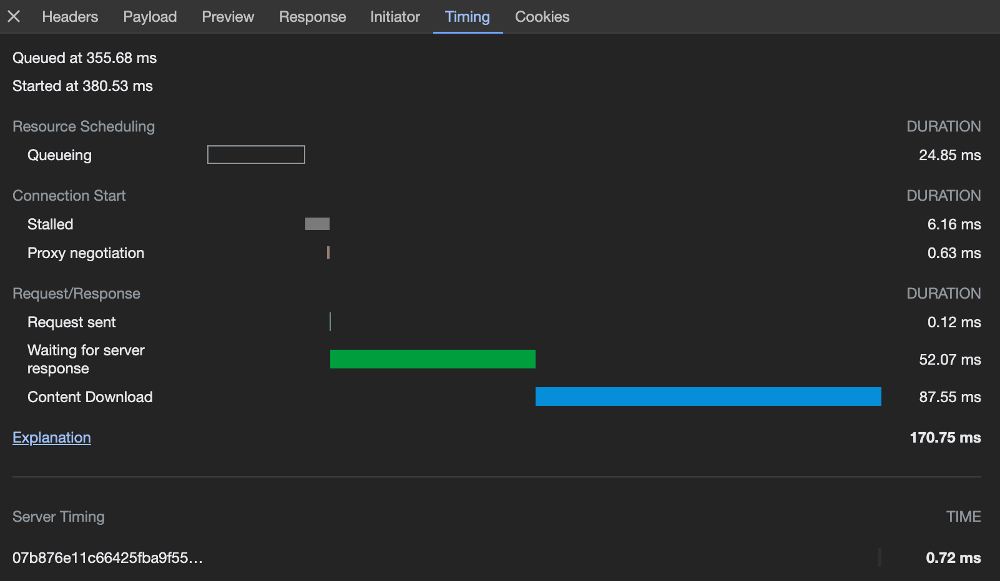

- Queued at：开始进入队列的时间，一般可以通过这个时间判断请求的发起时间是否符合预期，比如通过javascript请求一张图片，那么执行到`new Image()`的时间就是Queued at的时间点，**这个时候浏览器还没有真正发起请求行为**
- Started at：请求真正从浏览器发出的时间，会晚于Queued at
- Queuing：上面两个时间相减得到的就是**在队列中等待的时间**，产生等待的原因一般如下：
  - 资源的优先级低，浏览器需要等待其他高优先级的资源加载完成再加载
  - 等待可用TCP请求复用的时间
  - 浏览器当前并发过多而进入等待
  - 从磁盘读取缓存的时间
  - 部分版本的Chrome中可能会隐藏CORS的preflight请求，而触发preflight请求会把OPTIONS请求产生的耗时也展示为这个阶段的耗时
- Stalled：又叫Blocking，即被阻塞的时间，包含Queuing的任意原因，除此之外还包含代理协商等时间

#### Performance面板

### 5.2 WebPageTest

https://www.webpagetest.org/

除了本章介绍的工具，还有Lighthouse、Pingdom、SpeedCurve、PageSpeed Insights等线上或线下的工具

## 第6章 TTFB为什么这么长

TTFB是指客户端从发起请求到接收到服务器响应的第一个字节的时间差，是反映网站性能的重要指标。由于网页的下载时间受到页面体积、客户端带宽等因素的影响更大，**因此TTFB一般来说能够更好地反映服务器端的性能**

### 6.1 TTFB的合理值

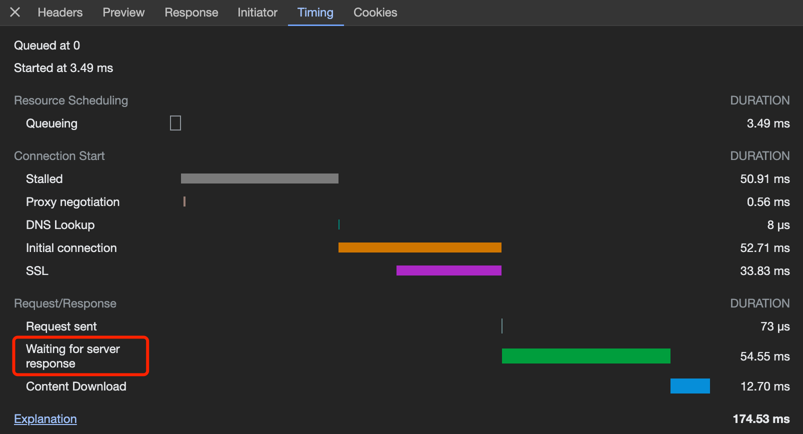

**TTFB（新版本Chrome中叫Waiting for server response）**是在完成DNS查询、TCP握手、SSL握手后发起HTTP请求报文到接收到服务器端第一个响应报文的时间差

**RTT（Round-Trip Time），即往返时延**，指的是从发送端发送数据开始，到发送端收到来自接收端的确认的时间，即一来一回的时间。一般来说，这个时间由物理距离、网络传输路径等决定，**通过`ping`命令看到的时间就是1个RTT的时间**

对于一个页面的TTFB来说，它的时长在通常情况下接近1个RTT+Server RT（后端处理耗时），**可以据此大致判断当前页面的TTFB是否符合预期**

### 6.2 如何优化TTFB

1. 减少请求的传输量，比如发送cookie或body很大的post请求
2. 减少服务器端的处理时间
   - 增加缓存、优化慢SQL、并行化网络请求等
   - 流式渲染：即让服务器端先返回可渲染的内容，再流式地返回更多耗时的内容完成后续渲染，浏览器并不依赖下载或解析完整的HTML，而是解析一部分渲染一部分，**通过在Response Header中增加Transfer-Encoding:chunked，告知浏览器HTML将会被一块一块地流式返回**
     - 流式渲染时，浏览器一般不是拿到数据马上就开始渲染，而是会缓冲一定的长度后才开始渲染页面
     - 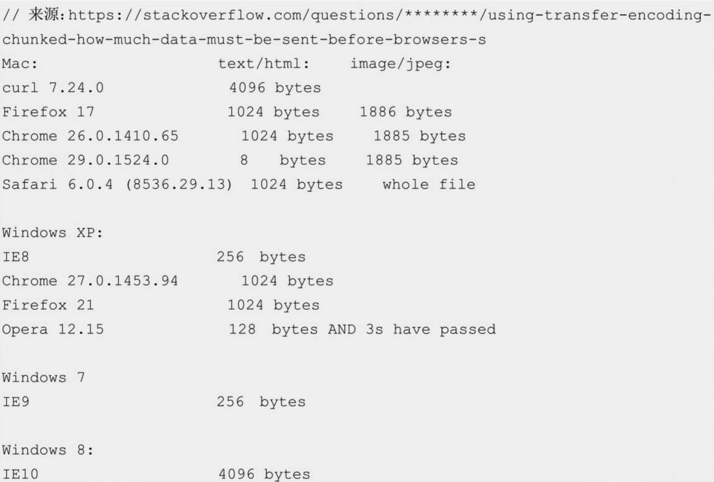
3. 减少RTT，比如使用CDN

## 第7章 建立连接为什么这么慢

HTTP请求在什么情况下需要建立连接，在什么情况下可以复用连接，建立连接的时候又在做什么，为什么需要消耗这么长时间

### 7.1 建立连接应该耗时多久

#### TCP协议

- 三次握手的过程：客户端与服务端各需求1个RTT

### 7.2 如何优化建立连接的耗时

1. 减少物理距离

2. preconnect

   ```html
   <link rel="preconnect" href="https://xxx">
   ```

   或者在响应头里进行处理

   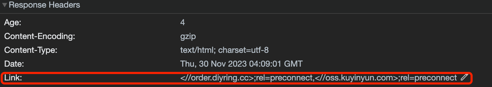

3. 复用连接

4. 域名收拢：利用HTTP/2的多路复用特性

5. TCP Fast Open

   TCP的拓展标准，简称TFO，**在TFO第一次建立连接时和普通TCP连接的三次握手是相同的，但客户端会额外得到一个TFO Cookie。之后再重新建立连接（如断网后重新连接或移动设备切换网络等）时，则直接由SYN携带TFO Cookie和数据并发送，若服务器端收到校验Cookie有效，则直接把数据交付给应用层**

   *绝大多数浏览器不支持TFO*

6. QUIC和HTTP/3

   它们在一定程度上优化了建立连接耗时的问题

## 第8章 Fetch之前浏览器在干什么

假设把从startTime到fetchStart这段时间统称为**beforeFetch**

### 8.1 重定向

在fetchStart开始前，浏览器先处理重定向相关的逻辑

#### 前端监控如何统计重定向

**前端监控无法精确统计重定向耗时，所以只统计了fetchStart—navigationStart的耗时**，这是因为浏览器的**安全策略**规定了只能得到同域重定向的信息，其中也包括性能信息。其实，按照新的标准，如果重定向的服务器端返回**Timing-Allow-Origin Header**，则在Performance Timing API中也能得到重定向的相关信息

### 8.2 浏览器打开耗时

通过外部链接打开浏览器并访问该链接，浏览器冷启动、打开新标签的时间都会被计算到beforeFetch中

**beforeFetch把上一个页面unload的耗时也计算在内**

目前：startTime是在卸载上一个页面之后开始统计的

### 8.3 如何优化beforeFetch耗时

1. 重定向逻辑前置 
2. 合并重定向
3. 避免使用短链
4. 使用beforeFetch度量和分析

## 第9章 HTTPS协议比HTTP协议更慢吗

### 9.1 HTTPS协议为什么安全

1. 对称加密与非对称加密

   - 签名：保证数据完整和发送方身份确认
   - 证书机制：由权威机构颁发，机构通过自己的私钥给证书签名，并把公钥预置到浏览器和操作系统中，就可以判断证书是否被篡改
   - 证书链：权威机构的根证书与中间证书机构颁发的证书，根证书可验证中间证书的真伪，浏览器和操作系统会预置根证书

2. SSL/TLS握手

   - 客户端验证服务器端的证书
   - 协商生成对称加密使用的密钥
   - 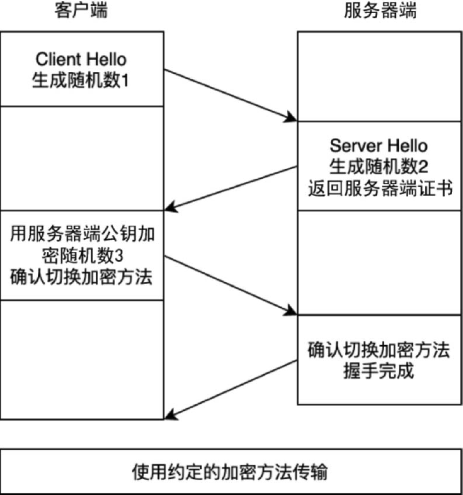
   - SSL/TLS握手需要至少两个RTT（收到服务器端的Change Cipher Spec之后）

3. TLS False Start

   可以在客户端Change Cipher Spec后立即发送数据，因为服务器端必然也会生成相同的密钥，事实上也确实有这样的优化手段，即TLS False Start

   开启TLS Fast Start的前提：

   - 使用支持前向安全性的加密算法：即使未来有人通过某种手段获取了加密和解密的密钥，也无法解密以前的通信内容
   - 在服务器端声明支持NPN/ALPN

4. TLS 1.3

   握手采用同样的方式，**只需要1个RTT**，不再需要False Start

### 9.2 HTTPS协议如何吊销证书

CRL（Certificate Revocation Lists）是由CA（证书的签发机构）维护的一个定期更新的列表，浏览器会将其缓存在本地，并且在验证证书时查询证书是否在吊销列表中——时间性问题，且体积会越来越大

OCSP在线服务——每次建立连接前都阻塞式的请求一个OCSP会出现性能问题

OCSP Stapling，在后端服务器上开启OCSP Stapling，让Web Server在收到响应的同时请求OCSP Server来获取已经签名的OCSP信息，再交给浏览器，**串行转并行的方案**

#### 证书类型

- DV证书
  - DV（Domain Validation，域名验证型）证书：验证对域名有控制权即可签发，一般来说个人和小微企业会采用
- OV证书OV（Organisation Validation，企业验证型）证书
  - 需要验证域名控制权和企业的真实信息才能签发
- EV证书EV（Extended Validation，增强验证型）证书
  - 审核方式最严格，会在OV证书的基础上验证其他的企业信息，**EV证书是需要强制OCSP验证的**，即使Chrome停用了常规的OCSP检查，EV证书也会通过这种方式校验其有效性

### 9.3 HTTPS协议更慢吗

1. 确保证书链完整

   证书不完整时，浏览器会通过网络请求来补全证书链

2. 启用TLS1.3

   启用TLS 1.3或开启TLS False Start，可以节约握手的时间，顺利部署相关的优化后可以通过WireShark等软件验证优化的效果，**Change Chiper Spec后面是Application Data，从而减少1个RTT的握手时间**

3. 不滥用EV证书

   EV证书会触发OSCP强验证，因此对性能有一定的影响

4. 开启OSCP Stapling

   出于安全考虑，必须开启OSCP验证，可以在服务器端开启OSCP Stapling，这样可以尽量减少OSCP带来的额外的性能负担

*由于不同的证书和验证机制可能随着浏览器的行为发生变化，因此具体的优化细节可能会随之改变*

## 第10章 HTTP/2、HTTP/3和性能

### 10.1 HTTP/2和性能

#### 在开启HTTP/2时，为什么有的script标签并没有复用TCP连接？

> 对JavaScript代码的特点进行分析可以发现，其\<script>标签和其他\<script>标签的差异在于注明了crossorigin
>
> 一般来说，crossorigin常见的作用是让前端的错误收集系统可以跨域收集JavaScript脚本产生的错误栈，如在上面的例子中，该脚本如果没有加crossorigin，就无法捕获并上报生成的错误栈。
>
> **根据Fetch的标准，一个连接由key、origin（域）和credentials组成，而crossorigin的默认值crossorigin=anonymous代表credentials为false**。
>
> 用户代理有一个关联的连接池。连接池由零个或多个连接组成，每个连接都由一个密钥（网络分区密钥）、一个域（origin）和一个凭证（一个布尔值）标识。
>
> 而对于\<script>标签来说，在默认不加crossorigin的情况下是非CORS请求，是携带credentials的，这也是JSONP会携带客户端Cookie的原因。
>
> 这会导致页面上携带和不携带crossorigin的\<script>标签使用不同的连接。想要解决这个问题，可以通过为\<script>标签注明crossorigin=use-credentials来复用同一个连接，或者提前加一个crossorigin=anonymous的preconnect
>
> 按照我们的理解，似乎只有同域名的请求才能复用连接，但如果知道HTTP/2的多路复用其实是复用TCP连接，而一个TCP连接是由（Client IP，Host IP，Client Port，Host Port）四元组确认的，就不难理解只要是同一个Host IP，即使是来自不同的域名也能复用连接

#### Server Push是如何实现的

服务器端需要在响应HTML时返回一个PUSH_PROMISE 帧，同时把需要推送的内容和HTML一起返回给客户端，当客户端试图加载CSS时，可以根据PUSH_PROMISE帧的ID读取到对应的流

但如果客户端发现本地已经有了某个资源的缓存，这个时候即使存在PUSH_PROMISE帧客户端也会放弃，其折中方案就是利用Cookie猜测用户是否需要Server Push，仅针对新用户开启Server Push

##### 存在的问题

- 缓存复用问题——可能推送到一半发现已经存在缓存了
- 无法从第三方推送——无法从第三方服务器（CDN节点）进行推送

##### 解决方案——Early Hints

允许服务器端在HTML响应还没有准备好的情况下先响应一个103 Early Hints的响应报文，告知浏览器从什么地方提前加载内容

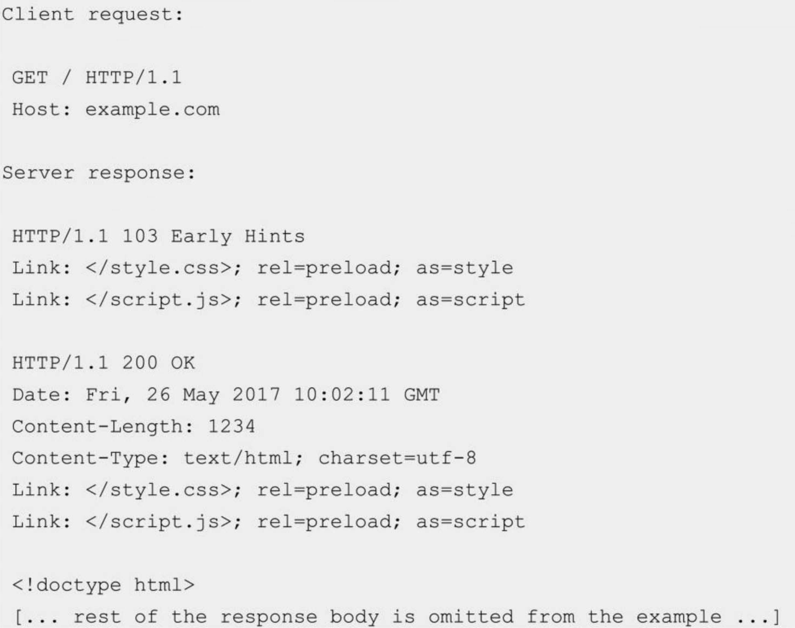

### 10.2 为什么还需要HTTP/3

HTTP/1和HTTP/2都是基于TCP协议的，都存在如下问题

1. TCP队头阻塞问题

   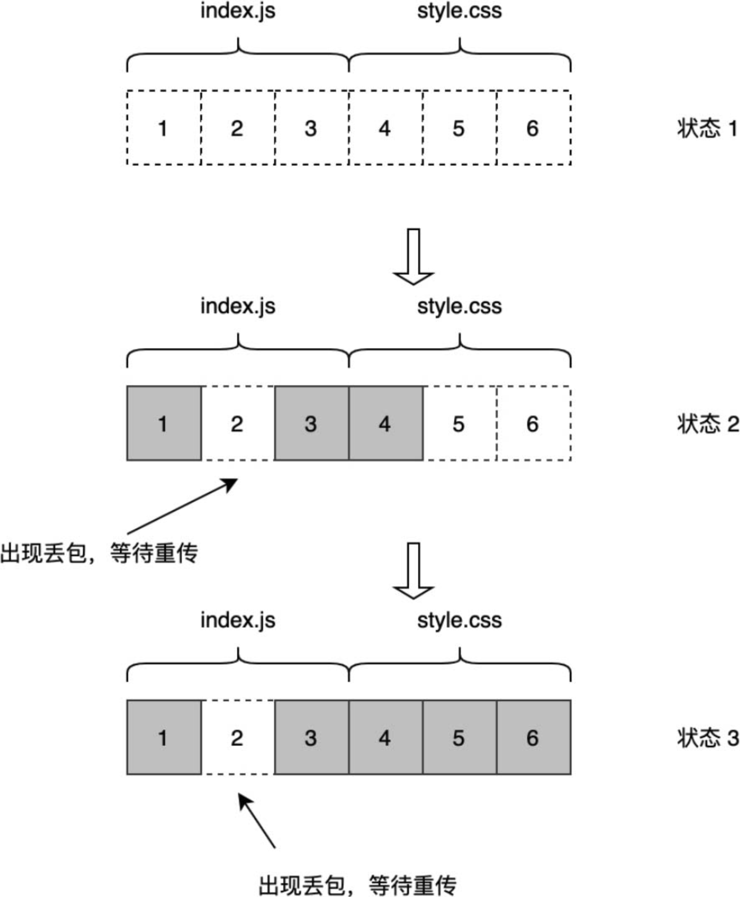

2. TCP握手时长

   在最好的情况下，建立一个TCP连接需要1个RTT，如果带上SSL握手就需要3～4个RTT。虽然HTTP可以通过连接复用减少建立连接的次数，但是仍然存在连接成本

3. 移动场景的网络切换成本

   网络切换会导致用户IP地址变化，而TCP协议是根据四元组来确定一个连接的，在这种场景下需要重新建立连接

#### 解决方案：QUIC（Quick UDP Internet Connection，快速UDP互联网连接）

1. QUIC中提供了类似HTTP/2多路复用中的数据流（Stream）的概念，在单个数据流中依然保证有序交付，而多个数据流之间互不影响

   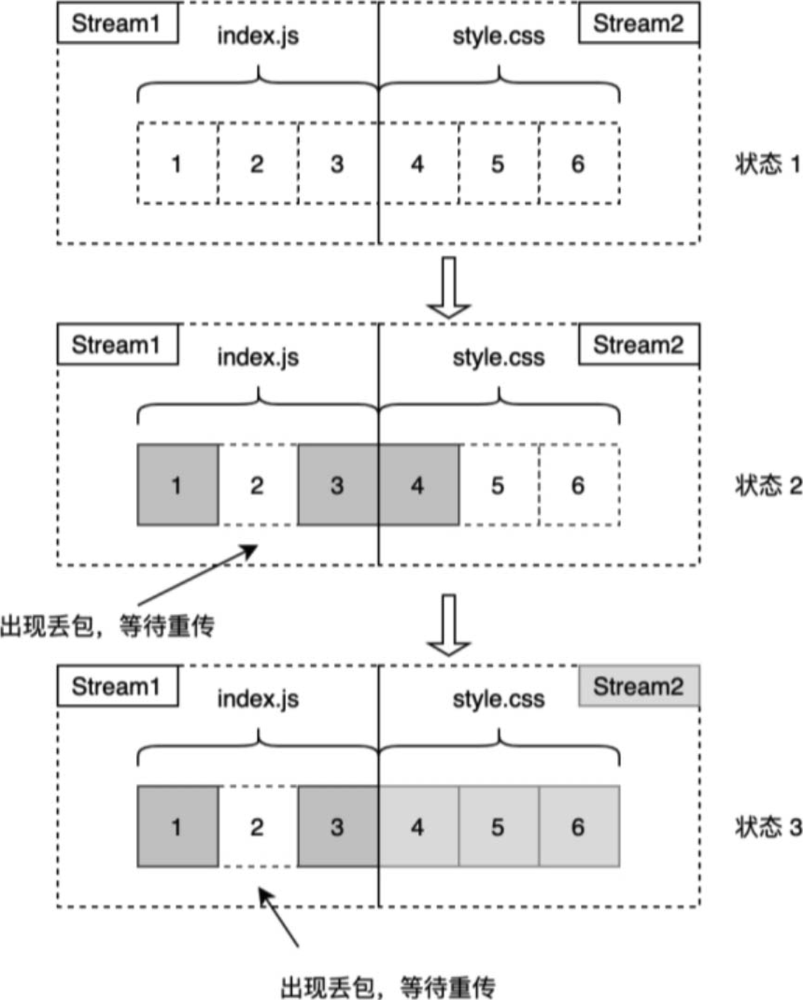

   **Stream1出现丢包也不妨碍Stream2中的资源传输完毕**

2. QUIC摆脱了TCP协议的限制，可以把连接的握手和交换密钥的握手在一次完成，从而实现1个RTT的握手

   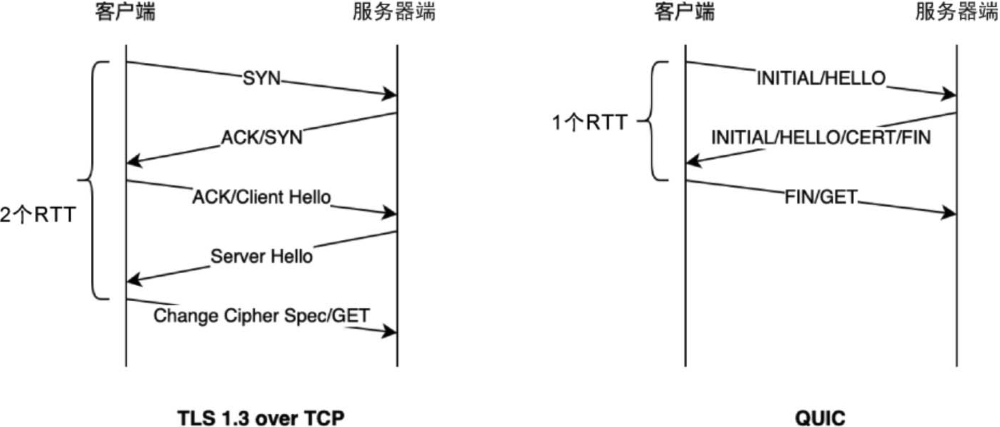

3. QUIC针对移动场景常常出现网络环境变化的情况，支持连接迁移（Connection Migration），也就是当客户端改变网络IP地址后，也能够保持连接不间断

## 第11章 压缩和缓存

### 11.1 传输速度和压缩速度如何兼得

br压缩比gzip压缩的效果显著，但是会增加服务器端处理耗时，但兼容性问题还需考虑

图片和视频等往往本身就已经是压缩编码后的，因此，不需要在传输时使用额外的压缩方式

### 11.2 HTTP缓存什么时候会失效

- 强缓存：max-age（HTTP 1.1）、cache-control（HTTP 1.0）
- 协商缓存：ETag/If-None-Match、Last-Modified/If-Modified-Since

## 第12章 浏览器和性能

### 12.1 第一次渲染时都发生了什么

#### 最小渲染路径

1. 浏览器接受到HTML数据流，主线程开始解析HTML并转换成DOM树
2. 解析HTML的同时，浏览器会请求页面中能够解析出的资源，如图片、css、javascript等
3. 当遇到内嵌的javascript或没有defer/async的\<script>标签时，会阻塞HTML的解析，先下载并执行javascript（因为javascript有可能通过document.write来改写接下来的DOM内容）
4. 浏览器解析样式并生成对应 的CSSOM，该过程同样由主线程完成，浏览器解析css后会根据选择器和规则生成对应的CSSOM
5. 浏览器从DOM树开始遍历节点，并在CSSOM中找到每个节点对应 的样式规则，将两者合并成一棵树用于渲染，即渲染树
6. 浏览器主线程开始遍历渲染树，把相对的位置布局和大小等都转换成屏幕上的绝对像素（css盒模型、flex布局、字体规则等都是在这个时候完成的），至此浏览器生成了和DOM对应的布局树
7. 根据渲染树和布局树，生成对应的图层树，如此便知道按照什么顺序进行绘制
8. 有了图层之后就可以把这些几何信息真正输出成像素点，这个过程称为**光栅化**，并且将各个层进行合并，这个过程称为**合成**，这两个工作是由合成线程与光栅化线程完成的。**一个页面一般是非常大的，而需要显示的只是页面的一部分，所以合成线程会先把得到的层分割成块，并把需要渲染的块交给光栅化线程，由光栅化线程完成分块的光栅化并且存储在GPU的内存中**
9. 分块完成光栅化后，合成线程会据此创建一个合成帧，直接发送给GPU完成屏幕的显示，当页面滚动和纯合成动画发生时，合成器只需要重新生成一个合成帧，并发送给GPU即可，**整个过程不需要经过主线程**

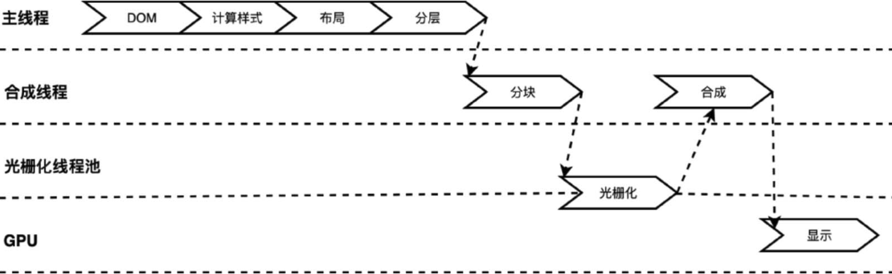

### 12.2 为什么DOM操作很慢

#### 执行DOM操作时发生了什么？

当DOM本身或位置、大小等信息发生变化时，就需要从布局开始重新走完所有的流程，并且同时触发后面的绘制相关的工作，这个过程称为**重排（Reflow）**

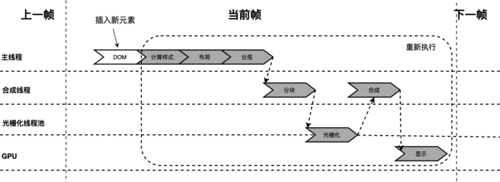

计**算样式、布局等信息都必须在主线程中才能进行，必须在主线程中执行的还有JavaScript**

#### 访问DOM属性

DOM并不是JavaScript的一部分，而是JavaScript中访问HTML/SVG/XML等文档对象的接口。**DOM对象和JavaScript引擎在两个不同的线程中**，这意味着，当从JavaScript中访问和操作DOM对象时，**都需要通过跨线程通信**，导致简单的属性访问也比普通的JavaScript对象要慢很多

当从JavaScript中获取一些和排版有关的信息时，为了保证信息的正确性，浏览器会同步计算样式和排版信息并且返回给JavaScript，这个过程称为**强制重排（Force Reflow）**

## 第13章 异步任务和性能

### 13.1 事件循环机制

1. JavaScript代码是运行在单线程上的
2. JavaScript引擎仅负责解析和执行JavaScript代码，并不管理线程和异步任务等。**异步任务的运行需要依赖宿主环境（如Node.js和Chrome浏览器）来创造线程**。浏览器就是通过**事件循环机制**调用JavaScript引擎来完成调度的（node.js也是如此）
3. 由于JavaScript可以同步获取DOM信息和DOM操作，因此**JavaScript引擎和渲染之间也是相互阻塞的**
4. 根据HTML5规范指定，`setTimeout(fn, 0)`并非真的立即执行，而是**等待至少4ms**，并且在2010年及以后发布的浏览器中保持一致

### 13.2 宏任务与微任务

浏览器中采用宏任务的有setTimeout、setInterval、setImmediate和网络I/O等，采用微任务的有Promise和MutationObserver

### 13.3 Promise的polyfill性能

使用MutationObserver作为polyfill来兼容不支持原生Promise的场景

### 13.4 requestAnimationFrame

requestAnimationFrame**既不属于宏任务也不属于微任务，它的触发时机总是和浏览器渲染保持一致**

## 第14章 内存为什么会影响性能

### 14.1 内存

1. 在一般情况下，Node.js应用默认的内存限制大约为1.7GB，可以使用--max-old-space-size=4096把内存限制为4GB

2. 内存回收

   1. 标记清除法：从根节点开始遍历所有可达对象，并释放堆中的不可达对象（在浏览器中，根对象其实不仅仅是window，还包括事件监听、DOM对象、BOM等）

   2. 分代回收机制：V8采用的是一种根据对象不同的生命周期采取不同策略的分代回收机制，这种机制把内存分为新生代和老生代两部分

      - 新生代算法

        基于复制的垃圾回收算法，即Scavenge，**把新生代内存分为两半**，其中用于存放对象的称为From空间，处于空闲状态的是To空间。当需要为内存分配空间时，将对象统一存放到From空间中。当From空间不足时，启动垃圾回收算法，把From空间存活的对象复制到To空间中，复制完成后，To空间和From空间就可以互换角色

      - 何时将新生代内存中的对象晋升为老生代

        - 对象已经经历过一次垃圾回收
        - To空间占用超过25%：因为如果To空间被占用太多，当这个To空间在下一周期作为From空间使用时，就会影响新对象的内存分配

      - 老生代算法

        - 标记清除法（如前文，会产生碎片）和标记压缩法（移动对象，速度会比较慢）

      - 全停顿

        - 垃圾回收算法在进行垃圾回收的过程中，需要阻塞JavaScript本身的执行，等待垃圾回收完成后再继续执行，这个过程称为全停顿
        - 为了减少全停顿带来的用户体验问题，**V8引入了增量标记、延迟清理、增量整理等**方式，使垃圾回收过程变成可停顿和可拆分的

      - QuickJS

### 14.2 内存泄漏

当应该被回收的内存空间无法被回收时，就会导致内存不断被占用，这种情况称为**内存泄漏**

当页面中出现了比较严重的内存泄漏时，会产生以下两个结果

1. 内存总是不够，导致垃圾回收频繁被触发
2. 内存中存在大量对象，导致垃圾回收算法本身执行得更加缓慢

大部分导致内存泄漏的根本原因都可以归结为**被根节点误持有**

## 第15章 使用ServiceWorker改善性能

### 15.1 ServiceWorker概述

ServiceWorker是一种允许开发人员对浏览器的“网络请求”部分进行编程的技术，诞生之初是为了让网站可以离线访问，是PWA技术的一部分

ServiceWorker带来如下功能：

1. 离线可用
2. 类App特性（如通知或后台推送等）
3. 性能优化

### 15.2 使用ServiceWorker进行缓存

#### Cache API

Cache API通过window.caches暴露出来，并且既可以在ServiceWorker中使用，也可以在Worker和页面中直接使用

需要自己使用JavaScript查询对应的缓存是否存在，以及决定应该以什么行为响应用户，这也是ServiceWorker最适合的场景

可以通过**navigator.storage.estimate 得到当前的存储的使用情况**

#### IndexDB

除了Cache API，在ServiceWorker中还可以使用的存储方案有IndexDB

#### 控制缓存的Cache Key

#### 更加灵活的缓存更新策略

### 15.3 API提前加载

可以利用ServiceWorker在用户开始访问页面时发起API请求，把请求的内容预缓存在内存中，当触发真正的API请求时返回对应的内容，从而做到提前加载

ServiceWorker应该是在原有页面的基础上做一些体验升级和增强，而**不应该耦合业务逻辑**，应该尽可能保证ServiceWorker中的能力都是可插拔的，去掉它不应该对业务逻辑造成功能性的影响

### 15.4 ServiceWorker冷启动

1. 开启Navigation Preload
2. 消费Navigation Preload

## 第16章 字体对性能的影响

### 16.1 字体导致的布局偏移

### 16.2 如何避免字体带来的布局偏移

#### 16.2.1 font-display属性——决定字体的渲染方式

- auto：由浏览器决定
- swap：尽快用fallback字体显示内容，并在字体加载完成后进行替换
- block：完成加载前显示空白，字体加载完成后再显示。*block也有等待超时时间，一般为3s，超过3s后其行为就和swap一致*
- fallback：等待一小段时间（一般是100ms），其行为和swap一致
- optional：等待一小段时间（一般是100ms），如果字体加载完成则使用该字体，否则使用fallback字体，并且不再替换

**如果想尽可能避免字体渲染带来的布局偏移，则使用font-display: optional**

#### 16.2.2 如何尽快加载字体

- 字体文件格式的选择：使用WOFF/WOFF2这种专门为web设计的字体格式，其内置了字体的压缩，WOFF2的压缩比比WOFF更高
- 字体加载的时机：浏览器并不是发现@font-face定义后就马上开始下载字体，而是**在构建渲染树时发现有非空节点在使用该字体时才会触发字体的下载**，所以可以通过`preload`的方式预加载字体
  - crossorigin需要小心使用，否则可能会导致连接不能复用
  - preload的字体要和@font-face的列表顺序一致，否则可能导致浏览器加载两个不同版本的字体文件
- 裁剪字体大小：font-spider

## 第17章 构建工具和性能

### 17.1 为什么需要打包

从构建工具的优化出发，通过静态分析把代码的依赖关系前置到同一个文件中，这样加载器只需要获取这个描述文件就可以知道全部的依赖关系，以及自己需要加载的所有模块

### 17.2 构建工具可以做什么

#### 构建工具和构建优化

使用工具链在构建或编译时改善构建产物的性能称为编译时优化（Compile-time Optimization）或静态优化（Static Optimization）

#### 为什么要优化打包体积

- CPU消耗
  - 解析、编译、运行，javascript是解释执行的语言，源码到达浏览器后才能开始解析和编译代码的内容，代码的体积越大，这两个阶段消耗的时间就越长（参考Chrome中Performance面板中的火焰图）
- 内存占用
  - 执行多余的代码也会消耗内存，比如为了使用一个组件而将整个组件库都引入了

#### Bundle分析与Tree Shaking

#### Scope Hoisting

把只被一个模块使用的模块直接展开到对应模块的function包裹中，这样这个模块自身就不需要额外的包裹和`module.exports=`，但这可能会存在作用域方面的冲突，需要对作用域的命名母语做一轮修改，防止作用域冲突，这也是webpack把合并模式的功能称为`Scope Hoisting（作用域提升）`的原因

#### Code Splitting

在webpack中就是通过静态分析方法把不同的模块打到不同的文件中的，将一开始不需要使用的模块放在动态加载的JavaScript文件中，在加载时**通过JSONP方式把模块加载到内存的模块列表中**

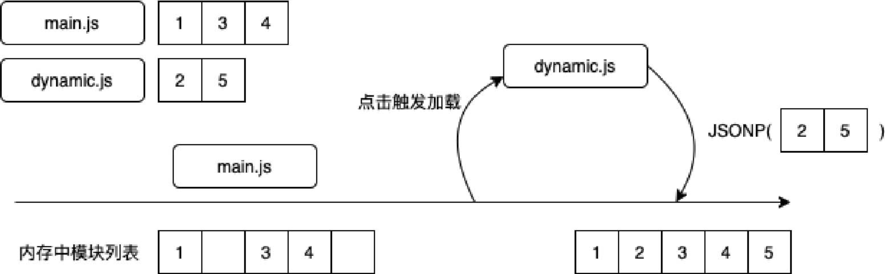

> 在webpack中，webpackJsonp就是为这种场景准备的，这也是当页面上存在多个单独打包的JavaScript文件时产生一些模块冲突的原因，因为不同的webpack Bundle对相互之间需要动态加载的模块顺序和id等一无所知，而它们在动态加载时默认采用的是全局方法webpackJsonp

#### 代码压缩

Uglify\Terser

从本质上来说，就是把代码解析为AST，AST变换为产出代码更小的AST，最后输出最终代码

#### Vite和Bundleless

## 第18章 服务器端渲染和性能

### 18.1 SSR和同构

Virtual DOM隔离了UI的描述和DOM操作，为同构（SSR与CSR）提供了可能性

### 18.2 SSR的性能优化

1. 缓存
   - LRU缓存替换机制
   - 数据缓存
     - 个性化：又称千人千面，不能在服务器缓存这种数据
     - 非个性化、非实时：一段时间内每个用户访问都是相同 的，可以被服务器缓存
     - 实时数据：不可缓存
   - 组件缓存：组件渲染的缓存需要由“组件相同 + 数据相同”决定，缓存的Cache Key一般包含的也是这两部分。可缓存的组件需要指定一个唯一的name，并把用户传入的数据取特征值（如哈希值）后，组成完整的Cache Key
     - 该组件的渲染不依赖上下文的信息，只依赖传入的数据
     - 该组件同样不应该对上下文产生副作用
   - 资源缓存
   - 页面缓存
2. 数据预取
3. 按需要渲染
4. 流式渲染

## 第19章 WebView和性能

### 19.1 WebView和Native的区别

- 浏览器的解析过程伴随着一些必要资源的网络加载，如HTML和CSS，而Android的资源通常在本地
- 浏览器需要解析CSS的规则生成CSSOM，而Android的样式信息都在XML中，只需要解析一次
- 浏览器在布局过程中需要为DOM Tree应用CSS规则、计算几何信息等，而对于Android来说，只需要组件运行一遍Measure和Layout即可
- 浏览器的光栅化、合成化过程比Android的更加复杂，首屏渲染更慢。当然，这也带来了更好的惯性滚动动画性能等

### 19.2 WebView的通信成本 

一般把这种JavaScript和Native进行通信的机制称为**桥（Bridge）**

#### Javascript调用Native

1. 注入API
2. 拦截URL Scheme
   - 使用起来较为烦琐，而且URL本身可能存在长度限制
3. 拦截prompt方法
   - 参数长度有限制
   - 解决了URL Scheme没有返回值的问题

#### Native调用Javascript

1. evaluateJavascript
   - 安卓4.4及之后版本才支持
2. loadURL

#### 双向通信

为了保证可以双向通信，需要在单向通信的基础上实现双向通信，这个过程可以参考**JSON-RPC**的实现方式

1. 一侧发起请求到另一侧，携带一个UUID，并在等待列表中注册UUID和对应的回调
2. 另一侧响应请求，处理完成后把结果带着UUID调用返回原请求侧

#### 通信对性能的影响

> 大部分通信过程**伴随着序列化和反序列化**，其中URL和prompt拦截等方法，在遇到过长的数据时还会被迫采用**分块传输**，或者让Native主动再调用一次JavaScript以获取额外的参数，这会进一步影响性能
>
> 这种通信从本质上来说是异步跨进程的，一次调用意味着从JavaScript→Native→JavaScript

### 19.3 React Native的懒加载有何不同

- Web实现：基于`IntersectionObserver`
- 基于滚动容器的懒加载
- 基于位置获取的懒加载
- 虚拟列表

### 19.4 React Native如何减小打包体积

### 19.5 API并行请求

## 第20章 CDN和性能

### 20.1 什么是CDN

就近访问的能力需要依赖域名解析（DNS）

CDN服务商的DNS记录使用的**都是CNAME域名而不是A记录**，因为A记录只能是一个固定的IP地址，而CDN服务商需要根据地区把同一个域名解析到不同的就近IP地址上。所以，在大部分情况下**都会让使用方通过配置CNAME域名来重定向到CDN服务商的域名，而CDN服务商再通过分地区解析的功能把这些域名指向距离最近的边缘节点**

**Vary Header是一个容易被忽略的Request Header，用于告知CDN哪些Header应该作为区分缓存的依据**

cache-control中还可以使用**s-maxage=3600**来告知CDN在CDN侧的缓存策略中用这个逻辑覆盖max-age，即在CDN上缓存3600s，而在客户端上缓存30s（通过max-age=30）

### 20.2 如何提升缓存命中率

> CDN可以在离用户最近的节点上直接把缓存响应给用户，从而达到最高的性能。当无法在L1/L2找到可用的缓存时，即未命中缓存，CDN就需要回源到源站服务器来获取内容再返回给用户

> 对于大部分CDN服务商来说，可以认为如果Response Header中的**age > 0则表示命中缓存**，如果age不存在或等于0则表示未命中缓存

> 对于大部分CDN服务商来说，可以认为如果Response Header中的age > 0则表示命中缓存，如果age不存在或等于0则表示未命中缓存

### 20.3 动态加速

为了解决这些动态内容的加速问题，CDN服务商提供了动态加速方案：CDN可以**智能地选择最佳的路由进行回源**。CDN节点之间往往拥有更好的网络传输线路，在传输路径较远的情况下，CDN选择回源路由比用户直接访问源站服务器更快，这种技术称为**动态加速**

#### 优点：

1. 海外加速
2. 连接复用
3. 客户端连接复用
4. HTTPS优化：如开启了TLS False Start、OSCP Stapling等
5. 动静分离
6. 压缩：如js、css文件的gzip压缩

### 20.4 自动polyfill

Polyfill.io根据浏览器的需要返回polyfill的服务

#### 实现原理

依据请求头中的`user-agent`字段，匹配是否需要对应特性polyfill

如果需要把文件缓存到CDN侧，那么需要考虑到不同浏览器需要的polyfill不同而进行区分缓存，也就是**需要在Vary Header中设置User-Agent——但需要把user-agent进行归一化，否则会产生多份缓存，导致CDN命中率变低**

### 20.5 边缘计算和性能

>  边缘计算，通俗来说就是把原来只能在服务器端运行的计算、存储等前移到用户附近进行快速响应，而CDN服务商的边缘计算应用走在时代的前列，因为CDN天然具有边缘节点这种大量且在物理距离上接近用户的资源

#### CDN的可编程功能

如通过代码控制CDN节点在接收请求时的行为，如修改Request Header、响应内容、修改回源地址、修改响应内容等

##### 前置重定向

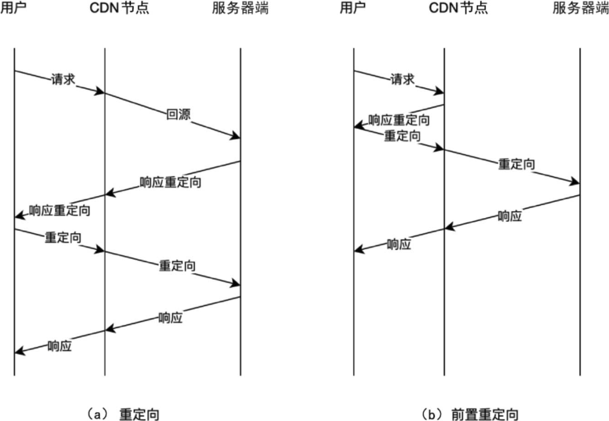

##### 流式渲染

对于不可以缓存的页面，可以通过在HTML中定义可以缓存的部分和不可以缓存的部分，当用户访问页面时直接返回可以缓存的部分。这样浏览器可以很早开始展示一部分内容并加载JavaScript、CSS等资源

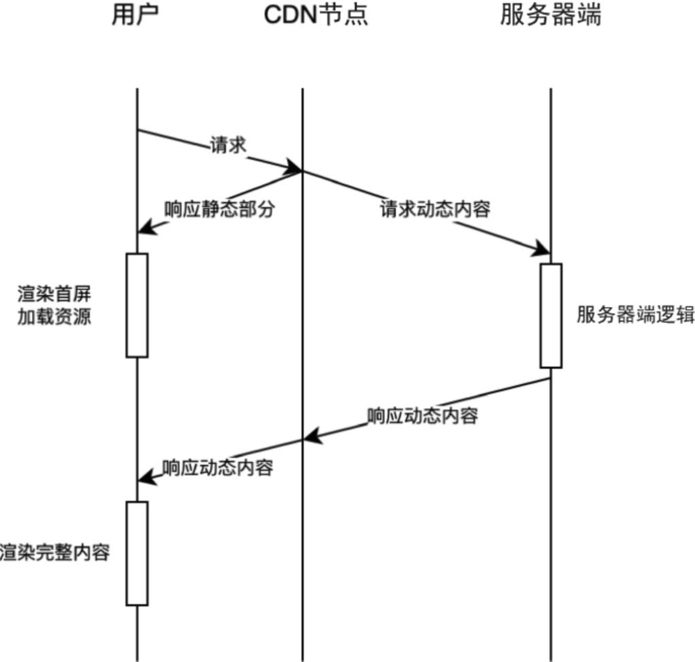
