# 前端技术架构与工程

## 第1章 前端工程化

### 1.1 前端的时代意义

应用程序架构:

- 表现层：负责UI和数据的展示、用户行为的交互、用户输入的收集等，对应到Web领域就是浏览器层。表现层的代码是不安全的
- 表现控制层：负责路由分发、用户输入响应等，简单来说就是负责控制用户能够看到的内容，对应到Web领域可以理解为HTTP服务器、MVC架构模式中的View以及与渲染功能相关的Controller
- 业务逻辑层：负责处理和管理所有的业务逻辑，包括但不限于数据验证、权限管理等
- 数据访问层：负责抽象和封装数据库操作，用于业务逻辑层与数据储存层之间的互动
- 数据储存层：负责数据的持久储存和管理

**关注点分离原则**

将各个层级进行分离、解耦，从而搭建高性能、高可用、可扩展、可伸缩的应用程序架构，同时提高开发团队的迭代和维护效率

### 1.2 架构与工程

> 除了项目本身的复杂度以外，业务的类型、场景、平台、用户群体等特征同样是架构的决定性因素
>
> 任何关于架构的设计和实施必然以业务特征为根本出发点，否则毫无意义
>
> 架构的设计往往需要考虑高可用性、可扩展性、可伸缩性、性能以及安全，要保证项目在多变的生产环境下能够高效且稳定地运行，这些因素同样是从工程角度考虑的要点
>
> 在架构之外，工程从更宏观的角度完善开发和维护流程的管控，强调项目迭代的规范性、有序性、可控性和高效性，并根据架构特征提供额外的辅助功能

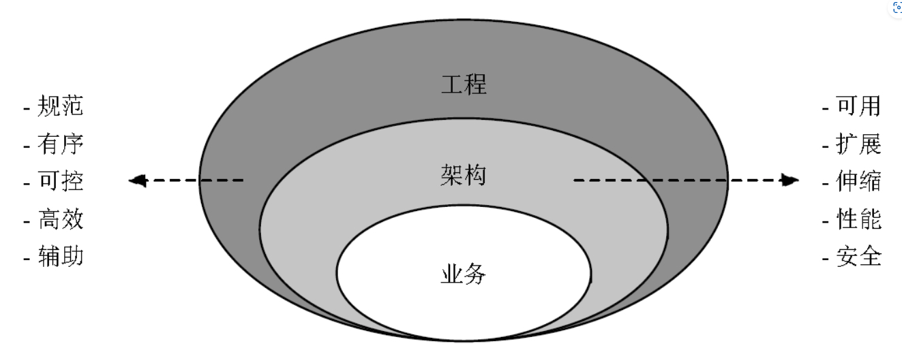

**前端工程化 = 前端技术架构 + 前端工程服务体系**

软件工程与架构着眼于软件的整体，是宏观的概念。将讨论的范畴聚焦于前端（即交互逻辑层），传统的软件工程方法论与架构设计理念并不完全适用，其原因主要有两点：前端技术架构的零散性以及模糊的工程边界

### 1.3 零散的前端架构

完整的前端架构包括以下环节：

- 源码组织规范
- 组件化/模块化
- 数据管理
- 性能优化
- 前后端分离

1. 不同业务类型的技术架构往往包含一些与业务紧密相关的特殊性，而这些特殊的业务类型均在一定程度上造成了前端技术架构的零散性
2. 项目的体量同样影响前端技术架构的设计

**越接近用户的环节技术架构越零散**

### 1.4 模糊的前端工程边界

> 端到端测试指的是将所有组件和模块组装成完整的应用程序后进行的技术性测试，测试范畴包括功能、性能、健壮性、稳定性等

### 1.5 前端架构师的职责

- 根据业务特征设计合理的前端技术架构
- 根据架构特征搭建高效的前端工程服务体系

#### 1.5.1 技术架构

**软件架构的两个基本要素：分治和聚合**

- 编程语言的选择：充分了解语言特性的前提下定制适用于业务类型的开发规范和技术栈
- 编码规范、项目源码的组织结构、依赖管理以及第三方技术选型，技术规范的优劣并没有绝对的评判标准，其唯一的原则是一致性
- 组件化，不仅停留在UI层面，还融入了一些面向对象的理念，比如封装性、扩展性、可组合性、可复用性等
- 前后端分离，将前端开发与后端开发解耦，进而实现开发、维护、部署甚至发布的相对独立性，提高开发效率和快速响应问题
- 性能是评估应用程序高可用性最重要的指标之一，主要分为**加载性能和执行性能**
- **前端架构师需要在深刻理解浏览器渲染原理、编程语言特性、HTTP等知识的前提下制定适用于前端并且与Web整体架构相契合的性能优化策略**

#### 1.5.2 工程服务体系

成本控制是工程的核心关注点，前端工程化最基本的原则是在保证产品功能的前提下尽可能地降低迭代所消耗的成本

##### 1. 开发阶段

根据协作模式的不同可以将开发工作分为**个人独立开发、团队内协作开发和跨团队协作开发**。这三种开发类型各自典型的成本消耗分别为：**个人独立开发过程中由重复性体力劳动所消耗的人力成本**；**团队内多人协作开发过程中由历史代码交接、模块集成所消耗的人力和沟通成本**；**以及跨团队协作开发过程中由各团队技术规范差异和开发进度不同步所消耗的时间、人力和沟通成本**

阶段目标：

- 减少重复性体力劳动
- 建立规范的代码版本管理规范
- 辅助跨团队并行开发

##### 2. 构建阶段

- 编程语言：将源码转换为客户端可执行的代码
- 性能优化：如压缩混淆、动态模块按需加载等
- 部署策略：如给静态资源URL加入Hash指纹和开启CDN加速
- 开发效率：如文档生成、动态构建（HMR）
- 审查评估：如规范审查、性能评估等

##### 3. 测试阶段

##### 4. 部署阶段

部署最核心的地方并不是对不同类型资源的处理，而是对流程的控制

##### 5. 持续化

- 合理地使用工具以提高各个环节独立的工作效率
- 搭建自动化流程来提高跨团队协作开发的效率，降低迭代整体所消耗的时间成本
- 持续化的支持：
  - 前端范畴内的持续化
  - 作为Web应用整体持续化体系的一个子集

##### 6. 监控与统计

### 1.6 总结

始终围绕分层架构中的交互逻辑层展开

- 从前端应用的技术架构本身出发：
  - 关注点：模块解耦、数据管理架构模式、性能以及前后端分离
  - 目标：实现架构的高可用性、可扩展性、可伸缩性，提高独立开发和跨团队开发的效率
- 从架构之外的角度出发
  - 关注点：前端应用的开发、构建、测试、部署及持续化工程体系
  - 目标：建立规范、有序、高效的迭代流程，降低产品迭代所消耗的人力和沟通成功

## 第2章 编程语言

长期使用固定的编程语言很容易令开发者形成思维定式，缺乏跨领域思考和解决问题的能力

从架构层面思考编程语言一是为了选择适用于业务的架构模式和技术选型；二是根据语言特征制定技术规范和开发范式可提高个人以及团队的开发和维护效率；三是由于前端编程语言的单一性，“编程语言仅仅是一种工具”这种论调并不适用于前端

前端技术架构设计中于编程语言层面的考量，包括：

1. 服务端渲染和客户端渲染HTML的对比
2. 使用预编译和后编译技术弥补CSS编程的缺陷
3. 为JavaScript加入强类型和数据不可变性的必要性
4.  JavaScript异步编程的方案选择

### 2.1 HTML

#### 2.1.1 SSR

#### 2.1.2 CSR

##### Virutal DOM

##### 预渲染

用户从输入网站地址按下回车键到能够看到浏览器中有内容输出，这段时间被称为首页的白屏时间

除去DNS查找、TCP握手等开发者无法干预的浏览器前期工作以外，白屏时间的计时起点为浏览器接收到第一个HTTP响应字节，计时终点为HTML文档开始解析

预渲染与其说是技术上的革新，不如说是交互设计上的优化

##### SEO

- 构建阶段的预渲染

  预渲染静态内容指的是在构建阶段将SPA中与用户无关的内容提前解析为HTML字符串并添加至index.html，这部分内容通常称为静态内容

- 服务器判断如果是爬虫则重定向到预渲染服务器

  更好的做法是在构建阶段将SPA各页面提前解析并存放于预渲染服务器中，在接收到用户请求之后即可立即返回数据，SPA的路由管理必须使用HTML5 History模式而非Hash模式，并且需要服务器支持

重新思考HTML渲染方案的选型，其实并不是非此即彼、非黑即白，现实工作中往往要根据业务特征混合使用两者

### 2.2 CSS

#### 2.2.1 从编程语言的角度思考CSS

#### 2.2.2 Less与PostCSS

PostCSS的内核并不会对CSS做任何转化，而是将原始的CSS代码转化为抽象语法树（Abstract Syntax Tree，简称AST）并传递给各个插件，插件根据用户的配置对AST进行处理后还原为最终的CSS代码

#### 2.2.3 CSS in JS

### 2.3 Javascript

语言本身的**灵活性**和实现方案的**多样性**，针对此，约束的途径有两种：**技术选型**与**代码规范**

技术栈又可以细分为**底层技术栈**和**实现层技术栈**，底层技术栈的出发点是“要解决什么问题”，实现层技术栈是在此基础上出于学习曲线、生态等因素的综合评定

代码规范可以细分为**代码风格**和**方案选择**，代码风格与逻辑无关，大都可以用ESLint等工具进行检测和校正。方案选择指的是如果一种逻辑可以用多种方案实现如何选择最合理的方案，典型的案例是JavaScript异步编程，是选择常规的回调函数还是Promise，在Promise基础上使用Generator还是async/await

#### 2.3.1 静态类型

#### 2.3.2 不可变性

JavaScript中函数的传参方式只有一种，即值传参，对于经常被误解的传递对象时，在函数内部进行了修改，外部的对象也会生效，是因为传递的其实是对象的内存地址（指南）的一个拷贝，通过下面的例子就可以说明：

```javascript
function fn(obj) {
  obj = {a: 1};
}
let obj = {a: 0};
fn(obj);
console.log(obj); // {a: 0}
```

obj传入fn后，重新赋值了，但函数执行结束后，obj的值未发生变化，说明传递的是外层obj对象的内存地址的拷贝

**JavaScript函数传参的方式更准确的术语叫作Call by sharing**

#### 2.3.3 异步编程

- 调用栈
- 堆
- 任务队列
- 事件循环

**ESP（Extended Stack Pointer，栈指针寄存器）用于储存调用栈的当前位置**；EIP（Extended Instruction Pointer，指令寄存器）用于储存即将执行程序的内存地址

## 第3章 技术规范

### 3.1 技术选型

- 功能
- 性能
- 稳定性
- 生态
- 学习曲线
- 作者
- 社区
- 开源协议

### 3.2 资源管理

- 将项目文件按照**模块**、**功能**或者**类型**分别存放于不同目录下是资源管理的基本模式
- 分治是资源管理的核心思想

#### 3.2.1 目录结构

通用原则：

- 源码文件单独目录存放
- 构建产出文件单独目录存放
- 第三方框架/工具单独目录存放
- 工程配置文件单独目录存放
- 单元测试文件单独目录存放
- 媒体资源（图片/视频/字体等）单独目录存放

#### 3.2.2 命名规范

命名规范的核心是强化文件名称的语义性，其次是格式的统一，目的是力求达到“观其名而知其貌”的效果

> 相对来说，目录结构和命名规范对于体量较小或生命周期很短的项目并没有很强的必要性；而对于架构复杂、模块众多、资源多样的大型项目而言，具有语义性和一致性的目录结构和命名规范能够辅助开发者理解架构模块体系，减少项目交接和多人协作开发过程所消耗的人力和时间成本

### 3.3 编码风格

- 统一：是否及格的底线
- 语义
- 注释
  - 一部分是使用既定的格式对代码的元素进行说明
  - 一部分是在语义化之外，通过自然语言描述以帮助开发者更容易理解源码
- 美观

#### 3.3.1 JavaScript的高性能与易读性

#### 3.3.2 CSS编程范式与面向对象

- OOCSS（Object Oriented CSS——面向对象的CSS）：遵循SOLID原则中的单一职责原则和关注点分离原则

  OOCSS将每个classname视为一个功能单一的CSS组件，业务组件通过组合多个CSS组件实现综合的样式效果，其显著的优点是**可组合性高**，非常适用于可高度扩展的前端项目

- BEM（Block、Element、Modifier）

  是OOCSS方法论的一种实现模式，底层仍然是面向对象的思想

  - Block：代表一个逻辑或功能独立的组件，具有一定的共用性，可以单独作用也可以互相嵌套
  - Element：是Block内部的一个子组件，**仅在Block范畴内使用，不能被外部访问**
  - Modifier：用于描述一个Block或Element的表现或者行为

  BEM规范下的classname的命名格式：*block-name\_\_\<element-name\>--\<modifier-name\>\_\<modifier-value\>*

  - 命名均小写，复合单词用连字符连接
  - Block与Element之间使用双下画线连接
  - Modifier与Block/Element使用双连符连接
  - modifier-name与modifier-value之间使用单下画线连接

## 第4章 组件化

组件化旨在解决的主要现实问题，即**解耦**和**复用**

### 4.1 组件与模块

前端领域内模块和组件的语义为：

- 模块和组件均为可分离的、有独立功能的一种封装对象
- 模块强调功能性，其功能并非一定与视图相关。一个完整的应用程序由多个模块组成
- 组件强调组合性，是一个视图片段的逻辑抽象。粒度比模块细，一个模块可包含一个或多个组件

### 4.2 Web Components

Web Components是W3C推出的一套用于封装具有复用性、互用性前端组件的技术规范，旨在提供一种标准的组件化模式

#### 4.2.1 自定义元素

前端组件必须具备的三要素：结构、表现、行为

##### 扩展原生元素

```javascript
// 编写类继承待扩展的原生元素所对应的接口
class MyButton extends HTMLButtonElement {
	constructor() {
    super();
    this.addEventListener('click', e => alert('Hello my-button'));
  }
}

// 通过customElements.define API进行注册
// 参数1：扩展元素的name，对应扩展原生元素is属性的取值，该参数的命名必须包括边字符“-”，否则报错
// 参数2：构建函数
// 参数3：仅对扩展原生元素有效，因为HTMLElement接口与元素是多对多的关系，必须通过extends指定被扩展的原生元素名称
customElements.define('my-button', MyButton, { extends: 'button' });
```

```html
<button is="my-button">Button</button>
```

##### 新建独立元素

```javascript
class CircularRing extends HTMLElement {
  constructor() {
    super();
  }
  // 元素被插入HTML文档后执行，获取属性后创建CSS和结构
  connectedCallback() {
    // this指向<circular-ring>对应的DOM
    const size = this.getAttribute('radius') * 2;
    const innerColor = this.getAttribute('inner-color');
    const borderColor = this.getAttribute('border-color');
    const borderWidth = this.getAttribute('border-width');
    
    const styles = `
    	width: ${size}px;
    	height: ${size}px;
    	box-sizing: border-box;
    	background-color: ${innerColor};
    	border-radius: 50%;
    	border: solid ${borderWidth}px ${borderColor};
    `;
    this.innerHTML = `<div style='${styles};'></div>`;
  }
}

customElements.define('circular-ring', CircularRing);
```

```html
<circular-ring radius="50" border-width="2" border-color="red" inner-color="yellow"></circular-ring>
```

对于js片段未执行时，浏览器无法解析自定义元素的标签，可以通过CSS3中新增的：defined伪元素选择器代表**自定义元素被注册后的状态**，我们可以使用：not伪元素选择器实现反向选择

```css
circular-ring:not(:defined)::after {
  display: block;
  content: '';
  width: 100px;
  height: 100px;
  background-color: #ddd;
}
```

##### 生命周期

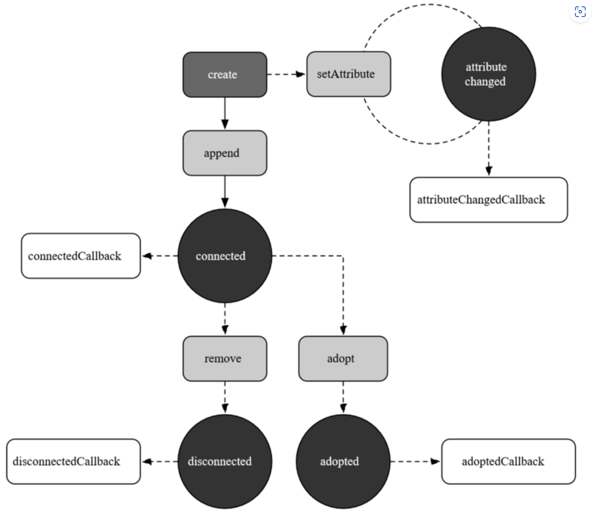

- connectedCallback：当元素被加入HTML文档后触发
- disconnectedCallback：当元素从HTML删除时触发
- attributeChangedCallback：监听元素属性的变化，每次改变后触发
- adoptedCallback：元素被从当前document移动到其他document后触发，比如把iframe中的元素移到主文档中

```html
<!DOCTYPE html>
<html lang="en">

<head>
  <meta charset="UTF-8">
  <meta name="viewport" content="width=device-width, initial-scale=1.0">
  <meta http-equiv="X-UA-Compatible" content="ie=edge">
  <title>Document</title>
  <style>
    my-dialog {
      position: fixed;
      top: 50%;
      left: 50%;
      transform: translate(-50%, -50%);
      padding: 0 20px;
      border: solid 1px #000000;
      border-radius: 2px;
      overflow: hidden;
      display: none;
    }

    my-dialog[open='true'] {
      display: block;
    }

    .my-dialog__close {
      position: absolute;
      top: 0;
      right: 5px;
      border: none;
      font-weight: bold;
      font-size: 24px;
      background: none;
      color: red;
      padding: 0;
      cursor: pointer;
      outline: none;
    }

    .my-dialog__close:focus {
      outline: none;
    }

    .my-dialog__wrapper {
      background-color: #ffffff;
    }

    .my-dialog__head {
      white-space: nowrap;
      text-align: center;
    }

    .my-dialog__content {
      margin: 10px 0;
    }

    .btn {
      height: 30px;
      font-size: 14px;
    }

    #ifr {
      display: block;
      margin-top: 50px;
      width: 100%;
      height: 500px;
    }
  </style>
</head>

<body>
  <button class='btn' id='btn-open-dialog'>Open Dialog</button>
  <button class='btn' id='btn-change-name'>Change Dialog Name</button>
  <button class='btn' id='btn-remove-dialog'>Remove Dialog</button>
  <button class='btn' id='btn-adopt-dialog'>Adopt Dialog</button>
  <iframe frameborder="0" id='ifr'></iframe>
  <script>
    class MyDialog extends HTMLElement {
      static get observedAttributes() {
        // 监听name属性
        return ['name'];
      }
      constructor() {
        super();
        this._close = this._close.bind(this);
      }
      get open() {
        if (this.hasAttribute('open')) {
          return JSON.parse(this.getAttribute('open'));
        }
        return false;
      }
      set open(status) {
        this.setAttribute('open', status);
      }
      get name() {
        return this.getAttribute('name') || '';
      }
      set name(val) {
        this.setAttribute('name', val);
      }
      attributeChangedCallback(name, oldVal, newVal, namespace) {
        console.log(`${name} changed`);
      }
      connectedCallback() {
        console.log('connectedCallback');
        const title = this.getAttribute('title');
        const content = this.getAttribute('content');
        this.innerHTML = `
        <div class='my-dialog__wrapper'>
          <div class='my-dialog__head'>
            <button class='my-dialog__close'>&times;</button>
            <h2 class='my-dialog__title'>${title}</h2>
          </div>
          <div class='my-dialog__body'>
            <div class='my-dialog__content'>${content}</div>
          </div>
        </div>`;
        this.$closeBtn = this.querySelector('.my-dialog__close');
        // 关闭按钮添加click监听
        this.$closeBtn.addEventListener('click', this._close, false);
      }
      disconnectedCallback() {
        console.log('disconnectedCallback');
        // 清除click事件监听
        this.$closeBtn.removeEventListener('click', this._close);
      }
      adoptedCallback(oldDocument, newDocument) {
        console.log('adoptedCallback');
      }
      _close(ev) {
        ev.stopPropagation();
        if (this.open) {
          this.open = false;
        }
      }
    }

    customElements.define('my-dialog', MyDialog);
  </script>
  <script>
    let $dialog = null;
    const $btn_open_dialog = document.getElementById('btn-open-dialog');
    const $btn_remove_dialog = document.getElementById('btn-remove-dialog');
    const $btn_adopt_dialog = document.getElementById('btn-adopt-dialog');
    const $btn_change_name = document.getElementById('btn-change-name');

    const $ifr = document.getElementById('ifr');

    $btn_open_dialog.addEventListener('click', ev => {
      if (!$dialog) {
        createDialog();
      }
      $dialog.open = true;
    }, false);

    $btn_remove_dialog.addEventListener('click', ev => {
      $dialog.parentNode.removeChild($dialog);
    }, false);

    $btn_adopt_dialog.addEventListener('click', ev => {
      const $el = document.adoptNode($dialog);
      $ifr.contentWindow.document.body.appendChild($el);
    }, false);

    $btn_change_name.addEventListener('click', ev => {
      $dialog.name = Math.random();
    }, false);

    function createDialog() {
      $dialog = document.createElement('my-dialog');
      $dialog.setAttribute('title', 'My Dialog Title');
      $dialog.setAttribute('content', 'My dialog content');
      $dialog.setAttribute('name', Math.random());
      document.body.appendChild($dialog);
    }
  </script>
</body>

</html>
```

#### 4.2.2 Shadow DOM

Shadow DOM可以创建一个**与全局隔离的独立作用域**，全局作用域和独立作用域的CSS和JavaScript**互不影响**

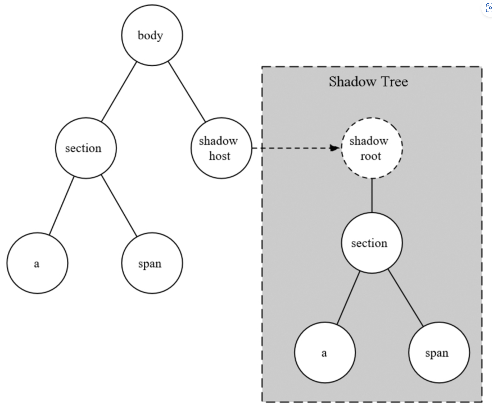

#### 4.2.3 HTML template

template是惰性的：

- 自身以及其内部的所有元素均不会被渲染，视觉上不可见
- 内部的所有元素在被激活之前不会被解析、图片不会被加载、audio和video不会被播放、JavaScript脚本不会被执行
- 内部的所有元素均不存在于文档空间内，无法使用document.querySelector获取它们

Web Components的slot占位符与slot实体之间是引用关系。slot实体仍然存在于文档中，并且与组件的shadow-root平行

完整的代码如下：

```html
<!DOCTYPE html>
<html lang="en">

<head>
  <meta charset="UTF-8">
  <meta name="viewport" content="width=device-width, initial-scale=1.0">
  <meta http-equiv="X-UA-Compatible" content="ie=edge">
  <title>Document</title>
  <style>
    .btn {
      height: 30px;
      font-size: 14px;
    }

    #ifr {
      display: block;
      margin-top: 50px;
      width: 100%;
      height: 500px;
    }

    my-dialog:not(:defined) {
      display: none;
    }

    .dialog__title {
      color: blue;
      font-size: 16px;
      background-color: black;
      color: #ffffff;
      height: 40px;
      line-height: 40px;
    }

    .dialog__content {
      display: flex;
      padding: 0 20px;
    }

    .dialog__content-showcase {
      width: 100px;
    }

    .dialog__content-img {
      width: 100%;
      display: block;
    }

    .dialog__content-author {
      color: #999;
      font-size: 12px;
      text-align: justify;
      word-break: break-word;
    }

    .dialog__content-desc {
      flex: 1;
      margin: 0;
      padding: 0 10px;
    }
  </style>
</head>

<body>
  <h3>My Dialog</h3>
  <button class='btn' id='btn-open-dialog'>Open Dialog</button>
  <button class='btn' id='btn-change-name'>Change Dialog Name</button>
  <button class='btn' id='btn-remove-dialog'>Remove Dialog</button>
  <my-dialog id="dialog">
    <div slot="title" class='dialog__title'>几何建筑</div>
    <section slot="content" class="dialog__content">
      <div class="dialog__content-showcase">
        
        <span class="dialog__content-author">Photo by Ricardo Gomez Angel on Unsplash</span>
      </div>
      <p class="dialog__content-desc">
        几何建筑描述几何建筑描述几何建筑描述几何建筑描述几何建筑描述几何建筑描述几何建筑描述几何建筑描述几何建筑描述几何建筑描述几何建筑描述几何建筑描述几何建筑描述几何建筑描述几何建筑描述几何建筑描述几何建筑描述几何建筑描述几何建筑描述几何建筑描述几何建筑描述几何建筑描述几何建筑描述几何建筑描述几何建筑描述几何建筑描述几何建筑描述
      </p>
    </section>
  </my-dialog>
  <template id='my-dialog-tpl'>
    <style>
      .my-dialog__close {
        position: absolute;
        top: 0;
        right: 5px;
        border: none;
        font-weight: bold;
        font-size: 24px;
        background: none;
        color: red;
        padding: 0;
        cursor: pointer;
        outline: none;
      }

      .my-dialog__close:focus {
        outline: none;
      }

      .my-dialog__wrapper {
        background-color: #ffffff;
        position: fixed;
        top: 50%;
        left: 50%;
        transform: translate(-50%, -50%);
        border: solid 1px #000000;
        border-radius: 2px;
        overflow: hidden;
        display: none;
      }

      .my-dialog__wrapper[open='true'] {
        display: block;
      }

      .my-dialog__head {
        white-space: nowrap;
        text-align: center;
      }

      .my-dialog__content {
        margin: 10px 0;
      }
    </style>
    <div class='my-dialog__wrapper'>
      <div class='my-dialog__head'>
        <button class='my-dialog__close'>&times;</button>
        <slot name="title"></slot>
      </div>
      <div class='my-dialog__body'>
        <div class='my-dialog__content'>
          <slot name="content"></slot>
        </div>
      </div>
    </div>
  </template>
  <script>
    class MyDialog extends HTMLElement {
      static get observedAttributes() {
        // 监听name属性
        return ['name'];
      }
      constructor() {
        super();
        this._shadowRoot = this.attachShadow({ mode: 'open' });
        this._tpl = document.querySelector('#my-dialog-tpl');
        this._close = this._close.bind(this);
      }
      get open() {
        if (this.$wrapper && this.$wrapper.hasAttribute('open')) {
          return JSON.parse(this.$wrapper.getAttribute('open'));
        }
        return false;
      }
      set open(status) {
        this.$wrapper.setAttribute('open', status);
      }
      get name() {
        return this.getAttribute('name') || '';
      }
      set name(val) {
        this.setAttribute('name', val);
      }
      attributeChangedCallback(name, oldVal, newVal, namespace) {
        console.log(`${name} changed`);
      }
      connectedCallback() {
        console.log('connectedCallback');
        this._shadowRoot.appendChild(document.importNode(this._tpl.content, true));

        const title = this.getAttribute('title');
        const content = this.getAttribute('content');
        if (title) {
          const titleNode = document.createElement('h2');
          titleNode.innerHTML = title;
          this._shadowRoot.querySelector('.my-dialog__title').appendChild(titleNode);
        }
        if (content) {
          const contentNode = document.createTextNode(content);
          this._shadowRoot.querySelector('.my-dialog__content').appendChild(contentNode);
        }
        this.$wrapper = this._shadowRoot.querySelector('.my-dialog__wrapper');
        this.$wrapper.setAttribute('open', this.getAttribute('open'));
        this.$closeBtn = this._shadowRoot.querySelector('.my-dialog__close');
        // 关闭按钮添加click监听
        this.$closeBtn.addEventListener('click', this._close, false);
      }
      disconnectedCallback() {
        console.log('disconnectedCallback');
        // 清除click事件监听
        this.$closeBtn.removeEventListener('click', this._close);
      }
      adoptedCallback(oldDocument, newDocument) {
        console.log('adoptedCallback');
      }
      _close(ev) {
        ev.stopPropagation();
        if (this.open) {
          this.open = false;
        }
      }
    }

    customElements.define('my-dialog', MyDialog);
  </script>
  <script>
    const $dialog = document.getElementById('dialog');
    const $btn_open_dialog = document.getElementById('btn-open-dialog');
    const $btn_remove_dialog = document.getElementById('btn-remove-dialog');
    const $btn_change_name = document.getElementById('btn-change-name');

    const $ifr = document.getElementById('ifr');

    $btn_open_dialog.addEventListener('click', ev => {
      $dialog.open = true;
    }, false);

    $btn_remove_dialog.addEventListener('click', ev => {
      $dialog.parentNode.removeChild($dialog);
    }, false);

    $btn_change_name.addEventListener('click', ev => {
      $dialog.name = Math.random();
    }, false);
  </script>
</body>

</html>
```


### 4.3 更友好的编码方式

改善组件使用方式的主要目标是将组件的源码和业务代码分离，保证组件源码的自治性，外层业务代码只需要引用一个JavaScript文件即可使用对应的组件

#### 4.3.1 多文件组件

#### 4.3.2 单文件组件

### 4.4 设计模式

目前Web Components最佳的应用场景是对原生HTML元素进行渐进增强，既不会破坏原有的特性，同时保留了明确的语义。对于复杂的业务组件，Web Components现有的特性尚难以支撑，况且作为Web Components核心的DOM操作是最消耗性能的行为之一

#### 4.4.1 重新思考DOM

在以目前的前端和浏览器技术无法避免DOM操作引起的性能损耗的前提下，从架构模式的角度思考如何更合理地减少DOM操作的频率，将性能的损失控制到最小

#### 4.4.2 生命周期的设计艺术

## 第5章 前后端分离

前后端分离是面向对象思想中关注点分离原则的一种实践模式，是决定前端架构和工程体系的基础

前后端分离是最终的目标而非具体的实施方案，在借鉴或制定前后端分离架构时，一定要以自身业务特征为核心

HTML渲染并不是前后端分离唯一的关注点，会话管理、用户认证和鉴权，甚至跨域处理等细节都需要考虑在内

### 5.1 关注点分离

#### 业务关注点

- 推广产品以争取更多的用户
- 改进产品以提高现有用户黏性

#### 架构关注点

将架构的关注点分解为逻辑、数据、物理、开发

物理方面关注于宏观的系统架构，数据则聚焦于数据库的设计和管理，在分层明确的大型软件架构中，**处于表现层的前端和业务逻辑层的服务端并不会直接接触物理和数据，两者的核心关注点只有逻辑和开发**

#### 工程关注点

- 关注开发的高效产出

- 关注bug的快速解决

实现这两个目标的途径包括**并行开发、单元测试、动静资源分离部署以及前后端开发者明确的职责划分等**

### 5.2 SPA与路由管理

SPA需要从性能优化上花费更多的精力

目前实现前端路由的途径主要有以下两种：

- Hash模式：使用URL的hash标识作为路径标记，通过监听hashchange事件实现回调逻辑
- History模式：使用URL的path作为路径标记，借助History API及其相关事件实现跳转和回调逻辑

#### 5.2.1 Hash模式

##### 优点

1. 不需要服务端支持，是前端完全自主的路由机制
2. 相对于依赖HTML5规范新增History API的History路由，Hash路由在浏览器兼容性方面表现更优

##### API设计

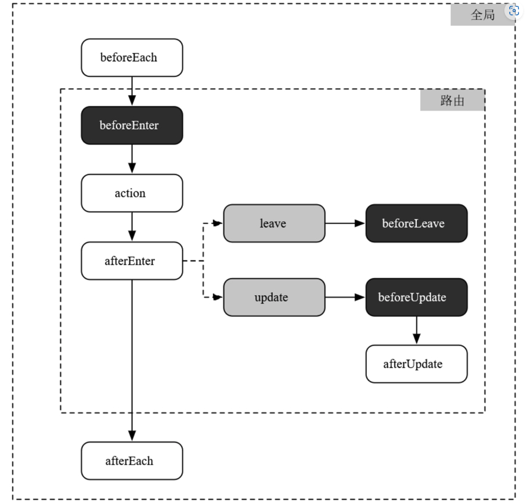

##### 类结构设计

负责外层路由统筹的Router和负责单个路由管理的Route

- **Router类**：维护一个包含所有Route的列表，监听hashchange事件跳转对应的路由，对外开放go和back两个API分别对应跳转和回退

- **Route类**：用户配置的每个路由均对应一个Route实例，维护自己的参数、状态等信息，同时对外开放match和parse两个API，均接受URL的完整路径作为参数，match返回是否匹配自身的路由，parse从匹配成功的路径中解析参数并执行回调

##### 阻塞式钩子函数

#### 5.2.2 History模式

History路由在前后端整体架构上不同于Hash路由**最显著的一点是需要服务端的配合**

History路由支持刷新的前提条件是**服务端将所有子路由的请求rewrite（请注意不是redirect）到根路由**，然后前端在浏览器环境下进行子路由恢复

- 跳转新路径使用history.pushState API，回退和前进使用history.back和history.go API
- 通过监听popstate事件处理路由回调

如果不进行特殊处理的话，仅用**原生的history API**只能监听到路由的回退和前进，而**监听不到新路由的跳转**，实现如下：

```typescript
function createPushStateEvent(state: Record<string, string>):PushStateEvent {
	const ev = new CustomEvent('pushstate');
  ev['state'] = state;
  return <PushStateEvent>ev;
}

window.addEventListener('pushstate', (ev: PushStateEvent) => {
  this._onRouteChange(window.location.pathname, ev.state.name);
});

private _pushState(state: Record<string, string>, path: string) {
  this._history.pushState(state, '', path);
  window.dispatchEvent(createPushStateEvent(state));
}

this._pushState({
  name: targetRoute.name
}, path)
```


关于浏览器的[History API](https://developer.mozilla.org/en-US/docs/Web/API/History/pushState)

### 5.3 Node.js中间层与同构编程

Node.js对前端的革命性影响之一是为前后端同构JavaScript编程提供了可行性

#### 5.3.1 同构Javascript

所谓同构即令JavaScript编写的代码既可以在浏览器端工作，也可以在服务端工作，细化来说，包含三层含义：

1. 语言同构，即客户端与服务端使用同一种语言（最表象）
2. 组件同构，即一个组件同时兼容客户端和服务端的运行环境
3. 功能同构，即客户端与服务端可以实现相同的功能（最终目标）

同构JavaScript的主要功能是**渲染**，而在被浏览器解析之前的HTML文档实质上是无任何平台专属特性的干净文本，所以**同构JavaScript的工作本质上便转化为字符串处理**，这项功能理论上只与JavaScript语言本身相关，与平台无关

需要解决的问题：

- 能够被爬虫抓取的必须是URL路径而非hash片段，所以**前端只能使用History路由**
- 在浏览器环境下从根路径进入子页面的内容与直接打开子页面路径呈现的内容**必须一致**，**Node.js中间层必须建立客户端完全一致的路由映射**
- 浏览器打开子页面路径必须能够立即恢复到与之对应的路由状态和数据，**Node.js中间层必须将子页面的相关数据与HTML内容一同返回给客户端，并且客户端具备可靠的状态恢复机制**

#### 5.3.2 React同构方案

## 第6章 性能

性能是衡量软件架构最基本也是最核心的指标之一，同时也是软件工程旨在解决的重点

### 6.1 性能评估模型

由于Web应用客户端场景的复杂性和碎片化，衡量针对各指标优化的策略是否有价值或者价值有多大必须在横向维度（即在相同客户端场景中）上进行对比才具有参考意义

根据Web应用的特征对客户端场景参数进行细化，可提取出以下三个角度

- 设备特征：包括类型、硬件配置、操作系统以及操作系统版本等
- 浏览器特征：包括品牌、版本等
- 网络情况：包括连接方式（光纤/WiFi/4G等）、运营商、地区、带宽等

绝大多数的性能指标是客观、可量化且与业务无关的，不妨称之为**技术性能指标**；而个别指标与业务存在强耦合关系，称之为业务性能指标。**业务性能指标**穿插在Web应用的**加载阶段**和**可交互阶段**中，根据产品的信息架构，**有时候它们的权重远大于技术性能指标**

#### 加载阶段

1. 从视觉角度提高网站内容的渲染速度，对应白屏时间和首屏时间两项指标
2. 从交互角度缩短从打开网站到可交互之间的时间间隔，对应可交互节点指标

这些指标包括：

- 白屏时间
- 首屏时间
- 可交互节点
- 首次有效绘制
- 广告可视节点

#### 可交互阶段（动态性能）

- 反馈速度

- 动画帧率

- 关键路径渲染（Critical Rendering Path）

  所谓的关键路径指的是与用户操作有关的内容，优化关键路径渲染的目标便是优先显示与用户当前操作相关的内容，降低与操作无关内容的优先级

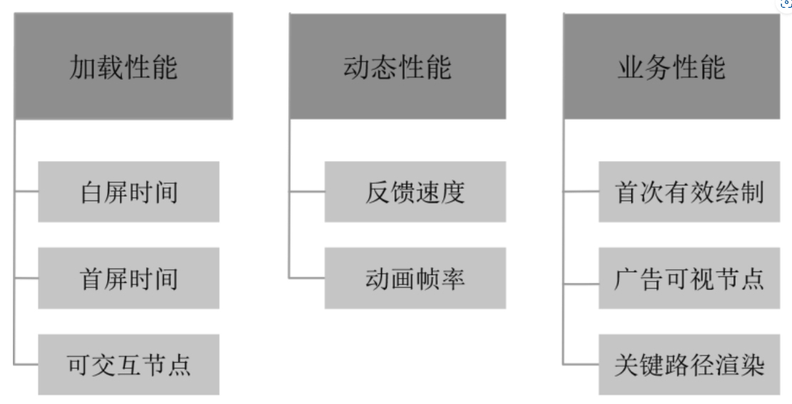


### 6.2 从URL到图像

浏览器架构概览

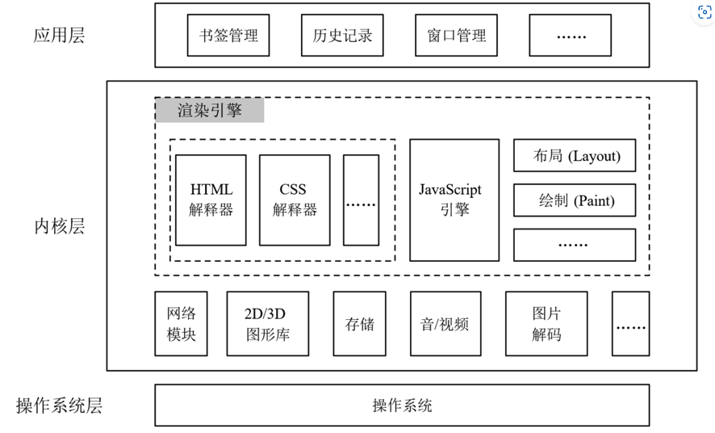

- 应用层包含一些可视的交互功能模块，如书签管理器、窗口管理器等，以及一些不可见的数据管理模块，如历史记录管理等
- 内核层主要包括两部分：一部分为渲染引擎，包括HTML、CSS、SVG等语言的解释器和JavaScript引擎，以及布局、绘制等与渲染相关的模块；另一部分为相对底层的功能模块集合，如多媒体解码器、图形库等
- 操作系统层提供一些浏览器所需的系统API，比如多线程、文件IO等

浏览器解URL的流程：

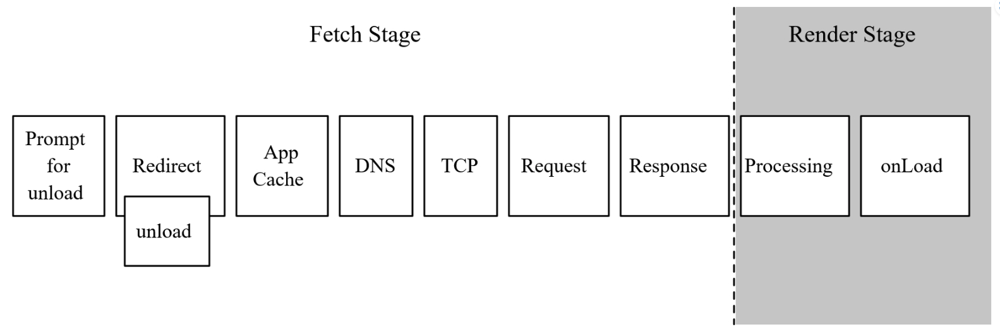

**Fetch阶段**的时间消耗主要取决于网络环境，不受前端逻辑代码的影响

而由于浏览器在解析HTML文档的过程中需要获取HTML文档引用的其他静态资源，所以**Render阶段**的时间消耗受到网络环境和前端逻辑代码的双重影响

#### 6.2.1 网络

Fetch流程

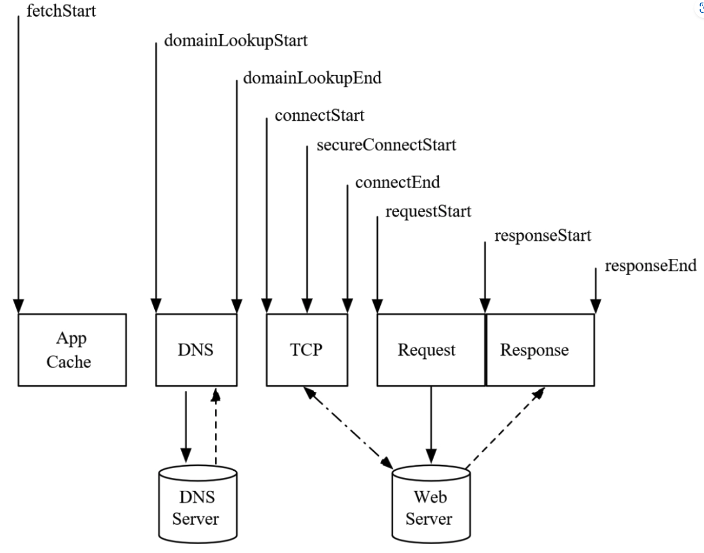


在不考虑当前文档的卸载和重定向处理的前提下，**Fetch阶段的耗时总长便是前文提到的白屏时间**

- DNS查询需要1 RTT（Round-trip delay time，通信往返时间）
- TCP三次握手需要1.5 RTT
- HTTP请求和响应需要1 RTT
- 如果使用HTTPS协议，建立TLS[14]连接还另外需要1 RTT

##### keep-alive

##### HTTP管道

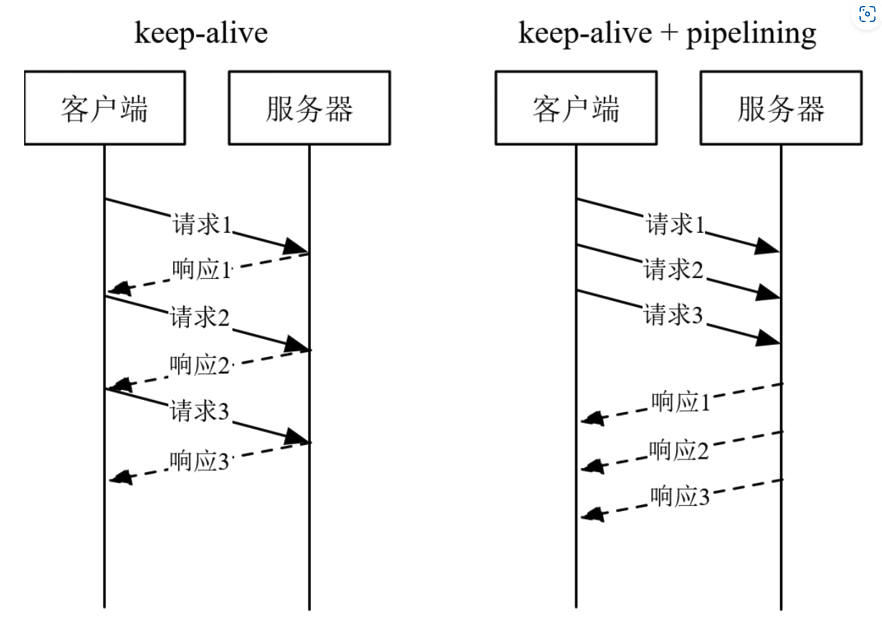

管道技术本质上是一种改进的串行模式，遵循FIFO策略，即HTTP请求队列按顺序发出，同时也必须按发出的顺序接收响应，这会带来**队首阻塞（Head-of-line blocking）**

##### 并行请求

域名发散、域名收敛以及HTTP combo

##### CDN

**最后一公里问题**指的是造成网络延迟的关键往往发生在离用户最近的一段距离上，DNS查询、TCP握手、HTTP请求响应等所有与网络相关的功能**均受到客户端与服务器空间距离的影响**

##### HTTP 2.0

- 二进制
- 分帧
- 流形式传输
- 头压缩
- Server Push（已废弃，参考103状态码）
- HTTP 3.0（QUIC）

#### 6.2.2 渲染

##### defer & async

### 6.3 内存管理

编程语言丰富多样，GC策略也各有各的不同。根据对语言层开放程度的不同可以分为三种：**全GC、无GC和半GC**

#### 6.3.1 GC算法

##### 标记清除算法

标记阶段和清除阶段

**标记阶段**的作用是以根节点作为起点，使用深度优先搜索（depth-first search，简称DFS）算法向下遍历所有对象，并在搜索到的所有对象的头部添加标记

**清除阶段**在标记结果的基础上删除所有未标记的对象，并且清除已标记对象头部中的标记信息以便下一次GC流程能够正常进行

所以通常在清除阶段完成之后会额外地增加一个**合并（coalescing）逻辑**

##### 引用计数法

引用计数（Reference Counting）是IE6和IE7引擎所采用的GC算法，目前在浏览器市场中**已经绝迹**，它存在一个**难以绕过的缺点：无法处理循环引用**

#### 6.3.2 内存泄漏

##### 避免全局变量

##### 谨慎处理闭包

##### 使用编译工具

### 6.4 极限运算性能

#### Web worker与并行计算

Web worker是HTML5规范的一部分[26]，借助它可以在浏览器后台创建一个独立的worker线程运行JavaScript代码，实现多线程并行计算

**Web worker并不是JavaScript语言的一部分，而是浏览器基于JavaScript单线程现状的一种补充技术**，与之类似的如Node.js的child_process和Ruby on Rails的worker_pool等

worker线程**不与主线程共享数据**，并且**有独立的执行上下文，浏览器只允许主线程操作DOM，worker线程不能访问window、document等任何与DOM相关联的全局变量和API**

#### WebAssembly

#### WebGPU

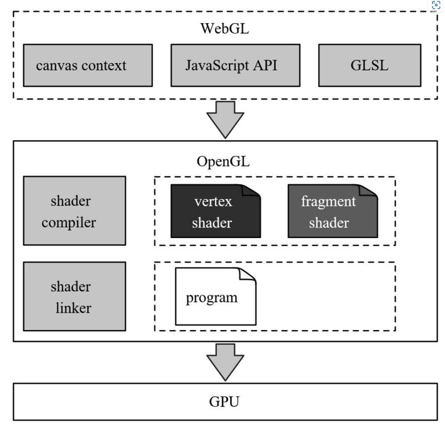

## 第7章 工程思维与服务支撑

### 7.1 工程思维

### 7.2 开发支撑

制约前端开发效率的核心痛点可以概括为两个：一是前端本身的开发效率；二是前后端的协作效率，拆分细化之后提炼如下：

- 大量与业务功能无关的重复性劳动造成的人工和时间消耗
- 前端编程语言的灵活性以及不规范性引起的维护困难
- 前端逻辑依赖后端接口，串行开发造成的累积时间消耗

#### 7.2.1 脚手架

设计原则：

- 从应用的角度要做到样板文件丰富的可配置性，但务必避免烦琐
- 从功能的角度要做到与架构的融合以及与工程体系其他模块的联动和集成
- 从架构的角度要具备高度的可扩展能力，支持二次开发

#### 7.2.2 构建

编译是构建的子集。编译的作用是将源码转化为运行环境可理解、可运行的代码，其功能的核心在于代码格式的“翻译”

构建分为两类：**面向编程语言**的以及**语言之外**的工作，前者聚集于代码的可执行；后者聚集于项目整体的可交付和可维护

前端构建功能模型：

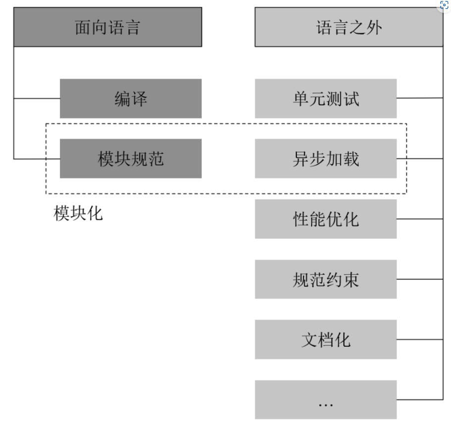

Babel其实是一种source-to-source compiler，或者叫作transpiler（转译器）

- 编译
- 模块化
- 单元测试
- 性能优化

#### 7.2.3 dev server

- 动态编译：
  - 监听
  - 构建
- Mock

#### 7.2.4 源码管理

- Git Flow
- GitHub Flow
- Gitlab Flow

### 7.3 测试支撑

越靠近用户的代码越难测试，作为直接与用户交互的UI层测试之所以难以实施是因为跟底层（服务端）相比，UI的变化非常频繁且极不稳定

前端测试体系：

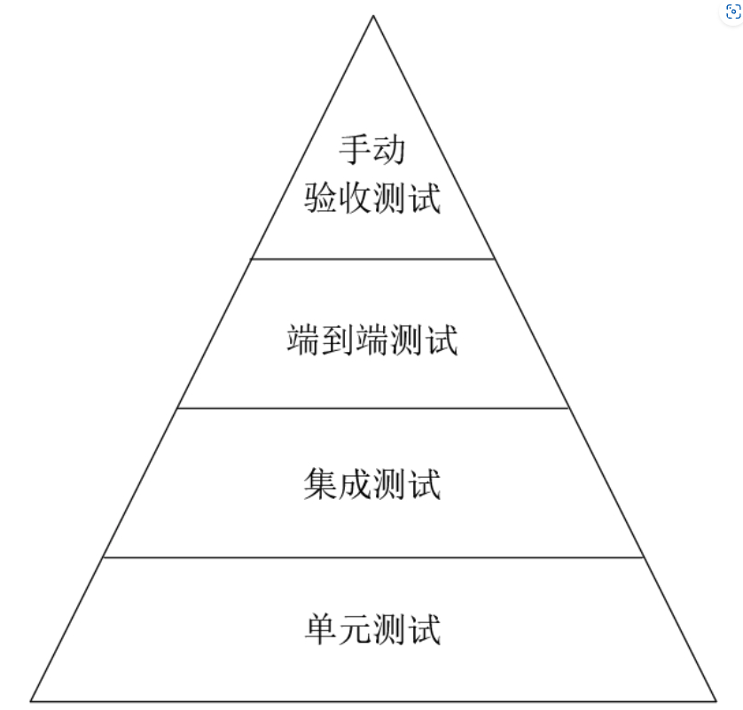

#### 7.3.1 测试模型

- 单元测试

  单元测试必须遵循的一项原则是：单元是与业务功能无关的

  并非所有的JavaScript代码都可以进行单元测试，判定是否可测的界限是：这段代码逻辑是否涉及IO操作，封装单一IO操作的工具函数本身没有任何测试价值

- 集成测试

  封装单一IO操作的工具函数本身没有任何测试价值

- 端到端测试

  从用户的角度验证Web应用的功能和视觉是否符合预期要求，欲达此目的必然要将应用程序运行起来，这是端到端测试相对于单元测试和集成测试最大的区别之一

  对于验证UI，目前的模式基本为：运行应用→截图→图片对比

#### 7.3.2 依赖注入

依赖注入是用于实现测试案例作用域隔离的一种通用手段，简单来说就是**将某个测试单元（函数、类、模块等）依赖的外部单元替换为模拟对象**，这类模拟对象通常被称为测试替身（Test Double）

测试替身根据其作用的不同可以为四类：

- Stub

  **返回固定的预设值或响应固定的预设行为**，而且预设值/行为不会跟随它被调用的方式、参数等因素改变

- Mock

  Mock对象是其对应的真实对象的表象模拟，与Stub不同的是，Mock对象的输出或行为会跟随它被调用的方式、参数等因素做出对应的反馈

- Spy

  Spy是介于Stub和真实对象之间的一种混合体，跟它的名字一样，Spy就像间谍一般**监听真实对象的交互行为，并且在必要的时候用伪装的数据/行为进行真实数据/行为的拦截和替换**

- Fake

  Fake是一种完全模拟真实对象的替身，从概念上跟Spy进行比对：Spy介于Stub和真实对象之间，它只具备两者的部分功能；而Fake则是Stub和真实对象的综合体，它具备两者所有的功能，**最典型的应用场景是仿真测试环境**

#### 7.3.3 前后端集成 

### 7.4 运维支撑

运维人员最重要的工作是保障生产环境的稳定性和安全性，建立一套严谨的运维安全审计系统，或者也可以称为发布风险管理系统，借助跳板机或堡垒机进行授权管理、资源控制、记录审计等运维操作

#### 7.4.1 一键部署

#### 7.4.2 日志埋点

##### 命令式埋点

##### 声明式埋点

#### 7.4.3 性能监控

##### STM：Synthetic Monitoring 合成监控

STM是将应用部署到一个模拟场景中，进而统计各项性能指标，PageSpeed、Lighthouse、WebpageTest等均属于此类，**优点是实现相对简单，缺点是无法完全还原真实的使用场景**

##### RUM：Real User Monitoring 真实用户监控

RUM的实施成本非常高，即需要前端开发者在应用代码的指定位置埋入统计日志，也需要服务器开发专用的日志收集和分析服务

## 第8章 DevOps与Serverless

### 8.1 DevOps与敏捷开发

DevOps倡导运维工程师在迭代初期便加入项目组，及早说明各自需求并且在必要的时刻及时进行干预，尽量减少不可预估的风险发生

#### 8.1.1 敏捷开发

- 敏捷不是为了快速交付

- 微内核与微服务

  微内核架构（Microkernel Architecture）也叫作插件架构（Plugins Architecture），顾名思义，这类架构的特点是拥有一个非常“薄”的内核，理想状态下所有具体功能均由插件提供，内核只负责对各个插件进行调度和集成

- 微服务架构

  相对于传统的集中式服务架构，微服务的各项子服务进行解耦分离，从而可以单独迭代和部署，并且可以降低整体服务的宕机风险

#### 8.1.2 DevOps

- 精益思想
  - 精益软件开发理论：Lean software development——LSD
  - 7项原则
- 持续交付
  - Continuous Delivery——CD
  - DevOps并不是一种固定的标准或方法，而是一种指导思想，既包括产品的迭代和发布策略，也包括人与人之间的组织关系，通过不同职能之间的紧密协作以支撑持续交付的可行性
- FEOps

### 8.2 持续交付

持续交付从流程上包含**三个必要因素：持续集成、自动化测试和部署流水线**，三者并不是顺序相接的独立环节，而是**互有相交和依赖关系**

#### 8.2.1 持续集成

普遍认知定性为一种质量反馈机制：高频轻量的集成和构建背后的目标是为了尽早发现代码中隐藏的质量问题

#### 8.2.2 低风险发布

##### 蓝绿部署

搭建一个与生产环境完全一致（或尽可能一致）并且独立的预生产环境，在产品发布至生产环境之前先将其部署至预生产环境

##### 滚动升级

滚动升级（Rolling Upgrade）也叫作渐进部署（Gradual Deployment），顾名思义，这种发布策略的基本思想是将多个服务器按批次递增地更新，适用于有庞大服务器集群的团队和公司

##### 灰度发布

灰度发布又名金丝雀发布（Canary Release），指的是让一部分用户先使用新版本产品，一旦出现问题能够尽量减小受影响的用户数量；如果新版本稳定的话，便不断地增加新版用户直至全部切换至新版，提前体验新版本的用户被称为“金丝雀用户”

除了用于新版本的发布，灰度发布的另一个典型应用场景是A/B测试

### 8.3 Serverless与前端

#### 8.3.1 BFF

BFF全称为Backend For Frontends，即服务于前端的后端,在分层架构上位于应用层和基础服务层中间，从功能上承载渲染、代理和基础服务接口聚合，仍然以交互逻辑为核心，但在一些特定场景下会承载一小部分的业务逻辑

#### 8.3.2 Serverless

Serverless不是一种具体的技术或框架，而是一种软件架构理念，一种基于云的解决方案

CNCF（Cloud Native Computing Foundation，云原生计算基金会）将Serverless定义为：为实现构建和运行不需要服务器管理的应用程序的解决方案

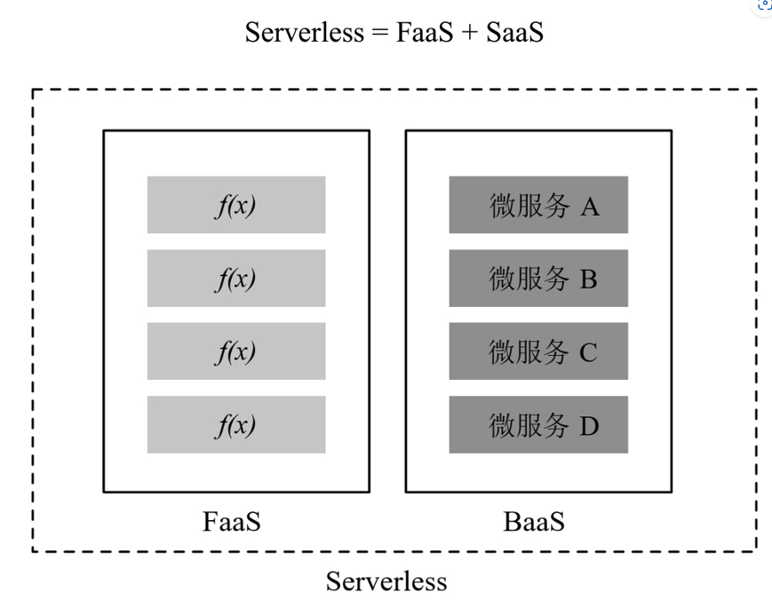

##### FaaS（Function as a Service）

FaaS是运行一个个函数的计算平台，这些函数相对独立、松耦合甚至无耦合

FaaS平台的核心特征是可以根据实际产生的请求量自动地动态加载应用和分配资源，这是Serverless最大的优势之一

##### BaaS（Backend as a Service）

Serverless模式下的服务器扩容或缩容均实现了自动化和动态化，增强了伸缩性并且显著减少了运维人员的工作量

Serverless前后端分工模型

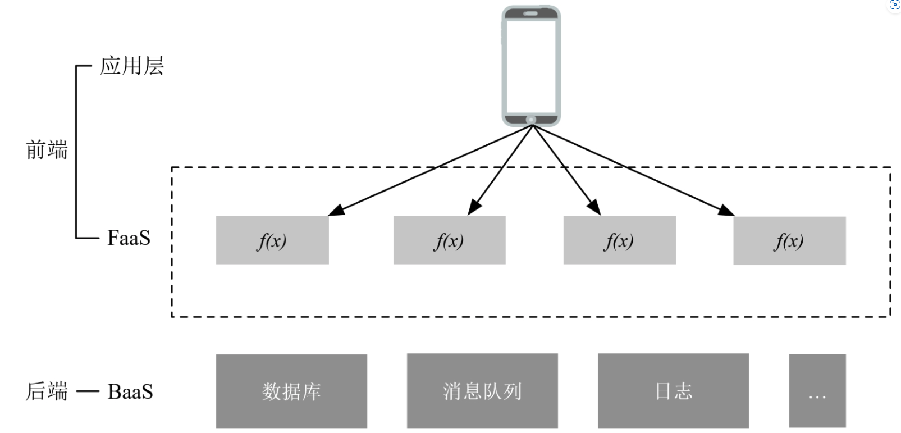


