# 微前端设计与实现

## 第1章 前端概览

### 1.1 微前端应用

理解微服务架构的**复杂性**：它虽然带来涉及不同领域的高度的灵活性和良好的封装，但也增加了系统在可跟踪、自动化以及发现缺陷方面的复杂性

完成业务逻辑之后：

1. 需要知道客户端应该如何调用API
2. 确定一个安全模型
3. 应对微服务的流量变化：峰值流量采取自动扩缩容、缓存等技术
4. 故障时优雅地退化：只隐藏用户界面的对应功能，而不会影响微服务的使用方
5. 能够在多个可用性区域具有弹性容灾的能力
6. 应对各种固有的复杂性：网络、持久层、通信协议、安全性等

> 康威定律（Conway's Law）分析得最到位：“任何组织设计的系统架构都不可避免地反映了该组织的沟通结构。”康威定律所描述的困境或许能用逆康威策略来缓解。逆康威策略建议团队的组织架构应该由期望的项目架构来决定，而不是反其道而行之。

### 1.2 单页应用

如果应用没有设计好，**下载时间可能会成为严重问题**，尤其是在网络连接不稳定的智能手机、平板电脑等移动设备上

渐进式 Web 应用（progressive Web application，**PWA**）。渐进式 Web 应用基于 **Service Worker** 提供了一系列新的能力。**Service Worker 是浏览器在后台独立于网页运行的脚本，用于提供离线体验或推送通知等功能**

离线优先的缓存策略

关于SEO的问题，需要为爬虫制定特别的策略，比如当请求 Netflix 的 Web 应用的用户代理被识别为爬虫时，Netflix 就会将定位机制退化，避免根据 URL 里的国家信息来决定提供什么内容

关于内存泄漏问题：如果代码实现有问题或者没有正确处理不再使用的对象，那么当用户从一个视图跳转到另一个视图时，可能会导致潜在的内存泄漏

关于团队组织方面的问题：大型SPA由多个团队在同一个代码库中共同开发时带来的**沟通成本**

### 1.3 同构应用

#### 优点

- 减少前端请求
- SEO
- 路由管理
  - 在服务器端管理路由，返回静态页面
  - 混合方式，只对第一个视频使用服务端渲染，接着加载单页应用，服务器提供一个全局路由，服务于多个单页应用
- 方便集成A/B测试平台

#### 缺点

- 可扩展性问题
  - 创建合适的缓存策略以降低对服务器的影响

### 1.4 静态页面网站

快速开发不需要长期在线的网站，静态页面网站还是合适的选择

### 1.5 JAMStack

> JAMStack 是一种现代架构，它无须 Web 服务器，而是使用 JavaScript/API 和预渲染好的模板来创建快速、安全的网站和动态 App。实际上，JAMStack 最终输出的就是由前端开发三件套 HTML、CSS 和 JavaScript 实现的静态网站。因为这种网站不需要任何服务器端技术就能工作，所以可以直接交给 CDN。托管 JAMStack 应用的最简单的方式之一就是放到 GitHub Pages 上。Gatsby.js、Next.js 和 Nuxt.js 都是流行的 JAMStack 解决方案

#### 优势

- 性能更好
- 基础设施搭建和维护的成本更低（因为可以部署在CDN上）
- 可扩展性更强（因为只有静态文件）
- 安全性更高（因为攻击面缩小）
- 易于和无头CMS集成

## 第2章 微前端原则

从长远看，维护复杂代码逻辑的努力是不会有什么回报的

长期来看，一些公司在维护大型单体应用时，很难对新功能的迭代提供快速的支持，因而失去了在项目初期所展现的强大动力，公司可能会将复杂的单体应用代码库拆分成多个小型代码库和作用域，这些被称为微服务

采用微服务也有一些缺点。我们**必须在自动化、可观察性以及监控性方面有所投入**，才能实现一个可控的分布式系统。另外一个缺点是容易对微服务边界做出错误的界定

### 2.1 从单体到微服务

项目初期阶段：**验证我们的业务能够成功**

通过最大限度地减少系统外的干扰和专注于最基本的内容，我们能够直接从用户那里收集到有关业务理念的反馈信息。这也被称为**最小可行产品（minimum viable product，MVP）**

这个阶段，单体架构往往是一个很好的选择：

- 实现可观察性非常容易
- 部署过程非常简单：只需考虑如何处理整个API层涉及的自动化策略、部署策略和发布策略
- 横向扩容非常方便

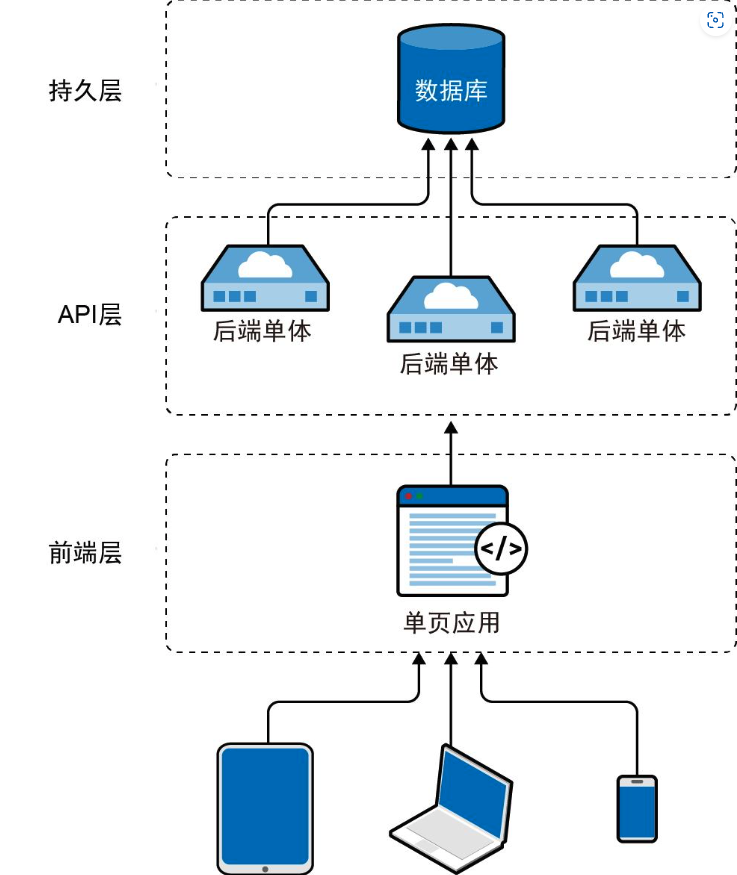

#### 2.1.1 微服务迁移

第二个阶段：系统获取了成功，扩大技术团队的规模，对系统的工作原理有了更深刻的理解，开始拆分单体应用，每个团队负责一组微服务，自行决定选择哪种合适的数据库，如何定义数据结构，采用什么样的缓存策略以及选择哪种编程语言，即：**每个团队都有权做出决策，并对在生产环境中运行的服务负责。除了日志、监控这样的关键性决策，每个团队不再需要遵循整个系统的统一解决方案**

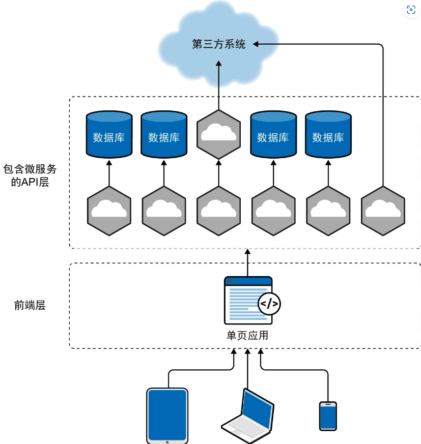

#### 2.1.2 引入微前端

为了复用而过早地对代码抽象化往往弊大于利

在多个项目和团队中复用工具库最终带来的结果是增加复杂性，而非收益

我们是否有机会使用一个广为人知的模式或架构，这种模式或架构具有快速扩充新功能的能力，而且随着业务发展，不需要大规模发布就能交付部分应用功能——答案是肯定的，这就是微前端要解决的问题

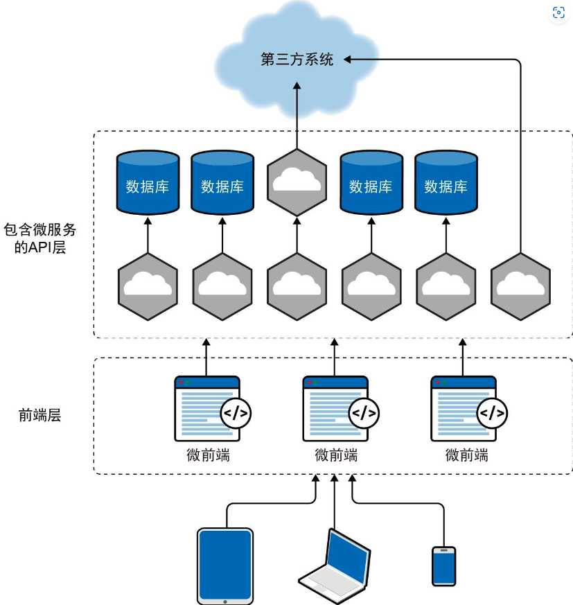

### 2.2 微服务原则

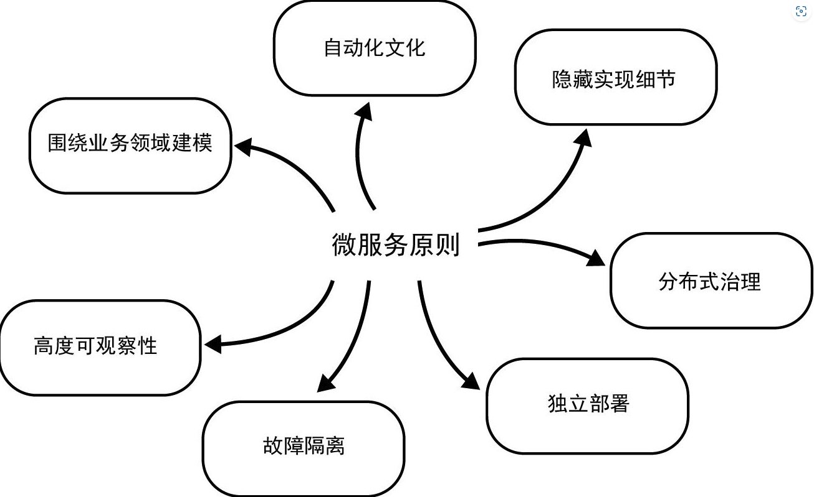

#### 2.2.1 围绕业务领域建模

围绕业务领域建模是领域驱动设计（domain-driven design，DDD）提出的一个重要原则，其出发点是**软件的每一部分都应该反映出组织的工作内容，并且应该在域和子域的基础上利用整个业务中共享的通用语言来设计架构**

#### 2.2.2 自动化文化

强大的自动化文化可以让项目以可靠、快速的方式推进

#### 2.2.3 隐藏实现细节

通过 API 只暴露需要对外暴露的部分，而隐藏其余的实现部分，这样一来，我们就可以按照自己的节奏改变内部逻辑，而不影响系统的其他部分

#### 2.2.4 分布式治理

在单体应用中，许多关键的决策往往是由组织中最有经验的人做出的，但在软件迭代过程上，这些决策经常变为妥协的折中方案。而由于允许团队根据所面临的问题选择不同的技术方向，不是一味妥协，因上经分布式决策可能会对整个系统产生积极的影响

#### 2.2.5 独立部署

独立部署是微服务的关键，降低整个API层受到破坏的可能性，此外，蓝绿部署或灰度发布等可靠的技术能够帮助我们以较低风险发布微服务的新版本

#### 2.2.6 故障隔离

微服务有多种优雅的服务降级模式，其独立部署和独立发布的特性有效地实现了故障隔离

#### 2.2.7 高度可观察性

需要通过日志、监控等各种手段对开发内容的方方面面进行实时监控，保持系统的高度可观察性是微服务面临的主要挑战之一

### 2.3 在微前端中实践这些原则

#### 2.3.1 围绕业务领域建模

遵照领域驱动设计原则为微前端应用建模不仅是可行的，而且是有价值的

#### 2.3.2 自动化文化

我们在采用微前端架构时**必须确保稳固的持续集成、流水线部署以及快速的反馈循环**。在正确的自动化方面花些时间能够促成微前端的顺利采用

#### 2.3.3 隐藏实现细节

在团队之间预先制定一个协议，并让各方在整个开发过程中遵守这个协议是至关重要的

#### 2.3.4 分布式治理

分散团队的决策权，让团队使用正确的方法或工具来完成工作，但需要技术领导层（包括架构师、首席工程师、首席技术官）提供一些“围栏”，指导团队在“围栏”内进行操作

#### 2.3.5 独立部署

微前端允许团队按照自己的计划部署独立的应用

#### 2.3.6 故障隔离

微前端可能需要在运行时构建一个用户界面，这可能会导致网络故障或者出现文件 404 错误。为了避免影响用户体验，我们**必须提供用于替代的内容或者隐藏应用的对应部分**

#### 2.3.7 高度可观察性

前端监控：Sentry 和 LogRocket 等工具的使用

投入更多资源准备随时解决系统故障，而非试图完全预防故障。与其他微服务原则一样，这也适用于前端

**需要意识到微前端会增加项目复杂度，而这种复杂性在其他项目中可能是不必要的，必须弄清何时以及如何正确使用微前端，因为并非所有项目都适合采用这一架构**

### 2.4 微前端不是万能灵药

> 当软件需要不断迭代和长期维护时，当需要多个团队共同开发一个应用时，当我们想以迭代的方式迁移一个旧项目时，微前端是一个明智的选择。但是，微前端对某些应用并不适用，比如服务器端渲染、单页应用或者单 HTML 页面应用

## 第3章 微前端的架构和挑战

### 3.1 微前端决策框架

微前端决策框架：

1. 微前端在架构中的定义：如何定义一个微前端
2. 微前端的组合：如何编排不同的视图
3. 微前端的路由：如何为用户组成最终的视图
4. 微前端之间的通信：微前端之间如何通信和共享数据

#### 3.1.1 定义微前端

需要确定如何从技术视角考虑微前端，并且需要决定是在同一个视图中集成多个微前端（**横向拆分**），还是每个视图只集成一个微前端（**纵向拆分**）

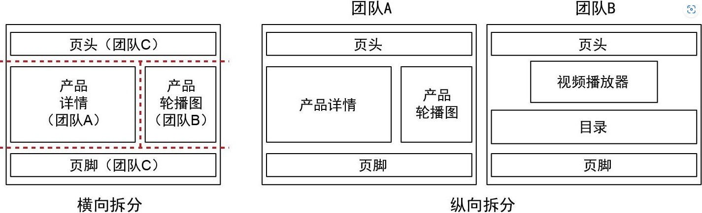

- 横向拆分：灵活性高，但需要更强的规则约束和管理，避免微前端在同一项目中被滥用
- 纵向拆分：每个团队负责一个业务领域，领域驱动设计派上用场

> 领域驱动设计是一种软件开发方法，其开发**工作重点是编写领域模型**，它要求对某一领域的流程和规则有充分的理解。

三种子域类型：

1. 核心子域：解释了一个应用之所以存在的主要原因，其应被视为“一等公民”，因为它们提供的价值高于一切
2. 支持性子域：与核心子域相关，但它的作用不会导致差异化，用于支持核心子域，但在为用户提供真正价值方面，不是必需的
3. 通用子域：用于完成整个平台开发，通常，一些公司会决定使用现成的软件来处理和主要领域并不紧密相关的事务

#### 3.1.2 微前端的领域驱动设计

领域驱动设计中的另一个重要术语是**限界上下文（bounded context）**：一个隐藏了实现细节的逻辑边界，暴露 API 以获取模型层的数据

- 将域和子域所定义的业务问题转化为逻辑问题，从而定义数据模型、代码结构，甚至团队
- 通过在不同上下文之间创建协议（通常用API表示）来定义它们之间的通信方式，使得团队在遵守预定协议的基础上可以同时在不同的子域上工作

> 限界上下文有助于设计系统，但我们仍需要充分理解业务是如何运转的，才能准确地定义项目边界


#### 3.1.3 如何定义限界上下文

1. 避免过早拆分，在最后时刻做出决定，拥有更多的信息和应该遵从的明确方向
2. 定义子域时，要和产品团队或者组织内的领域专家提前沟通，他们可以帮我们定义系统运行的上下文
3. 定义子域通常从数据和指标开始，收集到的数据可以让我们更加清楚如何划分子域，也可以帮助我们确立初始基线并以此为准来观察系统在后续迭代中是否有所改进
4. 投入时间去构建系统的可观察性
5. 横向拆分能够更好地服务于静态页面，比如目录或电子商务，而纵向拆分更适合交互较多的项目，通常，拥有传统的客户端开发经验的人员更适合纵向拆分，而横向拆分需要更多的前期投入以创建可靠且能通过快速反馈来循环迭代的开发体验

#### 3.1.4 微前端组合

构建一个微前端应用有几种方法：

- 客户端组合：App shell 直接从 CDN 加载多个微前端，如果微前端还没有在 CDN 缓存，则从源服务器加载。还可以使用 iframe 的组合来加载不同的微前端，或者在客户端使用一种叫作**Client- Side Include 的嵌入（transclusion）技术**。客户端对组件进行懒加载，然后用组件替换占位符标签
- 边缘侧组合：在 CDN 层构建最终视图（**许多 CDN 提供商为我们提供了一种基于 XML 的标记语言，它被称为 Edge Side Includes【ESI】**），从源服务器查找微前端，并将最终结果交付给客户端
- 服务器端组合：在源服务器组合视图（可以在运行时或编译时进行组合），缓存在 CDN 层，最后提供给客户端

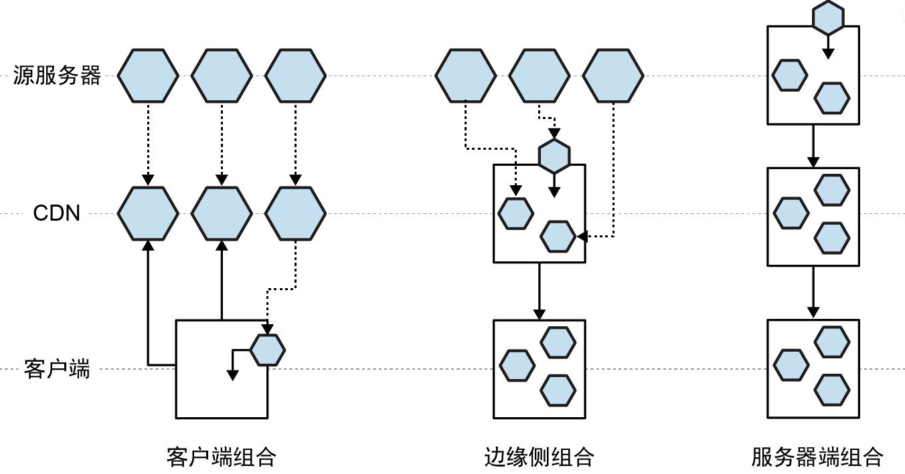

#### 3.1.5 微前端路由

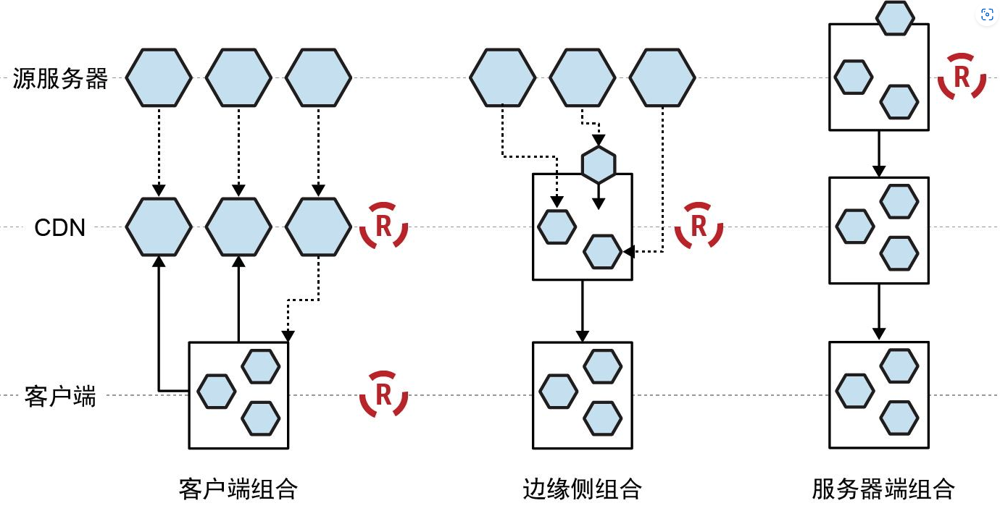

- 服务器端组合：只能对源服务器发起路由请求，考虑高RPS（requests per second）的情况，需要能快速横向扩展，并且每台应用服务器必须能够获取它要提供的页面里的所有微前端
- 边缘侧组合：基于页面URL进行路由，CDN在边缘层通过嵌入来组合微前端以提供被请求的页面，这样就导致不会有太多的空间来创建智能路由
- 客户端组合：可以根据用户的状态来加载微前端，如果使用一个APP shell为单页应用加载微前端，则这个shell负责实现路由逻辑，即先获取路由配置，然后决定加载哪个微前端，对于多页网站，微前端可以通过客户端嵌入的方式来加载

> 如果你的团队有更强的前端技能，强烈建议使用客户端路由，这样基于后端配置使用客户端路由就自然而然了

#### 3.1.6 微前端通信

> 请记住，每个微前端都不应该知晓同一页面上的其他微前端，否则，我们就违反了独立部署的原则

技术选型：

1. 事件总线

   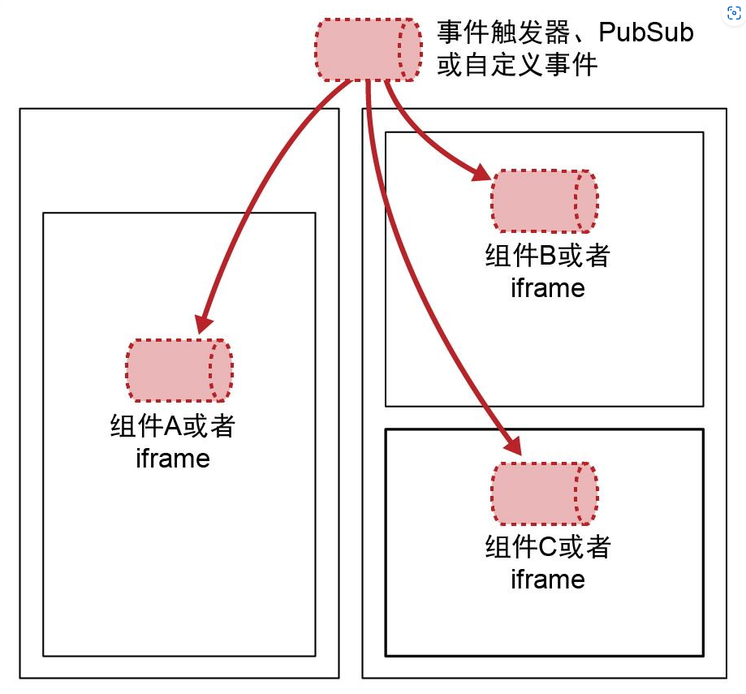

2. 自定义事件

   ```javascript
   new CustomEvent('myCustomEvent', { detail:{someObj: "customData" }})
   ```

   自定义事件应该通过所有微前端都可以使用的一个对象来派发，比如表示浏览器窗口的 window 对象

3. 使用类似Web Storage的SessionStorage、LocalStorage或Cookie

   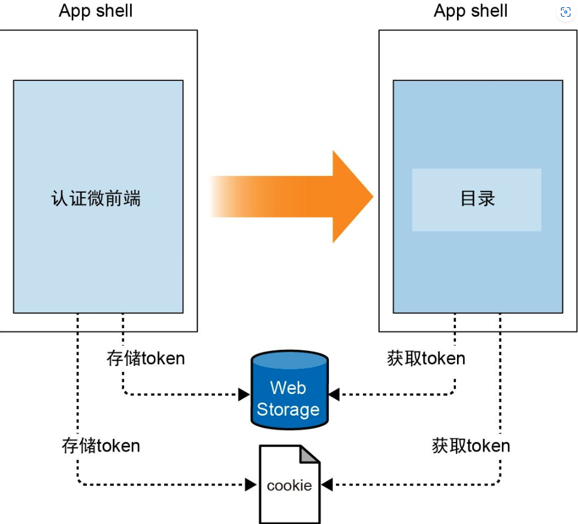

4. 通过查询字符串传递数据。但是，使用查询字符串并不是传递敏感数据（如密码和用户 ID）最安全的方式，如果是通过HTTPS 传输，则还有更好的方法来查询这些信息，所以要谨慎地采用这个方案

   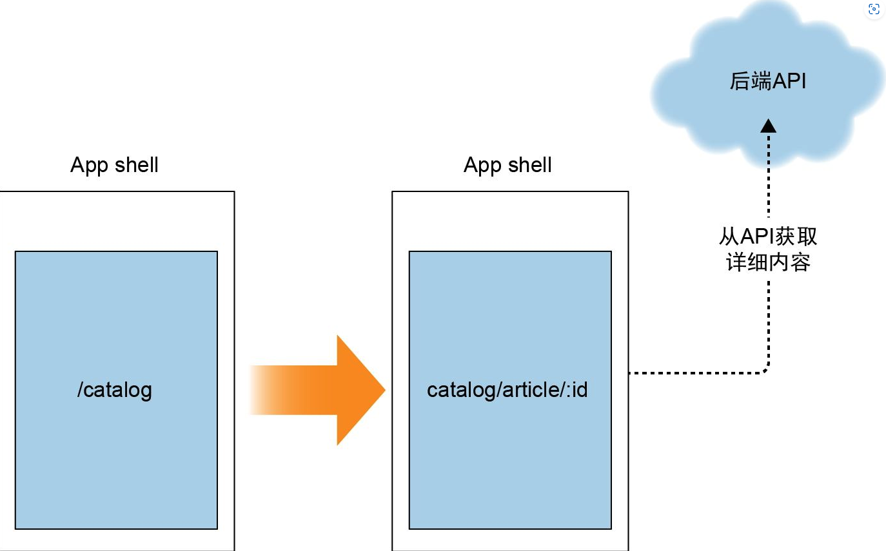

**综上，微前端决策框架由四个关键性决策组成：定义、组合、路由和通信**：

| 微前端定义 |             组合             |              路由              |                         通信                          |
| :--------: | :--------------------------: | :----------------------------: | :---------------------------------------------------: |
|  横向拆分  | 客户端<br>服务器端<br>边缘侧 | 客户端<br/>服务器端<br/>边缘侧 | 事件触发器<br>自定义事件<br>Web Storage<br>查询字符串 |
|  纵向拆分  |      客户端<br>服务器端      | 客户端<br/>服务器端<br/>边缘侧 |              Web Storage<br/>查询字符串               |

### 3.2 微前端实践

## 第4章 探索微前端架构

### 4.1 微前端决策框架的应用

先记住这张图，**微前端决策框架可以帮助你确定应用项目的最佳架构**

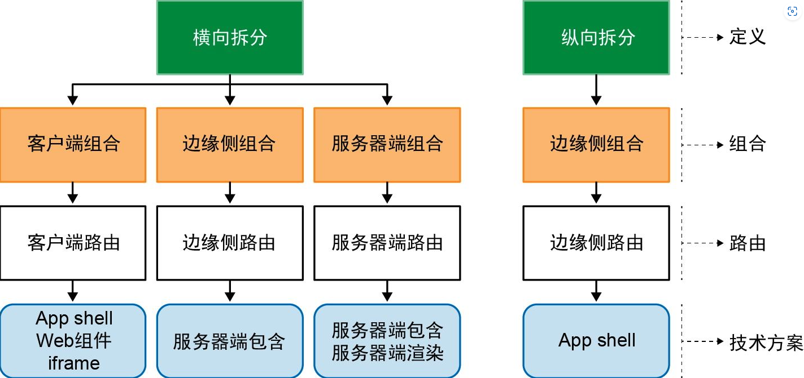

#### 4.1.1 纵向拆分

对于单页应用来说，纵向拆分方式的开发体验最为契合，所以与单页应用相关的工具、最佳实践和模式都可用于微前端开发

在App shell内加载、卸载微前端，微前端与App shell之间可以是一对一的关系，即一次只加载一个微前端，也可以在App shell中利用一个全局路由来加载不同的微前端，而微前端内部的局部路由则由微前端自己控制

> App shell 加载 HTML 文件或者JavaScript 文件作为应用的入口，不应该与其他的微前端共享任何业务逻辑，且不限制微前端使用的技术栈。为了满足未来的系统演进，不应该使用特定的前端框架实现 App shell。如果要自己实现，则使用原生 JavaScript 是一个不错的解决方案。

#### 4.1.2 横向拆分

适用场景：

- 子业务在多个视图中渲染并且子业务的复用性为项目的关键
- SEO是项目的关键，需要使用SSR
- 项目规模大（至少几十人协同开发），不得不拆分成多个子域时
- 面临一个定制化的多租户项目时

组合策略：

- 团队对前端系统比较熟悉或者项目更容易受到大流量和高峰值的影响——客户端组合
- 项目偏静态内容且流量大时，可以让CDN来替你的基础设施承担风险——边缘侧组合
- 在线服务，如资讯网站和电商网站这种被高度索引的——服务器端组合

路由策略：

- 客户端组合——客户端路由
- 边缘侧组合——每个视图对应一个HTML页面，每次访问都是加载一个新的页面
- 服务器端组合——通过服务器端路由，获取匹配的HTML模板

技术方案：

- 客户端组合+路由：最佳方案是让App shell在同一个视图中使用Module Federation这样的插件，或使用iframe，抑或是Web组件来加载多个微前端
- 边缘侧组合：目前唯一可用的方案是使用ESI
- 服务器端组合：使用SSI或众多SSR框架中选择一个适合团队的版本

> 事实上，当选择横向拆分时，应该避免在微前端之间共享任何状态，所以最好采用第 3 章提到的方案，比如事件触发器、自定义事件或响应式流，通过使用发布 / 订阅模式来解耦微前端并让不同视图保持独立。当多个视图必须进行通信时，可以通过查询字符串共享易失性数据，比如产品线标识，还可以利用 Web Storage 或者 cookie 保留持久数据，比如用户 token 或本地用户设置

### 4.2 架构分析

待分析的特征：

- 可部署性：指定环境中部署微前端的可靠性与易用性
- 模块化：易于添加或删除微前端，易于在微前端之间共享组件
- 简单性：运行原理容易理解和上手
- 可测试性：在特定环境中对测试的支持程度
- 性能：Web Vitals
- 开发体验：研发人员在使用开发产品工具时的开发体验，包括但不限于客户端库、SDK、框架、开源代码、工具、API、技术或服务
- 可扩展性：衡量流程、网络、软件或组织在增长和管理新需求时的能力
- 协作：整合或同步团队成员的工作，以便在追求共同目标时保持行动统一

> 在决定架构之前，一定要花时间充分理解运行环境、组织架构和团队间沟通机制。如果忽视这些方面，我们就有可能创造出一个完全不适合公司但是看上去很“伟大”的技术方案。

### 4.3 纵向拆分的架构

> 对于纵向拆分的架构，如前所述的客户端组合、客户端路由和 App shell 对于从未使用过微前端，但具有坚实的单页应用构建背景的团队来说，是非常友好的，因为他们的开发经验大多是通用的。对于有前端开发背景的开发人员来说，这可能也是进入微前端世界最简单的方式。

#### 4.3.1 App shell

> 作为微前端应用的一个持久化的部分，App shell 是当一个微前端应用被访问时最先下载的内容。从用户打开应用到用户离开为止，App shell 一直存在，它会根据用户请求的不同资源去加载和卸载对应的微前端

App shell加载微前端时主要考虑以下几点：

1. 处理用户初始状态（如果有的话）

2. 获取全局配置

3. 获取用户路由并加载对应的微前端

   为了避免不必要的开销，路由配置应该在运行时与对应的微前端一起加载。这就可以在不用重复部署 App shell 的前提下，保证对路由的绝对控制

4. 处理日志、可观察性或与营销相关的库

5. 处理微前端加载失败时的错误

> **永远不要把 App shell 当作一个交互层去使用**，比如在用户会话期间不断地让 App shell 与微前端进行通信。**App shell 只应该用于处理特殊情况或者用在应用初始化时**。如果把它作为微前端之间的共享层，有可能在微前端和 App shell 之间产生逻辑上的耦合，**迫使重新测试或重新部署应用中的所有微前端**。这种情况也被称为**分布式单体（distributed monolith），它是开发人员最糟糕的噩梦**

#### 4.3.2 挑战

##### 1. 共享状态

- 利用Web Storage

  - 加载的第一个微前端通过API获取，但与时间戳一起存到Web Storage
  - 每一个需要这些读取这些信息的微前端在发现时间戳超出预设时间时再次通过API获取
  - 因为纵向拆分，一次只加载一个微前端，所以不需要传递App shell在Web Storage中存储数据
  - 校验，包括存储空间是否足够、存储信息的类型是否正确，由App shell暴露相应的API

##### 2. 组合微前端：**纵向拆分的微前端总是在客户端进行组合和路由的**

  - ES Module：import map

  - SystemJS：SystemJS 是一个模块加载器，它支持 import map 这个目前在浏览器中还没有得到原生支持的规范

  - Module Federation：这是前端打包工具 webpack 5 引入的一个插件，用于加载外部模块和库，甚至用于在一个应用的内部加载另一个应用。这个插件的开发体验和具体实现良好，使用它的时候感觉就像在写一个普通的单页应用一样。这个插件所做的抽象工作使得整个微前端的组合过程几乎没有什么困难。

  - HTML解析：　当一个微前端使用 HTML 页面作为加载入口时，我们可以使用 JavaScript 代码来解析 DOM 元素，并在 App shell 的 DOM 内加载微前端的节点。

    > **cloneNode 或adoptNode 对 script 元素不起作用，因为浏览器不会解析通过这种方法添加的script 元素。在这种情况下，我们需要创建一个新的 script 元素，用于传递在微前端的 HTML 页面中声明的脚本源文件**
    >
    > 这种技术被一些框架所使用，比如 **qiankun**

> 所有这些技术都允许你结合静态路由或动态路由使用。在结合静态路由时，你只需要在代码中硬编码路由的路径。对于动态路由，你可以从一个静态的 JSON 文件中获取所有的路由，以便在应用第一次加载时使用，或者通过开发一个可以被 App shell 访问的接口来动态创建路由，这样就可以根据用户的国家或语言来返回具体的路由清单

##### 3. 多框架方法

不建议在纵向拆分的架构中使用多框架实现

首先，我们会有一个团队负责寻找移植的最佳实践（比如确定有哪些需要跨微前端复用的库），建立自动化流水线，在微前端之间共享代码，等等。

其次，在创建最小可行产品之后，可以将微前端开放给最终用户使用，并统计业务指标，与旧版本进行比较

我们的目标是构建微前端的基础，以便充满信心地快速推进开发工作，减少潜在的错误，将能自动化的工作尽可能地自动化，并在整个团队中培养正确的思维模式

##### 4. 架构演变和代码封装

微前端的模块化性质可以帮助你更好地应对这些挑战，可以为架构如何与业务一起迭代指明一条清晰的道路

当库甚至逻辑被用于多个业务领域中时，可以有以下几个选择

- 复制代码
  - 每当有一个集中管理的库或组件时，必须建立一个可靠的管理机制，以确保当这个共享的库或组件发生更新时，它也会在每个使用这个共享库或组件的微前端中被更新，还必须确保新版本不会破坏任何一个微前端的任何功能，你需要协调多个团队一起升级
  - 当需要复制的代码不是很多时，这种方法效果最好。而当有几十个类似的组件需要复制时，这种方法就不再适用了，需要做的是把它们抽离成一个库
- 将代码抽离到一个共享库中
  - 创建一个共享库有助于保持跨应用的一致性，且可以简化整个平台的整合过程。
  - 在自动化流水线内，你要在每个微前端添加版本检查，以校验微前端是否使用了最新的库版本
- 委托给后端API
  - 将公共功能委托给后端处理，由后端为所有纵向拆分的微前端提供某些配置文件和业务逻辑的实现
- **如果不能正确地抽象，请选择复制代码**
  - 在某些情况下，与过早或仓促地抽象相比，复制代码会带来更多好处

> DRY 是关于知识的重复、意图的重复。它是关于在不同的地方表达同样的内容，而这样的内容在代码层面可能是以完全不同的方式表达的。

#### 4.3.3 实现一个设计竹编

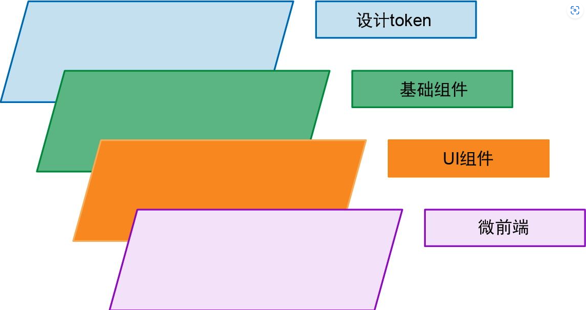

- 第一层：**设计token**，字义产品的一些基础样式，比如字体、文本颜色、文字大小以及最终用户界面中的许多其他特征

  通常情况下，团队没有足够的精力在每个微前端中都实现设计系统级别的组件，因此，如果想这样做，**请确保你有足够的时间和精力来迭代设计系统**

- 第二层：**基础组件**，通常情况下，这些组件不具有业务逻辑，并且组件本身不应该考虑它们的使用场景

  **这是集中代码的最佳阶段**，这些代码将在多个微前端中使用。通过这种方式，我们在 UI 中构建了一致性，使每个团队都能按需使用组件

- 第三层：**UI组件**，通常由基础组件组成，其中包含一些在特定领域内可重复使用的业务逻辑

  > 但是需要注意的是，共享的组件往往不能像我们所期望的那样被大量复用，因为这会导致浪费精力。因此，在抽象一个组件之前要三思而行。如果有不确定的地方，就先复制组件而不是提前抽象，经过几次迭代后，再检查这些组件是否需要被抽象化。错误的抽象要比重复的代码所付出的代价“昂贵”得多

- 最后一层：承载UI组件库的微前端

#### 4.3.4 开发体验

1. 创建一个命令行工具，用一个基准的实现和想在所有的微前端共享的通用库（如日志库）来构建微前端的骨架
2. 创建一个可视化概览页面来汇总分散在不同环境下的微前端版本

#### 4.3.5 搜索引擎优化（SEO）

1. 以容易被爬虫索引的方式来优化应用代码，在这种情况下，开发人员的工作是采用尽可能多的与性能、SEO 有关的最佳实践，以便及时（通常在 5 秒内）渲染整个 DOM
2. 创建一个对爬虫来说有意义的HTML标签，以便爬虫提取内容并对其进行适当分类
3. 动态渲染，为所有试图索引内容的爬虫提供Web应用的优化版本

#### 4.3.6 性能与微前端

一个纵向拆分的架构可以实现良好的性能，这要归功于业务域的正确拆分，以及因此带来的客户端代码的拆分

在纵向拆分的架构上管理性能的一个好做法是引入性能指标。性能指标是一个团队必须达到的硬性要求

#### 4.3.7 可用的框架

有一些框架可用于**支持纵向拆分的架构**

> **在 App shell 的代码库中混入业务逻辑的代码不仅是一种糟糕的做法**，而且从长远来看，代码和逻辑的耦合可能会使接入微前端的所有努力和投入白费

两个完全适配这种架构的框架是 **single-spa** 和 **qiankun**

single-spa是一个轻量级的库，为**微前端的注册**和**生命周期方法**提供了**无差别的重载**

qiankun 是建立在 single-spa 之上的，它增加了 single-spa 最新版本的一些功能

> **Module Federation** 也是实现纵向拆分架构的一个很好的选择，其安装和卸载机制、依赖关系管理、微前端之间的协调以及许多其他功能已经可以使用。Module Federation 通常用于在同一个视图中组合多个微前端（横向拆分）。然而，也可以用它来处理纵向拆分的微前端。

#### 4.3.8 用例

- 有单页应用开发经验，纵向拆分架构是一个不错的解决方案
- 如果是几百名前端在同一个前端应用上工作，那么横向拆分更适合，它可以进一步将应用模块化
- 保持UI和UX的一致性时，纵向拆分可以允许每个团队负责一个特定的业务领域
- 希望在多个微前端中保持高复用性，比如微前端的一部分需要在多个视图中复用，横向拆分则能更好的解决问题
- 微前端新手，推荐首选纵向拆分的架构

#### 4.3.9 架构特征

- 可部署性【5分】

- 模块化【2分】

  - 主要是代码层面共享组件或库，功能层面的共享较少

  - 因要实现新功能而不得不将一个纵向拆分的微前端分割成两个或更多的部分时，由于它被设计成一个独特的逻辑单元，因此需要更大的成本来解耦其中所有的共享依赖关系

- 简单性【4分】

  - 纵向拆分的主要目的就是减少团队的心智负担
  - 对于前端开发人员来说，从 single-spa 或 Module Federation 开始接入微前端的成本应该是最小的

- 可测试性【4分】

- 性能【4分】

  - 与服务器端渲染等其他方法相比，这种方法下载微前端的代码会有延迟，因为App shell 包含一些用来初始化应用的逻辑。当微前端过于复杂或需要多次往返于服务器拉取数据时，这可能会加重微前端的负载

- 开发体验【4分】

- 可扩展性【5分】

  - 可扩展性非常好，特别是通过 CDN 提供静态内容时
  - 有时，我们必须完全避免出现单点故障，这时可以创建一个多 CDN 策略，即微前端由多个 CDN 提供商同时提供服务

- 协作【4分】

  - 决策的高度分散，保障每个团队的自主权

### 4.4 横向拆分的架构

这些架构之所以能够细粒度模块化，是因为多个团队可以对任一视图进行分工协作，从而可以复用不同团队产出的不同微前端模块来组合页面

横向拆分架构实施起来也颇具挑战：

- 依赖可靠的管理手段和定期的审查，保持微前端之间的边界清晰
- 对组织的结构提出了挑战，需要未雨绸缪
- 充分了解沟通的流程和团队的结构，避免太多跨团队的外部依赖
- 积极分享最佳实践，定义团队要遵循的规范，保持良好的自由度，提供个性化且稳定的体验

当使用横向拆分架构时，推荐的一个做法是减少同一视图中的微前端的数量

**组件与微前端的区别：**前者更倾向于暴露多个属性以覆盖不同场景，为不同的用例进行扩展；后者对业务逻辑进行封装，允许微前端之间通过事件进行通信

#### 4.4.1 客户端组合

也有一个用于组成最终视图的App shell，关键区别在于横向拆分中，一个视图是由多个微前端组成的

#### 4.4.2 挑战

##### 1. 微前端通信

- 不要在微前端之间共享状态，这会导致团队之间形成底层耦合，危害到系统的敏捷性和迭代能力
- 为了实现微服务之间的松散耦合，从而实现团队之间的松散耦合，我们使用**编排（choreography）模式**，它使用异步通信，即**事件代理（event broker）**，来通知所有对特定事件感兴趣的消费者
- 开发人员不应该使用共享状态，而应该**积极维护微前端之间的边界**，并使用异步消息传递应该在视图上共享的事件，这对于前端开发人员来说是轻车熟路的处理方法

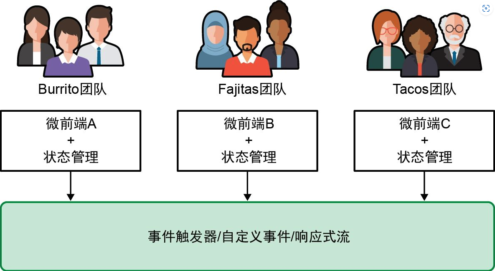

##### 2. CSS类的冲突和避免方法

为每个微前端的每个类名都加上前缀并规范化，以防止重复的名字出现，从而防止产生用户不希望看到的结果

- 块元素修饰符（block element modifier，BEM）
- 将微前端的名称作为类的前缀

##### 3. 多框架方法

性能问题在横向拆分的架构中可能会更大，比如浏览一个视图时下载两个UI库的版本，还可能会出命名冲突

解决的方案：

1. 利用iframe创建沙箱（sandbox）
2. Module Federation允许共享库，并提供一种机制来避免依赖关系的冲突
3. import map为每个依赖关系定义作用域，将同一个库的不同版本定义在不同的作用域
4. Web Component可以利用shadow DOM隐藏实现细节

不建议使用多框架方法

##### 4. 认证

不同的微前端如何安全地拿到和存储同一个认证 token，而不需要多次往返于后端？最佳方案是将 token 存储在 LocalStorage、SessionStorage 或 cookie 中

安全限制：

- 使用LocalStorage或SessionStorage进行存储，则所有微前端域名都必须在同一个子域中
- 存储在cookie中，则所有微前端域名可以是不同的多个子域，但必须在同一个域中

##### 5. 微前端重构

横向拆分的微前端需要维护的逻辑要少得多，更易于重构，虽然需要遵循统一的重构规范，但重构一个设计良好的微前端所需的时间远远少于重构一个大型的单体代码库

#### 4.4.3 搜索引擎优化

> 对于横向拆分的架构来说，动态渲染是一种有效的技术，特别是当决定使用iframe 来封装微前端时。在这种情况下，将爬虫重新定向到静态 HTML 页面的优化版本有助于提高网站在搜索引擎中的排名。总体来说，到目前为止所讨论的关于动态渲染的内容对于客户端的横向拆分架构也是有效的。

#### 4.4.4 开发体验

必须创建一个机制，以避免在生产环境中由于依赖项冲突或者CSS 类相互覆盖而产生运行时问题。同样，必须添加监控工具，以快速发现微前端在生产环境中出现的故障，并为团队提供清晰的信息，以便团队成员能够在自己的微前端中诊断问题

避免问题的最佳办法是保持沟通渠道的畅通，并保持快速的反馈闭环，使所有团队保持同步

必须减少在同一视图中进行开发的团队数量，因为拆分责任往往会导致理解上的偏差

#### 4.4.5 用例

#### 4.4.6 Module Federation

一个 Module Federation 应用由两部分组成：host（本地，代表一个或多个微前端或库的容器）与remote（远程，代表在运行时将被加载到host内的微前端或共享库，remote暴露一个或多个对象）

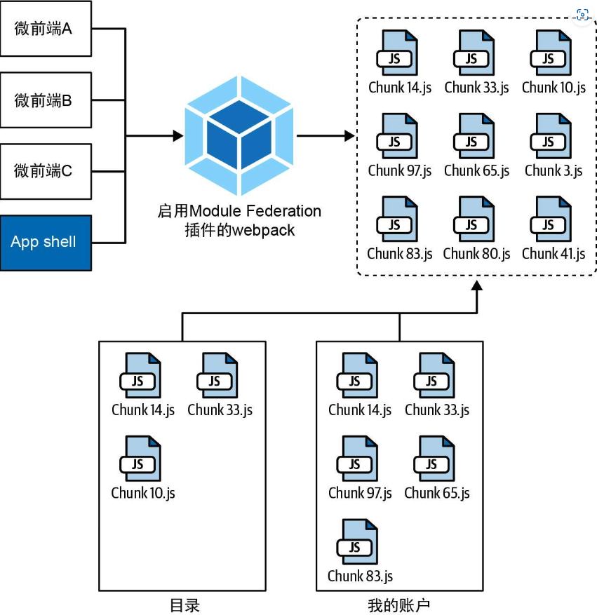

- 简单性与无比顺畅的开发体验
- 能在多个微前端之间共享外部库而不用担心发生冲突

**Model-View-Intent（MVI）是一个完全响应式、基于 RxJS Observables 的单向架构**

#### 4.4.7 iframe

iframe 可能不是微前端的首选方案，但是它的优势在于微前端之间自带沙箱，天然隔离，这是其他解决方案所不具备的特征

这种方式**非常不适合 ToC 的网站**，因为 iframe 会大大降低页面性能。特别是，在一个页面中引入多个 iframe 将**占用大量 CPU 资源**

**ShadowRealm** 是一个类似 iframe 的沙箱，它更轻量级，也更接近现代 Web API，目前已写在TC39委员会的草案中

如果要在微前端间共享大量信息，就不应该选择 iframe

#### 4.4.8 Web Component

React、Angular 和 Vue 等所有主要的 UI 框架都能够生成 Web 组件，而且用于简化创建这种 Web 标准的开源库的数量也在增加，特别是像 Svelte（**可以编译成Web 组件**）和谷歌的 **LitElement** 等项目

Web Component由3部分组成：

1. 自定义元素

   通过回调或事件等方式与外部交互，可以配置要暴露的属性

2. Shadow DOM

   将元素的特性保持为私有状态，不会与文档的其他部分冲突

3. HTML模板

   模板和插槽元素能够编写不在渲染的页面中显示的标签模板。然后，这些模板可以多次重复使用，作为自定义元素的基础结构

确保由 Web 组件包装的微前端应用与视图的其余部分之间的通信以一种解耦和统一的方式运行是非常重要的

鉴于其与所有主要框架的广泛兼容性，Web 组件是在多个项目中使用相同或不同的前端技术栈的完美技术选型

使用 Web 组件的主要挑战是确保合适的微前端颗粒度

#### 4.4.9 服务器端组合

服务器端组合的横向拆分架构是微前端生态系统中**最灵活、最强大的解决方案**，这要归功于云服务

需要优先根据应用的流量模型正确设置基础设施，特别是为了应对流量激增，比如双十一这种，需要通过手动增加基础设施基线来满足预期的负载

了解如何加快服务或者微服务的响应速度，以及是否每次都需要访问，还是可以为特定的微前端缓存响应，而不是追求最终的一致性

#### 4.4.10 边缘侧组合

ESI 并没有带来良好的开发体验，没有多少人使用

## 第5章 微前端技术实现

### 5.1 项目背景

- 客户端组合
- 客户端路由
  - 由微前端容器（App shell）处理的全局路由，用来在微前端之间切换的路由
  - 目录内部的本地子路由
- 通信
  - 使用Web Storage来共享使用经过身份认证的API所需的JWT
  - 同一视图中的微前端之间使用事件触发器进行通信，预先定义每个微前端触发的事件和相关的事件消息结构
- 框架使用
  - Module Federation
  - UI框架使用React

### 5.2 Module Federation入门

重要概念：

- host：在运行时加载共享库、微前端或组件的容器
- remote：要在本地加载的javascript代码包

一个host可以加载多个remote，host代表了App shell，remote代码的一个微前端

共享可以是双向的，remote与host可以共享部分或整个捆绑包，但双向共享会很快让架构变得复杂，所以最好的方法是单向共享

webpack5提供了两个插件：**ContainerPlugin**（负责创建容器，以异步加载和同步运行模块）和**ContainerReferencePlugin**（负责将特定引用添加到容器中，并注入初始包中的代码）

### 5.3 技术实现

#### 5.3.1 项目结构

#### 5.3.2 App shell

App shell 存在于整个用户会话中，不涉及任何业务逻辑，负责实现微前端之间的全局路由，确保正确加载和卸载微前端

使用Module Federation的一个webpack配置的样例：

```json
{
  plugins: [
    new ModuleFederationPlugin({
      name: 'AppShell',
      remotes: {
        // 每个 remote 都由一个 ID 和一个 URL 组成，通过这个 URL 可以加载一个 JavaScript 文件，其中包含对应微前端的代码块地图。这两个值由 @ 符号分隔
        MyAccount: 'MyAccount@http://localhost:3004/remoteEntry.js',
        Catalog: 'Catalog@http://localhost:3002/remoteEntry.js',
        SignIn: 'SignIn@http://localhost:3003/remoteEntry.js',
        // 你可以通过Web URL来指定一个remote的入口
        //SignIn:"SignIn@http://example-url/signin/remoteEntry.js"
      },
      // 微前端共享库
      shared: {
        react: {
          // 只加载一次库
          // 其它值包括：
          // eager：在获取应用程序代码之前加载所有共享库，控制同步或异步加载依赖项，建议异步加载
          // requiredVersion：配置共享库版本，分别使用shareKey属性和shareScope属性配置变量名和共享库的实例化范围
          singleton: true,
        },
        'react-dom': {
          singleton: true,
        },
        'react-router-dom': {
          singleton: true,
        },
        '@material-ui/core': {
          singleton: true,
        },
        '@material-ui/icons': {
          singleton: true,
        },
      },
    }),
  ],
};
```

**关于共享库的版本**

默认情况下Module Federation加载项目配置的共享库的**最新版本**，除非使用requiredVersion属性指定版本，使用shareKey及shareScope可以在同一个应用中维护同一个库的不同版本，为依赖项指定不同的容器

**为了异步加载依赖项，必须将应用的初始化拆分为多个文件，即App shell拆分为3个主要文件：index.js、bootstrap.js和app.js**

1. index.js中只有一句`import("./bootstrap");`

2. bootstrap.js负责实例化App shell并将React应用插入到ID为"root"的HTML模板中的div元素中

   ```react
   import React from "react";
   import ReactDOM from "react-dom";
   import App from "./App";
   ReactDOM.render(<App />, document.getElementById("root"));
   ```

3. 而app.js包含两个重要元素，一个是Main组件，用于实现应用的基本用户界面，一个是React Router，用于处理全局路由

   ```react
   import React from "react";
   import {BrowserRouter as Router} from "react-router-dom";
   import Main from "./Main";
   
   const App = () => {
     return(
       <Router>
         <Main></Main>
       </Router>
     )
   }
   
   export default App;
   ```

#### 5.3.3 身份认证微前端

remote的配置

```json
{
  name: "SignIn",
  // 指定remote的入口文件，这是一个由webpack构建的模块映射表，包含Module Federationl加载的所有需要在App shell中渲染的模块
  filename: "remoteEntry.js",
  exposes: {
    "./SignIn": "./src/SignIn"
  },
  shared: {
    // 我们希望这个微前端中共享的依赖项
  }
}
```

在纵向拆分的架构中，在渲染任何组件之前，每个微前端都应该确认 token 有效，并确认用户的角色（如果有的话）有权访问相应内容

#### 5.3.4 目录微前端

必须实现一个本地路由（微前端层面实现的路由）与全局路由协同工作

#### 5.3.5 账户管理微前端

remote 和 host 的边界很单薄，因为 remote 可以使用 host 的一些库，反之亦然

**建议是强制在 host 和 remote 之间建立层次关系，共享始终是单向的**，以便 host 永远不会对 remote 公开任何模块。这种简单但有效的做法简化了微前端架构的实现，降低了发生错误的潜在风险

要理解微前端的可扩展性：**如果业务域泄露到其所在的容器中，必须检查是在实现一个微前端还是在实现一个组件**

**所有微前端都使用事件触发器来通知业务领域内发生的一些事件，使用这种方法，我们必须正确记录每个微前端正在监听和触发的事件**

当在同一个视图中有多个微前端通过事件相互通信时，我们必须确保所有事件都被相关的微前端捕获，对于异步场景，加载完成之前无法捕获任何事件，**一种可能的解决方案是在应用容器中创建一个事件缓冲区，并在第 3 个微前端完全加载时重放它们**

### 5.4 项目演变

#### 5.4.1 嵌入旧版应用

使用微前端作为包含旧应用的 iframe 的容器来应用**适配器模式**，微前端将负责使用查询字符串控制iframe，拦截来自旧应用的所有消息，并将其转换为事件总线中的事件

#### 5.4.2 开发收银台功能

功能要点：

1. 在App shell上添加购物车组件：组件本身会根据一组条件（比如页面URL）来控制显示或隐藏
2. 展示购物车中的商品总数：通过事件触发器实例触发一个事件，当购物车收到事件时，调用API来获取当前购物车中的商品数量

#### 5.4.3 实现动态远程容器

Module Federation 允许我们直接从 JavaScript 动态加载 remote，而不必在编译时列出应用中可用的每个微前端

此方法还可以**控制流量**，将其指向特定版本的微前端，以降低新版本在大量用户面前出现重大错误的风险

### 5.5 和webpack捆绑

微前端的优势之一在于增量代码重构。

## 第6章 构建和部署微前端

### 6.1 自动化原理

#### 6.1.1 反馈周期尽可能短

> 良好的自动化流水线应该在几秒钟内（最多几分钟内）提供反馈。对开发人员来说，持续收到反馈能够鼓励他们更频繁地使用流水线进行测试并验证结果。所以，分析每个步骤是并行还是串行非常重要。如果有兼顾二者的解决方案则更好

> 由于维护的自动化流水线大同小异，对于新流水线，我们应该采用**基础设施即代码（infrastructure as code，IaC）的原则**，从而无须手动创建新流水线或批量变更流水线

#### 6.1.2 持续迭代

需要定期检查和更新。保持自动化流水线的高效性，让开发人员快速得到反馈

#### 6.1.3 给团队赋能

提倡小团队自定义构建流水线非常重要

> CI/CD 工具应由公司负责，而生成模块的所有脚本和方案应由开发团队负责，因为他们最了解如何用自己编写的代码来优化所负责的模块。这并不意味着要隔离每个团队，只是授权团队自己做出决策，从而得到更好的效果

最后，通过分享想法、概念证明和解决方案的方式鼓励共享和创新的氛围

#### 6.1.4 定义围栏

自动化策略的围栏通常由技术负责人与架构师、平台或云工程师合作确定。各团队以此为边界，为创建微前端创造价值，其具体实现可能包括**用于运行自动化策略的工具**、**用于持续交付所部署的平台**，或者**用于实现架构功能特点的适应度函数**

#### 6.1.5 可靠的测试策略

单元测试、集成测试以及更具挑战的**端到端测试**

### 6.2 开发体验

#### 6.2.1 横向拆分和纵向拆分

1. 纵向拆分：开发体验与传统的单页应用的开发体验非常相似，所有单页应用的工具和工作流在这里都适用；测试阶段也与普通的单页应用非常相似，我们可以配置单元测试、集成测试和端到端测试
2. 横向拆分：一个团队可能负责多个微前端，它们被一个或多个页面使用。需要提供一些工具用于测试这些页面，让开发人员能够查看总体情况、潜在的依赖冲突以及与其他团队负责的业务通信等，**一般都需要定制**

#### 6.2.2 微前端脚手架

一个构建微前端的命令行工具，不仅可以用于创建一个完整的项目框架，让团队拥有编写代码的所有依赖项，还可以整合最佳实践和围栏供公司内部使用

要达到开箱即用体验的另一项投入是提供自动化示例，它包含所有构建微前端的关键步骤

#### 6.2.3 环境策略

中型组织和大型组织最常用的策略是**测试环境**、**预发布环境**和**生产环境**的组合

### 6.3 版本控制

#### 6.3.1 monorepo

优点：

- 代码可复用
- 轻松的团队协作
- 技术债务更少的内聚代码库
- 简化依赖管理
- 大规模代码重构
- 对新员工更友好

挑战：

- 对自动化工具持续投入
- 工具需要和代码库同步扩张
- 项目耦合
- 基于主干开发（基于主干开发是 monorepo 的唯一选择）
- 训练有素的开发人员

**使用 monorepo 就意味着对工具的持续维护、在团队中建立和维护良好的规范以及持续改进代码库**

#### 6.3.2 polyrepo（multi-repo）

优点：

- 每个项目拥有独立的分支策略
- 没有阻碍其他团队的风险
- 重视协议
- 细粒度的访问控制
- 对工具方面的前期投入和长期投入更少

缺点：

- 项目定位困难
- 代码重复
  - 通常，会有几种公共库在多个微前端中被共享，例如日志记录和与可视化集成相关的通用库，但是如果没有良好的管理手段，polyrepo 并不利于代码分享
- 命名约定
- 最佳实践的维护成本

#### 6.3.3 版本控制系统的未来

微前端和微服务的理念是领域驱动设计，所以我们可以**根据子域和限界上下文进行划分，将特定子域里的所有项目绑定在一起**

### 6.4 持续集成策略

#### 6.4.1 测试微前端

1. 端到端测试
2. 纵向拆分的端到端测试难点 ：边界
3. 横向拆分的端到端测试难点：谁负责对最终效果进行端到端测试
4. 测试方案建议
   - 在一个包括所有微前端的稳定环境中进行端到端测试，检查能否按预期正常运行
   - 使用按需环境，在环境中，汇集了测试场景所需的所有资源——比较复杂
   - 代理服务器

#### 6.4.2 适应度函数

> 在由多个模块组成完整平台的分布式系统中，无论团队是集中办公还是分布式办公，系统架构团队都应该有一种方法来衡量其系统架构决策的影响，并确保所有团队都遵循这些决策
>
> 适应度函数为某些架构特征提供了客观的完整性评估

关键的系统架构特征：

- 包体积
- 性能指标
- 静态分析
- 代码覆盖率
- 安全性

#### 6.4.3 微前端特定操作

### 6.5 部署策略

微前端之间如果出现耦合，则有可能**违背**了我们使用这一架构的初衷，给公司带来的问题会多于收益

微服务可以使用像蓝绿部署和灰度发布这样的技术，将部分流量重定向到新的微服务

#### 6.5.1 蓝绿部署和灰度发布

1. 通过客户端的路由机制

   通过cookie或web storage记录用户命中的版本号，当确定发布的微前端没有严重问题时可以更新版本

2. Lambda@Edge 灰度发布

#### 6.5.2 绞杀者模式

绞杀者模式来源于这样一种想法：通过发布应用的部分功能为企业和用户不断提供增量价值，而不是等待全量功能准备就绪再做发布

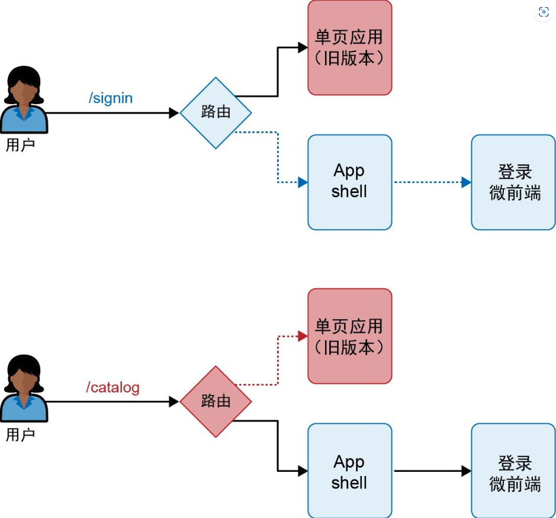

#### 6.5.3 可观察性

在一个成功的微前端架构中，需要着重考虑的最后一个因素是可观察性。可观察性反馈闭环要涵盖上线后的代码，否则，我们将无法对线上关键时期发生的事故做出快速响应

工具： Sentry、New Relic、LogRocket、PagerDuty

## 第7章 案例分析：微前端自动化流水线

### 7.1 场景分析

#### 7.1.1 版本控制

使用monorepo版本控制方案，工具为lerna

代码使用GitHub进行版本控制管理，增加提交时的Lint规则检查

#### 7.1.2 流水线初始化

克隆前端代码（`git clone --depth [depth] [remote-url]`）--> npm/yarn安装依赖

#### 7.1.3 代码质量审查

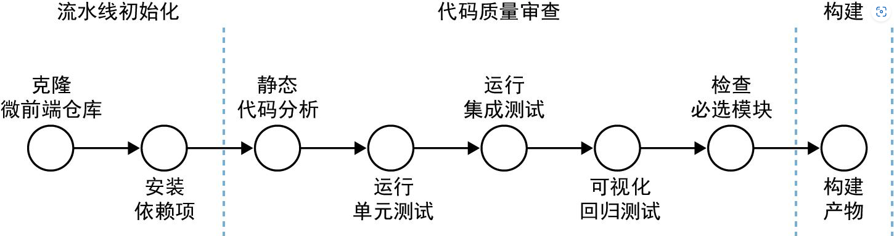

使用SonarQube，它可以计算包括循环复杂度在内的许多指标

使用Jest进行单元测试和集成测试

检查特定库的引入

#### 7.1.4 构建

使用webpack，但允许在一定范围内给团队选择工具的自由，但不要破坏开发边界

#### 7.1.5 构建后检查

端到端测试和性能检查

如果在多个视图中使用微前端，那么应该使用端到端测试检查代码是否可以在微前端的每个视图中正常运行

关于性能检查，推荐Lighthouse CLI或Webhint CLI

#### 7.1.6 部署

存储：AWS的S3云存储

CDN：Amazon的CloudFront

部署：利用AWS的Lambda事件驱动平台，把编译产物中的tar.gz文件解压缩并推送至开发环境使用的存储空间

#### 7.1.7 自动化策略总结

由于自动化策略会随着业务和架构的变化而不断改进，因此在首次应用之后，开发团队和技术负责人还需要经常审查。如果自动化策略很好地满足了微前端的需求，项目成功的概率就更大

应该不断回顾想通过自动化策略实现的目标，这是微前端成功的重要环节

## 第8章 微前端的后端模式

### 8.1 API集成与微前端

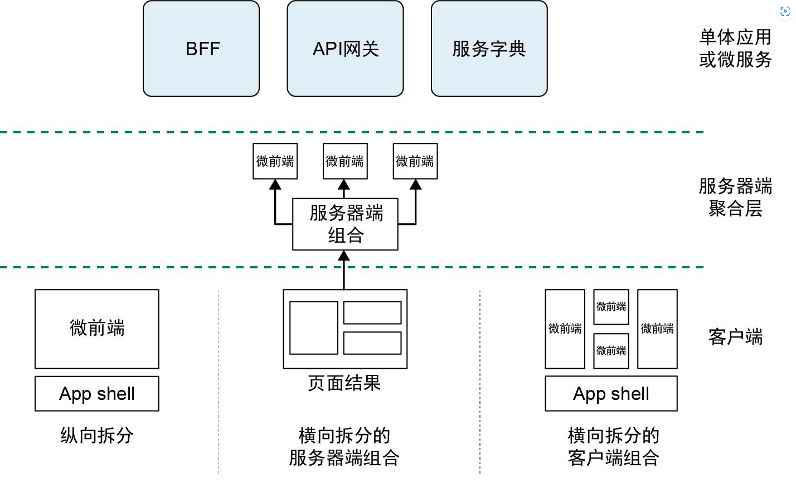

本章将分析以下API的实现模式：

- 服务字典：供客户端调用的服务列表，避免在前端代码中硬编码服务接入点的地址，在微前端首次加载时，服务字典也会被加载
- API网关：作为微服务架构的单一入口点，它还集成了token验证、可视化报告（流量）、限速、BFF等

可以让应用一部分暴露出 BFF 模式的 API，另一部分暴露出服务字典模式的 API，这种处理方式**比较常见**

#### 8.1.1 使用服务字典

**作用：**服务字典只不过是提供给微前端的 API 层的接入点列表，这使得 API 可以直接被调用，而不需要在客户端代码中备份接入点信息，并在持续集成流水线中或共享库中注入它们

**服务字典是通过静态的JSON文件，或者由微前端或App Shell首次调用的API提供，也可以被集成到现有的配置文件或API中，以减少服务器间的数据往返次数，优化客户端的启动性能**

**API 版本化对于确保我们不破坏用户体验非常重要**

接入点可发现性是使用服务字典的另一个原因，如果 API 有新版本可用，或者新的 API 出现在服务字典中，前端团队就会知道，这也证明了开发跨端应用时最好启用跨端团队

通过让服务字典识别的特定请求头在生产环境中测试新的服务接入点。**该服务将解析该请求头的值，并返回一个能够直接在生产环境中测试新接入点的定制化服务字典**

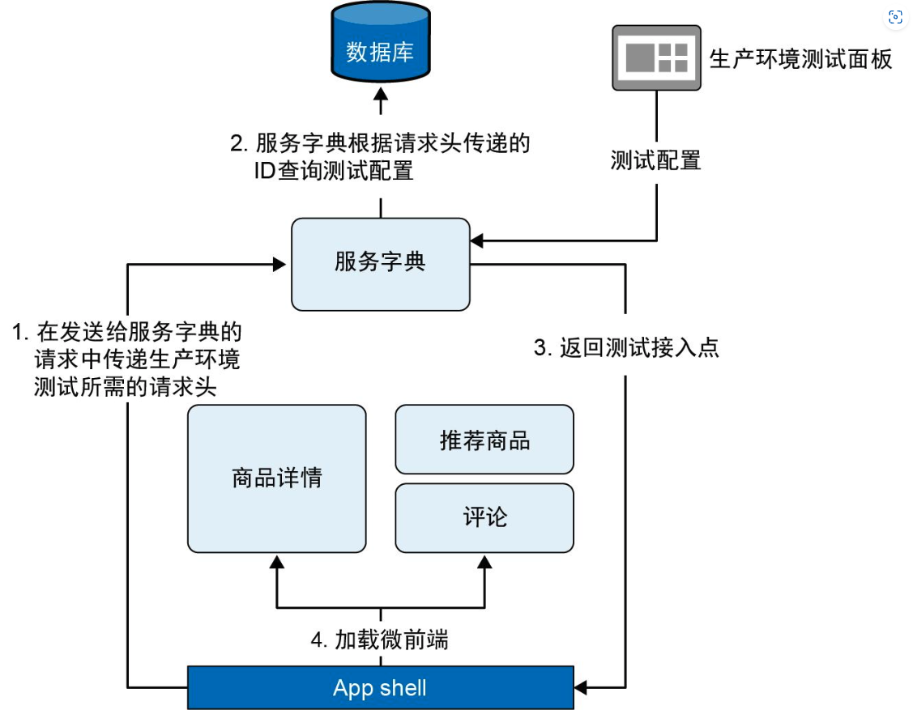

##### 1. 在纵向拆分的架构中实现服务字典

按领域拆分，每个微前端可请求与它的业务领域相关的服务字典，但很多时候由于单页应用不会在下一个用户会话之前重新加载 JavaScript 逻辑，因此单页应用需要一个完整的服务接入点列表，**此时需考虑向App shell提供完整的接入点列表**

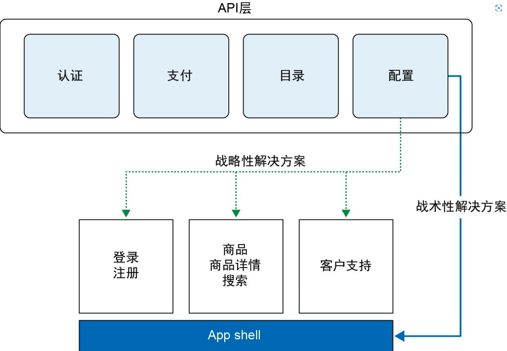

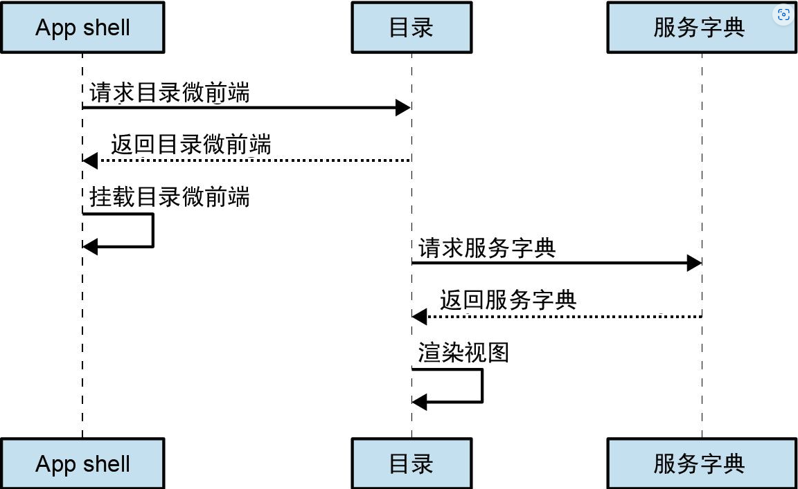

##### 2. 在横向拆分的架构中实现服务字典

对于客户端组合，推荐的方法是在 App shell 或主页内调用服务字典 API，App shell 应该通过 window 对象暴露接入点列表，在技术实现允许的时候使它可以被所有的微前端访问。另一个选择是在每个微前端加载后，将服务字典与其他配置一起注入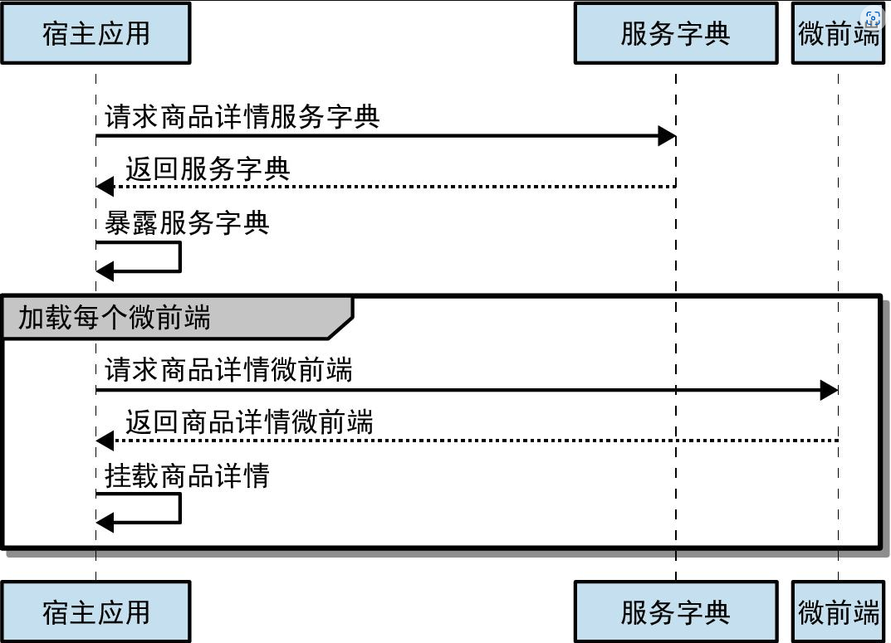

#### 8.1.2 使用API网关

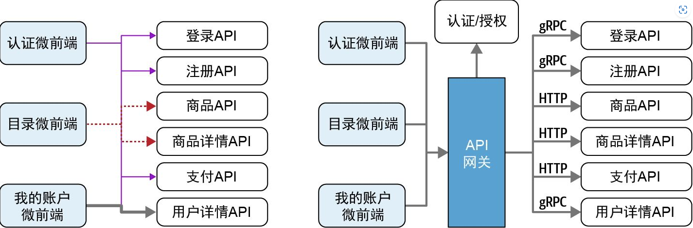

**API层需要集中处理认证、日志、缓存、指标收集、速率限制等边缘函数**

**通过使用 API 网关，可以将具体的通信协议隐藏在 API 网关后面**

缺点：

- 单点故障

  解决办法：API网关集群

- 可维护性：API网关可能会连接很多服务

  - 控制在API网关中添加或删除API的行为
  - 每个业务领域创建一个API入口点
  - 使用API网关和服务字典的客户端组合

- 在客户端与要访问的微服务之间增加了额外的一层，会给系统增加一些延迟

**使用 API 网关的服务器端组合：**


#### 8.1.3 使用BFF模式

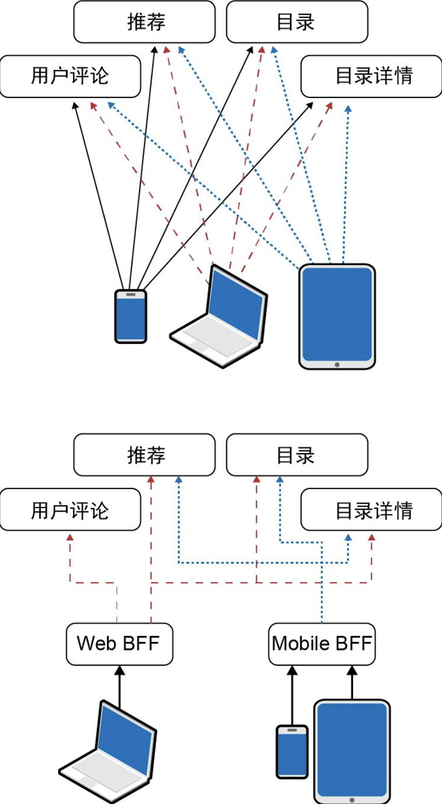

##### 1. 使用BFF和服务字典的客户端组合

##### 2. 使用BFF和服务字典的服务端组合

#### 8.1.4 在微前端中使用GraphQL

GraphQL 是一种 API 查询语言，它在服务器端运行时通过使用你为数据定义的类型系统来执行查询。**GraphQL 代表了一种强大的检索方式**，它用来检索渲染视图所需的数据、解耦 API 层的复杂度、利用图来优化 API 响应，并在组成用户界面时允许客户端减少与服务器的交互次数

我们倾向于不对 GraphQL 入口进行版本管理，不过如果因为不能完全控制访问数据的客户端而必须进行版本管理，我们可以对 GraphQL 接入点进行版本管理

##### 1. 模式联邦

模式联邦是一套工具，用于将多个 GraphQL 模式以声明式组合进单一的数据图中，可以让各个团队在自己的模式上工作，并像传统的数据图那样将其作为单一入口点暴露给客户端

工具：Apollo

##### 2. 将GraphQL与客户端组合的微前端一起使用

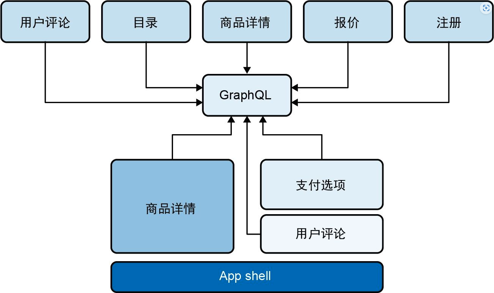

##### 3. 将GraphQL 与服务器端组合的微前端一起使用

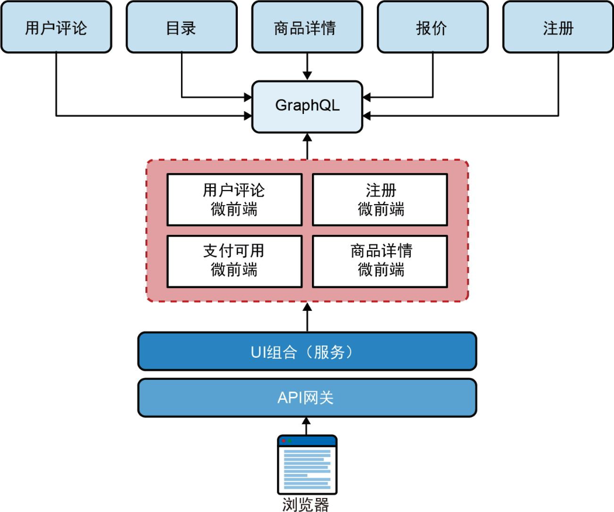

#### 8.1.5 最佳实践

##### 1. 多个微前端调用同一个API

应该问问自己，维护不同、独立的微前端能否给我们的系统带来价值。把它们集合在统一的微前端中会更好吗？如果回答是肯定的，那就表明架构有改进的空间

##### 2. 首先是API，然后是实现

无论在项目中实现什么样的架构，都应该应用 API 优先原则，以确保所有参与的团队对预期结果有着相同的理解

当我们必须在 API 中引入较大变化时，需要采用征求意见稿的方式来更新协议，这将有助于增加业务需求的透明度，促进团队成员分享想法，并通过使用统一的文档来收集意见以协同解决问题

##### 3. API的一致性

在同一个项目上与多个团队合作时，需要克服的另一个困难是创建一致的 API，将API 的各方面标准化，比如错误处理

##### 4. WebSocket 和微前端

应该为整个应用创建唯一的连接，并将 WebSocket 实例注入微前端，或使其对用户会话期间加载的所有微前端可用

当使用横向拆分的架构时，需要在 App shell 中创建 socket 连接，并通过事件触发器或自定义事件将消息或状态变化（错误、退出等）传递给同一视图中的微前端，以管理视图的更新

有些消息是在 App shell 加载微前端时抵达客户端的，在这种情况下，创建一个消息缓冲区可能有助于重放最后的数条消息，并允许微前端在完全加载后一次性捕获这些消息

##### 5. 对正确的子域使用正确的方法

必须在项目初期投入时间，分析每个业务域的边界，并且在每次发现 API 实现方面的问题时对其进行完善，并且这不是一次性的决定，而必须以固定的节奏做出改进和修订，以支持业务的发展

##### 6. 为跨平台的应用设计API

尽可能将配置移到 API 层上

## 第9章 案例分析：从单体架构到微前端

### 9.1 背景

技术部门人员扩充，技术架构调整，同时不能减缓整个部门的开发速度 

#### 9.1.1 技术栈

单体架构：带有只读副本的单一数据库、具有后端自动扩展功能的API层、以及一个前端单页应用

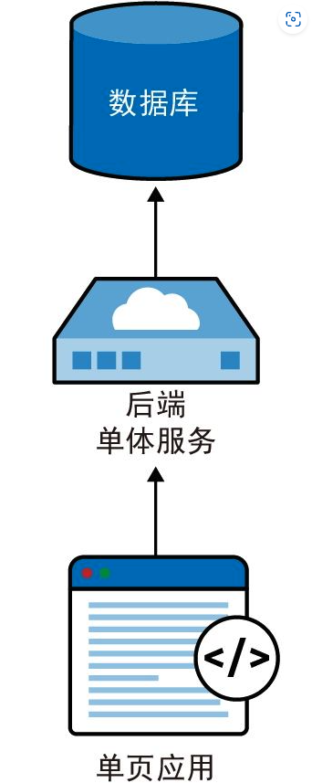

基于架构的能力和开发原则，技术团队提议将后端迁移到微服务，将前端迁移到微前端

#### 9.1.2 平台及主要用户流程

#### 9.1.3 技术目标

- 首要目标还是让开发人员保持无缝的开发体验
- 解耦微前端并允许独立升级和部署，否则耦合在一起的微前端必须同时发布
- 降低在新版本中引入 bug 的风险，缓解新版本的流量，开发人员可以在生产环境中使用真实数据进行测试，但是不会影响所有用户
- 尽快创造价值，让公司能够看到投资的价值回报，即项目收益
- 找到一个合适的团队划分方案，以减少团队对外部的依赖，并降低由于团队大规模增长而增加的沟通成本

### 9.2 迁移策略

需要做出将平台迁移到微前端的**四个决策**，包括**微前端定义、微前端组合、微前端路由以及微前端之间的通信**

#### 9.2.1 微前端决策框架的应用

##### 决策一：采用纵向拆分的架构：

- 相似的开发经验

- 组件可复用性低

- 更好地集成当前的自动化策略

- 没有依赖项冲突的风险

- 用户体验一致性

- 减少认知负荷

  只需要了解和维护平台的一部分功能。同时，开发人员可以在负责的子域内最大限度地做出决策

- 上手更快

  可以使用已有的标准工具

##### 决策二：采用通过App shell的客户端组合

创建一个App shell，负责加载和卸载微前端、提供API、允许微前端之间进行通信，并确保在用户会话期间始终可用

##### 决策三：采用客户端实现的微前端路由

App shell 会根据用户选择的路径来加载对应的微前端。这个机制还必须处理深度链接

##### 决策四：微前端之间的通信

因为使用纵向拆分，只能通过查询字符串或使用Web Storage进行通信，此处选择后者，并将数据存储在App shell中

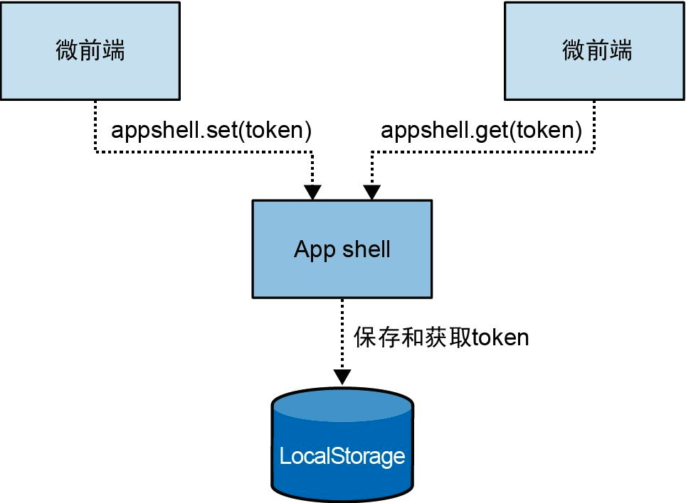

#### 9.2.2 将单页应用拆分为多个子域

通过用户行为埋点数据了解用户的行为交互，从而有助于确定如何将单体应用分割成微前端

#### 9.2.3 技术选型

- React+MobX
- 纵向拆分，一次只加载一个微前端，无须协调有关命名约定的工作，团队之间主要分享最佳实践和方法
- 静态资源缓存到CDN
- 使用 AWS S3 这样的对象进行存储
- 利用 AWS 提供的serverless 计算层 Lambda@Edge做流量分析

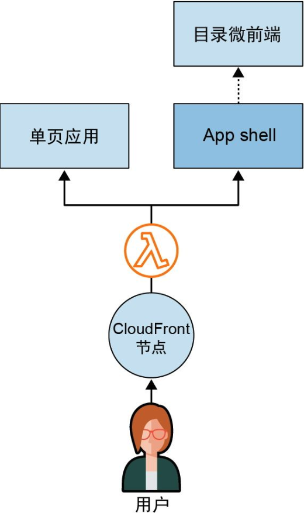

### 9.3 实现细节

#### 9.3.1 App Shell 职责

- 挂载和卸载微前端、初始化应用
- 存储和访问Web Storage中的数据
- 提供生命周期钩子
- 根据URL在微前端之间路由

#### 9.3.2 应用初始化

调用API查询云端的平台配置，该接口返回若干功能标识、带有若干接入点的服务字典和可挂载的微前端列表

1. 将配置挂在window对象上来暴露给微前端
2. 根据WebStorage中的token检查用户状态，并根据用户状态路由到正确的微前端

#### 9.3.3 通信

App Shell提供了一组API，用于微前端的数据存储、数据查询以及生命周期的处理：

1. 暴露生命周期钩子，用于进行资源清理和初始化
2. 封装Web Storage，前端不关心底层的实现
3. 微前端之间共享token、内存数据和Web Storage API
4. App Shell处理全局路由，挂载不同的微前端，而本地路由则由微前端自己管理

#### 9.3.4 后端集成

使用负载均衡将流量引到单体应用或微服务，这样客户端就不需要做太多改变。每次变更都在基础架构层实现，且新的 API 版本上线对于客户端是透明的。客户端将在运行时通过 App shell 查询配置以获取接入点列表，从而避免了在 JavaScript 代码库中进行硬编码

#### 9.3.5 在微前端中集成身份认证

使用 Web Storage 或查询字符串来传递持久化数据（如用户基础偏好）或临时数据（如产品ID）

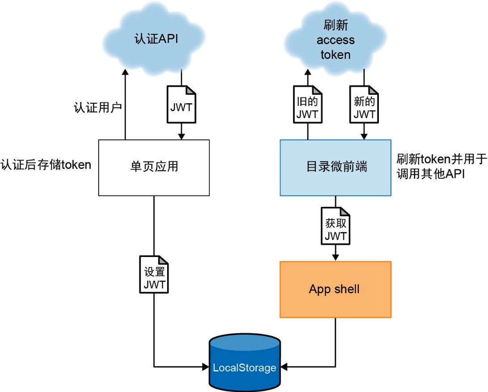

单页应用、App shell 和所有的微前端都必须在同一个子域中。LocalStorage 只能从同一个子域访问

#### 9.3.6 依赖项管理

使用相同版本的React与MboX，打包公共库并部署到用于所有产物的 S3 存储桶中，这个公共库不会经常变化，因此可以充分利用 CDN 缓存，其他想尝试新的公共库版本的团队可以很容易地为其微前端部署一个定制包，并与微前端的其他模块一起部署，用于替换公共版本

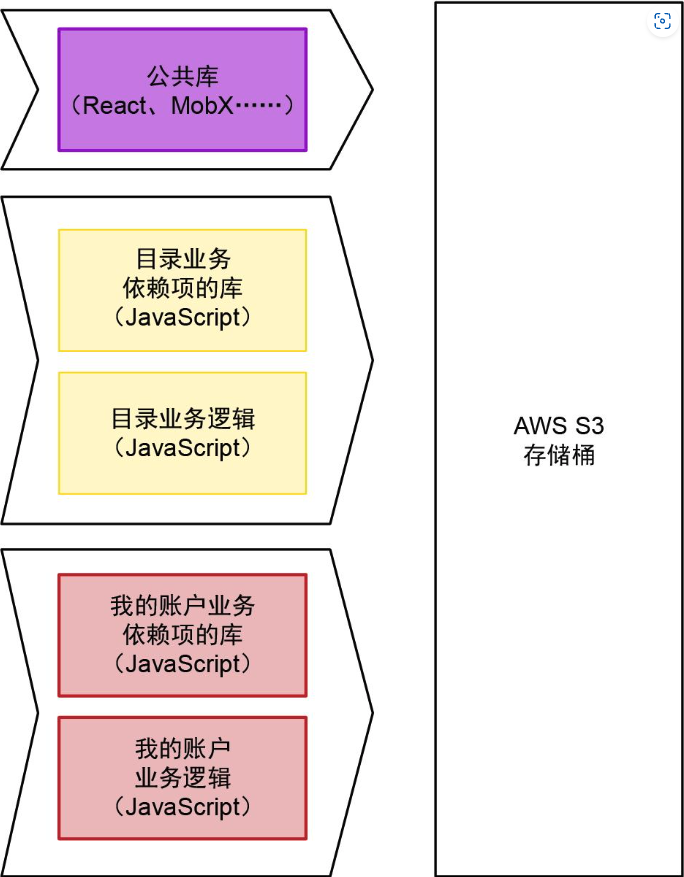

#### 9.3.7 整合设计竹编

在自动化流水线上使用适应度函数以强制验证每个微前端是否使用了最新版本的设计系统库

适应度函数会检查每个微前端项目的 package.json 中的设计系统的版本，将其与最新版本进行对比。如果发现版本过旧，就通过构建失败日志记录来通知相关的微前端团队项目没有创建成功的原因

#### 9.3.8 组件共享

组件是否可以被共享，主要是参考组件的复杂度和对组件的升级和更新方面的需求

每个团队内部创建的组件都不应该在多个微前端之间共享

#### 9.3.9 灰度发布

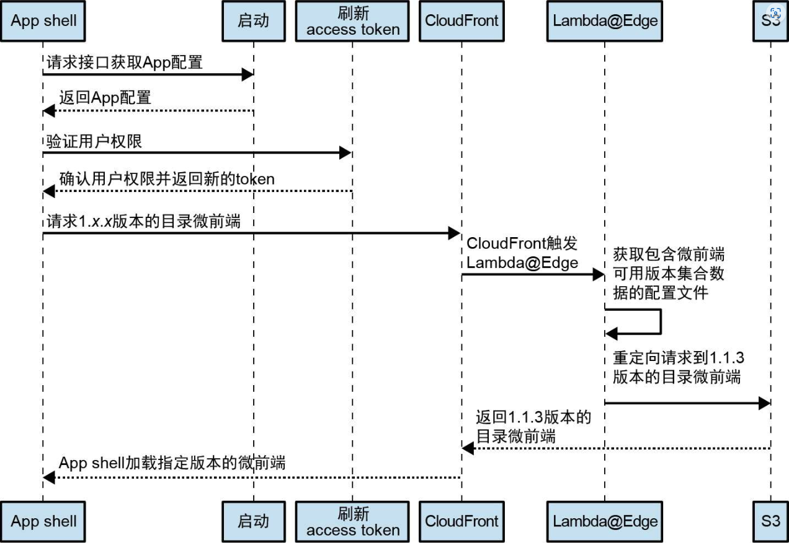

1. App shell 会首先从 API 中查询配置，配置中包含了可用的微前端版本的集合，其中只指定了主版本（如 1.x.x），只有当配置文件中出现了 API 的不兼容变更时，才会升级主版本
2. 当资源请求到达云端时，会触发 Lambda@Edge 去查询微前端可用的版本集合，然后流量被重定向到一个特定的版本，lambda 内部的逻辑会为每个用户关联一个从 1 到 100 的随机数。如果一个用户命中 20% 或 30% 的小流量，他就会被重定向到微前端的新版本，而所有数值高于 30% 的用户将看到以前的版本
3. lambda 返回所选模块并生成一个 cookie，存储与用户关联的随机值。如果用户重新访问平台，lambda 会验证请求微前端的规则，并根据配置中定义的流量模式判断是为用户提供相同版本的服务，还是不同版本的服务

#### 9.3.10 本地化

当微前端调用字典 API 时，必须在请求正文中传递子域信息以及与标签相关的语言和国家，以便在用户界面中显示它们。当收到请求时，微服务将根据用户的国家、语言和微前端子域从数据库中获取标签

## 第10章 在组织中引入微前端

在项目初期乃至项目的整个生命周期中，有很多需要我们考虑的和人有关的重要因素

### 10.1 我们为什么要使用微前端

不要提出一个只包含技术层面的解决方案，因为这可能会给组织留下很多需要应对的挑战

### 10.2 组织和软件架构之间的联系

没有完美的架构，只有适合某一场景的架构

业务是随着时间的推移而发展的，今天做出的结论放在明天不一定成立

#### 10.2.1 委员会是怎么出现的

康威定律（任何组织设计的系统架构都不可避免地反映了该组织的沟通结构）与逆康威策略：

- 理解设计活动和待设计系统的边界，这些边界是由发起人和世界的现实情况决定的
- 实现系统组织的初步概念，以便能够有意义地分配设计任务

> 康威所指的沟通途径是与代码本身相对应的。在单一的代码库上进行开发需要细粒度的沟通，但分布式团队只能进行粗粒度的沟通。在这种情况下，寻找机会将单体系统根据组织边界拆分开来，往往会展示出显著的优势

要想在不同用户路径之间有一个完美的划分是非常困难的

#### 10.2.2 功能团队与组件团队

**功能团队**，也被称为跨职能团队，它拥有提供特定功能所需的所有技能，当使用横向拆分的方式组织架构，且每个团队负责一个或多个微前端时，建议使用功能团队

**组件团队**，每个团队各自负责应用的一个特定的组件（纵向拆分的架构）

如果前端项目的代码库是跨平台共享的，那么**围绕功能来组织团队会是更好的选择**

**业务生命周期的不同阶段需要不同的团队结构**

### 10.3 优化沟通流程

#### 10.3.1 征求意见稿（RFC）

征求意见稿是一种成熟的方式，可以衡量一个组织内部对技术方案的修改、新技术和新实践的关注度

#### 10.3.2 架构决策记录（ADR）

有助于当前和后来的开发人员分享决策背景的另一个有用文档是架构决策记录（architecture decision record，ADR）。在这个文档中，架构师或技术负责人记录了特定架构实施背后的决策过程

### 10.4 优化沟通流程的技巧

如果不建立一个机制，让团队定期聚在一起分享知识、可能的解决方案和所遇到的挑战，那么我们就没有采用分布式办公

#### 10.4.1 倒推

一份倒推文件，即PR/FAQ（press release/frequently asked questions，新闻发布/常见问题），会长达6页：1 页的新闻稿和5页的常见问题

倒推法让你从未来 12 个月内想要达到的目标开始思考，迫使你从大处着眼，专注于终极目标和为实现这个目标应该做出的改变

PR部分会很好的运用讲故事的技巧，能让开发人员在写下一行代码之前感到兴奋并提高专注度

常见问题部分分两小节：

1. 基于客户可能对产品或功能提出的问题，读起来就像与新闻稿同时公开发布的产品文档一样
2. 包括内部利益相关者在产品开发过程中可能会提出的问题

PR/FAQ 的内容关注的是某一特定功能是如何让客户受益的，以及公司为什么应该在其系统中投入这样的产品或功能

使用 PR/FAQ 的**两个极有价值的好处**是**产生了简明的文档**并**促成了功能实现阶段前的初始合作**

#### 10.4.2 实践社群和集体会议

#### 10.4.3 管理外部依赖

### 10.5 去中 心化组织

在理想情况下，团队需要一定的自主权来完成工作，并能够尝试新实践和新技术。但是，事实并非总能如愿，现实情况往往取决于公司文化和个人的领导风格

决策去中心化并允许价值流内的团队拥有独立的决策路径可以授权技术团队在其所运行的庞大复杂的环境中以最佳方式展示自己

技术负责人的工作就变成了一种支持性工作，应该优化团队内部的工作流，在团队提出需求时提供条件或技术指导，推动技术边界与业务目标保持一致，以便团队知道如何实现这些目标

