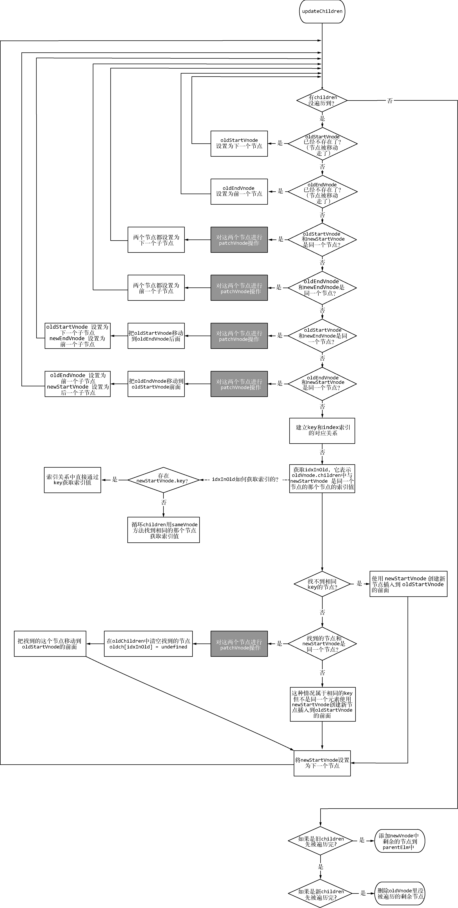
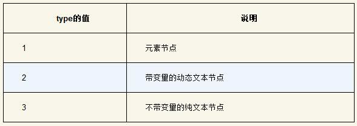
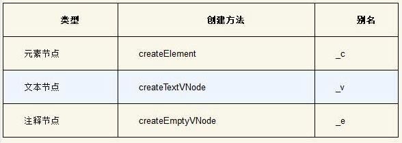
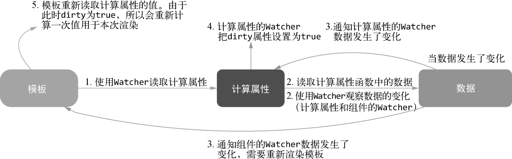
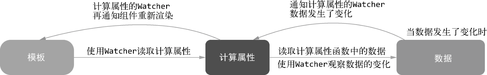
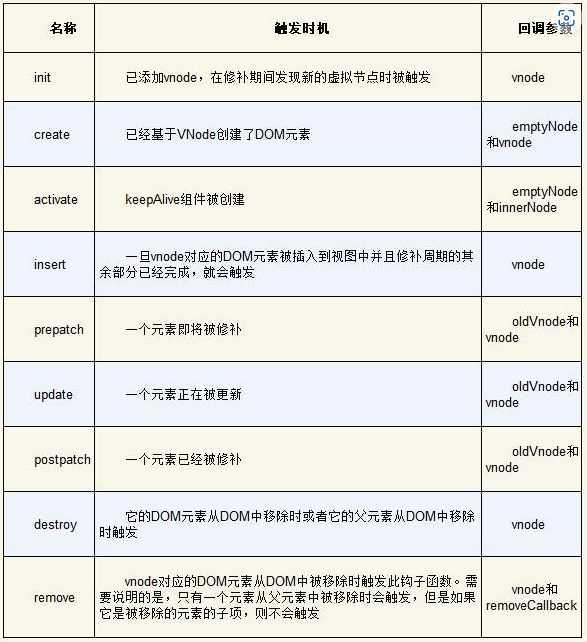

# 深入浅出Vue.js

## 第7章 patch



## 第10章 优化器

node节点的type取值



判断node是一个静态节点：

```javascript
01  function isStatic (node) {
02    if (node.type === 2) { // 带变量的动态文本节点
03      return false
04    }
05    if (node.type === 3) { // 不带变量的纯文本节点
06      return true
07    }
08    return !!(node.pre || (
09      !node.hasBindings && // 没有动态绑定
10      !node.if && !node.for && // 没有v-if或v-for或v-else
11      !isBuiltInTag(node.tag) && // 不是内置标签，也就是说标签名不能是slot或者component
12      isPlatformReservedTag(node.tag) && // 不是组件，即标签名必须是保留标签，例如<div></div>是保留标签，而<list></list>不是保留标签
13      !isDirectChildOfTemplateFor(node) && // 当前节点的父节点不能是带v-for指令的template标签
14      Object.keys(node).every(isStaticKey) // 节点中不存在动态节点才会有的属性，如果一个元素节点是静态节点，那么这个节点上的属性其实是有范围的。也就是说，如果这个节点是静态节点，那么它所有的属性都可以在这个范围内找到。这个范围是type、tag、attrsList、attrsMap、plain、parent、children、attrs、staticClass和staticStyle
15    ))
16  }
```

## 第11章 代码生成器



## 第13章 实例方法与全局API的实现原理

nextTick简易实现：

```javascript
const callbacks = [];
let pending = false;

function flushCallbacks() {
  pending = false;
  const copies = callbacks.slice(0);
  callbacks.length = 0;
  for (let i = 0; i < copies.length; i++) {
    copies[i]();
  }
}

let microTimerFunc;
let macroTimerFunc;
let useMacroTask = false;

if (typeof setImmediate !== 'undefined' && isNative(setImmediate)) {
  macroTimerFunc = () => {
    setImmediate(flushCallbacks);
  };
} else if (
  typeof MessageChannel !== 'undefined' &&
  (isNative(MessageChannel) ||
    MessageChannel.toString() === '[object MessageChannelConstructor]')
) {
  const channel = new MessageChannel();
  const port = channel.port2;
  channel.port1.onmessage = flushCallbacks;
  macroTimerFunc = () => {
    port.postMessage(1);
  };
} else {
  macroTimerFunc = () => {
    setTimeout(flushCallbacks, 0);
  };
}

if (typeof Promise !== 'undefined' && isNative(Promise)) {
  const p = Promise.resolve();
  microTimerFunc = () => {
    p.then(flushCallbacks);
  };
} else {
  microTimerFunc = macroTimerFunc;
}

export function withMacroTask(fn) {
  return (
    fn._withTask ||
    (fn._withTask = function () {
      useMacroTask = true;
      const res = fn.apply(null, arguments);
      useMacroTask = false;
      return res;
    })
  );
}

export function nextTick(cb, ctx) {
  let _resolve;
  callbacks.push(() => {
    if (cb) {
      cb.call(ctx);
    } else if (_resolve) {
      _resolve(ctx);
    }
  });
  if (!pending) {
    pending = true;
    if (useMacroTask) {
      macroTimerFunc();
    } else {
      microTimerFunc();
    }
  }
  if (!cb && typeof Promise !== 'undefined') {
    return new Promise(resolve => {
      _resolve = resolve;
    });
  }
}

```

Vue.extend实现

```javascript
let cid = 1;

Vue.extend = function (extendOptions) {
  extendOptions = extendOptions || {};
  const Super = this;
  const SuperId = Super.cid;
  const cachedCtors = extendOptions._Ctor || (extendOptions._Ctor = {});
  if (cachedCtors[SuperId]) {
    return cachedCtors[SuperId];
  }
  const name = extendOptions.name || Super.options.name;
  if (process.env.NODE_ENV !== 'production') {
    if (!/^[a-zA-Z][\w-]*$/.test(name)) {
      warn(
        'Invalid component name: "' +
          name +
          '". Component names ' +
          'can only contain alphanumeric characters and the hyphen, ' +
          'and must start with a letter.'
      );
    }
  }
  const Sub = function VueComponent(options) {
    this._init(options);
  };
  Sub.prototype = Object.create(Super.prototype);
  Sub.prototype.constructor = Sub;
  Sub.cid = cid++;

  Sub.options = mergeOptions(Super.options, extendOptions);
  Sub['super'] = Super;

  if (Sub.options.props) {
    initProps(Sub);
  }

  if (Sub.options.computed) {
    initComputed(Sub);
  }

  Sub.extend = Super.extend;
  Sub.mixin = Super.mixin;
  Sub.use = Super.use;

  // ASSET_TYPES = ['component', 'directive', 'filter']
  ASSET_TYPES.forEach(function (type) {
    Sub[type] = Super[type];
  });

  if (name) {
    Sub.options.components[name] = Sub;
  }

  Sub.superOptions = Super.options;
  Sub.extendOptions = extendOptions;
  Sub.sealedOptions = extend({}, Sub.options);

  // 缓存构造函数
  cachedCtors[SuperId] = Sub;
  return Sub;
};

```

## 第14章 生命周期

**生命周期图示**

 

- 初始化阶段：在Vue.js实例上初始化一些属性、事件以及响应式数据，如props、methods、data、computed、watch、provide和inject等
- 模板编译阶段：这个阶段的主要目的是将模板编译为渲染函数，只存在于完整版中
- 挂载阶段 & 已挂载阶段：Vue.js会将其实例挂载到DOM元素上，即将模板渲染到指定的DOM元素中，在挂过程中以及已挂载状态下，Vue.js都会持续追踪状态的变化
- 卸载阶段：应用调用vm.$destroy方法后，Vue.js的生命周期会进入卸载阶段，Vue.js会将自身从父组件中删除，取消实例上所有依赖的追踪并且移除所有的事件监听器

**new Vue()做了什么**


关于事件：

> 如果v-on写在组件标签上，那么这个事件会注册到子组件Vue.js事件系统中；如果是写在平台标签上，例如div，那么事件会被注册到浏览器事件中

### 14.6 inect/provider

> Reflect.ownKeys有一个特点，它可以返回所有自有属性的键名，其中**字符串类型和Symbol类型都包含在内**。而Object.getOwnPropertyNames和Object.keys返回的结果不会包含Symbol类型的属性名，Object.getOwnPropertySymbols方法又只返回Symbol类型的属性

### 14.7 初始化状态

```javascript
export function initState(vm) {
  vm._watchers = [];
  const opts = vm.$options;
  if (opts.props) initProps(vm, opts.props);
  if (opts.methods) initMethods(vm, opts.methods);
  if (opts.data) {
    initData(vm);
  } else {
    observe((vm._data = {}), true /* asRootData */);
  }
  if (opts.computed) initComputed(vm, opts.computed);
  if (opts.watch && opts.watch !== nativeWatch) {
    initWatch(vm, opts.watch);
  }
}
```


#### 14.7.1 初始化props

> props的实现原理大体上是这样的：父组件提供数据，子组件通过props字段选择自己需要哪些内容，Vue.js内部通过子组件的props选项将需要的数据筛选出来之后添加到子组件的上下文中
>
> 子组件被实例化时，会先对props进行规格化处理，**规格化之后的props为对象的格式**

#### 14.7.2 初始化methods

#### 14.7.3 初始化data

#### 14.7.4 初始化computed

> computed是定义在vm上的一个特殊的getter方法。之所以说特殊，是因为在vm上定义getter方法时，get并不是用户提供的函数，而是Vue.js内部的一个代理函数。在代理函数中可以结合Watcher实现缓存与收集依赖等功能
>
> 当计算属性中的内容发生变化后，计算属性的Watcher与组件的Watcher都会得到通知。计算属性的Watcher会将自己的dirty属性设置为true，当下一次读取计算属性时，就会重新计算一次值。然后组件的Watcher也会得到通知，从而执行render函数进行重新渲染的操作。由于要重新执行render函数，所以会重新读取计算属性的值，这时候计算属性的Watcher已经把自己的dirty属性设置为true，所以会重新计算一次计算属性的值，用于本次渲染。
>
> 简单来说，计算属性会通过Watcher来观察它所用到的所有属性的变化，当这些属性发生变化时，计算属性会将自身的Watcher的dirty属性设置为true，说明自身的返回值变了



> 如果是在模板中读取计算属性，那么使用组件的Watcher观察计算属性中用到的所有数据的变化。如果是用户自定义的watch，那么其实是使用用户定义的Watcher观察计算属性中用到的所有数据的变化。其区别在于当计算属性函数中用到的数据发生变化时，向谁发送通知

实现

```typescript
const computedWatcherOptions = { lazy: true };

function initComputed(vm, computed) {
  const watchers = (vm._computedWatchers = Object.create(null));
  // 计算属性在SSR环境中，只是一个普通的getter方法
  const isSSR = isServerRendering();

  for (const key in computed) {
    const userDef = computed[key];
    const getter = typeof userDef === 'function' ? userDef : userDef.get;
    if (process.env.NODE_ENV !== 'production' && getter == null) {
      warn(`Getter is missing for computed property "${key}".`, vm);
    }

    // 在非SSR环境中，为计算属性创建内部观察器
    if (!isSSR) {
      watchers[key] = new Watcher(
        vm,
        getter || noop,
        noop,
        computedWatcherOptions
      );
    }

    if (!(key in vm)) {
      defineComputed(vm, key, userDef);
    } else if (process.env.NODE_ENV !== 'production') {
      if (key in vm.$data) {
        warn(`The computed property "${key}" is already defined in data.`, vm);
      } else if (vm.$options.props && key in vm.$options.props) {
        warn(
          `The computed property "${key}" is already defined as a prop.`,
          vm
        );
      }
    }
  }
}

const sharedPropertyDefinition = {
  enumerable: true,
  configurable: true,
  get: noop,
  set: noop,
};

export function defineComputed(target, key, userDef) {
  const shouldCache = !isServerRendering();
  if (typeof userDef === 'function') {
    sharedPropertyDefinition.get = shouldCache
      ? createComputedGetter(key)
      : userDef;
    sharedPropertyDefinition.set = noop;
  } else {
    sharedPropertyDefinition.get = userDef.get
      ? shouldCache && userDef.cache !== false
        ? createComputedGetter(key)
        : userDef.get
      : noop;
    sharedPropertyDefinition.set = userDef.set ? userDef.set : noop;
  }
  if (
    process.env.NODE_ENV !== 'production' &&
    sharedPropertyDefinition.set === noop
  ) {
    sharedPropertyDefinition.set = function () {
      warn(
        `Computed property "${key}" was assigned to but it has no setter.`,
        this
      );
    };
  }
  Object.defineProperty(target, key, sharedPropertyDefinition);
}

function createComputedGetter(key) {
  return function computedGetter() {
    const watcher = this._computedWatchers && this._computedWatchers[key];
    if (watcher) {
      if (watcher.dirty) {
        watcher.evaluate();
      }
      if (Dep.target) {
        watcher.depend();
      }
      return watcher.value;
    }
  };
}

```

**以上是2.5.2版本中的实现，在2.5.17版本中，对计算属性的实现方式做了一个改动：**

*组件的Watcher不再观察计算属性用到的数据的变化，而是让计算属性的Watcher得到通知后，计算一次计算属性的值，如果发现这一次计算出来的值与上一次计算出来的值不一样，再去主动通知组件的Watcher进行重新渲染操作*



**注意：** *如果是在模板中读取计算属性，那么使用组件的Watcher观察计算属性的Watcher；如果是用户使用vm.$watch定义的Watcher，那么其实是使用用户定义的Watcher观察计算属性的Watcher*

```javascript
function createComputedGetter(key) {
  return function computedGetter() {
    const watcher = this._computedWatchers && this._computedWatchers[key];
    if (watcher) {
      watcher.depend();
      return watcher.evaluate();
    }
  };
}

export default class Watcher {
  constructor(vm, expOrFn, cb, options) {
    // 隐藏无关代码

    if (options) {
      this.computed = !!options.computed;
    } else {
      this.computed = false;
    }

    this.dirty = this.computed;

    if (this.computed) {
      this.value = undefined;
      this.dep = new Dep();
    } else {
      this.value = this.get();
    }
  }

  update() {
    if (this.computed) {
      // 依赖不存在时，将dirty设置为true，lazy模式
      if (this.dep.subs.length === 0) {
        this.dirty = true;
      }
      // 依赖存在时，主动发送通知，activated模式
      // 大部分情况下都是有依赖的，这个依赖有可能是组件的Watcher，这取决于谁读取了计算属性
      else {
        this.getAndInvoke(() => {
          this.dep.notify();
        });
      }
    }
    // 隐藏无关代码
  }

  // 对比计算属性新旧返回值
  getAndInvoke(cb) {
    const value = this.get();
    if (value !== this.value || isObject(value) || this.deep) {
      const oldValue = this.value;
      this.value = value;
      this.dirty = false;
      if (this.user) {
        try {
          cb.call(this.vm, value, oldValue);
        } catch (e) {
          handleError(e, this.vm, `callback for watcher "${this.expression}"`);
        }
      } else {
        cb.call(this.vm, value, oldValue);
      }
    }
  }

  evaluate() {
    if (this.dirty) {
      this.value = this.get();
      this.dirty = false;
    }
    return this.value;
  }

  depend() {
    if (this.dep && Dep.target) {
      this.dep.depend();
    }
  }
}
```

#### 14.7.5 初始化watch

### 15.3 虚拟DOM钩子函数



## 第17章

### 17.10 单文件组件如何命名

> 单文件组件的文件名应该**始终是单词首字母大写（PascalCase）**，或者始终是横线连接的（kebab-case）
>
> **单词首字母大写**对于代码编辑器的自动补全最为友好，因为这会使JS(X)和模板中引用组件的方式尽可能一致
>
> 组件名应该倾向于**完整单词**而不是缩写
>
> 组件名应该始终由**多个单词组成**，但是**根组件App除外**
>
> 在**单文件组件**和字符串模板中的组件名应该总是**单词首字母大写**，但是在DOM模板中总是横线连接的
>
> JS/JSX中的组件名应该始终是**单词首字母大写的**
>
> 在**单文件组件**、字符串模板和JSX中，**没有内容的组件应该是自闭合的**，但在DOM模板中永远不要这样做
>
> 在声明prop的时候，其**命名**应该始终**使用驼峰式命名规则**，而在**模板和JSX**中应该始终**使用横线连接的方式**

