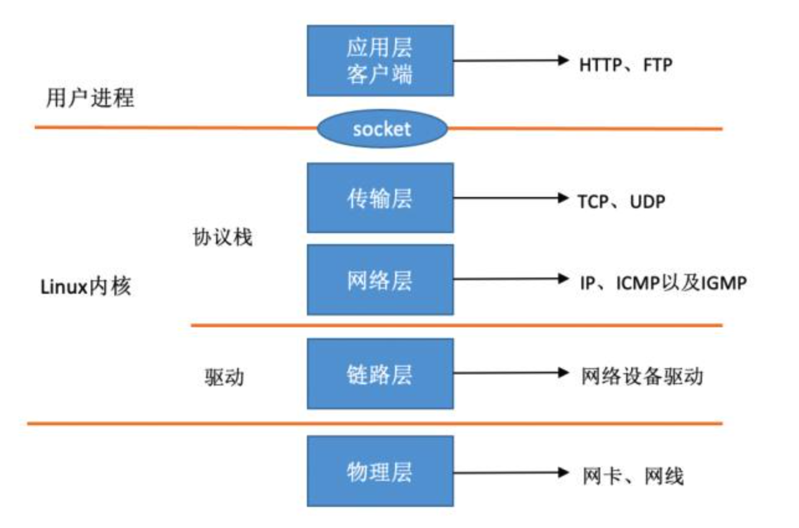
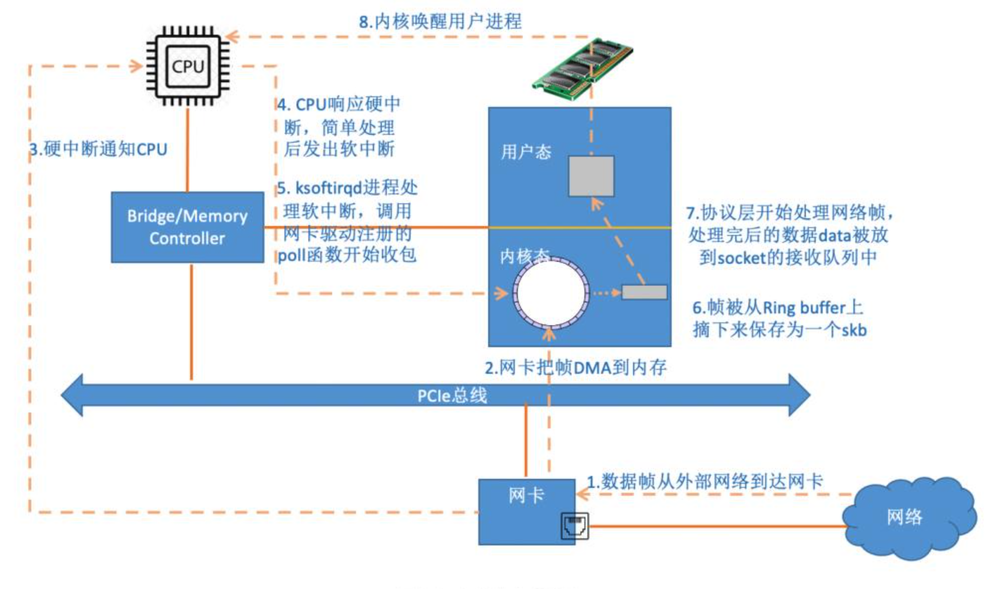

# 深入理解Linux网络

## 一、绪论

## 二、内核是如何接收网络包的

### 2.1 相关实际问题

1. RingBuffer到底是啥，RingBuffer为啥会丢包？
2. 网络相关的硬中断、软中断都是啥？
3. Linux里的ksoftirqd内核线程是干啥的？`ps -ef | grep ksoftirqd`
4. 为啥网卡开启多队列能提升网络性能？
5. tcpdump是如何工作的？
6. iptable/netfilter是在哪一层实现的？
7. tcpdump能否抓到被iptable封禁的包？
8. 网络接收过程中的CPU开销如何查看？
9. DPDK是神马神器？

### 2.2 数据是如何从网卡到协议栈的

#### 2.2.1 Linux网络收包总览

在 TCP/IP ⽹络分层模型⾥，整个协议栈被分成了**物理层、链路层、⽹络层，传输层和应⽤层**

Linux 内核以及⽹卡驱动主要实现**链路层、⽹络层和传输层**这三层。内核对更上层的应⽤层提供 **socket 接⼝**来供⽤户进程访问

内核和⽹络设备驱动是通过**中断**的⽅式来处理的

Linux 中断处理函数是分上半部和下半部的。上半部是只进⾏最简单的⼯作，快速处理然后释放 CPU ，接着 CPU 就可以允许其它中断进来。剩下将绝⼤部分的⼯作都放到下半部中，可以慢慢从容处理。2.4 以后的内核版本采⽤的下半部实现⽅式是**软中断**，由 **ksoftirqd 内核线程全权处理**。**硬中断**是通过给 CPU 物理引脚施加电压变化，⽽软中断是通过给内存中的⼀个变量的⼆进制值以标记有软中断发⽣

*硬中断与中断处理函数是怎么关联起来的？*

#### 2.2.2 Linux启动

##### 创建ksoftirqd内核线程

Linux 的软中断都是在专⻔的内核线程（ksoftirqd）中进⾏的，**该进程的数量等于机器的核数**

##### 网络子系统初始化

